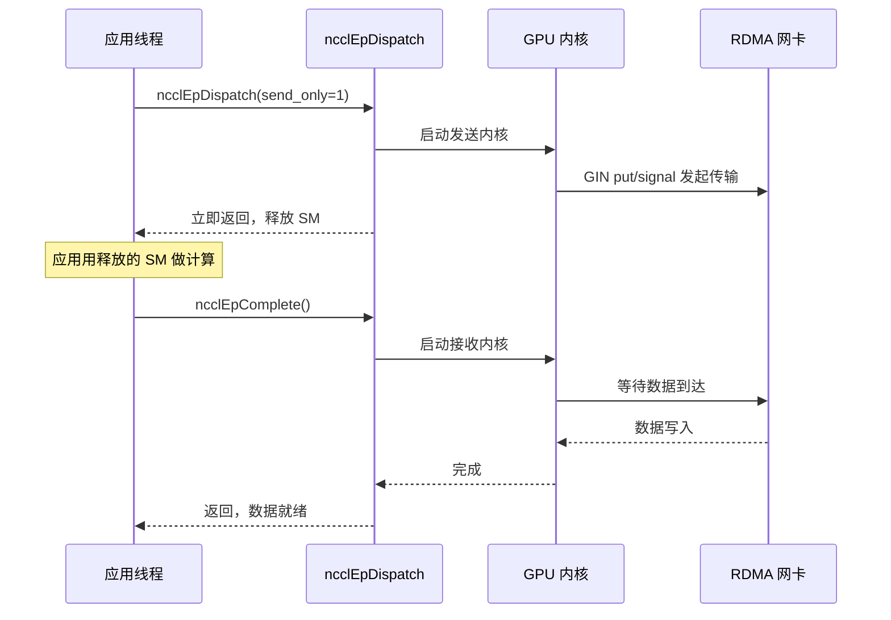
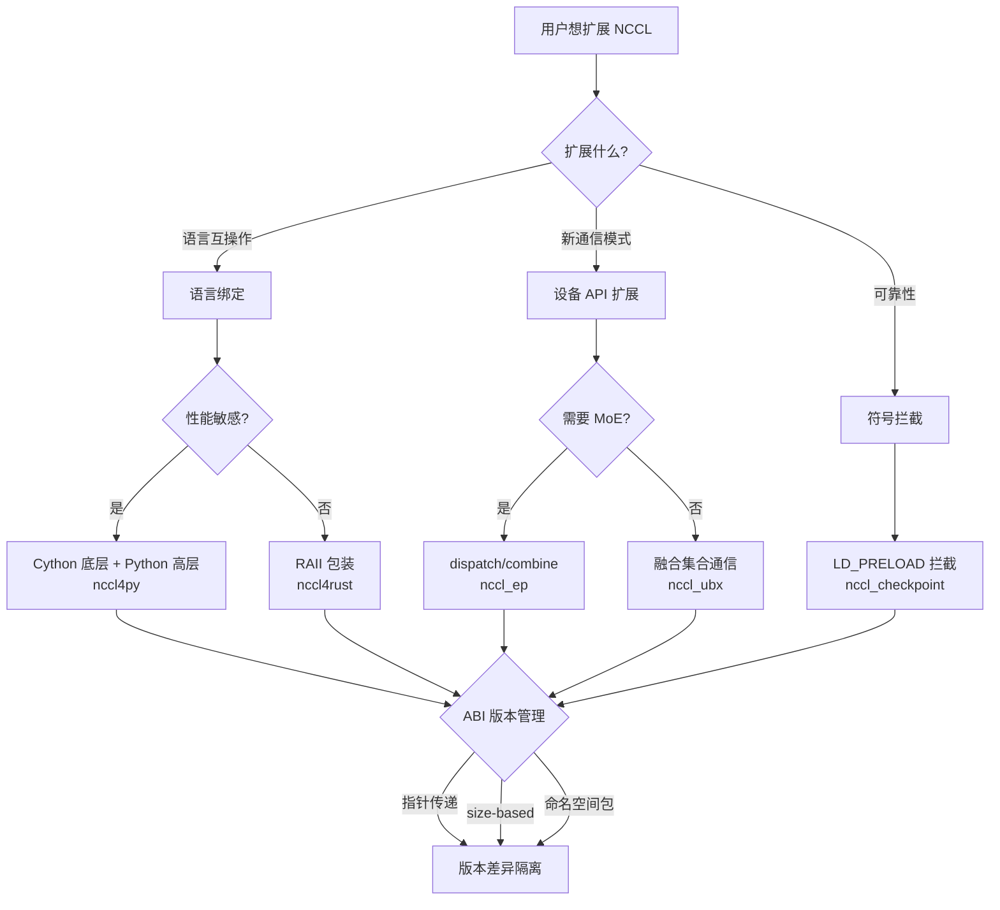

# Chapter 23: Ecosystem Extensions: nccl4py, nccl4rust, nccl_ep & nccl_ubx Bindings


上一章我们排查了 NCCL 在生产环境中的典型故障——group 语义误用、rank 数不匹配、stream 交互、ABI 版本冲突以及网络超时。这些问题大多发生在直接使用 C ABI 的场景中，而现代大模型训练框架往往不直接调用 C ABI，而是通过 Python、Rust 等语言绑定，或借助针对 MoE、超带宽通信等场景的扩展项目来复用 NCCL 的能力。这些周边项目放在 bindings/ 和 contrib/ 目录下，定位是实验性、社区维护，不继承核心库的发布质量保证。本章逐一剖析 nccl4py、nccl4rust、nccl_ep、nccl_ubx 和 nccl_checkpoint，看它们如何通过语言绑定、设备 API 扩展和符号拦截三条路径，在核心之外构建起丰富的生态。

## nccl4py：Cython 绑定与命名空间包设计

### Intuitive Architectural Model：把 C ABI 翻译成 Python 能懂的话

想象 NCCL 核心是一个只会说 C 语言的外交官，而 Python 训练脚本是一个只会说 Python 的实习生。nccl4py 就是那个翻译官——它不改变外交官说的话（NCCL 的行为），只是把「`ncclAllReduce(sendbuff, recvbuff, count, ...)`」翻译成「`nccl.all_reduce(tensor)`」。如果没有这层翻译，每个 Python 框架都得自己写 ctypes 绑定，重复劳动且容易出错。

### 分层结构：Cython 底层 + Python 高层

nccl4py 的设计是两层：底层是 Cython 绑定（`nccl/bindings/cynccl.pxd`），高层是 Python API（`nccl.core`）。README 里明确说了这个分层 [FACT:bindings/nccl4py/README.md:4-4]：

> `nccl4py provides low-level Cython bindings and a high-level Python API`

Cython 绑定以 `.pxd` 文件形式随 wheel 分发，供其他 Cython 扩展直接 `cimport` [FACT:bindings/nccl4py/README.md:39-43]：

```cython
from nccl.bindings cimport cynccl
```

[INFERENCE] 为什么要暴露 Cython 层而不只是 Python 层？因为有些框架（比如 DeepSpeed、Megatron）的核心循环在 Cython 里，每次调用都走 Python 解释器开销太大。直接 `cimport cynccl` 可以让 Cython 扩展以接近 C 的零开销调用 NCCL 函数。这是「分层暴露」的典型设计——高层给普通用户，底层给性能敏感场景。

### 命名空间包：多个发行版共享 `nccl` 前缀

这是 nccl4py 最巧妙的设计。`nccl` 是一个 PEP 420 隐式命名空间包 [FACT:bindings/nccl4py/README.md:50-51]：

> `nccl` is a PEP 420 implicit namespace package. nccl4py provides `nccl.bindings` and `nccl.core`; other NCCL extension distributions can provide additional `nccl.*` subpackages.

[INFERENCE] 传统 Python 包里，`nccl/__init__.py` 会「拥有」整个 `nccl` 命名空间。如果 nccl4py 和 nccl_ep 的 Python 绑定都想提供 `nccl.xxx`，就会冲突——谁先安装谁赢。PEP 420 命名空间包解决了这个问题：没有 `__init__.py`，多个发行版可以各自往 `nccl/` 目录里放子包，Python 导入系统会把它们合并。所以 nccl4py 提供 `nccl.bindings` 和 `nccl.core`，nccl_ep 提供 `nccl.ep`，两者可以共存 [FACT:contrib/nccl_ep/README.md:80-82]。

这个设计对Surrounding Ecosystem & Multi-Language Bindings至关重要：未来任何第三方想加 `nccl.monitoring`、`nccl.profiling`，都不需要改 nccl4py 的代码。

### CUDA 版本选择：extra 机制

安装时用 `nccl4py[cu12]` 或 `nccl4py[cu13]` 选择 CUDA 大版本 [FACT:bindings/nccl4py/README.md:13-17]。README 解释了原因：extras 会安装对应的 NCCL runtime 和 CUDA Python 依赖 [FACT:bindings/nccl4py/README.md:19]。已发布的 wheel 不需要 `CUDA_HOME` 或本地 CUDA Toolkit，但从源码编译需要 [FACT:bindings/nccl4py/README.md:20-21]。

[INFERENCE] 这是 Python 生态处理 CUDA 版本碎片化的标准做法。CUDA 12 和 13 的 ABI 不兼容，不能用一个 wheel 通吃。用 extra 让 pip 根据用户环境选择正确的二进制依赖，避免了运行时才发现版本不匹配。

### 生产避坑

**坑一：命名空间包与 `__init__.py` 冲突。** 如果某个第三方包在 `nccl/` 下放了 `__init__.py`，PEP 420 命名空间包机制会被破坏，导致 `nccl.core` 导入失败。排查方法：`python -c "import nccl; print(nccl.__path__)"`，如果报 `AttributeError` 说明 `nccl` 不是命名空间包。

**坑二：Cython ABI 版本漂移。** `cynccl.pxd` 是实验性 API [FACT:bindings/nccl4py/README.md:32-32]，NCCL 升级时 `.pxd` 可能变。依赖 `cimport cynccl` 的 Cython 扩展必须和 nccl4py 版本严格匹配，否则编译期符号解析失败。

## nccl4rust：RAII 所有权与设备侧边界

### Intuitive Architectural Model：让编译器帮你管生命周期

C 语言里，你 `ncclCommInitRank` 拿到一个 communicator，用完必须 `ncclCommDestroy`。忘了销毁就泄漏，提前销毁就崩溃。Rust 的 RAII（Resource Acquisition Is Initialization）机制让编译器在变量离开作用域时自动调用析构函数——就像酒店房卡，你退房时系统自动结算，不用手动去前台。

nccl4rust 的核心价值就是把这套所有权语义套在 NCCL 的 C ABI 上。

### 分层结构：五个 crate 各司其职

README 的 Layout 表格列出了五个 crate [FACT:contrib/nccl4rust/README.md:20-28]：

| Path | Purpose |
|---|---|
| `crates/nccl-sys` | bindgen 生成的原始 host ABI |
| `crates/nccl` | Rust 风格 host 包装 + RAII 所有权 |
| `crates/nccl-device-sys` | `no_std` CUDA-Oxide 设备声明 |
| `crates/nccl-device` | 类型化 `DevComm`、`Team`、`Window` 包装 |
| `shim/` | 纯 C-ABI 垫片，只用公开头文件 |

[INFERENCE] 这个拆分是刻意的。README 解释了动机 [FACT:contrib/nccl4rust/README.md:30-32]：host 应用可以只用 `nccl` 而不需要 Rust GPU 编译器；CUDA-Oxide 内核用 `nccl-device`；需要原始 ABI 的消费者可以选 `-sys` crate。这种「按需分层」让不同用户只付自己需要的编译成本。

### 关键设计：用指针而非值传递设备通信器

这是 nccl4rust 最值得学习的设计决策。README 的 Host/device ownership boundary 一节 [FACT:contrib/nccl4rust/README.md:211-219]：

> `ncclDevCommCreate` produces a versioned public structure in host memory. The host `DeviceCommunicator` wrapper owns that structure and destroys it before its parent communicator. CUDA-Oxide remains responsible for allocating device memory, copying those bytes, and keeping the copy alive while kernels execute. Kernels construct `nccl_device::DevComm` from a pointer to that device copy. Using a pointer rather than a by-value Rust mirror keeps the versioned C struct layout out of the kernel argument ABI.

[INFERENCE] 为什么不用 Rust 结构体镜像 C 结构体？因为 `ncclDevComm_t` 是版本化的——不同 NCCL 版本字段可能不同。如果内核参数按值传递 Rust 镜像，那么内核 ABI 就绑定了特定 NCCL 版本的结构体布局。一旦 NCCL 升级结构体，所有已编译的内核都要重编。用指针传递则只传一个地址，内核通过指针访问，布局变化不影响 ABI。这和上一章讲的 `ncclEpLayoutInfo_t` 的 size-based ABI 是同一个思路——**把版本差异隔离在指针背后**。

### 安全边界：哪些是 unsafe 的

README 的 Current API contracts 一节列了六条契约 [FACT:contrib/nccl4rust/README.md:230-249]，其中关键几条：

- 原始 `-sys` crate 只镜像 C ABI，不加所有权或生命周期校验 [FACT:contrib/nccl4rust/README.md:232-233]
- 当前集合通信和点对点包装接受原始设备指针，声明为 `unsafe` [FACT:contrib/nccl4rust/README.md:42-45]
- 指针翻译方法返回原始设备指针，无法校验偏移边界、对齐、peer 成员关系、别名或窗口生命周期 [FACT:contrib/nccl4rust/README.md:242-244]

[INFERENCE] 这是 Rust 绑定 NCCL 的根本困难：NCCL 的很多 API 契约是「缓冲区必须在 CUDA stream 完成前保持有效」，但 Rust 的类型系统无法表达「stream 完成」这个异步事件。所以这些方法只能是 `unsafe`，把责任交回调用者。README 也指出了改进方向 [FACT:contrib/nccl4rust/README.md:44-45]：一个 stream-aware 的缓冲区抽象可以把这些要求编码进安全 API。这是未来工作。

### 设备侧：CUDA-Oxide 与 LTOIR 垫片

设备侧的核心挑战是：NCCL 的设备 API 是 C++ 模板，而 Rust 设备代码（CUDA-Oxide）需要 C ABI。解决方案是一个 C++ 垫片 [FACT:contrib/nccl4rust/README.md:26]：

> `shim/` — CUDA C++ C-ABI shim built exclusively from public `nccl.h` and `nccl_device.h`

垫片编译成 LTOIR（LLVM 中间表示），和 Rust PTX 一起链接成 cubin [FACT:contrib/nccl4rust/README.md:165-167]。README 说明了构建流程 [FACT:contrib/nccl4rust/README.md:158-163]：

```bash
make device \
  NCCL_INCLUDE_DIR="$NCCL_INCLUDE_DIR" \
  CUDA_HOME="$CUDA_HOME" \
  ARCH=90
```

[INFERENCE] LTOIR 是 NVIDIA 的链接时优化中间格式。用 LTOIR 而非直接编译成 cubin，是为了让垫片和 Rust 内核在链接期做跨语言优化——比如内联垫片函数到 Rust 内核里。这是「C++ 模板 + Rust 内核」混合编程的关键技术。

### 生产避坑

**坑一：NCCL 版本必须精确匹配。** README 明确要求 `Matching NCCL 2.31 headers and runtime` [FACT:contrib/nccl4rust/README.md:80-81]，因为原型直接初始化了早期 NCCL 设备 API 版本中不同的字段。头文件和 `libnccl.so` 版本不一致会导致设备通信器字段错位。

**坑二：CUDA graph 与设备通信器。** 设备通信器是 host 内存里的版本化结构，拷贝到设备后内核通过指针访问。如果 CUDA graph 捕获时把设备指针烘焙进内核参数，之后重新创建通信器会导致 graph 里的指针失效。这和 nccl_ep 的 RDMA buffer 重分配问题同源。

**坑三：安全初始化不能和原始 group 混用。** README 警告 [FACT:contrib/nccl4rust/README.md:238-239]：安全初始化和产生输出的管理调用不能和原始 `nccl-sys` group 状态混用，因为包装层观察不到原始 group 状态。混用会导致包装层的轮询逻辑和原始 group 语义冲突。

## nccl_ep：专家并行的 dispatch/combine 原语

### Intuitive Architectural Model：MoE 的「分拣中心」

MoE（Mixture of Experts）模型里，每个 token 要被路由到 top-k 个专家。专家分布在不同 GPU 上，所以 token 需要跨 GPU 传输——这就是 dispatch。专家算完后，结果要送回原 token 所在的 GPU——这就是 combine。nccl_ep 就是这套「分拣中心」的通信引擎。

如果没有它，每个 MoE 框架都得自己实现 dispatch/combine 的通信逻辑，重复且难以优化。nccl_ep 把它做成 NCCL 生态里的标准原语。

### 两种算法：LL 与 HT

README 说明了两种算法 [FACT:contrib/nccl_ep/README.md:36-40]：

- **Low-Latency (LL)**：小 batch、延迟敏感（LLM 推理）。用直接点对点 all-to-all 通信。
- **High-Throughput (HT)**：大 batch 训练和推理预填充。用分层通信——节点内 NVLink 聚合，节点间 RDMA。利用 Hopper 的 warp-specialized pipeline 和 TMA。

[INFERENCE] 这两种算法的分野反映了 MoE 推理和训练的不同瓶颈。推理时 batch 小，延迟是主要矛盾，所以 LL 用直接点对点避免聚合开销。训练时 batch 大，带宽是主要矛盾，所以 HT 用分层聚合减少跨节点流量。这是典型的「按工作负载特征选算法」设计。

### 核心数据结构：ncclEpGroupConfig_t

这是 EP 的配置结构，字段很多 [FACT:contrib/nccl_ep/README.md:339-362]。关键字段：

- `size` 和 `version`：ABI 版本检查，和上一章讲的 size-based ABI 同源 [FACT:contrib/nccl_ep/README.md:340-341]
- `algorithm`：HT 或 LL [FACT:contrib/nccl_ep/README.md:342]
- `max_dispatch_tokens_per_rank`：单 rank 最多 dispatch 的 token 数 [FACT:contrib/nccl_ep/README.md:344]
- `rdma_buffer_size`：LL 模式的 RDMA 缓冲区大小 [FACT:contrib/nccl_ep/README.md:356-356]
- `alloc`：自定义设备内存分配器 [FACT:contrib/nccl_ep/README.md:359]

[INFERENCE] `rdma_buffer_size` 的 `NCCL_EP_AUTO` 语义值得深挖。README 解释 [FACT:contrib/nccl_ep/README.md:396-406]：AUTO 模式下缓冲区不在 `ncclEpCreateGroup` 时分配，而是第一次 `ncclEpInitHandle` 时按实际 `(layout, num_topk)` 分配。后续 handle 需要更大缓冲区时会集体重分配。这个「惰性分配」设计避免了用户猜测缓冲区大小，但引入了三个约束 [FACT:contrib/nccl_ep/README.md:396-406]：

1. 所有 rank 必须用相同 `(layout, num_topk)` 同步调用 `ncclEpInitHandle`
2. 重分配会丢弃旧缓冲区内容，`send_only` 暂存的数据会丢失
3. CUDA graph 捕获会烘焙 RDMA 基址指针，重分配后必须重新捕获

**这是本章最重要的生产陷阱之一。** 惰性分配换来了易用性，但把「何时重分配」的复杂度转嫁给了用户。

### 张量描述符：静态与动态两种形态

`ncclEpTensor_t` 是轻量值类型 [FACT:contrib/nccl_ep/README.md:310-332]。README 展示了两种用法：

**静态描述符**（栈上，`NCCL_EP_TENSOR_INIT_INLINE`）[FACT:contrib/nccl_ep/README.md:806-809]：

```c
ncclEpTensor_t expert_counters = { NCCL_EP_TENSOR_INIT_INLINE,
                                   .ndim = 1, .datatype = ncclInt32,
                                   .data = expert_counters_data,
                                   .sizes = expert_counters_dims };
```

**动态描述符**（堆上，`ncclEpTensorAlloc`）[FACT:contrib/nccl_ep/README.md:793-798]：

```c
ncclEpTensor_t* topk_idx = nullptr;
{
    size_t dims[2] = { num_tokens, top_k };
    ncclEpTensorAlloc(&topk_idx, 2, ncclInt64, dims, /*config=*/NULL);
    cudaMalloc(&topk_idx->data, num_tokens * top_k * sizeof(int64_t));
}
```

[INFERENCE] 两种形态的区别在 `sizes` 数组的所有权。静态描述符的 `sizes` 是调用者拥有的栈数组，必须活得比描述符久 [FACT:contrib/nccl_ep/README.md:325-326]。动态描述符的 `sizes` 是库拥有的堆拷贝，由 `ncclEpTensorDestroy` 释放 [FACT:contrib/nccl_ep/README.md:514-514]。公共结构体持有 `ncclEpTensor_t*` 指针，所以两种形态可以在同一个调用里混用 [FACT:contrib/nccl_ep/README.md:514-514]。这个设计让简单场景零堆分配，复杂场景有库管理便利。

### 执行模式：同步与分阶段

README 的 Execution Modes 一节 [FACT:contrib/nccl_ep/README.md:701-741] 说明了两种模式：

**同步模式**（默认）：整个操作期间占用 GPU 资源，包括等待数据接收的时间 [FACT:contrib/nccl_ep/README.md:705-709]。

**分阶段模式**（仅 LL）：操作拆成 send 和 receive 两阶段 [FACT:contrib/nccl_ep/README.md:718-726]。用 `send_only = 1` 发起，数据传输启动后释放 GPU 资源，应用可以用这些资源做计算，最后用 `ncclEpComplete` 完成 [FACT:contrib/nccl_ep/README.md:728-741]。



这张时序图展示了分阶段模式的核心价值：`send_only` 发起后立即返回，SM 资源被释放给计算，等应用做完其他工作再调 `ncclEpComplete` 等待接收完成。这是「计算-通信重叠」的经典模式。

### 生产避坑

**坑一：`ncclEpInitHandle` 的条件集体性。** AUTO 模式下，`ncclEpInitHandle` 是条件集体调用 [FACT:contrib/nccl_ep/README.md:396-406]。如果某个 rank 因为 layout 不同触发了重分配，其他 rank 必须同步参与。不同步会导致死锁或数据错乱。

**坑二：CUDA graph 捕获期间禁止 `ncclEpInitHandle`。** README 明确警告 [FACT:contrib/nccl_ep/README.md:396-406]：AUTO 模式下不能在 `cudaStreamBeginCapture` 和 `cudaStreamEndCapture` 之间调用 `ncclEpInitHandle`。因为重分配会改变 RDMA 基址，而 graph 捕获已经烘焙了旧指针。

**坑三：guard 开销。** README 提到 [FACT:contrib/nccl_ep/README.md:299-303]：EP 默认给内部通信缓冲区加 guard，防止相邻 dispatch/combine 调用互相破坏数据。高级用户如果已保证连续操作不会竞争，可以用 `NCCL_EP_DISABLE_GUARD=1` 关闭以回收开销。但关错了会导致数据静默损坏。

## nccl_ubx：融合集合通信与对称分配器

### Intuitive Architectural Model：把「搬家前后的打包拆包」也交给搬家公司

普通集合通信只负责搬数据。但实际模型里，AllReduce 之前往往要做残差加法，之后要做 RMSNorm。如果这些操作分开做，数据要在显存里多走几趟。nccl_ubx 的思路是：把残差加法、RMSNorm、mxfp8 量化都融合进集合通信内核 [FACT:contrib/nccl_ubx/README.md:6-9]。就像搬家公司不仅搬箱子，还帮你打包和拆包，一趟搞定。

### 硬件前提：必须有 NVLink 多播

README 明确要求 SM 9.0+（Hopper/Blackwell），且 MC 内核路径需要 NVLink 多播硬件 [FACT:contrib/nccl_ubx/README.md:24-24]。SM 8.0（A100）不支持，因为 Ampere 没有 NVLink 多播硬件，`multimem.*` 内联 PTX 无法为 arch 8.0 汇编 [FACT:contrib/nccl_ubx/README.md:24-24]。

[INFERENCE] 这解释了为什么 ubx 是「实验性」的——它依赖 Hopper 才引入的 NVLink 多播能力。`multimem.*` 指令允许一个 GPU 用一条指令把数据写到多个 GPU 的对称地址，这是硬件加速的集合通信基础。没有这个硬件，ubx 的核心优化就不成立。

### 对称分配器：让 PyTorch 张量变成 NCCL 窗口

ubx 的核心是自定义对称分配器 [FACT:contrib/nccl_ubx/README.md:11-14]：

> A central piece of the design is a custom symmetric allocator that provides zero-copy collective input/output buffers while remaining easy to plug into existing PyTorch code: tensors are ordinary `torch.Tensor` instances backed by an NCCL-managed symmetric window.

[INFERENCE] 这是 ubx 最巧妙的地方。NCCL 的对称内存要求所有 rank 用同一套虚拟地址访问缓冲区（第 14 章讲过）。但 PyTorch 用户习惯用 `torch.Tensor`。ubx 让 `torch.Tensor` 的底层存储直接是 NCCL 对称窗口，这样用户代码不用改，但集合通信可以零拷贝——输入输出缓冲区就是对称内存本身，不需要额外的拷贝。

### 集合通信变体与自动选择

README 的 Available collectives 表格 [FACT:contrib/nccl_ubx/README.md:90-90]：

| Op | Variants | Auto-select |
|---|---|---|
| AllReduce | `mc`, `uc`, `lamport`, `auto` | Lamport ≤ 0.25 MB, else MC |
| AllToAll | `uc`, `lamport`, `auto` | Lamport ≤ 0.25 MB, else UC |
| AllGather | `mc` | — |

[INFERENCE] 三种变体的区别：`mc` 用 NVLink 多播硬件，`uc` 用普通单播，`lamport` 是低延迟算法。自动选择按 0.25 MB 分界——小消息用 Lamport 低延迟，大消息用 MC/UC 高带宽。这个阈值和 NCCL 核心的 tuning 逻辑类似，但 ubx 简化成了固定阈值。

### 融合操作：residual + RMSNorm

README 提到 [FACT:contrib/nccl_ubx/README.md:103-103]：

> `SymmAllocator.allreduce_mc()` and `allreduce_lamport()` accept optional `gamma`/`residual_in` parameters to fuse residual addition + RMSNorm into the same kernel.

[INFERENCE] 这是 ubx 的核心卖点。传统流程是：AllReduce → 残差加法 → RMSNorm，三次显存读写。融合后一次内核完成，显存带宽节省 2/3。对带宽受限的大模型训练，这是实打实的加速。

### MoE token dispatch + mxfp8 量化

README 描述了 `a2av_token_bf16_mxfp8` [FACT:contrib/nccl_ubx/README.md:103-103]：

> a single GPU kernel that routes bf16 tokens to remote ranks while quantizing them to mxfp8 (E8M0 scale per 32 elements) on the fly.

[INFERENCE] 这个内核把「路由 + 量化」融合。bf16 是 16 位，mxfp8 是 8 位，量化后数据量减半，跨节点传输带宽需求减半。在传输前量化比传输后量化更优——省的是网络带宽而非显存带宽。这是 MoE 推理的关键优化。

### 生产避坑

**坑一：`TORCH_CUDA_ARCH_LIST` 必须带 `a` 后缀。** README 强调 [FACT:contrib/nccl_ubx/README.md:47-56]：用 `a` 后缀确保访问完整 `multimem.*` 指令集。有些加速专用变体在普通 `9.0`/`10.0` 上不可用，未来内核用这些变体会静默降性能或汇编失败。

**坑二：`UBX_BUILD_TIMEOUT` 的运行时开销。** README 说明 [FACT:contrib/nccl_ubx/README.md:47-56]：设为 1 会在内核侧编译进 spinloop 超时，增加运行时开销（额外的 `clock64()` 检查和超时时的 `printf`）。只在排查挂死时开启。

**坑三：`NCCL_NVLS_ENABLE=0` 的降级。** README 列出这个环境变量 [FACT:contrib/nccl_ubx/README.md:202]：设为 0 可以在没有 NVLink 多播的情况下运行。但 MC 内核路径会失效，只剩 UC/Lamport 变体，性能大幅下降。

## nccl_checkpoint：LD_PRELOAD 拦截与状态重放

### Intuitive Architectural Model：给通信域拍快照

训练任务跑了几小时，突然要迁移到另一台机器，或者要保存状态以便恢复。普通检查点只保存模型权重和优化器状态，但 NCCL 通信域的状态（rank 编号、连接、缓冲区）没法直接序列化。nccl_checkpoint 的思路是：拦截所有 NCCL 调用，记录初始化步骤，恢复时重放这些步骤 [FACT:contrib/nccl_checkpoint/README.md:3-7]。

就像录下你组装家具的每一步，搬家后按录像重新组装，而不是试图把组装好的家具整体搬走。

### Core Mechanics：LD_PRELOAD 符号拦截

README 的 Design 一节 [FACT:contrib/nccl_checkpoint/README.md:17-20]：

> The application is launched with `LD_PRELOAD=/path/to/libnccl-checkpoint-shim.so` in the environment. This allows the library to intercept all calls to NCCL functions to capture all resource initialization steps.

[INFERENCE] `LD_PRELOAD` 是 Linux 动态链接器的机制：在应用正常加载共享库之前先加载指定的 `.so`。如果这个 `.so` 里定义了和 NCCL 同名的符号（比如 `ncclCommInitRank`），动态链接器会优先用 `.so` 里的版本。这样 shim 就能拦截所有 NCCL 调用，记录参数，然后在恢复时重放。

### 检查点流程

README 的 Python 示例 [FACT:contrib/nccl_checkpoint/README.md:44-58] 展示了完整流程：

```python
nccl_checkpoint.checkpoint_prepare()
drv.cuCheckpointProcessLock(os.getpid(), None)
drv.cuCheckpointProcessCheckpoint(os.getpid(), None)
# CRIU dump happens here.
drv.cuCheckpointProcessRestore(os.getpid(), None)
drv.cuCheckpointProcessUnlock(os.getpid(), None)
nccl_checkpoint.checkpoint_restore()
```

[INFERENCE] 流程分四步：
1. `checkpoint_prepare()`：销毁所有 communicator，让 CUDA Checkpoint 和 CRIU 能安全 dump 进程状态 [FACT:contrib/nccl_checkpoint/README.md:25-27]
2. `cuCheckpointProcessLock/Checkpoint`：CUDA 驱动锁定进程并做检查点
3. CRIU dump：外部工具把进程内存和文件描述符 dump 到磁盘
4. `cuCheckpointProcessRestore/Unlock` + `checkpoint_restore()`：恢复进程，重放 NCCL 配置 [FACT:contrib/nccl_checkpoint/README.md:29-31]

### Redis KVS：跨机器 rendezvous

README 解释了为什么需要 Redis [FACT:contrib/nccl_checkpoint/README.md:33-38]：

> Because it is useful to restore on different hardware, IP addresses may have changed. There is no convenient way to directly inform the NCCL Checkpoint library of all peer addresses during the restore process, so the library depends on a temporary Redis Key-Value store to be made available.

[INFERENCE] 恢复时可能换机器，IP 变了。NCCL 通信域重建需要知道所有 peer 的新地址。但 shim 没法直接知道这些地址，所以用一个 Redis KVS 做 rendezvous——所有进程把新地址写到 KVS，从 KVS 读其他进程的地址。这就像搬家后大家约定在一个公共留言板上交换新地址。

README 说明 Redis 只在恢复引导阶段需要 [FACT:contrib/nccl_checkpoint/README.md:221-221]，`checkpoint_restore()` 返回后就可以停掉。

### 限制：三个不支持

README 的 Limitations 一节 [FACT:contrib/nccl_checkpoint/README.md:119-129] 列了三个限制：

1. `ncclWinGetUserPtr()` 返回的指针在恢复后无效 [FACT:contrib/nccl_checkpoint/README.md:125-126]
2. 不支持 CUDA graph 捕获 [FACT:contrib/nccl_checkpoint/README.md:136-136]
3. 不支持设备 API——`ncclDevComm` 对象和设备可见的 `ncclWindow_t` 值无法恢复 [FACT:contrib/nccl_checkpoint/README.md:136-136]

[INFERENCE] 第三个限制最严重。设备 API 是 NCCL 新方向（第 19 章讲的 DevComm），但 checkpoint 不支持。这意味着用设备 API 的应用（比如 nccl_ep、nccl_ubx）无法用 checkpoint 恢复。这是生态碎片化的体现——新特性跑得快，但可靠性工具跟不上。

### 生产避坑

**坑一：`NCCL_CHECKPOINT_KVS_PATH` 在检查点前设置，恢复时不可改。** README 警告 [FACT:contrib/nccl_checkpoint/README.md:221-221]：这个环境变量在检查点准备阶段不用，但会被捕获进检查点，恢复时无法轻易修改。所以必须在检查点前就设好，且恢复环境里 Redis 地址要匹配。

**坑二：`NCCL_CHECKPOINT_KVS_TIMEOUT` 只覆盖 shim 的 Redis rendezvous。** README 说明 [FACT:contrib/nccl_checkpoint/README.md:221-221]：默认 300 秒。一旦 communicator 重放进入 NCCL 传输建立阶段，底层 NCCL 传输调用用它们自己的行为，可能需要传输特定的诊断。也就是说，超时只保护 Redis 阶段，传输建立阶段挂死要靠 `NCCL_DEBUG` 排查。

**坑三：NCCL 版本必须匹配。** README 要求 NCCL 2.31.0 或更新 [FACT:contrib/nccl_checkpoint/README.md:158]，且建议 `NCCL_SRC` 路径里的 NCCL 版本精确匹配运行时 NCCL 库版本 [FACT:contrib/nccl_checkpoint/README.md:156-158]。版本不匹配会导致重放时结构体布局错位。

## 设计思考：Surrounding Ecosystem & Multi-Language Bindings的三种模式

回顾这五个项目，可以归纳出 NCCL Surrounding Ecosystem & Multi-Language Bindings的三种模式：

**模式一：语言绑定（nccl4py、nccl4rust）。** 核心挑战是所有权和生命周期。C 的 ABI 没有所有权语义，绑定层要自己补。nccl4py 用 Cython 分层，nccl4rust 用 RAII + `unsafe` 边界。共同点是：**把版本差异隔离在指针背后**——nccl4rust 用指针传 DevComm，nccl4py 用命名空间包隔离版本。

**模式二：设备 API 扩展（nccl_ep、nccl_ubx）。** 核心挑战是 ABI 版本管理和资源生命周期。nccl_ep 用 size-based ABI（上一章详述），nccl_ubx 用对称分配器。共同点是：**惰性分配 + 集体重分配**——nccl_ep 的 RDMA buffer 和 nccl_ubx 的对称池都是按需分配，但重分配需要所有 rank 同步。

**模式三：符号拦截（nccl_checkpoint）。** 核心挑战是状态捕获和重放。用 `LD_PRELOAD` 拦截所有 NCCL 调用，记录初始化步骤，恢复时重放。这种模式不改 NCCL 核心，但能透明地给现有应用加检查点能力。

[INFERENCE] 三种模式的共同约束是 **NCCL 版本兼容性**。所有项目都要求精确匹配的 NCCL 版本，因为 NCCL 的 ABI 在演进。这反映了 NCCL 生态的一个根本张力：核心快速迭代，但周边项目需要稳定性。size-based ABI、指针传递、命名空间包都是缓解这个张力的技术手段。



这张决策图展示了扩展 NCCL 的选择路径。无论走哪条路，最终都要面对 ABI 版本管理这个核心问题，而三种技术手段（指针传递、size-based ABI、命名空间包）都是把版本差异隔离在稳定接口背后。

## 本章Summary

本章剖析了 NCCL 生态的五个周边项目：

- **nccl4py** 用 Cython 分层 + PEP 420 命名空间包，让 Python 生态能零冲突地扩展 `nccl.*` 子包。
- **nccl4rust** 用 RAII 所有权 + 指针传递设备通信器，把版本化 C 结构体布局隔离在内核 ABI 之外。
- **nccl_ep** 用 LL/HT 双算法 + 惰性 RDMA 缓冲区分配，为 MoE 提供 dispatch/combine 原语，但引入了条件集体调用和 CUDA graph 失效的约束。
- **nccl_ubx** 用对称分配器 + 内核融合，把残差加法、RMSNorm、mxfp8 量化折进集合通信内核，但依赖 Hopper+ 的 NVLink 多播硬件。
- **nccl_checkpoint** 用 `LD_PRELOAD` 符号拦截 + Redis rendezvous，实现跨机器通信域检查点，但不支持设备 API 和 CUDA graph。

## 本章思考与自测

<details><summary>Q1: nccl_ep 的 `rdma_buffer_size = NCCL_EP_AUTO` 模式下，如果 rank 0 先调用了 `ncclEpInitHandle` 且触发了缓冲区重分配，而 rank 1 因为 layout 不同没有触发重分配，会发生什么？请结合 [FACT:contrib/nccl_ep/README.md:396-406] 的约束分析。</summary>

**参考解析**：README 明确说明 [FACT:contrib/nccl_ep/README.md:396-406]：`All ranks must call ncclEpInitHandle in lockstep with the same (layout, num_topk)`。AUTO 模式下 `ncclEpInitHandle` 是条件集体调用——是否触发重分配取决于该 handle 的 `(layout, num_topk)` 是否需要比当前缓冲区更大的空间。

如果 rank 0 的 layout 需要更大缓冲区触发重分配，而 rank 1 的 layout 不需要，那么 rank 0 会执行「deregister window → free → ncclMemAlloc → register」这套集体操作 [FACT:contrib/nccl_ep/README.md:396-406]，而 rank 1 不会。这导致两个问题：

1. **集合操作不匹配**：NCCL 的 window deregister/register 是集合操作，需要所有 rank 参与。rank 0 单方面执行会导致 rank 1 在后续通信中引用旧的窗口句柄，而 rank 0 已经换了新窗口，通信失败或数据错乱。

2. **基址不一致**：重分配后 rank 0 的 RDMA 基址变了，rank 1 没变。虽然 README 说「recorded layout offsets on every live handle are pure offsets relative to the group's rdma_buffer and resolve correctly against the new base」[FACT:contrib/nccl_ep/README.md:396-406]，但这只在所有 rank 都重分配的前提下成立。rank 1 的基址没变，rank 0 的变了，跨 rank 的地址解析会错位。

正确做法是：所有 rank 用相同的 `(layout, num_topk)` 同步调用 `ncclEpInitHandle`，确保重分配决策一致。如果无法保证，应该用显式 `rdma_buffer_size > 0` 模式，在 `ncclEpCreateGroup` 时一次性分配足够大的缓冲区，避免运行期重分配 [FACT:contrib/nccl_ep/README.md:396-406]。

</details>

<details><summary>Q2: nccl4rust 为什么用指针而非值传递 `ncclDevComm_t` 给设备内核？如果改成值传递，在 NCCL 升级结构体布局后会发生什么？请结合 [FACT:contrib/nccl4rust/README.md:211-219] 分析。</summary>

**参考解析**：README 明确说明 [FACT:contrib/nccl4rust/README.md:217-219]：`Kernels construct nccl_device::DevComm from a pointer to that device copy. Using a pointer rather than a by-value Rust mirror keeps the versioned C struct layout out of the kernel argument ABI.`

`ncclDevComm_t` 是版本化的公共结构体，不同 NCCL 版本字段可能不同。如果用值传递：

1. **内核 ABI 绑定结构体布局**：内核参数按值传递时，编译器会把整个结构体的字节布局烘焙进内核的调用约定。NCCL 升级结构体（加字段、改字段顺序、改对齐）后，已编译的内核仍然按旧布局解析参数，导致字段错位。

2. **必须重编所有内核**：每次 NCCL 升级都要重新编译所有使用设备通信器的内核。对于部署在大量机器上的训练任务，这是巨大的运维负担。

3. **跨版本不兼容**：如果 host 侧用新 NCCL 创建通信器，设备侧内核用旧 NCCL 编译，值传递会导致内核读到错误字段。

用指针传递则只传一个 8 字节地址，内核通过指针访问结构体。NCCL 升级结构体布局时，只要 host 侧用新版本创建通信器、拷贝到设备，内核通过指针访问的就是新布局。内核本身不需要重编，因为它的参数只是一个地址。这把版本差异隔离在了指针背后——**指针是稳定的，指针指向的内容可以变**。

这和 nccl_ep 的 size-based ABI 是同一个设计哲学：用一层间接把易变的版本细节隔离在稳定接口背后。

</details>

<details><summary>Q3: nccl_checkpoint 用 `LD_PRELOAD` 拦截 NCCL 调用，但如果应用同时链接了 nccl4py 和 nccl_checkpoint，nccl4py 的 Cython 绑定直接调用 `libnccl.so` 的符号，`LD_PRELOAD` 能拦截到吗？请分析符号解析顺序。</summary>

**参考解析**：这取决于符号解析顺序。`LD_PRELOAD` 的机制是：动态链接器在加载应用正常依赖的共享库之前，先加载 `LD_PRELOAD` 指定的 `.so`。当应用（或它依赖的库）引用一个符号时，动态链接器按「先加载先解析」的顺序查找——`LD_PRELOAD` 的 `.so` 优先于 `libnccl.so`。

所以理论上，nccl4py 的 Cython 绑定调用 `ncclCommInitRank` 时，动态链接器会先找到 `libnccl-checkpoint-shim.so` 里的同名符号，拦截成功。

但有几个边界情况：

1. **直接 `dlopen` + `dlsym`**：如果 nccl4py 用 `dlopen("libnccl.so")` 然后 `dlsym` 拿函数指针，`LD_PRELOAD` 拦截不到，因为 `dlsym` 直接在指定的 `.so` 里找符号，不走全局符号表。README 提到 C 应用用 `dlsym` 解析 `ncclCheckpointPrepare` [FACT:contrib/nccl_checkpoint/README.md:109-109]，但那是解析 checkpoint 自己的符号，不是 NCCL 符号。

2. **符号绑定时机**：如果 nccl4py 在 `LD_PRELOAD` 生效前就绑定了 NCCL 符号（比如在 `__attribute__((constructor))` 里），拦截可能失效。但正常情况 `LD_PRELOAD` 在进程启动时就生效，早于任何用户代码。

3. **`RTLD_DEEPBIND`**：如果 nccl4py 用 `dlopen` 时指定 `RTLD_DEEPBIND`，符号查找会优先在 `libnccl.so` 内部解析，绕过 `LD_PRELOAD`。这是常见的坑。

4. **静态链接**：如果 nccl4py 静态链接了 NCCL，`LD_PRELOAD` 完全无效，因为符号已经在编译期解析。

所以结论是：**正常动态链接场景下 `LD_PRELOAD` 能拦截 nccl4py 的调用**，但如果 nccl4py 用了 `dlopen` + `RTLD_DEEPBIND` 或静态链接，拦截会失效。生产使用时应该用 `LD_DEBUG=bindings` 验证符号绑定，确认 NCCL 调用被 shim 拦截。

</details>

下一章我们将转向架构演进与未来方向，看看 NCCL 如何从集合通信库演进为可编程通信引擎。

这些周边项目通过语言绑定、设备 API 扩展和符号拦截，展示了 NCCL 核心能力在不同场景下的复用方式。而贯穿所有项目的核心约束是 NCCL ABI 版本兼容性——size-based ABI、指针传递、命名空间包都是把版本差异隔离在稳定接口背后的技术手段。理解这些手段，是安全使用这些周边项目的前提。当这些扩展项目不断试探核心的边界，NCCL 自身也在悄然演进：从固定集合操作走向可编程通信引擎，从 host proxy 走向 GPU 直发，从注册缓冲区走向对称内存。下一章我们将基于源码中的演进痕迹，探讨这些变化将如何重塑上层框架的通信方式。