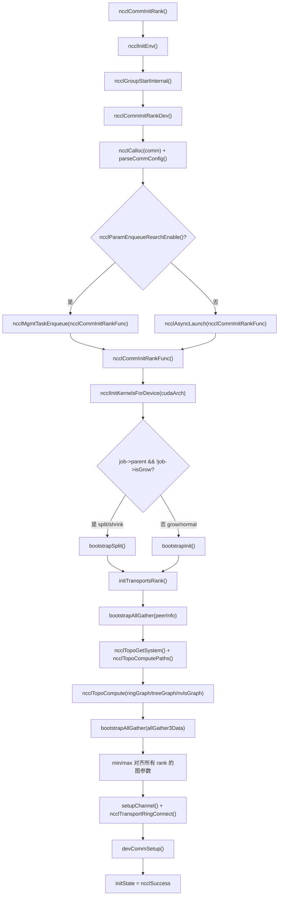
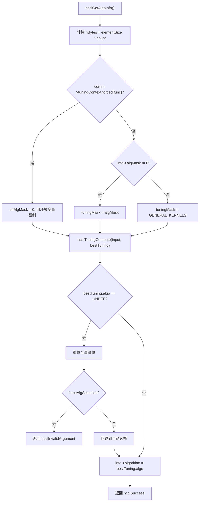
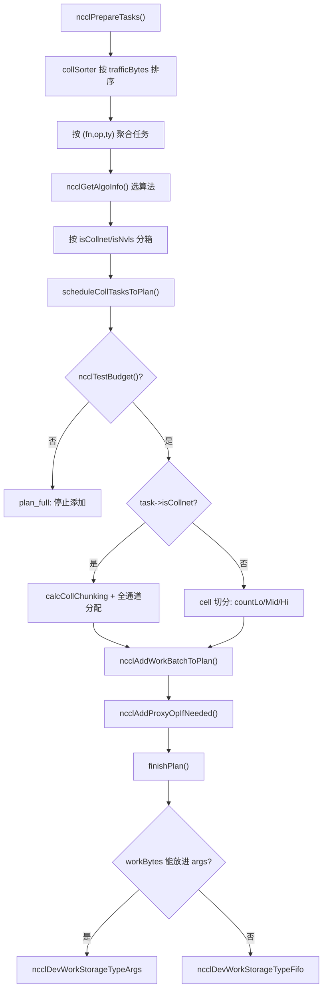

# Chapter 25: Panoramic Review and Reflections: The Ultimate Journey and Design Essence of an AllReduce

In the previous chapter, based on the traces of evolution in the source code, we looked ahead at NCCL's architectural trends: from fixed collective operations to programmable ones, from host proxy to GPU direct transmission, and from registered buffers to symmetric memory. Now, it is time to put these trends back into a concrete execution flow for verification. This chapter does not introduce any new code, but instead reconnects the end-to-end path from Chapter 3 to Chapter 10—starting from the single call ncclAllReduce, all the way to writing the result back to device memory. After reading this, you should be able to clearly answer: which functions does a single AllReduce actually go through? In which file and on which line is each function? Which chapter should you consult when encountering a problem?

# 1. Initialization: How the communicator "grows" out

## Intuitive model

Think of the communicator as a "group chat." When you call`ncclCommInitRank`it is like "applying to join the group chat." At this point, NCCL must determine the full member list (peerInfo), who connects to whom through which route (topology graph), and how many pipelines each route opens (channel).**If this step goes wrong, all subsequent communication will be wrong**—just like when someone in a group chat has not been pulled in, the messages you send will always be missing one recipient.

## Data structures and memory layout

The core structure of the communicator is`ncclComm`, and its initialization is divided into two stages:`commAlloc`is responsible for "allocating the skeleton,"`initTransportsRank`is responsible for "filling in the flesh and blood."

`commAlloc`The most noteworthy thing in**is the design of**shared resource reference counting`ncclSharedResources`. When a sub-communicator (produced by split/shrink) reuses the parent communicator's resources, it does not copy a separate set, but shares the same

[FACT:src/init.cc:533-555]

```cpp
if (parent == NULL || !parent->shareResources) {
    struct ncclSharedResources* sharedRes;
    NEW_NOTHROW(sharedRes, ncclSharedResources);
    sharedRes->owner = comm;
    ...
    comm->sharedRes = sharedRes;
    sharedRes->refCount = 1;
    NCCLCHECK(ncclNetInit(comm));
    NCCLCHECK(ncclRmaInit(comm));
    NCCLCHECK(ncclGinInit(comm));
} else {
    comm->sharedRes = parent->sharedRes;
    ncclAtomicRefCountIncrement(&parent->sharedRes->refCount);
    NCCLCHECK(ncclNetInitFromParent(comm, parent));
    NCCLCHECK(ncclRmaInitFromParent(comm, parent));
}
```

Copy`refCount`The intent of this code is very clear: "heavy resources" such as network plugins, RMA, and GIN are initialized only once, and sub-communicators directly borrow them.

uses atomic operations to increment, ensuring that under multithreading there will be no duplicate release.`commAlloc`Another key point is the**initialization of**channels in`id = -1`. All channels are first marked as "uninitialized" (`setupChannel`), and only later will

[FACT:src/init.cc:607-608]

```cpp
// Mark channels as non initialized.
for (int c = 0; c channels[c].id = -1;
```

Copy`-1`This`id == -1`is a sentinel value. If any code mistakenly uses an uninitialized channel,

## will immediately expose the problem, rather than reading a bunch of random memory.

Step-by-Step: From ncclCommInitRank to initTransportsRank`ncclCommInitRank`After the user calls

1. `ncclCommInitRank`, the actual execution flow is as follows:`ncclInitEnv`first calls`ncclGroupStartInternal`to load environment plugins, then calls

to enter group semantics (this is to support "initializing multiple communicators within one group").`ncclCommInitRankDev`2. Next, it calls`comm`, which performs parameter validation, allocates the**structure, parses config, and then**：

[FACT:src/init.cc:2923-2929]

```cpp
if (ncclParamEnqueueRearchEnable()) {
    NCCLCHECKGOTO(ncclMgmtTaskEnqueue((struct ncclAsyncJob*)job, ncclCommInitRankFunc, ncclCommInitJobFree, comm), res, fail);
} else {
    NCCLCHECKGOTO(ncclAsyncLaunch((struct ncclAsyncJob*)job, ncclCommInitRankFunc, NULL, ncclCommInitJobFree, comm), res, fail);
}
```

Copy`ncclParamEnqueueRearchEnable()`Note the`ncclAsyncLaunch`branch here—this is a trace of the "enqueue refactor" currently underway in NCCL. By default it goes through`ncclMgmtTaskEnqueue`, and after enabling the refactor it goes through`ncclCommInitRankFunc`。

3. `ncclCommInitRankFunc`. Both paths will eventually call

[FACT:src/init.cc:2119-2127]

```cpp
timers[TIMER_INIT_TOTAL] = clockNano();
CUDACHECKGOTO(cudaSetDevice(cudaDev), res, fail);
CUDACHECKGOTO(cudaDeviceGetAttribute(&maxSharedMem, cudaDevAttrMaxSharedMemoryPerBlockOptin, cudaDev), res, fail);
CUDACHECKGOTO(cudaDeviceGetAttribute(&archMajor, cudaDevAttrComputeCapabilityMajor, cudaDev), res, fail);
CUDACHECKGOTO(cudaDeviceGetAttribute(&archMinor, cudaDevAttrComputeCapabilityMinor, cudaDev), res, fail);
cudaArch = 100 * archMajor + 10 * archMinor;

timers[TIMER_INIT_KERNELS] = clockNano();
NCCLCHECKGOTO(ncclInitKernelsForDevice(cudaArch, maxSharedMem, &maxLocalSizeBytes), res, fail);
```

`cudaArch = 100 * archMajor + 10 * archMinor`Copy

4. Then, depending on whether it is normal initialization or split/shrink/grow, take different bootstrap paths:

[FACT:src/init.cc:2136-2191]

```cpp
if (job->parent && !job->isGrow) {
    // SPLIT/SHRINK: use bootstrapSplit
    ...
    NCCLCHECKGOTO(bootstrapSplit(comm->commHash, comm, job->parent, job->color, job->key, parentRanks), res, fail);
} else {
    // GROW or NORMAL INIT: use bootstrapInit
    ...
    NCCLCHECKGOTO(bootstrapInit(job->nId, (struct ncclBootstrapHandle*)job->commId, comm, job->parent), res, fail);
}
```

5. Finally call`initTransportsRank`, which is the heaviest function in the entire initialization (about 800 lines). Internally it performs two AllGathers:

- **AllGather1**: exchange`ncclPeerInfo`(each rank's device information, host hash, pid hash, GPU UUID, etc.):

[FACT:src/init.cc:1236-1239]

```cpp
NCCLCHECKGOTO(ncclCalloc(&comm->peerInfo, nranks + 1), ret, fail); // Extra rank to represent CollNet root
NCCLCHECKGOTO(fillInfo(comm, comm->peerInfo + rank, comm->commHash), ret, fail);
NCCLCHECKGOTO(bootstrapAllGather(comm->bootstrap, comm->peerInfo, sizeof(struct ncclPeerInfo)), ret, fail);
COMPILER_ATOMIC_STORE(&comm->peerInfoValid, true, std::memory_order_release);
```

Note`nranks + 1`this allocation—the extra slot is for the CollNet root.`peerInfoValid`Store with release semantics to ensure that when other threads see this flag, the contents of peerInfo are already visible.

- **AllGather3**: exchange topology computation results (the ring/tree structure, bandwidth, channel count, etc. computed by each rank), then take the**minimum value**across all ranks to align:

[FACT:src/init.cc:1687-1703]

```cpp
for (int i = 0; i nChannels = std::min(allGather3Data[i].graphInfo[a].nChannels, graphs[a]->nChannels);
        graphs[a]->sameChannels = std::min(allGather3Data[i].graphInfo[a].sameChannels, graphs[a]->sameChannels);
        graphs[a]->bwIntra = std::min(allGather3Data[i].graphInfo[a].bwIntra, graphs[a]->bwIntra);
        graphs[a]->bwInter = std::min(allGather3Data[i].graphInfo[a].bwInter, graphs[a]->bwInter);
        graphs[a]->typeIntra = std::max(allGather3Data[i].graphInfo[a].typeIntra, graphs[a]->typeIntra);
        graphs[a]->typeInter = std::max(allGather3Data[i].graphInfo[a].typeInter, graphs[a]->typeInter);
        graphs[a]->crossNic = std::max(allGather3Data[i].graphInfo[a].crossNic, graphs[a]->crossNic);
    }
    ...
}
```

Bandwidth takes the min, type takes the max—this is the "barrel principle": the performance of the entire communication domain is determined by the slowest rank. If not aligned, different ranks may compute different algorithm choices, leading to communication deadlock.

## Initialization Flowchart



## Design Considerations and Pitfalls

**Why does initialization need to be asynchronous?**Because multi-rank initialization requires cross-process synchronization (bootstrap), and if executed synchronously it would block the calling thread. After making it asynchronous, users can initialize multiple communication domains simultaneously within a group, advancing them in parallel.

**Pitfalls**：`initTransportsRank`There is an intra-node barrier at the end:

[FACT:src/init.cc:1968-1971]

```cpp
/* Local intra-node barrier */
NCCLCHECKGOTO(bootstrapIntraNodeBarrier(comm->bootstrap, comm->localRankToRank, comm->localRank, comm->localRanks, comm->localRankToRank[0]), ret, fail);
```

This barrier ensures that all ranks on the same machine have completed resource allocation before continuing. If some rank is stuck in`devCommSetup`(e.g., out of GPU memory), other ranks will wait here forever. When encountering "initialization hang" in production, the first thing to check is whether some rank's`devCommSetup`failed.

# II. Task Enqueueing: From API Call to Internal Task Object

## Intuitive Model

When a user calls`ncclAllReduce`it's like ordering food at a restaurant.`ncclEnqueueCheck`is the waiter, which translates your order into a "work order" (`ncclTaskColl`) that the kitchen can understand, and puts it into`comm->planner`this "order pool".**Without this layer, NCCL would not be able to merge multiple calls into a single kernel launch**—lighting the stove separately for each order is extremely inefficient.

## Data Structures and Memory Layout

The core of task enqueueing is`ncclKernelPlanner`, which hangs off`comm->planner`. Key fields include:

- `collSorter`: a collection of collective communication tasks sorted by traffic size
- `collTaskQueue`: the final sorted task queue
- `peers[]`: each peer's send/recv queue (for P2P)
- `wipPlan`: the kernel plan being constructed

The key fields of the task object`ncclTaskColl`are filled in`collTaskAppend`:

[FACT:src/enqueue/enqueue.cc:2800-2847]

```cpp
struct ncclTaskColl* t = ncclMemoryPoolAlloc(&comm->memPool_ncclTaskColl, &comm->memPermanent);
t->func = info->coll;
t->sendbuff = info->sendbuff;
t->recvbuff = info->recvbuff;
t->count = info->count;
t->root = info->root;
t->datatype = info->datatype;
size_t elementSize = ncclTypeSize(t->datatype);
if (t->func == ncclFuncAllGather || t->func == ncclFuncBroadcast) {
    t->count *= elementSize;
    t->datatype = ncclInt8;
    elementSize = 1;
}
t->trafficBytes = t->count * elementSize * ncclFuncTrafficPerByte(t->func, comm->nRanks);
...
t->aggIsolate = ncclCollConfigNeedAggIsolate(&info->collConfig) || info->collConfig.CTAPolicy != comm->config.CTAPolicy;
NCCL_CONFIG_SET(t, minCTAs, ncclParamMinCTAs(), info->collConfig.minCTAs, comm->config.minCTAs, 1, MAXCHANNELS);
NCCL_CONFIG_SET(t, maxCTAs, ncclParamMaxCTAs(), (std::min(info->collConfig.maxCTAs, comm->config.maxCTAs)), comm->config.maxCTAs, 1, MAXCHANNELS);
...
planner->nTasksColl += 1;
ncclTaskCollSorterInsert(&planner->collSorter, t, t->trafficBytes);
```

Note a few details:

1. **Special handling for AllGather/Broadcast**: multiply count by the element size and change datatype to`ncclInt8`. This is because the semantics of these two operations is "moving bytes" and does not need to care about the original type.

2. **`trafficBytes`Computation of**：`ncclFuncTrafficPerByte`returns how many times each byte needs to be transferred. AllReduce returns 2 (reduce + broadcast), AllGather returns nRanks:

[FACT:src/enqueue/enqueue.cc:123-134]

```cpp
static inline int ncclFuncTrafficPerByte(ncclFunc_t func, int nRanks) {
  switch (func) {
  case ncclFuncAllReduce:
    return 2;
  case ncclFuncAllGather:
    return nRanks;
  case ncclFuncReduceScatter:
    return nRanks;
  default:
    return 1;
  }
}
```

3. **`NCCL_CONFIG_SET`Macro**: this is "env > per-call > comm" three-level configuration resolution. Environment variables have the highest priority, followed by the per-call config, and finally the communication domain-level default value.

## Step-by-Step: The Enqueue Path of ncclAllReduce

1. `ncclEnqueueCheck`First perform communication domain validation and group entry:

[FACT:src/enqueue/enqueue.cc:3478-3495]

```cpp
ncclResult_t ncclEnqueueCheck(struct ncclInfo* info) {
  ncclResult_t ret = CommCheck(info->comm, info->opName, "comm");
  if (ret != ncclSuccess) return ncclGroupErrCheck(ret);
  if (info->comm->revokedFlag) {
    WARN("%s: communicator was revoked", info->opName);
    return ncclGroupErrCheck(ncclInvalidUsage);
  }
  ...
  NCCLCHECK(ncclGroupStartInternal());
  ret = ncclSuccess;
  int devOld = -1;
  NCCLCHECKGOTO(ncclCommEnsureReady(info->comm), ret, fail);
```

2. Then call`taskAppend`, which dispatches based on the operation type:

[FACT:src/enqueue/enqueue.cc:3337-3348]

```cpp
static ncclResult_t taskAppend(struct ncclComm* comm, struct ncclInfo* info) {
  ncclFunc_t collAPI = info->coll;
  bool hasLaunchCompletionEvent = ncclInfoHasLaunchCompletionEvent(info);

  if (ncclParamEnqueueRearchEnable()) {
    NCCLCHECK(rawTaskAppend(comm, info));
  } else if (info->coll == ncclFuncSend || info->coll == ncclFuncRecv) {
    NCCLCHECK(p2pTaskAppend(comm, info, info->coll, collAPI, (void*)info->recvbuff, info->count, info->datatype, info->root, true));
  } else if (info->coll == ncclFuncPutSignal || info->coll == ncclFuncSignal || info->coll == ncclFuncWaitSignal) {
    NCCLCHECK(rmaTaskAppend(comm, info));
  } else {
    ...
  }
}
```

For AllReduce, it goes through the final`else`branch, ultimately calling`collTaskAppend`。

3. `collTaskAppend`to insert the task into`collSorter`, sorted by`trafficBytes`. The purpose of sorting is to let the scheduler prioritize large tasks and avoid small tasks fragmenting channel resources.

## Task Enqueueing Data Flow

```mermaid
flowchart LR
    api["ncclAllReduce()"] --> info["ncclInfo 填充"]
    info --> enq["ncclEnqueueCheck()"]
    enq --> check["CommCheck + ncclCommEnsureReady()"]
    check --> append["taskAppend()"]
    append --> coll["collTaskAppend()"]
    coll --> task["ncclTaskColl 分配"]
    task --> sorter["ncclTaskCollSorterInsert(collSorter)"]
    sorter --> prepare["ncclPrepareTasks()"]
    prepare --> algo["ncclGetAlgoInfo() 选算法"]
    algo --> schedule["scheduleCollTasksToPlan()"]
    schedule --> plan["ncclKernelPlan"]
```



## Design Considerations and Pitfalls

**Why use`ncclMemoryPoolAlloc`instead of`malloc`？**Because task objects have a short lifecycle and are allocated frequently. The memory pool avoids the system call overhead of`malloc/free`each time. Note that the second parameter of`ncclMemoryPoolAlloc`is`&comm->memPermanent`—this means task objects are released uniformly when the communication domain is destroyed, rather than each task being released individually.

**Pitfalls**：`ncclPrepareTasks`There is an "aggregation" logic in

[FACT:src/enqueue/enqueue.cc:506-512]

```cpp
// We aggregate operations that are within 4X size of each other.
while (aggEnd != nullptr && aggEnd->trafficBytes trafficBytes && !aggBeg->aggIsolate && !aggEnd->aggIsolate) {
    agg.count += aggEnd->count;
    agg.trafficBytes += aggEnd->trafficBytes;
    aggEnd = aggEnd->next;
}
```

Copy`aggIsolate`This aggregation is to make algorithm selection more stable—if each small task selects an algorithm individually, it may select a bunch of different algorithms, causing kernel fragmentation. But the

# flag prevents aggregation, used for those tasks that "must be scheduled individually" (such as those with per-call config).

## III. Algorithm Selection: How the Cost Model Picks the Optimal Solution

Intuitive Model**Algorithm selection is like navigation software choosing a route. NCCL's "cost model" (tuning module) estimates the time cost of each algorithm/protocol combination under a given message size and topology, then picks the fastest one.**。

## Without a cost model, NCCL could only hardcode a single set of algorithms, wasting bandwidth on small messages and wasting latency on large messages

Data Structures and Memory Layout`ncclGetAlgoInfo`：

[FACT:src/enqueue/enqueue.cc:2159-2185]

```cpp
ncclResult_t ncclGetAlgoInfo(struct ncclComm* comm, struct ncclTaskColl* info, int collNetSupport, int nvlsSupport,
                             int numPipeOps, ncclSimInfo_t* simInfo) {
  size_t elementSize = ncclTypeSize(info->datatype);
  size_t nBytes = elementSize * ncclFuncMaxSendRecvCount(info->func, comm->nRanks, info->count);
  info->algorithm = NCCL_ALGO_UNDEF;
  info->protocol = NCCL_PROTO_UNDEF;
  struct ncclTuningInput_t input;
  input.comm = comm;
  input.tuningMask = NCCL_TUNING_MASK_GENERAL_KERNELS;
  uint64_t effAlgMask = comm->tuningContext.forced[info->func] ? 0 : info->algMask;
  if (effAlgMask != 0) {
    input.tuningMask = effAlgMask & NCCL_TUNING_MASK_GENERAL_KERNELS;
  }
  input.CTAPolicy = info->CTAPolicy;
  input.func = info->func;
  input.redOp = info->opHost;
  input.devRedOp = info->opDev.op;
  input.datatype = info->datatype;
  input.nBytes = nBytes;
  input.numPipeOps = numPipeOps;
  input.collNetSupport = collNetSupport;
  input.nvlsSupport = nvlsSupport;
  input.count = info->count;
  NCCLCHECK(ncclGetRegBuff(comm, info, &input.regBuff));
  ...
}
```

Copy`effAlgMask`Note the logic of`comm->tuningContext.forced[info->func]`: if an environment variable forces a specific algorithm (`algMask`is non-zero), then the user's

is ignored and the environment variable's is used. This reflects the "env > per-call" priority.`ncclTuningCompute`Then call

[FACT:src/enqueue/enqueue.cc:2213-2224]

```cpp
} else {
    NCCLCHECK(ncclTuningCompute(&input, &bestTuning));
}
INFO(NCCL_TUNING, "Best tuning, algorithm, %s, protocol, %s", ncclAlgoToString(bestTuning.algo), ncclProtoToString(bestTuning.proto));
info->algorithm = bestTuning.algo;
info->protocol = bestTuning.proto;
info->nWarps = bestTuning.nWarps;
if (simInfo) simInfo->estimatedTime = bestTuning.timeUs;
TRACE(NCCL_COLL, "%ld Bytes -> Algo %d proto %d time %f", nBytes, info->algorithm, info->protocol, bestTuning.timeUs);
info->nMaxChannels = bestTuning.maxChannels == 0 ? info->nMaxChannels : bestTuning.maxChannels;
```

## Step-by-Step: Algorithm Selection for a Single AllReduce

Assume 8 GPUs on a single node, message size 1MB, AllReduce:

1. `nBytes = 1MB`，`numPipeOps`is the number of tasks already in the current plan.

2. `collNetSupport`and`nvlsSupport`determined by`ncclGetCollNetSupport`and`ncclNvlsTransportEnabled`.

3. `ncclTuningCompute`Iterate over all available (algo, proto) combinations and estimate time using the cost model.

4. For a 1MB single-node scenario, NVLS or Tree+LL128 typically wins.

5. Write the result back to`info->algorithm`、`info->protocol`、`info->nWarps`。

## Algorithm Selection Decision Diagram



## Design Considerations and Pitfalls

**Why must algorithm selection be "cross-rank aligned"?**Because if different ranks choose different algorithms, the communication patterns won't match, causing deadlock. So`initTransportsRank`uses min/max to align all graph parameters, ensuring every rank's cost model input is consistent.

**Pitfalls**：`ncclGetAlgoInfo`There is a "recompute" logic — if the user specifies`algMask`but no algorithm matches, it first silently recomputes the full menu, then determines whether it's a hard error or soft fallback:

[FACT:src/enqueue/enqueue.cc:2192-2208]

```cpp
NOWARN(ncclTuningCompute(&input, &bestTuning), NCCL_TUNING);
if (bestTuning.algo == NCCL_ALGO_UNDEF) {
    input.tuningMask = NCCL_TUNING_MASK_GENERAL_KERNELS;
    bestTuning = NCCL_TUNING_RESULT_INIT;
    bestTuning.maxChannels = 0;
    NCCLCHECK(ncclTuningCompute(&input, &bestTuning));
    if (info->forceAlgSelection) {
        WARN("algSelection: no algorithm in the selected set is available for %s", ncclFuncToString(info->func));
        return ncclInvalidArgument;
    }
    INFO(NCCL_TUNING, "algSelection: selected set unavailable for %s; falling back to automatic selection", ncclFuncToString(info->func));
}
```

`NOWARN`The macro temporarily suppresses warnings, because "no algorithm matches" may be a normal situation (the user-selected set is indeed unavailable). Only when`forceAlgSelection`is true does it report an error.

# IV. Task Scheduling and Kernel Plan Construction

## Intuitive Model

Task scheduling is like distributing a bunch of orders across several assembly lines.`scheduleCollTasksToPlan`determines how many channels each task uses and how much data each channel processes, ultimately generating a`ncclKernelPlan`— this is the "work order" to be passed to the GPU.

## Data Structures and Memory Layout

`ncclKernelPlan`Core fields of

- `channelMask`: which channels this plan uses (bitmap)
- `workBytes`: total bytes of all work structures
- `nWorkBatches`: number of work batches
- `kernelArgs`: kernel launch parameters
- `workStorageType`: where work data is stored (args/fifo/persistent)

`finishPlan`determines the storage location of work data:

[FACT:src/enqueue/enqueue.cc:244-255]

```cpp
// If we can fit everything into the kernel args we do so.
if (sizeof(ncclDevKernelArgs) + batchBytes + workBytes workArgsBytes) {
    plan->workStorageType = ncclDevWorkStorageTypeArgs;
}
plan->kernelArgsSize = sizeof(struct ncclDevKernelArgs) + batchBytes;
plan->kernelArgsSize += (plan->workStorageType == ncclDevWorkStorageTypeArgs) ? workBytes : 0;
plan->kernelArgsSize = alignUp(plan->kernelArgsSize, 16);
plan->kernelArgs = (struct ncclDevKernelArgs*)ncclMemoryStackAlloc(&comm->memScoped, plan->kernelArgsSize, /*align=*/16);
plan->kernelArgs->comm = comm->devComm;
plan->kernelArgs->channelMask = plan->channelMask;
plan->kernelArgs->workStorageType = plan->workStorageType;
```

Trade-offs of the three storage types:

- **Args**: fastest, but kernel parameter size is limited (typically 4KB)
- **Fifo**: ring buffer, suitable for medium sizes
- **Persistent**: separate device memory allocation, suitable for CUDA Graph scenarios

## Step-by-Step: Channel Allocation in scheduleCollTasksToPlan

1. First estimate how many tasks this plan can hold:

[FACT:src/enqueue/enqueue.cc:654-687]

```cpp
do {
    size_t workBytes = 0;
    struct ncclTaskColl* task = ncclIntruQueueHead(&planner->collTaskQueue);
    struct ncclWorkList* workNode = ncclIntruQueueHead(&planner->collWorkQueue);
    while (task != nullptr) {
        int nBatches = divUp(nPlanColls, 4); // Rough guess: 4 colls per batch.
        if (!ncclTestBudget(budget, nBatches, workBytes + workNode->size)) goto plan_full;
        bool taskAggIsolate = task->aggIsolate;
        if (taskAggIsolate && nPlanColls > 0) goto plan_full;
        nPlanColls += 1;
        workBytes += workNode->size;
        int kind = 2 * task->isCollnet + task->isNvls;
        trafficBytes[kind] += std::max(MinTrafficPerChannel, task->trafficBytes);
        ...
    }
plan_full:;
} while (0);
```

2. Then allocate channels to tasks by traffic. For non-CollNet tasks, split using "cell" as the unit:

[FACT:src/enqueue/enqueue.cc:742-759]

```cpp
int trafficPerByte = ncclFuncTrafficPerByte(task->func, comm->nRanks);
if (task->protocol == NCCL_PROTO_LL) trafficPerByte *= 4;
size_t cellSize = divUp(divUp(MinTrafficPerChannel, (size_t)trafficPerByte), 16) * 16;
int elementsPerCell = cellSize / elementSize;
size_t cells = divUp(task->count * elementSize, cellSize);
size_t trafficPerElement = elementSize * trafficPerByte;
size_t trafficPerCell = cellSize * trafficPerByte;
size_t cellsPerChannel = std::min(cells, divUp(trafficPerChannel, trafficPerCell));
size_t cellsLo;
if (channelId + 1 == nMaxChannels[kind]) {
    cellsLo = cells;
} else {
    cellsLo = std::min(cells, divUp((trafficPerChannel - currentTraffic), trafficPerCell));
}
int nMidChannels = (cells - cellsLo) / cellsPerChannel;
size_t cellsHi = (cells - cellsLo) % cellsPerChannel;
int nChannels = (cellsLo != 0 ? 1 : 0) + nMidChannels + (cellsHi != 0 ? 1 : 0);
```

This code splits data into "low/mid/high" three segments:`countLo`、`countMid`、`countHi`. The low and high segments are boundary channels, and the mid segment is the middle channel. This split is to make the data volume processed by each channel as even as possible.

3. Finally call`calcCollChunking`to compute the chunk size for each channel:

[FACT:src/enqueue/enqueue.cc:2228-2275]

```cpp
static ncclResult_t calcCollChunking(struct ncclComm* comm, struct ncclTaskColl* info, int nChannels, size_t nBytes,
                                     uint32_t* outChunkSize, uint32_t* outDirectFlags, struct ncclProxyOp* proxyOp) {
  ncclPattern_t pattern;
  size_t grainSize = ncclProtoGrainSize(info->protocol);
  switch (info->func) {
  case ncclFuncAllReduce:
    pattern = info->algorithm == NCCL_ALGO_NVLS           ? ncclPatternNvls :
              info->algorithm == NCCL_ALGO_NVLS_TREE      ? ncclPatternNvlsTree :
              info->algorithm == NCCL_ALGO_COLLNET_DIRECT ? ncclPatternCollnetDirect :
              info->algorithm == NCCL_ALGO_COLLNET_CHAIN  ? ncclPatternCollnetChain :
              info->algorithm == NCCL_ALGO_TREE           ? ncclPatternTreeUpDown :
                                                            ncclPatternRingTwice;
    break;
  ...
  }
  int stepSize = comm->buffSizes[info->protocol] / NCCL_STEPS;
  int chunkSteps = (info->protocol == NCCL_PROTO_SIMPLE && info->algorithm == NCCL_ALGO_RING) ? info->chunkSteps : 1;
  int sliceSteps = (info->protocol == NCCL_PROTO_SIMPLE && info->algorithm == NCCL_ALGO_RING) ? info->sliceSteps : 1;
  int chunkSize = stepSize * chunkSteps;
  if (info->protocol == NCCL_PROTO_LL) chunkSize /= 2;
  if (info->protocol == NCCL_PROTO_LL128) chunkSize = (chunkSize / NCCL_LL128_LINEELEMS) * NCCL_LL128_DATAELEMS;
  ...
}
```

## Scheduling Flow Diagram



## Design Considerations and Pitfalls

**Why are CollNet tasks handled separately?**Because CollNet uses network switches for reduction, and the channel allocation logic is completely different from regular ring/tree. CollNet tasks directly occupy all available channels, while regular tasks need to be split by traffic.

**Pitfalls**：`ncclTestBudget`The estimation uses a rough formula`nBatches = divUp(nPlanColls, 4)`— assuming one batch is produced every 4 collective operations. This estimate may be inaccurate, so there's a precise check afterward:

[FACT:src/enqueue/enqueue.cc:711-714]

```cpp
// Ensure room for worst case of one new batch per channel
if (!ncclTestBudget(budget, plan->nWorkBatches + nChannels, plan->workBytes + workNode->size)) {
    return ncclSuccess;
}
```

If the precise check fails, return directly (without error), letting the upper layer open a new plan.

# V. Kernel Launch and Device-Side Execution

## Intuitive Model

Kernel launch is like handing work orders to the factory.`ncclLaunchKernel`translates`ncclKernelPlan`into CUDA kernel launch parameters, then calls`cuLaunchKernelEx`. After the device-side kernel receives the work order, it executes data movement according to the algorithm.

## Data Structures and Memory Layout

`ncclLaunchKernel`Key steps of

[FACT:src/enqueue/enqueue.cc:1886-1909]

```cpp
ncclResult_t ncclLaunchKernel(struct ncclComm* comm, struct ncclKernelPlan* plan) {
  ncclResult_t ret = ncclSuccess;
  struct ncclKernelPlanner* planner = &comm->planner;
  int nChannels = countOneBits(plan->channelMask);
  void* sym = plan->kernelFn;
  dim3 grid = {(unsigned)nChannels, 1, 1};
  dim3 block = {(unsigned)plan->threadPerBlock, 1, 1};
  int smem = plan->isSymColl ? plan->kernelDynSmem : ncclShmemDynamicSize(comm->cudaArch);
  cudaStream_t launchStream = planner->streams->stream;
  ...
  void* extra[] = {CU_LAUNCH_PARAM_BUFFER_POINTER, plan->kernelArgs, CU_LAUNCH_PARAM_BUFFER_SIZE, &plan->kernelArgsSize, CU_LAUNCH_PARAM_END};
  ...
  CUfunction fn;
  CUDACHECKGOTO(cudaGetFuncBySymbol(&fn, sym), ret, do_return);
```

Note`grid.x = nChannels`— one block per channel.`block.x = plan->threadPerBlock`— the number of threads per block is determined by the task.

## Step-by-Step: From Plan to Kernel Launch

1. First call`uploadWork`to write work data to the target location (args/fifo/persistent):

[FACT:src/enqueue/enqueue.cc:1365-1407]

```cpp
static ncclResult_t uploadWork(struct ncclComm* comm, struct ncclKernelPlan* plan) {
  if (plan->isSymColl || plan->isCeColl || plan->isRma) return ncclSuccess;
  size_t workBytes = plan->workBytes;
  size_t batchBytes = plan->nWorkBatches * sizeof(struct ncclDevWorkBatch);
  void* fifoBufHost;
  uint32_t fifoCursor, fifoMask;
  switch (plan->workStorageType) {
  case ncclDevWorkStorageTypeArgs:
    plan->kernelArgs->workBuf = nullptr;
    fifoBufHost = (void*)plan->kernelArgs;
    fifoCursor = sizeof(ncclDevKernelArgs) + batchBytes;
    fifoMask = ~0u;
    break;
  case ncclDevWorkStorageTypeFifo:
    fifoBufHost = comm->workFifoBuf;
    fifoCursor = comm->workFifoProduced;
    fifoMask = comm->workFifoBytes - 1;
    NCCLCHECK(waitWorkFifoAvailable(comm, fifoCursor + workBytes));
    plan->kernelArgs->workBuf = comm->workFifoBufDev;
    break;
  ...
  }
}
```

2. Then construct CUDA launch attributes. For sm90+, cluster dimensions are set:

[FACT:src/enqueue/enqueue.cc:1929-1936]

```cpp
if (clusterSize) {
    // Grid dimension must be divisible by clusterSize
    if (grid.x % clusterSize) clusterSize = 1;
    launchAttrs[attrs].id = CU_LAUNCH_ATTRIBUTE_CLUSTER_DIMENSION;
    launchAttrs[attrs++].value.clusterDim = {clusterSize, 1, 1};
    launchAttrs[attrs].id = CU_LAUNCH_ATTRIBUTE_CLUSTER_SCHEDULING_POLICY_PREFERENCE;
    launchAttrs[attrs++].value.clusterSchedulingPolicyPreference = CU_CLUSTER_SCHEDULING_POLICY_SPREAD;
}
```

3. Finally call`cuLaunchKernelEx`：

[FACT:src/enqueue/enqueue.cc:1992]

```cpp
CUCHECKGOTO(cuLaunchKernelEx(&launchConfig, fn, nullptr, extra), ret, do_return);
```

## Device Side: Execution of runRing

After the device-side kernel receives the work order, it calls the corresponding`RunWorkColl`specialization based on the algorithm. Taking Ring AllReduce as an example:

[FACT:src/device/all_reduce.h:14-83]

```cpp
template 
__device__ __forceinline__ void runRing(int tid, int nthreads, struct ncclDevWorkColl* work) {
  ncclRing* ring = &ncclShmem.channel.ring;
  int ringIx = ring->index;
  const int nranks = ncclShmem.comm.nRanks;
  ssize_t gridOffset;
  ssize_t channelCount;
  ssize_t chunkCount;
  ncclCollCbdPart(work, ncclShmem.channelId, Proto::Id, sizeof(T), (ssize_t*)nullptr, &gridOffset, &channelCount, &chunkCount);
  const ssize_t loopCount = nranks * chunkCount;
  ...
  Primitives, 1, Proto, 0> prims(tid, nthreads, &ring->prev, &ring->next, work->sendbuff, work->recvbuff, work->redOpArg, 0, 0, 0, work);

  for (ssize_t elemOffset = 0; elemOffset  int { return r - (r >= nranks ? nranks : 0); };

    // step 0: push data to next GPU
    chunk = modRanks(ringIx + nranks - 1);
    chunkOffset = chunk * chunkCount;
    offset = gridOffset + elemOffset + chunkOffset;
    nelem = (int)min(chunkCount, remCount - chunkOffset);
    prims.directSend(offset, offset, nelem);

    // k-2 steps: reduce and copy to next GPU
    for (int j = 2; j >Plan: ncclLaunchPrepare()
    Plan->>Plan: scheduleCollTasksToPlan()
    Plan->>Plan: finishPlan() 分配 kernelArgs
    Host->>Plan: ncclLaunchKernelBefore_NoUncapturedCuda()
    Plan->>Plan: uploadWork() 写 work 数据
    Host->>CUDA: cuLaunchKernelEx(fn, grid, block, smem)
    CUDA->>Kernel: 启动 nChannels 个 block
    Kernel->>Kernel: runRing() 执行 Ring AllReduce
    Host->>Plan: ncclLaunchKernelAfter_NoCuda()
    Plan->>Proxy: hostStreamPlanTask() + uploadProxyOps()
    Proxy->>Proxy: ncclProxyStart() 推进网络 I/O
    Kernel-->>Host: kernel 完成
    Host->>Plan: ncclLaunchFinish()
    Plan->>Plan: reclaimPlan() 释放资源
```

## Design Considerations and Pitfalls

**Why use`cuLaunchKernelEx`instead of`cudaLaunchKernel`？**Because launch attributes need to be set (cluster dimensions, mem sync domain, launch completion event). These attributes are only supported in CUDA 12.0+.

**Pitfalls**：`uploadWork`The handling of persistent mode here is very complex—it needs to allocate GPU memory, copy data, record events, and also work correctly under CUDA Graph capture mode:

[FACT:src/enqueue/enqueue.cc:1445-1478]

```cpp
CUDACHECKGOTO(cudaThreadExchangeStreamCaptureMode(&mode), result, fail);
NCCLCHECKGOTO(ncclStrongStreamAcquire(ncclCudaGraphNone(comm->config.graphUsageMode), &comm->sharedRes->deviceStream, /*concurrent=*/false, &deviceStream), result, fail);
if (comm->memPool) {
    CUDACHECKGOTO(cudaMallocAsync(&fifoBufDev, workBytes, comm->memPool, deviceStream), result, fail);
} else {
    CUDACHECKGOTO(cudaMalloc(&fifoBufDev, workBytes), result, fail);
}
plan->workBufPersistent = fifoBufDev;
plan->kernelArgs->workBuf = fifoBufDev;
CUDACHECKGOTO(cudaMemcpyAsync(fifoBufDev, fifoBufHost, workBytes, cudaMemcpyDefault, deviceStream), result, fail);
cudaEvent_t memcpyDone;
CUDACHECKGOTO(cudaEventCreateWithFlags(&memcpyDone, cudaEventDisableTiming), result, fail);
CUDACHECKGOTO(cudaEventRecord(memcpyDone, deviceStream), result, fail);
```

`cudaThreadExchangeStreamCaptureMode`is to temporarily switch to relaxed mode during capture mode, allowing GPU memory allocation. After the copy is complete, record the event, and later reclaim it through`ncclCommPollEventCallbacks`.

# 6. Production Pitfall Guide

## Pitfall 1: Initialization hangs

**Symptom**：`ncclCommInitRank`gets stuck and does not return.

**Troubleshooting**: Check the`NCCL_DEBUG=INFO`logs and find the last rank that printed. If all ranks printed "Init START" but not "Init COMPLETE", it means it is stuck in`initTransportsRank`.

**Common causes**：

- A certain rank's`devCommSetup`failed (out of GPU memory, CUDA error)
- bootstrap network is unreachable (firewall, port occupied)
- Different ranks have inconsistent NCCL versions

**Source code basis**：`initTransportsRank`The intra-node barrier at the end will wait for all local ranks:

[FACT:src/init.cc:1968-1971]

```cpp
/* Local intra-node barrier */
NCCLCHECKGOTO(bootstrapIntraNodeBarrier(comm->bootstrap, comm->localRankToRank, comm->localRank, comm->localRanks, comm->localRankToRank[0]), ret, fail);
```

## Pitfall 2: work FIFO overflow

**Symptom**: after the kernel starts, it hangs, or reports`ncclInternalError`。

**Cause**：`waitWorkFifoAvailable`is waiting for FIFO space, but the consumer side (kernel) is not making progress.

[FACT:src/enqueue/enqueue.cc:1333-1349]

```cpp
static ncclResult_t waitWorkFifoAvailable(struct ncclComm* comm, uint32_t desiredProduced) {
  bool hasRoom = (desiredProduced - comm->workFifoConsumed) workFifoBytes;
  if (!hasRoom) {
    while (true) {
      // Check abort flag to break deadlock when abort is signaled
      if (COMPILER_ATOMIC_LOAD(comm->abortFlag, std::memory_order_acquire)) {
        return ncclInternalError;
      }
      NCCLCHECK(ncclCommPollEventCallbacks(comm, /*waitSome=*/true));
      hasRoom = (desiredProduced - comm->workFifoConsumed) workFifoBytes;
      if (hasRoom) break;
      std::this_thread::yield();
    }
  }
  return ncclSuccess;
}
```

Note the abort flag check—this is the only escape path. If abort is also not set, it will loop forever.

**How to avoid**: increase`NCCL_WORK_FIFO_BYTES`, or reduce the number of operations in a single group.

## Pitfall 3: CUDA Graph capture failure

**Symptom**: calling NCCL during CUDA Graph capture reports "operation not permitted".

**Cause**: certain CUDA operations cannot be performed in capture mode (such as`cudaMalloc`). NCCL uses`cudaThreadExchangeStreamCaptureMode`to temporarily switch modes, but not all operations can be bypassed.

**Source code basis**：`uploadWork`The persistent branch of

[FACT:src/enqueue/enqueue.cc:1445]

```cpp
CUDACHECKGOTO(cudaThreadExchangeStreamCaptureMode(&mode), result, fail);
```

**How to avoid**: use`NCCL_GRAPH_MIXING_SUPPORT=1`to enable graph mixed mode, or preallocate the work buffer.

# Chapter summary

In this chapter, we walked through the complete path of one AllReduce again:

1. **Initialization**：`ncclCommInitRank` → `ncclCommInitRankFunc` → `initTransportsRank`, establishing the communication domain, searching the topology, and aligning graph parameters.

2. **Task enqueue**：`ncclEnqueueCheck` → `taskAppend` → `collTaskAppend`, translating API calls into`ncclTaskColl`。

3. **Algorithm selection**：`ncclGetAlgoInfo` → `ncclTuningCompute`, using the cost model to choose the optimal (algo, proto).

4. **Task scheduling**：`ncclPrepareTasks` → `scheduleCollTasksToPlan` → `finishPlan`, assigning tasks to channels and generating`ncclKernelPlan`。

5. **Kernel launch**：`ncclLaunchKernel` → `cuLaunchKernelEx`, translating the plan into CUDA launch parameters.

6. **Device-side execution**：`runRing` / `runTreeUpDown` / `runNvls`, performing data movement according to the algorithm.

# Chapter review and self-test

Q1: If the min/max alignment logic after AllGather3 in`initTransportsRank`(L1690-L1698) is removed, in what scenarios would it cause communication deadlock? Why?

**Reference analysis**: This logic ensures that all ranks agree on parameters such as`nChannels`、`bwIntra`、`bwInter`for each algorithm. If removed, each rank would compute the result using its own local topology. Consider a heterogeneous cluster: rank 0 is on an 8-GPU NVLink machine, and rank 8 is on a 4-GPU PCIe machine. Rank 0 computes that the ring has 8 channels, and rank 8 computes 4. When they execute Ring AllReduce, rank 0 will wait for rank 8 to send data on 8 channels, but rank

At this point, we have completed the review of the full path of one AllReduce. From initialization, topology search, algorithm selection, task enqueue, and kernel launch, to device-side execution and network transmission, each step corresponds to the in-depth analysis in the previous chapters. This path diagram is not only the skeleton for understanding NCCL, but also an index for troubleshooting: for initialization failures, check Chapters 3 and 4; for wrong algorithm selection, check Chapter 5; for task enqueue errors, check Chapters 6 and 7; for kernel launch failures, check Chapter 8; for device-side hangs, check Chapters 9 and 10; for network issues, check Chapters 12 and 13. As NCCL evolves toward programmable communication, GPU-initiated communication, and symmetric memory, this path will continue to extend—and you have already mastered the method to trace it.
