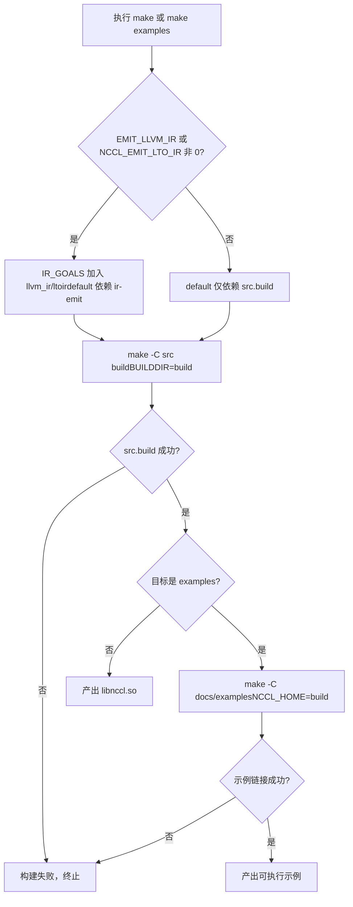
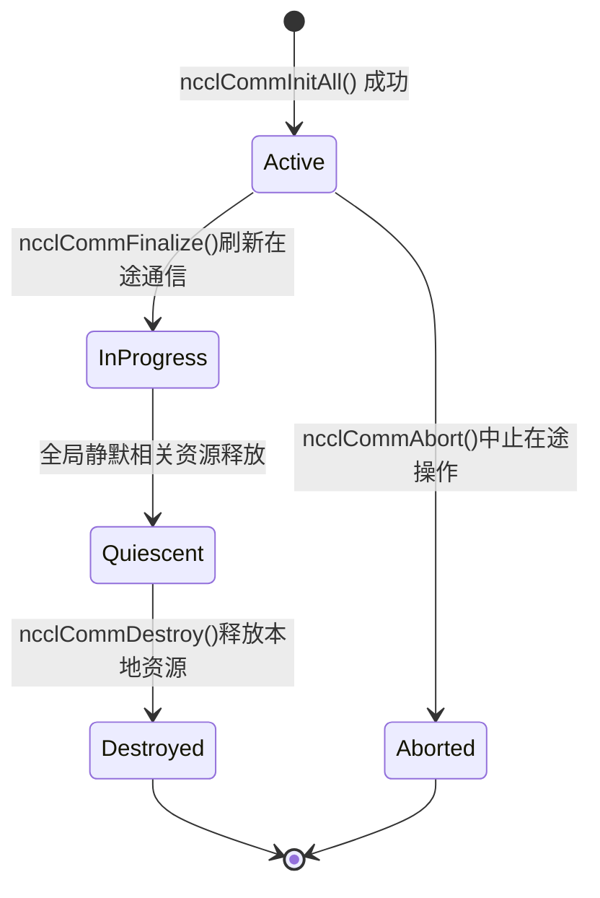

# Capítulo 1: Ejecución y fenómenos: observar el comportamiento externo comenzando desde un AllReduce

Antes de profundizar en cualquier código del kernel, primero pongamos NCCL en funcionamiento y observemos el comportamiento que expone hacia el exterior. Este capítulo no lee el kernel, solo hace una cosa: establecer un sistema de referencia verificable; cualquier análisis posterior de mecanismos internos debe, en última instancia, poder explicar el comportamiento externo visto aquí.

# 1.1 Observar la estructura de ingeniería de NCCL desde el punto de entrada de compilación

## Modelo intuitivo

El sistema de compilación es como los planos de construcción de un edificio: no decide quién vivirá en él, pero determina qué habitaciones hay y hacia dónde abren las puertas. Si el punto de entrada de compilación es caótico, ni siquiera podrás dar el primer paso de "ponerlo en funcionamiento". NCCL ofrece simultáneamente dos puntos de entrada de compilación, Makefile y CMake; comprender sus diferencias es el primer paso para entender la organización de ingeniería de este proyecto.

## La estructura de los dos puntos de entrada de compilación

El nivel superior`Makefile`es una capa de despacho extremadamente delgada; no compila ningún archivo fuente por sí misma, sino que reenvía el trabajo a los Makefile de cada subdirectorio.

[FACT:Makefile:44-45]define`src.%`reglas de patrón, reenviando objetivos como`src.build`、`src.install`a`src/Makefile`：

```
src.%:
	${MAKE} -C src $* BUILDDIR=${ABSBUILDDIR}
```

[FACT:Makefile:47-48]define el objetivo`examples`, que depende de`src.build`, y luego entra en el directorio`docs/examples`para compilar ejemplos:

```
examples: src.build
	${MAKE} -C docs/examples NCCL_HOME=${ABSBUILDDIR}
```

Presta atención a la relación de dependencia aquí: la compilación de los ejemplos depende de que`src.build`se complete primero, porque los ejemplos necesitan enlazar con la biblioteca NCCL, y la variable de entorno`NCCL_HOME`pasa el directorio de artefactos de compilación al Makefile de los ejemplos. Esta es la restricción de orden de compilación de "primero la biblioteca, luego los ejemplos".

[FACT:Makefile:29]enumera todos los objetivos limpiables:

```
TARGETS := src pkg nccl4py ir
```

[FACT:Makefile:30]Utilizando la sintaxis de referencia de sustitución de GNU Make`${TARGETS:%=%.clean}`expandir`src pkg nccl4py ir`en`src.clean pkg.clean nccl4py.clean ir.clean`, definiendo todos los objetivos de limpieza de una sola vez. Esta es una técnica común en Makefiles de "reglas impulsadas por datos" — agregar un nuevo módulo solo requiere añadir una palabra a`TARGETS`.

## Entrada de CMake: de dónde viene el número de versión

La entrada de CMake es mucho más compleja que la del Makefile, porque debe manejar multiplataforma, detección de versión de CUDA, selección de arquitectura, etc. Solo nos enfocamos en las partes directamente relacionadas con "ponerlo en marcha".

[FACT:CMakeLists.txt:5-11]muestra el origen del número de versión — no está codificado directamente en CMakeLists.txt, sino que se lee desde`makefiles/version.mk`y se extrae con expresiones regulares:

```cmake
file(READ ${CMAKE_SOURCE_DIR}/makefiles/version.mk VERSION_CONTENT)
string(REGEX REPLACE ".*NCCL_MAJOR[ ]*:=[ ]*([0-9]+).*" "\\1" NCCL_MAJOR "${VERSION_CONTENT}")
...
math(EXPR NCCL_VERSION_CODE "(${NCCL_MAJOR} * 10000) + (${NCCL_MINOR} * 100) + ${NCCL_PATCH}")
```

> **[Design Inference & Architectural Trade-offs]**
> Centralizar el número de versión en`version.mk`permite que los dos sistemas de compilación, Makefile y CMake, compartan la misma fuente de versión, evitando la clásica trampa de ingeniería de "números de versión inconsistentes entre dos sistemas de compilación".`NCCL_VERSION_CODE`La fórmula de cálculo de`MAJOR*10000 + MINOR*100 + PATCH`es consistente con la macro`NCCL_VERSION`en el archivo de cabecera.

[FACT:CMakeLists.txt:14-20]Inyecta estos números de versión a través de`add_compile_definitions`en todos los archivos fuente de C++:

```cmake
add_compile_definitions(
    NCCL_USE_CMAKE
    NCCL_MAJOR=${NCCL_MAJOR}
    NCCL_MINOR=${NCCL_MINOR}
    NCCL_PATCH=${NCCL_PATCH}
    NCCL_VERSION_CODE=${NCCL_VERSION_CODE}
)
```

[FACT:CMakeLists.txt:24-25]declara que los lenguajes del proyecto son CUDA, CXX, C:

```cmake
project(NCCL VERSION ${NCCL_MAJOR}.${NCCL_MINOR}.${NCCL_PATCH}
        LANGUAGES CUDA CXX C)
```

## Selección de arquitectura CUDA: por qué el valor predeterminado es tan complejo

[FACT:CMakeLists.txt:140-171]es un gran bloque de lógica que determina`CMAKE_CUDA_ARCHITECTURES`según la versión de CUDA. Tomando CUDA 12.8 y superior como ejemplo:

```cmake
elseif(${CUDA_MAJOR} EQUAL 12)
    if(${CUDA_MINOR} LESS 8)
        set(CMAKE_CUDA_ARCHITECTURES "50;60;61;70;80;90")
    else()
        set(CMAKE_CUDA_ARCHITECTURES "50;60;61;70;80;90;100;120")
    endif()
```

> **[Design Inference & Architectural Trade-offs]**
> La motivación de diseño de esta lógica es: el PTX de las nuevas arquitecturas (como 100, 120) solo es reconocido por cadenas de herramientas CUDA más recientes; si se fuerza la especificación de nuevas arquitecturas en CUDA antiguas, la compilación fallará directamente. Por lo tanto, la lista de arquitecturas predeterminadas debe ajustarse dinámicamente según la versión de CUDA. Para el lector, esto significa:**Si no estableces explícitamente`CMAKE_CUDA_ARCHITECTURES`, el artefacto de compilación incluirá un fatbin con una larga lista de arquitecturas, y el tiempo de compilación aumentará significativamente**. En entornos de producción normalmente se especifica explícitamente la arquitectura objetivo para acelerar la compilación.

## Diagrama de decisión del flujo de compilación

El siguiente diagrama muestra la ruta de decisión completa desde la ejecución de`make`hasta la producción de un ejemplo ejecutable:



La rama clave de este diagrama radica en si`IR_GOALS`no está vacío — esto determina si la compilación predeterminada activa adicionalmente la generación de LLVM IR. Para los lectores que solo quieren "ponerlo en marcha", mantener`EMIT_LLVM_IR=0`permite tomar la ruta más corta.

# 1.2 Requisitos previos del programa mínimo ejecutable

## Modelo intuitivo

Escribir un programa NCCL es como organizar una conferencia telefónica multipartita. Primero debes confirmar: cuántas personas participan (número de dispositivos), quién es cada persona (rank), qué línea se usa para la llamada (stream). Si falta cualquiera de estos, la conferencia no puede iniciarse. En esta sección, a través del ejemplo`01_communicators`, veremos cómo se ven estos tres requisitos previos en el código.

## Estructuras de datos: tres arreglos que contienen todo el estado

[FACT:docs/examples/01_communicators/01_multiple_devices_single_process/c/main.cc:88-92]define las variables centrales del ejemplo:

```c
int num_gpus;                 // Number of available CUDA devices
ncclComm_t *comms = NULL;     // Array of NCCL communicators (one per GPU)
cudaStream_t *streams = NULL; // Array of CUDA streams (one per GPU)
int *devices = NULL;          // Array of device IDs to use
```

Aquí se refleja el núcleo del modelo de programación multiproceso y multitarjeta de NCCL:**un dominio de comunicación, un stream y un número de dispositivo por cada GPU**. La longitud de los tres arreglos es`num_gpus`, y el índice`i`corresponde a la`i`-ésima GPU.

`ncclComm_t`se define en el archivo de cabecera como un puntero opaco.[FACT:src/nccl.h.in:36]proporciona su tipo real:

```c
typedef struct ncclComm* ncclComm_t;
```

> **[Design Inference & Architectural Trade-offs]**
> El "puntero opaco" (opaque pointer) es una técnica clásica en lenguaje C para lograr ocultamiento de información: el archivo de cabecera solo expone el tipo de puntero`struct ncclComm*`, el código de usuario no puede acceder a los campos internos de la estructura, y todas las operaciones deben realizarse a través de funciones de la API. De esta manera, NCCL puede modificar libremente el diseño interno de`ncclComm`sin romper la ABI. Para lectores principiantes, puede entenderse como "lo que obtienes es un manejador de caja negra, y solo puedes operarlo a través de la interfaz oficial".

## Paso a paso: desde la detección de dispositivos hasta la creación del dominio de comunicación

**Primer paso: detectar el número de dispositivos.** [FACT:docs/examples/01_communicators/01_multiple_devices_single_process/c/main.cc:96-104]llama a`cudaGetDeviceCount`y verifica si es 0:

```c
CUDACHECK(cudaGetDeviceCount(&num_gpus));

if (num_gpus == 0) {
    fprintf(stderr, "ERROR: No CUDA devices found on this system\n");
    ...
    return 1;
}
```

Qué hace este paso: preguntar al runtime de CUDA "cuántas GPU hay en esta máquina". Si devuelve 0, significa que no hay dispositivos disponibles y el programa sale directamente — esta es la condición de guarda más prioritaria.

**Segundo paso: asignar memoria del host y llenar la lista de dispositivos.** [FACT:docs/examples/01_communicators/01_multiple_devices_single_process/c/main.cc:114-121]asigna tres arreglos y verifica si la asignación fue exitosa:

```c
devices = (int *)malloc(num_gpus * sizeof(int));
comms = (ncclComm_t *)malloc(num_gpus * sizeof(ncclComm_t));
streams = (cudaStream_t *)malloc(num_gpus * sizeof(cudaStream_t));

if (!devices || !comms || !streams) {
    fprintf(stderr, "ERROR: Failed to allocate memory for device arrays\n");
    return 1;
}
```

[FACT:docs/examples/01_communicators/01_multiple_devices_single_process/c/main.cc:126-136]llena`devices[i] = i`con un bucle e imprime las propiedades de cada dispositivo:

```c
for (int i = 0; i >CUDA: cudaGetDeviceCount(&num_gpus)
    CUDA-->>App: num_gpus = N
    loop i in 0..N-1
        App->>CUDA: cudaSetDevice(devices[i])
        App->>CUDA: cudaStreamCreate(&streams[i])
        CUDA-->>App: streams[i]
    end
    App->>NCCL: ncclCommInitAll(comms, N, devices)
    Note over NCCL: 内部为每个设备建立通信域分配 rank 0..N-1
    NCCL-->>App: comms[0..N-1]
    loop i in 0..N-1
        App->>NCCL: ncclCommUserRank(comms[i], &rank)
        NCCL-->>App: rank = i
        App->>NCCL: ncclCommCount(comms[i], &size)
        NCCL-->>App: size = N
    end
```

Este diagrama de secuencia revela el punto clave:`ncclCommInitAll`es una**llamada bloqueante síncrona**, internamente completa toda la coordinación entre dispositivos, y al retornar todos los dominios de comunicación ya están listos.

## Reflexión de diseño: por qué se necesita ncclCommInitAll

> **[Design Inference & Architectural Trade-offs]**
> En escenarios multiproceso, cada proceso gestiona solo una GPU, usando`ncclCommInitRank`para inicializar cada uno. Pero en escenarios de un solo proceso con múltiples tarjetas, si se permite al usuario llamar manualmente para cada tarjeta`ncclCommInitRank`, se debe manejar la "sincronización entre múltiples ranks" — y en un solo proceso solo hay un hilo, que no puede avanzar simultáneamente la inicialización de múltiples ranks, lo que provocaría un deadlock.`ncclCommInitAll`Se encapsula esta coordinación dentro de la biblioteca, usando mecanismos internos (generalmente multihilo o máquina de estados) para completar la inicialización sincronizada de todos los ranks, exponiéndolo al usuario como una simple llamada síncrona. Esta es la razón fundamental de la existencia de la "función de conveniencia".

# 1.3 Comportamiento externo completo de un AllReduce

## Modelo intuitivo

AllReduce es la operación más común en comunicación colectiva: cada participante contribuye con un dato, y todos obtienen la suma de todos los datos. Como calcular la puntuación total en un trabajo en grupo — cada uno aporta su puntuación, y al final cada uno tiene una copia de la puntuación total del grupo. En esta sección rastreamos el`03_collectives/01_allreduce`ejemplo, observando el comportamiento externo completo de un AllReduce desde la llamada hasta la verificación del resultado.

## Estructuras de datos: búfer de datos e inicialización

[FACT:docs/examples/03_collectives/01_allreduce/c/main.cc:59-63]define las variables principales:

```c
int num_gpus = 0;
ncclComm_t *comms;
cudaStream_t *streams;
float **sendbuff;
float **recvbuff;
```

Nota`sendbuff`y`recvbuff`son`float**`— punteros a arrays de punteros. Cada`sendbuff[i]`es la dirección de memoria del dispositivo en la`i`-ésima GPU.

[FACT:docs/examples/03_collectives/01_allreduce/c/main.cc:99]define el tamaño de los datos:

```c
const size_t size = 32 * 1024 * 1024; // 32M floats for demonstration
```

32M de floats, 4 bytes cada uno, es decir, 128 MB de búfer de envío y 128 MB de búfer de recepción, una copia por tarjeta.

[FACT:docs/examples/03_collectives/01_allreduce/c/main.cc:101-120]es el bucle de inicialización por dispositivo:

```c
for (int i = 0; i  **[Design Inference & Architectural Trade-offs]**
> La contradicción central es: la comunicación colectiva requiere la participación simultánea de todos los ranks, pero en un solo hilo solo puedes llamar uno por uno a`ncclAllReduce`. Si la primera llamada a`ncclAllReduce`se bloquea esperando a otros ranks, y las llamadas de otros ranks aún no se han emitido, se produce un deadlock. El mecanismo Group sirve para:`ncclGroupStart`todas las llamadas posteriores a solo se "registran", no se inician realmente;`ncclGroupEnd`es cuando se envían juntas todas las operaciones registradas, permitiendo que avancen concurrentemente. Es como pedir comida a domicilio: primero añades todos los platos al carrito y al final pagas todo junto, en lugar de hacer un pedido plato por plato.

**Segundo paso: sincronizar el stream.** [FACT:docs/examples/03_collectives/01_allreduce/c/main.cc:139-142]：

```c
for (int i = 0; i 首元素=0"]
        r0["recvbuff[0]"]
    end
    subgraph dev1["GPU 1 (rank 1)"]
        s1["sendbuff[1]首元素=1"]
        r1["recvbuff[1]"]
    end
    subgraph dev2["GPU 2 (rank 2)"]
        s2["sendbuff[2]首元素=2"]
        r2["recvbuff[2]"]
    end
    s0 -->|ncclAllReducencclFloat ncclSum| reduce["归约求和0+1+2=3"]
    s1 -->|ncclAllReducencclFloat ncclSum| reduce
    s2 -->|ncclAllReducencclFloat ncclSum| reduce
    reduce -->|广播结果| r0
    reduce -->|广播结果| r1
    reduce -->|广播结果| r2
```

Este diagrama muestra las dos fases de AllReduce: primero reducción (reduce), luego difusión (broadcast). El`recvbuff`de cada rank finalmente obtiene el mismo resultado.

## Reflexión de diseño: por qué usar Group en lugar de llamadas individuales

> **[Design Inference & Architectural Trade-offs]**
> Si se elimina`ncclGroupStart`/`ncclGroupEnd`, el código quedaría:

```c
for (int i = 0; i  **[Design Inference & Architectural Trade-offs]**
> ¿Por qué la destrucción se divide en dos pasos?`ncclCommFinalize`es una**operación global**— requiere la participación de todos los ranks, asegurando que no haya comunicaciones en curso.`ncclCommDestroy`es una**operación local**— solo libera los recursos de este proceso, sin bloquear. Este diseño desacopla "esperar a que todos los ranks estén en silencio" y "liberar recursos locales": lo primero puede tardar bastante (hay que esperar al extremo de red), lo segundo es una operación puramente local. Si solo hubiera un`ncclCommDestroy`, tendría que asumir ambas responsabilidades a la vez, ya sea bloqueando demasiado tiempo o sin poder garantizar el silencio global.

## La cadena completa del orden de destrucción

[FACT:docs/examples/01_communicators/01_multiple_devices_single_process/c/main.cc:221-249]muestra el orden completo de limpieza, el comentario[FACT:docs/examples/01_communicators/01_multiple_devices_single_process/c/main.cc:218-219]enfatiza:

```c
// IMPORTANT: Proper cleanup is critical for NCCL applications
// Resources must be cleaned up in the correct order to avoid issues
```

El orden es:

1. Sincronizar todos los streams ([FACT:docs/examples/01_communicators/01_multiple_devices_single_process/c/main.cc:224-227]）

2. Finalizar + Destruir el dominio de comunicación ([FACT:docs/examples/01_communicators/01_multiple_devices_single_process/c/main.cc:233-240]）

3. Destruir el stream de CUDA ([FACT:docs/examples/01_communicators/01_multiple_devices_single_process/c/main.cc:246-249]）

4. Liberar la memoria del host ([FACT:docs/examples/01_communicators/01_multiple_devices_single_process/c/main.cc:253-255]）

## Máquina de estados del dominio de comunicación

`ncclCommFinalize`La documentación de menciona explícitamente las transiciones de estado, lo que cumple con la condición de admisión de una máquina de estados:



La transición clave de esta máquina de estados es`InProgress -> Quiescent`: es desencadenada por el evento de "silencio global", no directamente por una llamada a función. Esto significa que`ncclCommFinalize`después de retornar, el dominio de comunicación puede seguir en estado`InProgress`, y se necesita hacer polling de`ncclCommGetAsyncError`para saber cuándo entra en`Quiescent`。

## Reflexión de diseño: por qué el orden de destrucción no puede invertirse

> **[Design Inference & Architectural Trade-offs]**
> Si se destruye primero el stream de CUDA y luego el dominio de comunicación, ¿qué problema ocurriría? El dominio de comunicación puede contener internamente referencias al stream (por ejemplo, para notificaciones de finalización de operaciones asíncronas). Si el stream se destruye primero, el dominio de comunicación accede a un stream ya destruido durante Finalize, lo que provoca comportamiento indefinido. De igual forma, si se libera primero la memoria del host (`comms`array) y luego se destruye el dominio de comunicación,`ncclCommDestroy`se obtiene un puntero colgante. Por eso el orden debe ser "primero sincronizar, luego destruir el dominio de comunicación, después destruir el stream y finalmente liberar la memoria del host" —**la relación de dependencia determina que el orden de destrucción debe ser inverso al orden de creación**。

# 1.5 Guía de prevención de errores en producción

## Trampa uno: olvidar Group provoca interbloqueo

Esta es la trampa más común entre principiantes. En escenarios de múltiples GPU en un solo proceso, si se llama directamente en bucle a`ncclAllReduce`sin agregar Group, el programa se bloqueará en la primera llamada. Los síntomas son: el programa se queda colgado, el uso de CPU es cercano a 0 y no hay ninguna salida.

Método de diagnóstico: usar`gdb`para adjuntarse al proceso y ver si la pila está detenida en la lógica de espera interna de NCCL. Si es así, verificar si se omitió`ncclGroupStart`/`ncclGroupEnd`。

## Trampa dos: olvidar sincronizar el stream antes de leer el resultado

[FACT:src/nccl.h.in:854-856]indica explícitamente que`ncclGroupEnd`solo garantiza el encolamiento, no la finalización. Si se omite la sincronización del stream de[FACT:docs/examples/03_collectives/01_allreduce/c/main.cc:139-142]y se lee directamente`recvbuff`, se leerán datos incompletos.

Los síntomas son: el resultado es a veces correcto y a veces incorrecto, o se lee todo 0. Esto se debe a que`cudaMemcpy`es síncrono por defecto, pero sincroniza**el stream actual**, mientras que AllReduce puede ejecutarse en otro stream. Método de diagnóstico: agregar`cudaStreamSynchronize`antes de leer el resultado; si el problema desaparece, es esta trampa.

## Trampa tres: orden de destrucción incorrecto provoca fallo de segmentación

Si antes de`ncclCommDestroy`se`cudaFree`a`sendbuff`/`recvbuff`, el dominio de comunicación puede seguir accediendo a esos búferes durante Finalize, lo que provoca un fallo de segmentación o corrupción de datos.

Los síntomas son: el programa se bloquea en la fase de salida, o se leen datos basura de forma ocasional. Método de diagnóstico: revisar el orden del código de limpieza y asegurarse de que la destrucción del dominio de comunicación ocurra antes de liberar todos los recursos de CUDA.

## Trampa cuatro: confundir el número de dispositivo con el rank

[FACT:docs/examples/01_communicators/01_multiple_devices_single_process/c/main.cc:198-200]tiene una validación:

```c
if (device != devices[i]) {
    printf(" [WARNING: Expected device %d]", devices[i]);
}
```

> **[Design Inference & Architectural Trade-offs]**
> rank y device son dos conceptos diferentes. rank es el número lógico dentro del dominio de comunicación (0 a nRanks-1), device es el número físico de la GPU. En`ncclCommInitAll`el uso predeterminado de`devices[i] = i`, por lo que rank y device coinciden exactamente. Pero si se pasa un`devlist`personalizado (por ejemplo`{2, 0, 1}`), rank 0 corresponderá a device 2. Confundir estos dos conceptos hará que los datos se envíen a la GPU equivocada.

# Resumen del capítulo

En este capítulo completamos tres cosas:

1. **Punto de entrada de compilación**: comprendimos el mecanismo de reenvío del Makefile y el origen del número de versión de CMake, y la lógica de selección de arquitectura de CUDA. La conclusión clave es que`make examples`primero compila la biblioteca y luego los ejemplos,`NCCL_HOME`pasa el directorio de artefactos de compilación a los ejemplos.

2. **Los tres elementos de un programa mínimo ejecutable**: número de dispositivos (`cudaGetDeviceCount`), rank (asignado automáticamente por`ncclCommInitAll`), stream (uno por GPU).`ncclCommInitAll`es el punto de entrada conveniente para múltiples GPU en un solo proceso; encapsula la inicialización sincronizada de múltiples ranks dentro de la biblioteca.

3. **Comportamiento externo completo de un AllReduce**: desde`ncclGroupStart`envolviendo múltiples`ncclAllReduce`llamadas, hasta`ncclGroupEnd`enviar, luego`cudaStreamSynchronize`esperar la finalización y finalmente validar el resultado. El mecanismo Group es clave para evitar interbloqueos en escenarios de múltiples GPU con un solo hilo.

4. **Ciclo de vida del dominio de comunicación**：`ncclCommFinalize`(silencio global) +`ncclCommDestroy`(liberación local) en dos fases de destrucción, y la restricción de orden "primero sincronizar, luego destruir el dominio de comunicación, después destruir el stream y finalmente liberar la memoria del host".

# Reflexión y autoevaluación del capítulo

Q1: Si se eliminan ncclGroupStart/ncclGroupEnd de[FACT:docs/examples/03_collectives/01_allreduce/c/main.cc:130-136]y se cambia a llamar directamente en bucle a ncclAllReduce, ¿qué ocurriría en un escenario de múltiples GPU en un solo proceso? ¿Por qué?

**Análisis de referencia**: ocurriría un interbloqueo. El archivo de cabecera[FACT:src/nccl.h.in:844-864]explica la razón: las llamadas de comunicación colectiva pueden ejecutar sincronización inter-CPU, requiriendo la participación simultánea de todos los ranks. En un solo hilo, cuando la primera iteración del bucle llama a`ncclAllReduce(comms[0], ...)`, NCCL necesita esperar a que otros ranks también inicien AllReduce para avanzar. Pero las llamadas de otros ranks aún no se han ejecutado en el bucle (porque el hilo actual está bloqueado en la primera llamada), así que la primera llamada nunca recibirá a los otros ranks, interbloqueo.

La función del mecanismo Group es separar "iniciar" y "ejecutar":`ncclGroupStart`después de`ncclGroupEnd`todas las llamadas solo se registran, y en

se envían juntas todas las operaciones registradas, permitiendo que avancen concurrentemente. Esto evita fundamentalmente el interbloqueo en un solo hilo.`gdb`attach para ver la pila, se detendrá en la lógica de espera interna de NCCL, con un uso de CPU cercano a 0.

Q2: [FACT:docs/examples/03_collectives/01_allreduce/c/main.cc:139-142]¿Se puede reemplazar cudaStreamSynchronize por cudaDeviceSynchronize? ¿Cuál es la diferencia semántica entre ambos? ¿En qué escenarios este reemplazo causaría problemas?

**Análisis de referencia**: Se puede usar`cudaDeviceSynchronize`para reemplazarlo, pero la semántica es diferente.`cudaStreamSynchronize(streams[i])`solo espera a que se completen las operaciones en el stream especificado;`cudaDeviceSynchronize`espera a que se completen las operaciones de**todos**los streams en el dispositivo actual.

En escenarios de múltiples GPUs en un solo proceso,`cudaDeviceSynchronize`solo sincroniza el dispositivo actual (determinado por`cudaSetDevice`), por lo que es necesario usarlo junto con un bucle`cudaSetDevice(i)`. Si se omite`cudaSetDevice`，`cudaDeviceSynchronize`solo se sincronizará el dispositivo predeterminado (generalmente device 0), y el AllReduce de otros dispositivos podría no haber terminado.

El archivo de cabecera[FACT:src/nccl.h.in:854-856]enfatiza que`ncclGroupEnd`solo garantiza el encolamiento, no la finalización, por lo que la sincronización es obligatoria. Usar`cudaStreamSynchronize`es más preciso, porque solo espera los streams relevantes y no espera erróneamente operaciones no relacionadas. El problema de usar`cudaDeviceSynchronize`es que: si hay otros kernels no relacionados de larga duración en el dispositivo, se esperará erróneamente, reduciendo el rendimiento.

Q3: [FACT:docs/examples/01_communicators/01_multiple_devices_single_process/c/main.cc:233-240]El orden de destrucción de

**es "primero Finalize todos los dominios de comunicación, luego Destroy todos los dominios de comunicación". Si se cambiara a "para cada dominio de comunicación, primero Finalize y luego Destroy" (es decir, completar ambas operaciones en un solo bucle), ¿qué problemas habría?**Análisis de referencia

```c
ncclGroupStart();
for (i) ncclCommFinalize(comms[i]);
ncclGroupEnd();
for (i) ncclCommDestroy(comms[i]);
```

`ncclCommFinalize`Copiar

```c
for (i) {
    ncclCommFinalize(comms[i]);
    ncclCommDestroy(comms[i]);
}
```

Copiar`ncclCommFinalize(comms[0])`La primera iteración de

bloqueará esperando que todos los ranks estén silenciosos, pero el Finalize de otros dominios de comunicación aún no se ha iniciado, lo que provoca un deadlock — este es el mismo tipo de problema que el deadlock de Q1.[FACT:src/nccl.h.in:309-309]Además, el archivo de cabecera`ncclCommFinalize`indica que`ncclInProgress`cuando retorna, el dominio de comunicación podría aún estar en estado`ncclSuccess`, y es necesario esperar el silencio global para entrar en`ncclCommDestroy`. Si inmediatamente después se`ncclCommGetAsyncError`, se podrían liberar recursos locales antes de que el dominio de comunicación esté completamente silencioso, causando comportamiento indefinido. La forma correcta es, después de Finalize, hacer polling de

para confirmar el estado, y luego Destroy.
