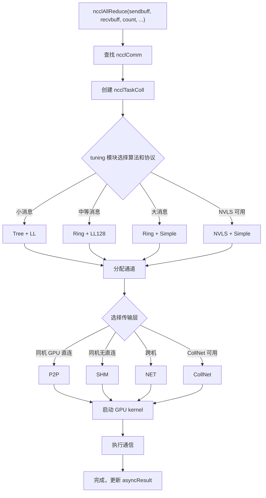

# Siguiente capítulo: Capítulo 2 →

# Progreso del libro: Capítulo 2 / 25

Capítulo 2: Modelo de abstracción central: operadores de comunicación, topología, algoritmos, protocolos y capa de transporte

# En el capítulo anterior hicimos funcionar NCCL y observamos el comportamiento externo de tres APIs: ncclCommInitRank, ncclAllReduce y ncclCommDestroy. Pero el comportamiento externo es solo la punta del iceberg — cuando ncclAllReduce retorna, ¿qué ocurre realmente en la GPU? ¿Por qué camino viajan los datos? ¿Por qué el mismo AllReduce tiene diferencias de rendimiento enormes en distintas máquinas? Para responder estas preguntas, primero hay que establecer el vocabulario común de NCCL. Este capítulo desglosará uno por uno los cinco conceptos centrales: dominio de comunicación (ncclComm), canal (channel), algoritmo (algorithm), protocolo (protocol) y capa de transporte (transport). Estos cinco conceptos atraviesan todo el libro, y cada capítulo posterior los utilizará en su análisis. Entender las relaciones entre ellos es entender el esqueleto de NCCL.

## 2.1 Dominio de comunicación ncclComm: el contexto de comunicación de un proceso

Modelo intuitivo`ncclComm`Imagina`nRanks`como un "chat grupal": cada proceso se une al chat grupal y obtiene un ID de grupo, y luego todos los mensajes se envían en ese grupo. Cuántas personas hay en el grupo (`rank`), quién soy yo (`channels`), qué ruta se toma (`config`), qué reglas se usan (

), todo queda registrado en este objeto de chat grupal.`ncclComm`Si no existiera

## , NCCL no sabría "quién se comunica con quién" ni "a dónde van los datos" — cada llamada a la API tendría que renegociar la lista de ranks y reconstruir las conexiones, con un costo inasumible.

`ncclComm`Estructura de datos y diseño de memoria`src/include/comm.h`es la estructura más central de todo NCCL, definida en

**. Es extremadamente grande (casi 300 líneas); veamos los campos clave agrupados por función.**

[FACT:src/include/comm.h:576-580]Identidad y centinelas de ciclo de vida`startMagic`，[FACT:src/include/comm.h:879-881]define`endMagic`define[FACT:src/include/comm.h:883-885]. Estos dos campos no son claves de seguridad, sino centinelas de detección de desbordamiento de memoria. En`static_assert`：

```c
static_assert(offsetof(struct ncclComm, startMagic) == 0, "startMagic must be the first field of ncclComm");
static_assert(offsetof(struct ncclComm, endMagic) == sizeof(struct ncclComm) - sizeof(uint64_t),
              "endMagic must be the last field of ncclComm");
```

> **[Design Inference & Architectural Trade-offs]**
> 〔Inferencia de diseño y compensaciones arquitectónicas〕`startMagic`Estas dos aserciones fuerzan en tiempo de compilación que`endMagic`esté en la dirección inicial de la estructura y`ncclComm`al final. En tiempo de ejecución, verificando si estos dos números mágicos han sido alterados, se puede determinar rápidamente si el puntero

**es válido — esto es muy útil para depurar bugs del tipo "acceso de puntero salvaje a un dominio de comunicación ya destruido" en entornos multihilo.**

[FACT:src/include/comm.h:628-629]Rank e información de topología`rank`define`nRanks`y[FACT:src/include/comm.h:644-652]— mi número en el dominio de comunicación y el número total de participantes.`node`define los campos relacionados con el nodo:`nNodes`(el número del nodo donde estoy),`localRank`(número total de nodos),`localRanks`(número dentro del nodo),`rankToNode`、`rankToLocalRank`、`localRankToRank`。

> **[Design Inference & Architectural Trade-offs]**
> Estas tres tablas de mapeo son la base del algoritmo de reconocimiento de topología. Por ejemplo, el algoritmo Ring necesita saber "si mi siguiente rank está dentro del mismo nodo" para decidir si usar NVLink o la red. Sin estas tablas de mapeo, cada selección de algoritmo tendría que consultar de nuevo el grafo de topología, con un costo enorme.

**Canales y búferes**

[FACT:src/include/comm.h:593-593]define`channels[MAXCHANNELS]`——este es el arreglo de todos los canales dentro del dominio de comunicación.[FACT:src/include/comm.h:674-676]define el número de canales:`nChannels`(número de canales de conexión),`collChannels`(número de canales de encolamiento de comunicación colectiva),`nvlsChannels`(número de canales NVLS).

[FACT:src/include/comm.h:691-693]define el tamaño del búfer:`buffSizes[NCCL_NUM_PROTOCOLS]`(tamaño del búfer de cada protocolo),`p2pChunkSize`(tamaño de bloque P2P),`nvlsChunkSize`(tamaño de bloque NVLS).

> **[Design Inference & Architectural Trade-offs]**
> `buffSizes`El índice del arreglo es el valor de enumeración del protocolo (LL/LL128/Simple), lo que significa que cada protocolo tiene una configuración independiente de tamaño de búfer. El protocolo LL necesita búferes pequeños para reducir la latencia, y el protocolo Simple necesita búferes grandes para aumentar el ancho de banda; este arreglo permite que ambas necesidades coexistan.

**Cola de trabajo y FIFO**

[FACT:src/include/comm.h:719-728]define los campos relacionados con la FIFO de trabajo:`workFifoBytes`(tamaño de la FIFO, potencia de 2),`workFifoBuf`(búfer de la FIFO del lado del host),`workFifoBufDev`(búfer de la FIFO del lado del dispositivo),`workFifoProduced`(bytes producidos),`workFifoConsumed`(bytes consumidos).

> **[Design Inference & Architectural Trade-offs]**
> Este es un típico búfer circular productor-consumidor. El lado del host (productor) escribe las descripciones de trabajo en la FIFO, y el kernel de la GPU (consumidor) las lee y ejecuta.`workFifoBytes`debe ser una potencia de 2, de modo que se pueda usar una máscara de bits en lugar de la operación de módulo, acelerando el cálculo del índice.

**Barrera de sincronización intraproceso**

[FACT:src/include/comm.h:731-731]define el mecanismo de sincronización de múltiples dominios de comunicación dentro del proceso:

```c
struct ncclComm* intraComm0; // leader of intra-process comms (self possible)
struct ncclComm* intraNext; // next of intra-process comms, intraComm0 is head
int intraRank;
int intraRanks;
uint32_t intraBarrierPhase;
char intraPad1[64 - sizeof(uint64_t)];
uint64_t intraBarrierCounter; // only used if this is intraComm0
char intraPad2[64 - sizeof(uint64_t)];
uint64_t intraBarrierGate; // only used if this is intraComm0
```

Nota`intraPad1`y`intraPad2`tienen un tamaño de`64 - sizeof(uint64_t)`, es decir, 56 bytes. Sumado al campo`uint64_t`anterior, cada grupo de campos ocupa exactamente 64 bytes——esto es una línea de caché (Cache Line).

> **[Design Inference & Architectural Trade-offs]**
> Esta es la típica**técnica de relleno de línea de caché (Cache Line Padding)**.`intraBarrierCounter`y`intraBarrierGate`son leídos y escritos con alta frecuencia por múltiples hilos; si comparten la misma línea de caché, provocarán**falso compartido (False Sharing)**: un hilo que modifica`intraBarrierCounter`invalidará la caché de`intraBarrierGate`de otro hilo, causando una caída drástica del rendimiento. Rellenar con 56 bytes para separarlos en diferentes líneas de caché es una técnica estándar en programación concurrente de alto rendimiento.

**Estado de error asíncrono**

[FACT:src/include/comm.h:705-705]define`asyncResult`——este campo registra el estado de las operaciones asíncronas del dominio de comunicación. En el capítulo anterior mencionamos que cuando`ncclCommFinalize`retorna, el dominio de comunicación puede seguir en estado`ncclInProgress`, y esto se rastrea mediante este campo.

## Walkthrough guiado por escenarios: desde ncclCommInitRank hasta el llenado de la estructura

Cuando el usuario llama a`ncclCommInitRank(&comm, nranks, commId, rank)`, internamente NCCL asigna una`ncclComm`estructura y la llena campo por campo. Sigamos este flujo para ver cómo se establecen los campos clave:

**Primer paso: asignación y puesta a cero**

NCCL usa`ncclCalloc`para asignar`ncclComm`, asegurando que todos los campos se inicialicen a 0. En este momento`startMagic`y`endMagic`se establecen en`NCCL_MAGIC`（[FACT:src/include/comm.h:563-569]definido como`0x0280028002800280`, y el comentario dice "Nickel atomic number is 28").

**Segundo paso: llenado de la información de identidad**

`rank`、`nRanks`、`cudaDev`se obtiene de los parámetros y de la API de CUDA.`commHash`se obtiene por hash de`ncclCommId`, y se usa para la verificación de consistencia en comunicaciones de red posteriores.

**Tercer paso: construcción del grafo de topología**

NCCL llama al módulo de detección de topología para enumerar todas las GPU, tarjetas de red y switches PCI, y construye el campo`topo`([FACT:src/include/comm.h:595-595]). Este grafo de topología determina la selección posterior de algoritmos y la planificación de rutas.

**Cuarto paso: inicialización de canales**

`channels[MAXCHANNELS]`El arreglo se inicializa uno por uno. El`id`de cada canal se establece en el índice del arreglo,`peers`y los punteros`devPeers`se asignan.

**Quinto paso: establecimiento de conexiones de transporte**

Según el grafo de topología, NCCL selecciona la capa de transporte (P2P/SHM/NET) para cada par de ranks, y llama a los callbacks correspondientes`setup`y`connect`. La información de conexión se almacena en`channels[i].peers[j]`.

**Sexto paso: establecimiento del número mágico**

Finalmente,`endMagic`se establece en`NCCL_MAGIC`, marcando que la inicialización de la estructura ha finalizado.

## Reflexiones de diseño y trampas en producción

**¿Por qué`ncclComm`es tan grande?**

> **[Design Inference & Architectural Trade-offs]**
> `ncclComm`contiene casi 300 campos, porque soporta todo el estado de un dominio de comunicación. La filosofía de diseño de NCCL es "una inicialización, múltiples reutilizaciones": durante la inicialización se calcula y almacena toda la información que pueda usarse, y en tiempo de ejecución se consulta directamente la tabla, evitando cálculos repetidos. El costo es un mayor uso de memoria (unos pocos KB por dominio de comunicación), pero en comparación con la memoria de la GPU y el ancho de banda de red, esta memoria es insignificante.

**Escenario de trampa uno: dominio de comunicación compartido entre múltiples hilos**

> **[Design Inference & Architectural Trade-offs]**
> `ncclComm`no es seguro para hilos. Si dos hilos llaman simultáneamente al mismo`ncclComm`, campos como`ncclAllReduce`，`workFifoProduced`competirán, causando corrupción de datos. La práctica correcta es que cada hilo use un dominio de comunicación independiente, o serializar las llamadas con un bloqueo externo.

**Escenario de trampa dos: acceso después de la destrucción**

`ncclCommDestroy`Después de que`startMagic`libera la memoria de la estructura, si algún hilo aún conserva el puntero y accede a ella, leerá memoria ya liberada.`endMagic`y

**pueden ayudar a detectar esta situación: si el número mágico no coincide, significa que el puntero ya no es válido.**

Escenario de trampa tres: falso compartido de línea de caché`intraBarrierCounter`En escenarios multiproceso (un rank por proceso),`intraBarrierGate`el relleno de

# y

## es especialmente importante. Si se omite el relleno, las operaciones de barrera de múltiples procesos interferirán entre sí, haciendo que la latencia de sincronización pase de nanosegundos a microsegundos.

2.2 Canal channel: dividir una comunicación en múltiples líneas de ensamblaje`channel`Es la «cinta transportadora» de NCCL: divide los datos de una comunicación colectiva en múltiples partes, cada canal transporta una parte de forma independiente, avanzando en paralelo para mejorar la utilización del ancho de banda.

Sin canales, todos los datos solo pueden recorrer una única ruta, y los múltiples enlaces físicos entre GPUs (múltiples NICs, múltiples grupos de NVLink) no pueden utilizarse simultáneamente, lo que reduce drásticamente la utilización del ancho de banda.

## Estructura de datos y diseño de memoria

`ncclChannel`Definido en[FACT:src/include/comm.h:169-191]：

```c
struct ncclChannel {
  struct ncclChannelPeer** peers;
  struct ncclDevChannelPeer** devPeers;
  /* devPeer pointer array used for host side access */
  struct ncclDevChannelPeer** devPeersHostPtr;
  struct ncclRing ring;
  int* devRingUserRanks;
  struct ncclTree tree;

  struct ncclTree collnetChain;
  struct ncclDirect collnetDirect;

  struct ncclNvls nvls;

  int id; // index of this channel
  uint32_t workFifoProduced; // +1 successor of last used work fifo byte

  /* comm split sharable resources */
  struct ncclChannelPeer* collnetPeers;
  struct ncclDevChannelPeer* collnetDevPeers;
  struct ncclChannelPeer* nvlsPeers;
  struct ncclDevChannelPeer* nvlsDevPeers;
};
```

**Análisis de campos clave**

- `peers` / `devPeers`: apunta a la información de conexión de todos los ranks dentro de ese canal.`peers`Es la vista del lado del host,`devPeers`Es la vista del lado del dispositivo (accedida directamente por el kernel de GPU).
- `ring`: descripción topológica del algoritmo Ring: predecesor y sucesor de cada rank.
- `tree`: descripción topológica del algoritmo Tree: nodo padre y lista de nodos hijos.
- `collnetChain` / `collnetDirect`: dos variantes topológicas del algoritmo CollNet.
- `nvls`: descripción topológica de NVLink SHARP.
- `id`: índice del canal, de 0 a`nChannels-1`。
- `workFifoProduced`: puntero de producción del FIFO de trabajo de ese canal.

> **[Design Inference & Architectural Trade-offs]**
> Nótese que`ring`、`tree`、`collnetChain`、`collnetDirect`、`nvls`Estos cinco campos son**paralelos**: un mismo canal puede contener simultáneamente descripciones topológicas de múltiples algoritmos. En tiempo de ejecución, la selección del algoritmo determina qué campo se utiliza. Este diseño permite cambiar de algoritmo sin reconstruir el canal, solo cambiando el campo que se lee.

**Cálculo del número de canales**

El número de canales se define en`ncclComm`([FACT:src/include/comm.h:674-676]）：

```c
int nChannels; // connection nChannels
int collChannels; // enqueue nChannels
int nvlsChannels; // enqueue nChannels
```

> **[Design Inference & Architectural Trade-offs]**
> `nChannels`Es el número de conexiones realmente establecidas,`collChannels`Es el número de canales utilizados al encolar la comunicación colectiva,`nvlsChannels`Es el número de canales dedicados a NVLS. Los tres pueden ser diferentes; por ejemplo, algunos canales se usan solo para P2P y no para comunicación colectiva.

**Planificación de canales P2P**

[FACT:src/include/channel.h:21-33]Define la`ncclP2pChannelBaseForRound`función, utilizada para calcular la dirección base del canal usado en cada round de la comunicación P2P:

```c
inline uint8_t ncclP2pChannelBaseForRound(struct ncclComm* comm, int p2pRound) {
  int base;
  if (comm->nNodes > 1) {
    int localSize = comm->p2pSchedGroupSize;
    int groupDelta = p2pRound / localSize;
    int localDelta = p2pRound % localSize;
    base = groupDelta * divUp(localSize, NCCL_MAX_DEV_WORK_P2P_PER_BATCH);
    base += localDelta / NCCL_MAX_DEV_WORK_P2P_PER_BATCH;
  } else {
    base = p2pRound;
  }
  return reverseBits(base, log2Up(comm->p2pnChannels));
}
```

> **[Design Inference & Architectural Trade-offs]**
> La lógica de esta función es: en escenarios multinodo, la comunicación P2P se planifica por «grupos», y los ranks dentro de cada grupo usan canales adyacentes; en escenarios de un solo nodo, cada round se asigna directamente a un canal.`reverseBits`Es una operación de inversión de bits, utilizada para dispersar la asignación de canales y evitar la concentración de puntos calientes.

## Walkthrough guiado por escenarios: cómo se asignan los canales en un AllReduce

Supongamos 8 ranks y 4 canales, ejecutando un AllReduce. Los datos se dividen en 4 partes, cada una gestionada por un canal.

**Primer paso: selección de algoritmo**

El módulo de tuning de NCCL selecciona el algoritmo (por ejemplo, Ring) y el protocolo (por ejemplo, Simple) según el tamaño del mensaje y la topología.

**Segundo paso: asignación de canales**

`ncclTaskColl`Se crea la estructura[FACT:src/include/comm.h:212-273]), donde el campo`nChannels`se establece en 4 ([FACT:src/include/comm.h:254-254]）。`channelLo`y los campos`channelHi`) marcan el rango de canales utilizados por esa tarea.[FACT:src/include/comm.h:256-257]Tercer paso: división de datos

**Cada canal se encarga de**

elementos. El canal 0 procesa los elementos del 0 al count/4-1, el canal 1 procesa los elementos de count/4 a count/2-1, y así sucesivamente.`count / nChannels`Cuarto paso: ejecución en paralelo

**Los kernels de GPU de los 4 canales se lanzan simultáneamente, cada uno ejecutando Ring AllReduce sobre su propia porción de datos. Dado que no hay dependencias de datos entre canales, pueden ejecutarse completamente en paralelo.**

Quinto paso: combinación de resultados

**Una vez que todos los canales terminan, el recv buffer de cada rank contiene el resultado completo del AllReduce.**

Control de concurrencia e interacción con el hardware

## Mapeo entre canales y recursos de GPU

**〔Inferencia de diseño y compensaciones arquitectónicas〕**

> **[Design Inference & Architectural Trade-offs]**
> Mapeo entre canales y dispositivos de red

**En escenarios con múltiples NICs, distintos canales pueden vincularse a distintas NICs. Por ejemplo, con 4 canales y 2 NICs, los canales 0 y 1 van por la NIC A, y los canales 2 y 3 por la NIC B. Así se aprovecha el ancho de banda de ambas NICs.**

Elección del número de canales

**〔Inferencia de diseño y compensaciones arquitectónicas〕**

> **[Design Inference & Architectural Trade-offs]**
> Mayor sobrecarga de lanzamiento de kernels

- Mayor sobrecarga de establecimiento de conexiones
- Sincronización más compleja
- El módulo de tuning de NCCL selecciona automáticamente el número óptimo de canales según el tamaño del mensaje. Mensajes pequeños usan pocos canales (para reducir sobrecarga), mensajes grandes usan más canales (para aumentar el ancho de banda).

Guía de evitación de problemas en producción

## Escenario problemático 1: configuración inadecuada del número de canales

**〔Inferencia de diseño y compensaciones arquitectónicas〕**

> **[Design Inference & Architectural Trade-offs]**
> demasiado grande, en escenarios de mensajes pequeños la sobrecarga de lanzamiento de kernels superará el beneficio y el rendimiento disminuirá. Se recomienda dejar que NCCL elija automáticamente, salvo que haya una necesidad clara de ajuste.`NCCL_NCHANNELS`Escenario problemático 2: desajuste entre canales y topología

**〔Inferencia de diseño y compensaciones arquitectónicas〕**

> **[Design Inference & Architectural Trade-offs]**
> Escenario problemático 3: conflicto de canales P2P

**Si la operación**

`ncclP2pChannelBaseForRound`de`reverseBits`se implementa incorrectamente, múltiples rounds se asignarán al mismo canal, provocando serialización.[FACT:src/include/channel.h:32-32]La operación`reverseBits(base, log2Up(comm->p2pnChannels))`de

# garantiza una asignación uniforme de canales.

## 2.3 Algoritmo algorithm: organización topológica de Tree/Ring/CollNet/NVLS/PAT

De Beijing a Shanghái se puede ir en tren de alta velocidad, avión o coche, y cada medio se adapta a distintas distancias y números de personas. Los algoritmos de NCCL son esos «medios de transporte»: Ring es adecuado para el ancho de banda estable de mensajes grandes, Tree para la baja latencia de mensajes pequeños, CollNet aprovecha la descarga de la tarjeta de red, NVLS utiliza la aceleración por hardware NVLink SHARP, y PAT es una variante paralelizada de NVLS.

Sin selección de algoritmo, NCCL solo podría comunicarse con un único modo fijo, incapaz de adaptarse a distintos tamaños de mensaje y topologías, y el rendimiento se vería muy degradado.

## Estructuras de datos y diseño de memoria

**Algoritmo Ring**

El núcleo del algoritmo Ring es la`ncclRing`estructura (en`src/include/comm.h`referenciada mediante`channels[i].ring`).[FACT:src/include/collectives.h:81-116]define la`RingAlgorithm`clase base:

```c
class RingAlgorithm {
protected:
  int refCount;
  int nRanks;
  int nStepsPerLoop;
  int chunkSteps;
  int sliceSteps;
  ssize_t sliceSize;
  ssize_t loopSize;
  ssize_t channelSize;
  uint8_t* sendbuff;
  uint8_t* recvbuff;
  void* sendMhandle;
  void* recvMhandle;
  void* srecvMhandle;

public:
  virtual void getNextSendAddr(int curStep, uint8_t** sendbuffOut, size_t* sizeOut, void** mhandleOut) = 0;
  virtual void getNextRecvAddr(int curStep, uint8_t** recvbuffOut, size_t* sizeOut, void** mhandleOut) = 0;
  int incRefCount() {
    return (int)COMPILER_ATOMIC_ADD_FETCH(&refCount, 1, std::memory_order_relaxed);
  }
  int decRefCount() {
    return (int)COMPILER_ATOMIC_SUB_FETCH(&refCount, 1, std::memory_order_release);
  }
  RingAlgorithm() {
    refCount = 0;
  }
  virtual ~RingAlgorithm() {};
};
```

**Análisis de campos clave**

- `refCount`: recuento de referencias, utilizado para que el hilo proxy y el kernel de GPU compartan el objeto de algoritmo.
- `nRanks`: número de nodos en el anillo.
- `nStepsPerLoop`: número de pasos por ciclo. AllReduce es`2*(nRanks-1)*chunkSteps`（[FACT:src/include/collectives.h:218-218]）。
- `chunkSteps` / `sliceSteps`: pasos de bloque y pasos de slice, que controlan la granularidad del pipeline.
- `sliceSize` / `loopSize` / `channelSize`: tamaño de slice, tamaño de ciclo, tamaño de canal.
- `sendbuff` / `recvbuff`: punteros a los búferes de envío y recepción.
- `sendMhandle` / `recvMhandle` / `srecvMhandle`: manejador de memoria, utilizado para el registro de red.

**Operaciones atómicas del recuento de referencias**

[FACT:src/include/collectives.h:106-108]muestra`incRefCount`y`decRefCount`：

```c
int incRefCount() {
  return (int)COMPILER_ATOMIC_ADD_FETCH(&refCount, 1, std::memory_order_relaxed);
}
int decRefCount() {
  return (int)COMPILER_ATOMIC_SUB_FETCH(&refCount, 1, std::memory_order_release);
}
```

> **[Design Inference & Architectural Trade-offs]**
> `incRefCount`utiliza`memory_order_relaxed`——incrementar el recuento de referencias no requiere sincronización, basta con garantizar la atomicidad.`decRefCount`utiliza`memory_order_release`——al decrementar el recuento de referencias, es necesario asegurar que las escrituras previas sean visibles para otros hilos (ya que puede desencadenar la destrucción del objeto).

**RingARAlgorithm: implementación Ring de AllReduce**

[FACT:src/include/collectives.h:118-234]define`RingARAlgorithm`, que hereda de`RingAlgorithm`. Los métodos principales son`getNextSendAddr`y`getNextRecvAddr`。

[FACT:src/include/collectives.h:126-167]de`getNextSendAddr`lógica:

```c
void getNextSendAddr(int curStep, uint8_t** sendbuffOut, size_t* sizeOut, void** mhandleOut) {
  int curLoop = curStep / nStepsPerLoop;
  int curLoopStage = (curStep % nStepsPerLoop) / chunkSteps;
  int chunkStage = curLoopStage % nRanks;
  int sliceStage = (curStep % chunkSteps) / sliceSteps;
  ssize_t elemOffset = curLoop * loopSize;
  ssize_t remSize = channelSize - elemOffset;
  // ... 计算 chunkOffset, sliceOffset, curSliceSize ...
  if (remSize  **[Design Inference & Architectural Trade-offs]**
> El núcleo de este código es**el cálculo de direcciones**: dado el paso actual`curStep`, calcula qué slice de qué bloque de datos debe enviarse.`chunkId`El cálculo de`(ringIndex + nRanks - 1 - chunkStage) % nRanks`implementa la propagación inversa en el anillo: cada rank recibe datos de su predecesor, los procesa y los envía a su sucesor.

**Algoritmo PAT**

PAT (Parallel Aggregated Tree) es una variante paralelizada de NVLS.[FACT:src/include/collectives.h:416-423]define`ncclPatStep`：

```c
struct ncclPatStep {
  int recvDim, sendDim, recvOffset, sendOffset, stepOffset, postRecv, postSend, nelem, last, flags;
  // PAT algo computation thread step number; -1 while the slot is free.
  int step;
  // This PAT group's offset within the shared NVLS slot.
  int nvlsOffset;
  size_t inpIx, outIx;
};
```

[FACT:src/include/collectives.h:425-435]define`ncclPatPeer`：

```c
struct ncclPatPeer {
  uint64_t step;
  struct ncclConnInfo* conn;
  struct ncclConnFifo* connFifo;
  void* buff;
  uint64_t* headPtr;
  uint64_t* tailPtr;
  uint64_t stepCache;
  long long int accSize;
  int connStepSize;
};
```

> **[Design Inference & Architectural Trade-offs]**
> La idea central del algoritmo PAT es**agregar múltiples pasos pequeños en un solo paso grande**, reduciendo la sobrecarga de sincronización.`ncclPatStep`describe las dimensiones de envío/recepción, desplazamientos, número de elementos, etc. de un paso de agregación.`ncclPatPeer`describe el estado de conexión y los punteros de búfer de un nodo par.

## Walkthrough guiado por escenarios: evolución de los pasos de Ring AllReduce

Supongamos 4 ranks (0, 1, 2, 3), cada rank con 4 elementos, ejecutando Ring AllReduce.

**Fase Reduce-Scatter**

- Paso 0: el rank 0 envía el elemento 0 al rank 1, el rank 1 envía el elemento 1 al rank 2, el rank 2 envía el elemento 2 al rank 3, el rank 3 envía el elemento 3 al rank 0.
- Paso 1: cada rank suma el elemento recibido con el elemento local correspondiente y luego lo envía al siguiente rank.
- Paso 2: continúa la acumulación y transmisión.
- Paso 3: en este punto cada rank posee un resultado de reducción completo (el rank 0 tiene el resultado del elemento 3, el rank 1 tiene el resultado del elemento 0, etc.).

**Fase AllGather**

- Pasos 4-6: cada rank propaga por el anillo el resultado de reducción que posee, y finalmente todos los ranks tienen el resultado completo.

[FACT:src/include/collectives.h:218-218]El`nStepsPerLoop = 2 * (nRanks - 1) * chunkSteps`de`(nRanks-1)*chunkSteps`corresponde exactamente a este flujo: Reduce-Scatter requiere`(nRanks-1)*chunkSteps`pasos, AllGather también requiere`2*(nRanks-1)*chunkSteps`pasos, en total

## pasos.

**Reflexiones de diseño y trampas en producción**

> **[Design Inference & Architectural Trade-offs]**
> 〔Inferencia de diseño y compensaciones arquitectónicas〕

**El algoritmo Ring tiene una alta utilización de ancho de banda (todos los enlaces están transmitiendo), pero la latencia crece linealmente con el número de ranks. La latencia del algoritmo Tree es logarítmica, pero su utilización de ancho de banda es baja (solo parte de los enlaces trabajan). NCCL selecciona automáticamente según el tamaño del mensaje: mensajes pequeños usan Tree (sensible a la latencia), mensajes grandes usan Ring (sensible al ancho de banda).**

> **[Design Inference & Architectural Trade-offs]**
> 〔Inferencia de diseño y compensaciones arquitectónicas〕

**Si se fuerza manualmente el uso de Ring para mensajes pequeños, la latencia aumentará significativamente. Se recomienda dejar que el módulo de tuning seleccione automáticamente, a menos que haya datos claros de análisis de rendimiento que respalden la intervención manual.**

Escenario de trampa 2: hardware NVLS no compatible[FACT:src/include/comm.h:755-755]NVLS requiere soporte de hardware específico (NVLink SHARP). Si el hardware no lo soporta pero el código fuerza el uso de NVLS, se recurrirá a Ring o Tree, pero puede acompañarse de fluctuaciones de rendimiento.`nvlsSupport`El campo

**de**

marca si el hardware soporta NVLS.`aggFactor`Escenario de trampa 3: configuración del factor de agregación del algoritmo PAT[FACT:src/include/collectives.h:537-560]El`aggFactor`del algoritmo PAT

```c
aggFactor = 1;
size_t channelSize = end - offset;
while (stepSize / (channelSize * sizeof(T) * aggFactor) >= 2 && aggFactor  1 && aggFactor  **[Design Inference & Architectural Trade-offs]**
> `aggFactor`la lógica de cálculo de`stepSize`、`channelSize`、`nranks`:

# Copiar

## 〔Inferencia de diseño y compensaciones arquitectónicas〕

Para enviar un paquete se puede elegir «entrega exprés en la misma ciudad», «entrega al día siguiente» o «mensajería normal»; la velocidad y el costo son diferentes. Los protocolos de NCCL son precisamente esas «formas de envío»: LL (Low Latency) es adecuado para la transmisión de mensajes pequeños con baja latencia, LL128 es adecuado para la transmisión de mensajes medianos alineados a 128 bytes, y Simple es adecuado para la transmisión de mensajes grandes con alto ancho de banda.

Si no hubiera selección de protocolo, NCCL solo podría mover datos con una única estrategia fija, sin poder lograr un equilibrio entre latencia y ancho de banda.

## Estructuras de datos y diseño de memoria

**Enumeración de protocolos**

[FACT:src/include/comm.h:55-57]Define los umbrales de hilos relacionados con el protocolo:

```c
#define NCCL_LL_THREAD_THRESHOLD 8
#define NCCL_LL128_THREAD_THRESHOLD 8
#define NCCL_SIMPLE_THREAD_THRESHOLD 64
```

> **[Design Inference & Architectural Trade-offs]**
> Estos umbrales determinan cuántos hilos utiliza cada protocolo. LL y LL128 usan 8 hilos (baja latencia, basta con pocos hilos), Simple usa 64 hilos (alto ancho de banda, requiere más hilos para mover datos en paralelo).

**Búfer de protocolo**

[FACT:src/include/comm.h:691-691]Define`buffSizes[NCCL_NUM_PROTOCOLS]`——cada protocolo tiene un tamaño de búfer independiente.

**Estructura FIFO relacionada con el protocolo**

[FACT:src/include/comm.h:59-83]Define`ncclSendMem`y`ncclRecvMem`：

```c
struct ncclSendMem {
  union {
    struct {
      uint64_t head;
      char pad1[CACHE_LINE_SIZE - sizeof(uint64_t)];
      void* ptrExchange;
      uint64_t redOpArgExchange[2];
      char pad2[CACHE_LINE_SIZE - sizeof(void*) - 2 * sizeof(uint64_t)];
      int offsFifo[NCCL_STEPS];
    };
    char pad3[MEM_ALIGN];
  };
};

struct ncclRecvMem {
  union {
    struct {
      uint64_t tail;
      char pad1[CACHE_LINE_SIZE - sizeof(uint64_t)];
      struct ncclConnFifo connFifo[NCCL_STEPS];
      int flush; // For GDRCopy-based flush
    };
    char pad4[MEM_ALIGN];
  };
};
```

> **[Design Inference & Architectural Trade-offs]**
> `ncclSendMem`y`ncclRecvMem`son estructuras de memoria compartida para envío y recepción.`head`y`tail`son los punteros de lectura y escritura del búfer circular,`pad1`asegurando que estén en líneas de caché diferentes.`connFifo`El arreglo almacena la información de conexión de cada paso (modo, desplazamiento, tamaño, puntero), definido en[FACT:src/include/collectives.h:72-77]：

```c
struct ncclConnFifo {
  int mode;
  ssize_t offset;
  ssize_t size;
  void* ptr;
};
```

**Lógica de selección de protocolo**

> **[Design Inference & Architectural Trade-offs]**
> La selección de protocolo la realiza el módulo tuning, y los factores considerados incluyen:

- Tamaño del mensaje: los mensajes pequeños usan LL, los medianos usan LL128, los grandes usan Simple.
- Topología: las conexiones NVLink son adecuadas para LL128, las conexiones de red son adecuadas para Simple.
- Capacidad de hardware: algunas arquitecturas de GPU tienen optimizaciones para protocolos específicos.

## Walkthrough guiado por escenarios: movimiento de datos con el protocolo LL

Supongamos que se usa el protocolo LL para transmitir 1 KB de datos.

**Primer paso: los datos se escriben en el búfer de envío**

El lado del host escribe los datos en`sendbuff`, luego actualiza`ncclSendMem.head`el puntero, notificando al kernel de GPU que hay nuevos datos.

**Segundo paso: el kernel de GPU lee los datos**

El kernel de GPU sondea`head`el puntero; tras detectar nuevos datos, lee los datos desde`sendbuff`.

**Tercer paso: transmisión de datos**

El kernel de GPU envía los datos al rank de destino a través de NVLink o de la red.

**Cuarto paso: el rank de destino recibe los datos**

El kernel de GPU del rank de destino escribe los datos en`recvbuff`, luego actualiza`ncclRecvMem.tail`el puntero.

**Quinto paso: el lado del host lee los datos**

El lado del host sondea`tail`el puntero; tras detectar nuevos datos, lee los datos desde`recvbuff`.

## Control de concurrencia e interacción con el hardware

**Mecanismo de baja latencia del protocolo LL**

> **[Design Inference & Architectural Trade-offs]**
> El protocolo LL utiliza**sondeo (Polling)**en lugar de interrupciones para detectar la llegada de datos. El kernel de GPU lee continuamente`head`el puntero y, en cuanto detecta un cambio, lo procesa de inmediato. Esto tiene menor latencia que el método por interrupciones, pero ocupa recursos de cómputo de la GPU.

**Alineación a 128 bytes del protocolo LL128**

> **[Design Inference & Architectural Trade-offs]**
> El protocolo LL128 requiere que los datos estén alineados a 128 bytes, de modo que cada transmisión llene exactamente una línea de caché. Las ventajas de la alineación son:

- Reducir escrituras parciales de línea de caché (Partial Cache Line Write)
- Mejorar la utilización del ancho de banda de memoria
- Simplificar la lógica de procesamiento del hardware

**Transmisión por lotes del protocolo Simple**

> **[Design Inference & Architectural Trade-offs]**
> El protocolo Simple utiliza**transmisión por lotes**modo: acumula cierta cantidad de datos y los envía de una sola vez, reduciendo el número de sincronizaciones. Esto es adecuado para escenarios de mensajes grandes, porque el costo de sincronización se reparte entre una gran cantidad de datos.

## Guía para evitar errores en producción

**Escenario problemático uno: desajuste entre protocolo y tamaño de mensaje**

> **[Design Inference & Architectural Trade-offs]**
> Si se fuerza el uso del protocolo LL para transmitir mensajes grandes, el rendimiento caerá drásticamente. Esto se debe a que el objetivo de diseño del protocolo LL es la baja latencia, no el alto ancho de banda. Los mensajes grandes deberían usar el protocolo Simple.

**Escenario problemático dos: problema de alineación de LL128**

> **[Design Inference & Architectural Trade-offs]**
> Si los datos no están alineados a 128 bytes, el protocolo LL128 recurrirá a LL o Simple, provocando un rendimiento inestable. Se recomienda asegurar que tanto el búfer de envío como el de recepción estén alineados a 128 bytes.

**Escenario problemático tres: costo del cambio de protocolo**

> **[Design Inference & Architectural Trade-offs]**
> Cambiar dinámicamente de protocolo en tiempo de ejecución conlleva un costo adicional. NCCL determina el protocolo durante la inicialización y no lo cambia en tiempo de ejecución. Si se necesita cambiar, se debe reinicializar el dominio de comunicación.

# 2.5 Capa de transporte transport: canal subyacente de movimiento P2P/SHM/NET/CollNet

## Modelo intuitivo

Para ir del punto A al punto B se puede caminar, ir en bicicleta, tomar el metro o tomar un taxi; la capa de transporte de NCCL son esas distintas «formas de desplazamiento». La capa superior no se preocupa por cómo se recorre exactamente, solo por si se puede entregar. P2P es «caminar» (conexión directa entre GPU de la misma máquina), SHM es «ir en bicicleta» (memoria compartida), NET es «tomar el metro» (red), CollNet es «tomar un taxi» (descarga a la tarjeta de red).

Si no existiera la abstracción de la capa de transporte, los algoritmos de la capa superior tendrían que escribir código diferente para cada enlace físico, sin posibilidad de reutilización.

## Estructuras de datos y diseño de memoria

**Enumeración de la capa de transporte**

[FACT:src/include/transport.h:18-23]Define los tipos de capa de transporte:

```c
#define NTRANSPORTS 4
#define TRANSPORT_UNDEFINED -1
#define TRANSPORT_P2P 0
#define TRANSPORT_SHM 1
#define TRANSPORT_NET 2
#define TRANSPORT_COLLNET 3
```

**Interfaz de la capa de transporte**

[FACT:src/include/transport.h:129-146]Define`ncclTransportComm`——la interfaz de comunicación de la capa de transporte:

```c
struct ncclTransportComm {
  ncclResult_t (*setup)(struct ncclComm* comm, struct ncclTopoGraph* graph, struct ncclPeerInfo*, struct ncclPeerInfo*,
                        struct ncclConnect*, struct ncclConnector*, int channelId, int connIndex);
  ncclResult_t (*connect)(struct ncclComm* comm, struct ncclConnect*, int nranks, int rank, struct ncclConnector*);
  ncclResult_t (*free)(struct ncclComm* comm, struct ncclConnector*);
  ncclResult_t (*proxySharedInit)(struct ncclProxyConnection* connection, struct ncclProxyState* proxyState,
                                  int nChannels);
  ncclResult_t (*proxySetup)(struct ncclProxyConnection* connection, struct ncclProxyState* proxyState, void* reqBuff,
                             int reqSize, void* respBuff, int respSize, int* done);
  ncclResult_t (*proxyConnect)(struct ncclProxyConnection* connection, struct ncclProxyState* proxyState, void* reqBuff,
                               int reqSize, void* respBuff, int respSize, int* done);
  ncclResult_t (*proxyFree)(struct ncclProxyConnection* connection, struct ncclProxyState* proxyState);
  ncclResult_t (*proxyProgress)(struct ncclProxyState* proxyState, struct ncclProxyArgs*);
  ncclResult_t (*proxyRegister)(struct ncclProxyConnection* connection, struct ncclProxyState* proxyState,
                                void* reqBuff, int reqSize, void* respBuff, int respSize, int* done);
  ncclResult_t (*proxyDeregister)(struct ncclProxyConnection* connection, struct ncclProxyState* proxyState,
                                  void* reqBuff, int reqSize, int* done);
};
```

**Análisis de callbacks clave**

- `setup`: trabajo preparatorio antes de establecer la conexión, intercambio de parámetros de conexión.
- `connect`: establecimiento real de la conexión.
- `free`: liberación de los recursos de conexión.
- `proxySharedInit`: Inicializa los recursos compartidos del hilo proxy.
- `proxySetup` / `proxyConnect`: Establecimiento de conexión del lado del hilo proxy.
- `proxyProgress`: El hilo proxy impulsa la transferencia de datos.
- `proxyRegister` / `proxyDeregister`: Registro y anulación de registro de memoria.

**Estructura de la capa de transporte**

[FACT:src/include/transport.h:148-154]define`ncclTransport`：

```c
struct ncclTransport {
  const char name[8];
  ncclResult_t (*canConnect)(int*, struct ncclComm* comm, struct ncclTopoGraph* graph, struct ncclPeerInfo*,
                             struct ncclPeerInfo*);
  struct ncclTransportComm send;
  struct ncclTransportComm recv;
};
```

> **[Design Inference & Architectural Trade-offs]**
> `name`es el nombre de la capa de transporte (como "P2P", "SHM", "NET"),`canConnect`determina si se puede usar esa capa de transporte entre dos ranks,`send`y`recv`son las interfaces de comunicación en dirección de envío y recepción respectivamente.

**Instancias de la capa de transporte**

[FACT:src/include/transport.h:36-36]declara cuatro instancias de capa de transporte:

```c
extern struct ncclTransport p2pTransport;
extern struct ncclTransport shmTransport;
extern struct ncclTransport netTransport;
extern struct ncclTransport collNetTransport;
```

[FACT:src/include/transport.h:36-36]define el arreglo de capas de transporte:

```c
extern struct ncclTransport* ncclTransports[];
```

**Información de nodos pares**

[FACT:src/include/transport.h:46-74]define`ncclPeerInfo`——metadatos intercambiados entre ranks:

```c
struct ncclPeerInfo {
  int rank;
  int cudaDev;
  int nvmlDev;
  int gdrSupport;
  uint64_t hostHash;
  uint64_t pidHash;
  dev_t shmDev;
  int64_t busId;
  cudaUUID_t gpuUuid;
  struct ncclComm* comm;
  int cudaCompCap;
  int gpuCftSupport;
  size_t totalGlobalMem;
  // MNNVL support
  nvmlGpuFabricInfoV_t fabricInfo;
  int fabricHandleSupport;
  int cuMemSupport;
  int version;
  uint64_t supportedGinTypeBitMask;
  bool crossNicSupport;
  bool rmaPluginAvailable;
  bool cuMemGdrSupport;
  int mloPart; // MLOPart partition index, or -1 if not an MLOPart GPU
  int cudaDriverVersion;
  bool gpuCftMulticastSupport;
  bool gpuCftCountedSupport;
  uint32_t gitVersionHash;
};
```

> **[Design Inference & Architectural Trade-offs]**
> Estos campos se usan para determinar qué capa de transporte se puede usar entre dos ranks:

- `hostHash`iguales → mismo host → se puede usar P2P o SHM
- `hostHash`diferentes → hosts distintos → se debe usar NET
- `gdrSupport`→ si soporta GPUDirect RDMA
- `cudaCompCap`→ capacidad de cómputo de la GPU, afecta la selección del protocolo

## Walkthrough guiado por escenarios: establecer una conexión P2P

Supongamos que dos ranks están en el mismo host, NCCL selecciona la capa de transporte P2P.

**Primer paso: intercambiar PeerInfo**

Los dos ranks intercambian a través del canal bootstrap`ncclPeerInfo`, confirman que están en el mismo host y que la GPU soporta P2P.

**Segundo paso: llamar a canConnect**

[FACT:src/include/transport.h:148-154]de`canConnect`se invoca el callback, verifica el grafo de topología para confirmar que hay conexión NVLink o PCIe entre las dos GPU.

**Tercer paso: llamar a setup**

`p2pTransport.send.setup`y`p2pTransport.recv.setup`se invocan, preparan los parámetros de conexión (como el handle IPC).

**Cuarto paso: llamar a connect**

`p2pTransport.send.connect`y`p2pTransport.recv.connect`se invocan, establecen la conexión realmente.

**Quinto paso: registrar memoria**

Si se necesita RDMA, llamar a`proxyRegister`para registrar los búferes de envío y recepción.

## Control de concurrencia e interacción con hardware

**Capa de transporte P2P**

> **[Design Inference & Architectural Trade-offs]**
> P2P usa el mecanismo CUDA IPC (Inter-Process Communication), que permite que una GPU acceda directamente a la memoria de otra GPU. Esto requiere:

- que las dos GPU estén en el mismo dominio PCIe o dominio NVLink
- que el sistema operativo soporte CUDA IPC
- permisos suficientes

**Capa de transporte SHM**

> **[Design Inference & Architectural Trade-offs]**
> SHM usa memoria compartida del host como intermediario. Cuando no hay conexión directa entre dos GPU, los datos se copian primero a la memoria del host y luego a la GPU destino. Esto es más lento que P2P, pero tiene mejor compatibilidad.

**Capa de transporte NET**

> **[Design Inference & Architectural Trade-offs]**
> NET usa dispositivos de red (InfiniBand o RoCE) para transmitir datos. Esto requiere:

- que el dispositivo de red soporte GPUDirect RDMA (opcional, pero recomendado)
- configuración de red correcta (dirección IP, máscara de subred, etc.)
- ancho de banda de red suficiente

**Capa de transporte CollNet**

> **[Design Inference & Architectural Trade-offs]**
> CollNet aprovecha la capacidad de offload de comunicación colectiva de la tarjeta de red (como NVIDIA SHARP). La tarjeta de red ejecuta directamente las operaciones de reducción, reduciendo la carga de cómputo de la GPU. Esto requiere:

- una tarjeta de red que soporte SHARP
- configuración correcta de SHARP

## Guía de prevención de errores en producción

**Escenario de error uno: P2P no disponible**

> **[Design Inference & Architectural Trade-offs]**
> Si no hay NVLink entre dos GPU y la topología PCIe no soporta P2P, NCCL recurrirá a SHM. Esto provocará una degradación del rendimiento. Se puede usar`NCCL_P2P_DISABLE=1`para forzar la desactivación de P2P y observar los cambios de rendimiento.

**Escenario de error dos: configuración de red incorrecta**

> **[Design Inference & Architectural Trade-offs]**
> Si la dirección IP del dispositivo de red está mal configurada, la capa de transporte NET no podrá establecer conexión. Errores comunes incluyen: máscara de subred incorrecta, tabla de rutas faltante, bloqueo por firewall. Se recomienda usar`ibstat`y`ibping`para verificar la conexión InfiniBand.

**Escenario de error tres: GPUDirect RDMA no habilitado**

> **[Design Inference & Architectural Trade-offs]**
> Si`gdrSupport`es 0, la capa de transporte NET recurrirá al modo "copiar primero a la memoria del host y luego enviar", y la latencia aumentará significativamente. Verificar si el módulo`nvidia-peermem`está cargado y si el controlador de la tarjeta de red soporta GPUDirect.

# 2.6 Cómo se combinan las cinco piezas: el ciclo de vida completo de una comunicación

## Diagrama de relaciones de combinación



## Ciclo de vida completo

**Fase uno: llamada a la API**

El usuario llama a`ncclAllReduce`, pasando el búfer de envío, el búfer de recepción, el número de elementos, el tipo de dato, la operación de reducción, el dominio de comunicación y el stream de CUDA.

**Fase dos: creación de la tarea**

NCCL crea la estructura`ncclTaskColl`([FACT:src/include/comm.h:212-273]), rellena`func`（AllReduce）、`sendbuff`、`recvbuff`、`count`、`datatype`、`opHost`y otros campos.

**Fase tres: selección de algoritmo y protocolo**

El módulo Tuning selecciona el algoritmo (Ring/Tree/NVLS) y el protocolo (LL/LL128/Simple) según el tamaño del mensaje, la topología y la capacidad del hardware. El resultado de la selección se escribe en`ncclTaskColl`de`algorithm`y`protocol`campos ([FACT:src/include/comm.h:227-227]）。

**Fase cuatro: asignación de canales**

Según el algoritmo y el protocolo, se determina el número de canales y el rango de canales a usar.`nChannels`、`channelLo`、`channelHi`El campo se establece ([FACT:src/include/comm.h:254-257]）。

**Fase cinco: selección de la capa de transporte**

Según el grafo de topología, se selecciona la capa de transporte (P2P/SHM/NET/CollNet) para cada par de ranks. La información de conexión se almacena en`channels[i].peers[j]`.

**Fase seis: lanzamiento del kernel**

NCCL construye`ncclKernelPlan`（[FACT:src/include/comm.h:357-410]), que incluye la cola de trabajo, la cola de limpieza, la cola de tareas, etc. Luego lanza el kernel de GPU.

**Fase siete: ejecución de la comunicación**

El kernel de GPU lee la FIFO de trabajo y ejecuta las operaciones de transferencia y reducción de datos. El hilo Proxy impulsa asíncronamente la E/S de red.

**Fase ocho: finalización**

Después de que todos los canales se completen,`asyncResult`se establece en`ncclSuccess`. El usuario puede consultar el estado mediante`ncclCommGetAsyncError`.

## Reflexiones de diseño

**¿Por qué se necesitan los cinco componentes?**

> **[Design Inference & Architectural Trade-offs]**
> Estas cinco abstracciones resuelven problemas en dimensiones diferentes:

- `ncclComm`: resuelve el problema de «quién se comunica con quién».
- `channel`: resuelve el problema de «cómo paralelizar».
- `algorithm`: resuelve el problema de «qué topología usar».
- `protocol`: resuelve el problema de «qué estrategia usar».
- `transport`: resuelve el problema de «qué enlace físico recorrer».

Se combinan de forma ortogonal, lo que permite a NCCL adaptarse a diversas configuraciones de hardware y tamaños de mensaje sin necesidad de escribir código específico para cada combinación.

**Flexibilidad de combinación**

> **[Design Inference & Architectural Trade-offs]**
> El número de combinaciones de los cinco componentes es:

- Algoritmo: 5 tipos (Tree/Ring/CollNet/NVLS/PAT)
- Protocolo: 3 tipos (LL/LL128/Simple)
- Capa de transporte: 4 tipos (P2P/SHM/NET/CollNet)

# Reflexiones y autoevaluación de este capítulo

Q1: Si se cambia[FACT:src/include/comm.h:731-731]en`intraPad1[64 - sizeof(uint64_t)]`a`intraPad1[0]`(es decir, se elimina el relleno de línea de caché), ¿qué problema de rendimiento aparecería en escenarios multiproceso? ¿Por qué?

**Análisis de referencia**：

Tras eliminar el relleno,`intraBarrierPhase`、`intraBarrierCounter`、`intraBarrierGate`los tres campos quedarían dispuestos de forma contigua en memoria y muy probablemente compartirían la misma línea de caché (normalmente 64 bytes).

En escenarios multiproceso, cada proceso tiene su propia copia de`ncclComm`, pero`intraComm0`y`intraBarrierCounter`del dominio de comunicación leader al que apunta`intraBarrierGate`son leídos y escritos por todos los procesos. Cuando el proceso A llama a`ncclCommIntraBarrierIn`para actualizar`intraBarrierCounter`（[FACT:src/include/comm.h:943-959]), provoca la invalidación de la línea de caché de`intraBarrierGate`del proceso B. Cuando el proceso B sondea`ncclCommIntraBarrierOut`en`intraBarrierGate`（[FACT:src/include/comm.h:962-977]), cada invalidación de caché obliga a recargar desde memoria, y la latencia pasa de nanosegundos a microsegundos.

Este es el problema de**falso compartido (False Sharing)**. El relleno de 56 bytes garantiza que cada campo ocupe su propia línea de caché y elimina el falso compartido.

Q2: Si se cambia[FACT:src/include/collectives.h:106-108]de`incRefCount`a`memory_order_relaxed`en`memory_order_seq_cst`, ¿qué impacto tendría? ¿Por qué el autor eligió`relaxed`？

**Análisis de referencia**：

`memory_order_seq_cst`forzaría una consistencia secuencial global, y cada incremento del contador de referencias requeriría insertar una barrera de memoria, lo que degradaría el rendimiento.

`incRefCount`solo necesita garantizar atomicidad, sin sincronizar otras operaciones de memoria. Esto se debe a que incrementar el contador de referencias no desencadena la destrucción del objeto ni depende de escrituras de otros hilos.`memory_order_relaxed`satisface exactamente esta necesidad: solo garantiza atomicidad y no inserta barreras.

En comparación,`decRefCount`（[FACT:src/include/collectives.h:109-111]) usa`memory_order_release`, porque decrementar el contador de referencias puede desencadenar la destrucción del objeto y es necesario asegurar que las escrituras previas sean visibles para otros hilos.

Esta es una aplicación clásica del modelo de memoria de C++: elegir el orden de memoria más débil según la semántica de la operación, maximizando el rendimiento bajo la premisa de garantizar la corrección.

Q3: Si se cambia[FACT:src/include/channel.h:32-32]de`reverseBits(base, log2Up(comm->p2pnChannels))`a devolver directamente`base % comm->p2pnChannels`, ¿en qué escenarios provocaría una degradación del rendimiento? ¿Por qué?

**Análisis de referencia**：

`reverseBits`es una operación de inversión de bits que se usa para dispersar la asignación de canales. Tomar directamente el módulo haría que la asignación de canales presentara regularidad: la ronda 0 usa el canal 0, la ronda 1 usa el canal 1, ..., la ronda N usa el canal N%p2pnChannels.

En escenarios multinodo, si las comunicaciones P2P de varios ranks ocurren simultáneamente, una asignación regular de canales provocaría concentración de puntos calientes: algunos canales serían usados por varios ranks a la vez, mientras que otros quedarían inactivos. Esto causaría congestión de enlaces y reduciría la utilización del ancho de banda global.

`reverseBits`dispersa la asignación de canales, haciendo que diferentes rondas usen canales aparentemente aleatorios y distribuyendo la carga de manera uniforme. Esta es una técnica clásica de**balanceo de carga**.

Además,`reverseBits`es una operación puramente de bits, más rápida que la operación de módulo (el módulo requiere una instrucción de división, mientras que las operaciones de bits solo requieren unas pocas instrucciones).

---

En el próximo capítulo profundizaremos en la implementación interna de`ncclCommInitRank`para ver cómo NCCL, partiendo de una estructura`ncclComm`vacía, construye gradualmente el grafo de topología, inicializa los canales, establece las conexiones de transporte y finalmente construye un dominio de comunicación utilizable. El modelo mental de los cinco componentes establecido en este capítulo se materializará uno por uno en el próximo capítulo.

Estas cinco abstracciones no existen de forma aislada: el dominio de comunicación es el contenedor, el canal es la unidad de ejecución paralela, el algoritmo determina cómo se reducen los datos, el protocolo especifica cómo se codifican los datos y la capa de transporte se encarga de cómo se mueven los datos. Su combinación —5 dimensiones, cada una con 3 a 4 opciones— constituye el espacio de búsqueda para el ajuste de rendimiento de NCCL. Entonces, ¿cómo se construye exactamente este objeto de dominio de comunicación desde cero? En el próximo capítulo profundizaremos en la cadena de llamadas de ncclCommInitRank para ver cómo NCCL completa la detección de dispositivos, el descubrimiento de topología y la asignación de canales durante la fase de inicialización, y revelaremos el momento de asignación de campos clave como comm->rank, comm->nRanks y comm->channels.
