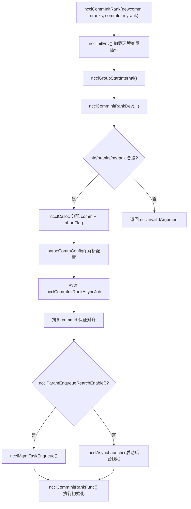
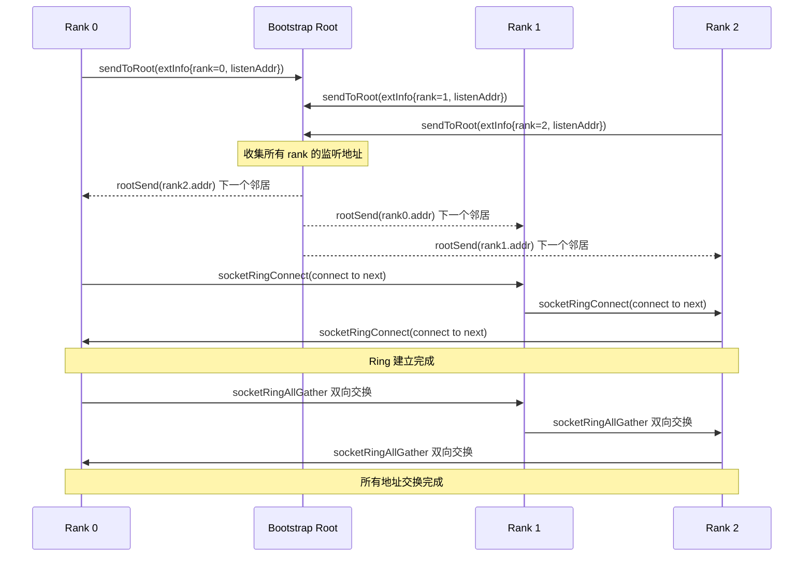
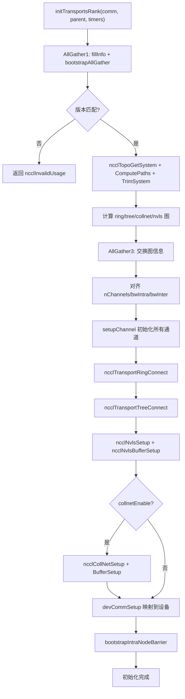

# Capítulo 3: Entrada a la inicialización: cómo ncclCommInitRank convierte un grupo de procesos aislados en un dominio de comunicación

En el capítulo anterior establecimos las cinco abstracciones centrales que recorren todo el libro: ncclComm, channel, algorithm, protocol y transport, que en conjunto constituyen el vocabulario común de «una comunicación = varios channels × un algorithm × un protocol × varios transports». Ahora debemos responder una pregunta más fundamental: ¿cómo se construye realmente este objeto ncclComm desde cero? Cuando llamas a ncclCommInitRank, NCCL necesita completar en unos pocos cientos de milisegundos una serie de operaciones complejas: confirmar que todos los ranks están presentes, intercambiar información de dispositivos, detectar la topología de la máquina, calcular las rutas de datos, asignar memoria de GPU y memoria de host, y finalmente empaquetar todo esto en un objeto ncclComm. Este capítulo seguirá esa cadena de llamadas, descendiendo desde la entrada de la API hasta el último capilar de initTransportsRank.

# 3.1 Entrada de la API: la capa síncrona y el núcleo asíncrono de ncclCommInitRank

## Modelo intuitivo

`ncclCommInitRank`En apariencia es «crear un dominio de comunicación», pero en realidad lo que hace es «lanzar una tarea en segundo plano y, por defecto, esperar a que termine». Es como pedir comida en un restaurante: la acción de pedir (la llamada a la API) regresa al instante, pero la cocina (la inicialización real) ocurre en segundo plano. El «modo bloqueante» por defecto solo te hace esperar en el mostrador hasta que la comida esté lista, mientras que el «modo no bloqueante» te da un número de pedido para que puedas ir a hacer otras cosas.

Sin este diseño asíncrono, NCCL no podría coordinarse durante la inicialización con escenarios como la captura de CUDA Graph o la inicialización paralela de múltiples dominios de comunicación; toda inicialización se convertiría en operaciones bloqueantes seriales que no podrían solaparse con el código del usuario.

## Estructuras de datos y diseño de memoria

Veamos primero la entrada de la API en sí.`ncclCommInitRank`Es una capa síncrona extremadamente delgada:

[FACT:src/init.cc:2946-2970]

Hace cuatro cosas: llama a`ncclInitEnv()`carga el plugin de variables de entorno, activa las marcas de rendimiento NVTX, lee el número de dispositivo CUDA actual y luego llama a`ncclGroupStartInternal()`entra en la semántica de group y, finalmente, delega el trabajo real a`ncclCommInitRankDev`。

Atención a`ncclGroupStartInternal()` / `ncclGroupEndInternal()`este par de llamadas: incluso si solo inicializas un dominio de comunicación, NCCL lo envuelve en la semántica de group. Esto es para manejar de forma unificada el escenario en el que «el usuario inicializa múltiples dominios de comunicación dentro de un group», evitando escribir dos rutas de código para un solo dominio y para múltiples dominios.

La validación real de parámetros y la asignación de objetos están en`ncclCommInitRankDev`dentro de:

[FACT:src/init.cc:2851-2943]

Esta función es la «mesa de despacho central» de toda la cadena. Primero valida parámetros (rango de`nId`, legalidad de`nranks`/`myrank`), luego asigna`ncclComm`la estructura en sí, así como tres campos relacionados con el mecanismo de aborto:`abortFlag`(indicador atómico del lado del host),`abortFlagDev`(copia en memoria fija visible desde el lado del dispositivo),`abortFlagRefCount`(conteo de referencias, porque los subdominios de comunicación creados por split pueden compartir el abortFlag del dominio padre).

Aquí hay un detalle que vale la pena notar:`comm->startMagic = comm->endMagic = NCCL_MAGIC`：

[FACT:src/init.cc:2886-2886]

este par de valores mágicos actúa como un «sello» colocado al principio y al final de la estructura`ncclComm`. Cualquier escritura fuera de límites o corrupción de la estructura romperá este par de valores mágicos, y las operaciones posteriores pueden detectar el pisoteo de memoria verificándolos. Esta es una protección de integridad de memoria barata pero efectiva.

## Step-by-Step Walkthrough

Cuando`ncclCommInitRankDev`llega al final, construye un`ncclCommInitRankAsyncJob`e inicia la tarea asíncrona:

[FACT:src/init.cc:2896-2929]

`job`La estructura contiene todos los parámetros necesarios para la inicialización. Nota que`job->commId`es**una copia**, en lugar de referenciar directamente el`commId`：

[FACT:src/init.cc:2903-2910]

pasado por el usuario. ¿Por qué copiar? El comentario del código fuente da la respuesta:`ncclUniqueId`y`ncclBootstrapHandle`tienen requisitos de alineación diferentes; el array pasado por el usuario puede no estar correctamente alineado al límite requerido por`ncclBootstrapHandle`. Copiar a memoria recién asignada garantiza la alineación. Esta es una típica «trampa de compatibilidad ABI»: el usuario ve`ncclUniqueId`, pero internamente debe tratarse como`ncclBootstrapHandle`; ambos tienen el mismo tamaño pero distinta alineación.

Finalmente, según el valor de`ncclParamEnqueueRearchEnable()`, la tarea entra en la cola de gestión o se inicia directamente mediante`ncclAsyncLaunch`:

[FACT:src/init.cc:2922-2929]

`ncclAsyncLaunch`crea un nuevo hilo que ejecuta`ncclCommInitRankFunc`. Si es modo bloqueante (por defecto), el llamador espera en`ncclGroupEndInternal()`a que este hilo termine; si es modo no bloqueante, el llamador regresa de inmediato y el usuario posteriormente consulta el estado mediante`ncclCommGetAsyncError`.

## Reflexiones de diseño

El núcleo del diseño aquí es «API síncrona + implementación asíncrona». ¿Por qué no hacer que`ncclCommInitRank`ejecute directamente toda la inicialización de forma síncrona? Porque NCCL necesita soportar el modo no bloqueante de`ncclCommInitRankConfig`, y el modo no bloqueante requiere que la inicialización se ejecute en un hilo en segundo plano. Si la ruta síncrona y la ruta asíncrona fueran dos conjuntos de código, el costo de mantenimiento se duplicaría. Al unificar todo por la vía asíncrona, la ruta síncrona solo es «iniciar y esperar de inmediato», y el código existe en una sola versión.



# 3.2 Bootstrap: el primer canal de control entre ranks

## Modelo intuitivo

Bootstrap es el «grupo de WeChat previo a la reunión» de NCCL. Antes de que comience la comunicación formal, todos los ranks necesitan establecer primero un canal de control para intercambiar metadatos como «quién soy, en qué máquina estoy, qué modelo es mi GPU, cuál es la dirección de mi tarjeta de red». Sin bootstrap, los ranks serían un grupo de extraños que no se conocen entre sí y no podrían coordinar ninguna comunicación.

Si bootstrap falla o expira, toda la inicialización del dominio de comunicación se bloqueará; esta es una de las causas más comunes de cuelgues de NCCL en entornos de producción.

## Estructuras de datos y diseño de memoria

El estado central de Bootstrap se guarda en`bootstrapState`dentro de la estructura:

[FACT:src/bootstrap.cc:527-546]

Este struct tiene varios campos clave que merecen ser desarrollados:

- `ring`: una unión, que es o bien un handle de dispositivo de red (`net.sendComm`/`net.recvComm`), o bien un par de sockets (`socket.send`/`socket.recv`). Esto corresponde a dos modos de bootstrap: el modo predeterminado basado en socket y el modo`NCCL_OOB_NET_ENABLE`basado en dispositivo de red.
- `listen`: información del extremo de escucha, que igualmente tiene dos formas: red y socket.
- `peerP2pAddresses` / `peerProxyAddresses`: arreglo de direcciones P2P y direcciones proxy de todos los ranks, rellenado mediante ring allgather.
- `unexpectedConnections`: una lista enlazada que almacena en caché las conexiones "recibidas pero aún no emparejadas". Este es un diseño clave del protocolo bootstrap, porque el receptor no puede prever quién se conectará primero, así que debe guardar primero las conexiones no emparejadas.
- `asyncSendQueue` + `asyncSendLock` + `asyncSendCond`: cola de envío asíncrono y sus primitivas de sincronización, usadas para envíos concurrentes en modo de cifrado TLS.

`bootstrapState`La asignación de se produce al comienzo de`bootstrapInit`:

[FACT:src/bootstrap.cc:769-776]

Nótese la línea`comm->bootstrap = state`: el estado de bootstrap se adjunta al dominio de comunicación, y todas las operaciones posteriores de bootstrap se acceden a través de`comm->bootstrap`.

## Step-by-Step Walkthrough

`bootstrapInit`es la función principal del bootstrap. Desglosémosla en orden de ejecución:

**Primer paso: determinar el valor magic.**magic es la "señal secreta" de la comunicación bootstrap; solo los ranks que poseen el mismo magic pueden conectarse entre sí.

[FACT:src/bootstrap.cc:778-788]

Si es una inicialización normal (`handles != NULL`), magic proviene del primer handle; si es split/grow (`parent != NULL`), magic se deriva mediante`hashCombine(parent->magic, parent->childCount)`. Esto garantiza que cada subdominio de comunicación tenga un magic único.

**Segundo paso: crear el socket de escucha.**Cada rank necesita dos extremos de escucha: uno para la conexión con el vecino del ring (`STATE_LISTEN(state, socket)`), y otro para la conexión con el root (`listenSockRoot`）：

[FACT:src/bootstrap.cc:797-831]

Aquí hay una división clave del trabajo: el socket de escucha del ring usa`comm->magic`, mientras que el socket de escucha del root usa`BOOTSTRAP_HANDLE(handles, curr_root)->magic`. ¿Por qué? Porque el root es el coordinador global, todos los ranks deben conectarse a él, así que usa un magic unificado; mientras que los vecinos del ring son punto a punto, con el magic propio del dominio de comunicación es suficiente.

**Tercer paso: conexión escalonada.**Cuando el número de ranks es muy grande, que todos los ranks se conecten al root al mismo tiempo causaría una tormenta de conexiones. NCCL usa`NCCL_UID_STAGGER_RATE`y`NCCL_UID_STAGGER_THRESHOLD`para controlar el escalonamiento:

[FACT:src/bootstrap.cc:833-843]

Cuando el número de ranks a cargo de un root supera el umbral (por defecto 256), cada rank calcula los microsegundos de retardo según su ID local bajo el root, y luego duerme. Esta es una limitación de tasa simple pero efectiva al estilo "token bucket".

**Cuarto paso: enviar al root la propia información de conexión.**Cada rank envía su dirección de escucha al root:

[FACT:src/bootstrap.cc:845-867]

Después de que el root recibe la información de todos los ranks, realiza un "emparejamiento en anillo": envía la dirección del rank i al rank i-1, y la dirección del rank i+1 al rank i. Así cada rank conoce a sus vecinos anterior y posterior en el ring.

**Quinto paso: establecer la conexión del ring.**Cada rank se conecta a su vecino "siguiente", y al mismo tiempo acepta la conexión del vecino "anterior":

[FACT:src/bootstrap.cc:885-894]

Aquí`socketRingConnect`internamente usa`bootstrapConcurrent`——en modo de cifrado TLS, connect y accept deben ejecutarse concurrentemente, de lo contrario se produciría un deadlock (porque el handshake TLS requiere la participación simultánea de ambas partes). En modo sin cifrado, se ejecuta connect y luego accept de forma serial.

**Sexto paso: AllGather de todas las direcciones.**Una vez establecido el ring, mediante`ringAllInfo`se hace un allgather de las direcciones P2P, direcciones proxy y direcciones UDS de todos los ranks:

[FACT:src/bootstrap.cc:934-938]

`ringAllInfo`internamente llama a`bootstrapAllGather`, que en modo socket usa`socketRingAllGather`——un algoritmo de ring allgather bidireccional, donde N ranks solo necesitan N/2 pasos:

[FACT:src/bootstrap.cc:1363-1412]

Este algoritmo bidireccional es la optimización clave del rendimiento del bootstrap. El ring allgather unidireccional tradicional necesita N-1 pasos; la versión bidireccional reduce los pasos a la mitad. Cada paso envía y recibe datos simultáneamente en ambas direcciones, usando`socketDoubleSendRecv`para empaquetar 4 operaciones (2 envíos y 2 recepciones) en una sola llamada al sistema.

## Control de concurrencia e interacción de bajo nivel

El control de concurrencia del Bootstrap tiene varios niveles:

**Primer nivel: verificación de abort.**Todos los bucles bloqueantes verifican periódicamente abortFlag:

[FACT:src/bootstrap.cc:150-159]

`BOOTSTRAP_N_CHECK_ABORT`Se establece en 10000, lo que significa que se verifica el indicador de abort cada 10000 iteraciones. Este número es un compromiso entre rendimiento y capacidad de respuesta: verificar con demasiada frecuencia afecta el rendimiento, y verificar muy poco provoca retardo en la respuesta al abort.

**Segundo nivel: cola de envío asíncrono.**En modo de cifrado TLS,`bootstrapSend`no puede ejecutarse de forma síncrona (porque el handshake TLS requiere que el receptor también participe), así que NCCL coloca la operación de envío en un hilo independiente:

[FACT:src/bootstrap.cc:1161-1217]

Aquí hay un mecanismo ingenioso de garantía de orden.`bootstrapAsyncSendMain`Antes de enviar, se verifica si en la cola hay "envíos anteriores dirigidos al mismo (peer, tag)":

[FACT:src/bootstrap.cc:1124-1152]

¿Por qué es necesario garantizar el orden de envío para el mismo (peer, tag)? Los comentarios del código fuente lo explican con claridad: el receptor empareja conexiones por (peer, tag), y si dos mensajes enviados al mismo (peer, tag) llegan en orden invertido, el receptor los emparejará incorrectamente. Durante la inicialización de NVLS se difunde múltiples veces al mismo peer con el mismo tag, por lo que esta garantía de orden es imprescindible.

**Tercera capa: cola de conexiones inesperadas.**El receptor no puede predecir quién se conectará primero, así que`socketAccept`almacena las conexiones no coincidentes en una`unexpectedConnections`lista enlazada:

[FACT:src/bootstrap.cc:1276-1300]

Este diseño resuelve un problema distribuido clásico: múltiples ranks pueden iniciar conexiones hacia ti simultáneamente, pero tu`bootstrapRecv`orden de llamadas es fijo. Si las conexiones no coincidentes se descartaran directamente, el emisor agotaría el tiempo de espera; si se bloqueara la espera, podría producirse un interbloqueo. Almacenarlas en una cola es la opción más segura.

## Guía para evitar problemas en producción

**Problema uno: el tiempo de espera de bootstrap provoca que la inicialización se cuelgue.**Si algún rank no puede conectarse al root por problemas de red, todos los demás ranks esperarán indefinidamente en`ncclSocketAccept`o`ncclSocketRecv`. NCCL no tiene un mecanismo de tiempo de espera de bootstrap incorporado; la única vía de escape es abortFlag. En entornos de producción se recomienda configurar`NCCL_UID_STAGGER_RATE`para mitigar la tormenta de conexiones en clústeres a gran escala.

**Problema dos:`NCCL_COMM_ID`conflicto con múltiples handle.**Cuando el usuario configura la`NCCL_COMM_ID`variable de entorno, NCCL fuerza a reducir`nId`a 1:

[FACT:src/init.cc:2912-2921]

Esto significa que`ncclCommInitRankScalable`la característica de múltiples handle queda silenciosamente deshabilitada. Si estás usando inicialización scalable y además configuras`NCCL_COMM_ID`, el comportamiento será diferente de lo que esperas.

**Problema tres: interbloqueo en modo TLS.**En modo de cifrado TLS, si connect y accept no se ejecutan de forma concurrente, ambas partes se quedarán atascadas en el handshake TLS.`bootstrapConcurrent`Esto es precisamente para resolver ese problema:

[FACT:src/bootstrap.cc:648-669]

En modo no cifrado se ejecuta en serie (primero send, luego recv); en modo cifrado se lanza un hilo para manejar el send y el hilo principal maneja el recv.



# 3.3 commAlloc: el esqueleto de memoria del objeto de dominio de comunicación

## Modelo intuitivo

`commAlloc`Es la "entrega en obra gris" del dominio de comunicación: asigna la memoria de la estructura, inicializa todos los campos a valores predeterminados seguros, crea los objetos CUDA y las primitivas de sincronización necesarias, pero aún no ha rellenado la información de topología, la configuración de canales ni las conexiones de transporte, que serían la "decoración de interiores". Si comparamos`ncclComm`con un edificio,`commAlloc`sería echar los cimientos y levantar la estructura,`initTransportsRank`sería la decoración interior.

Si no existiera la inicialización de`commAlloc`, el código posterior accedería a campos no inicializados provocando comportamientos impredecibles; por ejemplo, si`comm->channels[c].id`tuviera un valor aleatorio, la lógica de inicialización de canales juzgaría erróneamente el estado del canal.

## Estructura de datos y diseño de memoria

`commAlloc`La firma y validación inicial de

[FACT:src/init.cc:512-526]

Primero valida la legalidad de`ndev`y`rank`, luego construye dos pilas de memoria (`memPermanent`y`memScoped`), configura`rank`y`nRanks`. Estas dos pilas de memoria son la infraestructura de gestión de memoria de NCCL:`memPermanent`se usa para asignaciones cuyo ciclo de vida es igual al del dominio de comunicación,`memScoped`se usa para asignaciones temporales.

A continuación viene la detección del dispositivo CUDA:

[FACT:src/init.cc:528-531]

`cudaGetDevice`obtiene el número de dispositivo actual,`ncclCudaCompCap`obtiene la capacidad de cómputo. El comentario del código fuente lo dice sin rodeos: "Try to create a CUDA object right away. If there is something wrong with the device we're on, better know it early." — exponer los problemas del dispositivo cuanto antes, para evitar descubrirlos en una fase tardía de la inicialización.

Luego viene la asignación o herencia de recursos compartidos:

[FACT:src/init.cc:533-555]

Aquí hay una bifurcación importante: si`parent == NULL || !parent->shareResources`, se crea un nuevo`ncclSharedResources`; de lo contrario, se heredan los recursos compartidos del dominio de comunicación padre y se incrementa el contador de referencias.`ncclSharedResources`incluye device stream, host stream, eventos de lanzamiento, eventos de scratch, etc. — estos recursos pueden reutilizarse en escenarios de split por los subdominios de comunicación, evitando creaciones duplicadas.

Nótese la línea`sharedRes->refCount = 1`— el contador de referencias inicial es 1, se incrementa cada vez que se comparte en un split, y solo se destruye realmente cuando se libera la última referencia.

A continuación viene la inicialización de red, RMA y GIN:

[FACT:src/init.cc:547-549]

Estos tres subsistemas se encargan respectivamente de la transmisión por red, el acceso remoto a memoria y la comunicación por red iniciada por la GPU. Su orden de inicialización es importante:`ncclNetInit`debe ir antes de`ncclRmaInit`, porque RMA depende del plugin de red.

Inicialización del gestor de memoria:

[FACT:src/init.cc:567-576]

Igualmente hay dos rutas: compartir o crear nuevo.`ncclMemManager`se encarga de gestionar el pool de memoria CUDA y la caché de registros.

Marcador de inicialización de canales:

[FACT:src/init.cc:607-608]

Esta línea pone el`id`de todos los canales a -1, indicando "no inicializado". Posteriormente`setupChannel`comprobará este valor para decidir si es necesaria la inicialización.

Construcción de las colas de interrupción:

[FACT:src/init.cc:619-632]

NCCL utiliza colas intrusivas (intrusive queue) para gestionar diversas tareas. Estas colas se construyen todas vacías en la fase de`commAlloc`, y las tareas posteriores las usan directamente al encolarse.

Creación del pool de memoria CUDA:

[FACT:src/init.cc:636-652]

Si el dispositivo soporta pool de memoria (`cudaDevAttrMemoryPoolsSupported`), se crea un pool de memoria de tipo pinned y se establece el umbral de liberación al valor máximo (`~uint64_t(0)`), es decir, "nunca liberar automáticamente". Esto es para evitar que el runtime de CUDA reclame memoria sin que NCCL lo sepa.

## Step-by-Step Walkthrough

Sigamos un escenario de inicialización concreto: una sola máquina con 8 GPUs, un rank por proceso, inicialización normal.

1. `commAlloc(comm, NULL, 8, rank)`es invocado,`parent == NULL`。

2. La validación pasa,`comm->rank = rank`，`comm->nRanks = 8`。

3. `cudaGetDevice`devuelve el número de dispositivo actual,`comm->compCap`queda configurado.

4. Se crea un nuevo`ncclSharedResources`, con contador de referencias 1.

5. `ncclNetInit`Inicializar el plugin de red (posiblemente Socket o IB).

6. `ncclMemManagerInit`Crear el gestor de memoria.

7. `getBusId`Obtener el ID del bus PCI,`ncclNvmlDeviceGetHandleByPciBusId`Obtener el handle de NVML.

8. `dmaBufSupported`Detectar soporte de DMA-BUF.

9. Asignar`connectSend` / `connectRecv`el arreglo de bitmap.

10. Todos los canales`id`se establecen en -1.

11. Construir todas las colas de interrupción.

12. Crear el pool de memoria CUDA.

## Reflexiones de diseño

`commAlloc`El diseño más interesante es el principio de "fallar lo antes posible". Llama a`cudaGetDevice`al inicio de la función, en lugar de esperar hasta que se necesite información del dispositivo más adelante. La ventaja de esto es que: si el dispositivo tiene problemas (por ejemplo, está siendo utilizado exclusivamente por otro proceso), el error se expondrá temprano durante la inicialización, en lugar de descubrirse después de asignar una gran cantidad de memoria.

Otro diseño es la inicialización de`preconnectNext`:

[FACT:src/init.cc:598-598]

`reinterpret_cast<struct ncclComm*>(0x1)`Es un valor centinela utilizado para marcar el estado de "próxima preconexión". Esta técnica de usar un valor de puntero inválido como marcador de estado es muy común en programación de sistemas — ahorra más memoria que un campo booleano adicional, pero requiere cuidado para no desreferenciarlo.

# 3.4 initTransportsRank: Descubrimiento de topología y asignación de canales

## Modelo intuitivo

`initTransportsRank`Es el "corazón" de la inicialización. Hace tres cosas importantes: intercambiar la información de dispositivos y topología de todos los ranks mediante dos AllGather; calcular las estructuras de grafo de algoritmos como ring/tree/collnet/nvls basándose en esa información; y finalmente establecer todas las conexiones de transporte. Si comparamos el dominio de comunicación con el sistema de tráfico de una ciudad,`initTransportsRank`es el proceso de planificar todas las carreteras, pasos a desnivel y rutas de autobús.

Sin este paso, NCCL no sabría por qué camino deben ir los datos — podría hacer que los datos tomen un camino más largo, o simplemente no encontrar una ruta alcanzable.

## Estructuras de datos y diseño de memoria

`initTransportsRank`Tiene muchísimas variables locales, veamos las clave:

[FACT:src/init.cc:1163-1179]

Aquí se extraen`comm->graphs`las distintas estructuras de grafo del arreglo y se crean alias.`graphs`El arreglo está indexado por algoritmo, nótese que`nvlsGraph`se usa dos veces (NVLS y NVLSTree comparten la misma estructura de grafo).

Dos estructuras temporales clave:

[FACT:src/init.cc:1181-1206]

`graphInfo`Almacena la información de grafo de un solo rank para un algoritmo determinado (número de canales, ancho de banda, tipo, etc.),`allGatherInfo`Es la unidad de datos del AllGather, contiene la información de grafo de todos los algoritmos más la información de rank de topología.

## Step-by-Step Walkthrough

**Fase uno: AllGather1 — intercambio de información de dispositivos.**

[FACT:src/init.cc:1234-1239]

Cada rank llama a`fillInfo`para llenar su propio`ncclPeerInfo`, luego mediante`bootstrapAllGather`se intercambia.`fillInfo`La información que se llena incluye: número de rank, número de dispositivo CUDA, número de dispositivo NVML, versión de NCCL, git hash, host hash, process hash, GPU UUID, ID de bus, tamaño de memoria de video, versión de driver, etc.

[FACT:src/init.cc:888-982]

Nótese`info->hostHash = getHostHash() + commHash`y`info->pidHash = getPidHash() + commHash`— tanto host hash como pid hash tienen añadido el commHash. Esto es para distinguir diferentes dominios de comunicación en la misma máquina.

Después de completar el AllGather, cada rank recorre la información de todos los peers y calcula propiedades globales:

[FACT:src/init.cc:1250-1303]

Este bucle hace muchas cosas: detecta incompatibilidad de versiones, cuenta el número de nodos, calcula la intersección de`cuMemSupport`, detecta si múltiples ranks usan la misma GPU, calcula la intersección de máscaras de tipo GIN, etc. Nótese`nNodes`la forma de contar — incrementa cada vez que encuentra un hostHash diferente, esto asume que los ranks están ordenados consecutivamente por nodo.

**Fase dos: Descubrimiento de topología.**

[FACT:src/init.cc:1390-1403]

Estos seis pasos son el flujo central del descubrimiento de topología:`ncclTopoGetSystem`Enumera los dispositivos del sistema para construir el grafo de topología,`ncclTopoComputePaths`Calcula las rutas de GPU a NIC,`ncclTopoTrimSystem`Elimina dispositivos inalcanzables, vuelve a calcular rutas,`ncclTopoSearchInit`Inicializa el estado de búsqueda, finalmente imprime la topología.

**Fase tres: Cálculo de grafos.**

[FACT:src/init.cc:1421-1468]

Calcula secuencialmente los cinco grafos: ring, tree, collnet chain, collnet direct, nvls. Cada grafo tiene diferentes restricciones de pattern y número de canales. Nótese`treeGraph->minChannels = ringGraph->nChannels`— el número de canales de tree se restringe para ser igual al de ring, esto es para garantizar la alineación de canales entre diferentes algoritmos.

**Fase cuatro: AllGather3 — intercambio de información de grafos.**

[FACT:src/init.cc:1490-1533]

Cada rank llena su información de grafo en`allGather3Data[rank]`, luego nuevamente`bootstrapAllGather`. La información intercambiada esta vez incluye: pattern/nChannels/bwIntra/bwInter/typeIntra/typeInter/crossNic de cada algoritmo, arquitectura de CPU, número de canales P2P, número de dispositivos de red, número de dispositivos CollNet, etc.

Después de completar AllGather3, cada rank recorre la información de grafo de todos los peers, tomando el mínimo/máximo para alinear:

[FACT:src/init.cc:1687-1703]

Nótese la estrategia de alineación aquí:`nChannels`、`sameChannels`、`bwIntra`、`bwInter`Se toma el mínimo,`typeIntra`、`typeInter`、`crossNic`Se toma el máximo. ¿Por qué? Porque el número de canales y el ancho de banda están limitados por el enlace más débil, mientras que el tipo y crossNic necesitan tomar la unión para garantizar compatibilidad.

**Fase cinco: Establecer conexiones de transporte.**

[FACT:src/init.cc:1811-1892]

Aquí hay dos ramas:`runtimeConn`Cuando es verdadero, solo se hace setup de canales sin establecer conexiones (se pospone la conexión hasta el tiempo de ejecución), de lo contrario se establecen todas las conexiones inmediatamente. El orden de conexión es: ring → tree → NVLS → PAT → NVLS tree → CollNet.

## Control de concurrencia e interacción con hardware

`initTransportsRank`Hay varios puntos notables de concurrencia/interacción con hardware en :

**Configuración de afinidad de CPU:**

[FACT:src/init.cc:1406-1412]

NCCL vincula el hilo actual a un núcleo de CPU cercano a la GPU, asegurando que la asignación de memoria del host sea del nodo NUMA local. Esto reduce la latencia de acceso entre nodos NUMA.

**Inicialización de NVLS:**

[FACT:src/init.cc:1419-1419]

`ncclNvlsInit`Detecta el soporte de NVLink SHARP. NVLS permite que el switch ejecute directamente operaciones de reducción, reduciendo drásticamente la latencia de AllReduce.

**Creación del hilo Proxy:**

[FACT:src/init.cc:1780-1786]

El hilo Proxy se encarga de impulsar asíncronamente la E/S de red. Se crea en`initTransportsRank`y posteriormente todas las operaciones de red se realizan a través del proxy.

## Guía de prevención de errores en producción

**Error uno: Número de dispositivos de red no coincidente.**Si el número de NICs locales difiere entre distintos ranks, NCCL reportará un error:

[FACT:src/init.cc:1576-1596]

A menos que se configure`NCCL_IGNORE_NET_MISMATCH=1`. Esto es común en clústeres heterogéneos — algunos nodos tienen 8 NICs, otros solo 4. Ignorar la falta de coincidencia puede degradar el rendimiento, ya que el número de canales quedará limitado por el nodo más débil.

**Error dos: Múltiples ranks compartiendo la misma GPU.**Si dos ranks tienen el mismo UUID de GPU, NCCL rechazará la inicialización:

[FACT:src/init.cc:1291-1296]

A menos que se configure`NCCL_MULTI_RANK_GPU_ENABLE=1`. Esta verificación previene problemas de rendimiento causados por configuraciones erróneas del usuario.

**Error tres: Número insuficiente de nodos para CollNet.**CollNet requiere al menos`NCCL_COLLNET_NODE_THRESHOLD`nodos para habilitarse:

[FACT:src/init.cc:1720-1728]

El umbral predeterminado es 2. En entornos de un solo nodo, CollNet se deshabilita automáticamente.



# 3.5 NCCL_PARAM: La magia en tiempo de compilación del sistema de variables de entorno

## Modelo intuitivo

`NCCL_PARAM`Es la "fábrica de interruptores de configuración" de NCCL. Utiliza macros para generar una función en tiempo de compilación, que en la primera llamada en tiempo de ejecución lee la variable de entorno y almacena el resultado en caché. Esto es como un interruptor de luz en casa — lo accionas (llamas a la función), la luz se enciende (devuelve el valor de configuración), y luego el estado del interruptor queda memorizado, sin necesidad de volver a accionarlo cada vez.

Sin este mecanismo, NCCL tendría que llamar manualmente a`getenv`y analizar la cadena en cada lugar donde se use la configuración, lo que haría el código extremadamente verboso y propenso a errores.

## Estructura de datos y diseño de memoria

`NCCL_PARAM`Definición de la macro

[FACT:src/include/param.h:22-31]

Esta macro, al expandirse, genera una función`ncclParam##name()`, con tres variables estáticas internas:

- `uninitialized = INT64_MIN`: valor centinela, que indica "aún no inicializado".
- `noCache`: indicador de tres estados, -1 indica no inicializado, 0 indica almacenar en caché, 1 indica no almacenar en caché.
- `cache`: el valor almacenado en caché, inicialmente`uninitialized`。

La lógica de la función es: si`cache`sigue siendo`uninitialized`, llamar a`ncclLoadParam`para cargar; de lo contrario, devolver directamente`cache`。`COMPILER_EXPECT(..., false)`indica al compilador que esta rama rara vez se ejecuta, optimizando la ruta caliente.

`ncclLoadParam`Implementación de

[FACT:src/misc/param.cc:78-108]

Protege todo el proceso de carga con un mutex, primero verifica la política de`noCache`, luego comprueba si la caché es válida, y después lee la variable de entorno y la analiza. Si el análisis falla, usa el valor predeterminado e imprime una advertencia.

## Step-by-Step Walkthrough

Tomando`NCCL_PARAM(BuffSize, "BUFFSIZE", -2)`como ejemplo:

[FACT:src/init.cc:1007-1007]

Tras la expansión de la macro se genera:

```cpp
int64_t ncclParamBuffSize() {
  constexpr int64_t uninitialized = INT64_MIN;
  static int8_t noCache = -1;
  static_assert(-2 != uninitialized, "...");
  static int64_t cache = uninitialized;
  if (COMPILER_EXPECT(COMPILER_ATOMIC_LOAD(&cache, std::memory_order_relaxed) == uninitialized, false)) {
    return ncclLoadParam("NCCL_BUFFSIZE", -2, uninitialized, &cache, &noCache);
  }
  return cache;
}
```

En la primera llamada,`cache == uninitialized`, entra en`ncclLoadParam`. Lee la variable de entorno`NCCL_BUFFSIZE`, y si no está configurada, devuelve el valor predeterminado -2. Luego, según la política de`noCache`, decide si almacenar en caché.

`noCache`La política de`ncclParamIsCacheDisabled`se determina por

[FACT:src/misc/param.cc:74-76]

Si el nombre de la variable de entorno coincide con algún patrón (por ejemplo, termina en`_`), no se almacena en caché y se relee cada vez. Esto permite al usuario modificar dinámicamente ciertas configuraciones en tiempo de ejecución.

## Reflexión sobre el diseño

Lo ingenioso de este diseño es la "abstracción de costo cero": en la ruta caliente solo hay una carga atómica y una comparación, sin bloqueos ni análisis de cadenas. Solo la ruta fría (primera carga) paga el costo completo.`COMPILER_EXPECT`Indica al compilador que coloque la ruta caliente al frente de la caché de instrucciones, mejorando aún más el rendimiento.

Otro aspecto del diseño es el esquema de tres estados de`noCache`. -1 significa "aún no decidido", 0 significa "almacenar en caché", 1 significa "no almacenar en caché". Esta decisión se toma solo una vez en la primera carga y no cambia después.

## Guía de prevención de errores en producción

**Error uno: Errores tipográficos en variables de entorno.**Si el usuario escribe`NCCL_BUFSIZE`en lugar de`NCCL_BUFFSIZE`, NCCL no reportará error, solo usará el valor predeterminado. Se recomienda usar`NCCL_DEBUG=ENV`para ver todas las variables de entorno reconocidas.

**Error dos: Orden de carga de`NCCL_CONF_FILE`.**NCCL carga secuencialmente`$NCCL_CONF_FILE`(o`~/.nccl.conf`) y`/etc/nccl.conf`：

[FACT:src/misc/param.cc:52-67]

Los archivos cargados después sobrescriben a los cargados antes. Si ambos archivos configuran la misma variable,`/etc/nccl.conf`el valor de

**prevalecerá.`noCache`Error tres: Seguridad de hilos de la variable**.

[FACT:src/misc/param.cc:74-76]

El comentario en el código fuente dice "noCache is only load/stored within the mutex, no need for atomic":`noCache`Esto significa que la lectura y escritura de`cache`están protegidas por el mutex, sin necesidad de operaciones atómicas. Pero la lectura de

# es sin bloqueo (ruta caliente), por lo que se usa carga atómica.

## 3.6 devCommSetup: Mapear el dominio de comunicación al dispositivo

`devCommSetup`Modelo intuitivo`ncclComm`Es la "proyección del lado del dispositivo" del dominio de comunicación. Los kernels de GPU se ejecutan en el dispositivo y no pueden acceder directamente a la estructura`ncclDevComm`en la memoria del host. Por lo tanto, NCCL necesita copiar los campos clave del dominio de comunicación a memoria accesible por el dispositivo, formando

. Esto es como fotocopiar la guía telefónica de la empresa y colocarla en el escritorio de cada empleado — el empleado no tiene que ir cada vez a recepción a preguntar el teléfono de un colega.`devCommSetup`Sin

## , el kernel de GPU no podría conocer su rank, configuración de canales, tamaño de búfer, etc., y el kernel de comunicación colectiva simplemente no podría iniciarse.

`devCommSetup`Estructura de datos y diseño de memoria`ncclKernelCommAndChannels`Utiliza una estructura temporal

[FACT:src/init.cc:712-746]

para empaquetar los datos que se copiarán al dispositivo:`ncclDevComm`Esta estructura contiene`cudaMemcpyAsync`(dominio de comunicación del lado del dispositivo) y el arreglo de canales. La función primero llena la estructura temporal con los datos del lado del host, y luego realiza una copia

al dispositivo de una sola vez.

[FACT:src/init.cc:734-746]

Llenado de campos clave:`comm->devComm = &devCommAndChans->comm`Nótese que`comm->devComm`— el`ncclDevComm`del lado del host apunta a`comm->devComm`en la memoria del dispositivo. Posteriormente, al lanzar el kernel, se pasará

Relleno de la información de canales:

[FACT:src/init.cc:829-843]

Los punteros peers, ring, tree, collnetChain, collnetDirect y nvls de cada canal se copian al lado del dispositivo. Nota`ring.userRanks`se necesita una copia adicional de`cudaMemcpyAsync`, porque es un arreglo.

## Step-by-Step Walkthrough

1. Obtener el flujo del dispositivo:`ncclStrongStreamAcquire`Obtener un flujo fuerte (strong stream) para asegurar que las copias asíncronas posteriores se ejecuten en orden.

2. Asignar memoria del dispositivo:`ncclCudaCallocAsync`Asignar`devCommAndChans`。

3. Rellenar la estructura temporal del lado del host: establecer rank, nRanks, node, nNodes, abortFlag, buffSizes, etc.

4. Asignar y copiar el arreglo`rankToLocalRank`.

5. Calcular`workFifoBytes`: se decide según el estado de CC (Confidential Computing).

6. Asignar el búfer workFifo: en modo GDR usar`ncclGdrCudaCalloc`, de lo contrario usar`ncclCudaHostCalloc`。

7. Asignar los contadores del profiler.

8. Asignar los contadores de progreso (si están habilitados).

9. Rellenar la información de canales.

10. Copiar de una sola vez al dispositivo:`ncclCudaMemcpyAsync(devCommAndChans, &tmpCommAndChans, 1, deviceStream)`。

11. Liberar el flujo fuerte y sincronizar.

## Reflexiones de diseño

`devCommSetup`El diseño más notable en es la "copia por lotes". NCCL no llama a por separado para cada campo`cudaMemcpy`, sino que empaqueta todos los campos en una estructura temporal y realiza una sola`cudaMemcpyAsync`. Esto reduce drásticamente el número de llamadas a la API de CUDA y la sobrecarga de sincronización.

Otro diseño es el manejo de CC de`workFifoBytes`:

[FACT:src/init.cc:750-763]

En modo CC (Confidential Computing),`workFifoBytes`se establece en 0, porque la copia GDR no está disponible en modo CC. Esta es una degradación elegante ante una limitación de hardware.

## Guía de prevención de errores en producción

**Error uno:`devCommSetup`debe llamarse antes de la barrera.**Los comentarios del código fuente explican la razón:

[FACT:src/init.cc:1950-1952]

Si se llama después de la barrera, puede que algunos hilos ya hayan comenzado a lanzar el kernel de NCCL, y en ese momento la memoria del dispositivo aún no se ha asignado por completo, lo que provocará un interbloqueo.

**Error dos:`workFifoBytes`debe ser una potencia de 2.**Si no lo es, NCCL emitirá una advertencia y usará el valor predeterminado:

[FACT:src/init.cc:757-762]

# Reflexiones y autoevaluación de este capítulo

P1: Si se elimina la lógica en[FACT:src/init.cc:1291-1296]que detecta "múltiples ranks usando la misma GPU", ¿en qué escenarios causaría problemas? ¿Por qué NCCL rechaza esta configuración por defecto?

**Análisis de referencia**：

Este código detecta si los UUID de GPU de dos ranks en el mismo host son iguales. Si son iguales y`NCCL_MULTI_RANK_GPU_ENABLE=0`(predeterminado), devuelve`ncclInvalidUsage`。

Si se elimina esta comprobación, múltiples ranks compartirán la misma GPU. Esto causará:

1. **Conflicto de transferencia P2P**: la transferencia P2P de NCCL asume que cada rank tiene una GPU exclusiva. Si dos ranks comparten una GPU, escribirán datos simultáneamente en el mismo búfer de la misma GPU, lo que provocará condiciones de carrera y resultados erróneos.

2. **Conflicto de asignación de canales**：`comm->channels`Los recursos de canal (búferes, FIFO) en se asignan por rank. Los ranks que comparten GPU competirán por los mismos recursos.

3. **Desastre de rendimiento**: incluso si no hay problemas de corrección, dos ranks que comparten una GPU compartirán la capacidad de cómputo y el ancho de banda de memoria de la GPU, y el rendimiento se degradará drásticamente.

NCCL rechaza esta configuración por defecto para "fallar rápido": en lugar de dejar que el usuario pierda horas depurando una configuración incorrecta, es mejor informar claramente del error durante la inicialización.`NCCL_MULTI_RANK_GPU_ENABLE=1`está pensado como una vía de escape para aquellos usuarios que saben exactamente lo que hacen (por ejemplo, en escenarios MPS).

P2: Si se elimina la lógica en[FACT:src/bootstrap.cc:1129-1134]que espera "un envío anterior con el mismo (peer, tag)", ¿en qué escenarios causaría un emparejamiento incorrecto en el receptor?

**Análisis de referencia**：

Este código espera en el hilo de envío asíncrono hasta que no haya envíos anteriores en la cola dirigidos al mismo (peer, tag).

Si se elimina esta espera, dos envíos dirigidos al mismo (peer, tag) podrían ejecutarse de forma concurrente, y el orden de llegada al receptor sería incierto. El receptor`socketAccept`empareja las conexiones por (peer, tag):

[FACT:src/bootstrap.cc:1291-1292]

Si el emisor A llama primero a`bootstrapSend`pero llega después, y el emisor B llama después pero llega primero, el receptor tratará el mensaje de B como la respuesta de A. Esto provocará un desajuste de datos: el receptor creerá que ha recibido la respuesta de la primera solicitud, cuando en realidad es la de la segunda.

Los comentarios del código fuente señalan claramente este escenario: "NVLS setup broadcasts to the same peers with the same tag several times during init". Durante la inicialización de NVLS se difunde varias veces al mismo peer con el mismo tag; si el orden se invierte, la configuración de NVLS se desorganizará por completo.

El coste de esta garantía de orden es que los envíos con el mismo (peer, tag) se serializan. Pero los envíos con distinto (peer, tag) siguen siendo concurrentes, por lo que el rendimiento global no se ve afectado.

P3: Si se cambia la estrategia de alineación en[FACT:src/init.cc:1691-1697]de "tomar min para nChannels y max para typeIntra" a "tomar min para todo" o "tomar max para todo", ¿qué problemas causaría cada caso?

**Análisis de referencia**：

La estrategia actual es:`nChannels`、`sameChannels`、`bwIntra`、`bwInter`tomar min,`typeIntra`、`typeInter`、`crossNic`tomar max.

**Si se toma min para todo**：`typeIntra`y`typeInter`Tomar min hará que el tipo de transferencia de algunos ranks se degrade. Por ejemplo, el rank A admite P2P (typeIntra=P2P), el rank B solo admite SHM (typeIntra=SHM); tras tomar min, todos los ranks usan SHM. Pero el valor de enumeración de SHM puede ser menor que el de P2P, y tomar min seleccionará el tipo incorrecto. En realidad`typeIntra`es una máscara de bits o enumeración; tomar max sirve para elegir el tipo de "mayor capacidad".

**Si se toma max en todos**：`nChannels`Tomar max hará que a algunos ranks se les asigne un número de canales superior a su capacidad. Por ejemplo, el rank A solo puede admitir 4 canales, el rank B admite 8; tras tomar max, todos los ranks intentan usar 8 canales, y el rank A fallará o verá degradado su rendimiento.`bwIntra`Tomar max hará que la estimación de ancho de banda sea demasiado optimista, y el módulo de tuning podría elegir un algoritmo inadecuado.

La esencia de esta estrategia de alineación es:**Las restricciones de recursos se intersecan (min), las enumeraciones de capacidad se unen (max)**. El número de canales y el ancho de banda son restricciones de "límite superior", por lo que deben tomar el valor más conservador; el tipo de transferencia es una enumeración de "capacidad", y tomar el valor máximo garantiza que todos los ranks puedan encontrar un modo de transferencia compatible.

En el próximo capítulo profundizaremos en el descubrimiento de topología y la búsqueda en grafos, para ver cómo NCCL enumera las GPU, las tarjetas de red y los switches PCI de la máquina, construye un grafo de topología completo y busca en él las estructuras óptimas de ring y tree. La comunicación bootstrap, el esqueleto de memoria commAlloc y el flujo principal initTransportsRank establecidos en este capítulo se desplegarán uno a uno en sus detalles de topología en el próximo capítulo.

Hasta aquí, hemos recorrido por completo la cadena de llamadas de ncclCommInitRank y visto con claridad todo el proceso de construcción del objeto ncclComm desde cero. Pero hay un paso clave durante la inicialización que solo hemos rozado de pasada: ¿cómo detecta NCCL las GPU y las tarjetas de red dentro de la máquina y, en función de ello, decide por qué ruta deben ir los datos? Este es precisamente el tema que se profundizará en el próximo capítulo: descubrimiento de topología y búsqueda en grafos. Desglosaremos cómo src/graph/topo.cc enumera los dispositivos PCI/NVLink/tarjetas de red y construye el grafo de topología, cómo src/graph/search.cc busca la ruta óptima en dicho grafo, y cómo src/graph/rings.cc y trees.cc concretan los resultados de búsqueda en las topologías de los algoritmos Ring y Tree. Una vez comprendido este mecanismo, entenderás por qué NCCL puede seleccionar automáticamente el algoritmo adecuado en distintas máquinas.
