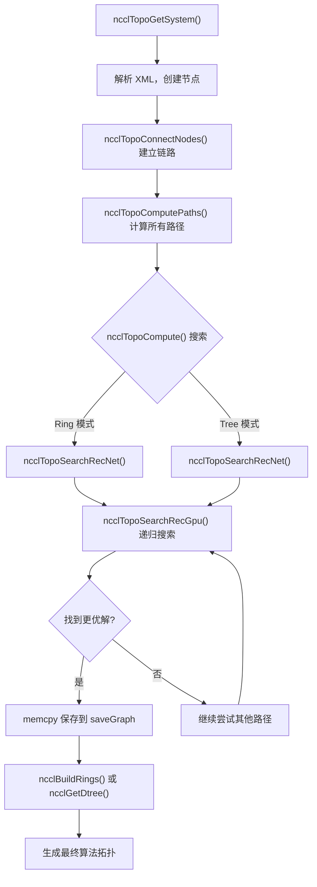
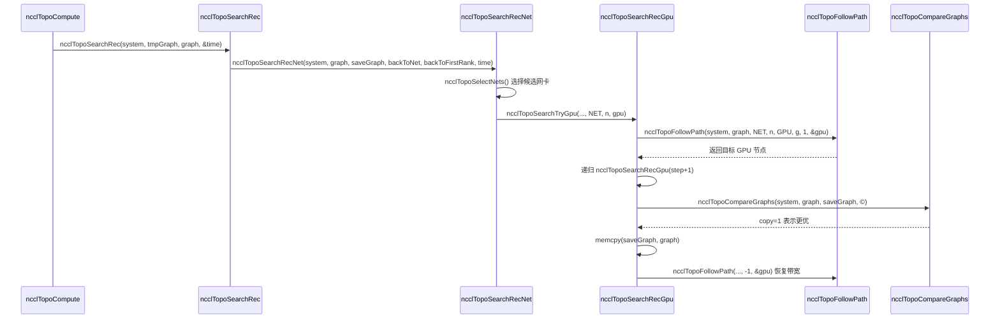

# Capítulo 4: Descubrimiento de topología y búsqueda en grafos: cómo NCCL "ve" la interconexión física de un sistema multi-GPU

En el capítulo anterior descendimos capa por capa a lo largo de la cadena de llamadas de ncclCommInitRank y vimos cuándo se rellena el campo comm->topo, pero no desplegamos su estructura interna. Entonces, ¿cómo "ve" exactamente NCCL las GPU y las tarjetas de red de la máquina y las organiza en información de topología utilizable? Este capítulo desglosará los tres pasos clave de este proceso: topo.cc se encarga de enumerar los dispositivos físicos en un grafo, search.cc busca la ruta óptima en dicho grafo, y rings.cc y trees.cc concretan los resultados de búsqueda en las dos topologías de algoritmos Ring y Tree. Solo comprendiendo la cooperación entre estos tres se puede entender por qué NCCL puede seleccionar automáticamente el algoritmo adecuado en distintas máquinas.

# Grafo de topología: dibujar la máquina como un "mapa de líneas de metro"

## Modelo intuitivo

Imagina que eres un repartidor que acaba de llegar a una ciudad desconocida. Tienes que llevar un paquete del punto A al punto B, pero no sabes qué camino es el más rápido. Necesitas un mapa: en él están marcadas todas las estaciones (GPU, tarjetas de red, CPU, switches PCI) y las conexiones entre estaciones (NVLink, PCIe, red). El grafo de topología de NCCL es ese mapa.

Sin este mapa, NCCL solo puede suponer ciegamente que "todas las GPU tienen el mismo ancho de banda"; en una máquina de 8 tarjetas totalmente interconectadas por NVLink quizá aún se pueda apañar, pero en cuanto se enfrenta a topologías complejas con cruce de NUMA, cruce de switches PCI o mezcla de NVLink + PCIe, elegirá la ruta incorrecta y meterá por PCIe lento datos que deberían ir por NVLink, con una caída directa del rendimiento a la mitad.

## Estructuras de datos y diseño de memoria

El núcleo del grafo de topología es`ncclTopoSystem`, que almacena todos los dispositivos agrupados por tipo de nodo. Los tipos de nodo se definen en el array`topoNodeTypeStr`:

[FACT:src/graph/topo.cc:33-35]

```c
const char* topoNodeTypeStr[] = {"GPU", "PCI", "NVS", "CPU", "NIC", "NET", "GIN", "RMA", "DEV", "CXB"};
const char* topoLinkTypeStr[] = {"LOC", "NVL", "", "C2C", "PCI", "", "", "", "", "SYS", "NET"};
const char* topoPathTypeStr[] = {"LOC", "NVL", "NVB", "C2C", "PIX", "PXB", "P2C", "PXN", "PHB", "SYS", "NET", "DIS"};
```

Estos tres arrays definen respectivamente las representaciones de cadena de los tipos de nodo, los tipos de enlace y los tipos de ruta. Nótese el orden de`topoPathTypeStr`: también actúa como ordenación de la calidad de las rutas: cuanto menor es el índice, más rápida es la ruta.`LOC`(local) es la más rápida,`DIS`(desconectado) es la más lenta. Este orden se usará repetidamente en las búsquedas posteriores para comparar la calidad de las rutas.

Cada nodo está representado por`ncclTopoNode`y al crearse inicializa campos diferentes según su tipo. Tomemos como ejemplo un nodo GPU:

[FACT:src/graph/topo.cc:105-141]

```c
ncclResult_t ncclTopoCreateNode(struct ncclTopoSystem* system, struct ncclTopoNode** node, int type, uint64_t id) {
  if (system->nodes[type].count == NCCL_TOPO_MAX_NODES) {
    WARN("Error : tried to create too many nodes of type %d", type);
    return ncclInternalError;
  }
  struct ncclTopoNode* n = system->nodes[type].nodes + system->nodes[type].count;
  system->nodes[type].count++;
  n->type = type;
  n->id = id;
  if (type == GPU) {
    n->gpu.dev = NCCL_TOPO_UNDEF;
    n->gpu.rank = NCCL_TOPO_UNDEF;
    n->gpu.cudaCompCap = NCCL_TOPO_UNDEF;
    n->gpu.mloPart = NCCL_TOPO_UNDEF;
  } else if (type == CPU) {
    ...
```

Aquí hay varios puntos de diseño clave. Primero, los nodos se almacenan en un array preasignado (`system->nodes[type].nodes`), en lugar de una lista enlazada. Esto significa que los nodos están dispuestos de forma contigua en memoria, lo que favorece la caché durante el recorrido. Segundo,`NCCL_TOPO_MAX_NODES`es un límite máximo estricto; si se supera, se produce un error; esto evita un crecimiento infinito ante anomalías topológicas. Tercero, cada nodo tiene un campo`id`que es un entero de 64 bits, donde los 32 bits superiores son el systemId (identifica qué host) y los 32 bits inferiores son el localId (número de dispositivo dentro del host).

Las conexiones entre nodos están representadas por`ncclTopoLink`.`ncclTopoConnectNodes`se encarga de establecer conexiones bidireccionales:

[FACT:src/graph/topo.cc:179-204]

```c
ncclResult_t ncclTopoConnectNodes(struct ncclTopoNode* node, struct ncclTopoNode* remNode, int type, float bw) {
  // Aggregate links into higher bw for NVLink
  struct ncclTopoLink* link;
  for (link = node->links; link - node->links != NCCL_TOPO_MAX_LINKS && link->remNode; link++) {
    if (link->remNode == remNode && link->type == type) break;
  }
  if (link - node->links == NCCL_TOPO_MAX_LINKS) {
    WARN("Error : too many Topo links (max %d)", NCCL_TOPO_MAX_LINKS);
    return ncclInternalError;
  }
  if (link->remNode == NULL) node->nlinks++;
  link->type = type;
  link->remNode = remNode;
  link->bw += bw;

  // Sort links in BW descending order
  struct ncclTopoLink linkSave;
  memcpy(&linkSave, link, sizeof(struct ncclTopoLink));
  while (link != node->links) {
    if ((link - 1)->bw >= linkSave.bw) break;
    memcpy(link, link - 1, sizeof(struct ncclTopoLink));
    link--;
  }
  memcpy(link, &linkSave, sizeof(struct ncclTopoLink));
  return ncclSuccess;
}
```

Esta función hace tres cosas. Primero, busca si ya existe un enlace hacia el mismo destino y del mismo tipo; si existe, acumula el ancho de banda (`link->bw += bw`). Esto maneja el caso de múltiples NVLink conectados al mismo GPU: 4 NVLink de 25 GB/s cada uno, tras agregarse dan 100 GB/s. Segundo, si no lo encuentra, añade un nuevo enlace. Tercero, tras insertar, ordena de forma descendente por ancho de banda, de modo que en recorridos posteriores se vean primero los enlaces de mayor ancho de banda.

> **[Design Inference & Architectural Trade-offs]**
> La motivación del orden descendente por ancho de banda es que el algoritmo de búsqueda descubra cuanto antes las rutas de alto ancho de banda y converja más rápido a una mejor solución. La búsqueda tiene un límite de tiempo de espera (más adelante se verá`NCCL_SEARCH_TIMEOUT`), y el ordenamiento permite gastar el presupuesto de tiempo limitado en rutas más prometedoras.

## Recorrido paso a paso guiado por escenarios

Ahora pongámonos en un escenario concreto: un servidor A100 de 8 tarjetas, donde cada tarjeta está totalmente interconectada mediante NVLink, y además hay 4 tarjetas de red Mellanox ConnectX-6 insertadas en ranuras PCIe. Durante la inicialización de NCCL,`ncclTopoGetSystem`es invocado; lee la información de dispositivos desde un archivo XML (generado por`nvidia-topologyd`o por el propio NCCL) y luego construye el grafo de topología.

Primer paso, analizar el nodo CPU.`ncclTopoAddCpu`lee desde el XML la arquitectura, el fabricante y el modelo de la CPU, y crea el nodo CPU:

[FACT:src/graph/topo.cc:806-875]

```c
ncclResult_t ncclTopoAddCpu(struct ncclXmlNode* xmlCpu, struct ncclTopoSystem* system) {
  int numaId;
  NCCLCHECK(xmlGetAttrInt(xmlCpu, "numaid", &numaId));
  int systemId;
  NCCLCHECK(ncclGetSystemId(system, xmlCpu, &systemId));
  struct ncclTopoNode* cpu;
  NCCLCHECK(ncclTopoCreateNode(system, &cpu, CPU, NCCL_TOPO_ID(systemId, numaId)));
  ...
  for (int s = 0; s nSubs; s++) {
    struct ncclXmlNode* node = xmlCpu->subs[s];
    if (strcmp(node->name, "pci") == 0) NCCLCHECK(ncclTopoAddPci(node, system, cpu, systemId, numaId));
    if (strcmp(node->name, "nic") == 0) {
      ...
    }
  }
  return ncclSuccess;
}
```

El nodo CPU es la raíz del árbol de topología. Debajo de cada CPU cuelgan el subárbol PCI y los nodos NIC.`ncclTopoAddPci`procesa recursivamente el árbol PCI; al encontrar un GPU crea un nodo GPU, y al encontrar un NIC crea un nodo NIC.

Segundo paso, añadir conexiones NVLink. Nótese que`ncclTopoAddGpu`solo lee los atributos básicos del GPU; el comentario dice explícitamente "Do not go any further, nvlinks will be added in a second pass":

[FACT:src/graph/topo.cc:590-598]

```c
ncclResult_t ncclTopoAddGpu(struct ncclXmlNode* xmlGpu, struct ncclTopoSystem* system, struct ncclTopoNode* gpu) {
  NCCLCHECK(xmlGetAttrInt(xmlGpu, "rank", &gpu->gpu.rank));
  NCCLCHECK(xmlGetAttrInt(xmlGpu, "sm", &gpu->gpu.cudaCompCap));
  NCCLCHECK(xmlGetAttrInt(xmlGpu, "dev", &gpu->gpu.dev));
  NCCLCHECK(xmlGetAttrInt(xmlGpu, "gdr", &gpu->gpu.gdrSupport));
  NCCLCHECK(xmlGetAttrIntDefault(xmlGpu, "mlopart", &gpu->gpu.mlopart, NCCL_TOPO_UNDEF));
  // Do not go any further, nvlinks will be added in a second pass
  return ncclSuccess;
}
```

¿Por qué dividir en dos pasadas? Porque NVLink es una conexión entre GPUs y se necesita que los nodos GPU de ambos extremos ya existan para poder establecer el enlace. La primera pasada crea todos los nodos; la segunda pasada`ncclTopoAddNvLinks`los conecta.

Tercer paso, procesar los dispositivos de red.`ncclTopoAddNic`recorre los subnodos net/gin/rma bajo el NIC y llama respectivamente a las funciones de añadido correspondientes. Tomemos como ejemplo`ncclTopoAddNet`:

[FACT:src/graph/topo.cc:461-503]

```c
static ncclResult_t ncclTopoAddNet(struct ncclXmlNode* xmlNet, struct ncclXmlNode* parent,
                                   struct ncclTopoSystem* system, struct ncclTopoNode* nic, int systemId) {
  int dev;
  NCCLCHECK(xmlGetAttrInt(xmlNet, "dev", &dev));
  int64_t netId = NCCL_TOPO_ID(systemId, dev);
  struct ncclTopoNode* net;
  NCCLCHECK(ncclTopoCreateNode(system, &net, NET, netId));
  net->net.dev = dev;
  int mbps;
  NCCLCHECKNOWARN(xmlGetAttrIntDefault(xmlNet, "speed", &mbps, 0), NCCL_GRAPH);
  if (mbps net.bw = mbps / 8000.0;
  ...
  NCCLCHECK(ncclTopoConnectNodes(nic, net, LINK_NET, net->net.bw));
  NCCLCHECK(ncclTopoConnectNodes(net, nic, LINK_NET, net->net.bw));
  return ncclSuccess;
}
```

Nótese la conversión`mbps / 8000.0`: mbps son megabits por segundo; al dividir entre 8000 se obtiene GB/s (porque 1 GB/s = 8000 Mbps). Si la tarjeta de red informa speed = -1 (algunas tarjetas de red virtuales lo hacen), se asume por defecto 10000 Mbps = 1.25 GB/s.

Cuarto paso, procesamiento final.`ncclTopoGetSystemFromXml`después de completar la adición de todos los nodos y enlaces, también realiza varias tareas de limpieza:

[FACT:src/graph/topo.cc:1080-1088]

```c
  NCCLCHECK(ncclTopoAddNvLinks(topNode, *topoSystem, NULL, 0));
  NCCLCHECK(ncclTopoAddC2c(topNode, *topoSystem, NULL, 0));
  NCCLCHECK(ncclTopoAddPciLinks(topNode, *topoSystem, NULL, 0));

  NCCLCHECK(ncclTopoFlattenBcmSwitches(*topoSystem));
  NCCLCHECK(ncclTopoConnectCpus(*topoSystem));
  NCCLCHECK(ncclTopoSortSystem(*topoSystem));
```

`ncclTopoFlattenBcmSwitches`maneja el caso especial de los switches PCIe Broadcom Gen4: se presentan como switches de dos capas, pero en realidad son de ancho de banda completo, y hay que "aplanarlos" para evitar que el algoritmo de búsqueda se vea inducido a error.`ncclTopoConnectCpus`interconecta todos los nodos CPU entre sí (el acceso entre NUMA va por enlaces SYS).`ncclTopoSortSystem`ordena los enlaces para que los enlaces descendentes PCI queden delante y facilitar el recorrido.

## Reflexiones de diseño y trampas en producción

> **[Design Inference & Architectural Trade-offs]**
> **¿Por qué usar XML como formato intermedio?**Porque el descubrimiento de topología necesita compartirse entre procesos: cada rank solo sondea los GPU que gestiona, luego intercambia XML mediante bootstrap y finalmente los fusiona en una topología completa. XML es un formato de texto autodescriptivo, fácil de depurar (se puede volcar para inspeccionarlo) y compatible entre versiones.

**Trampa uno:`ncclTopoGetNode`no reporta error cuando no encuentra un nodo.**Véase esta función:

[FACT:src/graph/topo.cc:95-103]

```c
ncclResult_t ncclTopoGetNode(struct ncclTopoSystem* system, struct ncclTopoNode** node, int type, uint64_t id) {
  for (int i = 0; i nodes[type].count; i++) {
    if (system->nodes[type].nodes[i].id == id) {
      *node = system->nodes[type].nodes + i;
      return ncclSuccess;
    }
  }
  return ncclSuccess;
}
```

Si no lo encuentra, devuelve`ncclSuccess`pero`*node`permanece sin cambios (el llamador normalmente lo inicializa a NULL). El llamador debe comprobar por sí mismo`*node == NULL`. Este diseño facilita pasar por alto la comprobación: si el llamador olvida verificarla, una desreferencia posterior provocará un fallo.

**Trampa dos:`ncclTopoConnectNodes`la acumulación de ancho de banda puede provocar desbordamiento.**Si hay una gran cantidad de enlaces entre el mismo par de nodos (por ejemplo, en escenarios NVSwitch),`link->bw += bw`puede acumularse hasta un valor muy grande. Aunque la precisión de float es suficiente, si el número de enlaces es anormalmente alto, la lógica de ordenamiento puede fallar.

**Trampa tres:`ncclTopoRemoveNode`la corrección de punteros en**Al eliminar un nodo, todos los enlaces que apuntan al nodo eliminado deben eliminarse, y los punteros que apuntan a nodos posteriores al nodo eliminado deben desplazarse hacia delante:

[FACT:src/graph/topo.cc:143-177]

```c
ncclResult_t ncclTopoRemoveNode(struct ncclTopoSystem* system, int type, int index) {
  struct ncclTopoNode* delNode = system->nodes[type].nodes + index;
  for (int t = 0; t paths[t] != nullptr) {
      WARN("Cannot remove topology node %d/%lx while paths are computed", type, delNode->id);
      return ncclInternalError;
    }
    for (int n = 0; n nodes[t].count; n++) {
      struct ncclTopoNode* node = system->nodes[t].nodes + n;
      if (node == delNode) continue;
      for (int l = 0; l nlinks; l++) {
        while (l nlinks && node->links[l].remNode == delNode) {
          memmove(node->links + l, node->links + l + 1, (node->nlinks - l - 1) * sizeof(struct ncclTopoLink));
          node->nlinks--;
        }
        if (l nlinks && node->links[l].remNode->type == type && node->links[l].remNode >= delNode) {
          node->links[l].remNode--;
        }
      }
    }
  }
  ...
```

Aquí hay una sutileza:`node->links[l].remNode--`está corrigiendo punteros. Como los nodos se almacenan en un array contiguo, tras eliminar un nodo las direcciones de los nodos posteriores se desplazan una posición`sizeof(struct ncclTopoNode)`. Por lo tanto, todos los punteros que apuntan a nodos posteriores al nodo eliminado deben decrementarse en uno. Esta operación en`memmove`ejecutado antes, el orden es clave.

# Búsqueda de rutas: encontrar la "ruta óptima" en el grafo

## Modelo intuitivo

Tener un mapa no es suficiente, también necesitas un algoritmo de navegación. La búsqueda de rutas de NCCL se divide en dos capas: la primera capa es el preprocesamiento, que calcula la ruta más corta entre todos los pares de nodos (BFS); la segunda capa es la búsqueda en el grafo, que prueba diferentes estructuras Ring/Tree sobre los resultados del preprocesamiento para encontrar la de mayor ancho de banda.

Sin la búsqueda de rutas, NCCL solo podría codificar de forma fija secuencias como "GPU 0 conectada a GPU 1 conectada a GPU 2...", lo que en topologías no uniformes seleccionaría rutas lentas.

## Estructuras de datos y diseño de memoria

La estructura de datos central de la búsqueda de rutas es`ncclTopoLinkList`, que almacena la ruta completa desde un nodo origen hasta un nodo destino:

```c
struct ncclTopoLinkList {
  struct ncclTopoLink* list[NCCL_TOPO_MAX_HOPS];  // 路径上的链路
  int count;      // 跳数
  float bw;       // 瓶颈带宽
  int type;       // 路径类型（PATH_LOC, PATH_NVL, ...）
  int capacity;   // list 数组的容量
};
```

Cada nodo tiene un array`paths[type]`que almacena las rutas hacia todos los nodos de ese tipo. Por ejemplo, el`paths[NET]`de un nodo GPU almacena las rutas hacia todas las tarjetas de red.

El cálculo de rutas lo realiza`ncclTopoSetPaths`, que es un BFS:

[FACT:src/graph/paths.cc:52-147]

```c
static ncclResult_t ncclTopoSetPaths(struct ncclTopoNode* baseNode, struct ncclTopoSystem* system) {
  if (baseNode->paths[baseNode->type] == NULL) {
    NCCLCHECK(ncclCalloc(baseNode->paths + baseNode->type, system->nodes[baseNode->type].count));
    for (int i = 0; i nodes[baseNode->type].count; i++) baseNode->paths[baseNode->type][i].type = PATH_DIS;
  }

  // breadth-first search to set all paths to that node in the system
  struct ncclTopoNodeList nodeList;
  struct ncclTopoNodeList nextNodeList = {{0}, 0};
  nodeList.count = 1;
  nodeList.list[0] = baseNode;
  ...
  while (nodeList.count) {
    nextNodeList.count = 0;
    for (int n = 0; n type, baseNode->id, &path));
      for (int l = 0; l nlinks; l++) {
        struct ncclTopoLink* link = node->links + l;
        struct ncclTopoNode* remNode = link->remNode;
        ...
        float bw = std::min(path->bw, link->bw);
        ...
        // Update if better path type, OR same type with higher bw, OR same type/bw with strickly fewer hops.
        if (newType type || (newType == remPath->type && remPath->bw type && remPath->bw == bw && remPath->count > (path->count + 1))) {
          ...
          remPath->bw = bw;
          remPath->type = newType;
          ...
        }
      }
    }
    memcpy(&nodeList, &nextNodeList, sizeof(nodeList));
  }
  return ncclSuccess;
}
```

El BFS parte desde`baseNode`y se expande capa por capa. Cada vez que alcanza un nuevo nodo, calcula el ancho de banda cuello de botella de la ruta (`std::min(path->bw, link->bw)`) y el tipo de ruta. El cálculo del tipo de ruta tiene algunas reglas especiales:

- Si pasa por dos switches PCI, el tipo se eleva a`PATH_PXB`
- Si pasa por CPU, el tipo se eleva a`PATH_PHB`
- Si pasa por un nodo DEV y es NVLink, el tipo se eleva a`PATH_NVB`

La condición de actualización es "ruta mejor": mejor tipo, o mismo tipo pero mayor ancho de banda, o mismo tipo y ancho de banda pero menos saltos.

## Recorrido paso a paso guiado por escenarios

Ahora veamos la búsqueda de la segunda capa.`ncclTopoCompute`es el punto de entrada, prueba diferentes combinaciones de parámetros y llama a`ncclTopoSearchRec`para realizar la búsqueda.

El núcleo de la búsqueda es la función recursiva`ncclTopoSearchRecGpu`. Parte de una GPU, intenta avanzar a la siguiente GPU, hasta recorrer todas las GPUs formando una ruta:

[FACT:src/graph/search.cc:639-756]

```c
ncclResult_t ncclTopoSearchRecGpu(struct ncclTopoSystem* system, struct ncclTopoGraph* graph,
                                  struct ncclTopoGraph* saveGraph, struct ncclTopoNode* gpu, int step, int backToNet,
                                  int backToFirstRank, int forcedOrder, int* time) {
  if ((*time) nChannels++;
    NCCLCHECKGOTO(ncclTopoCompareGraphs(system, graph, saveGraph, ©), ret, exit);
    if (copy) {
      memcpy(saveGraph, graph, sizeof(struct ncclTopoGraph));
      if (graph->nChannels == graph->maxChannels) *time = -1;
    }
    if (graph->nChannels maxChannels) {
      NCCLCHECKGOTO(ncclTopoSearchRec(system, graph, saveGraph, time), ret, exit);
    }
    graph->nChannels--;
    ret = ncclSuccess;
    goto exit;
  }
  graph->intra[graph->nChannels * ngpus + step] = gpu->gpu.rank;
  g = gpu - system->nodes[GPU].nodes;
  if (step == backToNet) {
    // first get back to NIC
    ...
  } else if (graph->pattern == NCCL_TOPO_PATTERN_NVLS) {
    ...
  } else if (step nodes[GPU].count - 1) {
    // Go to next GPU
    ...
  } else if (step == backToFirstRank) {
    // Find first GPU and loop back to it
    ...
  } else {
    // Next path
    NCCLCHECKGOTO(ncclTopoSearchRecGpu(system, graph, saveGraph, gpu, ngpus, -1, -1, forcedOrder, time), ret, exit);
  }
  ...
}
```

Esta función tiene varias ramas clave:

1. **`step == ngpus`**: ya se recorrieron todas las GPUs, se formó una ruta completa. En este punto se incrementa`nChannels`, se compara el grafo actual con el mejor grafo guardado, y si es mejor se guarda. Luego se llama recursivamente a`ncclTopoSearchRec`para intentar buscar el siguiente channel.

2. **`step == backToNet`**: es necesario volver a la tarjeta de red. Esto ocurre en modo Ring (la última GPU debe conectarse de vuelta a la tarjeta de red inicial) o en modo Tree (la primera GPU debe conectarse a la tarjeta de red).

3. **`step < ngpus - 1`**: continuar hacia la siguiente GPU. Aquí se llama a`ncclTopoSearchNextGpuSort`para ordenar las GPUs candidatas.

4. **`step == backToFirstRank`**: en modo Ring, la última GPU debe conectarse de vuelta a la primera GPU.

5. **`else`**: la ruta termina, se pasa a la siguiente ronda.

`ncclTopoSearchNextGpuSort`determina el orden en que se intenta la siguiente GPU:

[FACT:src/graph/search.cc:254-327]

```c
ncclResult_t ncclTopoSearchNextGpuSort(struct ncclTopoSystem* system, struct ncclTopoGraph* graph,
                                       struct ncclTopoNode* gpu, int* next, int* countPtr, int sortNet) {
  const uint64_t flag = 1ULL nChannels);
  int ngpus = system->nodes[GPU].count;
  struct ncclTopoLinkList* paths = gpu->paths[GPU];
  ...
  for (int i = 1; i nodes[GPU].nodes[g].used & flag) continue;
    scores[count].g = g;
    scores[count].startIndex = i;
    scores[count].intraNhops = paths[g].count;
    scores[count].intraBw = paths[g].bw;
    if (netPaths) {
      scores[count].interNhops = netPaths[g].count;
      scores[count].interPciBw = gpuPciBw(system->nodes[GPU].nodes + g);
      scores[count].interBw = netPaths[g].bw;
    }
    count++;
  }

  // Sort GPUs
  qsort(scores, count, sizeof(struct ncclGpuScore), cmpScore);
  ...
}
```

Puntúa cada GPU candidata y la regla de ordenamiento es: primero compara interBw (ancho de banda hacia la tarjeta de red), luego interPciBw, luego interNhops, luego intraBw, y finalmente intraNhops. Esta prioridad refleja el objetivo de optimización de NCCL: la comunicación entre máquinas es el cuello de botella, por lo que se priorizan las GPUs con mayor ancho de banda hacia la tarjeta de red.

## Reflexiones de diseño y problemas en producción

**¿Por qué la búsqueda tiene timeout?**Observa estas constantes:

[FACT:src/graph/search.cc:329-330]

```c
#define NCCL_SEARCH_GLOBAL_TIMEOUT (1ULL count, bw, &step));
  if (step count) goto rewind;
  // Enough bandwidth : return destination node.
  graph->nHops += mult * path->count;
  *node = system->nodes[type2].nodes + index2;
  return ncclSuccess;
rewind:
  // Not enough bandwidth : rewind and exit.
  NCCLCHECK(followPath(path, node1, step, -bw, &step));
  return ncclSuccess;
}
```

`followPath`modifica el`bw`de cada enlace en la ruta (deduciendo el ancho de banda ya usado). Si la búsqueda falla, es obligatorio llamar a`followPath`para restaurar con`-bw`. Este patrón de "deducir-restaurar" es muy propenso a errores en búsquedas recursivas: si alguna rama olvida restaurar, las búsquedas posteriores verán anchos de banda incorrectos.

**Problema dos:`ncclTopoCompareGraphs`la lógica de comparación es muy sutil.**Prioriza comparar`nChannels * bwIntra`, pero además hay un montón de casos especiales:

[FACT:src/graph/search.cc:446-477]

```c
ncclResult_t ncclTopoCompareGraphs(struct ncclTopoSystem* system, struct ncclTopoGraph* graph,
                                   struct ncclTopoGraph* refGraph, int* copy) {
  // 1. Try to get the same nChannels between Rings and Trees
  if (graph->nChannels minChannels) return ncclSuccess;
  const bool evenReference = refGraph->nChannels > 0 && !(refGraph->nChannels & 1);
  const bool evenReferenceIsBetter = refGraph->nChannels * refGraph->bwIntra >= graph->nChannels * graph->bwIntra;
  // Favor an even number of channels when aggregate bandwidth is equal or better.
  if (graph->pattern != NCCL_TOPO_PATTERN_NVLS && evenReference && (graph->nChannels & 1) &&
      graph->nChannels nodes[NET].count && evenReferenceIsBetter)
    return ncclSuccess;
  ...
```

> **[Design Inference & Architectural Trade-offs]**
> ¿Por qué se prefieren los channels pares? Porque el algoritmo Ring puede emparejar mejor con channels pares: cada channel puede dividirse en dos mitades, una en sentido horario y otra en sentido antihorario, reduciendo la congestión de red.

# Ring y Tree: convertir los resultados de búsqueda en topología de algoritmo

## Modelo intuitivo

El algoritmo de búsqueda encuentra un conjunto de rutas, pero el algoritmo necesita un orden explícito de "quién envía a quién". Ring encadena todos los ranks en un anillo, cada rank recibe del anterior y envía al siguiente. Tree es un árbol, donde los datos fluyen desde la raíz hacia abajo o se concentran desde las hojas hacia arriba.

Sin estos dos módulos, el algoritmo de búsqueda solo encontraría un montón de rutas y no podría indicar al kernel de GPU cómo enviar los datos concretamente.

## Estructuras de datos y diseño de memoria

La construcción de Ring la realiza`ncclBuildRings`:

[FACT:src/graph/rings.cc:29-74]

```c
ncclResult_t ncclBuildRings(int nrings, int* rings, int rank, int nranks, int* prev, int* next) {
  ncclResult_t ret = ncclSuccess;
  uint64_t* rankFound;
  int rankFoundSize = DIVUP(nranks, 64);
  NCCLCHECK(ncclCalloc(&rankFound, rankFoundSize));

  for (int r = 0; r  0 so it has to be our child 1, not 0.
    *d1 = nranks > 1 ? bit >> 1 : -1;
    return ncclSuccess;
  }

  up = (rank ^ bit) | (bit = nranks) up = (rank ^ bit);
  *parentChildType = (rank > 1;
  // down0 is always within bounds
  down0 = lowbit == 0 ? -1 : rank - lowbit;

  down1 = lowbit == 0 ? -1 : rank + lowbit;
  // Make sure down1 is within bounds
  while (down1 >= nranks) {
    down1 = lowbit == 0 ? -1 : rank + lowbit;
    lowbit >>= 1;
  }
  *d0 = down0;
  *d1 = down1;

  return ncclSuccess;
}
```

Esta función construye un árbol binario usando operaciones de bits. La idea central es: encontrar el bit no nulo más bajo del rank`bit`, el nodo padre es`(rank ^ bit) | (bit << 1)`, el hijo izquierdo es`rank - (bit >> 1)`, el hijo derecho es`rank + (bit >> 1)`. El diagrama ASCII en los comentarios muestra claramente esta estructura.

## Recorrido paso a paso guiado por escenarios

Tomemos como ejemplo un Ring de 8 GPUs. Supongamos que los resultados de búsqueda proporcionan para cada rank el`next`puntero:

```
rank 0 -> rank 1
rank 1 -> rank 2
...
rank 7 -> rank 0
```

`ncclBuildRings`Partiendo del rank 0, se visitan sucesivamente 1, 2, ..., 7, y finalmente se regresa al 0. El generado`rings[0..7] = {0, 1, 2, 3, 4, 5, 6, 7}`。

Para Tree,`ncclGetBtree`se calcula el nodo padre y los nodos hijos para cada rank. Tomando como ejemplo el rank 1:

- `bit`= 1 (el bit distinto de cero más bajo es el bit 0)
- `up = (1 ^ 1) | (1 << 1) = 0 | 2 = 2`
- `up >= nranks`? 2 < 8, entonces`up = 2`
- `parentChildType = (1 < 2) ? 0 : 1 = 0`(es el primer hijo del nodo padre)
- `lowbit = 0`, entonces`down0 = -1`
- `down1 = -1`

Por lo tanto, el nodo padre del rank 1 es el rank 2, y no tiene nodos hijos. Esto concuerda con la estructura de árbol en los comentarios: el rank 1 es una hoja.

## Reflexiones de diseño y trampas en producción

> **[Design Inference & Architectural Trade-offs]**
> **¿Por qué Tree usa operaciones de bits en lugar de construir el árbol explícitamente?**Porque cada rank solo necesita conocer su nodo padre y sus nodos hijos, no necesita la estructura global del árbol. Las operaciones de bits pueden calcular esta información en tiempo O(1), evitando la sobrecarga de almacenar y sincronizar todo el árbol.

**Trampa uno:`ncclBuildRings`la verificación de puede ser omitida.**Si el`next`arreglo tiene un ciclo (por ejemplo, rank 0 -> rank 1 -> rank 0), el bucle saldrá después de`nranks`iteraciones, pero la`current != rank`verificación capturará este problema. Pero si la longitud del ciclo es exactamente`nranks`un factor de, y no contiene todos los ranks,`rankFound`la verificación lo capturará.

**Trampa dos:`ncclGetDtree`el manejo de ranks impares en.**Para un número impar de ranks, el segundo árbol es un "desplazamiento" en lugar de un "espejo":

[FACT:src/graph/trees.cc:90-112]

```c
ncclResult_t ncclGetDtree(int nranks, int rank, int* s0, int* d0_0, int* d0_1, int* parentChildType0, int* s1,
                          int* d1_0, int* d1_1, int* parentChildType1) {
  // First tree ... use a btree
  ncclGetBtree(nranks, rank, s0, d0_0, d0_1, parentChildType0);
  // Second tree ... mirror or shift
  if (nranks % 2 == 1) {
    // shift
    int shiftrank = (rank - 1 + nranks) % nranks;
    ...
  } else {
    // mirror
    int u, d0, d1;
    ncclGetBtree(nranks, nranks - 1 - rank, &u, &d0, &d1, parentChildType1);
    *s1 = u == -1 ? -1 : nranks - 1 - u;
    ...
  }
  return ncclSuccess;
}
```

El Doble Árbol (Double Tree) es la implementación del algoritmo Tree de NCCL: dos árboles trabajan simultáneamente, uno se encarga de la primera mitad de los datos y el otro de la segunda mitad, mejorando la utilización del ancho de banda. Con ranks impares, el espejo provocaría un mapeo de ranks incompleto, por lo que se usa el desplazamiento.

# La coordinación de los tres: de la topología al algoritmo

Ahora conectemos los tres módulos. Todo el flujo se puede representar con un diagrama:



Este diagrama muestra el flujo completo desde el descubrimiento de topología hasta la generación del algoritmo. Nótese que`ncclTopoSearchRecGpu`es una función recursiva, que intentará continuamente diferentes órdenes de GPUs hasta que se agote el tiempo o se encuentre la solución óptima.

Veamos ahora un diagrama de secuencia de granularidad más fina, que muestra la interacción de los módulos durante el proceso de búsqueda:



Este diagrama de secuencia muestra el bucle central de la búsqueda: seleccionar NIC -> probar GPU -> búsqueda recursiva -> comparar resultados -> restaurar ancho de banda.

# Resumen del capítulo

Este capítulo desglosó los tres eslabones de la percepción de topología de NCCL:

1. **Descubrimiento de topología**（`topo.cc`): lee la información de dispositivos desde XML, crea nodos GPU/CPU/PCI/NIC, establece enlaces NVLink/PCIe/red, formando un grafo de topología completo.

2. **Búsqueda de rutas**（`search.cc` + `paths.cc`): primero usa BFS para precalcular las rutas más cortas entre todos los pares de nodos, luego usa búsqueda recursiva para probar diferentes estructuras Ring/Tree, encontrando la solución con mayor ancho de banda.

3. **Generación de topología de algoritmo**（`rings.cc` + `trees.cc`): convierte los resultados de búsqueda en un orden específico de ranks, Ring usa`ncclBuildRings`para generar el anillo, Tree usa`ncclGetBtree`para generar el árbol binario.

# Reflexiones y autoevaluación del capítulo

P1: Si en`ncclTopoConnectNodes`se cambia la acumulación de ancho de banda`link->bw += bw`por`link->bw = std::max(link->bw, bw)`, ¿en qué escenarios provocaría una degradación del rendimiento? ¿Por qué?

**Análisis de referencia**: la acumulación de ancho de banda maneja el caso de múltiples enlaces paralelos. Tomando como ejemplo 4 NVLink de 25 GB/s cada uno, tras la acumulación son 100 GB/s, tras tomar el máximo solo son 25 GB/s. En`ncclTopoSetPaths`, el ancho de banda de la ruta es`std::min(path->bw, link->bw)`, si el ancho de banda del enlace se subestima, el ancho de banda de toda la ruta se subestimará. Esto provocaría que`ncclTopoCompareGraphs`seleccione un grafo incorrecto: podría elegir una solución con más canales pero menor ancho de banda por canal, resultando en un rendimiento real peor. Escenario concreto: 8 GPUs A100 totalmente interconectadas por NVLink, con 4 NVLink entre cada par de GPUs. La acumulación da 100 GB/s, el máximo da 25 GB/s. El algoritmo de búsqueda consideraría que NVLink y PCIe Gen4 x16 (aproximadamente 25 GB/s) tienen el mismo ancho de banda, y podría elegir la ruta por PCIe.

Q2: `ncclTopoSearchRecGpu`En`(*time)--`se ejecuta en la entrada de la función. Si la búsqueda agota el tiempo (`*time <= 0`), la función retorna directamente. ¿En qué circunstancias este diseño provocaría que la búsqueda entre en un bucle infinito? ¿Cómo solucionarlo?

**Análisis de referencia**：`(*time)--`se decrementa en la entrada, si`*time`tiene un valor inicial de 0 o negativo, la función retorna directamente sin decrementarse. Pero si`*time`es un número positivo muy grande, se decrementará en cada recursión, eventualmente llegando a 0. El problema es: si la profundidad de recursión de alguna rama es muy grande, pero después de cada decremento`*time`sigue siendo mayor que 0, la búsqueda continuará. El verdadero riesgo es el`ncclTopoSearchRec`bucle en`goto search`: si`time`no se reinicia correctamente en el bucle, podría haber un bucle infinito. Véase`ncclTopoCompute`la lógica de`globalTimeout`en:`globalTimeout -= time`se ejecuta en cada`search`etiqueta, si`globalTimeout`se vuelve negativo, se`goto done`. Pero si`time`se reinicia a`NCCL_SEARCH_TIMEOUT`，`globalTimeout`podría nunca volverse negativo. La solución es asegurar que`globalTimeout`se decremente después de cada búsqueda, y que haya un límite máximo estricto.

Q3: `ncclTopoFollowPath`se llama cuando la búsqueda falla para`followPath(path, node1, step, -bw, &step)`restaurar el ancho de banda. Si alguna rama recursiva retorna antes de la restauración (por ejemplo,`NCCLCHECKGOTO`salta a`exit`), ¿qué sucedería? ¿Cómo detectar este problema?

**Análisis de referencia**: si la restauración se omite, el ancho de banda de los enlaces en la ruta permanecerá en el estado deducido. Las búsquedas posteriores verán un ancho de banda incorrecto, pudiendo perder la solución óptima. Método de detección: en`ncclTopoCompute`Después de finalizar, se recorren todos los enlaces para verificar si el ancho de banda coincide con el valor inicial. Si se detecta una discrepancia, indica que hubo una omisión en la restauración. Método de corrección: usar un objeto guardián de estilo RAII que restaure automáticamente el ancho de banda al destruirse. Alternativamente, guardar una instantánea del ancho de banda de todos los enlaces antes de cada búsqueda y restaurarla después. La práctica actual de NCCL es, en cada`ncclTopoFollowPath`punto de llamada, emparejar manualmente las llamadas directas e inversas, lo cual es propenso a errores. Un diseño más robusto sería encapsular la reducción y restauración del ancho de banda en una función, asegurando que aparezcan en pares.

En el próximo capítulo profundizaremos en el módulo tuning para ver cómo NCCL, basándose en los resultados de búsqueda topológica y el tamaño del mensaje, toma la decisión final entre algoritmos como Ring, Tree, CollNet, etc. El grafo topológico, los resultados de búsqueda de rutas y las plantillas de algoritmos establecidos en este capítulo serán la entrada del módulo tuning.

Mediante la construcción del grafo en topo.cc, la búsqueda de rutas en search.cc y la generación de topologías en rings.cc y trees.cc, NCCL implementa la filosofía de diseño de describir cualquier topología con una estructura de grafo genérica, encontrar la solución óptima con algoritmos de búsqueda configurables y generar el algoritmo final con plantillas simples. Este mecanismo permite a NCCL seleccionar automáticamente el algoritmo adecuado en diversas máquinas, desde estaciones de trabajo con 2 GPU hasta clústeres con 10000 GPU. Sin embargo, el grafo topológico solo proporciona rutas candidatas para el algoritmo; decidir qué ruta tomar y qué protocolo usar en una comunicación concreta requiere decisiones más finas. En el próximo capítulo nos centraremos en el directorio src/tuning para ver cómo el módulo tuning combina el modelo de costos con las estimaciones de algoritmos para tomar la decisión final entre Ring/Tree/NVLS/PAT y LL/LL128/Simple.
