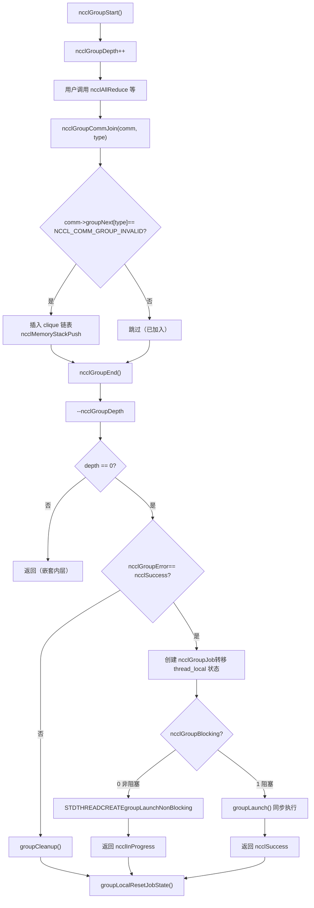
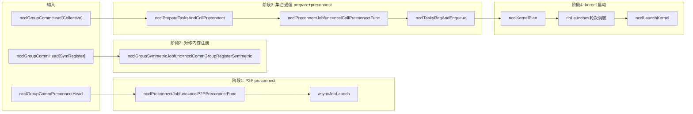

# Capítulo 7: Planificador de tareas: cómo task_sched orquesta la ejecución de múltiples canales y kernels

En el capítulo anterior seguimos ncclAllReduce hasta ncclTaskColl: el objeto descriptor de tarea ya está en comm->planner. Pero el descriptor de tarea es solo una "orden de trabajo", aún no se ha convertido en el kernel que realmente se ejecuta en la GPU. Este capítulo responde a tres preguntas: ¿cómo se acumulan múltiples llamadas a la API para enviarlas juntas? ¿Cómo se dividen las tareas acumuladas entre múltiples canales? ¿Qué garantiza el orden y las dependencias entre múltiples kernels? Primero, un modelo mental general. Imagina NCCL como un restaurante: ncclGroupStart/ncclGroupEnd es el "carrito de compras", el usuario añade varios platos (múltiples llamadas de comunicación colectiva) al carrito; ncclGroupEnd es "hacer el pedido", y la cocina empieza a preparar los platos según el pedido. Y doLaunches es el "coordinador de entrega de platos", que decide qué platos salen primero y cuáles se pueden preparar en paralelo. Sin la semántica de grupo, cada plato se pide por separado, y la cocina tiene que encender el fuego de nuevo para cada plato (lanzar el kernel), lo que supone un coste enorme; sin la programación por rondas de doLaunches, los kernels de múltiples canales se lanzarían fuera de orden, rompiendo las dependencias de datos.

# I. Estado global de la semántica de Group: variables thread_local y el modelo de "carrito de compras"

## Modelo intuitivo

`ncclGroupStart`y`ncclGroupEnd`Todas las llamadas de comunicación entre ellos no lanzan el kernel inmediatamente, sino que se "acumulan". ¿Dónde se acumulan? Se acumulan en**variables globales thread_local (locales al hilo)**¿Por qué thread_local? Porque NCCL asume que las llamadas de grupo dentro del mismo hilo son secuenciales, y diferentes hilos tienen cada uno su propio carrito de compras independiente, sin interferir entre sí. Si estos estados fueran variables globales en lugar de thread_local, dos hilos llamando simultáneamente a`ncclGroupStart`se pisarían mutuamente, provocando que las tareas de un hilo sean enviadas por el`ncclGroupEnd`de otro hilo, lo cual sería catastrófico.

## Estructuras de datos y diseño de memoria

Primero veamos la definición del estado global del grupo.

[FACT:src/group.cc:34-34]

```cpp
thread_local int ncclGroupDepth = 0; // depth of ncclGroupStart nesting
thread_local ncclResult_t ncclGroupError = ncclSuccess;
thread_local struct ncclComm* ncclGroupCommHead[ncclGroupTaskTypeNum] = {nullptr};
thread_local struct ncclComm* ncclGroupCommPreconnectHead = nullptr;
thread_local struct ncclIntruQueue ncclAsyncJobs;
thread_local int ncclGroupBlocking = -1; /* default mode */
```

Desglose campo por campo:

- **`ncclGroupDepth`**: profundidad de anidamiento.`ncclGroupStart`Se puede llamar de forma anidada (aunque no es común), cada`ncclGroupStart`incrementa en uno,`ncclGroupEnd`decrementa en uno. Solo cuando llega a 0 se envía realmente. Esto es como un carrito de compras que se puede anidar: abres un subcarrito dentro de un carrito, y solo al finalizar el carrito más externo se hace realmente el pedido.
- **`ncclGroupError`**: si cualquier llamada dentro del grupo falla, el error se registra aquí,`ncclGroupEnd`se maneja de forma unificada. Esto evita el estado inconsistente de "después de que una llamada falla, las llamadas posteriores siguen añadiendo cosas al carrito".
- **`ncclGroupCommHead[ncclGroupTaskTypeNum]`**: cabezas de listas enlazadas de dominios de comunicación agrupadas por tipo de tarea.`ncclGroupTaskTypeNum`es el número de tipos de tarea (comunicación colectiva, tareas primitivas, tareas de gestión, registro simétrico, etc.). Cada tipo tiene una lista enlazada, y los nodos de la lista son`ncclComm`, enlazados mediante`comm->groupNext[type]`¿Por qué agrupar por tipo? Porque diferentes tipos de tareas tienen diferentes momentos de envío y relaciones de dependencia: las tareas de comunicación colectiva necesitan preconnect primero, y las tareas de gestión (como destroy) deben ejecutarse al final.
- **`ncclGroupCommPreconnectHead`**: lista enlazada de dominios de comunicación que necesitan preconexión. La preconexión es "establecer las conexiones de red de antemano", para evitar la latencia de establecer conexiones en el momento de lanzar el kernel.
- **`ncclAsyncJobs`**: cola de tareas asíncronas. Algunas tareas (como`ncclCommInitRank`) son asíncronas, se colocan en esta cola y se lanzan de forma unificada en`ncclGroupEnd`.
- **`ncclGroupBlocking`**: indicador de modo bloqueante.`-1`indica que aún no se ha determinado,`0`indica no bloqueante,`1`indica bloqueo. No se permite mezclar dominios de comunicación bloqueantes y no bloqueantes dentro del mismo grupo; de lo contrario, se produce un error.

Aquí hay un diseño clave:`ncclGroupCommHead`es**array**, cada elemento es una lista enlazada. Los nodos de la lista se enlazan mediante`comm->groupNext[type]`, en lugar de usar una estructura de nodo de lista enlazada independiente. Esto significa que`ncclComm`dentro de la estructura se debe reservar el campo de array`groupNext`. Este diseño de «lista enlazada intrusiva» evita asignaciones de memoria adicionales, pero a costa de que la estructura`ncclComm`se vuelva más grande.

## Recorrido paso a paso guiado por escenarios

**Escenario**: el usuario llama a`ncclGroupStart()`, luego llama dos veces consecutivas a`ncclAllReduce`(respectivamente para dos dominios de comunicación diferentes, commA y commB), y finalmente llama a`ncclGroupEnd()`。

**Primer paso:`ncclGroupStart`¿qué hizo?**

[FACT:src/include/group.h:63-66]

```cpp
inline ncclResult_t ncclGroupStartInternal() {
  ncclGroupDepth++;
  return ncclSuccess;
}
```

Extremadamente simple: incrementar la profundidad en uno. Sin asignación de memoria, sin bloqueos, sin llamadas al sistema. Por eso`ncclGroupStart`tiene casi cero sobrecarga.

**Segundo paso:`ncclAllReduce`¿qué sucede cuando se llama dentro del grupo?**

`ncclAllReduce`internamente llamará a`ncclGroupCommJoin(comm, ncclGroupTaskTypeCollective)`, agregando el dominio de comunicación a la lista enlazada del grupo.

[FACT:src/include/group.h:80-116]

```cpp
inline void ncclGroupCommJoin(struct ncclComm* comm, int type) {
  if (comm->groupNext[type] == reinterpret_cast(NCCL_COMM_GROUP_INVALID)) {
    // Insert comm into ncclGroupCommHead adjacent to sibling comms. This preserves
    // the users program order yet insures siblings occur consecutively. This
    // is required by doLaunches() in "group.cc".
    struct ncclComm** pp = &ncclGroupCommHead[type];
    while (*pp != nullptr && comm->intraComm0 != (*pp)->intraComm0) pp = &(*pp)->groupNext[type];

    // didn't find its clique, we need to insert it with ascending order based on commHash
    if (*pp == nullptr) {
      pp = &ncclGroupCommHead[type];
      while (*pp != nullptr && (*pp)->commHash commHash) pp = &(*pp)->groupNext[type];
    }
    comm->groupNext[type] = *pp;
    *pp = comm;
    // Comms gets a new memory stack scope upon joining. Each task batched for
    // this comm is allocated there.
    if (type == ncclGroupTaskTypeCollective || type == ncclGroupTaskTypeRawTask) {
      // Initialize planner
      ncclMemoryStackPush(&comm->memScoped);
      ncclKernelPlanner::Peer* tmp = comm->planner.peers;
      ncclIntruQueue* tmpRmaQueues = comm->planner.rmaTaskQueues;
      int numRmaCtx = comm->config.numRmaCtx;
      memset(&comm->planner, 0, sizeof(comm->planner));
      comm->planner.peers = tmp;
      comm->planner.bcast_info.minBcastPeer = INT_MAX;
      comm->planner.bcast_info.maxBcastPeer = INT_MIN;
      comm->planner.rmaTaskQueues = tmpRmaQueues;
      if (comm->planner.rmaTaskQueues != NULL) {
        for (int i = 0; i planner.rmaTaskQueues[i]);
        }
      }
    }
  }
  ncclGroupBlocking = comm->config.blocking;
}
```

Este código tiene varios puntos ingeniosos:

1. **Verificación de idempotencia**：`if (comm->groupNext[type] == NCCL_COMM_GROUP_INVALID)`garantiza que el mismo dominio de comunicación solo se agregue una vez dentro del mismo grupo. Si el usuario llama dos veces a`ncclAllReduce`para el mismo comm, la segunda vez no se volverá a agregar a la lista enlazada, pero la tarea se añadirá a`comm->planner`.

2. **Ordenación por clique**：`intraComm0`es el identificador de la «entidad global». Si múltiples dominios de comunicación pertenecen a la misma entidad global (por ejemplo, divididos mediante`ncclCommSplit`), su`intraComm0`es el mismo y se denominan un clique. El código primero busca el clique por`intraComm0`e inserta el comm junto a los nodos hermanos del mismo clique. Si no encuentra el clique, inserta en orden ascendente por`commHash`. Esta ordenación es para que`doLaunches`pueda manejar correctamente la sincronización de barrera dentro del clique.

3. **Ámbito de la pila de memoria**：`ncclMemoryStackPush(&comm->memScoped)`asigna un nuevo ámbito de pila de memoria para este comm dentro del grupo. Todas las tareas asignadas para este comm (`ncclTaskColl`, etc.) se asignan desde esta pila.`ncclGroupCommLeave`al hacer`ncclMemoryStackPop`libera de una vez toda la memoria de las tareas; esta es la optimización clásica de «asignación por lotes, liberación por lotes», que evita la sobrecarga de`malloc/free`individual para cada tarea.

4. **Reinicio del planner**：`memset(&comm->planner, 0, sizeof(comm->planner))`vacía el planner, pero conserva los punteros`peers`y`rmaTaskQueues`(primero se guardan en variables temporales y se restauran después de memset). ¿Por qué conservarlos? Porque estos dos son arrays preasignados y no necesitan reasignarse cada vez.`bcast_info`los valores min/max se restablecen a`INT_MAX/INT_MIN`, para la optimización de fusión de tareas broadcast posteriores.

**Tercer paso:`ncclGroupEnd`¿qué hizo?**

[FACT:src/group.cc:1039-1164]

`ncclGroupEndInternal`es el núcleo. Análisis por secciones:

[FACT:src/group.cc:1048-1061]

```cpp
if (ncclGroupDepth == 0) {
  WARN("ncclGroupEnd: not in a group call.");
  ret = ncclInvalidUsage;
  goto exit;
}
// ...
if ((--ncclGroupDepth) > 0) goto exit;
```

Primero verifica la profundidad y luego la decrementa en uno. Si después de decrementar sigue siendo mayor que 0, significa que todavía está dentro de un grupo anidado interno, así que retorna directamente sin enviar. Solo continúa cuando llega a 0.

[FACT:src/group.cc:1063]

```cpp
if ((ret = ncclGroupError) != ncclSuccess) goto fail;
```

Si alguna llamada dentro del grupo produjo un error, salta directamente a la limpieza fail.

[FACT:src/group.cc:1084-1093]

```cpp
NEW_NOTHROW_GOTO(groupJob, ncclGroupJob, ret, fail);
ncclIntruQueueConstruct(&groupJob->asyncJobs);
groupJob->groupRefCount = 0;
groupJob->nonBlockingInit = false;
memcpy(groupJob->groupCommHead, ncclGroupCommHead, sizeof(ncclGroupCommHead));
groupJob->groupCommPreconnectHead = ncclGroupCommPreconnectHead;
groupJob->groupError = ncclSuccess;
groupJob->abortFlag = false;
groupJob->joined = false;
ncclIntruQueueTransfer(&groupJob->asyncJobs, &ncclAsyncJobs);
```

Crea un`ncclGroupJob`, «transfiriendo» el estado del grupo thread_local al objeto job.`ncclIntruQueueTransfer`transfiere por completo la cola`ncclAsyncJobs`a`groupJob->asyncJobs`. Este paso es clave: el estado thread_local es «temporal», el objeto job es «persistente» y puede ser retenido por hilos asíncronos.

[FACT:src/group.cc:1095-1147]

```cpp
if (hasCommHead || !ncclIntruQueueEmpty(&groupJob->asyncJobs) || ncclGroupCommPreconnectHead != nullptr) {
  /* make sure ncclGroupBlocking has been set. */
  if (ncclGroupBlocking != 0 && ncclGroupBlocking != 1) {
    WARN("Invalid group blocking state %d", ncclGroupBlocking);
    ret = ncclInternalError;
    goto fail;
  }
  if (ncclGroupBlocking == 0) {
    /* nonblocking group */
    // ... 设置 async error 为 ncclInProgress，创建线程执行 groupLaunchNonBlocking
    groupJob->base.func = groupLaunchNonBlocking;
    STDTHREADCREATE_GOTO(groupJob->base.thread, ncclAsyncJobMain, ret, fail, &groupJob->base);
    groupJob->nonBlockingInit = true;
    ret = ncclInProgress;
  } else {
    /* blocking group */
    int savedDev;
    CUDACHECKGOTO(cudaGetDevice(&savedDev), ret, fail);
    NCCLCHECKGOTO(groupLaunch(&groupJob->base, internalSimInfoPtr), ret, fail);
    CUDACHECKGOTO(cudaSetDevice(savedDev), ret, fail);
    if (simInfo) memcpy((void*)simInfo, (void*)internalSimInfoPtr, realSize);
    delete groupJob;
  }
} else {
  // Free when not needed (single rank case)
  delete groupJob;
}
```

Modo bloqueante: llama directamente a`groupLaunch`en el hilo actual, completándose de forma síncrona. Modo no bloqueante: crea un hilo que ejecuta`groupLaunchNonBlocking`y retorna inmediatamente`ncclInProgress`. El usuario posteriormente consulta el progreso mediante`ncclCommGetAsyncError`.

Atención al guardado y restauración de`cudaGetDevice`/`cudaSetDevice`:`groupLaunch`internamente cambiará el dispositivo CUDA (porque distintos comm pueden estar en distintas GPU) y, tras ejecutar, restaura el dispositivo original del usuario. Esto evita que «NCCL cambie internamente de dispositivo y no lo restaure», provocando que llamadas CUDA posteriores del usuario se ejecuten en el dispositivo equivocado.

## Reflexiones de diseño y trampas en producción

**Trampa 1: mezcla de dominios de comunicación bloqueantes y no bloqueantes**。`ncclAsyncLaunch`contiene una verificación:

[FACT:src/group.cc:55-64]

```cpp
/* check if there are blocking and nonblocking comms at the same time in group. */
if (comm->destroyFlag) {
  ncclGroupBlocking = 1;
} else if (ncclGroupBlocking == -1) {
  /* first met communicator */
  ncclGroupBlocking = comm->config.blocking;
} else if (ncclGroupBlocking != comm->config.blocking) {
  WARN("Blocking and nonblocking communicators are not allowed in the same group.");
  ret = ncclInvalidArgument;
}
```

¿Por qué no se permite mezclarlos? Porque el grupo bloqueante se ejecuta de forma síncrona en el hilo actual y el grupo no bloqueante se ejecuta de forma asíncrona en un hilo independiente. Si se mezclan, no se puede determinar si`ncclGroupEnd`debe retornar de forma síncrona o retornar`ncclInProgress`. En producción, si el usuario coloca accidentalmente comm bloqueantes y no bloqueantes en el mismo grupo, recibirá`ncclInvalidArgument`, pero en ese momento el estado del grupo ya ha sido contaminado y es necesario volver a`ncclGroupStart`。

**Trampa 2:`ncclGroupError`propagación de**. Si alguna llamada dentro del grupo falla,`ncclGroupError`se establece,`ncclGroupEnd`saltará a la rama fail y ejecutará`groupCleanup`。`groupCleanup`recorrerá todos los comm, liberará la memoria del plan en el planner, reiniciará el planner y limpiará rawTaskQueue. Si este paso no se hace limpiamente, la próxima vez`ncclGroupStart`el planner tendrá datos antiguos residuales, lo que provocará envíos duplicados de tareas o fugas de memoria.

[FACT:src/group.cc:514-607]

```cpp
static void groupCleanup(struct ncclComm** groupCommHeadPtr,
                         struct ncclIntruQueue* asyncJobsPtr,
                         ncclResult_t error) {
  struct ncclComm* comm;
  for (int type = 0; type groupNext[type];
      (void)ncclGroupCommLeave(comm, type);
      // We don't know if preconnect succeeded or happened at all, so clear
      // the flags that let `taskAppend()` skip over checking if preconnect
      // is needed.
      if (type == ncclGroupTaskTypeCollective || type == ncclGroupTaskTypeRawTask) {
        comm->preconnectNext = reinterpret_cast(0x1);
        for (int i = 0; i nRanks; i++) {
          comm->connectSend[i] = 0UL;
          comm->connectRecv[i] = 0UL;
        }
        // Reclaim abandoned kernel plan memory.
        while (!ncclIntruQueueEmpty(&comm->planner.planQueue)) {
          struct ncclKernelPlan* plan = ncclIntruQueueDequeue(&comm->planner.planQueue);
          if (!plan->persistent) {
            while (!ncclIntruQueueEmpty(&plan->proxyOpQueue)) {
              struct ncclProxyOp* pxop = ncclIntruQueueDequeue(&plan->proxyOpQueue);
              ncclMemoryPoolFree(&comm->memPool_ncclProxyOp, pxop);
            }
            ncclMemoryPoolFree(&comm->memPool_ncclKernelPlan, plan);
          }
        }
        // Reset comm->planner to empty.
        // ...
      }
      // ...
    }
  }
  // ...
}
```

Atención a la línea`comm->preconnectNext = reinterpret_cast<struct ncclComm*>(0x1)`. Este es un «valor centinela», que indica que «este comm necesita reconectar preconnect». ¿Por qué? Porque durante cleanup no se sabe si preconnect tuvo éxito, así que se fuerza a verificarlo de nuevo la próxima vez.`0x1`este valor es muy ingenioso: no es un puntero válido, pero puede usarse como marca de «no inicializado».`ncclGroupCommPreconnect`verifica`if (comm->preconnectNext == reinterpret_cast<struct ncclComm*>(0x1))`para determinar si es necesario agregarlo a la lista enlazada de preconnect.

---

# Dos, preparación de tareas:`ncclPrepareTasks`cómo convertir la descripción de una tarea en una unidad programable

## Modelo intuitivo

`ncclPrepareTasks`Es la fase de «preparación de ingredientes». Los ingredientes en el carrito de compras (descripción de la tarea) aún están crudos; primero hay que lavarlos, cortarlos y prepararlos (determinar el algoritmo, el protocolo, la división de channels) antes de poder cocinarlos (lanzar el kernel). Si se omite este paso y se lanza el kernel directamente, el kernel no sabrá cómo dividir los datos ni qué ruta tomar, y fallará de inmediato.

## Recorrido paso a paso guiado por escenarios

`ncclPrepareTasks`Se invoca en`groupLaunchLegacy`:

[FACT:src/group.cc:705-746]

```cpp
static ncclResult_t ncclPrepareTasksAndCollPreconnect(
  struct ncclComm* comm, ncclSimInfo_t* simInfo,
  struct ncclIntruQueue* asyncCollJobs) {
  if (ncclParamSingleProcMemRegEnable()) {
    // 单进程内存注册模式：把 prepare 和 preconnect 合并成一个异步 job
    struct ncclPrepareTasksAndCollPreconnectJob* job;
    NEW_NOTHROW(job, ncclPrepareTasksAndCollPreconnectJob);
    job->base.func = ncclPrepareTasksAndCollPreconnectFunc;
    // ...
    ncclIntruQueueEnqueue(asyncCollJobs, &job->base);
  } else {
    bool needConnect = false;
    bool algoNeedConnect[NCCL_NUM_ALGORITHMS];
    memset(algoNeedConnect, 0, sizeof(bool) * NCCL_NUM_ALGORITHMS);

    CUDACHECK(cudaSetDevice(comm->cudaDev));
    NCCLCHECK(ncclPrepareTasks(comm, algoNeedConnect, &needConnect, simInfo));

    if (comm->cuMemSupport && needConnect) {
      // 创建 preconnect job
      struct ncclPreconnectJob* job;
      NEW_NOTHROW(job, ncclPreconnectJob);
      job->base.func = ncclCollPreconnectFunc;
      // ...
      ncclIntruQueueEnqueue(asyncCollJobs, &job->base);
    }
  }
  return ncclSuccess;
}
```

`ncclPrepareTasks`La salida son dos cosas:`algoNeedConnect`El arreglo (qué algoritmos necesitan establecer conexión) y la bandera (si se necesita conexión). Si`needConnect`es verdadero y se soporta cuMem, se crea un preconnect job que se ejecuta de forma asíncrona.`needConnect`¿Qué hace internamente? Recorre las tareas en

`ncclPrepareTasks`, para cada tarea determina el algoritmo y el protocolo, y luego llama a`comm->planner`para agregar la tarea al plan del planner. Esta lógica ya se desarrolló en el capítulo anterior, así que no se repetirá aquí.`taskAppend`Puntos clave:

Se llama`ncclPrepareTasks`comm por comm**, pero preconnect se ejecuta**por clique en lote**. ¿Por qué? Véase el comentario en**:`groupLaunchLegacy`Copiar

[FACT:src/group.cc:818-834]

```cpp
do {
  // We need to preconnect connections for collectives clique by clique to avoid
  // race condition for split shared comms which can connect the same connections
  // at the same time.
  comm = cliqueHead;
  do {
    NCCLCHECKGOTO(ncclPrepareTasksAndCollPreconnect(comm, simInfo, &asyncCollJobs), ret, fail);
    comm = comm->groupNext[ncclGroupTaskTypeCollective];
  } while (comm != nullptr && comm->intraComm0 == cliqueHead->intraComm0);
  // connect
  NCCLCHECKGOTO(asyncJobLaunch(&asyncCollJobs, groupAbortFlag), ret, fail);
  // ...
  cliqueHead = comm;
} while (cliqueHead != nullptr);
```

Se hace preconnect clique por clique para evitar que split shared comms conecten simultáneamente el mismo grupo de conexiones y provoquen una condición de carrera**. Si dos comm se dividieron a partir del mismo comm padre, pueden compartir algunas conexiones. Si se hace preconnect en paralelo, dos hilos podrían intentar establecer la misma conexión al mismo tiempo, causando conexiones duplicadas o un estado de conexión inconsistente. Al ejecutar por clique de forma serial, se garantiza que solo un clique esté estableciendo conexiones a la vez.**Control de concurrencia e interacción de bajo nivel

## Es el núcleo del lanzamiento de tareas asíncronas:

`asyncJobLaunch`Copiar

[FACT:src/group.cc:609-678]

```cpp
static ncclResult_t asyncJobLaunch(struct ncclIntruQueue* asyncJobsMain,
                                   volatile bool* groupAbortFlag) {
  ncclResult_t ret = ncclSuccess;
  bool jobsDone = false;
  bool errorJobAbortFlag = false;

  if (!ncclIntruQueueEmpty(asyncJobsMain)) {
    struct ncclAsyncJob* job = ncclIntruQueueHead(asyncJobsMain);
    if (job->next == nullptr) {
      // 只有一个 job，直接在当前线程执行，避免线程创建开销
      job->isThreadMain = true;
      ncclAsyncJobMain(job);
      job->state = ncclGroupJobJoined;
      return job->result;
    }
    // 多个 job，每个创建一个线程
    do {
      STDTHREADCREATE(job->thread, ncclAsyncJobMain, job);
      job = job->next;
    } while (job != nullptr);

    do {
      jobsDone = true;
      job = ncclIntruQueueHead(asyncJobsMain);
      do {
        ncclGroupJobState_t state = COMPILER_ATOMIC_LOAD(&job->state, std::memory_order_acquire);
        if (state == ncclGroupJobRunning) {
          jobsDone = false;
        } else if (state == ncclGroupJobDone) {
          int err;
          if ((err = ncclThreadJoin(job->thread)) != ncclSuccess) {
            WARN("asyncJobLaunch: failed to join thread for job");
            ret = ncclSystemError;
          }
          job->state = ncclGroupJobJoined;
          if (job->result != ncclSuccess && ret == ncclSuccess) {
            ret = job->result;
            errorJobAbortFlag = true;
          }
        } else {
          // safety check
          if (state != ncclGroupJobJoined) {
            WARN("Async job state is %d, expected %d", state, ncclGroupJobJoined);
            if (ret == ncclSuccess) ret = ncclInternalError;
            errorJobAbortFlag = true;
          }
        }

        if (!job->destroyFlag &&
            (COMPILER_ATOMIC_LOAD(groupAbortFlag, std::memory_order_acquire) || errorJobAbortFlag == true)) {
          COMPILER_ATOMIC_STORE(job->abortFlag, uint32_t(1), std::memory_order_release);
          COMPILER_ATOMIC_STORE(job->abortFlagDev, uint32_t(1), std::memory_order_release);
          if (job->childAbortFlag) {
            COMPILER_ATOMIC_STORE(job->childAbortFlag, uint32_t(1), std::memory_order_release);
            COMPILER_ATOMIC_STORE(job->childAbortFlagDev, uint32_t(1), std::memory_order_release);
          }
        }

        job = job->next;
      } while (job != nullptr);
      // Let preconnect threads progress.
      if (jobsDone == false) std::this_thread::sleep_for(std::chrono::microseconds(1));
    } while (jobsDone == false);

    if (ret != ncclSuccess) goto fail;
  }

exit:
  return ret;
fail:
  goto exit;
}
```

Optimización de job único

1. **: si solo hay un job en la cola, no se crea un hilo y se ejecuta directamente en el hilo actual. Esto evita la sobrecarga de crear y hacer join de un hilo. Para un grupo de un solo comm, este es el caso común.**Máquina de estados atómica

2. **es una variable atómica con tres estados:**：`job->state`. Después de que el hilo de trabajo termina, usa`ncclGroupJobRunning`、`ncclGroupJobDone`、`ncclGroupJobJoined`para establecer`COMPILER_ATOMIC_STORE(..., std::memory_order_release)`; el hilo principal usa`Done`para leer. El emparejamiento release/acquire garantiza que todas las escrituras en memoria del hilo de trabajo sean visibles para el hilo principal.`COMPILER_ATOMIC_LOAD(..., std::memory_order_acquire)`Espera ocupada + microsueño

3. **: el hilo principal sondea el estado de todos los jobs; si todavía hay jobs en ejecución,**y continúa sondeando. ¿Por qué usar 1 microsegundo en lugar de una variable de condición? Porque preconnect es una tarea corta (normalmente de decenas de microsegundos a unos pocos milisegundos), y la sobrecarga de despertar una variable de condición puede ser mayor que la espera ocupada. El sueño de 1 microsegundo evita el desperdicio de CPU causado por el giro puro.`sleep_for(1us)`Propagación de errores y abort

4. **: si cualquiera de los jobs falla,**se establece, y el`errorJobAbortFlag`de todos los jobs posteriores se establece atómicamente en 1. El hilo de trabajo verifica`abortFlag`durante la ejecución y, si detecta que se ha abortado, sale antes de tiempo. Este es el mecanismo de «fallo rápido», que evita que después de que un job falle los demás sigan ejecutándose inútilmente.`abortFlag`Diagrama Mermaid: flujo de control del envío de group

## Copiar



---

# : programación por rondas de múltiples channels y múltiples kernels`doLaunches`Modelo intuitivo

## es el «despachador de platos». La cocina (GPU) tiene varios fogones (channels), y cada plato (kernel plan) debe servirse en orden. Pero los platos de distintos comm pueden servirse en paralelo, mientras que los platos del mismo comm deben servirse en orden. El despachador debe garantizar que: los comm dentro del mismo clique avancen sincronizados (usando barrier), y que distintos cliques puedan avanzar de forma independiente.

`doLaunches`Estructuras de datos y diseño de memoria

## Las estructuras de datos centrales de

`doLaunches`son`ncclKernelPlan`y`comm->planner.unlaunchedPlansHead`。

[FACT:src/group.cc:427-503]

```cpp
ncclResult_t doLaunches(struct ncclComm* head, int taskType) {
  ncclResult_t result = ncclSuccess;
  struct ncclComm* cliqueHead = head;
  struct ncclComm* cliqueNextHead;
  bool useBarrier = ncclParamLaunchMode == ncclLaunchModeGroup;
  // This outer loop iterates over cliques of comms which are siblings of the
  // same global entity. We calculate a clique as all comms which have the same
  // `intraComm0` value.
  do {
    struct ncclComm* comm = cliqueHead;
    bool capturingYes = false, capturingNo = false;
    do {
      (ncclCudaGraphValid(comm->planner.capturingGraph) ? capturingYes : capturingNo) = true;
      CUDACHECKGOTO(cudaSetDevice(comm->cudaDev), result, failure);
      NCCLCHECKGOTO(ncclLaunchPrepare(comm), result, failure);
      if (useBarrier) ncclCommIntraBarrierIn(comm, 1);
      comm = comm->groupNext[taskType];
    } while (comm != nullptr && comm != reinterpret_cast(NCCL_COMM_GROUP_INVALID) &&
             comm->intraComm0 == cliqueHead->intraComm0);
    cliqueNextHead = comm;

    if (capturingYes && capturingNo) {
      // We have entered barriers but are aborting without leaving them. Thus
      // these comms are permanently trashed. We need a good mechanism for
      // tracking and reporting that.
      WARN("Either none or all communicators in a ncclGroup() can be CUDA graph captured.");
      result = ncclInvalidUsage;
      goto failure;
    }

    while (true) {
      // Iterate rounds of launches for clique.
      bool moreRounds = false;
      comm = cliqueHead;
      do {
        // Iterate clique members.
        struct ncclComm* next = comm->groupNext[taskType];
        if (useBarrier) {
          // Barrier reduction result tells us if this was the final round.
          moreRounds = 0 != ncclCommIntraBarrierOut(comm);
        } else {
          moreRounds |= comm->planner.unlaunchedPlansHead != nullptr;
        }
        if (moreRounds) {
          // Pop next unlaunched kernel
          struct ncclKernelPlan* plan = comm->planner.unlaunchedPlansHead;
          if (plan != nullptr) {
            comm->planner.unlaunchedPlansHead = plan->next;
            CUDACHECKGOTO(cudaSetDevice(comm->cudaDev), result, failure);
            NCCLCHECKGOTO(ncclLaunchKernelBefore_NoUncapturedCuda(comm, plan), result, failure);
            if (plan->isCeColl) {
              NCCLCHECKGOTO(ncclLaunchCeColl(comm, plan), result, failure);
            } else if (plan->isRma) {
              NCCLCHECKGOTO(ncclLaunchRma(comm, plan), result, failure);
            } else {
              NCCLCHECKGOTO(ncclLaunchKernel(comm, plan), result, failure);
            }
          }
          // Barrier reduction input indicates if we require further rounds.
          if (useBarrier) ncclCommIntraBarrierIn(comm, comm->planner.unlaunchedPlansHead != nullptr ? 1 : 0);
          if (plan != nullptr) {
            NCCLCHECKGOTO(ncclLaunchKernelAfter_NoCuda(comm, plan), result, failure);
          }
        } else {
          // Final round.
          CUDACHECKGOTO(cudaSetDevice(comm->cudaDev), result, failure);
          NCCLCHECKGOTO(ncclLaunchFinish(comm), result, failure);
        }
        comm = next;
      } while (comm != reinterpret_cast(NCCL_COMM_GROUP_INVALID) && comm != cliqueNextHead);
      if (!moreRounds) break;
    }
    cliqueHead = cliqueNextHead;
  } while (cliqueHead != nullptr && cliqueHead != reinterpret_cast(NCCL_COMM_GROUP_INVALID));
failure:
  return result;
}
```

## Recorrido paso a paso guiado por escenarios

**Escenario**: dos comm (commA y commB) pertenecen al mismo clique (`intraComm0`igual), y cada comm tiene 3 kernel plans pendientes de lanzar.

**Primer nivel de bucle: recorrer clique**

El bucle externo`do-while`recorre todos los cliques.`cliqueHead`es el primer comm del clique actual. El bucle interno`do-while`recorre todos los comm dentro del clique (`comm->intraComm0 == cliqueHead->intraComm0`）。

Para cada comm:

- `cudaSetDevice(comm->cudaDev)`: cambia a la GPU correspondiente a ese comm.
- `ncclLaunchPrepare(comm)`: prepara el lanzamiento, incluyendo configurar el stream de CUDA, verificar recursos, etc.
- `ncclCommIntraBarrierIn(comm, 1)`: entra en la barrier, con valor inicial 1.

**Segundo nivel de bucle: programación por rondas**

`while (true)`El bucle ejecuta «rondas». En cada ronda, cada comm dentro del clique lanza un kernel plan.

La clave está en el cálculo de`moreRounds`:

- **Hay modo barrier**（`useBarrier == true`）：`moreRounds = 0 != ncclCommIntraBarrierOut(comm)`。`ncclCommIntraBarrierOut`es una operación de reducción barrier**entre comms**. Espera a que todos los comm dentro del clique hayan llamado a`ncclCommIntraBarrierIn`, y luego devuelve el resultado de la reducción de todos los valores de entrada (aquí, un OR lógico). Si algún comm todavía tiene planes sin lanzar, el resultado de la reducción es 1,`moreRounds`es true, y se continúa con la siguiente ronda. Si ningún comm tiene planes sin lanzar, el resultado de la reducción es 0,`moreRounds`es false, y se entra en la final round.
- **Modo sin barrier**：`moreRounds |= comm->planner.unlaunchedPlansHead != nullptr`. Verificar directamente si cada comm todavía tiene algún plan no iniciado. Nota que aquí se usa`|=`, siempre que un comm todavía tenga plan,`moreRounds`será true.

¿Por qué se necesita una barrier? Porque los comm dentro del clique son "hermanos", pueden compartir recursos de GPU o conexiones de red. Si un comm lanzó 3 kernels y otro solo lanzó 1, el comm que terminó primero entrará en`ncclLaunchFinish`, liberará recursos, mientras que el otro comm todavía está usando esos recursos, causando use-after-free. La barrier garantiza que todos los comm dentro del clique avancen sincronizados: o todos lanzan la ronda N, o todos entran en la final round.

**Rama de lanzamiento de kernel**

[FACT:src/group.cc:477-483]

```cpp
if (plan->isCeColl) {
  NCCLCHECKGOTO(ncclLaunchCeColl(comm, plan), result, failure);
} else if (plan->isRma) {
  NCCLCHECKGOTO(ncclLaunchRma(comm, plan), result, failure);
} else {
  NCCLCHECKGOTO(ncclLaunchKernel(comm, plan), result, failure);
}
```

Tres tipos de plan:

- `isCeColl`: comunicación colectiva CollNet (usar offload de tarjeta de red para comunicación colectiva).
- `isRma`: tareas RMA (Remote Memory Access).
- Predeterminado: kernel normal de GPU.

La función de lanzamiento es diferente para cada tipo, pero todas siguen el patrón "Before -> Launch -> After":

- `ncclLaunchKernelBefore_NoUncapturedCuda`: preparación antes del lanzamiento (configurar parámetros del kernel, subir al dispositivo, etc.).
- `ncclLaunchKernel`: lanzamiento real del kernel (`cudaLaunchKernel`）。
- `ncclLaunchKernelAfter_NoCuda`: limpieza después del lanzamiento (actualizar estado, liberar recursos temporales).

**Final round**

Cuando`moreRounds`es false, se ejecuta`ncclLaunchFinish(comm)`. Este paso realiza la limpieza final: liberar memoria del plan, actualizar el estado del comm, notificar al hilo proxy, etc.

## Control de concurrencia e interacción con hardware

`ncclCommIntraBarrierIn/Out`es la primitiva de sincronización de los comm dentro del clique. Su implementación involucra operaciones atómicas y espera activa.`In`escribe el valor en memoria compartida,`Out`espera a que todos los comm escriban y luego lee el resultado de la reducción. Esta barrier es**entre procesos**(si los comm están en procesos diferentes), la capa inferior puede usar memoria compartida o red.

¿Por qué usar barrier en lugar de simplemente "verificar si todos los comm todavía tienen plan"? Porque "verificar" no es atómico: cuando commA verifica, commB todavía tiene plan, commA decide continuar; pero commB lanza inmediatamente su último plan después de la verificación de commA y entra en la final round. commA todavía está lanzando kernels, commB ya liberó los recursos compartidos. La barrier convierte "verificar" y "decidir" en una operación atómica, eliminando esta condición de carrera.

## Guía de prevención de errores en producción

**Trampa 1: uso mixto de CUDA graph capture**。

[FACT:src/group.cc:448-455]

```cpp
if (capturingYes && capturingNo) {
  // We have entered barriers but are aborting without leaving them. Thus
  // these comms are permanently trashed. We need a good mechanism for
  // tracking and reporting that.
  WARN("Either none or all communicators in a ncclGroup() can be CUDA graph captured.");
  result = ncclInvalidUsage;
  goto failure;
}
```

Si una parte de los comm dentro del clique están en modo CUDA graph capture y otra parte no, se reporta error directamente. El comentario dice "these comms are permanently trashed" — porque ya entraron en la barrier pero no salieron, el estado de barrier de estos comm nunca será consistente, y no podrán usarse posteriormente. Este es un**error irrecuperable**, el usuario debe reconstruir el dominio de comunicación. En producción, si el usuario mezcla comm con graph capture y sin capture, recibirá`ncclInvalidUsage`, pero lo más grave es que el comm ya está dañado.

**Trampa 2:`useBarrier`dependencia de configuración de**。`useBarrier = ncclParamLaunchMode == ncclLaunchModeGroup`. Si el usuario configuró`NCCL_LAUNCH_MODE=GROUP`, se toma la ruta con barrier; de lo contrario se toma la ruta sin barrier. En la ruta sin barrier,`moreRounds`se acumula con`|=`, pero cada comm decide independientemente. Si commA todavía tiene plan y commB no, commB entrará en la final round ejecutando`ncclLaunchFinish`, mientras que commA todavía está lanzando kernels. Esto es seguro en algunos escenarios (no hay recursos compartidos entre comm), pero si se comparten hilos proxy o conexiones de red, puede causar problemas. Por eso se recomienda usar el modo barrier por defecto.

---

# Cuatro,`groupLaunchLegacy`cadena de ejecución completa de

## Walkthrough paso a paso guiado por escenarios

`groupLaunchLegacy`es el flujo completo de envío en modo bloqueante. Se ejecuta en orden:

**Fase 1: P2P preconnect**

[FACT:src/group.cc:756-774]

```cpp
if (!simInfo && groupCommPreconnectHeadMain != nullptr) {
  struct ncclComm* comm = groupCommPreconnectHeadMain;
  do {
    struct ncclPreconnectJob* job;
    NEW_NOTHROW_GOTO(job, ncclPreconnectJob, ret, fail);
    job->base.func = ncclP2PPreconnectFunc;
    // ...
    ncclIntruQueueEnqueue(asyncJobsMain, (struct ncclAsyncJob*)job);
    struct ncclComm* next = comm->preconnectNext;
    comm->preconnectNext = reinterpret_cast(0x1);
    comm = next;
  } while (comm != nullptr);
}
NCCLCHECKGOTO(asyncJobLaunch(asyncJobsMain, groupAbortFlag), ret, fail);
```

Para cada comm que necesita preconnect, crear un`ncclP2PPreconnectFunc`job, luego lanzarlos en lote.`ncclP2PPreconnectFunc`internamente llama a`ncclTransportP2pSetup`para establecer la conexión P2P.

**Fase 2: registro de memoria simétrica**

[FACT:src/group.cc:778-808]

```cpp
// only loop through sym alloc and register tasks
for (int type = ncclGroupTaskTypeSymRegister; type destroyFlag && job->comm && !job->comm->config.blocking &&
      groupCommHeadMain[ncclGroupTaskTypeCollective] == nullptr) {
    (void)ncclCommSetAsyncError(job->comm, ret);
  }
  if (job->destructor) job->destructor((void*)job);
}

for (int type = 0; type groupNext[type];
    // Poll for callbacks sent to us from other threads.
    if (comm->reclaimSteps == GROUP_MAX_RECLAIM_STEPS) {
      NCCLCHECKGOTO(ncclCommPollCallbacks(comm, /*waitSome=*/false), ret, fail);
      comm->reclaimSteps = 0;
    } else {
      comm->reclaimSteps++;
    }
    (void)ncclGroupCommLeave(comm, type);
    if (!comm->config.blocking) {
      (void)ncclCommSetAsyncError(comm, ret);
    }
    groupCommHeadMain[type] = next;
  }
}
```

Limpiar los jobs asíncronos, luego recorrer todos los comm llamando a`ncclGroupCommLeave`. Nota el conteo de`reclaimSteps`: cada`GROUP_MAX_RECLAIM_STEPS`(10) llamadas a group, sondeando callbacks una vez. Esto es para evitar la sobrecarga de sondear callbacks en cada group, y al mismo tiempo garantizar que los callbacks no se acumulen indefinidamente.

## Diagrama Mermaid:`groupLaunchLegacy`flujo de datos de



---

# V.`groupLaunchEnqueueRearch`: el nuevo planificador de la nueva arquitectura

## Modelo intuitivo

`groupLaunchEnqueueRearch`es la nueva arquitectura de planificación que NCCL está desarrollando. Divide la preparación de tareas, la planificación y el lanzamiento en fases más detalladas, gestionadas mediante una cola de jobs asíncronos. Actualmente los módulos de planificador y lanzador "aún no están implementados", y se recurre al legacy`doLaunches`。

[FACT:src/group.cc:991-996]

```cpp
// Schedule and launch tasks. Scheduler and launcher module of the enqueue framework
// is not yet implemented and falls back to the legacy launcher: a single phased
// doLaunches over the clique, run here on the user's thread.
if (!simInfo && groupCommHeadMain[ncclGroupTaskTypeRawTask] != nullptr) {
  NCCLCHECKGOTO(doLaunches(groupCommHeadMain[ncclGroupTaskTypeRawTask], ncclGroupTaskTypeRawTask), ret, fail);
}
```

Flujo de ejecución de la nueva arquitectura:

1. **Gestionar tareas**：`ncclMgmtTaskJobFunc`Procesar`mgmtTaskQueue`tareas en (como destroy).

2. **Preparación de tareas**：`ncclTaskPrepareJobFunc`Llamar a`ncclTaskPrepare`。

3. **Planificación y lanzamiento**: recurrir a`doLaunches`。

La nueva arquitectura usa`ncclGroupJobLaunch`en lugar de`asyncJobLaunch`, añadiendo comprobaciones de estado más estrictas:

[FACT:src/group.cc:113-116]

```cpp
} else {
  /* safety check */
  assert(state == ncclGroupJobJoined);
}
```

La versión legacy usa`WARN`en lugar de`assert`, la nueva arquitectura usa`assert`. Esto indica que la nueva arquitectura exige una mayor corrección de la máquina de estados.

## Reflexión de diseño

La motivación de la nueva arquitectura es**desacoplar**: el legacy`groupLaunchLegacy`mezcla todas las fases en una sola función, lo que dificulta su mantenimiento y extensión. La nueva arquitectura divide cada fase en tipos de job independientes, encadenados mediante colas. Pero actualmente el planificador y el lanzador aún no están implementados, así que es solo "el framework primero".

`ncclParamEnqueueRearchEnable()`controla si se usa la nueva arquitectura o el legacy:

[FACT:src/group.cc:1031-1033]

```cpp
static ncclResult_t groupLaunch(struct ncclAsyncJob* job_, ncclSimInfo_t* simInfo = NULL) {
  return ncclParamEnqueueRearchEnable() ? groupLaunchEnqueueRearch(job_, simInfo) : groupLaunchLegacy(job_, simInfo);
}
```

El usuario puede cambiar mediante la variable de entorno`NCCL_ENQUEUE_REARCH_ENABLE`. En producción se recomienda mantener el valor predeterminado (legacy), porque la nueva arquitectura aún está en desarrollo.

---

# VI. Group no bloqueante y manejo asíncrono de errores

## Step-by-Step Walkthrough guiado por escenarios

El núcleo del group no bloqueante es`ncclGroupJobComplete`y`ncclGroupJobAbort`：

[FACT:src/group.cc:1166-1190]

```cpp
ncclResult_t ncclGroupJobComplete(struct ncclGroupJob* groupJob) {
  ncclResult_t ret = ncclSuccess;
  if (groupJob && groupJob->nonBlockingInit) {
    if (!COMPILER_ATOMIC_EXCHANGE(&groupJob->joined, true, std::memory_order_acq_rel)) {
      ret = ncclAsyncJobComplete(&groupJob->base);
    }
    if (ncclAtomicRefCountDecrement(&groupJob->groupRefCount) == 0) {
      delete groupJob;
    }
  }
  return ret;
}

ncclResult_t ncclGroupJobAbort(struct ncclGroupJob* groupJob) {
  if (groupJob && groupJob->nonBlockingInit) {
    if (!COMPILER_ATOMIC_EXCHANGE(&groupJob->joined, true, std::memory_order_acq_rel)) {
      COMPILER_ATOMIC_STORE(&groupJob->abortFlag, true, std::memory_order_relaxed);
      ncclAsyncJobComplete(&groupJob->base);
    }
    if (ncclAtomicRefCountDecrement(&groupJob->groupRefCount) == 0) {
      delete groupJob;
    }
  }
  return ncclSuccess;
}
```

Diseño clave:

1. **`joined`Bandera atómica**: usar`COMPILER_ATOMIC_EXCHANGE`garantiza que solo un hilo pueda ejecutar la lógica de join. Si dos hilos llaman simultáneamente a`ncclGroupJobComplete`, solo uno hará el join real, el otro lo omitirá directamente. Esto evita el double-join.

2. **Conteo de referencias**：`groupRefCount`registra cuántos comm están asociados a este group job. Cada comm incrementa el conteo de referencias en`ncclGroupEndInternal`:

[FACT:src/group.cc:1108-1111]

```cpp
if (job->comm->groupJob == NULL) {
  job->comm->groupJob = groupJob;
  groupJob->groupRefCount++;
}
```

Solo cuando todos los comm hayan llamado a`ncclGroupJobComplete`o`ncclGroupJobAbort`, y el conteo de referencias llegue a 0, se elimina el group job. Esto garantiza que el ciclo de vida del group job cubra todos los comm asociados.

3. **Semántica de abort**：`ncclGroupJobAbort`primero establece`abortFlag`, luego hace join. El hilo de trabajo comprueba`abortFlag`durante la ejecución, y si detecta que fue abortado, sale anticipadamente. Esto es "cancelación cooperativa": no se mata el hilo a la fuerza, sino que se deja que el hilo compruebe la bandera y salga por sí mismo.

## Guía para evitar problemas en producción

**Problema 3: consulta de errores en group no bloqueante**. El group no bloqueante devuelve`ncclInProgress`, el usuario necesita consultar el progreso mediante`ncclCommGetAsyncError`. Si el usuario olvida consultar y llama directamente a la siguiente comunicación, puede encontrarse con el error`ncclInProgress`. Más grave aún, si el group job todavía se está ejecutando y el usuario llama a`ncclCommDestroy`, se producirá un use-after-free. NCCL evita esta situación mediante el puntero`comm->groupJob`y el conteo de referencias:`ncclCommDestroy`primero comprueba`comm->groupJob`, si hay un group job sin completar, esperará o reportará un error.

**Problema 4:`ncclGroupJobComplete`valor de retorno de**. Si el group job falla en su ejecución,`ncclAsyncJobComplete`devuelve un código de error. Pero`ncclGroupJobComplete`solo devuelve este código de error en la primera llamada, las llamadas posteriores devuelven`ncclSuccess`(porque`joined`ya es true). El usuario debe comprobar el valor de retorno en la primera llamada, de lo contrario perderá la información del error.

---

# Resumen del capítulo

En este capítulo hemos desglosado la cadena completa de planificación de NCCL desde la "descripción de tarea" hasta el "lanzamiento del kernel":

1. **Semántica de Group**：`ncclGroupStart/ncclGroupEnd`acumula tareas mediante variables thread_local,`ncclGroupEnd`y las envía de forma unificada al hacer . El modo bloqueante se ejecuta de forma síncrona, el modo no bloqueante crea hilos para ejecutarse de forma asíncrona.

2. **Preparación de tareas**：`ncclPrepareTasks`determina el algoritmo/protocolo,`ncclPrepareTasksAndCollPreconnect`hace preconnect clique por clique, evitando la condición de carrera de split comms.

3. **Planificación por rondas**：`doLaunches`agrupa por clique, sincroniza los comm dentro del clique con barrier, lanza un kernel plan por ronda, hasta que todos los planes se hayan lanzado.

4. **Tareas asíncronas**：`asyncJobLaunch`gestiona jobs asíncronos con una máquina de estados atómica y espera activa, soportando fallo rápido y abort.

5. **Nueva arquitectura**：`groupLaunchEnqueueRearch`es el nuevo framework de planificación en desarrollo, actualmente recurre al legacy`doLaunches`。

El próximo capítulo entrará en la última milla del lanzamiento del kernel:`ncclLaunchKernel`cómo convertir`ncclKernelPlan`en un kernel que realmente se ejecute en la GPU, y cómo el lado del dispositivo lee`DevComm`los metadatos.

# Reflexión y autoevaluación de este capítulo

Q1: Si se elimina`ncclGroupCommJoin`de`ncclMemoryStackPush(&comm->memScoped)`, ¿qué ocurriría? ¿En qué escenarios provocaría fugas de memoria o corrupción de datos?

**Análisis de referencia**：`ncclMemoryStackPush`para comm en group

Hasta aquí, la descripción de la tarea se ha convertido en un plan de lanzamiento ejecutable: la semántica de group fusiona múltiples llamadas a la API en un solo envío, la división por channel distribuye la tarea entre múltiples flujos de ejecución, y la programación por rondas de doLaunches garantiza el orden y las dependencias entre kernels. Pero un plan no deja de ser un plan: ¿cómo se transforma la descripción de la tarea del lado del host en un grid en la GPU? En el próximo capítulo profundizaremos en ncclLaunchKernel, para ver la preparación de parámetros, la selección de variantes de kernel y la llamada a cudaLaunchKernel, completando el último salto del host al device.
