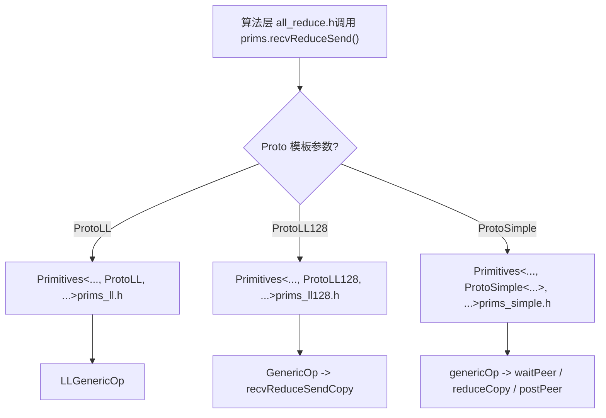
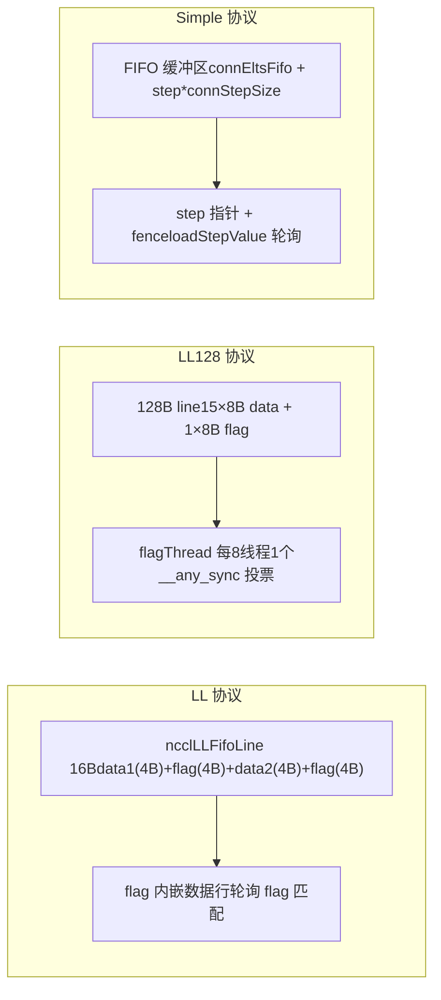

# . Algunos kernels requieren una versión específica de CUDA o una arquitectura específica:

# Capítulo siguiente: Capítulo 9 →

En el capítulo anterior rastreamos cómo el lado host traduce un AllReduce en un kernel __global__, y vimos que el punto de entrada del lado dispositivo ncclKernelMain realiza el despacho según el algoritmo y el protocolo. Pero el despacho solo selecciona las herramientas; lo que realmente determina el rendimiento es cómo estas herramientas ejecutan el movimiento de datos. Este capítulo profundiza en las tres primitivas de transferencia bajo src/device: LL, LL128 y Simple, analizando una por una sus implementaciones de movimiento de datos para comprender las compensaciones entre latencia y ancho de banda de los distintos protocolos.

# Por qué el mismo AllReduce necesita tres primitivas de transferencia

Primero establezcamos un modelo intuitivo. Imaginemos una fábrica en línea de ensamblaje: la materia prima (datos del usuario) entra por un extremo, el producto terminado sale por el otro, y en el medio hay varias estaciones (ranks) que deben intercambiar productos semielaborados. Hay tres formas de transferir los semielaborados:

- **LL（Low Latency）**: como dos personas pasándose un papel cara a cara; en el momento de pasarlo, la otra persona ya sabe que «esto es para ti», con un costo de handshake casi nulo. Pero el papel es muy pequeño: solo se pueden pasar 8 bytes de datos útiles por vez. Adecuado para mensajes pequeños.
- **LL128**: se cambia el papel por una nota de 128 bytes; se pasan 120 bytes de datos útiles por vez, pero se exige que la nota esté alineada a 16 bytes, de lo contrario primero hay que «recomponerla» en memoria compartida. Adecuado para mensajes medianos.
- **Simple**: como un casillero de paquetería: primero se coloca el paquete en el casillero (búfer FIFO) y luego se envía una notificación de «hay mercancía en el casillero número N». El costo de handshake es alto, pero se puede mover mucho de una vez. Adecuado para mensajes grandes.

> **[Design Inference & Architectural Trade-offs]**
> ¿Qué pasaría si solo hubiera una primitiva? Si solo se usara LL, los mensajes grandes ahogarían el ancho de banda porque «cada mensaje debe esperar la confirmación del flag del otro lado»; si solo se usara Simple, los mensajes pequeños harían explotar la latencia debido al costo fijo de «escribir FIFO + enviar notificación + esperar notificación». La razón por la que la curva de rendimiento de NCCL tiene puntos de inflexión evidentes cerca de 8KB y 128KB radica precisamente aquí.

Las tres primitivas comparten el mismo esqueleto de plantilla`Primitives<T, RedOp, Fan, Direct, Proto, P2p, isNetOffload>`, y mediante`Proto`este parámetro de plantilla se especializan tres versiones[FACT:src/device/primitives.h:117-117]。`ProtoLL`、`ProtoLL128`、`ProtoSimple`Cada una de las tres estructuras porta constantes y métodos de cálculo relacionados con el protocolo[FACT:src/device/primitives.h:25-75], y el código del algoritmo solo llama a`prims.send()`、`prims.recvReduceSend()`este tipo de interfaz unificada, sin preocuparse por cuál protocolo hay debajo.



Esta figura explica «por qué la misma lógica de AllReduce necesita tres primitivas de transferencia»: la capa de algoritmo es independiente del protocolo, y las diferencias de protocolo quedan encapsuladas en`Primitives`las tres especializaciones de.

# LL: transferencia sin handshake con flag incrustado en la línea de datos

## Modelo intuitivo

La idea central de LL es:**meter «los datos» y la marca de «si los datos están listos» en la misma unidad de lectura/escritura de 16 bytes**. El receptor no necesita un «mensaje de notificación» adicional; basta con sondear el campo flag en la línea de datos: si el flag coincide, los datos han llegado. Es como al enviar una carta imprimir «la firma del destinatario» directamente en el sobre: el cartero, al ver la firma, sabe si debe entregarla, sin necesidad de enviar por separado un acuse de recibo.

Sin este diseño, el receptor tendría que esperar primero una notificación de «datos escritos» y luego volver a leer los datos: dos idas y vueltas a memoria, el doble de latencia.

## Estructura de datos y diseño de memoria

La unidad de transferencia de LL es`union ncclLLFifoLine`, y por el ensamblado de`storeLL`se puede ver su diseño[FACT:src/device/prims_ll.h:154-158]：

```
st.volatile.global.v4.u32 [%0], {%1,%2,%3,%4};
// 写入 4 个 u32：data1, flag, data2, flag
```

Un`ncclLLFifoLine`son 16 bytes, dispuestos como`[data1(4B) | flag(4B) | data2(4B) | flag(4B)]`. Los datos útiles son solo 8 bytes (data1 + data2); los otros 8 bytes son todo flag. Esta es la razón por la que`ProtoLL::calcBytePerGrain()`devuelve`sizeof(uint64_t)`: «One 16-byte line has 8-bytes of data»[FACT:src/device/primitives.h:55-57]。

Campos clave (especialización LL de`Primitives`)[FACT:src/device/prims_ll.h:20-42]：

| Campo | Tipo | Función |
| --- | --- | --- |
| `recvStep[i]` / `sendStep[i]` | `uint64_t[MaxRecv/MaxSend]` | Contador de pasos por peer, determina el desplazamiento del búfer y el valor del flag |
| `recvBuff[i]` / `sendBuff[i]` | `ncclLLFifoLine*` | Apunta a la dirección base del búfer FIFO de cada peer |
| `recvConnHeadPtr` | `volatile uint64_t*` | Puntero global del lado receptor a «hasta qué paso se ha consumido» |
| `sendConnHeadPtr` | `volatile uint64_t*` | Puntero global del lado emisor a «hasta qué paso ha consumido el par» |
| `sendConnHeadCache` | `uint64_t` | Almacena en caché el último valor de head leído, para evitar leer memoria global cada vez |

El desplazamiento del búfer se calcula mediante`recvOffset(i) = (recvStep[i] % NCCL_STEPS) * stepLines`:[FACT:src/device/prims_ll.h:44-46]，`NCCL_STEPS`es el número de ranuras del búfer circular,`stepLines`es el número de líneas por ranura. El valor del flag se calcula mediante`recvFlag(i) = NCCL_LL_FLAG(recvStep[i] + 1)`:[FACT:src/device/prims_ll.h:56-58], nótese que`+1`, porque el valor inicial del flag es 0, y el flag del primer paso debe ser 1 para distinguirse de «no escrito».

## Walkthrough guiado por escenario: un recvReduceSend

Supongamos que el rank 0 ejecuta en un Ring AllReduce`recvReduceSend`: recibir datos del rank anterior, hacer reduce con los datos locales y enviarlos al siguiente rank. La cadena de llamadas es`recvReduceSend(inpIx, eltN)` → `LLGenericOp<1, 1, Input, -1>(inpIx, -1, eltN, false)` [FACT:src/device/prims_ll.h:403-405]。

**Primer paso: esperar a que el búfer de envío esté disponible.** `waitSend`Comprueba`sendConnHeadCache + NCCL_STEPS < sendConnHead + 1` [FACT:src/device/prims_ll.h:73-89]. El significado es: si el progreso de consumo del par (head) se queda demasiado atrás respecto a mí, significa que el búfer circular está casi lleno y hay que esperar.`NCCL_STEPS`es el número total de ranuras del búfer,`sendConnHead + 1`es la ranura que estoy a punto de ocupar. Mientras se espera, se sondea`*sendConnHeadPtr`para actualizar la caché y periódicamente se llama a`checkAbort`para comprobar si se ha abortado[FACT:src/device/prims_ll.h:73-89]。

**Segundo paso: cargar los datos locales.** `DataLoader::loadBegin`Se encarga del problema de alineación[FACT:src/device/prims_ll.h:200-216]. Cuando`sizeof(T) <= 2`(por ejemplo half o int8), la dirección de origen puede no estar alineada a 4 bytes, así que primero se lee alineado a 4 bytes en`u4[0..2]`, se registra`misalign`, y luego en`loadFinish`se usa`__funnelshift_r`para hacer desplazamientos a nivel de byte y reconstruir el valor correcto de 64 bits[FACT:src/device/prims_ll.h:218-225]. Esta es una técnica típica de «lectura alineada + reensamblado por desplazamiento», que evita la penalización de rendimiento de los accesos no alineados.

**Tercer paso: leer los datos del par y esperar el flag.** `readLL`es el núcleo[FACT:src/device/prims_ll.h:108-122]：

```cpp
do {
  asm volatile("ld.volatile.global.v4.u32 {%0,%1,%2,%3}, [%4];" ...);
  if (checkAbort(abort, 1, spins)) break;
} while ((flag1 != flag) || (flag2 != flag));
```

Utiliza`ld.volatile.global.v4.u32`Leer 16 bytes de una vez (4 u32), luego verificar si ambos campos flag son iguales al valor esperado.`volatile`La palabra clave garantiza que el compilador no optimice ni almacene en caché esta lectura en un registro—porque el par podría escribir nuevos datos en cualquier momento. Ambos flags deben coincidir porque el escritor`storeLL`escribe 4 u32 de una vez, teóricamente podría dividirse en dos escrituras de 8 bytes, ambos flags deben coincidir para garantizar la integridad de los 16 bytes.

**Cuarto paso: reduce y enviar.**Después de recibir peerData,`applyReduce(redOp, peerData, data)`realizar la reducción[FACT:src/device/prims_ll.h:279]. Luego`storeLL(sendPtr(i) + offset, data, sendFlag(i))`escribir el resultado en el búfer de envío[FACT:src/device/prims_ll.h:295-296]. Nota sobre el orden de envío: primero enviar`i=1..MaxSend`(generalmente el peer de red), finalmente enviar`i=0`(generalmente el peer local)[FACT:src/device/prims_ll.h:291-297]. El comentario lo dice claramente: «Send : inter-node, then intra-node, then local»—primero enviar el lento (red), dejarlo volar en segundo plano, luego enviar el rápido (local), así el peer local no espera por la red.

**Quinto paso: avanzar el step y post.** `incRecv(i)`Incrementar el paso de recepción[FACT:src/device/prims_ll.h:91-93]，`postRecv()`escribir`recvConnHead`de vuelta al puntero global[FACT:src/device/prims_ll.h:94-97], notificar al par «ya he consumido este paso». El lado de envío`incSend`tiene una lógica especial[FACT:src/device/prims_ll.h:99-106]：

```cpp
if ((sendStep[i] & NCCL_LL_CLEAN_MASK) == NCCL_LL_CLEAN_MASK) {
  for (int o = offset; o  *head) { ... }
}
```

En el modo DirectRead de sendrecv, el emisor debe esperar a que el receptor termine de leer los datos para poder retornar. Si el receptor, por alguna razón, no avanza el tail, el emisor se bloqueará. Esta espera debe realizarse después de`barrier()`, de lo contrario podría competir con el hilo post.

**Trampa 3:`roundUp`provocado por el salto de step.** `loadRecvConn`y`loadSendConn`ambos contienen`step = roundUp(step, SlicePerChunk * StepPerSlice)` [FACT:src/device/prims_simple.h:486, 533]. Esto alinea el step al límite del slice, pero si el step del paso anterior no está alineado, las ranuras omitidas no se inicializarán correctamente. El código en`loadRecvConn`añade una línea`*connStepPtr = step`para devolver el credit[FACT:src/device/prims_simple.h:489]。

# Comparación y selección de las tres primitivas



| Dimensión | LL | LL128 | Simple |
| --- | --- | --- | --- |
| Tasa de carga útil | 50% | 93.75% | ~100% |
| Modo de sincronización | flag embebido, sondeo | flagThread + votación warp | puntero step + fence |
| Requisito de alineación | Ninguno (con reordenamiento por desplazamiento) | 16 bytes | Ninguno |
| Tamaño de mensaje aplicable | Pequeño (< 8KB) | Medio (8KB ~ 128KB) | Grande (> 128KB) |
| Diseño del búfer | `ncclLLFifoLine[]` | `uint64_t[]`por línea de 128B | `T[]` FIFO |
| Soporte Direct | Ninguno (`PrimitivesWithoutDirect`degradado) | Ninguno (igual que el anterior) | Soporte completo |

Tanto LL como LL128 heredan`PrimitivesWithoutDirect` [FACT:src/device/prims_ll.h:9-10, src/device/prims_ll128.h:13-14], porque el diseño de sus búferes no admite lectura/escritura directa de la memoria del par. Simple, en cambio, implementa completamente el modo Direct, con soporte para P2P directo y NVLS.

# Reflexiones de diseño

> **[Design Inference & Architectural Trade-offs]**
> **¿Por qué el flag de LL debe repetirse dos veces?**Porque las escrituras en memoria global de la GPU no garantizan atomicidad.`storeLL`Al escribir 16 bytes, el hardware puede dividirlo en dos escrituras de 8 bytes. Si solo se coloca un flag, el receptor podría considerar que los datos están listos cuando solo se ha escrito la mitad. Los dos flags se ubican en la primera y segunda mitad de los 16 bytes; solo cuando ambas escrituras se completan, ambos flags coinciden.

**¿Por qué Simple reserva un warp?** [FACT:src/device/prims_simple.h:625-626]El comentario dice «For send operations, we need an extra warp to overlap the threadfence and the copy».`fence_acq_rel_sys()`Es una operación costosa; si todos los hilos esperan a que termine el fence para continuar, se desperdicia mucho tiempo. Se reserva un warp exclusivamente para hacer el fence, mientras los demás warps pueden seguir moviendo el siguiente lote de datos.

> **[Design Inference & Architectural Trade-offs]**
> **¿Por qué el avance del step de LL128 está al final de GenericOp y no dentro de recvReduceSendCopy?**Porque el transporte de LL128 es a nivel de warp, y múltiples warps pueden procesar slices diferentes en paralelo. Si se avanza el step dentro de`recvReduceSendCopy`, cada warp lo avanzaría una vez, provocando que el step avance múltiples veces. Colocarlo al final de`GenericOp`para avanzarlo de forma unificada asegura que cada slice avance solo una vez.

# Resumen del capítulo

Este capítulo profundizó en la implementación de las tres primitivas de transporte:

1. **LL**: usa`ncclLLFifoLine`de 16 bytes para embeber el flag en la línea de datos; el receptor solo necesita sondear la coincidencia del flag para confirmar que los datos están listos. Carga útil del 50%, adecuado para mensajes pequeños. El núcleo es`readLL`de`ld.volatile.global.v4.u32`y`storeLL`de`st.volatile.global.v4.u32`。

2. **LL128**: concentra el flag en los últimos 8 bytes de cada 128 bytes, elevando la carga útil al 93.75%. Usa`flagThread`(1 por cada 8 hilos) para verificar el flag,`__any_sync`para la votación warp. En caso de desalineación, recurre a reordenamiento en memoria compartida.

3. **Simple**: usa búfer FIFO + notificación por puntero step para lograr alto rendimiento en mensajes grandes.`flags`codifica el rol con bits de bandera,`waitPeer`sondea el step,`postPeer`actualiza el step y hace fence. Soporte completo del modo Direct.

Las tres primitivas comparten el mismo esqueleto de plantilla, especializado mediante el parámetro de plantilla`Proto`. La capa de algoritmo solo llama a la interfaz unificada y no le importa el protocolo subyacente. Esta es la respuesta a «por qué la misma lógica de AllReduce necesita tres primitivas de transporte»: diferentes tamaños de mensaje requieren diferentes estrategias de sincronización y diseños de búfer; las tres primitivas están optimizadas para mensajes pequeños, medianos y grandes respectivamente.

# Reflexiones y autoevaluación de este capítulo

Q1: Si se elimina la lógica de cleanup en`incSend`([FACT:src/device/prims_ll.h:99-106]), ¿en qué escenarios se provocaría corrupción de datos? ¿Por qué?

**Análisis de referencia**: la lógica de cleanup, en`sendStep[i] & NCCL_LL_CLEAN_MASK == NCCL_LL_CLEAN_MASK`, escribe todas las líneas del slice completo con el flag actual (rellenando datos con 0). Si se elimina, cuando el step dé la vuelta al límite de`NCCL_LL_CLEAN_MASK`, el flag de algunas líneas podría seguir siendo el valor de la ronda anterior. Si el flag de la ronda anterior coincide casualmente con el flag esperado por el receptor en esta ronda, el receptor creerá erróneamente que los datos están listos y leerá datos residuales de la ronda anterior. Este es un problema típico de ABA. La condición de activación es ejecución prolongada (step supera el ciclo de`NCCL_LL_CLEAN_MASK`) y que el flag coincida casualmente al dar la vuelta al mismo valor. Este tipo de bug es extremadamente difícil de reproducir, porque requiere una alineación precisa del step.

P2: En el destructor del protocolo Simple, ¿qué previenen respectivamente la espera en NetRegMode ([FACT:src/device/prims_simple.h:794-804]) y la espera en DirectRead ([FACT:src/device/prims_simple.h:814-824])? Si se elimina una de ellas, ¿qué ocurriría en escenarios de alta concurrencia?

**Análisis de referencia**: NetRegMode espera a que el hilo proxy establezca`connFifo[prevStep].size`en -1, lo que indica que la tarjeta de red ha completado el envío. Si se elimina, el siguiente kernel podría sobrescribir el búfer de envío que la tarjeta de red está leyendo por DMA, provocando que la tarjeta lea datos corruptos. DirectRead espera a que el receptor avance el tail (`*tail > *head`), lo que indica que el receptor ha terminado de leer el búfer directo. Si se elimina, el emisor podría sobrescribir el búfer antes de que el receptor termine de leerlo, provocando que el receptor lea datos nuevos en lugar de los antiguos. En escenarios de alta concurrencia, ambas esperas son necesarias; eliminar cualquiera de ellas provocaría una condición de carrera de datos. La diferencia es que NetRegMode previene la "lectura de la tarjeta de red", mientras que DirectRead previene la "lectura de la GPU remota".

P3: La`loadRegsBegin`de LL128, cuando no está alineada, pasa por un reordenamiento en memoria compartida ([FACT:src/device/prims_ll128.h:115-141]). ¿Cuánto más lenta es esta ruta comparada con la ruta alineada? ¿Por qué NCCL no exige directamente que los búferes de usuario estén alineados a 16 bytes?

**Análisis de referencia**: La ruta no alineada añade tres pasos: escribir en memoria compartida,`__syncwarp()`, leer desde memoria compartida. Aunque el ancho de banda de la memoria compartida es alto,`__syncwarp()`es un punto de sincronización que bloquea el warp hasta que todos los hilos terminen de escribir. Una estimación aproximada indica que la ruta no alineada es un 20-40% más lenta que la alineada, dependiendo de los conflictos de bancos de memoria compartida. NCCL no fuerza la alineación porque el usuario podría pasar búferes con cualquier desplazamiento (por ejemplo, cortes de tensores), y forzar la alineación limitaría la flexibilidad de la API. La estrategia de NCCL es "ruta rápida cuando está alineado, ruta lenta pero correcta cuando no lo está". En entornos de producción se recomienda que los usuarios asignen búferes alineados a 16 bytes para tomar la ruta rápida.

Hasta aquí, hemos dominado los mecanismos de transferencia de datos de las tres primitivas LL, LL128 y Simple, que proporcionan a los algoritmos de capas superiores medios flexibles de ajuste de rendimiento. El siguiente capítulo profundizará en el núcleo de los algoritmos de comunicación colectiva, viendo cómo AllReduce, AllGather, ReduceScatter, etc. invocan estas primitivas, y cómo los algoritmos Ring, Tree, CollNet, etc. organizan el flujo de datos, completando finalmente la comunicación colectiva de extremo a extremo.
