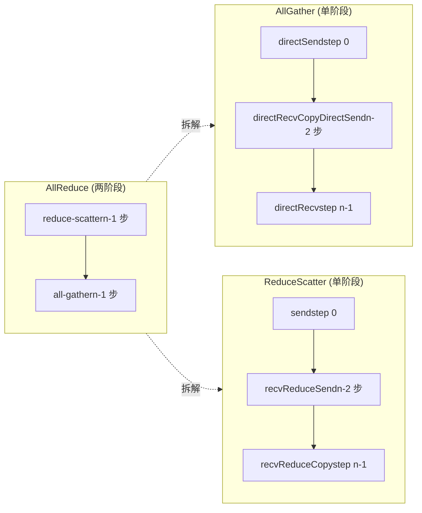
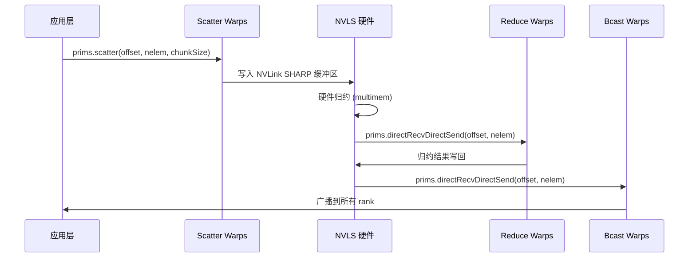

# Capítulo 10: Núcleo de algoritmos de comunicación colectiva: implementación en dispositivo de AllReduce, AllGather, ReduceScatter

El capítulo anterior desglosó las tres primitivas de protocolo LL, LL128 y Simple; son el "motor" de la transferencia de datos, pero el motor por sí solo no sabe qué mover, hacia dónde ni en qué orden. Los archivos de núcleos de algoritmos bajo src/device que se examinan en este capítulo son la "caja de cambios": traducen semánticas de comunicación colectiva como AllReduce, AllGather y ReduceScatter en una serie de llamadas a primitivas como prims.directSend y prims.directRecvReduceDirectSend. En una frase, la contradicción central de este capítulo: ¿por qué el mismo AllReduce necesita cuatro implementaciones en el lado del dispositivo completamente distintas: Ring, Tree, CollNet y NVLS? La respuesta está en la correspondencia entre la "topología del flujo de datos" y las "capacidades del hardware". Ring usa el mínimo ancho de banda de red para hacer un pipeline de dos fases, Tree comprime la latencia a log(n) mediante reducción en árbol, y CollNet/NVLS descargan la reducción a la tarjeta de red o al conmutador NVLink. Este capítulo los desglosa uno por uno.

# 10.1 Ring AllReduce: cómo el pipeline de dos fases se implementa dentro del kernel

## Modelo intuitivo: "carrera de relevos" en una línea de montaje circular

Imagina n trabajadores en círculo, cada uno con una caja de materia prima. El objetivo de AllReduce es que cada uno obtenga finalmente el "producto terminado de todas las materias primas mezcladas". El algoritmo Ring lo hace en dos fases: la primera fase (reduce-scatter) cada uno pasa su caja a lo largo del anillo, y en cada estación la mezcla con su propia materia prima; tras n-1 estaciones, cada uno tiene exactamente una porción de "mezcla completa" del producto terminado, pero solo una fracción de 1/n; la segunda fase (all-gather) esas porciones del producto terminado se pasan de nuevo alrededor del anillo, y cada uno completa todas las porciones.

Sin Ring, el método más simple sería que cada rank enviara los datos al root, el root redujera y luego difundiera; el ancho de banda de red del root se convertiría en el cuello de botella, y cuanto mayor sea n, más lento. La sutileza de Ring radica en:**La cantidad enviada y recibida por cada rank es 2(n-1)/n veces el volumen de datos, distribuida uniformemente entre todos los enlaces independientemente de n**。

## Estructura de datos y diseño de memoria

El estado central del algoritmo Ring está en`ncclRing`estructura (definida en device.h, no se detalla en este capítulo),`runRing`solo se toman dos campos:

- `ring->index`: la posición lógica de este rank en el anillo, usada para calcular «qué chunk procesar en el paso j».
- `ring->prev` / `ring->next`: los números de rank predecesor y sucesor, como parámetros recv/send peer del constructor de`Primitives`

Los parámetros clave de particionamiento son calculados por`ncclCollCbdPart`([FACT:src/device/all_reduce.h:21-22]）：

```
ncclCollCbdPart(work, ncclShmem.channelId, Proto::Id, sizeof(T), (ssize_t*)nullptr, &gridOffset, &channelCount, &chunkCount);
```

Esta función divide los datos de todo el dominio de comunicación por channel y produce tres valores:`gridOffset`(el desplazamiento inicial de los datos que este channel maneja dentro del buffer completo),`channelCount`(el número total de elementos que este channel maneja),`chunkCount`(el número de elementos del chunk asignado a cada rank).`chunkCount`Es la granularidad del algoritmo Ring — cada paso mueve un chunk.

`loopCount = nranks * chunkCount`（[FACT:src/device/all_reduce.h:23]) representa la cantidad de datos procesados en «una vuelta completa». El bucle externo`for (elemOffset = 0; elemOffset < channelCount; elemOffset += loopCount)`（[FACT:src/device/all_reduce.h:34]) significa: si el volumen de datos del channel excede lo que una vuelta puede procesar, se ejecutan múltiples vueltas.

## Step-by-Step Walkthrough: flujo completo de llamadas de un Ring AllReduce

Escenario: 4 ranks (nranks=4), el`ringIx=0`，`chunkCount=100`，`channelCount=400`de este rank (exactamente una vuelta).

**Paso 0: enviar «el chunk propio» al siguiente GPU**（[FACT:src/device/all_reduce.h:42-47]）

```
chunk = modRanks(ringIx + nranks - 1);   // = 3
chunkOffset = chunk * chunkCount;         // = 300
offset = gridOffset + elemOffset + chunkOffset;
nelem = min(chunkCount, remCount - chunkOffset);
prims.directSend(offset, offset, nelem);
```

`modRanks`es una lambda que hace resta módulo nranks ([FACT:src/device/all_reduce.h:40]）。`ringIx + nranks - 1`representa «el número de chunk anterior de este rank». ¿Por qué en el paso 0 se envía el chunk 3? Porque en la fase reduce-scatter del Ring, cada rank primero envía la porción de datos que «no debería retener» (es decir, el chunk del rank predecesor).`directSend`solo envía sin recibir, porque en ese momento aún no ha recibido ningún dato.

**Pasos 1 a nranks-2: recibir, reducir y reenviar**（[FACT:src/device/all_reduce.h:50-56]）

```
for (int j = 2; j 计算 chunkCount/loopCount"] --> loop{"elemOffset |否| done["返回"]
    loop -->|是| s0["step 0: directSendchunk = ringIx-1"]
    s0 --> mid{"j 从 2 到 nranks-1?"}
    mid -->|是| s1["directRecvReduceDirectSendchunk = ringIx-j"]
    s1 --> mid
    mid -->|否| s2["step nranks-1directRecvReduceCopyDirectSendpostOp=true"]
    s2 --> ag{"j 从 1 到 nranks-2?"}
    ag -->|是| s3["directRecvCopyDirectSend纯转发"]
    s3 --> ag
    ag -->|否| s4["directRecv收最后一块"]
    s4 --> loop
```

## Reflexión de diseño: por qué el orden de chunks del Ring «va hacia atrás»

Nótese el patrón de numeración de chunks: el paso 0 envía`ringIx-1`, el paso j procesa`ringIx-j`, el último paso procesa`ringIx+0`. Esto avanza en sentido**antihorario**. ¿Por qué? Porque cada rank del Ring solo retiene «el chunk que le corresponde reducir» (es decir,`ringIx+0`), los demás chunks solo pasan de largo. El avance antihorario garantiza: cuando un chunk completa una vuelta y regresa al punto de partida,恰好 ha completado nranks reducciones, produciendo el resultado final. Si avanzara en sentido horario, el chunk completaría la reducción en el rank equivocado.

## Errores en producción:`remCount < loopCount`trampa de alineación cuando

[FACT:src/device/all_reduce.h:38]Hay una línea de código fácil de pasar por alto:

```
if (remCount = 256) nthreadsSplit += 64;
} else {
  nthreadsSplit = (nthreads * 7 / (10 * WARP_SIZE)) * WARP_SIZE;
}
```

El protocolo Simple se divide por la mitad; los protocolos LL/LL128 se dividen 7:3, porque «recibir datos de 3 fuentes para reducir» es más intensivo en cómputo que «enviar a 3 destinos», así que el grupo de reducción recibe más hilos.

Luego`tid < nthreadsSplit`los hilos de hacen la reducción hacia arriba ([FACT:src/device/all_reduce.h:175-202]), y el resto de hilos hacen la difusión hacia abajo ([FACT:src/device/all_reduce.h:203-224]). Los dos grupos se distinguen por el desplazamiento`Proto::MaxGroupWidth`para identificar sus respectivos grupos de comunicación ([FACT:src/device/all_reduce.h:189]de`0 * Proto::MaxGroupWidth`y[FACT:src/device/all_reduce.h:210]de`1 * Proto::MaxGroupWidth`）。

## Consideraciones de diseño: por qué el nodo raíz de Tree requiere tratamiento especial

El nodo raíz de la reducción en árbol es el «punto de convergencia», su volumen de recepción es múltiplo del número de nodos hijos, y su volumen de envío es cero (fase de reducción). Si el nodo raíz también usara el`directRecvReduceDirectSend`genérico, intentaría enviar a`tree->up`(-1), provocando desbordamiento. Por eso debe tratarse por separado con la rama`if (tree->up == -1)`. De igual forma, el juicio`tree->down[0] == -1`del nodo hoja.

## Problemas en producción: el problema del «nodo raíz caliente» en el algoritmo Tree

El nodo raíz de Tree soporta todo el tráfico de reducción; si la GPU donde está el nodo raíz resulta ser un nodo lento (por ejemplo, con ancho de banda PCIe limitado), todo el AllReduce se verá afectado. La respuesta de NCCL es:**elegir una raíz diferente para cada channel**, distribuyendo la carga del nodo raíz entre múltiples ranks. Por eso en`runTreeSplit`la rama del nodo raíz usa`FanSymmetric<NCCL_MAX_TREE_ARITY_TOP>`（[FACT:src/device/all_reduce.h:168]) — tiene que manejar simultáneamente la reducción de múltiples nodos hijos. En producción, si se detecta un rendimiento desigual en Tree AllReduce, verificar si la distribución de nodos raíz de los channels es uniforme.

# 10.3 AllGather y ReduceScatter: las variantes de «medio recorrido» de Ring

## Modelo intuitivo: AllReduce dividido en dos mitades

AllGather y ReduceScatter son esencialmente las dos fases de AllReduce convertidas cada una en API independiente. AllGather solo hace «recolección» — cada rank aporta una porción de datos, y al final todos obtienen todos los datos. ReduceScatter solo hace «reducción + dispersión» — todos aportan datos, y tras la reducción cada uno obtiene una porción.

Sin estas dos APIs independientes, cuando el usuario hace «primero reducir y luego recolectar» o «primero recolectar y luego reducir» solo puede llamar a AllReduce y luego cortar manualmente, desperdiciando la mitad del ancho de banda.

## Implementación Ring de AllGather

`all_gather.h`El`runRing`（[FACT:src/device/all_gather.h:14-88]de ) es más simple que AllReduce: no hay reducción, solo copia y reenvío.

**Paso 0: enviar los propios datos a la siguiente GPU**（[FACT:src/device/all_gather.h:51-60]）

```
rankDest = ringRanks[0];
offset = dataOffset + rankDest * count;
if ((inputBuf + dataOffset == outputBuf + offset) || isNetOffload) {
  prims.directSend(dataOffset, offset, nelem);
} else {
  prims.directCopySend(dataOffset, offset, nelem);
}
```

Aquí hay un juicio in-place: si`inputBuf + dataOffset == outputBuf + offset`, significa que la entrada y la salida son el mismo bloque de memoria (AllGather in-place), directamente`directSend`; de lo contrario hay que`directCopySend`(primero copiar a la salida y luego enviar).

**Pasos intermedios nranks-2: reenvío puro**（[FACT:src/device/all_gather.h:62-67]）

```
prims.directRecvCopyDirectSend(offset, offset, nelem);
```

**Último paso: recibir el último bloque**（[FACT:src/device/all_gather.h:69-74]）

```
prims.directRecv(offset, nelem);
```

## isNetOffload: un solo warp impulsa la red + múltiples warps copian en paralelo

[FACT:src/device/all_gather.h:28-36]tiene una rama especial:

```
if (isNetOffload) {
  workNthreads = WARP_SIZE;
  chunkCount = NCCL_MAX_NET_SIZE;
} else {
  workNthreads = nthreads;
}
```

Cuando`isNetOffload=true`(modo single RPN + registro de red), solo se usa 1 warp para impulsar la comunicación Ring, y el resto de warps hacen en paralelo «copiar datos de origen al buffer destino» ([FACT:src/device/all_gather.h:76-82]). Esto es para superponer el costo de copia con el costo de comunicación en AllGather no in-place.

Al final hay un`barrier_sync(14, nthreads)`（[FACT:src/device/all_gather.h:87]), y el comentario lo explica claramente: hay que esperar a que todos los warps terminen, de lo contrario el siguiente work podría reutilizar outputBuf y causar una condición de carrera. Se usa barrier 14 para evitar el barrier propio de prims y`__syncthreads()`。

## Implementación Ring de ReduceScatter

`reduce_scatter.h`El`runRing`（[FACT:src/device/reduce_scatter.h:14-56]de ) es la fase reduce-scatter de AllReduce extraída por separado:

**Paso 0: enviar los propios datos a la siguiente GPU**（[FACT:src/device/reduce_scatter.h:39-42]）

```
rankDest = ringRanks[nranks - 1];
offset = dataOffset + rankDest * count;
prims.send(offset, nelem);
```

**Pasos intermedios nranks-2: recibir, reducir y reenviar**（[FACT:src/device/reduce_scatter.h:44-49]）

```
prims.recvReduceSend(offset, nelem);
```

**Último paso: recibir y reducir, produciendo el resultado final**（[FACT:src/device/reduce_scatter.h:61-64]）

```
prims.recvReduceCopy(offset, dataOffset, nelem, /*postOp=*/true);
```

Atención al último paso del`recvReduceCopy`tiene dos offset:`offset`(fuente de recepción) y`dataOffset`(entrada local), el resultado de la reducción se escribe en`dataOffset`。

## Diagrama comparativo del flujo de datos



## Problemas en producción: los límites de la comprobación in-place

[FACT:src/device/all_gather.h:55]la comprobación in-place de`inputBuf + dataOffset == outputBuf + offset`depende de que los punteros sean exactamente iguales. Si el sendbuff y el recvbuff que pasa el usuario tienen un desplazamiento pero lógicamente son la misma memoria, esta comprobación falla y se toma la ruta`directCopySend`—aunque es correcta, implica una copia adicional. En producción se recomienda que, al hacer AllGather in-place, sendbuff y recvbuff sean completamente idénticos.

# 10.4 CollNet y NVLS: descargar la reducción al hardware

## Modelo intuitivo: dejar que el «switch» ayude a calcular

Tanto Ring como Tree hacen que «la propia GPU calcule la reducción». CollNet y NVLS cambian el enfoque: descargan la operación de reducción a la tarjeta de red (CollNet) o al switch NVLink (NVLS). La GPU solo se encarga de enviar los datos, y el hardware completa la reducción y luego los retransmite. Es como pasar de «cada trabajador mezcla sus propios ingredientes» a «enviar los ingredientes a una batidora central, que los mezcla y luego los distribuye».

Sin descarga por hardware, la operación de reducción ocuparía recursos SM de la GPU y la latencia de reducción no podría ocultarse.

## Reparto de hilos en CollNet Direct

`RunWorkColl<ncclFuncAllReduce, ..., NCCL_ALGO_COLLNET_DIRECT, ...>`el`run`（[FACT:src/device/all_reduce.h:249-386]) divide los hilos en cuatro grupos:

```
const int nThreadsScatter = WARP_SIZE + ((hasUp && hasDn) ? COLLNET_COPY_THREADS : ...);
const int nThreadsGather = ((hasUp && hasDn) ? COLLNET_COPY_THREADS : ...);
const int nThreadsBcast = WARP_SIZE + ((hasUp && hasDn) ? COLLNET_COPY_THREADS : ...);
const int nThreadsReduce = work->nWarps * WARP_SIZE - nThreadsScatter - nThreadsGather - nThreadsBcast;
```

Los cuatro grupos de hilos se encargan respectivamente de: Scatter (dispersar los datos a cada rail), Reduce (reducir y enviar a la red), Gather (recoger de cada rail), Bcast (retransmitir tras recibir de la red).`COLLNET_COPY_THREADS = 96`（[FACT:src/device/all_reduce.h:250]) es el número fijo de hilos de copia.

## netRegUsed: diseño del búfer en modo de registro de red

[FACT:src/device/all_reduce.h:280-288]tiene una bifurcación clave:

```
if (work->netRegUsed) {
  offsetBase = bid * chunkSize;
  maxNelems = size;
  peerOffset = nChannels * chunkSize;
} else {
  offsetBase = bid * direct->nHeads * chunkSize;
  maxNelems = direct->nHeads * chunkSize;
  peerOffset = chunkSize;
}
```

`netRegUsed`En el modo , los búferes se organizan de forma contigua por channel (`bid * chunkSize`), y el offset de peer es`nChannels * chunkSize`; en modo no registrado, se organizan por head (`bid * nHeads * chunkSize`), y el offset de peer es`chunkSize`. Esta diferencia proviene de que el modo de registro de red exige que los búferes sean contiguos para permitir el DMA de la tarjeta de red.

## Asignación de warps en NVLS

`RunWorkColl<ncclFuncAllReduce, ..., NCCL_ALGO_NVLS, ...>`el`run`（[FACT:src/device/all_reduce.h:391-523]) usa una asignación de warps más fina:

```
const int bcastWarps = hasOut ? (work->regUsed ? ((totalWarps - 2) >> 1) - 1 : 2) : 0;
const int reduceWarps = work->regUsed ? (totalWarps - bcastWarps - 2) : (hasOut ? 3 : nranks regUsed ? 1 : (totalWarps - reduceWarps - bcastWarps + 1) >> 1;
const int gatherWarps = work->regUsed ? 1 : (totalWarps - reduceWarps - bcastWarps) >> 1;
```

`regUsed`En el modo , scatter/gather ocupan solo 1 warp cada uno (porque el hardware NVLS opera directamente sobre memoria registrada) y reduce ocupa la mayor parte; en modo no registrado, scatter/gather ocupan aproximadamente la mitad cada uno y reduce se ajusta según el número de ranks (≤6 usa 7 warps; en caso contrario, 5 warps).

## Diagrama de interacción temporal



## Problemas en producción: la trampa de`direct->out == -1`en CollNet

[FACT:src/device/reduce_scatter.h:521]tiene una línea:

```
if (direct->out == -1) __trap();
```

Si la conexión out de CollNet no se ha establecido (-1), hacer directamente`__trap()`provoca que el kernel falle. Esto es programación defensiva: CollNet depende de la tarjeta de red; si la inicialización de la tarjeta falla, out será -1, y continuar la ejecución provocaría comportamiento indefinido. En producción, si se ve un kernel trap, hay que comprobar si la tarjeta de red de CollNet se inicializó correctamente.

# 10.5 Broadcast y Reduce: las dos operaciones colectivas más simples

## Broadcast: difusión en abanico desde el root

`broadcast.h`el`runRing`（[FACT:src/device/broadcast.h:14-64]) es muy directo: el nodo root envía los datos, los demás nodos los reenvían y el último nodo solo recibe.

```
if (rank == root) {
  if (inputBuf == outputBuf || isNetOffload) {
    prims.directSend(offset, offset, nelem);
  } else {
    prims.directCopySend(offset, offset, nelem);
  }
} else if (nextRank == root) {
  prims.directRecv(offset, nelem);
} else {
  prims.directRecvCopyDirectSend(offset, offset, nelem);
}
```

Tres ramas: el root envía, el predecesor del root recibe, los nodos intermedios reenvían. Atención:`nextRank == root`comprueba que «el siguiente de este nodo es el root», es decir, que este nodo es el último del anillo: solo recibe, no envía.

## Reduce: convergencia hacia el root

`reduce.h`el`runRing`（[FACT:src/device/reduce.h:14-53]) es la operación inversa de Broadcast:

```
if (prevRank == root) {
  prims.send(offset, nelem);
} else if (rank == root) {
  prims.recvReduceCopy(offset, offset, nelem, /*postOp=*/true);
} else {
  prims.recvReduceSend(offset, nelem);
}
```

`prevRank == root`El nodo  solo envía (es el predecesor del root), el root solo recibe y reduce, y los nodos intermedios reciben, reducen y reenvían a la vez.

## Reflexión de diseño: por qué Broadcast/Reduce también usan Ring

En teoría, Broadcast y Reduce podrían usar Tree para lograr menor latencia, pero NCCL elige Ring porque:**el volumen de datos de estas dos operaciones suele ser pequeño, la implementación de Ring es más simple y puede reutilizar la ruta de código Ring de AllReduce**. La complejidad de Tree (selección del nodo raíz, división de hilos) no aporta beneficios evidentes en escenarios de mensajes pequeños.

## Problemas en producción: el cuello de botella de ancho de banda del nodo root en Broadcast

El nodo root de Broadcast debe enviar todos los datos; si el root es un nodo lento, todo el Broadcast se ralentiza. La respuesta de NCCL es:**Broadcast también admite múltiples channels, y el root de cada channel puede ser distinto**. Pero atención:`work->root`es global, y todos los channels comparten el mismo root—esto lo determina la semántica de Broadcast (solo hay una fuente). En producción, si Broadcast va lento, hay que revisar el ancho de banda de red del nodo root.

# 10.6 Matriz de selección de algoritmos: especialización de plantillas de RunWorkColl

Todos los kernels de algoritmos se registran mediante especialización de plantillas`RunWorkColl`([FACT:src/device/all_reduce.h:228-788]). Cada especialización corresponde a una combinación de «función × algoritmo × protocolo»:

| Función | Algoritmo | Protocolo | Ubicación de la especialización |
| --- | --- | --- | --- |
| AllReduce | RING | SIMPLE | [FACT:src/device/all_reduce.h:230-233] |
| AllReduce | TREE | SIMPLE | [FACT:src/device/all_reduce.h:238-244] |
| AllReduce | COLLNET_DIRECT | SIMPLE | [FACT:src/device/all_reduce.h:249-386] |
| AllReduce | NVLS | SIMPLE | [FACT:src/device/all_reduce.h:391-523] |
| AllReduce | NVLS_TREE | SIMPLE | [FACT:src/device/all_reduce.h:528-634] |
| AllReduce | COLLNET_CHAIN | SIMPLE | [FACT:src/device/all_reduce.h:639-759] |
| AllReduce | RING | LL | [FACT:src/device/all_reduce.h:764-766] |
| AllReduce | TREE | LL | [FACT:src/device/all_reduce.h:771-773] |
| AllReduce | RING | LL128 | [FACT:src/device/all_reduce.h:778-780] |
| AllReduce | TREE | LL128 | [FACT:src/device/all_reduce.h:785-787] |

Nota:**CollNet y NVLS solo admiten el protocolo SIMPLE**. Esto se debe a que ambos algoritmos dependen de la descarga a hardware, y el mecanismo de sincronización de baja latencia de LL/LL128 es incompatible con la descarga a hardware: la latencia de la reducción por hardware es mucho mayor que el sondeo de flags de LL, por lo que usar LL en su lugar aumenta la sobrecarga.

## Lógica interna de la selección de protocolo

- **LL**: mensajes pequeños (< 8KB), prioridad a baja latencia. Tanto Ring como Tree lo admiten.
- **LL128**: mensajes medianos (8KB - 1MB), alineación de 128 bytes. Tanto Ring como Tree lo admiten.
- **SIMPLE**: mensajes grandes (> 1MB), prioridad al ancho de banda. Todos los algoritmos lo admiten.

## Errores en producción: limitaciones de la combinación de protocolo y algoritmo

Si el usuario fuerza la especificación de`NCCL_PROTO=LL`pero el algoritmo es CollNet, NCCL recurrirá a SIMPLE durante la fase de tuning. En producción, si se descubre que la configuración del protocolo no surte efecto, verificar si el algoritmo admite dicho protocolo.

# Reflexión de diseño: por qué la misma lógica de AllReduce necesita tantas implementaciones

Repasando este capítulo, AllReduce tiene seis implementaciones de algoritmos: Ring, Tree, CollNet Direct, CollNet Chain, NVLS y NVLS Tree. Esto no es redundancia, sino**la solución óptima para diferentes topologías de hardware y tamaños de mensaje**：

- **Ring**: versátil, adecuado para mensajes grandes, máxima utilización del ancho de banda.
- **Tree**: adecuado para clústeres a gran escala, latencia O(log n).
- **CollNet**: adecuado para clústeres con NICs que admiten reducción, descarga el cómputo de la GPU.
- **NVLS**: adecuado para NVLink de nodo único con conexión completa, reducción por multidifusión de hardware.

El módulo de tuning de NCCL (capítulo 5) selecciona automáticamente según el tamaño del mensaje, el número de ranks y la topología. La implementación del lado del dispositivo solo necesita garantizar que «cada combinación sea correcta»; la lógica de selección está en el lado del host.

# Resumen de este capítulo

Este capítulo desglosó`src/device`los seis archivos de kernel de algoritmos bajo

1. **Ring AllReduce**（[FACT:src/device/all_reduce.h:14-83]): pipeline de dos fases, reduce-scatter + all-gather, cada fase con n-1 pasos.

2. **Tree AllReduce**（[FACT:src/device/all_reduce.h:86-225]): reducción en árbol, latencia O(log n),`runTreeSplit`utiliza división de hilos para implementar el pipeline reducción-broadcast.

3. **AllGather**（[FACT:src/device/all_gather.h:14-88]): Ring de una sola fase, admite in-place y netOffload.

4. **ReduceScatter**（[FACT:src/device/reduce_scatter.h:14-56]): Ring de una sola fase, es la fase reduce-scatter de AllReduce.

5. **Broadcast/Reduce**（[FACT:src/device/broadcast.h:14-64]、[FACT:src/device/reduce.h:14-53]): la variante más simple de Ring.

6. **CollNet/NVLS**（[FACT:src/device/all_reduce.h:247-635]): descarga a hardware, solo admite el protocolo SIMPLE.

# Reflexiones y autoevaluación de este capítulo

Q1: En la fase reduce-scatter de Ring AllReduce, el paso 0 usa`directSend`, los pasos intermedios usan`directRecvReduceDirectSend`, y el último paso usa`directRecvReduceCopyDirectSend`. Si se elimina el`postOp=true`del último paso, ¿en qué escenarios se producirían resultados incorrectos?

**Análisis de referencia**：`postOp=true`activa operaciones posteriores (como la división al calcular el promedio). Tomando`ncclAvg`como ejemplo, la reducción es una suma y postOp es dividir entre nranks. Si se elimina`postOp`, el último paso solo hace la reducción y no la división; recvbuff almacena la «suma» en lugar del «promedio». En la fase reduce-scatter, cada rank solo conserva el resultado final de un chunk, y este chunk es precisamente`ringIx+0`（[FACT:src/device/all_reduce.h:60]). Si falta postOp, la suma de este chunk no se divide entre nranks, y la fase posterior de all-gather propagará esta «suma» errónea a todos los ranks. Nota: solo el último paso necesita postOp, porque solo este paso produce el resultado de «reducción completa»; las reducciones de los pasos intermedios son sumas parciales y no necesitan postOp. En producción, si se descubre que el resultado de AllReduce es nranks veces mayor, verificar si postOp se transmite correctamente.

Q2: `runTreeSplit`En el protocolo LL/LL128 se dividen los hilos en una proporción 7:3 ([FACT:src/device/all_reduce.h:163]), mientras que en el protocolo Simple se dividen 1:1 ([FACT:src/device/all_reduce.h:157]). Si se fuerza a que el protocolo LL también use 1:1, ¿qué ocurriría?

**Análisis de referencia**: el grupo de reducción de LL/LL128 debe recibir datos de hasta 3 nodos hijos y realizar la reducción ([FACT:src/device/all_reduce.h:187]de`FanAsymmetric<NCCL_MAX_TREE_ARITY, 1>`), lo cual es intensivo en cómputo; el grupo de broadcast solo hace copia y reenvío ([FACT:src/device/all_reduce.h:208]de`FanAsymmetric<1, NCCL_MAX_TREE_ARITY>`), lo cual es ligero en cómputo. La división 7:3 permite que el grupo de reducción tenga suficientes hilos para procesar la reducción de 3 vías, y el grupo de broadcast tiene menos hilos pero suficientes. Si se cambia a 1:1, el grupo de reducción tendrá hilos insuficientes y la reducción se convertirá en el cuello de botella; el grupo de broadcast tendrá hilos en exceso, lo cual es un desperdicio. Más grave aún, el sondeo de flags del protocolo LL es espera activa, y más hilos aumentarán la contención de flags. En producción, si se descubre que Tree AllReduce tiene un rendimiento anómalo bajo el protocolo LL, verificar si el cálculo de`nthreadsSplit`ha sido modificado.

Q3: En el modo`isNetOffload`de AllGather, solo se usa 1 warp para impulsar la comunicación Ring ([FACT:src/device/all_gather.h:32]), y los demás warps copian en paralelo ([FACT:src/device/all_gather.h:76-82]). Si se elimina el`barrier_sync(14, nthreads)`（[FACT:src/device/all_gather.h:87]final, ¿en qué escenarios se produciría una condición de carrera?

**Análisis de referencia**：`barrier_sync`Garantizar que todos los warp (incluidos los warp de comunicación y los warp de copia) completen este work antes de pasar al siguiente work. Si se elimina, el warp de comunicación podría comenzar la comunicación del siguiente work antes de que el warp de copia haya terminado de escribir outputBuf, y el siguiente work podría reutilizar el mismo outputBuf. Escenario concreto: dos AllGather consecutivos, el warp de copia del primero todavía está escribiendo la cola de outputBuf, el warp de comunicación del segundo ya ha comenzado a escribir nuevos datos en outputBuf, lo que provoca que los datos del primero sean sobrescritos. El comentario lo dice claramente: «otherwise, we can have contention if next work will use the outputBuf in this work». Se usa la barrera 14 en lugar de la barrera predeterminada para evitar las barreras internas de prims y`__syncthreads()`, previniendo así un deadlock. En producción, si se detectan errores ocasionales en los resultados de AllGather, verificar si la barrera de la ruta`isNetOffload`ha sido optimizada y eliminada.

Hasta aquí, hemos visto cómo el kernel del algoritmo del lado del dispositivo organiza el flujo de datos. Cada algoritmo llama a las primitivas del capítulo anterior a través de`Primitives`, y la capa de algoritmo solo se preocupa por «quién envía a quién, qué chunk envía, si reduce o copia». El siguiente capítulo profundizará en la abstracción de la capa de transporte, viendo cómo P2P, SHM, NET y NVLS se unifican en un conjunto de interfaces, y cómo los hilos proxy del lado host colaboran con el kernel del lado del dispositivo para completar la comunicación entre máquinas.

Regla fundamental: todos los algoritmos llaman a las primitivas a través de la clase plantilla Primitives; el algoritmo solo se encarga de la «topología del flujo de datos» y las primitivas se encargan del «movimiento de datos». Esta estratificación permite que agregar un nuevo algoritmo solo requiera implementar la lógica de topología, sin preocuparse por la sincronización subyacente. Pero sin importar cómo cambie la topología, los datos finalmente deben transmitirse por un enlace físico. El siguiente capítulo profundizará en el directorio src/transport, viendo cómo NCCL utiliza una interfaz transport unificada para ocultar las diferencias entre P2P, SHM, NET y NVLS, y la semántica setup/connect/send/recv de cada transport. Esta es la base para entender la comunicación entre máquinas.
