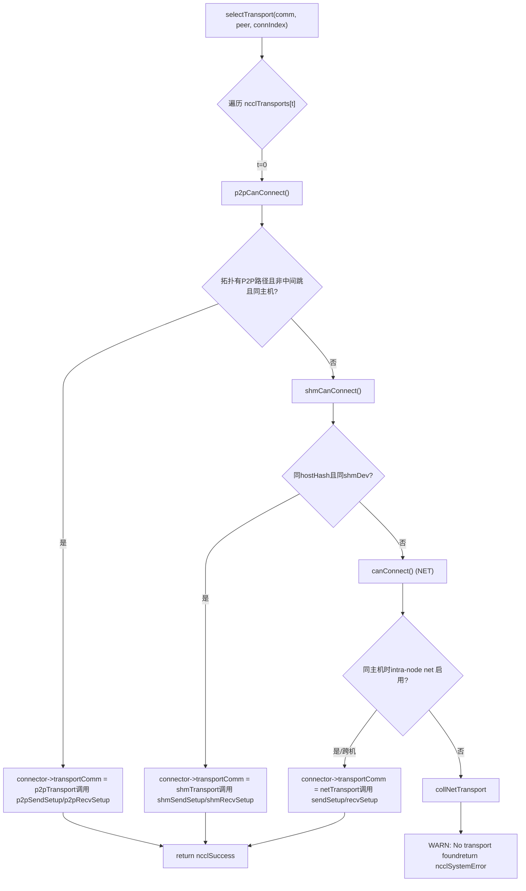
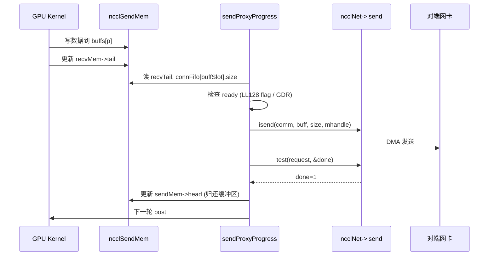

# Capítulo 11: Abstracción de la capa de transporte: cómo P2P, SHM, NET y NVLS se unifican bajo un mismo conjunto de interfaces

En el capítulo anterior profundizamos en el kernel del algoritmo y vimos cómo Ring AllReduce divide los datos y realiza una reducción en dos fases, y cómo Tree AllReduce reduce la latencia gracias a una estructura de árbol; pero estos algoritmos solo definen la vista lógica de «quién envía a quién, qué chunk envía». Los datos finalmente deben atravesar enlaces físicos reales: NVLink, PCIe, memoria compartida o tarjeta de red. Este capítulo desglosa el directorio src/transport para ver cómo NCCL utiliza un conjunto unificado de interfaces ncclTransport para enmascarar los cuatro canales físicos P2P, SHM, NET y NVLS bajo una misma cara, completando el último kilómetro desde la topología del algoritmo hasta la transmisión física.

# I. Interfaz unificada: cómo ncclTransport enmascara los cuatro canales físicos

## Modelo intuitivo

Imagina una empresa de logística: sin importar si el cliente envía un mensajería urbana (P2P), una entrega dentro del edificio (SHM), un transporte interprovincial (NET) o una línea dedicada directa (NVLS), en recepción solo se rellena una «orden de envío». Esta orden de envío es la estructura`ncclTransport`: especifica que cada modo de transporte debe proporcionar acciones fijas como`canConnect`、`setup`、`connect`、`free`, etc. Sin esta capa de abstracción, los algoritmos de nivel superior tendrían que escribir cuatro conjuntos de`if-else`para determinar qué enlace tomar, y agregar un nuevo hardware obligaría a modificar todos los algoritmos.

## Estructuras de datos y diseño de memoria

NCCL utiliza un arreglo global para registrar todos los transport, y el orden es la prioridad:

[FACT:src/transport.cc:15-20]

```c
struct ncclTransport* ncclTransports[NTRANSPORTS] = {
  &p2pTransport,
  &shmTransport,
  &netTransport,
  &collNetTransport,
};
```

El orden del arreglo determina el orden de selección: P2P primero, luego SHM, después NET y finalmente CollNet. Cada transport se describe mediante la estructura`ncclTransport`, que contiene un puntero a función`canConnect`y dos`ncclTransportComm`(uno para send y otro para recv). Tomando P2P como ejemplo:

[FACT:src/transport/p2p.cc:1493-1498]

```c
struct ncclTransport p2pTransport = {"P2P",
                                     p2pCanConnect,
                                     {p2pSendSetup, p2pSendConnect, p2pSendFree, NULL, p2pSendProxySetup, NULL,
                                      p2pSendProxyFree, NULL, p2pProxyRegister, p2pProxyDeregister},
                                     {p2pRecvSetup, p2pRecvConnect, p2pRecvFree, NULL, p2pRecvProxySetup, NULL,
                                      p2pRecvProxyFree, NULL, p2pProxyRegister, p2pProxyDeregister}};
```

`ncclTransportComm`El orden de los campos de`setup`es una «ranura de ciclo de vida» fija:`connect`(preparar recursos),`free`(intercambiar información de conexión),`proxySharedInit`(liberar),`proxySetup`、`proxyConnect`、`proxyFree`、`proxyProgress`、`proxyRegister`、`proxyDeregister`(inicialización compartida del proxy),`proxyProgress`. Nótese que la ranura`NULL`de P2P es`proxyProgress`—porque P2P consiste en que la GPU lee y escribe directamente la memoria del par, sin necesidad de un hilo proxy del host para mover datos; mientras que la`sendProxyProgress`/`recvProxyProgress`de NET es

## , porque la E/S de la tarjeta de red debe ser impulsada por un hilo del host.

Walkthrough guiado por escenarios: cómo una conexión selecciona un transport`selectTransport`：

[FACT:src/transport.cc:23-44]

```c
template 
static ncclResult_t selectTransport(struct ncclComm* comm, struct ncclTopoGraph* graph, struct ncclConnect* connect,
                                    int channelId, int peer, int connIndex, int* transportType) {
  struct ncclPeerInfo* myInfo = comm->peerInfo + comm->rank;
  struct ncclPeerInfo* peerInfo = comm->peerInfo + peer;
  struct ncclConnector* connector = (type == 1) ? comm->channels[channelId].peers[peer]->send + connIndex :
                                                  comm->channels[channelId].peers[peer]->recv + connIndex;
  for (int t = 0; t send : &transport->recv;
    int ret = 0;
    NCCLCHECK(transport->canConnect(&ret, comm, graph, myInfo, peerInfo));
    if (ret) {
      connector->transportComm = transportComm;
      NCCLCHECK(transportComm->setup(comm, graph, myInfo, peerInfo, connect, connector, channelId, connIndex));
      if (transportType) *transportType = t;
      return ncclSuccess;
    }
  }
  WARN("No transport found for rank %d[%lx] -> rank %d[%lx]", myInfo->rank, myInfo->busId, peerInfo->rank,
       peerInfo->busId);
  return ncclSystemError;
}
```

`type==1`indica la dirección send,`type==0`indica la dirección recv. El bucle pregunta sucesivamente a cada transport su`canConnect`: devuelve`ret=1`significa «puedo hacer este trabajo», inmediatamente apunta`connector->transportComm`a la dirección correspondiente de ese transport y llama a su`setup`. Si todos los transport devuelven 0, imprime una advertencia y devuelve`ncclSystemError`。

`canConnect`La lógica de decisión refleja las «fronteras de territorio» de cada transport. Tomando P2P como ejemplo:

[FACT:src/transport/p2p.cc:129-157]

```c
ncclResult_t p2pCanConnect(int* ret, struct ncclComm* comm, struct ncclTopoGraph* graph, struct ncclPeerInfo* info1,
                           struct ncclPeerInfo* info2) {
  initCeOperation();
  int intermediateRank;
  int isCrossClique;
  NCCLCHECK(ncclTopoCheckP2p(comm, comm->topo, info1->rank, info2->rank, ret, NULL, &intermediateRank, NULL,
                             &isCrossClique));
  if (*ret == 0) return ncclSuccess;
  if (intermediateRank != -1) {
    if (useMemcpy) *ret = 0;
    return ncclSuccess;
  }
  if (!isCrossClique) {
    int useNet = 0;
    NCCLCHECK(ncclTopoCheckNet(comm->topo, info1->rank, info2->rank, &useNet));
    if (useNet) {
      *ret = 0;
      return ncclSuccess;
    }
  }
  if (info1->hostHash != comm->peerInfo[comm->rank].hostHash || info1->hostHash != info2->hostHash) {
    return ncclSuccess;
  }
  ...
```

Cadena de decisión de P2P: primero pregunta a la topología «¿hay una ruta P2P entre los dos ranks?»; si hay saltos intermedios (`intermediateRank != -1`) y CE memcpy está habilitado, abandona P2P y lo cede a SHM/NET; si la topología sugiere ir por red (`useNet`), también abandona; finalmente verifica si están en el mismo host. La decisión de SHM es más simple:

[FACT:src/transport/shm.cc:61-83]

```c
static ncclResult_t shmCanConnect(int* ret, struct ncclComm* comm, struct ncclTopoGraph* graph,
                                  struct ncclPeerInfo* info1, struct ncclPeerInfo* info2) {
  *ret = 0;
  initShmLocality();
  if (ncclParamShmDisable() == 1) return ncclSuccess;
  int useNet = 0;
  NCCLCHECK(ncclTopoCheckNet(comm->topo, info1->rank, info2->rank, &useNet));
  if (useNet) return ncclSuccess;
  if (info1->hostHash != info2->hostHash) return ncclSuccess;
  if (info1->shmDev != info2->shmDev) return ncclSuccess;
  *ret = 1;
  return ncclSuccess;
}
```

SHM requiere mismo host (`hostHash`iguales) y compartir el mismo bloque`/dev/shm`（`shmDev`iguales, usado para comunicación entre contenedores). NET casi siempre devuelve 1, solo verifica si intra-node net está deshabilitado cuando están en el mismo host:

[FACT:src/transport/net.cc:160-168]

```c
static ncclResult_t canConnect(int* ret, struct ncclComm* comm, struct ncclTopoGraph* graph, struct ncclPeerInfo* info1,
                               struct ncclPeerInfo* info2) {
  *ret = 1;
  if (info1->hostHash == info2->hostHash) {
    NCCLCHECK(ncclTopoCheckNet(comm->topo, info1->rank, info2->rank, ret));
  }
  return ncclSuccess;
}
```

NET es el «último recurso» — siempre que nadie más lo tome, él lo toma. El`canConnect`de NVLS devuelve directamente 0:

[FACT:src/transport/nvls.cc:21-26]

```c
ncclResult_t nvlsCanConnect(int* ret, struct ncclComm* comm, struct ncclTopoGraph* graph, struct ncclPeerInfo* info1,
                            struct ncclPeerInfo* info2) {
  // This transport cannot be used for p2p
  *ret = 0;
  return ncclSuccess;
}
```

NVLS no sigue la ruta de conexión peer-to-peer convencional, establece un grupo multicast por separado a través de`ncclNvlsSetup`, por lo que`canConnect`siempre devuelve 0.



## Reflexión de diseño

> **[Design Inference & Architectural Trade-offs]**
> ¿Por qué usar «orden de array + votación canConnect» en lugar de una tabla de enrutamiento explícita? Porque la topología es dinámica: la misma máquina puede tener P2P no disponible debido a`NCCL_P2P_DISABLE`, aislamiento de contenedores, disponibilidad de CUDA IPC, etc., y en ese caso degrada automáticamente a SHM o NET. El mecanismo de votación permite que cada transport juzgue por sí mismo «si puedo hacerlo», y agregar un nuevo transport solo requiere añadir un elemento al array, sin modificar la lógica de selección. Esto es precisamente la manifestación del principio abierto/cerrado en la programación de sistemas.

# Dos, P2P: las cuatro formas de conexión directa entre GPUs del mismo equipo

## Modelo intuitivo

P2P es «pasar cosas directamente entre vecinos» — GPU 0 lee y escribe directamente la memoria de GPU 1, sin pasar por la CPU o la tarjeta de red. Sin P2P, la comunicación multi-GPU en el mismo equipo tendría que desviarse por la memoria del host, duplicando la latencia y reduciendo el ancho de banda a la mitad.

## Estructuras de datos y diseño de memoria

P2P tiene internamente cuatro formas, diferenciadas por`enum p2pType`:

[FACT:src/transport/p2p.cc:19-24]

```c
enum p2pType {
  P2P_DIRECT,
  P2P_INTERMEDIATE,
  P2P_IPC,
  P2P_CUMEM
};
```

- `P2P_DIRECT`: diferentes GPUs dentro del mismo proceso, acceso directo mediante punteros (el más rápido).
- `P2P_INTERMEDIATE`: no hay conexión directa entre las dos GPUs, se requiere reenvío a través de una GPU intermedia.
- `P2P_IPC`: entre procesos, se usa el tradicional`cudaIpcOpenMemHandle`para importar la memoria del par.
- `P2P_CUMEM`: entre procesos, se importa usando la API cuMem (`cuMemExportToShareableHandle`), soporta gestión de memoria de granularidad más fina.

Estructura de recursos central:

[FACT:src/transport/p2p.cc:79-94]

```c
struct p2pResources {
  enum p2pType type;
  union {
    struct ncclSendMem* sendDevMem;
    struct ncclRecvMem* recvDevMem;
  };
  void* sendMemIpc;
  int sendMemSameProc;
  void* recvMemIpc;
  int recvMemSameProc;
  // CE memcpy support
  struct p2pShmProxyInfo proxyInfo;
  struct p2pShm* shm;
  struct p2pShm* devShm;
  ncclShmIpcDesc_t desc;
};
```

`sendDevMem`/`recvDevMem`es una union — el emisor solo se preocupa por`sendDevMem`, el receptor solo se preocupa por`recvDevMem`, comparten un mismo bloque de memoria.`sendMemIpc`/`recvMemIpc`guarda el handle de memoria importada del par,`sendMemSameProc`/`recvMemSameProc`marca si es el mismo proceso (determina si al liberar se usa`ncclCuMemFreeAddr`o`cudaIpcCloseMemHandle`）。

Estructura de información de conexión`p2pConnectInfo`se intercambia a través de bootstrap:

[FACT:src/transport/p2p.cc:38-44]

```c
struct p2pConnectInfo {
  int rank;
  int read;
  struct ncclP2pBuff p2pBuff;
  // Used by CE memcpy
  ncclShmIpcDesc_t desc;
};
static_assert(sizeof(struct p2pConnectInfo) transportResources = resources;
  int useRead, intermediateRank;
  NCCLCHECK(p2pGetInfo(comm, myInfo, peerInfo, &useRead, &intermediateRank));
  if (useMemcpy) useRead = 0;
  ...
  int sendSize = sizeof(struct ncclSendMem);
  if (info->read) sendSize += comm->buffSizes[NCCL_PROTO_SIMPLE];
  ALIGN_SIZE(sendSize, CUDA_IPC_MIN);
  ...
```

Puntos clave:`sendSize`En modo P2P Read se debe añadir adicionalmente el tamaño del búfer del protocolo SIMPLE — porque en modo lectura el búfer SIMPLE del emisor es leído directamente por el receptor, debe asignarse junto con`ncclSendMem`en el mismo bloque de memoria compartible.`ALIGN_SIZE(sendSize, CUDA_IPC_MIN)`garantiza que el tamaño se alinee a la granularidad mínima de CUDA IPC.

Luego, según`intermediateRank`y la relación de procesos, se elige la forma:

[FACT:src/transport/p2p.cc:416-437]

```c
  if (intermediateRank == -1) {
    info->rank = myInfo->rank;
    if (P2P_SAME_PID(myInfo, peerInfo) && ncclParamP2pDirectDisable() == 0 && useMemcpy == 0) {
      resources->type = P2P_DIRECT;
      ...
    } else {
      if (ncclCuMemEnable()) {
        resources->type = P2P_CUMEM;
        ...
      } else {
        resources->type = P2P_IPC;
        ...
      }
    }
    send->conn.flags |= info->read ? NCCL_P2P_READ : NCCL_P2P_WRITE;
  } else {
    resources->type = P2P_INTERMEDIATE;
    info->rank = intermediateRank;
    ...
  }
```

`P2P_SAME_PID`Macro que determina mismo host y mismo proceso:

[FACT:src/transport/p2p.cc:334-335]

```c
#define P2P_SAME_PID(MYINFO, PEERINFO) \
  ((MYINFO->hostHash == PEERINFO->hostHash) && (MYINFO->pidHash == PEERINFO->pidHash))
```

Mismo proceso y direct no deshabilitado y memcpy no habilitado, es el más rápido`P2P_DIRECT`— toma directamente el puntero del par. De lo contrario, va por IPC/CUMEM.

Posteriormente, a través del hilo proxy se asigna el búfer compartible:

[FACT:src/transport/p2p.cc:457-468]

```c
  NCCLCHECK(ncclProxyConnect(comm, TRANSPORT_P2P, 1, info->rank, &send->proxyConn));
  if (useMemcpy) {
    NCCLCHECK(ncclProxyCallBlocking(comm, &send->proxyConn, ncclProxyMsgSetup, NULL, 0, &resources->proxyInfo,
                                    sizeof(struct p2pShmProxyInfo)));
    memcpy(&info->desc, &resources->proxyInfo.desc, sizeof(ncclShmIpcDesc_t));
  } else {
    NCCLCHECK(ncclProxyCallBlocking(comm, &send->proxyConn, ncclProxyMsgSetup, &req, sizeof(struct ncclP2pRequest),
                                    &info->p2pBuff, sizeof(struct ncclP2pBuff)));
    NCCLCHECK(p2pMap(comm, &send->proxyConn, myInfo, comm->peerInfo + info->rank, &info->p2pBuff,
                     (void**)&resources->sendDevMem, &resources->sendMemIpc));
    resources->sendMemSameProc = P2P_SAME_PID(myInfo, (comm->peerInfo + info->rank));
  }
```

`ncclProxyCallBlocking`es una RPC síncrona: el hilo host envía un mensaje al hilo proxy, el hilo proxy llama a`p2pSendProxySetup`para asignar el búfer compartible, y devuelve`ncclP2pBuff`(incluyendo el handle IPC). Luego`p2pMap`mapea el búfer del par al espacio de direcciones local.

`p2pMap`es la función central de mapeo:

[FACT:src/transport/p2p.cc:349-390]

```c
static ncclResult_t p2pMap(struct ncclComm* comm, struct ncclProxyConnector* proxyConn, struct ncclPeerInfo* myInfo,
                           struct ncclPeerInfo* peerInfo, struct ncclP2pBuff* p2pBuff, void** devMem, void** ipcPtr) {
  if (P2P_SAME_PID(myInfo, peerInfo)) {
    if (peerInfo->cudaDev != myInfo->cudaDev) {
      cudaError_t err = cudaDeviceEnablePeerAccess(peerInfo->cudaDev, 0);
      ...
      if (ncclCuMemEnable()) {
        NCCLCHECK(ncclCuMemAllocAddr(devMem, &p2pBuff->ipcDesc.memHandle, p2pBuff->size));
        CUCHECK(cuMemRelease(p2pBuff->ipcDesc.memHandle));
        *ipcPtr = *devMem;
        ...
      } else {
        *devMem = p2pBuff->directPtr;
        *ipcPtr = NULL;
      }
    } else {
      *devMem = p2pBuff->directPtr;
      *ipcPtr = NULL;
    }
  } else {
    NCCLCHECK(ncclP2pImportShareableBuffer(comm, peerInfo->rank, p2pBuff->size, &p2pBuff->ipcDesc, devMem,
                                           p2pBuff->directPtr, ncclMemOffload));
    *ipcPtr = *devMem;
  }
  return ncclSuccess;
}
```

Mismo proceso, diferentes GPUs: primero`cudaDeviceEnablePeerAccess`abre el canal P2P, luego usa directamente`directPtr`(porque el espacio de direcciones se comparte en el mismo proceso). Entre procesos: llama a`ncclP2pImportShareableBuffer`para importar el handle de memoria del par.

## Control de concurrencia e interacción con hardware

La sincronización de P2P se basa en`ncclSendMem`/`ncclRecvMem`dentro de`head`/`tail`el puntero`head`. El emisor escribe`tail`para decirle al receptor «hasta dónde he escrito», el receptor escribe

[FACT:src/transport/p2p.cc:571-576]

```c
  } else {
    send->conn.tail = &remDevMem->tail;
    send->conn.head = &resources->sendDevMem->head;
    send->conn.ptrExchange = &resources->sendDevMem->ptrExchange;
    send->conn.redOpArgExchange = resources->sendDevMem->redOpArgExchange;
  }
```

`head`Copiar`sendDevMem`，`tail`apunta al local`remDevMem`apunta al par

## . El kernel de GPU logra la sincronización entre GPUs leyendo y escribiendo estos dos punteros, sin intervención de la CPU.

**Guía de evitación de errores en producción**Error 1: P2P Read y memcpy son mutuamente excluyentes.`p2pSendConnect`：

[FACT:src/transport/p2p.cc:551-559]

```c
  for (int p = 0; p read && p == NCCL_PROTO_SIMPLE) {
      /* For P2P Read the SIMPLE buffer is local (ncclSendMem) */
      if (resources->sendDevMem == NULL) return ncclInternalError; // We should not use read + memcpy
      send->conn.buffs[p] = (char*)(resources->sendDevMem + 1);
    } else {
      send->conn.buffs[p] = buff;
      buff += comm->buffSizes[p];
    }
  }
```

Copiar`read=1`Si`sendDevMem==NULL`pero`ncclInternalError`, devuelve directamente`NCCL_P2P_READ_ENABLE=1`. Si en producción ves este error, verifica si se configuraron simultáneamente`NCCL_P2P_USE_CUDA_MEMCPY=1`y

**— estos dos tienen semántica conflictiva.** `p2pSendFree`Error 2: orden de liberación entre procesos.`sendMemSameProc`Según

[FACT:src/transport/p2p.cc:624-651]

```c
ncclResult_t p2pSendFree(struct ncclComm* comm, struct ncclConnector* send) {
  struct p2pResources* resources = (struct p2pResources*)send->transportResources;
  if (resources) {
    if (ncclCuMemEnable()) {
      if (resources->sendMemIpc) {
        if (resources->sendMemSameProc) {
          NCCLCHECK(ncclCuMemFreeAddr(resources->sendMemIpc, comm->memManager));
        } else {
          NCCLCHECK(ncclCudaFree(resources->sendMemIpc, comm->memManager));
        }
      }
      ...
```

Copiar`ncclCuMemFreeAddr`Mismo proceso usa`ncclCudaFree`(liberar memoria física). Hacerlo al revés provoca fugas de memoria o use-after-free.

# Tres, SHM: la disputa sobre «quién pone la memoria» en la memoria compartida

## Modelo intuitivo

SHM es «dos procesos compartiendo una pizarra»: el emisor escribe, el receptor lee. Pero, ¿en casa de quién se pone la pizarra? ¿En la casa del emisor (sender-side), y el receptor va a leerla; o en la casa del receptor (receiver-side), y el emisor va a escribir en ella? Esto es lo que resuelve el parámetro`NCCL_SHM_LOCALITY`.

## Estructuras de datos y diseño de memoria

[FACT:src/transport/shm.cc:28-34]

```c
struct shmSendResources {
  struct ncclRecvMem* remHostMem;
  struct ncclRecvMem* devRemHostMem;
  ncclShmIpcDesc_t remDesc;
  struct ncclSendMem* hostMem;
  struct ncclSendMem* devHostMem;
};

struct shmRecvResources {
  struct ncclSendMem* remHostMem;
  struct ncclSendMem* devRemHostMem;
  ncclShmIpcDesc_t remDesc;
  struct ncclRecvMem* hostMem;
  struct ncclRecvMem* devHostMem;
};
```

Atención`hostMem`y`devHostMem`aparecen en pares:`hostMem`es un puntero del lado host,`devHostMem`es un puntero del lado dispositivo (mediante UVA o mapeo cuMem).`remHostMem`/`devRemHostMem`es el mapeo local de la memoria compartida del par.

## Walkthrough guiado por escenarios: elección de locality en SHM

`shmSendSetup`Según la locality se decide cuánta memoria asignar:

[FACT:src/transport/shm.cc:88-119]

```c
static ncclResult_t shmSendSetup(struct ncclComm* comm, struct ncclTopoGraph* graph, struct ncclPeerInfo* myInfo,
                                 struct ncclPeerInfo* peerInfo, struct ncclConnect* connectInfo,
                                 struct ncclConnector* send, int channelId, int connIndex) {
  struct shmSendResources* resources;
  struct shmConnectInfo* info = (struct shmConnectInfo*)connectInfo;
  size_t shmSize = sizeof(struct ncclSendMem);
  struct shmRequest req;

  NCCLCHECK(ncclCalloc(&resources, 1));
  send->transportResources = resources;

  if (shmLocality == SHM_SEND_SIDE) {
    for (int p = 0; p buffSizes[p];
  }
  req.size = shmSize;
  if (myInfo->hostHash == peerInfo->hostHash && myInfo->pidHash == peerInfo->pidHash) req.legacy = true;
  else req.legacy = false;

  NCCLCHECK(ncclProxyConnect(comm, TRANSPORT_SHM, 1, myInfo->rank, &send->proxyConn));
  NCCLCHECK(ncclProxyCallBlocking(comm, &send->proxyConn, ncclProxyMsgSetup, (void*)&req, sizeof(struct shmRequest),
                                  (void*)info, sizeof(struct shmConnectInfo)));

  info->rank = comm->rank;
  resources->hostMem = (struct ncclSendMem*)info->buf.hptr;
  resources->devHostMem = (struct ncclSendMem*)info->buf.dptr;
  ...
```

`shmLocality == SHM_SEND_SIDE`, el emisor asigna el búfer de datos (`shmSize`más todos los búferes de protocolo); de lo contrario, solo asigna la estructura de control`ncclSendMem`.`req.legacy`Marca si es el mismo proceso: dentro del mismo proceso se puede usar el tradicional`mmap`, entre procesos se necesita cuMem o el archivo`/dev/shm`.

`shmSendConnect`Según la locality se decide si`buffs`apunta a local o al par:

[FACT:src/transport/shm.cc:153-176]

```c
static ncclResult_t shmSendConnect(struct ncclComm* comm, struct ncclConnect* connectInfo, int nranks, int rank,
                                   struct ncclConnector* send) {
  struct shmConnectInfo* info = (struct shmConnectInfo*)connectInfo;
  struct shmSendResources* resources = (struct shmSendResources*)send->transportResources;
  char* buff;

  NCCLCHECK(ncclShmImportShareableBuffer(comm, info->rank, &info->desc, (void**)&resources->remHostMem,
                                         (void**)&resources->devRemHostMem, &resources->remDesc));

  buff = shmLocality == SHM_SEND_SIDE ? (char*)(resources->devHostMem + 1) : (char*)(resources->devRemHostMem + 1);
  for (int p = 0; p conn.buffs[p] = buff;
    buff += comm->buffSizes[p];
  }
  send->conn.tail = &resources->devRemHostMem->tail;
  send->conn.head = &resources->devHostMem->head;
  send->conn.stepSize = comm->buffSizes[NCCL_PROTO_SIMPLE] / NCCL_STEPS;
  ...
```

`SHM_SEND_SIDE`：`buffs`apunta al local`devHostMem`(el emisor escribe su propia memoria);`SHM_RECV_SIDE`：`buffs`apunta al par`devRemHostMem`(el emisor escribe la memoria del receptor).`head`siempre apunta a local,`tail`siempre apunta al par, porque el emisor actualiza`head`y el receptor actualiza`tail`。

## Reflexiones de diseño

> **[Design Inference & Architectural Trade-offs]**
> ¿Por qué por defecto`SHM_RECV_SIDE`? Porque el receptor normalmente necesita copiar los datos desde la memoria compartida a su propia memoria de GPU; si la memoria compartida está en el lado local del receptor, la ruta de copia es más corta (memoria local → GPU local), evitando accesos跨 NUMA. Aunque el emisor escribe en memoria remota con una escritura adicional entre nodos, el emisor suele ser una GPU intensiva en cómputo y la escritura puede realizarse de forma asíncrona.

## Guía de evitación de errores en producción

**Problema: entre contenedores`/dev/shm`no se comparte.** `shmCanConnect`Comprobar`info1->shmDev != info2->shmDev`：

[FACT:src/transport/shm.cc:76-78]

```c
  TRACE(NCCL_INIT | NCCL_SHM, "peer1 shmDev %lx peer2 shmDev %lx", info1->shmDev, info2->shmDev);
  if (info1->shmDev != info2->shmDev) return ncclSuccess;
```

Si dos contenedores montan`/dev/shm`，`shmDev`diferentes, SHM degrada automáticamente a NET. Si en producción se detecta que una comunicación entre el mismo host está usando la red, comprobar si los montajes de`/dev/shm`de los contenedores son consistentes.

# Cuatro, NET: tabla de mapeo y progreso del proxy en la transmisión por red

## Modelo intuitivo

NET es «mensajería interurbana»: los datos se empaquetan y se entregan a la tarjeta de red, que los envía por fibra óptica al par. Pero la tarjeta de red no reconoce direcciones de memoria de GPU, por lo que necesita una «tabla de mapeo de direcciones» que traduzca las direcciones virtuales de GPU a direcciones físicas que la tarjeta de red pueda entender. Esta tabla es`connectMap`。

## Estructuras de datos y diseño de memoria

[FACT:src/transport/net.cc:73-86]

```c
struct connectMapMem {
  char* gpuPtr;
  char* cpuPtr;
  ssize_t size;
  ncclIpcDesc ipcDesc;
  ncclShmIpcDesc_t attachDesc;
  ncclShmIpcDesc_t createDesc;
};

struct connectMap {
  int sameProcess;
  int shared;
  int cudaDev;
  // First 3 bits of offsets determine the mem bank. 001 is host mem, 011 is dev mem, 101 is shared host mem and 111
  // is shared dev mem.
  struct connectMapMem mems[NCCL_NET_MAP_MEMS];
  // Offsets. 3 MSBs indicate mem bank, 111 indicates NULL.
  struct {
    uint32_t sendMem;
    uint32_t recvMem;
    uint32_t buffs[NCCL_NUM_PROTOCOLS];
  } offsets;
};
```

`connectMap`es un sistema de «banco de memoria»:`mems`El array tiene 5 ranuras (`NCCL_NET_MAP_MEMS=5`), correspondientes a host mem, dev mem, shared host mem, shared dev mem, GDC mem.`offsets`Cada campo dentro de

es un entero de 32 bits; los 3 bits altos codifican «qué banco» y los 29 bits bajos codifican «el desplazamiento dentro del banco».

[FACT:src/transport/net.cc:36-46]

```c
#define NCCL_NET_MAP_OFFSET_BANK(mapStruct, offsetName) ((mapStruct)->offsets.offsetName >> 30)

#define NCCL_NET_MAP_OFFSET_NULL(mapStruct, offsetName) (((mapStruct)->offsets.offsetName >> 29) == 0)

#define NCCL_NET_MAP_GET_POINTER(mapStruct, cpuOrGpu, offsetName) \
  (NCCL_NET_MAP_OFFSET_NULL(mapStruct, offsetName) ? \
     NULL : \
     (mapStruct)->mems[NCCL_NET_MAP_OFFSET_BANK(mapStruct, offsetName)].cpuOrGpu##Ptr + \
       ((mapStruct)->offsets.offsetName & NCCL_NET_MAP_MASK_OFFSET))

#define NCCL_NET_MAP_DEV_MEM(mapStruct, offsetName) (((mapStruct)->offsets.offsetName & NCCL_NET_MAP_MASK_DEVMEM) != 0)
```

`NCCL_NET_MAP_GET_POINTER(map, gpu, sendMem)`Copiar`offsets.sendMem`Tras expandir: se toman los 2 bits altos de`mems[bank].gpuPtr`como índice de banco, se suma a`connectMap`el desplazamiento de los 29 bits bajos y se obtiene el puntero real. Esta codificación comprime «qué región de memoria + desplazamiento dentro de la región» en un entero de 32 bits, ahorrando el tamaño de transmisión de

## Walkthrough guiado por escenarios: establecimiento del mapeo en sendProxyConnect

`sendProxyConnect`es la función más compleja de NET; se encarga de establecer la conexión con la tarjeta de red, asignar búferes y registrar memoria:

[FACT:src/transport/net.cc:858-1041]

```c
static ncclResult_t sendProxyConnect(struct ncclProxyConnection* connection, struct ncclProxyState* proxyState,
                                     void* reqBuff, int reqSize, void* respBuff, int respSize, int* done) {
  struct sendNetResources* resources = (struct sendNetResources*)(connection->transportResources);
  ...
  if (resources->shared) {
    // Shared buffers
    ...
    if (resources->maxRecvs > 1 && ncclParamNetSharedComms()) {
      // Connect or reuse connection for a netdev/remote rank.
      ...
      if (comms->sendComm[resources->channelId] == NULL &&
          comms->activeConnect[resources->channelId] == (resources->tpLocalRank + 1)) {
        ret = proxyState->ncclNet->connect(proxyState->netContext, resources->netDev, req->handle,
                                           comms->sendComm + resources->channelId, &resources->netDeviceHandle);
      }
      ...
```

`maxRecvs > 1`Se habilita la «conexión compartida»: varios channels reutilizan la misma conexión de tarjeta de red, reduciendo el número de conexiones.`activeConnect`El array garantiza que solo un local rank inicie la conexión, evitando duplicados.

A continuación se asignan los búferes y se registran:

[FACT:src/transport/net.cc:933-956]

```c
  if (resources->shared == 0) {
    // Only allocate dedicated buffers for ring/tree, not for p2p
    for (int p = 0; p useGdr ? 1 : 0, proxyState->buffSizes[p],
                               buffs[p]);
      resources->buffSizes[p] = proxyState->buffSizes[p];
    }
  } else {
    // Get shared buffers
    int bank = resources->useGdr ? NCCL_NET_MAP_SHARED_DEVMEM : NCCL_NET_MAP_SHARED_HOSTMEM;
    struct connectMapMem* mapMem = map->mems + bank;
    NCCLCHECK(sharedNetBuffersInit(proxyState, resources->useGdr, resources->tpLocalRank, 0, map->sameProcess,
                                   proxyState->p2pnChannels, &mapMem->gpuPtr, &mapMem->cpuPtr, &mapMem->size,
                                   &mapMem->ipcDesc));
    resources->buffSizes[NCCL_PROTO_SIMPLE] = mapMem->size;
    ...
```

`NCCL_NET_MAP_ADD_POINTER`La macro registra el búfer en`connectMap`：

[FACT:src/transport/net.cc:48-62]

```c
#define NCCL_NET_MAP_ADD_POINTER(mapStruct, shared, dev, memSize, offsetName) \
  do { \
    int bank = NCCL_NET_MAP_MASK_USED + (dev) * NCCL_NET_MAP_MASK_DEVMEM + (shared) * NCCL_NET_MAP_MASK_SHARED; \
    if ((shared) == 0) { \
      if (dev) { \
        (mapStruct)->offsets.offsetName = bank + (mapStruct)->mems[NCCL_NET_MAP_DEVMEM].size; \
        (mapStruct)->mems[NCCL_NET_MAP_DEVMEM].size += memSize; \
      } else { \
        (mapStruct)->offsets.offsetName = bank + (mapStruct)->mems[NCCL_NET_MAP_HOSTMEM].size; \
        (mapStruct)->mems[NCCL_NET_MAP_HOSTMEM].size += memSize; \
      } \
    } else { \
      (mapStruct)->offsets.offsetName = bank; \
    } \
  } while (0);
```

Búfer no compartido: se escribe el`size`del banco actual como desplazamiento en`offsets`, y luego`size += memSize`: esto es un bump allocator. Búfer compartido: se escribe directamente el número de banco, con desplazamiento 0 (porque el búfer compartido completo es un solo banco).

Por último, se registra la memoria para la tarjeta de red:

[FACT:src/transport/net.cc:1004-1035]

```c
  for (int p = 0; p buffers[p] = NCCL_NET_MAP_GET_POINTER(map, cpu, buffs[p]);
    if (resources->buffers[p]) {
#if CUDA_VERSION >= 11070
      int type = NCCL_NET_MAP_DEV_MEM(map, buffs[p]) ? NCCL_PTR_CUDA : NCCL_PTR_HOST;
      if (type == NCCL_PTR_CUDA && resources->useDmaBuf) {
        int dmabuf_fd;
        size_t dmaBufSize = resources->buffSizes[p];
        ALIGN_SIZE(dmaBufSize, ncclOsGetPageSize());
        CUCHECK(cuMemGetHandleForAddressRange((void*)&dmabuf_fd, (CUdeviceptr)resources->buffers[p], dmaBufSize,
                                              CU_MEM_RANGE_HANDLE_TYPE_DMA_BUF_FD,
                                              getHandleForAddressRangeFlags(resources->useGdr)));
        NCCLCHECK(proxyState->ncclNet->regMrDmaBuf(resources->netSendComm, resources->buffers[p],
                                                   resources->buffSizes[p], type, 0ULL, dmabuf_fd,
                                                   &resources->mhandles[p]));
        (void)close(dmabuf_fd);
      } else
#endif
      {
        NCCLCHECK(proxyState->ncclNet->regMr(resources->netSendComm, resources->buffers[p], resources->buffSizes[p],
                                             NCCL_NET_MAP_DEV_MEM(map, buffs[p]) ? NCCL_PTR_CUDA : NCCL_PTR_HOST,
                                             &resources->mhandles[p]));
      }
      ...
```

Se prioriza la ruta DMA-BUF (`cuMemGetHandleForAddressRange`obtiene el fd y lo pasa al plugin de la tarjeta de red); si falla, se recurre a`regMr`(el tradicional nv_peermem GDR).

## Control de concurrencia e interacción con hardware: la canalización en tres etapas de sendProxyProgress

`sendProxyProgress`es el motor de transferencia de datos de NET y adopta tres etapas: «post → transmit → done»:

[FACT:src/transport/net.cc:1324-1491]

```c
static ncclResult_t sendProxyProgress(struct ncclProxyState* proxyState, struct ncclProxyArgs* args) {
  ...
  if (args->state == ncclProxyOpProgress) {
    int p = args->protocol;
    int maxDepth = std::min(NCCL_STEPS, NCCL_SHARED_STEPS / args->nsubs);
    for (int s = 0; s nsubs; s++) {
      struct ncclProxySubArgs* sub = args->subs + s;
      ...
      // Post buffers to the GPU
      if (sub->posted nsteps && sub->posted done + maxDepth) {
        ...
        if (resources->shared) {
          ...
          volatile uint64_t* sendHead = resources->gdcSync ? resources->gdcSync : &resources->sendMem->head;
          sub->posted += args->sliceSteps;
          *sendHead = sub->base + sub->posted - NCCL_STEPS;
          if (resources->gdcSync) wc_store_fence(); // Flush out WC write
        } else {
          sub->posted += args->sliceSteps;
        }
        ...
        continue;
      }
      // Check whether we received data from the GPU and send it to the network
      if (sub->transmitted posted && sub->transmitted done + NCCL_STEPS) {
        ...
        if (connFifo[buffSlot].size != -1 && (*recvTail > tail || p == NCCL_PROTO_LL)) {
          ...
          if (ready) {
            ...
            NCCLCHECK(proxyState->ncclNet->isend(resources->netSendComm, buff, size, resources->tpRank,
                                                 sub->sendMhandle, phandle, sub->requests + buffSlot));
            ...
```

- **post**: el hilo proxy actualiza`sendMem->head`, indicando a la GPU «el búfer está listo, puedes escribir datos».
- **transmit**: comprueba si`recvMem->tail`ha avanzado (la GPU ya terminó de escribir), comprueba`connFifo[buffSlot].size != -1`(el tamaño de datos ya está rellenado) y luego llama a`ncclNet->isend`para iniciar el envío asíncrono.
- **done**: llama a`ncclNet->test`para comprobar que el envío ha finalizado, actualiza`sendMem->head`y devuelve el búfer.

`wc_store_fence()`es una barrera de combinación de escritura: en el escenario GDRCopy, tras la escritura de CPU en`gdcSync`es obligatorio vaciar el búfer de combinación de escritura; de lo contrario, la GPU no verá la actualización.

## Guía de evitación de errores en producción

**Problema 1: validación del flag del protocolo LL128.**Cuando los datos están en sysmem (no GDR), el hilo proxy debe comprobar línea por línea el flag de LL128:

[FACT:src/transport/net.cc:1388-1403]

```c
          if (p == NCCL_PROTO_LL128) {
            ready = resources->useGdr;
            if (!ready) {
              uint64_t flag = sub->base + sub->transmitted + 1;
              int nFifoLines = DIVUP(connFifo[buffSlot].size, sizeof(uint64_t) * NCCL_LL128_LINEELEMS);
              volatile uint64_t* lines = (volatile uint64_t*)buff;
              ready = 1;
              for (int i = 0; i  0 && p == NCCL_PROTO_SIMPLE && needFlush) {
            struct recvNetResources* resources = (struct recvNetResources*)(subGroup->connection->transportResources);
            if (resources->gdcFlush) {
#if defined(__x86_64__)
              asm volatile("mfence" ::: "memory");
              asm volatile("mov (%0), %%eax" ::"l"(resources->gdcFlush) : "%eax", "memory");
#else
              std::atomic_thread_fence(std::memory_order_seq_cst);
              uint64_t dummy;
              NCCLCHECK(ncclGdrCudaRead(resources->gdrDesc, &dummy, resources->gdcFlush, sizeof(dummy)));
#endif
            }
```

`mfence`Garantiza que las lecturas del poll de CQE no se reordenen antes de la lectura del flush;`mov (%0), %%eax`Fuerza una lectura PCIe, haciendo que la CPU se detenga hasta que todas las escrituras posted previas de PCIe (incluyendo el DMA de la tarjeta de red) se hayan confirmado. Esta es la clave en escenarios GDRCopy para evitar que «la tarjeta de red dice que terminó de escribir pero los datos aún están en el búfer PCIe». Si se elimina esto, el receptor podría leer datos obsoletos.



# V. NVLS: Grupos de multicast y enlace de memoria UC/MC

## Modelo intuitivo

NVLS es una «estación de radio» — un rank escribe datos al grupo de multicast, y el hardware los copia automáticamente a todos los suscriptores. El AllReduce tradicional requiere N-1 transferencias punto a punto; NVLS solo necesita 1 escritura multicast + 1 lectura multicast. Sin NVLS, la latencia de AllReduce a gran escala crece linealmente con el número de ranks.

## Estructuras de datos y diseño de memoria

El núcleo de NVLS es el enlace entre «memoria UC (unicast)» y «memoria MC (multicast)».`nvlsAllocBindUc`Asignar memoria UC y enlazarla al grupo MC:

[FACT:src/transport/nvls.cc:225-277]

```c
static ncclResult_t nvlsAllocBindUc(struct ncclComm* comm, const struct ncclMcPartition* partition, size_t size,
                                    struct ncclNvlsUcSegment* outUc) {
  CUmemAllocationProp ucprop;
  ...
  ucprop.type = CU_MEM_ALLOCATION_TYPE_PINNED;
  ucprop.location.type = CU_MEM_LOCATION_TYPE_DEVICE;
  ucprop.location.id = comm->cudaDev;
  ucprop.requestedHandleTypes = ncclCuMemHandleType;
  CUCHECKGOTO(cuMemGetAllocationGranularity(&ucgran, &ucprop, CU_MEM_ALLOC_GRANULARITY_RECOMMENDED), ret, fail);
  ALIGN_SIZE(ucsize, ucgran);
  CUCHECKGOTO(cuMemAddressReserve((CUdeviceptr*)&ucptr, ucsize, ucgran, 0U, 0), ret, fail);
  CUCHECKGOTO(cuMemCreate(&ucHandle, ucsize, &ucprop, 0), ret, fail1);
  CUCHECKGOTO(cuMemMap((CUdeviceptr)ucptr, ucsize, 0, ucHandle, 0), ret, fail2);
  CUCHECKGOTO(cuMemSetAccess((CUdeviceptr)ucptr, ucsize, &comm->nvlsResources->accessDesc, 1), ret, fail3);
  CUDACHECKGOTO(cudaMemset(ucptr, 0, ucsize), ret, fail3);
  NCCLCHECKGOTO(ncclMemTrack(comm->memManager, ucptr, ucsize, ucHandle, ncclCuMemHandleType, ncclMemPersist), ret,
                fail3);
  NCCLCHECKGOTO(bootstrapIntraNodeBarrier(comm->bootstrap, comm->localRankToRank, comm->localRank, comm->localRanks,
                                          comm->localRankToRank[0]),
                ret, fail3);
  NCCLCHECKGOTO(ncclMcPartitionBindMem(partition, 0 /*offsetInPartition*/, ucHandle, 0 /*memOffset*/, ucsize), ret,
                fail3);
  ...
```

Flujo:`cuMemCreate`Asignar memoria física →`cuMemMap`Mapear a dirección virtual →`cuMemSetAccess`Configurar permisos de acceso de GPU →`ncclMcPartitionBindMem`Enlazar la memoria física UC al offset especificado del grupo MC. Tras el enlace, cualquier rank que escriba a una dirección MC hará que el hardware copie los datos a toda la memoria UC enlazada.

Nota`bootstrapIntraNodeBarrier`antes de`cuMulticastBindMem`— el comentario dice que esto es para «mitigate the possible hang in cuMulticastBindMem during abort». Esta es una defensa a nivel de hardware: si un rank aborta durante el enlace, otros ranks podrían colgarse en`cuMulticastBindMem`Walkthrough guiado por escenarios: diseño de búfer de ncclNvlsBufferSetup

## Copiar

[FACT:src/transport/nvls.cc:279-368]

```c
ncclResult_t ncclNvlsBufferSetup(struct ncclComm* comm) {
  ...
  nvlsStepSize = comm->nvlsChunkSize;
  buffSize = nvlsStepSize * NCCL_STEPS;
  nvlsPerRankSize = nChannels * 2 * buffSize;
  nvlsTotalSize = nvlsPerRankSize * nHeads;
  ...
  if (resources->dataUc.ptr == NULL) {
    NCCLCHECKGOTO(nvlsAllocBindUc(comm, &resources->dataPartition, nvlsTotalSize, &resources->dataUc), res, fail);
  }
  ...
  for (int h = 0; h nRanks + 1 + h;
    for (int c = 0; c channels + c;
      struct ncclChannelPeer* peer = channel->peers[nvlsPeer];

      // Reduce UC -> MC
      peer->send[1].conn.buffs[NCCL_PROTO_SIMPLE] = (char*)resources->dataUc.ptr + (h * 2 * nChannels + c) * buffSize;
      peer->recv[0].conn.buffs[NCCL_PROTO_SIMPLE] =
        (char*)resources->dataPartition.ptr + (h * 2 * nChannels + c) * buffSize;

      // Broadcast MC -> UC
      peer->recv[1].conn.buffs[NCCL_PROTO_SIMPLE] =
        (char*)resources->dataUc.ptr + ((h * 2 + 1) * nChannels + c) * buffSize;
      peer->send[0].conn.buffs[NCCL_PROTO_SIMPLE] =
        (char*)resources->dataPartition.ptr + ((h * 2 + 1) * nChannels + c) * buffSize;
      ...
```

buffers (la mitad para reduce, la mitad para broadcast).`2 * nChannels`y`send[1]`son la dirección reduce (UC → MC),`recv[0]`y`recv[1]`son la dirección broadcast (MC → UC).`send[0]`es memoria UC local,`dataUc.ptr`es la dirección mapeada del grupo MC.`dataPartition.ptr`Reflexiones de diseño

## 〔Inferencia de diseño y compensaciones arquitectónicas〕

> **[Design Inference & Architectural Trade-offs]**
> de NVLS devuelve 0? Porque NVLS no es una transferencia punto a punto — es un modelo de multicast «uno a muchos».`canConnect`El bucle de`selectTransport`está diseñado para conexiones punto a punto; el establecimiento de conexión de NVLS va por una ruta independiente de`ncclNvlsSetup`Poner NVLS en el array de`ncclTransports`es solo para unificar la interfaz de`free`(`nvlsSendFree`/`nvlsRecvFree`), la lógica de conexión real es completamente independiente.

## Guía de evitación de trampas en producción

**Trampa: MNNVL no soporta el registro de búfer NVLS.**Ver`ncclNvlsSetup`：

Hasta aquí, NCCL, a través de la capa de abstracción ncclTransport, ha unificado exitosamente los cuatro canales heterogéneos P2P, SHM, NET y NVLS en una interfaz consistente, y el kernel del algoritmo no necesita preocuparse por si la capa subyacente es NVLink o tarjeta de red. Pero la capa de transporte solo resuelve «cómo se abstraen los canales», aún no responde «cómo se impulsan los datos de forma asíncrona». En el próximo capítulo nos centraremos en src/proxy.cc y src/include/proxy.h, para ver cómo el hilo proxy impulsa asíncronamente el envío/recepción de red en el lado host, formando una relación productor-consumidor con el kernel de GPU, y revelando el mecanismo clave de la asincronía de NCCL.
