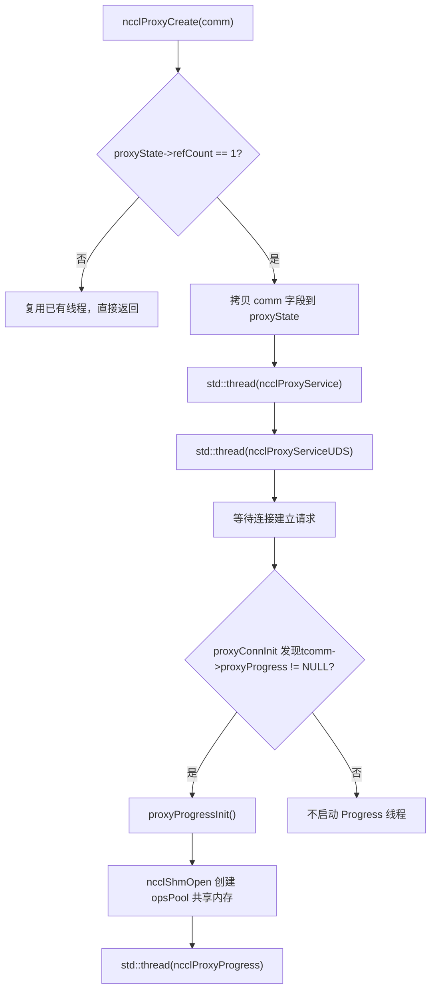
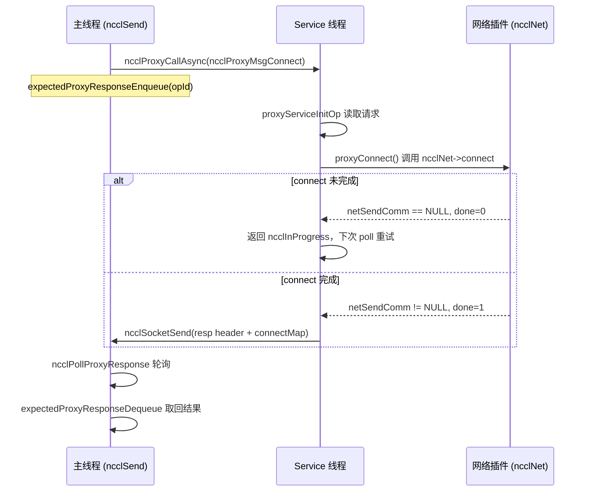
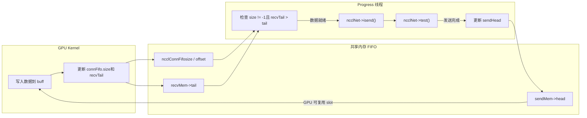

# Capítulo 12: Programación asíncrona del hilo proxy: cómo proxy.cc desacopla la E/S de la ejecución del kernel

El capítulo anterior desglosó la capa de abstracción de transport, mostrando cómo NCCL usa una interfaz unificada para ocultar las diferencias entre P2P/SHM/NET/NVLS. Pero la capa de transporte solo responde «por qué canal van los datos», aún no responde «cómo se impulsan los datos de forma asíncrona». Si el kernel de GPU se bloquea directamente esperando la red, las unidades de cómputo quedarían estranguladas por la E/S. Este capítulo se centra en`src/proxy.cc`y`src/include/proxy.h`, para ver cómo NCCL usa hilos host independientes para separar la E/S de red de la ruta de ejecución del kernel, formando una relación productor-consumidor con la GPU.

# 12.1 Por qué se necesitan hilos proxy: empezando por «quién espera la red»

## Modelo intuitivo

Imagina un restaurante: la cocina (GPU kernel) solo se encarga de cocinar, y el camarero (hilo proxy) se encarga de llevar los platos a los clientes (el extremo de red). Si se deja que el chef sirva los platos él mismo, tendría que detener la cocción cada vez que lleva un plato, y la velocidad de servicio se desplomaría. El proxy de NCCL es precisamente ese camarero dedicado: el kernel solo escribe datos en el búfer compartido y lee datos de él, mientras que todo el trabajo sucio de envío y recepción de red se delega a los hilos proxy del lado del host.

> **[Design Inference & Architectural Trade-offs]**
> ¿Qué catástrofe enfrentaría el sistema sin el proxy? El GPU kernel es SIMT masivamente paralelo; un warp bloqueado en sondeo de red desperdiciaría la potencia de cómputo de todo un SM; más letal aún, el envío y recepción de red implica llamadas al sistema socket, sondeo de verbs, envío de descriptores DMA, operaciones que simplemente no pueden ejecutarse en código de device. Por lo tanto, NCCL debe trasladar la E/S de red al host, haciendo que el kernel y el proxy intercambien señales de "datos listos" a través de una FIFO en memoria compartida.

## La división de trabajo entre los dos tipos de hilos

NCCL inicia dos tipos de hilos proxy en el lado del host, con responsabilidades completamente distintas:

- **Hilo Service**（`ncclProxyService`): maneja solicitudes del plano de control — establecimiento de conexiones, registro de memoria, consulta de FD. Escucha un socket, recibe solicitudes RPC del rank local y avanza asíncronamente operaciones como setup/connect.
- **Hilo Progress**（`ncclProxyProgress`): maneja el plano de datos — realmente impulsa el envío y recepción de red. Toma proxy ops del pool de memoria compartida, llama al`proxyProgress`callback del transport para avanzar el movimiento de datos.

[FACT:src/include/proxy.h:343-345]muestra`ncclProxyState`y mantiene simultáneamente`thread`(Service) y`threadUDS`(servicio UDS), mientras que el handle del hilo Progress está oculto en`progressState.thread`[FACT:src/include/proxy.h:261-261]。

## Establecimiento de la relación productor-consumidor

[FACT:src/proxy.cc:2130-2166]El`ncclProxyCreate`es donde nace el hilo: cuando`refCount == 1`(creación del primer comm), copia los campos clave del comm en`proxyState`y luego inicia el hilo Service y el hilo UDS. Nota que el hilo Progress no se inicia aquí — es iniciado por`proxyProgressInit`de forma perezosa solo cuando se establece la primera conexión que necesita proxy progress[FACT:src/proxy.cc:1523-1524]。



Esta imagen ancla la rama real de inicio del hilo: solo cuando`tcomm->proxyProgress`no está vacío (es decir, ese transport necesita avance del plano de datos), se crea el hilo Progress.

# 12.2 Estructuras de datos y diseño de memoria: pool de memoria compartida y pool de ops

## Panorama de las estructuras centrales

El modelo de concurrencia del proxy se construye sobre dos bloques de memoria compartida; entender su diseño de memoria es el prerrequisito para comprender todo el mecanismo.

**Primer bloque:`ncclProxyOpsPool`**（[FACT:src/include/proxy.h:218-226]). Este es el "buzón de entrega de tareas" entre el hilo principal y el hilo Progress, compartido entre procesos mediante`/dev/shm`

| Campo | Tipo | Función |
| --- | --- | --- |
| `ops[]` | `ncclProxyOp[]` | Array de ops preasignado, tamaño`MAX_OPS_PER_PEER * NCCL_MAX_LOCAL_RANKS` |
| `nextOps` | `volatile int` | Índice de cabeza de la lista de ops pendientes, -1 indica vacío |
| `nextOpsEnd` | `volatile int` | Índice de cola de la lista de ops pendientes |
| `freeOps[]` | `volatile int[]` | Cabeza de la lista de ops libres por local rank |
| `syncObjectsInitialized` | `int` | Marca si mutex/cond ya están inicializados |
| `mutex` / `cond` | `std::mutex` / `std::condition_variable` | Primitivas de sincronización entre procesos |

`MAX_OPS_PER_PEER`Definición de[FACT:src/include/proxy.h:218-226]es`2 * MAXCHANNELS * 2 * NCCL_MAX_DEV_WORK_P2P_PER_BATCH`. El comentario explica por qué es 2 veces: cada p2p work contiene un send y un recv proxy op, por lo que se multiplica por 2; multiplicar de nuevo por 2 es para poder almacenar dos rondas completas de operaciones, de lo contrario no se podría "entregar la mitad y liberar la mitad".

**Segundo bloque:`ncclProxyArgs`**（[FACT:src/include/proxy.h:174-209]). Esta es la "descripción de op en tiempo de ejecución" usada internamente por el hilo Progress, asignada desde`ncclProxyPool`, no compartida entre procesos.

Campos clave:

- `subs[NCCL_PROXY_MAX_SUBS]`: array de suboperaciones,`NCCL_PROXY_MAX_SUBS = MAXCHANNELS` [FACT:src/include/proxy.h:55-55]. Operaciones del mismo tipo de múltiples channels se agregan en múltiples sub dentro de un args.
- `progress`: puntero a función, apunta al`proxyProgress`callback del transport[FACT:src/include/proxy.h:176-176]。
- `next` / `nextPeer` / `proxyAppendPtr`: tres punteros de lista enlazada, que forman una compleja relación de organización de ops.
- `state`：`ncclProxyOpNone` / `ncclProxyOpReady` / `ncclProxyOpProgress`Tres estados de[FACT:src/include/proxy.h:48-52]。

## Diseño en capas del pool de memoria

`ncclProxyPool` [FACT:src/proxy.cc:50-53]es una unidad de asignación por lotes, cada pool contiene`PROXYARGS_ALLOCATE_SIZE`(es decir,`NCCL_MAX_OPS`)`ncclProxyArgs`。`allocateArgs` [FACT:src/proxy.cc:207-231]La lógica de asignación de

```c
if (state->pool == NULL) {
    struct ncclProxyPool* newPool;
    NCCLCHECK(ncclCalloc(&newPool, 1));
    struct ncclProxyArgs* newElems = newPool->elems;
    for (int i = 0; i pool = newElems;
    newPool->next = state->pools;
    state->pools = newPool;
}
elem = state->pool;
state->pool = state->pool->next;
```

[FACT:src/proxy.cc:207-231]

> **[Design Inference & Architectural Trade-offs]**
> [Inferencia de diseño y compensaciones arquitectónicas]`ncclProxyArgs`La motivación de diseño aquí es:`subs[MAXCHANNELS]`La estructura`requests[NCCL_STEPS]`es muy grande (contiene el array

## , y cada sub tiene

`ncclProxyOpsPool`), si cada op se malloc individualmente, causaría grave fragmentación de memoria y sobrecarga de asignación. Asignación por lotes + reutilización de lista de libres reduce el costo de asignación a casi cero. El comentario "Make sure we allocate the memory close to the network thread" sugiere que esto es por afinidad NUMA — el pool se crea en la primera asignación del hilo Progress, naturalmente cerca de la CPU donde se ejecuta ese hilo.`nextOps`、`nextOpsEnd`、`freeOps[]`Falso compartir y variables atómicas`volatile int`Los

en`ncclLocalOpAppend`son todos[FACT:src/proxy.cc:503-513]：

```c
int freeOp = -1;
while (freeOp == -1) {
  freeOp = COMPILER_ATOMIC_EXCHANGE(&pool->freeOps[tpLocalRank], -1, std::memory_order_acquire);
  if (freeOp == -1) std::this_thread::yield();
}
```

Observa la lógica de tomar una op libre de freeOps en`atomic_exchange`copia`freeOps[tpLocalRank]`se establece en -1 y se recupera el valor antiguo——esto es una «toma preventiva»: quien logre exchange primero obtiene toda la lista de libres. Cuando el hilo Progress devuelve una op, usa un bucle CAS[FACT:src/proxy.cc:898-907]：

```c
oldFree = COMPILER_ATOMIC_LOAD(&pool->freeOps[i], std::memory_order_acquire);
do {
  pool->ops[freeOpEnd[i]].next = oldFree;
} while (!COMPILER_ATOMIC_COMPARE_EXCHANGE(&pool->freeOps[i], &oldFree, newFree,
                                           std::memory_order_release,
                                           std::memory_order_acquire));
```

> **[Design Inference & Architectural Trade-offs]**
> Aquí se usa acquire/release en lugar de seq_cst porque solo se necesita garantizar que «la escritura del puntero next del nodo de la lista» sea visible para el tomador, no se requiere orden global.`freeOps[]`Cada elemento del array corresponde a un local rank, naturalmente dispersos cerca de diferentes líneas de caché, lo que reduce el false sharing.

# 12.3 Plano de control: establecimiento de conexión y mecanismo RPC

## Modelo intuitivo

> **[Design Inference & Architectural Trade-offs]**
> El hilo Service es como un «recepcionista de primera línea»: cuando un local rank necesita establecer una conexión de red, no se conecta directamente por sí mismo, sino que envía una solicitud RPC al hilo Service, y este la ejecuta en su nombre mediante setup/connect. ¿Por qué hacerlo así? Porque el establecimiento de conexiones de red (especialmente la creación de QP de verbs, el registro de memoria) puede bloquear, y ciertos recursos (como el listen socket) deben ser poseídos por un único hilo. Al centralizar el plano de control en el hilo Service, el hilo principal puede continuar haciendo otras cosas de forma no bloqueante.

## Codificación de solicitudes RPC

`ncclProxyCallAsync` [FACT:src/proxy.cc:1369-1394]Es el extremo emisor del RPC. Envía secuencialmente a través del socket: type, puntero de connection, reqSize, respSize, reqBuff, opId.

```c
NCCLCHECKGOTO(ncclSocketSend(sock, &type, sizeof(int)), ret, error);
NCCLCHECKGOTO(ncclSocketSend(sock, &proxyConn->connection, sizeof(void*)), ret, error);
NCCLCHECKGOTO(ncclSocketSend(sock, &reqSize, sizeof(int)), ret, error);
NCCLCHECKGOTO(ncclSocketSend(sock, &respSize, sizeof(int)), ret, error);
if (reqSize) NCCLCHECKGOTO(ncclSocketSend(sock, reqBuff, reqSize), ret, error);
NCCLCHECKGOTO(ncclSocketSend(sock, &opId, sizeof(opId)), ret, error);
NCCLCHECK(expectedProxyResponseEnqueue(sharedProxyState, opId, respSize));
```

[FACT:src/proxy.cc:1369-1394]

Nótese el último paso: tras enviar la solicitud, registra inmediatamente el opId en la`expectedResponses`cola. Esta es la clave del RPC asíncrono——el invocador no espera la respuesta, sino que primero registra «espero la respuesta de este opId», y luego usa`ncclPollProxyResponse`para hacer polling.

## Implementación de lista enlazada de la cola de respuestas

`expectedProxyResponseEnqueue` [FACT:src/proxy.cc:97-117]Utiliza una lista enlazada simple para almacenar las op pendientes de respuesta.`expectedProxyResponseStore` [FACT:src/proxy.cc:67-95]Al recibir una respuesta, se empareja por opId, se hace memcpy de los datos de respuesta en el`respBuff`preasignado, se marca`done = true`。`expectedProxyResponseDequeue` [FACT:src/proxy.cc:119-141]En el polling se buscan las respuestas completadas y se extraen.

Aquí hay un detalle:`expectedProxyResponseStore`Comprueba`respSize`si coincide con[FACT:src/proxy.cc:72-75], si no coincide reporta`ncclInternalError`. Esto es programación defensiva——si el solicitante y el respondedor tienen entendimientos inconsistentes sobre el tamaño de la respuesta, significa que el protocolo está corrupto, y debe fallar inmediatamente en lugar de continuar silenciosamente.

## Bucle principal del hilo Service

`ncclProxyService` [FACT:src/proxy.cc:1789-2016]El núcleo es un bucle poll. Utiliza`pollfds`un array para gestionar todas las conexiones, incluyendo el listen socket y el socket de cada peer.

```c
while (stop == PROXY_RUNNING || npeers > 0) {
    if (COMPILER_ATOMIC_LOAD(proxyState->abortFlag, std::memory_order_acquire) != 0) stop = PROXY_ABORT;
    int ret = 0;
    const int timeout = asyncOpCount ? 0 : 500;
    ...
    ret = poll(activePollfds, nfds_to_poll, timeout);
```

[FACT:src/proxy.cc:1842-1863]

`timeout`La elección de es muy cuidadosa: si hay ops asíncronas en progreso (`asyncOpCount > 0`), el timeout se establece en 0 (polling no bloqueante), porque se necesita llamar frecuentemente a`proxyProgressAsync`para avanzarlas; de lo contrario se establece en 500ms, para evitar girar en vacío quemando CPU. El comentario «never let proxy service thread blocks in poll, or it cannot receive abortFlag»[FACT:src/proxy.cc:1847-1847]señala por qué no se puede bloquear indefinidamente——debe despertar periódicamente para comprobar abortFlag.

## Avance de ops asíncronas

`proxyProgressAsync` [FACT:src/proxy.cc:1626-1700]Es el núcleo del hilo Service para avanzar operaciones asíncronas. Distribuye a diferentes callbacks de transport según el tipo de op:

```c
if (op->type == ncclProxyMsgSetup) {
    res = op->connection->tcomm->proxySetup(op->connection, proxyState, op->reqBuff, op->reqSize, op->respBuff,
                                            op->respSize, &done);
} else if (op->type == ncclProxyMsgConnect) {
    res = op->connection->tcomm->proxyConnect(...);
} else if (op->type == ncclProxyMsgInit) {
    res = proxyConnInit(peer, connectionPool, proxyState, ...);
}
```

[FACT:src/proxy.cc:1631-1664]

Cada callback lleva un`done`parámetro de salida. Si`done == 0`, significa que la operación aún no ha terminado (por ejemplo, la conexión de red todavía está en el three-way handshake), devuelve`ncclInProgress`, y el siguiente ciclo continúa avanzando. Si`done == 1`, entonces envía la cabecera de respuesta + cuerpo de respuesta al solicitante[FACT:src/proxy.cc:1681-1689]。



Este diagrama de secuencia ancla`sendProxyConnect`dentro de`*done = 0; return ncclInProgress`la rama real de[FACT:src/transport/net.cc:913-916]。

# 12.4 Plano de datos: cómo el hilo Progress impulsa el envío/recepción de red

## Modelo intuitivo

El hilo Progress es un «operador de cinta transportadora»: vigila la FIFO en el búfer compartido, y en cuanto la GPU ha escrito los datos (size != -1 en la FIFO), llama inmediatamente a`isend`para enviar los datos; en cuanto la red termina de recibir los datos, actualiza recvTail para notificar a la GPU que puede leer. Todo el proceso sincroniza GPU y proxy a través de los punteros head/tail en la FIFO, sin necesidad de ningún lock.

## Entrega de ops: del hilo principal al hilo Progress

El hilo principal en`ncclProxySaveOp` [FACT:src/proxy.cc:591-761]decide según el pattern qué proxy ops se necesitan, y luego mediante`SaveProxy` → `ncclLocalOpAppend`escribe las ops en el pool de memoria compartida.

`ncclLocalOpAppend` [FACT:src/proxy.cc:488-554]El flujo de :

1. De`proxyOps->freeOp`o`pool->freeOps[tpLocalRank]`toma un slot de op libre.

2. `memcpy(op, proxyOp, sizeof(struct ncclProxyOp))`Copia el contenido de la op a la memoria compartida[FACT:src/proxy.cc:515-515]。

3. Cuelga la op al`proxyOps->nextOps`final de la lista enlazada.

4. Si el número acumulado de ops alcanza`MAX_OPS_PER_PEER`, dispara una entrega por lotes[FACT:src/proxy.cc:525-551]。

La lógica de la entrega por lotes es muy sutil: no puede simplemente enviar todas las ops, porque «múltiples ops con el mismo opCount deben entregarse juntas, de lo contrario se rompe la agregación sub de proxyArgs». Por eso encuentra el último límite donde opCount cambia, y solo entrega hasta ahí[FACT:src/proxy.cc:529-548]。

La entrega se completa mediante`ncclProxyPost` [FACT:src/proxy.cc:476-486], que toma el lock, actualiza`pool->nextOps`、`notify_one`y despierta el hilo Progress.

## Bucle principal del hilo Progress

`ncclProxyProgress` [FACT:src/proxy.cc:951-1011]La estructura de :

```c
do {
    int idle = 1;
    ncclResult_t ret = progressOps(proxyState, state, state->active, &idle);
    ...
    if (idle || !state->active || (++proxyOpAppendCounter == ncclParamProgressAppendOpFreq())) {
      int added = 0;
      proxyOpAppendCounter = 0;
      ret = ncclProxyGetPostedOps(proxyState, &added);
      ...
    }
    lastIdle = idle;
    stopv = state->stop.load(std::memory_order_acquire);
} while ((stopv == 0 || (stopv == 1 && state->active)) &&
         COMPILER_ATOMIC_LOAD(proxyState->abortFlag, std::memory_order_acquire) == 0);
```

[FACT:src/proxy.cc:976-1009]

Aquí hay una optimización de rendimiento que vale la pena notar:`proxyOpAppendCounter`El contador[FACT:src/proxy.cc:974-974]. El comentario explica[FACT:src/proxy.cc:969-973]: llamar a`ncclProxyGetPostedOps`con demasiada frecuencia provoca una regresión en el rendimiento de comunicación de mensajes pequeños, por eso cada vez que se avanza`ProgressAppendOpFreq`(por defecto 8) veces antes de obtener un nuevo op.

## Agregación de op: ProxyAppend

`ProxyAppend` [FACT:src/proxy.cc:437-474]Determina si un op es «añadir al sub de args existentes» o «crear un nuevo args». El criterio es`connection->shared && args->opCount == op->opCount` [FACT:src/proxy.cc:443-443]——múltiples operaciones de channel de la misma conexión y el mismo opCount se agregan.

> **[Design Inference & Architectural Trade-offs]**
> Valor de la agregación: las operaciones del mismo tipo de múltiples channels se combinan en un solo args, el hilo Progress puede avanzar todos los channels en un solo ciclo, reduciendo la sobrecarga de llamadas a funciones y la invalidación de caché.`ncclProxyOpToArgs` [FACT:src/proxy.cc:368-435]Al añadir un sub se valida`sliceSteps`、`chunkSteps`、`protocol`、`dtype`、`redOp`、`coll`si son consistentes[FACT:src/proxy.cc:401-406], si no lo son se reporta un error——esta es la línea de defensa contra agregaciones erróneas.

## sendProxyProgress: máquina de estados de cuatro fases del lado de envío

`sendProxyProgress` [FACT:src/transport/net.cc:1324-1491]Es el núcleo del lado de envío. Avanza sub por sub, cada sub tiene cuatro contadores:`posted`、`transmitted`、`done`。

**Fase uno: inicialización de Ready** [FACT:src/transport/net.cc:1326-1339]

```c
sub->base = ROUNDUP(resources->step, args->chunkSteps);
resources->step = sub->base + sub->nsteps;
sub->posted = sub->transmitted = sub->done = 0;
```

`base`es el número inicial del step,`ROUNDUP`garantiza la alineación a`chunkSteps`。`resources->step`se acumula, reservando espacio para el siguiente op.

**Fase dos: Post del búfer a la GPU** [FACT:src/transport/net.cc:1355-1376]

```c
if (sub->posted nsteps && sub->posted done + maxDepth) {
    int buffSlot = (sub->base + sub->posted) % NCCL_STEPS;
    if (resources->shared) {
        ...
        *sendHead = sub->base + sub->posted - NCCL_STEPS;
    } else {
        sub->posted += args->sliceSteps;
    }
}
```

`maxDepth`es la profundidad del pipeline[FACT:src/transport/net.cc:1343-1343], limita el número de steps simultáneamente in-flight. En modo shared, el proxy actualiza`sendHead`para decirle a la GPU «este slot se puede escribir».

**Fase tres: verificar si la GPU ha escrito, iniciar isend** [FACT:src/transport/net.cc:1378-1452]

```c
if (sub->transmitted posted && sub->transmitted done + NCCL_STEPS) {
    int buffSlot = (sub->base + sub->transmitted) % NCCL_STEPS;
    volatile uint64_t* recvTail = &resources->recvMem->tail;
    uint64_t tail = sub->base + sub->transmitted;
    if (connFifo[buffSlot].size != -1 && (*recvTail > tail || p == NCCL_PROTO_LL)) {
        int size = connFifo[buffSlot].size;
        ...
        NCCLCHECK(proxyState->ncclNet->isend(resources->netSendComm, buff, size, resources->tpRank,
                                             sub->sendMhandle, phandle, sub->requests + buffSlot));
        if (sub->requests[buffSlot] != NULL) {
            sub->transmitted += args->sliceSteps;
        }
    }
}
```

La condición clave aquí es`connFifo[buffSlot].size != -1 && *recvTail > tail`——tras escribir los datos, la GPU actualiza el size y recvTail del FIFO, el proxy solo inicia el isend cuando ve que ambas condiciones se cumplen. Para el protocolo LL, como tiene semántica de «zero-copy», no necesita esperar recvTail.

**Fase cuatro: verificar que el envío se completó, actualizar sendHead** [FACT:src/transport/net.cc:1455-1481]

```c
if (sub->done transmitted) {
    int buffSlot = (sub->base + sub->done) % NCCL_STEPS;
    NCCLCHECK(proxyState->ncclNet->test(sub->requests[buffSlot], &done, &size));
    if (done) {
        connFifo[buffSlot].size = -1;
        std::atomic_thread_fence(std::memory_order_seq_cst);
        sub->done += args->sliceSteps;
        if (resources->shared == 0) {
            volatile uint64_t* sendHead = resources->gdcSync ? resources->gdcSync : &resources->sendMem->head;
            *sendHead = sub->base + sub->done;
        }
    }
}
```

`test`Tras devolver done, primero se resetea el FIFO size a -1, se inserta un seq_cst fence, y luego se actualiza sendHead para notificar a la GPU «este slot se puede reutilizar». La función del fence es evitar la reordenación del reseteo de size y la actualización de head——si head se actualiza primero, la GPU podría empezar a escribir cuando size aún tiene el valor antiguo.

## recvProxyProgress: las cuatro fases del lado de recepción

`recvProxyProgress` [FACT:src/transport/net.cc:1493-1788]Es más complejo, porque implica agrupación de subs (se usa multirecv cuando múltiples subs comparten el mismo recvComm).

**Fase uno: agrupar por recvComm en Ready** [FACT:src/transport/net.cc:1495-1538]

```c
for (int s = 0; s nsubs; s++) {
    ...
    if (groupSize == maxRecvs) {
        groupSize = 0;
    } else if (s > 0) {
        int next;
        for (next = s; next nsubs; next++) {
            struct recvNetResources* nextRes = ...;
            if (nextRes->netRecvComm == recvComm) break;
        }
        if (next == args->nsubs) {
            groupSize = 0;
        } else if (s != next) {
            // swap subs
        }
    }
    groupSize++;
    ...
    for (int i = 0; i  **[Design Inference & Architectural Trade-offs]**
> Este fragmento de código coloca juntos los subs que usan el mismo`recvComm`y registra`groupSize`. ¿Por qué agrupar? Porque`irecv`soporta recibir múltiples buffers a la vez (multirecv), combinar las solicitudes del mismo comm en una sola llamada reduce significativamente la sobrecarga del plugin.

**Fase dos: iniciar irecv** [FACT:src/transport/net.cc:1543-1631]

```c
if (subCount) {
    uint64_t step = subGroup->posted;
    void** requestPtr = subGroup->requests + (step % NCCL_STEPS);
    bool ignoreCompletion = ncclParamNetOptionalRecvCompletion() &&
                            ((args->protocol == NCCL_PROTO_LL128) || (args->protocol == NCCL_PROTO_LL)) &&
                            (subCount == 1);
    if (ignoreCompletion) *requestPtr = (void*)NCCL_NET_OPTIONAL_RECV_COMPLETION;
    NCCLCHECK(proxyState->ncclNet->irecv(resources->netRecvComm, subCount, ptrs, sizes, tags, mhandles, phandles,
                                         requestPtr));
    if (*requestPtr) {
        subGroup->recvRequestsCache[step % NCCL_STEPS] = *requestPtr;
        subGroup->recvRequestsSubCount = subCount;
        for (int i = 0; i groupSize; i++) {
            sub->posted += args->sliceSteps;
        }
    }
}
```

`ignoreCompletion`Optimización[FACT:src/transport/net.cc:1608-1610]: para la recepción de un solo buffer con protocolos LL/LL128, la notificación de finalización es opcional (porque los datos mismos llevan flag), se puede omitir la verificación de completion.

**Fase tres: verificar que la recepción se completó, actualizar recvTail** [FACT:src/transport/net.cc:1634-1743]

```c
NCCLCHECK(proxyState->ncclNet->test(subGroup->requests[step % NCCL_STEPS], &done, sizes));
if (done) {
    for (int i = 0; i groupSize; i++) {
        struct ncclProxySubArgs* sub = subGroup + i;
        int buffSlot = (sub->base + sub->received) % NCCL_STEPS;
        connFifo[buffSlot].size = -1;
        sub->received += args->sliceSteps;
    }
    ...
}
```

Tras completar la recepción, se resetea el FIFO size, y luego se entra en la fase de flush (el escenario GDRDMA requiere flush para garantizar la visibilidad de los datos).

**Fase cuatro: esperar el consumo de la GPU, actualizar done** [FACT:src/transport/net.cc:1745-1779]

```c
if (sub->transmitted > sub->done) {
    volatile uint64_t* sendHead = &resources->sendMem->head;
    uint64_t done = *sendHead;
    while (done > sub->base + sub->done && sub->transmitted > sub->done) {
        if (subGroup->recvRequestsCache[sub->done % NCCL_STEPS]) {
            if (proxyState->ncclNet->irecvConsumed) {
                NCCLCHECK(proxyState->ncclNet->irecvConsumed(resources->netRecvComm, subGroup->recvRequestsSubCount,
                                                             subGroup->recvRequestsCache[sub->done % NCCL_STEPS]));
            }
            subGroup->recvRequestsCache[sub->done % NCCL_STEPS] = NULL;
        }
        sub->done += args->sliceSteps;
    }
}
```

Aquí se lee`sendHead`para determinar si la GPU ya ha consumido los datos.`irecvConsumed`Es el callback para el plugin, le dice «el buffer de esta solicitud de recepción ya ha sido consumido, se puede reutilizar».

## Panorama del flujo de datos



Este diagrama de flujo de datos muestra el bucle cerrado formado por la GPU y el proxy a través del FIFO y los punteros head/tail: la GPU escribe datos → actualiza tail → el proxy detecta e inicia isend → test confirma la finalización → actualiza head → la GPU reutiliza el slot.

# 12.5 Control de concurrencia, barreras de memoria e interacción con hardware

## Orden de memoria del FIFO sin locks

La sincronización entre el proxy y la GPU depende completamente de`ncclConnFifo`y los punteros head/tail, sin ningún lock. Esto requiere un control del orden de memoria extremadamente cuidadoso.

En el lado de envío, el proxy tras`test`devolver done[FACT:src/transport/net.cc:1460-1473]：

```c
connFifo[buffSlot].size = -1;
std::atomic_thread_fence(std::memory_order_seq_cst);
...
*sendHead = sub->base + sub->done;
```

El seq_cst fence garantiza que el reseteo de size sea visible para la GPU antes de que la actualización de head sea visible. Si el orden se invierte, la GPU podría ver el nuevo head pero el size antiguo, y creer erróneamente que hay datos en el slot.

En el lado de recepción, el proxy antes de actualizar recvTail[FACT:src/transport/net.cc:1731-1736]：

```c
if (step nsteps) {
    std::atomic_thread_fence(std::memory_order_seq_cst);
    volatile uint64_t* recvTail = resources->gdcSync ? resources->gdcSync : &resources->recvMem->tail;
    *recvTail = sub->base + sub->transmitted;
}
```

La misma lógica: primero el fence garantiza que la escritura de datos sea visible, luego se actualiza tail para notificar a la GPU que puede leer.

## Mecanismo de flush de GDRCOPY

Cuando se usa GDRDMA, la NIC escribe directamente en la memoria de la GPU, pero la operación de escritura puede seguir sin confirmar en el bus PCIe. El proxy necesita hacer flush activamente para garantizar la visibilidad de los datos. Véase`recvProxyProgress`la lógica de flush en[FACT:src/transport/net.cc:1664-1709]：

```c
if (totalSize > 0 && p == NCCL_PROTO_SIMPLE && needFlush) {
    if (resources->gdcFlush) {
#if defined(__x86_64__)
        asm volatile("mfence" ::: "memory");
        asm volatile("mov (%0), %%eax" ::"l"(resources->gdcFlush) : "%eax", "memory");
#else
        std::atomic_thread_fence(std::memory_order_seq_cst);
        uint64_t dummy;
        NCCLCHECK(ncclGdrCudaRead(resources->gdrDesc, &dummy, resources->gdcFlush, sizeof(dummy)));
#endif
    } else {
        // iflush 路径
        NCCLCHECK(proxyState->ncclNet->iflush(resources->netRecvComm, subCount, ptrs, sizes, mhandles,
                                              subGroup->requests + (step % NCCL_STEPS)));
    }
}
```

El comentario de la ruta x86 es excelente[FACT:src/transport/net.cc:1668-1674]：`mfence`Evitar que la carga de CQE-poll se reordene antes de la carga de flush;`mov (%0), %%eax`Forzar una lectura PCIe, haciendo que la CPU se detenga hasta que todas las escrituras posted previas de PCIe (incluyendo el DMA de la NIC) se confirmen en el endpoint. Este es un control de orden de memoria a nivel de hardware, más contundente que cualquier fence de software.

## Coordinación entre variables atómicas y stop/abort

Condición de salida del hilo Progress[FACT:src/proxy.cc:1007-1009]：

```c
stopv = state->stop.load(std::memory_order_acquire);
} while ((stopv == 0 || (stopv == 1 && state->active)) &&
         COMPILER_ATOMIC_LOAD(proxyState->abortFlag, std::memory_order_acquire) == 0);
```

`stop == 1`Pero`state->active != NULL`continúa ejecutándose — esto es para el "parado elegante": las operaciones ya enviadas deben completarse, de lo contrario la GPU nunca recibirá los datos. Solo`stop == 2`(abort) o`abortFlag != 0`fuerzan la salida.

`ncclProxyProgressDestroy` [FACT:src/proxy.cc:1039-1065]El flujo de parada de:

```c
std::lock_guard lock(state->opsPool->mutex);
state->stop.store(1, std::memory_order_release);
state->opsPool->cond.notify_one();
state->thread.join();
```

Primero adquirir el lock, luego hacer store de stop, y después notify — este es el patrón estándar para prevenir lost wakeup. El hilo Progress en`pool->cond.wait`mantiene el lock y verifica el predicado[FACT:src/proxy.cc:850-851], garantizando que no se pierda el despertar.

# 12.6 Guía de evitación de errores en producción y cadena de recuperación de fallos

## Error uno: fuga de conexiones que impide la salida del hilo Service

`ncclProxyService`La condición del bucle principal de es`stop == PROXY_RUNNING || npeers > 0` [FACT:src/proxy.cc:1842-1842]. El comentario explica[FACT:src/proxy.cc:1843-1845]: incluso si el comm local hace abort, mientras existan conexiones peer, el hilo proxy no puede salir, de lo contrario podría ocurrir un segmentation fault.

**Escenario de diagnóstico**: si un rank falla sin notificar al par, el hilo Service del par se quedará atascado en el bucle de`npeers > 0`. En este caso se debe depender de`abortFlag`o de un mecanismo de timeout. En producción, si se observa un proceso colgado en`ncclProxyService`, primero verificar si algún rank par terminó de forma anómala.

## Error dos: desajuste en la cola de respuestas que provoca fugas de memoria

`expectedProxyResponseStore`devuelve cuando el opId no coincide`ncclInternalError` [FACT:src/proxy.cc:93-94]. Pero si la respuesta llega cuando el solicitante ya abandonó (por ejemplo, por timeout), esta respuesta permanecerá en la cola para siempre,`respBuff`fuga.

**Medidas defensivas**：`expectedProxyResponseFree` [FACT:src/proxy.cc:55-65]en`ncclProxyDestroy`limpia toda la cola[FACT:src/proxy.cc:2226-2226]. Pero esto es el último recurso; en operación normal no debería haber residuos.

## Error tres: head inicializado a valor negativo en modo shared

`sendProxyConnect`en[FACT:src/transport/net.cc:999-1000]：

```c
// Don't give credits yet in shared mode.
(resources->gdcSync ? *resources->gdcSync : resources->sendMem->head) = (map->shared ? -NCCL_STEPS : 0);
```

En modo shared, head se inicializa a`-NCCL_STEPS`, lo que significa que la GPU no tiene créditos para escribir al inicio. El proxy necesita incrementar head gradualmente en la fase de post para "otorgar créditos". Si se olvida esta inicialización, la GPU creerá erróneamente que tiene créditos y escribirá en slots no preparados, causando corrupción de datos.

## Error cuatro: verificación de flag en el protocolo LL128

`sendProxyProgress`La verificación de ready de LL128 en[FACT:src/transport/net.cc:1388-1403]：

```c
if (p == NCCL_PROTO_LL128) {
    ready = resources->useGdr;
    if (!ready) {
        uint64_t flag = sub->base + sub->transmitted + 1;
        int nFifoLines = DIVUP(connFifo[buffSlot].size, sizeof(uint64_t) * NCCL_LL128_LINEELEMS);
        volatile uint64_t* lines = (volatile uint64_t*)buff;
        ready = 1;
        for (int i = 0; i que actualiza`sendProxyProgress`cuando`sub->done == sub->nsteps`(es decir, no notificar a la GPU que el slot fue liberado), ¿en qué escenarios se provocaría un deadlock? ¿Por qué?`sendHead`Análisis de referencia

**es la única base que tiene la GPU para determinar "qué slots pueden reutilizarse". Ver**：`sendHead`Copiar[FACT:src/transport/net.cc:1469-1473]：

```c
if (resources->shared == 0) {
    volatile uint64_t* sendHead = resources->gdcSync ? resources->gdcSync : &resources->sendMem->head;
    *sendHead = sub->base + sub->done;
}
```

, en no shared es 0). El kernel de la GPU en`-NCCL_STEPS`verifica`waitSend`para considerar que hay créditos disponibles para escribir. Si head no avanza, la GPU se bloqueará indefinidamente esperando créditos tras llenar`head + NCCL_STEPS > step`slots, mientras que el proxy espera que la GPU escriba nuevos datos para poder hacer isend — deadlock clásico productor-consumidor. En modo shared es aún más grave, porque el head inicial es negativo y la GPU no tiene créditos desde el principio.`NCCL_STEPS` 个 slot 后就永远阻塞在等待 credit 上，而 proxy 又在等 GPU 写新数据才能 isend——经典的生产者-消费者死锁。在 shared 模式下更严重，因为初始 head 是负值，GPU 一开始就没有 credit。

Q2: `ncclLocalOpAppend`Cuando el op acumulado alcanza`MAX_OPS_PER_PEER`se activa el envío por lotes, pero el código deliberadamente «no envía todos los ops del último opCount». Si se cambiara para simplemente enviar todos los ops, ¿qué mecanismo se rompería?

**Análisis de referencia**: Véase[FACT:src/proxy.cc:525-548]los comentarios y la lógica de

```c
// Do not post last operations as we could have more coming with the same opCount, and posting
// them in different batches would break proxyArgs aggregation with subs.
uint64_t lastOpCount = pool->ops[proxyOps->nextOpsEnd].opCount;
int lastOp = -1;
...
for (int op = proxyOps->nextOps; op != proxyOps->nextOpsEnd; op = pool->ops[op].next) {
    ops++;
    if (pool->ops[op].opCount != lastOpCount) {
        lastOp = op;
        toSend = ops;
    }
}
```

`ProxyAppend`la lógica de agregación de[FACT:src/proxy.cc:443-443]depende de`args->opCount == op->opCount`para determinar si se añade un sub. Si múltiples channel ops del mismo opCount se dividen en dos lotes de envío, el primer lote creará un args, y cuando llegue el segundo lote`args->opCount`ya no será igual al opCount del nuevo op (porque args puede haber avanzado), lo que provoca que subs que deberían agregarse se dividan en args independientes. Esto no solo reduce el rendimiento, sino que también puede romper`ncclProxyOpToArgs`dentro de`nChannels`/`nPeers`la lógica de tomar el mínimo[FACT:src/proxy.cc:399-400], causando un cálculo incorrecto del número de canales.

Q3: `recvProxyProgress`La fase Ready de`recvComm`reordena y agrupa los subs según`irecv`. Si se eliminara esta lógica de agrupación y se dejara que cada sub llame independientemente a`maxRecvs > 1`, ¿qué consecuencias habría en las tarjetas de red de

**Análisis de referencia**: Véase[FACT:src/transport/net.cc:1495-1538]la lógica de agrupación de[FACT:src/transport/net.cc:1613-1614]y la llamada multirecv de

```c
NCCLCHECK(proxyState->ncclNet->irecv(resources->netRecvComm, subCount, ptrs, sizes, tags, mhandles, phandles,
                                     requestPtr));
```

`maxRecvs`es el «número máximo de buffers que un solo irecv puede recibir» declarado por el plugin de la tarjeta de red[FACT:src/transport/net.cc:1525-1525]. Cuando`maxRecvs > 1`, el plugin (como IB) soporta recibir múltiples buffers con un solo WQE, lo que reduce significativamente la sobrecarga de doorbell y el coste de procesamiento de CQE. Si se elimina la agrupación y cada sub hace irecv por separado,`subCount`siempre será 1, el plugin degenera a modo de un solo buffer y el throughput disminuirá. Más importante aún,`recvRequestsCache`y`irecvConsumed`los mecanismos[FACT:src/transport/net.cc:1616-1617]están diseñados para multirecv — en modo de un solo buffer estas lógicas de caché dejan de funcionar, lo que puede provocar fugas de solicitudes.

Hasta aquí, hemos entendido cómo el hilo proxy desacopla la E/S de red de la ejecución del kernel, permitiendo que el cálculo de la GPU y la comunicación se ejecuten realmente en paralelo. Pero el proxy solo es el impulsor; la implementación concreta de la transmisión de red subyacente aún está por revelarse. En el próximo capítulo profundizaremos en`net_ib`, para ver cómo NCCL encapsula la API de verbs para implementar la transmisión InfiniBand, y cómo GPUDirect RDMA permite que la tarjeta de red lea y escriba directamente en la memoria de la GPU.
