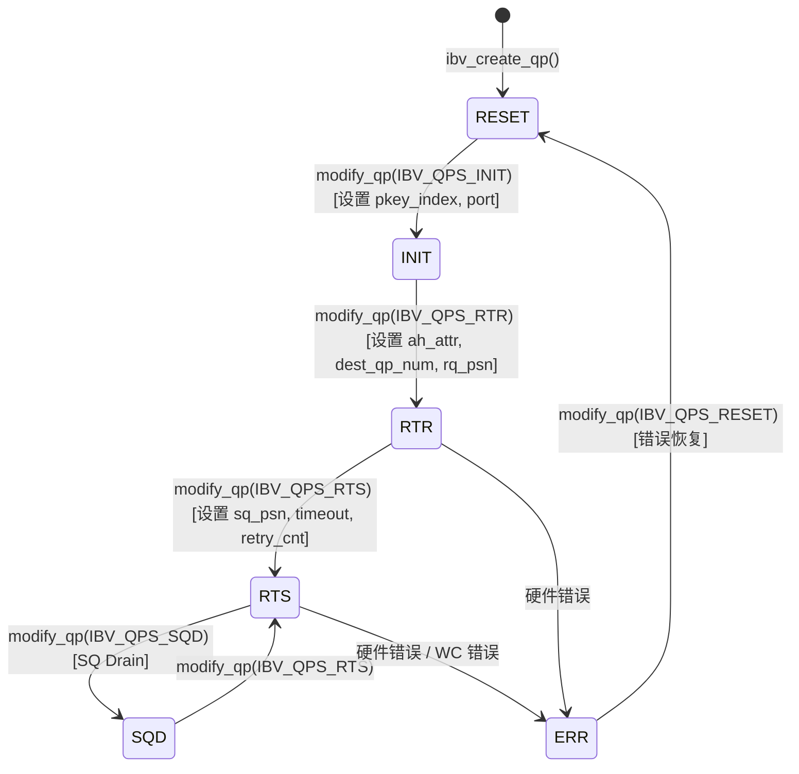

# Capítulo 13: Transmisión de red InfiniBand: cómo net_ib encapsula verbs y GPUDirect RDMA

En el capítulo anterior vimos cómo el hilo proxy separa la E/S de red del kernel de la GPU, permitiendo que el cálculo y la comunicación se ejecuten realmente en paralelo. Pero el proxy solo es un «impulsor» — llama a interfaces abstractas como ncclNet->isend/irecv, pero no sabe si por debajo hay TCP, InfiniBand u otra cosa. En este capítulo levantamos esa capa de abstracción y entramos en src/transport/net_ib y src/misc/ibvwrap.cc, para ver cómo NCCL encapsula la biblioteca C libibverbs en una tabla de símbolos conectable, cómo establece Queue Pairs (QP), y cómo GPUDirect RDMA permite que la tarjeta de red lea y escriba directamente en la memoria de la GPU sin pasar por la memoria del host.

# 13.1 Por qué NCCL no llama directamente a libibverbs

## Modelo intuitivo: la tabla de símbolos es como un «enchufe de alimentación conectable»

Imagina que compras un electrodoméstico importado y la forma del enchufe no coincide con la toma de tu casa. Tienes dos opciones: o desmontas el electrodoméstico y cambias el cableado (directamente`#include <infiniband/verbs.h>`y enlazar`-libverbs`), o compras un adaptador universal (cargar símbolos dinámicamente en tiempo de ejecución). NCCL eligió lo segundo.

> **[Design Inference & Architectural Trade-offs]**
> El motivo central de esta elección es la**flexibilidad de despliegue**: NCCL, como biblioteca cargada por frameworks superiores como PyTorch o TensorFlow, no puede asumir que el entorno de ejecución tenga`libibverbs.so`instalado. Si se enlazara en tiempo de compilación, en una máquina sin controlador InfiniBand toda la biblioteca NCCL no podría cargarse — incluso si solo quisieras usar NVLink para comunicación en una sola máquina. Mediante`dlopen`en tiempo de ejecución + resolución de símbolos, NCCL puede degradarse elegantemente en máquinas sin IB.

Si faltara esta capa de encapsulación, el desastre al que se enfrentaría el sistema es:**una tarea de entrenamiento en una sola máquina puramente NVLink se caería directamente porque la máquina no tiene instalado el controlador IB**. Esto es extremadamente común en entornos de nube y máquinas de desarrollo.

## Estructuras de datos y diseño de memoria: el contenedor de la tabla de símbolos

La estructura de datos central es`ncclIbvSymbols`, definida en`ibvsymbols.h`(este capítulo no incluye ese archivo, pero su estructura puede inferirse por el modo de uso). Es un contenedor puro de punteros a funciones, cada campo corresponde a una función de libibverbs:

```c
struct ncclIbvSymbols {
  int (*ibv_internal_fork_init)(void);
  struct ibv_device** (*ibv_internal_get_device_list)(int* num_devices);
  int (*ibv_internal_modify_qp)(struct ibv_qp*, struct ibv_qp_attr*, int);
  // ... 数十个函数指针
};
```

Solo hay una instancia global, que junto con`std::once_flag`garantiza una inicialización segura para hilos:

[FACT:src/misc/ibvwrap.cc:26-29]

```c
static std::once_flag initOnceFlag;
static ncclResult_t initResult;
struct ncclIbvSymbols ibvSymbols;
```

El diseño aquí es muy contenido:`initOnceFlag`es`std::once_flag`，`initResult`Inicializa el resultado del caché,`ibvSymbols`es la tabla de símbolos global. Los tres tienen duración de almacenamiento estática, su ciclo de vida abarca todo el proceso.

> **[Design Inference & Architectural Trade-offs]**
> ¿Por qué usar`std::once_flag`en lugar de`pthread_once`? Porque el código C++ de NCCL ya depende de`<mutex>`y`<thread>`, usar la biblioteca estándar es más consistente.`call_once`La semántica de es: sin importar cuántos hilos llamen simultáneamente a`wrap_ibv_symbols()`, la lambda se ejecuta solo una vez, los demás hilos se bloquean esperando, y luego todos obtienen el mismo`initResult`. Esto es mucho más seguro que escribir a mano un doble chequeo de bloqueo (DCLP)—DCLP tiene trampas de reordenamiento famosas bajo el modelo de memoria de C++.

## Paso a paso: El flujo completo de resolución de símbolos

Cuando NCCL necesita transporte IB por primera vez, llama a`wrap_ibv_symbols()`：

[FACT:src/misc/ibvwrap.cc:26-29]

```c
ncclResult_t wrap_ibv_symbols(void) {
  std::call_once(initOnceFlag, []() { initResult = buildIbvSymbols(&ibvSymbols); });
  return initResult;
}
```

`buildIbvSymbols`definido en`ibvsymbols.cc`(no incluido en este capítulo), su trabajo es usar`dlopen("libibverbs.so")`para abrir la biblioteca, luego para cada nombre de función llamar a`dlsym`para llenar el puntero. Si algún símbolo no se encuentra, el campo correspondiente permanece NULL.

Este diseño de "permitir NULL" atraviesa toda la capa de encapsulación. Veamos`CHECK_NOT_NULL`macro:

[FACT:src/misc/ibvwrap.cc:26-29]

```c
#define CHECK_NOT_NULL(container, internal_name) \
  if (container.internal_name == NULL) { \
    WARN("lib wrapper not initialized."); \
    return ncclInternalError; \
  }
```

Cada función de encapsulación verifica antes de llamar si el símbolo correspondiente no es nulo. Esto significa:**Si alguna versión antigua de libibverbs carece de alguna función nueva, NCCL no colapsará al cargar, sino que reportará error solo cuando realmente se use esa función**. Esta es la clave de la degradación progresiva.

## Reflexión de diseño: Las tres responsabilidades de la encapsulación con macros

`ibvwrap.cc`define 7 macros, no son simple azúcar sintáctico, sino que asumen tres responsabilidades:

1. **Protección contra punteros nulos**：`CHECK_NOT_NULL`intercepta no inicializado

2. **Normalización de códigos de error**: traduce unificadamente las múltiples convenciones de error de libibverbs (retornar -1, retornar errno, retornar puntero NULL) a`ncclResult_t`

3. **Puntos de registro de logs**: en caso de fallo`WARN`imprime el nombre de la función y errno

Veamos`IBV_PTR_CHECK_ERRNO`este macro, el más complejo:

[FACT:src/misc/ibvwrap.cc:38-45]

```c
#define IBV_PTR_CHECK_ERRNO(container, internal_name, call, retval, error_retval, name) \
  CHECK_NOT_NULL(container, internal_name); \
  retval = container.call; \
  if (retval == error_retval) { \
    WARN("Call to " name " failed with error %s", strerror(errno)); \
    return ncclSystemError; \
  } \
  return ncclSuccess;
```

Después de expandirse hace cuatro cosas: verifica que el símbolo no sea nulo, ejecuta la llamada, escribe el valor de retorno en`retval`(generalmente a través de parámetros de puntero se retorna`ibv_pd*`etc.), determina si es igual al valor de error. Nota`strerror(errno)`—las funciones de libibverbs que retornan punteros (como`ibv_alloc_pd`) en caso de fallo retornan NULL y establecen`errno`, así que leer`errno`aquí es correcto.

Y`IBV_INT_CHECK`se usa para funciones que retornan int:

[FACT:src/misc/ibvwrap.cc:84-91]

```c
#define IBV_INT_CHECK(container, internal_name, call, error_retval, name) \
  CHECK_NOT_NULL(container, internal_name); \
  int ret = container.call; \
  if (ret == error_retval) { \
    WARN("Call to " name " failed"); \
    return ncclSystemError; \
  } \
  return ncclSuccess;
```

Aquí no se lee`errno`, porque este tipo de funciones (como`ibv_fork_init`) retornan directamente -1 para indicar fallo, la información de error ya se perdió.

> **[Design Inference & Architectural Trade-offs]**
> Este enfoque de "usar una macro diferente para cada función" parece engorroso, pero es necesario: las convenciones de error de la API de libibverbs son extremadamente inconsistentes, algunas retornan 0/-1, otras retornan el valor de errno, otras retornan punteros. Si se forzara la unificación, se perdería información de error. NCCL elige "traducir fielmente", dejando la complejidad en la capa de encapsulación, para que la capa superior`net_ib.cc`solo necesite determinar`ncclSuccess`。

# 13.2 ibvcore.h: Contrato ABI sin dependencia de archivos de cabecera

## Modelo intuitivo: Traductor con diccionario propio

`ibvcore.h`es un archivo peculiar—redefine las estructuras, enumeraciones y constantes centrales de libibverbs**desde cero**. ¿Por qué? Porque NCCL necesita usar estos tipos sin`#include <infiniband/verbs.h>`.

> **[Design Inference & Architectural Trade-offs]**
> Esto resuelve un problema de ingeniería real:`infiniband/verbs.h`tiene contenido diferente en distintas distribuciones y versiones de controladores. Si NCCL lo incluyera directamente, en tiempo de compilación quedaría vinculado a una versión específica. Al definir su propio "subconjunto mínimo necesario", NCCL puede prescindir de los archivos de cabecera IB en tiempo de compilación, y cargar cualquier versión de la biblioteca en tiempo de ejecución mediante`dlopen`.

Si faltara esta capa, el desastre sería:**No se podría compilar NCCL en máquinas sin`libibverbs-dev`instalado**. Cuando en realidad en tiempo de ejecución podría proporcionarse el archivo de biblioteca mediante`rdma-core`.

## Diseño de memoria de estructuras clave

Seleccionamos algunas estructuras clave para entender RDMA.

**`ibv_gid`: Identificador global**

[FACT:src/include/ibvcore.h:58-64]

```c
union ibv_gid {
	uint8_t			raw[16];
	struct {
		uint64_t	subnet_prefix;
		uint64_t	interface_id;
	} global;
};
```

GID es la "dirección IP" de InfiniBand, 16 bytes. Puede accederse tanto como un arreglo de 16 bytes como dos enteros de 64 bits. En escenarios RoCE (RDMA over Converged Ethernet), el GID es en realidad una dirección IPv6—por eso`ibvGetGidStr`usa`inet_ntop(AF_INET6, ...)`para formatear:

[FACT:src/include/ibvwrap.h:102-108]

```c
static inline const char* ibvGetGidStr(union ibv_gid* gid, char* gidStr, size_t strLen) {
  static_assert(sizeof(union ibv_gid) == sizeof(struct in6_addr),
                "the sizeof struct ibv_gid must be the size of struct in6_addr");
  return inet_ntop(AF_INET6, gid->raw, gidStr, strLen);
}
```

`static_assert`garantiza en tiempo de compilación que`ibv_gid`y`in6_addr`tengan el mismo tamaño, para que`inet_ntop`pueda interpretar correctamente estos 16 bytes.

**`ibv_mr`: Manejador de registro de memoria**

[FACT:src/include/ibvcore.h:402-410]

```c
struct ibv_mr {
	struct ibv_context     *context;
	struct ibv_pd	       *pd;
	void		       *addr;
	size_t			length;
	uint32_t		handle;
	uint32_t		lkey;
	uint32_t		rkey;
};
```

Este es el núcleo de GPUDirect RDMA.`addr`es la dirección de inicio de la memoria registrada (puede ser memoria host, o dirección de memoria GPU mapeada al host),`length`es la longitud.`lkey`(local key) y`rkey`(remote key) son las "llaves" que la tarjeta de red usa para verificar permisos de acceso—el emisor incluye`lkey`en el WQE, el receptor usa`rkey`para validar.

> **[Design Inference & Architectural Trade-offs]**
> ¿Por qué se necesita registrar? Porque la tarjeta de red usa direcciones físicas al hacer DMA, mientras que`addr`es una dirección virtual. El proceso de registro hace que el controlador "fije" (pin) la tabla de páginas de esta dirección virtual, establezca el mapeo IOMMU, y retorne`lkey/rkey`como manejador para referencias posteriores. El registro es costoso (implica recorrido de tablas de páginas y programación de IOMMU), así que NCCL cachea los MR para evitar registrar en cada transferencia.

**`ibv_send_wr`: Solicitud de trabajo de envío**

[FACT:src/include/ibvcore.h:704-738]

```c
struct ibv_send_wr {
	uint64_t		wr_id;
	struct ibv_send_wr     *next;
	struct ibv_sge	       *sg_list;
	int			num_sge;
	enum ibv_wr_opcode	opcode;
	int			send_flags;
	uint32_t		imm_data;
	union {
		struct {
			uint64_t	remote_addr;
			uint32_t	rkey;
		} rdma;
		// ...
	} wr;
};
```

Esta es la descripción de "qué quiero que haga la tarjeta de red".`wr_id`es una etiqueta definida por el usuario (se retorna tal cual al completarse),`sg_list`es la lista de dispersión-recolección (scatter-gather list),`opcode`determina el tipo de operación (RDMA_WRITE, SEND, etc.),`wr.rdma.remote_addr`y`wr.rdma.rkey`Especifican la dirección de destino y la clave de acceso del par remoto.

`ibv_sge`Describe un segmento de memoria local:

[FACT:src/include/ibvcore.h:698-702]

```c
struct ibv_sge {
	uint64_t		addr;
	uint32_t		length;
	uint32_t		lkey;
};
```

Nota`addr`es`uint64_t`y no un puntero — porque el WQE será leído por el hardware de la tarjeta de red, debe ser un formato fijo de 64 bits.

## Funciones inline: la ruta rápida que evita la tabla de símbolos

Algunas funciones NCCL eligen implementación inline en lugar de pasar por la tabla de símbolos. Por ejemplo`ibv_post_send`：

[FACT:src/include/ibvcore.h:1099-1101]

```c
static inline int ibv_post_send(struct ibv_qp *qp, struct ibv_send_wr *wr, struct ibv_send_wr **bad_wr) {
  return qp->context->ops.post_send(qp, wr, bad_wr);
}
```

Se invoca directamente a través del puntero de función`qp->context->ops.post_send`. Este es el diseño clásico de libibverbs:`ibv_context`contiene una estructura`ops`que incluye todos los punteros de funciones de operación, rellenados por el driver concreto.

> **[Design Inference & Architectural Trade-offs]**
> ¿Por qué`post_send`usa`ops`y no la tabla de símbolos? Porque`post_send`es**ruta de datos**una función caliente en la ruta de datos, se invoca en cada envío. Si pasara por la tabla global de símbolos resuelta por`dlsym`, habría un direccionamiento indirecto adicional. En cambio, mediante`qp->context->ops`, el compilador puede hacer mejores optimizaciones, y este puntero queda fijado al crear el QP. En comparación,`ibv_modify_qp`es una función de ruta de control, con baja frecuencia de llamada, pasar por la tabla de símbolos no importa.

El encapsulamiento de NCCL`wrap_ibv_post_send`también es inline:

[FACT:src/include/ibvwrap.h:77-85]

```c
static inline ncclResult_t wrap_ibv_post_send(struct ibv_qp* qp, struct ibv_send_wr* wr, struct ibv_send_wr** bad_wr) {
  int ret = qp->context->ops.post_send(
    qp, wr, bad_wr);
  if (ret != IBV_SUCCESS) {
    WARN("ibv_post_send() failed with error %s, Bad WR %p, First WR %p", strerror(ret), wr, *bad_wr);
    return ncclSystemError;
  }
  return ncclSuccess;
}
```

Nota`IBV_SUCCESS`está definido como 0:

[FACT:src/include/ibvwrap.h:23-25]

```c
typedef enum ibv_return_enum {
  IBV_SUCCESS = 0,
} ibv_return_t;
```

## Reflexión de diseño: "detección de versión" para compatibilidad ABI

`ibvcore.h`contiene un ingenioso código de detección de versión ABI:

[FACT:src/include/ibvcore.h:81]

```c
static void *__VERBS_ABI_IS_EXTENDED = ((uint8_t *)NULL) - 1;
```

Este es un "puntero mágico" — cuyo valor es`(uint8_t*)0 - 1`, es decir`0xFFFFFFFFFFFFFFFF`. Se usa como valor marcador del campo`ibv_context.abi_compat`:

[FACT:src/include/ibvcore.h:1072-1081]

```c
static inline struct verbs_context *verbs_get_ctx(struct ibv_context *ctx)
{
	if (ctx->abi_compat != __VERBS_ABI_IS_EXTENDED)
		return NULL;
	return (struct verbs_context *)(((uintptr_t)ctx) -
					offsetof(struct verbs_context,
						 context));
}
```

Si`abi_compat`es igual a este valor mágico, significa que la biblioteca subyacente soporta ABI extendida, en cuyo caso mediante la técnica`container_of`se puede deducir desde`ibv_context`que el último campo de la estructura externa`verbs_context`。`verbs_context`es`ibv_context`：

[FACT:src/include/ibvcore.h:1068-1069]

```c
	size_t   sz;			/* Must be immediately before struct ibv_context */
	struct ibv_context context;	/* Must be last field in the struct */
```

> **[Design Inference & Architectural Trade-offs]**
> Esta es la técnica clásica de implementar "herencia" en lenguaje C:`verbs_context`"hereda" de`ibv_context`, colocando la clase base al final, se puede usar`container_of`para deducir el puntero de la clase derivada a partir del puntero de la clase base.`sz`El campo  registra el tamaño de la estructura, para compatibilidad de versiones — las nuevas versiones de la biblioteca pueden extender la estructura, y el código antiguo verifica`sz`para determinar si un campo existe.

`verbs_get_ctx_op`La macro  encapsula aún más esta verificación:

[FACT:src/include/ibvcore.h:1083-1086]

```c
#define verbs_get_ctx_op(ctx, op) ({ \
	struct verbs_context *__vctx = verbs_get_ctx(ctx); \
	(!__vctx || (__vctx->sz op) ? NULL : __vctx; })
```

Verifica tres cosas: si es ABI extendida, si la estructura es lo suficientemente grande para contener el campo, y si el campo no es nulo. Solo si todo se cumple devuelve un puntero válido. Esta es la base para que`ibv_query_port_ex`pueda llamarse de forma segura:

[FACT:src/include/ibvcore.h:1121-1132]

```c
static inline int ibv_query_port_ex(struct ibv_context *context,
				    uint8_t port_num,
				    struct ibv_port_attr *port_attr)
{
	struct verbs_context *vctx = verbs_get_ctx_op(context, query_port);
        if (vctx) {
          return vctx->query_port(context, port_num, port_attr, sizeof(*port_attr));
        }
        return -1;
}
```

Si la biblioteca subyacente no soporta la extensión`query_port`, devuelve -1, y el llamador`wrap_ibv_query_port`recurrirá a la API antigua:

[FACT:src/misc/ibvwrap.cc:156-171]

```c
ncclResult_t wrap_ibv_query_port(struct ibv_context* context, uint8_t port_num, struct ibv_port_attr* port_attr) {
#ifndef NCCL_BUILD_RDMA_CORE
  // First try and query the extended port attributes (e.g. active_speed_ex)
  if (ibv_query_port_ex(context, port_num, port_attr) != 0) {
    // Fall back to the original attribute API call, but zero all members first
    memset(port_attr, 0, sizeof(*port_attr));
    IBV_INT_CHECK_RET_ERRNO(ibvSymbols, ibv_internal_query_port, ibv_internal_query_port(context, port_num, port_attr),
                            0, "ibv_query_port");
  }
#else
  IBV_INT_CHECK_RET_ERRNO(ibvSymbols, ibv_internal_query_port, ibv_internal_query_port(context, port_num, port_attr), 0,
                          "ibv_query_port");
#endif
  return ncclSuccess;
}
```

Nota`memset(port_attr, 0, sizeof(*port_attr))`— se pone a cero antes del fallback, porque la API antigua no rellenará`active_speed_ex`ni otros campos nuevos; si no se pone a cero, se leerían valores basura de la pila.

# 13.3 La máquina de estados del QP y el arte de reintento de modify_qp

## Modelo intuitivo: el QP es el proceso completo de "hacer una llamada telefónica"

Queue Pair (QP) es la unidad básica de comunicación RDMA, contiene la cola de envío (SQ) y la cola de recepción (RQ). Establecer un QP es como hacer una llamada telefónica: primero marcar (RESET→INIT), esperar a que contesten (INIT→RTR), confirmar que ambos pueden oírse (RTR→RTS), y entonces se puede conversar.

Si la máquina de estados del QP falla, el desastre es:**la tarjeta de red no puede establecer la conexión, toda comunicación entre máquinas falla, la tarea de entrenamiento se bloquea o se cae**. Y la transición de estados del QP es precisamente donde más fácilmente surgen problemas — fluctuaciones de red, cambios de GID, errores de conexión entre rails, todos pueden causar que`ibv_modify_qp`falle.

## Enumeración de estados y transiciones

[FACT:src/include/ibvcore.h:636-645]

```c
enum ibv_qp_state {
	IBV_QPS_RESET,
	IBV_QPS_INIT,
	IBV_QPS_RTR,
	IBV_QPS_RTS,
	IBV_QPS_SQD,
	IBV_QPS_SQE,
	IBV_QPS_ERR,
	IBV_QPS_UNKNOWN
};
```

Esta es la máquina de estados estándar del QP de RDMA. La función`ibvQpStateName`de NCCL traduce la enumeración a cadenas legibles para los logs:

[FACT:src/misc/ibvwrap.cc:263-293]

```c
static void ibvQpStateName(enum ibv_qp_state state, char* msg, const size_t len) {
  switch (state) {
  case (IBV_QPS_RESET):
    snprintf(msg, len, "RESET");
    break;
  case (IBV_QPS_INIT):
    snprintf(msg, len, "INIT");
    break;
  // ...
  }
}
```

El siguiente diagrama de estados corresponde exactamente a la semántica de enumeración y transición en el código fuente:



> **[Design Inference & Architectural Trade-offs]**
> Nota`IBV_QPS_SQD`(SQ Drained) y`IBV_QPS_SQE`(SQ Error) estos dos estados. SQD se usa para cierre elegante — drenar la cola de envío antes de transicionar. SQE indica error en la cola de envío. NCCL no entra activamente en estos dos estados en la ruta normal, pero el manejo de errores necesita reconocerlos.

## Paso a paso: la lógica de reintento de modify_qp

`wrap_ibv_modify_qp`es la función más compleja de este capítulo, implementa un mecanismo completo de reintentos:

[FACT:src/misc/ibvwrap.cc:360-385]

```c
ncclResult_t wrap_ibv_modify_qp(struct ibv_qp* qp, struct ibv_qp_attr* attr, int attr_mask) {
  char qpMsg[1024];
  int ret = 0, attempts = 0;
  int maxCnt = (int)ncclParamIbMQpRetryCnt() + 1; // number of attempts = number of retry + 1
  int timeOut = (int)ncclParamIbMQpRetryTimeout();
  CHECK_NOT_NULL(ibvSymbols, ibv_internal_modify_qp);
  do {
    if (attempts > 0) {
      unsigned int sleepTime = timeOut * attempts;
      ibvModifyQpLog(qp, attr->qp_state, attr, attr_mask, qpMsg, sizeof(qpMsg));
      INFO(NCCL_NET, "Call to ibv_modify_qp failed with %d %s, %s, retrying %d/%d after %u msec of sleep", ret,
           strerror(ret), qpMsg, attempts, maxCnt, sleepTime);
      // sleep before retrying
      std::this_thread::sleep_for(std::chrono::milliseconds(sleepTime));
    }
    ret = ibvSymbols.ibv_internal_modify_qp(qp, attr, attr_mask);
    attempts++;
  } while (IBV_MQP_RETRY_ERRNO_ALL(ret) && attempts qp_state, attr, attr_mask, qpMsg, sizeof(qpMsg));
    WARN("Call to ibv_modify_qp failed with %d %s, %s", ret, strerror(ret), qpMsg);
    printIbModifyQpHint(ret);
    return ncclSystemError;
  }
  return ncclSuccess;
}
```

Desglose paso a paso:

**Primer paso: leer parámetros**。`maxCnt = IbMQpRetryCnt() + 1`, por defecto reintenta 34 veces, así que intenta como máximo 35 veces.`timeOut`por defecto 100 milisegundos.

**Segundo paso: entrar en el bucle de reintento**. La primera vez`attempts == 0`, no hace sleep, llama directamente. Después, en cada fallo,`sleepTime = timeOut * attempts`— esto es**retroceso lineal**, el primer reintento espera 100ms, el segundo 200ms, el trigésimo cuarto 3400ms.

**Tercer paso: determinar si reintentar**。`IBV_MQP_RETRY_ERRNO_ALL(ret)`decide si continuar:

[FACT:src/misc/ibvwrap.cc:107-109]

```c
#define IBV_ERR_EQ(e, code) (e == code || e == (-code))
#define IBV_MQP_RETRY_ERRNO(e) (IBV_ERR_EQ(e, ETIMEDOUT))
#define IBV_MQP_RETRY_ERRNO_ALL(e) (ncclParamIbMQpRetryAll() ? (e != 0) : IBV_MQP_RETRY_ERRNO(e))
```

Por defecto solo reintenta para`ETIMEDOUT`.`IBV_ERR_EQ`coincide tanto con valores positivos como negativos, porque distintos drivers pueden devolver`ETIMEDOUT`o`-ETIMEDOUT`. Si se configura`NCCL_IB_MQP_RETRY_ALL=1`, reintenta ante cualquier error distinto de cero.

**Cuarto paso: imprimir información de diagnóstico al fallar**。`ibvModifyQpLog`recopila nombre del dispositivo, número de puerto, estado actual, estado objetivo, GID local/remoto:

[FACT:src/misc/ibvwrap.cc:297-339]

```c
static void ibvModifyQpLog(struct ibv_qp* qp, enum ibv_qp_state qpState, struct ibv_qp_attr* userAttr, int userFlag,
                           char* msg, size_t msgLen) {
  // ...
  char nextState[32], currState[32];
  ibvQpStateName(qp->state, currState, sizeof(currState));
  ibvQpStateName(qpState, nextState, sizeof(nextState));
  char devName[IBV_SYSFS_NAME_MAX] = "";
  snprintf(devName, sizeof(devName), "%s",
           (qp->pd->context) ? wrap_ibv_get_device_name(qp->pd->context->device) : "N/A");
  // ...
}
```

Nota`QP_ATTR`el ingenioso diseño de la macro:

[FACT:src/misc/ibvwrap.cc:295]

```c
#define QP_ATTR(attr, userAttr, userFlag, mask) ((userFlag & mask) ? (userAttr) : (attr))
```

Prioriza el uso de los atributos pasados por el usuario (si en`attr_mask`se ha configurado el bit correspondiente), de lo contrario recurre a los atributos actuales obtenidos por`query_qp`. Así, incluso si`query_qp`falla, se puede obtener parte de la información de los parámetros del usuario.

**Quinto paso: dar sugerencias al fallar**。`printIbModifyQpHint`ofrece sugerencias de diagnóstico para los códigos de error comunes:

[FACT:src/misc/ibvwrap.cc:341-358]

```c
static void printIbModifyQpHint(int status) {
  switch (status) {
  case ETIMEDOUT:
    INFO(NCCL_NET, "HINT: In many cases this error indicates that the NICs are not cross-rail connected.");
    INFO(NCCL_NET, "HINT: To confirm, set NCCL_CROSS_NIC=0 to disable cross-rail communication ...");
    return;
  case EINVAL:
    INFO(NCCL_NET, "HINT: In many cases this error indicates that an incorrect GID index is forced by "
                   "NCCL_IB_GID_INDEX, or that a NIC's GID changed mid-run.");
    // ...
  }
}
```

> **[Design Inference & Architectural Trade-offs]**
> Estas sugerencias son la cristalización de la experiencia en producción.`ETIMEDOUT`La causa más común es un problema de conexión entre rails — en una red multi-rail, si la NIC 0 del rank A intenta conectar con la NIC 1 del rank B, y no están en el mismo rail, se producirá un timeout.`EINVAL`Normalmente es una configuración errónea del índice GID, o un cambio de GID en tiempo de ejecución (por ejemplo, un reinicio de la tarjeta de red).

## Control de concurrencia e interacción con hardware

`wrap_ibv_modify_qp`en sí mismo no tiene bloqueo — asume que el llamador garantiza que el mismo QP no será modificado simultáneamente por múltiples hilos. Esto se cumple en NCCL: el establecimiento del QP ocurre en la fase de inicialización, realizado por un solo hilo.

> **[Design Inference & Architectural Trade-offs]**
> Pero en el bucle de reintentos, el`std::this_thread::sleep_for`merece atención. Cede la CPU, pero no libera ningún bloqueo (porque nunca tuvo uno). Cuando se llama a esta función desde el hilo proxy, el sleep bloquea el avance del proxy — si el establecimiento del QP se atasca, toda la comunicación se detiene. Por eso el número predeterminado de reintentos es 34, con un tiempo total de aproximadamente 60 segundos — suficiente para cubrir fluctuaciones breves de red, pero sin esperar indefinidamente.

# 13.4 Registro de memoria: la puerta de entrada a GPUDirect RDMA

## Modelo intuitivo: entregarle a la tarjeta de red una "tarjeta de acceso"

Para que la tarjeta de red lea y escriba memoria directamente, primero debe "conocer" esa memoria. El registro de memoria (`ibv_reg_mr`) es entregarle a la tarjeta de red una tarjeta de acceso — le indica el rango de direcciones físicas de esa memoria y devuelve un`lkey`(llave local) y`rkey`(llave remota). Después, cuando la tarjeta de red realiza DMA, accede con esa llave.

Si falta el registro de memoria, el desastre es:**la tarjeta de red no puede acceder a ninguna memoria, RDMA no funciona en absoluto**. El problema más sutil es: si se registra memoria host pero se quiere acceder a memoria de GPU, la tarjeta de red leerá datos incorrectos o activará errores de protección.

## Tres rutas de registro

NCCL encapsula tres funciones de registro de memoria, correspondientes a diferentes escenarios de uso:

**Ruta uno: registro normal**

[FACT:src/misc/ibvwrap.cc:198-201]

```c
ncclResult_t wrap_ibv_reg_mr(struct ibv_mr** ret, struct ibv_pd* pd, void* addr, size_t length, int access) {
  IBV_PTR_CHECK_ERRNO(ibvSymbols, ibv_internal_reg_mr, ibv_internal_reg_mr(pd, addr, length, access), *ret, NULL,
                      "ibv_reg_mr");
}
```

Esta es la ruta estándar,`addr`es la dirección virtual,`access`son los indicadores de permisos de acceso (`IBV_ACCESS_LOCAL_WRITE | IBV_ACCESS_REMOTE_WRITE`, etc.).

**Ruta dos: registro con IOVA especificada**

[FACT:src/misc/ibvwrap.cc:211-219]

```c
ncclResult_t wrap_ibv_reg_mr_iova2(struct ibv_mr** ret, struct ibv_pd* pd, void* addr, size_t length, uint64_t iova,
                                   int access) {
  if (ibvSymbols.ibv_internal_reg_mr_iova2 == NULL) {
    return ncclInternalError;
  }
  if (ret == NULL) return ncclSuccess; // Assume dummy call
  IBV_PTR_CHECK_ERRNO(ibvSymbols, ibv_internal_reg_mr_iova2, ibv_internal_reg_mr_iova2(pd, addr, length, iova, access),
                      *ret, NULL, "ibv_reg_mr_iova2");
}
```

`iova`(I/O Virtual Address) permite especificar la dirección que ve la tarjeta de red. Esto es útil en escenarios que requieren mapeo de direcciones fijas. Nota que con`ret == NULL`devuelve éxito directamente — esto es una "llamada de sondeo", solo verifica si la función existe, no registra realmente.

**Ruta tres: registro DMA-BUF (la clave de GPUDirect RDMA)**

[FACT:src/misc/ibvwrap.cc:222-227]

```c
ncclResult_t wrap_ibv_reg_dmabuf_mr(struct ibv_mr** ret, struct ibv_pd* pd, uint64_t offset, size_t length,
                                    uint64_t iova, int fd, int access) {
  IBV_PTR_CHECK_ERRNO(ibvSymbols, ibv_internal_reg_dmabuf_mr,
                      ibv_internal_reg_dmabuf_mr(pd, offset, length, iova, fd, access), *ret, NULL,
                      "ibv_reg_dmabuf_mr");
}
```

Este es el núcleo de GPUDirect RDMA.`fd`es un descriptor de archivo DMA-BUF — representa un bloque de memoria de GPU. NCCL obtiene este fd a través de`cuMemGetHandleForAddressRange`u otras API de CUDA similares, y luego lo pasa a`ibv_reg_dmabuf_mr`. El controlador de la tarjeta de red mapea directamente la memoria de GPU mediante el mecanismo DMA-BUF, sin necesidad de copia a través de memoria host.

> **[Design Inference & Architectural Trade-offs]**
> DMA-BUF es el framework de compartición de buffers del kernel de Linux. El controlador de GPU (como nvidia.ko de NVIDIA) exporta la memoria de GPU como DMA-BUF, el controlador de la tarjeta de red (como mlx5) lo importa y establece el mapeo IOMMU. Todo el proceso se completa en el kernel, el espacio de usuario solo transfiere un fd. Este es el mecanismo subyacente de "la tarjeta de red lee y escribe directamente la memoria de GPU".

## Registro directo vs registro encapsulado

Nota que hay dos versiones "direct":

[FACT:src/misc/ibvwrap.cc:203-209]

```c
struct ibv_mr* wrap_direct_ibv_reg_mr(struct ibv_pd* pd, void* addr, size_t length, int access) {
  if (ibvSymbols.ibv_internal_reg_mr == NULL) {
    WARN("lib wrapper not initialized.");
    return NULL;
  }
  return ibvSymbols.ibv_internal_reg_mr(pd, addr, length, access);
}
```

[FACT:src/misc/ibvwrap.cc:229-236]

```c
struct ibv_mr* wrap_direct_ibv_reg_dmabuf_mr(struct ibv_pd* pd, uint64_t offset, size_t length, uint64_t iova, int fd,
                                             int access) {
  if (ibvSymbols.ibv_internal_reg_dmabuf_mr == NULL) {
    errno = EOPNOTSUPP; // ncclIbDmaBufSupport() requires this errno being set
    return NULL;
  }
  return ibvSymbols.ibv_internal_reg_dmabuf_mr(pd, offset, length, iova, fd, access);
}
```

Devuelven directamente`ibv_mr*`en lugar de`ncclResult_t`, y no imprimen logs WARN. ¿Por qué?

> **[Design Inference & Architectural Trade-offs]**
> Porque estas dos funciones se usan para**sondeo de capacidades**。`ncclIbDmaBufSupport()`llama a`wrap_direct_ibv_reg_dmabuf_mr`para probar si la tarjeta de red soporta DMA-BUF. Si falla, espera obtener`errno == EOPNOTSUPP`para determinar "no soportado" en lugar de "error". Si aquí se imprimiera WARN, llenaría la pantalla en máquinas que no soportan DMA-BUF. Por eso la versión direct delega la responsabilidad del manejo de errores al llamador.

## Indicadores de permisos de acceso

[FACT:src/include/ibvcore.h:365-372]

```c
enum ibv_access_flags {
	IBV_ACCESS_LOCAL_WRITE		= 1,
	IBV_ACCESS_REMOTE_WRITE		= (1(device ptr)"]
    end
    subgraph Host["Host 进程"]
        dmabuf["DMA-BUF fd(cuMemGetHandleForAddressRange)"]
        mr["ibv_mr{addr, lkey, rkey}"]
        wr["ibv_send_wr{opcode=RDMA_WRITE,sg_list, wr.rdma.remote_addr, rkey}"]
    end
    subgraph NIC["网卡 mlx5"]
        qp["ibv_qp(SQ + RQ)"]
        wqe["WQE(硬件工作队列元素)"]
    end
    buf -->|导出| dmabuf
    dmabuf -->|ibv_reg_dmabuf_mr| mr
    mr -->|填充 sge.lkey| wr
    wr -->|ibv_post_send| qp
    qp -->|DMA 读取| wqe
    wqe -->|PCIe P2P| buf
    wqe -->|网络| remote["对端 GPU 显存(remote_addr + rkey)"]
```

Cada nodo en la figura corresponde a un tipo real en el código fuente:`ibv_mr`proviene de[FACT:src/include/ibvcore.h:402-410]，`ibv_send_wr`proviene de[FACT:src/include/ibvcore.h:704-738]，`ibv_qp`proviene de[FACT:src/include/ibvcore.h:787-802]。

# 13.5 Finalización de trabajo y diagnóstico de errores

## Modelo intuitivo: acuse de recibo de paquetería

RDMA es asíncrono — después de`post_send`no sabrás el resultado inmediatamente. Cuando la tarjeta de red completa la operación, coloca un Work Completion (WC) en el Completion Queue (CQ), como cuando el repartidor pone el acuse de recibo en tu buzón. Necesitas`poll_cq`activamente para recogerlo.

Si falta el diagnóstico de WC, el desastre es:**cuando la comunicación falla, solo sabes que "falló", no sabes "por qué falló"**. RDMA tiene más de 20 códigos de error, cada uno correspondiente a una causa raíz diferente.

## Estructura WC

[FACT:src/include/ibvcore.h:349-363]

```c
struct ibv_wc {
	uint64_t		wr_id;
	enum ibv_wc_status	status;
	enum ibv_wc_opcode	opcode;
	uint32_t		vendor_err;
	uint32_t		byte_len;
	uint32_t		imm_data;	/* in network byte order */
	uint32_t		qp_num;
	uint32_t		src_qp;
	int			wc_flags;
	uint16_t		pkey_index;
	uint16_t		slid;
	uint8_t			sl;
	uint8_t			dlid_path_bits;
};
```

`wr_id`es la etiqueta que llenaste al hacer post,`status`es el estado de finalización,`opcode`es el tipo de operación,`byte_len`es el número real de bytes transferidos.`qp_num`y`src_qp`se usan para identificar qué QP completó en escenarios multi-QP.

## Traducción de códigos de estado

`ibvWcStatusStr`traduce la enumeración de estados a cadena:

[FACT:src/misc/ibvwrap.cc:415-464]

```c
const char* ibvWcStatusStr(enum ibv_wc_status status) {
  switch (status) {
  case IBV_WC_SUCCESS:
    return "IBV_WC_SUCCESS";
  case IBV_WC_LOC_LEN_ERR:
    return "IBV_WC_LOC_LEN_ERR";
  // ... 20 多个 case
  default:
    return "UNKNOWN_STATUS";
  }
}
```

El significado de estos códigos de estado:

| Código de estado | Significado | Causa raíz común |
| --- | --- | --- |
| `IBV_WC_SUCCESS` | Éxito | — |
| `IBV_WC_LOC_LEN_ERR` | Error de longitud local | Longitud del SGE excede el rango del MR |
| `IBV_WC_LOC_ACCESS_ERR` | Error de acceso local | lkey inválida o permisos insuficientes |
| `IBV_WC_REM_ACCESS_ERR` | Error de acceso remoto | rkey inválida o MR del par ya desregistrado |
| `IBV_WC_RETRY_EXC_ERR` | Reintentos agotados | Red inaccesible o QP del par no listo |
| `IBV_WC_RNR_RETRY_EXC_ERR` | Reintentos RNR agotados | El par no tiene post recv |
| `IBV_WC_RESP_TIMEOUT_ERR` | Tiempo de espera de respuesta agotado | El par no responde |

> **[Design Inference & Architectural Trade-offs]**
> `IBV_WC_RNR_RETRY_EXC_ERR`(Receiver Not Ready) es uno de los problemas más comunes en entornos de producción. Significa que el emisor envió datos, pero el receptor no había publicado suficientes buffers de recv de antemano. En NCCL, esto suele ocurrir durante la fase de establecimiento de conexión: los estados de QP de ambas partes están desincronizados, una ya empezó a enviar y la otra aún no está lista para recibir.

## Traducción de opcode

`ibvWcOpcodeStr`y`ibvWrOpcodeStr`traducen respectivamente el opcode de finalización y el opcode de solicitud:

[FACT:src/misc/ibvwrap.cc:467-488]

```c
const char* ibvWcOpcodeStr(enum ibv_wc_opcode opcode) {
  switch (opcode) {
  case IBV_WC_SEND:
    return "IBV_WC_SEND";
  case IBV_WC_RDMA_WRITE:
    return "IBV_WC_RDMA_WRITE";
  case IBV_WC_RDMA_READ:
    return "IBV_WC_RDMA_READ";
  // ...
  }
}
```

Nota:`IBV_WC_RECV`el valor es`1 << 7`：

[FACT:src/include/ibvcore.h:329-342]

```c
enum ibv_wc_opcode {
	IBV_WC_SEND,
	IBV_WC_RDMA_WRITE,
	IBV_WC_RDMA_READ,
	IBV_WC_COMP_SWAP,
	IBV_WC_FETCH_ADD,
	IBV_WC_BIND_MW,
	IBV_WC_RECV			= 1  **[Design Inference & Architectural Trade-offs]**
> ¿Por qué`IBV_WC_RECV`es`1 << 7`y no un valor secuencial? Porque la finalización de recepción y la finalización de envío son dos tipos distintos de operaciones; usar el bit alto para distinguirlas permite que el código use`opcode & IBV_WC_RECV`para determinar rápidamente "si esto es una finalización de recepción". Esta es una convención de diseño de la API de libibverbs.

## Sondeo de CQ

`wrap_ibv_poll_cq`es inline:

[FACT:src/include/ibvwrap.h:60-69]

```c
static inline ncclResult_t wrap_ibv_poll_cq(struct ibv_cq* cq, int num_entries, struct ibv_wc* wc, int* num_done) {
  int done = cq->context->ops.poll_cq(cq, num_entries,
                                      wc);
  if (done  **[Design Inference & Architectural Trade-offs]**
> `poll_cq`es**sondeo ocupado**—no bloquea, retorna inmediatamente. El hilo proxy de NCCL lo llamará repetidamente en un bucle hasta obtener un evento de finalización. Esta es la clave de la baja latencia: en comparación con el modo dirigido por interrupciones, el sondeo ocupado evita el costo del cambio de contexto de interrupción. El precio es un alto uso de CPU, pero en escenarios de computación de alto rendimiento esto es aceptable.

# 13.6 Guía para evitar trampas en producción

## Trampa 1: Tiempo de espera de conexión entre rails

**Síntoma**：`ibv_modify_qp`retorna`ETIMEDOUT`, falla tras 34 reintentos.

**Causa raíz**: En una red multi-rail, cada GPU normalmente está vinculada a una NIC específica. Si la GPU 0 del rank A está vinculada a la NIC 0, la GPU 0 del rank B está vinculada a la NIC 1, y la NIC 0 y la NIC 1 no están en el mismo rail (es decir, están conectadas a switches diferentes), entonces el establecimiento del QP agotará el tiempo de espera.

**Diagnóstico**: El código fuente ya da una pista:

[FACT:src/misc/ibvwrap.cc:343-347]

```c
  case ETIMEDOUT:
    INFO(NCCL_NET, "HINT: In many cases this error indicates that the NICs are not cross-rail connected.");
    INFO(NCCL_NET, "HINT: To confirm, set NCCL_CROSS_NIC=0 to disable cross-rail communication ...");
    return;
```

Configurar`NCCL_CROSS_NIC=0`puede forzar la comunicación en el mismo rail. Si esto lo resuelve, confirma que efectivamente es un problema entre rails.

**Cadena de recuperación**: El mecanismo de reintentos de NCCL (34 veces, retroceso lineal) da a la red tiempo suficiente para recuperarse. Pero si la causa raíz es un error de configuración de topología, los reintentos no sirven; hay que corregir la configuración de`NCCL_IB_HCA`o`NCCL_CROSS_NIC`.

## Trampa 2: Índice de GID incorrecto

**Síntoma**：`ibv_modify_qp`retorna`EINVAL`。

**Causa raíz**：`NCCL_IB_GID_INDEX`Se forzó un índice de GID inexistente, o el GID de la NIC cambió durante la ejecución (por ejemplo, la NIC RoCE volvió a obtener IP).

**Diagnóstico**：

[FACT:src/misc/ibvwrap.cc:341-358]

```c
  case EINVAL:
    INFO(NCCL_NET, "HINT: In many cases this error indicates an incorrect GID index is forced by "
                   "NCCL_IB_GID_INDEX, or that a NIC's GID changed mid-run.");
    INFO(NCCL_NET, "HINT: To confirm, set NCCL_IB_GID_INDEX=-1 to enable automatic detection and check "
                   "'dmesg | grep -i gid' for GID changes ...");
    return;
```

Configurar`NCCL_IB_GID_INDEX=-1`para habilitar la detección automática. Además, verificar si hay eventos de cambio de GID en`dmesg`.

## Trampa 3: Falta de soporte de DMA-BUF provoca retroceso a copia por host

**Síntoma**: GPUDirect RDMA no surte efecto, el rendimiento es inferior al esperado.

**Causa raíz**: El driver de la NIC o el kernel no soportan DMA-BUF,`wrap_direct_ibv_reg_dmabuf_mr`retorna NULL y establece`errno = EOPNOTSUPP`：

[FACT:src/misc/ibvwrap.cc:229-236]

```c
struct ibv_mr* wrap_direct_ibv_reg_dmabuf_mr(struct ibv_pd* pd, uint64_t offset, size_t length, uint64_t iova, int fd,
                                             int access) {
  if (ibvSymbols.ibv_internal_reg_dmabuf_mr == NULL) {
    errno = EOPNOTSUPP; // ncclIbDmaBufSupport() requires this errno being set
    return NULL;
  }
  return ibvSymbols.ibv_internal_reg_dmabuf_mr(pd, offset, length, iova, fd, access);
}
```

Nota del comentario:`ncclIbDmaBufSupport()`depende de este`errno`para determinar si hay soporte. Si aquí no se establece`EOPNOTSUPP`, la capa superior malinterpretará como "error" en lugar de "no soportado".

**Diagnóstico**: Verificar la versión del kernel (se requiere 5.12+), la versión del driver de la NIC y si el módulo`nvidia-peermem`está cargado. Si realmente no hay soporte, NCCL retrocederá a la transferencia por memoria host; el rendimiento disminuirá pero la funcionalidad será normal.

## Trampa 4: Caché de MR y fuga de memoria

> **[Design Inference & Architectural Trade-offs]**
> El registro de memoria es una operación costosa (implica programación de IOMMU), NCCL almacena en caché`ibv_mr`. Pero si la estrategia de caché no es adecuada, provocará dos problemas: primero, fuga de memoria (el MR nunca se desregistra); segundo, invalidación de caché (la memoria se libera pero el MR todavía apunta a la dirección antigua).

`wrap_ibv_dereg_mr`es el punto de entrada para el desregistro:

[FACT:src/misc/ibvwrap.cc:238-241]

```c
ncclResult_t wrap_ibv_dereg_mr(
  struct ibv_mr* mr) {
  IBV_INT_CHECK_RET_ERRNO(ibvSymbols, ibv_internal_dereg_mr, ibv_internal_dereg_mr(mr), 0, "ibv_dereg_mr");
}
```

> **[Design Inference & Architectural Trade-offs]**
> En entornos de producción, si las tareas de entrenamiento crean/destruyen dominios de comunicación con frecuencia y los MR no se desregistran correctamente, la tabla de mapeo de IOMMU se expandirá, lo que finalmente provocará que`ibv_reg_mr`falle (retorna`ENOMEM`). El método de diagnóstico es monitorear la cantidad de mapeos bajo`/sys/kernel/debug/iommu`.

# Reflexión de diseño: por qué la capa de encapsulación es tan "gruesa"

Repasando este capítulo,`ibvwrap.cc`tiene 509 líneas,`ibvcore.h`tiene 1134 líneas. Para una capa de encapsulación que "solo llama a libibverbs", este volumen es considerable. ¿Por qué?

> **[Design Inference & Architectural Trade-offs]**
> Tres razones:

**Primero, la complejidad del manejo de errores**. Las convenciones de error de la API de libibverbs son extremadamente inconsistentes; NCCL necesita escribir una macro para cada convención y usarla correctamente en cada función. Esto no es sobreingeniería, sino el costo necesario de "traducir fielmente".

**Segundo, la carga de la compatibilidad de ABI**。`ibvcore.h`redefine todas las estructuras y además maneja la detección de versión de`verbs_context`. Esto es para no depender de los encabezados de IB en tiempo de compilación y ser compatible con cualquier versión en tiempo de ejecución.

**Tercero, el valor de la información de diagnóstico**。`ibvModifyQpLog`、`printIbModifyQpHint`、`ibvWcStatusStr`Estas funciones no se invocan en la ruta normal, pero tienen un valor enorme al diagnosticar fallos. NCCL elige "preincrustar" la información de diagnóstico en la capa de encapsulación, en lugar de recopilarla temporalmente cuando ocurre el error.

El costo de esta "encapsulación gruesa" es un gran volumen de código y un alto costo de mantenimiento. Pero el beneficio es que la capa superior`net_ib.cc`puede escribirse con una interfaz`ncclResult_t`unificada, sin preocuparse por las diversas peculiaridades de libibverbs. Este es un diseño típico de "aislamiento de complejidad".

# Resumen del capítulo

En este capítulo profundizamos en la capa de encapsulación del transporte InfiniBand de NCCL; los puntos clave son:

1. **Encapsulación de la tabla de símbolos**：`ncclIbvSymbols`Mediante`dlopen` + `dlsym`se carga libibverbs en tiempo de ejecución, junto con`std::once_flag`para garantizar una inicialización segura para hilos. Esto permite que NCCL se cargue incluso en máquinas sin controlador IB.

2. **Contrato ABI**：`ibvcore.h`Se redefinieron los tipos centrales de libibverbs, mediante`__VERBS_ABI_IS_EXTENDED`punteros mágicos y`verbs_context`la técnica de`container_of`para implementar la detección de versión.

3. **Máquina de estados de QP**：`wrap_ibv_modify_qp`Se implementaron 34 reintentos con retroceso lineal, y para`ETIMEDOUT`y`EINVAL`se ofrecen indicaciones de diagnóstico.

4. **GPUDirect RDMA**：`wrap_ibv_reg_dmabuf_mr`Mediante el mecanismo DMA-BUF se permite que la tarjeta de red mapee directamente la memoria de la GPU,`wrap_direct_ibv_reg_dmabuf_mr`se utiliza para la detección de capacidades.

5. **Diagnóstico de errores**：`ibvWcStatusStr`、`ibvWcOpcodeStr`、`ibvWrOpcodeStr`Traducir los códigos de error de hardware a cadenas legibles es una herramienta clave para la resolución de problemas en producción.

# Reflexiones y autoevaluación de este capítulo

P1: Si se reemplaza`wrap_ibv_symbols`dentro de`std::call_once`por un`if (initResult == ncclSuccess) return initResult;`de doble verificación normal, ¿en qué escenarios de concurrencia habría problemas?

**Análisis de referencia**: Véase[FACT:src/misc/ibvwrap.cc:26-29]：

```c
ncclResult_t wrap_ibv_symbols(void) {
  std::call_once(initOnceFlag, []() { initResult = buildIbvSymbols(&ibvSymbols); });
  return initResult;
}
```

Si se reemplaza por un doble verificación ingenuo, el problema radica en**reordenamiento de memoria**。`buildIbvSymbols`rellenará`ibvSymbols`los distintos campos de`initResult`. Sin barreras de memoria, la CPU o el compilador podrían reordenar`initResult = ncclSuccess`a `

Hasta aquí, hemos visto con claridad cómo NCCL encapsula libibverbs como una capa de transporte conectable mediante net_ib, y aprovecha GPUDirect RDMA para lograr el acceso directo de la tarjeta de red a la memoria de la GPU. Este mecanismo resuelve los cuellos de botella de latencia y ancho de banda en la comunicación entre máquinas. Pero la comunicación intra-máquina es igualmente crítica: en el próximo capítulo entraremos en la memoria simétrica y NVLS, para ver cómo NCCL aprovecha la multidifusión de NVLink para implementar comunicación colectiva acelerada por hardware. Entonces descubrirás que el mecanismo RDMA de este capítulo y NVLS se complementan: el primero se encarga de la comunicación entre máquinas, el segundo de la intra-máquina.
