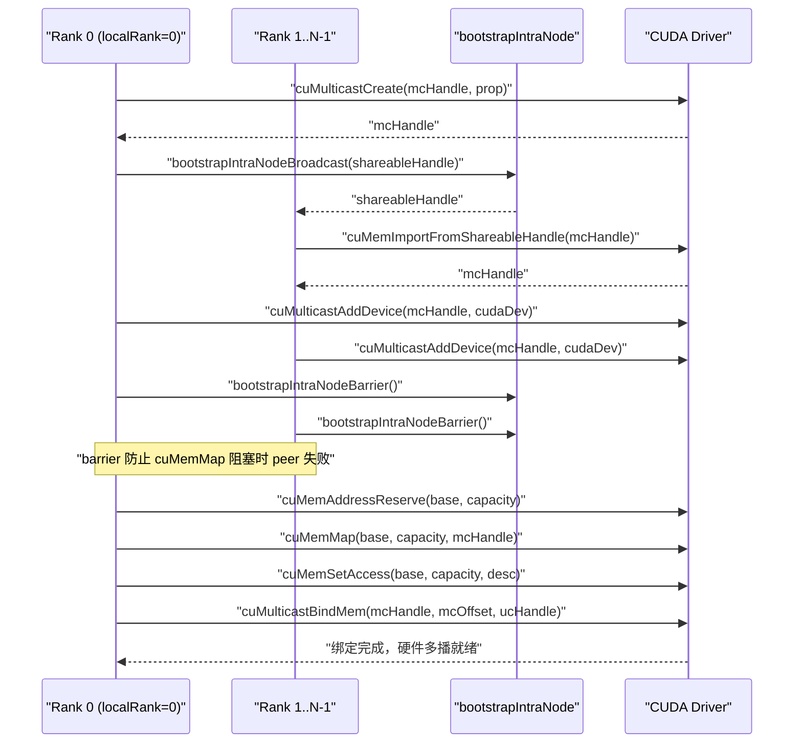
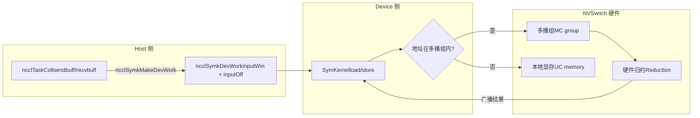

# Capítulo 14: Memoria simétrica y NVLS: aceleración por multidifusión y direccionamiento directo en el dispositivo LSA

En el capítulo anterior seguimos un AllReduce entre máquinas y vimos cómo los datos van desde la memoria de la GPU a través de la tarjeta de red hasta la GPU remota; esa ruta resuelve la comunicación entre máquinas. Pero en los clústeres de IA modernos, el volumen de comunicación entre GPUs dentro de una misma máquina o incluso dentro de un mismo dominio NVLink también es enorme: la sincronización de gradientes en el entrenamiento con paralelismo de datos y el intercambio de valores de activación en el paralelismo de tensores ocurren en su gran mayoría dentro de la máquina. Si la comunicación intra-máquina siguiera el flujo entre máquinas GPU→memoria→tarjeta de red→tarjeta de red remota→memoria→GPU, sería como enviar un paquete dentro de la misma ciudad por vía aérea, desperdiciando latencia sin necesidad. Este capítulo desglosa precisamente las dos herramientas que NCCL prepara para la comunicación intra-máquina: la memoria simétrica y NVLS. La primera permite que cada rank acceda a los búferes de todos los ranks usando el mismo conjunto de direcciones virtuales; la segunda aprovecha la capacidad de multidifusión del hardware NVSwitch para hacer reducciones. Combinadas, pueden reducir la latencia de la comunicación colectiva de mensajes pequeños hasta acercarla al límite del hardware.

# 14.1 Memoria simétrica: hacer que "fila 3, asiento 5" apunte al mismo lugar en la casa de todos

## Modelo intuitivo

Imagina que una clase quiere intercambiar cuadernos de tareas. El método tradicional es: cada uno numera sus cuadernos y luego grita "Zhang San, te doy mi cuaderno número 5; Li Si, te doy mi cuaderno número 8"; cada uno tiene que recordar "de quién es el cuaderno que está dónde y qué número tiene". Esto es la comunicación normal: las direcciones son**relativas y privadas**, y para acceder a los datos del otro extremo primero hay que conocer el mapeo de direcciones del otro extremo.

La memoria simétrica cambia el enfoque: toda la clase acuerda que la coordenada "fila 3, asiento 5" apunta a la misma ubicación física en la casa de cada uno. Así, si Zhang San quiere tomar el cuaderno número 5 de Li Si, basta con decir "casa de Li Si, fila 3, asiento 5", sin necesidad de ninguna traducción de direcciones. Este es el núcleo de la memoria simétrica:**el búfer de cada rank se mapea a la misma dirección virtual en el espacio de direcciones de todos los ranks**。

> **[Design Inference & Architectural Trade-offs]**
> ¿Qué catástrofe enfrentaría la comunicación colectiva intra-máquina sin memoria simétrica? Cada vez que un rank accede al búfer del otro extremo, tendría que pasar por una "traducción de direcciones": consultar la tabla, calcular el desplazamiento y posiblemente confirmar la relación de mapeo mediante comunicación entre procesos. Para mensajes pequeños (unos pocos KB), el coste de esta traducción podría ser mayor que la propia transmisión de los datos. La memoria simétrica elimina por completo este coste, y esta es precisamente la razón fundamental por la que "reduce significativamente la latencia de los mensajes pequeños".

## Estructuras de datos y diseño de memoria

El tipo de registro de la memoria simétrica se describe mediante`ncclSymRegType_t`, y`ncclGetSymRegType`según si las ventanas de send/recv llevan el indicador`NCCL_WIN_COLL_SYMMETRIC`, divide el estado de registro en cuatro categorías.

[FACT:src/sym_kernels.cc:395-412]

```c
ncclResult_t ncclGetSymRegType(struct ncclDevrWindow* sendWin, struct ncclDevrWindow* recvWin,
                               ncclSymRegType_t* winRegType) {
  bool isSendSymmReg = false;
  bool isRecvSymmReg = false;
  if (sendWin && (sendWin->winFlags & NCCL_WIN_COLL_SYMMETRIC)) isSendSymmReg = true;
  if (recvWin && (recvWin->winFlags & NCCL_WIN_COLL_SYMMETRIC)) isRecvSymmReg = true;
  // determine the registration type
  if (!isSendSymmReg && !isRecvSymmReg) {
    *winRegType = ncclSymSendNonregRecvNonreg;
  } else if (isSendSymmReg && !isRecvSymmReg) {
    *winRegType = ncclSymSendRegRecvNonreg;
  } else if (!isSendSymmReg && isRecvSymmReg) {
    *winRegType = ncclSymSendNonregRecvReg;
  } else if (isSendSymmReg && is isRecvSymmReg) {
    *winRegType = ncclSymSendRegRecvReg;
  }
  return ncclSuccess;
}
```

Estos cuatro estados determinan por qué ruta pasa el kernel posterior: el registro totalmente simétrico (`SendRegRecvReg`) toma la ruta LSA más rápida, el totalmente no registrado (`SendNonregRecvNonreg`) toma la ruta normal, y los estados mixtos requieren un tratamiento especial.`winFlags`dentro de`NCCL_WIN_COLL_SYMMETRIC`el bit

es la marca de "si esta ventana ya ha sido registrada de forma simétrica".`ncclSymkInitOnce`La entrada de inicialización de la memoria simétrica es`hasLsaMultimem`）。

[FACT:src/sym_kernels.cc:185-196]

```c
ncclResult_t ncclSymkInitOnce(struct ncclComm* comm) {
  // ncclTeamLsa() below calls this internally but drops the error code so we do it here.
  NCCLCHECK(ncclDevrInitOnce(comm));

  struct ncclSymkState* symk = &comm->symkState;
  if (!symk->initialized) {
    symk->initialized = true;
    struct ncclDevCommRequirements reqs = NCCL_DEV_COMM_REQUIREMENTS_INITIALIZER;
    // Disable LSA multicast for cross-clique since NVLS isn't available across cliques
    symk->hasLsaMultimem =
      ncclNvlsSymmetricMultimemEnabled(comm) && ncclTeamLsa(comm).nRanks > 2 && !comm->p2pCrossClique;
    reqs.lsaMultimem = symk->hasLsaMultimem;
```

`hasLsaMultimem`Tres condiciones son indispensables: la multidifusión simétrica de NVLS está habilitada, el número de ranks del equipo LSA es mayor que 2 (dos ranks son más rápidos directamente punto a punto, sin necesidad de multidifusión), y no cruza el clique (cuando cruza el clique, la multidifusión de NVSwitch no está disponible). Esta determinación decide directamente si`reqs.lsaMultimem`se activa, lo que a su vez afecta la asignación de recursos del comunicador en el lado del dispositivo.

## Recorrido paso a paso guiado por escenarios

Supongamos que iniciamos un AllReduce, tamaño de mensaje 4KB, 8 ranks dentro del mismo dominio NVLink.`ncclSymkMask`determinará qué kernels están disponibles.

[FACT:src/sym_kernels.cc:304-352]

```c
uint32_t ncclSymkMask(struct ncclComm* comm, ncclFunc_t coll, int /*ncclDevRedOp_t*/ red, ncclDataType_t ty,
                      size_t nElts, bool symAligned16B) {
  uint32_t kmask = kernelMask_coll(coll);

  bool hasSTMC = comm->symkState.hasLsaMultimem;
  bool hasLDMC = false;
  if (comm->symkState.hasLsaMultimem) {
    switch (ty) {
    case ncclInt32:
    ...
      hasLDMC = red == ncclDevSum || red == ncclDevMinMax || red == ncclDevSumPostDiv;
      break;
    ...
    }
  }
  if (!hasSTMC) kmask &= ~kernelMask_STMC;
  if (!hasLDMC) kmask &= ~kernelMask_LDMC;
```

Primer paso:`kernelMask_coll`según el tipo de colectivo (AllReduce) se obtiene el conjunto de kernels candidatos`kernelMask_AR`. Segundo paso: verificar`hasLsaMultimem`, si soporta multidifusión, entonces se determina además si el tipo de dato y la operación de reducción soportan LDMC (Load-Multicast). Tercer paso: usar una máscara de bits para eliminar las características no soportadas——`kmask &= ~kernelMask_STMC`se eliminan todos los kernels que no soportan STMC.

Luego están los límites de tamaño:

[FACT:src/sym_kernels.cc:336-342]

```c
  size_t nBytes = alignUp(nElts * ncclTypeSize(ty), NCCL_SYM_KERNEL_CELL_SIZE);
  size_t nBusBytes = (coll == ncclFuncAllReduce ? 1 : comm->nRanks) * nBytes;
  // LL kernels use 32-bit ints to track element counts and indices.
  if (nBusBytes >= (size_t(2) = 32 * (size_t(2) nRanks;
  kmask &= needGin ? kernelMask_Gin : ~kernelMask_Gin;
  return kmask;
```

TMA requiere que la capacidad de SMEM cumpla con el estándar (`ncclSymkTmaAvailable`verifica`maxSharedMemOptin`) y alineación de 16 bytes. GIN solo se necesita cuando "el número de ranks del equipo LSA es menor que el número total de ranks"——es decir, GIN solo tiene sentido cuando el dominio de comunicación cruza el límite de LSA (necesita ir por la red). Si todo el dominio de comunicación está dentro de LSA, los kernels GIN se eliminan.

## Control de concurrencia e interacción con el hardware

La resolución de direcciones de la memoria simétrica finalmente recae en el lado del dispositivo.`ncclSymkMakeDevWork`traduce la descripción de tareas del lado host en elementos de trabajo legibles por el lado del dispositivo.

[FACT:src/sym_kernels.cc:380-393]

```c
ncclResult_t ncclSymkMakeDevWork(struct ncclComm* comm, struct ncclTaskColl* task, struct ncclSymkDevWork* outDevWork) {
  outDevWork->rootRank = task->root;
  outDevWork->redOpArg = task->opDev.scalarArg;
  outDevWork->nElts = task->count;
  outDevWork->inputWin = task->sendWin ? task->sendWin->vidmem : nullptr;
  outDevWork->inputOff =
    task->sendWin ? (uint8_t*)task->sendbuff - (uint8_t*)task->sendWin->userPtr : (size_t)task->sendbuff;
  outDevWork->outputWin = task->recvWin ? task->recvWin->vidmem : nullptr;
  outDevWork->outputOff =
    task->recvWin ? (uint8_t*)task->recvbuff - (uint8_t*)task->recvWin->userPtr : (size_t)task->recvbuff;
  outDevWork->sChannelId = 0xffff;
  outDevWork->nChannels = 0;
  return ncclSuccess;
}
```

Nota`inputOff`el cálculo de: si sendWin existe (ventana de registro simétrico), el desplazamiento es`sendbuff - sendWin->userPtr`——esto es**desplazamiento dentro de la ventana**, el lado del dispositivo obtiene`inputWin`(dirección base de la ventana) más`inputOff`puede calcular la dirección real. Si sendWin no existe, el desplazamiento es directamente la dirección absoluta de`sendbuff`. Este diseño permite que los kernels del lado del dispositivo usen la misma lógica para manejar buffers registrados y no registrados.

`ncclSymkInitOnce`también inicializa los requisitos de recursos relacionados con GIN, incluyendo inbox, outbox, buffer de acumulación y rail signal.

[FACT:src/sym_kernels.cc:208-251]

```c
    struct ncclDevResourceRequirements ginInboxRailReq = {};
    struct ncclDevResourceRequirements ginOutboxReq = {};
    struct ncclDevResourceRequirements rsGinAccumReq = {};
    struct ncclDevResourceRequirements railSignalReq = {};
    if (ncclParamSymGinKernelsEnable() && ncclTeamLsa(comm).nRanks nRanks) {
      int maxBlocks;
      size_t bufSize;
      getRequirements_gin(comm, &maxBlocks, &bufSize);

      maxBlocks = std::max(maxBlocks, comm->config.minCTAs);
      maxBlocks = std::min(maxBlocks, comm->config.maxCTAs);
      if (ncclParamSymCTAs() >= 1) maxBlocks = ncclParamSymCTAs();
      maxBlocks = std::min(maxBlocks, ncclSymkMaxBlocks);
      symk->maxGinInboxBlocks = maxBlocks;
      symk->kcomm.rsGinAccumBytesPerBlock = ncclSymkRsGinAccumBytesPerBlock();

      rsGinAccumReq.bufferSize = (size_t)maxBlocks * symk->kcomm.rsGinAccumBytesPerBlock;
      rsGinAccumReq.bufferAlign = 128;
      rsGinAccumReq.outBufferHandle = &symk->kcomm.rsGinAccumBuf;
      ...
      uint32_t railSignalCount = ncclTeamRail(comm).nRanks * ncclSymkMaxBlocks;
      ...
      reqs.barrierCount = ncclSymkMaxBlocks;
      reqs.ginConnectionType = NCCL_GIN_CONNECTION_RAIL;
      reqs.ginStrongSignalsRequired = true;
      reqs.ginVaSignalsRequired = true;
    }
```

`getRequirements_gin`usa el modelo de ajuste para calcular el número de bloques y el tamaño del buffer necesarios, luego se ajusta al rango de`[minCTAs, maxCTAs]`.`rsGinAccumBytesPerBlock`es el tamaño del buffer de acumulación por bloque, alineado a 128 bytes——este es el tamaño de línea de caché, para evitar el falso compartimiento.

```mermaid
flowchart TD
    start["ncclSymkMask(comm, coll, red, ty, nElts)"] --> coll{"集合类型?"}
    coll -->|AllGather| mask_ag["kmask = kernelMask_AG"]
    coll -->|AllReduce| mask_ar["kmask = kernelMask_AR"]
    coll -->|ReduceScatter| mask_rs["kmask = kernelMask_RS"]
    mask_ag --> check_stmc{"hasLsaMultimem?"}
    mask_ar --> check_stmc
    mask_rs --> check_stmc
    check_stmc -->|否| clear_stmc["kmask &= ~kernelMask_STMC"]
    check_stmc -->|是| check_ldmc{"数据类型+归约支持LDMC?"}
    clear_stmc --> size_check
    check_ldmc -->|否| clear_ldmc["kmask &= ~kernelMask_LDMC"]
    check_ldmc -->|是| size_check
    clear_ldmc --> size_check
    size_check{"nBusBytes >= 2GB?"} -->|是| clear_ll["kmask &= ~kernelMask_LL"]
    size_check -->|否| tma_check
    clear_ll --> tma_check{"TMA可用且16B对齐?"}
    tma_check -->|否| clear_tma["kmask &= ~kernelMask_Tma"]
    tma_check -->|是| gin_check
    clear_tma --> gin_check{"需要GIN? LSA rank |否| clear_gin["kmask &= ~kernelMask_Gin"]
    gin_check -->|是| done
    clear_gin --> done["返回 kmask"]
```

Esta figura describe completamente la cadena de decisión de`ncclSymkMask`: partiendo del tipo de colectivo, pasa sucesivamente por cinco filtros: soporte de multidifusión, tipo de dato, límite de tamaño, disponibilidad de TMA y requisito de GIN, finalmente devuelve una máscara de bits. Cada filtro puede eliminar un lote de kernels, lo que refleja el "seleccionar el kernel óptimo según el escenario" de NCCL.

## Guía de prevención de errores en producción

**Error 1: la multidifusión falla silenciosamente al cruzar el clique.** `hasLsaMultimem`La tercera condición de`!comm->p2pCrossClique`es`ncclNvlsSymmetricMultimemEnabled`. Si tu clúster está configurado con MNNVL (Multi-Node NVLink), pero algunos ranks cruzan el clique, la multidifusión se deshabilita y el rendimiento se degrada silenciosamente a la ruta normal. Al investigar, revisa la salida de registro de

**Error 2: requisito implícito de alineación de 16 bytes.** `ncclSymkMask`En`if (!symAligned16B) kmask &= ~kernelMask_Tma;`——si el buffer del usuario no está alineado a 16 bytes, el kernel TMA se elimina. TMA es el motor de copia más rápido en Hopper/Blackwell, perderlo significa una disminución del rendimiento. En entornos de producción, el buffer pasado por el usuario a menudo proviene de`cudaMalloc`, que está alineado de forma natural; pero si proviene de un allocator personalizado o de un slice, se puede caer en la trampa.

**Error 3: el límite de 2GB.**Los kernels LL usan índices de 32 bits, y se eliminan cuando el número de bytes del bus supera los 2GB. Para el entrenamiento de modelos grandes, el gradiente de un solo AllReduce puede superar este valor, en cuyo caso NCCL cambiará automáticamente al protocolo STMC o Simple. Esto no es un bug, pero si especificaste manualmente el protocolo LL, obtendrás`ncclInvalidArgument`。

---

# 14.2 NVLS: deja que el hardware de NVSwitch haga la reducción por ti

## Modelo intuitivo

El AllReduce tradicional es "reducción por software": cada GPU envía datos a sus vecinos, los vecinos hacen la suma y luego reenvían——los datos se transportan de ida y vuelta entre las GPUs, y la suma se ejecuta en los SM. Esto es como 8 personas pasándose papelitos para calcular el total, cada una tiene que leer, sumar y volver a pasar.

NVLS cambió el enfoque: el chip NVSwitch tiene incorporadas capacidades de**multidifusión (multicast) y reducción (reduction)**. Escribes los datos en la dirección de multidifusión, NVSwitch los difunde automáticamente a todos los miembros y realiza la suma en el hardware. Es como si 8 personas escribieran números en la misma pizarra y la pizarra mostrara automáticamente la suma total: la GPU solo escribe una vez y lee una vez, y todo el transporte y la suma intermedios los realiza el hardware del conmutador.

Sin NVLS, el ancho de banda de AllReduce dentro del nodo estaría limitado por los enlaces punto a punto entre GPUs, y los SM tendrían que dedicar una gran cantidad de ciclos a hacer sumas. NVLS descarga ambas tareas al hardware, y los SM pueden dedicarse a otros cálculos.

## Estructura de datos y diseño de memoria

El núcleo de NVLS es**grupo de multidifusión (MC group)**。`ncclMcGroup`La estructura describe todo el estado de un grupo de multidifusión.

[FACT:src/transport/multicast.cc:72-77]

```c
struct ncclMcGroup {
  CUmemGenericAllocationHandle handle;  // the MC object
  char* base;                          // mapped MC VA base
  size_t capacity;                      // total mapped VA size
  int dev;                           // local device, for unbind
};
```

Cuatro campos:`handle`es el handle del objeto de multidifusión de CUDA,`base`es la dirección base de la dirección virtual de multidifusión,`capacity`es el tamaño total del mapeo,`dev`es el número de dispositivo local (usado para desvincular). Ten en cuenta que aquí no hay bloqueo: la creación y destrucción del grupo de multidifusión ocurren en las fases de inicialización/destrucción, no en la ruta crítica.

El grupo de multidifusión se divide en múltiples**particiones (partition)**, y cada partición es un segmento inmutable.`ncclMcPartition`describe una partición.

[FACT:src/transport/multicast.cc:162-170]

```c
  // A partition is self-sufficient for binds: it carries the group's handle, device and
  // bind granularity alongside its own extent.
  for (int i = 0; i base + outPartitions[i].offset;
    outPartitions[i].mcHandle = mcHandle;
    outPartitions[i].minGranularity = minGran;
    outPartitions[i].dev = comm->cudaDev;
  }
```

Cada partición lleva su propio`offset`、`size`、`ptr`, así como el`mcHandle`、`minGranularity`、`dev`del grupo al que pertenece. Este diseño "autosuficiente" permite que las particiones se pasen de forma independiente a las funciones de vinculación, sin necesidad de consultar de nuevo la información del grupo.

## Recorrido paso a paso guiado por escenarios

Supongamos que 8 ranks quieren establecer un dominio NVLS.`ncclMcGroupBuildPartitions`se encarga de crear el grupo de multidifusión y dividir las particiones.

[FACT:src/transport/multicast.cc:79-121]

```c
ncclResult_t ncclMcGroupBuildPartitions(struct ncclComm* comm, const struct ncclMcRequest* requests, int nRequests,
                                        struct ncclMcGroup** outGroup, struct ncclMcPartition* outPartitions) {
  ...
  mcprop.numDevices = comm->localRanks;
  mcprop.handleTypes = ncclCuMemHandleType;
  mcprop.flags = 0;
  mcprop.size = 0;
  for (int i = 0; i  recGran ? requests[i].alignment : recGran;
    ALIGN_SIZE(capacity, align);
    size_t slice = requests[i].size;
    ALIGN_SIZE(slice, recGran);
    outPartitions[i].offset = capacity;
    outPartitions[i].size = slice;
    capacity += slice;
  }
```

Primer paso: acumular los tamaños de todas las solicitudes para obtener el tamaño total del grupo de multidifusión. Segundo paso: consultar la granularidad recomendada y la granularidad mínima de CUDA; esta es una restricción de hardware, y la dirección y el tamaño del objeto de multidifusión deben ser múltiplos enteros de la granularidad. Tercer paso: asignación bump: cada solicitud recibe un bloque, y tanto el desplazamiento como el tamaño se alinean a la granularidad recomendada.`ALIGN_SIZE(capacity, align)`garantiza que el desplazamiento inicial de cada segmento sea un desplazamiento de vinculación válido.

A continuación, la creación e importación entre ranks:

[FACT:src/transport/multicast.cc:125-146]

```c
  if (comm->localRank == 0) {
    NCCLCHECKGOTO(ncclMcCreate(comm, &mcprop, comm->localRank, comm->localRanks, &mcHandle, shareableHandle), ret,
                  fail);
    mcCreated = 1;
    NCCLCHECKGOTO(bootstrapIntraNodeBroadcast(comm->bootstrap, comm->localRankToRank, comm->localRank, comm->localRanks,
                                              0, shareableHandle, NVLS_HANDLE_SIZE),
                  ret, fail);
  } else {
    NCCLCHECKGOTO(bootstrapIntraNodeBroadcast(comm->bootstrap, comm->localRankToRank, comm->localRank, comm->localRanks,
                                              0, shareableHandle, NVLS_HANDLE_SIZE),
                  ret, fail);
    NCCLCHECKGOTO(ncclMcImport(comm, shareableHandle, comm->localRankToRank[0], &mcHandle), ret, fail);
    mcCreated = 1;
  }
  CUCHECKGOTO(cuMulticastAddDevice(mcHandle, comm->cudaDev), ret, fail);

  // cuMemMap of an MC object blocks until every device has been added. This
  // abort-aware barrier makes a peer failing before cuMulticastAddDevice trip the
  // abort flag here instead of stranding survivors in the blocking cuMemMap.
  NCCLCHECKGOTO(bootstrapIntraNodeBarrier(comm->bootstrap, comm->localRankToRank, comm->localRank, comm->localRanks,
                                          comm->localRankToRank[0]),
                ret, fail);
```

localRank 0 crea el objeto de multidifusión y luego difunde el shareable handle mediante bootstrap; los demás ranks reciben el handle y lo importan.`cuMulticastAddDevice`añade el dispositivo local al grupo de multidifusión. Fíjate en esa barrier; el comentario lo deja muy claro:`cuMemMap`se bloquea hasta que todos los dispositivos se hayan unido; si algún peer falla antes de`cuMulticastAddDevice`, los supervivientes se quedarán atascados en`cuMemMap`. Esta barrier hace que el fallo sea capturado por el flag de abort antes del bloqueo.

Por último, el mapeo y la configuración de permisos de acceso:

[FACT:src/transport/multicast.cc:148-155]

```c
  // Reserve and map the whole MC VA once; each consumer slice is a view into it.
  CUCHECKGOTO(cuMemAddressReserve(&base, capacity, recGran, 0U, 0), ret, fail);
  CUCHECKGOTO(cuMemMap(base, capacity, 0, mcHandle, 0), ret, fail);
  mapped = 1;
  desc.flags = CU_MEM_ACCESS_FLAGS_PROT_READWRITE;
  desc.location.type = CU_MEM_LOCATION_TYPE_DEVICE;
  desc.location.id = comm->cudaDev;
  CUCHECKGOTO(cuMemSetAccess(base, capacity, &desc, 1), ret, fail);
```

Toda la VA de multidifusión se reserva y mapea una sola vez, y cada segmento de consumidor es una vista de esta VA. Este es el diseño de "mapear una vez, segmentar muchas veces": ahorra recursos en comparación con crear un objeto de multidifusión por separado para cada consumidor.

## Control de concurrencia e interacción con el hardware

La vinculación es la operación más crítica de NVLS.`ncclMcPartitionBindMem`vincula un handle de memoria UC (unidifusión) a un desplazamiento del grupo de multidifusión.

[FACT:src/transport/multicast.cc:200-225]

```c
ncclResult_t ncclMcPartitionBindMem(const struct ncclMcPartition* partition, size_t offsetInPartition,
                                    CUmemGenericAllocationHandle mem, size_t memOffset, size_t bindSize) {
  // A bind overrunning its partition would corrupt the next consumer's partition; fail
  // cleanly instead (possible when UC rounding exceeds the MC-rounded partition).
  if (offsetInPartition + bindSize > partition->size) {
    WARN("NVLS MC bind of size %zu at slice offset %zu exceeds slice size %zu (UC/MC granularity mismatch)", bindSize,
         offsetInPartition, partition->size);
    return ncclInternalError;
  }
  size_t mcOffset = partition->offset + offsetInPartition;
  ...
  CUresult err = CUPFN(cuMulticastBindMem(partition->mcHandle, mcOffset, mem, memOffset, bindSize, 0 /*flags*/));
  if (err != CUDA_SUCCESS) {
    ...
    WARN("Failed to bind NVLink SHARP (NVLS) Multicast memory of size %zu at MC group %llx offset %zu : CUDA error %d "
         "'%s'.\nThis is usually caused by a system or configuration error in the Fabric Manager or NVSwitches.\n"
         "Disable NVLS (NCCL_NVLS_ENABLE=0) if you wish to avoid this error in the future.",
         bindSize, partition->mcHandle, mcOffset, err, errStr);
    return ncclUnhandledCudaError;
  }
  return ncclSuccess;
}
```

La primera línea de defensa es la comprobación de límites:`offsetInPartition + bindSize > partition->size`y se reporta un error. El comentario explica el motivo: la granularidad de la memoria UC puede ser mayor que la de la partición MC, y si la UC, tras alinearse, se sale del límite de la partición MC, pisará la partición del siguiente consumidor. Esta es la típica trampa de "dos granularidades que no coinciden".

`cuMulticastBindMem`es una llamada de hardware, y el comentario dice que "blocks until all ranks have been added to the group": este es el punto donde NVLS falla con más facilidad. Si Fabric Manager está mal configurado o el firmware de NVSwitch tiene problemas, aquí se colgará o devolverá un error. El mensaje de error sugiere directamente al usuario`NCCL_NVLS_ENABLE=0`, que es la salida de emergencia estándar en entornos de producción.

También hay una variante de "intento de vinculación", usada para el registro de búferes de usuario:

[FACT:src/transport/multicast.cc:237-268]

```c
ncclResult_t ncclMcPartitionTryBindAddr(const struct ncclMcPartition* partition, size_t offsetInPartition,
                                        CUdeviceptr address, size_t bindSize, enum ncclMcBindStatus* outStatus) {
  const char* errStr = NULL;

  *outStatus = ncclMcBindStatusTransient;
  if (offsetInPartition + bindSize > partition->size) {
    ...
    return ncclInternalError;
  }
  size_t mcOffset = partition->offset + offsetInPartition;
  CUresult err = CUPFN(cuMulticastBindAddr(partition->mcHandle, mcOffset, address, bindSize, 0 /*flags*/));
  if (err == CUDA_SUCCESS) {
    *outStatus = ncclMcBindStatusOk;
    return ncclSuccess;
  }

  (void)pfn_cuGetErrorString(err, &errStr);
  // Only an outright rejection of the input is a property of the buffer. Anything else,
  // notably OUT_OF_MEMORY, may succeed later, so it must not be reported as permanent.
  if (err == CUDA_ERROR_INVALID_VALUE || err == CUDA_ERROR_NOT_SUPPORTED || err == CUDA_ERROR_NOT_PERMITTED) {
    *outStatus = ncclMcBindStatusNoSupport;
    ...
  } else {
    WARN("NVLS Multicast bind of size %zu at MC group %llx offset %zu dev %d failed transiently: CUDA error %d '%s'.\n"
         "The buffer is left unregistered for this operation and will be retried; repeated occurrences indicate "
         "sustained resource pressure.",
         bindSize, partition->mcHandle, mcOffset, partition->dev, err, errStr);
  }
  return ncclSuccess;
}
```

Aquí hay una clasificación de errores muy ingeniosa:`CUDA_ERROR_INVALID_VALUE`、`NOT_SUPPORTED`、`NOT_PERMITTED`se clasifica como`ncclMcBindStatusNoSupport`: esto es**fallo permanente**, lo que indica que este buffer en sí no admite vinculación de multidifusión. Y otros errores (especialmente`OUT_OF_MEMORY`) se clasifican como`ncclMcBindStatusTransient`: esto es**fallo temporal**, y se puede reintentar. Esta distinción es crucial: si se trata OOM como fallo permanente, se abandonará por error un registro que podría haber tenido éxito; si se trata un error de parámetros como fallo temporal, se reintentará infinitamente.

## Guía para evitar problemas en producción

**Problema 1: una configuración incorrecta de Fabric Manager provoca que`cuMulticastBindMem`se cuelgue.**Este es el fallo de producción más clásico de NVLS. El mensaje de error apunta claramente a Fabric Manager o NVSwitch. Pasos de diagnóstico: primero`NCCL_NVLS_ENABLE=0`confirma que el problema desaparece, y luego revisa los logs de Fabric Manager y la versión del firmware de NVSwitch.

**Problema 2: falta de coincidencia de granularidad UC/MC.** `ncclMcPartitionBindMem`La comprobación de límites de

**captura este problema, pero si ves la advertencia "UC/MC granularity mismatch", significa que el tamaño UC de alguna solicitud, tras alinearse, se sale de la partición MC. Esto suele ocurrir cuando el tamaño de la solicitud está cerca del límite de granularidad.** `ncclMcGroupBuildPartitions`Problema 3: fuga de recursos tras un fallo en la creación del grupo de multidifusión.`CUCALL`La ruta de fallo de`CUCHECK`：

[FACT:src/transport/multicast.cc:179-184]

```c
fail:
  // Best-effort (CUCALL) so a failing cleanup op cannot skip releasing the MC handle.
  if (mapped) CUCALL(cuMemUnmap(base, capacity));
  if (base) CUCALL(cuMemAddressFree(base, capacity));
  if (mcCreated) CUCALL(cuMemRelease(mcHandle));
  return ret;
```

El comentario explica la razón: si la operación de cleanup falla por sí misma, no se puede omitir por ello la liberación del MC handle — el slot de MC es un recurso escaso, y una fuga provocaría fallos en creaciones posteriores. Este es el diseño típico de "la ruta de limpieza debe hacer todo lo posible".



Este diagrama de secuencia describe el flujo completo de un grupo multicast desde su creación hasta su vinculación. El punto clave es esa barrier — desacopla "fallo de peer" y "bloqueo de cuMemMap", evitando que los supervivientes queden bloqueados.

---

# 14.3 La fusión de memoria simétrica y NVLS: cómo se resuelven los punteros LSA en el lado del dispositivo

## Modelo intuitivo

La memoria simétrica resuelve el problema de "coherencia de direcciones", y NVLS resuelve el problema de "reducción por hardware". Pero para que ambos cooperen realmente, se necesita un mecanismo clave:**¿Cómo sabe el lado del dispositivo que una dirección es simétrica y puede tomar la ruta multicast?**

La respuesta está en el puntero LSA (Load-Store Accessible). LSA es la abreviatura de "accesible por load-store", lo que significa que la memoria apuntada por este puntero puede ser accedida directamente por la GPU con instrucciones normales de load/store — sin importar si físicamente está local o remota. Si la dirección cae dentro del grupo multicast, el load/store será interceptado y difundido por el hardware NVSwitch.

## Estructuras de datos y diseño de memoria

`ncclSymkDevWork`Es el descriptor de trabajo del lado del dispositivo, que lleva la información clave de la memoria simétrica.

[FACT:src/sym_kernels.cc:380-393]

```c
ncclResult_t ncclSymkMakeDevWork(struct ncclComm* comm, struct ncclTaskColl* task, struct ncclSymkDevWork* outDevWork) {
  outDevWork->rootRank = task->root;
  outDevWork->redOpArg = task->opDev.scalarArg;
  outDevWork->nElts = task->count;
  outDevWork->inputWin = task->sendWin ? task->sendWin->vidmem : nullptr;
  outDevWork->inputOff =
    task->sendWin ? (uint8_t*)task->sendbuff - (uint8_t*)task->sendWin->userPtr : (size_t)task->sendbuff;
  outDevWork->outputWin = task->recvWin ? task->recvWin->vidmem : nullptr;
  outDevWork->outputOff =
    task->recvWin ? (uint8_t*)task->recvbuff - (uint8_t*)task->recvWin->userPtr : (size_t)task->recvbuff;
  outDevWork->sChannelId = 0xffff;
  outDevWork->nChannels = 0;
  return ncclSuccess;
}
```

`inputWin`Es la dirección virtual del lado del dispositivo de la ventana (`vidmem`），`inputOff`Es el desplazamiento del búfer dentro de la ventana. Una vez que el kernel del lado del dispositivo obtiene estos dos valores, calcula`inputWin + inputOff`y obtiene la dirección real. Si esta dirección cae dentro del grupo multicast, el hardware manejará automáticamente la difusión.

`ncclSymkInitOnce`También se configuran en él la barrier LSA y los recursos LLA2A (Low-Latency All-to-All).

[FACT:src/sym_kernels.cc:197-206]

```c
    reqs.lsaBarrierCount = ncclSymkMaxBlocks;
    reqs.ginStrongSignalsRequired = false;
    reqs.ginVaSignalsRequired = false;

    struct ncclDevResourceRequirements lla2aReq;
    ncclLLA2ACreateRequirement(ncclSymkMaxBlocks,
                               ncclLLA2ACalcSlots(ncclTeamLsa(comm).nRanks * ncclSymkMaxThreads, ncclSymkLLMaxEltSize),
                               &symk->kcomm.lsaLLA2A, &lla2aReq);
    lla2aReq.next = reqs.resourceRequirementsList;
    reqs.resourceRequirementsList = &lla2aReq;
```

`lsaBarrierCount`Se establece en`ncclSymkMaxBlocks`— un slot de barrier por cada block. LLA2A es la abreviatura de all-to-all de baja latencia, usado para intercambio rápido de datos dentro del dominio LSA.`ncclLLA2ACalcSlots`Calcula el número de slots necesarios según el número de ranks, el número de hilos y el tamaño máximo de elemento.

## Recorrido paso a paso guiado por escenarios

Supongamos que un AllReduce usa`AllReduce_AGxLLMC_R`kernel (AllGather + LL + MC + Reduce). El flujo de trabajo de este kernel es:

1. **Fase AllGather**: cada rank escribe sus propios datos en el grupo multicast, y el hardware NVSwitch los difunde a todos los ranks.

2. **Fase Reduce**: cada rank lee los datos de todos los ranks desde el grupo multicast y realiza la reducción localmente.

`ncclSymkMask`Comprobará si este kernel está disponible.`kernelMask_LL`Incluye`AllReduce_AGxLLMC_R`, pero solo si`hasLsaMultimem`es verdadero (de lo contrario`kernelMask_STMC`se elimina, y`AllReduce_AGxLLMC_R`pertenece al conjunto STMC).

Espera, aquí hay un detalle:`kernelMask_STMC`¿Incluye`AllReduce_AGxLLMC_R`? Veamos el código fuente:

[FACT:src/sym_kernels.cc:17-21]

```c
constexpr uint32_t kernelMask_STMC =
  1 nvlsChannels;
    size_t creditSize = nChannels * 2 * memSize * nHeads;
    int nvlsStepSize = comm->nvlsChunkSize;

    NCCLCHECKGOTO(ncclCalloc(&comm->nvlsResources, 1), res, fail);
    comm->nvlsResources->inited = false;
    comm->nvlsResources->refCount = 1;
    comm->nvlsResources->nChannels = nChannels;
    comm->nvlsResources->nHeads = nHeads;
    comm->nvlsResources->chunkSize = comm->nvlsChunkSize;
    comm->nvlsResources->treeMaxChunkSize = comm->nvlsTreeMaxChunkSize;
    resources = comm->nvlsResources;

    for (int c = 0; c accessDesc, 0, sizeof(resources->accessDesc));
    resources->accessDesc.flags = CU_MEM_ACCESS_FLAGS_PROT_READWRITE;
    resources->accessDesc.location.type = CU_MEM_LOCATION_TYPE_DEVICE;
    resources->accessDesc.location.id = comm->cudaDev;
    resources->dev = comm->cudaDev;

    // Build the single shared MC group for this NVLS domain. The data slice is
    // reserved here but bound later by ncclNvlsBufferSetup.
    {
      size_t buffSize = nvlsStepSize * NCCL_STEPS;
      size_t dataSize = nChannels * 2 * buffSize * nHeads;
      size_t ubSize = ncclNvlsUbSize(comm);
      struct ncclMcRequest requests[3] = {{creditSize, 0}, {dataSize, 0}, {ubSize, 0}};
      struct ncclMcPartition partitions[3];
      NCCLCHECKGOTO(ncclMcGroupBuildPartitions(comm, requests, 3, &resources->mcGroup, partitions), res, fail);
      resources->creditPartition = partitions[0];
      resources->dataPartition = partitions[1];
      if (ubSize) {
        resources->ubPartition = partitions[2];
        NCCLCHECKGOTO(ncclMcArenaInit(comm, &resources->ubArena, &resources->ubPartition), res, fail);
        resources->ubEnabled = true;
      }
      NCCLCHECKGOTO(nvlsAllocBindUc(comm, &resources->creditPartition, creditSize, &resources->creditUc), res, fail);
    }
```

El grupo multicast se divide en tres particiones:`creditPartition`(crédito),`dataPartition`(datos),`ubPartition`(búfer de usuario). La partición de credit se usa para sincronización — cada channel tiene punteros head/tail independientes, compartidos a través del grupo multicast.

La inicialización del credit está en el bucle posterior:

[FACT:src/transport/nvls.cc:456-491]

```c
    for (int h = 0; h nRanks + 1 + h;
      for (int c = 0; c channels + c;
        char* mem = NULL;
        struct ncclChannelPeer* peer = channel->peers[nvlsPeer];

        // Reduce UC -> MC
        mem = (char*)resources->creditUc.ptr + (h * 2 * nChannels + c) * memSize;
        peer->send[1].transportComm = &nvlsTransport.send;
        peer->send[1].conn.buffs[NCCL_PROTO_SIMPLE] = NULL;
        peer->send[1].conn.head = (uint64_t*)mem;
        peer->send[1].conn.tail = (uint64_t*)(mem + memSize / 2);
        peer->send[1].conn.stepSize = nvlsStepSize;
        mem = (char*)resources->creditPartition.ptr + (h * 2 * nChannels + c) * memSize;
        peer->recv[0].transportComm = &nvlsTransport.recv;
        peer->recv[0].conn.buffs[NCCL_PROTO_SIMPLE] = NULL;
        peer->recv[0].conn.head = (uint64_t*)mem;
        peer->recv[0].conn.tail = (uint64_t*)(mem + memSize / 2);
        peer->recv[0].conn.stepSize = nvlsStepSize;
        peer->recv[0].conn.flags |= NCCL_NVLS_MIN_POLL;
```

Cada combinación de head y channel tiene una región de credit independiente.`head`y`tail`son punteros de 64 bits,`memSize`es de 64 bytes (`size_t memSize = 64;`), así que head y tail ocupan 32 bytes cada uno — exactamente media línea de caché.`NCCL_NVLS_MIN_POLL`El flag

## permite que el receptor use el modo de sondeo mínimo, reduciendo la sobrecarga de CPU.

**Guía de evitación de trampas en producción**Trampa 1: competencia de head/tail en la partición de credit.`nvlsCTAs`Múltiples channels comparten el mismo grupo multicast, pero cada channel tiene una región de credit independiente. Si el número de channels se configura incorrectamente (por ejemplo,`ncclNvlsChannels`se establece demasiado grande), la región de credit se expandirá, ocupando un valioso espacio de direcciones multicast.

[FACT:src/transport/nvls.cc:100-133]

```c
  if (comm->config.nvlsCTAs != NCCL_CONFIG_UNDEF_INT) {
    channels = comm->config.nvlsCTAs;
  } else if (channels == 0 && comm->compCap >= 100) {
    // Use a reduced number of channels for single node/MNNVL domain on Blackwell and above.
    // comm->nNodes is not yet initialized at this point so we need to use local information.
    bool multiNode = false;
    if (comm->MNNVL) {
      multiNode = (comm->clique.size nRanks);
    } else {
      int i;
      for (i = 1; i nRanks; i++) {
        if (comm->peerInfo[i].hostHash != comm->peerInfo[0].hostHash) break;
      }
      multiNode = (i nRanks);
    }
    if (multiNode) {
      channels = RUBIN_AND_LATER(comm->compCap) ? /*RUBIN=*/64 : /*SM100=*/32;
    } else {
      channels = RUBIN_AND_LATER(comm->compCap) ? /*RUBIN=*/48 : /*SM100=*/24;
    }
  } else if (channels == 0) {
    channels = /*SM90=*/16;
  }
```

Copiar`comm->nNodes`Nota:`peerInfo[i].hostHash`aún no está inicializado en esta etapa, así que el código usa

**para determinar manualmente si es multinodo. Esta es una trampa clásica del orden de inicialización — no puedes depender de un campo que aún no se ha calculado.** [FACT:src/transport/nvls.cc:516-517]

```c
  // MNNVL does not support NVLS buffer registration
  if (!comm->MNNVL && comm->nvlsResources->nvlsShmemHandle == NULL) {
```

Copiar

**Trampa 3: el conteo de referencias de recursos compartidos.** `ncclNvlsSetup`Admite el uso compartido de recursos NVLS entre dominios de comunicación padre e hijo:

[FACT:src/transport/nvls.cc:380-392]

```c
  if (nvlsShare) {
    /* reuse NVLS resources */
    comm->nvlsChannels = std::min(comm->nvlsChannels, parent->nvlsResources->nChannels);
    /* Inherit chunk sizes from the shared resource since we're reusing the parent's
     * NVLS buffers, which were allocated and laid out based on these values. */
    comm->nvlsChunkSize = parent->nvlsResources->chunkSize;
    comm->nvlsTreeMaxChunkSize = parent->nvlsResources->treeMaxChunkSize;
    for (int c = 0; c nvlsChannels; c++) {
      NCCLCHECKGOTO(initNvlsChannel(comm, c, parent, true), res, fail);
    }

    comm->nvlsResources = parent->nvlsResources;
    ncclAtomicRefCountIncrement(&parent->nvlsResources->refCount);
  }
```

El dominio de comunicación hijo reutiliza los recursos del dominio de comunicación padre, incrementando el conteo de referencias en uno.`ncclNvlsFree`Solo cuando el conteo de referencias dentro de  se reduce a cero se libera realmente. Si la gestión del conteo de referencias falla, puede provocar una liberación prematura o una fuga de recursos. Atención`nvlsChunkSize`y`nvlsTreeMaxChunkSize`deben heredar los valores del dominio de comunicación padre, porque el búfer se distribuye según estos valores; modificarlos provocaría errores en el cálculo de direcciones.



Este diagrama de flujo de datos muestra la cadena completa desde las tareas del lado host hasta la ejecución en el lado del dispositivo. La bifurcación clave es`lsa{"地址在多播组内?"}`—si es así, se utiliza la multidifusión y reducción por hardware NVSwitch; si no, se utiliza la memoria local del dispositivo. Esta decisión la realiza automáticamente el hardware según el rango de direcciones, sin necesidad de intervención del software.

---

# 14.4 Reflexión de diseño: por qué la memoria simétrica puede reducir la latencia de mensajes pequeños

Volviendo a la pregunta central del inicio de este capítulo: ¿por qué la memoria simétrica puede reducir significativamente la latencia de mensajes pequeños?

**Primero, elimina la sobrecarga de traducción de direcciones.**En la comunicación tradicional, cada rank que accede al búfer del par debe consultar la tabla y calcular el desplazamiento. La memoria simétrica permite que todos los ranks usen el mismo conjunto de direcciones, y el kernel del lado del dispositivo calcula directamente`base + offset`. Para mensajes pequeños, la sobrecarga de esta traducción representa una proporción muy alta.

**Segundo, elimina el ida y vuelta de mensajes de control.**La comunicación tradicional requiere intercambiar información de control como "en qué búfer tuyo quiero escribir". Con la memoria simétrica, las direcciones están preacordadas y no se necesita negociación en tiempo de ejecución.

**Tercero, hace posible la multidifusión por hardware.**Solo cuando las direcciones son simétricas, NVSwitch puede usar el mismo conjunto de direcciones para la multidifusión. Si la dirección de cada rank es diferente, el hardware no puede saber a dónde difundir.

**Cuarto, reduce la carga de reducción de los SM.**NVLS descarga la suma a NVSwitch, y el SM solo necesita iniciar una escritura y una lectura. Para mensajes pequeños, la sobrecarga de instrucciones del SM es la principal fuente de latencia.

La combinación de estos cuatro factores reduce la latencia de mensajes pequeños de "nivel de microsegundos" a "nivel sub-microsegundo".

> **[Design Inference & Architectural Trade-offs]**
> Desde una perspectiva de ingeniería, el diseño de la memoria simétrica refleja una filosofía central de NCCL:**empujar la complejidad a la fase de inicialización y hacer que la ruta crítica sea lo más simple posible**. La negociación de direcciones, la creación de grupos de multidifusión y la asignación de créditos se completan durante la inicialización, y el kernel en tiempo de ejecución solo necesita realizar el cálculo de direcciones y las operaciones load/store más simples. Este diseño de "inicialización pesada, tiempo de ejecución ligero" es un patrón común en las bibliotecas de comunicación de alto rendimiento.

---

# Resumen del capítulo

Este capítulo desglosó los dos pilares de la comunicación intra-nodo de NCCL:

1. **Memoria simétrica**: mediante`ncclSymkInitOnce`y`ncclSymkMask`se establecen búferes con direcciones consistentes, permitiendo que cada rank acceda a los datos de todos los ranks usando el mismo conjunto de direcciones.`ncclSymkMakeDevWork`traduce las tareas del lado host en elementos de trabajo del lado del dispositivo,`inputWin + inputOff`es la fórmula central de resolución de direcciones.

2. **Multidifusión NVLS**: mediante`ncclMcGroupBuildPartitions`se crea un grupo de multidifusión,`ncclMcPartitionBindMem`vincula la memoria UC al grupo de multidifusión,`cuMulticastBindMem`es la llamada de hardware. El grupo de multidifusión se divide en tres particiones: credit, data y ub, utilizadas respectivamente para sincronización, transferencia de datos y registro de búferes de usuario.

3. **Resolución de punteros LSA**: el lado del dispositivo determina automáticamente según el rango de direcciones si se toma la ruta de multidifusión, sin necesidad de traducción por software.`NCCL_NVLS_MIN_POLL`El indicador optimiza la sobrecarga de sondeo.

4. **Manejo de errores**：`ncclMcPartitionTryBindAddr`distingue entre fallos permanentes y fallos temporales,`ncclMcGroupBuildPartitions`la ruta de fallo de`CUCALL`utiliza

# para garantizar la liberación de recursos.

Reflexión y autoevaluación de este capítulo`ncclMcPartitionBindMem`Q1: Si se elimina la comprobación de límites`if (offsetInPartition + bindSize > partition->size)`dentro de

**, ¿en qué escenarios se desencadenaría un acceso fuera de los límites de memoria? ¿Por qué esta comprobación no puede sustituirse por "UC y MC tienen la misma granularidad"?**Análisis de referencia[FACT:src/transport/multicast.cc:200-208]：
