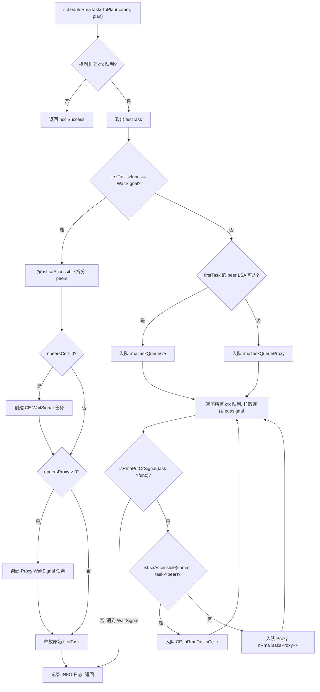
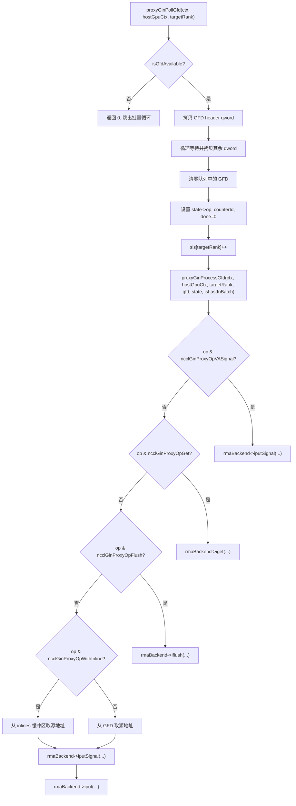

# Capítulo siguiente: Capítulo 15 →

# Progreso del libro: Capítulo 15 / 25

Capítulo 15: RMA y GIN: evolución del acceso remoto a memoria y la comunicación directa GPU

# En el capítulo anterior vimos que la memoria simétrica permite que cada rank acceda a los búferes de todos los ranks usando el mismo conjunto de direcciones, mientras que NVLS lleva la reducción acelerada por hardware al extremo aprovechando la capacidad de multidifusión de NVSwitch. Pero la comunicación colectiva no lo es todo: cuando una aplicación necesita operaciones punto a punto de memoria remota, o desea que el kernel de GPU inicie solicitudes de red directamente, entran en escena RMA y GIN. RMA proporciona acceso remoto a memoria con semántica put/get, y GIN permite que la GPU interactúe directamente con la red eludiendo el hilo proxy del host. Este capítulo, en el orden de "primero RMA, luego GIN", desglosa capa por capa las estructuras de datos, la lógica de programación, el control de concurrencia y las trampas de producción de estos dos mecanismos.

## El modelo de doble canal de RMA: la división de funciones entre CE y Proxy

Imagina un sistema de mensajería internacional: la mensajería local (ranks accesibles por LSA) puede ser entregada directamente por vehículos de reparto locales, mientras que la mensajería interurbana (ranks no accesibles por LSA) debe ser entregada a agentes de carga aérea. El RMA de NCCL es exactamente este modelo: la misma operación put, según si el rank destino está dentro del equipo LSA (Load-Store Accessible), se enruta hacia dos rutas de ejecución completamente diferentes: la ruta CE (Copy Engine, motor de copia) y la ruta Proxy (hilo proxy).

Sin este mecanismo de bifurcación, todas las operaciones RMA irían por el hilo proxy, entonces incluso un put dentro de la misma máquina tendría que pasar por el hilo host como intermediario, añadiendo innecesariamente una latencia de ida y vuelta host-device. Por el contrario, si todas las operaciones fueran por CE, las operaciones entre máquinas no podrían aprovechar la capacidad asíncrona del plugin de red.

## Estructuras de datos y diseño de memoria

La estructura central de planificación de RMA es`ncclRmaArgs`, que registra el resultado de la bifurcación de tareas RMA en un plan. Los campos clave incluyen:

| Campo | Significado |
| --- | --- |
| `func` | Tipo de operación (PutSignal / Signal / WaitSignal) |
| `nRmaTasks` | Número total de tareas |
| `nRmaTasksProxy` | Número de tareas que van por la ruta proxy |
| `nRmaTasksCe` | Número de tareas que van por la ruta CE |

Dentro de cada plan se mantienen dos colas intrusivas:`rmaTaskQueueCe`y`rmaTaskQueueProxy`, que almacenan respectivamente las tareas de las dos rutas.[FACT:src/rma/rma.cc:166-171]

La lógica para determinar si un rank es accesible por LSA es bastante directa: recorrer el`lsaRankList`array haciendo una búsqueda lineal.[FACT:src/rma/rma.cc:34-41]Esta búsqueda se ejecuta una vez por cada peer durante la planificación de tareas, con complejidad O(lsaSize); para equipos LSA típicos de pequeño tamaño (normalmente 2-8 ranks) el coste es despreciable.

## Flujo de planificación paso a paso

Cuando la aplicación invoca una operación RMA put, la tarea entra en`planner->rmaTaskQueues[ctx]`。`scheduleRmaTasksToPlan`, que se encarga de distribuir las tareas de la cola en planes.[FACT:src/rma/rma.cc:141-296]

Primer paso: encontrar la primera cola de contexto no vacía. NCCL soporta múltiples contextos RMA (configurados por`numRmaCtx`), cada contexto tiene su propia cola independiente.[FACT:src/rma/rma.cc:148-155]

Segundo paso: extraer la primera tarea y determinar el tipo de operación. Si es WaitSignal, sigue la lógica especial de división; si es Put/Signal, sigue la lógica de fusión por lotes.[FACT:src/rma/rma.cc:163-168]

Para las tareas WaitSignal, el planificador necesita dividir la lista de peers en dos grupos según la accesibilidad LSA: el grupo CE y el grupo Proxy.[FACT:src/rma/rma.cc:187-204]Tras la división se crean dos nuevas estructuras`ncclTaskRma`, cada una con el array de peers del grupo correspondiente.[FACT:src/rma/rma.cc:207-246]La tarea original se libera.[FACT:src/rma/rma.cc:251]

Para las tareas Put/Signal, la lógica es más compleja: el planificador recorre las colas de todos los contextos y arrastra todas las tareas put/signal consecutivas al mismo plan, deteniéndose solo al encontrar un WaitSignal.[FACT:src/rma/rma.cc:279-295]El propósito de este diseño está claramente indicado en los comentarios: hacer que un solo kernel launch cubra los put/signal de todos los contextos, el proxy puede lanzar todas las solicitudes asíncronas de una vez antes de cualquier operación bloqueante, y la ruta CE envía por lotes las copias y señales de todos los contextos.[FACT:src/rma/rma.cc:270-278]

## Ejecución paralela y sincronización de streams

Una vez completada la planificación,`ncclLaunchRma`según el campo`func`se distribuye a`ncclRmaPut`o`ncclRmaWaitSignal`。[FACT:src/rma/rma.cc:109-131]

Tomando`ncclRmaPut`como ejemplo, cuando en un plan coexisten tareas proxy y CE, ambas rutas deben ejecutarse en paralelo. La estrategia de NCCL es: registrar un event en el stream de entrada, hacer que el stream CE espere a este event, luego lanzar las operaciones simultáneamente en ambos streams, y finalmente registrar otro event en el stream CE, haciendo que el stream de entrada espere por él.[FACT:src/rma/rma.cc:80-96]Esta cadena de events garantiza que: las operaciones CE no comienzan antes de que las dependencias del stream de entrada estén listas, y las operaciones posteriores del stream de entrada tampoco comienzan antes de que CE termine.

Si solo hay tareas proxy o solo tareas CE, se lanza directamente la operación correspondiente en el stream de entrada, sin necesidad de sincronización adicional de streams.[FACT:src/rma/rma.cc:97-101]

## Reflexiones de diseño y trampas en producción

**Trampa uno: la naturaleza estática de la determinación de accesibilidad LSA.** `isLsaAccessible`En el momento de la planificación se consulta`comm->devrState.lsaRankList`, esta lista no cambia tras la inicialización del dominio de comunicación. Si durante la ejecución la topología cambia (por ejemplo, degradación por fallo de NVLink), la lista LSA no se actualiza automáticamente, lo que puede provocar que operaciones que deberían ir por proxy sigan yendo por la ruta CE, desencadenando errores irrecuperables.

**Trampa dos: la garantía FIFO de la fusión por lotes.**La lógica de fusión por lotes solo arrastra tareas put/signal consecutivas, deteniéndose al encontrar un WaitSignal.[FACT:src/rma/rma.cc:283]Esto garantiza el orden FIFO dentro de cada contexto, pero las tareas entre contextos pueden fusionarse en el mismo plan. Si la aplicación depende del orden de operaciones entre contextos, debe usar explícitamente WaitSignal para establecer una barrera.

**Trampa tres: rutas de fuga de memoria.**En la rama WaitSignal, si`npeersProxy == 0`, el código libera`peersProxy`、`nsignalsProxy`、`signalIdxsProxy`tres arrays.[FACT:src/rma/rma.cc:239-244]Pero si`npeersCe == 0`y`npeersProxy > 0`，`peersCe`y otros arrays se asignaron mediante`ncclMemoryStackAlloc`, no es necesario liberarlos manualmente (el asignador de pila los recupera de forma unificada).[FACT:src/rma/rma.cc:176-178]Esta asimetría puede confundir fácilmente al lector, pero en realidad es correcta: la memoria asignada en la pila es gestionada de forma unificada por`comm->memScoped`.

# Contexto de RMA Proxy: señales, colas y búfer circular sin bloqueo

## Modelo intuitivo

El contexto de Proxy es como un "centro de clasificación de correos": la GPU coloca los paquetes que se van a enviar (solicitudes put) en la bandeja de entrada (búfer circular), el hilo proxy saca los paquetes de la bandeja de entrada y los entrega a la empresa de mensajería (plugin de red), y la empresa de mensajería, tras la entrega, sella el acuse de recibo (señal). Durante todo el proceso, la GPU y el hilo proxy se comunican mediante estructuras de datos sin bloqueo, evitando costosas contiendas de bloqueos.

## Estructuras de datos y diseño de memoria

`ncclRmaProxyCtx`Es la estructura anfitriona del contexto de proxy, cuyos campos principales incluyen:

**Zona de señales (signalsDev)**: un bloque de memoria asignado en la GPU, de tamaño`nRanks * numRmaSig * sizeof(uint64_t)`。[FACT:src/rma/rma_proxy.cc:120-123]Cada rank tiene`numRmaSig`ranuras de señal, utilizadas para recibir señales de ese rank. Cuando este bloque de memoria se registra en el plugin de red, lleva las banderas`NCCL_NET_MR_FLAG_FORCE_SO`(orden fuerte forzado) y`NCCL_NET_MR_FLAG_SIGNAL_NEVER_RESET`(la señal nunca se restablece).[FACT:src/rma/rma_proxy.cc:125-127]La bandera de orden fuerte garantiza la relación de orden entre put y signal: si put se emite antes que signal, la red debe garantizar que signal se escriba solo después de que lleguen los datos de put.

**Zona de números de secuencia (opSeqs/readySeqs/doneSeqs)**: un grupo por rank, asignado mediante`allocMemCPUAccessible`, puede ser memoria GDR (GPU Direct RDMA) o memoria host normal.[FACT:src/rma/rma_proxy.cc:132-137]Estos tres números de secuencia rastrean respectivamente: el número de operación enviado, el número de operación listo y el número de operación completado.

**Búfer circular sin bloqueo (circularBuffers)**: un arreglo de punteros de tamaño`nRanks * queueSize`, con una cola circular independiente por rank.[FACT:src/rma/rma_proxy.cc:163-164]Los arreglos complementarios`pis`(Producer Index) y`cis`(Consumer Index) tienen cada uno`nRanks`elementos.[FACT:src/rma/rma_proxy.cc:165-166]El tamaño de la cola debe ser una potencia de 2, de modo que el envolvimiento del índice pueda realizarse con la operación AND a nivel de bits`& (queueSize - 1)`en lugar del módulo.[FACT:src/rma/rma_proxy.cc:156-160]

**Cola InProgress**: una lista enlazada intrusiva por peer, que almacena los descriptores ya enviados al plugin de red pero aún no completados.[FACT:src/rma/rma_proxy.cc:170-175]Esta es una cola de consumidor único, a la que solo accede el hilo proxy, por lo que no requiere operaciones atómicas.

## Paso a paso: desde la creación del contexto hasta el avance del progreso

**Creación del contexto**：`ncclRmaProxyCreateContext`Primero se crea el contexto de red mediante el plugin RMA.[FACT:src/rma/rma_proxy.cc:229]Luego se llama a`ncclRmaProxyCtxAlloc`para asignar recursos como señales, números de secuencia, búferes circulares, etc.[FACT:src/rma/rma_proxy.cc:231]A continuación se llama a`ncclRmaProxyCtxAllocGraph`para asignar los recursos necesarios para el modo de captura de grafo: señales accesibles por CPU, búfer de flush, cola persistente.[FACT:src/rma/rma_proxy.cc:232]

El modo de captura de grafo existe porque CUDA Graph requiere que todas las operaciones sean reproducibles. En modo normal, las señales están en memoria de GPU y el proxy las lee mediante GDR; en modo de captura de grafo, las señales están en memoria accesible por CPU y el proxy puede leerlas y escribirlas directamente, evitando la incertidumbre del GDR.[FACT:src/rma/rma_proxy.cc:184-190]

**Hilo de progreso**：`ncclRmaProxyProgressThread`Es el bucle principal del proxy.[FACT:src/rma/rma_proxy.cc:354-389]Decide su comportamiento según`rmaProgress`la palabra de estado:

- `rmaProgress == 1`: modo de avance normal, recorre todos los contextos de proxy y llama a`ncclRmaProxyProgress`。[FACT:src/rma/rma_proxy.cc:361-372]
- `rmaProgress == 2`: modo de pausa, utilizado para la recuperación de recursos. Tras confirmar la pausa, el hilo espera en la variable de condición.[FACT:src/rma/rma_proxy.cc:373-378]
- `rmaProgress == -1`: señal de salida, el hilo retorna.[FACT:src/rma/rma_proxy.cc:379-380]
- `rmaProgress == 0`: espera inactiva.[FACT:src/rma/rma_proxy.cc:381-382]

Si`ncclRmaProxyProgress`devuelve un error, el hilo escribe el código de error en`asyncResult`, establece`rmaProgress = -2`y luego sale.[FACT:src/rma/rma_proxy.cc:365-369]Este código de error será leído por el hilo principal en la llamada posterior a`ncclCommGetAsyncError`.

## Control de concurrencia y orden de memoria

El modelo de concurrencia del RMA proxy es "productor único - consumidor único": el kernel de GPU es el productor y el hilo proxy es el consumidor. El PI del búfer circular lo actualiza la GPU y el CI lo actualiza el proxy. Al ser productor único y consumidor único, no se necesitan operaciones CAS, solo el orden de memoria correcto.

La bandera de orden fuerte de la zona de señales`NCCL_NET_MR_FLAG_FORCE_SO`es clave.[FACT:src/rma/rma_proxy.cc:127]Sin esta bandera, el plugin de red podría reordenar put y signal, provocando que el receptor vea la señal antes de que lleguen los datos y lea datos sucios.

`NCCL_NET_MR_FLAG_SIGNAL_NEVER_RESET`La bandera indica al plugin de red que, una vez escrita, la señal no se restablecerá.[FACT:src/rma/rma_proxy.cc:127]Esto permite al plugin optimizar la ruta de escritura de la señal: no es necesario ponerla a cero antes de cada escritura.

## Trampas en producción

**Trampa uno: el tamaño de la cola no es una potencia de 2.**Si el usuario establece mediante`NCCL_RMA_PROXY_QUEUE_SIZE`un valor que no es potencia de 2, el código recurre al valor predeterminado e imprime un log INFO.[FACT:src/rma/rma_proxy.cc:156-159]Este retroceso es silencioso (solo nivel INFO) y se pasa por alto fácilmente en producción. Si el usuario espera una cola más grande para absorber ráfagas de tráfico, pero en la práctica se usa el valor predeterminado, puede producirse contrapresión.

**Trampa dos: cadena de retroceso ante fallo de registro de DMA-BUF.** `ncclRmaProxyRegMrSym`El registro de memoria CUDA tiene tres niveles de retroceso: primero se intenta DMA-BUF en modo DataDirect, si falla se intenta DMA-BUF no DataDirect, y si vuelve a fallar se recurre al`regMrSym`。[FACT:src/rma/rma_proxy.cc:76-108]normal. Los comentarios advierten especialmente: si un MR entra en la ruta no DataDirect, todos los demás MR también deben hacerlo; el uso mixto rompe las garantías de orden de GIN.[FACT:src/gin/gin_host_proxy.cc:429-430]Esta restricción no se verifica explícitamente en la ruta RMA, lo que constituye un riesgo potencial.

**Trampa tres: retraso en la propagación de errores del hilo de progreso.**Cuando`ncclRmaProxyProgress`devuelve un error, el hilo establece`asyncResult`y sale.[FACT:src/rma/rma_proxy.cc:366-369]Pero el hilo principal podría estar ejecutando un kernel de larga duración y no verificar inmediatamente`asyncResult`. Durante este tiempo, las operaciones RMA posteriores seguirán encolándose pero no se procesarán hasta que el hilo principal detecte el error. Este es el retraso inherente a la propagación asíncrona de errores; la aplicación necesita llamar periódicamente a`ncclCommGetAsyncError`para acortar esta ventana.

# Arquitectura GIN: la GPU inicia solicitudes de red directamente

## Modelo intuitivo

En el modo tradicional, para que la GPU envíe datos de red, debe pasar por la ruta "GPU → memoria host → hilo proxy → NIC". El objetivo de GIN (GPU-Initiated Networking) es permitir que la GPU escriba directamente en la cola de envío de la NIC, tal como la CPU escribe directamente en los registros MMIO de la NIC. Esto requiere que la NIC soporte escrituras doorbell iniciadas por la GPU, así como un protocolo de comunicación entre la GPU y los hilos proxy.

## Estructuras de datos y diseño de memoria

La estructura de datos central de GIN es`ginProxyHostGpuCtx`, que representa un contexto de comunicación GPU-host:

| Campo | Tipo | Significado |
| --- | --- | --- |
| `queues` | `ncclGinProxyGfd_t*` | Cola GFD, tamaño`nRanks * queueSize` |
| `pis` | `uint32_t*` | Índice de productor (escrito por GPU) |
| `cis` | `uint32_t*` | Índice de consumidor (escrito por proxy) |
| `cisShadow` | `uint32_t*` | Copia sombra de CI (local del proxy) |
| `sis` | `uint32_t*` | Índice visto (local del proxy) |
| `states` | `ginProxyGfdState*` | Estado de cada ranura GFD |
| `inlines` | `uint64_t*` | Búfer de datos en línea |

GFD (GIN Forwarding Descriptor) es el descriptor de solicitud que la GPU escribe al proxy. Cada GFD está compuesto por múltiples qwords, que incluyen tipo de operación, dirección de origen, dirección de destino, tamaño, información de señal, etc.[FACT:src/gin/gin_host_proxy.cc:158-163]

`queues`La asignación de memoria del arreglo tiene un detalle clave: se asigna mediante`allocMemCPUAccessible`, pero se pasa el parámetro`forceHost=true`.[FACT:src/gin/gin_host_proxy.cc:564]Esto significa que la cola en sí está en la memoria host y la GPU escribe a través de PCIe. Mientras que el arreglo`cis`se asigna en memoria accesible por la GPU (posiblemente GDR), porque el proxy necesita actualizarlo con frecuencia.[FACT:src/gin/gin_host_proxy.cc:565-566]

`cisShadow`y`sis`son copias locales del hilo proxy, para evitar leer cada vez`cis`。[FACT:src/gin/gin_host_proxy.cc:44-47]que podría estar en memoria de GPU. Solo cuando`cisShadow`avanza, se actualiza en lote`cis`。

## Paso a paso: sondeo y procesamiento de GFD

`ncclGinProxyProgress`es el bucle principal del proxy GIN.[FACT:src/gin/gin_host_proxy.cc:648-669]

Primer paso: para cada contexto, primero llamar a`proxyGinPollCompletions`para verificar el estado de finalización de las solicitudes enviadas.[FACT:src/gin/gin_host_proxy.cc:653]

Segundo paso: para cada target rank, sondear GFD en lote.`pollBatch`controla cuántos GFD se procesan como máximo cada vez.[FACT:src/gin/gin_host_proxy.cc:654-655]

Tercer paso:`proxyGinPollGfd`verifica si hay un nuevo GFD en la cabeza de la cola. El criterio es si el bit de flag en la cabecera del GFD es distinto de cero.[FACT:src/gin/gin_host_proxy.cc:176-182]Si lo hay, primero copiar el primer qword (cabecera), luego esperar a que el resto de qwords estén listos.[FACT:src/gin/gin_host_proxy.cc:194-202]Una vez completada la copia, poner a cero el GFD en la cola para evitar procesamiento duplicado.[FACT:src/gin/gin_host_proxy.cc:206-208]

Cuarto paso:`proxyGinProcessGfd`distribuir a diferentes rutas de procesamiento según el tipo de operación.[FACT:src/gin/gin_host_proxy.cc:246-340]

## Completar el sondeo y la actualización de contadores

`proxyGinPollCompletions`se encarga de verificar el estado de finalización de las solicitudes enviadas.[FACT:src/gin/gin_host_proxy.cc:113-156]

Para cada target rank, desde`cisShadow`hasta`sis`recorrer todos los estados GFD vistos pero no consumidos.[FACT:src/gin/gin_host_proxy.cc:117]Si el estado no está completado, llamar a`rmaBackend->test`para verificar.[FACT:src/gin/gin_host_proxy.cc:122]Si está completado y la operación tiene flag de contador, actualizar el valor del contador.[FACT:src/gin/gin_host_proxy.cc:132-141]

La actualización del contador utiliza carga atómica y almacenamiento atómico, pero los comentarios explican por qué no se necesita suma atómica: el kernel de GPU no permite reiniciar el contador mientras haya operaciones pendientes, por lo que no existe competencia.[FACT:src/gin/gin_host_proxy.cc:133-135]

La actualización de CI tiene un mecanismo de "permitir huecos": solo cuando`state->done && i == cisShadow[targetRank]`se avanza CI.[FACT:src/gin/gin_host_proxy.cc:145-151]Esto asegura que CI sea monótonamente creciente, e incluso si algunos GFD se completan primero, no se saltarán GFD no completados.

## Control de concurrencia y barreras de memoria

El modelo de concurrencia del proxy GIN es más complejo que el del proxy RMA, porque existen múltiples hilos proxy (controlados por`GIN_PROXY_NTHREADS`).[FACT:src/gin/gin_host.cc:90]

`ncclGinProgress`En[FACT:src/gin/gin_host.cc:72], cada hilo se encarga de un conjunto de conexiones: el hilo t procesa las conexiones t, t+proxyNthreads, t+2*proxyNthreads, ....

Esta forma de asignación asegura que cada conexión sea procesada por un solo hilo, evitando competencia a nivel de conexión.`ginProgressWriteLock`La modificación de la lista enlazada devComms requiere protección con bloqueo de escritura.`writePending`Primero establecer el flag[FACT:src/gin/gin_host.cc:43-47], luego adquirir el bloqueo de escritura.`writePending`El hilo de progreso verifica[FACT:src/gin/gin_host.cc:63-66]al inicio de cada ciclo, y si es verdadero, cede la CPU.

`writePending`Este diseño evita que el hilo de progreso sea bloqueado por el bloqueo de escritura mientras mantiene el bloqueo de lectura.`std::atomic<bool>`utiliza[FACT:src/gin/gin_host.cc:43-47], pero los comentarios señalan que esta lógica asume que solo hay un escritor.

## En el escenario de uso de NCCL, solo el hilo principal modifica la lista enlazada devComms, por lo que esta suposición se cumple.

**Trampas en producción** `queues`Trampa uno: la ubicación en memoria de la cola GFD.`forceHost=true`），[FACT:src/gin/gin_host_proxy.cc:564]se asigna forzosamente en memoria host (`cis`). Esto significa que la GPU escribe GFD a través del bus PCIe. Si la frecuencia de escritura de GFD es muy alta (escenario de mensajes pequeños), el ancho de banda de PCIe puede convertirse en un cuello de botella. En comparación,[FACT:src/gin/gin_host_proxy.cc:565-566]

**se asigna en memoria accesible por la GPU, porque el proxy necesita actualizarlo con frecuencia.**Trampa dos: la reconstrucción de datos en línea.[FACT:src/gin/gin_host_proxy.cc:298-305]La lógica de reconstrucción decide qué qwords leer según size: size ≤ 4 solo lee los 32 bits bajos, size > 4 lee los 64 bits bajos, size > 6 lee además los 16 bits altos. Esta lógica segmentada debe corresponderse estrictamente con la lógica de escritura del lado de la GPU; cualquier inconsistencia provocará corrupción de datos.

**Trampa tres: progreso multihilo y asignación de conexiones.**Si diferentes ranks configuran diferentes`GIN_PROXY_NTHREADS`, tras tomar el valor mínimo mediante AllGather, algunos hilos podrían no tener asignada ninguna conexión.[FACT:src/gin/gin_host.cc:181-183]Los comentarios indican que estos hilos girarán en vacío en el bucle de stride, lo que no causará problemas de corrección, pero desperdiciará recursos de CPU.

# Selección del backend GIN y compatibilidad de versiones

## Modelo intuitivo

GIN admite múltiples backends: Proxy (simulación por software basada en el plugin RMA), GDAKI (GPU Direct Async Kernel Initiated), GPI (GPU-Initiated), EFA GDA (GPU Direct Async de AWS EFA). Esto es como que una misma API puede tener múltiples implementaciones: la versión de simulación por software tiene la mejor compatibilidad pero un rendimiento mediocre, mientras que la versión de descarga por hardware tiene el mejor rendimiento pero requiere soporte de una tarjeta de red específica.

## Matriz de versiones de backends

Cada backend tiene un arreglo de compatibilidad de versiones, cuyo índice es el número de versión del backend y cuyo valor es la versión mínima de NCCL requerida por esa versión.[FACT:src/gin/gin_host.cc:27-33]

| Backend | Versión 0 | Versión 1 | Versión 2 | Versión 3 |
| --- | --- | --- | --- | --- |
| Proxy | 0 | 2.30.3 | 2.30.5 | 2.32.0 |
| GDAKI | 0 | 2.30.3 | 2.30.5 | - |
| GPI | 0 | 2.30.5 | - | - |
| EFA GDA | 0 | 2.31.0 | 2.32.0 | - |

Lógica de selección de versión: recorrer el arreglo de versiones, encontrar la primera entrada cuya versión requerida sea superior a la versión actual del código del dispositivo; la versión anterior será la versión disponible.[FACT:src/gin/gin_host.cc:300-304]

## Flujo de selección de backend

`ncclGinDevCommSetup`Recorrer todos los backends activos e intentar crear un DevComm con cada backend.[FACT:src/gin/gin_host.cc:427-442]Las condiciones de selección incluyen: que el tipo de GIN solicitado coincida (o no se haya especificado) y que se cumplan los requisitos de capacidad de señalización.[FACT:src/gin/gin_host.cc:430-435]

`ncclGinValidateSignalRequest`Verificar dos capacidades: señal fuerte (`supportsStrongSignals`) y señal VA (`supportsVASignals`）。[FACT:src/gin/gin_host.cc:230-243]Si la solicitud requiere señal fuerte pero el backend no la admite, se omite ese backend.

## Establecimiento de conexión y cálculo de stride

`ncclGinConnectOnce`Establecer la conexión GIN.[FACT:src/gin/gin_host.cc:92-228]

El tipo de conexión determina el stride: en modo FULL el stride es 1 (conecta todos los ranks), en modo RAIL el stride es`contiguousRanksPerHost`(solo conecta los ranks del mismo rail).[FACT:src/gin/gin_host.cc:139-145]

En`ginDevCommSetupWithBackend`, la lógica de validación del stride es muy estricta:

- El stride solicitado no puede ser 0.[FACT:src/gin/gin_host.cc:318-323]
- El stride solicitado no puede ser mayor que el stride del rail team.[FACT:src/gin/gin_host.cc:324-330]
- El stride solicitado debe ser múltiplo del stride ya conectado.[FACT:src/gin/gin_host.cc:331-337]

La motivación de estas restricciones es que la barrera jerárquica asume que GIN está conectado al menos a nivel RAIL.[FACT:src/gin/gin_host.cc:325]Si el stride no cumple estas condiciones, es posible que no exista una ruta de comunicación entre algunos ranks.

## Trampas en producción

**Trampa uno: desajuste de versión del backend.**Si la versión del código del dispositivo es inferior a la versión mínima requerida por el backend,`backendVersion`se quedará en un valor más bajo.[FACT:src/gin/gin_host.cc:301-303]Esto puede provocar que algunas características nuevas no estén disponibles (por ejemplo, que la señal nunca se restablezca), pero no causará errores. Sin embargo, si la versión del código del dispositivo es superior a todas las versiones conocidas,`backendVersion`tomará el valor máximo, lo que podría desencadenar comportamiento indefinido.

**Trampa dos: los límites de la validación de stride.**Si`requestedStride % connectedStride != 0`, la creación falla.[FACT:src/gin/gin_host.cc:331-337]Esta comprobación asume que connectedStride es una potencia de 2 (1 en modo FULL,`contiguousRanksPerHost`en modo RAIL). Si`contiguousRanksPerHost`no es una potencia de 2 (por ejemplo, 3), la comprobación de múltiplo podría rechazar un stride legítimo.

# Reflexiones y autoevaluación de este capítulo

Q1: En`scheduleRmaTasksToPlan`de la rama WaitSignal, si se elimina`plan->rmaArgs->nRmaTasks = (npeersCe > 0 ? 1 : 0) + (npeersProxy > 0 ? 1 : 0)`esta línea y se cambia por establecer directamente 1, ¿en qué escenarios causaría problemas?

**Análisis de referencia**: Véase[FACT:src/rma/rma.cc:248]。`nRmaTasks`registra el número real de tareas encoladas. Si todos los peers son alcanzables por LSA (`npeersProxy == 0`), en realidad solo se encola 1 tarea CE,`nRmaTasks`debería ser 1. Si todos los peers son inalcanzables (`npeersCe == 0`), en realidad solo se encola 1 tarea Proxy,`nRmaTasks`también debería ser 1. Pero si los peers están distribuidos de forma mixta, se encolan ambas tareas,`nRmaTasks`debería ser 2.

Si se cambia esta línea por`plan->rmaArgs->nRmaTasks = 1`, en escenarios de distribución mixta,`nRmaTasks`subestimará el número real de tareas. Posteriormente, en`ncclRmaWaitSignal`la comprobación`plan->rmaArgs->nRmaTasksProxy > 0 && plan->rmaArgs->nRmaTasksCe > 0`seguirá funcionando correctamente (porque se usan`nRmaTasksProxy`y`nRmaTasksCe`），[FACT:src/rma/rma.cc:47]), pero cualquier código que dependa de`nRmaTasks`para estimar recursos o para estadísticas de registro obtendrá resultados erróneos. Más grave aún, si el código posterior usa`nRmaTasks`para asignar arreglos o calcular el número de iteraciones de un bucle, podría provocar desbordamiento de búfer u omisión de tareas.

Q2: En`proxyGinPollGfd`, si se mueve`hostGpuCtx->sis[targetRank]++`a después de la llamada a`proxyGinProcessGfd`, ¿en qué escenarios de concurrencia provocaría que un GFD se procese repetidamente?

**Análisis de referencia**: Véase[FACT:src/gin/gin_host_proxy.cc:228]。`sis`es el "índice ya visto", que indica el número de GFD que el proxy ya ha visto y comenzado a procesar.`proxyGinPollGfd`Tras copiar el GFD, incrementa inmediatamente`sis`y luego devuelve 1 para indicar éxito. El llamador`ncclGinProxyProgress`llama a`proxyGinPollGfd`en un bucle; si devuelve 1, continúa procesando el siguiente GFD.[FACT:src/gin/gin_host_proxy.cc:648-669]

Si se mueve`sis++`a después de`proxyGinProcessGfd`, entonces durante la ejecución de`proxyGinProcessGfd`(que podría implicar llamadas asíncronas del plugin de red),`sis`seguiría apuntando al GFD actual. Si en ese momento la GPU escribe un nuevo GFD en la misma ranura (porque la cola es circular,`pis`podría haber dado la vuelta),`proxyGinPollGfd`volvería a ver esta ranura, pero`sis`no habría avanzado, lo que provocaría procesar repetidamente la misma ranura.

Más peligroso aún, si`proxyGinPollGfd`Después de copiar el GFD, se pone a cero el GFD en la cola.[FACT:src/gin/gin_host_proxy.cc:206-208]Si`sis`no avanza, la siguiente encuesta verá el GFD puesto a cero (flag en 0),`isGfdAvailable`devuelve false, lo que provoca la pérdida del GFD. Esto hará que el lado de la GPU espere una solicitud que nunca será procesada, lo que finalmente provocará un interbloqueo.

Q3: En`ncclRmaProxyProgressThread`, si`rmaProgress == 2`en la rama se olvida llamar a`rmaProxyState->cond.notify_one()`, ¿en qué escenario provocará que el hilo principal se bloquee permanentemente?

**Análisis de referencia**: Véase[FACT:src/rma/rma_proxy.cc:373-378]。`rmaProgress == 2`está en estado de "solicitud de pausa", utilizado para la recuperación de recursos. El hilo principal establece`rmaProgress = 2`y luego esperará a que el hilo de progreso confirme la pausa. El hilo de progreso espera en`cond.wait(lock)`, y el hilo principal necesita llamar a`cond.notify_one()`para despertarlo.[FACT:src/rma/rma_proxy.cc:377]

Si el hilo de progreso, después de establecer`rmaProgress = 0`, olvida`notify_one()`, el hilo principal esperará indefinidamente la variable de condición. Pero lo más crítico es que, mientras el hilo de progreso espera en`cond.wait(lock)`, el hilo principal necesita primero adquirir el bloqueo para establecer`rmaProgress = 2`. Si el hilo de progreso no libera el bloqueo antes de`wait`, el hilo principal no podrá adquirir el bloqueo, lo que provocará un interbloqueo.

El orden correcto es: el hilo de progreso establece`rmaProgress = 0`, llama a`notify_one()`para despertar al hilo principal, y luego llama a`cond.wait(lock)`para liberar el bloqueo y esperar. Después de que el hilo principal sea despertado, adquiere el bloqueo, establece`rmaProgress = 2`, llama a`notify_one()`para despertar al hilo de progreso, y luego espera a que el hilo de progreso confirme. Después de que el hilo de progreso sea despertado, establece`rmaProgress = 0`, vuelve a`notify_one()`, y luego`wait`. En este protocolo de handshake, la falta de`notify_one()`en cualquier paso provocará un bloqueo permanente.

Desde la semántica put/get de RMA hasta la comunicación de red iniciada por la GPU de GIN, hemos recorrido un paso clave en la evolución de NCCL hacia un motor genérico de acceso remoto a memoria. Pero no importa cuán ingenioso sea el mecanismo, al final debe conectarse con backends de red externos, estrategias de ajuste y recolectores de rendimiento a través del sistema de plugins. El siguiente capítulo entrará en el mundo de los plugins para ver cómo NCCL, sin modificar el código central, carga dinámicamente extensiones como net, tuner, profiler, env, etc., y utiliza google-fastsocket y google-CoMMA como ejemplos para revelar los puntos clave de implementación de la extensibilidad del ecosistema.
