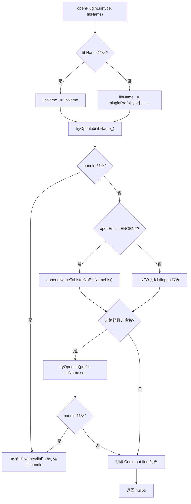
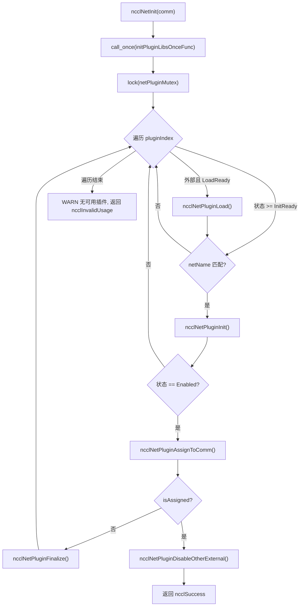
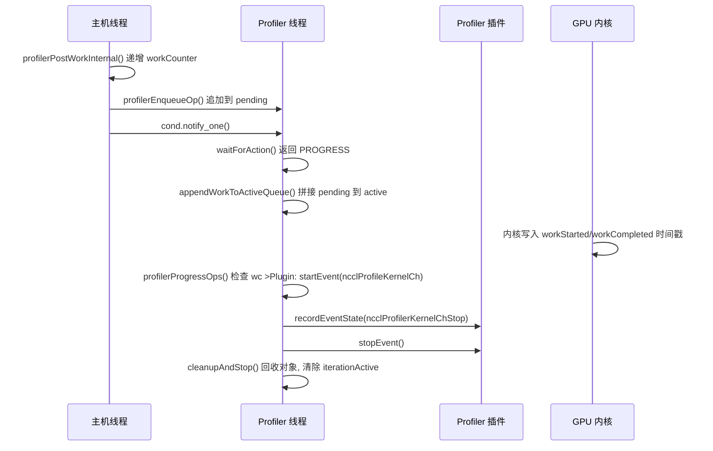

# Capítulo 16: Ecosistema de plugins y variables de entorno: cómo net, tuner, profiler y env extienden el comportamiento de NCCL

En el capítulo anterior vimos cómo NCCL, mediante RMA y GIN, extiende la capacidad de comunicación desde operaciones colectivas hasta acceso remoto punto a punto, e incluso permite que la GPU inicie solicitudes de red directamente. Esta evolución hacia nuevo hardware y escenarios de baja latencia exige una mayor flexibilidad del motor de comunicación: si cada vez que se adapta una nueva red, una nueva estrategia de ajuste o una nueva herramienta de recolección hubiera que recompilar el código central, a NCCL le resultaría difícil seguir el ritmo de los cambios del ecosistema. Este capítulo desglosa los directorios src/plugin y plugins, y responde a una pregunta central: cómo NCCL, sin recompilar el código central, reemplaza el backend de red, la estrategia de ajuste, el recolector de rendimiento y la fuente de configuración.

# 16.1 Cargador de plugins: cómo plugin_open.cc convierte un .so en un backend utilizable

## Modelo intuitivo

Imagínese`plugin_open.cc`como la "agencia de contratación" de NCCL: tiene en sus manos una lista de puestos (NET, GIN, RMA, TUNER, PROFILER, ENV), y cada puesto corresponde a un nombre de biblioteca candidata. Cuando NCCL necesita a alguien para un puesto, la agencia busca en el mercado de talentos (el enlazador dinámico) en un orden fijo, y si lo encuentra firma el contrato (`dlopen`), y si no lo encuentra registra "esta persona no existe", y finalmente devuelve un handle. Sin esta capa de intermediación, NCCL solo podría codificar de forma rígida el backend de red en el binario, y cualquier fabricante de tarjetas de red que quisiera integrarse tendría que modificar el código fuente de NCCL; esto es precisamente el desastre que el sistema de plugins busca eliminar.

## Estructuras de datos y diseño de memoria

Todo el estado del cargador son seis arreglos paralelos, y el índice es la enumeración del tipo de plugin:

```
static char* libNames[NUM_LIBS];              // 已加载库的名字
char* ncclPluginLibPaths[NUM_LIBS];           // 库的绝对路径
static void* libHandles[NUM_LIBS];            // dlopen 返回的句柄
static const char* pluginNames[NUM_LIBS];     // 日志用的人类可读名
static const char* pluginPrefix[NUM_LIBS];    // 库名前缀
static const char* pluginFallback[NUM_LIBS];  // 找不到时的提示
static unsigned long subsys[NUM_LIBS];        // 日志子系统位掩码
```

Los índices de estos siete arreglos deben estar estrictamente alineados,`pluginNames[type]`、`pluginPrefix[type]`、`subsys[type]`describen el mismo tipo de plugin.[FACT:src/plugin/plugin_open.cc:18-29]define`NUM_LIBS = 6`, el orden de tipos es`{"NET", "GIN", "RMA", "TUNER", "PROFILER", "ENV"}`, el prefijo es`{"libnccl-net", "libnccl-gin", "libnccl-rma", "libnccl-tuner", "libnccl-profiler", "libnccl-env"}`。

> **[Design Inference & Architectural Trade-offs]**
> Aquí se usan arreglos paralelos en lugar de un arreglo de estructuras para que`openPluginLib`, esta única función, pueda servir simultáneamente a seis tipos de plugins: el tipo solo se usa como índice y la lógica se reutiliza por completo. El costo es que al agregar un nuevo tipo de plugin hay que modificar sincrónicamente los seis arreglos, y el compilador no puede ayudarte a detectar omisiones.

`subsys`El arreglo determina la pertenencia de los logs: NET/GIN/RMA se registran todos en`NCCL_INIT | NCCL_NET`, TUNER en`NCCL_INIT | NCCL_TUNING`, PROFILER solo en`NCCL_INIT`, ENV en`NCCL_INIT | NCCL_ENV`。[FACT:src/plugin/plugin_open.cc:26-29]De esta forma, al`NCCL_DEBUG_SUBSYS=NET`solo se verán los logs de plugins de red y no quedarán ahogados entre los logs de ajuste.

## Recorrido paso a paso: el viaje completo de un`ncclOpenNetPluginLib("mlx5")`

Supongamos que el usuario establece`NCCL_NET_PLUGIN=mlx5`, NCCL llama durante la inicialización a`ncclOpenNetPluginLib("mlx5")`, que reenvía directamente a`openPluginLib(ncclPluginTypeNet, "mlx5")`。[FACT:src/plugin/plugin_open.cc:132-134]

**Paso uno: construir el nombre de la biblioteca candidata.**Como se pasó un`libName`no vacío, se toma la rama`snprintf(libName_, MAX_STR_LEN, "%s", libName)`,`libName_`se convierte en`"mlx5"`。[FACT:src/plugin/plugin_open.cc:85-89]Nótese que en este momento todavía no es un nombre de archivo de biblioteca válido: no tiene prefijo ni sufijo`.so`.

**Paso dos: primer intento de apertura.** `tryOpenLib("mlx5", ...)`Se llama a[FACT:src/plugin/plugin_open.cc:91]Después de entrar en`tryOpenLib`, primero se comprueba si`name`está vacío o tiene longitud cero, y luego hay una rama especial: si el nombre comienza con`STATIC_PLUGIN`, se establece`name`en`nullptr`。[FACT:src/plugin/plugin_open.cc:37-39]Este es el centinela para el plugin enlazado estáticamente en NCCL—`dlopen(nullptr)`En Linux devuelve el manejador del programa principal, permitiendo así que`dlsym`pueda encontrar los símbolos del plugin en la tabla de símbolos del programa principal.

Luego se llama a`ncclOsDlopen(name)`。[FACT:src/plugin/plugin_open.cc:41]porque`"mlx5"`no es ni una ruta ni un nombre de biblioteca válido,`dlopen`fallará. Tras el fallo, el código toma`ncclOsDlerror()`la cadena de error, y hace una comprobación precisa: si la cadena de error contiene simultáneamente`name`y`"No such file or directory"`, entonces establece`*err`como`ENOENT`。[FACT:src/plugin/plugin_open.cc:42-55]El significado de esta comprobación es distinguir entre "el archivo no existe en absoluto" y "el archivo existe pero falló al cargarse"—el primero solo significa que el nombre candidato es incorrecto, y debería intentarse silenciosamente el siguiente nombre candidato; el segundo es un error real, y debería registrarse en el log.

**Tercer paso: manejo tras el primer fallo.**Se vuelve a`openPluginLib`，`libHandles[type]`vacío, y`openErr == ENOENT`, entonces se añade`"mlx5"`a`eNoEntNameList`。[FACT:src/plugin/plugin_open.cc:97-101]Esta lista finalmente se ensamblará en un log que dice "Could not find: mlx5 libnccl-net-mlx5.so".

**Cuarto paso: segundo intento—añadir prefijo.**El código comprueba`libName`si no es ni una ruta (no contiene`/`) ni un nombre de biblioteca (no empieza por`lib`, no termina en`.so`).[FACT:src/plugin/plugin_open.cc:105-107] `"mlx5"`Se cumple la condición, entonces se ensambla`"libnccl-net-mlx5.so"`y se intenta de nuevo.[FACT:src/plugin/plugin_open.cc:108]Esta vez`dlopen`tiene éxito,`libHandles[type]`se asigna,`libNames[type]`se registra el nombre de la biblioteca,`ncclPluginLibPaths[type]`mediante`getLibPath`se obtiene la ruta absoluta, y la función devuelve el manejador.[FACT:src/plugin/plugin_open.cc:110-115]

**Quinto paso: obtener la ruta absoluta.** `getLibPath`En Linux con`dlinfo(handle, RTLD_DI_LINKMAP, &lm)`se extrae`link_map`, luego`strdup(lm->l_name)`。[FACT:src/plugin/plugin_open.cc:65-69]Esta ruta aparecerá en todos los logs posteriores, permitiendo al usuario ver de un vistazo qué archivo se cargó realmente—al diagnosticar en producción "por qué se cargó el plugin incorrecto", esta línea de log es la escena primaria.

El flujo de decisión completo es el siguiente:



## Reflexiones de diseño y trampas en producción

> **[Design Inference & Architectural Trade-offs]**
> **El orden de los nombres candidatos es la prioridad.**Primero se prueba el nombre desnudo dado por el usuario, luego el nombre con prefijo. Esto significa que si el directorio actual tiene casualmente un archivo llamado`mlx5`, se cargará con prioridad—esto es una superficie de seguridad potencial, y en producción debería evitarse poner en`LD_LIBRARY_PATH`un ejecutable con el mismo nombre que el plugin.

**`STATIC_PLUGIN`La semántica de**Cuando`NCCL_NET_PLUGIN=STATIC_PLUGIN`,`tryOpenLib`deja el nombre vacío,`dlopen(nullptr)`abre el programa principal,`dlsym`busca en la tabla de símbolos del programa principal`ncclNet_v12`y otros símbolos.[FACT:src/plugin/plugin_open.cc:37-39]Esto permite enlazar estáticamente el plugin en el binario de NCCL, ahorrando la molestia de desplegar`.so`, a costa de perder la capacidad de reemplazo en tiempo de ejecución.

**Conteo de referencias y descarga.** `ncclClosePluginLib`Solo cuando`libHandles[type] == handle`realmente se`dlclose`, y se limpian la ruta y el nombre.[FACT:src/plugin/plugin_open.cc:176-186]Esta comparación de igualdad evita cerrar por error un manejador que ya ha sido reemplazado. Los plugins GIN y RMA mediante`ncclGetGinPluginLib`/`ncclGetNetPluginLib`reutilizan el manejador de la biblioteca NET, implementado volviendo a`dlopen`el mismo nombre de biblioteca para incrementar el conteo de referencias.[FACT:src/plugin/plugin_open.cc:156-164]Esta es la semántica de conteo de referencias de`dlopen`—la misma biblioteca abierta dos veces requiere`dlclose`dos veces para descargarse realmente.

# 16.2 net.cc: la máquina de estados y el ciclo de vida del plugin de red

## Modelo intuitivo

`net.cc`Es el "centro de despacho" del plugin de red. Mantiene un arreglo de bibliotecas de plugins, cada biblioteca tiene su propio estado (no cargado, fallo de carga, pendiente de carga, pendiente de inicialización, habilitado). Cuando nace un nuevo dominio de comunicación (communicator), el centro de despacho recorre todos los plugins candidatos, intentando inicializar uno por uno, el primero que tenga éxito se "asigna" a este dominio de comunicación, y todos los demás plugins externos se deshabilitan. Sin esta capa de máquina de estados, NCCL no podría manejar problemas reales como "el plugin se cargó pero el dispositivo no está disponible", "cuál elegir cuando coexisten múltiples plugins", "cómo descargar de forma segura al destruir el dominio de comunicación".

## Estructuras de datos y diseño de memoria

La estructura central es`netPluginLib_t`：

| Campo | Tipo | Significado |
| --- | --- | --- |
| `name` | `char[255]` | Nombre de la biblioteca del plugin |
| `dlHandle` | `void*` | Manejador de dlopen |
| `ncclNet` | `ncclNet_t*` | Tabla de funciones de red |
| `ncclNetVer` | `int` | Número de versión de la API de red |
| `ncclCollNet` | `ncclCollNet_t*` | Tabla de funciones de descarga de comunicación colectiva |
| `ncclNetPluginState` | Enumeración | Estado del plugin de red |
| `ncclCollNetPluginState` | Enumeración | Estado del plugin CollNet |
| `ncclNetPluginRefCount` | `int` | Conteo de referencias |
| `netPhysDevs`/`netVirtDevs` | `int` | Número de dispositivos físicos/virtuales |
| `collNetPhysDevs`/`collNetVirtDevs` | `int` | Número de dispositivos CollNet |

[FACT:src/plugin/net.cc:63-76]define estos campos. Nótese que`ncclNet`y`ncclCollNet`son dos tablas de funciones separadas, y los estados también son dos enumeraciones separadas—un plugin puede proporcionar funcionalidad de red pero no descarga CollNet.

La enumeración de estados tiene cinco valores:`Disabled = -2`(fallo de inicialización),`LoadFailed = -1`(fallo de carga),`LoadReady = 0`(pendiente de carga),`InitReady = 1`(cargado pendiente de inicialización),`Enabled = 2`(habilitado).[FACT:src/plugin/net.cc:54-60]Usa números negativos para representar estados de fallo, de modo que comparaciones como "estado >= InitReady" expresan naturalmente "al menos cargado".

El estado global son tres variables:`pluginCount`registra el número total de plugins,`netPluginLibs[NCCL_NET_MAX_PLUGINS]`es el arreglo de plugins,`netPluginMutex`protege el acceso concurrente,`initPluginLibsOnceFlag`garantiza que la inicialización se haga solo una vez.[FACT:src/plugin/net.cc:78-81]

## Step-by-Step Walkthrough: el viaje completo de un`ncclNetInit(comm)`Primera parte: inicialización única.

**garantiza que la lista de plugins se construya solo una vez.** `std::call_once(initPluginLibsOnceFlag, initPluginLibsOnceFunc)`Lee la variable de entorno[FACT:src/plugin/net.cc:360] `initPluginLibsOnceFunc`, si no está configurada se añade por defecto`NCCL_NET_PLUGIN`, luego registra dos plugins integrados`"libnccl-net.so"`y`ncclNetIb`El análisis de la variable de entorno usa`ncclNetSocket`。[FACT:src/plugin/net.cc:288-340]

para dividir por comas, soportando múltiples nombres de plugins.`strtok_r`tiene una comprobación de capacidad: el número de plugins externos no puede exceder[FACT:src/plugin/net.cc:303-324], el exceso se ignora y se registra en el log.`NCCL_NET_MAX_PLUGINS - NCCL_NET_NUM_INTERNAL_PLUGINS`Los plugins integrados son fijos 2 (IB y Socket), así que los plugins externos son como máximo[FACT:src/plugin/net.cc:307-311]Segunda parte: recorrido con bloqueo.`NCCL_NET_MAX_PLUGINS - 2`protege todo el proceso de recorrido.

**Para cada índice de plugin, primero se comprueba si es un plugin externo y está en estado** `std::lock_guard<std::mutex> lock(netPluginMutex)`, si es así se llama a[FACT:src/plugin/net.cc:361]Tercera parte: cargar el plugin.`LoadReady`llama a`ncclNetPluginLoad`。[FACT:src/plugin/net.cc:364-367]

**para obtener el manejador, luego desde la versión más alta a la más baja se intenta sucesivamente** `ncclNetPluginLoad`hasta`ncclOpenNetPluginLib`, la primera versión que devuelva no vacío se adopta.`getNcclNet_v12`El arreglo de versiones`getNcclNet_v6`y el arreglo de punteros a función[FACT:src/plugin/net.cc:103-112]están ordenados de forma descendente, garantizando el uso prioritario de la API más reciente.`ncclNetVersion`Si ninguna versión obtiene`getNcclNet`, significa que esta biblioteca no es un plugin de red válido. En este momento se comprueba si[FACT:src/plugin/net.cc:41-43]

está configurado explícitamente: si lo está, se usa`ncclNet`nivel de advertencia (el usuario lo pidió explícitamente pero falló); si no lo está, se usa`NCCL_NET_PLUGIN` 是否被显式设置：若设置了，用 `ATTN` 级别告警（用户明确要求却失败）；若没设置，用 `INFO`nivel (solo un intento predeterminado fallido).[FACT:src/plugin/net.cc:115-125]Esta distinción es importante: si falla una configuración explícita del usuario, debe ser visible para él.

**Cuarto paso: inicializar el plugin.**Volver a`ncclNetInit`, para el estado`>= InitReady`y cuyo nombre coincida con`comm->config.netName`, llamar a`ncclNetPluginInit`。[FACT:src/plugin/net.cc:369-372] `ncclNetPluginInit`para hacer dos cosas: llamar a la función`init`del plugin para establecer el contexto del dominio de comunicación, y en la primera inicialización llamar a`devices`para detectar el número de dispositivos.[FACT:src/plugin/net.cc:186-236]

Atención a la condición de llamada de`init`:`pluginLib->ncclNetPluginState >= ncclNetPluginStateInitReady`。[FACT:src/plugin/net.cc:190]El comentario indica explícitamente que "cada nuevo dominio de comunicación debe llamar a init para establecer el contexto correcto".[FACT:src/plugin/net.cc:189]Pero la detección de dispositivos solo se hace una vez cuando`== InitReady`.[FACT:src/plugin/net.cc:201]Esta distinción de "init se llama cada vez, devices solo una vez" es una optimización de rendimiento: la detección de dispositivos puede ser lenta, pero el contexto debe ser independiente para cada dominio de comunicación.

**Quinto paso: asignación y deshabilitación.**Tras una inicialización exitosa, llamar a`ncclNetPluginAssignToComm`, que asigna el`ncclNet`del plugin a`comm->ncclNet`, incrementa el contador de referencias, establece`comm->netPluginIndex`。[FACT:src/plugin/net.cc:238-255]. Tras una asignación exitosa, llamar inmediatamente a`ncclNetPluginDisableOtherExternal`para deshabilitar todos los demás plugins externos.[FACT:src/plugin/net.cc:377-380]

> **[Design Inference & Architectural Trade-offs]**
> La lógica de deshabilitación tiene un juicio clave: solo cuando el plugin asignado es un plugin externo (`pluginIndex >= pluginCount - NCCL_NET_NUM_INTERNAL_PLUGINS`) se deshabilitan otros plugins externos.[FACT:src/plugin/net.cc:257-259]Si se asigna el plugin IB integrado, los plugins externos permanecen como están; esto deja espacio de elección para dominios de comunicación posteriores.



## Control de concurrencia e interacción con hardware

`netPluginMutex`Protege todas las lecturas y escrituras de`netPluginLibs`.`ncclNetInit`、`ncclNetFinalize`Todos añaden bloqueo.[FACT:src/plugin/net.cc:361][FACT:src/plugin/net.cc:411-416]Pero los comentarios de funciones como`ncclNetGetDevCount`dicen que "no se necesita bloqueo, porque el llamador ya está dentro del bloqueo de`ncclTopoGetSystem`".[FACT:src/plugin/net.cc:418-429]Esta es una convención de "el bloqueo lo mantiene la capa superior", que reduce la sobrecarga de bloqueos anidados, a costa de que el llamador debe respetar la convención.

`ncclGpuGdrSupport`Muestra la interacción directa del plugin con el hardware: asigna un búfer de GPU de 2 MB, establece una conexión de bucle invertido mediante el`listen`/`connect`/`accept`del plugin, y luego intenta`regMr`registrar memoria de GPU.[FACT:src/plugin/net.cc:464-535]Si el registro tiene éxito, significa que la tarjeta de red admite GPUDirect RDMA. Este resultado de sondeo se almacena en caché en`gdrSupportMatrix[32]`, indexado por número de dispositivo CUDA.[FACT:src/plugin/net.cc:478-480]

> **[Design Inference & Architectural Trade-offs]**
> Atención:`gdrSupportMatrix`es de`static`, compartido entre dominios de comunicación.[FACT:src/plugin/net.cc:478]Esto significa que múltiples dominios de comunicación dentro del mismo proceso reutilizarán el resultado del sondeo, evitando sondeos costosos repetidos. Pero el tamaño del arreglo está codificado como 32, y las máquinas con más de 32 GPU sufrirán desbordamiento; esta es una suposición implícita de límite superior.

## Guía para evitar errores en producción

**Error uno: el plugin se carga correctamente pero el número de dispositivos es cero.** `ncclNetPluginInit`Comprobar`devices(&ndev) != ncclSuccess || ndev <= 0`y saltar a la rama de fallo.[FACT:src/plugin/net.cc:202]Tras el fallo, llamar a`finalize`para limpiar el contexto ya establecido, restablecer el número de dispositivos a`NCCL_UNDEF_DEV_COUNT`, y establecer el estado en`Disabled`。[FACT:src/plugin/net.cc:229-234]. Si no se hace esta limpieza, los dominios de comunicación posteriores verán un plugin "inicializado pero sin dispositivos", lo que provocará errores difíciles de diagnosticar.

> **[Design Inference & Architectural Trade-offs]**
> **Error dos:`init`tiene éxito pero`devices`falla.**El código usa el indicador`initCompleted`para rastrear si`init`tuvo éxito.[FACT:src/plugin/net.cc:178-184][FACT:src/plugin/net.cc:198]En la rama de fallo, solo si`initCompleted`es verdadero se llama a`finalize`。[FACT:src/plugin/net.cc:230]. Esto evita llamar a`finalize`sobre un contexto no inicializado; muchos`finalize`de plugins no comprueban punteros nulos, y una llamada errónea provocaría un fallo.

**Error tres: conteo de referencias al destruir el dominio de comunicación.** `ncclNetPluginFinalize`Primero llamar al`finalize`del plugin, luego decrementar el contador de referencias, y finalmente, cuando el contador de referencias llegue a cero y sea un plugin externo, descargar la biblioteca.[FACT:src/plugin/net.cc:342-355] `ncclNetPluginUnload`Comprobar que`dlHandle`no sea nulo y que el contador de referencias sea cero para realmente`dlclose`。[FACT:src/plugin/net.cc:84-101]. Tras la descarga, restablecer los campos pero conservar`name`, para reutilizarlo al recargar.[FACT:src/plugin/net.cc:84-101]

# 16.3 tuner.cc y profiler.cc: contratos diferentes entre plugins de estrategia y plugins de observación

## Modelo intuitivo

El plugin Tuner es como la "configuración de preferencias de ruta de un software de navegación": no cambia cómo se conduce el coche, solo cambia qué camino se elige. El plugin Profiler es como una "caja negra de conducción": no interviene en la conducción, solo registra lo que ocurrió. Lo que ambos tienen en común es que se conectan mediante una tabla de funciones; la diferencia es que Tuner es un objeto de estrategia ligero de "una instancia por dominio de comunicación", mientras que Profiler necesita un hilo independiente para consumir asíncronamente los eventos generados por la GPU.

## tuner.cc: un singleton global minimalista

El estado de Tuner es extremadamente simple: un mutex, un contador de referencias, un manejador de biblioteca, un puntero a símbolo y una variable de estado.[FACT:src/plugin/tuner.cc:24-37]No hay arreglo de plugins, no hay coexistencia de múltiples plugins; globalmente solo hay un tuner.

`ncclTunerPluginLoad`La lógica es "cargar la primera vez, reutilizar después": si el estado es`LoadSuccess`, asignar directamente el símbolo a`comm->tuner`e incrementar el contador de referencias.[FACT:src/plugin/tuner.cc:53-57]En caso contrario, leer la variable de entorno`NCCL_TUNER_PLUGIN`; si es`"none"`, fallar directamente.[FACT:src/plugin/tuner.cc:59-63]

> **[Design Inference & Architectural Trade-offs]**
> La negociación de versión baja de v6 a v2, probando una por una.[FACT:src/plugin/tuner.cc:75-87]Nótese que aquí no hay v1; la API de tuner solo tiene una estructura estable de tabla de funciones a partir de v2.

> **[Design Inference & Architectural Trade-offs]**
> Un detalle interesante: si`ncclOpenTunerPluginLib`devuelve vacío, el código intenta`ncclGetNetPluginLib(ncclPluginTypeTuner)`。[FACT:src/plugin/tuner.cc:65-70]. Esto significa que tuner puede empaquetarse dentro de la biblioteca del plugin net; esto reduce la complejidad de despliegue, un`.so`proporciona simultáneamente funciones de red y ajuste.

## profiler.cc: hilo de consumo asíncrono de eventos

Profiler es el plugin más complejo de este capítulo, porque necesita manejar eventos generados asíncronamente por la GPU. La estructura central es`ncclProfilerThread`：

| campo | tipo | función |
| --- | --- | --- |
| `thread` | `std::thread` | hilo de consumo |
| `mutex` | `std::mutex` | proteger la cola |
| `cond` | `condition_variable` | despertar cuando haya nuevo trabajo |
| `condIterationInactive` | `condition_variable` | esperar a que termine la iteración |
| `stop` | `int` | indicador de parada |
| `refCount` | `int` | contador de referencias del dominio de comunicación |
| `cudaDev` | `int` | dispositivo CUDA vinculado |
| `abortFlag` | `volatile uint32_t*` | indicador de aborto |
| `iterationActive` | `bool` | si se está iterando |
| `pending`/`pendingTail` | lista enlazada | trabajo pendiente |
| `active`/`activeTail` | lista enlazada | trabajo en proceso |
| `opStack`/`opPool` | grupo de memoria | asignación de objetos de trabajo |
| `inflight`/`maxInflightSeen`/`maxInflight` | `size_t` | observación de contrapresión |
| `droppedOps` | `uint64_t` | contador de fallos de asignación |

[FACT:src/plugin/profiler.cc:38-69]define esta estructura. Nótese que`pending`y`active`son dos listas enlazadas independientes: el productor añade a`pending`, el hilo de consumo, dentro del bloqueo, concatena`pending`a`active`, y luego, fuera del bloqueo, recorre`active`。[FACT:src/plugin/profiler.cc:56-59]

`iterationActive`. El indicador`true`es clave para la corrección de concurrencia: el hilo de consumo lo establece a`false`para poder desmontar el estado del dominio de comunicación.[FACT:src/plugin/profiler.cc:52-55]

## Step-by-Step Walkthrough: generación y consumo de un evento KernelCh

**Primer paso: encolado en el lado del host.**Cuando se envía el plan del kernel (kernel plan),`ncclProfilerPostPlanWork`se recorre las tareas colectivas del plan y, para cada tarea que tenga habilitado`ncclProfileKernelCh`, se llama según el rango de canales a`profilerPostWorkInternal`。[FACT:src/plugin/profiler.cc:1315-1331]

`profilerPostWorkInternal`primero se incrementa`comm->profiler.workCounter[channelId]`, luego se llama a`profilerEnqueueOp`。[FACT:src/plugin/profiler.cc:1259-1266]Los comentarios enfatizan que este incremento debe ser "exactamente una vez por llamada, incluso si la asignación falla", para mantener la sincronización con el kernel del dispositivo.[FACT:src/plugin/profiler.cc:1259-1266]

**Segundo paso: asignar el objeto de trabajo.** `profilerEnqueueOp`Dentro del lock se asigna desde el pool de memoria`ncclProfilerWorkOp`, rellenando campos como el número de canal, el contador de trabajo, la máscara de activación, el handle de evento de tarea, el contexto del dominio de comunicación, etc.[FACT:src/plugin/profiler.cc:1199-1223]Si la asignación falla, se incrementa`droppedOps`y se registra en el log, pero**no**se revierte`workCounter`——esta es la clave para mantener la sincronización con el dispositivo.[FACT:src/plugin/profiler.cc:1202-1207]

Tras una asignación exitosa, el objeto se añade al final de la lista enlazada`pending`, se incrementa`inflight`, se actualiza`maxInflightSeen`y se despierta al hilo consumidor.[FACT:src/plugin/profiler.cc:1225-1239]

**Tercer paso: el hilo consumidor espera.** `ncclProfilerThreadFunc`En bucle se llama a`waitForAction`。[FACT:src/plugin/profiler.cc:1074-1077] `waitForAction`esperando dentro del lock sobre la variable de condición, hasta que`pending`o`active`no estén vacíos, o se reciba una señal de parada/aborto.[FACT:src/plugin/profiler.cc:1017-1031]

Tras ser despertado, llama a`appendWorkToActiveQueue`para empalmar`pending`al final de`active`, establecer`iterationActive = true`y devolver`NCCL_PROFILER_THREAD_PROGRESS`。[FACT:src/plugin/profiler.cc:1017-1031]

**Cuarto paso: procesar el trabajo.** `profilerProgressOps`Fuera**del lock**se recorre la lista enlazada`active`.[FACT:src/plugin/profiler.cc:958-999]Para cada objeto de trabajo, se comprueba si el dispositivo ya ha escrito el timestamp de inicio:`wc <= op->workStarted[ch].data[slot].counter`。[FACT:src/plugin/profiler.cc:972]Nótese que se usa`<=`en lugar de`==`, porque el dispositivo da la vuelta a`MAX_PROFILER_EVENTS_PER_CHANNEL`slots y, si el host va retrasado, el dispositivo puede haber sobrescrito ya ese slot.[FACT:src/plugin/profiler.cc:969-971]

Si se cumple la condición de inicio, se llama a`ncclProfilerStartKernelChEvent`para notificar al plugin.[FACT:src/plugin/profiler.cc:973]Luego se comprueba la condición de finalización y, si se cumple, primero se dispara el evento de fase y después se llama a`ncclProfilerStopKernelChEvent`。[FACT:src/plugin/profiler.cc:978-985]

Los objetos de trabajo completados se extraen de la lista enlazada y se recogen en la lista`recycled`.[FACT:src/plugin/profiler.cc:987-991]

**Quinto paso: reciclaje y publicación.** `cleanupAndStop`Dentro del lock se recicla la lista`recycled`, se publica el nuevo`activeTail`, se limpia`iterationActive`y se notifica a los que esperan.[FACT:src/plugin/profiler.cc:1036-1050]



## Control de concurrencia y backpressure

`NCCL_PROFILER_DEFAULT_MAX_INFLIGHT`se define como`MAXCHANNELS * MAX_PROFILER_EVENTS_PER_CHANNEL * 4`。[FACT:src/plugin/profiler.cc:32-32]Este es un "límite blando": superarlo no impide el encolado, solo genera logs.[FACT:src/plugin/profiler.cc:1233-1238]Los comentarios explican que mantener el encolado sirve para emparejar los eventos KernelCh con sus eventos de tarea padre.[FACT:src/plugin/profiler.cc:32-32]

El log se dispara con potencias de 2:`(pt->inflight & (pt->inflight - 1)) == 0`。[FACT:src/plugin/profiler.cc:1233]Esto garantiza que solo se registre en el log cuando inflight sea 1, 2, 4, 8..., evitando inundar la salida.

La estrategia de backoff del hilo consumidor está en`updateProgressInterval`: si hay progreso, reintenta de inmediato; si no hay progreso, comienza en 1 microsegundo y va duplicándose, con un límite de 10 microsegundos.[FACT:src/plugin/profiler.cc:1054-1057]Este diseño equilibra latencia y uso de CPU.

## Guía de evitación de errores en producción

**Error uno: fuga de trabajo al destruir.** `ncclProfilerThreadDestroy`Primero se espera a que`iterationActive`se vuelva falso, luego se llama a`profilerPurgeByContext`para limpiar todo el trabajo pendiente que haga referencia a ese contexto del dominio de comunicación.[FACT:src/plugin/profiler.cc:1162-1169]Si no se hace esta limpieza, el callback del plugin recibirá un puntero a un contexto ya destruido, provocando un use-after-free.

**Error dos: drenaje al detenerse.**Cuando se recibe una señal de parada pero`active`no está vacío, se devuelve`NCCL_PROFILER_THREAD_CLEANUP_AND_STOP`，`cleanupAndStop`con el parámetro`drainStuck`verdadero, reciclando directamente todo el trabajo restante.[FACT:src/plugin/profiler.cc:1029][FACT:src/plugin/profiler.cc:1036-1050]Los comentarios indican que el kernel de estos trabajos nunca se ejecutará, así que se descartan directamente.[FACT:src/plugin/profiler.cc:1034-1035]

**Error tres: vinculación al dispositivo CUDA.**Al arrancar el hilo consumidor se llama a`cudaSetDevice(pt->cudaDev)`。[FACT:src/plugin/profiler.cc:1054-1057]Los comentarios explican: el hilo en sí solo lee memoria fijada del host, pero el plugin podría hacer llamadas al driver dependientes del contexto, así que se vincula de forma defensiva.[FACT:src/plugin/profiler.cc:1054-1057]Si la vinculación falla, solo se registra en el log y no se aborta, porque el hilo en sí no depende de CUDA.[FACT:src/plugin/profiler.cc:1065-1070]

# 16.4 Ejemplo oficial: puntos clave de implementación de google-fastsocket y google-CoMMA

## Modelo intuitivo

Los ejemplos oficiales son la "implementación de referencia" de la API de plugins.`google-fastsocket`Muestra cómo reemplazar el TCP del kernel con una pila de red en espacio de usuario;`google-CoMMA`muestra cómo implementar un plugin profiler para recopilar rendimiento de comunicación. Su existencia demuestra que la API de plugins es lo bastante expresiva para necesidades reales.

## google-fastsocket: reemplazar el backend de red

> **[Design Inference & Architectural Trade-offs]**
> FastSocket es la pila de red en espacio de usuario de código abierto de Google, que evita la pila TCP/IP del kernel mediante la familia de direcciones`AF_FABRIC`. Como plugin net de NCCL, necesita implementar`ncclNet_t`todas las funciones:`init`、`devices`、`getProperties`、`listen`、`connect`、`accept`、`regMr`、`isend`、`irecv`、`test`、`closeSend`, etc.

El punto clave de implementación está en`getProperties`que devuelve`ptrSupport`: si FastSocket soporta GPUDirect RDMA, debe establecerse en`NCCL_PTR_HOST|NCCL_PTR_CUDA`; de lo contrario solo puede establecerse en`NCCL_PTR_HOST`, y NCCL copiará los datos de la GPU a memoria del host antes de enviar.[FACT:plugins/net/README.md:245-245]

`connect`El contrato de "no bloqueo" de`accept`y`sendComm`/`recvComm`es la dificultad central de la implementación del plugin: deben devolver de inmediato, establecer`NULL`en[FACT:plugins/net/README.md:299-311], y dejar que NCCL llame repetidamente hasta tener éxito.

## Esto exige que el plugin mantenga internamente una máquina de estados de conexión, dejando el handshake costoso en segundo plano.

> **[Design Inference & Architectural Trade-offs]**
> [Inferencia de diseño y compromisos arquitectónicos]`ncclProfiler_t`CoMMA (Collective Memory Monitoring Agent) es el recolector de rendimiento de comunicación de Google. Como plugin profiler, implementa`init`、`finalize`、`startEvent`、`stopEvent`、`recordEventState`。

`init`la tabla de funciones:`ncclProfilerEventMask`recibe el puntero[FACT:src/plugin/profiler.cc:341], y el plugin selecciona a qué eventos suscribirse escribiendo en esta máscara.[FACT:src/plugin/profiler.cc:285-307]

`startEvent`Los tipos de eventos soportados por NCCL incluyen Group, Coll, P2p, ProxyOp, ProxyStep, ProxyCtrl, KernelCh, KernelPhase, NetPlugin, etc.`stopEvent`Devuelve un handle de evento; posteriormente`recordEventState`y[FACT:src/plugin/profiler.cc:392][FACT:src/plugin/profiler.cc:400-407]usan este handle para asociar eventos.

## El plugin puede usar el handle para almacenar su propio estado, implementando emparejamiento de eventos y estadísticas de duración.

**Reflexión de diseño**porque la API net involucra código del lado del dispositivo (`ncclNetDeviceHandle`), una versión incompatible provocará un fallo del kernel; mientras que tuner/profiler son puramente del lado del host, una versión incompatible a lo sumo causará funcionalidad faltante.[FACT:src/plugin/net.cc:153-176]muestra`ncclNetCheckDeviceVersion`cómo verificar el tipo y la versión del dispositivo, y devuelve cuando no coinciden`ncclInternalError`。

**¿Por qué profiler necesita un hilo independiente?**porque la devolución de llamada de profiler puede bloquearse (por ejemplo, escribir archivos, enviar solicitudes de red), y si se llama en el hilo del host ralentizará la comunicación.[FACT:src/plugin/profiler.cc:950-952]El comentario dice explícitamente "la devolución de llamada del plugin puede bloquearse, por lo que no se puede llamar mientras se mantiene el bloqueo".

# 16.5 Guía de prevención de errores en producción y cadena de recuperación de fallos

## Error uno: la versión incompatible del plugin provoca un fallo del kernel

`ncclNetCheckDeviceVersion`Verificar`props.netDeviceType`y`props.netDeviceVersion`。[FACT:src/plugin/net.cc:153-176]Si la versión de`NCCL_NET_DEVICE_UNPACK`reportada por el plugin no coincide con la versión de`NCCL_NET_DEVICE_UNPACK_VERSION`con la que se compiló NCCL, devolver`ncclInternalError`y advertir.[FACT:src/plugin/net.cc:153-176]Esta verificación se llama en`ncclNetPluginAssignToComm`, y si falla el plugin no se asignará al dominio de comunicación.[FACT:src/plugin/net.cc:241]

**Cadena de recuperación**: versión incompatible →`ncclNetCheckDeviceVersion`devuelve error →`ncclNetPluginAssignToComm`devuelve`isAssigned = false` → `ncclNetInit`continúa intentando con el siguiente plugin → finalmente puede recurrir al plugin Socket integrado.

## Error dos: el hilo de profiler no puede salir

Si el plugin de profiler se bloquea en`stopEvent`, el hilo consumidor se quedará atascado en`profilerProgressOps`,`iterationActive`siempre será verdadero,`ncclProfilerThreadDestroy`esperará para siempre.[FACT:src/plugin/profiler.cc:1166]Este es un riesgo real de interbloqueo.

> **[Design Inference & Architectural Trade-offs]**
> **Cadena de recuperación**：`comm->abortFlag`se establece →`waitForAction`detecta la cancelación → devuelve`CLEANUP_AND_STOP` → `cleanupAndStop`vacía la cola.[FACT:src/plugin/profiler.cc:1017-1031]Pero si el hilo ya está atascado en la devolución de llamada del plugin, la bandera de cancelación no puede interrumpirlo; esta es responsabilidad del implementador del plugin, la devolución de llamada debe tener un tiempo de espera.

## Error tres: fuga del conteo de referencias del plugin tuner

`ncclTunerPluginLoad`incrementa en caso de éxito`tunerPluginRefCount`。[FACT:src/plugin/tuner.cc:98] `ncclTunerPluginUnload`decrementa cuando`comm->tunerPluginLoaded`es verdadero.[FACT:src/plugin/tuner.cc:111-123]Si algún dominio de comunicación cargó el tuner pero al destruirse`tunerPluginLoaded`se pone a cero inesperadamente, el conteo de referencias nunca llegará a cero y la biblioteca del plugin nunca se descargará.

# Reflexión y autoevaluación de este capítulo

P1: Si en`ncclNetPluginLoad`se cambia el bucle de "intentar desde la versión más alta hasta la más baja" por "intentar solo la versión más alta", ¿en qué escenario provocaría que un plugin que originalmente era utilizable no se pueda cargar?

**Análisis de referencia**: ver[FACT:src/plugin/net.cc:108-112]. El bucle recorre`NCCL_NET_VERSION_COUNT`versiones, desde v12 hasta v6, y se adopta la primera que devuelva un valor no nulo. Si solo se intenta v12, entonces un plugin antiguo que solo implementa v11 fallará al cargarse.

> **[Design Inference & Architectural Trade-offs]**
> Este diseño es para compatibilidad hacia atrás: después de que el núcleo de NCCL se actualice para admitir v12, todavía puede cargar plugins que solo ofrecen v11. Se anima a los autores de plugins a proporcionar símbolos de múltiples versiones (ver[FACT:plugins/net/README.md:35-37]), de modo que el mismo`.so`pueda servir a múltiples versiones de NCCL.

Si se elimina el intento de degradación, después de que el usuario actualice NCCL el plugin antiguo de repente quedará inutilizable y solo podrá recurrir al plugin Socket integrado, con una gran caída de rendimiento. Esta es precisamente la razón de ser de la negociación de versiones.

P2: En`profilerProgressOps`, si se cambia`wc <= op->workStarted[ch].data[slot].counter`por`wc == op->workStarted[ch].data[slot].counter`, ¿en qué escenario de alta concurrencia provocaría que el evento nunca se dispare?

**Análisis de referencia**: ver[FACT:src/plugin/profiler.cc:969-972]. El comentario explica explícitamente que el dispositivo dará la vuelta a`MAX_PROFILER_EVENTS_PER_CHANNEL`ranuras. Si la velocidad de consumo del host va por detrás de la velocidad de producción del dispositivo, el dispositivo puede haber sobrescrito la ranura`wc + N`con el contador`wc % MAX_PROFILER_EVENTS_PER_CHANNEL`。

En ese momento el valor de`op->workStarted[ch].data[slot].counter`es`wc + N`, mientras que`op->workCounter`es`wc`. Usar`==`para juzgar fallará, el evento nunca se disparará, el objeto de trabajo permanecerá para siempre en la lista enlazada`active`,`inflight`solo aumenta y nunca disminuye, y finalmente agotará el grupo de memoria.

Usar`<=`sí puede manejar correctamente esta situación: siempre que el contador escrito por el dispositivo no sea menor que el valor esperado, se considera que el evento está listo. Esta es una condición de corrección típica de "búfer circular productor-consumidor".

P3: Si en`ncclProfilerThreadDestroy`se elimina el bucle que espera a que`iterationActive`se vuelva falso, ¿en qué secuencia temporal provocaría que el plugin de profiler acceda a un contexto de dominio de comunicación ya liberado?

**Análisis de referencia**: ver[FACT:src/plugin/profiler.cc:1162-1166]. El comentario explica que`ncclProfilerPluginFinalize`destruirá inmediatamente el`ncclProfilerThreadDestroy`del dominio de comunicación después de que`profilerContext`。

retorne. Cuando el hilo consumidor llama a la devolución de llamada del plugin en`profilerProgressOps`, lo que pasa es`op->profilerContext`。[FACT:src/plugin/profiler.cc:938]Si el hilo de destrucción no espera a que`iterationActive`se vuelva falso antes de retornar,`ncclProfilerPluginFinalize`liberará el contexto, mientras que el hilo consumidor puede estar usando este contexto para llamar al plugin: use-after-free.

`iterationActive`El protocolo de handshake de`true`es: el hilo consumidor, después de establecer`false`。[FACT:src/plugin/profiler.cc:1028][FACT:src/plugin/profiler.cc:1054-1057]bajo el bloqueo, libera el bloqueo para llamar al plugin, y el hilo de destrucción espera bajo el bloqueo a que vuelva a

Este protocolo garantiza que el contexto sea siempre válido durante la devolución de llamada del plugin.

Después de eliminar la espera, el hilo de destrucción puede retornar justo cuando el hilo consumidor acaba de entrar en la devolución de llamada del plugin, provocando que el plugin obtenga un puntero colgante. Esta es una condición de carrera típica de "ciclo de vida y acceso concurrente".

El sistema de plugins lleva a NCCL de lo cerrado a lo abierto: el backend de red, las estrategias de ajuste, los recolectores de rendimiento y las fuentes de configuración pueden reemplazarse sin modificar el código central. Pero los plugins también introducen nuevas superficies de fallo: versiones incompatibles, condiciones de carrera de ciclo de vida y fugas de conteo de referencias. En el próximo capítulo entraremos en el subsistema RAS y de diagnóstico, para ver cómo NCCL detecta fallos, monitorea el progreso y logra la autocuración en tareas de entrenamiento de larga duración.
