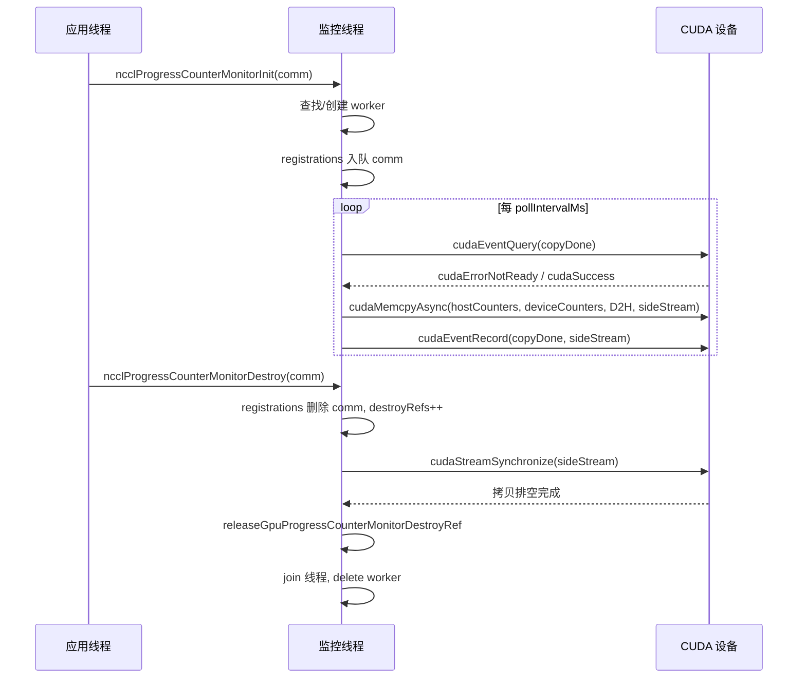
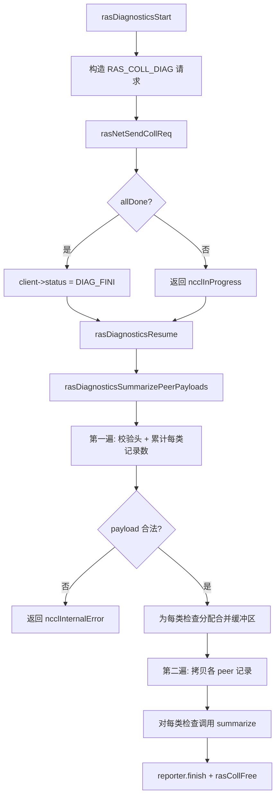

# Capítulo 17: Mecanismos RAS y tolerancia a fallos: detección de fallos de enlace, latidos y degradación elegante

En el capítulo anterior vimos cómo el sistema de plugins permite delimitar el núcleo de la ruta de comunicación y los componentes reemplazables, de modo que se pueden sustituir el backend de red, las estrategias de ajuste y los recolectores de rendimiento sin modificar el código central. Pero la extensibilidad es solo una dimensión de la disponibilidad en producción; otra cuestión igualmente crítica es: cuando un AllReduce ya lleva 72 horas ejecutándose y la tarjeta de red de una máquina falla silenciosamente, ¿cómo puede NCCL detectarlo, aislarlo y continuar? El subsistema RAS es precisamente la línea divisoria que lleva a NCCL de "funciona" a "apto para producción". Este capítulo desglosa el diseño detrás de la detección de fallos, el monitoreo de progreso y los mecanismos de autocuración.

# 17.1 Control general de RAS: un coordinador global con un hilo RAS por proceso

## Modelo intuitivo

Imagina RAS como la "sala de guardia" de todo el trabajo. Cada proceso de NCCL (cada rank) abre una sala de guardia durante la inicialización, con un hilo dedicado dentro. La creación y destrucción de todos los dominios de comunicación (communicator), así como las solicitudes de diagnóstico, deben registrarse primero en la sala de guardia; las salas de guardia se comunican entre sí a través de una red RAS independiente para informarse mutuamente de "quién sigue vivo y quién ya ha muerto".

Sin esta sala de guardia, NCCL solo podría percibir fallos mediante los tiempos de espera de la propia ruta de comunicación, pero los tiempos de espera en la ruta de comunicación son lentos y propensos a falsos positivos (una fluctuación de red podría interpretarse como la muerte de un nodo). RAS separa la "percepción de fallos" del plano de datos y la traslada al plano de control, utilizando canales independientes y ligeros de latido y diagnóstico para determinar el estado de salud.

## Estructuras de datos y diseño de memoria

El estado central de RAS está disperso en las variables globales de`ras.cc`y las desglosamos una por una:

| Variable | Tipo | Función |
| --- | --- | --- |
| `rasInitMutex` | `std::mutex` | Protege la inicialización del singleton RAS |
| `rasInitialized` | `bool` | Si ya se ha inicializado |
| `rasInitRefCount` | `int` | Conteo de referencias, igual al número de comm activos |
| `rasNetListeningSocket` | `struct ncclSocket` | Socket de escucha de la red RAS |
| `rasNotificationPipe[2]` | `ncclSocketPairDescriptor` | Canal de notificación del hilo local → hilo RAS |
| `rasPfds` | `struct pollfd*` | Arreglo poll del bucle principal de eventos |
| `ncclComms` | `struct ncclComm**` | Arreglo de punteros a todos los dominios de comunicación |

[FACT:src/ras/ras.cc:49-61]define estos estados globales. Observa que`rasInitRefCount`usa`ncclAtomicRefCountIncrement`para incrementar y decrementar[FACT:src/ras/ras.cc:129], mientras que`rasInitialized`usa un bool normal más doble verificación de bloqueo para proteger[FACT:src/ras/ras.cc:103-105]—este es el patrón típico de "inicializar una vez y luego solo lectura".

`ncclComms`La estrategia de asignación del arreglo`RAS_INCREMENT * 8`merece atención: no crece bajo demanda, sino que cada expansión añade[FACT:src/ras/ras.cc:139-140](es decir, 32 ranuras).`nullptr`En el arreglo se permiten huecos[FACT:src/ras/ras.cc:135-137]。

## (se dejan vacíos al destruir un comm), y el nuevo comm reutiliza el primer hueco

**Recorrido guiado por escenarios: desde la inicialización del comm hasta el arranque del hilo RAS`ncclRasCommInit`Primer paso:**es llamado.[FACT:src/ras/ras.cc:101]Esta es la primera función RAS que se llama al inicializar cada comm`rasInitialized`. Primero verifica

; si no está inicializado, entra en la sección crítica:`rasNetListeningSocket`1. Inicializa[FACT:src/ras/ras.cc:108-109]

con la dirección de la interfaz de red bootstrap, con el puerto en 0 para que el kernel lo asigne aleatoriamente[FACT:src/ras/ras.cc:113]

2. Escucha en ese socket[FACT:src/ras/ras.cc:118]

3. Crea la tubería de notificación local[FACT:src/ras/ras.cc:120]

4. Inicializa el subsistema de diagnóstico`rasThreadMain`5. Inicia el hilo[FACT:src/ras/ras.cc:121]

6. Registra`atexit(rasTerminate)`para garantizar la limpieza al salir del proceso[FACT:src/ras/ras.cc:126]

**Segundo paso: registrar el comm.**Independientemente de si es la primera inicialización, se escribe el puntero`comm`en el arreglo`ncclComms`, y se pone[FACT:src/ras/ras.cc:142]en false`ncclCommsSorted`—porque el orden del arreglo ha cambiado y el ordenamiento anterior ya no es válido.[FACT:src/ras/ras.cc:143]Tercer paso: rellenar el puerto.

**La función**finalmente copia`rasNetListeningSocket.addr`(incluido el puerto asignado por el kernel) de vuelta a`myRank->addr` [FACT:src/ras/ras.cc:146], de modo que quien llama pueda saber en qué puerto escucha la red RAS.

## Bucle principal de eventos: multiplexación impulsada por poll

`rasThreadMain`es el corazón del hilo RAS[FACT:src/ras/ras.cc:633]. Primero registra tres fd fijos: la tubería de notificación, el socket de escucha de la red RAS y el socket de escucha del cliente[FACT:src/ras/ras.cc:641-652]. Luego entra en un bucle infinito:

```
for (int64_t nextWakeup = 0;;) {
  // 计算超时
  timeoutMs = min(..., 1000);
  nEvents = poll(rasPfds, nRasPfds, timeoutMs);
  // 处理事件
  for (pollIdx...) { ... }
  // 处理各类超时
  rasSocksHandleTimeouts(now, &nextWakeup);
  rasConnsHandleTimeouts(now, &nextWakeup);
  rasNetHandleTimeouts(now, &nextWakeup);
  rasCollsHandleTimeouts(now, &nextWakeup);
}
```

[FACT:src/ras/ras.cc:655-728]muestra este bucle. Observa que`timeoutMs`está limitado estrictamente a 1000 ms[FACT:src/ras/ras.cc:664]—incluso si`nextWakeup`está muy lejos, debe despertar una vez por segundo para garantizar la puntualidad de la comprobación de tiempos de espera.

La lógica de distribución de eventos usa el valor de fd para enrutar[FACT:src/ras/ras.cc:684-715]: si es la tubería de notificación, llama a`rasLocalHandle`; si es el socket de escucha, hace accept; de lo contrario, recorre las listas`rasSocketsHead`y`rasClientsHead`para encontrar el socket correspondiente y procesarlo.

## Mecanismo de notificación local: tubería + estructura de longitud fija

El hilo local de NCCL y el hilo RAS se comunican mediante un socketpair. La estructura de notificación`rasNotification`es de longitud fija[FACT:src/ras/ras.cc:35-46], y se usa`static_assert`para garantizar que no supere`PIPE_BUF` [FACT:src/ras/ras.cc:47]—esto es para asegurar la atomicidad de la escritura (POSIX garantiza que las escrituras menores que PIPE_BUF son atómicas).

El emisor`rasLocalNotify`usa`rasNotificationMutex`para serializar las escrituras de múltiples hilos de usuario[FACT:src/ras/ras.cc:224-237], y luego escribe en bucle hasta completar todo[FACT:src/ras/ras.cc:224-237]. El receptor`rasLocalHandle`también lee en bucle toda la estructura[FACT:src/ras/ras.cc:247-256], y al leer EOF devuelve`ncclSystemError` [FACT:src/ras/ras.cc:251-253]。

Tres tipos de notificación:`RAS_ADD_RANKS`(nuevo rank se une),`RAS_RUN_DIAG`(ejecutar diagnóstico),`RAS_TERMINATE`(terminar)[FACT:src/ras/ras.cc:28-32]。

## Envío y recepción de mensajes: prefijo de longitud + progreso incremental

El formato de línea de los mensajes RAS es "4 bytes de longitud + cuerpo del mensaje"[FACT:src/ras/ras_internal.h:110-117]. Al enviar,`rasConnSendMsg`primero envía la longitud y luego el cuerpo del mensaje[FACT:src/ras/ras.cc:362-390], usando`meta->offset`para registrar el progreso, lo que permite continuar en el siguiente envío tras un envío parcial. Al recibir,`rasMsgRecv`primero recibe la longitud, asigna el búfer según la longitud y luego recibe el cuerpo del mensaje[FACT:src/ras/ras.cc:393-412]。

Aquí hay un detalle:`rasMsgAlloc`lo que se asigna es la estructura`rasMsgMeta`,`msg`cuyo campo está al final de la estructura, calculando el desplazamiento mediante`offsetof`. Al liberar, se calcula a la inversa[FACT:src/ras/ras.cc:313-319]。释放时反向计算 [FACT:src/ras/ras.cc:323-328]. Este diseño de "metadatos al frente" permite que los mensajes lleven información local como el progreso de envío y el tiempo de encolamiento, sin ocupar el formato de línea.

## Reflexiones de diseño

> **[Design Inference & Architectural Trade-offs]**
> **¿Por qué usar poll en lugar de epoll?**La complejidad O(n) de poll es aceptable en el escenario RAS: el número de conexiones RAS es mucho menor que el de conexiones del plano de datos, y el hilo RAS en sí no está en la ruta crítica de rendimiento. La portabilidad multiplataforma de poll también es mejor (compatible con Windows).

> **[Design Inference & Architectural Trade-offs]**
> **¿Por qué usar una tubería en lugar de una variable de condición para las notificaciones?**La tubería puede integrarse sin problemas en el bucle de poll, permitiendo que el hilo RAS use un`poll`único punto de espera para todas las fuentes de eventos. Si se usara una variable de condición, se necesitaría un mecanismo adicional para despertar a poll.

```mermaid
flowchart TD
    start["rasThreadMain 启动"] --> reg_pipe["注册通知管道 fd"]
    reg_pipe --> reg_net["注册 RAS 网络监听 fd"]
    reg_net --> reg_client["注册客户端监听 fd"]
    reg_client --> poll["poll(rasPfds, timeout check{"nEvents == -1?"}
    check -->|"是且非 EINTR"| log_err["记录 poll 错误并继续"]
    check -->|"否"| dispatch["遍历 revents 分发事件"]
    log_err --> dispatch
    dispatch --> is_pipe{"fd == 通知管道?"}
    is_pipe -->|"是"| local_handle["rasLocalHandle()"]
    is_pipe -->|"否"| is_net{"fd == RAS 监听?"}
    is_net -->|"是"| accept_net["rasNetAcceptNewSocket()"]
    is_net -->|"否"| is_client{"fd == 客户端监听?"}
    is_client -->|"是"| accept_client["rasClientAcceptNewSocket()"]
    is_client -->|"否"| find_sock["遍历 rasSocketsHead 找匹配 socket"]
    find_sock --> sock_loop["rasSockEventLoop(sock, pollIdx)"]
    local_handle --> terminate{"terminate?"}
    terminate -->|"是"| cleanup["rasThreadCleanup() 并退出"]
    terminate -->|"否"| timeouts
    sock_loop --> timeouts["rasSocksHandleTimeouts / rasConnsHandleTimeouts / rasNetHandleTimeouts / rasCollsHandleTimeouts"]
    accept_net --> timeouts
    accept_client --> timeouts
    timeouts --> poll
```

# 17.2 Monitoreo de progreso: usar DMA para trasladar los contadores de la GPU al host

## Modelo intuitivo

El monitoreo de progreso es como el "tacómetro del motor" en el tablero de un automóvil. No participa en la conducción (no participa en la comunicación), pero copia continuamente los contadores de progreso internos de la GPU a la memoria del host, permitiendo que este determine si "este dominio de comunicación está atascado". Sin él, cuando un AllReduce se bloquea, solo se ve que "el programa no retorna", sin saber si la GPU está calculando, esperando la red o completamente en interbloqueo.

## Estructuras de datos y diseño de memoria

Cada dispositivo CUDA corresponde a un`ncclGpuProgressCounterMonitor`hilo de trabajo[FACT:src/ras/progress_monitor.cc:35-52]：

| Campo | Tipo | Función |
| --- | --- | --- |
| `cudaDev` | `int` | Número de dispositivo CUDA vinculado |
| `thread` | `std::thread` | Hilo de trabajo |
| `mutex` / `cv` | `std::mutex` / `condition_variable` | Proteger el estado mutable y despertar |
| `running` / `shouldStop` | `bool` | Indicador de ciclo de vida del hilo |
| `copyInFlight` | `bool` | Si hay una copia DMA en curso |
| `copyStallWarned` | `bool` | Si ya se ha alertado sobre este bloqueo |
| `copyStartNs` | `uint64_t` | Hora de inicio de esta copia |
| `sideStream` | `cudaStream_t` | Flujo no bloqueante dedicado |
| `copyDone` | `cudaEvent_t` | Evento de finalización de copia |
| `warningMutex` | `std::mutex` | Proteger la marca de tiempo de alerta |
| `lastStaleWarnNs` / `lastErrorWarnNs` | `uint64_t` | Marca de tiempo de limitación de frecuencia |
| `destroyRefs` | `int` | Contador de referencias para destrucción |
| `registrations` | Cola intrusiva | Lista de comm registrados en este dispositivo |

[FACT:src/ras/progress_monitor.cc:59-62]Se define el orden de bloqueo:`gpuProgressCounterMonitorsMu`antes que`ncclGpuProgressCounterMonitor::mutex`. Esta es la convención clave para evitar interbloqueos.

Arreglo global`gpuProgressCounterMonitors[kRasMaxCudaDevices]`indexado por número de dispositivo[FACT:src/ras/progress_monitor.cc:59-62]。

## Recorrido guiado por escenario: una copia de contador

**Primer paso: registro.** `ncclProgressCounterMonitorInit`Se invoca[FACT:src/ras/progress_monitor.cc:319]. Si`deviceCountersBlock`está vacío, retorna directamente (ese comm no participa en el monitoreo)[FACT:src/ras/progress_monitor.cc:323]. De lo contrario, dentro del bloqueo global se busca o crea el worker de ese dispositivo[FACT:src/ras/progress_monitor.cc:328-335], y luego se encola el comm en`registrations` [FACT:src/ras/progress_monitor.cc:339]。

**Segundo paso: inicio del hilo de trabajo.** `createGpuProgressCounterMonitor`Se crea el worker, se establece`cudaSetDevice`, se crea`sideStream`（`cudaStreamNonBlocking`) y`copyDone`evento[FACT:src/ras/progress_monitor.cc:280-282], tras iniciar el hilo se espera hasta 2000 ms para confirmar que`running`se vuelve true[FACT:src/ras/progress_monitor.cc:287-303]。

**Tercer paso: bucle de copia.** `progressCounterMonitorLoop`Primero se vincula el dispositivo, se establece el modo de captura de flujo relajado (para no interferir con la captura de grafos de la aplicación)[FACT:src/ras/progress_monitor.cc:97-121], y luego se entra al bucle principal:

1. Esperar`pollIntervalMs`(por defecto 1000 ms)[FACT:src/ras/progress_monitor.cc:132-136]

2. Si la última copia sigue en curso, usar`cudaEventQuery`para verificar[FACT:src/ras/progress_monitor.cc:140]. Si`cudaErrorNotReady`y se supera el umbral de stale (por defecto 5000 ms), se emite una alerta con limitación de frecuencia[FACT:src/ras/progress_monitor.cc:141-154]

3. Recorrer todos los comm registrados y para cada uno llamar a`cudaMemcpyAsync`para copiar`deviceCountersBlock`a`hostCountersBlock` [FACT:src/ras/progress_monitor.cc:170-185]

4. Si alguna copia tuvo éxito, registrar`copyDone`evento y establecer`copyInFlight` [FACT:src/ras/progress_monitor.cc:194-202]

## Control de concurrencia y limitación de frecuencia

La limitación de frecuencia de alertas se implementa mediante`progressCounterMonitorShouldWarn`[FACT:src/ras/progress_monitor.cc:78-87]: bajo la protección de`warningMutex`se verifica si ha pasado más de`warnIntervalNs`desde la última alerta; solo si se supera se actualiza y retorna true. Por defecto`staleWarnSec`es 600 segundos[FACT:src/ras/progress_monitor.cc:27], es decir, como máximo una alerta del mismo tipo cada 10 minutos.

Los parámetros tienen límites mínimos: el intervalo de poll es como mínimo 50 ms[FACT:src/ras/progress_monitor.cc:29], el umbral de stale es como mínimo 1000 ms[FACT:src/ras/progress_monitor.cc:30]. Esto evita que una configuración demasiado agresiva del usuario provoque un giro en vacío de la CPU.

## Destrucción: conteo de referencias + sincronización de flujos

`ncclProgressCounterMonitorDestroy`La lógica de destrucción de[FACT:src/ras/progress_monitor.cc:352-354]：

es uno de los diseños de concurrencia más ingeniosos de este capítulo`registrations`1. Bajo el bloqueo global + bloqueo del worker, eliminar el comm de[FACT:src/ras/progress_monitor.cc:368]

2. Si la eliminación tiene éxito,`destroyRefs++`y establecer`haveDestroyRef` [FACT:src/ras/progress_monitor.cc:371-372]

3. Si la lista de registros queda vacía, se retira del arreglo global y se establece`shouldStop` [FACT:src/ras/progress_monitor.cc:373-376]

4. Tras liberar el bloqueo,`cudaStreamSynchronize(g->sideStream)`se drenan las copias que aún puedan referenciar el búfer de ese comm[FACT:src/ras/progress_monitor.cc:393]

5. Finalmente`releaseGpuProgressCounterMonitorDestroyRef`se decrementa el contador de referencias; cuando llega a cero y la cola está vacía, se hace join del hilo y se elimina[FACT:src/ras/progress_monitor.cc:219-246]

> **[Design Inference & Architectural Trade-offs]**
> **¿Por qué se necesita`destroyRefs`？**Porque`cudaStreamSynchronize`se ejecuta fuera del bloqueo, y durante ese tiempo otro hilo podría estar destruyendo el mismo worker. El conteo de referencias garantiza que solo el último destructor realmente haga join y delete.



## Evitar trampas en producción

**Trampa 1:`cudaSetDevice`Un fallo de**hace que el monitoreo falle silenciosamente.`cudaSetDevice`Si al iniciar el hilo`shouldStop`falla, el worker establece[FACT:src/ras/progress_monitor.cc:97-107]y sale`NCCL_RAS`, pero el comm que lo registró sigue creyendo que el monitoreo está activo. En ese momento el espejo del contador permanecerá obsoleto hasta que la fase de Init exponga el fallo. Al investigar, hay que revisar

**si en el log aparece "progress-counter mirrors will remain stale".**Trampa 2: conflicto con graph capture.`cudaThreadExchangeStreamCaptureMode(cudaStreamCaptureModeRelaxed)`Si el hilo de monitoreo llama a la API de CUDA mientras la aplicación está haciendo stream capture, contaminará el grafo capturado. El código usa[FACT:src/ras/progress_monitor.cc:110-111]para evitarlo

# , lo cual es una protección obligatoria.

## 17.3 Marco de diagnóstico: despacho de verificaciones basado en tablas

Modelo intuitivo`nvidia-smi`El marco de diagnóstico es como un "paquete de chequeo médico". Cada elemento de verificación (modelo de GPU, estado de ECC, salud de NVLink, errores XID, etc.) es un "departamento de examen" independiente, y el marco se encarga de recolectar los resultados de las verificaciones de cada rank y consolidarlos en un informe. Sin él, las operaciones solo podrían depender de

## para investigar manualmente máquina por máquina, lo cual es completamente inviable en un clúster de mil tarjetas.

Estructura de datos: tabla de despacho de verificaciones`rasDiagnosticsChecks` [FACT:src/ras/diagnostics.cc:63-77]El núcleo es una tabla de despacho estática`collectLocal`(recolección local) y`summarize`(agregación). 11 verificaciones en total: modelo de GPU, versión del controlador CUDA, ECC, NVLink, entorno NCCL, topología RDMA, modo IOMMU, ATS, XID/SXID, versión del controlador NVIDIA, rutas.

`rasDiagnosticsGetCheck`realiza triple validación: rango de ID, coincidencia de ID de entrada de tabla, callback no nulo[FACT:src/ras/diagnostics.cc:104-128]. Esto es programación defensiva — evita que entradas de tabla modificadas erróneamente provoquen llamadas a punteros nulos.

## Walkthrough guiado por escenarios: el ciclo de vida completo de un diagnóstico

**Primer paso: construir el payload local.** `rasDiagnosticsCollectLocalPeerPayload`primero escribe la cabecera de peer[FACT:src/ras/diagnostics.cc:226-227], luego recorre la tabla de despacho y para cada entrada llama a`rasDiagnosticsAppendCheckPayload` [FACT:src/ras/diagnostics.cc:229-231]。

`rasDiagnosticsAppendCheckPayload`llama a`collectLocal`obtiene`rasDiagnosticsLocalData`, usa`ncclUniquePtr`para tomar posesión de los records[FACT:src/ras/diagnostics.cc:191-192], valida los metadatos[FACT:src/ras/diagnostics.cc:193], si el número de registros es 0 se omite[FACT:src/ras/diagnostics.cc:194], de lo contrario escribe la cabecera de verificación + los datos de los registros[FACT:src/ras/diagnostics.cc:196-201]。

**Segundo paso: iniciar la comunicación colectiva.** `rasDiagnosticsStart`construye`RAS_COLL_DIAG`la solicitud[FACT:src/ras/diagnostics.cc:532-537], mediante`rasNetSendCollReq`se envía[FACT:src/ras/diagnostics.cc:539], el estado del cliente se establece en`RAS_CLIENT_DIAG_FINI` [FACT:src/ras/diagnostics.cc:541]。

**Tercer paso: fusionar las respuestas.** `rasCollDiagMerge`añade el payload de cada peer al búfer colectivo[FACT:src/ras/diagnostics.cc:310-337]. Nótese que realiza numerosas comprobaciones de desbordamiento: límite del número de peers[FACT:src/ras/diagnostics.cc:320-324], límite del tamaño total[FACT:src/ras/diagnostics.cc:325-328]。

**Cuarto paso: agregación.** `rasDiagnosticsSummarizePeerPayloads`es un recorrido en dos pasadas[FACT:src/ras/diagnostics.cc:399]：

- Primera pasada: valida cada cabecera de peer y cabecera de verificación, acumula el número de registros y bytes de cada tipo de verificación[FACT:src/ras/diagnostics.cc:418-470]
- asigna el búfer de fusión para cada tipo de verificación[FACT:src/ras/diagnostics.cc:472-476]
- Segunda pasada: copia los registros de cada peer al búfer correspondiente[FACT:src/ras/diagnostics.cc:479-497]
- finalmente llama a para cada tipo de verificación`summarize` [FACT:src/ras/diagnostics.cc:499-506]

## Estado del cliente y cancelación

El estado del diagnóstico reside en`rasDiagnosticsClientState`dentro de[FACT:src/ras/diagnostics.cc:242-245], enganchado a`rasClient->diagnostics`.`rasDiagnosticsCancelTarget`cuando se cierra el socket del cliente reemplaza el reporter por noop[FACT:src/ras/diagnostics.cc:286-293], evitando que un diagnóstico asíncrono completado escriba en un socket ya cerrado[FACT:src/ras/diagnostics.cc:48-52]。

## Reflexiones de diseño

> **[Design Inference & Architectural Trade-offs]**
> **¿Por qué usar un recorrido en dos pasadas?**porque el payload es de longitud variable; solo en la primera pasada se puede calcular cuánto búfer necesita cada tipo de verificación. Una sola pasada o bien requiere crecimiento dinámico (múltiples realloc), o bien una preasignación excesiva. El recorrido en dos pasadas intercambia una asignación precisa por determinismo.

**¿Por qué la cabecera de verificación incluye`recordStride`？** [FACT:src/ras/diagnostics.cc:197]porque los registros de distintas verificaciones tienen tamaños de estructura diferentes, y al agregar se necesita conocer el stride para copiar y validar correctamente.`rasDiagnosticsAccountCheckRecords`fuerza que el stride de una misma verificación sea consistente[FACT:src/ras/diagnostics.cc:381-385]。



# 17.4 Gestión de peers: arreglo ordenado + sincronización por hash

## Modelo intuitivo

`peers.cc`lo que mantiene es la "lista de toda la clase". Cada hilo RAS guarda una copia idéntica de la lista, registrando la dirección, el PID y las GPU gestionadas de cada proceso NCCL. Cuando se une un nuevo compañero o alguien "pierde contacto", el cambio se difunde por la red RAS. La lista usa un valor hash como número de versión para evitar sincronizaciones completas cada vez.

## Estructuras de datos y diseño de memoria

Dos arreglos centrales:

- `rasPeers`: todos los peers conocidos, ordenados por dirección[FACT:src/ras/peers.cc:18-19]. Incluye peers muertos.
- `rasDeadPeers`: direcciones de peers muertos, almacenadas por separado[FACT:src/ras/peers.cc:37-38]。

**¿Por qué almacenar los peers muertos por separado?** [FACT:src/ras/peers.cc:25-28]los comentarios de lo explican con claridad:`rasPeers`a gran escala es básicamente estático y muy grande, mientras que`rasDeadPeers`es dinámico y mucho más pequeño. Almacenarlos por separado evita transmitir el enorme arreglo`rasPeers`en cada sincronización.

`rasPeerInfo`Estructura[FACT:src/ras/ras_internal.h:110-117]：

| Campo | Tipo | Descripción |
| --- | --- | --- |
| `addr` | `ncclSocketAddress` | Dirección de red (clave de ordenación) |
| `pid` | `ncclPid_t` | ID de proceso |
| `cudaDevs` | `uint64_t` | Máscara de bits de dispositivos CUDA (afectada por CUDA_VISIBLE_DEVICES) |
| `nvmlDevs` | `uint64_t` | Máscara de bits de dispositivos NVML (no afectada) |
| `hostHash` / `pidHash` | `uint64_t` | extraído de comm, se le resta commHash para hacerlo independiente del dominio de comunicación |

Dos hashes`rasPeersHash`y`rasDeadPeersHash`son el núcleo de la sincronización[FACT:src/ras/peers.cc:21][FACT:src/ras/peers.cc:37-38]。

## Walkthrough guiado por escenarios: se une un nuevo rank

**Primer paso: conversión.** `rasRanksConvertToPeers`convierte el arreglo`rasRankInit`en`rasPeerInfo` [FACT:src/ras/peers.cc:104]. Primero ordena por dirección + cudaDev[FACT:src/ras/peers.cc:114], omite direcciones vacías[FACT:src/ras/peers.cc:127-130], fusiona procesos multi-GPU con la misma dirección (OR de máscaras de bits)[FACT:src/ras/peers.cc:134-139]。

**Segundo paso: actualizar el arreglo local.** `rasPeersUpdate`es el algoritmo de fusión más complejo de este capítulo[FACT:src/ras/peers.cc:197]. Primero calcula el tamaño del nuevo arreglo[FACT:src/ras/peers.cc:202-229], luego fusiona los dos arreglos ordenados[FACT:src/ras/peers.cc:244-361]. Punto clave: durante la fusión transforma`rankPeers`en "diferencias" — conserva solo los bits de GPU realmente nuevos[FACT:src/ras/peers.cc:301-308], y al final elimina las entradas sin contribución[FACT:src/ras/peers.cc:393-402]. Así se minimiza el volumen de datos difundidos.

**Tercer paso: propagación.** `rasNetUpdatePeers`propaga en las dos direcciones`rasNextLink`y`rasPrevLink`[FACT:src/ras/peers.cc:430-450], y luego reconstruye las conexiones[FACT:src/ras/peers.cc:443-444]。

**Cuarto paso: enviar la actualización.** `rasConnSendPeersUpdate`primero comprueba el hash[FACT:src/ras/peers.cc:500-508]: si el par ya conoce el hash actual, se omite. El mensaje lleva`peersHash`y`deadPeersHash` [FACT:src/ras/peers.cc:521-524], y si tras la fusión el hash del receptor sigue sin coincidir, reenvía[FACT:src/ras/peers.cc:608-653]。

## Declaración y propagación de peers muertos

`rasPeerDeclareDead`añade la dirección a`rasDeadPeers`, tras ordenar recalcula el hash[FACT:src/ras/peers.cc:793-812]。`rasMsgHandleBCDeadPeer`procesa los mensajes de peers muertos difundidos[FACT:src/ras/ras.cc:578-591]: si localmente es desconocido, desconecta y declara la muerte; de lo contrario marca`*pDone = true`detiene la redifusión.

`rasDeadPeersUpdate`fusiona las listas antigua y nueva de peers muertos mediante ordenación por mezcla[FACT:src/ras/peers.cc:838-893]. Nótese que usa`memmove`en lugar de`memcpy` [FACT:src/ras/peers.cc:855], porque el origen y el destino pueden solaparse.

## Reconstrucción de conexiones: evitar la carrera de conexiones duplicadas

`rasLinkReinitConns`reconstruye los enlaces de conexión tras la actualización de peers[FACT:src/ras/peers.cc:680]. Estrategia central: iniciar la conexión desde el lado con la dirección menor[FACT:src/ras/peers.cc:706-711], evitando que ambos lados inicien a la vez y provoquen duplicados.

`rasLinkCalculatePeer`calcula el índice del siguiente peer, omitiendo los peers muertos[FACT:src/ras/peers.cc:743-785]. Para el fallback hay además una optimización adicional: omite los peers del mismo nodo que el fallback anterior[FACT:src/ras/peers.cc:743-785], evitando esperar uno por uno cuando cae un nodo entero.

## Evitar trampas en producción

**Trampa 1: la trampa del orden de bytes en la comparación de direcciones.** `ncclSocketsCompare`ordena por familia de direcciones → dirección → puerto[FACT:src/ras/peers.cc:960-990]. Los comentarios señalan que no se puede simplemente`memcmp`toda la estructura, porque el orden de disposición en memoria no coincide con el orden de ordenación esperado[FACT:src/ras/peers.cc:957-959]. Las direcciones IPv4 y los puertos en orden de bytes de red pueden compararse byte a byte, pero el campo de familia de direcciones no.

**Problema 2:`myPeerIdx`queda inválido.**Cuando el array crece`myPeerIdx`cambia[FACT:src/ras/peers.cc:22-23]。`rasPeersUpdate`actualizarlo de forma sincronizada durante el proceso de fusión[FACT:src/ras/peers.cc:312][FACT:src/ras/peers.cc:358], y si la actualización falla, recurrir a la búsqueda binaria[FACT:src/ras/peers.cc:374-388]。

> **[Design Inference & Architectural Trade-offs]**
> **Problema 3: Las colisiones hash provocan omisiones de sincronización.**El hash solo se usa para determinar "si se necesita sincronizar", no para la corrección . Incluso si una colisión hash provoca que se omita la sincronización, el posterior intercambio keep-alive seguirá llevando el hash, y finalmente convergerá.

```mermaid
flowchart LR
    subgraph 输入
        ranks["rasRankInit[]"]
    end
    subgraph 转换
        convert["rasRanksConvertToPeers: 排序+合并同地址"]
        rankPeers["rasPeerInfo[] (rankPeers)"]
    end
    subgraph 合并
        update["rasPeersUpdate: 归并到 rasPeers"]
        diff["rankPeers 改造为差异"]
        hash["重算 rasPeersHash"]
    end
    subgraph 传播
        send["rasConnSendPeersUpdate: 带哈希"]
        recv["rasMsgHandlePeersUpdate: 合并+回发"]
        reinit["rasLinkReinitConns: 重建连接"]
    end
    ranks --> convert --> rankPeers --> update
    update --> diff --> hash
    hash --> send --> recv --> reinit
```



# 17.5 Reflexión de diseño: La frontera entre RAS y la ruta de comunicación principal

La decisión de diseño más fundamental del subsistema RAS es**estar completamente desacoplado del plano de datos**. El hilo RAS no participa en el transporte de datos de ninguna comunicación colectiva; solo hace tres cosas: mantener la lista de peers, detectar la salud de las conexiones y ejecutar diagnósticos. Este desacoplamiento aporta varias ventajas:

1. **Aislamiento de fallos**: un fallo del hilo RAS no provoca directamente un fallo de comunicación (aunque se pierde la capacidad de percepción de fallos)

2. **Sin pérdida de rendimiento**: el tráfico de heartbeat y sincronización de RAS va por una red independiente y no consume ancho de banda del plano de datos

3. **Observabilidad**: el diagnóstico y la monitorización pueden ejecutarse en paralelo mientras la comunicación está en curso

El coste es**la consistencia de estado**como desafío: el estado de comm que ve RAS puede quedar rezagado respecto al plano de datos.`ncclRasCommInit`y`ncclRasCommFini`mediante`ncclCommsMutex`protegen[FACT:src/ras/ras.cc:77-77], pero el hilo RAS solo toma una instantánea al leer, sin garantía de consistencia fuerte.

Otro diseño clave es**la estratificación de timeouts**。`ras_internal.h`define todo un conjunto de constantes de timeout[FACT:src/ras/ras_internal.h:214-249]: intervalo keep-alive de 1 segundo, umbral de advertencia de 5 segundos, umbral de error de 20 segundos, umbral de muerte de peer de 60 segundos. Esta estratificación permite al sistema adoptar distintas acciones según la gravedad: primero advertir, luego intentar una conexión de respaldo y, por último, declarar la muerte.

# 17.6 Resumen del capítulo

Este capítulo desglosa los cuatro módulos centrales del subsistema NCCL RAS:

- **`ras.cc`**: hilo RAS singleton + bucle de eventos poll, que recibe notificaciones locales por pipe e intercambia mensajes con otros ranks por una red independiente
- **`progress_monitor.cc`**: un hilo de trabajo por dispositivo, que usa DMA para trasladar los contadores de progreso de la GPU al host, con alertas de limitación de tasa y destrucción por conteo de referencias
- **`diagnostics.cc`**: marco de distribución de comprobaciones basado en tablas, con dos pasadas que agregan el payload de diagnóstico de cada rank
- **`peers.cc`**: gestión de la lista de peers mediante array ordenado + sincronización hash, con los peers muertos almacenados por separado para ahorrar ancho de banda

# Reflexión y autoevaluación de este capítulo

Q1：`rasLocalNotify`se escribe serializadamente con`rasNotificationMutex`, pero`rasLocalHandle`no tiene un lock correspondiente al leer. ¿Por qué esto es seguro? Si se elimina`static_assert(sizeof(struct rasNotification) <= PIPE_BUF)`, ¿en qué escenarios habría problemas?

**Análisis de referencia**: la seguridad proviene de la garantía POSIX de atomicidad de escritura en pipes: las escrituras menores que`PIPE_BUF`son atómicas[FACT:src/ras/ras.cc:47]。`rasLocalNotify`la escritura en bucle de[FACT:src/ras/ras.cc:224-237]no se entrelaza con otras escrituras cuando puede completarse en una sola escritura.`rasLocalHandle`la lectura en bucle de[FACT:src/ras/ras.cc:247-256]puede leer datos parciales, pero como la escritura es atómica, lo leído es necesariamente un prefijo del mensaje completo, y la siguiente lectura lo completa.

Tras eliminar`static_assert`, si`rasNotification`supera`PIPE_BUF`, la escritura puede dividirse en múltiples escrituras no atómicas. Cuando dos hilos escriben concurrentemente, sus bytes pueden entrelazarse, provocando que el hilo RAS lea datos malformados que concatenan dos notificaciones.`msg.type`puede provenir del hilo A mientras que`msg.addRanks.ranks`proviene del hilo B, lo que dispara la rama de tipo desconocido de`rasLocalHandle`o, peor aún, una desreferencia de puntero salvaje.[FACT:src/ras/ras.cc:267-269]se ejecuta después de liberar el lock

Q2：`ncclProgressCounterMonitorDestroy`. Si durante la sincronización otro hilo también llama a Destroy para destruir el mismo comm, ¿qué ocurre?`cudaStreamSynchronize` [FACT:src/ras/progress_monitor.cc:381-400]¿Cómo prevenir el problema?`destroyRefs`Análisis de referencia

**es el conteo de referencias que evita que el worker se elimine prematuramente. Después de que el primer hilo elimina el comm**：`destroyRefs`, en ese momento`destroyRefs++` [FACT:src/ras/progress_monitor.cc:371]. Cuando el segundo hilo intenta eliminar el mismo comm,`haveDestroyRef = true`devuelve nullptr (ya eliminado),`ncclIntruQueueDelete`permanece false`haveDestroyRef`, y se saltan directamente la sincronización y la liberación.[FACT:src/ras/progress_monitor.cc:368]Después de que el primer hilo completa

llama a`cudaStreamSynchronize`, decrementa`releaseGpuProgressCounterMonitorDestroyRef` [FACT:src/ras/progress_monitor.cc:402]a 0, y solo cuando la cola de registro está vacía realmente hace join del hilo y delete`destroyRefs`Si no existiera[FACT:src/ras/progress_monitor.cc:225]。

, el primer hilo podría ser liberado por el`destroyRefs`del segundo hilo durante la sincronización, provocando use-after-free. Nótese que`delete g`decrementa`releaseGpuProgressCounterMonitorDestroyRef`dentro del lock global + lock del worker[FACT:src/ras/progress_monitor.cc:222-225], garantizando la atomicidad de comprobar que`registrations`está vacío y`destroyRefs == 0`.

Q3：`rasDiagnosticsSummarizePeerPayloads`valida`checkHeader->payloadBytes != checkHeader->nRecords * checkHeader->recordStride` [FACT:src/ras/diagnostics.cc:451-454]en la primera pasada. Si algún peer malicioso o corrupto envía`recordStride = 0`y`nRecords = 0`, ¿pasaría esta validación? ¿Qué ocurriría después?

**Análisis de referencia**：`recordStride <= 0`sería interceptado por la primera condición[FACT:src/ras/diagnostics.cc:451], devolviendo`ncclInternalError`. Por tanto`recordStride = 0`no pasaría.

Pero si`recordStride > 0`y`nRecords = 0`, entonces`payloadBytes = 0`, y la validación pasa.`rasDiagnosticsAccountCheckRecords`para`nRecords == 0`devuelve directamente éxito[FACT:src/ras/diagnostics.cc:378], sin actualizar`combined`. En la asignación posterior`recordsBytes == 0`no asigna[FACT:src/ras/diagnostics.cc:473], y al copiar`payloadBytes > 0`es falso y se omite[FACT:src/ras/diagnostics.cc:490]. Finalmente`summarize`recibe`records = nullptr, recordsBytes = 0`, y la implementación summarize de cada comprobación debe manejar entradas vacías.

El riesgo real está en la comprobación`nRecords > INT_MAX / recordStride`de[FACT:src/ras/diagnostics.cc:453]——esto evita que`nRecords * recordStride`un desbordamiento de enteros eluda la validación de igualdad. Si se elimina esta comprobación, un atacante puede construir`nRecords = 2^31, recordStride = 2`, el producto desborda a 0, igual a`payloadBytes = 0`, y tras pasar la validación`rasDiagnosticsAccountCheckRecords`acumularía un`nRecords`enorme, provocando un desbordamiento de límites en asignaciones o copias posteriores.

RAS dota a NCCL de capacidad de percepción de fallos y autocuración durante entrenamientos prolongados, pero depende de una red de control independiente del plano de datos. En el próximo capítulo entraremos en el subsistema de gestión de memoria para ver cómo NCCL optimiza la asignación de memoria de vídeo y el coste de registro RDMA mediante allocator, caché de registro y registro de buffers de usuario——este es el tercer pilar además del rendimiento y la fiabilidad.

El principio de diseño que recorre todo el capítulo es: desacoplar el plano de control del plano de datos, versionar el estado mediante hashes, gestionar los tiempos de espera por capas y proteger el ciclo de vida de la concurrencia mediante conteo de referencias. Estos principios permiten que RAS logre la detección de fallos y la autocuración sin degradar el rendimiento de la comunicación. Y otro punto de apoyo clave del rendimiento de la comunicación —la gestión de memoria— también requiere un equilibrio de ingeniería cuidadoso: ¿por qué NCCL necesita registrar memoria antes de comunicar? ¿Cómo afecta la caché de registro al rendimiento? En el próximo capítulo profundizaremos en el allocator, la caché de registro y el registro de búferes de usuario para desvelar las respuestas a estas preguntas.
