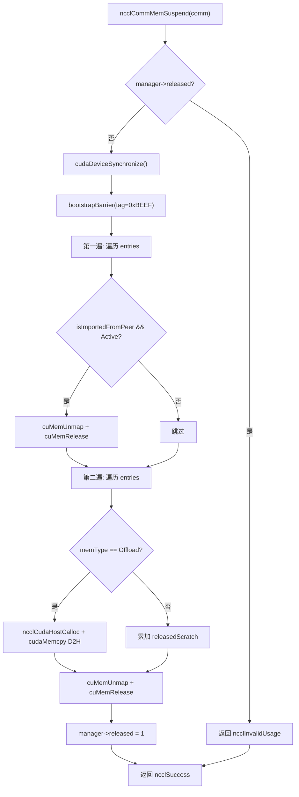
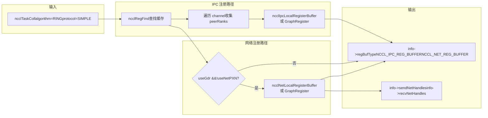
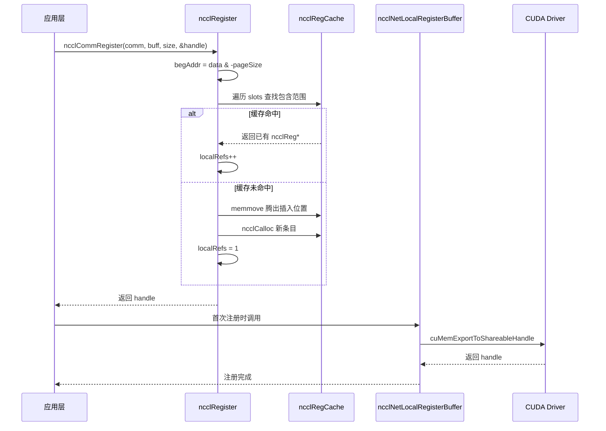

# Capítulo 18: Asignación de memoria y gestión de memoria de dispositivo: allocator, caché de registro y optimización de memoria registrada por el usuario

En el capítulo anterior vimos cómo el subsistema RAS opera de forma independiente del plano de datos en el plano de control, usando hashes para versionar y conteo de referencias para proteger el ciclo de vida. Este capítulo entra en el tercer pilar de NCCL: la gestión de memoria. El límite superior del rendimiento de la comunicación a menudo no depende del algoritmo en sí, sino de «si la tarjeta de red puede leer y escribir los datos directamente». Para ello, NCCL construye un mecanismo de tres capas: en la capa inferior usa`ncclSpace`y`ncclShadowPool`para gestionar el espacio de direcciones y los objetos sombra, en la capa intermedia usa`ncclMemManager`para rastrear la importación/exportación de memoria dinámica y la suspensión/reanudación, y en la capa superior usa`ncclCommRegister`para registrar los búferes de usuario en la caché, evitando fijar la memoria repetidamente en cada comunicación. Este capítulo desglosa estas tres capas de mecanismos y responde a «por qué NCCL necesita registrar memoria antes de comunicar» y «cómo afecta la caché de registro al rendimiento».

# 18.1 ncclSpace: dividir el espacio de direcciones en segmentos alternos llenos/vacíos

## Modelo intuitivo

Imagina una línea infinita de numeración de plazas de aparcamiento, que comienza en 0 y se extiende hacia la derecha. Algunas plazas tienen coches (asignadas), otras están vacías (no asignadas).`ncclSpace`es el «cuaderno de registro del estado de las plazas» de esta línea de numeración: no registra cada plaza, solo registra «los puntos límite donde el estado cambia». Sin él, NCCL tendría que mantener un bit de marca por cada byte al gestionar los intervalos de direcciones virtuales de la memoria simétrica, con un coste de memoria proporcional al espacio de direcciones, lo cual es completamente inaceptable.

## Estructura de datos y diseño de memoria

`ncclSpace`La definición de es extremadamente simple[FACT:src/include/allocator.h:20-24]：

```c
struct ncclSpace {
  int count;        // cuts[] 中有效元素个数
  int capacity;     // cuts[] 已分配容量
  int64_t* cuts;    // 升序排列的边界点数组
};
```

La idea central está claramente escrita en los comentarios del código fuente[FACT:src/allocator.cc:151-153]：`cuts[]`divide el eje de enteros no negativos en segmentos alternos de «lleno» y «vacío», con los puntos de corte ordenados de forma ascendente; el segmento posterior al último punto de corte es necesariamente vacío (frontera no asignada). De aquí se puede deducir la fórmula para determinar si el segmento`i`está lleno:

```
isFull(i) = (i%2 != ncuts%2)
```

El significado de esta fórmula es: el estado lleno/vacío de un segmento está determinado conjuntamente por «la paridad del índice del segmento» y «la paridad del número total de puntos de corte». Cuando`ncuts`es par, el segmento 0 (antes de`cuts[0]`) está vacío; cuando`ncuts`es impar, el segmento 0 está lleno. Esta invariante recorre todo el módulo.

## Recorrido paso a paso: cómo una asignación modifica cuts[]

Escenario: inicialmente`ncclSpace`está vacío (`count=0`), se llama a`ncclSpaceTryAlloc(a, limit=1000, size=100, align=1, &outOffset)`。

**Primer paso: localizar el primer segmento vacío** [FACT:src/allocator.cc:209]。`i = a->count % 2`, en este momento`count=0`, por lo que`i=0`, se escanea desde el segmento 0.

**Segundo paso: calcular los límites del segmento** [FACT:src/allocator.cc:212-213]。`i==0`cuando`lo=0`；`i==a->count`cuando`hi=limit=1000`. Por lo tanto, el segmento vacío es`[0, 1000)`。

**Tercer paso: alinear y comprobar la capacidad** [FACT:src/allocator.cc:214-215]。`off = alignUp(0, 1) = 0`，`0 + 100 <= 1000`se cumple, la asignación es exitosa.

**Cuarto paso: insertar puntos de corte** [FACT:src/allocator.cc:217-223]. Como`i==0`(inserción en la cabeza), se toma la ruta lenta`insertSegment(a, 0, 0, 100)`。`insertSegment`en`index=0`se insertan dos puntos de corte`lo=0, hi=100` [FACT:src/allocator.cc:172-174], y luego se ejecuta el «filtrado de valores duplicados adyacentes»[FACT:src/allocator.cc:185-203]. La lógica de filtrado es muy ingeniosa: escanea con dos cursores de lectura y escritura, y al encontrar un valor duplicado retrocede el cursor de escritura, eliminando los pares de valores duplicados, porque un par duplicado significa que un segmento vacío queda atrapado entre dos segmentos llenos y puede fusionarse. Pero los ceros iniciales son un caso especial y pueden eliminarse por separado[FACT:src/allocator.cc:182-184]。

Después de la asignación`cuts = [0, 100]`，`count=2`. En este momento`isFull(0) = (0%2 != 2%2) = false`, el segmento 0 (`[0,0)`, vacío) está vacío; el segmento 1 (`[0,100)`) está lleno. Correcto.

**Quinto paso: liberar** [FACT:src/allocator.cc:239-267]. Se llama a`ncclSpaceFree(a, 0, 100)`. Primero se comprueba si se cumple`cuts[count-1] <= offset`, es decir,[FACT:src/allocator.cc:231-237]es falso, se continúa. Se localiza el primer segmento lleno`100 <= 0`, por lo que`i = 1 - count%2 = 1 - 0 = 1` [FACT:src/allocator.cc:246]，`cuts[1]=100 > 0`. Se comprueba`i=1`。`lo = cuts[0] = 0`，`hi = cuts[1] = 100`falso,`offset < lo || hi < offset+size` [FACT:src/allocator.cc:252]，`0<0`falso, se pasa. Como`100<100`y`lo==offset`, ninguna de las dos rutas rápidas se cumple (la primera requiere`offset+size==hi`, la segunda requiere`offset+size != hi`), se toma la ruta lenta`lo != offset`. Tras la inserción`insertSegment(a, 1, 0, 100)` [FACT:src/allocator.cc:264], tras el filtrado queda`cuts = [0, 0, 100, 100]`. Se vuelve al estado inicial.`[]`，`count=0`Este diseño de «insertar y luego filtrar» evita realizar una lógica compleja de fusión de segmentos durante la asignación/liberación, concentrando la complejidad en

un único lugar.`insertSegment`Reflexiones de diseño y trampas en producción

## ¿Por qué usar int64_t en lugar de size_t?

**Porque**gestiona «desplazamientos» en lugar de «punteros»; los desplazamientos pueden ser negativos (aunque en la práctica no lo sean) y deben tener la misma anchura que`ncclSpace`de CUDA. Usar un tipo con signo facilita detectar desbordamientos durante la depuración.`CUdeviceptr`Trampa de rendimiento

**El comentario de afirma directamente «This could be binary search, but since allocate is linear there's no point»**：`ncclSpaceFree`. Esto significa que tanto la asignación como la liberación son escaneos O(n). Si un dominio de comunicación asigna y libera con frecuencia una gran cantidad de segmentos pequeños,[FACT:src/allocator.cc:245]se inflará y cada operación se volverá más lenta. En producción se deben reutilizar en la medida de lo posible los búferes ya registrados, en lugar de registrarlos y anularlos repetidamente.`cuts[]`Riesgo de desbordamiento en la alineación

**puede desbordarse cuando**：`alignUp(lo, align)`se acerca a`lo`y`INT64_MAX`es grande. El código fuente no lo comprueba explícitamente porque el llamador garantiza que`align`esté dentro de un rango razonable.`limit` 由调用方保证在合理范围内。

# 18.2 ncclShadowPool: gestión de emparejamiento entre objetos de dispositivo y sombras de host

## Modelo intuitivo

Los kernels de GPU se ejecutan en el dispositivo y no pueden acceder directamente a objetos C++ en la memoria del host (por ejemplo, los metadatos en`ncclDevComm`).`ncclShadowPool`Actúa como un «traductor»: asigna un bloque de memoria de dispositivo para cada objeto del lado del dispositivo, y al mismo tiempo asigna un bloque correspondiente de memoria «sombra» en el lado del host, y mantiene una tabla de mapeo «dirección de dispositivo → dirección de host». Cuando el host necesita modificar la configuración de algún objeto de dispositivo, primero modifica la sombra del host y luego la copia al dispositivo. Sin él, cada vez que un kernel necesita leer metadatos tendría que obtenerlos del host mediante`cudaMemcpy`, con una latencia inaceptablemente alta.

## Estructuras de datos y diseño de memoria

Dos estructuras principales[FACT:src/allocator.cc:272-277]：

```c
struct ncclShadowPage {   // 最多 64 个对象的连续块
  struct ncclShadowPage* next;
  int objSize;
  uint64_t freeMask;      // 位图，1=空闲，0=已占用
  void* devObjs;
};
struct ncclShadowObject {
  struct ncclShadowObject* next;
  void* devObj;
  void* hostObj;
  struct ncclShadowPage* page;  // null 表示直接分配在 CUDA mempool
};
```

`ncclShadowPool`en sí mismo[FACT:src/include/allocator.h:42-47]：

```c
struct ncclShadowPool {
  int count, hbits;                       // 对象数、哈希位数
  struct ncclShadowObject** table;        // 哈希桶数组
  cudaMemPool_t memPool;                  // 可选的 CUDA 内存池
  struct ncclShadowPage* pages;           // 页链表
};
```

**Puntos clave de diseño:`freeMask`es uint64_t**, por lo que cada página admite como máximo 64 objetos. Esto no es una elección arbitraria: 64 bits es exactamente el ancho de una línea de caché,`popFirstOneBit`se puede usar una sola instrucción`__builtin_ctzll`para encontrar el primer slot libre, sin necesidad de bucles.

**Estrategia de crecimiento de la tabla hash**: comentario del código fuente «Maintain 2:1 object:bucket ratio»[FACT:src/allocator.cc:368], es decir, se expande cuando el número de objetos supera el doble del número de buckets. Inicialmente`hbits=4`(16 buckets)[FACT:src/allocator.cc:363], duplicándose cada vez.

## Step-by-Step Walkthrough: cómo una asignación elige página o conexión directa

Escenario asumido:`ncclShadowPoolAlloc(pool, size=1024, &devObj, &hostObj, stream)`。

**Primer paso: inicialización perezosa** [FACT:src/allocator.cc:347-366]. Si`hbits==0`, primero consultar si el dispositivo soporta el pool de memoria[FACT:src/allocator.cc:352], si lo soporta crear`cudaMemPool_t`, establecer`maxSize`como parámetro`SHADOW_MEMPOOL_MAX_SIZE`(por defecto 1GB)[FACT:src/allocator.cc:359]. Luego asignar una tabla hash de 16 buckets.

**Segundo paso: comprobar si se necesita expansión** [FACT:src/allocator.cc:369-386]. Si`count+1 > 2<<hbits`, asignar un arreglo de buckets del doble de tamaño, recorrer la tabla antigua reinsertando (`hashInsert`usando`ncclHashPointer`para calcular el índice de bucket[FACT:src/allocator.cc:333-337]), liberar la tabla antigua.

**Tercer paso: decidir si tomar la ruta de página o la ruta de conexión directa** [FACT:src/allocator.cc:390]. La condición de decisión`(64<<10)/size >= 3`, es decir, cuando`size <= 21845`se toma la ruta de página. Para`size=1024`，`65536/1024=64 >= 3`, se toma la ruta de página.

**Cuarto paso: calcular el tamaño del objeto dentro de la página** [FACT:src/allocator.cc:391-392]。`shift = max(0, log2Down(1024)+1-4) = max(0, 10+1-4) = 7`。`pageObjSize = ((1024 + 127) >> 7) << 7 = 1024`. Es decir, el tamaño del objeto dentro de la página se alinea a potencias de 2 hasta un múltiplo de 128 bytes.

**Quinto paso: buscar o crear página** [FACT:src/allocator.cc:393-415]. Recorrer`pool->pages`la lista enlazada, buscar la página con`objSize == pageObjSize`. Si no existe, crear una nueva página:`pageSize = min(65536, 64*1024) = 65536`，`freeMask = uint64_t(-1) >> (64 - 65536/1024) = uint64_t(-1) >> 0 = 全 1`(los 64 slots completamente vacíos)[FACT:src/allocator.cc:400]. Usar`cudaMallocFromPoolAsync`o`cudaMalloc`para asignar memoria de dispositivo[FACT:src/allocator.cc:403-404], y`cudaMemsetAsync`poner a cero[FACT:src/allocator.cc:405]。

**Sexto paso: tomar un slot de la página** [FACT:src/allocator.cc:408-412]。`popFirstOneBit(&page->freeMask)`encontrar el primer bit libre,`devObj = page->devObjs + slot * pageObjSize`. Si`freeMask`se convierte en 0 (página llena), eliminar la página de la lista de páginas libres[FACT:src/allocator.cc:411]。

**Séptimo paso: asignar el objeto sombra del host** [FACT:src/allocator.cc:423-428]。`malloc(sizeof(ncclShadowObject) + alignof(max_align_t)-1 + size)`, nótese que aquí se asigna`alignof(max_align_t)-1`bytes adicionales para relleno de alineación.`hostObj = alignUp((char*)(obj+1), alignof(max_align_t))`, es decir, después de la cabecera del objeto se alinea al límite de alineación máximo. Luego`memset(hostObj, 0, size)`poner a cero.

**Octavo paso: insertar en la tabla hash y actualizar contadores** [FACT:src/allocator.cc:429-430]。

## Control de concurrencia e interacción con el hardware

`ncclShadowPool`en sí mismo**no tiene bloqueo**. Esto significa que solo puede usarse en un contexto de un solo hilo, o que el llamador debe garantizar la exclusión mutua. Según el uso real en NCCL, se invoca principalmente durante la fase de inicialización del dominio de comunicación, cuando es de un solo hilo.

`cudaMallocFromPoolAsync`y`cudaFreeAsync`son operaciones asíncronas, dependen del parámetro`stream`para garantizar el orden[FACT:src/allocator.cc:403,459]。`ncclShadowPoolDestruct`se llama después de liberar todos los recursos`cudaStreamSynchronize(stream)` [FACT:src/allocator.cc:333-337], asegurando que todas las liberaciones asíncronas se completen antes de destruir el pool de memoria.

## Guía de prevención de errores en producción

**Trampa 1: desperdicio de memoria causado por la alineación del tamaño de objeto dentro de la página**。`pageObjSize`se alinea a potencias de 2, si`size=1000`，`shift = log2Down(1000)+1-4 = 9+1-4 = 6`，`pageObjSize = ((1000+63)>>6)<<6 = 1024`. Cada objeto desperdicia 24 bytes, y 64 objetos dentro de una página desperdician 1536 bytes. Para una gran cantidad de objetos pequeños, este costo no es despreciable.

**Trampa 2:`ncclShadowPoolFree`comportamiento cuando no se encuentra el objeto** [FACT:src/allocator.cc:442-445]. Devuelve`ncclInternalError`e imprime una advertencia, pero**no libera ningún recurso**. Si el llamador ignora el valor de retorno, se producirá una fuga de memoria. El código de producción debe verificar el valor de retorno.

**Trampa 3:`ncclShadowPoolDestruct`en`freeMask==0`la página de** [FACT:src/allocator.cc:301-306]es reciclada`freeMask`. Nótese que aquí se establece`pool->pages`en 1 (en lugar de todo 1), lo que significa que solo se marca el primer slot como vacío. Esto es para volver a poner la «página llena» en la lista enlazada

# , pero los demás slots dentro de la página siguen ocupados; en realidad estos objetos están a punto de ser liberados, por lo que esta operación es segura. Pero si hay acceso concurrente durante el proceso de destrucción, se leerá un estado inconsistente.

## 18.3 ncclMemManager: conteo de referencias y suspensión/restauración de memoria dinámica

Modelo intuitivo`ncclMemManager`Las tareas de entrenamiento pueden ejecutarse durante días, durante los cuales la GPU puede ser expropiada por otras tareas, o puede ser necesario hacer checkpoints.

## Actúa como un «administrador de memoria»: registra toda la memoria asignada dinámicamente (scratch/offload), y cuando es necesario «suspende» la memoria de GPU (desmapea las páginas físicas, conserva las direcciones virtuales), respalda los datos en la CPU, y al restaurar vuelve a asignar páginas físicas, remapea y restaura los datos. Sin él, tras ser expropiada la tarea solo se podría empezar desde cero, desperdiciando horas de progreso de entrenamiento.

`ncclMemManager`Estructuras de datos y diseño de memoria[FACT:src/mem_manager.cc:32-60]：

| Campos principales de | (inferidos del código de inicialización) | Campo |
| --- | --- | --- |
| `entries` | `ncclDynMemEntry*` | Tipo |
| `numEntries` | `int` | Significado |
| `released` | `int` | Cabeza de la lista enlazada de entradas de memoria dinámica |
| `refCount` | `int` | Longitud de la lista enlazada |
| `totalPersist` | `size_t` | 0=activo, 1=suspendido |
| `totalScratch` | `size_t` | Conteo de referencias (múltiples comm pueden compartirlo) |
| `totalOffload` | `size_t` | Total de memoria persistente (atómico) |
| `cpuBackupUsage` | `size_t` | Total de memoria scratch (atómico) |
| `lock` | `std::mutex` | Total de memoria offload (atómico) |
| `initialized` | `int` | Total de memoria de respaldo en CPU |

**Protege la lista enlazada de entries**：`lock`Bandera atómica, evita acceder a un mutex ya destruido`std::mutex`Diseño clave del layout de memoria`ncclMemManager`es un`ncclCalloc`, pero[FACT:src/mem_manager.cc:39]se asigna con`~mutex()` [FACT:src/mem_manager.cc:120](estilo C), por lo que es obligatorio usar placement new para construir explícitamente

**, y llamar explícitamente a**al destruir. Esta es una trampa clásica de la programación mixta C/C++.`totalPersist`División de trabajo entre variables atómicas y bloqueos`entries`: los campos estadísticos (`lock`, etc.) se actualizan con operaciones atómicas, sin necesidad de bloqueo;`ncclCommMemStats`la lista enlazada se protege con[FACT:src/mem_manager.cc:1117-1130]. Así, las consultas estadísticas (

## Step-by-Step Walkthrough: flujo completo de suspensión y reanudación

**Flujo de suspensión** `ncclCommMemSuspend` [FACT:src/mem_manager.cc:418-540]：

**Primer paso: verificación previa** [FACT:src/mem_manager.cc:419-430]. Verificar si el gestor de memoria está deshabilitado, si comm está vacío, si ya está suspendido.

**Segundo paso: sincronización de dispositivos y barrier** [FACT:src/mem_manager.cc:440-441]。`cudaDeviceSynchronize()`Asegurar que todas las operaciones de GPU hayan finalizado, luego`bootstrapBarrier`Asegurar que todos los rank estén sincronizados. El barrier tag es`0xBEEF`。

**Tercer paso: primera pasada — unmap de todos los búferes importados de peers** [FACT:src/mem_manager.cc:444-465]. Para cada`isImportedFromPeer && state==Active`entrada de`cuMemUnmap`llamar a[FACT:src/mem_manager.cc:451]desmapear[FACT:src/mem_manager.cc:456], liberar handle`Released`。

**, cambiar estado a** [FACT:src/mem_manager.cc:468-526]Cuarto paso: segunda pasada — offload de memoria local`ncclMemOffload`. Omitir entradas importadas de peers y ya liberadas. Para tipo[FACT:src/mem_manager.cc:484], primero asignar respaldo en CPU`cudaMemcpy`, luego[FACT:src/mem_manager.cc:492]copiar de GPU a CPU`ncclMemScratch`. Para tipo[FACT:src/mem_manager.cc:508-513]，`cuMemUnmap` [FACT:src/mem_manager.cc:516]，`cuMemRelease` [FACT:src/mem_manager.cc:519], solo acumular estadísticas. Luego cerrar shareable FD`Released`。

**, cambiar estado a** [FACT:src/mem_manager.cc:528]。

**Quinto paso: marcar como suspendido** `ncclCommMemResume` [FACT:src/mem_manager.cc:550-942]：

**Flujo de reanudación** [FACT:src/mem_manager.cc:577-668]Primer paso: restaurar memoria local`!isImportedFromPeer && state==Released`. Para cada`cuMemCreate` [FACT:src/mem_manager.cc:599]，`ncclCuMemMapAndSetAccess`entrada de[FACT:src/mem_manager.cc:602], re[FACT:src/mem_manager.cc:610-626]mapear a la misma dirección virtual[FACT:src/mem_manager.cc:632-643], restaurar permisos de acceso peer[FACT:src/mem_manager.cc:646-658]。

**, para tipo offload restaurar datos desde respaldo en CPU** [FACT:src/mem_manager.cc:671-679], reexportar FABRIC handle`0xBEEF`。

**Segundo paso: sincronización barrier** [FACT:src/mem_manager.cc:688-816]. El tag sigue siendo[FACT:src/mem_manager.cc:689-696]Tercer paso: intercambiar información de nuevos handles`bootstrapAllGather`. Contar cuántos búferes locales necesita broadcast cada rank[FACT:src/mem_manager.cc:710], usar[FACT:src/mem_manager.cc:724-728]intercambiar conteos`bootstrapSend`, calcular offsets`bootstrapRecv`, luego primero[FACT:src/mem_manager.cc:783]）。

**y después** [FACT:src/mem_manager.cc:822-911]（comentario explícito «send first, then receive to avoid deadlock»`isImportedFromPeer && state==Released`Cuarto paso: reimportar búferes de peers[FACT:src/mem_manager.cc:829-835]. Para cada[FACT:src/mem_manager.cc:853-859]entrada de[FACT:src/mem_manager.cc:866]，`cuMemImportFromShareableHandle`, buscar información de handle coincidente en los resultados del intercambio[FACT:src/mem_manager.cc:873]. Tipo POSIX FD requiere verificar si hostHash es igual[FACT:src/mem_manager.cc:878], luego obtener FD a través de proxy`ncclCuMemMapAndSetAccess`importar[FACT:src/mem_manager.cc:893]。

**. Tipo FABRIC importar directamente** [FACT:src/mem_manager.cc:916-928]. Luego`0xCAFE`remapear`0xBEEF`Quinto paso: barrier final

## . El tag es

**, distinto del**：`ncclMemManagerDestroy`anterior.`refCount` [FACT:src/mem_manager.cc:76]Control de concurrencia e interacción con hardware[FACT:src/mem_manager.cc:81]Conteo de referencias protege el ciclo de vida

**primero decrementar**, si sigue siendo mayor que 0 solo limpiar el puntero del comm actual`COMPILER_ATOMIC_LOAD(&manager->initialized, memory_order_acquire)` [FACT:src/mem_manager.cc:136,242,338,358], no liberar recursos. Esto permite que múltiples comm compartan el mismo gestor de memoria (por ejemplo, escenario split_share).`memory_order_release`Bandera atómica initialized[FACT:src/mem_manager.cc:87]: verificar

**antes de todas las operaciones, para prevenir acceso a mutex ya destruido. Al destruir usar**：`cuMemCreate`/`cuMemMap`/`cuMemUnmap`/`cuMemRelease`almacenar 0

## , asegurando que las escrituras previas sean visibles para otros hilos.

**Uso de CUDA VMM API** [FACT:src/mem_manager.cc:1014-1018]es la API de gestión de memoria virtual de CUDA, que permite separar memoria física y dirección virtual. Esta es la base de suspensión/reanudación — al suspender se hace unmap de páginas físicas pero se retiene la dirección virtual, al reanudar se remapea a la misma dirección virtual, de modo que todas las relaciones de punteros ya establecidas no necesitan modificarse.`refCount > 1`Guía de prevención de errores en producción`ncclInvalidUsage`Error 1: el dominio de comunicación split_share no soporta suspensión

**. Si** [FACT:src/mem_manager.cc:853-859], retornar directamente`hostHash`. Porque cuando múltiples comm comparten el gestor de memoria, suspender un comm afecta la memoria de otros comm.

**Error 2: POSIX FD inválido entre nodos** [FACT:src/mem_manager.cc:635]. Los descriptores de archivo POSIX solo son válidos dentro del mismo nodo, deben omitirse al reanudar entre nodos. El código fuente usa`cudaMemcpy`comparación para determinar si es el mismo nodo.`cpuBackup`Error 3: conservar respaldo cuando falla la restauración de datos offload

**. Si`ncclMemUntrackDynamic`falla la restauración de CPU a GPU, el código fuente imprime advertencia y conserva**, no libera. Esto es para dar al llamador una oportunidad de reintentar, pero si no se reintenta se filtrará memoria de CPU.[FACT:src/mem_manager.cc:302]Error 4:[FACT:src/mem_manager.cc:311-327]riesgo de use-after-free en`info`. El código fuente bajo lock encuentra la entrada, guarda información necesaria, libera la entrada`info`, luego fuera del lock actualiza estadísticas



apunta a memoria de pila del llamador, y el llamador lee fuera del lock, se necesita asegurar que el ciclo de vida de

# cubra toda la función.

## Copiar

La figura anterior muestra el flujo de control del proceso de suspensión. Notar dos ramas clave: la primera pasada solo procesa búferes importados de peers, la segunda pasada solo procesa búferes locales, el orden no puede invertirse — primero debe desreferenciarse la memoria de peers, luego liberar la memoria local.`ncclRegister`18.4 Caché de registro: cómo ncclRegister evita pin duplicado

## Modelo intuitivo

`ncclRegCache`La tarjeta de red necesita leer/escribir directamente la memoria de GPU (GPUDirect RDMA), primero debe «registrar» esta memoria — decirle a la tarjeta de red «esta dirección puedes acceder directamente». El proceso de registro involucra pin de páginas, establecer mapeo IOMMU, con costo muy alto (nivel de milisegundos). Si cada AllReduce re-registra, la latencia de comunicación de mensajes pequeños sería completamente ahogada por el costo de registro.`slots`es una «caché de registro»: registra los rangos de direcciones ya registrados en un arreglo ordenado, la próxima vez que encuentre un búfer igual o contenido, lo reutiliza directamente, sin re-registrar.`ncclReg*`。`ncclReg`Estructura de datos y diseño de memoria

| el núcleo es un arreglo ordenado | , cada elemento es | campos clave (inferidos del uso): |
| --- | --- | --- |
| `begAddr` | `uintptr_t` | Campo |
| `endAddr` | `uintptr_t` | Tipo |
| `localRefs` | `int` | Significado |
| `graphRefs` | `int` | Dirección de inicio alineada a página |
| `state` | `int` | Dirección de fin alineada a página |
| `netHandleHead` | `ncclRegNetHandles*` | Conteo de referencias local |
| `ipcInfos` | `ncclIpcInfo**` | Matriz de información IPC |

**Alineación de página**：`begAddr = (uintptr_t)data & -pageSize` [FACT:src/register/register.cc:31]，`endAddr = ((uintptr_t)data + size + pageSize - 1) & -pageSize` [FACT:src/register/register.cc:32]。`-pageSize`es`pageSize`el complemento a dos de, equivalente a «alinear hacia abajo al múltiplo de pageSize». La razón de esto es: la granularidad mínima de registro es la página; incluso si solo se registra 1 byte, se debe registrar la página completa.

## Step-by-Step Walkthrough: cómo un registro impacta en la caché

Escenario asumido:`ncclCommRegister(comm, buff=0x7f0000001000, size=4096, &handle)`。

**Primer paso: verificación de parámetros y alineación de página** [FACT:src/register/register.cc:18-24]。`CommCheck`validar la validez de comm. Supongamos`pageSize=4096`，`begAddr = 0x7f0000001000 & -4096 = 0x7f0000001000`，`endAddr = (0x7f0000001000 + 4096 + 4095) & -4096 = 0x7f0000002000`。

**Segundo paso: verificación de memoria del sistema** [FACT:src/register/register.cc:36-64]. Si`ncclCuMemEnable()`, consultar el rango de direcciones y el tipo de memoria. Si`memType == CU_MEMORYTYPE_HOST`, indica que es memoria CPU, omitir el registro[FACT:src/register/register.cc:58-61]. En caso contrario, verificar si existe un segmento Sysmem[FACT:src/register/register.cc:50-55]。

**Tercer paso: recorrer la caché para encontrar la posición de inserción** [FACT:src/register/register.cc:66-89]. Bucle`slot`desde 0:

- Si`slot == population`(se alcanza el final) o`begAddr < slots[slot]->begAddr`(la dirección actual está antes de la entrada de caché), indica que se necesita crear una nueva entrada[FACT:src/register/register.cc:67]。
- Si`slots[slot]->begAddr <= begAddr && slots[slot]->endAddr >= endAddr`, indica que el búfer actual está completamente contenido por una entrada existente, incrementar directamente el contador de referencias[FACT:src/register/register.cc:83-87]。

**Cuarto paso: crear nueva entrada** [FACT:src/register/register.cc:68-82]. Si la caché está llena, expandir (inicialmente 32, luego duplicar)[FACT:src/register/register.cc:70]. Usar`memmove`en`slot`posición para liberar espacio[FACT:src/register/register.cc:73]，`ncclCalloc`asignar nueva entrada[FACT:src/register/register.cc:74], establecer`begAddr`/`endAddr`, según`isGraph`establecer`graphRefs`o`localRefs`a 1[FACT:src/register/register.cc:78-79]，`population++`, devolver handle.

**Quinto paso: desregistro** [FACT:src/register/register.cc:172-195]。`commDeregister`primero encontrar el slot correspondiente al handle[FACT:src/register/register.cc:180], decrementar el contador de referencias[FACT:src/register/register.cc:185-186]. Si aún hay referencias, devolver directamente[FACT:src/register/register.cc:187]. En caso contrario, llamar a`regCleanup`limpiar todos los registros subyacentes[FACT:src/register/register.cc:188], liberar la entrada, usar`memmove`para rellenar el hueco[FACT:src/register/register.cc:190]，`population--`。

## Reflexiones de diseño y trampas en producción

**¿Por qué usar un array ordenado en lugar de una tabla hash?**Porque la consulta de registro es una consulta de «contención de rango», no una coincidencia exacta. El array ordenado soporta búsqueda binaria (aunque el código fuente usa escaneo lineal), y tiene buena localidad de memoria. La tabla hash no puede manejar eficientemente consultas del tipo «¿está esta dirección contenida por algún rango mayor?».

**`regCleanup`Diseño de bits de estado de** [FACT:src/register/register.cc:95-134]。`state`es una máscara de bits, cada bit corresponde a un tipo de registro (NET/NVLS/COLLNET/IPC). Al limpiar, se verifica bit a bit, limpiando solo los registros completados. Este diseño permite situaciones donde parte del registro tiene éxito y parte falla — por ejemplo, el registro de red tiene éxito pero el registro IPC falla; al limpiar, solo se limpia la parte de red.

**Trampa en producción: la caché de registro no percibe la liberación de memoria**. Si el usuario registra un búfer y luego, sin desregistrarlo, lo`cudaFree`, la caché aún conserva esta entrada. La siguiente asignación puede reutilizar la misma dirección, causando un impacto en caché pero con memoria ya inválida. La convención de NCCL es: registro y desregistro deben estar emparejados; el usuario es responsable de garantizar que la memoria no se libere durante el registro.

**`ncclCommRegister`Condición de omisión de** [FACT:src/register/register.cc:150-159]. Si`LocalRegister=0`o`P2pUsesMemcpy=1`, devolver directamente`NULL`handle. Esto significa que en ciertas configuraciones (por ejemplo, P2P usa memcpy en lugar de RDMA), el registro se omite completamente. El llamador debe verificar si el handle es NULL.

# 18.5 Registro de comunicación colectiva: cómo coll_reg selecciona la estrategia de registro para diferentes algoritmos

## Modelo intuitivo

Diferentes algoritmos de comunicación colectiva siguen diferentes rutas de transmisión: NVLS usa NVLink SHARP, Ring usa P2P o red, Tree usa topología de árbol. Cada ruta requiere un método de registro diferente: NVLS necesita registrarse en el hardware NVLS, la red necesita registrarse en la tarjeta de red, IPC necesita registrarse en la GPU par.`coll_reg.cc`es el «enrutador de estrategias de registro»: según el algoritmo, protocolo y tipo de búfer, decide qué funciones de registro llamar. Sin él, cada algoritmo tendría que implementar su propia lógica de registro, con código duplicado y propenso a errores.

## Step-by-Step Walkthrough: decisión de registro del algoritmo Ring

Escenario asumido:`ncclRegisterCollBuffers(comm, info, outRegBufSend, outRegBufRecv, cleanupQueue, regNeedConnect)`, donde`info->algorithm == NCCL_ALGO_RING`，`info->protocol == NCCL_PROTO_SIMPLE`。

**Primer paso: verificaciones previas** [FACT:src/register/coll_reg.cc:155-157]. Establecer`regBufType = NCCL_REGULAR_BUFFER`，`regNeedConnect = true`. Si`LocalRegister=0`y no es registro de grafo persistente, salir directamente.

**Segundo paso: entrar en la rama Ring** [FACT:src/register/coll_reg.cc:338]. Inicializar`recvRegRecord`/`sendRegRecord`a NULL, asignar`sendNetConns`/`sendNetHandles`/`recvNetConns`/`recvNetHandles`/`srecvNetHandles`array[FACT:src/register/coll_reg.cc:356-360]。

**Tercer paso: buscar registros existentes** [FACT:src/register/coll_reg.cc:351-355]。`ncclRegFind`buscar los búferes recv/send en la caché. Si recv no se encuentra y no es registro de grafo persistente, salir[FACT:src/register/coll_reg.cc:352]. Si es entre nodos y send no se encuentra y no es registro de grafo persistente, salir[FACT:src/register/coll_reg.cc:354]。

**Cuarto paso: recorrer todos los channels para recolectar peers** [FACT:src/register/coll_reg.cc:362-393]. Para cada channel, verificar`ring.prev`y`ring.next`. Si el flag de conexión contiene`NCCL_DIRECT_NIC`, registrar en`recvNetConns`/`sendNetConns` [FACT:src/register/coll_reg.cc:370-379]. Si contiene`NCCL_P2P_READ | NCCL_P2P_WRITE`, agregar el peer a`peerRanks`array[FACT:src/register/coll_reg.cc:382-391]。

**Quinto paso: registro IPC** [FACT:src/register/coll_reg.cc:394-407]. Si`nPeers > 0 && comm->isAllDirectP2p`, primero intentar registro de grafo[FACT:src/register/coll_reg.cc:395-399], si falla intentar registro local[FACT:src/register/coll_reg.cc:400-403]. Si tiene éxito, establecer`regBufType = NCCL_IPC_REG_BUFFER` [FACT:src/register/coll_reg.cc:406]。

**Sexto paso: registro de red** [FACT:src/register/coll_reg.cc:409-457]. Verificar`!comm->useNetPXN && comm->useGdr && netDeviceType != UNPACK`y no AllReduce de PreMulSum/SumPostDiv[FACT:src/register/coll_reg.cc:415-418]. Primero intentar registro de grafo[FACT:src/register/coll_reg.cc:419-430], si falla registro local[FACT:src/register/coll_reg.cc:431-442]. Si tiene éxito, establecer`regBufType |= NCCL_NET_REG_BUFFER`, guardar el array de handles[FACT:src/register/coll_reg.cc:445-452]。

**Séptimo paso: ajustar el número de channels** [FACT:src/register/coll_reg.cc:551-554]. Si solo hay registro IPC y es nodo único y el número de channels está entre 17-24, reducir a 16. Esto es para coincidir con las características de ancho de banda tras el registro IPC.

## Reflexiones de diseño y trampas en producción

**¿Por qué el orden de registro de NVLS y Ring es inverso?**La rama NVLS primero intenta registro de grafo y luego registro local[FACT:src/register/coll_reg.cc:86-94], mientras que la rama Ring primero local y luego grafo[FACT:src/register/coll_reg.cc:395-403]. Esto se debe a que el registro de grafo de NVLS tiene más probabilidades de éxito (el hardware NVLS tiene optimizaciones para búferes persistentes), mientras que el registro local de Ring es más ligero.

**`isMloPartBufRdmaCapable`Decisión global de** [FACT:src/register/coll_reg.cc:14-37]. Los comentarios enfatizan «La decisión de registro debe ser global, utilizando garantías a nivel de comunicador»[FACT:src/register/coll_reg.cc:20]. Esto significa que incluso si el búfer de un rank soporta RDMA, si un solo rank dentro del dominio de comunicación no lo soporta, todo el dominio de comunicación no se registra. Esto es para evitar inconsistencias causadas por el registro parcial de algunos ranks y la falta de registro de otros.

**Trampa en producción: degradación silenciosa cuando falla el registro**。`ncclRegisterCollBuffers`no reporta error cuando falla el registro, simplemente no establece`regBufType`el bit correspondiente. Esto significa que la comunicación aún funciona, solo que con rendimiento degradado. En entornos de producción, si el rendimiento no alcanza lo esperado, se deben revisar`NCCL_REG`los logs para confirmar si el registro fue exitoso.



La figura anterior muestra dos rutas de registro paralelas bajo el algoritmo Ring: la ruta IPC maneja conexiones P2P dentro del mismo nodo, y la ruta de red maneja conexiones RDMA entre nodos. Ambas rutas se ejecutan de forma independiente y finalmente convergen en`info->regBufType`。

# 18.6 Cadena de prevención de errores en producción y recuperación de fallos

## Trampa 1: Interacción entre la caché de registro y el pool de memoria

Cuando se usa`ncclMemAlloc`para asignar memoria, internamente se utiliza la API CUDA VMM[FACT:src/allocator.cc:38-94]. La memoria física creada mediante este método de asignación lleva el flag`gpuDirectRDMACapable`[FACT:src/allocator.cc:54], lo que significa que soporta RDMA de forma nativa. Pero cuando`ncclMemFree`libera, si el gestor de memoria ya fue destruido, se toma la ruta de fallback`cudaFree`[FACT:src/allocator.cc:130-132]. Esto puede provocar que la memoria asignada por VMM sea liberada erróneamente con`cudaFree`. En entornos de producción se debe garantizar que`ncclMemAlloc`/`ncclMemFree`se usen en pares, y no liberar después de que el gestor de memoria haya sido destruido.

## Trampa 2: Solicitudes de comunicación durante la suspensión

`ncclCommMemSuspend`Durante la ejecución de , ¿qué sucede si llega una nueva solicitud de comunicación? El código fuente llama a`cudaDeviceSynchronize()` [FACT:src/mem_manager.cc:440]antes de suspender, asegurando que todas las operaciones de GPU ya encoladas se completen. Pero si hay solicitudes de comunicación del lado host siendo encoladas, no hay protección explícita. En entornos de producción se deberían detener todos los hilos de comunicación antes de suspender, o usar semántica de grupo para garantizar que la operación de suspensión sea serializada con respecto a otras operaciones.

## Trampa 3: Compatibilidad del handle FABRIC

`ncclMemAlloc`en CUDA 12.3+ intentará usar el handle FABRIC[FACT:src/allocator.cc:60-71]. Si`cuMemCreate`devuelve`CUDA_ERROR_NOT_PERMITTED`o`CUDA_ERROR_NOT_SUPPORTED`, se recurre a POSIX FD[FACT:src/allocator.cc:63-65]. Pero al recuperar, si el tipo de handle es FABRIC pero la exportación falla, se reporta error directamente y se hace unmap[FACT:src/mem_manager.cc:649-655]. Esto significa que en entornos mixtos (algunas GPU soportan FABRIC, otras no), la suspensión/recuperación puede fallar.

## Trampa 4: Fuga de conteo de referencias

`ncclRegister`cada acierto en la caché incrementa el conteo de referencias[FACT:src/register/register.cc:84-85]. Si el llamador registra N veces pero solo desregistra M veces (M < N), el conteo de referencias nunca llegará a cero,`regCleanup`nunca será llamado, y los recursos de registro subyacentes se filtrarán. El código de producción debe emparejar estrictamente`ncclCommRegister`/`ncclCommDeregister`。



# Reflexiones y autoevaluación de este capítulo

Q1: Si se elimina`ncclSpaceFree`en`if (a->count == 0 || a->cuts[a->count - 1] <= offset)`la verificación[FACT:src/allocator.cc:231-237], ¿en qué escenarios se desencadenaría un acceso fuera de límites?

**Análisis de referencia**: Esta verificación tiene dos propósitos. Primero,`a->count == 0`previene el acceso a un array vacío`cuts[-1]`. Segundo,`a->cuts[a->count-1] <= offset`previene que`offset`exceda el rango asignado. Si se elimina, cuando`count == 0`,`a->cuts[a->count - 1]`leerá`cuts[-1]`, lo cual es comportamiento indefinido, pudiendo leer metadatos del heap o provocar un segmentation fault. Aún más sutil: incluso si`count > 0`, si`offset`es mayor que el último punto de corte, el bucle subsiguiente`while (a->cuts[i] <= offset) i += 2`[FACT:src/allocator.cc:247]incrementará`i`hasta salirse de límites, porque en`cuts[]`no existe ningún elemento mayor que`offset`. El escenario que desencadena esto en producción es: el llamador pasa un offset que nunca fue asignado (por ejemplo, el búfer fue liberado externamente y luego se llama a free de nuevo), o`ncclSpace`fue modificado concurrentemente causando inconsistencia de estado. La forma de corregirlo es mantener esta verificación, e imprimir`offset`y`count`al devolver error para facilitar el diagnóstico.

Q2: `ncclMemManagerDestroy`en, si`refCount`tras decrementar sigue siendo mayor que 0, solo se limpia el puntero del comm actual sin liberar recursos[FACT:src/mem_manager.cc:78-83]. Si en ese momento otro comm está llamando a`ncclMemTrack`, ¿qué sucede?

**Análisis de referencia**：`ncclMemTrack`primero verifica`manager->initialized` [FACT:src/mem_manager.cc:136]. Dado que cuando`refCount > 0`no se establece`initialized = 0`, la verificación pasa. Luego obtendrá`manager->lock`y modificará la lista enlazada`entries`[FACT:src/mem_manager.cc:188-192]. Esto es seguro, porque`refCount > 0`significa que al menos un comm más mantiene una referencia, y el gestor de memoria no será destruido. El riesgo real está en que: si el último comm llama a`ncclMemManagerDestroy`cuando`refCount`decrementa a 0, establecerá`initialized = 0` [FACT:src/mem_manager.cc:87]y liberará todos los recursos. Si en ese momento otro hilo está en`ncclMemTrack`y ya pasó la verificación de`initialized`pero aún no ha adquirido el lock, accederá a`manager->lock`ya liberado, causando use-after-free. El código fuente mitiga este problema mediante el emparejamiento de`memory_order_acquire`/`release`, pero estrictamente hablando aún existe una ventana de carrera. En entornos de producción se debe garantizar que todos los hilos de comunicación se hayan detenido antes de destruir el gestor de memoria.

Q3: En`ncclCommMemResume`, los búferes peer de tipo POSIX FD se omiten al cruzar nodos[FACT:src/mem_manager.cc:853-859]. Si todos los búferes peer son omitidos,`restoredPeerCount`es 0, pero`manager->released`aún se establece en 0[FACT:src/mem_manager.cc:913]. ¿Qué consecuencias provoca esto?

**Análisis de referencia**：`manager->released = 0`indica que el gestor de memoria considera que la recuperación se ha completado. Pero si hay búferes peer omitidos, sus`state`siguen siendo`ncclDynMemStateReleased`，`handle`sigue siendo 0. Si comunicaciones posteriores acceden a estos búferes, se desencadenará un error de CUDA (acceso a una dirección virtual no mapeada). Más grave aún,`ncclCommMemStats`al consultar`ncclStatGpuMemSuspended`devolverá 0 (activo)[FACT:src/mem_manager.cc:1130], pero en realidad parte de la memoria no fue recuperada. La raíz de este problema es: los POSIX FD entre nodos no deberían importarse en absoluto — antes de la suspensión, estos búferes no deberían existir en`entries`En el caso correcto, al suspender se deben marcar las entradas de POSIX FD entre nodos como irrecuperables, o devolver un error al reanudar en lugar de omitirlas silenciosamente. En producción, si se usan POSIX FD entre nodos, se debería cambiar a un handle FABRIC o asegurar que la suspensión/reanudación ocurra solo dentro de un único nodo.

La gestión de memoria es el pilar invisible del rendimiento de NCCL:`ncclSpace`Se gestiona el espacio de direcciones con un array minimalista de puntos de corte,`ncclShadowPool`Se gestiona el emparejamiento de objetos dispositivo/host con un mapa de bits de 64 bits y una tabla hash,`ncclMemManager`Se implementa la suspensión/reanudación con conteo de referencias y la API CUDA VMM,`ncclRegister`Se cachean los resultados de registro en un array ordenado para evitar pins duplicados. Estas cuatro capas de mecanismos sostienen conjuntamente la garantía clave de rendimiento de «no es necesario volver a registrar memoria antes de comunicar». En el próximo capítulo entraremos en el comunicador del lado del dispositivo y la compatibilidad ABI, para ver`devcomm`cómo se mapean estas disposiciones de memoria del lado host a estructuras accesibles desde el kernel de GPU.

La figura anterior muestra la secuencia temporal del registro: en caso de acierto de caché solo se incrementa el conteo de referencias, sin llamar al registro subyacente; solo en caso de fallo de caché se crea una nueva entrada y se dispara el registro subyacente. Hasta aquí, el mecanismo de gestión de memoria del lado host queda claro. Pero la comunicación ocurre finalmente en la GPU, y el kernel necesita acceder directamente a las direcciones y al estado de conexión del rank remoto. El próximo capítulo entrará en el comunicador del lado del dispositivo y la compatibilidad ABI, para ver cómo devcomm mapea los metadatos de ncclComm del lado host a estructuras accesibles desde el lado del dispositivo, y cómo el ABI versionado garantiza la compatibilidad entre kernels y bibliotecas nuevos y antiguos.
