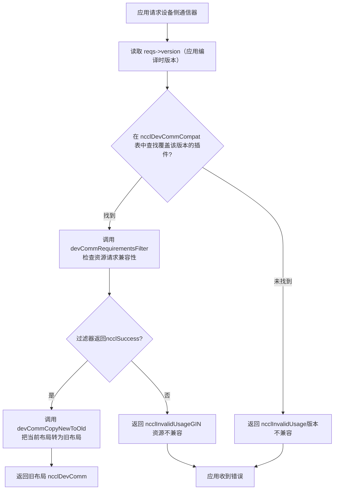
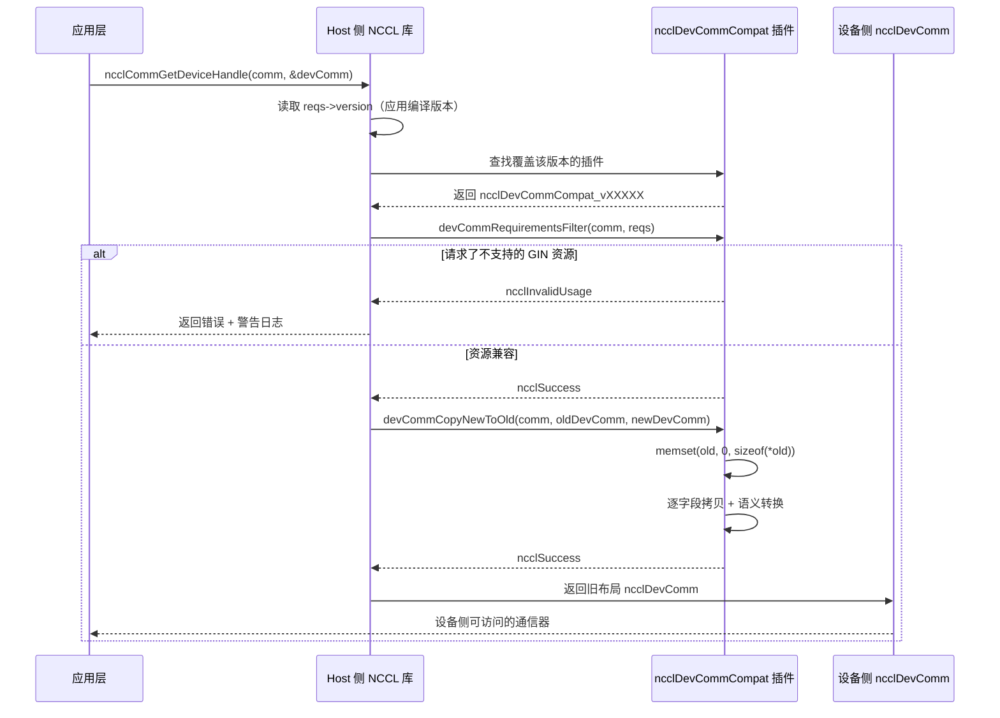

# Capítulo 19: Dominio de comunicación del lado del dispositivo y compatibilidad ABI: el contrato de comunicación entre devcomm y el kernel

En el capítulo anterior vimos que ncclMemManager del lado host gestiona el ciclo de vida del búfer de comunicación con conteo de referencias y la API CUDA VMM. Pero el lugar donde realmente ocurre la comunicación es el kernel de GPU: los hilos dentro del kernel necesitan saber: ¿qué rank soy? ¿En qué dirección virtual está el búfer del rank remoto? ¿Está lista la conexión? Esta información está en la estructura ncclComm del lado host, pero el kernel no puede desreferenciar punteros del host directamente. Si NCCL hiciera que el kernel obtuviera estos metadatos cada vez mediante paso de parámetros o consultas a memoria global, entonces cada comunicación pagaría un coste adicional de latencia y ancho de banda. Peor aún, una vez compilado el código del kernel, los desplazamientos de los campos a los que accede quedan fijados: si tras actualizar la biblioteca cambia la disposición de ncclComm, el kernel antiguo leería datos incorrectos. Este es el problema central que devcomm debe resolver: mapear los metadatos clave del dominio de comunicación del lado host, con una disposición de memoria estable y versionada, a estructuras accesibles desde el lado del dispositivo. Los archivos devcomm_v22902.cc, devcomm_v22907.cc, devcomm_v23000.cc y devcomm_v23100.cc bajo el directorio src/devcomm son la implementación concreta de este ABI versionado. Cada archivo corresponde a un intervalo de versiones de NCCL, define la disposición de memoria exacta de ncclDevComm dentro de ese intervalo y la lógica de copia de campos entre versiones nuevas y antiguas. Este capítulo desglosará en orden: cómo son las estructuras de datos centrales del comunicador del lado del dispositivo, cómo funcionan el registro y la coincidencia del ABI versionado, cómo se realiza la conversión a nivel de campo entre versiones nuevas y antiguas, y cuáles son los límites y trampas de este mecanismo en entornos de producción.

# I. La estructura central del comunicador del lado del dispositivo: la disposición de memoria de ncclDevComm

## Modelo intuitivo

Imagina`ncclDevComm`como una «tarjeta de puesto de trabajo»: cada vez que se lanza un kernel de GPU, recibe una tarjeta en la que está impreso «eres el rank 3, hay 8 ranks en total, tu grupo LSA tiene 4 ranks, la dirección base del búfer remoto está en 0x7f...». Esta tarjeta debe ser lo bastante pequeña (para caber en los parámetros del kernel) y, a la vez, contener toda la información clave. Si esta tarjeta no existiera, el kernel solo podría depender de que el lado host pasara parámetros repetidamente, reensamblándolos en cada comunicación: alta latencia y propenso a errores.

## Estructuras de datos y disposición de memoria

Tomando`ncclDevComm_v23000`como ejemplo, su definición completa está en[FACT:src/devcomm/devcomm_v23000.cc:25-62]：

```c
struct ncclDevComm_v23000 {
  unsigned int magic;          // 偏移 0，魔数校验
  unsigned int version;        // 偏移 4，版本号

  int rank, nRanks;            // 偏移 8, 12
  uint32_t nRanks_rcp32;       // 偏移 16，nRanks 的倒数（定点数）
  int lsaRank, lsaSize;        // 偏移 20, 24
  uint32_t lsaSize_rcp32;      // 偏移 28

  ncclDevCommWindowTable_t windowTable;  // 偏移 32
  ncclWindow_t resourceWindow;           // 偏移 40
  ncclResourceWindow_vidmem_v23000_t resourceWindow_inlined;  // 偏移 48
  ncclGinBarrierHandle_t hybridWorldGinBarrier;  // 偏移 112
  ...
};
```

[FACT:src/devcomm/devcomm_v23000.cc:64-93]Con una serie de`static_assert`se fija el desplazamiento de cada campo. Esto no es decorativo: es un contrato en tiempo de compilación para la compatibilidad ABI. Si el desplazamiento de algún campo se moviera debido a un cambio en la estrategia de alineación del compilador, la compilación fallaría, en lugar de producir en tiempo de ejecución un desalineamiento de memoria difícil de depurar.

Motivaciones de diseño de varios campos clave:

> **[Design Inference & Architectural Trade-offs]**
> **`nRanks_rcp32`y`lsaSize_rcp32`**: esto es`nRanks`y`lsaSize`el recíproco de , representado con un número de punto fijo de 32 bits. Cuando el kernel realiza la operación de división para calcular el desplazamiento de rank a buffer, la división entera de la GPU es muy lenta; usar la multiplicación por el recíproco y luego un desplazamiento puede acelerar significativamente. Este es un caso típico de «intercambiar espacio por tiempo»: almacenar 4 bytes adicionales para ahorrar las decenas de ciclos de reloj de cada división.

**`resourceWindow_inlined`**: este es un descriptor de ventana en línea, de tipo`ncclResourceWindow_vidmem_v23000_t`. Nótese[FACT:src/devcomm/devcomm_v23000.cc:11-18]su definición en :

```c
typedef struct ncclResourceWindow_vidmem_v23000 {
  char reserved1[8];
  char* lsaFlatBase;
  char reserved2[8];
  uint32_t stride4G;
  uint32_t mcOffset4K;
  char reserved3[32];  // NOTE: shrunk from 40 in 2.30u1 to reclaim 8 bytes
} ncclResourceWindow_vidmem_v23000_t;
```

Aquí`reserved1`、`reserved2`、`reserved3`es**campo de relleno**, usado como marcador de posición. ¿Por qué se necesita relleno? Porque`ncclDevComm_v23000`el diseño debe mantener desplazamientos consistentes con alguna «versión base»; incluso si algunos campos ya no se usan en la versión actual, se deben conservar como marcadores de posición para garantizar que los desplazamientos de los campos posteriores no cambien.[FACT:src/devcomm/devcomm_v23000.cc:11-18]El comentario de  indica claramente: 2.30u1 reduce`reserved3`de 40 bytes a 32 bytes, liberando 8 bytes para`hybridWorldGinBarrier`. Esta es una**reorganización del diseño**: al reducir el área de relleno, se insertan nuevos campos sin cambiar el tamaño total.

[FACT:src/devcomm/devcomm_v23000.cc:11-18]La`static_assert`de  lo verifica además:`lsaFlatBase`、`stride4G`、`mcOffset4K`los desplazamientos de los tres campos deben coincidir con`ncclWindow_vidmem`de la «versión actual», y el tamaño total de la estructura es de 64 bytes. Esto significa que`resourceWindow_inlined`es**binariamente compatible**entre v23000 y la versión actual: se puede hacer memcpy directamente.

## La familia de estructuras versionadas

Comparando`ncclDevComm_v22902` [FACT:src/devcomm/devcomm_v22902.cc:38-62]y`ncclDevComm_v22907` [FACT:src/devcomm/devcomm_v22907.cc:13-41], se puede ver la evolución de los campos:

| Campo | v22902 | v22907 | v23000 |
| --- | --- | --- | --- |
| `magic`/`version` | Ninguno | Ninguno | Sí (desplazamiento 0/4) |
| `ginContextCount` | uint8_t | uint32_t | uint32_t |
| `ginNetDeviceTypes` | `[4]` | `[NCCL_GIN_MAX_CONNECTIONS]` | `[NCCL_GIN_MAX_CONNECTIONS]` |
| `ginIsRailed` | Ninguno | bool | Dividido en`ginConnectionsRailed` + `ginContextsRailed` |
| `hybridWorldGinBarrier` | Ninguno | Ninguno | Sí (desplazamiento 112) |
| Tamaño de la estructura | 200 | 224 | 240 |

> **[Design Inference & Architectural Trade-offs]**
> Esta ruta de evolución revela la estrategia de versiones de NCCL:**agregar campos solo cuando sea necesario y aprovechar al máximo el área de relleno**. De v22902 a v22907 se agregaron`ginSignalBase`、`ginCounterBase`、`ginContextBase`、`ginIsRailed`y otros campos relacionados con GIN; de v22907 a v23000 se agregaron`magic`/`version`campos de verificación y`hybridWorldGinBarrier`, a la vez que se dividió`ginIsRailed`en dos indicadores más precisos.

---

# II. Registro y coincidencia de ABI versionada: la estructura ncclDevCommCompat

## Modelo intuitivo

Imagina la ABI versionada como un conjunto de «complementos de traducción»: cuando una aplicación se compila con NCCL 2.29.2, pero en tiempo de ejecución se enlaza con la biblioteca 2.31.0, la biblioteca necesita saber «qué diseño de`ncclDevComm`espera el kernel de 2.29.2» y luego traducir el`ncclDevComm`de la versión actual al diseño antiguo. Cada intervalo de versión corresponde a un complemento de traducción, registrado en una tabla global.

## Estructura central: ncclDevCommCompat

Cada`devcomm_vXXXXX.cc`archivo define al final una estructura`ncclDevCommCompat`. Tomando v23000 como ejemplo[FACT:src/devcomm/devcomm_v23000.cc:192-199]：

```c
struct ncclDevCommCompat ncclDevCommCompat_v23000 = {
  NCCL_VERSION(2, 30, 0),               // minVersion
  NCCL_VERSION(2, 30, 7),               // maxVersion
  nullptr,                              // commPropertiesFilter
  ncclDevCommRequirementsFilter_v23000, // devCommRequirementsFilter
  ncclDevCommCopyNewToOld_v23000,       // devCommCopyNewToOld
  ncclDevCommCopyOldToNew_v23000,       // devCommCopyOldToNew
};
```

Significado de los seis campos:

1. **`minVersion` / `maxVersion`**: el intervalo de versiones del que se encarga este complemento. v23000 cubre de 2.30.0 a 2.30.7.

2. **`commPropertiesFilter`**: filtro opcional, usado para ajustar`ncclCommProperties`las banderas de capacidad expuestas a versiones antiguas. v23000 se establece en`nullptr`, lo que indica que no se necesita filtrado.

3. **`devCommRequirementsFilter`**: verifica si los recursos del lado del dispositivo solicitados por la aplicación son compatibles con la versión antigua. La implementación de v23000[FACT:src/devcomm/devcomm_v23000.cc:95-98]simplemente copia`ginType`desde`comm->sharedRes`a`reqs`。

4. **`devCommCopyNewToOld`**: copia el`ncclDevComm`de la versión actual al diseño antiguo.

5. **`devCommCopyOldToNew`**: copia el diseño antiguo de vuelta a la versión actual.

## División de los intervalos de versión

Intervalos de versión de los cuatro archivos:

| Archivo | minVersion | maxVersion | Notas |
| --- | --- | --- | --- |
| `devcomm_v22902.cc` | 2.29.2 | 2.29.3 | La implementación versionada más temprana |
| `devcomm_v22907.cc` | 2.29.5 | 2.29.7 | Agrega campos GIN, pero no ofrece compatibilidad hacia atrás con GIN |
| `devcomm_v23000.cc` | 2.30.0 | 2.30.7 | Agrega verificación de magic/version |
| `devcomm_v23100.cc` | 2.31.0 | Versión actual | Todos los filtros son nullptr, lo que indica compatibilidad total |

[FACT:src/devcomm/devcomm_v23100.cc:10-17]Todos los callbacks del complemento v23100 de`nullptr`son`ncclDevComm`, lo que significa que a partir de 2.31.0,

> **[Design Inference & Architectural Trade-offs]**
> 〔Inferencia de diseño y compensaciones arquitectónicas〕

## Nótese que hay «huecos» entre los intervalos de versión de v22902 y v22907 (2.29.4 y 2.29.6 no tienen complemento correspondiente). Esto puede deberse a que esas versiones no se publicaron, o a que su diseño es idéntico al de versiones adyacentes y se puede reutilizar.

Flujo de coincidencia`ncclCommGetDeviceHandle`Cuando una aplicación llama a

o una API similar, NCCL necesita:`reqs->version`）。

1. Leer el número de versión de NCCL incrustado en tiempo de compilación de la aplicación (mediante`ncclDevCommCompat`2. Buscar en la tabla global

el complemento que cubre esa versión.`devCommCopyNewToOld`3. Si se encuentra, llamar al

del complemento para convertir el diseño actual al diseño antiguo.

4. Si no se encuentra, devolver un error o usar el comportamiento predeterminado.



---

# Copiar

## III. Conversión a nivel de campo: cómo convertir entre diseños nuevos y antiguos

Modelo intuitivo`ncclDevComm`La conversión de versiones es como «traducir»: el`rank`de la versión nueva es un artículo en chino moderno, y el diseño de la versión antigua es un texto en chino clásico. El traductor necesita corresponder campo por campo: algunos campos se corresponden directamente (`rank`con`ginConnectionStride > 1`), algunos campos requieren una «traducción libre» (`ginConnectionsRailed = true`se traduce como

## ), y algunos campos no existen en la versión antigua (se descartan directamente).

Conversión NewToOld: de la versión actual a la versión antigua`ncclDevCommCopyNewToOld_v23000`Tomando[FACT:src/devcomm/devcomm_v23000.cc:114-152]：

```c
static ncclResult_t ncclDevCommCopyNewToOld_v23000(ncclComm_t comm, void* oldDevComm,
                                                   struct ncclDevComm const* newDevComm) {
  struct ncclDevComm_v23000* old = (struct ncclDevComm_v23000*)oldDevComm;

  memset(old, '\0', sizeof(*old));  // 先清零，防止未初始化字段泄露
  old->magic = newDevComm->magic;
  old->version = newDevComm->version;
  old->rank = newDevComm->rank;
  ...
  old->ginConnectionsRailed = (newDevComm->ginConnectionStride > 1);
  old->ginStrongLegacySignals = newDevComm->ginStrongLegacySignals;
  old->ginContextsRailed = (newDevComm->ginContextStride > 1);
  ...
}
```

Copiar

1. **`memset`Pasos clave:** [FACT:src/devcomm/devcomm_v23000.cc:118]poner a cero

2. **: esto es una protección de seguridad: la estructura antigua puede tener campos que no existen en la versión nueva; ponerlos a cero evita que memoria no inicializada se filtre al lado del dispositivo.**：`rank`、`nRanks`、`lsaRank`Copia directa de campos

3. **etc. se asignan directamente.**Conversión de ventana en línea`ncclDevCommCopyResourceWindowNewToOld_v23000` [FACT:src/devcomm/devcomm_v23000.cc:100-105]: llamar a`lsaFlatBase`、`stride4G`、`mcOffset4K`。

4. **, copiar campo por campo**：`ginConnectionsRailed = (newDevComm->ginConnectionStride > 1)` [FACT:src/devcomm/devcomm_v23000.cc:142]Conversión semántica`ginConnectionStride`. La versión nueva usa

5. **(un paso entero) para indicar si está railed; la versión antigua usa un valor booleano. Cuando el paso es mayor que 1, indica que la conexión está railed.**：`memcpy`Copia de arreglos`ginNetDeviceTypes`copiar`ginHandles`y[FACT:src/devcomm/devcomm_v23000.cc:135-136]。

## los arreglos

Conversión OldToNew: de la versión antigua a la versión actual[FACT:src/devcomm/devcomm_v23000.cc:154-190]：

```c
static ncclResult_t ncclDevCommCopyOldToNew_v23000(ncclComm_t comm, struct ncclDevComm* newDevComm,
                                                   void const* oldDevComm) {
  struct ncclDevComm_v23000 const* old = (struct ncclDevComm_v23000 const*)oldDevComm;

  newDevComm->magic = old->magic;
  ...
  newDevComm->ginConnectionStride = old->ginConnectionsRailed ? old->lsaSize : 1;
  newDevComm->ginContextStride = old->ginContextsRailed ? old->lsaSize : 1;
  ...
}
```

> **[Design Inference & Architectural Trade-offs]**
> 〔Inferencia de diseño y compensaciones arquitectónicas〕[FACT:src/devcomm/devcomm_v23000.cc:180-181]Nótese`ginConnectionsRailed`la conversión semántica de : si en la versión antigua`ginConnectionStride`es verdadero, entonces en la versión nueva`lsaSize`; de lo contrario, se establece en 1. Aquí se usa`lsaSize`como tamaño de paso, porque en modo railed cada rank dentro de un grupo LSA comparte una conexión GIN, y el tamaño de paso es igual al tamaño del grupo LSA.

## Manejo especial de v22902

`ncclDevCommCopyOldToNew_v22902` [FACT:src/devcomm/devcomm_v22902.cc:149-167]Hay un comentario importante:

```c
// Note: this callback will be used with v22907 as well because, prior to 2.30.0, ncclDevComm was unversioned,
// so v22902 and v22907 variants are indistinguishable.
```

> **[Design Inference & Architectural Trade-offs]**
> Esto significa que antes de 2.30.0,`ncclDevComm`no tiene`magic`/`version`campo, por lo que la biblioteca no puede distinguir si una estructura antigua es v22902 o v22907. Por lo tanto, el`devCommCopyOldToNew`de v22907 se establece en`nullptr` [FACT:src/devcomm/devcomm_v22907.cc:128], y en la práctica se usa la versión de v22902. Dado que ninguna de las dos admite compatibilidad hacia atrás de GIN, las diferencias en los campos relacionados con GIN no afectan la corrección.

## Versionado de la ventana de recursos

`ncclWindow_vidmem_v22902`La definición de`devcomm_v22902.h`está en[FACT:src/devcomm/devcomm_v22902.cc:141](el contenido de ese archivo no se proporciona en este capítulo), pero a partir de[FACT:src/devcomm/devcomm_v22902.cc:164]y`ncclDevCommCopyResourceWindow_v22902`se puede ver que v22902 usa`devcomm_v22902.h`para la conversión de ventana. Esta función se declara en

[FACT:src/devcomm/devcomm_v23000.cc:11-18], y su implementación concreta no se muestra en el código fuente de este capítulo.`static_assert`El

---

# de

## valida que el diseño de ventana de v23000 es consistente con la versión actual, por lo que la función de conversión de v23000 puede copiarse campo por campo directamente.

IV. Filtrado de capacidades y verificación de recursos: evitar que kernels antiguos accedan a características no compatibles`ncclDevComm`Modelo intuitivo

## La conversión de versiones no consiste solo en "mover campos": también es necesario verificar si la versión antigua admite las características solicitadas por la aplicación. Por ejemplo, un kernel compilado con 2.29.2 solicita recursos GIN, pero en el diseño de

`ncclCommPropertiesFilter_v22907` [FACT:src/devcomm/devcomm_v22907.cc:69-77]：

```c
static ncclResult_t ncclCommPropertiesFilter_v22907(ncclComm_t comm, struct ncclCommProperties* props) {
  // We don't provide backwards compatibility for GIN with 2.29.7.  If a communicator needs it, we indicate that
  // the Device API is not available.
  props->deviceApiSupport = (props->deviceApiSupport && ncclTeamLsa(comm).nRanks == comm->nRanks);
  props->ginType = NCCL_GIN_TYPE_NONE;
  props->railedGinType = NCCL_GIN_TYPE_NONE;
  return ncclSuccess;
}
```

commPropertiesFilter: filtrado de indicadores de capacidad

1. **`deviceApiSupport`Copiar**Tres operaciones:

2. **`ginType`Degradar**: si el número de ranks del grupo LSA no es igual al número total de ranks (es decir, existe comunicación entre nodos), se deshabilita la API de dispositivo. Esto se debe a que el GIN de 2.29.7 no admite comunicación entre nodos.

3. **`railedGinType`Establecer en NONE**: indicar explícitamente a la aplicación que "esta versión no admite GIN".

`ncclCommPropertiesFilter_v22902` [FACT:src/devcomm/devcomm_v22902.cc:86-96]Establecer en NONE

```c
// v22902 ncclCommProperties is _almost_ compatible with newer ones, with the exception of ginType, which in that
// version was based on uint_8, not an int.
((struct ncclCommProperties_v22902*)props)->ginType = NCCL_GIN_TYPE_NONE_v22902;
```

[FACT:src/devcomm/devcomm_v22902.cc:13-17]Similar, pero con un detalle adicional:

```c
typedef enum : uint8_t {
  NCCL_GIN_TYPE_NONE_v22902 = 0,
  NCCL_GIN_TYPE_PROXY_v22902 = 2,
  NCCL_GIN_TYPE_GDAKI_v22902 = 3,
} ncclGinType_t_v22902;
```

Se define el enum de tipos GIN de v22902:`uint8_t`Copiar`ginType`Nótese que este es el tipo`int`, mientras que en la nueva versión`props`es`ncclCommProperties_v22902*`. Por lo tanto, el filtro de v22902 necesita convertir forzosamente`uint8_t`a`ginType`。[FACT:src/devcomm/devcomm_v22902.cc:35-36], y luego escribir en`static_assert`del tipo`ginType`El

## de

`ncclDevCommRequirementsFilter_v22907` [FACT:src/devcomm/devcomm_v22907.cc:79-98]valida que

```c
static ncclResult_t ncclDevCommRequirementsFilter_v22907(ncclComm_t comm, ncclDevCommRequirements_t* reqs) {
  bool requestedGinResources =
    reqs->ginSignalCount > 0 || reqs->ginCounterCount > 0 || reqs->barrierCount > 0 || reqs->railGinBarrierCount > 0;
  struct ncclDevResourceRequirements* node = reqs->resourceRequirementsList;
  while (!requestedGinResources && node != nullptr) {
    requestedGinResources = node->ginSignalCount > 0 || node->ginCounterCount > 0;
    node = node->next;
  }
  if (requestedGinResources && (reqs->ginConnectionType != NCCL_GIN_CONNECTION_NONE || reqs->ginForceEnable)) {
    // 打印警告并返回错误
    return ncclInvalidUsage;
  }
  return ncclSuccess;
}
```

devCommRequirementsFilter: verificación de solicitudes de recursos

1. **Verifica si la aplicación solicitó recursos GIN:**：`reqs->ginSignalCount`、`ginCounterCount`、`barrierCount`、`railGinBarrierCount`Copiar

2. **La lógica se divide en dos pasos:**Verificar la solicitud de nivel superior`resourceRequirementsList`Si cualquiera es mayor que 0, significa que se solicitaron recursos GIN.`ginSignalCount`Recorrer la lista enlazada de requisitos de recursos`ginCounterCount`。

: si no hay solicitud en el nivel superior, continuar recorriendo la lista enlazada`ginConnectionType`, verificando`NONE`y`ginForceEnable`de cada nodo`ncclInvalidUsage`Si efectivamente se solicitaron recursos GIN, y

`ncclDevCommRequirementsFilter_v22902` [FACT:src/devcomm/devcomm_v22902.cc:98-126]no es`barrierCount`o

```c
// Prior to 2.29.4, a non-zero barrierCount did not imply GIN, but it does since.
if (reqs->barrierCount) {
  reqs->lsaBarrierCount = std::max(reqs->lsaBarrierCount, reqs->barrierCount);
  reqs->barrierCount = 0;
}
// Strangely, neither did railGinBarrierCount.
reqs->railGinBarrierCount = 0;
```

> **[Design Inference & Architectural Trade-offs]**
> Es más complejo; además de la verificación de GIN, también maneja el cambio semántico de`barrierCount`:`barrierCount`Copiar`barrierCount`[Inferencia de diseño y compensaciones arquitectónicas]`lsaBarrierCount`Antes de 2.29.4,`barrierCount`solo indicaba LSA barrier y no implicaba requisitos de GIN. A partir de 2.29.4,`railGinBarrierCount`。

implica requisitos de GIN. Para mantener compatibilidad con versiones antiguas, el filtro convierte



---

# , y pone a cero

## y

**El siguiente diagrama de secuencia muestra la interacción completa desde la solicitud de la aplicación hasta la conversión de versión:**Copiar`ncclGinPut`）。

**V. Guía de evitación de errores en producción y cadena de recuperación de fallos**：`ncclDevCommRequirementsFilter_v22902` [FACT:src/devcomm/devcomm_v22902.cc:98-126]Trampa 1: conflicto entre solicitudes de recursos GIN y kernels de versiones antiguas`ginForceEnable`Escenario`ginSignalCount > 0`: la aplicación se compila con NCCL 2.29.2, pero en tiempo de ejecución se enlaza con la biblioteca 2.31.0. La aplicación llama en el kernel a API del lado del dispositivo relacionadas con GIN (como`ncclInvalidUsage`Qué ocurre

```
The application was compiled with too old version of NCCL. It was compiled with NCCL version 2.29.2, but is
running with NCCL library version 2.31.0. Because of its use of GIN device kernels, it needs to be recompiled,
preferably with the same NCCL version that it will be running with.
```

**o**, se devuelve`ncclDevComm_v22902`, y se imprime una advertencia:`ginContextCount`、`ginNetDeviceTypes`、`ginHandles`Copiar

**Causa raíz**: en el diseño de

## de 2.29.2, los campos GIN (

**, etc.) son incompatibles con el diseño de 2.31.0. Si se fuerza la conversión, el kernel leerá desplazamientos incorrectos, lo que provocará comportamiento indefinido.**Práctica correcta`ncclTeamLsa(comm).nRanks != comm->nRanks`）。

**: la aplicación debe recompilarse con la misma versión de NCCL que la biblioteca en tiempo de ejecución (o una compatible). Si no es posible recompilar, debe evitarse el uso de la API GIN en el kernel.**：`ncclCommPropertiesFilter_v22907` [FACT:src/devcomm/devcomm_v22907.cc:69-77]Trampa 2: la API de dispositivo se deshabilita silenciosamente durante la comunicación entre nodos`props->deviceApiSupport`Escenario`false`: la aplicación se compila con 2.29.7 y el dominio de comunicación contiene ranks entre nodos (

**Qué ocurre**Se establece

**en**. Si la aplicación verifica este indicador, sabrá que la API de dispositivo no está disponible; pero si no lo verifica y llama directamente a la API del lado del dispositivo, obtendrá comportamiento indefinido.`ncclCommProperties.deviceApiSupport`Causa raíz`false`: el GIN de 2.29.7 no admite comunicación entre nodos. Solo los ranks dentro de un grupo LSA (Local SHARP Aggregation) pueden usar la API del lado del dispositivo.

## Práctica correcta

**: la aplicación debe verificar**：`ncclDevCommCopyNewToOld_v23000` [FACT:src/devcomm/devcomm_v23000.cc:118]después de la inicialización, y si es`memset(old, '\0', sizeof(*old))`。

**, recurrir a la API del lado host.**Trampa 3: puesta a cero con memset y fuga de campos no inicializados`ginSignalBase`、`ginCounterBase`Escenario

**Se ejecuta**: Si el desarrollador implementa manualmente la conversión de versión y olvida poner a cero, el kernel podría leer valores aleatorios, manifestándose como errores intermitentes — difíciles de reproducir y depurar.

**Práctica correcta**: Siempre poner a cero toda la estructura destino antes de la conversión. Todas las implementaciones de`CopyNewToOld`de NCCL siguen este patrón[FACT:src/devcomm/devcomm_v22902.cc:132] [FACT:src/devcomm/devcomm_v22907.cc:104] [FACT:src/devcomm/devcomm_v23000.cc:118]。

## Trampa cuatro: fallo de coincidencia debido a huecos en los intervalos de versión

**Escenario**: La aplicación se compila con NCCL 2.29.4. Consultar la tabla de intervalos de versión:

| Archivo | minVersion | maxVersion |
| --- | --- | --- |
| v22902 | 2.29.2 | 2.29.3 |
| v22907 | 2.29.5 | 2.29.7 |

2.29.4 no tiene un plugin correspondiente.

> **[Design Inference & Architectural Trade-offs]**
> **Qué sucede**: Si la lógica de coincidencia busca estrictamente por intervalo, 2.29.4 fallará la coincidencia y devolverá un error. Pero en la implementación real, puede haber una estrategia de «coincidencia más cercana» — 2.29.4 podría ser enrutado al plugin v22902 o v22907.

**Práctica correcta**: La aplicación debería usar preferentemente el mismo número de versión principal que la biblioteca en tiempo de ejecución. Si debe cruzar versiones, debería probar si el intervalo de versión objetivo tiene un plugin compatible correspondiente.

## Cadena de recuperación de fallos

Cuando falla la conversión de versión, la cadena de recuperación de errores de NCCL:

1. **El filtro devuelve error**：`devCommRequirementsFilter`devuelve`ncclInvalidUsage`。

2. **La API de nivel superior captura el error**：`ncclCommGetDeviceHandle`verifica el valor de retorno, si no es`ncclSuccess`, no rellena la`devComm`estructura.

3. **Manejo de la aplicación**: La aplicación debería verificar el valor de retorno; si falla, recurrir a la API del lado host o terminar la comunicación.

4. **Registro de logs**: NCCL imprime logs de nivel`WARN`, incluyendo la versión de compilación y la versión en tiempo de ejecución, para ayudar a localizar el problema.

> **[Design Inference & Architectural Trade-offs]**
> Actualmente NCCL no proporciona un mecanismo de «degradación automática» — si falla la conversión de versión, no recurrirá automáticamente a la API del lado host. La aplicación necesita implementar su propia lógica de respaldo.

---

# Reflexión de diseño

**¿Por qué usar estructuras versionadas en lugar de una «ABI estable»?**

> **[Design Inference & Architectural Trade-offs]**
> Una alternativa es diseñar un`ncclDevComm`diseño que «nunca cambie», con todos los campos nuevos accedidos mediante punteros indirectos. Pero esto trae dos problemas: primero, el acceso indirecto aumenta la latencia (el kernel necesita una desreferencia adicional); segundo, no se puede aprovechar el área de relleno para optimizar el diseño. NCCL elige estructuras versionadas como una compensación entre «rendimiento» y «compatibilidad» — el kernel dentro de cada intervalo de versión obtiene el diseño óptimo, y al cruzar versiones se garantiza la compatibilidad mediante la capa de conversión.

**¿Por qué el`devCommCopyOldToNew`de v22907 se establece como nullptr?**

[FACT:src/devcomm/devcomm_v22902.cc:153-155]El comentario explica la razón: antes de 2.30.0,`ncclDevComm`no tenía campo de versión, por lo que los diseños antiguos de v22902 y v22907 no se pueden distinguir. Como ninguno de los dos soporta compatibilidad hacia atrás de GIN, la diferencia en los campos de GIN no afecta la corrección, así que se reutiliza la función de conversión de v22902.

**¿Por qué`nRanks_rcp32`usa punto fijo en lugar de punto flotante?**

> **[Design Inference & Architectural Trade-offs]**
> La precisión de la división de punto flotante de la GPU puede no ser suficiente para representar con exactitud`1/nRanks`, especialmente cuando`nRanks`no es una potencia de 2. El punto fijo (decimales representados con enteros de 32 bits) puede proporcionar suficiente precisión, y la multiplicación de enteros es más rápida que la de punto flotante.

---

# Resumen del capítulo

Este capítulo desglosó`src/devcomm`la implementación de ABI versionada en el directorio:

1. **`ncclDevComm`el diseño de memoria de**: cada versión tiene desplazamientos de campo precisos, verificados en tiempo de compilación con`static_assert`. Los campos clave incluyen`rank`、`nRanks`、`nRanks_rcp32`、`lsaRank`、`lsaSize`、`windowTable`、`resourceWindow`, etc.

2. **Registro de ABI versionada**: cada intervalo de versión corresponde a una`ncclDevCommCompat`estructura, que contiene`minVersion`、`maxVersion`, función de filtro y función de conversión.

3. **Conversión a nivel de campo**：`CopyNewToOld`y`CopyOldToNew`copian campo por campo y manejan cambios semánticos (como`ginConnectionStride > 1`convertido a`ginConnectionsRailed = true`）。

4. **Filtrado de capacidades**：`commPropertiesFilter`ajusta las banderas de capacidad expuestas a versiones antiguas,`devCommRequirementsFilter`verifica si la solicitud de recursos es compatible con versiones antiguas.

5. **Trampas en producción**: conflicto entre solicitudes de recursos GIN y kernels de versiones antiguas, API de dispositivo deshabilitada durante comunicación entre nodos, necesidad de poner a cero con memset, fallo de coincidencia debido a huecos en los intervalos de versión.

En el próximo capítulo entraremos en la API del lado del dispositivo y la fusión de kernels, para ver`nccl_device`cómo los archivos de cabecera organizan las funciones del lado del dispositivo, y cómo la fusión de kernels combina múltiples operaciones de comunicación colectiva en un solo kernel para su ejecución.

# Reflexión y autoevaluación de este capítulo

Q1: Si se elimina`ncclDevCommCopyNewToOld_v23000`de`memset(old, '\0', sizeof(*old))`, ¿en qué escenarios el kernel leería datos incorrectos? Analice combinando las diferencias de campos entre v22902 y v23000.

**Análisis de referencia**：

`ncclDevComm_v22902`El tamaño de la estructura de[FACT:src/devcomm/devcomm_v22902.cc:84]es de 200 bytes`ncclDevComm_v23000`, mientras que[FACT:src/devcomm/devcomm_v23000.cc:95-98]es de 240 bytes`ginSignalBase`. En v22902 hay campos como`ginCounterBase`(desplazamiento 176),`ginContextBase`(desplazamiento 184),

(desplazamiento 204), que no existen o tienen semántica diferente en v23000.`memset`Si se elimina`old`, al convertir de v23000 a v22902,`ginSignalBase`、`ginCounterBase`los campos de la estructura que no existen en v23000 (como

- ) conservarán valores basura de la pila. Si el kernel lee casualmente estos campos (por ejemplo, la ruta de código GIN del kernel antiguo), obtendrá valores aleatorios, causando:
- Dirección base de señal incorrecta, las operaciones GIN escriben en ubicaciones de memoria erróneas.
- Dirección base del contador incorrecta, causando desbordamiento o subdesbordamiento del contador.

`memset`En casos extremos, puede desencadenar un acceso ilegal a memoria, provocando el fallo del kernel.`CopyNewToOld`Poner a cero garantiza que todos los campos no asignados explícitamente sean 0, que es un valor predeterminado seguro. Todas las implementaciones de[FACT:src/devcomm/devcomm_v22902.cc:132] [FACT:src/devcomm/devcomm_v22907.cc:104] [FACT:src/devcomm/devcomm_v23000.cc:118]。

de NCCL incluyen este paso`ncclDevCommCompat`plugin. Analice cómo NCCL podría manejar esta situación y cómo deberían las aplicaciones evitarla.

**Análisis de referencia**：

Tabla de rangos de versiones:

- v22902：2.29.2 - 2.29.3
- v22907：2.29.5 - 2.29.7
- v23000：2.30.0 - 2.30.7
- v23100: 2.31.0 - actual

2.29.4 cae en el hueco entre v22902 y v22907. Posibles formas de manejo:

1. **Coincidencia más cercana**: NCCL podría elegir el rango más grande que sea menor o igual a la versión solicitada, es decir, v22902. Pero el`maxVersion`de v22902 es 2.29.3, estrictamente hablando no cubre 2.29.4.

2. **Devolver error**: si la lógica de coincidencia es estrictamente por rango, 2.29.4 fallará la coincidencia y devolverá`ncclInvalidUsage`。

3. **Coincidencia hacia arriba**: elegir el rango más pequeño que sea mayor o igual a la versión solicitada, es decir, v22907. Pero el`minVersion`de v22907 es 2.29.5, tampoco cubre 2.29.4.

> **[Design Inference & Architectural Trade-offs]**
> En la implementación real, NCCL podría tener una estrategia de «tolerancia a fallos»: si no encuentra una coincidencia exacta, intenta usar el plugin de un rango adyacente. Pero esto no es una garantía confiable.

Métodos de evasión para la aplicación:

- Usar el mismo número de versión principal que la biblioteca en tiempo de ejecución (por ejemplo, 2.31.x).
- Si es imprescindible cruzar versiones, probar si el rango de versión objetivo tiene un plugin compatible correspondiente.
- Después de la inicialización, verificar`ncclCommProperties.deviceApiSupport`, si es`false`, recurrir a la API del lado host.

Q3: `ncclDevCommRequirementsFilter_v22902`Hay una lógica en:`if (reqs->barrierCount) { reqs->lsaBarrierCount = std::max(reqs->lsaBarrierCount, reqs->barrierCount); reqs->barrierCount = 0; }`. Explique por qué se necesita esta conversión y qué sucedería si no se convierte.

**Análisis de referencia**：

[FACT:src/devcomm/devcomm_v22902.cc:117-121]El comentario de explica: «Prior to 2.29.4, a non-zero barrierCount did not imply GIN, but it does since.»

Antes de 2.29.4,`barrierCount`solo indicaba la cantidad de LSA barrier, no implicaba requisito de GIN. A partir de 2.29.4,`barrierCount`implica requisito de GIN (es decir, solicitar barrier significa que se necesitan recursos de GIN).

Cuando la aplicación se compila con 2.29.2, podría haber establecido`barrierCount > 0`para indicar el requisito de LSA barrier, pero no sabía que esto implicaría un requisito de GIN. Si la biblioteca NCCL (2.31.0) procesa directamente según la nueva semántica, considerará que la aplicación solicitó recursos de GIN, y entonces`ncclDevCommRequirementsFilter_v22902`detectará la solicitud de GIN y devolverá`ncclInvalidUsage`——esto es un falso positivo.

La lógica de conversión convierte`barrierCount`en`lsaBarrierCount`(tomando el máximo de ambos), y pone a cero`barrierCount`. De esta forma:

- `lsaBarrierCount`conserva el requisito de barrier de la aplicación.
- `barrierCount = 0`evita el falso positivo del requisito de GIN.
- `railGinBarrierCount = 0`De manera similar, porque en versiones antiguas tampoco implicaba requisito de GIN.

Si no se convierte, cuando la aplicación se compila con 2.29.2 y establece`barrierCount > 0`, será rechazada erróneamente y no podrá usar la API de dispositivo.

Hasta aquí, hemos visto claramente cómo devcomm, mediante una ABI versionada, mapea de forma segura los metadatos clave del dominio de comunicación del lado host al lado dispositivo, permitiendo que el kernel obtenga rank, direcciones y estado de conexión sin necesidad de punteros del host. Este mecanismo resuelve el problema básico del acceso del kernel al dominio de comunicación, pero las capacidades del lado dispositivo van mucho más allá. Cuando el usuario desea invocar primitivas de comunicación directamente en su propio kernel, o incluso fusionar comunicación y cómputo en un mismo kernel, se necesitan API de lado dispositivo de nivel superior y técnicas de fusión de kernels. El siguiente capítulo profundizará en el directorio nccl_device y los ejemplos relacionados, explorando cómo las API de lado dispositivo como ncclBarrier, ncclLsaBarrier, ncclGinBarrier permiten que el kernel del usuario participe en la comunicación, y cómo la fusión de kernels reduce la sobrecarga de lanzamiento, llevando así a NCCL desde una biblioteca hacia un modelo de programación.
