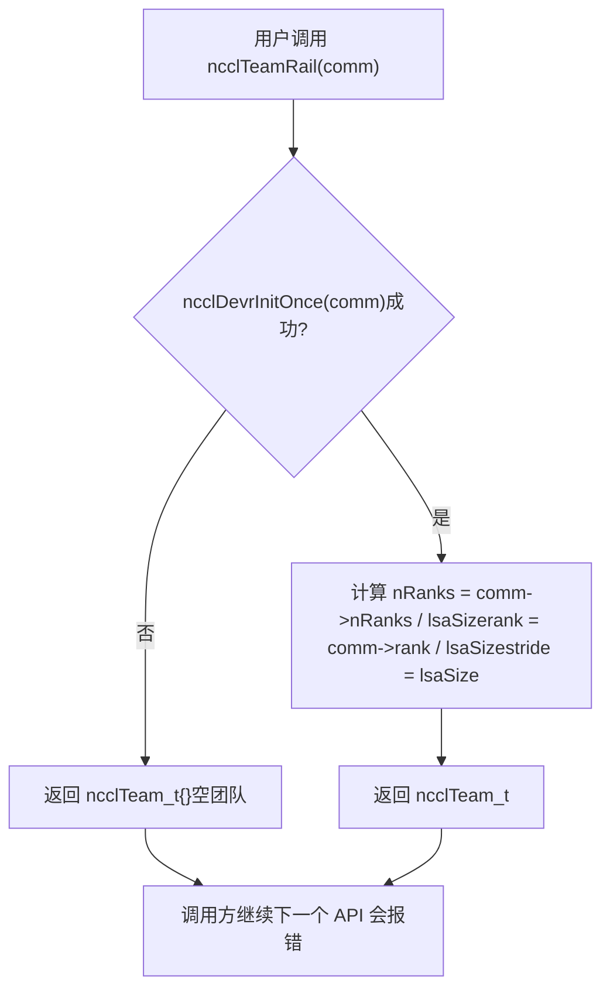
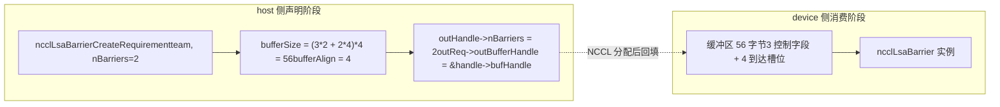
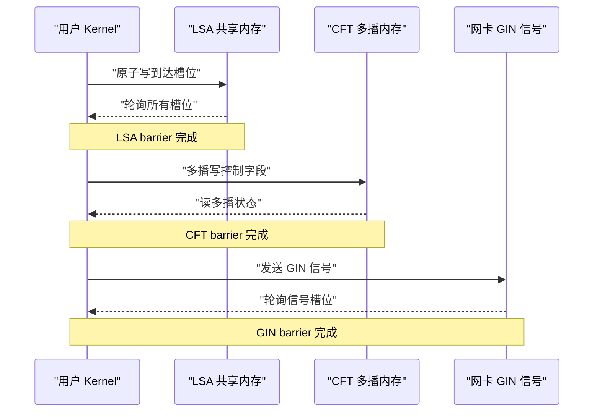
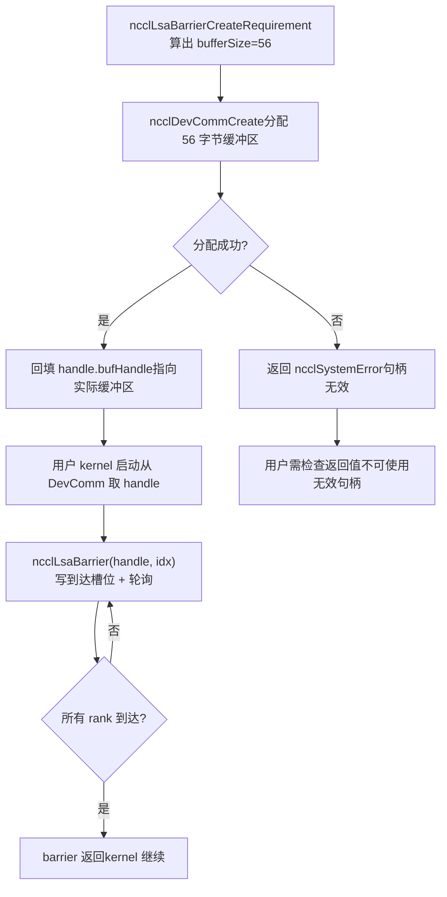
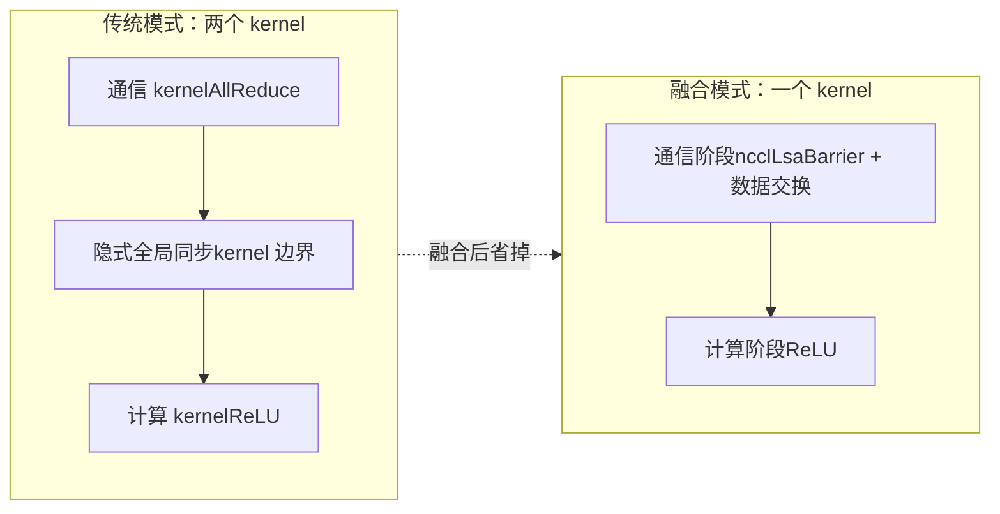

# Capítulo 20: API nativas del lado dispositivo y fusión de operadores: prácticas de nccl_device y kernel fusion

En el capítulo anterior vimos cómo devcomm mapea versionadamente los metadatos del ncclComm del lado host al lado dispositivo, permitiendo que el kernel lea rank, direcciones y estado de conexión. Pero "poder leer metadatos" y "poder iniciar comunicación" son dos cosas distintas. Si solo hubiera metadatos, el kernel del usuario a lo sumo podría calcular direcciones por su cuenta y escribir flags por su cuenta; en cuanto se tratara de sincronización entre ranks o transmisión de señales entre máquinas, habría que volver al lado host para llamar a APIs colectivas como ncclAllReduce, y cada una de esas llamadas implica un lanzamiento de kernel y un viaje de ida y vuelta host-dispositivo. El directorio src/nccl_device que vamos a desglosar en este capítulo es precisamente la clave de cómo NCCL pasa de ser "una biblioteca que se invoca" a "un modelo que se puede programar". Lo que ofrece no son nuevos algoritmos de comunicación colectiva, sino un conjunto de primitivas del lado dispositivo: permitir que el propio kernel del usuario invoque internamente operaciones de sincronización como ncclBarrier, ncclLsaBarrier, ncclGinBarrier, metiendo así "comunicación" y "cómputo" en el mismo kernel y eliminando el coste de lanzamiento intermedio. El material fuente de este capítulo se centra en la declaración de requisitos del lado host (CreateRequirement) y la abstracción de equipo (Team) de este conjunto de primitivas, que es justamente la puerta de entrada a la API del lado dispositivo. Una premisa clave para entender este capítulo: la filosofía de diseño de la API del lado dispositivo es "el lado host declara los requisitos de recursos, el lado dispositivo consume los recursos". El lado host no crea barriers directamente, sino que le dice a NCCL "necesito nBarriers barriers, el equipo tiene team.nRanks miembros"; NCCL calcula a partir de eso cuántos búferes y cuántas señales GIN se necesitan, y luego instancia esos recursos en el lado dispositivo. Esta separación "declaración-consumo" es la razón fundamental por la que el código del lado dispositivo puede funcionar sin punteros del host.

# I. La abstracción Team: el sistema de coordenadas de la API del lado dispositivo

## Modelo intuitivo

Imagina la estructura organizativa de una empresa multinacional. Para enviar un correo, primero hay que saber "a quién se lo envías": ¿a toda la empresa (World), a los colegas de la misma oficina (LSA) o al equipo interoficinas de la misma línea de negocio (Rail)?`ncclTeam_t`es precisamente el descriptor de ese "alcance de destinatarios". Sin la abstracción Team, cada API del lado dispositivo tendría que recalcular por su cuenta "en qué posición estoy dentro de este dominio de comunicación y cuántos somos en total", lo que duplicaría código y sería extremadamente propenso a errores.

## Estructura de datos y disposición en memoria

`ncclTeam_t`es el sistema de coordenadas de la API del lado dispositivo; sus tres campos definen una**progresión aritmética**：

| campo | significado | analogía |
| --- | --- | --- |
| `nRanks` | número total de miembros del equipo | cuántas personas hay en el grupo |
| `rank` | número del rank actual dentro del equipo | mi número dentro del grupo |
| `stride` | paso en el world entre miembros adyacentes del equipo | cuánto difieren los números de estudiante de dos personas adyacentes del grupo |

`stride`es el campo más fácil de pasar por alto pero el más crucial. En el equipo World,`stride = 1`, porque todos los ranks están ordenados de forma contigua; pero en el equipo Rail,`stride = lsaSize`, porque los ranks de un mismo rail aparecen en el world solo cada`lsaSize`posiciones.

[FACT:src/nccl_device/core.cc:13-19]muestra la construcción del equipo World: se toma directamente`comm->nRanks`y`comm->rank`，`stride`se fija en 1. Es el único equipo que no necesita`ncclDevrInitOnce`, porque toda su información está en el lado host`comm`.

[FACT:src/nccl_device/core.cc:22-33]es el equipo LSA. Obsérvese el`ncclDevrInitOnce(comm)`de L26: esta es la entrada idempotente para la inicialización de recursos del lado dispositivo. El comentario de L23-25 es muy importante:**aquí se ignoran deliberadamente los errores**, porque si la inicialización falla, el team devuelto es un "valor basura", pero la siguiente llamada a una API que realmente necesite recursos volverá a activar`ncclDevrInitOnce`y reportará el error. Esta es una estrategia de "notificación diferida de errores", que evita lanzar errores graves en operaciones ligeras como la consulta de equipos.

## Walkthrough guiado por escenarios: transformación de coordenadas de World a Rail

Supongamos una máquina de 8 GPUs,`lsaSize = 4`(cada 4 GPUs forman un dominio LSA),`nRanks = 8`. Veamos cómo se construye`ncclTeamRail`:

[FACT:src/nccl_device/core.cc:70-79]En`nRanks = 8 / 4 = 2`，`rank = comm->rank / 4`，`stride = 4`. Si el rank actual es 5, entonces su`rank = 5 / 4 = 1`，`stride = 4`dentro del equipo Rail, lo que significa que los miembros del equipo Rail son los ranks 1 y 5 del world.

Veamos ahora`ncclTeamRankToWorld`la fórmula de conversión de

[FACT:src/nccl_device/core.cc:82-84]de`comm->rank + (rank - team.rank) * team.stride`es un**desplazamiento relativo**Cálculo: primero se calcula el desplazamiento`(rank - team.rank)`del rank objetivo respecto al rank actual dentro del equipo, luego se multiplica por el paso`stride`y se suma el número de world del rank actual. Esta fórmula es universal para todos los equipos, porque`stride`ya codifica el patrón de ordenación del equipo.

`ncclTeamRankToLsa`en cambio es diferente:

[FACT:src/nccl_device/core.cc:87-92]usa`comm->devrState.lsaSelf + (rank - team.rank) * team.stride`. Obsérvese que aquí se usa`lsaSelf`y no`comm->rank`, porque el número LSA solo se conoce tras la inicialización de los recursos del lado dispositivo y puede diferir del world rank.

Esta figura revela la ruta de ejecución de la estrategia de "notificación diferida de errores": cuando la inicialización falla se devuelve un equipo vacío, pero no se interrumpe al llamador; el error se expondrá en la siguiente API que realmente necesite recursos (como`ncclLsaBarrierCreateRequirement`).

## Reflexiones de diseño y trampas

**Por qué`ncclTeamWorld`no llama a`ncclDevrInitOnce`？**Porque la información del equipo World proviene por completo del lado host`comm`, no requiere ningún recurso del lado del dispositivo. Si se invoca de forma forzada, hará que una operación de consulta puramente del host dependa de la inicialización del lado del dispositivo, añadiendo puntos de fallo innecesarios.

**Puntos problemáticos**：`ncclTeamRankToLsa`devuelve en caso de fallo de inicialización`-1`（[FACT:src/nccl_device/core.cc:87-92]), mientras que`ncclTeamRankToWorld`nunca falla. Si el llamador mezcla ambas funciones y no comprueba los valores de retorno, podría obtener`-1`y usarlo como un rank válido cuando la inicialización de LSA falla, provocando accesos fuera de límites. En código de producción, el valor de retorno de`ncclTeamRankToLsa`debe tratarse como una operación que puede fallar.

---

# II. Declaración de requisitos de Barrier: cómo el lado host «reserva» recursos del dispositivo

## Modelo intuitivo

La asignación de recursos de la API del lado del dispositivo es como**reservar una sala de reuniones**: no puedes irrumpir directamente en la sala para reunirte, primero debes presentar una solicitud en recepción (lado host`CreateRequirement`) — «quiero celebrar 3 reuniones, cada una con 8 personas». Recepción calcula a partir de eso cuánto espacio se necesita (`bufferSize`), cuántas sillas se necesitan (`ginSignalCount`), y luego te da el número de la sala (`outBufferHandle`). Sin este mecanismo de reserva, el kernel del lado del dispositivo no sabría dónde está su búfer de barrier ni de qué tamaño es, y no podría leerlo ni escribirlo de forma segura.

## Estructuras de datos y diseño de memoria

Las funciones`CreateRequirement`de los tres barriers comparten el mismo patrón:**poner a cero la estructura de requisitos → rellenar tamaño/alineación del búfer → rellenar el puntero del handle de salida**. Pero sus tipos de recursos son diferentes:

| Tipo de Barrier | Tipo de recurso | Fórmula de tamaño | Alineación |
| --- | --- | --- | --- |
| LSA Barrier | Búfer | `(3*n + n*team.nRanks) * sizeof(uint32_t)` | `alignof(uint32_t)` |
| CFT Barrier | Búfer | `(3*n + n*team.nRanks) * NCCL_CFT_BARRIER_GRAN` | `NCCL_CFT_BARRIER_ALIGN` |
| GIN Barrier | Señal GIN | `n * team.nRanks`señales | No implica búfer |

Primero veamos la fórmula de tamaño del LSA Barrier:

[FACT:src/nccl_device/lsa_barrier.cc:14-22]de`(3 * nBarriers + nBarriers * team.nRanks) * sizeof(uint32_t)`puede descomponerse en dos partes:

- `3 * nBarriers`: cada barrier necesita 3 campos de control de`uint32_t`([INFERENCE] normalmente son «contador de llegadas», «ronda» y «bandera de estado»).
- `nBarriers * team.nRanks`: cada barrier necesita reservar una ranura de llegada de`uint32_t`para cada miembro del equipo.

Por lo tanto, el tamaño total de un solo barrier es`3 + team.nRanks`de`uint32_t`. Esta fórmula es completamente idéntica en LSA y CFT, solo que CFT usa`NCCL_CFT_BARRIER_GRAN`como unidad de granularidad (posiblemente para alinearse a un límite mayor).

El GIN Barrier es completamente diferente:

[FACT:src/nccl_device/gin_barrier.cc:14-20]no asigna búfer, sino que establece`ginSignalCount = nBarriers * team.nRanks`, y hace que`outGinSignalStart`apunte a`signal0`dentro del handle. Esto se debe a que el GIN barrier sigue la ruta de señales de red, no necesita un búfer de memoria compartida, sino ranuras de señal que la tarjeta de red pueda reconocer.

## Walkthrough guiado por escenarios: una reserva completa de LSA Barrier

Supongamos que el usuario quiere crear 2 barriers en un equipo LSA de 4 GPUs:

1. **Llamar a** `ncclLsaBarrierCreateRequirement(team, 2, &handle, &req)`。

2. **poner a cero**：`memset(outReq, 0, sizeof(*outReq))`（[FACT:src/nccl_device/lsa_barrier.cc:14-22]) — garantiza que los campos no establecidos tengan valores deterministas, evitando que el llamador lea basura de la pila.

3. **Registrar el número de barriers**：`outHandle->nBarriers = 2`（[FACT:src/nccl_device/lsa_barrier.cc:14-22]）。

4. **Calcular el tamaño del búfer**：`(3*2 + 2*4) * 4 = (6 + 8) * 4 = 56`bytes ([FACT:src/nccl_device/lsa_barrier.cc:14-22]）。

5. **Establecer la alineación**：`alignof(uint32_t) = 4`（[FACT:src/nccl_device/lsa_barrier.cc:14-22]）。

6. **Rellenar el puntero del handle**：`outReq->outBufferHandle = &outHandle->bufHandle`（[FACT:src/nccl_device/lsa_barrier.cc:14-22]) — permite que NCCL escriba la dirección de vuelta en el handle después de asignar realmente el búfer.

Este diagrama de flujo de datos muestra la separación entre «declaración» y «consumo»: el lado host solo calcula el tamaño y los punteros, la asignación e instanciación real del búfer ocurre dentro de NCCL, y el kernel del lado del dispositivo recibe un handle ya rellenado.

## Reflexiones de diseño y puntos problemáticos

**Por qué usar`memset`para poner a cero todo`outReq`？**Porque`ncclDevResourceRequirements_t`es una estructura con múltiples campos, y los distintos tipos de barrier solo rellenan una parte de ellos. Poner a cero garantiza que los campos no usados (como`ginSignalCount`, que el LSA barrier no usa) sean 0, y NCCL internamente determina a partir de eso que «este recurso no es necesario». Si no se pone a cero, valores aleatorios de la pila podrían interpretarse erróneamente como «se necesitan recursos GIN», desencadenando el problema de falsos positivos mencionado en el capítulo anterior.

**Puntos problemáticos**：`outReq->outBufferHandle = &outHandle->bufHandle`entregó a NCCL la dirección de un campo interno del handle. Esto significa que`outHandle`debe permanecer válido hasta que NCCL complete la asignación del búfer (no puede ser reclamado por la pila ni movido). Si el usuario coloca`outHandle`en un ámbito que se libera antes de tiempo, NCCL escribirá en un puntero colgante al rellenar.

> **[Design Inference & Architectural Trade-offs]**
> **Diferencia de granularidad del CFT Barrier**：[FACT:src/nccl_device/cft_barrier.cc:13-21]usa`NCCL_CFT_BARRIER_GRAN`y`NCCL_CFT_BARRIER_ALIGN`en lugar de`sizeof(uint32_t)`y`alignof(uint32_t)`de LSA. Esto indica que el barrier de CFT (posiblemente Cross-Fabric Team o un equipo interdominio similar) necesita una granularidad de alineación mayor, posiblemente porque debe cruzar regiones de memoria multicast, y el hardware tiene requisitos de alineación de direcciones más estrictos.

---

# III. División semántica de los tres tipos de Barrier: qué gestiona cada uno de LSA, CFT y GIN

## Modelo intuitivo

Los tres tipos de barrier son como tres «silbatos de reunión» de distinto alcance:

- **LSA Barrier**: reunión de colegas dentro de la misma oficina, por memoria compartida, el más rápido.
- **CFT Barrier**: reunión entre oficinas pero dentro del mismo edificio, por memoria multicast, velocidad media.
- **GIN Barrier**: reunión entre ciudades o incluso países, por señales de red, el más lento pero con la cobertura más amplia.

Elegir el tipo de barrier equivocado no provoca errores, pero conlleva una enorme pérdida de rendimiento — usar un GIN barrier para sincronización dentro de la misma oficina equivale a enviar un documento al puesto de al lado por mensajería internacional.

## Comparación de estructuras de datos y diseño de memoria

Desde la declaración de requisitos del lado host, los requisitos de recursos de los tres son radicalmente distintos:

| Dimensión | LSA Barrier | CFT Barrier | GIN Barrier |
| --- | --- | --- | --- |
| Requiere`comm`parámetro | No | No | Sí |
| Búfer | Sí | Sí | No |
| Señal GIN | No | No | Sí |
| Unidad de tamaño | `uint32_t` | `NCCL_CFT_BARRIER_GRAN` | Número de señales |
| Campo del handle de salida | `bufHandle` | `bufHandle` | `signal0` |

Nótese que GIN Barrier es el único que requiere el parámetro`comm`:

[FACT:src/nccl_device/gin_barrier.cc:14-20]la firma de la función incluye`ncclComm_t comm`, mientras que las firmas de LSA y CFT solo tienen`ncclTeam_t team`. Esto se debe a que la señal GIN necesita estar vinculada a una conexión de red específica, y la información de la conexión de red está en`comm`.

## Walkthrough guiado por escenarios: asignación de señales de GIN Barrier

[FACT:src/nccl_device/gin_barrier.cc:14-20]La lógica de es más simple que la de LSA, pero la semántica es más sutil:

1. **Poner a cero**：`memset(outReq, 0, sizeof(*outReq))`（L16）。

2. **Establecer el número de señales**：`outReq->ginSignalCount = nBarriers * team.nRanks`(L17) — cada barrier necesita asignar un slot de señal para cada miembro del equipo.

3. **Rellenar el puntero de inicio de señal**：`outReq->outGinSignalStart = &outHandle->signal0`(L18) — nota que aquí no se establece`bufferSize`, porque GIN barrier no usa búfer de memoria compartida.

> **[Design Inference & Architectural Trade-offs]**
> `signal0`El nombre sugiere que el handle puede contener un grupo de campos de señal contiguos (`signal0`, `signal1`, ...），`outGinSignalStart`apunta al primero, y NCCL a partir de esto sabe desde dónde empezar a asignar`nBarriers * team.nRanks`señales.

## Control de concurrencia e interacción con hardware

Los mecanismos de control de concurrencia de los tres tipos de barrier son completamente diferentes:

- **LSA Barrier**: operaciones atómicas basadas en memoria compartida.`3 + team.nRanks`En`uint32_t`, el slot de llegada usa suma atómica o escritura atómica para marcar «he llegado», y el campo de control usa lectura atómica para verificar «si todos han llegado». Esta es sincronización puramente dentro de la GPU, sin involucrar la red.
- **CFT Barrier**: basado en memoria multicast (multimem). [INFERENCE] La memoria multicast permite que una operación de escritura actualice simultáneamente la vista de múltiples ranks, por lo que CFT barrier podría usar menos campos de control para lograr una sincronización más amplia.
- **GIN Barrier**: basado en señales de red.`ginSignalCount`Las señales se envían a través de la tarjeta de red, y el receptor sondea los slots de señal. Este es el único barrier que involucra hardware entre máquinas.

Este diagrama de secuencia muestra los niveles de interacción de hardware de los tres tipos de barrier: desde sincronización puramente dentro de la GPU, pasando por memoria multicast, hasta señales de tarjeta de red, con latencia que aumenta sucesivamente y alcance que también se amplía sucesivamente.

## Reflexiones de diseño y trampas

**¿Por qué LSA y CFT no necesitan el parámetro`comm`?**Porque sus recursos (memoria compartida, memoria multicast) ya han sido vinculados al equipo en la etapa`ncclDevrInitOnce`,`team`en sí mismo ya implica la información de ubicación del recurso. Pero las señales GIN necesitan asignar dinámicamente recursos de red, y deben acceder al estado de la conexión de red a través de`comm`.

**Puntos de trampa**: El`ginSignalCount`de GIN Barrier es`nBarriers * team.nRanks`, si el equipo es muy grande (como 1024 ranks) y hay muchos barriers (como 100), el número total de señales alcanzará 102400. Los slots de señal de la tarjeta de red son un recurso limitado, y una solicitud excesiva puede causar`ncclDevrInitOnce`fallo. El código de producción debe solicitar según la cantidad mínima de barriers realmente necesaria, en lugar de solicitar una gran cantidad de reserva de una sola vez.

---

# IV. Desde la declaración de requisitos hasta el consumo en el lado del dispositivo: ciclo de vida completo

## Modelo intuitivo

`CreateRequirement`solo es «hacer el pedido», el verdadero «envío» y «recepción» ocurren dentro de NCCL y en el kernel del lado del dispositivo. Todo el ciclo de vida es como**comprar en línea**: haces el pedido (CreateRequirement) → el comerciante prepara el stock (NCCL asigna recursos) → el mensajero entrega (los recursos se vinculan a DevComm) → firmas y usas (el kernel del lado del dispositivo llama al barrier).

## Estructuras de datos y diseño de memoria: evolución de los campos del handle

Tomando`ncclLsaBarrierHandle_t`como ejemplo, pasa por tres etapas en su ciclo de vida:

| Etapa | `nBarriers` | `bufHandle` | Otros campos |
| --- | --- | --- | --- |
| Después de CreateRequirement | Ya establecido | La dirección ya está rellenada, pero el contenido no está asignado | No establecido |
| Después de la asignación de NCCL | Ya establecido | Apunta al búfer real | Ya establecido |
| Uso en el lado del dispositivo | Solo lectura | Solo lectura | Solo lectura |

[FACT:src/nccl_device/lsa_barrier.cc:14-22]Establece`nBarriers`，[FACT:src/nccl_device/lsa_barrier.cc:14-22]Rellena`bufHandle`la dirección de . Entre estas dos operaciones, NCCL completa internamente la asignación real del búfer.

## Walkthrough guiado por escenarios: un uso completo de barrier

1. **Declaración en el lado del host**: el usuario llama a`ncclLsaBarrierCreateRequirement(team, 2, &handle, &req)`, y obtiene`req.bufferSize = 56`。

2. **Envío en el lado del host**: el usuario entrega`req`a`ncclDevCommCreate`(contenido del capítulo anterior), NCCL asigna un búfer de 56 bytes y escribe la dirección en`handle.bufHandle`。

3. **Inicialización en el lado del dispositivo**: cuando se inicia el kernel del usuario, se extrae`handle`de DevComm, y se usa`bufHandle`para localizar el búfer.

4. **Sincronización en el lado del dispositivo**: el kernel llama a`ncclLsaBarrier(handle, barrierIndex)`, escribe la marca de llegada en el slot correspondiente del búfer y sondea los otros slots.

5. **Finalización en el lado del dispositivo**: después de que todos los ranks llegan, el barrier retorna y el kernel continúa su ejecución.

Este diagrama de decisión muestra la ruta completa desde la declaración hasta el uso, así como la rama de error cuando falla la asignación. Nota que`ncclLsaBarrierCreateRequirement`en sí mismo siempre devuelve`ncclSuccess`（[FACT:src/nccl_device/lsa_barrier.cc:14-22]), el fallo real ocurre en la etapa posterior de asignación de recursos.

## Control de concurrencia e interacción con hardware

El núcleo del control de concurrencia del barrier en el lado del dispositivo es**operaciones atómicas + barreras de memoria**. Tomando LSA barrier como ejemplo:

- **Etapa de llegada**: cada rank usa escritura atómica (o suma atómica) para actualizar su propio slot de llegada. Este paso debe usar semántica release, para garantizar que todas las operaciones de memoria anteriores al barrier sean visibles para los otros ranks.
- **Etapa de sondeo**: cada rank usa lectura atómica (o lectura volatile) para verificar todos los slots. Este paso debe usar semántica acquire, para garantizar que después de ver «todos han llegado», se puedan leer los datos escritos por otros antes de su barrier.
- **Etapa de reinicio**: después de que el barrier se completa, es necesario reiniciar los slots para el siguiente uso. El control de concurrencia de este paso es el más sutil — si se reinicia demasiado rápido, puede sobrescribir la marca de un rank que aún no la ha leído.

> **[Design Inference & Architectural Trade-offs]**
> `3 * nBarriers`Varios campos de control probablemente se utilizan para manejar este tipo de problema de «rondas»: un campo registra la ronda actual, un campo registra el conteo de llegadas y un campo sirve como indicador de reinicio. De esta manera, múltiples barreras pueden reutilizar el mismo conjunto de ranuras sin confundir las rondas.

## Guía de prevención de errores en producción

**Error 1: Gestión del ciclo de vida del handle**。`outReq->outBufferHandle = &outHandle->bufHandle`Se entregó la dirección de los campos internos del handle a NCCL. Si el usuario destruye`ncclDevCommCreate`antes de que retorne`outHandle`, NCCL escribirá en memoria ya liberada al rellenar. La práctica correcta es vincular el ciclo de vida de`outHandle`a DevComm, en lugar de vincularlo al ámbito de la función que lo creó.

**Error 2: El producto del número de barreras por el tamaño del equipo**。`bufferSize = (3*n + n*team.nRanks) * sizeof(uint32_t)`En`n*team.nRanks`, el término domina el tamaño en equipos grandes. 1024 ranks y 100 barreras requieren`100*1024*4 = 409600`bytes, aproximadamente 400KB. Si cada rank solicita esta cantidad, la presión sobre la memoria de video no es despreciable. Se debe solicitar según el número de barreras realmente en uso concurrente, no según el número total de barreras.

**Error 3: Agotamiento de señales de GIN barrier**. Las señales GIN son recursos de la tarjeta de red y su cantidad es limitada. Si múltiples DevComm solicitan grandes cantidades de señales GIN simultáneamente, pueden agotar las ranuras de la tarjeta de red. El código de producción debe verificar si la falla en la creación de DevComm se debe a señales GIN insuficientes, y considerar reducir`nBarriers`o cambiar a LSA barrier.

**Error 4: Exposición tardía de fallos de inicialización**。`ncclTeamLsa`Funciones como`ncclDevrInitOnce`retornan un equipo vacío ([FACT:src/nccl_device/core.cc:22-33]) cuando fallan, sin reportar error. Si el código del usuario no verifica los valores de retorno de las API posteriores, puede continuar operando sobre un equipo vacío, causando errores difíciles de localizar. Se recomienda verificar explícitamente la validez del equipo en el primer uso de la API del lado del dispositivo (como`team.nRanks > 0`）。

---

# V. Fusión de kernels: por qué meter comunicación y cómputo en un solo kernel

## Modelo intuitivo

En el modo tradicional, un «AllReduce + función de activación» requiere dos kernels: uno para comunicación y otro para cómputo. Entre ambos kernels hay una sincronización global implícita: el kernel de comunicación debe terminar por completo antes de que el kernel de cómputo pueda comenzar. Esto es como una**carrera de relevos**: el primer corredor debe entregar el bastón al segundo, y en el instante de la entrega ambos esperan. La fusión de kernels hace que un mismo kernel ejecute tanto comunicación como cómputo, como**una persona que corre mientras se cambia los zapatos**, eliminando la espera de la entrega.

## Estructuras de datos y diseño de memoria

La clave de la fusión de kernels es que: las primitivas de comunicación (como barrier) y la lógica de cómputo comparten los mismos registros y memoria compartida del kernel. Esto implica:

- **Presión de registros**: las operaciones atómicas y los bucles de sondeo de las primitivas de comunicación ocupan registros, comprimiendo el presupuesto de registros de la lógica de cómputo.
- **Competencia por memoria compartida**: si el búfer del LSA barrier se coloca en memoria compartida, competirá con las necesidades de memoria compartida de la lógica de cómputo.
- **Impacto en la ocupación**: la ocupación del kernel fusionado suele ser menor que la de un kernel de cómputo puro, porque las primitivas de comunicación requieren recursos adicionales.

> **[Design Inference & Architectural Trade-offs]**
> El diseño de la API del lado del dispositivo (declarar recursos en el host, consumir en el dispositivo) precisamente busca aliviar estas presiones: los recursos se preasignan en el host, y el kernel del lado del dispositivo solo necesita leer y escribir, sin asignación dinámica, reduciendo el uso de registros.

## Walkthrough guiado por escenarios: flujo de ejecución de un kernel fusionado

Supongamos que el usuario quiere escribir un kernel fusionado de «AllReduce + ReLU»:

1. **Preparación en el host**: llamar a`ncclLsaBarrierCreateRequirement`para solicitar barrier, llamar a`ncclDevCommCreate`para asignar recursos.

2. **Lanzamiento del kernel**: el kernel del usuario recibe DevComm y el handle del barrier como parámetros.

3. **Fase de comunicación**: dentro del kernel se llama a`ncclLsaBarrier`para sincronizar todos los ranks, luego cada rank intercambia datos (mediante lectura/escritura directa en memoria simétrica).

4. **Fase de cómputo**: una vez completada la sincronización, el kernel aplica ReLU directamente a los datos locales, sin necesidad de lanzar un kernel adicional.

5. **Finalización**: el kernel termina, el host no necesita esperar ningún kernel de comunicación adicional.

Esta imagen comparativa muestra el beneficio central de la fusión: eliminar la sincronización global implícita en los límites del kernel. En el modo tradicional, el costo de esta sincronización es la latencia de dos lanzamientos de kernel más el vaciado del pipeline de la GPU.

## Reflexiones de diseño y errores comunes

**¿Por qué la API del lado del dispositivo no proporciona directamente un «AllReduce fusionado»?**Porque la forma concreta de la fusión depende de la lógica de cómputo del usuario. NCCL proporciona**primitivas**(barrier, señales, acceso a memoria simétrica), no**productos terminados**(AllReduce+ReLU fusionado). El usuario necesita combinar estas primitivas por sí mismo para implementar un kernel fusionado que se ajuste a sus necesidades. Esta es la diferencia esencial entre un «modelo de programación» y una «biblioteca».

**Puntos propensos a errores**：La depuración de kernels fusionados es mucho más difícil que la de kernels separados. Si la lógica de barrera tiene un bug, puede provocar que el kernel se cuelgue (deadlock), y un kernel de GPU colgado no es tan fácil de diagnosticar como un proceso de host colgado. Se recomienda añadir un mecanismo de timeout en el kernel fusionado, o validar primero la lógica de barrera con un equipo a pequeña escala.

**Puntos problemáticos**：La disminución de la ocupación (occupancy) del kernel fusionado puede causar una pérdida de rendimiento de cómputo que supere el beneficio ahorrado en comunicación. Antes de decidir fusionar, se debe medir el tiempo extremo a extremo antes y después de la fusión, en lugar de fijarse solo en la reducción de la latencia de comunicación.

# Reflexiones y autoevaluación de este capítulo

Q1: Si se elimina la llamada a`ncclTeamLsa`en L26 de`ncclDevrInitOnce`y se devuelven directamente`comm->devrState.lsaSize`y`lsaSelf`, ¿en qué escenarios el kernel del lado del dispositivo leería información de equipo incorrecta?

**Análisis de referencia**：`ncclDevrInitOnce`es el punto de entrada idempotente para la inicialización de recursos del lado del dispositivo. Si se elimina,`comm->devrState.lsaSize`y`lsaSelf`podrían seguir teniendo sus valores iniciales (normalmente 0 o indefinidos). En escenarios donde se usa la API del lado del dispositivo por primera vez, cuando el usuario llama a`ncclTeamLsa`obtendrá un equipo vacío de`nRanks = 0`. Si posteriormente el usuario no verifica la validez del equipo y usa directamente ese equipo para llamar a`ncclLsaBarrierCreateRequirement`, se calcularán`bufferSize = (3*n + n*0) * 4 = 12n`bytes — menos de lo realmente necesario, porque el término`n*team.nRanks`se convierte en 0. Esto provocará un desbordamiento de búfer: en tiempo de ejecución, la barrera intentará escribir`team.nRanks`slots de llegada, pero el búfer solo tiene asignado espacio para`3n`de`uint32_t`. Más sutil aún: si`lsaSelf`también es 0,`ncclTeamRankToLsa`devolverá un número de rank incorrecto, lo que hará que los slots de llegada de la barrera se escriban en posiciones erróneas, y posiblemente nunca se espere a que lleguen todos los ranks, provocando que el kernel se cuelgue. Esto es precisamente lo que la estrategia descrita en los comentarios de L23-25, «devolver valores basura, que la siguiente API dé error», pretende evitar — pero siempre que la siguiente API efectivamente dé error, y no que use silenciosamente un tamaño incorrecto.

Q2：`ncclLsaBarrierCreateRequirement`La fórmula del tamaño de`(3*nBarriers + nBarriers*team.nRanks) * sizeof(uint32_t)`es`++`. Si el equipo tiene 8 ranks y el usuario solicita 1 barrera, el búfer es de 44 bytes. Suponiendo que en la implementación de la barrera los «3 campos de control» son «contador de llegadas», «ronda» y «flag de reinicio», razona: cuando 8 ranks llegan simultáneamente, si el «contador de llegadas» usa una operación

**no atómica, ¿qué ocurriría?**Análisis de referencia`++`: Una operación`count++`no atómica en GPU son tres pasos de «leer-modificar-escribir», no es una operación atómica. Cuando 8 ranks ejecutan`count`simultáneamente, puede ocurrir que varios ranks lean el mismo valor antiguo (por ejemplo, todos lean 0) y luego todos escriban 1. Al final`atomicAdd`solo aumenta en 1 en lugar de 8, lo que hace que la barrera crea para siempre que «aún no han llegado todos», y todos los ranks entren en un bucle infinito en la fase de sondeo. Por eso los slots de llegada de la barrera LSA deben usar operaciones atómicas (como`nBarriers * team.nRanks`) o que cada rank escriba en su propio slot independiente (el término`nBarriers * team.nRanks`está precisamente reservado para dar a cada rank un slot independiente). Si se adopta el esquema de «cada rank escribe en su propio slot», no se necesita suma atómica, solo escritura atómica + barrera de memoria, porque cada slot tiene un único escritor. Esto también explica por qué en la fórmula del tamaño aparece el término

Q3：`ncclGinBarrierCreateRequirement`— es cambiar espacio por atomicidad, evitando la competencia entre múltiples escritores.`comm`requiere el parámetro`ncclLsaBarrierCreateRequirement`y`comm`no lo requiere. Si se forzara a añadir también el parámetro`comm`a la barrera LSA (suponiendo que fuera para unificar la interfaz), ¿qué problema de diseño introduciría? A la inversa, si se eliminara el parámetro

**de la barrera GIN, ¿en qué escenarios fallaría?**Análisis de referencia`comm`: El problema de añadir el parámetro`ncclDevrInitOnce`a la barrera LSA es que introduce una dependencia innecesaria. Los recursos de la barrera LSA (memoria compartida) ya están vinculados al equipo en la fase`team`, y`comm`por sí mismo ya implica la ubicación del recurso. Añadir`comm`haría que una operación puramente de equipo dependiera del estado del dominio de comunicación, aumentando los puntos de fallo (por ejemplo, si`comm`es inválido, la barrera LSA tampoco se podría crear), y violaría el principio de «mínimo privilegio». A la inversa, eliminar el parámetro`ncclGinBarrierCreateRequirement`de la barrera GIN haría que fallara, porque las señales GIN necesitan vincularse a una conexión de red concreta.`ginSignalCount`de`comm`necesita saber a qué tarjeta de red y a qué QP (Queue Pair) enviar la señal, y esa información está en el estado de la capa de transporte de red de`comm`. Sin**, NCCL no puede determinar a qué slot de qué tarjeta de red debe asignarse la señal, ni puede garantizar que la señal se enrute correctamente al rank destino. Esto refleja un principio de diseño de las API del lado del dispositivo:**la declaración de requisitos de recursos solo depende del contexto que realmente necesita

---

— LSA solo necesita la topología del equipo, GIN necesita la conexión de red.`ncclTeam_t`La API del lado del dispositivo y la fusión de kernels convierten NCCL de «una biblioteca que llamas» en «un modelo con el que programas».`CreateRequirement`proporciona el sistema de coordenadas,

Hasta aquí, hemos recorrido todo el proceso desde el mapeo de metadatos de devcomm hasta las primitivas del lado del dispositivo de nccl_device, y hemos visto cómo NCCL, mediante el modelo de «declaración en host, consumo en device», permite que el kernel del usuario invoque directamente operaciones de sincronización tipo barrier, fusionando comunicación y cómputo en un mismo kernel. Pero una vez dominados estos mecanismos, surge naturalmente una pregunta más práctica: cuando el rendimiento de una tarea de entrenamiento real no alcanza el objetivo, ¿cómo determinamos si se debe a una elección inadecuada del algoritmo, a una incompatibilidad de protocolo o a una configuración irrazonable del número de canales? El próximo capítulo encadenará los mecanismos de los primeros 20 capítulos en una metodología de ajuste operativa, combinando informes de rendimiento, modelos de coste y variables de entorno para ofrecer una ruta de diagnóstico desde el síntoma hasta la causa raíz.
