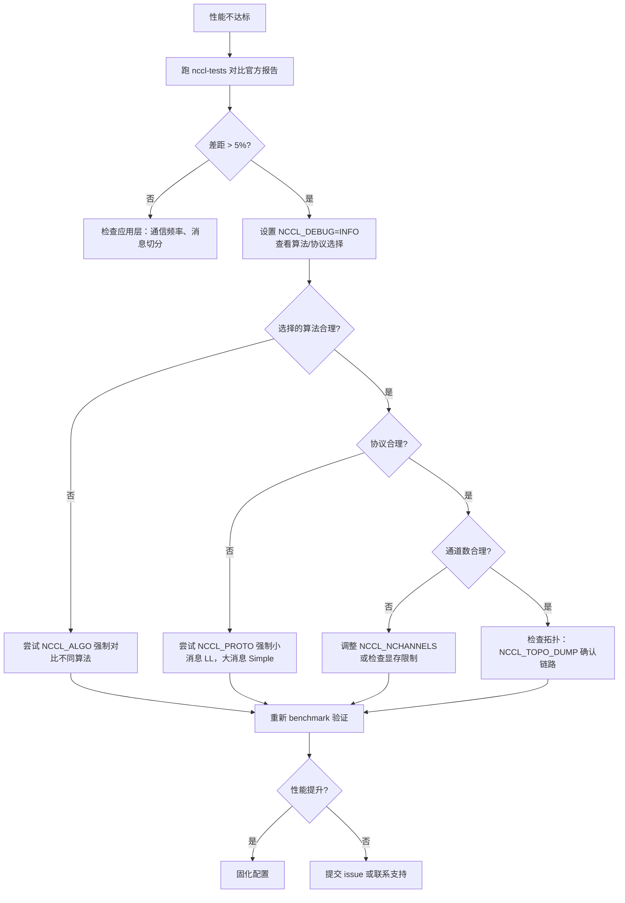

# Capítulo 21: Práctica de ajuste de rendimiento: operación de tuning, herramientas de benchmark y metodología de ajuste

En el capítulo anterior vimos cómo un kernel personalizado del usuario puede cooperar con las primitivas de comunicación de NCCL a través de la API del lado del dispositivo, e incluso fusionar comunicación y cómputo en un mismo kernel. Esto abre la posibilidad de usar NCCL como modelo de programación, pero también plantea un problema real: cuando el rendimiento de la comunicación no es el esperado, ¿por dónde empezar? NCCL expone cientos de NCCL_PARAM, pero lo que realmente determina por qué camino se resuelve una comunicación colectiva son solo tres perillas: algoritmo (Algo), protocolo (Proto) y número de canales (nChannels). Este capítulo encadena los mecanismos de los primeros 20 capítulos en una ruta de diagnóstico operativa: primero se consulta el informe de rendimiento para localizar el síntoma, luego se lee el modelo de coste para entender cómo elige NCCL por sí mismo y, finalmente, se usan variables de entorno y benchmarks para validar tus hipótesis.

# 21.1 Informe de rendimiento: establecer primero la línea base de lo «normal»

El primer paso del ajuste no es cambiar parámetros, sino saber qué aspecto tiene lo «normal». Si ni siquiera sabes cuál es el ancho de banda pico de tu sistema actual, cualquier ajuste de parámetros es una conjetura a ciegas.

NCCL publica oficialmente datos de rendimiento de referencia en`docs/perf`, y su propósito es muy claro: no es una garantía de nivel de producto, sino un punto de referencia para alinear expectativas.

[FACT:docs/perf/README.md:3-14]

```
NCCL publishes reference performance data to:

1. Provide reference points that help users align performance expectations.
2. Help users validate their system setup.
3. Reduce repeated requests to the NCCL team for basic performance numbers.

These results are references, and NOT product-level guarantees that the same
performance is achievable on every system. Performance depends on a complex
combination of software versions, system configuration, hardware, and operating
conditions, including factors outside NCCL's control. A difference within 5% is
generally considered acceptable variance due to differences in the underlying
systems.
```

Aquí hay dos informaciones clave que los principiantes suelen pasar por alto:

Primero,**una diferencia dentro del 5 % se considera fluctuación normal**. Esto significa que si mides un 3 % por debajo de lo oficial, no te apresures a ajustar parámetros: primero confirma si se trata de ruido de medición, fluctuación del reloj de la GPU o interferencia de tareas vecinas.

Segundo,**oficialmente solo se publica el ancho de banda pico, no la latencia**。

[FACT:docs/perf/README.md:24-24]

```
We publish peak bandwidth for a selection of commonly used platforms. We do not
currently publish latency because it is typically more sensitive to factors
outside NCCL's control.
```

> **[Design Inference & Architectural Trade-offs]**
> ¿Por qué no se publica la latencia? Porque la latencia es extremadamente sensible al estado del sistema: la frecuencia de la CPU, el estado del enlace PCIe, la versión del firmware de la tarjeta de red e incluso la política de energía de la BIOS la afectan. El ancho de banda tiende a saturarse con mensajes grandes y es relativamente estable; la latencia, con mensajes pequeños, resulta de la superposición de innumerables eslabones minúsculos, y cualquier fluctuación en uno de ellos se amplifica. Por eso, al ajustar,**para mensajes grandes se mira el ancho de banda, para mensajes pequeños se mira la latencia**, y estas son dos rutas de diagnóstico diferentes.

[FACT:docs/perf/README.md:24-24]

```
If your workload differs significantly from the published results, open an
issue in the [NCCL repository](https://github.com/NVIDIA/nccl/issues) or contact
NVIDIA Support. We will try our best to help.
```

**Primera regla del orden de diagnóstico**: ejecuta primero un benchmark estándar (como`nccl-tests`de`all_reduce_perf`) y compara el resultado con el informe oficial. Si la diferencia está dentro del 5 %, la configuración del sistema no tiene problemas y el cuello de botella está en tu capa de aplicación (por ejemplo, la frecuencia de comunicación o la forma de dividir los mensajes); si la diferencia es significativa, entonces sí se pasa al ajuste de parámetros de NCCL.

# 21.2 Modelo de coste: cómo elige NCCL por sí mismo el algoritmo y el protocolo

Para ajustar parámetros, primero hay que entender cómo elige NCCL por defecto. Internamente tiene un «modelo de coste» (cost model), que en esencia es una tabla de consulta más un cálculo con fórmulas: dado el tamaño del mensaje, el tipo de topología y el número de ranks, estima el tiempo de cada combinación de «algoritmo × protocolo» y elige la menor.

## Modelo intuitivo

Imagina el modelo de coste como un software de navegación. Introduces el origen y el destino (tamaño del mensaje, topología), y este estima internamente el tiempo de cada ruta (combinación de algoritmo/protocolo) y luego recomienda la más rápida. La estimación de la navegación se basa en datos históricos y en la categoría de la vía; la de NCCL se basa en una tabla de parámetros de latencia/ancho de banda codificada de forma fija.

Sin este modelo, NCCL solo podría usar un algoritmo fijo para todos los escenarios: los mensajes pequeños se volverían más lentos por un coste de arranque excesivo, y los mensajes grandes se volverían más lentos por un uso insuficiente del ancho de banda; el sistema tendría un rendimiento pobre en ambos extremos.

## Estructura de datos: tabla del modelo y contexto de ajuste

El núcleo del modelo de coste es el array`modelMap`, y cada elemento corresponde a una combinación de «algoritmo/protocolo/kernel simétrico».

[FACT:src/tuning/cost_model.cc:230-277]

```
static struct ncclTuningModelEntry_t modelMap[] = {
    /*
Initialize default, static models here
{mod_init, mod_sim, mod_final, enabled}
Enable order: Broadcast, Reduce, AllGather, ReduceScatter, AllReduce
*/
  {ncclTuningTreeModelInit, ncclTuningTreeModelSim, nullptr, {0, 0, 0, 0, 1}},       // Tree/LL
  {ncclTuningTreeModelInit, ncclTuningTreeModelSim, nullptr, {0, 0, 0, 0, 1}},       // Tree/LL128
  {ncclTuningTreeModelInit, ncclTuningTreeModelSim, nullptr, {0, 0, 0, 0, 1}},       // Tree/Simple
  {ncclTuningRingModelInit, ncclTuningRingModelSim, nullptr, {1, 1, 1, 1, 1}},       // Ring/LL
  ...
```

Cada entrada tiene cuatro campos:`mod_init`(función de inicialización),`mod_sim`(función de simulación),`mod_final`(función de limpieza),`enabled`(indicadores de habilitación de cada una de las 5 funciones).`enabled`El orden del array`{Broadcast, Reduce, AllGather, ReduceScatter, AllReduce}`es

> **[Design Inference & Architectural Trade-offs]**
> 〔Inferencia de diseño y compromisos arquitectónicos〕**Observación clave:**（`{0,0,0,0,1}`Tree solo se habilita en AllReduce`{1,1,1,1,1}`). Esto se debe a que la ventaja del algoritmo Tree radica en que la fase de reducción de AllReduce puede paralelizarse, pero para operaciones como AllGather/ReduceScatter que son esencialmente de flujo circular, Ring es más natural.

Los parámetros específicos del modelo están en`ncclTunerConstants_t`, que incluye la latencia base y el ancho de banda para cada topología.

[FACT:src/tuning/cost_model.cc:142-152]

```
static const ncclTunerConstants_t ncclTunerConstantsDefaults = {
    // baseLatencies
  {
    {6.8, 14.0, 8.4},  // Tree
    {6.6, 14.0, 8.4},  // Ring
    {0, 0, 0},         // Collnet Direct
    {0, 0, 0},         // Collnet Chain
    {0, 0, 0},         // NVLS
    {0, 0, 0},         // NVLS Tree
    {8.0, 8.0, 8.0}    // PAT
  },
```

Cada algoritmo tiene tres valores de latencia base, correspondientes a los tres protocolos LL / LL128 / Simple. Por ejemplo, para Ring`{6.6, 14.0, 8.4}`significa: latencia base del protocolo LL 6.6 microsegundos, LL128 es 14.0, Simple es 8.4. Estos números son valores empíricos medidos por NVIDIA en hardware real.

La latencia de hardware se proporciona por separado según el tipo de topología (NVLink / PCI / NET).

[FACT:src/tuning/cost_model.cc:153-184]

```
    // hwLatencies
  {
    /* NVLINK */
    {
      {0.6, 1.25, 4.0}, // Tree (LL/LL128/Simple)
      {0.6, 1.9, 3.4},  // Ring (LL/LL128/Simple)
      ...
    },
    /* PCI */
    {
      {1.0, 1.9, 4.0}, // Tree (LL/LL128/Simple)
      {1.0, 2.5, 5.7}, // Ring (LL/LL128/Simple)
      ...
    },
    /* NET */
    {
      {5.0, 8.5, 14},   // Tree (LL/LL128/Simple)
      {2.7, 4.0, 14.0}, // Ring (LL/LL128/Simple)
      ...
    },
  },
```

Comparando se pueden ver las diferencias de topología: en NVLink la latencia por salto de Ring/Simple es 3.4 microsegundos, en PCI es 5.7, en NET es 14.0. Esto explica por qué la comunicación entre máquinas es lenta: cada salto cuesta 10 microsegundos adicionales.

Los parámetros de ancho de banda se proporcionan por generación de arquitectura de GPU.

[FACT:src/tuning/cost_model.cc:183-183]

```
    // llMaxBws
  {
    {39.0, 39.0, 20.4}, /* Volta-N1/Intel-N2/Intel-N4) */
    {87.7, 22.5 /*avg of ring & tree*/, 19.0}, /* Ampere-N1/AMD-N2/AMD-N4) */
    {141.0, 45.0 /*avg of ring & tree*/, 35.0}, /* Hopper-N1/AMD-N2/AMD-N4) */
    {2 * 141.2, 2 * 45.0 /*avg of ring & tree*/, 2 * 35.0}, /* Blackwell-N1/AMD-N2/AMD-N4) */
  },
```

Cada fila corresponde a una generación de arquitectura, y los tres valores son el ancho de banda máximo del protocolo LL en escenarios de una máquina (N1), dos máquinas (N2) y cuatro máquinas (N4). Hopper en una máquina 141 GB/s, Blackwell se duplica a 282 GB/s — esto explica por qué el mismo algoritmo rinde mucho mejor en las tarjetas nuevas.

## Contexto de ajuste: estado por comunicación

Cada dominio de comunicación (communicator) mantiene un`ncclTuningContext_t`, que guarda el estado de ajuste de este comm.

[FACT:src/include/tuning.h:81-95]

```
struct ncclTuningContext_t {
  // Persistant tuning parameters tied to a communicator.
  ncclTunerConstants_t tuningConstants;
  // State of the tuning models
  // Forced function is set via env var
  int forced[NCCL_NUM_FUNCTIONS];
  // Disabled tuning models are not execute and excluded from implemetation selection.
  int enabled[NCCL_TUNING_COUNT][NCCL_NUM_FUNCTIONS];
  // Store of model contexts per communicator.
  float generalLatencies[NCCL_NUM_FUNCTIONS][NCCL_NUM_ALGORITHMS][NCCL_NUM_PROTOCOLS];
  float generalBandwidths[NCCL_NUM_FUNCTIONS][NCCL_NUM_ALGORITHMS][NCCL_NUM_PROTOCOLS];

  ssize_t threadThresholds[NCCL_NUM_ALGORITHMS][NCCL_NUM_PROTOCOLS];
  int maxThreads[NCCL_NUM_ALGORITHMS][NCCL_NUM_PROTOCOLS];
};
```

Cuatro campos clave:

- `forced[NCCL_NUM_FUNCTIONS]`: marca qué funciones tienen algoritmo/protocolo forzado por variables de entorno. Este es el punto donde`NCCL_ALGO`/`NCCL_PROTO`surte efecto.
- `enabled[NCCL_TUNING_COUNT][NCCL_NUM_FUNCTIONS]`: tabla booleana bidimensional que marca si un modelo está habilitado para una función. Los modelos deshabilitados no participan en la selección.
- `generalLatencies` / `generalBandwidths`: arreglo tridimensional que almacena la latencia y el ancho de banda estimados por «función × algoritmo × protocolo». Esta es la fuente de la gran tabla que`ncclTuningInit`imprime.
- `threadThresholds` / `maxThreads`: umbrales relacionados con el número de hilos, que determinan cuántos hilos usa cada bloque.

## Walkthrough guiado por escenarios: selección de algoritmo en un AllReduce

Supón que llamas a`ncclAllReduce`, tamaño de mensaje 1MB, 8 GPUs en una máquina con NVLink. Internamente NCCL construye un`ncclTuningInput_t`, y luego llama a`ncclTuningCompute`。

[FACT:src/tuning/tuning.cc:180-202]

```
ncclResult_t ncclTuningCompute(struct ncclTuningInput_t* const input, struct ncclTuningResult_t* const result) {
  ncclResult_t ret = ncclSuccess;
  TRACE(NCCL_TUNING, ...);
  struct ncclTuningResultList_t tunings;
  tunings.head = nullptr;
  struct ncclTuningResult_t bestTuning = NCCL_TUNING_RESULT_INIT;
  // Set tuning to Ring/Simple for single rank case
  if (input->comm->nRanks tuningMask & (1ULL forced = input->comm->tuningContext.forced[input->func];
  NCCLCHECKGOTO(getModelEntry(id, &model), ret, not_valid);
  if (model == nullptr) {
    ret = ncclInternalError;
    goto not_valid;
  }
  if (input->comm->tuningContext.enabled[id][input->func] == 0) {
    goto not_valid;
  }
  if (model->model != nullptr) {
    NCCLCHECKGOTO(model->model(input, result), ret, not_valid);
    if (result->timeUs timeUs = NCCL_TUNING_IGNORE;
  result->valid = 0;
  goto exit;
}
```

Nota el manejo de la etiqueta`not_valid`: cualquier paso que falle (modelo inexistente, deshabilitado, simulación que devuelve tiempo no positivo) hará que`timeUs`se establezca en`NCCL_TUNING_IGNORE`、`valid`se establezca en 0. Este candidato queda excluido de la selección posterior.

Cuarto paso: entre todos los candidatos válidos, elegir el de menor tiempo.

[FACT:src/tuning/tuning.cc:155-173]

```
static ncclResult_t ncclTuningSelectBestTuning(struct ncclTuningResultList_t* tunings,
                                               struct ncclTuningResult_t* const bestTuning) {
  bestTuning->timeUs = FLT_MAX;
  float bestSelectionTimeUs = FLT_MAX;
  struct ncclTuningResultListNode* node = tunings->head;
  while (node != nullptr) {
    const struct ncclTuningResult_t& tuning = node->result;
    float selectionTimeUs = tuning.selectionTimeUs > 0.0f ? tuning.selectionTimeUs : tuning.timeUs;
    TRACE(NCCL_TUNING, "A/P/S %s/%s/%s, time: %f, selection time: %f", ...);
    if (selectionTimeUs next;
  }
  return ncclSuccess;
}
```

Aquí hay un detalle: la selección usa`selectionTimeUs`, si es mayor que 0 se usa, de lo contrario se recurre a`timeUs`。`selectionTimeUs`es el «tiempo de selección», que puede incluir términos de penalización adicionales (por ejemplo, algunos algoritmos tienen costos extra en escenarios específicos). Esto le da al modelo de costos la capacidad de separar «tiempo estimado» y «tiempo de selección».

## Diagrama de flujo

```mermaid
flowchart TD
    start["ncclTuningCompute(input, result)"] --> check_ranks{"comm->nRanks |是| single["bestTuning = Ring/SimplenChannels = 0"]
    check_ranks -->|否| all["ncclTuningComputeAllTunings()"]
    all --> loop{"遍历 i in NCCL_TUNING_COUNT"}
    loop -->|mask 未命中| skip["tuning.valid = 0continue"]
    loop -->|mask 命中| expand["ncclTuningExpandId(i, ...)"]
    expand --> sim["ncclTuningComputeTuning()→ ncclTuningCostModelSimModel()"]
    sim --> sim_check{"enabled[id][func] != 0且 model->model != nullptr?"}
    sim_check -->|否| invalid["timeUs = NCCL_TUNING_IGNOREvalid = 0"]
    sim_check -->|是| push["ncclTuningResultListPushFront()"]
    skip --> loop
    invalid --> loop
    push --> loop
    loop -->|遍历结束| tuner_check{"comm->tuner != NULL?"}
    tuner_check -->|是| plugin["tuner->getCollInfo()覆盖 generalTable"]
    tuner_check -->|否| select["ncclTuningSelectBestTuning()"]
    plugin --> select
    select --> channels["ncclTuningGetChannels()"]
    channels --> eff{"CTAPolicy & EFFICIENCY且 NCCL_ALGO/NCCL_PROTO 未设置?"}
    eff -->|是| nvls["尝试 NVLS 覆盖ncclNvlsRegResourcesQuery()"]
    eff -->|否| done["*result = bestTuning"]
    nvls --> done
    single --> done
```

Este diagrama dibuja completamente la ruta de decisión desde la entrada hasta el resultado final, incluyendo el cortocircuito de un solo rank, el filtrado por máscara, la deshabilitación de modelos, la intervención de plugins tuner, la sobrescritura de CTAPolicy y todas las demás ramas.

# 21.3 Variables de entorno: las tres palancas que realmente afectan el rendimiento

Entendiendo el modelo de costos, se entiende cómo intervienen las variables de entorno.`NCCL_ALGO`、`NCCL_PROTO`、`NCCL_SYM_KERNEL`Estas tres variables, tras ser analizadas por`parseList`, modifican directamente la tabla`enabled`, deshabilitando todos los candidatos que no cumplen con la intención del usuario.

## Sintaxis de análisis

`parseList`La sintaxis soportada por

[FACT:src/tuning/cost_model.cc:14-32]

```
// Parse a map of prefixes to a list of elements. The first prefix is
// optional and, if not present, the list of elements will be applied
// to all prefixes. Only the first list of elements can lack a
// prefix. Prefixes (if present) are followed by a colon. Lists of
// elements are comma delimited. Mappings of prefix to the lists of
// elements are semi-colon delimited.
//
// For example:
//
//     NCCL_ALGO="ring,collnetdirect;allreduce:tree,collnetdirect;broadcast:ring"
// Enable ring and collnetdirect for all functions, then select tree
// and collnetdirect for allreduce and ring for broadcast.
//
//     NCCL_PROTO="LL,Simple;allreduce:^LL"
// Enable LL and Simple for all functions, but everything except LL
// for allreduce.
//
//     NCCL_PROTO="^LL128;allreduce:LL128"
// Enable everything but LL128, but only LL128 for allreduce.
```

Copiar

1. **Tres usos:**：`NCCL_ALGO="ring,tree"`Lista global

2. **— todas las funciones usan solo ring y tree.**：`NCCL_ALGO="ring;allreduce:tree"`Por prefijo de función

3. **— por defecto ring, pero allreduce usa tree.**：`NCCL_PROTO="^LL128"`Sintaxis de exclusión

`^`— todo habilitado excepto LL128.

[FACT:src/tuning/cost_model.cc:59-67]

```
    int unset, set;
    if (elemList[0] == '^') {
      unset = 1;
      set = 0;
      elemList++;
    } else {
      unset = 0;
      set = 1;
    }
```

es clave — indica «unset», es decir, excluir una opción de la habilitación total por defecto.`^`Copiar`unset=1`、`set=0`Al analizar`unset`,`set`。

[FACT:src/tuning/cost_model.cc:69-96]

```
    bool foundPrefix = false;
    for (int p = 0; p minCompCap, comm->maxCompCap, comm->graphs[algo].typeInter,
                          comm->graphs[algo].typeIntra, comm->nRanks, f, algo, comm->minDriverVersion)) {
        comm->tuningContext.enabled[i][f] = 0;
      }
      //  Check the user env vars only for functions that have a forced configuration and not already disabled.
      if (comm->tuningContext.forced[f] == 0 || comm->tuningContext.enabled[i][f] == 0) continue;
      comm->tuningContext.enabled[i][f] = 0;
      TRACE(NCCL_TUNING, "a/p/s %s/%s/%s enabled %d/%d/%d", ...);
      if (((algo != NCCL_ALGO_UNDEF && algoEnable[f * NCCL_NUM_ALGORITHMS + algo] != 0) &&
           (proto != NCCL_PROTO_UNDEF && protoEnable[f * NCCL_NUM_PROTOCOLS + proto] != 0)) ||
          (symKernelId != ncclSymkKernelId_Count && symKernelIdEnable[f * ncclSymkKernelId_Count + symKernelId] != 0)) {
        comm->tuningContext.enabled[i][f] = 1;
      }
    }
```

En

1. **hay una lógica clave que maneja la interacción entre el forzado del usuario, las variables de entorno y las capacidades de la plataforma.**Copiar`isLL128Enabled`El orden de esta lógica es importante:`protoEnable == 2`Primero manejar la capacidad de plataforma LL128

2. **: si la plataforma no soporta LL128 (**devuelve 0) y el usuario no lo pidió explícitamente (`forced[f] != 0`), deshabilitar directamente.`enabled[i][f] = 0`), luego verifica si el usuario permite esta combinación — si la permite, se vuelve a habilitar.

`protoEnable`tiene tres valores: 0 (excluido por el usuario), 1 (habilitado por el usuario), 2 (no mencionado por el usuario, habilitado por defecto). Este diseño de tres estados permite distinguir entre "requisito explícito del usuario" y "valor predeterminado de la plataforma".

## Mecanismo de caché para la lectura de variables de entorno

Todas las`NCCL_PARAM`macros finalmente pasan por`ncclLoadParam`。

[FACT:src/misc/param.cc:78-108]

```
int64_t ncclLoadParam(char const* env, int64_t deftVal, int64_t uninitialized, int64_t* cache, int8_t* noCache) {
  static std::mutex mutex;
  std::lock_guard lock(mutex);

  // noCache is only load/stored within the mutex, no need for atomic
  if (*noCache == /*uninitialized*/ -1) ncclGetCachePolicy(env, noCache);

  if (COMPILER_ATOMIC_LOAD(cache, std::memory_order_relaxed) != uninitialized) {
    return COMPILER_ATOMIC_LOAD(cache, std::memory_order_relaxed);
  }

  // Read the environment variable
  const char* str = ncclGetEnv(env);
  int64_t value = deftVal;

  if (str && strlen(str) > 0) {
    errno = 0;
    char* end = nullptr;
    value = strtoll(str, &end, 0);
    // Preserve numeric-prefix parsing while rejecting non-numeric values.
    if (errno || end == str) {
      value = deftVal;
      ATTN("Invalid value %s for %s, using default %lld.", str, env, (long long)deftVal);
    } else {
      INFO(NCCL_ENV, "%s set by environment to %lld.", env, (long long)value);
    }
  }

  if (*noCache == /*cache*/ 0) COMPILER_ATOMIC_STORE(cache, value, std::memory_order_relaxed);
  return value;
}
```

Este código tiene varios diseños que merecen atención:

**Mutex global**：`static std::mutex mutex`protege todo el proceso de lectura. Esto significa que la primera lectura de todos los parámetros es secuencial. ¿Por qué usar un lock en lugar de lock-free? Porque la lectura de parámetros solo ocurre en la fase de inicialización, no en la ruta crítica, la sobrecarga del lock es despreciable y la corrección es más importante.

**Doble verificación**: primero se lee atómicamente`cache`, si ya está inicializado se retorna directamente. Esto evita entrar al lock cada vez que se lee un parámetro — aunque el lock en sí casi no tiene contención después de la inicialización, la lectura atómica es más rápida.

**Estrategia de caché**：`noCache`El flag determina si se escribe de vuelta el valor leído a`cache`. Algunos parámetros (como los que requieren respuesta dinámica) pueden deshabilitar el caché y releer la variable de entorno cada vez.

**Manejo de errores**：`strtoll`Cuando el parseo falla se usa el valor por defecto y se imprime`ATTN`una advertencia. Nota`end == str`la comprobación — si la cadena no comienza con un dígito,`end`será igual a`str`, lo que indica que no se parseó ningún número en absoluto.

## Soporte de archivos de configuración

Las variables de entorno no necesariamente se configuran desde el shell, NCCL soporta la lectura desde archivos de configuración.

[FACT:src/misc/param.cc:52-67]

```
static void initEnvFunc() {
  char confFilePath[1024];
  const char* userFile = std::getenv("NCCL_CONF_FILE");
  if (userFile && strlen(userFile) > 0) {
    snprintf(confFilePath, sizeof(confFilePath), "%s", userFile);
    setEnvFile(confFilePath);
  } else {
    const char* userDir = userHomeDir();
    if (userDir) {
      snprintf(confFilePath, sizeof(confFilePath), "%s/.nccl.conf", userDir);
      setEnvFile(confFilePath);
    }
  }
  snprintf(confFilePath, sizeof(confFilePath), "/etc/nccl.conf");
  setEnvFile(confFilePath);
}
```

Orden de carga:`NCCL_CONF_FILE`el archivo especificado (si está configurado) →`~/.nccl.conf` → `/etc/nccl.conf`. Lo que se carga después sobrescribe lo cargado antes (porque`setEnvFile`llama a`ncclOsSetEnv`）。

[FACT:src/misc/param.cc:69-72]

```
void initEnv() {
  static std::once_flag once;
  std::call_once(once, initEnvFunc);
}
```

`std::call_once`garantiza que el archivo de configuración solo se cargue una vez, incluso si múltiples hilos llaman por primera vez a`ncclGetEnv`。

# 21.4 Número de canales: el parámetro de rendimiento subestimado

El algoritmo y el protocolo determinan "cómo ir", el número de canales determina "cuántos caminos abrir". Muchas personas al optimizar solo se enfocan en los dos primeros, ignorando el número de canales — pero en escenarios de mensajes grandes, el número de canales suele ser la clave para determinar la utilización del ancho de banda.

## De dónde viene el número de canales

`ncclTuningCompute`Después de seleccionar el mejor algoritmo/protocolo, se llama a`ncclTuningGetChannels`para calcular el número de canales.

[FACT:src/tuning/tuning.cc:233-235]

```
  if (bestTuning.algo != NCCL_ALGO_UNDEF && bestTuning.proto != NCCL_PROTO_UNDEF) {
    NCCLCHECKGOTO(ncclTuningGetChannels(input, &bestTuning), ret, exit);
  }
```

La lógica de cálculo del número de canales no está en el material fuente de este capítulo, pero se puede ver su función a partir de`ncclTuningResult_t`los campos de

[FACT:src/include/tuning.h:42-55]

```
struct ncclTuningResult_t {
  int id;
  int valid;
  float timeUs;
  float selectionTimeUs;
  int algo;
  int proto;
  int symKernelId;
  int ceMethodId;
  int nChannels;
  int maxChannels;
  int nWarps;
  int forced;
};
```

`nChannels`es el número de canales finalmente utilizado,`maxChannels`es el límite superior.`nWarps`es el número de warps por block.

## Anulación del número de canales por CTAPolicy

Hay una lógica especial que maneja`NCCL_CTA_POLICY_EFFICIENCY`la estrategia.

[FACT:src/tuning/tuning.cc:236-257]

```
  // NCCL_CTA_POLICY_EFFICIENCY requires user (non-symmetric) buffer registration (currently unsupported with MNNVL).
  // Run after GetChannels so bestTuning.nChannels is valid. Skip when a tuner plugin owns selection
  // (same as pre-rearch). The NVLS-bit guard keeps this bias inside the candidate set: a per-call
  // algSelection may have narrowed tuningMask, so EFFICIENCY must not resurrect NVLS when excluded.
  if (input->comm->tuner == NULL && (input->CTAPolicy & NCCL_CTA_POLICY_EFFICIENCY) &&
      ncclGetEnv("NCCL_ALGO") == NULL && ncclGetEnv("NCCL_PROTO") == NULL && !input->comm->MNNVL &&
      (input->tuningMask & (1ull regBuff && (input->func == ncclFuncAllGather || input->func == ncclFuncReduceScatter)) {
      if ((input->comm->nNodes > 1 && input->collNetSupport && input->nvlsSupport) ||
          (input->comm->nNodes == 1 && input->nvlsSupport)) {
        int recChannels;
        NCCLCHECKGOTO(ncclNvlsRegResourcesQuery(input->comm, input->func, &recChannels), ret, exit);
        if (recChannels comm->tuningContext.maxThreads[bestTuning.algo][bestTuning.proto] / WARP_SIZE;
        }
      }
    }
  }
```

Las condiciones de guarda de este código son muy densas, vale la pena interpretarlas una por una:

1. `input->comm->tuner == NULL`: solo se ejecuta esta sección cuando no hay plugin tuner. Cuando el plugin tiene el derecho de elección, NCCL no interviene.

2. `input->CTAPolicy & NCCL_CTA_POLICY_EFFICIENCY`: el usuario configuró la estrategia de prioridad de eficiencia.

3. `ncclGetEnv("NCCL_ALGO") == NULL && ncclGetEnv("NCCL_PROTO") == NULL`: el usuario no forzó algoritmo/protocolo. Si lo forzó, se respeta su elección.

4. `!input->comm->MNNVL`: el escenario MNNVL no está soportado.

5. `input->tuningMask & (1ull << (NCCL_ALGO_NVLS * NCCL_NUM_PROTOCOLS + NCCL_PROTO_SIMPLE))`: NVLS/Simple está dentro del conjunto de candidatos. Esta guarda evita "revivir" opciones excluidas.

Una vez cumplidas las condiciones, se consulta el número de canales que los recursos registrados de NVLS pueden soportar, si no excede la selección actual, se cambia al algoritmo NVLS.

> **[Design Inference & Architectural Trade-offs]**
> ¿Por qué la estrategia EFFICIENCY favorece NVLS? Porque NVLS (NVLink SHARP) utiliza el hardware del switch para hacer la reducción, lo que reduce la sobrecarga de cómputo y comunicación de la GPU, siendo más eficiente en operaciones como AllGather/ReduceScatter. Pero su número de canales está limitado por los recursos de hardware, por lo que se necesita`ncclNvlsRegResourcesQuery`consultar la cantidad realmente disponible.

## Lógica de retroceso del kernel simétrico

El kernel simétrico (symmetric kernel) es una característica más reciente, cuando no está disponible se necesita retroceder al kernel genérico.

[FACT:src/tuning/tuning.cc:258-298]

```
  if ((bestTuning.symKernelId != ncclSymkKernelId_Count ||
       (input->tuningMask & NCCL_TUNING_MASK_SYM_KERNELS && bestTuning.symKernelId == ncclSymkKernelId_Count)) &&
      bestTuning.algo == NCCL_ALGO_UNDEF && bestTuning.proto == NCCL_PROTO_UNDEF) {
    bool isLLKernel = (1 comm->intraRanks > 1 && !ncclParamSingleProcMemRegEnable();
    bool needFallback = bestTuning.symKernelId != ncclSymkKernelId_Count ? false : true;

    // General kernel tuning structs if fallback is needed
    struct ncclTuningResult_t generalTuning = NCCL_TUNING_RESULT_INIT;
    struct ncclTuningInput_t generalInput = *input;
    generalInput.tuningMask = NCCL_TUNING_MASK_GENERAL_KERNELS;

    // Fallback logic for symmetric LL kernels:
    // - If both src and dst are registered, we don't fall back if a symmetric kernel is available.
    // - Otherwise, we have to fall back to generl kernel if running the selected symmetric LL kernel is
    //   not possible (if the buffers are not registered and we manage multiple GPUs).
    // - If the user forced a symmetric kernel via NCCL_SYM_KERNEL or requested preference for using
    //   symmetric kernels even without symmetric buffers via NCCL_SYM_NOWIN_ENABLE, we respect that.
    // - Otherwise, we query the general cost model and if it selects a non-LL proto, we pick that.
    if (bestTuning.symKernelId != ncclSymkKernelId_Count) {
      if (input->winRegType == ncclSymSendRegRecvReg) {
        needFallback = false;
      } else if (isLLKernel) {
        needFallback = isOneThreadMultiGpus && input->winRegType == ncclSymSendNonregRecvNonreg;
        if (!needFallback && !result->forced) {
          needFallback = !ncclParamSymNoWinEnable() && input->winRegType == ncclSymSendNonregRecvNonreg;
          if (!needFallback) {
            NOWARN(ncclTuningCompute(&generalInput, &generalTuning), NCCL_TUNING);
            needFallback = (generalTuning.proto != NCCL_PROTO_LL);
          }
        }
      }
    }
```

Árbol de decisión de retroceso:

- Si tanto el búfer de envío como el de recepción están registrados (`ncclSymSendRegRecvReg`), no se retrocede.
- Si es un kernel LL y un solo hilo gestiona múltiples GPU y los búferes no están registrados, se retrocede.
- Si el usuario no configuró`NCCL_SYM_NOWIN_ENABLE`y los búferes no están registrados, se retrocede.
- De lo contrario, se consulta el modelo de costo genérico, si este elige un protocolo que no es LL, se retrocede.

> **[Design Inference & Architectural Trade-offs]**
> El núcleo de esta lógica es: el kernel LL simétrico necesita el registro de búferes para aprovechar sus ventajas. Sin registro, las ventajas del kernel LL (baja latencia) pueden verse compensadas por la sobrecarga adicional de traducción de direcciones, por lo que retroceder al kernel genérico es más rentable.

## Manejo de errores cuando no hay combinación disponible

Si todos los candidatos son excluidos, NCCL reportará un error y dará información de diagnóstico.

[FACT:src/tuning/tuning.cc:308-329]

```
  if ((bestTuning.algo == NCCL_ALGO_UNDEF || bestTuning.proto == NCCL_PROTO_UNDEF) &&
      bestTuning.symKernelId == ncclSymkKernelId_Count && bestTuning.ceMethodId == ncclCeMethodId_Count) {
    char ncclAlgoEnvStr[1024] = "";
    char ncclProtoEnvStr[1024] = "";
    char ncclSymKernelIdEnvStr[1024] = "";
    const char* symKernelIdEnv = ncclGetEnv("NCCL_SYM_KERNEL");
    if (symKernelIdEnv) {
      snprintf(ncclSymKernelIdEnvStr, 1023, " NCCL_SYM_KERNEL was set to %s.", symKernelIdEnv);
    }
    const char* algoEnv = ncclGetEnv("NCCL_ALGO");
    if (algoEnv) {
      snprintf(ncclAlgoEnvStr, 1023, " NCCL_ALGO was set to %s.", algoEnv);
    }
    const char* protoEnv = ncclGetEnv("NCCL_PROTO");
    if (protoEnv) {
      snprintf(ncclProtoEnvStr, 1023, " NCCL_PROTO was set to %s.", protoEnv);
    }
    WARN("No algorithm/protocol nor symKernelId available for function %s with datatype %s.%s%s%s",
         ncclFuncToString(input->func), ncclDatatypeToString(input->datatype), ncclAlgoEnvStr, ncclProtoEnvStr,
         ncclSymKernelIdEnvStr);
    ret = (algoEnv || protoEnv || symKernelIdEnv) ? ncclInvalidUsage : ncclInternalError;
  }
```

La elección del código de error tiene su lógica: si el usuario configuró la variable de entorno (`algoEnv || protoEnv || symKernelIdEnv`), se retorna`ncclInvalidUsage`— esto es un problema de configuración del usuario; de lo contrario se retorna`ncclInternalError`— esto es un problema interno de NCCL (todos los candidatos fueron excluidos inesperadamente).

# 21.5 Guía para evitar errores en producción

## Error uno: errores de escritura en variables de entorno que causan retroceso silencioso

`parseList`Al encontrar un token no reconocido retorna`ncclInvalidUsage`, pero si escribes`NCCL_ALGO=RING`(en mayúsculas),`strcasecmp`coincidirá correctamente. Lo realmente peligroso son los errores de escritura, como`NCCL_ALGO=rnig`。

[FACT:src/tuning/cost_model.cc:87-91]

```
        if (e == nelems) {
          WARN("Unrecognized element token \"%s\" when parsing \"%s\"", elem, str);
          ret = ncclInvalidUsage;
          goto fail;
        }
```

Aquí se imprimirá un WARN y se retornará un error. Pero si no habilitaste`NCCL_DEBUG=WARN`, puede que no veas esta advertencia.**Recomendación**: al optimizar, configura siempre`NCCL_DEBUG=WARN`o`NCCL_DEBUG=INFO`, para asegurarte de ver el resultado del parseo de la configuración.

## Error dos: la interacción entre NCCL_ALGO y NCCL_PROTO

Si configuras`NCCL_ALGO=tree`pero no configuras`NCCL_PROTO`, NCCL elegirá el protocolo óptimo bajo el algoritmo Tree. Pero si configuras simultáneamente`NCCL_ALGO=tree`y`NCCL_PROTO=LL`, y la combinación Tree/LL está deshabilitada en ciertas funciones (por ejemplo, Tree solo se habilita en AllReduce), se activará el error de "no hay combinación disponible".

[FACT:src/tuning/cost_model.cc:379-383]

```
      if (((algo != NCCL_ALGO_UNDEF && algoEnable[f * NCCL_NUM_ALGORITHMS + algo] != 0) &&
           (proto != NCCL_PROTO_UNDEF && protoEnable[f * NCCL_NUM_PROTOCOLS + proto] != 0)) ||
          (symKernelId != ncclSymkKernelId_Count && symKernelIdEnable[f * ncclSymkKernelId_Count + symKernelId] != 0)) {
        comm->tuningContext.enabled[i][f] = 1;
      }
```

Solo cuando el algoritmo y el protocolo**simultáneamente**están permitidos, la combinación se habilita. Esto es lógica AND, no OR.

## Error tres: limitaciones de plataforma de LL128

LL128 no está soportado en todas las plataformas.`isLL128Enabled`Se verificaron la capacidad de cómputo, la versión del controlador y el tipo de conexión.

[FACT:src/tuning/cost_model.cc:119-139]

```
static int isLL128Enabled(int minCompCap, int maxCompCap, int interType, int intraType, int nRanks, int func, int algo,
                          int minDriverVersion) {
  int ret = 1;
  if (ncclParamLl128C2c() && minCompCap >= 90 && (!RUBIN_AND_LATER(minCompCap) || minDriverVersion >= 13030)) {
    // Rubin, Blackwell, and Hopper: Enable LL128 for all P2C and PXN if CUDA supports it.
    ret &= (interType = 90)
      INFO(
        NCCL_GRAPH | NCCL_TUNING,
        "Disabling LL128 over all PxN connections (PXB and C2C). This ensures that no C2C link will be used by LL128.");
  }
  ret &= (intraType = 90);
  ret &= !(minCompCap comm, input->func, &recChannels), ret, exit);
        if (recChannels comm->tuningContext.maxThreads[bestTuning.algo][bestTuning.proto] / WARP_SIZE;
        }
```

El número de canales de NVLS lo determina`ncclNvlsRegResourcesQuery`la consulta de recursos de hardware, no se configura arbitrariamente. Si los recursos de hardware son insuficientes, el número de canales se limitará.

# 21.6 Flujo de decisión de ajuste

Conectando lo anterior, se obtiene un flujo de diagnóstico accionable.



La idea central de este flujo es:**primero localizar, luego ajustar parámetros, finalmente verificar**. No configures variables de entorno al azar desde el principio.

# Resumen del capítulo

Este capítulo divide la ruta de ajuste de NCCL en cuatro niveles:

1. **Línea base**: usa los informes oficiales de rendimiento para establecer expectativas; dentro del 5% es una fluctuación normal; para mensajes grandes observa el ancho de banda, para mensajes pequeños observa la latencia.

2. **Modelo de costo**: internamente NCCL usa`modelMap`tablas + parámetros de latencia/ancho de banda para estimar el tiempo de cada combinación y elegir la mínima. Comprender este modelo es el requisito previo para ajustar parámetros.

3. **Variables de entorno**：`NCCL_ALGO`、`NCCL_PROTO`、`NCCL_SYM_KERNEL`tras ser analizadas por`parseList`modifican la tabla`enabled`para forzar o excluir combinaciones específicas. La sintaxis admite tres modos: global, por función y exclusión.

4. **Número de canales**: calculado por`ncclTuningGetChannels`, influenciado por los recursos de hardware y CTAPolicy.

# Reflexión y autoevaluación de este capítulo

Q1: si se elimina`ncclTuningCompute`la lógica de cortocircuito para un solo rank (`input->comm->nRanks <= 1`rama), ¿qué sucedería? ¿En qué escenarios causaría problemas?

**Análisis de referencia**：

El cortocircuito de un solo rank en[FACT:src/tuning/tuning.cc:191-200]：

```cpp
  // Set tuning to Ring/Simple for single rank case
  if (input->comm->nRanks 
Q2: `parseList`en`forced[p] = 1`esta línea de código ([FACT:src/tuning/cost_model.cc:83]) ¿cuál es su función? Si se elimina,`NCCL_ALGO=ring`¿cómo cambiaría el comportamiento de ?

**Análisis de referencia**：

`forced[p] = 1`en[FACT:src/tuning/cost_model.cc:80-85]：

```cpp
        for (e = 0; e
