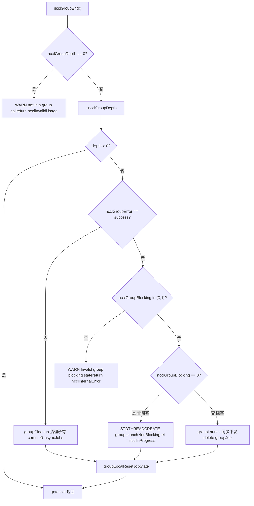

# Capítulo 22: Solución de problemas en producción y errores comunes: interbloqueos, tiempos de espera, desajustes de versión y planes de diagnóstico

En el capítulo anterior revisamos el orden de diagnóstico y las perillas clave del ajuste de rendimiento, pero las fallas de NCCL en producción a menudo no son por rendimiento insuficiente, sino porque el programa se cuelga o se bloquea directamente. La raíz de estas fallas generalmente no es que alguna función esté mal escrita, sino que se ha roto el orden de llamadas, el ciclo de vida o el contrato de versión. Este capítulo se centra en cuatro tipos de errores más típicos: interbloqueos por mal uso de la semántica de group, errores silenciosos por falta de validación de parámetros, desajustes de versión ABI, y los límites de tiempos de espera y reintentos. Seguiremos cuatro pistas: src/group.cc, src/misc/argcheck.cc, src/include/checks.h y contrib/nccl_ep/nccl_ep.cc, para ver cómo NCCL bloquea internamente estos problemas antes de que ocurran.

# Mal uso de la semántica de Group: por qué "omitir un GroupEnd" provoca un cuelgue

## Modelo intuitivo: Group es un "carrito de compras", no un "interruptor de aceleración"

Imagina`ncclGroupStart()` / `ncclGroupEnd()`como el carrito de compras en línea: pones varios productos (múltiples llamadas de comunicación) en el carrito y finalmente pagas todo de una vez (`ncclGroupEnd`). Si solo pones y no pagas, el carrito queda suspendido en el aire para siempre: el contador`ncclGroupDepth`que NCCL mantiene internamente no se reiniciará, y todas las llamadas de comunicación posteriores pensarán que "todavía se está acumulando el pedido", nunca enviarán realmente el kernel, y todo el proceso se colgará.

> **[Design Inference & Architectural Trade-offs]**
> Esta es la forma de interbloqueo más común en producción: el código, en alguna rama de excepción`return`, omitió`ncclGroupEnd`, y`ncclGroupDepth`es`thread_local`, no se limpia automáticamente al retornar la función.

## Estructura de datos: estado del group en thread_local

NCCL coloca todo el estado del group en almacenamiento local del hilo, esta es la clave para entender el interbloqueo.

[FACT:src/group.cc:34-34]

```cpp
thread_local int ncclGroupDepth = 0; // depth of ncclGroupStart nesting
thread_local ncclResult_t ncclGroupError = ncclSuccess;
thread_local struct ncclComm* ncclGroupCommHead[ncclGroupTaskTypeNum] = {nullptr};
thread_local struct ncclComm* ncclGroupCommPreconnectHead = nullptr;
thread_local struct ncclIntruQueue ncclAsyncJobs;
thread_local int ncclGroupBlocking = -1; /* default mode */
```

Interpretación campo por campo:

- `ncclGroupDepth`: profundidad de anidamiento.`ncclGroupStart`incrementa,`ncclGroupEnd`decrementa, solo al llegar a 0 se dispara realmente el envío. Soportar anidamiento es una conveniencia de diseño, pero también implica que "omitir un End" hará que la profundidad se quede en 1 para siempre.
- `ncclGroupError`: errores de group acumulados por este hilo. Una vez que una llamada falla, las siguientes`ncclGroupEnd`tomarán directamente la ruta de fallo.
- `ncclGroupCommHead[]`: cabezas de lista enlazada de dominios de comunicación agrupadas por tipo de tarea (collective / rawTask / mgmtTask / symRegister).
- `ncclAsyncJobs`: cola de tareas asíncronas pendientes de ejecución (por ejemplo, preconnect, symmetric register).
- `ncclGroupBlocking`：`-1`indica "aún no se ha encontrado ningún dominio de comunicación",`0`indica no bloqueante,`1`indica bloqueante. Este campo es el núcleo de la detección posterior de "mezcla de bloqueante y no bloqueante".

> **[Design Inference & Architectural Trade-offs]**
> Usar`thread_local`en lugar de variables globales tiene una motivación directa: NCCL permite que múltiples hilos mantengan cada uno un contexto de group independiente, sin interferirse entre sí. El costo es que — al salir el hilo, estos estados no se limpian automáticamente; si el hilo sale a mitad de un group, el estado se filtra.

## Paso a paso: la cadena completa de validación de un GroupEnd

Supongamos el escenario: la aplicación llama a`ncclGroupEnd()`, en este momento`ncclGroupDepth`es 1.

Primer paso, verificar si realmente está en un group:

[FACT:src/group.cc:1048-1052]

```cpp
  if (ncclGroupDepth == 0) {
    WARN("ncclGroupEnd: not in a group call.");
    ret = ncclInvalidUsage;
    goto exit;
  }
```

Si el usuario no llamó a`ncclGroupStart`y directamente`ncclGroupEnd`, aquí se imprimirá "not in a group call" y se retornará`ncclInvalidUsage`. Este es el error más amigable — reporta inmediatamente, no se cuelga.

Segundo paso, decrementar la profundidad, determinar si es el nivel más externo:

[FACT:src/group.cc:1061-1063]

```cpp
  if ((--ncclGroupDepth) > 0) goto exit;

  if ((ret = ncclGroupError) != ncclSuccess) goto fail;
```

Si hay múltiples niveles anidados, el`End`interno solo decrementa la profundidad y retorna, sin disparar el envío. Solo el nivel más externo continúa. Al mismo tiempo, verifica los errores acumulados.

Tercer paso, validar la consistencia del modo de bloqueo. Este es el punto de detección de "mezcla de bloqueante y no bloqueante":

[FACT:src/group.cc:1095-1101]

```cpp
  if (hasCommHead || !ncclIntruQueueEmpty(&groupJob->asyncJobs) || ncclGroupCommPreconnectHead != nullptr) {
    /* make sure ncclGroupBlocking has been set. */
    if (ncclGroupBlocking != 0 && ncclGroupBlocking != 1) {
      WARN("Invalid group blocking state %d", ncclGroupBlocking);
      ret = ncclInternalError;
      goto fail;
    }
```

`ncclGroupBlocking`debe estar entre`{0, 1}`. Si todavía es`-1`, significa que en el group no hay ni dominio de comunicación ni tareas asíncronas, lógicamente no debería llegar aquí.

Cuarto paso, bifurcar según el modo de bloqueo. No bloqueante va por envío asíncrono del hilo, bloqueante va por envío síncrono:

[FACT:src/group.cc:1102-1134]

```cpp
    if (ncclGroupBlocking == 0) {
      /* nonblocking group */
      if (!ncclIntruQueueEmpty(&groupJob->asyncJobs)) {
        ncclAsyncJob* job = ncclIntruQueueHead(&groupJob->asyncJobs);
        do {
          NCCLCHECKGOTO(ncclCommSetAsyncError(job->comm, ncclInProgress), ret, fail);
          if (job->comm->groupJob == NULL) {
            job->comm->groupJob = groupJob;
            groupJob->groupRefCount++;
          }
          job = job->next;
        } while (job);
      }
      ...
      groupJob->base.func = groupLaunchNonBlocking;
      STDTHREADCREATE_GOTO(groupJob->base.thread, ncclAsyncJobMain, ret, fail, &groupJob->base);
      groupJob->nonBlockingInit = true;
      ret = ncclInProgress;
    }
```

Nota sobre`groupRefCount++`y`ret = ncclInProgress`: en modo no bloqueante,`ncclGroupEnd`retorna inmediatamente`ncclInProgress`, el envío real se ejecuta en un hilo en segundo plano. El llamador debe posteriormente usar`ncclCommGetAsyncError`para sondear, o usar`ncclGroupJobComplete`para esperar.

## Mezcla de bloqueante y no bloqueante: por qué está prohibido

Volviendo a`ncclAsyncLaunch`, veamos la detección de mezcla:

[FACT:src/group.cc:55-64]

```cpp
    /* check if there are blocking and nonblocking comms at the same time in group. */
    if (comm->destroyFlag) {
      ncclGroupBlocking = 1;
    } else if (ncclGroupBlocking == -1) {
      /* first met communicator */
      ncclGroupBlocking = comm->config.blocking;
    } else if (ncclGroupBlocking != comm->config.blocking) {
      WARN("Blocking and nonblocking communicators are not allowed in the same group.");
      ret = ncclInvalidArgument;
    }
```

> **[Design Inference & Architectural Trade-offs]**
> ¿Por qué se prohíbe la mezcla? Porque la semántica de envío de un dominio de comunicación bloqueante es "cuando la llamada retorna, el kernel ya fue enviado", mientras que la no bloqueante es "cuando la llamada retorna, la tarea ya está en cola pero no enviada". Si ambos están en el mismo group,`ncclGroupEnd`no puede dar una semántica de retorno unificada — ¿espera o no espera? NCCL elige rechazar directamente, exponiendo el problema en el límite de la API.

## Problemas reales en producción: tres escenarios reales

**Escenario uno: una rama de excepción omite GroupEnd.**El código entre`ncclGroupStart`y`ncclGroupEnd`lanza una excepción o hace un`return`，`ncclGroupDepth`anticipado, quedándose en 1. Todas las llamadas de comunicación posteriores entran en estado de "acumular pedidos", nunca se envían. Método de diagnóstico: imprimir`ncclGroupEnd`antes de`ncclGroupDepth`, o usar`gdb`para observar esa variable thread_local.

**Escenario dos: usar el mismo comm entre hilos.**Como el estado del group es`thread_local`, después de que el hilo A llama a`ncclGroupStart`, el hilo B llama a`ncclAllReduce`no entrará en el group de A. Si A y B operan el mismo comm, aparecerá el desorden de "algunas llamadas dentro del group, otras fuera". NCCL no detecta esta situación, porque asume que un comm es operado por un solo hilo en cualquier momento.

**Escenario tres: interacción entre CUDA graph capture y group.**Ver la detección en`doLaunches`:

[FACT:src/group.cc:448-455]

```cpp
    if (capturingYes && capturingNo) {
      // We have entered barriers but are aborting without leaving them. Thus
      // these comms are permanently trashed. We need a good mechanism for
      // tracking and reporting that.
      WARN("Either none or all communicators in a ncclGroup() can be CUDA graph captured.");
      result = ncclInvalidUsage;
      goto failure;
    }
```

El comentario lo dice claramente: una vez que se entra en la barrera y se abandona a mitad, esos comm quedan "permanentemente dañados". Así que la regla es — todos los dominios de comunicación en un group, o todos están en capture, o ninguno lo está. La mezcla causa inconsistencia en el estado del comm, y NCCL actualmente no tiene un buen mecanismo de recuperación.



# Validación de parámetros y errores silenciosos: cómo ArgCheck bloquea llamadas que "parecen normales"

## Modelo intuitivo: ArgCheck es el "control de seguridad del aeropuerto"

La validación de parámetros es como el control de seguridad del aeropuerto: no se encarga de que vueles más rápido, pero puede bloquear esas cosas que "parecen equipaje pero en realidad son peligrosas". Sin él, un puntero con dispositivo incorrecto haría que el kernel de GPU leyera datos basura, o peor — escribir silenciosamente en la memoria de otro.

## Estructura de datos: modos de validación y cola global de verificación

La validación de parámetros de NCCL no es "verificar todo cada vez", sino por modos. El núcleo es`comm->checkMode`：

[FACT:src/misc/argcheck.cc:227-251]

```cpp
  if (info->comm->checkMode != ncclCheckModeDefault) {
    if ((info->coll == ncclFuncSend || info->coll == ncclFuncRecv)) {
      if (info->count > 0) NCCLCHECK(CudaPtrCheck(info->recvbuff, info->comm, "buff", info->opName));
    } else if (info->coll == ncclFuncPutSignal || info->coll == ncclFuncSignal || info->coll == ncclFuncWaitSignal) {
      // One-sided RMA ops specify the remote destination via peerWin, not sendbuff/recvbuff,
      // so the standard CUDA pointer checks do not apply here.
      INFO(NCCL_COLL, "%s : skipping sendbuff/recvbuff pointer check (one-sided RMA uses peerWin)", info->opName);
    } else {
      // Check CUDA device pointers
      if (info->coll != ncclFuncBroadcast || info->comm->rank == info->root) {
        NCCLCHECK(CudaPtrCheck(info->sendbuff, info->comm, "sendbuff", info->opName));
      }
      if (info->coll != ncclFuncReduce || info->comm->rank == info->root) {
        NCCLCHECK(CudaPtrCheck(info->recvbuff, info->comm, "recvbuff", info->opName));
      }
    }

    if (info->comm->checkMode == ncclCheckModeDebugGlobal) {
      struct ncclArgsInfo* argsInfo;
      NCCLCHECK(ncclCalloc(&argsInfo, 1));
      argsInfo->info = *info;
      argsInfo->next = NULL;
      ncclIntruQueueEnqueue(&info->comm->argsInfoQueue, argsInfo);
    }
  }
```

Tres modos:

- `ncclCheckModeDefault`: solo hace las verificaciones más baratas (rango de root, rango de datatype, rango de op), sin tocar la API de CUDA.
- Modo no predeterminado: llama a`CudaPtrCheck`, esto realmente llama a`cudaPointerGetAttributes`, tiene costo de rendimiento.
- `ncclCheckModeDebugGlobal`: además de las verificaciones locales, también mete`ncclInfo`en`argsInfoQueue`, y al finalizar el grupo, realizar una verificación de consistencia global entre ranks.

> **[Design Inference & Architectural Trade-offs]**
> Este diseño es una compensación entre rendimiento y corrección:`cudaPointerGetAttributes`es una llamada síncrona a CUDA; invocarla en cada comunicación dentro de la ruta crítica ralentiza significativamente los mensajes pequeños. Por eso, el modo predeterminado solo realiza verificaciones de "costo cero", dejando la costosa validación de punteros para el modo de depuración.

## Paso a paso: Las tres capas de defensa de CudaPtrCheck

Escenario: el usuario pasa un`sendbuff`, y NCCL lo valida en modo de depuración.

Primera capa: ¿es válido el puntero?

[FACT:src/misc/argcheck.cc:12-18]

```cpp
ncclResult_t CudaPtrCheck(const void* pointer, struct ncclComm* comm, const char* ptrname, const char* opname) {
  cudaPointerAttributes attr;
  cudaError_t err = cudaPointerGetAttributes(&attr, pointer);
  if (err != cudaSuccess || attr.devicePointer == NULL) {
    WARN("%s : %s %p is not a valid pointer", opname, ptrname, pointer);
    return ncclInvalidArgument;
  }
```

`cudaPointerGetAttributes`devuelve un error para punteros inválidos, o`devicePointer`es NULL. Esto bloquea casos como "se pasó una dirección de pila host" o "se pasó un puntero ya liberado".

Segunda capa: ¿coincide el dispositivo?

[FACT:src/misc/argcheck.cc:19-26]

```cpp
#if CUDART_VERSION >= 10000
  if (attr.type == cudaMemoryTypeDevice && attr.device != comm->cudaDev) {
#else
  if (attr.memoryType == cudaMemoryTypeDevice && attr.device != comm->cudaDev) {
#endif
    WARN("%s : %s allocated on device %d mismatchs with NCCL device %d", opname, ptrname, attr.device, comm->cudaDev);
    return ncclInvalidArgument;
  }
```

Esta es la trampa más sutil: el puntero es un puntero GPU válido, pero pertenece a otra GPU. En máquinas multitarjeta, si el usuario olvida`cudaSetDevice`, es muy fácil pasar el incorrecto. NCCL lo rechaza explícitamente aquí.

Tercera capa: integridad del objeto de dominio de comunicación:

[FACT:src/misc/argcheck.cc:38-45]

```cpp
ncclResult_t CommCheck(struct ncclComm* comm, const char* opname, const char* ptrname) {
  NCCLCHECK(PtrCheck(comm, opname, ptrname));
  if (comm->startMagic != NCCL_MAGIC || comm->endMagic != NCCL_MAGIC) {
    WARN("Error: corrupted comm object detected");
    return ncclInvalidArgument;
  }
  return ncclSuccess;
}
```

`startMagic` / `endMagic`es un valor centinela colocado al inicio y al final de la estructura`ncclComm`. Si el usuario pasa un puntero salvaje, o el comm ya fue liberado, el magic no coincide. Esta es la técnica clásica de "detección de corrupción de memoria": dos centinelas flanquean la estructura, y cualquier escritura fuera de límites probablemente dañará uno de ellos.

## Verificación de consistencia global: la validación entre ranks de registrationCheck

Esta es la validación más "pesada" en NCCL, solo se activa bajo`ncclCheckModeDebugGlobal`. Lo que verifica es si el estado de registro de memoria simétrica es consistente en todos los ranks.

[FACT:src/misc/argcheck.cc:95-111]

```cpp
  NCCLCHECKGOTO(bootstrapAllGather(comm->bootstrap, bufInfo, sizeof(struct symBufInfo) * 2), ret, fail);

  cmpBufInfo[0] = bufInfo[0];
  cmpBufInfo[1] = bufInfo[1];
  for (int r = 1; r nRanks; r++) {
    int infoIdx = r * 2;
    if (cmpBufInfo[0].isSymRegistered != bufInfo[infoIdx].isSymRegistered ||
        cmpBufInfo[1].isSymRegistered != bufInfo[infoIdx + 1].isSymRegistered) {
      if (comm->rank == 0) {
        WARN("Coll %s size %ld symmetric registration check failed on rank %d: sendReg %d recvReg %d mismatch with "
             "rank 0 sendReg %d recvReg %d",
             info->opName, size, r, bufInfo[infoIdx].isSymRegistered, bufInfo[infoIdx + 1].isSymRegistered,
             cmpBufInfo[0].isSymRegistered, cmpBufInfo[1].isSymRegistered);
      }
      ret = ncclInvalidArgument;
      goto fail;
    }
```

Utiliza el bootstrap`allGather`para recolectar el`(isSymRegistered, bigOffset, userOffset)`de cada rank, y luego compara rank por rank. Si el send buffer del rank 0 registró memoria simétrica y el rank 3 no lo hizo, aquí se reportará un error.

> **[Design Inference & Architectural Trade-offs]**
> ¿Por qué es importante esta verificación? La memoria simétrica (symmetric memory) requiere que todos los ranks accedan al búfer usando el mismo conjunto de direcciones virtuales. Si el buffer de algún rank no está registrado, la dirección calculada en el kernel será incorrecta, leyendo basura o fuera de límites. Este tipo de error se manifiesta en tiempo de ejecución como "resultados ocasionalmente incorrectos", extremadamente difícil de diagnosticar. NCCL elige bloquearlo en el límite de la API con el costo de un allGather.

## Trampas en producción

**Trampa uno: en modo predeterminado, los errores de puntero no se reportan.**Si el usuario no activa el modo de depuración y pasa un puntero de dispositivo incorrecto, NCCL no reportará error en la etapa de`ArgsCheck`, sino que lo descubrirá hasta la ejecución del kernel, cuando posiblemente ya haya corrompido la memoria de otro rank. Se recomienda usar`NCCL_DEBUG=WARN`más`checkMode`para depuración durante el desarrollo.

**Trampa dos:`ncclCheckModeDebugGlobal`el costo del allGather de**Realizar un bootstrap allGather en cada comunicación se convierte en un cuello de botella en escenarios de mensajes pequeños de alta frecuencia. Este modo solo es adecuado para depuración, no para producción.

**Trampa tres: el ciclo de vida de userRedOp.**Observa este fragmento:

[FACT:src/misc/argcheck.cc:220-225]

```cpp
  int opIx = int(ncclUserRedOpMangle(info->comm, info->op)) - int(ncclNumOps);
  if (ncclNumOps op &&
      (info->comm->userRedOpCapacity comm->userRedOps[opIx].freeNext != -1)) {
    WARN("%s : reduction operation %d unknown to this communicator", info->opName, info->op);
    return ncclInvalidArgument;
  }
```

La operación de reducción personalizada del usuario se registra en el comm. Si el usuario pasa una op que "alguna vez estuvo registrada pero ya fue liberada",`freeNext != -1`detectará que ya ha sido reciclada. Esta es una verificación para prevenir "handles de op colgantes".

# Macros de propagación de errores: cómo la familia NCCLCHECK garantiza que "los errores no se pierdan"

## Modelo intuitivo: los macros de propagación de errores son un "relevo"

El manejo de errores de NCCL se basa en un relevo de macros: la función de bajo nivel devuelve`ncclResult_t`, la capa superior verifica con`NCCLCHECK`y retorna inmediatamente si no es exitoso. Es como una carrera de relevos: el testigo (código de error) debe transmitirse hasta el final; si algún relevo lo deja caer, toda la cadena se rompe.

## Estructura de datos: panorama completo de la familia de macros

[FACT:src/include/checks.h:148-166]

```cpp
#define NCCLCHECK(call) \
  do { \
    ncclResult_t RES = call; \
    if (RES != ncclSuccess && RES != ncclInProgress) { \
      /* Print the back trace*/ \
      if (ncclDebugNoWarn == 0) INFO_LOC(NCCL_ALL, "-> %d", RES); \
      return RES; \
    } \
  } while (0)

#define NCCLCHECKGOTO(call, RES, label) \
  do { \
    RES = call; \
    if (RES != ncclSuccess && RES != ncclInProgress) { \
      /* Print the back trace*/ \
      if (ncclDebugNoWarn == 0) INFO_LOC(NCCL_ALL, "-> %d", RES); \
      goto label; \
    } \
  } while (0)
```

Detalles clave:`ncclInProgress`se considera "no error". Este es el núcleo de la comunicación no bloqueante:`ncclGroupEnd`devuelve`ncclInProgress`significa "tarea enviada, aún no completada"; el llamador debe seguir sondeando en lugar de tratarlo como error.

`NCCLCHECK`directamente`return`，`NCCLCHECKGOTO`salta a`label`. Este último se usa en escenarios que requieren limpieza de recursos.

## Ruta de limpieza: NCCLCHECKIGNORE conserva el primer error

[FACT:src/include/checks.h:168-177]

```cpp
// Report failure but continue - useful for cleanup paths where we want to
// attempt all cleanup steps. Preserves the first error in RES.
#define NCCLCHECKIGNORE(call, RES) \
  do { \
    ncclResult_t TMPRES = call; \
    if (TMPRES != ncclSuccess && TMPRES != ncclInProgress) { \
      if (ncclDebugNoWarn == 0) INFO_LOC(NCCL_ALL, "-> %d", TMPRES); \
      if (RES == ncclSuccess) RES = TMPRES; \
    } \
  } while (0)
```

El comentario lo dice claramente: en la ruta de limpieza se deben "intentar todos los pasos de limpieza" sin ser interrumpido por el primer error. Pero el código de error debe conservar el primero, porque el primer error suele ser la causa raíz con mayor valor diagnóstico.

## Espera y aborto: la verificación de abortFlag en NCCLWAIT

[FACT:src/include/checks.h:196-205]

```cpp
#define NCCLWAIT(call, cond, abortFlagPtr) \
  do { \
    uint32_t* tmpAbortFlag = (abortFlagPtr); \
    ncclResult_t RES = call; \
    if (RES != ncclSuccess && RES != ncclInProgress) { \
      if (ncclDebugNoWarn == 0) INFO_LOC(NCCL_ALL, "-> %d", RES); \
      return ncclInternalError; \
    } \
    if (COMPILER_ATOMIC_LOAD(tmpAbortFlag, std::memory_order_acquire)) NEQCHECK(*tmpAbortFlag, 0); \
  } while (!(cond))
```

Esta es la plantilla de espera por sondeo: en cada iteración se llama a`call`(avanzar progreso), se verifica`cond`(si se cumple), y se verifica`abortFlag`(si fue abortado).`abortFlag`se carga con`memory_order_acquire`para garantizar que se vea la señal de aborto escrita por otros hilos.

> **[Design Inference & Architectural Trade-offs]**
> Este diseño resuelve un problema clásico: cuando un rank falla, otros ranks pueden seguir esperando indefinidamente sus datos.`abortFlag`es el mecanismo para propagar la señal de aborto entre ranks: una vez establecida, todos los bucles de espera saldrán.

## Macros seguros para creación de hilos y asignación de memoria

[FACT:src/include/checks.h:237-256]

```cpp
#define STDTHREADCREATE_IMPL(var, func, error_action, ...) \
  do { \
    try { \
      (var) = std::thread(func, __VA_ARGS__); \
    } catch (const std::exception& e) { \
      WARN("Thread creation failed: %s", e.what()); \
      error_action; \
    } \
  } while (0)

#define STDTHREADCREATE(var, func, ...) STDTHREADCREATE_IMPL(var, func, return ncclSystemError, __VA_ARGS__)

#define STDTHREADCREATE_GOTO(var, func, RES, label, ...) \
  STDTHREADCREATE_IMPL( \
    var, func, \
    do { \
      RES = ncclSystemError; \
      goto label; \
    } while (0), \
    __VA_ARGS__)
```

`std::thread`Si la construcción falla, lanza una excepción (por ejemplo, si se excede el número de hilos). Este macro convierte la excepción en`ncclSystemError`, evitando que la excepción atraviese el límite de la API C.

[FACT:src/include/checks.h:258-275]

```cpp
#define NEW_NOTHROW(var, x) \
  do { \
    (var) = new (std::nothrow) x{}; \
    if (!(var)) { \
      WARN("Allocation failed"); \
      return ncclSystemError; \
    } \
  } while (0)
```

`new (std::nothrow)`devuelve nullptr en caso de fallo de asignación en lugar de lanzar una excepción. Esta es la práctica estándar del código C++ en el límite de la API C.

## Trampas en producción

**Trampa uno:`ncclInProgress`se confunde erróneamente con éxito.**Algunos códigos de usuario escriben`if (ret == ncclSuccess)`para determinar éxito, pero en modo no bloqueante lo que se devuelve es`ncclInProgress`. La forma correcta es`if (ret == ncclSuccess || ret == ncclInProgress)`, o consultar con`ncclCommGetAsyncError`.

**Trampa dos:`NCCLCHECK`Se usa en el destructor.**Si se usa en el destructor`NCCLCHECK`, el error directamente`return`, omitiendo la limpieza posterior. Se debería usar`NCCLCHECKIGNORE`。

# Incompatibilidad de versión ABI: el diseño basado en size de nccl_ep

## Modelo intuitivo: ABI es el "estándar de enchufe"

ABI (interfaz binaria de aplicación) es como el estándar de enchufes eléctricos: si la biblioteca y el invocador tienen entendimientos inconsistentes sobre "cómo es la estructura", es como enchufar un enchufe estadounidense en un tomacorriente europeo — en el mejor caso no funciona, en el peor se quema.`contrib/nccl_ep`Utiliza un diseño ingenioso: cada estructura que cruza el límite comienza con un campo`size`.

## Estructura de datos: doble verificación size + magic

[FACT:contrib/nccl_ep/nccl_ep.cc:70-76]

```cpp
// Size-based ABI versioning: every cross-boundary struct starts with a `size`
// field set by the caller to sizeof(struct). The library checks that against
// its own known size; any mismatch means caller and library are from different
// releases. Strict equality for now — see nccl_ep.h for the planned future
// relaxation (all-zero-trailing-bytes escape hatch).
// Immediately after `size` there is a `magic` field pre-filled by NCCL_EP_*_INIT
// to catch unininitialized structures.
```

Puntos clave del diseño:

- `size`El campo es llenado por el invocador con`sizeof(struct)`, la biblioteca verifica si es igual al size que ella conoce.
- `magic`El campo es prellenado por la macro`NCCL_EP_*_INIT`, para capturar estructuras "no inicializadas".
- Actualmente es igualdad estricta, en el futuro se planea soportar un modo permisivo de "si la cola es todo ceros, se permite un size menor".

## Paso a paso: el flujo de verificación de EP_REQUIRE_STRUCT

[FACT:contrib/nccl_ep/nccl_ep.cc:77-80]

```cpp
#define EP_REQUIRE_STRUCT(ptr) \
    do { \
        assert( \
            (ptr) != nullptr && (ptr)->size == sizeof(*(ptr)) && \
```

Esta macro se invoca en puntos de entrada como`ncclEpDispatch`、`ncclEpCombine`:

[FACT:contrib/nccl_ep/nccl_ep.cc:2827-2830]

```cpp
    EP_REQUIRE_STRUCT(inputs);
    EP_REQUIRE_STRUCT(outputs);
    EP_OPTIONAL_LAYOUT_INFO(layout_info);
    EP_OPTIONAL_STRUCT(config);
```

`inputs`y`outputs`son parámetros requeridos, se usan`EP_REQUIRE_STRUCT`；`layout_info`y`config`son parámetros opcionales, se usan`EP_OPTIONAL_*`。

## Lectura de campos segura por versión: layoutInfoRecvTopkIdxKind

Esta es la parte más ingeniosa — cómo leer campos de forma segura cuando "la estructura del invocador puede ser más pequeña".

[FACT:contrib/nccl_ep/nccl_ep.cc:139-144]

```cpp
// Safe field reader for ncclEpLayoutInfo_t::recv_topk_idx_kind. Returns AUTO
// when the caller's struct (size) does not cover the field, preserving the
// pre-flag default.
static inline ncclEpExpertIdKind_t layoutInfoRecvTopkIdxKind(const ncclEpLayoutInfo_t* lip) {
    if (lip == nullptr) return NCCL_EP_EXPERT_ID_AUTO;
    constexpr size_t field_end = offsetof(ncclEpLayoutInfo_t, recv_topk_idx_kind) + sizeof(ncclEpExpertIdKind_t);
    if (lip->size recv_topk_idx_kind;
}
```

La lógica es: si el`size`del invocador es menor que "el offset donde termina ese campo", significa que el invocador usa una estructura de versión antigua, este campo no existe, retorna el valor por defecto`AUTO`. De lo contrario, lee normalmente.

> **[Design Inference & Architectural Trade-offs]**
> Esta es la técnica estándar de compatibilidad ABI: los campos nuevos solo pueden agregarse al final de la estructura, al leer se usa`size`para determinar si el campo existe. Así los invocadores antiguos usan estructuras antiguas, y la nueva biblioteca también puede manejarlos correctamente.

## Verificación de número de versión: advertencia suave en lugar de rechazo duro

[FACT:contrib/nccl_ep/nccl_ep.cc:1393-1400]

```cpp
    if (in_config->version != NCCL_EP_API_VERSION) {
        fprintf(
            stderr,
            "NCCL EP WARN: ncclEpGroupConfig_t.version=%u, library API_VERSION=%u; "
            "behavior may differ across versions.\n",
            in_config->version,
            (unsigned)NCCL_EP_API_VERSION);
    }
```

Nota que aquí es`WARN`en lugar de`return error`. La incompatibilidad de número de versión solo es una advertencia, porque la verificación de`size`ya garantiza la seguridad del diseño de memoria. El número de versión es más una indicación de que "el comportamiento puede ser diferente".

## Errores en producción

**Error uno: olvidar inicializar con la macro INIT.**Si el usuario manualmente pone`memset`la estructura a 0,`magic`será 0,`EP_REQUIRE_STRUCT`fallará. Se debe usar la macro`NCCL_EP_*_INIT`.

**Error dos: mezclar bibliotecas dinámicas entre versiones.**Si la aplicación enlaza la nueva versión de`libnccl_ep.so`, pero el header es de versión antigua,`sizeof(struct)`será inconsistente,`EP_REQUIRE_STRUCT`reportará error inmediatamente. Esto es intencional en el diseño — fallar rápido es mejor que errores silenciosos.

**Error tres:`EP_OPTIONAL_LAYOUT_INFO`verificación de rango.**Mira este fragmento:

[FACT:contrib/nccl_ep/nccl_ep.cc:114-123]

```cpp
            if ((ptr)->size size > sizeof(*(ptr))) { \
                fprintf( \
                    stderr, \
                    "NCCL EP: ncclEpLayoutInfo_t size out of supported range: " \
                    "got %u, expected [%zu, %zu]\n", \
                    (ptr)->size, \
                    kNcclEpLayoutInfoMinSize, \
                    sizeof(*(ptr))); \
                return ncclInvalidArgument; \
            } \
```

`layout_info`permite que size esté en el rango`[min, sizeof]`, esto es más permisivo que la igualdad estricta de`EP_REQUIRE_STRUCT`. La razón es que`layout_info`es un parámetro opcional, y históricamente los campos han aumentado y disminuido.

```mermaid
flowchart TD
    entry["ncclEpDispatch(inputs, outputs, layout_info, config)"] --> req_inputs{"EP_REQUIRE_STRUCT(inputs)size == sizeof?"}
    req_inputs -->|否| err_size["assert 失败 / 返回错误"]
    req_inputs -->|是| req_outputs{"EP_REQUIRE_STRUCT(outputs)"}
    req_outputs -->|否| err_size
    req_outputs -->|是| opt_layout{"layout_info != nullptr?"}
    opt_layout -->|否| skip_layout["跳过 layout 校验"]
    opt_layout -->|是| range_check{"size in [min, sizeof]?"}
    range_check -->|否| err_range["fprintf size out of rangereturn ncclInvalidArgument"]
    range_check -->|是| magic_check{"magic == NCCL_EP_MAGIC?"}
    magic_check -->|否| err_magic["fprintf magic mismatchreturn ncclInvalidArgument"]
    magic_check -->|是| read_field["layoutInfoRecvTopkIdxKindsize  read_field
    read_field --> proceed["继续执行 dispatch 逻辑"]
```

# Timeout, reintento y aborto: de NCCLWAIT a timeout_cycles de nccl_ep

## Modelo intuitivo: el timeout es un "fusible"

En comunicación distribuida, si un rank se atasca, todos los ranks esperan indefinidamente. El mecanismo de timeout es como un fusible: en condiciones normales no actúa, pero una vez que la corriente es anómala se funde, evitando que todo el sistema se queme.

## Estructura de datos: abortFlag y timeout_cycles

El núcleo de NCCL usa`abortFlag`para propagar la señal de aborto. Mira la transmisión en`ncclAsyncLaunch`:

[FACT:src/group.cc:49-52]

```cpp
    job->abortFlag = comm->abortFlag;
    job->abortFlagDev = comm->abortFlagDev;
    job->childAbortFlag = comm->childAbortFlag;
    job->childAbortFlagDev = comm->childAbortFlagDev;
```

Cada job mantiene un puntero al abortFlag del comm. Cuando el group detecta un error:

[FACT:src/group.cc:118-126]

```cpp
        if (!job->destroyFlag &&
            (COMPILER_ATOMIC_LOAD(groupAbortFlag, std::memory_order_acquire) || errorJobAbortFlag == true)) {
          COMPILER_ATOMIC_STORE(job->abortFlag, uint32_t(1), std::memory_order_release);
          COMPILER_ATOMIC_STORE(job->abortFlagDev, uint32_t(1), std::memory_order_release);
          if (job->childAbortFlag) {
            COMPILER_ATOMIC_STORE(job->childAbortFlag, uint32_t(1), std::memory_order_release);
            COMPILER_ATOMIC_STORE(job->childAbortFlagDev, uint32_t(1), std::memory_order_release);
          }
        }
```

Una vez que`groupAbortFlag`o`errorJobAbortFlag`son verdaderos, el abortFlag de todos los jobs se pone a 1.`memory_order_release`garantiza que las escrituras anteriores sean visibles para otros hilos.

## El diseño de timeout de nccl_ep: ciclos de reloj de GPU

`nccl_ep`usa un timeout más fino — en unidades de ciclos de reloj de GPU.

[FACT:contrib/nccl_ep/nccl_ep.cc:1558-1591]

```cpp
    // Resolve timeout_cycles: env var > config field > compile-time default
    {
        int dev;
        int clock_khz_int;
        CUDA_CHECK(cudaGetDevice(&dev));
        CUDA_CHECK(cudaDeviceGetAttribute(&clock_khz_int, cudaDevAttrClockRate, dev));
        uint64_t clock_khz = static_cast(clock_khz_int);

        uint64_t resolved = NUM_TIMEOUT_CYCLES;
        const char* source = "compile-time default";
        const uint64_t env_ms = static_cast(ep_group->env.timeout_ms.value.ul);
        // Only a positive timeout overrides the default.
        const bool have_env_ms = ep_group->env.timeout_ms.is_set && env_ms > 0;

        if (have_env_ms) {
            resolved = clock_khz * 1000ULL * env_ms / 1000ULL;
            source = "NCCL_EP_TIMEOUT_MS env var";
            ...
        } else if (ep_group->config.timeout_ns != 0) {
            resolved = clock_khz * 1000ULL * (ep_group->config.timeout_ns / 1000000ULL) / 1000ULL;
            source = "config.timeout_ns";
        }

        ep_group->timeout_cycles = resolved;
```

La prioridad es: variable de entorno`NCCL_EP_TIMEOUT_MS`> campo de configuración`timeout_ns`> valor por defecto en tiempo de compilación. La fórmula de conversión es`clock_khz * 1000 * ms / 1000`, es decir, convierte milisegundos a ciclos de reloj.

> **[Design Inference & Architectural Trade-offs]**
> ¿Por qué usar ciclos de reloj en lugar de milisegundos? Porque el bucle de espera dentro del kernel de GPU no puede llamar APIs de tiempo del sistema, solo puede leer el registro`clock64()`. Usar ciclos de reloj para determinar timeout permite comparar directamente en el kernel, sin intervención del host.

## Bandera de error asíncrono: memoria host-pinned

[FACT:contrib/nccl_ep/nccl_ep.cc:1767-1778]

```cpp
    // Allocate mask buffer and async error flag for active-mask support
    if (ep_group->config.enable_mask && ep_group->config.algorithm == NCCL_EP_ALGO_LOW_LATENCY) {
        size_t mask_bytes = ep_group->nRanks * sizeof(int);
        CUDA_CHECK(cudaMalloc(reinterpret_cast(&ep_group->mask_buffer), mask_bytes));
        // Initialize all ranks as active (1 = active, 0 = masked/failed)
        std::vector all_active(ep_group->nRanks, 1);
        CUDA_CHECK(
            cudaMemcpyAsync(ep_group->mask_buffer, all_active.data(), mask_bytes, cudaMemcpyHostToDevice, stream));
        CUDA_CHECK(
            cudaHostAlloc(reinterpret_cast(&ep_group->async_error_flag), sizeof(int), cudaHostAllocMapped));
        *ep_group->async_error_flag = 0;
    }
```

`async_error_flag`se asigna con`cudaHostAllocMapped`, esta es memoria host-pinned y mapeada al espacio de direcciones del dispositivo. El kernel de GPU puede escribirla, el host puede leerla, sin copia explícita.

## Lectura de error asíncrono: carga atómica

[FACT:contrib/nccl_ep/nccl_ep.cc:4312-4321]

```cpp
ncclResult_t ncclEpGetAsyncError(ncclEpGroup_t ep_group, int* error_out) {
    EP_HOST_ASSERT(ep_group != nullptr);
    if (!ep_group->config.enable_mask) {
        return ncclInvalidUsage;
    }
    EP_HOST_ASSERT(ep_group->async_error_flag != nullptr && "ncclEpGetAsyncError: enable_mask must be true");
    EP_HOST_ASSERT(error_out != nullptr);
    *error_out = __atomic_load_n(ep_group->async_error_flag, __ATOMIC_ACQUIRE);
    return ncclSuccess;
}
```

Se usa`__atomic_load_n`con`__ATOMIC_ACQUIRE`, garantizando leer el valor más reciente escrito por la GPU, no un valor antiguo en caché.

## Errores en producción

**Error uno: timeout configurado demasiado corto causa falsos positivos.**Si`NCCL_EP_TIMEOUT_MS`se configura demasiado pequeño, fluctuaciones normales de red se malinterpretan como timeout. Se recomienda configurar según el RTT real de la red, generalmente no menos de 10 segundos.

**Error dos: abortFlag no se limpia después de configurarse.**Una vez que abortFlag se pone a 1, el comm entra en estado "abortado". Si el usuario quiere seguir usando este comm, debe limpiar abortFlag primero. El`ncclCommAbort`de NCCL hace esta limpieza.

**Error tres:`ncclEpMaskClean`precondiciones de**Mira este fragmento:

[FACT:contrib/nccl_ep/nccl_ep.cc:4262-4266]

```cpp
    EP_HOST_ASSERT(ep_group->config.algorithm == NCCL_EP_ALGO_LOW_LATENCY);
    EP_HOST_ASSERT(
        ep_group->rdma_buffer != nullptr &&
        "ncclEpMaskClean: rdma_buffer not yet allocated; create at least one LL handle first");
    EP_HOST_ASSERT(ep_group->sync_buffer != nullptr && ep_group->sync_window != nullptr);
```

`ncclEpMaskClean`requiere que`rdma_buffer`ya esté asignado. Si el usuario creó un group pero aún no ha creado ningún LL handle,`rdma_buffer`es nullptr (porque LL se asigna de forma perezosa), aquí fallará el assert.

# Resumen del capítulo

Este capítulo conecta cuatro tipos de errores en producción:

1. **Uso incorrecto de la semántica de Group**：`ncclGroupDepth`es thread_local, omitir`ncclGroupEnd`provocará un bloqueo permanente; los dominios de comunicación bloqueantes y no bloqueantes no pueden mezclarse; la captura de CUDA graph debe ser todo o nada.

2. **Validación de parámetros**：`ArgsCheck`Validación por modos, el modo predeterminado solo realiza comprobaciones de costo cero;`CudaPtrCheck`Tres capas de defensa bloquean punteros inválidos, dispositivos incorrectos y comm corruptos;`registrationCheck`Realizar comprobaciones de consistencia de memoria simétrica entre ranks.

3. **Propagación de errores**：`NCCLCHECK`La familia garantiza que los errores no se pierdan;`ncclInProgress`no es un error;`NCCLCHECKIGNORE`se utiliza en la ruta de limpieza para conservar el primer error;`NCCLWAIT`verificar abortFlag durante el sondeo.

4. **Versión de ABI**：`nccl_ep`Diseño basado en tamaño, cada estructura que cruza el límite comienza con`size`junto con`magic`para capturar la falta de inicialización; los nuevos campos solo pueden añadirse al final, y al leer se usa`size`para determinar si existen.

5. **Tiempo de espera y aborto**: el núcleo usa`abortFlag`para propagar el aborto;`nccl_ep`usa ciclos de reloj de GPU para el tiempo de espera,`async_error_flag`usa memoria host-pinned para implementar notificaciones asíncronas GPU→host.

# Reflexiones y autoevaluación de este capítulo

P1: Si se cambia`ncclGroupEndInternal`en`if ((--ncclGroupDepth) > 0) goto exit;`（[FACT:src/group.cc:1061]) a`if (ncclGroupDepth > 0) goto exit;`(sin decrementar), ¿qué ocurriría? ¿Qué consecuencias tendría en escenarios de grupos anidados?

**Análisis de referencia**：

El código original`--ncclGroupDepth`decrementa primero y luego evalúa. Si se cambia a no decrementar:

```cpp
if (ncclGroupDepth > 0) goto exit;  // 错误版本
```

entonces cada vez`ncclGroupEnd`no reducirá la profundidad. Supongamos que el usuario escribe:

```cpp
ncclGroupStart();  // depth = 1
ncclGroupStart();  // depth = 2
ncclAllReduce(...);
ncclGroupEnd();    // 原版: depth = 1, 返回; 错误版: depth = 2, 返回
ncclGroupEnd();    // 原版: depth = 0, 触发下发; 错误版: depth = 2, 返回
```

En la versión errónea, en la segunda`ncclGroupEnd`el`ncclGroupDepth`sigue siendo 2,`> 0`se cumple, directamente`goto exit`, nunca se activa el envío. Todas las llamadas de comunicación permanecen en estado de "acumulación", y el proceso se bloquea.

Lo más insidioso es que:`ncclGroupDepth`es thread_local, no se restablece al retornar la función. Incluso si el código posterior ya no llama a la API de group, todas las comunicaciones en este hilo quedarán invalidadas.

Este cambio también rompería la semántica de emparejamiento de`ncclGroupStart`——`ncclGroupStart`incrementa,`ncclGroupEnd`no decrementa, la profundidad solo aumenta y nunca disminuye, finalmente desbordándose (aunque el desbordamiento de int requiere 2000 millones de llamadas, en la práctica es más probable un bloqueo lógico).

Q2: `CudaPtrCheck`en`attr.type == cudaMemoryTypeDevice && attr.device != comm->cudaDev`（[FACT:src/misc/argcheck.cc:20]) esta comprobación, si se elimina`attr.type == cudaMemoryTypeDevice`esta condición, ¿qué problema habría? ¿En qué escenarios se producirían falsos positivos?

**Respuesta de referencia**：

`cudaPointerAttributes.type`tiene tres valores posibles:`cudaMemoryTypeDevice`(memoria de dispositivo),`cudaMemoryTypeHost`(memoria de host),`cudaMemoryTypeManaged`(memoria unificada).

Si se elimina`attr.type == cudaMemoryTypeDevice`la condición, se convierte en:

```cpp
if (attr.device != comm->cudaDev) {  // 错误版本
```

entonces para memoria host o memoria managed,`attr.device`podría ser -1 o 0, y no coincidiría con`comm->cudaDev`, produciendo un falso positivo de "dispositivo no coincide".

Escenario concreto: el usuario pasa un puntero asignado por`cudaMallocManaged`. El`attr.device`de la memoria managed normalmente es el dispositivo en el momento de la asignación, pero si la memoria se migra a otro dispositivo,`attr.device`podría cambiar. Más común es la memoria host (por ejemplo,`cudaHostAlloc`memoria pinned asignada),`attr.device`es -1, y no es igual a ningún`cudaDev`, produciendo un falso positivo.

NCCL permite que la memoria host se use como búfer de comunicación (a través de`cudaMemcpy`como intermediario), por lo que debe distinguirse entre "memoria de dispositivo pero dispositivo incorrecto" y "memoria no de dispositivo". Lo primero es un error, lo segundo es legítimo.

Q3: `layoutInfoRecvTopkIdxKind`（[FACT:contrib/nccl_ep/nccl_ep.cc:139-144]) usa`lip->size < field_end`para determinar si un campo existe. Si la nueva versión inserta un campo en medio de la estructura (en lugar del final), ¿cómo fallaría esta comprobación? ¿Por qué el diseño de ABI establece que los nuevos campos solo pueden añadirse al final?

**Análisis de referencia**：

Supongamos que la estructura original es:

```c
struct ncclEpLayoutInfo_t {
    unsigned int size;
    unsigned int magic;
    ncclEpExpertIdKind_t recv_topk_idx_kind;  // offset = 8
};
```

`field_end = offsetof(recv_topk_idx_kind) + sizeof(...) = 8 + 4 = 12`。

Si la nueva versión inserta un campo entre`magic`y`recv_topk_idx_kind`:

```c
struct ncclEpLayoutInfo_t {
    unsigned int size;
    unsigned int magic;
    unsigned int new_field;                    // 新插入
    ncclEpExpertIdKind_t recv_topk_idx_kind;  // offset 变成 12
};
```

En este caso`field_end = 12 + 4 = 16`. El`size`del llamador antiguo es 12 (tamaño de la estructura antigua),`12 < 16`se cumple, la función devuelve`AUTO`——pero el llamador antiguo en realidad sí tiene el campo`recv_topk_idx_kind`, solo que con un desplazamiento diferente. Esto provocaría que el`recv_topk_idx_kind`establecido por el llamador antiguo sea ignorado.

Peor aún, si el llamador antiguo escribe`recv_topk_idx_kind`según el desplazamiento antiguo (8), la nueva biblioteca lee según el nuevo desplazamiento (12), leyendo el valor de`new_field`, completamente desordenado.

Por lo tanto, la regla de hierro del diseño de ABI es:**los nuevos campos solo pueden añadirse al final de la estructura**. Así, el`size`del llamador antiguo es menor que el`field_end`del nuevo campo, y la función devuelve correctamente el valor predeterminado; el`size`del nuevo llamador cubre el nuevo campo, y la lectura es normal. Insertar campos en medio rompe todas las comprobaciones de versión basadas en`offsetof`.

Este capítulo analizó cuatro tipos típicos de errores en entornos de producción y sus mecanismos internos de defensa. Estas condiciones límite nos recuerdan que la operación estable de NCCL no solo depende de la implementación central, sino también de la adaptación y extensión del ecosistema circundante. En el próximo capítulo nos centraremos en el ecosistema y las extensiones, y veremos cómo proyectos periféricos como nccl4py, nccl4rust, nccl_ep, nccl_ubx llevan las capacidades de NCCL a un público más amplio.
