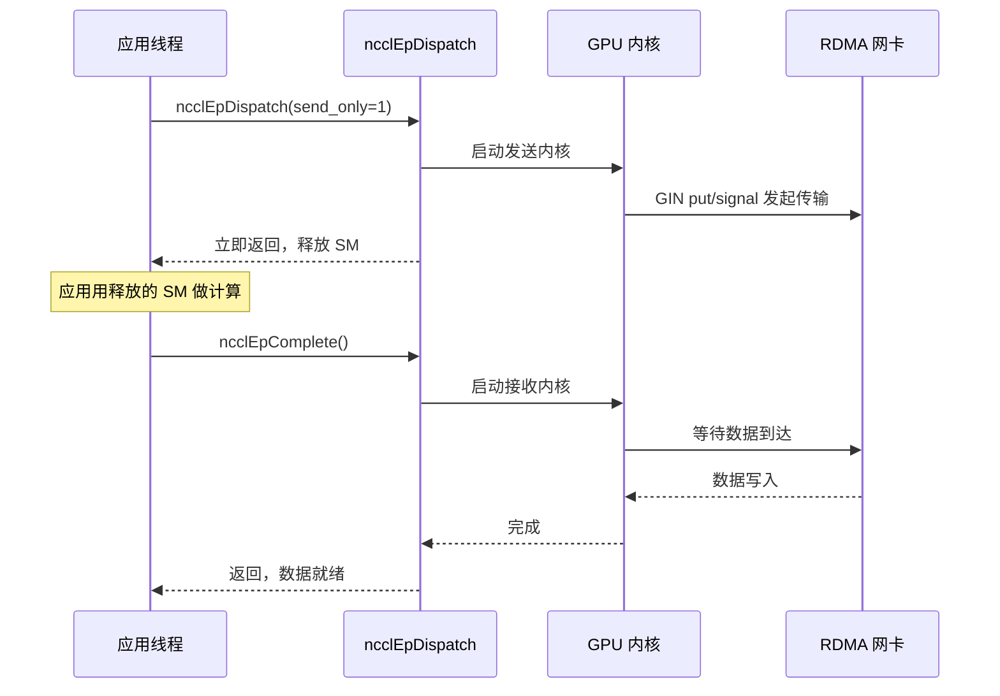
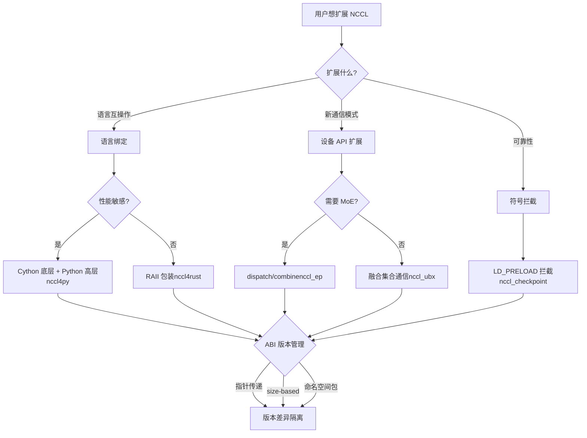

# Capítulo 23: Extensión del ecosistema: proyectos periféricos como nccl4py, nccl4rust, nccl_ep, nccl_ubx

En el capítulo anterior investigamos las fallas típicas de NCCL en entornos de producción: uso incorrecto de la semántica de group, desajuste en el número de ranks, interacción con streams, conflictos de versiones ABI y tiempos de espera de red. La mayoría de estos problemas ocurren en escenarios donde se utiliza directamente la ABI de C, mientras que los frameworks modernos de entrenamiento de grandes modelos a menudo no llaman directamente a la ABI de C, sino que reutilizan las capacidades de NCCL a través de enlaces de lenguaje como Python, Rust, o mediante proyectos de extensión orientados a escenarios como MoE y comunicación de ultra ancho de banda. Estos proyectos periféricos se ubican en los directorios bindings/ y contrib/, con un posicionamiento experimental y mantenido por la comunidad, sin heredar las garantías de calidad de lanzamiento de la biblioteca central. Este capítulo analiza uno por uno nccl4py, nccl4rust, nccl_ep, nccl_ubx y nccl_checkpoint, para ver cómo a través de tres rutas —enlaces de lenguaje, extensión de API de dispositivo e intercepción de símbolos— construyen un ecosistema rico fuera del núcleo.

# nccl4py: Enlaces Cython y diseño de paquete de espacio de nombres

## Modelo intuitivo: traducir la ABI de C a algo que Python entienda

Imagina que el núcleo de NCCL es un diplomático que solo habla lenguaje C, y el script de entrenamiento en Python es un pasante que solo habla Python. nccl4py es ese traductor: no cambia lo que dice el diplomático (el comportamiento de NCCL), solo traduce «`ncclAllReduce(sendbuff, recvbuff, count, ...)`» a «`nccl.all_reduce(tensor)`». Sin esta capa de traducción, cada framework de Python tendría que escribir sus propios enlaces ctypes, lo que sería trabajo repetitivo y propenso a errores.

## Estructura por capas: base en Cython + capa superior en Python

El diseño de nccl4py es de dos capas: la base son enlaces Cython (`nccl/bindings/cynccl.pxd`), la capa superior es la API de Python (`nccl.core`). El README especifica claramente esta división por capas[FACT:bindings/nccl4py/README.md:4-4]：

> `nccl4py provides low-level Cython bindings and a high-level Python API`

Los enlaces Cython se distribuyen con el wheel en forma de archivos`.pxd`para que otras extensiones Cython puedan directamente`cimport` [FACT:bindings/nccl4py/README.md:39-43]：

```cython
from nccl.bindings cimport cynccl
```

> **[Design Inference & Architectural Trade-offs]**
> ¿Por qué exponer la capa Cython y no solo la capa Python? Porque algunos frameworks (como DeepSpeed, Megatron) tienen su bucle principal en Cython, y llamar cada vez a través del intérprete de Python tiene un costo demasiado alto. Directamente`cimport cynccl`permite que las extensiones Cython llamen a las funciones de NCCL con una sobrecarga casi nula, cercana a C. Este es un diseño típico de «exposición por capas»: la capa superior para usuarios comunes, la capa inferior para escenarios sensibles al rendimiento.

## Paquete de espacio de nombres: múltiples distribuciones comparten el prefijo`nccl`

Este es el diseño más ingenioso de nccl4py.`nccl`es un paquete de espacio de nombres implícito de PEP 420[FACT:bindings/nccl4py/README.md:50-51]：

> `nccl` is a PEP 420 implicit namespace package. nccl4py provides `nccl.bindings` and `nccl.core`; other NCCL extension distributions can provide additional `nccl.*` subpackages.

> **[Design Inference & Architectural Trade-offs]**
> En los paquetes tradicionales de Python,`nccl/__init__.py`«poseería» todo el espacio de nombres`nccl`. Si los enlaces Python de nccl4py y nccl_ep quisieran ambos proporcionar`nccl.xxx`, habría conflicto: quien se instale primero gana. Los paquetes de espacio de nombres de PEP 420 resuelven este problema: sin`__init__.py`, múltiples distribuciones pueden colocar cada una subpaquetes en el directorio`nccl/`, y el sistema de importación de Python los fusionará. Así, nccl4py proporciona`nccl.bindings`y`nccl.core`, nccl_ep proporciona`nccl.ep`, y ambos pueden coexistir[FACT:contrib/nccl_ep/README.md:80-82]。

Este diseño es crucial para la expansión del ecosistema: en el futuro, cualquier tercero que quiera añadir`nccl.monitoring`、`nccl.profiling`no necesitará modificar el código de nccl4py.

## Selección de versión de CUDA: mecanismo de extra

Al instalar, usar`nccl4py[cu12]`o`nccl4py[cu13]`para seleccionar la versión mayor de CUDA[FACT:bindings/nccl4py/README.md:13-17]. El README explica la razón: los extras instalarán las dependencias correspondientes de NCCL runtime y CUDA Python[FACT:bindings/nccl4py/README.md:19]. Los wheels ya publicados no necesitan`CUDA_HOME`ni el CUDA Toolkit local, pero compilar desde el código fuente sí requiere[FACT:bindings/nccl4py/README.md:20-21]。

> **[Design Inference & Architectural Trade-offs]**
> Esta es la práctica estándar del ecosistema Python para manejar la fragmentación de versiones de CUDA. Las ABI de CUDA 12 y 13 son incompatibles, no se puede usar un solo wheel para todo. Usar extras permite que pip seleccione las dependencias binarias correctas según el entorno del usuario, evitando descubrir el desajuste de versiones solo en tiempo de ejecución.

## Evitar trampas en producción

**Trampa uno: conflicto entre el paquete de espacio de nombres y`__init__.py`. Si un paquete de terceros coloca**bajo`nccl/`, el mecanismo de paquete de espacio de nombres de PEP 420 se rompe, causando que falle la importación de`__init__.py`. Método de diagnóstico:`nccl.core`, si reporta`python -c "import nccl; print(nccl.__path__)"`significa que`AttributeError`no es un paquete de espacio de nombres.`nccl`Trampa dos: deriva de versión de ABI de Cython.

**es una API experimental** `cynccl.pxd`, al actualizar NCCL[FACT:bindings/nccl4py/README.md:32-32]puede cambiar. Las extensiones Cython que dependen de`.pxd`deben coincidir estrictamente con la versión de nccl4py, de lo contrario fallará la resolución de símbolos en tiempo de compilación.`cimport cynccl`nccl4rust: Propiedad RAII y límites del lado del dispositivo

# Modelo intuitivo: deja que el compilador gestione el ciclo de vida por ti

## En lenguaje C, obtienes un communicator con

, y al terminar debes`ncclCommInitRank`. Si olvidas destruirlo, hay fuga; si lo destruyes antes de tiempo, hay fallo. El mecanismo RAII (Resource Acquisition Is Initialization) de Rust hace que el compilador llame automáticamente al destructor cuando la variable sale del ámbito, como una tarjeta de hotel: al hacer el check-out, el sistema liquida automáticamente, sin necesidad de ir manualmente a recepción.`ncclCommDestroy`。忘了销毁就泄漏，提前销毁就崩溃。Rust 的 RAII（Resource Acquisition Is Initialization）机制让编译器在变量离开作用域时自动调用析构函数——就像酒店房卡，你退房时系统自动结算，不用手动去前台。

El valor central de nccl4rust es aplicar esta semántica de propiedad sobre la ABI C de NCCL.

## Estructura por capas: cinco crates con responsabilidades distintas

La tabla Layout del README enumera cinco crates[FACT:contrib/nccl4rust/README.md:20-28]：

| Path | Purpose |
| --- | --- |
| `crates/nccl-sys` | ABI de host cruda generada por bindgen |
| `crates/nccl` | Envoltura de host estilo Rust + propiedad RAII |
| `crates/nccl-device-sys` | `no_std`Declaración de dispositivo CUDA-Oxide |
| `crates/nccl-device` | Tipado`DevComm`、`Team`、`Window`Envoltura |
| `shim/` | Shim de C-ABI puro, usando solo encabezados públicos |

> **[Design Inference & Architectural Trade-offs]**
> Esta división es deliberada. El README explica la motivación[FACT:contrib/nccl4rust/README.md:30-32]: una aplicación de host puede usar solo`nccl`sin necesidad del compilador Rust para GPU; los kernels CUDA-Oxide usan`nccl-device`; los consumidores que necesitan la ABI cruda pueden elegir el`-sys`crate. Esta «estratificación bajo demanda» permite que distintos usuarios paguen solo el costo de compilación que necesitan.

## Diseño clave: pasar el comunicador de dispositivo por puntero en lugar de por valor

Esta es la decisión de diseño más digna de aprender de nccl4rust. La sección Host/device ownership boundary del README[FACT:contrib/nccl4rust/README.md:211-219]：

> `ncclDevCommCreate` produces a versioned public structure in host memory. The host `DeviceCommunicator` wrapper owns that structure and destroys it before its parent communicator. CUDA-Oxide remains responsible for allocating device memory, copying those bytes, and keeping the copy alive while kernels execute. Kernels construct `nccl_device::DevComm` from a pointer to that device copy. Using a pointer rather than a by-value Rust mirror keeps the versioned C struct layout out of the kernel argument ABI.

> **[Design Inference & Architectural Trade-offs]**
> ¿Por qué no reflejar la estructura C con una estructura Rust? Porque`ncclDevComm_t`está versionado: distintos campos pueden diferir entre versiones de NCCL. Si los parámetros del kernel se pasaran por valor como un espejo Rust, la ABI del kernel quedaría ligada al layout de estructura de una versión específica de NCCL. Una vez que NCCL actualice la estructura, todos los kernels ya compilados tendrían que recompilarse. Al pasar por puntero solo se transmite una dirección, el kernel accede a través del puntero, y los cambios de layout no afectan la ABI. Esto es la misma idea que la`ncclEpLayoutInfo_t`ABI basada en tamaño de**aislar las diferencias de versión detrás del puntero**。

## Frontera de seguridad: qué es unsafe

La sección Current API contracts del README enumera seis contratos[FACT:contrib/nccl4rust/README.md:230-249], entre los cuales los clave son:

- El crate`-sys`crudo solo refleja la ABI C, sin añadir validación de propiedad ni de tiempo de vida[FACT:contrib/nccl4rust/README.md:232-233]
- Las envolturas actuales de comunicación colectiva y punto a punto aceptan punteros de dispositivo crudos, declaradas como`unsafe` [FACT:contrib/nccl4rust/README.md:42-45]
- Los métodos de traducción de punteros devuelven punteros de dispositivo crudos, y no pueden validar límites de desplazamiento, alineación, pertenencia a peers, alias ni tiempo de vida de ventanas[FACT:contrib/nccl4rust/README.md:242-244]

> **[Design Inference & Architectural Trade-offs]**
> Esta es la dificultad fundamental de los bindings Rust para NCCL: muchos contratos de la API de NCCL son «el búfer debe permanecer válido hasta que el stream de CUDA complete», pero el sistema de tipos de Rust no puede expresar el evento asíncrono «stream completado». Por eso estos métodos solo pueden ser`unsafe`, devolviendo la responsabilidad al llamador. El README también señala la dirección de mejora[FACT:contrib/nccl4rust/README.md:44-45]: una abstracción de búfer consciente del stream podría codificar estos requisitos en una API segura. Esto es trabajo futuro.

## Lado del dispositivo: CUDA-Oxide y el shim LTOIR

El desafío central del lado del dispositivo es que la API de dispositivo de NCCL es una plantilla de C++, mientras que el código de dispositivo Rust (CUDA-Oxide) necesita una ABI C. La solución es un shim de C++[FACT:contrib/nccl4rust/README.md:26]：

> `shim/` — CUDA C++ C-ABI shim built exclusively from public `nccl.h` and `nccl_device.h`

El shim se compila a LTOIR (representación intermedia de LLVM) y se enlaza junto con el PTX de Rust para formar un cubin[FACT:contrib/nccl4rust/README.md:165-167]. El README describe el flujo de compilación[FACT:contrib/nccl4rust/README.md:158-163]：

```bash
make device \
  NCCL_INCLUDE_DIR="$NCCL_INCLUDE_DIR" \
  CUDA_HOME="$CUDA_HOME" \
  ARCH=90
```

> **[Design Inference & Architectural Trade-offs]**
> LTOIR es el formato intermedio de optimización en tiempo de enlace de NVIDIA. Usar LTOIR en lugar de compilar directamente a cubin permite que el shim y los kernels Rust realicen optimizaciones entre lenguajes en tiempo de enlace, por ejemplo, inlineando funciones del shim dentro de los kernels Rust. Esta es la tecnología clave para la programación híbrida «plantilla C++ + kernel Rust».

## Evitar trampas en producción

**Trampa uno: la versión de NCCL debe coincidir exactamente.**El README exige explícitamente`Matching NCCL 2.31 headers and runtime` [FACT:contrib/nccl4rust/README.md:80-81], porque el prototipo inicializa directamente campos que difieren en versiones tempranas de la API de dispositivo de NCCL. Una inconsistencia entre el encabezado y la versión de`libnccl.so`provoca un desalineamiento de campos del comunicador de dispositivo.

**Trampa dos: CUDA graph y el comunicador de dispositivo.**El comunicador de dispositivo es una estructura versionada en memoria de host; tras copiarse al dispositivo, el kernel accede a ella mediante puntero. Si al capturar un CUDA graph se incrusta el puntero de dispositivo en los parámetros del kernel, recrear después el comunicador invalidará los punteros dentro del graph. Esto comparte el mismo origen que el problema de reasignación de búfer RDMA de nccl_ep.

**Trampa tres: la inicialización segura no puede mezclarse con grupos crudos.**El README advierte[FACT:contrib/nccl4rust/README.md:238-239]: la inicialización segura y las llamadas gestionadas que producen salida no pueden mezclarse con el estado de grupo`nccl-sys`crudo, porque la capa de envoltura no puede observar el estado del grupo crudo. La mezcla provoca conflictos entre la lógica de sondeo de la capa de envoltura y la semántica del grupo crudo.

# nccl_ep: primitivas dispatch/combine para paralelismo de expertos

## Modelo intuitivo: el «centro de clasificación» de MoE

En los modelos MoE (Mixture of Experts), cada token debe ser enrutado a los top-k expertos. Los expertos están distribuidos en diferentes GPU, por lo que los tokens necesitan transferirse entre GPU——esto es dispatch. Una vez que los expertos calculan, los resultados deben enviarse de vuelta a la GPU donde se encuentra el token original——esto es combine. nccl_ep es el motor de comunicación de este «centro de clasificación».

Sin él, cada framework MoE tendría que implementar su propia lógica de comunicación dispatch/combine, lo cual es repetitivo y difícil de optimizar. nccl_ep lo convierte en una primitiva estándar dentro del ecosistema NCCL.

## Dos algoritmos: LL y HT

El README describe dos algoritmos[FACT:contrib/nccl_ep/README.md:36-40]：

- **Low-Latency (LL)**: batch pequeño, sensible a la latencia (inferencia LLM). Utiliza comunicación all-to-all punto a punto directa.
- **High-Throughput (HT)**: entrenamiento con batch grande y prefill de inferencia. Utiliza comunicación jerárquica——agregación intra-nodo vía NVLink, inter-nodo vía RDMA. Aprovecha el pipeline warp-specialized y TMA de Hopper.

> **[Design Inference & Architectural Trade-offs]**
> La divergencia entre estos dos algoritmos refleja los diferentes cuellos de botella de la inferencia y el entrenamiento MoE. En inferencia, el batch es pequeño y la latencia es el conflicto principal, por lo que LL usa punto a punto directo para evitar la sobrecarga de agregación. En entrenamiento, el batch es grande y el ancho de banda es el conflicto principal, por lo que HT usa agregación jerárquica para reducir el tráfico entre nodos. Este es un diseño típico de «seleccionar algoritmo según las características de la carga de trabajo».

## Estructura de datos central: ncclEpGroupConfig_t

Esta es la estructura de configuración de EP, con muchos campos[FACT:contrib/nccl_ep/README.md:339-362]. Campos clave:

- `size`y`version`: verificación de versión ABI, con el mismo origen que el ABI basado en tamaño discutido en el capítulo anterior[FACT:contrib/nccl_ep/README.md:340-341]
- `algorithm`: HT o LL[FACT:contrib/nccl_ep/README.md:342]
- `max_dispatch_tokens_per_rank`: número máximo de tokens que un solo rank puede dispatch[FACT:contrib/nccl_ep/README.md:344]
- `rdma_buffer_size`: tamaño del búfer RDMA en modo LL[FACT:contrib/nccl_ep/README.md:356-356]
- `alloc`: asignador de memoria de dispositivo personalizado[FACT:contrib/nccl_ep/README.md:359]

> **[Design Inference & Architectural Trade-offs]**
> `rdma_buffer_size`de`NCCL_EP_AUTO`La semántica de  merece un análisis profundo. El README explica[FACT:contrib/nccl_ep/README.md:396-406]: en modo AUTO, el búfer no se asigna en`ncclEpCreateGroup`, sino en la primera`ncclEpInitHandle`según el`(layout, num_topk)`real. Cuando un handle posterior necesita un búfer más grande, se reasigna colectivamente. Este diseño de «asignación perezosa» evita que el usuario tenga que adivinar el tamaño del búfer, pero introduce tres restricciones[FACT:contrib/nccl_ep/README.md:396-406]：

1. Todos los ranks deben usar el mismo`(layout, num_topk)`llamada sincronizada`ncclEpInitHandle`

2. La reasignación descarta el contenido del búfer antiguo,`send_only`los datos almacenados temporalmente en  se perderán

3. La captura de CUDA graph fija el puntero base de RDMA, y tras la reasignación debe recapturarse

**Esta es una de las trampas de producción más importantes de este capítulo.**La asignación perezosa de  intercambia facilidad de uso, pero transfiere al usuario la complejidad de «cuándo reasignar».

## Descriptores de tensor: dos formas, estática y dinámica

`ncclEpTensor_t`es un tipo de valor ligero[FACT:contrib/nccl_ep/README.md:310-332]. El README muestra dos usos:

**Descriptor estático**(en la pila,`NCCL_EP_TENSOR_INIT_INLINE`）[FACT:contrib/nccl_ep/README.md:806-809]：

```c
ncclEpTensor_t expert_counters = { NCCL_EP_TENSOR_INIT_INLINE,
                                   .ndim = 1, .datatype = ncclInt32,
                                   .data = expert_counters_data,
                                   .sizes = expert_counters_dims };
```

**Descriptor dinámico**(en el heap,`ncclEpTensorAlloc`）[FACT:contrib/nccl_ep/README.md:793-798]：

```c
ncclEpTensor_t* topk_idx = nullptr;
{
    size_t dims[2] = { num_tokens, top_k };
    ncclEpTensorAlloc(&topk_idx, 2, ncclInt64, dims, /*config=*/NULL);
    cudaMalloc(&topk_idx->data, num_tokens * top_k * sizeof(int64_t));
}
```

> **[Design Inference & Architectural Trade-offs]**
> La diferencia entre ambas formas está en la propiedad del array`sizes`. El`sizes`del descriptor estático es un array en pila propiedad del llamador, que debe vivir más que el descriptor[FACT:contrib/nccl_ep/README.md:325-326]. El`sizes`del descriptor dinámico es una copia en heap propiedad de la biblioteca, liberada por`ncclEpTensorDestroy`[FACT:contrib/nccl_ep/README.md:514-514]. La estructura pública contiene el puntero`ncclEpTensor_t*`, por lo que ambas formas pueden mezclarse en la misma llamada[FACT:contrib/nccl_ep/README.md:514-514]. Este diseño permite cero asignaciones en heap para escenarios simples, y la comodidad de gestión de la biblioteca para escenarios complejos.

## Modos de ejecución: síncrono y por fases

La sección Execution Modes del README[FACT:contrib/nccl_ep/README.md:701-741]describe dos modos:

**Modo síncrono**(predeterminado): ocupa recursos de GPU durante toda la operación, incluido el tiempo de espera de recepción de datos[FACT:contrib/nccl_ep/README.md:705-709]。

**Modo por fases**(solo LL): la operación se divide en dos fases, send y receive[FACT:contrib/nccl_ep/README.md:718-726]. Se inicia con`send_only = 1`, la transferencia de datos se lanza y libera recursos de GPU, la aplicación puede usar esos recursos para cómputo, y finalmente se completa con`ncclEpComplete`[FACT:contrib/nccl_ep/README.md:728-741]。



Este diagrama de secuencia muestra el valor central del modo por fases:`send_only`retorna inmediatamente tras el lanzamiento, los recursos SM se liberan para cómputo, y cuando la aplicación termina otro trabajo llama a`ncclEpComplete`para esperar a que se complete la recepción. Este es el patrón clásico de «solapamiento cómputo-comunicación».

## Evitar trampas en producción

**Trampa uno:`ncclEpInitHandle`la naturaleza colectiva condicional de .**En modo AUTO,`ncclEpInitHandle`es una llamada colectiva condicional[FACT:contrib/nccl_ep/README.md:396-406]. Si un rank desencadena una reasignación debido a un layout diferente, los demás ranks deben participar sincrónicamente. La falta de sincronización provoca interbloqueos o corrupción de datos.

**Trampa dos: prohibido  durante la captura de CUDA graph`ncclEpInitHandle`。**El README advierte explícitamente[FACT:contrib/nccl_ep/README.md:396-406]: en modo AUTO no se puede llamar a`cudaStreamBeginCapture`entre`cudaStreamEndCapture`y`ncclEpInitHandle`. Porque la reasignación cambia la dirección base de RDMA, y la captura del graph ya fijó el puntero antiguo.

**Trampa tres: sobrecarga del guard.**El README menciona[FACT:contrib/nccl_ep/README.md:299-303]: EP añade por defecto un guard a los búferes de comunicación internos para evitar que llamadas adyacentes de dispatch/combine corrompan datos entre sí. Los usuarios avanzados que ya garanticen que operaciones consecutivas no compiten pueden usar`NCCL_EP_DISABLE_GUARD=1`para desactivarlo y recuperar la sobrecarga. Pero desactivarlo incorrectamente provoca corrupción silenciosa de datos.

# nccl_ubx: fusión de comunicación colectiva y asignador simétrico

## Modelo intuitivo: delegar también a la empresa de mudanzas «el empaquetado y desempaquetado antes y después de la mudanza»

La comunicación colectiva normal solo se encarga de mover datos. Pero en modelos reales, antes de AllReduce a menudo hay que hacer una suma residual, y después un RMSNorm. Si estas operaciones se hacen por separado, los datos tienen que recorrer la memoria de vídeo varias veces. La idea de nccl_ubx es: fusionar la suma residual, RMSNorm y la cuantización mxfp8 dentro del kernel de comunicación colectiva[FACT:contrib/nccl_ubx/README.md:6-9]. Como una empresa de mudanzas que no solo mueve cajas, sino que también te ayuda a empaquetar y desempaquetar, todo en un solo viaje.

## Requisito de hardware: es imprescindible tener NVLink multicast

El README exige explícitamente SM 9.0+ (Hopper/Blackwell), y la ruta del kernel MC requiere hardware NVLink multicast[FACT:contrib/nccl_ubx/README.md:24-24]. SM 8.0 (A100) no es compatible, porque Ampere no tiene hardware NVLink multicast,`multimem.*`el PTX en línea no se puede ensamblar para arch 8.0[FACT:contrib/nccl_ubx/README.md:24-24]。

> **[Design Inference & Architectural Trade-offs]**
> Esto explica por qué ubx es "experimental": depende de la capacidad NVLink multicast introducida con Hopper.`multimem.*`La instrucción permite que una GPU escriba datos en una sola instrucción a direcciones simétricas de múltiples GPUs; esta es la base de la comunicación colectiva acelerada por hardware. Sin este hardware, la optimización central de ubx no se sostiene.

## Asignador simétrico: convertir tensores de PyTorch en ventanas NCCL

El núcleo de ubx es un asignador simétrico personalizado[FACT:contrib/nccl_ubx/README.md:11-14]：

> A central piece of the design is a custom symmetric allocator that provides zero-copy collective input/output buffers while remaining easy to plug into existing PyTorch code: tensors are ordinary `torch.Tensor` instances backed by an NCCL-managed symmetric window.

> **[Design Inference & Architectural Trade-offs]**
> Este es el punto más ingenioso de ubx. La memoria simétrica de NCCL requiere que todos los ranks usen el mismo conjunto de direcciones virtuales para acceder al búfer (como se explicó en el capítulo 14). Pero los usuarios de PyTorch están acostumbrados a usar`torch.Tensor`. ubx hace que`torch.Tensor`el almacenamiento subyacente sea directamente una ventana simétrica de NCCL, de modo que el código del usuario no necesita cambios, pero la comunicación colectiva puede ser de copia cero: los búferes de entrada y salida son la propia memoria simétrica, sin necesidad de copias adicionales.

## Variantes de comunicación colectiva y selección automática

La tabla Available collectives del README[FACT:contrib/nccl_ubx/README.md:90-90]：

| Op | Variants | Auto-select |
| --- | --- | --- |
| AllReduce | `mc`, `uc`, `lamport`, `auto` | Lamport ≤ 0.25 MB, else MC |
| AllToAll | `uc`, `lamport`, `auto` | Lamport ≤ 0.25 MB, else UC |
| AllGather | `mc` | — |

> **[Design Inference & Architectural Trade-offs]**
> Diferencias entre las tres variantes:`mc`usa hardware NVLink multicast,`uc`usa unicast normal,`lamport`es un algoritmo de baja latencia. La selección automática se divide en 0.25 MB: los mensajes pequeños usan Lamport de baja latencia, los mensajes grandes usan MC/UC de alto ancho de banda. Este umbral es similar a la lógica de tuning del núcleo de NCCL, pero ubx lo simplifica a un umbral fijo.

## Operaciones fusionadas: residual + RMSNorm

El README menciona[FACT:contrib/nccl_ubx/README.md:103-103]：

> `SymmAllocator.allreduce_mc()` and `allreduce_lamport()` accept optional `gamma`/`residual_in` parameters to fuse residual addition + RMSNorm into the same kernel.

> **[Design Inference & Architectural Trade-offs]**
> Este es el principal atractivo de ubx. El flujo tradicional es: AllReduce → suma residual → RMSNorm, tres lecturas/escrituras de memoria de vídeo. Tras la fusión, se completa en un solo kernel, ahorrando 2/3 del ancho de banda de memoria de vídeo. Para el entrenamiento de modelos grandes limitados por ancho de banda, esto es una aceleración real.

## MoE token dispatch + cuantización mxfp8

El README describe`a2av_token_bf16_mxfp8` [FACT:contrib/nccl_ubx/README.md:103-103]：

> a single GPU kernel that routes bf16 tokens to remote ranks while quantizing them to mxfp8 (E8M0 scale per 32 elements) on the fly.

> **[Design Inference & Architectural Trade-offs]**
> Este kernel fusiona "enrutamiento + cuantización". bf16 es de 16 bits, mxfp8 es de 8 bits; tras la cuantización el volumen de datos se reduce a la mitad, y la demanda de ancho de banda de transmisión entre nodos se reduce a la mitad. Cuantizar antes de transmitir es mejor que cuantizar después: lo que se ahorra es ancho de banda de red, no de memoria de vídeo. Esta es la optimización clave para la inferencia MoE.

## Evitar trampas en producción

**Trampa uno:`TORCH_CUDA_ARCH_LIST`debe llevar el`a`sufijo.**El README enfatiza[FACT:contrib/nccl_ubx/README.md:47-56]: usar`a`el sufijo para garantizar el acceso completo al`multimem.*`conjunto de instrucciones. Algunas variantes específicas de aceleración no están disponibles en`9.0`/`10.0`normal; los kernels futuros que usen estas variantes degradarán silenciosamente el rendimiento o fallarán al ensamblar.

**Trampa dos:`UBX_BUILD_TIMEOUT`la sobrecarga en tiempo de ejecución de**El README explica[FACT:contrib/nccl_ubx/README.md:47-56]: establecerlo a 1 compila en el lado del kernel un tiempo de espera de spinloop, lo que aumenta la sobrecarga en tiempo de ejecución (comprobaciones adicionales de`clock64()`y`printf`al agotarse el tiempo de espera). Actívalo solo al diagnosticar cuelgues.

**Trampa tres:`NCCL_NVLS_ENABLE=0`la degradación de**El README lista esta variable de entorno[FACT:contrib/nccl_ubx/README.md:202]: establecerla a 0 permite ejecutar sin NVLink multicast. Pero la ruta del kernel MC deja de funcionar, quedando solo las variantes UC/Lamport, con una caída drástica de rendimiento.

# nccl_checkpoint: intercepción con LD_PRELOAD y reproducción de estado

## Modelo intuitivo: tomar una instantánea del dominio de comunicación

Una tarea de entrenamiento lleva horas ejecutándose y de repente hay que migrarla a otra máquina, o guardar el estado para poder restaurarla. Un checkpoint normal solo guarda los pesos del modelo y el estado del optimizador, pero el estado del dominio de comunicación de NCCL (numeración de ranks, conexiones, búferes) no se puede serializar directamente. La idea de nccl_checkpoint es: interceptar todas las llamadas a NCCL, registrar los pasos de inicialización y, al restaurar, reproducir esos pasos[FACT:contrib/nccl_checkpoint/README.md:3-7]。

Como grabar cada paso mientras montas un mueble y, tras la mudanza, volver a montarlo siguiendo la grabación, en lugar de intentar llevarte el mueble ya montado entero.

## Mecanismo central: intercepción de símbolos con LD_PRELOAD

La sección Design del README[FACT:contrib/nccl_checkpoint/README.md:17-20]：

> The application is launched with `LD_PRELOAD=/path/to/libnccl-checkpoint-shim.so` in the environment. This allows the library to intercept all calls to NCCL functions to capture all resource initialization steps.

> **[Design Inference & Architectural Trade-offs]**
> `LD_PRELOAD`es el mecanismo del enlazador dinámico de Linux: cargar el`.so`especificado antes de que la aplicación cargue normalmente las bibliotecas compartidas. Si este`.so`define símbolos con el mismo nombre que NCCL (por ejemplo`ncclCommInitRank`), el enlazador dinámico dará prioridad a la versión del`.so`. Así el shim puede interceptar todas las llamadas a NCCL, registrar los parámetros y luego reproducirlos al restaurar.

## Flujo de checkpoint

El ejemplo de Python del README[FACT:contrib/nccl_checkpoint/README.md:44-58]muestra el flujo completo:

```python
nccl_checkpoint.checkpoint_prepare()
drv.cuCheckpointProcessLock(os.getpid(), None)
drv.cuCheckpointProcessCheckpoint(os.getpid(), None)
# CRIU dump happens here.
drv.cuCheckpointProcessRestore(os.getpid(), None)
drv.cuCheckpointProcessUnlock(os.getpid(), None)
nccl_checkpoint.checkpoint_restore()
```

> **[Design Inference & Architectural Trade-offs]**
> El flujo se divide en cuatro pasos:

1. `checkpoint_prepare()`: destruir todos los communicator, para que CUDA Checkpoint y CRIU puedan volcar de forma segura el estado del proceso[FACT:contrib/nccl_checkpoint/README.md:25-27]

2. `cuCheckpointProcessLock/Checkpoint`: el controlador CUDA bloquea el proceso y realiza el checkpoint

3. CRIU dump: herramientas externas vuelcan a disco la memoria del proceso y los descriptores de archivo

4. `cuCheckpointProcessRestore/Unlock` + `checkpoint_restore()`: restaurar el proceso y reproducir la configuración de NCCL[FACT:contrib/nccl_checkpoint/README.md:29-31]

## Redis KVS: rendezvous entre máquinas

El README explica por qué se necesita Redis[FACT:contrib/nccl_checkpoint/README.md:33-38]：

> Because it is useful to restore on different hardware, IP addresses may have changed. There is no convenient way to directly inform the NCCL Checkpoint library of all peer addresses during the restore process, so the library depends on a temporary Redis Key-Value store to be made available.

> **[Design Inference & Architectural Trade-offs]**
> Al restaurar, es posible que se cambie de máquina y la IP cambie. La reconstrucción del dominio de comunicación de NCCL necesita conocer las nuevas direcciones de todos los peer. Pero el shim no puede conocer directamente estas direcciones, así que se usa un Redis KVS como rendezvous: todos los procesos escriben sus nuevas direcciones en el KVS y leen del KVS las direcciones de los demás procesos. Es como cuando después de mudarse todos acuerdan intercambiar las nuevas direcciones en un tablón de anuncios común.

El README indica que Redis solo se necesita en la fase de arranque de la restauración[FACT:contrib/nccl_checkpoint/README.md:221-221]，`checkpoint_restore()`Después de que  retorne, se puede detener.

## Limitaciones: tres no soportados

La sección Limitations del README[FACT:contrib/nccl_checkpoint/README.md:119-129]enumera tres limitaciones:

1. `ncclWinGetUserPtr()`el puntero devuelto deja de ser válido tras la restauración[FACT:contrib/nccl_checkpoint/README.md:125-126]

2. No se soporta la captura de CUDA graph[FACT:contrib/nccl_checkpoint/README.md:136-136]

3. No se soporta la API de dispositivo——`ncclDevComm`objetos y visibles para el dispositivo`ncclWindow_t`los valores no se pueden restaurar[FACT:contrib/nccl_checkpoint/README.md:136-136]

> **[Design Inference & Architectural Trade-offs]**
> La tercera limitación es la más grave. La API de dispositivo es la nueva dirección de NCCL (DevComm, tratado en el capítulo 19), pero checkpoint no la soporta. Esto significa que las aplicaciones que usan la API de dispositivo (por ejemplo, nccl_ep, nccl_ubx) no pueden restaurarse con checkpoint. Esto refleja la fragmentación del ecosistema: las nuevas características avanzan rápido, pero las herramientas de fiabilidad no siguen el ritmo.

## Evitar trampas en producción

**Trampa uno:`NCCL_CHECKPOINT_KVS_PATH`se configura antes del checkpoint y no se puede cambiar al restaurar.**El README advierte[FACT:contrib/nccl_checkpoint/README.md:221-221]: esta variable de entorno no se usa en la fase de preparación del checkpoint, pero se captura en el checkpoint y no se puede modificar fácilmente al restaurar. Por lo tanto, debe configurarse antes del checkpoint, y la dirección de Redis en el entorno de restauración debe coincidir.

**Trampa dos:`NCCL_CHECKPOINT_KVS_TIMEOUT`solo cubre el rendezvous de Redis del shim.**El README explica[FACT:contrib/nccl_checkpoint/README.md:221-221]: por defecto 300 segundos. Una vez que la reproducción del communicator entra en la fase de establecimiento del transporte de NCCL, las llamadas de transporte subyacentes de NCCL usan su propio comportamiento y pueden requerir diagnósticos específicos del transporte. Es decir, el timeout solo protege la fase de Redis; si la fase de establecimiento del transporte se cuelga, hay que diagnosticarla con`NCCL_DEBUG`.

**Trampa tres: la versión de NCCL debe coincidir.**El README exige NCCL 2.31.0 o posterior[FACT:contrib/nccl_checkpoint/README.md:158], y recomienda que`NCCL_SRC`la versión de NCCL en la ruta  coincida exactamente con la versión de la biblioteca NCCL en tiempo de ejecución[FACT:contrib/nccl_checkpoint/README.md:156-158]. Una discrepancia de versiones provoca un desalineamiento del diseño de estructuras durante la reproducción.

# Reflexión de diseño: tres modos de extensión del ecosistema

Repasando estos cinco proyectos, se pueden resumir tres modos de extensión del ecosistema NCCL:

**Modo uno: enlaces de lenguaje (nccl4py, nccl4rust).**El desafío central es la propiedad y el ciclo de vida. El ABI de C no tiene semántica de propiedad, y la capa de enlace debe suplirla por su cuenta. nccl4py usa capas de Cython, nccl4rust usa RAII +`unsafe`frontera. El punto en común es:**aislar las diferencias de versión detrás de punteros**——nccl4rust pasa DevComm mediante punteros, nccl4py aísla versiones con paquetes de espacio de nombres.

**Modo dos: extensión de la API de dispositivo (nccl_ep, nccl_ubx).**El desafío central es la gestión de versiones del ABI y el ciclo de vida de los recursos. nccl_ep usa ABI basado en tamaño (detallado en el capítulo anterior), nccl_ubx usa un asignador simétrico. El punto en común es:**asignación perezosa + reasignación colectiva**——tanto el RDMA buffer de nccl_ep como el pool simétrico de nccl_ubx se asignan bajo demanda, pero la reasignación requiere sincronización de todos los rank.

**Modo tres: intercepción de símbolos (nccl_checkpoint).**El desafío central es la captura y reproducción de estado. Se usa`LD_PRELOAD`para interceptar todas las llamadas de NCCL, registrar los pasos de inicialización y reproducirlos al restaurar. Este modo no modifica el núcleo de NCCL, pero puede añadir capacidad de checkpoint de forma transparente a aplicaciones existentes.

> **[Design Inference & Architectural Trade-offs]**
> La restricción común de los tres modos es**la compatibilidad de versiones de NCCL**. Todos los proyectos exigen una coincidencia exacta de la versión de NCCL, porque el ABI de NCCL evoluciona. Esto refleja una tensión fundamental del ecosistema NCCL: el núcleo itera rápido, pero los proyectos periféricos necesitan estabilidad. El ABI basado en tamaño, el paso por punteros y los paquetes de espacio de nombres son medios técnicos para mitigar esta tensión.



Este diagrama de decisión muestra la ruta de elección para extender NCCL. Sin importar qué camino se tome, al final hay que enfrentar el problema central de la gestión de versiones del ABI, y los tres medios técnicos (paso por punteros, ABI basado en tamaño, paquetes de espacio de nombres) aíslan las diferencias de versión detrás de interfaces estables.

# Resumen del capítulo

Este capítulo analizó cinco proyectos periféricos del ecosistema NCCL:

- **nccl4py**Con Cython en capas + paquetes de espacio de nombres PEP 420, permite que el ecosistema de Python se extienda sin conflictos`nccl.*`subpaquetes.
- **nccl4rust**Utiliza propiedad RAII + paso de punteros al comunicador de dispositivo, aislando el diseño de estructuras C versionadas fuera de la ABI del kernel.
- **nccl_ep**Utiliza doble algoritmo LL/HT + asignación perezosa de búferes RDMA, proporcionando primitivas dispatch/combine para MoE, pero introduce restricciones de llamadas colectivas condicionales e invalidación de CUDA graph.
- **nccl_ubx**Utiliza asignador simétrico + fusión de kernels, integrando la suma residual, RMSNorm y cuantización mxfp8 en el kernel de comunicación colectiva, pero depende del hardware NVLink multicast de Hopper+.
- **nccl_checkpoint**Utiliza`LD_PRELOAD`intercepción de símbolos + Redis rendezvous, implementando puntos de control de dominio de comunicación entre máquinas, pero no soporta API de dispositivo ni CUDA graph.

# Reflexiones y autoevaluación de este capítulo

Q1: En el modo`rdma_buffer_size = NCCL_EP_AUTO`de nccl_ep, si rank 0 llama primero a`ncclEpInitHandle`y desencadena la reasignación de búferes, mientras que rank 1 no la desencadena debido a un layout diferente, ¿qué sucederá? Analiza combinando las restricciones de[FACT:contrib/nccl_ep/README.md:396-406].

**Análisis de referencia**: El README indica explícitamente que[FACT:contrib/nccl_ep/README.md:396-406]：`All ranks must call ncclEpInitHandle in lockstep with the same (layout, num_topk)`. En modo AUTO,`ncclEpInitHandle`es una llamada colectiva condicional—si se desencadena la reasignación depende de si el`(layout, num_topk)`de ese handle necesita más espacio que el búfer actual.

Si el layout de rank 0 necesita un búfer más grande y desencadena la reasignación, mientras que el layout de rank 1 no lo necesita, entonces rank 0 ejecutará la operación colectiva «deregister window → free → ncclMemAlloc → register»[FACT:contrib/nccl_ep/README.md:396-406], mientras que rank 1 no lo hará. Esto causa dos problemas:

1. **Operaciones colectivas desajustadas**: El window deregister/register de NCCL es una operación colectiva que requiere la participación de todos los ranks. Si rank 0 la ejecuta unilateralmente, rank 1 hará referencia al handle de ventana antiguo en comunicaciones posteriores, mientras que rank 0 ya habrá cambiado a una nueva ventana, causando fallos de comunicación o corrupción de datos.

2. **Dirección base inconsistente**: Tras la reasignación, la dirección base RDMA de rank 0 cambia, mientras que la de rank 1 no. Aunque el README dice «recorded layout offsets on every live handle are pure offsets relative to the group's rdma_buffer and resolve correctly against the new base»[FACT:contrib/nccl_ep/README.md:396-406], esto solo se cumple bajo la premisa de que todos los ranks reasignen. La dirección base de rank 1 no cambia, la de rank 0 sí, y la resolución de direcciones entre ranks se desalineará.

La práctica correcta es: todos los ranks usan el mismo`(layout, num_topk)`para llamar sincrónicamente a`ncclEpInitHandle`, asegurando decisiones de reasignación consistentes. Si no se puede garantizar, se debe usar el modo explícito`rdma_buffer_size > 0`, asignando un búfer suficientemente grande de una vez en`ncclEpCreateGroup`, evitando la reasignación en tiempo de ejecución[FACT:contrib/nccl_ep/README.md:396-406]。

Q2: ¿Por qué nccl4rust pasa`ncclDevComm_t`al kernel de dispositivo mediante puntero en lugar de por valor? Si se cambiara a paso por valor, ¿qué sucedería tras una actualización de NCCL que modifique el layout de la estructura? Analiza combinando[FACT:contrib/nccl4rust/README.md:211-219].

**Análisis de referencia**: El README indica explícitamente que[FACT:contrib/nccl4rust/README.md:217-219]：`Kernels construct nccl_device::DevComm from a pointer to that device copy. Using a pointer rather than a by-value Rust mirror keeps the versioned C struct layout out of the kernel argument ABI.`

`ncclDevComm_t`es una estructura pública versionada, y los campos pueden diferir entre versiones de NCCL. Si se pasara por valor:

1. **La ABI del kernel queda vinculada al layout de la estructura**: Al pasar parámetros de kernel por valor, el compilador integra el layout de bytes de toda la estructura en la convención de llamada del kernel. Tras una actualización de NCCL de la estructura (añadir campos, cambiar orden de campos, cambiar alineación), los kernels ya compilados seguirán interpretando los parámetros según el layout antiguo, causando desalineación de campos.

2. **Habría que recompilar todos los kernels**: Cada actualización de NCCL requeriría recompilar todos los kernels que usan el comunicador de dispositivo. Para tareas de entrenamiento desplegadas en gran cantidad de máquinas, esto es una enorme carga operativa.

3. **Incompatibilidad entre versiones**: Si el lado host crea el comunicador con la nueva versión de NCCL y el kernel del lado dispositivo se compila con la versión antigua, el paso por valor haría que el kernel leyera campos incorrectos.

Con paso por puntero, solo se pasa una dirección de 8 bytes, y el kernel accede a la estructura a través del puntero. Cuando NCCL actualiza el layout de la estructura, siempre que el lado host cree el comunicador con la nueva versión y lo copie al dispositivo, el kernel accederá al nuevo layout a través del puntero. El kernel en sí no necesita recompilarse, porque su parámetro es solo una dirección. Esto aísla las diferencias de versión detrás del puntero—**el puntero es estable, el contenido al que apunta puede cambiar**。

Esto comparte la misma filosofía de diseño que la ABI basada en tamaño de nccl_ep: usar una capa de indirección para aislar los detalles volátiles de versión detrás de una interfaz estable.

Q3: nccl_checkpoint usa`LD_PRELOAD`para interceptar llamadas a NCCL, pero si la aplicación enlaza simultáneamente nccl4py y nccl_checkpoint, y el binding Cython de nccl4py llama directamente al símbolo de`libnccl.so`, ¿podrá`LD_PRELOAD`interceptarlo? Analiza el orden de resolución de símbolos.

**Análisis de referencia**: Esto depende del orden de resolución de símbolos.`LD_PRELOAD`es: el enlazador dinámico, antes de cargar las bibliotecas compartidas de las que depende normalmente la aplicación, carga primero`LD_PRELOAD`especificado por`.so`. Cuando la aplicación (o una biblioteca de la que depende) referencia un símbolo, el enlazador dinámico busca en orden de "primero cargado, primero resuelto" —`LD_PRELOAD`de`.so`tiene prioridad sobre`libnccl.so`。

Así que, en teoría, cuando el binding de Cython de nccl4py llama a`ncclCommInitRank`, el enlazador dinámico encontrará primero el símbolo con el mismo nombre en`libnccl-checkpoint-shim.so`y la interceptación tendrá éxito.

Pero hay varios casos límite:

1. **Directo`dlopen` + `dlsym`**: si nccl4py usa`dlopen("libnccl.so")`y luego`dlsym`para obtener el puntero a la función,`LD_PRELOAD`no puede interceptarlo, porque`dlsym`busca el símbolo directamente en el`.so`especificado, sin pasar por la tabla de símbolos global. El README menciona que las aplicaciones C usan`dlsym`para resolver`ncclCheckpointPrepare` [FACT:contrib/nccl_checkpoint/README.md:109-109], pero eso es para resolver los símbolos del propio checkpoint, no los símbolos de NCCL.

2. **Momento de enlace de símbolos**: si nccl4py enlaza los símbolos de NCCL antes de que`LD_PRELOAD`entre en vigor (por ejemplo, en`__attribute__((constructor))`), la interceptación puede fallar. Pero en circunstancias normales`LD_PRELOAD`entra en vigor al iniciar el proceso, antes que cualquier código de usuario.

3. **`RTLD_DEEPBIND`**: si nccl4py usa`dlopen`especificando`RTLD_DEEPBIND`, la búsqueda de símbolos se resolverá prioritariamente dentro de`libnccl.so`, eludiendo`LD_PRELOAD`. Esta es una trampa común.

4. **Enlace estático**: si nccl4py enlaza NCCL de forma estática,`LD_PRELOAD`es completamente ineficaz, porque los símbolos ya se resolvieron en tiempo de compilación.

Así que la conclusión es:**En escenarios normales de enlace dinámico,`LD_PRELOAD`puede interceptar las llamadas de nccl4py**, pero si nccl4py usa`dlopen` + `RTLD_DEEPBIND`o enlace estático, la interceptación fallará. En uso de producción se debería usar`LD_DEBUG=bindings`para verificar el enlace de símbolos y confirmar que las llamadas a NCCL son interceptadas por el shim.

En el próximo capítulo pasaremos a la evolución de la arquitectura y las direcciones futuras, para ver cómo NCCL evoluciona de biblioteca de comunicación colectiva a motor de comunicación programable.

Estos proyectos periféricos, mediante bindings de lenguaje, extensiones de API de dispositivo e interceptación de símbolos, muestran cómo se reutilizan las capacidades centrales de NCCL en distintos escenarios. Y la restricción central que atraviesa todos los proyectos es la compatibilidad de versiones de la ABI de NCCL — la ABI basada en tamaño, el paso de punteros y los paquetes de espacio de nombres son medios técnicos para aislar las diferencias de versión detrás de interfaces estables. Comprender estos medios es el requisito previo para usar con seguridad estos proyectos periféricos. Cuando estos proyectos de extensión sondean continuamente los límites del núcleo, NCCL también evoluciona silenciosamente: de operaciones colectivas fijas a un motor de comunicación programable, de host proxy a envío directo desde GPU, de búferes registrados a memoria simétrica. En el próximo capítulo, basándonos en las huellas de evolución en el código fuente, exploraremos cómo estos cambios remodelarán la forma de comunicación de los frameworks de capas superiores.
