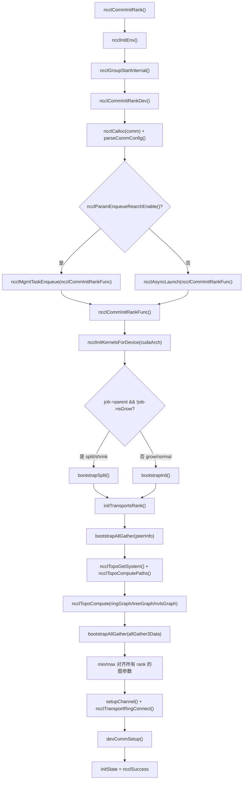
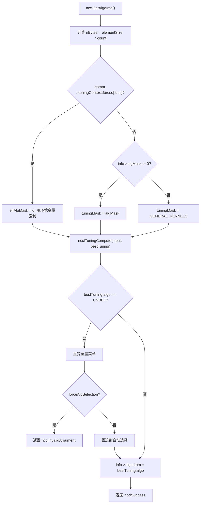
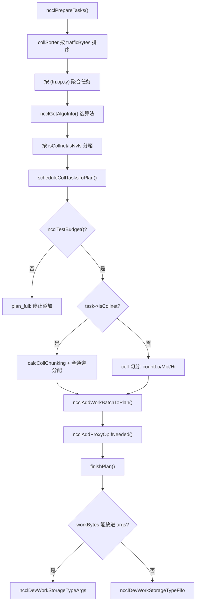

# Capítulo 25: Revisión panorámica y reflexiones: el viaje definitivo de un AllReduce y la esencia de su diseño

En el capítulo anterior, basándonos en las huellas de evolución en el código fuente, vislumbramos la tendencia arquitectónica de NCCL de pasar de operaciones colectivas fijas a programables, de host proxy a envío directo desde GPU, y de búferes registrados a memoria simétrica. Ahora es el momento de poner estas tendencias a prueba en un flujo de ejecución concreto. Este capítulo no introduce ningún código nuevo, sino que reencadena el flujo extremo a extremo desde el capítulo 3 hasta el capítulo 10 — comenzando desde la línea de llamada ncclAllReduce, hasta la escritura del resultado en la memoria de video. Después de leerlo, deberías poder responder con claridad: ¿por qué funciones pasa exactamente un AllReduce? ¿En qué archivo y en qué línea está cada función? ¿Qué capítulo consultar cuando encuentres un problema?

# I. Inicialización: cómo «crece» el dominio de comunicación

## Modelo intuitivo

Imagina el dominio de comunicación como un «chat grupal». Cuando llamas a`ncclCommInitRank`es como «solicitar unirse al chat grupal»; NCCL debe determinar en ese momento la lista de miembros del grupo (peerInfo), quién se conecta con quién y por qué línea (grafo de topología), y cuántas líneas de pipeline abre cada conexión (channel).**Si este paso está mal, toda la comunicación posterior estará mal**— como cuando alguien no es incluido en el chat grupal: tus mensajes siempre serán recibidos por uno menos.

## Estructuras de datos y diseño de memoria

La estructura central del dominio de comunicación es`ncclComm`, y su inicialización se divide en dos fases:`commAlloc`se encarga de «asignar el esqueleto»,`initTransportsRank`se encarga de «rellenar la carne».

`commAlloc`Lo más notable dentro de**es el diseño de**conteo de referencias de recursos compartidos`ncclSharedResources`. Cuando un subdominio de comunicación (generado por split/shrink) reutiliza recursos del dominio padre, no se copia una instancia, sino que se comparte el mismo

[FACT:src/init.cc:533-555]

```cpp
if (parent == NULL || !parent->shareResources) {
    struct ncclSharedResources* sharedRes;
    NEW_NOTHROW(sharedRes, ncclSharedResources);
    sharedRes->owner = comm;
    ...
    comm->sharedRes = sharedRes;
    sharedRes->refCount = 1;
    NCCLCHECK(ncclNetInit(comm));
    NCCLCHECK(ncclRmaInit(comm));
    NCCLCHECK(ncclGinInit(comm));
} else {
    comm->sharedRes = parent->sharedRes;
    ncclAtomicRefCountIncrement(&parent->sharedRes->refCount);
    NCCLCHECK(ncclNetInitFromParent(comm, parent));
    NCCLCHECK(ncclRmaInitFromParent(comm, parent));
}
```

Copiar`refCount`La intención de este código es clara: los «recursos pesados» como el plugin de red, RMA y GIN se inicializan una sola vez, y los subdominios de comunicación simplemente los toman prestados.

se incrementa con operaciones atómicas para garantizar que no haya liberaciones duplicadas en entornos multihilo.`commAlloc`Otro punto clave es**la inicialización de los**canales`id = -1`dentro de`setupChannel`. Todos los canales se marcan primero como «no inicializados» (

[FACT:src/init.cc:607-608]

```cpp
// Mark channels as non initialized.
for (int c = 0; c channels[c].id = -1;
```

realmente rellena el contenido:`-1`Copiar`id == -1`Este

## es un valor centinela. Si cualquier código usa por error un canal no inicializado,

expondrá el problema de inmediato, en lugar de leer un montón de memoria aleatoria.`ncclCommInitRank`Paso a paso: de ncclCommInitRank a initTransportsRank

1. `ncclCommInitRank`Después de que el usuario llama a`ncclInitEnv`, el flujo de ejecución real es así:`ncclGroupStartInternal`primero llama a

para cargar el plugin de entorno, luego llama a`ncclCommInitRankDev`para entrar en la semántica de group (esto es para soportar «inicializar múltiples dominios de comunicación dentro de un mismo group»).`comm`2. A continuación llama a**, que realiza la validación de parámetros, asigna la estructura**：

[FACT:src/init.cc:2923-2929]

```cpp
if (ncclParamEnqueueRearchEnable()) {
    NCCLCHECKGOTO(ncclMgmtTaskEnqueue((struct ncclAsyncJob*)job, ncclCommInitRankFunc, ncclCommInitJobFree, comm), res, fail);
} else {
    NCCLCHECKGOTO(ncclAsyncLaunch((struct ncclAsyncJob*)job, ncclCommInitRankFunc, NULL, ncclCommInitJobFree, comm), res, fail);
}
```

delega el trabajo real de inicialización a un job asíncrono`ncclParamEnqueueRearchEnable()`Copiar`ncclAsyncLaunch`Nótese la rama`ncclMgmtTaskEnqueue`aquí — esta es la huella de la «refactorización de enqueue» que NCCL está llevando a cabo. Por defecto se usa`ncclCommInitRankFunc`。

3. `ncclCommInitRankFunc`, y al activar la refactorización se usa

[FACT:src/init.cc:2119-2127]

```cpp
timers[TIMER_INIT_TOTAL] = clockNano();
CUDACHECKGOTO(cudaSetDevice(cudaDev), res, fail);
CUDACHECKGOTO(cudaDeviceGetAttribute(&maxSharedMem, cudaDevAttrMaxSharedMemoryPerBlockOptin, cudaDev), res, fail);
CUDACHECKGOTO(cudaDeviceGetAttribute(&archMajor, cudaDevAttrComputeCapabilityMajor, cudaDev), res, fail);
CUDACHECKGOTO(cudaDeviceGetAttribute(&archMinor, cudaDevAttrComputeCapabilityMinor, cudaDev), res, fail);
cudaArch = 100 * archMajor + 10 * archMinor;

timers[TIMER_INIT_KERNELS] = clockNano();
NCCLCHECKGOTO(ncclInitKernelsForDevice(cudaArch, maxSharedMem, &maxLocalSizeBytes), res, fail);
```

`cudaArch = 100 * archMajor + 10 * archMinor`es la función principal de inicialización. Primero establece el dispositivo, consulta las propiedades de la GPU e inicializa el kernel:

4. Luego, dependiendo de si es una inicialización normal o split/shrink/grow, se sigue una ruta de bootstrap diferente:

[FACT:src/init.cc:2136-2191]

```cpp
if (job->parent && !job->isGrow) {
    // SPLIT/SHRINK: use bootstrapSplit
    ...
    NCCLCHECKGOTO(bootstrapSplit(comm->commHash, comm, job->parent, job->color, job->key, parentRanks), res, fail);
} else {
    // GROW or NORMAL INIT: use bootstrapInit
    ...
    NCCLCHECKGOTO(bootstrapInit(job->nId, (struct ncclBootstrapHandle*)job->commId, comm, job->parent), res, fail);
}
```

5. Finalmente se llama a`initTransportsRank`, que es la función más pesada de toda la inicialización (aproximadamente 800 líneas). Internamente realiza dos AllGather:

- **AllGather1**: intercambia`ncclPeerInfo`(la información del dispositivo de cada rank, host hash, pid hash, GPU UUID, etc.):

[FACT:src/init.cc:1236-1239]

```cpp
NCCLCHECKGOTO(ncclCalloc(&comm->peerInfo, nranks + 1), ret, fail); // Extra rank to represent CollNet root
NCCLCHECKGOTO(fillInfo(comm, comm->peerInfo + rank, comm->commHash), ret, fail);
NCCLCHECKGOTO(bootstrapAllGather(comm->bootstrap, comm->peerInfo, sizeof(struct ncclPeerInfo)), ret, fail);
COMPILER_ATOMIC_STORE(&comm->peerInfoValid, true, std::memory_order_release);
```

Nota sobre`nranks + 1`esta asignación — la posición extra es para el CollNet root.`peerInfoValid`Se almacena con semántica release, garantizando que cuando otros hilos vean este flag, el contenido de peerInfo ya sea visible.

- **AllGather3**: intercambia los resultados del cálculo de topología (la estructura ring/tree calculada por cada rank, ancho de banda, número de canales, etc.), y luego toma de todos los ranks el**valor mínimo**para alinear:

[FACT:src/init.cc:1687-1703]

```cpp
for (int i = 0; i nChannels = std::min(allGather3Data[i].graphInfo[a].nChannels, graphs[a]->nChannels);
        graphs[a]->sameChannels = std::min(allGather3Data[i].graphInfo[a].sameChannels, graphs[a]->sameChannels);
        graphs[a]->bwIntra = std::min(allGather3Data[i].graphInfo[a].bwIntra, graphs[a]->bwIntra);
        graphs[a]->bwInter = std::min(allGather3Data[i].graphInfo[a].bwInter, graphs[a]->bwInter);
        graphs[a]->typeIntra = std::max(allGather3Data[i].graphInfo[a].typeIntra, graphs[a]->typeIntra);
        graphs[a]->typeInter = std::max(allGather3Data[i].graphInfo[a].typeInter, graphs[a]->typeInter);
        graphs[a]->crossNic = std::max(allGather3Data[i].graphInfo[a].crossNic, graphs[a]->crossNic);
    }
    ...
}
```

El ancho de banda toma el mínimo, el tipo toma el máximo; esto es el "principio del barril": el rendimiento de todo el dominio de comunicación está determinado por el rank más lento. Si no se alinea, diferentes ranks podrían calcular selecciones de algoritmos distintas, provocando un deadlock en la comunicación.

## Diagrama de flujo de inicialización



## Reflexiones de diseño y trampas

**¿Por qué la inicialización debe ser asíncrona?**Porque la inicialización multi-rank requiere sincronización entre procesos (bootstrap); si se ejecutara de forma síncrona, bloquearía el hilo que hace la llamada. Al hacerla asíncrona, el usuario puede inicializar múltiples dominios de comunicación simultáneamente dentro de un group, avanzando en paralelo.

**Puntos problemáticos**：`initTransportsRank`Al final hay una barrera intra-nodo:

[FACT:src/init.cc:1968-1971]

```cpp
/* Local intra-node barrier */
NCCLCHECKGOTO(bootstrapIntraNodeBarrier(comm->bootstrap, comm->localRankToRank, comm->localRank, comm->localRanks, comm->localRankToRank[0]), ret, fail);
```

Esta barrera garantiza que todos los ranks de la misma máquina hayan completado la asignación de recursos antes de continuar. Si algún rank se queda atascado en`devCommSetup`(por ejemplo, por falta de memoria de GPU), los demás ranks esperarán aquí indefinidamente. En producción, ante un "hang de inicialización", lo primero que hay que revisar es si falló el`devCommSetup`de algún rank.

# II. Encolado de tareas: de la llamada a la API al objeto de tarea interno

## Modelo intuitivo

Cuando el usuario llama a`ncclAllReduce`es como pedir en un restaurante.`ncclEnqueueCheck`es el camarero, que traduce tu pedido al "ticket de trabajo" que la cocina entiende (`ncclTaskColl`), y lo coloca en`comm->planner`, este "pool de pedidos".**Sin esta capa, NCCL no podría fusionar múltiples llamadas en un solo lanzamiento de kernel**— cada pedido encendería el fuego por separado, con una eficiencia pésima.

## Estructuras de datos y diseño de memoria

El núcleo del encolado de tareas es`ncclKernelPlanner`, que cuelga de`comm->planner`. Los campos clave incluyen:

- `collSorter`: cola de tareas de comunicación colectiva ordenada por tamaño de tráfico
- `collTaskQueue`: cola de tareas finalmente ordenada
- `peers[]`: cola de send/recv por cada peer (para P2P)
- `wipPlan`: el kernel plan que se está construyendo

Los campos clave del objeto de tarea`ncclTaskColl`se rellenan en`collTaskAppend`:

[FACT:src/enqueue/enqueue.cc:2800-2847]

```cpp
struct ncclTaskColl* t = ncclMemoryPoolAlloc(&comm->memPool_ncclTaskColl, &comm->memPermanent);
t->func = info->coll;
t->sendbuff = info->sendbuff;
t->recvbuff = info->recvbuff;
t->count = info->count;
t->root = info->root;
t->datatype = info->datatype;
size_t elementSize = ncclTypeSize(t->datatype);
if (t->func == ncclFuncAllGather || t->func == ncclFuncBroadcast) {
    t->count *= elementSize;
    t->datatype = ncclInt8;
    elementSize = 1;
}
t->trafficBytes = t->count * elementSize * ncclFuncTrafficPerByte(t->func, comm->nRanks);
...
t->aggIsolate = ncclCollConfigNeedAggIsolate(&info->collConfig) || info->collConfig.CTAPolicy != comm->config.CTAPolicy;
NCCL_CONFIG_SET(t, minCTAs, ncclParamMinCTAs(), info->collConfig.minCTAs, comm->config.minCTAs, 1, MAXCHANNELS);
NCCL_CONFIG_SET(t, maxCTAs, ncclParamMaxCTAs(), (std::min(info->collConfig.maxCTAs, comm->config.maxCTAs)), comm->config.maxCTAs, 1, MAXCHANNELS);
...
planner->nTasksColl += 1;
ncclTaskCollSorterInsert(&planner->collSorter, t, t->trafficBytes);
```

Nota sobre varios detalles:

1. **Tratamiento especial de AllGather/Broadcast**: se multiplica count por el tamaño del elemento y se cambia el datatype a`ncclInt8`. Esto se debe a que la semántica de estas dos operaciones es "transportar bytes", sin importar el tipo original.

2. **`trafficBytes`Cálculo de**：`ncclFuncTrafficPerByte`devuelve cuántas veces debe transmitirse cada byte. AllReduce devuelve 2 (reduce + broadcast), AllGather devuelve nRanks:

[FACT:src/enqueue/enqueue.cc:123-134]

```cpp
static inline int ncclFuncTrafficPerByte(ncclFunc_t func, int nRanks) {
  switch (func) {
  case ncclFuncAllReduce:
    return 2;
  case ncclFuncAllGather:
    return nRanks;
  case ncclFuncReduceScatter:
    return nRanks;
  default:
    return 1;
  }
}
```

3. **`NCCL_CONFIG_SET`Macro**: esta es la resolución de configuración de tres niveles "env > per-call > comm". La variable de entorno tiene la máxima prioridad, seguida del config de la llamada individual, y por último el valor por defecto a nivel de dominio de comunicación.

## Paso a paso: la ruta de encolado de ncclAllReduce

1. `ncclEnqueueCheck`Primero se hace la validación del dominio de comunicación y la entrada al group:

[FACT:src/enqueue/enqueue.cc:3478-3495]

```cpp
ncclResult_t ncclEnqueueCheck(struct ncclInfo* info) {
  ncclResult_t ret = CommCheck(info->comm, info->opName, "comm");
  if (ret != ncclSuccess) return ncclGroupErrCheck(ret);
  if (info->comm->revokedFlag) {
    WARN("%s: communicator was revoked", info->opName);
    return ncclGroupErrCheck(ncclInvalidUsage);
  }
  ...
  NCCLCHECK(ncclGroupStartInternal());
  ret = ncclSuccess;
  int devOld = -1;
  NCCLCHECKGOTO(ncclCommEnsureReady(info->comm), ret, fail);
```

2. Luego se llama a`taskAppend`, que despacha según el tipo de operación:

[FACT:src/enqueue/enqueue.cc:3337-3348]

```cpp
static ncclResult_t taskAppend(struct ncclComm* comm, struct ncclInfo* info) {
  ncclFunc_t collAPI = info->coll;
  bool hasLaunchCompletionEvent = ncclInfoHasLaunchCompletionEvent(info);

  if (ncclParamEnqueueRearchEnable()) {
    NCCLCHECK(rawTaskAppend(comm, info));
  } else if (info->coll == ncclFuncSend || info->coll == ncclFuncRecv) {
    NCCLCHECK(p2pTaskAppend(comm, info, info->coll, collAPI, (void*)info->recvbuff, info->count, info->datatype, info->root, true));
  } else if (info->coll == ncclFuncPutSignal || info->coll == ncclFuncSignal || info->coll == ncclFuncWaitSignal) {
    NCCLCHECK(rmaTaskAppend(comm, info));
  } else {
    ...
  }
}
```

Para AllReduce, se toma la última rama`else`, y finalmente se llama a`collTaskAppend`。

3. `collTaskAppend`para insertar la tarea en`collSorter`, ordenando por`trafficBytes`. El propósito del ordenamiento es que el planificador priorice las tareas grandes, evitando que las tareas pequeñas fragmenten los recursos de canales.

## Flujo de datos del encolado de tareas

```mermaid
flowchart LR
    api["ncclAllReduce()"] --> info["ncclInfo 填充"]
    info --> enq["ncclEnqueueCheck()"]
    enq --> check["CommCheck + ncclCommEnsureReady()"]
    check --> append["taskAppend()"]
    append --> coll["collTaskAppend()"]
    coll --> task["ncclTaskColl 分配"]
    task --> sorter["ncclTaskCollSorterInsert(collSorter)"]
    sorter --> prepare["ncclPrepareTasks()"]
    prepare --> algo["ncclGetAlgoInfo() 选算法"]
    algo --> schedule["scheduleCollTasksToPlan()"]
    schedule --> plan["ncclKernelPlan"]
```



## Reflexiones de diseño y trampas

**¿Por qué usar`ncclMemoryPoolAlloc`en lugar de`malloc`？**Porque los objetos de tarea tienen un ciclo de vida corto y se asignan con frecuencia. El pool de memoria evita el coste de syscall de`malloc/free`cada vez. Nota que el segundo parámetro de`ncclMemoryPoolAlloc`es`&comm->memPermanent`— esto significa que los objetos de tarea se liberan de forma unificada al destruirse el dominio de comunicación, en lugar de liberarse individualmente por tarea.

**Puntos problemáticos**：`ncclPrepareTasks`Dentro de

[FACT:src/enqueue/enqueue.cc:506-512]

```cpp
// We aggregate operations that are within 4X size of each other.
while (aggEnd != nullptr && aggEnd->trafficBytes trafficBytes && !aggBeg->aggIsolate && !aggEnd->aggIsolate) {
    agg.count += aggEnd->count;
    agg.trafficBytes += aggEnd->trafficBytes;
    aggEnd = aggEnd->next;
}
```

Copiar`aggIsolate`Esta agregación sirve para que la selección de algoritmo sea más estable — si cada tarea pequeña eligiera su algoritmo por separado, podría resultar en un montón de algoritmos distintos, causando fragmentación del kernel. Pero el flag

# impide la agregación, y se usa para aquellas tareas que "deben programarse por separado" (por ejemplo, las que llevan per-call config).

## III. Selección de algoritmo: cómo el modelo de coste elige la solución óptima

Modelo intuitivo**La selección de algoritmo es como cuando un navegador elige la ruta. El "modelo de coste" de NCCL (módulo tuning) estima el tiempo de cada combinación de algoritmo/protocolo para un tamaño de mensaje y topología dados, y elige la más rápida.**。

## Sin el modelo de coste, NCCL solo podría tener un conjunto fijo de algoritmos, desperdiciando ancho de banda en mensajes pequeños y latencia en mensajes grandes.

Estructuras de datos y diseño de memoria`ncclGetAlgoInfo`：

[FACT:src/enqueue/enqueue.cc:2159-2185]

```cpp
ncclResult_t ncclGetAlgoInfo(struct ncclComm* comm, struct ncclTaskColl* info, int collNetSupport, int nvlsSupport,
                             int numPipeOps, ncclSimInfo_t* simInfo) {
  size_t elementSize = ncclTypeSize(info->datatype);
  size_t nBytes = elementSize * ncclFuncMaxSendRecvCount(info->func, comm->nRanks, info->count);
  info->algorithm = NCCL_ALGO_UNDEF;
  info->protocol = NCCL_PROTO_UNDEF;
  struct ncclTuningInput_t input;
  input.comm = comm;
  input.tuningMask = NCCL_TUNING_MASK_GENERAL_KERNELS;
  uint64_t effAlgMask = comm->tuningContext.forced[info->func] ? 0 : info->algMask;
  if (effAlgMask != 0) {
    input.tuningMask = effAlgMask & NCCL_TUNING_MASK_GENERAL_KERNELS;
  }
  input.CTAPolicy = info->CTAPolicy;
  input.func = info->func;
  input.redOp = info->opHost;
  input.devRedOp = info->opDev.op;
  input.datatype = info->datatype;
  input.nBytes = nBytes;
  input.numPipeOps = numPipeOps;
  input.collNetSupport = collNetSupport;
  input.nvlsSupport = nvlsSupport;
  input.count = info->count;
  NCCLCHECK(ncclGetRegBuff(comm, info, &input.regBuff));
  ...
}
```

Copiar`effAlgMask`Nota sobre la lógica de`comm->tuningContext.forced[info->func]`: si la variable de entorno fuerza un algoritmo (`algMask`distinto de cero), se ignora el

del usuario y se usa el de la variable de entorno. Esto refleja la prioridad "env > per-call".`ncclTuningCompute`Luego se llama a

[FACT:src/enqueue/enqueue.cc:2213-2224]

```cpp
} else {
    NCCLCHECK(ncclTuningCompute(&input, &bestTuning));
}
INFO(NCCL_TUNING, "Best tuning, algorithm, %s, protocol, %s", ncclAlgoToString(bestTuning.algo), ncclProtoToString(bestTuning.proto));
info->algorithm = bestTuning.algo;
info->protocol = bestTuning.proto;
info->nWarps = bestTuning.nWarps;
if (simInfo) simInfo->estimatedTime = bestTuning.timeUs;
TRACE(NCCL_COLL, "%ld Bytes -> Algo %d proto %d time %f", nBytes, info->algorithm, info->protocol, bestTuning.timeUs);
info->nMaxChannels = bestTuning.maxChannels == 0 ? info->nMaxChannels : bestTuning.maxChannels;
```

## Step-by-Step: Selección de algoritmo para un AllReduce

Supongamos 8 GPUs en un solo nodo, tamaño de mensaje 1MB, AllReduce:

1. `nBytes = 1MB`，`numPipeOps`es el número de tareas ya existentes en el plan actual.

2. `collNetSupport`y`nvlsSupport`están determinados por`ncclGetCollNetSupport`y`ncclNvlsTransportEnabled`.

3. `ncclTuningCompute`Recorre todas las combinaciones disponibles de (algo, proto) y estima el tiempo con el modelo de coste.

4. Para un escenario de 1MB en un solo nodo, normalmente NVLS o Tree+LL128 ganarán.

5. El resultado se escribe de vuelta en`info->algorithm`、`info->protocol`、`info->nWarps`。

## Diagrama de decisión de selección de algoritmo



## Reflexiones de diseño y trampas

**¿Por qué la selección de algoritmo debe estar "alineada entre ranks"?**Porque si distintos ranks eligen algoritmos diferentes, los patrones de comunicación no coinciden y se producirá un deadlock. Por eso`initTransportsRank`usa min/max para alinear todos los parámetros del grafo, garantizando que la entrada del modelo de coste sea idéntica en cada rank.

**Puntos problemáticos**：`ncclGetAlgoInfo`Hay una lógica de "recálculo" — si el usuario especificó`algMask`pero ningún algoritmo coincide, primero se recalcula silenciosamente el menú completo y luego se decide si es un error duro o un fallback suave:

[FACT:src/enqueue/enqueue.cc:2192-2208]

```cpp
NOWARN(ncclTuningCompute(&input, &bestTuning), NCCL_TUNING);
if (bestTuning.algo == NCCL_ALGO_UNDEF) {
    input.tuningMask = NCCL_TUNING_MASK_GENERAL_KERNELS;
    bestTuning = NCCL_TUNING_RESULT_INIT;
    bestTuning.maxChannels = 0;
    NCCLCHECK(ncclTuningCompute(&input, &bestTuning));
    if (info->forceAlgSelection) {
        WARN("algSelection: no algorithm in the selected set is available for %s", ncclFuncToString(info->func));
        return ncclInvalidArgument;
    }
    INFO(NCCL_TUNING, "algSelection: selected set unavailable for %s; falling back to automatic selection", ncclFuncToString(info->func));
}
```

`NOWARN`La macro suprime temporalmente las advertencias, porque "ningún algoritmo coincide" puede ser una situación normal (el conjunto elegido por el usuario efectivamente no está disponible). Solo se reporta error cuando`forceAlgSelection`es verdadero.

# IV. Programación de tareas y construcción del kernel plan

## Modelo intuitivo

La programación de tareas es como asignar un montón de pedidos a varias líneas de producción.`scheduleCollTasksToPlan`determina cuántos canales usa cada tarea y cuántos datos procesa cada canal, generando finalmente un`ncclKernelPlan`—esta es la "orden de trabajo" que se pasa a la GPU.

## Estructuras de datos y diseño de memoria

`ncclKernelPlan`Campos clave de

- `channelMask`: qué canales usa este plan (bitmap)
- `workBytes`: bytes totales de todas las estructuras work
- `nWorkBatches`: número de work batches
- `kernelArgs`: parámetros de lanzamiento del kernel
- `workStorageType`: dónde se almacenan los datos de work (args/fifo/persistent)

`finishPlan`determina la ubicación de almacenamiento de los datos de work:

[FACT:src/enqueue/enqueue.cc:244-255]

```cpp
// If we can fit everything into the kernel args we do so.
if (sizeof(ncclDevKernelArgs) + batchBytes + workBytes workArgsBytes) {
    plan->workStorageType = ncclDevWorkStorageTypeArgs;
}
plan->kernelArgsSize = sizeof(struct ncclDevKernelArgs) + batchBytes;
plan->kernelArgsSize += (plan->workStorageType == ncclDevWorkStorageTypeArgs) ? workBytes : 0;
plan->kernelArgsSize = alignUp(plan->kernelArgsSize, 16);
plan->kernelArgs = (struct ncclDevKernelArgs*)ncclMemoryStackAlloc(&comm->memScoped, plan->kernelArgsSize, /*align=*/16);
plan->kernelArgs->comm = comm->devComm;
plan->kernelArgs->channelMask = plan->channelMask;
plan->kernelArgs->workStorageType = plan->workStorageType;
```

Compromisos entre los tres tipos de almacenamiento:

- **Args**: el más rápido, pero el tamaño de los parámetros del kernel es limitado (normalmente 4KB)
- **Fifo**: buffer circular, adecuado para tamaños medianos
- **Persistent**: asignación de memoria de dispositivo independiente, adecuada para escenarios con CUDA Graph

## Step-by-Step: asignación de canales en scheduleCollTasksToPlan

1. Primero estima cuántas tareas caben en este plan:

[FACT:src/enqueue/enqueue.cc:654-687]

```cpp
do {
    size_t workBytes = 0;
    struct ncclTaskColl* task = ncclIntruQueueHead(&planner->collTaskQueue);
    struct ncclWorkList* workNode = ncclIntruQueueHead(&planner->collWorkQueue);
    while (task != nullptr) {
        int nBatches = divUp(nPlanColls, 4); // Rough guess: 4 colls per batch.
        if (!ncclTestBudget(budget, nBatches, workBytes + workNode->size)) goto plan_full;
        bool taskAggIsolate = task->aggIsolate;
        if (taskAggIsolate && nPlanColls > 0) goto plan_full;
        nPlanColls += 1;
        workBytes += workNode->size;
        int kind = 2 * task->isCollnet + task->isNvls;
        trafficBytes[kind] += std::max(MinTrafficPerChannel, task->trafficBytes);
        ...
    }
plan_full:;
} while (0);
```

2. Luego asigna canales a las tareas según el tráfico. Para tareas que no son CollNet, se divide en unidades de "cell":

[FACT:src/enqueue/enqueue.cc:742-759]

```cpp
int trafficPerByte = ncclFuncTrafficPerByte(task->func, comm->nRanks);
if (task->protocol == NCCL_PROTO_LL) trafficPerByte *= 4;
size_t cellSize = divUp(divUp(MinTrafficPerChannel, (size_t)trafficPerByte), 16) * 16;
int elementsPerCell = cellSize / elementSize;
size_t cells = divUp(task->count * elementSize, cellSize);
size_t trafficPerElement = elementSize * trafficPerByte;
size_t trafficPerCell = cellSize * trafficPerByte;
size_t cellsPerChannel = std::min(cells, divUp(trafficPerChannel, trafficPerCell));
size_t cellsLo;
if (channelId + 1 == nMaxChannels[kind]) {
    cellsLo = cells;
} else {
    cellsLo = std::min(cells, divUp((trafficPerChannel - currentTraffic), trafficPerCell));
}
int nMidChannels = (cells - cellsLo) / cellsPerChannel;
size_t cellsHi = (cells - cellsLo) % cellsPerChannel;
int nChannels = (cellsLo != 0 ? 1 : 0) + nMidChannels + (cellsHi != 0 ? 1 : 0);
```

Este código divide los datos en tres segmentos "bajo/medio/alto":`countLo`、`countMid`、`countHi`. Los segmentos bajo y alto son canales de borde, y el segmento medio son canales intermedios. Esta división busca que la cantidad de datos procesada por cada canal sea lo más uniforme posible.

3. Finalmente se llama a`calcCollChunking`para calcular el tamaño de chunk de cada canal:

[FACT:src/enqueue/enqueue.cc:2228-2275]

```cpp
static ncclResult_t calcCollChunking(struct ncclComm* comm, struct ncclTaskColl* info, int nChannels, size_t nBytes,
                                     uint32_t* outChunkSize, uint32_t* outDirectFlags, struct ncclProxyOp* proxyOp) {
  ncclPattern_t pattern;
  size_t grainSize = ncclProtoGrainSize(info->protocol);
  switch (info->func) {
  case ncclFuncAllReduce:
    pattern = info->algorithm == NCCL_ALGO_NVLS           ? ncclPatternNvls :
              info->algorithm == NCCL_ALGO_NVLS_TREE      ? ncclPatternNvlsTree :
              info->algorithm == NCCL_ALGO_COLLNET_DIRECT ? ncclPatternCollnetDirect :
              info->algorithm == NCCL_ALGO_COLLNET_CHAIN  ? ncclPatternCollnetChain :
              info->algorithm == NCCL_ALGO_TREE           ? ncclPatternTreeUpDown :
                                                            ncclPatternRingTwice;
    break;
  ...
  }
  int stepSize = comm->buffSizes[info->protocol] / NCCL_STEPS;
  int chunkSteps = (info->protocol == NCCL_PROTO_SIMPLE && info->algorithm == NCCL_ALGO_RING) ? info->chunkSteps : 1;
  int sliceSteps = (info->protocol == NCCL_PROTO_SIMPLE && info->algorithm == NCCL_ALGO_RING) ? info->sliceSteps : 1;
  int chunkSize = stepSize * chunkSteps;
  if (info->protocol == NCCL_PROTO_LL) chunkSize /= 2;
  if (info->protocol == NCCL_PROTO_LL128) chunkSize = (chunkSize / NCCL_LL128_LINEELEMS) * NCCL_LL128_DATAELEMS;
  ...
}
```

## Diagrama de flujo de programación



## Reflexiones de diseño y trampas

**¿Por qué las tareas CollNet se manejan por separado?**Porque CollNet usa los switches de red para hacer la reducción, y la lógica de asignación de canales es completamente distinta a la de ring/tree normales. Las tareas CollNet ocupan directamente todos los canales disponibles, mientras que las tareas normales necesitan dividirse según el tráfico.

**Puntos problemáticos**：`ncclTestBudget`La estimación de`nBatches = divUp(nPlanColls, 4)`usa una fórmula aproximada —asume que cada 4 operaciones colectivas producen un batch. Esta estimación puede ser imprecisa, por lo que después hay una verificación exacta:

[FACT:src/enqueue/enqueue.cc:711-714]

```cpp
// Ensure room for worst case of one new batch per channel
if (!ncclTestBudget(budget, plan->nWorkBatches + nChannels, plan->workBytes + workNode->size)) {
    return ncclSuccess;
}
```

Si la verificación exacta falla, se retorna directamente (sin error), dejando que la capa superior abra un nuevo plan.

# V. Lanzamiento del kernel y ejecución en el lado del dispositivo

## Modelo intuitivo

El lanzamiento del kernel es como entregar la orden de trabajo a la fábrica.`ncclLaunchKernel`traduce`ncclKernelPlan`a parámetros de lanzamiento de kernel CUDA, y luego llama a`cuLaunchKernelEx`. El kernel del lado del dispositivo, al recibir la orden de trabajo, ejecuta el movimiento de datos según el algoritmo.

## Estructuras de datos y diseño de memoria

`ncclLaunchKernel`Pasos clave de

[FACT:src/enqueue/enqueue.cc:1886-1909]

```cpp
ncclResult_t ncclLaunchKernel(struct ncclComm* comm, struct ncclKernelPlan* plan) {
  ncclResult_t ret = ncclSuccess;
  struct ncclKernelPlanner* planner = &comm->planner;
  int nChannels = countOneBits(plan->channelMask);
  void* sym = plan->kernelFn;
  dim3 grid = {(unsigned)nChannels, 1, 1};
  dim3 block = {(unsigned)plan->threadPerBlock, 1, 1};
  int smem = plan->isSymColl ? plan->kernelDynSmem : ncclShmemDynamicSize(comm->cudaArch);
  cudaStream_t launchStream = planner->streams->stream;
  ...
  void* extra[] = {CU_LAUNCH_PARAM_BUFFER_POINTER, plan->kernelArgs, CU_LAUNCH_PARAM_BUFFER_SIZE, &plan->kernelArgsSize, CU_LAUNCH_PARAM_END};
  ...
  CUfunction fn;
  CUDACHECKGOTO(cudaGetFuncBySymbol(&fn, sym), ret, do_return);
```

Nótese`grid.x = nChannels`—un block por canal.`block.x = plan->threadPerBlock`—el número de hilos por block lo determina la tarea.

## Step-by-Step: del plan al lanzamiento del kernel

1. Primero se llama a`uploadWork`para escribir los datos de work en la ubicación destino (args/fifo/persistent):

[FACT:src/enqueue/enqueue.cc:1365-1407]

```cpp
static ncclResult_t uploadWork(struct ncclComm* comm, struct ncclKernelPlan* plan) {
  if (plan->isSymColl || plan->isCeColl || plan->isRma) return ncclSuccess;
  size_t workBytes = plan->workBytes;
  size_t batchBytes = plan->nWorkBatches * sizeof(struct ncclDevWorkBatch);
  void* fifoBufHost;
  uint32_t fifoCursor, fifoMask;
  switch (plan->workStorageType) {
  case ncclDevWorkStorageTypeArgs:
    plan->kernelArgs->workBuf = nullptr;
    fifoBufHost = (void*)plan->kernelArgs;
    fifoCursor = sizeof(ncclDevKernelArgs) + batchBytes;
    fifoMask = ~0u;
    break;
  case ncclDevWorkStorageTypeFifo:
    fifoBufHost = comm->workFifoBuf;
    fifoCursor = comm->workFifoProduced;
    fifoMask = comm->workFifoBytes - 1;
    NCCLCHECK(waitWorkFifoAvailable(comm, fifoCursor + workBytes));
    plan->kernelArgs->workBuf = comm->workFifoBufDev;
    break;
  ...
  }
}
```

2. Luego se construyen los atributos de lanzamiento de CUDA. Para sm90+, se configura la dimensión de cluster:

[FACT:src/enqueue/enqueue.cc:1929-1936]

```cpp
if (clusterSize) {
    // Grid dimension must be divisible by clusterSize
    if (grid.x % clusterSize) clusterSize = 1;
    launchAttrs[attrs].id = CU_LAUNCH_ATTRIBUTE_CLUSTER_DIMENSION;
    launchAttrs[attrs++].value.clusterDim = {clusterSize, 1, 1};
    launchAttrs[attrs].id = CU_LAUNCH_ATTRIBUTE_CLUSTER_SCHEDULING_POLICY_PREFERENCE;
    launchAttrs[attrs++].value.clusterSchedulingPolicyPreference = CU_CLUSTER_SCHEDULING_POLICY_SPREAD;
}
```

3. Finalmente se llama a`cuLaunchKernelEx`：

[FACT:src/enqueue/enqueue.cc:1992]

```cpp
CUCHECKGOTO(cuLaunchKernelEx(&launchConfig, fn, nullptr, extra), ret, do_return);
```

## Lado del dispositivo: ejecución de runRing

El kernel del lado del dispositivo, al recibir la orden de trabajo, llama a la especialización correspondiente de`RunWorkColl`según el algoritmo. Tomando Ring AllReduce como ejemplo:

[FACT:src/device/all_reduce.h:14-83]

```cpp
template 
__device__ __forceinline__ void runRing(int tid, int nthreads, struct ncclDevWorkColl* work) {
  ncclRing* ring = &ncclShmem.channel.ring;
  int ringIx = ring->index;
  const int nranks = ncclShmem.comm.nRanks;
  ssize_t gridOffset;
  ssize_t channelCount;
  ssize_t chunkCount;
  ncclCollCbdPart(work, ncclShmem.channelId, Proto::Id, sizeof(T), (ssize_t*)nullptr, &gridOffset, &channelCount, &chunkCount);
  const ssize_t loopCount = nranks * chunkCount;
  ...
  Primitives, 1, Proto, 0> prims(tid, nthreads, &ring->prev, &ring->next, work->sendbuff, work->recvbuff, work->redOpArg, 0, 0, 0, work);

  for (ssize_t elemOffset = 0; elemOffset  int { return r - (r >= nranks ? nranks : 0); };

    // step 0: push data to next GPU
    chunk = modRanks(ringIx + nranks - 1);
    chunkOffset = chunk * chunkCount;
    offset = gridOffset + elemOffset + chunkOffset;
    nelem = (int)min(chunkCount, remCount - chunkOffset);
    prims.directSend(offset, offset, nelem);

    // k-2 steps: reduce and copy to next GPU
    for (int j = 2; j >Plan: ncclLaunchPrepare()
    Plan->>Plan: scheduleCollTasksToPlan()
    Plan->>Plan: finishPlan() 分配 kernelArgs
    Host->>Plan: ncclLaunchKernelBefore_NoUncapturedCuda()
    Plan->>Plan: uploadWork() 写 work 数据
    Host->>CUDA: cuLaunchKernelEx(fn, grid, block, smem)
    CUDA->>Kernel: 启动 nChannels 个 block
    Kernel->>Kernel: runRing() 执行 Ring AllReduce
    Host->>Plan: ncclLaunchKernelAfter_NoCuda()
    Plan->>Proxy: hostStreamPlanTask() + uploadProxyOps()
    Proxy->>Proxy: ncclProxyStart() 推进网络 I/O
    Kernel-->>Host: kernel 完成
    Host->>Plan: ncclLaunchFinish()
    Plan->>Plan: reclaimPlan() 释放资源
```

## Reflexiones de diseño y trampas

**¿Por qué usar`cuLaunchKernelEx`en lugar de`cudaLaunchKernel`？**Porque es necesario configurar atributos de lanzamiento (dimensión de cluster, mem sync domain, launch completion event). Estos atributos solo son compatibles desde CUDA 12.0+.

**Puntos problemáticos**：`uploadWork`El manejo del modo persistent aquí es muy complejo: requiere asignar memoria de dispositivo, copiar datos, registrar eventos y además funcionar correctamente en modo de captura de CUDA Graph:

[FACT:src/enqueue/enqueue.cc:1445-1478]

```cpp
CUDACHECKGOTO(cudaThreadExchangeStreamCaptureMode(&mode), result, fail);
NCCLCHECKGOTO(ncclStrongStreamAcquire(ncclCudaGraphNone(comm->config.graphUsageMode), &comm->sharedRes->deviceStream, /*concurrent=*/false, &deviceStream), result, fail);
if (comm->memPool) {
    CUDACHECKGOTO(cudaMallocAsync(&fifoBufDev, workBytes, comm->memPool, deviceStream), result, fail);
} else {
    CUDACHECKGOTO(cudaMalloc(&fifoBufDev, workBytes), result, fail);
}
plan->workBufPersistent = fifoBufDev;
plan->kernelArgs->workBuf = fifoBufDev;
CUDACHECKGOTO(cudaMemcpyAsync(fifoBufDev, fifoBufHost, workBytes, cudaMemcpyDefault, deviceStream), result, fail);
cudaEvent_t memcpyDone;
CUDACHECKGOTO(cudaEventCreateWithFlags(&memcpyDone, cudaEventDisableTiming), result, fail);
CUDACHECKGOTO(cudaEventRecord(memcpyDone, deviceStream), result, fail);
```

`cudaThreadExchangeStreamCaptureMode`es para cambiar temporalmente a modo relaxed durante la captura, permitiendo asignar memoria de dispositivo. Una vez completada la copia, se registra el evento y posteriormente se recupera mediante`ncclCommPollEventCallbacks`.

# Seis, guía para evitar trampas en producción

## Trampa 1: la inicialización se queda colgada

**Síntoma**：`ncclCommInitRank`se queda atascado sin retornar.

**Diagnóstico**: revisar los`NCCL_DEBUG=INFO`logs, encontrar el último rank que imprimió. Si todos los ranks imprimieron "Init START" pero no "Init COMPLETE", significa que está atascado en`initTransportsRank`.

**Causas comunes**：

- fallo de`devCommSetup`en algún rank (memoria de dispositivo insuficiente, error de CUDA)
- red de bootstrap inaccesible (firewall, puerto ocupado)
- versiones de NCCL inconsistentes entre distintos ranks

**Base en el código fuente**：`initTransportsRank`la barrera intra-nodo al final de

[FACT:src/init.cc:1968-1971]

```cpp
/* Local intra-node barrier */
NCCLCHECKGOTO(bootstrapIntraNodeBarrier(comm->bootstrap, comm->localRankToRank, comm->localRank, comm->localRanks, comm->localRankToRank[0]), ret, fail);
```

## Trampa 2: desbordamiento de la FIFO de work

**Síntoma**: el kernel se queda colgado tras su lanzamiento, o se reporta`ncclInternalError`。

**Causa**：`waitWorkFifoAvailable`está esperando espacio en la FIFO, pero el lado consumidor (el kernel) no avanza.

[FACT:src/enqueue/enqueue.cc:1333-1349]

```cpp
static ncclResult_t waitWorkFifoAvailable(struct ncclComm* comm, uint32_t desiredProduced) {
  bool hasRoom = (desiredProduced - comm->workFifoConsumed) workFifoBytes;
  if (!hasRoom) {
    while (true) {
      // Check abort flag to break deadlock when abort is signaled
      if (COMPILER_ATOMIC_LOAD(comm->abortFlag, std::memory_order_acquire)) {
        return ncclInternalError;
      }
      NCCLCHECK(ncclCommPollEventCallbacks(comm, /*waitSome=*/true));
      hasRoom = (desiredProduced - comm->workFifoConsumed) workFifoBytes;
      if (hasRoom) break;
      std::this_thread::yield();
    }
  }
  return ncclSuccess;
}
```

Atención a la comprobación del abort flag: este es el único canal de escape. Si tampoco se establece el abort, se producirá un bucle infinito.

**Cómo evitarlo**: aumentar`NCCL_WORK_FIFO_BYTES`, o reducir el número de operaciones en un solo group.

## Trampa 3: fallo en la captura de CUDA Graph

**Síntoma**: al llamar a NCCL durante la captura de CUDA Graph, se reporta "operation not permitted".

**Causa**: en modo de captura no se pueden realizar ciertas operaciones de CUDA (como`cudaMalloc`). NCCL usa`cudaThreadExchangeStreamCaptureMode`para cambiar temporalmente de modo, pero no todas las operaciones pueden eludirse.

**Base en el código fuente**：`uploadWork`la rama persistent de

[FACT:src/enqueue/enqueue.cc:1445]

```cpp
CUDACHECKGOTO(cudaThreadExchangeStreamCaptureMode(&mode), result, fail);
```

**Cómo evitarlo**: usar`NCCL_GRAPH_MIXING_SUPPORT=1`para habilitar el modo híbrido de graph, o preasignar el work buffer.

# Resumen de este capítulo

En este capítulo hemos recorrido de nuevo la cadena completa de un AllReduce:

1. **Inicialización**：`ncclCommInitRank` → `ncclCommInitRankFunc` → `initTransportsRank`, establecer el dominio de comunicación, buscar la topología, alinear los parámetros del grafo.

2. **Encolado de tareas**：`ncclEnqueueCheck` → `taskAppend` → `collTaskAppend`, traducir la llamada a la API en`ncclTaskColl`。

3. **Selección de algoritmo**：`ncclGetAlgoInfo` → `ncclTuningCompute`, usar el modelo de coste para elegir el óptimo (algo, proto).

4. **Planificación de tareas**：`ncclPrepareTasks` → `scheduleCollTasksToPlan` → `finishPlan`, asignar las tareas a los canales, generar`ncclKernelPlan`。

5. **Lanzamiento del kernel**：`ncclLaunchKernel` → `cuLaunchKernelEx`, traducir el plan a parámetros de lanzamiento de CUDA.

6. **Ejecución en el lado del dispositivo**：`runRing` / `runTreeUpDown` / `runNvls`, ejecutar la transferencia de datos según el algoritmo.

# Reflexión y autoevaluación de este capítulo

Q1: si se elimina la lógica de alineación min/max tras AllGather3 en`initTransportsRank`(L1690-L1698), ¿en qué escenarios provocaría un interbloqueo de comunicación? ¿Por qué?

**Análisis de referencia**: este fragmento de lógica garantiza que todos los ranks alcancen un consenso sobre parámetros como`nChannels`、`bwIntra`、`bwInter`de cada algoritmo. Si se elimina, cada rank calcularía el resultado usando su propia topología local. Consideremos un clúster heterogéneo: el rank 0 en una máquina de 8 GPUs con NVLink, el rank 8 en una máquina de 4 GPUs con PCIe. El rank 0 calcula que el ring tiene 8 canales, el rank 8 calcula 4. Cuando ejecutan Ring AllReduce, el rank 0 esperará a que el rank 8 envíe datos por 8 canales, pero el rank

Hasta aquí, hemos completado la revisión de la cadena completa de un AllReduce. Desde la inicialización, la búsqueda de topología, la selección de algoritmo, el encolado de tareas y el lanzamiento del kernel, hasta la ejecución en el lado del dispositivo y la transmisión por red, cada eslabón corresponde al análisis profundo de los capítulos anteriores. Este mapa de la cadena no solo es el esqueleto para entender NCCL, sino también un índice para diagnosticar problemas: si falla la inicialización, consultar los capítulos 3 y 4; si se elige mal el algoritmo, consultar el capítulo 5; si hay errores en el encolado de tareas, consultar los capítulos 6 y 7; si falla el lanzamiento del kernel, consultar el capítulo 8; si hay cuelgues en el lado del dispositivo, consultar los capítulos 9 y 10; si hay problemas de red, consultar los capítulos 12 y 13. A medida que NCCL evoluciona hacia la comunicación programable, el envío directo desde GPU y la memoria simétrica, esta cadena seguirá extendiéndose, y tú ya dominas el método para rastrearla.
