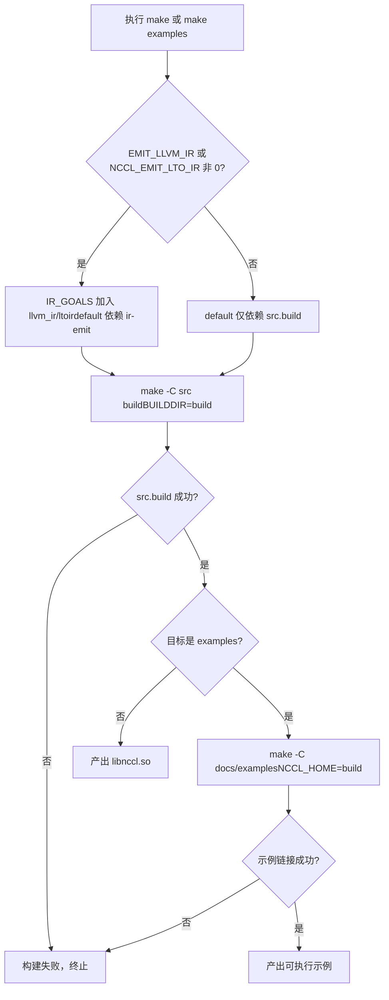
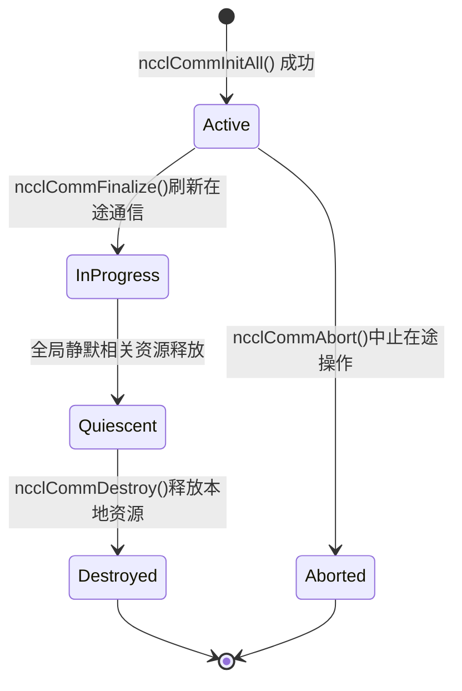

# Chapitre 1 : Exécution et phénomènes : observer le comportement externe à partir d'un AllReduce

Avant de plonger dans le moindre code du kernel, commençons par faire tourner NCCL et observer son comportement exposé vers l'extérieur. Ce chapitre ne lit pas le kernel, il ne fait qu'une chose : établir un référentiel vérifiable — toute analyse ultérieure des mécanismes internes devra finalement pouvoir expliquer le comportement externe observé ici.

# 1.1 Structure d'ingénierie de NCCL vue depuis le point d'entrée de build

## Modèle intuitif

Le système de build ressemble aux plans de construction d'un immeuble : il ne détermine pas qui y habite, mais il détermine quelles pièces existent et où donnent les portes. Si le point d'entrée de build est chaotique, vous ne pouvez même pas franchir le premier pas : « le faire tourner ». NCCL fournit à la fois un Makefile et un CMake comme deux points d'entrée de build ; comprendre leurs différences est la première étape pour comprendre l'organisation d'ingénierie de ce projet.

## Structure des deux points d'entrée de build

Le`Makefile`de niveau supérieur est une couche de dispatch très fine ; il ne compile lui-même aucun fichier source, mais transmet le travail aux Makefile de chaque sous-répertoire.

[FACT:Makefile:44-45]définit la règle de motif`src.%`, transmettant des cibles telles que`src.build`、`src.install`à`src/Makefile`：

```
src.%:
	${MAKE} -C src $* BUILDDIR=${ABSBUILDDIR}
```

[FACT:Makefile:47-48]définit la cible`examples`, qui dépend de`src.build`, puis entre dans le répertoire`docs/examples`pour construire les exemples :

```
examples: src.build
	${MAKE} -C docs/examples NCCL_HOME=${ABSBUILDDIR}
```

Notez la relation de dépendance ici : la construction des exemples dépend de l'achèvement préalable de`src.build`, car les exemples doivent se lier à la bibliothèque NCCL, et la variable d'environnement`NCCL_HOME`transmet le répertoire des artefacts de build au Makefile des exemples. C'est la contrainte d'ordre de build « d'abord la bibliothèque, ensuite les exemples ».

[FACT:Makefile:29]liste tous les ensembles de cibles nettoyables :

```
TARGETS := src pkg nccl4py ir
```

[FACT:Makefile:30]utilise la syntaxe de référence de substitution de GNU Make`${TARGETS:%=%.clean}`pour développer`src pkg nccl4py ir`en`src.clean pkg.clean nccl4py.clean ir.clean`, définissant ainsi tous les objectifs de nettoyage en une seule fois. C'est une technique courante dans les Makefile : « piloter les règles par les données » — pour ajouter un module, il suffit d'ajouter un mot dans`TARGETS`.

## Point d'entrée CMake : d'où vient le numéro de version

Le point d'entrée CMake est bien plus complexe que le Makefile, car il doit gérer le multi-plateforme, la détection de version CUDA, le choix d'architecture, etc. Nous ne nous intéressons ici qu'aux parties directement liées à « faire tourner » le projet.

[FACT:CMakeLists.txt:5-11]montre la provenance du numéro de version — il n'est pas codé en dur dans CMakeLists.txt, mais lu depuis`makefiles/version.mk`puis extrait par expression régulière :

```cmake
file(READ ${CMAKE_SOURCE_DIR}/makefiles/version.mk VERSION_CONTENT)
string(REGEX REPLACE ".*NCCL_MAJOR[ ]*:=[ ]*([0-9]+).*" "\\1" NCCL_MAJOR "${VERSION_CONTENT}")
...
math(EXPR NCCL_VERSION_CODE "(${NCCL_MAJOR} * 10000) + (${NCCL_MINOR} * 100) + ${NCCL_PATCH}")
```

> **[Design Inference & Architectural Trade-offs]**
> Centraliser le numéro de version dans`version.mk`permet aux deux systèmes de build, Makefile et CMake, de partager la même source de version, évitant ainsi le piège classique d'ingénierie de « versions incohérentes entre deux systèmes de build ».`NCCL_VERSION_CODE`La formule de calcul de`MAJOR*10000 + MINOR*100 + PATCH`reste cohérente avec la macro`NCCL_VERSION`du fichier d'en-tête.

[FACT:CMakeLists.txt:14-20]Ces numéros de version sont injectés dans tous les fichiers source C++ via`add_compile_definitions`:

```cmake
add_compile_definitions(
    NCCL_USE_CMAKE
    NCCL_MAJOR=${NCCL_MAJOR}
    NCCL_MINOR=${NCCL_MINOR}
    NCCL_PATCH=${NCCL_PATCH}
    NCCL_VERSION_CODE=${NCCL_VERSION_CODE}
)
```

[FACT:CMakeLists.txt:24-25]déclare les langages du projet comme CUDA, CXX et C :

```cmake
project(NCCL VERSION ${NCCL_MAJOR}.${NCCL_MINOR}.${NCCL_PATCH}
        LANGUAGES CUDA CXX C)
```

## Choix de l'architecture CUDA : pourquoi la valeur par défaut est si complexe

[FACT:CMakeLists.txt:140-171]est un long bloc de logique qui détermine`CMAKE_CUDA_ARCHITECTURES`en fonction de la version de CUDA. Prenons l'exemple de CUDA 12.8 et supérieur :

```cmake
elseif(${CUDA_MAJOR} EQUAL 12)
    if(${CUDA_MINOR} LESS 8)
        set(CMAKE_CUDA_ARCHITECTURES "50;60;61;70;80;90")
    else()
        set(CMAKE_CUDA_ARCHITECTURES "50;60;61;70;80;90;100;120")
    endif()
```

> **[Design Inference & Architectural Trade-offs]**
> La motivation de cette logique est la suivante : le PTX des nouvelles architectures (comme 100, 120) n'est reconnu que par les toolchains CUDA récentes ; si l'on force une nouvelle architecture avec un ancien CUDA, la compilation échoue directement. La liste d'architectures par défaut doit donc s'ajuster dynamiquement selon la version de CUDA. Pour le lecteur, cela signifie :**Si vous ne définissez pas explicitement`CMAKE_CUDA_ARCHITECTURES`, le binaire compilé contiendra un fatbin avec une longue liste d'architectures, ce qui allongera considérablement le temps de compilation**. En production, on spécifie généralement explicitement l'architecture cible pour accélérer la build.

## Diagramme de décision du processus de build

La figure ci-dessous montre le chemin de décision complet depuis l'exécution de`make`jusqu'à la production d'un exemple exécutable :



La branche clé de ce diagramme est de savoir si`IR_GOALS`est non vide — cela détermine si la build par défaut déclenche en plus la génération de LLVM IR. Pour les lecteurs qui veulent simplement « faire tourner » le projet, il suffit de garder`EMIT_LLVM_IR=0`pour emprunter le chemin le plus court.

# 1.2 Prérequis d'un programme minimal exécutable

## Modèle intuitif

Écrire un programme NCCL, c'est comme organiser une conférence téléphonique multipartite. Il faut d'abord vérifier : combien de personnes participent (nombre de devices), qui est chacun (rank), et quelle ligne utiliser pour parler (stream). S'il manque un seul de ces éléments, la conférence ne peut pas démarrer. Dans cette section, à travers l'exemple`01_communicators`, nous allons voir à quoi ressemblent ces trois prérequis dans le code.

## Structures de données : trois tableaux portent tout l'état

[FACT:docs/examples/01_communicators/01_multiple_devices_single_process/c/main.cc:88-92]définit les variables centrales de l'exemple :

```c
int num_gpus;                 // Number of available CUDA devices
ncclComm_t *comms = NULL;     // Array of NCCL communicators (one per GPU)
cudaStream_t *streams = NULL; // Array of CUDA streams (one per GPU)
int *devices = NULL;          // Array of device IDs to use
```

Cela illustre le cœur du modèle de programmation NCCL mono-processus multi-GPU :**un domaine de communication, un stream et un numéro de device par GPU**. Les trois tableaux ont pour longueur`num_gpus`, et l'indice`i`correspond au`i`-ième GPU.

`ncclComm_t`est défini dans le fichier d'en-tête comme un pointeur opaque.[FACT:src/nccl.h.in:36]en donne le type réel :

```c
typedef struct ncclComm* ncclComm_t;
```

> **[Design Inference & Architectural Trade-offs]**
> Le « pointeur opaque » (opaque pointer) est une technique classique du langage C pour réaliser l'encapsulation : le fichier d'en-tête n'expose que le type pointeur`struct ncclComm*`, le code utilisateur ne peut pas accéder aux champs internes de la structure, et toutes les opérations doivent passer par les fonctions de l'API. Ainsi, NCCL peut modifier librement la disposition interne de`ncclComm`sans casser l'ABI. Pour les lecteurs débutants, on peut le comprendre comme « vous recevez un handle boîte noire, que vous ne pouvez manipuler que via l'interface officielle ».

## Étape par étape : de la détection des devices à la création du domaine de communication

**Première étape : détecter le nombre de devices.** [FACT:docs/examples/01_communicators/01_multiple_devices_single_process/c/main.cc:96-104]appelle`cudaGetDeviceCount`et vérifie s'il vaut 0 :

```c
CUDACHECK(cudaGetDeviceCount(&num_gpus));

if (num_gpus == 0) {
    fprintf(stderr, "ERROR: No CUDA devices found on this system\n");
    ...
    return 1;
}
```

Ce que fait cette étape : demander au runtime CUDA « combien de GPU y a-t-il sur cette machine ». Si le retour est 0, cela signifie qu'aucun device n'est disponible et le programme se termine directement — c'est la condition de garde la plus en amont.

**Deuxième étape : allouer la mémoire hôte et remplir la liste des devices.** [FACT:docs/examples/01_communicators/01_multiple_devices_single_process/c/main.cc:114-121]alloue trois tableaux et vérifie que l'allocation a réussi :

```c
devices = (int *)malloc(num_gpus * sizeof(int));
comms = (ncclComm_t *)malloc(num_gpus * sizeof(ncclComm_t));
streams = (cudaStream_t *)malloc(num_gpus * sizeof(cudaStream_t));

if (!devices || !comms || !streams) {
    fprintf(stderr, "ERROR: Failed to allocate memory for device arrays\n");
    return 1;
}
```

[FACT:docs/examples/01_communicators/01_multiple_devices_single_process/c/main.cc:126-136]remplit`devices[i] = i`avec une boucle et affiche les propriétés de chaque device :

```c
for (int i = 0; i >CUDA: cudaGetDeviceCount(&num_gpus)
    CUDA-->>App: num_gpus = N
    loop i in 0..N-1
        App->>CUDA: cudaSetDevice(devices[i])
        App->>CUDA: cudaStreamCreate(&streams[i])
        CUDA-->>App: streams[i]
    end
    App->>NCCL: ncclCommInitAll(comms, N, devices)
    Note over NCCL: 内部为每个设备建立通信域分配 rank 0..N-1
    NCCL-->>App: comms[0..N-1]
    loop i in 0..N-1
        App->>NCCL: ncclCommUserRank(comms[i], &rank)
        NCCL-->>App: rank = i
        App->>NCCL: ncclCommCount(comms[i], &size)
        NCCL-->>App: size = N
    end
```

Ce diagramme de séquence révèle un point clé :`ncclCommInitAll`est un**appel bloquant synchrone**, qui effectue en interne toute la coordination entre devices ; au retour, tous les domaines de communication sont prêts.

## Réflexion de conception : pourquoi ncclCommInitAll est nécessaire

> **[Design Inference & Architectural Trade-offs]**
> Dans un scénario multi-processus, chaque processus ne gère qu'un seul GPU, et il suffit d'initialiser individuellement avec`ncclCommInitRank`chacun. Mais dans un scénario mono-processus multi-GPU, si l'utilisateur doit appeler manuellement`ncclCommInitRank`pour chaque carte, il doit gérer « la synchronisation entre plusieurs ranks » — or dans un processus unique il n'y a qu'un seul thread, incapable de faire progresser simultanément l'initialisation de plusieurs ranks, ce qui provoquerait un interblocage.`ncclCommInitAll`Encapsule cette coordination à l'intérieur de la bibliothèque, en utilisant des mécanismes internes (généralement du multi-threading ou une machine à états) pour réaliser l'initialisation synchronisée de tous les ranks, exposée à l'utilisateur comme un simple appel synchrone. C'est la raison fondamentale de l'existence de la « fonction de commodité ».

# 1.3 Comportement externe complet d'un AllReduce

## Modèle intuitif

AllReduce est l'opération la plus couramment utilisée en communication collective : chaque participant contribue une part de données, et tout le monde obtient la somme de toutes les données. C'est comme calculer la note totale d'un travail de groupe — chacun annonce sa propre note, et à la fin chacun a en main la note totale de toute la classe. Dans cette section, nous suivons`03_collectives/01_allreduce`l'exemple, pour observer le comportement externe complet d'un AllReduce, de l'appel à la vérification du résultat.

## Structures de données : tampon de données et initialisation

[FACT:docs/examples/03_collectives/01_allreduce/c/main.cc:59-63]définit les variables essentielles :

```c
int num_gpus = 0;
ncclComm_t *comms;
cudaStream_t *streams;
float **sendbuff;
float **recvbuff;
```

Attention,`sendbuff`et`recvbuff`sont des`float**`— des pointeurs vers des tableaux de pointeurs. Chaque`sendbuff[i]`est l'adresse de la mémoire de l'appareil sur la`i`-ième GPU.

[FACT:docs/examples/03_collectives/01_allreduce/c/main.cc:99]définit la taille des données :

```c
const size_t size = 32 * 1024 * 1024; // 32M floats for demonstration
```

32M de float, 4 octets chacun, soit un tampon d'envoi de 128 Mo et un tampon de réception de 128 Mo, un exemplaire par carte.

[FACT:docs/examples/03_collectives/01_allreduce/c/main.cc:101-120]est la boucle d'initialisation pour chaque appareil :

```c
for (int i = 0; i  **[Design Inference & Architectural Trade-offs]**
> La contradiction fondamentale est la suivante : la communication collective exige la participation simultanée de tous les ranks, mais dans un thread unique on ne peut appeler`ncclAllReduce`qu'un par un. Si le premier appel`ncclAllReduce`bloque en attendant les autres ranks, alors que les appels des autres ranks n'ont pas encore été émis, il y aura interblocage. Le rôle du mécanisme Group est :`ncclGroupStart`tous les appels suivants ne font qu'un « enregistrement », sans démarrage effectif ;`ncclGroupEnd`ce n'est qu'au moment de

**que toutes les opérations enregistrées sont soumises ensemble, leur permettant de progresser en parallèle. C'est comme commander à emporter : on ajoute d'abord tous les plats au panier, puis on règle tout en une fois, au lieu de commander plat par plat.** [FACT:docs/examples/03_collectives/01_allreduce/c/main.cc:139-142]：

```c
for (int i = 0; i 首元素=0"]
        r0["recvbuff[0]"]
    end
    subgraph dev1["GPU 1 (rank 1)"]
        s1["sendbuff[1]首元素=1"]
        r1["recvbuff[1]"]
    end
    subgraph dev2["GPU 2 (rank 2)"]
        s2["sendbuff[2]首元素=2"]
        r2["recvbuff[2]"]
    end
    s0 -->|ncclAllReducencclFloat ncclSum| reduce["归约求和0+1+2=3"]
    s1 -->|ncclAllReducencclFloat ncclSum| reduce
    s2 -->|ncclAllReducencclFloat ncclSum| reduce
    reduce -->|广播结果| r0
    reduce -->|广播结果| r1
    reduce -->|广播结果| r2
```

Copie`recvbuff`Ce diagramme montre les deux phases d'AllReduce : d'abord la réduction (reduce), puis la diffusion (broadcast). Le

## de chaque rank obtient finalement le même résultat.

> **[Design Inference & Architectural Trade-offs]**
> 〔Inférence de conception et compromis architecturaux〕`ncclGroupStart`/`ncclGroupEnd`Si l'on retire

```c
for (int i = 0; i  **[Design Inference & Architectural Trade-offs]**
> 〔Inférence de conception et compromis architecturaux〕`ncclCommFinalize`Pourquoi la destruction se fait-elle en deux étapes ?**est une**opération globale`ncclCommDestroy`— elle nécessite la participation de tous les ranks, pour s'assurer qu'il n'y a pas de communication en cours.**est une**opération locale`ncclCommDestroy`— elle ne libère que les ressources de ce processus, sans blocage. Cette conception découple « attendre le silence de tous les ranks » et « libérer les ressources locales » : la première peut prendre beaucoup de temps (il faut attendre les pairs réseau), la seconde est une opération purement locale. S'il n'y avait qu'un seul

## , il devrait assumer ces deux responsabilités à la fois, soit bloquer trop longtemps, soit ne pas pouvoir garantir le silence global.

[FACT:docs/examples/01_communicators/01_multiple_devices_single_process/c/main.cc:221-249]La chaîne complète de l'ordre de destruction[FACT:docs/examples/01_communicators/01_multiple_devices_single_process/c/main.cc:218-219]présente l'ordre complet de nettoyage, le commentaire

```c
// IMPORTANT: Proper cleanup is critical for NCCL applications
// Resources must be cleaned up in the correct order to avoid issues
```

Copie

L'ordre est :[FACT:docs/examples/01_communicators/01_multiple_devices_single_process/c/main.cc:224-227]）

2. Finaliser + Détruire le domaine de communication ([FACT:docs/examples/01_communicators/01_multiple_devices_single_process/c/main.cc:233-240]）

3. Détruire le stream CUDA ([FACT:docs/examples/01_communicators/01_multiple_devices_single_process/c/main.cc:246-249]）

4. Libérer la mémoire hôte ([FACT:docs/examples/01_communicators/01_multiple_devices_single_process/c/main.cc:253-255]）

## Machine à états du domaine de communication

`ncclCommFinalize`La documentation de mentionne explicitement les transitions d'état, ce qui satisfait les conditions d'admission d'une machine à états :



La transition clé de cette machine à états est`InProgress -> Quiescent`: elle est déclenchée par l'événement « silence global », et non directement par un appel de fonction. Cela signifie que`ncclCommFinalize`après le retour de , le domaine de communication peut encore être dans l'état`InProgress`, et il faut interroger`ncclCommGetAsyncError`pour savoir quand il entre dans`Quiescent`。

## Réflexion de conception : pourquoi l'ordre de destruction ne peut pas être inversé

> **[Design Inference & Architectural Trade-offs]**
> Si l'on détruit d'abord le stream CUDA puis le domaine de communication, quels problèmes cela poserait-il ? Le domaine de communication peut détenir en interne une référence au stream (par exemple pour la notification d'achèvement d'opérations asynchrones). Si le stream est détruit en premier, le domaine de communication accédera à un stream déjà détruit lors du Finalize, ce qui entraînera un comportement indéfini. De même, si l'on libère d'abord la mémoire hôte (le tableau`comms`) puis détruit le domaine de communication,`ncclCommDestroy`on obtient alors un pointeur sauvage. C'est pourquoi l'ordre doit être « d'abord synchroniser, puis détruire le domaine de communication, puis détruire le stream, et enfin libérer la mémoire hôte » —**les relations de dépendance déterminent que l'ordre de destruction doit être l'inverse de l'ordre de création**。

# 1.5 Guide de production pour éviter les pièges

## Piège n°1 : oublier le Group provoque un interblocage

C'est le piège le plus fréquemment rencontré par les débutants. Dans un scénario mono-processus multi-GPU, si l'on appelle directement en boucle`ncclAllReduce`sans ajouter de Group, le programme se bloquera dès le premier appel. Les symptômes sont : le programme se fige, l'utilisation du CPU est proche de 0, et aucune sortie n'apparaît.

Méthode de diagnostic : utiliser`gdb`pour s'attacher au processus et vérifier si la pile d'appels s'arrête sur la logique d'attente interne de NCCL. Si c'est le cas, vérifier si l'on a omis`ncclGroupStart`/`ncclGroupEnd`。

## Piège n°2 : oublier de synchroniser le stream avant de lire le résultat

[FACT:src/nccl.h.in:854-856]indique explicitement que`ncclGroupEnd`garantit seulement la mise en file, pas l'achèvement. Si l'on omet la synchronisation du stream de[FACT:docs/examples/03_collectives/01_allreduce/c/main.cc:139-142]et qu'on lit directement`recvbuff`, on lira des données non terminées.

Les symptômes sont : des résultats tantôt corrects tantôt erronés, ou la lecture de zéros partout. Cela est dû au fait que`cudaMemcpy`est synchrone par défaut, mais ce qu'il synchronise est**le stream courant**, alors que l'AllReduce peut s'exécuter sur un autre stream. Méthode de diagnostic : ajouter`cudaStreamSynchronize`avant de lire le résultat ; si le problème disparaît, c'est ce piège.

## Piège n°3 : un ordre de destruction incorrect provoque une erreur de segmentation

Si l'on`ncclCommDestroy`avant`cudaFree`les`sendbuff`/`recvbuff`, le domaine de communication peut encore accéder à ces buffers lors du Finalize, provoquant une erreur de segmentation ou une corruption de données.

Les symptômes sont : un plantage du programme lors de la phase de sortie, ou une lecture occasionnelle de données corrompues. Méthode de diagnostic : vérifier l'ordre du code de nettoyage et s'assurer que la destruction du domaine de communication précède la libération de toutes les ressources CUDA.

## Piège n°4 : confusion entre numéro de device et rank

[FACT:docs/examples/01_communicators/01_multiple_devices_single_process/c/main.cc:198-200]dispose d'une vérification :

```c
if (device != devices[i]) {
    printf(" [WARNING: Expected device %d]", devices[i]);
}
```

> **[Design Inference & Architectural Trade-offs]**
> rank et device sont deux concepts différents. rank est le numéro logique au sein du domaine de communication (de 0 à nRanks-1), device est le numéro physique du GPU. Dans`ncclCommInitAll`l'usage par défaut de ,`devices[i] = i`, donc rank et device sont exactement égaux. Mais si l'on passe un`devlist`personnalisé (par exemple`{2, 0, 1}`), rank 0 correspond alors au device 2. Confondre ces deux concepts conduit à envoyer les données au mauvais GPU.

# Résumé de ce chapitre

Dans ce chapitre, nous avons accompli trois choses :

1. **Point d'entrée de construction**: nous avons compris le mécanisme de transfert du Makefile, la source du numéro de version de CMake et la logique de sélection de l'architecture CUDA. La conclusion clé est que`make examples`construit d'abord la bibliothèque puis les exemples,`NCCL_HOME`et transmet le répertoire des artefacts de construction aux exemples.

2. **Les trois éléments d'un programme minimal exécutable**: le nombre de devices (`cudaGetDeviceCount`), le rank (attribué automatiquement par`ncclCommInitAll`), le stream (un par GPU).`ncclCommInitAll`est un point d'entrée pratique pour le mono-processus multi-GPU ; il encapsule l'initialisation synchronisée multi-rank à l'intérieur de la bibliothèque.

3. **Le comportement externe complet d'un AllReduce**: de`ncclGroupStart`qui englobe plusieurs`ncclAllReduce`appels, à la soumission par`ncclGroupEnd`, puis à l'attente d'achèvement par`cudaStreamSynchronize`, et enfin la vérification du résultat. Le mécanisme de Group est la clé pour éviter les interblocages dans les scénarios mono-thread multi-GPU.

4. **Cycle de vie du domaine de communication**：`ncclCommFinalize`(silence global) +`ncclCommDestroy`(libération locale) en deux phases de destruction, ainsi que la contrainte d'ordre « d'abord synchroniser, puis détruire le domaine de communication, puis détruire le stream, et enfin libérer la mémoire hôte ».

# Réflexions et auto-évaluation de ce chapitre

Q1 : Si l'on supprime les ncclGroupStart/ncclGroupEnd de[FACT:docs/examples/03_collectives/01_allreduce/c/main.cc:130-136]et qu'on les remplace par des appels directs en boucle à ncclAllReduce, que se passera-t-il dans un scénario mono-processus multi-GPU ? Pourquoi ?

**Analyse de référence**: un interblocage se produira. Le fichier d'en-tête[FACT:src/nccl.h.in:844-864]en explique la raison : les appels de communication collective peuvent exécuter une synchronisation inter-CPU, nécessitant la participation simultanée de tous les ranks. Dans un contexte mono-thread, lors du premier appel de`ncclAllReduce(comms[0], ...)`dans l'itération de la boucle, NCCL doit attendre que les autres ranks lancent également l'AllReduce pour progresser. Mais les appels des autres ranks ne sont pas encore exécutés dans la boucle (car le thread courant est bloqué sur le premier appel), donc le premier appel ne verra jamais les autres ranks, d'où l'interblocage.

Le rôle du mécanisme de Group est de séparer « l'initiation » et « l'exécution » :`ncclGroupStart`après , tous les appels ne font qu'enregistrer,`ncclGroupEnd`au moment de , toutes les opérations enregistrées sont soumises ensemble, leur permettant de progresser en parallèle. Cela évite fondamentalement l'interblocage mono-thread.

Méthode de vérification : après avoir supprimé le Group, exécuter le programme et utiliser`gdb`attach pour examiner la pile, cela s'arrêtera sur la logique d'attente interne de NCCL, avec un taux d'occupation CPU proche de 0.

Q2: [FACT:docs/examples/03_collectives/01_allreduce/c/main.cc:139-142]Le cudaStreamSynchronize peut-il être remplacé par cudaDeviceSynchronize ? Quelles sont les différences sémantiques entre les deux ? Dans quels scénarios ce remplacement poserait-il problème ?

**Analyse de référence**: On peut utiliser`cudaDeviceSynchronize`pour remplacer, mais la sémantique diffère.`cudaStreamSynchronize(streams[i])`n'attend que l'achèvement des opérations sur le stream spécifié ;`cudaDeviceSynchronize`attend l'achèvement des opérations sur**tous**les streams du périphérique courant.

Dans un scénario multi-GPU mono-processus,`cudaDeviceSynchronize`ne synchronise que le périphérique courant (déterminé par`cudaSetDevice`), il faut donc l'utiliser avec une boucle`cudaSetDevice(i)`. Si l'on omet`cudaSetDevice`，`cudaDeviceSynchronize`, seul le périphérique par défaut (généralement device 0) sera synchronisé, et l'AllReduce des autres périphériques pourrait ne pas être terminé.

Le fichier d'en-tête[FACT:src/nccl.h.in:854-856]souligne que`ncclGroupEnd`ne garantit que la mise en file d'attente, pas l'achèvement, la synchronisation est donc indispensable. Utiliser`cudaStreamSynchronize`est plus précis, car il n'attend que les streams concernés et n'attend pas par erreur des opérations non liées. Le problème avec`cudaDeviceSynchronize`est que : s'il y a d'autres kernels de longue durée non liés sur le périphérique, ils seront attendus par erreur, ce qui réduit les performances.

Q3: [FACT:docs/examples/01_communicators/01_multiple_devices_single_process/c/main.cc:233-240]L'ordre de destruction de

**est « d'abord Finalize tous les domaines de communication, puis Destroy tous les domaines de communication ». Si l'on change en « pour chaque domaine de communication, d'abord Finalize puis Destroy » (c'est-à-dire effectuer les deux opérations dans une même boucle), quel problème cela poserait-il ?**Analyse de référence

```c
ncclGroupStart();
for (i) ncclCommFinalize(comms[i]);
ncclGroupEnd();
for (i) ncclCommDestroy(comms[i]);
```

`ncclCommFinalize`Copier

```c
for (i) {
    ncclCommFinalize(comms[i]);
    ncclCommDestroy(comms[i]);
}
```

Copier`ncclCommFinalize(comms[0])`de la première itération bloquera en attendant que tous les ranks soient silencieux, mais les Finalize des autres domaines de communication n'ont pas encore été lancés, ce qui provoque un deadlock — c'est le même type de problème que le deadlock de Q1.

De plus, le fichier d'en-tête[FACT:src/nccl.h.in:309-309]indique que`ncclCommFinalize`au retour, le domaine de communication peut encore être dans l'état`ncclInProgress`, et il faut attendre le silence global pour entrer dans`ncclSuccess`. Si l'on appelle immédiatement`ncclCommDestroy`, on pourrait libérer les ressources locales alors que le domaine de communication n'est pas encore complètement silencieux, ce qui entraînerait un comportement indéfini. La bonne pratique est, après Finalize, de sonder`ncclCommGetAsyncError`pour confirmer l'état, puis de Destroy.

Ces comportements externes constituent le référentiel pour toutes les analyses de code source ultérieures. Dans le chapitre 2, nous établirons le modèle mental central : le quintet domaine de communication, canal, algorithme, protocole, couche de transport, et nous verrons comment NCCL organise ces concepts en interne.
