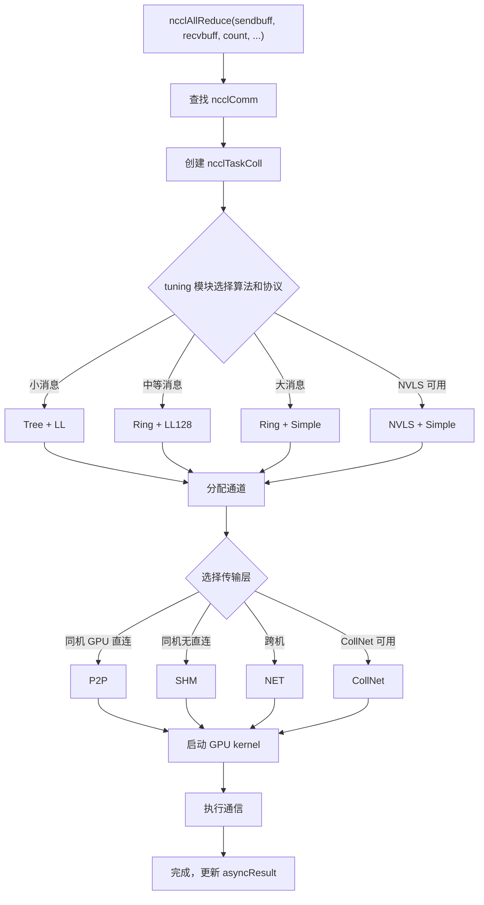

# Chapitre 2 : Modèle d'abstraction central : opérateurs de communication, topologie, algorithmes, protocoles et couche de transport

Dans le chapitre précédent, nous avons fait tourner NCCL et observé le comportement externe des trois API ncclCommInitRank, ncclAllReduce, ncclCommDestroy. Mais le comportement externe n'est que la partie émergée de l'iceberg — lorsque ncclAllReduce retourne, que se passe-t-il réellement sur le GPU ? Par quel chemin passent les données ? Pourquoi le même AllReduce présente-t-il des différences de performance énormes selon les machines ? Pour répondre à ces questions, il faut d'abord établir le vocabulaire commun de NCCL. Ce chapitre décomposera une à une les cinq abstractions centrales : domaine de communication (ncclComm), canal (channel), algorithme (algorithm), protocole (protocol), couche de transport (transport). Ces cinq concepts traversent tout le livre, et chaque chapitre ultérieur les utilisera dans son analyse. Comprendre leurs relations, c'est comprendre le squelette de NCCL.

# 2.1 Domaine de communication ncclComm : le contexte de communication d'un processus

## Modèle intuitif

Imaginez`ncclComm`comme un « groupe de discussion » : chaque processus qui rejoint le groupe obtient un ID de groupe, et ensuite tous les messages sont envoyés dans ce groupe. Combien de personnes dans le groupe (`nRanks`), qui je suis (`rank`), par quelle route (`channels`), avec quelles règles (`config`), tout est enregistré dans cet objet de groupe de discussion.

Sans`ncclComm`, NCCL ne saurait pas « qui communique avec qui » ni « où envoyer les données » — chaque appel d'API devrait renégocier la liste des ranks et reconstruire les connexions, un coût insupportable.

## Structure de données et disposition mémoire

`ncclComm`est la structure la plus centrale de tout NCCL, définie dans`src/include/comm.h`. Elle est extrêmement volumineuse (près de 300 lignes), nous examinerons les champs clés regroupés par fonction.

**Identité et sentinelles de cycle de vie**

[FACT:src/include/comm.h:576-580]définit`startMagic`，[FACT:src/include/comm.h:879-881]définit`endMagic`. Ces deux champs ne sont pas des clés de sécurité, mais des sentinelles de détection de dépassement mémoire. À l'emplacement[FACT:src/include/comm.h:883-885]se trouvent deux`static_assert`：

```c
static_assert(offsetof(struct ncclComm, startMagic) == 0, "startMagic must be the first field of ncclComm");
static_assert(offsetof(struct ncclComm, endMagic) == sizeof(struct ncclComm) - sizeof(uint64_t),
              "endMagic must be the last field of ncclComm");
```

> **[Design Inference & Architectural Trade-offs]**
> Ces deux assertions forcent à la compilation`startMagic`à se trouver à l'adresse de début de la structure,`endMagic`à la fin. À l'exécution, en vérifiant si ces deux nombres magiques ont été altérés, on peut rapidement déterminer si le pointeur`ncclComm`est valide — ce qui est très utile pour diagnostiquer les bugs de type « accès à un domaine de communication détruit via un pointeur sauvage » dans un environnement multithread.

**Rank et informations de topologie**

[FACT:src/include/comm.h:628-629]définit`rank`et`nRanks`— mon numéro dans le domaine de communication et le nombre total de participants.[FACT:src/include/comm.h:644-652]définit les champs liés au nœud :`node`(numéro du nœud où je me trouve),`nNodes`(nombre total de nœuds),`localRank`(numéro au sein du nœud),`localRanks`(nombre de GPU dans le nœud), ainsi que trois tables de correspondance`rankToNode`、`rankToLocalRank`、`localRankToRank`。

> **[Design Inference & Architectural Trade-offs]**
> Ces trois tables de mappage constituent la base de l'algorithme sensible à la topologie. Par exemple, l'algorithme Ring doit savoir « si mon prochain rank se trouve dans le même nœud » pour décider s'il passe par NVLink ou par le réseau. Sans ces tables de mappage, chaque sélection d'algorithme devrait réinterroger le graphe de topologie, ce qui entraînerait des coûts considérables.

**Canaux et tampons**

[FACT:src/include/comm.h:593-593]définit`channels[MAXCHANNELS]`—— c'est le tableau de tous les canaux dans le domaine de communication.[FACT:src/include/comm.h:674-676]définit le nombre de canaux :`nChannels`(nombre de canaux de connexion),`collChannels`(nombre de canaux de mise en file pour la communication collective),`nvlsChannels`(nombre de canaux NVLS).

[FACT:src/include/comm.h:691-693]définit la taille des tampons :`buffSizes[NCCL_NUM_PROTOCOLS]`(taille du tampon pour chaque protocole),`p2pChunkSize`(taille de bloc P2P),`nvlsChunkSize`(taille de bloc NVLS).

> **[Design Inference & Architectural Trade-offs]**
> `buffSizes`L'index du tableau correspond à la valeur d'énumération du protocole (LL/LL128/Simple), ce qui signifie que chaque protocole dispose d'une configuration de taille de tampon indépendante. Le protocole LL nécessite un petit tampon pour réduire la latence, tandis que le protocole Simple nécessite un grand tampon pour augmenter la bande passante — ce tableau permet à ces deux besoins de coexister.

**File de travail et FIFO**

[FACT:src/include/comm.h:719-728]définit les champs liés à la FIFO de travail :`workFifoBytes`(taille de la FIFO, puissance de 2),`workFifoBuf`(tampon FIFO côté hôte),`workFifoBufDev`(tampon FIFO côté périphérique),`workFifoProduced`(nombre d'octets produits),`workFifoConsumed`(nombre d'octets consommés).

> **[Design Inference & Architectural Trade-offs]**
> Il s'agit d'un tampon circulaire producteur-consommateur typique. Le côté hôte (producteur) écrit les descriptions de travail dans la FIFO, et le kernel GPU (consommateur) les lit et les exécute.`workFifoBytes`doit être une puissance de 2, ce qui permet d'utiliser un masque binaire au lieu d'une opération modulo pour accélérer le calcul d'index.

**Barrière de synchronisation intra-processus**

[FACT:src/include/comm.h:731-731]définit le mécanisme de synchronisation multi-domaines de communication au sein d'un processus :

```c
struct ncclComm* intraComm0; // leader of intra-process comms (self possible)
struct ncclComm* intraNext; // next of intra-process comms, intraComm0 is head
int intraRank;
int intraRanks;
uint32_t intraBarrierPhase;
char intraPad1[64 - sizeof(uint64_t)];
uint64_t intraBarrierCounter; // only used if this is intraComm0
char intraPad2[64 - sizeof(uint64_t)];
uint64_t intraBarrierGate; // only used if this is intraComm0
```

Noter que`intraPad1`et`intraPad2`ont une taille de`64 - sizeof(uint64_t)`, soit 56 octets. Ajouté au champ`uint64_t`précédent, chaque groupe de champs occupe exactement 64 octets — c'est une ligne de cache (Cache Line).

> **[Design Inference & Architectural Trade-offs]**
> Il s'agit d'une technique typique de**remplissage de ligne de cache (Cache Line Padding)**.`intraBarrierCounter`et`intraBarrierGate`sont lus et écrits à haute fréquence par plusieurs threads ; s'ils partagent la même ligne de cache, cela provoque du**faux partage (False Sharing)**: la modification de`intraBarrierCounter`par un thread invalide le cache de`intraBarrierGate`d'un autre thread, entraînant une chute brutale des performances. Les séparer sur différentes lignes de cache à l'aide d'un remplissage de 56 octets est une technique standard en programmation concurrente haute performance.

**État d'erreur asynchrone**

[FACT:src/include/comm.h:705-705]définit`asyncResult`—— ce champ enregistre l'état des opérations asynchrones du domaine de communication. Dans le chapitre précédent, nous avons mentionné que`ncclCommFinalize`peut encore être dans l'état`ncclInProgress`au retour, ce qui est suivi via ce champ.

## Parcours guidé par scénario : de ncclCommInitRank au remplissage de la structure

Lorsque l'utilisateur appelle`ncclCommInitRank(&comm, nranks, commId, rank)`, NCCL alloue en interne une structure`ncclComm`et la remplit champ par champ. Suivons ce processus pour voir comment les champs clés sont définis :

**Première étape : allocation et mise à zéro**

NCCL utilise`ncclCalloc`pour allouer`ncclComm`, garantissant que tous les champs sont initialisés à 0. À ce stade,`startMagic`et`endMagic`sont définis à`NCCL_MAGIC`（[FACT:src/include/comm.h:563-569]défini comme`0x0280028002800280`, le commentaire indiquant « Nickel atomic number is 28 »).

**Deuxième étape : remplissage des informations d'identité**

`rank`、`nRanks`、`cudaDev`est obtenu à partir des paramètres et de l'API CUDA.`commHash`est obtenu par hachage de`ncclCommId`, utilisé pour la vérification de cohérence dans les communications réseau ultérieures.

**Troisième étape : construction du graphe de topologie**

NCCL appelle le module de détection de topologie pour énumérer tous les GPU, cartes réseau et commutateurs PCI, et construit le champ`topo`([FACT:src/include/comm.h:595-595]). Ce graphe de topologie détermine la sélection ultérieure des algorithmes et la planification des chemins.

**Quatrième étape : initialisation des canaux**

`channels[MAXCHANNELS]`Le tableau est initialisé un par un. Le`id`de chaque canal est défini à l'index du tableau,`peers`et les pointeurs`devPeers`sont alloués.

**Cinquième étape : établissement des connexions de transport**

En fonction du graphe de topologie, NCCL sélectionne la couche de transport (P2P/SHM/NET) pour chaque paire de ranks, et appelle les callbacks`setup`et`connect`correspondants. Les informations de connexion sont stockées dans`channels[i].peers[j]`.

**Sixième étape : définition du nombre magique**

Enfin,`endMagic`est défini à`NCCL_MAGIC`, marquant l'achèvement de l'initialisation de la structure.

## Réflexions de conception et pièges en production

**Pourquoi`ncclComm`est-il si grand ?**

> **[Design Inference & Architectural Trade-offs]**
> `ncclComm`contient près de 300 champs, car il porte l'état complet d'un domaine de communication. La philosophie de conception de NCCL est « initialiser une fois, réutiliser plusieurs fois » — lors de l'initialisation, toutes les informations potentiellement utiles sont calculées et stockées, et à l'exécution, on consulte directement la table pour éviter les recalculs. Le coût est une occupation mémoire relativement importante (environ quelques Ko par domaine de communication), mais par rapport à la mémoire GPU et à la bande passante réseau, cette mémoire est négligeable.

**Piège 1 : partage d'un domaine de communication entre plusieurs threads**

> **[Design Inference & Architectural Trade-offs]**
> `ncclComm`n'est pas thread-safe. Si deux threads appellent simultanément`ncclComm`sur le même`ncclAllReduce`，`workFifoProduced`, des champs comme celui-ci entreront en compétition, entraînant une corruption des données. La bonne pratique est d'utiliser un domaine de communication indépendant par thread, ou de sérialiser les appels avec un verrou externe.

**Piège 2 : accès après destruction**

`ncclCommDestroy`Après la libération de la mémoire de la structure, si un thread détient encore un pointeur et y accède, il lira de la mémoire libérée.`startMagic`et`endMagic`peuvent aider à détecter ce cas — si le nombre magique ne correspond pas, cela signifie que le pointeur n'est plus valide.

**Piège 3 : faux partage de ligne de cache**

Dans un scénario multi-processus (un rank par processus), le remplissage de`intraBarrierCounter`et`intraBarrierGate`est particulièrement important. Si le remplissage est omis, les opérations de barrière de plusieurs processus interféreront mutuellement, faisant passer la latence de synchronisation de l'ordre de la nanoseconde à celui de la microseconde.

# 2.2 Canal channel : découper une communication en plusieurs pipelines

## Modèle intuitif

Lors d'un déménagement, on n'ouvre pas une seule chaîne de transport, mais plusieurs simultanément, chacune responsable d'une partie des cartons, ce qui permet de déménager plus rapidement dans l'ensemble.`channel`C'est le « tapis roulant » de NCCL — il divise les données d'une communication collective en plusieurs parties, chaque canal transportant indépendamment une partie, avançant en parallèle pour améliorer l'utilisation de la bande passante.

Sans channel, toutes les données ne peuvent emprunter qu'un seul chemin, les multiples liaisons physiques entre GPU (plusieurs cartes réseau, plusieurs groupes NVLink) ne peuvent pas être utilisées simultanément, et l'utilisation de la bande passante chute considérablement.

## Structure de données et disposition mémoire

`ncclChannel`Défini dans[FACT:src/include/comm.h:169-191]：

```c
struct ncclChannel {
  struct ncclChannelPeer** peers;
  struct ncclDevChannelPeer** devPeers;
  /* devPeer pointer array used for host side access */
  struct ncclDevChannelPeer** devPeersHostPtr;
  struct ncclRing ring;
  int* devRingUserRanks;
  struct ncclTree tree;

  struct ncclTree collnetChain;
  struct ncclDirect collnetDirect;

  struct ncclNvls nvls;

  int id; // index of this channel
  uint32_t workFifoProduced; // +1 successor of last used work fifo byte

  /* comm split sharable resources */
  struct ncclChannelPeer* collnetPeers;
  struct ncclDevChannelPeer* collnetDevPeers;
  struct ncclChannelPeer* nvlsPeers;
  struct ncclDevChannelPeer* nvlsDevPeers;
};
```

**Analyse des champs clés**

- `peers` / `devPeers`: pointe vers les informations de connexion de tous les ranks dans ce canal.`peers`est la vue côté hôte,`devPeers`est la vue côté device (accédée directement par le kernel GPU).
- `ring`: description topologique de l'algorithme Ring — prédécesseur et successeur de chaque rank.
- `tree`: description topologique de l'algorithme Tree — nœud parent et liste des nœuds enfants.
- `collnetChain` / `collnetDirect`: deux variantes topologiques de l'algorithme CollNet.
- `nvls`: description topologique de NVLink SHARP.
- `id`: index du canal, de 0 à`nChannels-1`。
- `workFifoProduced`: pointeur de production du FIFO de travail de ce canal.

> **[Design Inference & Architectural Trade-offs]**
> Noter que`ring`、`tree`、`collnetChain`、`collnetDirect`、`nvls`ces cinq champs sont**parallèles**— un même canal peut contenir simultanément les descriptions topologiques de plusieurs algorithmes. Au moment de l'exécution, le champ à utiliser est déterminé selon l'algorithme choisi. Cette conception permet de changer d'algorithme sans reconstruire le canal, il suffit de changer le champ lu.

**Calcul du nombre de canaux**

Le nombre de canaux est défini dans`ncclComm`([FACT:src/include/comm.h:674-676]）：

```c
int nChannels; // connection nChannels
int collChannels; // enqueue nChannels
int nvlsChannels; // enqueue nChannels
```

> **[Design Inference & Architectural Trade-offs]**
> `nChannels`est le nombre de connexions réellement établies,`collChannels`est le nombre de canaux utilisés lors de la mise en file des communications collectives,`nvlsChannels`est le nombre de canaux dédiés à NVLS. Les trois peuvent différer — par exemple, certains canaux sont utilisés uniquement pour le P2P et non pour les communications collectives.

**Ordonnancement des canaux P2P**

[FACT:src/include/channel.h:21-33]définit la`ncclP2pChannelBaseForRound`fonction, utilisée pour calculer l'adresse de base du canal utilisé à chaque round dans la communication P2P :

```c
inline uint8_t ncclP2pChannelBaseForRound(struct ncclComm* comm, int p2pRound) {
  int base;
  if (comm->nNodes > 1) {
    int localSize = comm->p2pSchedGroupSize;
    int groupDelta = p2pRound / localSize;
    int localDelta = p2pRound % localSize;
    base = groupDelta * divUp(localSize, NCCL_MAX_DEV_WORK_P2P_PER_BATCH);
    base += localDelta / NCCL_MAX_DEV_WORK_P2P_PER_BATCH;
  } else {
    base = p2pRound;
  }
  return reverseBits(base, log2Up(comm->p2pnChannels));
}
```

> **[Design Inference & Architectural Trade-offs]**
> La logique de cette fonction est : dans un scénario multi-nœuds, la communication P2P est ordonnancée par « groupes », les ranks d'un même groupe utilisant des canaux adjacents ; dans un scénario mono-nœud, chaque round est directement mappé à un canal.`reverseBits`est une opération de reversal de bits, utilisée pour disperser l'attribution des canaux et éviter la concentration des points chauds.

## Walkthrough guidé par scénario : comment un AllReduce attribue les canaux

Supposons 8 ranks et 4 canaux, exécutant un AllReduce. Les données sont découpées en 4 parties, chaque partie étant prise en charge par un canal.

**Première étape : sélection de l'algorithme**

Le module tuning de NCCL sélectionne l'algorithme (par exemple Ring) et le protocole (par exemple Simple) en fonction de la taille du message et de la topologie.

**Deuxième étape : attribution des canaux**

`ncclTaskColl`La structure ([FACT:src/include/comm.h:212-273]) est créée, dans laquelle le champ`nChannels`est défini à 4 (les champs[FACT:src/include/comm.h:254-254]）。`channelLo`et`channelHi`([FACT:src/include/comm.h:256-257]) marquent la plage de canaux utilisée par cette tâche.

**Troisième étape : découpage des données**

Chaque canal est responsable de`count / nChannels`éléments. Le canal 0 traite les éléments 0 à count/4-1, le canal 1 traite les éléments count/4 à count/2-1, et ainsi de suite.

**Quatrième étape : exécution parallèle**

Les kernels GPU des 4 canaux sont lancés simultanément, chacun exécutant Ring AllReduce sur sa propre tranche de données. Comme il n'y a pas de dépendance de données entre les canaux, ils peuvent être totalement parallèles.

**Cinquième étape : fusion des résultats**

Une fois tous les canaux terminés, le recv buffer de chaque rank contient le résultat complet de l'AllReduce.

## Contrôle de concurrence et interaction matérielle

**Mappage des canaux aux ressources GPU**

> **[Design Inference & Architectural Trade-offs]**
> Chaque canal est généralement lié à un CUDA stream indépendant ou à une file matérielle GPU. Ainsi, les kernels de différents canaux peuvent s'exécuter en concurrence sur le GPU, exploitant pleinement les ressources SM (Streaming Multiprocessor).

**Mappage des canaux aux équipements réseau**

Dans un scénario multi-cartes réseau, différents canaux peuvent être liés à différentes cartes réseau. Par exemple, avec 4 canaux et 2 cartes réseau, les canaux 0 et 1 passent par la carte réseau A, les canaux 2 et 3 par la carte réseau B. Ainsi, la bande passante des deux cartes réseau peut être utilisée.

**Choix du nombre de canaux**

> **[Design Inference & Architectural Trade-offs]**
> Le nombre de canaux n'est pas forcément meilleur quand il est plus élevé. L'augmentation du nombre de canaux entraîne :

- plus de surcoût de lancement de kernel
- plus de surcoût d'établissement de connexion
- une synchronisation plus complexe

Le module tuning de NCCL sélectionne automatiquement le nombre optimal de canaux en fonction de la taille du message. Les petits messages utilisent peu de canaux (réduction du surcoût), les gros messages en utilisent davantage (amélioration de la bande passante).

## Guide de production pour éviter les pièges

**Scénario piège 1 : configuration inappropriée du nombre de canaux**

> **[Design Inference & Architectural Trade-offs]**
> Si l'on définit manuellement`NCCL_NCHANNELS`trop grand, dans un scénario de petits messages, le surcoût de lancement de kernel dépassera le gain, et les performances diminueront au contraire. Il est recommandé de laisser NCCL choisir automatiquement, sauf besoin d'optimisation clairement identifié.

**Scénario piège 2 : inadéquation entre canaux et topologie**

> **[Design Inference & Architectural Trade-offs]**
> Si le nombre de canaux dépasse le nombre de liaisons physiques, certains canaux partageront des liaisons et ne pourront pas réaliser un véritable parallélisme. Par exemple, avec 2 cartes réseau et 8 canaux, seuls 2 canaux peuvent réellement transmettre simultanément, les 6 autres font la queue.

**Scénario piège 3 : conflit de canaux P2P**

`ncclP2pChannelBaseForRound`L'opération`reverseBits`de[FACT:src/include/channel.h:32-32], si elle est mal implémentée, entraînera le mappage de plusieurs rounds sur le même canal, provoquant une sérialisation.`reverseBits(base, log2Up(comm->p2pnChannels))`Le

# 2.3 Algorithme algorithm : organisation topologique de Tree/Ring/CollNet/NVLS/PAT

## Modèle intuitif

De Pékin à Shanghai, on peut prendre le train à grande vitesse, l'avion ou conduire soi-même ; chaque mode convient à des distances et des nombres de personnes différents. Les algorithmes de NCCL sont exactement ces « modes de déplacement » — Ring convient à une bande passante stable pour les gros messages, Tree convient à une faible latence pour les petits messages, CollNet exploite le déchargement par carte réseau, NVLS exploite l'accélération matérielle NVLink SHARP, et PAT est une variante parallélisée de NVLS.

Sans sélection d'algorithme, NCCL ne pourrait communiquer que selon un mode fixe, incapable de s'adapter aux différentes tailles de messages et topologies, et les performances en seraient fortement dégradées.

## Structures de données et disposition mémoire

**Algorithme Ring**

Le cœur de l'algorithme Ring est la`ncclRing`structure (dans`src/include/comm.h`référencée via`channels[i].ring`).[FACT:src/include/collectives.h:81-116]définit la`RingAlgorithm`classe de base :

```c
class RingAlgorithm {
protected:
  int refCount;
  int nRanks;
  int nStepsPerLoop;
  int chunkSteps;
  int sliceSteps;
  ssize_t sliceSize;
  ssize_t loopSize;
  ssize_t channelSize;
  uint8_t* sendbuff;
  uint8_t* recvbuff;
  void* sendMhandle;
  void* recvMhandle;
  void* srecvMhandle;

public:
  virtual void getNextSendAddr(int curStep, uint8_t** sendbuffOut, size_t* sizeOut, void** mhandleOut) = 0;
  virtual void getNextRecvAddr(int curStep, uint8_t** recvbuffOut, size_t* sizeOut, void** mhandleOut) = 0;
  int incRefCount() {
    return (int)COMPILER_ATOMIC_ADD_FETCH(&refCount, 1, std::memory_order_relaxed);
  }
  int decRefCount() {
    return (int)COMPILER_ATOMIC_SUB_FETCH(&refCount, 1, std::memory_order_release);
  }
  RingAlgorithm() {
    refCount = 0;
  }
  virtual ~RingAlgorithm() {};
};
```

**Analyse des champs clés**

- `refCount`: compteur de références, utilisé pour le partage de l'objet algorithme entre le thread proxy et le kernel GPU.
- `nRanks`: nombre de nœuds sur l'anneau.
- `nStepsPerLoop`: nombre de pas par cycle. AllReduce est`2*(nRanks-1)*chunkSteps`（[FACT:src/include/collectives.h:218-218]）。
- `chunkSteps` / `sliceSteps`: pas de blocs et pas de tranches, contrôlant la granularité du pipeline.
- `sliceSize` / `loopSize` / `channelSize`: taille de tranche, taille de cycle, taille de canal.
- `sendbuff` / `recvbuff`: pointeurs de tampon d'envoi et de réception.
- `sendMhandle` / `recvMhandle` / `srecvMhandle`: handle mémoire, utilisé pour l'enregistrement réseau.

**Opérations atomiques du compteur de références**

[FACT:src/include/collectives.h:106-108]illustre`incRefCount`et`decRefCount`：

```c
int incRefCount() {
  return (int)COMPILER_ATOMIC_ADD_FETCH(&refCount, 1, std::memory_order_relaxed);
}
int decRefCount() {
  return (int)COMPILER_ATOMIC_SUB_FETCH(&refCount, 1, std::memory_order_release);
}
```

> **[Design Inference & Architectural Trade-offs]**
> `incRefCount`utilise`memory_order_relaxed`— incrémenter le compteur de références ne nécessite pas de synchronisation, il suffit de garantir l'atomicité.`decRefCount`utilise`memory_order_release`— décrémenter le compteur de références nécessite de s'assurer que les écritures précédentes sont visibles par les autres threads (car cela peut déclencher la destruction de l'objet).

**RingARAlgorithm : implémentation Ring de AllReduce**

[FACT:src/include/collectives.h:118-234]définit`RingARAlgorithm`, héritant de`RingAlgorithm`. Les méthodes principales sont`getNextSendAddr`et`getNextRecvAddr`。

[FACT:src/include/collectives.h:126-167]la logique de`getNextSendAddr`:

```c
void getNextSendAddr(int curStep, uint8_t** sendbuffOut, size_t* sizeOut, void** mhandleOut) {
  int curLoop = curStep / nStepsPerLoop;
  int curLoopStage = (curStep % nStepsPerLoop) / chunkSteps;
  int chunkStage = curLoopStage % nRanks;
  int sliceStage = (curStep % chunkSteps) / sliceSteps;
  ssize_t elemOffset = curLoop * loopSize;
  ssize_t remSize = channelSize - elemOffset;
  // ... 计算 chunkOffset, sliceOffset, curSliceSize ...
  if (remSize  **[Design Inference & Architectural Trade-offs]**
> Le cœur de ce code est**le calcul d'adresse**: étant donné le pas actuel`curStep`, calculer quelle tranche de quel bloc de données doit être envoyée.`chunkId`Le calcul de`(ringIndex + nRanks - 1 - chunkStage) % nRanks`implémente la propagation inverse sur l'anneau — chaque rank reçoit les données de son prédécesseur, les traite puis les envoie à son successeur.

**Algorithme PAT**

PAT (Parallel Aggregated Tree) est une variante parallélisée de NVLS.[FACT:src/include/collectives.h:416-423]définit`ncclPatStep`：

```c
struct ncclPatStep {
  int recvDim, sendDim, recvOffset, sendOffset, stepOffset, postRecv, postSend, nelem, last, flags;
  // PAT algo computation thread step number; -1 while the slot is free.
  int step;
  // This PAT group's offset within the shared NVLS slot.
  int nvlsOffset;
  size_t inpIx, outIx;
};
```

[FACT:src/include/collectives.h:425-435]définit`ncclPatPeer`：

```c
struct ncclPatPeer {
  uint64_t step;
  struct ncclConnInfo* conn;
  struct ncclConnFifo* connFifo;
  void* buff;
  uint64_t* headPtr;
  uint64_t* tailPtr;
  uint64_t stepCache;
  long long int accSize;
  int connStepSize;
};
```

> **[Design Inference & Architectural Trade-offs]**
> L'idée centrale de l'algorithme PAT est**d'agréger plusieurs petites étapes en une grande étape**, réduisant ainsi les surcoûts de synchronisation.`ncclPatStep`décrit les dimensions d'envoi/réception, les décalages, le nombre d'éléments, etc. d'une étape d'agrégation.`ncclPatPeer`décrit l'état de connexion et les pointeurs de tampon d'un nœud pair.

## Parcours guidé par scénario : évolution des étapes de Ring AllReduce

Supposons 4 ranks (0, 1, 2, 3), chacun avec 4 éléments, exécutant un Ring AllReduce.

**Phase Reduce-Scatter**

- Étape 0 : rank 0 envoie l'élément 0 à rank 1, rank 1 envoie l'élément 1 à rank 2, rank 2 envoie l'élément 2 à rank 3, rank 3 envoie l'élément 3 à rank 0.
- Étape 1 : chaque rank additionne l'élément reçu avec l'élément local correspondant, puis l'envoie au rank suivant.
- Étape 2 : poursuite de l'accumulation et de la transmission.
- Étape 3 : à ce stade, chaque rank possède un résultat de réduction complet (rank 0 a le résultat de l'élément 3, rank 1 a le résultat de l'élément 0, etc.).

**Phase AllGather**

- Étapes 4-6 : chaque rank propage le long de l'anneau le résultat de réduction qu'il possède, et finalement tous les ranks possèdent le résultat complet.

[FACT:src/include/collectives.h:218-218]Le`nStepsPerLoop = 2 * (nRanks - 1) * chunkSteps`de`(nRanks-1)*chunkSteps`correspond exactement à ce flux : Reduce-Scatter nécessite`(nRanks-1)*chunkSteps`pas, AllGather nécessite également`2*(nRanks-1)*chunkSteps`pas, soit au total

## pas.

**Réflexions de conception et pièges en production**

> **[Design Inference & Architectural Trade-offs]**
> 〔Inférences de conception et compromis architecturaux〕

**L'algorithme Ring a une utilisation de bande passante élevée (chaque lien transmet), mais la latence croît linéairement avec le nombre de ranks. L'algorithme Tree a une latence logarithmique, mais une faible utilisation de bande passante (seuls certains liens travaillent). NCCL choisit automatiquement selon la taille du message : Tree pour les petits messages (sensible à la latence), Ring pour les gros messages (sensible à la bande passante).**

> **[Design Inference & Architectural Trade-offs]**
> 〔Inférences de conception et compromis architecturaux〕

**Si l'on force manuellement l'utilisation de Ring pour de petits messages, la latence augmentera significativement. Il est recommandé de laisser le module tuning choisir automatiquement, sauf si des données d'analyse de performance précises justifient une intervention manuelle.**

Piège de scénario deux : matériel NVLS non pris en charge[FACT:src/include/comm.h:755-755]NVLS nécessite un support matériel spécifique (NVLink SHARP). Si le matériel ne le prend pas en charge mais que le code force l'utilisation de NVLS, il y aura un repli vers Ring ou Tree, mais possiblement accompagné de fluctuations de performance.`nvlsSupport`Le champ

**de**

indique si le matériel prend en charge NVLS.`aggFactor`Piège de scénario trois : configuration du facteur d'agrégation de l'algorithme PAT[FACT:src/include/collectives.h:537-560]Le`aggFactor`de l'algorithme PAT

```c
aggFactor = 1;
size_t channelSize = end - offset;
while (stepSize / (channelSize * sizeof(T) * aggFactor) >= 2 && aggFactor  1 && aggFactor  **[Design Inference & Architectural Trade-offs]**
> `aggFactor`:`stepSize`、`channelSize`、`nranks`Copier

# 〔Inférences de conception et compromis architecturaux〕

## Un

Pour envoyer un colis, on peut choisir « livraison express intra-ville », « livraison le lendemain » ou « courrier ordinaire », avec des vitesses et des coûts différents. Les protocoles de NCCL sont ces « modes d'envoi » — LL (Low Latency) convient à la transmission de petits messages à faible latence, LL128 convient à la transmission de messages moyens alignés sur 128 octets, et Simple convient à la transmission de gros messages à haut débit.

Sans sélection de protocole, NCCL ne pourrait utiliser qu'une stratégie fixe pour déplacer les données, sans pouvoir équilibrer latence et bande passante.

## Structures de données et disposition mémoire

**Énumération des protocoles**

[FACT:src/include/comm.h:55-57]définit les seuils de threads liés aux protocoles :

```c
#define NCCL_LL_THREAD_THRESHOLD 8
#define NCCL_LL128_THREAD_THRESHOLD 8
#define NCCL_SIMPLE_THREAD_THRESHOLD 64
```

> **[Design Inference & Architectural Trade-offs]**
> Ces seuils déterminent combien de threads chaque protocole utilise. LL et LL128 utilisent 8 threads (faible latence, peu de threads suffisent), Simple utilise 64 threads (haut débit, nécessite plus de threads pour le transfert parallèle).

**Tampons de protocole**

[FACT:src/include/comm.h:691-691]définit`buffSizes[NCCL_NUM_PROTOCOLS]`——chaque protocole a une taille de tampon indépendante.

**Structures FIFO liées aux protocoles**

[FACT:src/include/comm.h:59-83]définit`ncclSendMem`et`ncclRecvMem`：

```c
struct ncclSendMem {
  union {
    struct {
      uint64_t head;
      char pad1[CACHE_LINE_SIZE - sizeof(uint64_t)];
      void* ptrExchange;
      uint64_t redOpArgExchange[2];
      char pad2[CACHE_LINE_SIZE - sizeof(void*) - 2 * sizeof(uint64_t)];
      int offsFifo[NCCL_STEPS];
    };
    char pad3[MEM_ALIGN];
  };
};

struct ncclRecvMem {
  union {
    struct {
      uint64_t tail;
      char pad1[CACHE_LINE_SIZE - sizeof(uint64_t)];
      struct ncclConnFifo connFifo[NCCL_STEPS];
      int flush; // For GDRCopy-based flush
    };
    char pad4[MEM_ALIGN];
  };
};
```

> **[Design Inference & Architectural Trade-offs]**
> `ncclSendMem`et`ncclRecvMem`sont les structures de mémoire partagée pour l'envoi et la réception.`head`et`tail`sont les pointeurs de lecture/écriture du tampon circulaire,`pad1`garantit qu'ils sont sur des lignes de cache différentes.`connFifo`Le tableau stocke les informations de connexion pour chaque étape (mode, offset, taille, pointeur), défini dans[FACT:src/include/collectives.h:72-77]：

```c
struct ncclConnFifo {
  int mode;
  ssize_t offset;
  ssize_t size;
  void* ptr;
};
```

**Logique de sélection des protocoles**

> **[Design Inference & Architectural Trade-offs]**
> La sélection du protocole est effectuée par le module tuning, en tenant compte des facteurs suivants :

- Taille des messages : LL pour les petits messages, LL128 pour les moyens, Simple pour les gros.
- Topologie : les connexions NVLink conviennent à LL128, les connexions réseau conviennent à Simple.
- Capacités matérielles : certaines architectures GPU sont optimisées pour des protocoles spécifiques.

## Parcours guidé par scénario : transfert de données avec le protocole LL

Supposons l'utilisation du protocole LL pour transmettre 1 Ko de données.

**Première étape : écriture des données dans le tampon d'envoi**

Le côté hôte écrit les données dans`sendbuff`, puis met à jour le pointeur`ncclSendMem.head`pour notifier le kernel GPU de la présence de nouvelles données.

**Deuxième étape : lecture des données par le kernel GPU**

Le kernel GPU interroge le pointeur`head`, et après avoir détecté de nouvelles données, lit les données depuis`sendbuff`.

**Troisième étape : transmission des données**

Le kernel GPU envoie les données au rank cible via NVLink ou le réseau.

**Quatrième étape : réception des données par le rank cible**

Le kernel GPU du rank cible écrit les données dans`recvbuff`, puis met à jour le pointeur`ncclRecvMem.tail`.

**Cinquième étape : lecture des données par le côté hôte**

Le côté hôte interroge le pointeur`tail`, et après avoir détecté de nouvelles données, lit les données depuis`recvbuff`.

## Contrôle de concurrence et interaction matérielle

**Mécanisme de faible latence du protocole LL**

> **[Design Inference & Architectural Trade-offs]**
> Le protocole LL utilise**l'interrogation (Polling)**plutôt que les interruptions pour détecter l'arrivée des données. Le kernel GPU lit continuellement le pointeur`head`et traite immédiatement tout changement détecté. Cela offre une latence plus faible que les interruptions, mais consomme des ressources de calcul GPU.

**Alignement sur 128 octets du protocole LL128**

> **[Design Inference & Architectural Trade-offs]**
> Le protocole LL128 exige que les données soient alignées sur 128 octets, de sorte que chaque transmission remplisse exactement une ligne de cache. Les avantages de l'alignement sont :

- Réduction des écritures partielles de lignes de cache (Partial Cache Line Write)
- Amélioration de l'utilisation de la bande passante mémoire
- Simplification de la logique de traitement matérielle

**Transfert par lots du protocole Simple**

> **[Design Inference & Architectural Trade-offs]**
> Le protocole Simple utilise**le transfert par lots**mode : accumuler une certaine quantité de données avant de les envoyer en une seule fois, réduisant ainsi le nombre de synchronisations. Cela convient aux scénarios de gros messages, car les frais de synchronisation sont répartis sur une grande quantité de données.

## Guide de production pour éviter les pièges

**Scénario piège 1 : inadéquation entre protocole et taille de message**

> **[Design Inference & Architectural Trade-offs]**
> Si l'on force l'utilisation du protocole LL pour transmettre de gros messages, les performances chutent brutalement. Car l'objectif de conception du protocole LL est la faible latence, pas le haut débit. Les gros messages doivent utiliser le protocole Simple.

**Scénario piège 2 : problème d'alignement de LL128**

> **[Design Inference & Architectural Trade-offs]**
> Si les données ne sont pas alignées sur 128 octets, le protocole LL128 revient à LL ou Simple, entraînant une instabilité des performances. Il est recommandé de s'assurer que les tampons d'envoi et de réception sont alignés sur 128 octets.

**Scénario piège 3 : coût du changement de protocole**

> **[Design Inference & Architectural Trade-offs]**
> Changer dynamiquement de protocole à l'exécution entraîne des coûts supplémentaires. NCCL détermine le protocole lors de l'initialisation et ne le change plus à l'exécution. Si un changement est nécessaire, il faut réinitialiser le domaine de communication.

# 2.5 Couche de transport transport : canaux de transfert bas niveau P2P/SHM/NET/CollNet

## Modèle intuitif

Pour aller du point A au point B, on peut marcher, faire du vélo, prendre le métro ou le taxi ; la couche de transport de NCCL correspond à ces différents « modes de déplacement ». La couche supérieure ne se soucie pas de la manière exacte, seulement de savoir si les données peuvent être livrées. P2P est la « marche » (connexion directe entre GPU d'une même machine), SHM est le « vélo » (mémoire partagée), NET est le « métro » (réseau), CollNet est le « taxi » (déchargement vers la carte réseau).

Sans abstraction de la couche de transport, les algorithmes de la couche supérieure devraient écrire du code différent pour chaque type de liaison physique, sans possibilité de réutilisation.

## Structures de données et disposition mémoire

**Énumération de la couche de transport**

[FACT:src/include/transport.h:18-23]définit les types de couche de transport :

```c
#define NTRANSPORTS 4
#define TRANSPORT_UNDEFINED -1
#define TRANSPORT_P2P 0
#define TRANSPORT_SHM 1
#define TRANSPORT_NET 2
#define TRANSPORT_COLLNET 3
```

**Interface de la couche de transport**

[FACT:src/include/transport.h:129-146]définit`ncclTransportComm`——l'interface de communication de la couche de transport :

```c
struct ncclTransportComm {
  ncclResult_t (*setup)(struct ncclComm* comm, struct ncclTopoGraph* graph, struct ncclPeerInfo*, struct ncclPeerInfo*,
                        struct ncclConnect*, struct ncclConnector*, int channelId, int connIndex);
  ncclResult_t (*connect)(struct ncclComm* comm, struct ncclConnect*, int nranks, int rank, struct ncclConnector*);
  ncclResult_t (*free)(struct ncclComm* comm, struct ncclConnector*);
  ncclResult_t (*proxySharedInit)(struct ncclProxyConnection* connection, struct ncclProxyState* proxyState,
                                  int nChannels);
  ncclResult_t (*proxySetup)(struct ncclProxyConnection* connection, struct ncclProxyState* proxyState, void* reqBuff,
                             int reqSize, void* respBuff, int respSize, int* done);
  ncclResult_t (*proxyConnect)(struct ncclProxyConnection* connection, struct ncclProxyState* proxyState, void* reqBuff,
                               int reqSize, void* respBuff, int respSize, int* done);
  ncclResult_t (*proxyFree)(struct ncclProxyConnection* connection, struct ncclProxyState* proxyState);
  ncclResult_t (*proxyProgress)(struct ncclProxyState* proxyState, struct ncclProxyArgs*);
  ncclResult_t (*proxyRegister)(struct ncclProxyConnection* connection, struct ncclProxyState* proxyState,
                                void* reqBuff, int reqSize, void* respBuff, int respSize, int* done);
  ncclResult_t (*proxyDeregister)(struct ncclProxyConnection* connection, struct ncclProxyState* proxyState,
                                  void* reqBuff, int reqSize, int* done);
};
```

**Analyse des callbacks clés**

- `setup`: travail préparatoire avant l'établissement de la connexion, échange des paramètres de connexion.
- `connect`: établissement effectif de la connexion.
- `free`: libération des ressources de connexion.
- `proxySharedInit`: Initialiser les ressources partagées du thread proxy.
- `proxySetup` / `proxyConnect`: Établissement de la connexion côté thread proxy.
- `proxyProgress`: Le thread proxy fait progresser le transfert de données.
- `proxyRegister` / `proxyDeregister`: Enregistrement et désenregistrement de la mémoire.

**Structure de la couche de transport**

[FACT:src/include/transport.h:148-154]définit`ncclTransport`：

```c
struct ncclTransport {
  const char name[8];
  ncclResult_t (*canConnect)(int*, struct ncclComm* comm, struct ncclTopoGraph* graph, struct ncclPeerInfo*,
                             struct ncclPeerInfo*);
  struct ncclTransportComm send;
  struct ncclTransportComm recv;
};
```

> **[Design Inference & Architectural Trade-offs]**
> `name`est le nom de la couche de transport (tel que "P2P", "SHM", "NET"),`canConnect`détermine si cette couche de transport peut être utilisée entre deux ranks,`send`et`recv`sont respectivement les interfaces de communication pour les directions d'envoi et de réception.

**Instances de la couche de transport**

[FACT:src/include/transport.h:36-36]déclare quatre instances de couche de transport :

```c
extern struct ncclTransport p2pTransport;
extern struct ncclTransport shmTransport;
extern struct ncclTransport netTransport;
extern struct ncclTransport collNetTransport;
```

[FACT:src/include/transport.h:36-36]définit le tableau des couches de transport :

```c
extern struct ncclTransport* ncclTransports[];
```

**Informations de nœud pair**

[FACT:src/include/transport.h:46-74]définit`ncclPeerInfo`——métadonnées échangées entre les ranks :

```c
struct ncclPeerInfo {
  int rank;
  int cudaDev;
  int nvmlDev;
  int gdrSupport;
  uint64_t hostHash;
  uint64_t pidHash;
  dev_t shmDev;
  int64_t busId;
  cudaUUID_t gpuUuid;
  struct ncclComm* comm;
  int cudaCompCap;
  int gpuCftSupport;
  size_t totalGlobalMem;
  // MNNVL support
  nvmlGpuFabricInfoV_t fabricInfo;
  int fabricHandleSupport;
  int cuMemSupport;
  int version;
  uint64_t supportedGinTypeBitMask;
  bool crossNicSupport;
  bool rmaPluginAvailable;
  bool cuMemGdrSupport;
  int mloPart; // MLOPart partition index, or -1 if not an MLOPart GPU
  int cudaDriverVersion;
  bool gpuCftMulticastSupport;
  bool gpuCftCountedSupport;
  uint32_t gitVersionHash;
};
```

> **[Design Inference & Architectural Trade-offs]**
> Ces champs servent à déterminer quelle couche de transport peut être utilisée entre deux ranks :

- `hostHash`identique → même hôte → P2P ou SHM disponible
- `hostHash`différent → hôte différent → NET obligatoire
- `gdrSupport`→ prise en charge de GPUDirect RDMA
- `cudaCompCap`→ capacité de calcul GPU, influence le choix du protocole

## Parcours guidé par scénario : établissement d'une connexion P2P

Supposons que deux ranks se trouvent sur le même hôte, NCCL choisit la couche de transport P2P.

**Première étape : échange de PeerInfo**

Les deux ranks échangent via le canal bootstrap`ncclPeerInfo`, confirmant qu'ils sont sur le même hôte et que les GPU prennent en charge P2P.

**Deuxième étape : appel de canConnect**

[FACT:src/include/transport.h:148-154]de`canConnect`le callback est appelé, vérifie la topologie pour confirmer qu'il existe une connexion NVLink ou PCIe entre les deux GPU.

**Troisième étape : appel de setup**

`p2pTransport.send.setup`et`p2pTransport.recv.setup`sont appelés, préparent les paramètres de connexion (tels que les handles IPC).

**Quatrième étape : appel de connect**

`p2pTransport.send.connect`et`p2pTransport.recv.connect`sont appelés, établissent réellement la connexion.

**Cinquième étape : enregistrement de la mémoire**

Si RDMA est nécessaire, appeler`proxyRegister`pour enregistrer les tampons d'envoi et de réception.

## Contrôle de concurrence et interaction matérielle

**Couche de transport P2P**

> **[Design Inference & Architectural Trade-offs]**
> P2P utilise le mécanisme CUDA IPC (Inter-Process Communication), permettant à un GPU d'accéder directement à la mémoire vidéo d'un autre GPU. Cela nécessite :

- Les deux GPU dans le même domaine PCIe ou domaine NVLink
- Le système d'exploitation prend en charge CUDA IPC
- Des permissions suffisantes

**Couche de transport SHM**

> **[Design Inference & Architectural Trade-offs]**
> SHM utilise la mémoire partagée de l'hôte comme intermédiaire. Lorsqu'il n'y a pas de connexion directe entre deux GPU, les données sont d'abord copiées vers la mémoire de l'hôte, puis copiées vers le GPU cible. C'est plus lent que P2P, mais la compatibilité est meilleure.

**Couche de transport NET**

> **[Design Inference & Architectural Trade-offs]**
> NET utilise les périphériques réseau (InfiniBand ou RoCE) pour transmettre les données. Cela nécessite :

- Le périphérique réseau prend en charge GPUDirect RDMA (optionnel, mais recommandé)
- Une configuration réseau correcte (adresse IP, masque de sous-réseau, etc.)
- Une bande passante réseau suffisante

**Couche de transport CollNet**

> **[Design Inference & Architectural Trade-offs]**
> CollNet exploite la capacité de déchargement de communication collective de la carte réseau (telle que NVIDIA SHARP). La carte réseau exécute directement les opérations de réduction, réduisant la charge de calcul du GPU. Cela nécessite :

- Une carte réseau prenant en charge SHARP
- Une configuration SHARP correcte

## Guide de dépannage en production

**Scénario problématique un : P2P indisponible**

> **[Design Inference & Architectural Trade-offs]**
> Si deux GPU n'ont pas de NVLink et que la topologie PCIe ne prend pas en charge P2P, NCCL se rabat sur SHM. Cela entraîne une baisse de performance. On peut utiliser`NCCL_P2P_DISABLE=1`pour forcer la désactivation de P2P et observer les changements de performance.

**Scénario problématique deux : erreur de configuration réseau**

> **[Design Inference & Architectural Trade-offs]**
> Si l'adresse IP du périphérique réseau est mal configurée, la couche de transport NET ne peut pas établir de connexion. Les erreurs courantes incluent : masque de sous-réseau incorrect, table de routage manquante, blocage par pare-feu. Il est recommandé d'utiliser`ibstat`et`ibping`pour vérifier la connexion InfiniBand.

**Scénario problématique trois : GPUDirect RDMA non activé**

> **[Design Inference & Architectural Trade-offs]**
> Si`gdrSupport`vaut 0, la couche de transport NET se rabat sur le mode « copier d'abord vers la mémoire de l'hôte puis envoyer », ce qui augmente considérablement la latence. Vérifier si le module`nvidia-peermem`est chargé, et si le pilote de la carte réseau prend en charge GPUDirect.

# 2.6 Comment les cinq composants se combinent : cycle de vie complet d'une communication

## Diagramme des relations de combinaison



## Cycle de vie complet

**Phase un : appel API**

L'utilisateur appelle`ncclAllReduce`, en passant le tampon d'envoi, le tampon de réception, le nombre d'éléments, le type de données, l'opération de réduction, le domaine de communication, le stream CUDA.

**Phase deux : création de tâche**

NCCL crée la structure`ncclTaskColl`([FACT:src/include/comm.h:212-273]), remplit les champs`func`（AllReduce）、`sendbuff`、`recvbuff`、`count`、`datatype`、`opHost`etc.

**Phase trois : sélection de l'algorithme et du protocole**

Le module Tuning sélectionne l'algorithme (Ring/Tree/NVLS) et le protocole (LL/LL128/Simple) en fonction de la taille du message, de la topologie et des capacités matérielles. Le résultat de la sélection est écrit dans`ncclTaskColl`les champs`algorithm`et`protocol`([FACT:src/include/comm.h:227-227]）。

**Phase quatre : attribution des canaux**

En fonction de l'algorithme et du protocole, déterminer le nombre de canaux et la plage de canaux utilisés.`nChannels`、`channelLo`、`channelHi`Le champ[FACT:src/include/comm.h:254-257]）。

**est défini (**

Phase cinq : sélection de la couche de transport`channels[i].peers[j]`En fonction de la topologie, sélectionner la couche de transport (P2P/SHM/NET/CollNet) pour chaque paire de ranks. Les informations de connexion sont stockées dans

**.**

Phase six : lancement du kernel`ncclKernelPlan`（[FACT:src/include/comm.h:357-410]NCCL construit

**Phase sept : exécution de la communication**

Le kernel GPU lit la FIFO de travail, exécute les transferts de données et les opérations de réduction. Les threads Proxy font progresser les E/S réseau de manière asynchrone.

**Phase huit : achèvement**

Une fois tous les canaux terminés,`asyncResult`est défini sur`ncclSuccess`. L'utilisateur peut interroger l'état via`ncclCommGetAsyncError`.

## Réflexions de conception

**Pourquoi le quintette est-il nécessaire ?**

> **[Design Inference & Architectural Trade-offs]**
> Ces cinq abstractions résolvent chacune des problèmes de dimensions différentes :

- `ncclComm`: résout la question « qui communique avec qui ».
- `channel`: résout la question « comment paralléliser ».
- `algorithm`: résout la question « quelle topologie utiliser ».
- `protocol`: résout la question « quelle stratégie utiliser ».
- `transport`: résout la question « quel lien physique emprunter ».

Leur combinaison orthogonale permet à NCCL de s'adapter à diverses configurations matérielles et tailles de messages, sans avoir à écrire du code spécifique pour chaque combinaison.

**La flexibilité des combinaisons**

> **[Design Inference & Architectural Trade-offs]**
> Le nombre de combinaisons du quintette est :

- Algorithmes : 5 types (Tree/Ring/CollNet/NVLS/PAT)
- Protocoles : 3 types (LL/LL128/Simple)
- Couches de transport : 4 types (P2P/SHM/NET/CollNet)

# Réflexions et auto-évaluation de ce chapitre

Q1 : Si l'on remplace[FACT:src/include/comm.h:731-731]dans`intraPad1[64 - sizeof(uint64_t)]`par`intraPad1[0]`(c'est-à-dire en supprimant le remplissage de ligne de cache), quels problèmes de performance apparaîtraient dans un scénario multi-processus ? Pourquoi ?

**Analyse de référence**：

Après suppression du remplissage, les`intraBarrierPhase`、`intraBarrierCounter`、`intraBarrierGate`trois champs seraient étroitement alignés en mémoire, partageant très probablement la même ligne de cache (généralement 64 octets).

Dans un scénario multi-processus, chaque processus possède sa propre copie de`ncclComm`, mais`intraComm0`et`intraBarrierCounter`du domaine de communication leader pointé par`intraBarrierGate`sont lus et écrits par tous les processus. Lorsque le processus A appelle`ncclCommIntraBarrierIn`pour mettre à jour`intraBarrierCounter`（[FACT:src/include/comm.h:943-959]), cela invalide la ligne de cache de`intraBarrierGate`du processus B. Le processus B, en interrogeant`ncclCommIntraBarrierOut`dans`intraBarrierGate`（[FACT:src/include/comm.h:962-977]), doit recharger depuis la mémoire à chaque invalidation de cache, la latence passant de l'ordre de la nanoseconde à celui de la microseconde.

C'est le problème du**faux partage (False Sharing)**. Le remplissage de 56 octets garantit que chaque champ occupe exclusivement une ligne de cache, éliminant le faux partage.

Q2 : Si l'on remplace[FACT:src/include/collectives.h:106-108]de`incRefCount`de`memory_order_relaxed`par`memory_order_seq_cst`, quel serait l'impact ? Pourquoi l'auteur a-t-il choisi`relaxed`？

**Analyse de référence**：

`memory_order_seq_cst`imposerait une cohérence séquentielle globale, nécessitant l'insertion d'une barrière mémoire à chaque incrément du compteur de références, entraînant une baisse de performance.

`incRefCount`ne nécessite que la garantie d'atomicité, sans synchroniser d'autres opérations mémoire. Car incrémenter le compteur de références ne déclenche pas la destruction de l'objet et ne dépend pas des écritures d'autres threads.`memory_order_relaxed`satisfait exactement ce besoin — garantissant uniquement l'atomicité, sans insérer de barrière.

En comparaison,`decRefCount`（[FACT:src/include/collectives.h:109-111]) utilise`memory_order_release`, car décrémenter le compteur de références peut déclencher la destruction de l'objet, et il faut s'assurer que les écritures précédentes sont visibles par les autres threads.

C'est une application classique du modèle mémoire C++ : choisir l'ordre mémoire le plus faible selon la sémantique de l'opération, maximisant la performance sous réserve de garantir la correction.

Q3 : Si l'on remplace[FACT:src/include/channel.h:32-32]de`reverseBits(base, log2Up(comm->p2pnChannels))`par un retour direct de`base % comm->p2pnChannels`, dans quels scénarios cela entraînerait-il une baisse de performance ? Pourquoi ?

**Analyse de référence**：

`reverseBits`est une opération d'inversion de bits, utilisée pour disperser l'attribution des canaux. Un modulo direct rendrait l'attribution des canaux régulière : le round 0 utilise le canal 0, le round 1 utilise le canal 1, ..., le round N utilise le canal N%p2pnChannels.

Dans un scénario multi-nœuds, si les communications P2P de plusieurs ranks se déroulent simultanément, une attribution régulière des canaux concentrerait les points chauds — certains canaux étant utilisés simultanément par plusieurs ranks, tandis que d'autres restent inactifs. Cela provoquerait une congestion des liens, réduisant l'utilisation globale de la bande passante.

`reverseBits`disperse l'attribution des canaux, faisant en sorte que différents rounds utilisent des canaux apparemment aléatoires, répartissant uniformément la charge. C'est une technique classique d'**équilibrage de charge**.

De plus,`reverseBits`est une pure opération sur bits, plus rapide que l'opération modulo (le modulo nécessite une instruction de division, tandis que les opérations sur bits ne nécessitent que quelques instructions).

---

Dans le chapitre suivant, nous approfondirons l'implémentation interne de`ncclCommInitRank`, pour voir comment NCCL, à partir d'une structure`ncclComm`vide, construit progressivement le graphe de topologie, initialise les canaux, établit les connexions de transport, et finalement construit un domaine de communication utilisable. Le modèle mental du quintette établi dans ce chapitre sera concrétisé un par un dans le chapitre suivant.

Ces cinq abstractions n'existent pas isolément : le domaine de communication est le conteneur, le canal est l'unité d'exécution parallèle, l'algorithme détermine comment les données sont réduites, le protocole spécifie comment les données sont encodées, la couche de transport est responsable du déplacement des données. Leur combinaison — 5 dimensions, chacune avec 3 à 4 choix — constitue l'espace de recherche pour l'optimisation des performances de NCCL. Alors, comment cet objet de domaine de communication est-il construit à partir de zéro ? Dans le chapitre suivant, nous approfondirons la chaîne d'appels de ncclCommInitRank, pour voir comment NCCL effectue la détection des périphériques, la découverte de topologie et l'attribution des canaux lors de la phase d'initialisation, et révélerons le moment d'affectation des champs clés tels que comm->rank, comm->nRanks, comm->channels.
