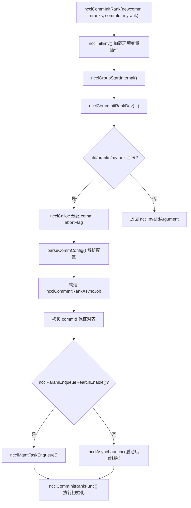
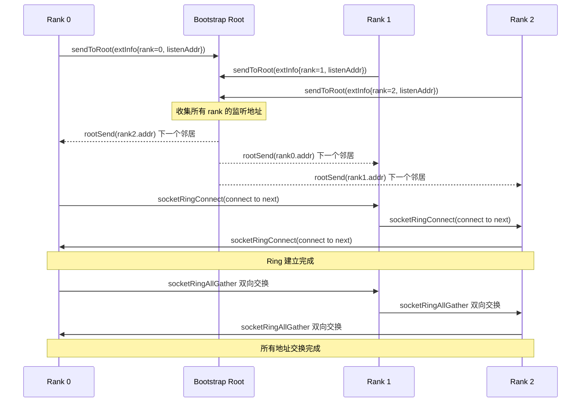
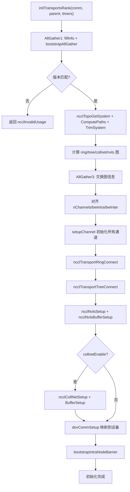

# Chapitre 3 : Entrée en jeu de l'initialisation : comment ncclCommInitRank transforme un groupe de processus isolés en un domaine de communication

Dans le chapitre précédent, nous avons établi cinq abstractions fondamentales qui traversent tout l'ouvrage : ncclComm, channel, algorithm, protocol et transport, qui constituent ensemble le vocabulaire commun de « une communication = plusieurs channels × un algorithm × un protocol × plusieurs transports ». Maintenant, nous devons répondre à une question plus fondamentale : comment cet objet ncclComm est-il construit à partir de rien ? Lorsque vous appelez ncclCommInitRank, NCCL doit accomplir en quelques centaines de millisecondes une série d'opérations complexes : confirmer que tous les ranks sont présents, échanger les informations sur les périphériques, sonder la topologie de la machine, calculer les chemins de données, allouer la mémoire GPU et la mémoire hôte, et finalement empaqueter tout cela dans un objet ncclComm. Ce chapitre suivra cette chaîne d'appels, depuis le point d'entrée de l'API jusqu'au dernier capillaire de initTransportsRank.

# 3.1 Point d'entrée de l'API : l'enveloppe synchrone et le noyau asynchrone de ncclCommInitRank

## Modèle intuitif

`ncclCommInitRank`En apparence, il s'agit de « créer un domaine de communication », mais en réalité, il s'agit de « lancer une tâche en arrière-plan, puis (par défaut) attendre qu'elle se termine ». C'est comme lorsque vous commandez au restaurant : l'action de commander (l'appel API) retourne instantanément, mais la cuisine (l'initialisation réelle) se fait en arrière-plan. Le « mode bloquant » par défaut vous fait simplement attendre au comptoir que le plat soit prêt, tandis que le « mode non bloquant » vous donne un numéro de commande, vous permettant d'aller faire autre chose en attendant.

Sans cette conception asynchrone, NCCL ne pourrait pas, pendant l'initialisation, coopérer avec des scénarios tels que la capture de CUDA Graph ou l'initialisation parallèle de plusieurs domaines de communication — toutes les initialisations deviendraient des opérations bloquantes sérialisées, impossibles à chevaucher avec le code utilisateur.

## Structures de données et disposition mémoire

Regardons d'abord le point d'entrée de l'API lui-même.`ncclCommInitRank`C'est une enveloppe synchrone extrêmement fine :

[FACT:src/init.cc:2946-2970]

Elle fait quatre choses : appeler`ncclInitEnv()`charger le plugin de variables d'environnement, activer les marqueurs de performance NVTX, lire le numéro de périphérique CUDA actuel, puis appeler`ncclGroupStartInternal()`entrer dans la sémantique de groupe, et enfin déléguer le travail réel à`ncclCommInitRankDev`。

Notez`ncclGroupStartInternal()` / `ncclGroupEndInternal()`cette paire d'appels — même si vous n'initialisez qu'un seul domaine de communication, NCCL l'enveloppe dans la sémantique de groupe. Cela permet de traiter de manière unifiée le scénario où « l'utilisateur initialise plusieurs domaines de communication dans un groupe », évitant d'écrire deux ensembles de chemins de code pour un seul domaine et pour plusieurs domaines.

La véritable validation des paramètres et l'allocation des objets se trouvent dans`ncclCommInitRankDev`:

[FACT:src/init.cc:2851-2943]

Cette fonction est le « poste de coordination central » de toute la chaîne. Elle effectue d'abord la validation des paramètres (plage de`nId`, validité de`nranks`/`myrank`), puis alloue la structure`ncclComm`elle-même, ainsi que trois champs liés au mécanisme d'abandon :`abortFlag`(drapeau atomique côté hôte),`abortFlagDev`(copie en mémoire fixe visible côté périphérique),`abortFlagRefCount`(compteur de références, car les sous-domaines de communication issus d'un split peuvent partager l'abortFlag du domaine parent).

Il y a ici un détail digne d'attention —`comm->startMagic = comm->endMagic = NCCL_MAGIC`：

[FACT:src/init.cc:2886-2886]

cette paire de valeurs magiques encadre comme un « sceau » le début et la fin de la structure`ncclComm`. Toute écriture hors limites ou corruption de la structure brisera cette paire de magic, et les opérations ultérieures pourront les vérifier pour détecter un écrasement mémoire. C'est une protection d'intégrité mémoire peu coûteuse mais efficace.

## Step-by-Step Walkthrough

Lorsque`ncclCommInitRankDev`arrive à la fin, il construit un`ncclCommInitRankAsyncJob`et lance la tâche asynchrone :

[FACT:src/init.cc:2896-2929]

`job`La structure porte tous les paramètres nécessaires à l'initialisation. Notez que`job->commId`est**copié**, plutôt que de référencer directement le`commId`：

[FACT:src/init.cc:2903-2910]

passé par l'utilisateur. Pourquoi copier ? Le commentaire du code source donne la réponse :`ncclUniqueId`et`ncclBootstrapHandle`ont des exigences d'alignement différentes ; le tableau passé par l'utilisateur peut ne pas être correctement aligné sur la frontière requise par`ncclBootstrapHandle`. Copier vers une mémoire nouvellement allouée garantit l'alignement. C'est un piège classique de « compatibilité ABI » — l'utilisateur voit`ncclUniqueId`, en interne on le traite comme`ncclBootstrapHandle`, les deux ayant la même taille mais un alignement différent.

Enfin, selon la valeur de`ncclParamEnqueueRearchEnable()`, la tâche est soit placée dans la file de gestion, soit lancée directement via`ncclAsyncLaunch`:

[FACT:src/init.cc:2922-2929]

`ncclAsyncLaunch`crée un nouveau thread qui exécute`ncclCommInitRankFunc`. En mode bloquant (par défaut), l'appelant attend dans`ncclGroupEndInternal()`que ce thread se termine ; en mode non bloquant, l'appelant retourne immédiatement, et l'utilisateur interroge ensuite l'état via`ncclCommGetAsyncError`.

## Réflexion de conception

Le cœur de la conception ici est « API synchrone + implémentation asynchrone ». Pourquoi ne pas laisser`ncclCommInitRank`exécuter directement toutes les initialisations de manière synchrone ? Parce que NCCL doit prendre en charge le mode non bloquant de`ncclCommInitRankConfig`, et le mode non bloquant exige que l'initialisation s'exécute dans un thread d'arrière-plan. Si le chemin synchrone et le chemin asynchrone étaient deux ensembles de code, le coût de maintenance doublerait. En unifiant tout en asynchrone, le chemin synchrone n'est plus que « lancer puis attendre immédiatement », et il n'y a qu'un seul code.



# 3.2 Bootstrap : le premier canal de contrôle entre les ranks

## Modèle intuitif

Le Bootstrap est le « groupe WeChat de réunion » de NCCL. Avant que la communication formelle ne commence, tous les ranks doivent d'abord établir un canal de contrôle pour échanger des métadonnées telles que « qui je suis, sur quelle machine je me trouve, quel modèle est mon GPU, quelle est l'adresse de ma carte réseau ». Sans bootstrap, les ranks sont un groupe d'inconnus qui ne se connaissent pas et ne peuvent coordonner aucune communication.

Si le bootstrap échoue ou expire, l'initialisation de tout le domaine de communication se bloquera — c'est l'une des causes les plus courantes de blocage de NCCL en production.

## Structures de données et disposition mémoire

L'état central du Bootstrap est conservé dans la structure`bootstrapState`:

[FACT:src/bootstrap.cc:527-546]

Cette structure comporte plusieurs champs clés qui méritent d'être détaillés :

- `ring`: une union, soit un handle de périphérique réseau (`net.sendComm`/`net.recvComm`), soit une paire de sockets (`socket.send`/`socket.recv`). Cela correspond à deux modes de bootstrap : le mode par défaut basé sur les sockets et le mode`NCCL_OOB_NET_ENABLE`basé sur un périphérique réseau.
- `listen`: informations sur l'écouteur, également sous deux formes : réseau et socket.
- `peerP2pAddresses` / `peerProxyAddresses`: tableau des adresses P2P et proxy de tous les ranks, rempli via ring allgather.
- `unexpectedConnections`: une liste chaînée qui met en cache les connexions « reçues mais pas encore appariées ». C'est une conception clé du protocole bootstrap — comme le récepteur ne peut pas prédire qui se connectera en premier, il doit stocker les connexions non appariées.
- `asyncSendQueue` + `asyncSendLock` + `asyncSendCond`: file d'attente d'envoi asynchrone et ses primitives de synchronisation, utilisées pour l'envoi concurrent en mode chiffrement TLS.

`bootstrapState`L'allocation de`bootstrapInit`se produit au début de

[FACT:src/bootstrap.cc:769-776]

Notez la ligne`comm->bootstrap = state`— l'état bootstrap est attaché au domaine de communication, et toutes les opérations bootstrap ultérieures y accèdent via`comm->bootstrap`.

## Step-by-Step Walkthrough

`bootstrapInit`est la fonction principale du bootstrap. Décomposons-la dans l'ordre d'exécution :

**Première étape : déterminer la valeur magic.**magic est le « mot de passe » de la communication bootstrap ; seuls les ranks possédant le même magic peuvent se connecter entre eux.

[FACT:src/bootstrap.cc:778-788]

En cas d'initialisation normale (`handles != NULL`), magic provient du premier handle ; en cas de split/grow (`parent != NULL`), magic est dérivé via`hashCombine(parent->magic, parent->childCount)`. Cela garantit que chaque sous-domaine de communication possède un magic unique.

**Deuxième étape : créer le socket d'écoute.**Chaque rank a besoin de deux points d'écoute : un pour les connexions aux voisins ring (`STATE_LISTEN(state, socket)`), un pour les connexions root (`listenSockRoot`）：

[FACT:src/bootstrap.cc:797-831]

Il y a ici une répartition clé : le socket d'écoute ring utilise`comm->magic`, tandis que le socket d'écoute root utilise`BOOTSTRAP_HANDLE(handles, curr_root)->magic`. Pourquoi ? Parce que root est le coordinateur global, tous les ranks doivent s'y connecter, donc il utilise un magic unifié ; tandis que les voisins ring sont point à point, le magic propre au domaine de communication suffit.

**Troisième étape : connexion échelonnée.**Lorsque le nombre de ranks est très élevé, tous les ranks se connectant simultanément à root provoqueraient une tempête de connexions. NCCL utilise`NCCL_UID_STAGGER_RATE`et`NCCL_UID_STAGGER_THRESHOLD`pour contrôler l'échelonnement :

[FACT:src/bootstrap.cc:833-843]

Lorsque le nombre de ranks dont un root est responsable dépasse un seuil (256 par défaut), chaque rank calcule un délai en microsecondes en fonction de son ID local sous ce root, puis dort. C'est une limitation de débit simple mais efficace de type « token bucket ».

**Quatrième étape : envoyer ses informations de connexion au root.**Chaque rank envoie son adresse d'écoute au root :

[FACT:src/bootstrap.cc:845-867]

Après avoir reçu les informations de tous les ranks, le root effectue un « appariement en anneau » — il envoie l'adresse du rank i au rank i-1, et l'adresse du rank i+1 au rank i. Ainsi, chaque rank connaît ses voisins précédent et suivant sur le ring.

**Cinquième étape : établir les connexions ring.**Chaque rank se connecte à son voisin « suivant » tout en acceptant la connexion de son voisin « précédent » :

[FACT:src/bootstrap.cc:885-894]

Ici`socketRingConnect`utilise en interne`bootstrapConcurrent`— en mode chiffrement TLS, connect et accept doivent être exécutés simultanément, sinon il y a interblocage (car la poignée de main TLS nécessite la participation des deux parties). En mode non chiffré, connect puis accept sont exécutés séquentiellement.

**Sixième étape : AllGather de toutes les adresses.**Une fois le ring établi, on effectue un allgather des adresses P2P, proxy et UDS de tous les ranks via`ringAllInfo`:

[FACT:src/bootstrap.cc:934-938]

`ringAllInfo`appelle en interne`bootstrapAllGather`, ce dernier utilisant en mode socket`socketRingAllGather`— un algorithme de ring allgather bidirectionnel, où N ranks ne nécessitent que N/2 étapes :

[FACT:src/bootstrap.cc:1363-1412]

Cet algorithme bidirectionnel est l'optimisation clé des performances du bootstrap. Le ring allgather unidirectionnel traditionnel nécessite N-1 étapes, la version bidirectionnelle réduit ce nombre de moitié. Chaque étape envoie et reçoit simultanément dans les deux directions, en utilisant`socketDoubleSendRecv`pour regrouper 4 opérations (2 envois, 2 réceptions) en un seul appel système.

## Contrôle de concurrence et interactions bas niveau

Le contrôle de concurrence du Bootstrap comporte plusieurs niveaux :

**Premier niveau : vérification d'abort.**Toutes les boucles bloquantes vérifient périodiquement abortFlag :

[FACT:src/bootstrap.cc:150-159]

`BOOTSTRAP_N_CHECK_ABORT`est fixé à 10000, ce qui signifie qu'on vérifie le drapeau abort toutes les 10000 itérations. Ce nombre est un compromis entre performance et réactivité — vérifier trop fréquemment nuit aux performances, vérifier trop rarement retarde la réponse à abort.

**Deuxième niveau : file d'attente d'envoi asynchrone.**En mode chiffrement TLS,`bootstrapSend`ne peut pas être exécuté de manière synchrone (car la poignée de main TLS nécessite la participation du récepteur), donc NCCL place les opérations d'envoi dans un thread séparé :

[FACT:src/bootstrap.cc:1161-1217]

Il y a ici un mécanisme subtil de garantie d'ordre.`bootstrapAsyncSendMain`Avant l'envoi, on vérifie si la file contient un « envoi antérieur vers le même (peer, tag) » :

[FACT:src/bootstrap.cc:1124-1152]

Pourquoi faut-il garantir l'ordre d'envoi pour un même (peer, tag) ? Les commentaires du code source l'expliquent clairement : le récepteur fait correspondre les connexions par (peer, tag), et si deux messages destinés au même (peer, tag) arrivent dans le désordre, le récepteur les fera correspondre incorrectement. Pendant l'initialisation de NVLS, plusieurs diffusions sont effectuées vers le même peer avec le même tag, donc cette garantie d'ordre est indispensable.

**Troisième couche : la file des connexions inattendues.**Le récepteur ne peut pas prédire qui se connectera en premier, donc`socketAccept`il stocke les connexions non correspondantes dans une`unexpectedConnections`liste chaînée :

[FACT:src/bootstrap.cc:1276-1300]

Cette conception résout un problème distribué classique : plusieurs ranks peuvent initier simultanément une connexion vers toi, mais ton`bootstrapRecv`ordre d'appel est fixe. Si les connexions non correspondantes étaient simplement rejetées, l'émetteur expirerait ; si l'on bloquait en attendant, un interblocage pourrait survenir. Les stocker dans une file est l'approche la plus sûre.

## Guide pour éviter les pièges en production

**Piège n°1 : un timeout de bootstrap provoque un blocage de l'initialisation.**Si un rank ne peut pas se connecter au root à cause d'un problème réseau, tous les autres ranks attendront indéfiniment sur`ncclSocketAccept`ou`ncclSocketRecv`. NCCL n'a pas de mécanisme de timeout de bootstrap intégré ; la seule voie de secours est abortFlag. En production, il est recommandé de définir`NCCL_UID_STAGGER_RATE`pour atténuer les tempêtes de connexions dans les clusters à grande échelle.

**Piège n°2 :`NCCL_COMM_ID`conflit avec les handles multiples.**Lorsque l'utilisateur définit la variable d'environnement`NCCL_COMM_ID`, NCCL force la réduction de`nId`à 1 :

[FACT:src/init.cc:2912-2921]

Cela signifie que la fonctionnalité multi-handle de`ncclCommInitRankScalable`est silencieusement désactivée. Si tu utilises l'initialisation scalable tout en définissant`NCCL_COMM_ID`, le comportement sera différent de ce que tu attends.

**Piège n°3 : interblocage en mode TLS.**En mode chiffrement TLS, si connect et accept ne s'exécutent pas en parallèle, les deux parties resteront bloquées lors de la poignée de main TLS.`bootstrapConcurrent`C'est précisément pour résoudre ce problème :

[FACT:src/bootstrap.cc:648-669]

En mode non chiffré, exécution séquentielle (send puis recv) ; en mode chiffré, un thread est lancé pour gérer send, et le thread principal gère recv.



# 3.3 commAlloc : le squelette mémoire de l'objet de domaine de communication

## Modèle intuitif

`commAlloc`est la « livraison brute » du domaine de communication — il alloue la mémoire de la structure, initialise tous les champs à des valeurs par défaut sûres, crée les objets CUDA et les primitives de synchronisation nécessaires, mais n'a pas encore rempli les informations de topologie, la configuration des canaux, les connexions de transport et autres contenus de « finition ». Si l'on compare`ncclComm`à un immeuble,`commAlloc`c'est le terrassement et le coulage de la structure,`initTransportsRank`c'est l'aménagement intérieur.

Sans l'initialisation de`commAlloc`, les accès ultérieurs du code à des champs non initialisés entraîneraient des comportements imprévisibles — par exemple, si`comm->channels[c].id`avait une valeur aléatoire, la logique d'initialisation des canaux interpréterait mal l'état des canaux.

## Structures de données et disposition mémoire

`commAlloc`La signature et la vérification initiale de

[FACT:src/init.cc:512-526]

Il vérifie d'abord la validité de`ndev`et de`rank`, puis construit deux piles mémoire (`memPermanent`et`memScoped`), définit`rank`et`nRanks`. Ces deux piles mémoire constituent l'infrastructure de gestion mémoire de NCCL —`memPermanent`est utilisé pour les allocations dont le cycle de vie est identique à celui du domaine de communication,`memScoped`est utilisé pour les allocations temporaires.

Vient ensuite la détection du périphérique CUDA :

[FACT:src/init.cc:528-531]

`cudaGetDevice`récupère le numéro du périphérique courant,`ncclCudaCompCap`récupère la capacité de calcul. Le commentaire du code source est très direct : « Try to create a CUDA object right away. If there is something wrong with the device we're on, better know it early. » — exposer les problèmes de périphérique le plus tôt possible, pour éviter de ne les découvrir qu'à la fin de l'initialisation.

Puis l'allocation ou l'héritage des ressources partagées :

[FACT:src/init.cc:533-555]

Il y a ici une branche importante : si`parent == NULL || !parent->shareResources`, on crée un nouveau`ncclSharedResources`; sinon, on hérite des ressources partagées du domaine de communication parent et on incrémente le compteur de références.`ncclSharedResources`contient les flux de périphérique, les flux hôtes, les événements de lancement, les événements scratch, etc. — ces ressources peuvent être réutilisées par les sous-domaines de communication dans les scénarios de split, évitant ainsi les créations répétées.

Notons la ligne`sharedRes->refCount = 1`— le compteur de références initial est 1, il est incrémenté à chaque partage par split, et la destruction réelle n'a lieu que lorsque la dernière référence est libérée.

Vient ensuite l'initialisation du réseau, de RMA et de GIN :

[FACT:src/init.cc:547-549]

Ces trois sous-systèmes sont respectivement responsables du transport réseau, de l'accès mémoire distant et de la communication réseau initiée par le GPU. Leur ordre d'initialisation est important —`ncclNetInit`doit précéder`ncclRmaInit`, car RMA dépend du plugin réseau.

L'initialisation du gestionnaire mémoire :

[FACT:src/init.cc:567-576]

Là encore, il y a deux chemins : partagé ou nouvellement créé.`ncclMemManager`est responsable de la gestion du pool mémoire CUDA et du cache d'enregistrement.

Marqueur d'initialisation des canaux :

[FACT:src/init.cc:607-608]

Cette ligne définit le`id`de tous les canaux à -1, indiquant « non initialisé ». Ensuite,`setupChannel`vérifiera cette valeur pour décider si une initialisation est nécessaire.

Construction des files d'interruption :

[FACT:src/init.cc:619-632]

NCCL utilise des files intrusives (intrusive queue) pour gérer diverses tâches. Ces files sont toutes construites vides lors de la phase`commAlloc`, et sont utilisées directement lors de l'ajout ultérieur de tâches.

Création du pool mémoire CUDA :

[FACT:src/init.cc:636-652]

Si le périphérique prend en charge les pools mémoire (`cudaDevAttrMemoryPoolsSupported`), on crée un pool mémoire de type pinned et on définit le seuil de libération à la valeur maximale (`~uint64_t(0)`), ce qui signifie « ne jamais libérer automatiquement ». Cela évite que le runtime CUDA récupère de la mémoire à l'insu de NCCL.

## Step-by-Step Walkthrough

Suivons un scénario d'initialisation concret : une machine avec 8 GPU, un rank par processus, initialisation normale.

1. `commAlloc(comm, NULL, 8, rank)`est appelé,`parent == NULL`。

2. La vérification passe,`comm->rank = rank`，`comm->nRanks = 8`。

3. `cudaGetDevice`renvoie le numéro du périphérique courant,`comm->compCap`est défini.

4. Création d'un nouveau`ncclSharedResources`, avec un compteur de références de 1.

5. `ncclNetInit`Initialiser le plugin réseau (peut être Socket ou IB).

6. `ncclMemManagerInit`Créer le gestionnaire de mémoire.

7. `getBusId`Obtenir l'ID du bus PCI,`ncclNvmlDeviceGetHandleByPciBusId`Obtenir le handle NVML.

8. `dmaBufSupported`Détecter le support DMA-BUF.

9. Allouer`connectSend` / `connectRecv`le tableau de bits.

10. Tous les canaux`id`définis à -1.

11. Construire toutes les files d'interruption.

12. Créer le pool de mémoire CUDA.

## Réflexions sur la conception

`commAlloc`Le design le plus intéressant dans  est le principe « échouer tôt ». Il appelle`cudaGetDevice`au début de la fonction, plutôt que d'attendre plus tard lorsqu'il a besoin des informations du périphérique. L'avantage est que si le périphérique a un problème (par exemple, s'il est monopolisé par un autre processus), l'erreur est exposée dès le début de l'initialisation, plutôt que d'être découverte après avoir alloué une grande quantité de mémoire.

Une autre conception est`preconnectNext`l'initialisation de :

[FACT:src/init.cc:598-598]

`reinterpret_cast<struct ncclComm*>(0x1)`est une valeur sentinelle utilisée pour marquer l'état de la « prochaine pré-connexion ». Cette technique d'utiliser une valeur de pointeur invalide comme marqueur d'état est courante en programmation système — elle économise plus de mémoire qu'un champ booléen supplémentaire, mais il faut faire attention à ne pas la déréférencer.

# 3.4 initTransportsRank : découverte de topologie et allocation de canaux

## Modèle intuitif

`initTransportsRank`est le « cœur » de l'initialisation. Il accomplit trois tâches majeures : échanger les informations de périphérique et de topologie de tous les ranks via deux AllGather ; calculer les structures de graphe des algorithmes ring/tree/collnet/nvls en fonction de ces informations ; enfin, établir toutes les connexions de transport. Si l'on compare le domaine de communication à un système de transport urbain,`initTransportsRank`est le processus de planification de toutes les routes, échangeurs et lignes de bus.

Sans cette étape, NCCL ne saurait pas par quel chemin les données doivent passer — il pourrait faire prendre un détour aux données, ou ne pas trouver de chemin accessible du tout.

## Structures de données et disposition mémoire

`initTransportsRank`a de très nombreuses variables locales, examinons les principales :

[FACT:src/init.cc:1163-1179]

Ici, on extrait`comm->graphs`les différentes structures de graphe du tableau pour créer des alias.`graphs`Le tableau est indexé par algorithme, noter que`nvlsGraph`est utilisé deux fois (NVLS et NVLSTree partagent la même structure de graphe).

Deux structures temporaires clés :

[FACT:src/init.cc:1181-1206]

`graphInfo`conserve les informations de graphe d'un seul rank pour un algorithme donné (nombre de canaux, bande passante, type, etc.),`allGatherInfo`est l'unité de données de l'AllGather, contenant les informations de graphe de tous les algorithmes plus les informations de rank de topologie.

## Step-by-Step Walkthrough

**Phase un : AllGather1 — échange d'informations sur les périphériques.**

[FACT:src/init.cc:1234-1239]

Chaque rank appelle`fillInfo`pour remplir son propre`ncclPeerInfo`, puis échange via`bootstrapAllGather`.`fillInfo`Les informations remplies incluent : numéro de rank, numéro de périphérique CUDA, numéro de périphérique NVML, version de NCCL, hash git, hash d'hôte, hash de processus, UUID GPU, ID de bus, taille de mémoire vidéo, version de pilote, etc.

[FACT:src/init.cc:888-982]

Noter`info->hostHash = getHostHash() + commHash`et`info->pidHash = getPidHash() + commHash`— le hash d'hôte et le hash de pid ont tous deux le commHash ajouté. C'est pour distinguer différents domaines de communication sur la même machine.

Une fois l'AllGather terminé, chaque rank parcourt les informations de tous les pairs et calcule les attributs globaux :

[FACT:src/init.cc:1250-1303]

Cette boucle fait beaucoup de choses : détecter les incompatibilités de version, compter le nombre de nœuds, calculer`cuMemSupport`l'intersection de , détecter si plusieurs ranks utilisent le même GPU, calculer l'intersection des masques de type GIN, etc. Noter`nNodes`la méthode de comptage de — il incrémente à chaque fois qu'un hostHash différent est rencontré, ce qui suppose que les ranks sont disposés de manière contiguë par nœud.

**Phase deux : découverte de topologie.**

[FACT:src/init.cc:1390-1403]

Ces six étapes constituent le processus central de la découverte de topologie :`ncclTopoGetSystem`énumère les périphériques système pour construire le graphe de topologie,`ncclTopoComputePaths`calcule les chemins GPU vers NIC,`ncclTopoTrimSystem`supprime les périphériques inaccessibles, recalcule les chemins,`ncclTopoSearchInit`initialise l'état de recherche, et enfin imprime la topologie.

**Phase trois : calcul des graphes.**

[FACT:src/init.cc:1421-1468]

Calculer séquentiellement les cinq graphes : ring, tree, collnet chain, collnet direct, nvls. Chaque graphe a des contraintes différentes de pattern et de nombre de canaux. Noter`treeGraph->minChannels = ringGraph->nChannels`— le nombre de canaux de tree est contraint d'être identique à celui de ring, afin d'assurer l'alignement des canaux entre les différents algorithmes.

**Phase quatre : AllGather3 — échange d'informations de graphe.**

[FACT:src/init.cc:1490-1533]

Chaque rank remplit ses informations de graphe dans`allGather3Data[rank]`, puis effectue à nouveau`bootstrapAllGather`. Les informations échangées cette fois incluent : pattern/nChannels/bwIntra/bwInter/typeIntra/typeInter/crossNic pour chaque algorithme, architecture CPU, nombre de canaux P2P, nombre de périphériques réseau, nombre de périphériques CollNet, etc.

Une fois l'AllGather3 terminé, chaque rank parcourt les informations de graphe de tous les pairs et prend les valeurs minimales/maximales pour aligner :

[FACT:src/init.cc:1687-1703]

Noter la stratégie d'alignement ici :`nChannels`、`sameChannels`、`bwIntra`、`bwInter`prendre le minimum,`typeIntra`、`typeInter`、`crossNic`prendre le maximum. Pourquoi ? Parce que le nombre de canaux et la bande passante sont limités par le lien le plus faible, tandis que le type et crossNic doivent être unis pour garantir la compatibilité.

**Phase cinq : établissement des connexions de transport.**

[FACT:src/init.cc:1811-1892]

Il y a deux branches ici :`runtimeConn`lorsque vrai, on ne fait que la configuration des canaux sans établir les connexions (connexion différée à l'exécution), sinon on établit immédiatement toutes les connexions. L'ordre de connexion est : ring → tree → NVLS → PAT → NVLS tree → CollNet.

## Contrôle de concurrence et interaction matérielle

`initTransportsRank`Il y a plusieurs points notables de concurrence/interaction matérielle dans :

**Configuration de l'affinité CPU :**

[FACT:src/init.cc:1406-1412]

NCCL lie le thread actuel à un cœur CPU proche du GPU, garantissant que l'allocation de mémoire hôte se fait sur le nœud NUMA local. Cela réduit la latence des accès inter-NUMA.

**Initialisation NVLS :**

[FACT:src/init.cc:1419-1419]

`ncclNvlsInit`Détection du support NVLink SHARP. NVLS permet au commutateur d'exécuter directement les opérations reduce, réduisant considérablement la latence d'AllReduce.

**Création du thread Proxy :**

[FACT:src/init.cc:1780-1786]

Le thread Proxy est responsable de la progression asynchrone des E/S réseau. Il est créé dans`initTransportsRank`, et par la suite toutes les opérations réseau passent par le proxy.

## Guide de production pour éviter les pièges

**Piège 1 : Nombre d'interfaces réseau incompatible.**Si le nombre de cartes réseau locales diffère entre les ranks, NCCL renvoie une erreur :

[FACT:src/init.cc:1576-1596]

Sauf si l'on définit`NCCL_IGNORE_NET_MISMATCH=1`. C'est courant dans les clusters hétérogènes — certains nœuds ont 8 cartes réseau, d'autres seulement 4. Ignorer cette incompatibilité peut entraîner une baisse de performance, car le nombre de canaux sera limité par le nœud le plus faible.

**Piège 2 : Plusieurs ranks partagent le même GPU.**Si deux ranks ont le même UUID de GPU, NCCL refuse l'initialisation :

[FACT:src/init.cc:1291-1296]

Sauf si l'on définit`NCCL_MULTI_RANK_GPU_ENABLE=1`. Cette vérification empêche les problèmes de performance causés par une mauvaise configuration de l'utilisateur.

**Piège 3 : Nombre de nœuds CollNet insuffisant.**CollNet nécessite au moins`NCCL_COLLNET_NODE_THRESHOLD`nœuds pour être activé :

[FACT:src/init.cc:1720-1728]

Le seuil par défaut est 2. En environnement mono-nœud, CollNet est automatiquement désactivé.



# 3.5 NCCL_PARAM : la magie à la compilation du système de variables d'environnement

## Modèle intuitif

`NCCL_PARAM`est l'« usine à commutateurs de configuration » de NCCL. Il utilise une macro pour générer une fonction à la compilation, qui lit la variable d'environnement lors du premier appel à l'exécution et met le résultat en cache. C'est comme un interrupteur d'éclairage domestique — vous actionnez le bouton (appel de la fonction), la lumière s'allume (retour de la valeur de configuration), puis l'état de l'interrupteur est mémorisé, sans avoir à le réactiver à chaque fois.

Sans ce mécanisme, NCCL devrait appeler manuellement`getenv`et analyser la chaîne à chaque endroit utilisant la configuration, rendant le code extrêmement verbeux et sujet aux erreurs.

## Structures de données et disposition mémoire

`NCCL_PARAM`Définition de la macro :

[FACT:src/include/param.h:22-31]

Cette macro génère après expansion une fonction`ncclParam##name()`, contenant trois variables statiques :

- `uninitialized = INT64_MIN`: valeur sentinelle, indiquant « pas encore initialisé ».
- `noCache`: indicateur à trois états, -1 signifie non initialisé, 0 signifie mis en cache, 1 signifie non mis en cache.
- `cache`: la valeur mise en cache, initialement`uninitialized`。

La logique de la fonction est : si`cache`est encore`uninitialized`, appeler`ncclLoadParam`pour charger ; sinon retourner directement`cache`。`COMPILER_EXPECT(..., false)`indique au compilateur que cette branche est rarement empruntée, optimisant le chemin chaud.

`ncclLoadParam`Implémentation de :

[FACT:src/misc/param.cc:78-108]

Il utilise un mutex pour protéger tout le processus de chargement, vérifie d'abord la politique`noCache`, puis vérifie si le cache est valide, ensuite lit la variable d'environnement et l'analyse. En cas d'échec d'analyse, la valeur par défaut est utilisée et un avertissement est affiché.

## Step-by-Step Walkthrough

Prenons`NCCL_PARAM(BuffSize, "BUFFSIZE", -2)`comme exemple :

[FACT:src/init.cc:1007-1007]

Après expansion de la macro, cela génère :

```cpp
int64_t ncclParamBuffSize() {
  constexpr int64_t uninitialized = INT64_MIN;
  static int8_t noCache = -1;
  static_assert(-2 != uninitialized, "...");
  static int64_t cache = uninitialized;
  if (COMPILER_EXPECT(COMPILER_ATOMIC_LOAD(&cache, std::memory_order_relaxed) == uninitialized, false)) {
    return ncclLoadParam("NCCL_BUFFSIZE", -2, uninitialized, &cache, &noCache);
  }
  return cache;
}
```

Lors du premier appel,`cache == uninitialized`, entre dans`ncclLoadParam`. Il lit la variable d'environnement`NCCL_BUFFSIZE`, et si elle n'est pas définie, retourne la valeur par défaut -2. Puis, selon la politique`noCache`, décide s'il faut mettre en cache.

`noCache`La politique est déterminée par`ncclParamIsCacheDisabled`:

[FACT:src/misc/param.cc:74-76]

Si le nom de la variable d'environnement correspond à un certain motif (par exemple se terminant par`_`), pas de mise en cache, relecture à chaque fois. Cela permet à l'utilisateur de modifier dynamiquement certaines configurations à l'exécution.

## Réflexions sur la conception

L'élégance de cette conception réside dans l'« abstraction à coût nul » : sur le chemin chaud, il n'y a qu'un chargement atomique et une comparaison, sans verrou ni analyse de chaîne. Le chemin froid (premier chargement) paie le coût complet.`COMPILER_EXPECT`indique au compilateur de placer le chemin chaud au début du cache d'instructions, améliorant encore les performances.

Une autre conception est le triple état de`noCache`. -1 signifie « pas encore décidé », 0 signifie « mis en cache », 1 signifie « non mis en cache ». Cette décision n'est prise qu'une seule fois lors du premier chargement, puis ne change plus.

## Guide de production pour éviter les pièges

**Piège 1 : Faute de frappe dans la variable d'environnement.**Si l'utilisateur écrit`NCCL_BUFSIZE`au lieu de`NCCL_BUFFSIZE`, NCCL ne signale pas d'erreur et utilise simplement la valeur par défaut. Il est recommandé d'utiliser`NCCL_DEBUG=ENV`pour afficher toutes les variables d'environnement reconnues.

**Piège 2 : Ordre de chargement de`NCCL_CONF_FILE`.**NCCL charge successivement`$NCCL_CONF_FILE`(ou`~/.nccl.conf`) et`/etc/nccl.conf`：

[FACT:src/misc/param.cc:52-67]

Les fichiers chargés plus tard écrasent ceux chargés plus tôt. Si les deux fichiers définissent la même variable,`/etc/nccl.conf`la valeur de

**prend effet.`noCache`Piège 3 : Sécurité des threads de la variable**. Le commentaire du code source dit « noCache is only load/stored within the mutex, no need for atomic » :

[FACT:src/misc/param.cc:74-76]

Cela signifie que la lecture et l'écriture de`noCache`sont protégées par le mutex, sans besoin d'opérations atomiques. Mais la lecture de`cache`est sans verrou (chemin chaud), donc un chargement atomique est utilisé.

# 3.6 devCommSetup : mapper le domaine de communication sur le périphérique

## Modèle intuitif

`devCommSetup`est la « projection côté périphérique » du domaine de communication. Les kernels GPU s'exécutent sur le périphérique et ne peuvent pas accéder directement à la structure`ncclComm`en mémoire hôte. NCCL doit donc copier les champs clés du domaine de communication dans une mémoire accessible au périphérique, formant`ncclDevComm`. C'est comme photocopier l'annuaire de l'entreprise et le placer sur le poste de chaque employé — les employés n'ont plus besoin d'aller à l'accueil demander le numéro de leurs collègues à chaque fois.

Sans`devCommSetup`, le kernel GPU ne peut pas connaître son rank, la configuration des canaux, la taille des buffers, etc., et le kernel de communication collective ne peut tout simplement pas démarrer.

## Structures de données et disposition mémoire

`devCommSetup`utilise une structure temporaire`ncclKernelCommAndChannels`pour empaqueter les données à copier vers le périphérique :

[FACT:src/init.cc:712-746]

Cette structure contient`ncclDevComm`(domaine de communication côté périphérique) et le tableau de canaux. La fonction remplit d'abord la structure temporaire avec les données côté hôte, puis effectue une copie`cudaMemcpyAsync`vers le périphérique en une seule fois.

Remplissage des champs clés :

[FACT:src/init.cc:734-746]

Noter`comm->devComm = &devCommAndChans->comm`— le`comm->devComm`côté hôte pointe vers`ncclDevComm`en mémoire du périphérique. Lors du lancement ultérieur du kernel,`comm->devComm`sera passé en paramètre.

Remplissage des informations de canal :

[FACT:src/init.cc:829-843]

Les pointeurs peers, ring, tree, collnetChain, collnetDirect, nvls de chaque canal sont copiés côté device. Attention`ring.userRanks`nécessite une`cudaMemcpyAsync`supplémentaire, car il s'agit d'un tableau.

## Step-by-Step Walkthrough

1. Obtention du flux device :`ncclStrongStreamAcquire`Obtention d'un strong stream, garantissant l'exécution ordonnée des copies asynchrones suivantes.

2. Allocation de la mémoire device :`ncclCudaCallocAsync`Allocation de`devCommAndChans`。

3. Remplissage de la structure temporaire côté hôte : définition de rank, nRanks, node, nNodes, abortFlag, buffSizes, etc.

4. Allocation et copie du tableau`rankToLocalRank`.

5. Calcul de`workFifoBytes`: déterminé selon l'état CC (Confidential Computing).

6. Allocation du buffer workFifo : en mode GDR, utiliser`ncclGdrCudaCalloc`, sinon utiliser`ncclCudaHostCalloc`。

7. Allocation des compteurs du profiler.

8. Allocation des compteurs de progression (si activés).

9. Remplissage des informations de canal.

10. Copie unique vers le device :`ncclCudaMemcpyAsync(devCommAndChans, &tmpCommAndChans, 1, deviceStream)`。

11. Libération du strong stream et synchronisation.

## Réflexions de conception

`devCommSetup`Le design le plus remarquable dans`cudaMemcpy`est la « copie par lots ». NCCL n'appelle pas`cudaMemcpyAsync`séparément pour chaque champ, mais empaquette tous les champs dans une structure temporaire, réalisant l'opération en un seul

. Cela réduit considérablement le nombre d'appels à l'API CUDA et les surcoûts de synchronisation.`workFifoBytes`Un autre design est la gestion CC de

[FACT:src/init.cc:750-763]

: en mode CC (Confidential Computing),`workFifoBytes`est mis à 0, car la copie GDR n'est pas disponible en mode CC. Il s'agit d'une dégradation élégante face à une limitation matérielle.

## Guide de production pour éviter les pièges

**Piège 1 :`devCommSetup`doit être appelé avant la barrier.**Les commentaires du code source expliquent la raison :

[FACT:src/init.cc:1950-1952]

S'il est appelé après la barrier, certains threads peuvent avoir déjà commencé à lancer le kernel NCCL, alors que la mémoire device n'est pas encore entièrement allouée, ce qui provoque un deadlock.

**Piège 2 :`workFifoBytes`doit être une puissance de 2.**Sinon, NCCL émet un avertissement et utilise la valeur par défaut :

[FACT:src/init.cc:757-762]

# Réflexions et auto-évaluation de ce chapitre

Q1 : Si l'on supprime la logique de détection « plusieurs ranks utilisent le même GPU » dans[FACT:src/init.cc:1291-1296], dans quels scénarios cela poserait-il problème ? Pourquoi NCCL refuse-t-il cette configuration par défaut ?

**Analyse de référence**：

Ce code détecte si les UUID GPU de deux ranks sur le même hôte sont identiques. S'ils sont identiques et que`NCCL_MULTI_RANK_GPU_ENABLE=0`(par défaut), il retourne`ncclInvalidUsage`。

Après suppression de cette vérification, plusieurs ranks partageraient le même GPU. Cela entraînerait :

1. **Conflits de transfert P2P**: le transfert P2P de NCCL suppose que chaque rank dispose exclusivement d'un GPU. Si deux ranks partagent un GPU, ils écrivent simultanément dans le même buffer du même GPU, provoquant des races de données et des résultats erronés.

2. **Conflits d'allocation de canaux**：`comm->channels`Les ressources de canal (buffers, FIFO) dans

3. **sont allouées par rank. Les ranks partageant un GPU se disputeraient les mêmes ressources.**Catastrophe de performance

: même sans problème de correction, deux ranks partageant la puissance de calcul et la bande passante mémoire d'un seul GPU subiraient une chute drastique de performance.`NCCL_MULTI_RANK_GPU_ENABLE=1`NCCL refuse cette configuration par défaut pour « échouer rapidement » — plutôt que de laisser l'utilisateur perdre des heures à déboguer une mauvaise configuration, il vaut mieux signaler clairement l'erreur dès l'initialisation.

est une porte de sortie destinée aux utilisateurs qui savent précisément ce qu'ils font (par exemple dans un scénario MPS).[FACT:src/bootstrap.cc:1129-1134]Q2 : Si l'on supprime la logique d'attente « d'un envoi antérieur vers le même (peer, tag) » dans

**, dans quels scénarios le récepteur ferait-il une correspondance erronée ?**：

Analyse de référence

Ce code attend dans le thread d'envoi asynchrone jusqu'à ce qu'il n'y ait plus d'envoi antérieur vers le même (peer, tag) dans la file.`socketAccept`Après suppression de cette attente, deux envois vers le même (peer, tag) pourraient s'exécuter concurremment, avec un ordre d'arrivée indéterminé chez le récepteur. Le

[FACT:src/bootstrap.cc:1291-1292]

du récepteur fait correspondre les connexions par (peer, tag) :`bootstrapSend`Si l'émetteur A appelle

en premier mais arrive en dernier, et que l'émetteur B appelle en dernier mais arrive en premier, le récepteur prendra le message de B pour la réponse de A. Cela provoque un décalage des données — le récepteur croit recevoir la réponse à la première requête, alors qu'il s'agit de la seconde.

Les commentaires du code source indiquent explicitement ce scénario : « NVLS setup broadcasts to the same peers with the same tag several times during init ». Pendant l'initialisation NVLS, des diffusions multiples vers le même peer avec le même tag ont lieu ; si l'ordre est inversé, la configuration NVLS serait complètement désordonnée.

Le coût de cette garantie d'ordre est la sérialisation des envois vers le même (peer, tag). Mais les envois vers des (peer, tag) différents restent concurrents, donc le débit global n'est pas affecté.[FACT:src/init.cc:1691-1697]Q3 : Si l'on modifie la stratégie d'alignement dans

**de « min pour nChannels, max pour typeIntra » à « tout en min » ou « tout en max », quels problèmes cela poserait-il respectivement ?**：

Analyse de référence`nChannels`、`sameChannels`、`bwIntra`、`bwInter`La stratégie actuelle est :`typeIntra`、`typeInter`、`crossNic`prendre le min,

**prendre le max.**：`typeIntra`Si tout est en min`typeInter`Prendre le min entraînerait une dégradation du type de transfert pour certains ranks. Par exemple, si le rank A prend en charge P2P (typeIntra=P2P) et que le rank B ne prend en charge que SHM (typeIntra=SHM), après avoir pris le min, tous les ranks utiliseraient SHM. Mais la valeur d'énumération de SHM peut être inférieure à celle de P2P, et prendre le min sélectionnerait un type incorrect. En réalité`typeIntra`est un masque de bits ou une énumération, et prendre le max sert à sélectionner le type « le plus capable ».

**Si l'on prend le max partout**：`nChannels`Prendre le max entraînerait l'attribution à certains ranks d'un nombre de canaux dépassant leurs capacités. Par exemple, si le rank A ne peut prendre en charge que 4 canaux et que le rank B en prend en charge 8, après avoir pris le max, tous les ranks tenteraient d'utiliser 8 canaux, et le rank A échouerait ou subirait une baisse de performance.`bwIntra`Prendre le max rendrait l'estimation de bande passante trop optimiste, et le module de tuning pourrait choisir un algorithme inadapté.

L'essence de cette stratégie d'alignement est :**Les contraintes de ressources prennent l'intersection (min), les énumérations de capacités prennent l'union (max)**. Le nombre de canaux et la bande passante sont des contraintes de « limite supérieure », il faut donc prendre la valeur la plus conservatrice ; le type de transfert est une énumération de « capacités », prendre la valeur maximale garantit que tous les ranks peuvent trouver un mode de transfert compatible.

Dans le chapitre suivant, nous approfondirons la découverte de topologie et la recherche de graphes, pour voir comment NCCL énumère les GPU, les cartes réseau et les commutateurs PCI d'une machine, construit une carte topologique complète, et recherche sur cette carte les structures ring et tree optimales. La communication bootstrap, le squelette mémoire commAlloc et le flux principal initTransportsRank établis dans ce chapitre seront détaillés un par un dans le chapitre suivant en ce qui concerne leurs détails topologiques.

Jusqu'ici, nous avons parcouru de manière complète la chaîne d'appels de ncclCommInitRank, et vu clairement tout le processus de construction de l'objet ncclComm à partir de zéro. Mais il y a un maillon clé du processus d'initialisation que nous n'avons fait qu'effleurer : comment NCCL détecte-t-il les GPU et les cartes réseau à l'intérieur d'une machine, et décide-t-il en conséquence par quel chemin les données doivent passer ? C'est précisément le sujet que le chapitre suivant approfondira — la découverte de topologie et la recherche de graphes. Nous décomposerons comment src/graph/topo.cc énumère les dispositifs PCI/NVLink/cartes réseau et construit la carte topologique, comment src/graph/search.cc recherche le chemin optimal sur cette carte, et comment src/graph/rings.cc et trees.cc concrétisent les résultats de recherche en topologies d'algorithmes Ring et Tree. Une fois ce mécanisme compris, vous comprendrez pourquoi NCCL peut automatiquement sélectionner l'algorithme approprié sur différentes machines.
