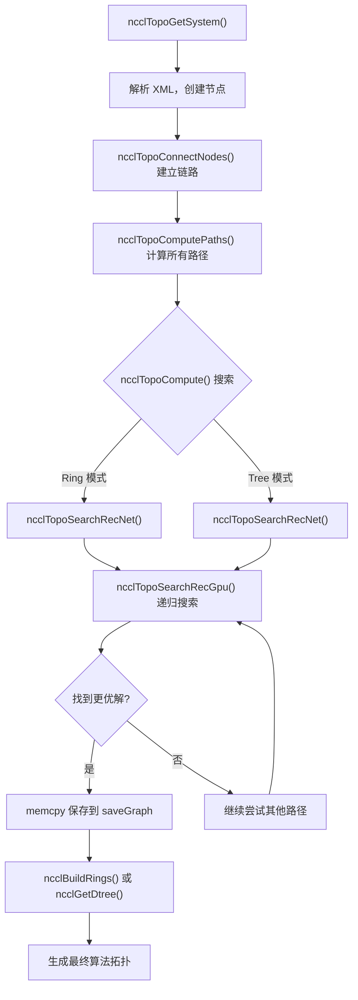
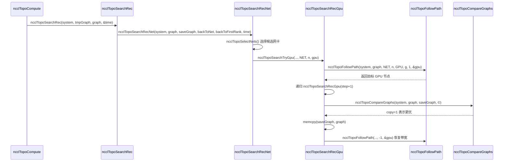

# Chapitre 4 : Découverte de topologie et recherche de graphes : comment NCCL « voit » l'interconnexion physique d'un système multi-GPU

Dans le chapitre précédent, nous avons suivi la chaîne d'appels de ncclCommInitRank en descendant couche par couche, et nous avons vu à quel moment le champ comm->topo est rempli, mais sans détailler sa structure interne. Alors, comment NCCL « voit »-il exactement les GPU et les cartes réseau d'une machine, et comment les organise-t-il en informations topologiques exploitables ? Ce chapitre décomposera les trois maillons clés de ce processus : topo.cc est chargé d'énumérer les dispositifs physiques sous forme de graphe, search.cc recherche le chemin optimal sur ce graphe, et rings.cc et trees.cc concrétisent les résultats de recherche en deux topologies d'algorithmes, Ring et Tree. Ce n'est qu'en comprenant la coopération de ces trois éléments que l'on peut saisir pourquoi NCCL peut automatiquement sélectionner l'algorithme approprié sur différentes machines.

# La carte topologique : représenter la machine comme un « plan de métro »

## Modèle intuitif

Imaginez que vous êtes un livreur venant d'arriver dans une ville inconnue. Vous devez livrer un colis du point A au point B, mais vous ne savez pas quel chemin est le plus rapide. Vous avez besoin d'une carte — sur laquelle sont indiquées toutes les stations (GPU, cartes réseau, CPU, commutateurs PCI) ainsi que les connexions entre les stations (NVLink, PCIe, réseau). La carte topologique de NCCL est cette carte.

Sans cette carte, NCCL ne pourrait que supposer aveuglément que « la bande passante est identique entre tous les GPU », ce qui pourrait encore passer sur une machine à 8 cartes entièrement interconnectées en NVLink, mais dès qu'on rencontre une topologie complexe avec NUMA croisé, commutateurs PCI croisés, ou un mélange NVLink + PCIe, il choisirait le mauvais chemin, en poussant dans le PCIe lent des données qui devraient passer par NVLink, ce qui diviserait directement les performances par deux.

## Structures de données et disposition mémoire

Le cœur de la carte topologique est`ncclTopoSystem`, qui stocke tous les dispositifs groupés par type de nœud. Les types de nœuds sont définis dans le tableau`topoNodeTypeStr`:

[FACT:src/graph/topo.cc:33-35]

```c
const char* topoNodeTypeStr[] = {"GPU", "PCI", "NVS", "CPU", "NIC", "NET", "GIN", "RMA", "DEV", "CXB"};
const char* topoLinkTypeStr[] = {"LOC", "NVL", "", "C2C", "PCI", "", "", "", "", "SYS", "NET"};
const char* topoPathTypeStr[] = {"LOC", "NVL", "NVB", "C2C", "PIX", "PXB", "P2C", "PXN", "PHB", "SYS", "NET", "DIS"};
```

Ces trois tableaux définissent respectivement les représentations sous forme de chaînes des types de nœuds, des types de liens et des types de chemins. Notez l'ordre de`topoPathTypeStr`— il sert également de classement de la qualité des chemins : plus l'indice est petit, plus le chemin est rapide.`LOC`(local) le plus rapide,`DIS`(déconnecté) le plus lent. Cet ordre sera utilisé à plusieurs reprises dans les recherches ultérieures pour comparer la qualité des chemins.

Chaque nœud est représenté par`ncclTopoNode`et est initialisé avec des champs différents selon son type lors de la création. Prenons l'exemple d'un nœud GPU :

[FACT:src/graph/topo.cc:105-141]

```c
ncclResult_t ncclTopoCreateNode(struct ncclTopoSystem* system, struct ncclTopoNode** node, int type, uint64_t id) {
  if (system->nodes[type].count == NCCL_TOPO_MAX_NODES) {
    WARN("Error : tried to create too many nodes of type %d", type);
    return ncclInternalError;
  }
  struct ncclTopoNode* n = system->nodes[type].nodes + system->nodes[type].count;
  system->nodes[type].count++;
  n->type = type;
  n->id = id;
  if (type == GPU) {
    n->gpu.dev = NCCL_TOPO_UNDEF;
    n->gpu.rank = NCCL_TOPO_UNDEF;
    n->gpu.cudaCompCap = NCCL_TOPO_UNDEF;
    n->gpu.mloPart = NCCL_TOPO_UNDEF;
  } else if (type == CPU) {
    ...
```

Voici quelques points de conception clés. Premièrement, les nœuds sont stockés dans un tableau préalloué (`system->nodes[type].nodes`), et non dans une liste chaînée. Cela signifie que les nœuds sont disposés de manière contiguë en mémoire, ce qui est favorable au cache lors du parcours. Deuxièmement,`NCCL_TOPO_MAX_NODES`est une limite stricte, au-delà de laquelle une erreur est signalée — cela vise à empêcher une croissance illimitée en cas d'anomalie topologique. Troisièmement, chaque nœud possède un champ`id`, qui est un entier de 64 bits, dont les 32 bits supérieurs correspondent au systemId (identifiant l'hôte) et les 32 bits inférieurs au localId (numéro du périphérique au sein de l'hôte).

Les connexions entre les nœuds sont représentées par`ncclTopoLink`.`ncclTopoConnectNodes`est chargé d'établir des connexions bidirectionnelles :

[FACT:src/graph/topo.cc:179-204]

```c
ncclResult_t ncclTopoConnectNodes(struct ncclTopoNode* node, struct ncclTopoNode* remNode, int type, float bw) {
  // Aggregate links into higher bw for NVLink
  struct ncclTopoLink* link;
  for (link = node->links; link - node->links != NCCL_TOPO_MAX_LINKS && link->remNode; link++) {
    if (link->remNode == remNode && link->type == type) break;
  }
  if (link - node->links == NCCL_TOPO_MAX_LINKS) {
    WARN("Error : too many Topo links (max %d)", NCCL_TOPO_MAX_LINKS);
    return ncclInternalError;
  }
  if (link->remNode == NULL) node->nlinks++;
  link->type = type;
  link->remNode = remNode;
  link->bw += bw;

  // Sort links in BW descending order
  struct ncclTopoLink linkSave;
  memcpy(&linkSave, link, sizeof(struct ncclTopoLink));
  while (link != node->links) {
    if ((link - 1)->bw >= linkSave.bw) break;
    memcpy(link, link - 1, sizeof(struct ncclTopoLink));
    link--;
  }
  memcpy(link, &linkSave, sizeof(struct ncclTopoLink));
  return ncclSuccess;
}
```

Cette fonction effectue trois choses. Premièrement, elle vérifie s'il existe déjà un lien vers la même cible et du même type — si c'est le cas, elle accumule la bande passante (`link->bw += bw`). Cela gère le cas où plusieurs NVLink sont connectés au même GPU : 4 NVLink à 25 GB/s chacun, soit 100 GB/s après agrégation. Deuxièmement, si aucun lien n'est trouvé, elle en ajoute un nouveau. Troisièmement, après insertion, les liens sont triés par bande passante décroissante, de sorte que les liens à haute bande passante soient vus en priorité lors des parcours ultérieurs.

> **[Design Inference & Architectural Trade-offs]**
> La motivation du tri par bande passante décroissante est de permettre à l'algorithme de recherche de découvrir les chemins à haute bande passante le plus tôt possible, afin de converger plus rapidement vers une meilleure solution. La recherche est soumise à une limite de temps (nous verrons plus loin`NCCL_SEARCH_TIMEOUT`), et le tri permet de consacrer le budget de temps limité aux chemins les plus prometteurs.

## Parcours pas à pas guidé par un scénario

Plaçons-nous maintenant dans un scénario concret : un serveur 8 GPU A100, chaque carte étant entièrement interconnectée via NVLink, avec en outre 4 cartes réseau Mellanox ConnectX-6 installées dans des emplacements PCIe. Lors de l'initialisation de NCCL,`ncclTopoGetSystem`est appelé ; il lit les informations des périphériques depuis un fichier XML (généré par`nvidia-topologyd`ou par NCCL lui-même), puis construit le graphe topologique.

Première étape : analyser le nœud CPU.`ncclTopoAddCpu`lit depuis le XML l'architecture, le fabricant et le modèle du CPU, puis crée le nœud CPU :

[FACT:src/graph/topo.cc:806-875]

```c
ncclResult_t ncclTopoAddCpu(struct ncclXmlNode* xmlCpu, struct ncclTopoSystem* system) {
  int numaId;
  NCCLCHECK(xmlGetAttrInt(xmlCpu, "numaid", &numaId));
  int systemId;
  NCCLCHECK(ncclGetSystemId(system, xmlCpu, &systemId));
  struct ncclTopoNode* cpu;
  NCCLCHECK(ncclTopoCreateNode(system, &cpu, CPU, NCCL_TOPO_ID(systemId, numaId)));
  ...
  for (int s = 0; s nSubs; s++) {
    struct ncclXmlNode* node = xmlCpu->subs[s];
    if (strcmp(node->name, "pci") == 0) NCCLCHECK(ncclTopoAddPci(node, system, cpu, systemId, numaId));
    if (strcmp(node->name, "nic") == 0) {
      ...
    }
  }
  return ncclSuccess;
}
```

Le nœud CPU est la racine de l'arbre topologique. Chaque CPU porte en dessous de lui un sous-arbre PCI et des nœuds NIC.`ncclTopoAddPci`traite récursivement l'arbre PCI, créant un nœud GPU lorsqu'il rencontre un GPU et un nœud NIC lorsqu'il rencontre une NIC.

Deuxième étape : ajouter les connexions NVLink. Notons que`ncclTopoAddGpu`ne lit que les propriétés de base du GPU, et le commentaire indique explicitement « Do not go any further, nvlinks will be added in a second pass » :

[FACT:src/graph/topo.cc:590-598]

```c
ncclResult_t ncclTopoAddGpu(struct ncclXmlNode* xmlGpu, struct ncclTopoSystem* system, struct ncclTopoNode* gpu) {
  NCCLCHECK(xmlGetAttrInt(xmlGpu, "rank", &gpu->gpu.rank));
  NCCLCHECK(xmlGetAttrInt(xmlGpu, "sm", &gpu->gpu.cudaCompCap));
  NCCLCHECK(xmlGetAttrInt(xmlGpu, "dev", &gpu->gpu.dev));
  NCCLCHECK(xmlGetAttrInt(xmlGpu, "gdr", &gpu->gpu.gdrSupport));
  NCCLCHECK(xmlGetAttrIntDefault(xmlGpu, "mlopart", &gpu->gpu.mlopart, NCCL_TOPO_UNDEF));
  // Do not go any further, nvlinks will be added in a second pass
  return ncclSuccess;
}
```

Pourquoi procéder en deux passes ? Parce que NVLink est une connexion entre GPU, et il faut que les nœuds GPU des deux extrémités existent déjà pour établir le lien. La première passe crée tous les nœuds, la seconde passe`ncclTopoAddNvLinks`les connecte ensuite.

Troisième étape : traiter les périphériques réseau.`ncclTopoAddNic`parcourt les sous-nœuds net/gin/rma sous la NIC et appelle respectivement les fonctions d'ajout correspondantes. Prenons l'exemple de`ncclTopoAddNet`:

[FACT:src/graph/topo.cc:461-503]

```c
static ncclResult_t ncclTopoAddNet(struct ncclXmlNode* xmlNet, struct ncclXmlNode* parent,
                                   struct ncclTopoSystem* system, struct ncclTopoNode* nic, int systemId) {
  int dev;
  NCCLCHECK(xmlGetAttrInt(xmlNet, "dev", &dev));
  int64_t netId = NCCL_TOPO_ID(systemId, dev);
  struct ncclTopoNode* net;
  NCCLCHECK(ncclTopoCreateNode(system, &net, NET, netId));
  net->net.dev = dev;
  int mbps;
  NCCLCHECKNOWARN(xmlGetAttrIntDefault(xmlNet, "speed", &mbps, 0), NCCL_GRAPH);
  if (mbps net.bw = mbps / 8000.0;
  ...
  NCCLCHECK(ncclTopoConnectNodes(nic, net, LINK_NET, net->net.bw));
  NCCLCHECK(ncclTopoConnectNodes(net, nic, LINK_NET, net->net.bw));
  return ncclSuccess;
}
```

Notons la conversion`mbps / 8000.0`: mbps désigne les mégabits par seconde ; en divisant par 8000, on obtient des GB/s (car 1 GB/s = 8000 Mbps). Si la carte réseau rapporte speed = -1 (ce qui arrive avec certaines cartes réseau virtuelles), on utilise par défaut 10000 Mbps = 1,25 GB/s.

Quatrième étape : traitement de finalisation.`ncclTopoGetSystemFromXml`Après avoir ajouté tous les nœuds et liens,

[FACT:src/graph/topo.cc:1080-1088]

```c
  NCCLCHECK(ncclTopoAddNvLinks(topNode, *topoSystem, NULL, 0));
  NCCLCHECK(ncclTopoAddC2c(topNode, *topoSystem, NULL, 0));
  NCCLCHECK(ncclTopoAddPciLinks(topNode, *topoSystem, NULL, 0));

  NCCLCHECK(ncclTopoFlattenBcmSwitches(*topoSystem));
  NCCLCHECK(ncclTopoConnectCpus(*topoSystem));
  NCCLCHECK(ncclTopoSortSystem(*topoSystem));
```

`ncclTopoFlattenBcmSwitches`traite le cas particulier des commutateurs PCIe Broadcom Gen4 — ils se présentent comme des commutateurs à deux niveaux, mais disposent en réalité de la bande passante complète, et il faut les « aplatir » pour éviter d'induire en erreur l'algorithme de recherche.`ncclTopoConnectCpus`connecte tous les nœuds CPU entre eux (les accès inter-NUMA passent par des liens SYS).`ncclTopoSortSystem`trie les liens de manière à placer les liens descendants PCI en premier, ce qui facilite le parcours.

## Réflexions de conception et pièges en production

> **[Design Inference & Architectural Trade-offs]**
> **Pourquoi utiliser XML comme format intermédiaire ?**Parce que la découverte de topologie doit être partagée entre processus — chaque rank ne sonde que les GPU qu'il gère, puis échange les XML via le bootstrap, et enfin les fusionne en une topologie complète. XML est un format texte auto-descriptif, pratique pour le débogage (on peut le dumper pour l'examiner) et pour la compatibilité de version.

**Piège n° 1 :`ncclTopoGetNode`ne signale pas d'erreur lorsqu'il ne trouve pas de nœud.**Regardez cette fonction :

[FACT:src/graph/topo.cc:95-103]

```c
ncclResult_t ncclTopoGetNode(struct ncclTopoSystem* system, struct ncclTopoNode** node, int type, uint64_t id) {
  for (int i = 0; i nodes[type].count; i++) {
    if (system->nodes[type].nodes[i].id == id) {
      *node = system->nodes[type].nodes + i;
      return ncclSuccess;
    }
  }
  return ncclSuccess;
}
```

S'il ne trouve rien, il renvoie`ncclSuccess`mais`*node`reste inchangé (l'appelant l'initialise généralement à NULL). L'appelant doit vérifier lui-même`*node == NULL`. Cette conception favorise les oublis de vérification — si l'appelant oublie de vérifier, un déréférencement ultérieur provoquera un crash.

**Piège n° 2 :`ncclTopoConnectNodes`L'accumulation de bande passante peut provoquer un débordement.**S'il existe un grand nombre de liens entre la même paire de nœuds (par exemple dans un scénario NVSwitch),`link->bw += bw`peut s'accumuler jusqu'à une valeur très élevée. Bien que la précision d'un float soit suffisante, si le nombre de liens est anormalement élevé, la logique de tri peut poser problème.

**Piège n° 3 :`ncclTopoRemoveNode`La correction des pointeurs dans**Lors de la suppression d'un nœud, tous les liens pointant vers le nœud supprimé doivent être retirés, et les pointeurs vers les nœuds situés après le nœud supprimé doivent être décalés vers l'avant :

[FACT:src/graph/topo.cc:143-177]

```c
ncclResult_t ncclTopoRemoveNode(struct ncclTopoSystem* system, int type, int index) {
  struct ncclTopoNode* delNode = system->nodes[type].nodes + index;
  for (int t = 0; t paths[t] != nullptr) {
      WARN("Cannot remove topology node %d/%lx while paths are computed", type, delNode->id);
      return ncclInternalError;
    }
    for (int n = 0; n nodes[t].count; n++) {
      struct ncclTopoNode* node = system->nodes[t].nodes + n;
      if (node == delNode) continue;
      for (int l = 0; l nlinks; l++) {
        while (l nlinks && node->links[l].remNode == delNode) {
          memmove(node->links + l, node->links + l + 1, (node->nlinks - l - 1) * sizeof(struct ncclTopoLink));
          node->nlinks--;
        }
        if (l nlinks && node->links[l].remNode->type == type && node->links[l].remNode >= delNode) {
          node->links[l].remNode--;
        }
      }
    }
  }
  ...
```

Il y a ici une subtilité :`node->links[l].remNode--`corrige les pointeurs. Comme les nœuds sont stockés dans un tableau contigu, après la suppression d'un nœud, les adresses des nœuds suivants sont toutes décalées d'un`sizeof(struct ncclTopoNode)`vers l'avant. Par conséquent, tous les pointeurs vers les nœuds situés après le nœud supprimé doivent être décrémentés de un. Cette opération dans`memmove`Exécuté auparavant, l'ordre est crucial.

# Recherche de chemin : trouver la « route optimale » sur le graphe

## Modèle intuitif

Avoir une carte ne suffit pas, il vous faut aussi un algorithme de navigation. La recherche de chemin de NCCL se divise en deux niveaux : le premier niveau est le prétraitement, qui calcule le plus court chemin entre toutes les paires de nœuds (BFS) ; le second niveau est la recherche sur graphe, qui essaie différentes structures Ring/Tree sur les résultats du prétraitement pour trouver celle avec la bande passante la plus élevée.

Sans recherche de chemin, NCCL ne pourrait que coder en dur des séquences fixes comme « GPU 0 connecté à GPU 1 connecté à GPU 2... », ce qui choisirait des chemins lents sur des topologies non uniformes.

## Structures de données et disposition mémoire

La structure de données centrale de la recherche de chemin est`ncclTopoLinkList`, qui stocke le chemin complet d'un nœud source à un nœud cible :

```c
struct ncclTopoLinkList {
  struct ncclTopoLink* list[NCCL_TOPO_MAX_HOPS];  // 路径上的链路
  int count;      // 跳数
  float bw;       // 瓶颈带宽
  int type;       // 路径类型（PATH_LOC, PATH_NVL, ...）
  int capacity;   // list 数组的容量
};
```

Chaque nœud possède un tableau`paths[type]`qui stocke les chemins vers tous les nœuds de ce type. Par exemple, le`paths[NET]`d'un nœud GPU stocke les chemins vers toutes les cartes réseau.

Le calcul de chemin est effectué par`ncclTopoSetPaths`, qui est un BFS :

[FACT:src/graph/paths.cc:52-147]

```c
static ncclResult_t ncclTopoSetPaths(struct ncclTopoNode* baseNode, struct ncclTopoSystem* system) {
  if (baseNode->paths[baseNode->type] == NULL) {
    NCCLCHECK(ncclCalloc(baseNode->paths + baseNode->type, system->nodes[baseNode->type].count));
    for (int i = 0; i nodes[baseNode->type].count; i++) baseNode->paths[baseNode->type][i].type = PATH_DIS;
  }

  // breadth-first search to set all paths to that node in the system
  struct ncclTopoNodeList nodeList;
  struct ncclTopoNodeList nextNodeList = {{0}, 0};
  nodeList.count = 1;
  nodeList.list[0] = baseNode;
  ...
  while (nodeList.count) {
    nextNodeList.count = 0;
    for (int n = 0; n type, baseNode->id, &path));
      for (int l = 0; l nlinks; l++) {
        struct ncclTopoLink* link = node->links + l;
        struct ncclTopoNode* remNode = link->remNode;
        ...
        float bw = std::min(path->bw, link->bw);
        ...
        // Update if better path type, OR same type with higher bw, OR same type/bw with strickly fewer hops.
        if (newType type || (newType == remPath->type && remPath->bw type && remPath->bw == bw && remPath->count > (path->count + 1))) {
          ...
          remPath->bw = bw;
          remPath->type = newType;
          ...
        }
      }
    }
    memcpy(&nodeList, &nextNodeList, sizeof(nodeList));
  }
  return ncclSuccess;
}
```

Le BFS part de`baseNode`et s'étend couche par couche. À chaque nouveau nœud atteint, il calcule la bande passante goulot du chemin (`std::min(path->bw, link->bw)`) et le type de chemin. Le calcul du type de chemin a quelques règles spéciales :

- Si le chemin passe par deux commutateurs PCI, le type est promu en`PATH_PXB`
- Si le chemin passe par le CPU, le type est promu en`PATH_PHB`
- Si le chemin passe par un nœud DEV et qu'il s'agit de NVLink, le type est promu en`PATH_NVB`

La condition de mise à jour est « chemin meilleur » : type meilleur, ou type identique mais bande passante plus élevée, ou type et bande passante identiques mais moins de sauts.

## Parcours pas à pas guidé par scénario

Examinons maintenant la recherche de second niveau.`ncclTopoCompute`est le point d'entrée, il essaie différentes combinaisons de paramètres et appelle`ncclTopoSearchRec`pour effectuer la recherche.

Le cœur de la recherche est la fonction récursive`ncclTopoSearchRecGpu`. Elle part d'un GPU, essaie d'atteindre le GPU suivant, jusqu'à parcourir tous les GPU pour former un chemin :

[FACT:src/graph/search.cc:639-756]

```c
ncclResult_t ncclTopoSearchRecGpu(struct ncclTopoSystem* system, struct ncclTopoGraph* graph,
                                  struct ncclTopoGraph* saveGraph, struct ncclTopoNode* gpu, int step, int backToNet,
                                  int backToFirstRank, int forcedOrder, int* time) {
  if ((*time) nChannels++;
    NCCLCHECKGOTO(ncclTopoCompareGraphs(system, graph, saveGraph, ©), ret, exit);
    if (copy) {
      memcpy(saveGraph, graph, sizeof(struct ncclTopoGraph));
      if (graph->nChannels == graph->maxChannels) *time = -1;
    }
    if (graph->nChannels maxChannels) {
      NCCLCHECKGOTO(ncclTopoSearchRec(system, graph, saveGraph, time), ret, exit);
    }
    graph->nChannels--;
    ret = ncclSuccess;
    goto exit;
  }
  graph->intra[graph->nChannels * ngpus + step] = gpu->gpu.rank;
  g = gpu - system->nodes[GPU].nodes;
  if (step == backToNet) {
    // first get back to NIC
    ...
  } else if (graph->pattern == NCCL_TOPO_PATTERN_NVLS) {
    ...
  } else if (step nodes[GPU].count - 1) {
    // Go to next GPU
    ...
  } else if (step == backToFirstRank) {
    // Find first GPU and loop back to it
    ...
  } else {
    // Next path
    NCCLCHECKGOTO(ncclTopoSearchRecGpu(system, graph, saveGraph, gpu, ngpus, -1, -1, forcedOrder, time), ret, exit);
  }
  ...
}
```

Cette fonction a plusieurs branches clés :

1. **`step == ngpus`**: tous les GPU ont été parcourus, formant un chemin complet. À ce moment, on incrémente`nChannels`, on compare le graphe actuel avec le meilleur graphe sauvegardé, et si meilleur on le sauvegarde. Puis on appelle récursivement`ncclTopoSearchRec`pour essayer de rechercher le channel suivant.

2. **`step == backToNet`**: il faut revenir à la carte réseau. Cela se produit en mode Ring (le dernier GPU doit se reconnecter à la carte réseau de départ) ou en mode Tree (le premier GPU doit se connecter à la carte réseau).

3. **`step < ngpus - 1`**: continuer vers le GPU suivant. Ici on appelle`ncclTopoSearchNextGpuSort`pour trier les GPU candidats.

4. **`step == backToFirstRank`**: en mode Ring, le dernier GPU doit se reconnecter au premier GPU.

5. **`else`**: le chemin se termine, on passe au tour suivant.

`ncclTopoSearchNextGpuSort`détermine l'ordre d'essai des GPU suivants :

[FACT:src/graph/search.cc:254-327]

```c
ncclResult_t ncclTopoSearchNextGpuSort(struct ncclTopoSystem* system, struct ncclTopoGraph* graph,
                                       struct ncclTopoNode* gpu, int* next, int* countPtr, int sortNet) {
  const uint64_t flag = 1ULL nChannels);
  int ngpus = system->nodes[GPU].count;
  struct ncclTopoLinkList* paths = gpu->paths[GPU];
  ...
  for (int i = 1; i nodes[GPU].nodes[g].used & flag) continue;
    scores[count].g = g;
    scores[count].startIndex = i;
    scores[count].intraNhops = paths[g].count;
    scores[count].intraBw = paths[g].bw;
    if (netPaths) {
      scores[count].interNhops = netPaths[g].count;
      scores[count].interPciBw = gpuPciBw(system->nodes[GPU].nodes + g);
      scores[count].interBw = netPaths[g].bw;
    }
    count++;
  }

  // Sort GPUs
  qsort(scores, count, sizeof(struct ncclGpuScore), cmpScore);
  ...
}
```

Il attribue un score à chaque GPU candidat, la règle de tri est : d'abord comparer interBw (bande passante vers la carte réseau), puis interPciBw, puis interNhops, puis intraBw, et enfin intraNhops. Cette priorité reflète l'objectif d'optimisation de NCCL : la communication inter-machines est le goulot d'étranglement, donc on privilégie les GPU avec une bande passante élevée vers la carte réseau.

## Réflexions de conception et pièges en production

**Pourquoi la recherche a-t-elle un timeout ?**Regardez ces constantes :

[FACT:src/graph/search.cc:329-330]

```c
#define NCCL_SEARCH_GLOBAL_TIMEOUT (1ULL count, bw, &step));
  if (step count) goto rewind;
  // Enough bandwidth : return destination node.
  graph->nHops += mult * path->count;
  *node = system->nodes[type2].nodes + index2;
  return ncclSuccess;
rewind:
  // Not enough bandwidth : rewind and exit.
  NCCLCHECK(followPath(path, node1, step, -bw, &step));
  return ncclSuccess;
}
```

`followPath`Copier`bw`modifie le`followPath`de chaque lien sur le chemin (déduction de la bande passante déjà utilisée). Si la recherche échoue, il faut appeler`-bw`avec

**pour restaurer. Ce modèle « déduction-restauration » est très propice aux erreurs dans une recherche récursive — si une branche oublie de restaurer, les recherches suivantes verront une bande passante erronée.`ncclTopoCompareGraphs`Piège deux :**La logique de comparaison de`nChannels * bwIntra`est très subtile.

[FACT:src/graph/search.cc:446-477]

```c
ncclResult_t ncclTopoCompareGraphs(struct ncclTopoSystem* system, struct ncclTopoGraph* graph,
                                   struct ncclTopoGraph* refGraph, int* copy) {
  // 1. Try to get the same nChannels between Rings and Trees
  if (graph->nChannels minChannels) return ncclSuccess;
  const bool evenReference = refGraph->nChannels > 0 && !(refGraph->nChannels & 1);
  const bool evenReferenceIsBetter = refGraph->nChannels * refGraph->bwIntra >= graph->nChannels * graph->bwIntra;
  // Favor an even number of channels when aggregate bandwidth is equal or better.
  if (graph->pattern != NCCL_TOPO_PATTERN_NVLS && evenReference && (graph->nChannels & 1) &&
      graph->nChannels nodes[NET].count && evenReferenceIsBetter)
    return ncclSuccess;
  ...
```

> **[Design Inference & Architectural Trade-offs]**
> Copier

# 〔Inférence de conception et compromis architecturaux〕

## Pourquoi préférer les channels pairs ? Parce que l'algorithme Ring s'apparie mieux avec un nombre pair de channels — chaque channel peut être divisé en deux moitiés, une dans le sens horaire et une dans le sens antihoraire, réduisant la congestion réseau.

Ring et Tree : transformer les résultats de recherche en topologie algorithmique

Modèle intuitif

## L'algorithme de recherche trouve un ensemble de chemins, mais l'algorithme a besoin d'un ordre explicite de « qui envoie à qui ». Ring enchaîne tous les ranks en un anneau, chaque rank reçoit du précédent et envoie au suivant. Tree est un arbre, les données descendent depuis la racine ou remontent depuis les feuilles.

Sans ces deux modules, l'algorithme de recherche ne trouverait qu'un tas de chemins, sans pouvoir indiquer au kernel GPU comment envoyer concrètement les données.`ncclBuildRings`Structures de données et disposition mémoire

[FACT:src/graph/rings.cc:29-74]

```c
ncclResult_t ncclBuildRings(int nrings, int* rings, int rank, int nranks, int* prev, int* next) {
  ncclResult_t ret = ncclSuccess;
  uint64_t* rankFound;
  int rankFoundSize = DIVUP(nranks, 64);
  NCCLCHECK(ncclCalloc(&rankFound, rankFoundSize));

  for (int r = 0; r  0 so it has to be our child 1, not 0.
    *d1 = nranks > 1 ? bit >> 1 : -1;
    return ncclSuccess;
  }

  up = (rank ^ bit) | (bit = nranks) up = (rank ^ bit);
  *parentChildType = (rank > 1;
  // down0 is always within bounds
  down0 = lowbit == 0 ? -1 : rank - lowbit;

  down1 = lowbit == 0 ? -1 : rank + lowbit;
  // Make sure down1 is within bounds
  while (down1 >= nranks) {
    down1 = lowbit == 0 ? -1 : rank + lowbit;
    lowbit >>= 1;
  }
  *d0 = down0;
  *d1 = down1;

  return ncclSuccess;
}
```

:`bit`Copier`(rank ^ bit) | (bit << 1)`Cette fonction construit un arbre binaire avec des opérations bit à bit. L'idée centrale est : trouver le bit non nul le plus bas`rank - (bit >> 1)`du rank, le nœud parent est`rank + (bit >> 1)`, le fils gauche est

## , le fils droit est

Prenons l'exemple d'un Ring à 8 cartes. Supposons que les résultats de recherche donnent pour chaque rank le`next`pointeur :

```
rank 0 -> rank 1
rank 1 -> rank 2
...
rank 7 -> rank 0
```

`ncclBuildRings`En partant du rank 0, on visite successivement 1, 2, ..., 7, puis on revient à 0. Généré`rings[0..7] = {0, 1, 2, 3, 4, 5, 6, 7}`。

Pour Tree,`ncclGetBtree`on calcule le nœud parent et les nœuds enfants pour chaque rank. Prenons le rank 1 comme exemple :

- `bit`= 1 (le bit non nul le plus bas est le bit 0)
- `up = (1 ^ 1) | (1 << 1) = 0 | 2 = 2`
- `up >= nranks`? 2 < 8, donc`up = 2`
- `parentChildType = (1 < 2) ? 0 : 1 = 0`(c'est le premier enfant du nœud parent)
- `lowbit = 0`, donc`down0 = -1`
- `down1 = -1`

Donc le nœud parent du rank 1 est le rank 2, et il n'a pas de nœuds enfants. Cela correspond à la structure de l'arbre dans les commentaires : le rank 1 est une feuille.

## Réflexions de conception et pièges en production

> **[Design Inference & Architectural Trade-offs]**
> **Pourquoi Tree utilise-t-il des opérations bit à bit au lieu de construire explicitement l'arbre ?**Parce que chaque rank n'a besoin de connaître que son nœud parent et ses nœuds enfants, sans nécessiter la structure globale de l'arbre. Les opérations bit à bit permettent de calculer ces informations en temps O(1), évitant ainsi les coûts de stockage et de synchronisation de l'arbre entier.

**Piège 1 :`ncclBuildRings`La vérification de peut être ignorée.**Si le`next`tableau contient un cycle (par exemple rank 0 -> rank 1 -> rank 0), la boucle se terminera après`nranks`itérations, mais`current != rank`la vérification capturera ce problème. Cependant, si la longueur du cycle est exactement un`nranks`facteur de , et ne contient pas tous les ranks,`rankFound`la vérification capturera.

**Piège 2 :`ncclGetDtree`Le traitement des ranks impairs dans .**Pour un nombre impair de ranks, le second arbre est un « décalage » plutôt qu'un « miroir » :

[FACT:src/graph/trees.cc:90-112]

```c
ncclResult_t ncclGetDtree(int nranks, int rank, int* s0, int* d0_0, int* d0_1, int* parentChildType0, int* s1,
                          int* d1_0, int* d1_1, int* parentChildType1) {
  // First tree ... use a btree
  ncclGetBtree(nranks, rank, s0, d0_0, d0_1, parentChildType0);
  // Second tree ... mirror or shift
  if (nranks % 2 == 1) {
    // shift
    int shiftrank = (rank - 1 + nranks) % nranks;
    ...
  } else {
    // mirror
    int u, d0, d1;
    ncclGetBtree(nranks, nranks - 1 - rank, &u, &d0, &d1, parentChildType1);
    *s1 = u == -1 ? -1 : nranks - 1 - u;
    ...
  }
  return ncclSuccess;
}
```

Le Double Tree (arbre double) est l'implémentation de l'algorithme Tree de NCCL — deux arbres fonctionnent simultanément, l'un responsable de la première moitié des données, l'autre de la seconde moitié, améliorant ainsi l'utilisation de la bande passante. Avec un nombre impair de ranks, le miroir entraînerait un mappage incomplet des ranks, c'est pourquoi on utilise un décalage.

# La coordination des trois : de la topologie à l'algorithme

Relions maintenant les trois modules. L'ensemble du processus peut être représenté par un schéma :



Ce schéma illustre le processus complet, de la découverte de la topologie à la génération de l'algorithme. Notez que`ncclTopoSearchRecGpu`est une fonction récursive qui essaie continuellement différents ordres de GPU jusqu'à expiration du délai ou jusqu'à trouver la solution optimale.

Regardons un diagramme de séquence plus fin, illustrant les interactions entre les modules pendant le processus de recherche :



Ce diagramme de séquence montre la boucle centrale de la recherche : sélectionner la carte réseau -> essayer le GPU -> recherche récursive -> comparer les résultats -> restaurer la bande passante.

# Résumé de ce chapitre

Ce chapitre a décomposé les trois étapes de la topologie consciente de NCCL :

1. **Découverte de la topologie**（`topo.cc`) : lire les informations des périphériques depuis le XML, créer les nœuds GPU/CPU/PCI/NIC, établir les liens NVLink/PCIe/réseau, formant ainsi un graphe topologique complet.

2. **Recherche de chemin**（`search.cc` + `paths.cc`) : d'abord précalculer les chemins les plus courts entre toutes les paires de nœuds avec BFS, puis utiliser une recherche récursive pour essayer différentes structures Ring/Tree et trouver la solution offrant la bande passante la plus élevée.

3. **Génération de la topologie de l'algorithme**（`rings.cc` + `trees.cc`) : convertir les résultats de recherche en un ordre de ranks spécifique. Ring utilise`ncclBuildRings`pour générer un anneau, Tree utilise`ncclGetBtree`pour générer un arbre binaire.

# Réflexions et auto-évaluation de ce chapitre

Q1 : Si l'on remplace dans`ncclTopoConnectNodes`l'accumulation de bande passante`link->bw += bw`par`link->bw = std::max(link->bw, bw)`, dans quels scénarios cela entraînerait-il une baisse de performance ? Pourquoi ?

**Analyse de référence**: L'accumulation de bande passante traite le cas de plusieurs liens parallèles. Prenons l'exemple de 4 NVLink à 25 GB/s chacun : après accumulation, on obtient 100 GB/s, alors qu'avec max on n'obtient que 25 GB/s. Dans`ncclTopoSetPaths`, la bande passante du chemin est`std::min(path->bw, link->bw)`. Si la bande passante d'un lien est sous-estimée, la bande passante de tout le chemin sera sous-estimée. Cela conduira`ncclTopoCompareGraphs`à choisir un mauvais graphe — il pourrait choisir une solution avec plus de canaux mais une bande passante inférieure par canal, ce qui donnerait en réalité de moins bonnes performances. Scénario concret : 8 cartes A100 entièrement interconnectées par NVLink, avec 4 NVLink entre chaque paire de GPU. L'accumulation donne 100 GB/s, le max donne 25 GB/s. L'algorithme de recherche considérerait alors que NVLink et PCIe Gen4 x16 (environ 25 GB/s) ont la même bande passante, et pourrait choisir un chemin passant par PCIe.

Q2: `ncclTopoSearchRecGpu`Dans`(*time)--`s'exécute à l'entrée de la fonction. Si la recherche expire (`*time <= 0`), la fonction retourne directement. Dans quels cas cette conception peut-elle faire entrer la recherche dans une boucle infinie ? Comment corriger cela ?

**Analyse de référence**：`(*time)--`est décrémenté à l'entrée. Si`*time`a une valeur initiale de 0 ou négative, la fonction retourne directement sans décrémenter. Mais si`*time`est un grand nombre positif, chaque récursion le décrémente, et il finira par atteindre 0. Le problème est le suivant : si la profondeur de récursion d'une branche est très grande, mais qu'après chaque décrémentation`*time`reste supérieur à 0, la recherche continue. Le vrai risque est la boucle`ncclTopoSearchRec`dans`goto search`— si`time`n'est pas correctement réinitialisé dans la boucle, cela peut boucler indéfiniment. Regardons la logique`ncclTopoCompute`dans`globalTimeout`:`globalTimeout -= time`s'exécute à chaque`search`étiquette. Si`globalTimeout`devient négatif, cela`goto done`. Mais si`time`est réinitialisé à`NCCL_SEARCH_TIMEOUT`，`globalTimeout`il pourrait ne jamais devenir négatif. La correction consiste à s'assurer que`globalTimeout`est décrémenté après chaque recherche, et qu'il existe une limite supérieure stricte.

Q3: `ncclTopoFollowPath`est appelé en cas d'échec de la recherche pour`followPath(path, node1, step, -bw, &step)`restaurer la bande passante. Si une branche récursive retourne avant la restauration (par exemple`NCCLCHECKGOTO`saute à`exit`), que se passe-t-il ? Comment détecter ce problème ?

**Analyse de référence**: Si la restauration est ignorée, la bande passante des liens sur le chemin restera dans l'état déduit. Les recherches suivantes verront une bande passante erronée et pourraient manquer la solution optimale. Méthode de détection : dans`ncclTopoCompute`Une fois terminé, parcourir tous les liens et vérifier si la bande passante correspond à la valeur initiale. Si une incohérence est détectée, cela indique qu'une restauration a été omise. Méthode de correction : utiliser un objet garde de style RAII qui restaure automatiquement la bande passante lors de sa destruction. Alternativement, sauvegarder un instantané de la bande passante de tous les liens avant chaque recherche, puis restaurer après la recherche. L'approche actuelle de NCCL consiste à, à chaque`ncclTopoFollowPath`point d'appel, apparier manuellement les appels directs et inverses, ce qui est sujet aux erreurs. Une conception plus robuste consisterait à encapsuler la déduction et la restauration de la bande passante dans une fonction, garantissant ainsi qu'elles apparaissent par paires.

Dans le prochain chapitre, nous approfondirons le module tuning pour voir comment NCCL, en fonction des résultats de recherche topologique et de la taille des messages, effectue le choix final entre les algorithmes Ring, Tree, CollNet, etc. Le graphe topologique, les résultats de recherche de chemin et les modèles d'algorithmes établis dans ce chapitre serviront d'entrées au module tuning.

Grâce à la construction du graphe dans topo.cc, à la recherche de chemin dans search.cc, ainsi qu'à la génération de topologies dans rings.cc et trees.cc, NCCL met en œuvre une philosophie de conception qui consiste à décrire n'importe quelle topologie avec une structure de graphe générique, à trouver la solution optimale avec un algorithme de recherche configurable, et à générer l'algorithme final avec des modèles simples. Ce mécanisme permet à NCCL de sélectionner automatiquement l'algorithme approprié sur diverses machines, depuis une station de travail à 2 GPU jusqu'à un cluster de 10 000 GPU. Cependant, le graphe topologique ne fournit que des chemins candidats pour les algorithmes ; déterminer quel chemin emprunter et quel protocole utiliser pour une communication donnée nécessite des décisions plus fines. Dans le prochain chapitre, nous nous concentrerons sur le répertoire src/tuning pour voir comment le module tuning combine le modèle de coût et l'estimation des algorithmes afin de faire le choix final entre Ring/Tree/NVLS/PAT et LL/LL128/Simple.
