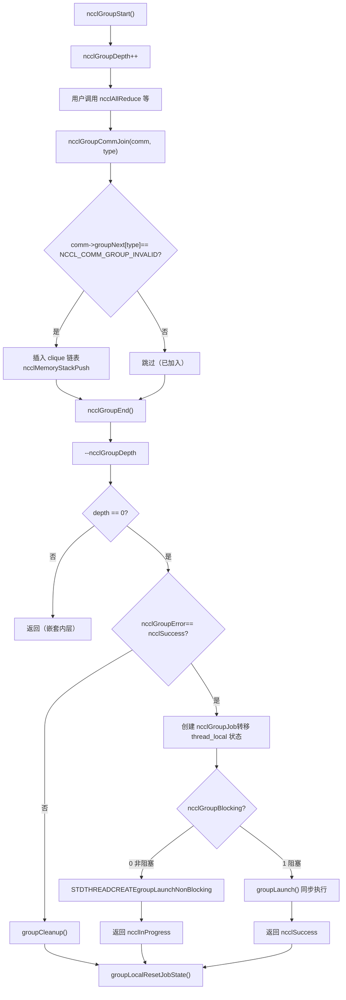
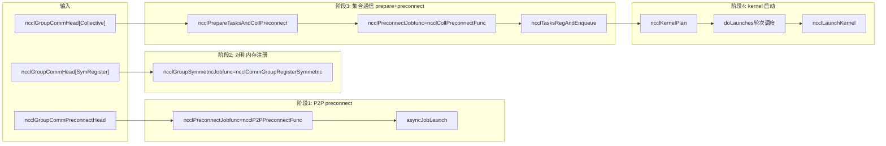

# Chapitre 7 : Ordonnanceur de tâches : comment task_sched orchestre l'ordre d'exécution multi-channel et multi-kernel

Dans le chapitre précédent, nous avons suivi ncclAllReduce jusqu'à ncclTaskColl — l'objet de description de tâche réside désormais dans comm->planner. Mais la description de tâche n'est qu'un « bon de travail », elle n'est pas encore devenue un kernel réellement exécuté sur le GPU. Ce chapitre répond à trois questions : comment plusieurs appels API sont-ils accumulés puis soumis ensemble ? Comment les tâches accumulées sont-elles réparties sur plusieurs channels ? Par quoi l'ordre et les dépendances entre plusieurs kernels sont-ils garantis ? Commençons par un modèle mental global. Imaginez NCCL comme un restaurant : ncclGroupStart/ncclGroupEnd est le « panier », l'utilisateur y dépose plusieurs plats (plusieurs appels de communication collective) ; ncclGroupEnd est la « commande », la cuisine ne commence à préparer les plats qu'à partir de la commande. Et doLaunches est le « dispatcheur de plats », il décide quels plats sont servis en premier et lesquels peuvent être préparés en parallèle. Sans la sémantique de groupe, chaque plat est commandé séparément, et la cuisine doit rallumer le feu (lancer le kernel) à chaque plat, ce qui coûte extrêmement cher ; sans l'ordonnancement par tours de doLaunches, les kernels multi-channel démarreraient dans le désordre, brisant les dépendances de données.

# I. État global de la sémantique de groupe : variables thread_local et modèle du « panier »

## Modèle intuitif

`ncclGroupStart`et`ncclGroupEnd`Tous les appels de communication entre ne lancent pas immédiatement le kernel, mais sont « accumulés ». Où sont-ils accumulés ? Dans des variables globales**locales au thread (thread_local)**. Pourquoi thread_local ? Parce que NCCL suppose que les appels de groupe au sein d'un même thread sont séquentiels, et que différents threads ont chacun leur propre panier, sans interférence mutuelle. Si ces états étaient des variables globales plutôt que thread_local, deux threads appelant simultanément`ncclGroupStart`se marcheraient dessus, entraînant la soumission des tâches d'un thread par le`ncclGroupEnd`d'un autre thread — ce serait catastrophique.

## Structures de données et disposition mémoire

Regardons d'abord la définition de l'état global du groupe.

[FACT:src/group.cc:34-34]

```cpp
thread_local int ncclGroupDepth = 0; // depth of ncclGroupStart nesting
thread_local ncclResult_t ncclGroupError = ncclSuccess;
thread_local struct ncclComm* ncclGroupCommHead[ncclGroupTaskTypeNum] = {nullptr};
thread_local struct ncclComm* ncclGroupCommPreconnectHead = nullptr;
thread_local struct ncclIntruQueue ncclAsyncJobs;
thread_local int ncclGroupBlocking = -1; /* default mode */
```

Décomposition champ par champ :

- **`ncclGroupDepth`**: profondeur d'imbrication.`ncclGroupStart`peut être appelé de manière imbriquée (bien que rare), chaque`ncclGroupStart`incrémente de un,`ncclGroupEnd`décrémente de un. La soumission réelle n'a lieu que lorsque le compteur atteint 0. C'est comme un panier qui peut être imbriqué — vous ouvrez un sous-panier dans un panier, et la commande n'est réellement passée qu'au moment du règlement du panier le plus externe.
- **`ncclGroupError`**: si un appel quelconque au sein du groupe échoue, l'erreur est enregistrée ici et traitée uniformément lors du`ncclGroupEnd`. Cela évite l'état incohérent où « après l'échec d'un appel, les appels suivants continuent d'ajouter des éléments au panier ».
- **`ncclGroupCommHead[ncclGroupTaskTypeNum]`**: têtes de liste chaînée des domaines de communication groupés par type de tâche.`ncclGroupTaskTypeNum`est le nombre de types de tâches (communication collective, tâches brutes, tâches de gestion, enregistrement symétrique, etc.). Chaque type a une liste chaînée, dont les nœuds sont des`ncclComm`, reliés par`comm->groupNext[type]`. Pourquoi grouper par type ? Parce que différents types de tâches ont des moments de soumission et des relations de dépendance différents — les tâches de communication collective nécessitent d'abord un preconnect, les tâches de gestion (comme destroy) doivent être exécutées en dernier.
- **`ncclGroupCommPreconnectHead`**: liste chaînée des domaines de communication nécessitant une préconnexion. La préconnexion consiste à « établir les connexions réseau à l'avance », pour éviter la latence causée par l'établissement de connexions au moment du lancement du kernel.
- **`ncclAsyncJobs`**: file de tâches asynchrones. Certaines tâches (comme`ncclCommInitRank`) sont asynchrones, elles sont placées dans cette file et lancées uniformément lors du`ncclGroupEnd`.
- **`ncclGroupBlocking`**: indicateur de mode bloquant.`-1`signifie pas encore déterminé,`0`signifie non bloquant,`1`indique un blocage. Au sein d'un même groupe, il n'est pas permis de mélanger des domaines de communication bloquants et non bloquants, sinon une erreur est signalée.

Il y a ici une conception clé :`ncclGroupCommHead`est**un tableau**, chaque élément étant une liste chaînée. Les nœuds de la liste sont chaînés via`comm->groupNext[type]`, plutôt que d'utiliser une structure de nœud de liste indépendante. Cela signifie que`ncclComm`la structure doit réserver un champ tableau`groupNext`. Cette conception de « liste chaînée intrusive » évite une allocation mémoire supplémentaire, mais au prix d'une`ncclComm`structure plus volumineuse.

## Parcours pas à pas guidé par scénario

**Scénario**: l'utilisateur appelle`ncclGroupStart()`, puis appelle consécutivement deux fois`ncclAllReduce`(respectivement pour deux domaines de communication différents commA et commB), et enfin appelle`ncclGroupEnd()`。

**Première étape :`ncclGroupStart`qu'a-t-il fait ?**

[FACT:src/include/group.h:63-66]

```cpp
inline ncclResult_t ncclGroupStartInternal() {
  ncclGroupDepth++;
  return ncclSuccess;
}
```

Extrêmement simple : incrémenter la profondeur de un. Aucune allocation mémoire, aucun verrou, aucun appel système. C'est pourquoi`ncclGroupStart`a un coût quasi nul.

**Deuxième étape :`ncclAllReduce`que se passe-t-il lorsqu'il est appelé au sein d'un groupe ?**

`ncclAllReduce`appelle en interne`ncclGroupCommJoin(comm, ncclGroupTaskTypeCollective)`, ajoutant le domaine de communication à la liste chaînée du groupe.

[FACT:src/include/group.h:80-116]

```cpp
inline void ncclGroupCommJoin(struct ncclComm* comm, int type) {
  if (comm->groupNext[type] == reinterpret_cast(NCCL_COMM_GROUP_INVALID)) {
    // Insert comm into ncclGroupCommHead adjacent to sibling comms. This preserves
    // the users program order yet insures siblings occur consecutively. This
    // is required by doLaunches() in "group.cc".
    struct ncclComm** pp = &ncclGroupCommHead[type];
    while (*pp != nullptr && comm->intraComm0 != (*pp)->intraComm0) pp = &(*pp)->groupNext[type];

    // didn't find its clique, we need to insert it with ascending order based on commHash
    if (*pp == nullptr) {
      pp = &ncclGroupCommHead[type];
      while (*pp != nullptr && (*pp)->commHash commHash) pp = &(*pp)->groupNext[type];
    }
    comm->groupNext[type] = *pp;
    *pp = comm;
    // Comms gets a new memory stack scope upon joining. Each task batched for
    // this comm is allocated there.
    if (type == ncclGroupTaskTypeCollective || type == ncclGroupTaskTypeRawTask) {
      // Initialize planner
      ncclMemoryStackPush(&comm->memScoped);
      ncclKernelPlanner::Peer* tmp = comm->planner.peers;
      ncclIntruQueue* tmpRmaQueues = comm->planner.rmaTaskQueues;
      int numRmaCtx = comm->config.numRmaCtx;
      memset(&comm->planner, 0, sizeof(comm->planner));
      comm->planner.peers = tmp;
      comm->planner.bcast_info.minBcastPeer = INT_MAX;
      comm->planner.bcast_info.maxBcastPeer = INT_MIN;
      comm->planner.rmaTaskQueues = tmpRmaQueues;
      if (comm->planner.rmaTaskQueues != NULL) {
        for (int i = 0; i planner.rmaTaskQueues[i]);
        }
      }
    }
  }
  ncclGroupBlocking = comm->config.blocking;
}
```

Ce code présente plusieurs subtilités :

1. **Vérification d'idempotence**：`if (comm->groupNext[type] == NCCL_COMM_GROUP_INVALID)`garantit qu'un même domaine de communication n'est ajouté qu'une seule fois dans un même groupe. Si l'utilisateur appelle deux fois`ncclAllReduce`pour le même comm, la deuxième fois n'ajoutera pas à nouveau dans la liste chaînée, mais la tâche sera ajoutée à`comm->planner`.

2. **Tri par clique**：`intraComm0`est l'identifiant d'une « entité globale ». Si plusieurs domaines de communication appartiennent à la même entité globale (par exemple issus d'une division via`ncclCommSplit`), leur`intraComm0`est identique, et ils sont appelés un clique. Le code recherche d'abord le clique par`intraComm0`, et insère le comm à côté des nœuds frères du même clique. Si aucun clique n'est trouvé, il insère par ordre croissant de`commHash`. Ce tri vise à ce que`doLaunches`puisse correctement gérer la synchronisation barrier au sein du clique.

3. **Portée de la pile mémoire**：`ncclMemoryStackPush(&comm->memScoped)`alloue une nouvelle portée de pile mémoire pour ce comm dans le groupe. Toutes les tâches allouées pour ce comm (`ncclTaskColl`, etc.) sont allouées depuis cette pile.`ncclGroupCommLeave`effectue`ncclMemoryStackPop`pour libérer en une seule fois toute la mémoire des tâches — c'est l'optimisation classique « allocation par lots, libération par lots », évitant le coût de`malloc/free`individuel pour chaque tâche.

4. **Réinitialisation du planner**：`memset(&comm->planner, 0, sizeof(comm->planner))`vide le planner, mais conserve les pointeurs`peers`et`rmaTaskQueues`(stockés d'abord dans des variables temporaires, puis restaurés après memset). Pourquoi les conserver ? Parce que ce sont des tableaux préalloués qui n'ont pas besoin d'être réalloués à chaque fois.`bcast_info`Les min/max de sont réinitialisés à`INT_MAX/INT_MIN`, pour l'optimisation de fusion des tâches broadcast ultérieures.

**Troisième étape :`ncclGroupEnd`qu'a-t-il fait ?**

[FACT:src/group.cc:1039-1164]

`ncclGroupEndInternal`est le cœur. Analysons section par section :

[FACT:src/group.cc:1048-1061]

```cpp
if (ncclGroupDepth == 0) {
  WARN("ncclGroupEnd: not in a group call.");
  ret = ncclInvalidUsage;
  goto exit;
}
// ...
if ((--ncclGroupDepth) > 0) goto exit;
```

On vérifie d'abord la profondeur, puis on décrémente de un. Si après décrémentation elle est encore supérieure à 0, cela signifie qu'on est encore dans un groupe imbriqué interne, on retourne directement sans soumettre. On ne continue que lorsque la décrémentation atteint 0.

[FACT:src/group.cc:1063]

```cpp
if ((ret = ncclGroupError) != ncclSuccess) goto fail;
```

Si un appel au sein du groupe a échoué, on saute directement au nettoyage fail.

[FACT:src/group.cc:1084-1093]

```cpp
NEW_NOTHROW_GOTO(groupJob, ncclGroupJob, ret, fail);
ncclIntruQueueConstruct(&groupJob->asyncJobs);
groupJob->groupRefCount = 0;
groupJob->nonBlockingInit = false;
memcpy(groupJob->groupCommHead, ncclGroupCommHead, sizeof(ncclGroupCommHead));
groupJob->groupCommPreconnectHead = ncclGroupCommPreconnectHead;
groupJob->groupError = ncclSuccess;
groupJob->abortFlag = false;
groupJob->joined = false;
ncclIntruQueueTransfer(&groupJob->asyncJobs, &ncclAsyncJobs);
```

On crée un`ncclGroupJob`, en « transférant » l'état du groupe thread_local vers l'objet job.`ncclIntruQueueTransfer`transfère l'intégralité de la file`ncclAsyncJobs`vers`groupJob->asyncJobs`. Cette étape est cruciale : l'état thread_local est « temporaire », l'objet job est « persistant » et peut être détenu par un thread asynchrone.

[FACT:src/group.cc:1095-1147]

```cpp
if (hasCommHead || !ncclIntruQueueEmpty(&groupJob->asyncJobs) || ncclGroupCommPreconnectHead != nullptr) {
  /* make sure ncclGroupBlocking has been set. */
  if (ncclGroupBlocking != 0 && ncclGroupBlocking != 1) {
    WARN("Invalid group blocking state %d", ncclGroupBlocking);
    ret = ncclInternalError;
    goto fail;
  }
  if (ncclGroupBlocking == 0) {
    /* nonblocking group */
    // ... 设置 async error 为 ncclInProgress，创建线程执行 groupLaunchNonBlocking
    groupJob->base.func = groupLaunchNonBlocking;
    STDTHREADCREATE_GOTO(groupJob->base.thread, ncclAsyncJobMain, ret, fail, &groupJob->base);
    groupJob->nonBlockingInit = true;
    ret = ncclInProgress;
  } else {
    /* blocking group */
    int savedDev;
    CUDACHECKGOTO(cudaGetDevice(&savedDev), ret, fail);
    NCCLCHECKGOTO(groupLaunch(&groupJob->base, internalSimInfoPtr), ret, fail);
    CUDACHECKGOTO(cudaSetDevice(savedDev), ret, fail);
    if (simInfo) memcpy((void*)simInfo, (void*)internalSimInfoPtr, realSize);
    delete groupJob;
  }
} else {
  // Free when not needed (single rank case)
  delete groupJob;
}
```

Mode bloquant : appel direct de`groupLaunch`sur le thread courant, exécution synchrone. Mode non bloquant : création d'un thread exécutant`groupLaunchNonBlocking`, retour immédiat de`ncclInProgress`. L'utilisateur interroge ensuite la progression via`ncclCommGetAsyncError`.

Attention à la sauvegarde et restauration de`cudaGetDevice`/`cudaSetDevice`:`groupLaunch`change en interne le périphérique CUDA (car différents comm peuvent être sur différents GPU), puis restaure le périphérique d'origine de l'utilisateur après exécution. Cela évite que « NCCL change de périphérique en interne sans le restaurer », ce qui ferait que les appels CUDA ultérieurs de l'utilisateur s'exécutent sur le mauvais périphérique.

## Réflexions de conception et pièges en production

**Piège 1 : mélange de domaines de communication bloquants et non bloquants**。`ncclAsyncLaunch`contient une vérification :

[FACT:src/group.cc:55-64]

```cpp
/* check if there are blocking and nonblocking comms at the same time in group. */
if (comm->destroyFlag) {
  ncclGroupBlocking = 1;
} else if (ncclGroupBlocking == -1) {
  /* first met communicator */
  ncclGroupBlocking = comm->config.blocking;
} else if (ncclGroupBlocking != comm->config.blocking) {
  WARN("Blocking and nonblocking communicators are not allowed in the same group.");
  ret = ncclInvalidArgument;
}
```

Pourquoi le mélange n'est-il pas autorisé ? Parce qu'un groupe bloquant s'exécute de manière synchrone sur le thread courant, tandis qu'un groupe non bloquant s'exécute de manière asynchrone sur un thread indépendant. En cas de mélange, il est impossible de déterminer si`ncclGroupEnd`doit retourner de manière synchrone ou retourner`ncclInProgress`. En production, si l'utilisateur place par inadvertance des comm bloquants et non bloquants dans le même groupe, il recevra`ncclInvalidArgument`, mais à ce moment l'état du groupe a déjà été pollué, et il faut refaire`ncclGroupStart`。

**Piège 2 :`ncclGroupError`propagation de**. Si un appel au sein du groupe échoue,`ncclGroupError`est défini,`ncclGroupEnd`saute vers la branche fail pour exécuter`groupCleanup`。`groupCleanup`parcourt tous les comm, libère la mémoire des plans dans le planner, réinitialise le planner, nettoie rawTaskQueue. Si cette étape n'est pas faite proprement, au prochain`ncclGroupStart`le planner contiendra des données résiduelles, entraînant une soumission en double des tâches ou une fuite mémoire.

[FACT:src/group.cc:514-607]

```cpp
static void groupCleanup(struct ncclComm** groupCommHeadPtr,
                         struct ncclIntruQueue* asyncJobsPtr,
                         ncclResult_t error) {
  struct ncclComm* comm;
  for (int type = 0; type groupNext[type];
      (void)ncclGroupCommLeave(comm, type);
      // We don't know if preconnect succeeded or happened at all, so clear
      // the flags that let `taskAppend()` skip over checking if preconnect
      // is needed.
      if (type == ncclGroupTaskTypeCollective || type == ncclGroupTaskTypeRawTask) {
        comm->preconnectNext = reinterpret_cast(0x1);
        for (int i = 0; i nRanks; i++) {
          comm->connectSend[i] = 0UL;
          comm->connectRecv[i] = 0UL;
        }
        // Reclaim abandoned kernel plan memory.
        while (!ncclIntruQueueEmpty(&comm->planner.planQueue)) {
          struct ncclKernelPlan* plan = ncclIntruQueueDequeue(&comm->planner.planQueue);
          if (!plan->persistent) {
            while (!ncclIntruQueueEmpty(&plan->proxyOpQueue)) {
              struct ncclProxyOp* pxop = ncclIntruQueueDequeue(&plan->proxyOpQueue);
              ncclMemoryPoolFree(&comm->memPool_ncclProxyOp, pxop);
            }
            ncclMemoryPoolFree(&comm->memPool_ncclKernelPlan, plan);
          }
        }
        // Reset comm->planner to empty.
        // ...
      }
      // ...
    }
  }
  // ...
}
```

Attention à la ligne`comm->preconnectNext = reinterpret_cast<struct ncclComm*>(0x1)`. C'est une « valeur sentinelle » indiquant que « ce comm doit être reconnecté via preconnect ». Pourquoi ? Parce que lors du cleanup, on ne sait pas si le preconnect a réussi, donc on force une nouvelle vérification la prochaine fois.`0x1`Cette valeur est astucieuse — ce n'est pas un pointeur valide, mais elle peut servir de marqueur « non initialisé ».`ncclGroupCommPreconnect`vérifie`if (comm->preconnectNext == reinterpret_cast<struct ncclComm*>(0x1))`pour déterminer s'il faut ajouter à la liste chaînée preconnect.

---

# II. Préparation des tâches :`ncclPrepareTasks`comment transformer une description de tâche en unité ordonnançable

## Modèle intuitif

`ncclPrepareTasks`C'est l'étape de « préparation des ingrédients ». Les ingrédients dans le panier (description de la tâche) sont encore crus ; il faut d'abord les laver, les couper et les apprêter (déterminer l'algorithme, le protocole, le découpage des channels) avant de pouvoir les mettre à la poêle (lancer le kernel). Si l'on saute cette étape et que l'on lance directement le kernel, celui-ci ne saura pas comment découper les données ni quel chemin emprunter, et plantera immédiatement.

## Parcours pas à pas guidé par scénarios

`ncclPrepareTasks`est appelé dans`groupLaunchLegacy`:

[FACT:src/group.cc:705-746]

```cpp
static ncclResult_t ncclPrepareTasksAndCollPreconnect(
  struct ncclComm* comm, ncclSimInfo_t* simInfo,
  struct ncclIntruQueue* asyncCollJobs) {
  if (ncclParamSingleProcMemRegEnable()) {
    // 单进程内存注册模式：把 prepare 和 preconnect 合并成一个异步 job
    struct ncclPrepareTasksAndCollPreconnectJob* job;
    NEW_NOTHROW(job, ncclPrepareTasksAndCollPreconnectJob);
    job->base.func = ncclPrepareTasksAndCollPreconnectFunc;
    // ...
    ncclIntruQueueEnqueue(asyncCollJobs, &job->base);
  } else {
    bool needConnect = false;
    bool algoNeedConnect[NCCL_NUM_ALGORITHMS];
    memset(algoNeedConnect, 0, sizeof(bool) * NCCL_NUM_ALGORITHMS);

    CUDACHECK(cudaSetDevice(comm->cudaDev));
    NCCLCHECK(ncclPrepareTasks(comm, algoNeedConnect, &needConnect, simInfo));

    if (comm->cuMemSupport && needConnect) {
      // 创建 preconnect job
      struct ncclPreconnectJob* job;
      NEW_NOTHROW(job, ncclPreconnectJob);
      job->base.func = ncclCollPreconnectFunc;
      // ...
      ncclIntruQueueEnqueue(asyncCollJobs, &job->base);
    }
  }
  return ncclSuccess;
}
```

`ncclPrepareTasks`produit deux choses :`algoNeedConnect`le tableau (quels algorithmes nécessitent l'établissement d'une connexion) et`needConnect`le flag (si une connexion est nécessaire). Si`needConnect`est vrai et que cuMem est pris en charge, un preconnect job est créé et exécuté de manière asynchrone.

`ncclPrepareTasks`Que fait-il en interne ? Il parcourt`comm->planner`les tâches, détermine pour chacune l'algorithme et le protocole, puis appelle`taskAppend`pour ajouter la tâche au plan du planner. Cette logique a déjà été détaillée dans le chapitre précédent et ne sera pas répétée ici.

Points clés :`ncclPrepareTasks`est**appelé comm par comm**, mais le preconnect est**exécuté par lots par clique**. Pourquoi ? Voir`groupLaunchLegacy`les commentaires dans :

[FACT:src/group.cc:818-834]

```cpp
do {
  // We need to preconnect connections for collectives clique by clique to avoid
  // race condition for split shared comms which can connect the same connections
  // at the same time.
  comm = cliqueHead;
  do {
    NCCLCHECKGOTO(ncclPrepareTasksAndCollPreconnect(comm, simInfo, &asyncCollJobs), ret, fail);
    comm = comm->groupNext[ncclGroupTaskTypeCollective];
  } while (comm != nullptr && comm->intraComm0 == cliqueHead->intraComm0);
  // connect
  NCCLCHECKGOTO(asyncJobLaunch(&asyncCollJobs, groupAbortFlag), ret, fail);
  // ...
  cliqueHead = comm;
} while (cliqueHead != nullptr);
```

Le commentaire est très clair :**effectuer le preconnect clique par clique afin d'éviter que le split des shared comms ne connecte simultanément le même ensemble de connexions, ce qui provoquerait une race condition**. Si deux comms sont issus du split d'un même comm parent, ils peuvent partager certaines connexions. Si le preconnect est parallèle, deux threads peuvent tenter d'établir la même connexion en même temps, entraînant des connexions en double ou un état de connexion incohérent. L'exécution séquentielle par clique garantit qu'un seul clique établit des connexions à la fois.

## Contrôle de concurrence et interactions bas niveau

`asyncJobLaunch`est le cœur du lancement des tâches asynchrones :

[FACT:src/group.cc:609-678]

```cpp
static ncclResult_t asyncJobLaunch(struct ncclIntruQueue* asyncJobsMain,
                                   volatile bool* groupAbortFlag) {
  ncclResult_t ret = ncclSuccess;
  bool jobsDone = false;
  bool errorJobAbortFlag = false;

  if (!ncclIntruQueueEmpty(asyncJobsMain)) {
    struct ncclAsyncJob* job = ncclIntruQueueHead(asyncJobsMain);
    if (job->next == nullptr) {
      // 只有一个 job，直接在当前线程执行，避免线程创建开销
      job->isThreadMain = true;
      ncclAsyncJobMain(job);
      job->state = ncclGroupJobJoined;
      return job->result;
    }
    // 多个 job，每个创建一个线程
    do {
      STDTHREADCREATE(job->thread, ncclAsyncJobMain, job);
      job = job->next;
    } while (job != nullptr);

    do {
      jobsDone = true;
      job = ncclIntruQueueHead(asyncJobsMain);
      do {
        ncclGroupJobState_t state = COMPILER_ATOMIC_LOAD(&job->state, std::memory_order_acquire);
        if (state == ncclGroupJobRunning) {
          jobsDone = false;
        } else if (state == ncclGroupJobDone) {
          int err;
          if ((err = ncclThreadJoin(job->thread)) != ncclSuccess) {
            WARN("asyncJobLaunch: failed to join thread for job");
            ret = ncclSystemError;
          }
          job->state = ncclGroupJobJoined;
          if (job->result != ncclSuccess && ret == ncclSuccess) {
            ret = job->result;
            errorJobAbortFlag = true;
          }
        } else {
          // safety check
          if (state != ncclGroupJobJoined) {
            WARN("Async job state is %d, expected %d", state, ncclGroupJobJoined);
            if (ret == ncclSuccess) ret = ncclInternalError;
            errorJobAbortFlag = true;
          }
        }

        if (!job->destroyFlag &&
            (COMPILER_ATOMIC_LOAD(groupAbortFlag, std::memory_order_acquire) || errorJobAbortFlag == true)) {
          COMPILER_ATOMIC_STORE(job->abortFlag, uint32_t(1), std::memory_order_release);
          COMPILER_ATOMIC_STORE(job->abortFlagDev, uint32_t(1), std::memory_order_release);
          if (job->childAbortFlag) {
            COMPILER_ATOMIC_STORE(job->childAbortFlag, uint32_t(1), std::memory_order_release);
            COMPILER_ATOMIC_STORE(job->childAbortFlagDev, uint32_t(1), std::memory_order_release);
          }
        }

        job = job->next;
      } while (job != nullptr);
      // Let preconnect threads progress.
      if (jobsDone == false) std::this_thread::sleep_for(std::chrono::microseconds(1));
    } while (jobsDone == false);

    if (ret != ncclSuccess) goto fail;
  }

exit:
  return ret;
fail:
  goto exit;
}
```

Ce code comporte plusieurs choix de conception clés :

1. **Optimisation mono-job**: s'il n'y a qu'un seul job dans la file, aucun thread n'est créé et l'exécution se fait directement dans le thread courant. Cela évite le surcoût de création et de join de thread. Pour un group mono-comm, c'est le cas courant.

2. **Machine à états atomique**：`job->state`est une variable atomique avec trois états :`ncclGroupJobRunning`、`ncclGroupJobDone`、`ncclGroupJobJoined`. Après exécution, le thread de travail utilise`COMPILER_ATOMIC_STORE(..., std::memory_order_release)`pour passer à`Done`; le thread principal utilise`COMPILER_ATOMIC_LOAD(..., std::memory_order_acquire)`pour lire. L'appariement release/acquire garantit que toutes les écritures mémoire du thread de travail sont visibles par le thread principal.

3. **Attente active + micro-sommeil**: le thread principal interroge l'état de tous les jobs ; s'il reste des jobs en cours,`sleep_for(1us)`puis continue d'interroger. Pourquoi 1 microseconde plutôt qu'une variable de condition ? Parce que le preconnect est une tâche courte (généralement de quelques dizaines de microsecondes à quelques millisecondes), et le coût de réveil d'une variable de condition peut être supérieur à celui de l'attente active. Un sommeil de 1 microseconde évite le gaspillage CPU d'un spin pur.

4. **Propagation d'erreur et abort**: si un job échoue,`errorJobAbortFlag`est défini, et le`abortFlag`de tous les jobs suivants est atomiquement mis à 1. Le thread de travail vérifie`abortFlag`pendant l'exécution et, s'il détecte un abort, se retire prématurément. C'est un mécanisme de « fail-fast » qui évite qu'après l'échec d'un job, les autres continuent de tourner inutilement.

## Diagramme Mermaid : flux de contrôle de la soumission de group



---

# III.`doLaunches`: ordonnancement par tours multi-channel et multi-kernel

## Modèle intuitif

`doLaunches`est le « dispatcheur de plats ». La cuisine (GPU) dispose de plusieurs feux (channels), et chaque plat (kernel plan) doit être servi dans l'ordre. Mais les plats de comms différents peuvent être servis en parallèle, tandis que ceux d'un même comm doivent l'être dans l'ordre. Le dispatcheur doit garantir que : les comms d'un même clique avancent de manière synchronisée (via barrier), et les cliques différents peuvent avancer indépendamment.

## Structures de données et disposition mémoire

`doLaunches`Les structures de données centrales de`ncclKernelPlan`sont`comm->planner.unlaunchedPlansHead`。

[FACT:src/group.cc:427-503]

```cpp
ncclResult_t doLaunches(struct ncclComm* head, int taskType) {
  ncclResult_t result = ncclSuccess;
  struct ncclComm* cliqueHead = head;
  struct ncclComm* cliqueNextHead;
  bool useBarrier = ncclParamLaunchMode == ncclLaunchModeGroup;
  // This outer loop iterates over cliques of comms which are siblings of the
  // same global entity. We calculate a clique as all comms which have the same
  // `intraComm0` value.
  do {
    struct ncclComm* comm = cliqueHead;
    bool capturingYes = false, capturingNo = false;
    do {
      (ncclCudaGraphValid(comm->planner.capturingGraph) ? capturingYes : capturingNo) = true;
      CUDACHECKGOTO(cudaSetDevice(comm->cudaDev), result, failure);
      NCCLCHECKGOTO(ncclLaunchPrepare(comm), result, failure);
      if (useBarrier) ncclCommIntraBarrierIn(comm, 1);
      comm = comm->groupNext[taskType];
    } while (comm != nullptr && comm != reinterpret_cast(NCCL_COMM_GROUP_INVALID) &&
             comm->intraComm0 == cliqueHead->intraComm0);
    cliqueNextHead = comm;

    if (capturingYes && capturingNo) {
      // We have entered barriers but are aborting without leaving them. Thus
      // these comms are permanently trashed. We need a good mechanism for
      // tracking and reporting that.
      WARN("Either none or all communicators in a ncclGroup() can be CUDA graph captured.");
      result = ncclInvalidUsage;
      goto failure;
    }

    while (true) {
      // Iterate rounds of launches for clique.
      bool moreRounds = false;
      comm = cliqueHead;
      do {
        // Iterate clique members.
        struct ncclComm* next = comm->groupNext[taskType];
        if (useBarrier) {
          // Barrier reduction result tells us if this was the final round.
          moreRounds = 0 != ncclCommIntraBarrierOut(comm);
        } else {
          moreRounds |= comm->planner.unlaunchedPlansHead != nullptr;
        }
        if (moreRounds) {
          // Pop next unlaunched kernel
          struct ncclKernelPlan* plan = comm->planner.unlaunchedPlansHead;
          if (plan != nullptr) {
            comm->planner.unlaunchedPlansHead = plan->next;
            CUDACHECKGOTO(cudaSetDevice(comm->cudaDev), result, failure);
            NCCLCHECKGOTO(ncclLaunchKernelBefore_NoUncapturedCuda(comm, plan), result, failure);
            if (plan->isCeColl) {
              NCCLCHECKGOTO(ncclLaunchCeColl(comm, plan), result, failure);
            } else if (plan->isRma) {
              NCCLCHECKGOTO(ncclLaunchRma(comm, plan), result, failure);
            } else {
              NCCLCHECKGOTO(ncclLaunchKernel(comm, plan), result, failure);
            }
          }
          // Barrier reduction input indicates if we require further rounds.
          if (useBarrier) ncclCommIntraBarrierIn(comm, comm->planner.unlaunchedPlansHead != nullptr ? 1 : 0);
          if (plan != nullptr) {
            NCCLCHECKGOTO(ncclLaunchKernelAfter_NoCuda(comm, plan), result, failure);
          }
        } else {
          // Final round.
          CUDACHECKGOTO(cudaSetDevice(comm->cudaDev), result, failure);
          NCCLCHECKGOTO(ncclLaunchFinish(comm), result, failure);
        }
        comm = next;
      } while (comm != reinterpret_cast(NCCL_COMM_GROUP_INVALID) && comm != cliqueNextHead);
      if (!moreRounds) break;
    }
    cliqueHead = cliqueNextHead;
  } while (cliqueHead != nullptr && cliqueHead != reinterpret_cast(NCCL_COMM_GROUP_INVALID));
failure:
  return result;
}
```

## Copier

**Parcours pas à pas guidé par scénarios**Scénario`intraComm0`: deux comms (commA et commB) appartiennent au même clique (

**identique), chaque comm ayant 3 kernel plans à lancer.**

Première boucle : parcours des cliques`do-while`La boucle externe`cliqueHead`parcourt tous les cliques.`do-while`est le premier comm du clique courant. La boucle interne`comm->intraComm0 == cliqueHead->intraComm0`）。

parcourt tous les comms du clique (

- `cudaSetDevice(comm->cudaDev)`pour chaque comm :
- `ncclLaunchPrepare(comm)`: basculer vers le GPU correspondant à ce comm.
- `ncclCommIntraBarrierIn(comm, 1)`: préparer le lancement, notamment configurer le flux CUDA, vérifier les ressources, etc.

**: entrer dans la barrier, valeur initiale à 1.**

`while (true)`Deuxième boucle : ordonnancement par tours

La boucle`moreRounds`exécute des « tours ». À chaque tour, chaque comm du clique lance un kernel plan.

- **Le point clé réside dans le calcul de**（`useBarrier == true`）：`moreRounds = 0 != ncclCommIntraBarrierOut(comm)`。`ncclCommIntraBarrierOut`:**en mode avec barrier**est une`ncclCommIntraBarrierIn`opération de réduction barrier inter-comm`moreRounds`. Elle attend que tous les comms du clique aient appelé`moreRounds`, puis renvoie le résultat de réduction de toutes les valeurs d'entrée (ici un OU logique). Si un comm a encore des plans non lancés, le résultat de réduction vaut 1,
- **est true, et on passe au tour suivant. Si tous les comms n'ont plus de plans non lancés, le résultat de réduction vaut 0,**：`moreRounds |= comm->planner.unlaunchedPlansHead != nullptr`. Vérifier directement si chaque comm a encore des plans non démarrés. Notez qu'ici on utilise`|=`, tant qu'un comm a encore un plan,`moreRounds`est true.

Pourquoi un barrier est-il nécessaire ? Parce que les comms au sein d'un clique sont des « frères », ils peuvent partager des ressources GPU ou des connexions réseau. Si un comm lance 3 kernels et qu'un autre n'en lance qu'1, le comm ayant terminé en premier entre dans`ncclLaunchFinish`, libère les ressources, tandis que l'autre comm utilise encore ces ressources, provoquant un use-after-free. Le barrier garantit que tous les comms du clique avancent de manière synchrone : soit ils lancent tous le N-ième tour, soit ils entrent tous dans le final round.

**Branche de lancement de kernel**

[FACT:src/group.cc:477-483]

```cpp
if (plan->isCeColl) {
  NCCLCHECKGOTO(ncclLaunchCeColl(comm, plan), result, failure);
} else if (plan->isRma) {
  NCCLCHECKGOTO(ncclLaunchRma(comm, plan), result, failure);
} else {
  NCCLCHECKGOTO(ncclLaunchKernel(comm, plan), result, failure);
}
```

Trois types de plans :

- `isCeColl`: communication collective CollNet (utilisation du déchargement par carte réseau pour la communication collective).
- `isRma`: tâches RMA (Remote Memory Access).
- Par défaut : kernel GPU ordinaire.

Chaque type a une fonction de lancement différente, mais toutes suivent le modèle « Before -> Launch -> After » :

- `ncclLaunchKernelBefore_NoUncapturedCuda`: préparation avant lancement (configuration des paramètres du kernel, téléversement vers le device, etc.).
- `ncclLaunchKernel`: lancement effectif du kernel (`cudaLaunchKernel`）。
- `ncclLaunchKernelAfter_NoCuda`: nettoyage après lancement (mise à jour de l'état, libération des ressources temporaires).

**Final round**

Lorsque`moreRounds`est false, exécuter`ncclLaunchFinish(comm)`. Cette étape effectue le nettoyage final : libération de la mémoire du plan, mise à jour de l'état du comm, notification du thread proxy, etc.

## Contrôle de concurrence et interaction matérielle

`ncclCommIntraBarrierIn/Out`est la primitive de synchronisation des comms au sein d'un clique. Son implémentation implique des opérations atomiques et de l'attente active.`In`écrit la valeur dans la mémoire partagée,`Out`attend que tous les comms aient écrit puis lit le résultat de la réduction. Ce barrier est**inter-processus**(si les comms sont dans des processus différents), et peut reposer en interne sur la mémoire partagée ou le réseau.

Pourquoi utiliser un barrier plutôt qu'un simple « vérifier si tous les comms ont encore des plans » ? Parce que la « vérification » n'est pas atomique : quand commA vérifie, commB a encore un plan, commA décide de continuer ; mais commB lance immédiatement son dernier plan après la vérification de commA et entre dans le final round. commA lance encore des kernels, alors que commB a déjà libéré les ressources partagées. Le barrier transforme « vérification » et « décision » en une opération atomique, éliminant cette condition de course.

## Guide de production pour éviter les pièges

**Piège 1 : utilisation mixte de CUDA graph capture**。

[FACT:src/group.cc:448-455]

```cpp
if (capturingYes && capturingNo) {
  // We have entered barriers but are aborting without leaving them. Thus
  // these comms are permanently trashed. We need a good mechanism for
  // tracking and reporting that.
  WARN("Either none or all communicators in a ncclGroup() can be CUDA graph captured.");
  result = ncclInvalidUsage;
  goto failure;
}
```

Si une partie des comms du clique est en mode CUDA graph capture et l'autre non, une erreur est directement signalée. Le commentaire dit « these comms are permanently trashed » — parce qu'ils sont entrés dans le barrier sans en sortir, l'état de barrier de ces comms est définitivement incohérent et ils ne pourront plus être utilisés par la suite. C'est une**erreur irrécupérable**, l'utilisateur doit reconstruire le domaine de communication. En production, si l'utilisateur mélange des comms en graph capture et hors capture, il recevra`ncclInvalidUsage`, mais plus grave encore, le comm est déjà corrompu.

**Piège 2 :`useBarrier`dépendance de configuration de**。`useBarrier = ncclParamLaunchMode == ncclLaunchModeGroup`. Si l'utilisateur définit`NCCL_LAUNCH_MODE=GROUP`, on emprunte le chemin avec barrier ; sinon on emprunte le chemin sans barrier. Dans le chemin sans barrier,`moreRounds`utilise`|=`pour accumuler, mais chaque comm juge indépendamment. Si commA a encore un plan et que commB n'en a pas, commB entre dans le final round et exécute`ncclLaunchFinish`, tandis que commA lance encore des kernels. Dans certains scénarios c'est sûr (pas de ressources partagées entre les comms), mais si des threads proxy ou des connexions réseau sont partagés, cela peut poser problème. C'est pourquoi le mode barrier est recommandé par défaut.

---

# Quatre,`groupLaunchLegacy`chaîne d'exécution complète de

## Step-by-Step Walkthrough guidé par scénario

`groupLaunchLegacy`est le flux de soumission complet en mode bloquant. Exécution dans l'ordre :

**Phase 1 : P2P preconnect**

[FACT:src/group.cc:756-774]

```cpp
if (!simInfo && groupCommPreconnectHeadMain != nullptr) {
  struct ncclComm* comm = groupCommPreconnectHeadMain;
  do {
    struct ncclPreconnectJob* job;
    NEW_NOTHROW_GOTO(job, ncclPreconnectJob, ret, fail);
    job->base.func = ncclP2PPreconnectFunc;
    // ...
    ncclIntruQueueEnqueue(asyncJobsMain, (struct ncclAsyncJob*)job);
    struct ncclComm* next = comm->preconnectNext;
    comm->preconnectNext = reinterpret_cast(0x1);
    comm = next;
  } while (comm != nullptr);
}
NCCLCHECKGOTO(asyncJobLaunch(asyncJobsMain, groupAbortFlag), ret, fail);
```

Pour chaque comm nécessitant un preconnect, créer un`ncclP2PPreconnectFunc`job, puis les lancer en lot.`ncclP2PPreconnectFunc`appelle en interne`ncclTransportP2pSetup`pour établir la connexion P2P.

**Phase 2 : enregistrement de la mémoire symétrique**

[FACT:src/group.cc:778-808]

```cpp
// only loop through sym alloc and register tasks
for (int type = ncclGroupTaskTypeSymRegister; type destroyFlag && job->comm && !job->comm->config.blocking &&
      groupCommHeadMain[ncclGroupTaskTypeCollective] == nullptr) {
    (void)ncclCommSetAsyncError(job->comm, ret);
  }
  if (job->destructor) job->destructor((void*)job);
}

for (int type = 0; type groupNext[type];
    // Poll for callbacks sent to us from other threads.
    if (comm->reclaimSteps == GROUP_MAX_RECLAIM_STEPS) {
      NCCLCHECKGOTO(ncclCommPollCallbacks(comm, /*waitSome=*/false), ret, fail);
      comm->reclaimSteps = 0;
    } else {
      comm->reclaimSteps++;
    }
    (void)ncclGroupCommLeave(comm, type);
    if (!comm->config.blocking) {
      (void)ncclCommSetAsyncError(comm, ret);
    }
    groupCommHeadMain[type] = next;
  }
}
```

Nettoyer les jobs asynchrones, puis parcourir tous les comms et appeler`ncclGroupCommLeave`. Notez le comptage de`reclaimSteps`: chaque`GROUP_MAX_RECLAIM_STEPS`(10) appels de groupe, avec interrogation des callbacks une fois par cycle. Cela permet d'éviter la surcharge d'interroger les callbacks à chaque groupe, tout en garantissant que les callbacks ne s'accumulent pas indéfiniment.

## Diagramme Mermaid :`groupLaunchLegacy`flux de données de



---

# Cinq,`groupLaunchEnqueueRearch`: le planificateur de la nouvelle architecture

## Modèle intuitif

`groupLaunchEnqueueRearch`est la nouvelle architecture de planification en cours de développement par NCCL. Elle divise la préparation des tâches, la planification et le lancement en phases plus fines, gérées par une file de jobs asynchrones. Actuellement, les modules de planificateur et de lanceur « ne sont pas encore implémentés », et un repli vers le legacy`doLaunches`。

[FACT:src/group.cc:991-996]

```cpp
// Schedule and launch tasks. Scheduler and launcher module of the enqueue framework
// is not yet implemented and falls back to the legacy launcher: a single phased
// doLaunches over the clique, run here on the user's thread.
if (!simInfo && groupCommHeadMain[ncclGroupTaskTypeRawTask] != nullptr) {
  NCCLCHECKGOTO(doLaunches(groupCommHeadMain[ncclGroupTaskTypeRawTask], ncclGroupTaskTypeRawTask), ret, fail);
}
```

Flux d'exécution de la nouvelle architecture :

1. **Gestion des tâches**：`ncclMgmtTaskJobFunc`traite les`mgmtTaskQueue`tâches dans (comme destroy).

2. **Préparation des tâches**：`ncclTaskPrepareJobFunc`appelle`ncclTaskPrepare`。

3. **Planification et lancement**: repli vers`doLaunches`。

La nouvelle architecture utilise`ncclGroupJobLaunch`à la place de`asyncJobLaunch`, ajoutant des vérifications d'état plus strictes :

[FACT:src/group.cc:113-116]

```cpp
} else {
  /* safety check */
  assert(state == ncclGroupJobJoined);
}
```

La version legacy utilise`WARN`au lieu de`assert`, la nouvelle architecture utilise`assert`. Cela montre que la nouvelle architecture exige une plus grande rigueur dans la machine à états.

## Réflexions sur la conception

La motivation de la nouvelle architecture est le**découplage**: le`groupLaunchLegacy`du legacy regroupe toutes les phases dans une seule fonction, ce qui rend la maintenance et l'extension difficiles. La nouvelle architecture divise chaque phase en types de jobs indépendants, chaînés via une file. Mais actuellement, le planificateur et le lanceur ne sont pas encore implémentés, donc c'est juste « le cadre en premier ».

`ncclParamEnqueueRearchEnable()`contrôle si l'on utilise la nouvelle architecture ou le legacy :

[FACT:src/group.cc:1031-1033]

```cpp
static ncclResult_t groupLaunch(struct ncclAsyncJob* job_, ncclSimInfo_t* simInfo = NULL) {
  return ncclParamEnqueueRearchEnable() ? groupLaunchEnqueueRearch(job_, simInfo) : groupLaunchLegacy(job_, simInfo);
}
```

L'utilisateur peut basculer via la variable d'environnement`NCCL_ENQUEUE_REARCH_ENABLE`. En production, il est recommandé de conserver la valeur par défaut (legacy), car la nouvelle architecture est encore en développement.

---

# Six, groupes non bloquants et gestion asynchrone des erreurs

## Parcours pas à pas guidé par scénarios

Le cœur des groupes non bloquants est`ncclGroupJobComplete`et`ncclGroupJobAbort`：

[FACT:src/group.cc:1166-1190]

```cpp
ncclResult_t ncclGroupJobComplete(struct ncclGroupJob* groupJob) {
  ncclResult_t ret = ncclSuccess;
  if (groupJob && groupJob->nonBlockingInit) {
    if (!COMPILER_ATOMIC_EXCHANGE(&groupJob->joined, true, std::memory_order_acq_rel)) {
      ret = ncclAsyncJobComplete(&groupJob->base);
    }
    if (ncclAtomicRefCountDecrement(&groupJob->groupRefCount) == 0) {
      delete groupJob;
    }
  }
  return ret;
}

ncclResult_t ncclGroupJobAbort(struct ncclGroupJob* groupJob) {
  if (groupJob && groupJob->nonBlockingInit) {
    if (!COMPILER_ATOMIC_EXCHANGE(&groupJob->joined, true, std::memory_order_acq_rel)) {
      COMPILER_ATOMIC_STORE(&groupJob->abortFlag, true, std::memory_order_relaxed);
      ncclAsyncJobComplete(&groupJob->base);
    }
    if (ncclAtomicRefCountDecrement(&groupJob->groupRefCount) == 0) {
      delete groupJob;
    }
  }
  return ncclSuccess;
}
```

Conception clé :

1. **`joined`Indicateur atomique**: utilisation de`COMPILER_ATOMIC_EXCHANGE`pour garantir qu'un seul thread peut exécuter la logique de join. Si deux threads appellent`ncclGroupJobComplete`simultanément, un seul effectuera réellement le join, l'autre passera directement. Cela empêche le double-join.

2. **Comptage de références**：`groupRefCount`enregistre combien de comm sont associés à ce group job. Chaque comm incrémente le compteur de références dans`ncclGroupEndInternal`:

[FACT:src/group.cc:1108-1111]

```cpp
if (job->comm->groupJob == NULL) {
  job->comm->groupJob = groupJob;
  groupJob->groupRefCount++;
}
```

Ce n'est que lorsque tous les comm ont appelé`ncclGroupJobComplete`ou`ncclGroupJobAbort`, et que le compteur de références atteint 0, que le group job est supprimé. Cela garantit que le cycle de vie du group job couvre tous les comm associés.

3. **Sémantique d'abort**：`ncclGroupJobAbort`définit d'abord`abortFlag`, puis effectue le join. Le thread de travail vérifie`abortFlag`pendant l'exécution, et s'il détecte un abort, il se retire prématurément. C'est une « annulation coopérative » — il ne s'agit pas de tuer le thread de force, mais de laisser le thread vérifier l'indicateur et se retirer lui-même.

## Guide pour éviter les pièges en production

**Piège 3 : interrogation des erreurs des groupes non bloquants**. Un groupe non bloquant retourne`ncclInProgress`, l'utilisateur doit interroger la progression via`ncclCommGetAsyncError`. Si l'utilisateur oublie d'interroger et appelle directement la communication suivante, il peut rencontrer une erreur`ncclInProgress`. Plus grave encore, si le group job est encore en cours d'exécution et que l'utilisateur appelle`ncclCommDestroy`, cela provoquera un use-after-free. NCCL empêche cette situation via le pointeur`comm->groupJob`et le comptage de références :`ncclCommDestroy`vérifie d'abord`comm->groupJob`, et s'il y a un group job non terminé, il attendra ou signalera une erreur.

**Piège 4 :`ncclGroupJobComplete`valeur de retour de**. Si l'exécution du group job échoue,`ncclAsyncJobComplete`retourne un code d'erreur. Mais`ncclGroupJobComplete`ne retourne ce code d'erreur qu'au premier appel, les appels suivants retournent`ncclSuccess`(car`joined`est déjà true). L'utilisateur doit vérifier la valeur de retour lors du premier appel, sinon il perdra l'information d'erreur.

---

# Résumé de ce chapitre

Dans ce chapitre, nous avons décomposé la chaîne de planification complète de NCCL, de la « description de tâche » au « lancement du kernel » :

1. **Sémantique de Group**：`ncclGroupStart/ncclGroupEnd`accumule les tâches via une variable thread_local,`ncclGroupEnd`soumet le tout en une fois. Le mode bloquant s'exécute de manière synchrone, le mode non bloquant crée un thread pour une exécution asynchrone.

2. **Préparation des tâches**：`ncclPrepareTasks`détermine l'algorithme/le protocole,`ncclPrepareTasksAndCollPreconnect`effectue un preconnect clique par clique pour éviter les races conditions des split comms.

3. **Planification par tours**：`doLaunches`regroupe par clique, synchronise les comm au sein d'une clique avec une barrière, et lance un kernel plan par tour, jusqu'à ce que tous les plans soient lancés.

4. **Tâches asynchrones**：`asyncJobLaunch`gère les jobs asynchrones avec une machine à états atomique et de l'attente active, supportant l'échec rapide et l'abort.

5. **Nouvelle architecture**：`groupLaunchEnqueueRearch`est un nouveau framework de planification en cours de développement, actuellement en repli vers le legacy`doLaunches`。

Le prochain chapitre abordera le dernier kilomètre du lancement du kernel :`ncclLaunchKernel`comment transformer`ncclKernelPlan`en un kernel réellement exécuté sur le GPU, et comment le côté device lit les métadonnées de`DevComm`.

# Réflexions et auto-évaluation de ce chapitre

Q1 : Si l'on supprime`ncclGroupCommJoin`dans`ncclMemoryStackPush(&comm->memScoped)`, que se passerait-il ? Dans quels scénarios cela entraînerait-il une fuite mémoire ou une corruption de données ?

**Analyse de référence**：`ncclMemoryStackPush`pour comm dans group

À ce stade, la description de la tâche est devenue un plan de lancement exécutable : la sémantique de group fusionne plusieurs appels API en une seule soumission, le découpage en channels répartit la tâche sur plusieurs flux d'exécution, et l'ordonnancement des tours de doLaunches garantit l'ordre et les dépendances entre les kernels. Mais un plan reste un plan : comment la description de tâche côté host se transforme-t-elle en une grid sur le GPU ? Dans le chapitre suivant, nous plongerons dans ncclLaunchKernel pour examiner la préparation des paramètres, la sélection des variantes de kernel et l'appel à cudaLaunchKernel, accomplissant ainsi le dernier saut de l'host vers le device.
