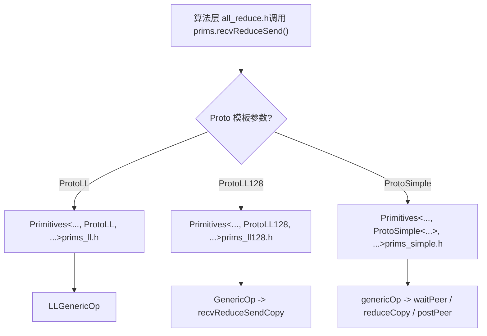
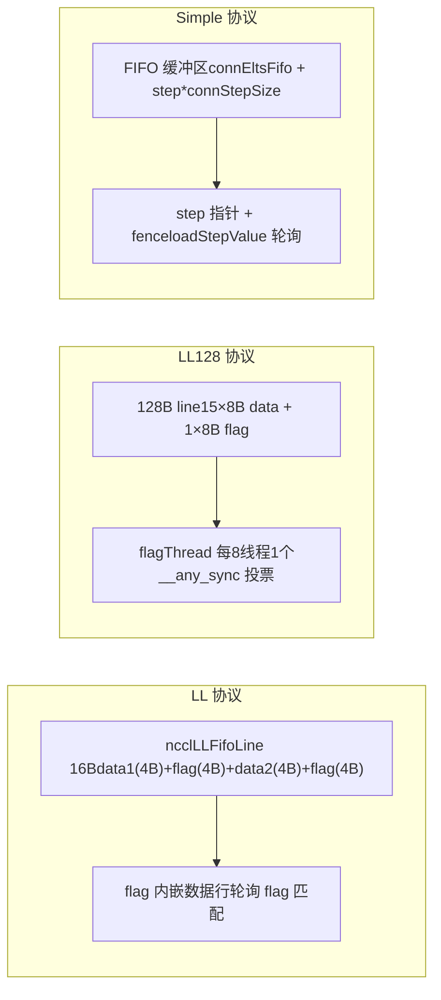

# Chapitre 9 : Primitives de communication côté device : implémentation du transfert de données des trois protocoles LL, LL128, Simple

Dans le chapitre précédent, nous avons suivi comment le côté host traduit un AllReduce en un kernel __global__, et nous avons vu que le point d'entrée côté device ncclKernelMain effectue la répartition selon l'algorithme et le protocole. Mais la répartition ne fait que sélectionner les outils ; ce qui détermine réellement la performance, c'est la manière dont ces outils exécutent le transfert de données. Ce chapitre explore en profondeur les trois ensembles de primitives de transfert sous src/device : LL, LL128 et Simple, en analysant une à une leur implémentation de transfert de données, afin de comprendre les compromis entre latence et bande passante des différents protocoles.

# Pourquoi un même AllReduce nécessite trois ensembles de primitives de transfert

Établissons d'abord un modèle intuitif. Imaginez une usine à chaîne de montage : la matière première (les données utilisateur) entre d'un côté, le produit fini sort de l'autre, et au milieu plusieurs postes de travail (rank) doivent échanger des produits semi-finis. Il existe trois façons de transférer les produits semi-finis :

- **LL（Low Latency）**: comme deux personnes qui se passent un mot face à face ; au moment où on le tend, l'autre sait immédiatement « c'est pour toi », avec un coût de handshake quasi nul. Mais le mot est très petit, on ne peut transmettre que 8 octets de données utiles à la fois. Adapté aux petits messages.
- **LL128**: on remplace le mot par un post-it de 128 octets, transmettant 120 octets de données utiles à la fois, mais le post-it doit être placé aligné sur 16 octets, sinon il faut d'abord le « remettre en page » dans la mémoire partagée. Adapté aux messages moyens.
- **Simple**: comme un casier de livraison ; on dépose d'abord le colis dans le casier (tampon FIFO), puis on envoie une notification « le casier n° N contient un colis ». Le coût de handshake est élevé, mais on peut transférer beaucoup à la fois. Adapté aux gros messages.

> **[Design Inference & Architectural Trade-offs]**
> Que se passerait-il s'il n'y avait qu'un seul ensemble de primitives ? Avec LL uniquement, les gros messages étoufferaient la bande passante car « chaque message doit attendre la confirmation du flag par l'autre partie » ; avec Simple uniquement, les petits messages verraient leur latence exploser à cause du coût fixe « écrire dans la FIFO + envoyer une notification + attendre la notification ». C'est précisément la raison pour laquelle la courbe de performance de NCCL présente des points d'inflexion nets autour de 8 Ko et 128 Ko.

Les trois ensembles de primitives partagent le même squelette de template`Primitives<T, RedOp, Fan, Direct, Proto, P2p, isNetOffload>`, et via`Proto`ce paramètre de template, on spécialise trois versions[FACT:src/device/primitives.h:117-117]。`ProtoLL`、`ProtoLL128`、`ProtoSimple`les trois structures portent chacune leurs constantes et méthodes de calcul liées au protocole[FACT:src/device/primitives.h:25-75], le code de l'algorithme n'appelle que`prims.send()`、`prims.recvReduceSend()`ce type d'interface unifiée, sans se soucier du protocole sous-jacent.



Ce schéma explique « pourquoi une même logique AllReduce nécessite trois ensembles de primitives de transfert » : la couche algorithme est indépendante du protocole, les différences de protocole sont encapsulées dans`Primitives`les trois spécialisations de

# LL : transfert sans handshake avec flag intégré dans la ligne de données

## Modèle intuitif

L'idée centrale de LL est :**intégrer « les données » et le marqueur « les données sont-elles prêtes » dans la même unité de lecture-écriture de 16 octets**. Le récepteur n'a pas besoin de « message de notification » supplémentaire ; il lui suffit de scruter le champ flag dans la ligne de données ; si le flag correspond, cela signifie que les données sont arrivées. C'est comme imprimer directement la « signature du destinataire » sur l'enveloppe lors de l'envoi d'une lettre : le facteur voit la signature et sait s'il doit livrer, sans avoir besoin d'un bordereau de réception séparé.

Sans cette conception, le récepteur devrait d'abord attendre une notification « les données ont été écrites », puis revenir lire les données, soit deux allers-retours mémoire, doublant la latence.

## Structures de données et disposition mémoire

L'unité de transfert de LL est`union ncclLLFifoLine`, comme on peut le voir dans l'assemblage de`storeLL`sa disposition[FACT:src/device/prims_ll.h:154-158]：

```
st.volatile.global.v4.u32 [%0], {%1,%2,%3,%4};
// 写入 4 个 u32：data1, flag, data2, flag
```

Un`ncclLLFifoLine`fait 16 octets, disposé en`[data1(4B) | flag(4B) | data2(4B) | flag(4B)]`. Les données utiles ne font que 8 octets (data1 + data2), les 8 autres octets sont entièrement du flag. C'est pourquoi`ProtoLL::calcBytePerGrain()`renvoie`sizeof(uint64_t)`— « One 16-byte line has 8-bytes of data »[FACT:src/device/primitives.h:55-57]。

Champs clés (spécialisation LL de`Primitives`)[FACT:src/device/prims_ll.h:20-42]：

| Champ | Type | Rôle |
| --- | --- | --- |
| `recvStep[i]` / `sendStep[i]` | `uint64_t[MaxRecv/MaxSend]` | Compteur de pas par peer, détermine l'offset du tampon et la valeur du flag |
| `recvBuff[i]` / `sendBuff[i]` | `ncclLLFifoLine*` | Pointe vers l'adresse de base du tampon FIFO de chaque peer |
| `recvConnHeadPtr` | `volatile uint64_t*` | Pointeur global côté réception « jusqu'à quel pas j'ai consommé » |
| `sendConnHeadPtr` | `volatile uint64_t*` | Pointeur global côté envoi « jusqu'à quel pas le pair a consommé » |
| `sendConnHeadCache` | `uint64_t` | Met en cache la dernière valeur de head lue, pour éviter de lire la mémoire globale à chaque fois |

L'offset du tampon est calculé par`recvOffset(i) = (recvStep[i] % NCCL_STEPS) * stepLines`[FACT:src/device/prims_ll.h:44-46]，`NCCL_STEPS`est le nombre de slots du tampon circulaire,`stepLines`est le nombre de lignes par slot. La valeur du flag est calculée par`recvFlag(i) = NCCL_LL_FLAG(recvStep[i] + 1)`[FACT:src/device/prims_ll.h:56-58], noter que`+1`— car la valeur initiale du flag est 0, le flag du premier pas doit être 1 pour se distinguer de « non écrit ».

## Parcours guidé par scénario : un recvReduceSend

Supposons que le rank 0 exécute dans un Ring AllReduce`recvReduceSend`: recevoir les données du rank précédent, faire un reduce avec les données locales, puis envoyer au rank suivant. La chaîne d'appels est`recvReduceSend(inpIx, eltN)` → `LLGenericOp<1, 1, Input, -1>(inpIx, -1, eltN, false)` [FACT:src/device/prims_ll.h:403-405]。

**Première étape : attendre que le tampon d'envoi soit disponible.** `waitSend`vérifie`sendConnHeadCache + NCCL_STEPS < sendConnHead + 1` [FACT:src/device/prims_ll.h:73-89]. Cela signifie : si la progression de consommation du pair (head) est trop en retard par rapport à moi, cela indique que le tampon circulaire est presque plein, il faut attendre.`NCCL_STEPS`est le nombre total de slots du tampon,`sendConnHead + 1`est le slot que je vais occuper. Pendant l'attente, on scrute`*sendConnHeadPtr`pour mettre à jour le cache, et on appelle périodiquement`checkAbort`pour vérifier si un abort a eu lieu[FACT:src/device/prims_ll.h:73-89]。

**Deuxième étape : charger les données locales.** `DataLoader::loadBegin`traite le problème d'alignement[FACT:src/device/prims_ll.h:200-216]. Lorsque`sizeof(T) <= 2`(par exemple half ou int8), l'adresse source peut ne pas être alignée sur 4 octets, donc on lit d'abord aligné sur 4 octets dans`u4[0..2]`, on enregistre`misalign`, puis dans`loadFinish`on utilise`__funnelshift_r`pour effectuer un décalage au niveau de l'octet et reconstituer la valeur 64 bits correcte[FACT:src/device/prims_ll.h:218-225]. C'est une technique typique de « lecture alignée + recomposition par décalage », qui évite la pénalité de performance des accès non alignés.

**Troisième étape : lire les données du pair et attendre le flag.** `readLL`est le cœur[FACT:src/device/prims_ll.h:108-122]：

```cpp
do {
  asm volatile("ld.volatile.global.v4.u32 {%0,%1,%2,%3}, [%4];" ...);
  if (checkAbort(abort, 1, spins)) break;
} while ((flag1 != flag) || (flag2 != flag));
```

Il utilise`ld.volatile.global.v4.u32`Lire 16 octets en une seule fois (4 u32), puis vérifier si les deux champs flag sont tous deux égaux aux valeurs attendues.`volatile`Le mot-clé garantit que le compilateur n'optimisera pas cette lecture ni ne la mettra en cache dans un registre — car le pair peut écrire de nouvelles données à tout moment. Les deux flags doivent correspondre, car l'écrivain`storeLL`écrit 4 u32 en une fois, ce qui théoriquement peut être divisé en deux écritures de 8 octets ; les deux flags doivent correspondre pour garantir l'intégrité des 16 octets.

**Quatrième étape : reduce puis envoi.**Après réception de peerData,`applyReduce(redOp, peerData, data)`effectuer la réduction[FACT:src/device/prims_ll.h:279]. Puis`storeLL(sendPtr(i) + offset, data, sendFlag(i))`écrire le résultat dans le tampon d'envoi[FACT:src/device/prims_ll.h:295-296]. Attention à l'ordre d'envoi : envoyer d'abord`i=1..MaxSend`(généralement le pair réseau), puis enfin`i=0`(généralement le pair local)[FACT:src/device/prims_ll.h:291-297]. Le commentaire est très clair : « Send : inter-node, then intra-node, then local » — envoyer d'abord le lent (réseau), le laisser voler en arrière-plan, puis envoyer le rapide (local), ainsi le pair local n'attend pas le réseau.

**Cinquième étape : avancer le step et post.** `incRecv(i)`Incrémenter le pas de réception[FACT:src/device/prims_ll.h:91-93]，`postRecv()`écrire`recvConnHead`dans le pointeur global[FACT:src/device/prims_ll.h:94-97], notifier au pair « j'ai déjà consommé ce step ». Le côté envoi`incSend`a une logique spéciale[FACT:src/device/prims_ll.h:99-106]：

```cpp
if ((sendStep[i] & NCCL_LL_CLEAN_MASK) == NCCL_LL_CLEAN_MASK) {
  for (int o = offset; o  *head) { ... }
}
```

En mode DirectRead de sendrecv, l'émetteur doit attendre que le récepteur ait fini de lire les données avant de pouvoir retourner. Si le récepteur, pour une raison quelconque, ne fait pas progresser tail, l'émetteur se retrouve en interblocage. Cette attente doit être effectuée après`barrier()`, sinon il pourrait y avoir une compétition avec le thread post.

**Piège 3 :`roundUp`provoquant un saut de step.** `loadRecvConn`et`loadSendConn`contiennent tous deux`step = roundUp(step, SlicePerChunk * StepPerSlice)` [FACT:src/device/prims_simple.h:486, 533]. Cela aligne le step sur les frontières de slice, mais si le step précédent n'est pas aligné, les slots sautés ne seront pas correctement initialisés. Le code ajoute dans`loadRecvConn`une instruction`*connStepPtr = step`pour restituer le credit[FACT:src/device/prims_simple.h:489]。

# Comparaison et sélection des trois primitives



| Dimension | LL | LL128 | Simple |
| --- | --- | --- | --- |
| Taux de charge utile | 50% | 93.75% | ~100% |
| Mode de synchronisation | flag intégré, polling | flagThread + vote warp | pointeur step + fence |
| Exigence d'alignement | Aucune (avec réorganisation par décalage) | 16 octets | Aucune |
| Taille de message applicable | Petite (< 8KB) | Moyenne (8KB ~ 128KB) | Grande (> 128KB) |
| Disposition du tampon | `ncclLLFifoLine[]` | `uint64_t[]`par ligne de 128B | `T[]` FIFO |
| Support Direct | Aucun (`PrimitivesWithoutDirect`dégradé) | Aucun (idem à gauche) | Support complet |

LL et LL128 héritent tous deux de`PrimitivesWithoutDirect` [FACT:src/device/prims_ll.h:9-10, src/device/prims_ll128.h:13-14], car leur disposition de tampon ne permet pas la lecture/écriture directe de la mémoire du pair. Simple, en revanche, implémente complètement le mode Direct, supportant la connexion directe P2P et NVLS.

# Réflexions de conception

> **[Design Inference & Architectural Trade-offs]**
> **Pourquoi le flag de LL doit-il être dupliqué deux fois ?**Parce que les écritures en mémoire globale du GPU ne garantissent pas l'atomicité.`storeLL`Pour écrire 16 octets, le matériel peut les diviser en deux écritures de 8 octets. Si un seul flag était placé, le récepteur pourrait considérer les données comme prêtes alors qu'elles ne sont écrites qu'à moitié. Les deux flags sont situés respectivement dans la première et la seconde moitié des 16 octets ; ce n'est que lorsque les deux écritures sont terminées que les deux flags correspondent tous les deux.

**Pourquoi Simple doit-il réserver un warp ?** [FACT:src/device/prims_simple.h:625-626]Le commentaire dit « For send operations, we need an extra warp to overlap the threadfence and the copy ».`fence_acq_rel_sys()`est une opération coûteuse ; si tous les threads attendent la fin du fence avant de continuer, cela gaspille beaucoup de temps. Réserver un warp dédié au fence permet aux autres warps de continuer à transférer le lot de données suivant.

> **[Design Inference & Architectural Trade-offs]**
> **Pourquoi l'avancement du step de LL128 se fait-il à la fin de GenericOp plutôt que dans recvReduceSendCopy ?**Parce que le transfert de LL128 est au niveau warp, et plusieurs warps peuvent traiter différents slices en parallèle. Si l'on avançait le step dans`recvReduceSendCopy`, chaque warp l'avancerait une fois, ce qui ferait avancer le step plusieurs fois. Le placer à la fin de`GenericOp`pour un avancement unifié garantit que chaque slice n'avance qu'une seule fois.

# Résumé de ce chapitre

Ce chapitre a approfondi l'implémentation des trois primitives de transfert :

1. **LL**: utiliser`ncclLLFifoLine`de 16 octets pour intégrer le flag dans la ligne de données ; le récepteur n'a qu'à faire du polling sur la correspondance du flag pour confirmer que les données sont prêtes. Charge utile de 50 %, adapté aux petits messages. Le cœur est`readLL`de`ld.volatile.global.v4.u32`et`storeLL`de`st.volatile.global.v4.u32`。

2. **LL128**: concentrer le flag dans les 8 derniers octets de chaque bloc de 128 octets, portant la charge utile à 93,75 %. Utiliser`flagThread`(1 pour 8 threads) pour vérifier le flag,`__any_sync`pour le vote warp. En cas de non-alignement, passer par une réorganisation en mémoire partagée.

3. **Simple**: utiliser un tampon FIFO + notification par pointeur step pour un haut débit sur les grands messages.`flags`encodage des rôles par bits de drapeau,`waitPeer`polling du step,`postPeer`mise à jour du step et fence. Support complet du mode Direct.

Les trois primitives partagent le même squelette de template, spécialisé via le paramètre de template`Proto`. La couche algorithmique n'appelle qu'une interface unifiée et ne se soucie pas du protocole sous-jacent. C'est la réponse à « pourquoi la même logique AllReduce nécessite trois primitives de transfert » : différentes tailles de message nécessitent différentes stratégies de synchronisation et dispositions de tampon ; les trois primitives sont respectivement optimisées pour les petits, moyens et grands messages.

# Réflexions et auto-évaluation de ce chapitre

Q1 : Si l'on supprime la logique de cleanup dans`incSend`([FACT:src/device/prims_ll.h:99-106]), dans quel scénario cela déclencherait-il une corruption de données ? Pourquoi ?

**Analyse de référence**: la logique de cleanup, lors de`sendStep[i] & NCCL_LL_CLEAN_MASK == NCCL_LL_CLEAN_MASK`, réécrit toutes les lignes du slice entier avec le flag courant (données remplies à 0). Si on la supprime, lorsque le step revient à la frontière`NCCL_LL_CLEAN_MASK`, le flag de certaines lignes pourrait encore être la valeur du tour précédent. Si le flag du tour précédent se trouve être égal au flag attendu par le récepteur pour ce tour, le récepteur croira à tort que les données sont prêtes et lira les données résiduelles du tour précédent. C'est un problème ABA typique. La condition de déclenchement est une exécution prolongée (step dépassant`NCCL_LL_CLEAN_MASK`cycles) et un flag qui revient exactement à la même valeur. Ce type de bug est extrêmement difficile à reproduire, car il nécessite un alignement précis des steps.

Q2 : Dans le destructeur du protocole Simple, l'attente en mode NetRegMode ([FACT:src/device/prims_simple.h:794-804]) et l'attente en mode DirectRead ([FACT:src/device/prims_simple.h:814-824]) protègent respectivement contre quoi ? Si l'on supprime l'une des deux, que se passe-t-il dans un scénario à forte concurrence ?

**Analyse de référence**: En mode NetRegMode, on attend que le thread proxy mette`connFifo[prevStep].size`à -1, ce qui indique que la carte réseau a terminé l'envoi. Si on la supprime, le kernel suivant pourrait écraser le tampon d'envoi en cours de lecture DMA par la carte réseau, provoquant la lecture de données corrompues. En mode DirectRead, on attend que le récepteur fasse avancer le tail (`*tail > *head`), ce qui indique que le récepteur a fini de lire le tampon direct. Si on la supprime, l'émetteur pourrait écraser le tampon avant que le récepteur ait fini de le lire, faisant lire au récepteur les nouvelles données au lieu des anciennes. Dans un scénario à forte concurrence, ces deux attentes sont indispensables ; en supprimer une provoque une course de données. La différence est que NetRegMode protège contre « la lecture par la carte réseau », tandis que DirectRead protège contre « la lecture par le GPU distant ».

Q3 : Le`loadRegsBegin`de LL128 emprunte le chemin de réorganisation via mémoire partagée ([FACT:src/device/prims_ll128.h:115-141]) en cas de non-alignement. De combien ce chemin est-il plus lent que le chemin aligné ? Pourquoi NCCL n'exige-t-il pas directement que les tampons utilisateur soient alignés sur 16 octets ?

**Analyse de référence**: Le chemin non aligné ajoute trois étapes : écriture en mémoire partagée,`__syncwarp()`, lecture depuis la mémoire partagée. Bien que la bande passante de la mémoire partagée soit élevée,`__syncwarp()`est un point de synchronisation qui bloque le warp jusqu'à ce que tous les threads aient terminé l'écriture. En estimation grossière, le chemin non aligné est 20 à 40 % plus lent que le chemin aligné, selon les conflits de bancs de mémoire partagée. NCCL n'impose pas l'alignement car l'utilisateur peut passer des tampons à offset arbitraire (par exemple des tranches de tenseur), et l'alignement forcé limiterait la flexibilité de l'API. La stratégie de NCCL est « chemin rapide si aligné, chemin lent mais correct si non aligné ». En production, il est recommandé d'allouer les tampons alignés sur 16 octets pour emprunter le chemin rapide.

Nous maîtrisons désormais les mécanismes de transfert de données des trois primitives LL, LL128 et Simple, qui offrent aux algorithmes de niveau supérieur des moyens flexibles de régler les performances. Le chapitre suivant plongera dans le cœur des algorithmes de communication collective, pour voir comment AllReduce, AllGather, ReduceScatter, etc. appellent ces primitives, et comment Ring, Tree, CollNet et d'autres algorithmes organisent les flux de données, pour finalement réaliser une communication collective de bout en bout.
