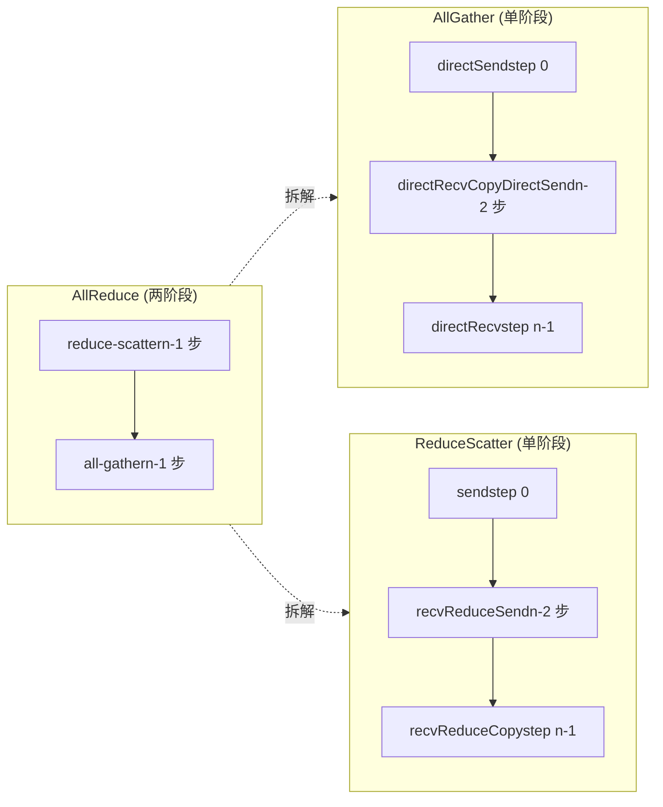
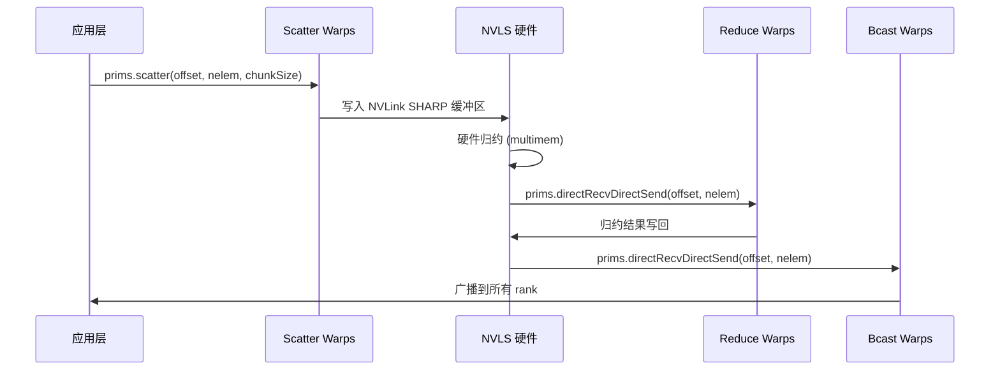

# Chapitre 10 : Cœur des algorithmes de communication collective : implémentation côté device de AllReduce, AllGather, ReduceScatter

Le chapitre précédent a décomposé les trois primitives de protocole LL, LL128 et Simple ; ce sont les « moteurs » du transfert de données, mais le moteur lui-même ne sait pas quoi transférer, où le transférer, ni dans quel ordre. Ce chapitre examine le groupe de fichiers de kernels d'algorithmes sous src/device, qui sont la « boîte de vitesses » — ils traduisent les sémantiques de communication collective AllReduce, AllGather, ReduceScatter en une série d'appels de primitives comme prims.directSend, prims.directRecvReduceDirectSend. En une phrase, la contradiction centrale de ce chapitre : pourquoi un même AllReduce nécessite-t-il quatre implémentations côté device totalement différentes — Ring, Tree, CollNet, NVLS ? La réponse se trouve dans l'adéquation entre « topologie du flux de données » et « capacités matérielles ». Ring utilise un minimum de bande passante réseau pour un pipeline en deux phases, Tree compresse la latence à log(n) par réduction en arbre, et CollNet/NVLS déchargent la réduction sur la carte réseau ou le commutateur NVLink. Ce chapitre les décompose une par une.

# 10.1 Ring AllReduce : comment le pipeline en deux phases s'implante dans le kernel

## Modèle intuitif : un « relais » sur une chaîne de montage circulaire

Imaginez n ouvriers disposés en cercle, chacun tenant une caisse de matières premières. L'objectif d'AllReduce est que chacun obtienne finalement le « produit fini mélangeant toutes les matières premières ». L'algorithme Ring procède en deux phases : la première (reduce-scatter) fait circuler chaque caisse le long de l'anneau, en y mélangeant ses propres matières premières à chaque station ; après n-1 stations, chacun détient exactement une part de « mélange complet » du produit fini, mais seulement 1/n de la part ; la seconde phase (all-gather) fait circuler ces parts de produit fini le long de l'anneau, chacun complétant toutes les parts.

Sans Ring, l'approche la plus naïve est que chaque rank envoie ses données au root, le root réduit puis diffuse — la bande passante réseau du root devient le goulot d'étranglement, et plus n est grand, plus c'est lent. La subtilité de Ring réside dans :**Le volume d'envoi et de réception de chaque rank est de 2(n-1)/n fois la quantité de données, réparti uniformément sur tous les liens indépendamment de n**。

## Structure de données et disposition mémoire

L'état central de l'algorithme Ring se trouve dans`ncclRing`la structure (définie dans device.h, non détaillée dans ce chapitre),`runRing`on n'en extrait que deux champs :

- `ring->index`: la position logique de ce rank dans l'anneau, utilisée pour calculer « quel chunk traiter à l'étape j ».
- `ring->prev` / `ring->next`: les numéros des ranks prédécesseur et successeur, utilisés comme`Primitives`paramètres recv/send peer du constructeur.

Les paramètres clés de découpage sont calculés par`ncclCollCbdPart`([FACT:src/device/all_reduce.h:21-22]）：

```
ncclCollCbdPart(work, ncclShmem.channelId, Proto::Id, sizeof(T), (ssize_t*)nullptr, &gridOffset, &channelCount, &chunkCount);
```

Cette fonction découpe les données de tout le domaine de communication par channel et produit trois valeurs :`gridOffset`(l'offset de début des données dont ce channel est responsable dans tout le buffer),`channelCount`(le nombre total d'éléments dont ce channel est responsable),`chunkCount`(le nombre d'éléments du chunk attribué à chaque rank).`chunkCount`C'est la granularité de l'algorithme Ring — un chunk est déplacé à chaque étape.

`loopCount = nranks * chunkCount`（[FACT:src/device/all_reduce.h:23]) représente la quantité de données traitée pour « un tour complet ». La boucle externe`for (elemOffset = 0; elemOffset < channelCount; elemOffset += loopCount)`（[FACT:src/device/all_reduce.h:34]) signifie : si la quantité de données du channel dépasse ce qu'un tour peut traiter, on exécute plusieurs tours.

## Step-by-Step Walkthrough : le flux d'appel complet d'un Ring AllReduce

Scénario : 4 ranks (nranks=4), le`ringIx=0`，`chunkCount=100`，`channelCount=400`de ce rank (exactement un tour).

**Étape 0 : pousser « son propre chunk » vers le GPU suivant**（[FACT:src/device/all_reduce.h:42-47]）

```
chunk = modRanks(ringIx + nranks - 1);   // = 3
chunkOffset = chunk * chunkCount;         // = 300
offset = gridOffset + elemOffset + chunkOffset;
nelem = min(chunkCount, remCount - chunkOffset);
prims.directSend(offset, offset, nelem);
```

`modRanks`est un lambda qui effectue une soustraction modulo nranks ([FACT:src/device/all_reduce.h:40]）。`ringIx + nranks - 1`représente « le numéro du chunk précédent de ce rank ». Pourquoi l'étape 0 envoie-t-elle le chunk 3 ? Parce que dans la phase reduce-scatter du Ring, chaque rank envoie d'abord la portion de données qu'il « ne doit pas conserver » (c'est-à-dire le chunk du rank prédécesseur).`directSend`envoie seulement sans recevoir, car aucune donnée n'a encore été reçue à ce moment.

**Étapes 1 à nranks-2 : recevoir, réduire et retransmettre**（[FACT:src/device/all_reduce.h:50-56]）

```
for (int j = 2; j 计算 chunkCount/loopCount"] --> loop{"elemOffset |否| done["返回"]
    loop -->|是| s0["step 0: directSendchunk = ringIx-1"]
    s0 --> mid{"j 从 2 到 nranks-1?"}
    mid -->|是| s1["directRecvReduceDirectSendchunk = ringIx-j"]
    s1 --> mid
    mid -->|否| s2["step nranks-1directRecvReduceCopyDirectSendpostOp=true"]
    s2 --> ag{"j 从 1 到 nranks-2?"}
    ag -->|是| s3["directRecvCopyDirectSend纯转发"]
    s3 --> ag
    ag -->|否| s4["directRecv收最后一块"]
    s4 --> loop
```

## Réflexion de conception : pourquoi l'ordre des chunks du Ring « recule »

Noter la régularité de la numérotation des chunks : l'étape 0 envoie`ringIx-1`, l'étape j traite`ringIx-j`, la dernière étape traite`ringIx+0`. C'est une progression**dans le sens antihoraire**. Pourquoi ? Parce que chaque rank du Ring ne conserve que « le chunk dont il est responsable de la réduction » (c'est-à-dire`ringIx+0`), les autres chunks ne font que passer. La progression antihoraire garantit : lorsqu'un chunk fait un tour complet et revient à son point de départ, il a exactement accompli nranks réductions, produisant le résultat final. Si la progression était horaire, le chunk terminerait sa réduction sur le mauvais rank.

## Piège en production :`remCount < loopCount`le piège d'alignement lorsque

[FACT:src/device/all_reduce.h:38]Il y a une ligne de code facile à négliger :

```
if (remCount = 256) nthreadsSplit += 64;
} else {
  nthreadsSplit = (nthreads * 7 / (10 * WARP_SIZE)) * WARP_SIZE;
}
```

divise les threads en deux groupes (

Copier`tid < nthreadsSplit`Le protocole Simple divise en deux parts égales ; les protocoles LL/LL128 divisent selon un ratio 7:3, car « recevoir des données de 3 sources pour effectuer une réduction » est plus intensif en calcul que « envoyer vers 3 cibles », donc le groupe de réduction reçoit plus de threads.[FACT:src/device/all_reduce.h:175-202]Ensuite[FACT:src/device/all_reduce.h:203-224]les threads de`Proto::MaxGroupWidth`effectuent la réduction vers le haut ([FACT:src/device/all_reduce.h:189]), et les autres threads effectuent la diffusion vers le bas (`0 * Proto::MaxGroupWidth`). Les deux groupes se distinguent par l'offset[FACT:src/device/all_reduce.h:210]pour identifier leurs groupes de communication respectifs (`1 * Proto::MaxGroupWidth`）。

## de

et`directRecvReduceDirectSend`de`tree->up`Réflexion de conception : pourquoi le nœud racine de Tree nécessite un traitement spécial`if (tree->up == -1)`Le nœud racine de la réduction arborescente est le « point de convergence » : son volume de réception est multiplié par le nombre de nœuds enfants, et son volume d'envoi est nul (phase de réduction). Si le nœud racine passait aussi par le`tree->down[0] == -1`générique, il tenterait d'envoyer vers

## (-1), provoquant un dépassement de limites. Il faut donc le traiter séparément avec la branche

. De même pour le jugement**du nœud feuille.**Piège en production : le problème du « nœud racine point chaud » de l'algorithme Tree`runTreeSplit`Le nœud racine de Tree supporte tout le trafic de réduction ; si le GPU où se trouve le nœud racine est justement un nœud lent (par exemple avec une bande passante PCIe limitée), tout l'AllReduce est ralenti. La réponse de NCCL est :`FanSymmetric<NCCL_MAX_TREE_ARITY_TOP>`（[FACT:src/device/all_reduce.h:168]Chaque channel choisit une racine différente

# , répartissant la charge du nœud racine sur plusieurs ranks. C'est pourquoi

## dans

la branche du nœud racine utilise

) — il doit traiter simultanément la réduction de plusieurs nœuds enfants. En production, si l'on constate une performance inégale de Tree AllReduce, vérifier si la distribution des nœuds racines des channels est uniforme.

## 10.3 AllGather et ReduceScatter : les variantes « mi-parcours » du Ring

`all_gather.h`Modèle intuitif : AllReduce divisé en deux moitiés`runRing`（[FACT:src/device/all_gather.h:14-88]AllGather et ReduceScatter sont essentiellement les deux phases d'AllReduce, chacune devenant une API indépendante. AllGather ne fait que « collecter » — chaque rank contribue une part de données, et finalement tout le monde obtient l'ensemble des données. ReduceScatter ne fait que « réduire + disperser » — tout le monde contribue des données, et après réduction chacun obtient une part.

**Sans ces deux API indépendantes, un utilisateur voulant faire « réduire puis collecter » ou « collecter puis réduire » ne pourrait qu'appeler AllReduce puis découper manuellement, gaspillant la moitié de la bande passante.**（[FACT:src/device/all_gather.h:51-60]）

```
rankDest = ringRanks[0];
offset = dataOffset + rankDest * count;
if ((inputBuf + dataOffset == outputBuf + offset) || isNetOffload) {
  prims.directSend(dataOffset, offset, nelem);
} else {
  prims.directCopySend(dataOffset, offset, nelem);
}
```

Le`inputBuf + dataOffset == outputBuf + offset`de`directSend`) est plus simple qu'AllReduce : pas de réduction, seulement de la copie-transfert.`directCopySend`Étape 0 : pousser ses propres données vers le GPU suivant

**Copier**（[FACT:src/device/all_gather.h:62-67]）

```
prims.directRecvCopyDirectSend(offset, offset, nelem);
```

**, cela signifie que l'entrée et la sortie sont le même bloc mémoire (AllGather in-place), on fait directement**（[FACT:src/device/all_gather.h:69-74]）

```
prims.directRecv(offset, nelem);
```

## (copier d'abord vers la sortie puis envoyer).

[FACT:src/device/all_gather.h:28-36]Étapes intermédiaires nranks-2 : pur transfert

```
if (isNetOffload) {
  workNthreads = WARP_SIZE;
  chunkCount = NCCL_MAX_NET_SIZE;
} else {
  workNthreads = nthreads;
}
```

Dernière étape : recevoir le dernier bloc`isNetOffload=true`Copier[FACT:src/device/all_gather.h:76-82]isNetOffload : un seul warp pilote le réseau + plusieurs warps copient en parallèle

Il y a une branche spéciale dans`barrier_sync(14, nthreads)`（[FACT:src/device/all_gather.h:87]:`__syncthreads()`。

## Copier

`reduce_scatter.h`Lorsque`runRing`（[FACT:src/device/reduce_scatter.h:14-56](mode single RPN + enregistrement réseau), un seul warp pilote la communication Ring, les autres warps effectuent en parallèle la « copie des données source vers le buffer cible » (

**). Cela permet, en AllGather non in-place, de chevaucher le coût de copie et le coût de communication.**（[FACT:src/device/reduce_scatter.h:39-42]）

```
rankDest = ringRanks[nranks - 1];
offset = dataOffset + rankDest * count;
prims.send(offset, nelem);
```

**), et le commentaire l'explique clairement : il faut attendre que tous les warps aient terminé, sinon le work suivant pourrait réutiliser outputBuf et provoquer une compétition. On utilise la barrière 14 pour éviter la barrière propre à prims et**（[FACT:src/device/reduce_scatter.h:44-49]）

```
prims.recvReduceSend(offset, nelem);
```

**Le**（[FACT:src/device/reduce_scatter.h:61-64]）

```
prims.recvReduceCopy(offset, dataOffset, nelem, /*postOp=*/true);
```

Attention à la dernière étape`recvReduceCopy`il y a deux offsets :`offset`(source de réception) et`dataOffset`(entrée locale), le résultat de la réduction est écrit dans`dataOffset`。

## Diagramme comparatif des flux de données



## Pièges en production : les limites du jugement in-place

[FACT:src/device/all_gather.h:55]le jugement in-place de`inputBuf + dataOffset == outputBuf + offset`dépend de l'égalité exacte des pointeurs. Si le sendbuff et le recvbuff fournis par l'utilisateur ont un décalage mais correspondent logiquement au même bloc de mémoire, ce jugement échoue, ce qui conduit à emprunter le`directCopySend`chemin — bien que correct, cela ajoute une copie supplémentaire. En production, il est recommandé de s'assurer que sendbuff et recvbuff sont parfaitement identiques lors d'un AllGather in-place.

# 10.4 CollNet et NVLS : décharger la réduction sur le matériel

## Modèle intuitif : laisser le « switch » aider au calcul

Ring et Tree font tous deux « le GPU calcule lui-même la réduction ». CollNet et NVLS adoptent une approche différente : décharger l'opération de réduction sur la carte réseau (CollNet) ou sur le switch NVLink (NVLS). Le GPU se charge uniquement d'envoyer les données, le matériel effectue la réduction puis rediffuse. C'est comme passer de « chaque ouvrier mélange lui-même les ingrédients » à « envoyer les ingrédients à un mixeur central, le mixeur mélange puis redistribue ».

Sans déchargement matériel, l'opération de réduction occupe les ressources SM du GPU, et la latence de réduction ne peut pas être masquée.

## Répartition des threads dans CollNet Direct

`RunWorkColl<ncclFuncAllReduce, ..., NCCL_ALGO_COLLNET_DIRECT, ...>`le`run`（[FACT:src/device/all_reduce.h:249-386]) divise les threads en quatre groupes :

```
const int nThreadsScatter = WARP_SIZE + ((hasUp && hasDn) ? COLLNET_COPY_THREADS : ...);
const int nThreadsGather = ((hasUp && hasDn) ? COLLNET_COPY_THREADS : ...);
const int nThreadsBcast = WARP_SIZE + ((hasUp && hasDn) ? COLLNET_COPY_THREADS : ...);
const int nThreadsReduce = work->nWarps * WARP_SIZE - nThreadsScatter - nThreadsGather - nThreadsBcast;
```

Les quatre groupes de threads sont respectivement responsables de : Scatter (répartir les données vers chaque rail), Reduce (réduire puis envoyer au réseau), Gather (collecter depuis chaque rail), Bcast (diffuser après réception depuis le réseau).`COLLNET_COPY_THREADS = 96`（[FACT:src/device/all_reduce.h:250]) est le nombre fixe de threads de copie.

## netRegUsed : disposition des buffers en mode enregistrement réseau

[FACT:src/device/all_reduce.h:280-288]il y a une branche critique :

```
if (work->netRegUsed) {
  offsetBase = bid * chunkSize;
  maxNelems = size;
  peerOffset = nChannels * chunkSize;
} else {
  offsetBase = bid * direct->nHeads * chunkSize;
  maxNelems = direct->nHeads * chunkSize;
  peerOffset = chunkSize;
}
```

`netRegUsed`mode, les buffers sont disposés de manière contiguë par channel (`bid * chunkSize`), l'offset peer est`nChannels * chunkSize`; en mode non enregistré, ils sont disposés par head (`bid * nHeads * chunkSize`), l'offset peer est`chunkSize`. Cette différence provient du fait que le mode enregistrement réseau exige des buffers contigus pour permettre le DMA de la carte réseau.

## Allocation des warps dans NVLS

`RunWorkColl<ncclFuncAllReduce, ..., NCCL_ALGO_NVLS, ...>`le`run`（[FACT:src/device/all_reduce.h:391-523]) utilise une allocation de warps plus fine :

```
const int bcastWarps = hasOut ? (work->regUsed ? ((totalWarps - 2) >> 1) - 1 : 2) : 0;
const int reduceWarps = work->regUsed ? (totalWarps - bcastWarps - 2) : (hasOut ? 3 : nranks regUsed ? 1 : (totalWarps - reduceWarps - bcastWarps + 1) >> 1;
const int gatherWarps = work->regUsed ? 1 : (totalWarps - reduceWarps - bcastWarps) >> 1;
```

`regUsed`mode, scatter/gather n'occupent chacun qu'1 warp (car le matériel NVLS opère directement sur la mémoire enregistrée), reduce occupe la majorité ; en mode non enregistré, scatter/gather occupent chacun environ la moitié, reduce s'ajuste selon le nombre de ranks (≤6 utilise 7 warps, sinon 5 warps).

## Diagramme d'interaction temporelle



## Pièges en production : le`direct->out == -1`piège de CollNet

[FACT:src/device/reduce_scatter.h:521]il y a une ligne :

```
if (direct->out == -1) __trap();
```

Si la connexion out de CollNet n'est pas établie (-1), directement`__trap()`fait planter le kernel. C'est de la programmation défensive — CollNet dépend de la carte réseau, si l'initialisation de la carte réseau échoue, out sera -1, et continuer l'exécution entraînerait un comportement indéfini. En production, si vous voyez un kernel trap, vérifiez si la carte réseau CollNet est correctement initialisée.

# 10.5 Broadcast et Reduce : les deux opérations collectives les plus simples

## Broadcast : diffusion en éventail depuis le root

`broadcast.h`le`runRing`（[FACT:src/device/broadcast.h:14-64]) la logique est très directe : le nœud root envoie les données, les autres nœuds relaient, le dernier nœud ne fait que recevoir.

```
if (rank == root) {
  if (inputBuf == outputBuf || isNetOffload) {
    prims.directSend(offset, offset, nelem);
  } else {
    prims.directCopySend(offset, offset, nelem);
  }
} else if (nextRank == root) {
  prims.directRecv(offset, nelem);
} else {
  prims.directRecvCopyDirectSend(offset, offset, nelem);
}
```

Trois branches : root envoie, le prédécesseur du root reçoit, les nœuds intermédiaires relaient. Attention,`nextRank == root`vérifie que « le suivant de ce nœud est le root », c'est-à-dire que ce nœud est le dernier sur l'anneau — il ne fait que recevoir sans envoyer.

## Reduce : convergence vers le root

`reduce.h`le`runRing`（[FACT:src/device/reduce.h:14-53]) est l'opération inverse de Broadcast :

```
if (prevRank == root) {
  prims.send(offset, nelem);
} else if (rank == root) {
  prims.recvReduceCopy(offset, offset, nelem, /*postOp=*/true);
} else {
  prims.recvReduceSend(offset, nelem);
}
```

`prevRank == root`le nœud ne fait qu'envoyer (c'est le prédécesseur du root), le root ne fait que recevoir et réduire, les nœuds intermédiaires reçoivent, réduisent et relaient simultanément.

## Réflexion de conception : pourquoi Broadcast/Reduce utilisent aussi Ring

Broadcast et Reduce pourraient théoriquement utiliser Tree pour une latence plus faible, mais NCCL choisit Ring car :**ces deux opérations portent généralement sur de petits volumes de données, l'implémentation Ring est plus simple, et permet de réutiliser le chemin de code Ring d'AllReduce**. La complexité de Tree (sélection du nœud racine, découpage des threads) n'apporte pas de gain notable dans les scénarios à petits messages.

## Pièges en production : le goulot d'étranglement de bande passante du nœud root dans Broadcast

Le nœud root de Broadcast doit envoyer toutes les données, si le root est un nœud lent, tout le Broadcast est ralenti. La réponse de NCCL est :**Broadcast supporte aussi plusieurs channels, le root de chaque channel peut être différent**. Mais attention,`work->root`est global, tous les channels partagent le même root — c'est déterminé par la sémantique de Broadcast (une seule source). En production, si Broadcast est lent, vérifiez la bande passante réseau du nœud root.

# 10.6 Matrice de sélection d'algorithme : spécialisation du template RunWorkColl

Tous les kernels d'algorithme sont enregistrés via la spécialisation du template`RunWorkColl`([FACT:src/device/all_reduce.h:228-788]). Chaque spécialisation correspond à une combinaison « fonction × algorithme × protocole » :

| Fonction | Algorithme | Protocole | Emplacement de spécialisation |
| --- | --- | --- | --- |
| AllReduce | RING | SIMPLE | [FACT:src/device/all_reduce.h:230-233] |
| AllReduce | TREE | SIMPLE | [FACT:src/device/all_reduce.h:238-244] |
| AllReduce | COLLNET_DIRECT | SIMPLE | [FACT:src/device/all_reduce.h:249-386] |
| AllReduce | NVLS | SIMPLE | [FACT:src/device/all_reduce.h:391-523] |
| AllReduce | NVLS_TREE | SIMPLE | [FACT:src/device/all_reduce.h:528-634] |
| AllReduce | COLLNET_CHAIN | SIMPLE | [FACT:src/device/all_reduce.h:639-759] |
| AllReduce | RING | LL | [FACT:src/device/all_reduce.h:764-766] |
| AllReduce | TREE | LL | [FACT:src/device/all_reduce.h:771-773] |
| AllReduce | RING | LL128 | [FACT:src/device/all_reduce.h:778-780] |
| AllReduce | TREE | LL128 | [FACT:src/device/all_reduce.h:785-787] |

Attention :**CollNet et NVLS ne prennent en charge que le protocole SIMPLE**. En effet, ces deux algorithmes reposent sur le déchargement matériel, et le mécanisme de synchronisation à faible latence de LL/LL128 est incompatible avec le déchargement matériel — la latence de la réduction matérielle est bien supérieure au polling de flag de LL, et utiliser LL augmente au contraire les surcoûts.

## Logique intrinsèque de la sélection de protocole

- **LL**: petits messages (< 8KB), priorité à la faible latence. Ring et Tree sont tous deux pris en charge.
- **LL128**: messages moyens (8KB - 1MB), alignement sur 128 octets. Ring et Tree sont tous deux pris en charge.
- **SIMPLE**: gros messages (> 1MB), priorité à la bande passante. Tous les algorithmes sont pris en charge.

## Pièges en production : limitations de combinaison protocole-algorithme

Si l'utilisateur force la spécification de`NCCL_PROTO=LL`mais que l'algorithme est CollNet, NCCL reviendra à SIMPLE lors de la phase de tuning. En production, si vous constatez que le paramètre de protocole ne prend pas effet, vérifiez si l'algorithme prend en charge ce protocole.

# Réflexion de conception : pourquoi la même logique AllReduce nécessite autant d'implémentations

En revisitant ce chapitre, AllReduce dispose de six implémentations algorithmiques : Ring, Tree, CollNet Direct, CollNet Chain, NVLS, NVLS Tree. Ce n'est pas de la redondance, mais**la solution optimale pour différentes topologies matérielles et tailles de messages**：

- **Ring**: universel, adapté aux gros messages, utilisation de bande passante maximale.
- **Tree**: adapté aux clusters à grande échelle, latence O(log n).
- **CollNet**: adapté aux clusters disposant de cartes réseau supportant la réduction, décharge le calcul GPU.
- **NVLS**: adapté au NVLink full-connect d'un nœud unique, réduction par multicast matériel.

Le module de tuning de NCCL (chapitre 5) sélectionne automatiquement en fonction de la taille des messages, du nombre de ranks et de la topologie. L'implémentation côté device doit seulement garantir que « chaque combinaison est correcte » ; la logique de sélection se trouve côté host.

# Résumé de ce chapitre

Ce chapitre a décomposé`src/device`les six fichiers de noyaux algorithmiques sous

1. **Ring AllReduce**（[FACT:src/device/all_reduce.h:14-83]) : pipeline en deux phases, reduce-scatter + all-gather, n-1 étapes par phase.

2. **Tree AllReduce**（[FACT:src/device/all_reduce.h:86-225]) : réduction en arbre, latence O(log n),`runTreeSplit`utilise la division des threads pour réaliser le pipeline réduction-diffusion.

3. **AllGather**（[FACT:src/device/all_gather.h:14-88]) : Ring en une seule phase, prend en charge in-place et netOffload.

4. **ReduceScatter**（[FACT:src/device/reduce_scatter.h:14-56]) : Ring en une seule phase, correspond à la phase reduce-scatter d'AllReduce.

5. **Broadcast/Reduce**（[FACT:src/device/broadcast.h:14-64]、[FACT:src/device/reduce.h:14-53]) : la variante Ring la plus simple.

6. **CollNet/NVLS**（[FACT:src/device/all_reduce.h:247-635]) : déchargement matériel, ne prend en charge que le protocole SIMPLE.

# Réflexions et auto-évaluation de ce chapitre

Q1 : Dans la phase reduce-scatter de Ring AllReduce, l'étape 0 utilise`directSend`, les étapes intermédiaires utilisent`directRecvReduceDirectSend`, et la dernière étape utilise`directRecvReduceCopyDirectSend`. Si l'on supprime`postOp=true`de la dernière étape, dans quels scénarios des résultats erronés seront-ils produits ?

**Analyse de référence**：`postOp=true`déclenche les opérations postposées (comme la division lors du calcul de la moyenne). Prenons`ncclAvg`comme exemple : la réduction est une somme, et postOp est la division par nranks. Si l'on supprime`postOp`, la dernière étape ne fait que la réduction sans la division, et recvbuff contient la « somme » et non la « moyenne ». Dans la phase reduce-scatter, chaque rank ne conserve que le résultat final d'un chunk, et ce chunk est précisément`ringIx+0`（[FACT:src/device/all_reduce.h:60]). Si postOp est absent, la somme de ce chunk n'est pas divisée par nranks, et la phase all-gather suivante propagera cette « somme » erronée à tous les ranks. Attention : seule la dernière étape nécessite postOp, car seule cette étape produit un résultat de « réduction complète » ; les réductions des étapes intermédiaires sont des sommes partielles et ne nécessitent pas postOp. En production, si vous constatez que le résultat d'AllReduce est supérieur d'un facteur nranks, vérifiez si postOp est correctement transmis.

Q2: `runTreeSplit`Sous le protocole LL/LL128, les threads sont répartis selon un ratio 7:3 ([FACT:src/device/all_reduce.h:163]), tandis que sous le protocole Simple, ils sont répartis selon un ratio 1:1 ([FACT:src/device/all_reduce.h:157]). Que se passerait-il si l'on forçait le protocole LL à passer également à 1:1 ?

**Analyse de référence**: le groupe de réduction de LL/LL128 doit recevoir des données d'au plus 3 nœuds enfants et effectuer la réduction ([FACT:src/device/all_reduce.h:187]de`FanAsymmetric<NCCL_MAX_TREE_ARITY, 1>`), ce qui est intensif en calcul ; le groupe de diffusion ne fait que de la copie et du transfert ([FACT:src/device/all_reduce.h:208]de`FanAsymmetric<1, NCCL_MAX_TREE_ARITY>`), ce qui est léger en calcul. La répartition 7:3 permet au groupe de réduction d'avoir suffisamment de threads pour traiter la réduction à 3 voies, tandis que le groupe de diffusion a moins de threads mais en quantité suffisante. Si l'on passait à 1:1, le groupe de réduction manquerait de threads et la réduction deviendrait un goulot d'étranglement ; le groupe de diffusion aurait un excès de threads, ce qui serait du gaspillage. Plus grave encore, le polling de flag du protocole LL est une attente active, et un nombre excessif de threads augmenterait la contention sur les flags. En production, si vous constatez des performances anormales de Tree AllReduce sous le protocole LL, vérifiez si le calcul de`nthreadsSplit`a été modifié.

Q3 : Dans le mode`isNetOffload`d'AllGather, un seul warp pilote la communication Ring ([FACT:src/device/all_gather.h:32]), et les autres warps copient en parallèle ([FACT:src/device/all_gather.h:76-82]). Si l'on supprime le dernier`barrier_sync(14, nthreads)`（[FACT:src/device/all_gather.h:87]), dans quels scénarios des conditions de course sur les données se produiraient-elles ?

**Analyse de référence**：`barrier_sync`Garantir que tous les warps (y compris les warps de communication et les warps de copie) terminent ce work avant de passer au work suivant. Si on le retire, le warp de communication pourrait commencer la communication du work suivant alors que le warp de copie n'a pas encore fini d'écrire dans outputBuf, et le work suivant pourrait réutiliser le même outputBuf. Scénario concret : deux AllGather consécutifs, le warp de copie du premier est encore en train d'écrire à la fin de outputBuf, le warp de communication du second a déjà commencé à écrire de nouvelles données dans outputBuf, ce qui écrase les données du premier. Le commentaire le dit clairement : « otherwise, we can have contention if next work will use the outputBuf in this work ». On utilise la barrier 14 plutôt que la barrier par défaut pour éviter les barriers internes de prims et`__syncthreads()`, afin de prévenir les deadlocks. En production, si les résultats d'AllGather présentent des erreurs intermittentes, vérifier si la barrier du chemin`isNetOffload`a été optimisée.

Jusqu'ici, nous avons vu comment le kernel d'algorithme côté device organise le flux de données. Chaque algorithme appelle les primitives du chapitre précédent via`Primitives`, la couche algorithme ne se soucie que de « qui envoie à qui, quel chunk envoyer, réduction ou copie ». Le chapitre suivant plongera dans l'abstraction de la couche transport, pour voir comment P2P, SHM, NET, NVLS s'unifient en un ensemble d'interfaces, et comment les threads proxy côté host collaborent avec le kernel côté device pour réaliser la communication inter-nœuds.

Règle fondamentale : tous les algorithmes appellent les primitives via la classe template Primitives, l'algorithme ne s'occupe que de la « topologie du flux de données », les primitives s'occupent du « transport des données ». Cette stratification permet à un nouvel algorithme de n'implémenter que la logique de topologie, sans se soucier de la synchronisation sous-jacente. Mais quelle que soit la topologie, les données doivent finalement transiter par les liens physiques. Le chapitre suivant plongera dans le répertoire src/transport, pour voir comment NCCL utilise une interface transport unifiée pour masquer les différences entre P2P, SHM, NET, NVLS, ainsi que la sémantique setup/connect/send/recv de chaque transport. C'est la base pour comprendre la communication inter-nœuds.
