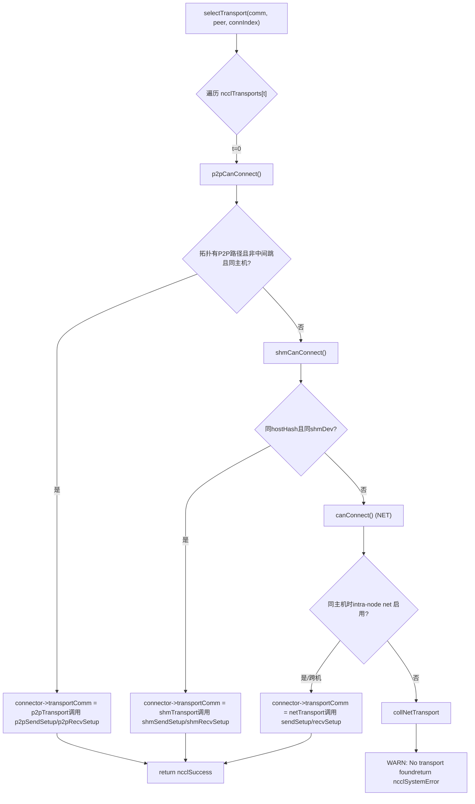
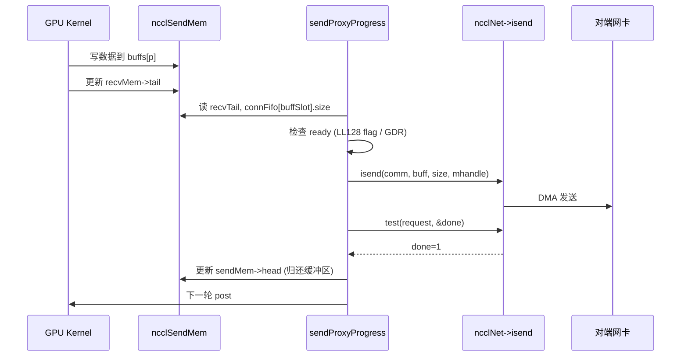

# Chapitre 11 : Abstraction de la couche transport : comment P2P, SHM, NET, NVLS s'unifient sous une même interface

Dans le chapitre précédent, nous avons plongé dans le kernel d'algorithme, voyant comment Ring AllReduce découpe les données puis effectue une réduction en deux phases, et comment Tree AllReduce utilise une structure arborescente pour réduire la latence — mais ces algorithmes ne définissent que la vue logique du « qui envoie à qui, quel chunk envoyer ». Les données doivent finalement traverser de véritables liens physiques : NVLink, PCIe, mémoire partagée ou carte réseau. Ce chapitre décortique le répertoire src/transport, pour voir comment NCCL utilise une interface unifiée ncclTransport pour masquer les quatre canaux physiques P2P, SHM, NET, NVLS sous un même visage, accomplissant le dernier kilomètre de la topologie algorithmique au transport physique.

# I. Interface unifiée : comment ncclTransport masque quatre canaux physiques

## Modèle intuitif

Imaginez une société de logistique : que le client envoie un colis intra-ville (P2P), une transmission intra-bâtiment (SHM), un transport inter-provincial (NET) ou une ligne dédiée directe (NVLS), l'accueil ne remplit qu'un seul « bordereau d'expédition ». Ce bordereau est la structure`ncclTransport`— elle stipule que chaque mode de transport doit fournir`canConnect`、`setup`、`connect`、`free`et d'autres actions fixes. Sans cette couche d'abstraction, les algorithmes de niveau supérieur devraient écrire quatre ensembles de`if-else`pour déterminer quel lien emprunter, et l'ajout d'un nouveau matériel obligerait à modifier tous les algorithmes.

## Structures de données et disposition mémoire

NCCL utilise un tableau global pour enregistrer tous les transports, l'ordre étant la priorité :

[FACT:src/transport.cc:15-20]

```c
struct ncclTransport* ncclTransports[NTRANSPORTS] = {
  &p2pTransport,
  &shmTransport,
  &netTransport,
  &collNetTransport,
};
```

L'ordre du tableau détermine l'ordre de sélection : P2P en premier, puis SHM, puis NET, enfin CollNet. Chaque transport est décrit par une structure`ncclTransport`, qui contient un pointeur de fonction`canConnect`et deux`ncclTransportComm`(un pour send, un pour recv). Prenons P2P comme exemple :

[FACT:src/transport/p2p.cc:1493-1498]

```c
struct ncclTransport p2pTransport = {"P2P",
                                     p2pCanConnect,
                                     {p2pSendSetup, p2pSendConnect, p2pSendFree, NULL, p2pSendProxySetup, NULL,
                                      p2pSendProxyFree, NULL, p2pProxyRegister, p2pProxyDeregister},
                                     {p2pRecvSetup, p2pRecvConnect, p2pRecvFree, NULL, p2pRecvProxySetup, NULL,
                                      p2pRecvProxyFree, NULL, p2pProxyRegister, p2pProxyDeregister}};
```

`ncclTransportComm`L'ordre des champs de`setup`est fixe, ce sont des « slots de cycle de vie » :`connect`(préparer les ressources),`free`(échanger les informations de connexion),`proxySharedInit`(libérer),`proxySetup`、`proxyConnect`、`proxyFree`、`proxyProgress`、`proxyRegister`、`proxyDeregister`(initialisation du partage proxy),`proxyProgress`. Notez que le slot`NULL`de P2P est`proxyProgress`— car P2P passe par une lecture/écriture directe de la mémoire GPU du pair, sans nécessiter de thread proxy host pour transporter les données ; tandis que le`sendProxyProgress`/`recvProxyProgress`de NET est

## , car l'I/O de la carte réseau doit être pilotée par un thread host.

Walkthrough guidé par scénario : comment une connexion sélectionne un transport`selectTransport`：

[FACT:src/transport.cc:23-44]

```c
template 
static ncclResult_t selectTransport(struct ncclComm* comm, struct ncclTopoGraph* graph, struct ncclConnect* connect,
                                    int channelId, int peer, int connIndex, int* transportType) {
  struct ncclPeerInfo* myInfo = comm->peerInfo + comm->rank;
  struct ncclPeerInfo* peerInfo = comm->peerInfo + peer;
  struct ncclConnector* connector = (type == 1) ? comm->channels[channelId].peers[peer]->send + connIndex :
                                                  comm->channels[channelId].peers[peer]->recv + connIndex;
  for (int t = 0; t send : &transport->recv;
    int ret = 0;
    NCCLCHECK(transport->canConnect(&ret, comm, graph, myInfo, peerInfo));
    if (ret) {
      connector->transportComm = transportComm;
      NCCLCHECK(transportComm->setup(comm, graph, myInfo, peerInfo, connect, connector, channelId, connIndex));
      if (transportType) *transportType = t;
      return ncclSuccess;
    }
  }
  WARN("No transport found for rank %d[%lx] -> rank %d[%lx]", myInfo->rank, myInfo->busId, peerInfo->rank,
       peerInfo->busId);
  return ncclSystemError;
}
```

`type==1`indique la direction send,`type==0`indique la direction recv. La boucle interroge successivement chaque transport avec`canConnect`: retourne`ret=1`signifie « je peux faire ce travail », pointe immédiatement`connector->transportComm`vers la direction correspondante de ce transport, et appelle son`setup`. Si tous les transports retournent 0, affiche un avertissement et retourne`ncclSystemError`。

`canConnect`La logique de décision reflète les « frontières de territoire » de chaque transport. Prenons P2P comme exemple :

[FACT:src/transport/p2p.cc:129-157]

```c
ncclResult_t p2pCanConnect(int* ret, struct ncclComm* comm, struct ncclTopoGraph* graph, struct ncclPeerInfo* info1,
                           struct ncclPeerInfo* info2) {
  initCeOperation();
  int intermediateRank;
  int isCrossClique;
  NCCLCHECK(ncclTopoCheckP2p(comm, comm->topo, info1->rank, info2->rank, ret, NULL, &intermediateRank, NULL,
                             &isCrossClique));
  if (*ret == 0) return ncclSuccess;
  if (intermediateRank != -1) {
    if (useMemcpy) *ret = 0;
    return ncclSuccess;
  }
  if (!isCrossClique) {
    int useNet = 0;
    NCCLCHECK(ncclTopoCheckNet(comm->topo, info1->rank, info2->rank, &useNet));
    if (useNet) {
      *ret = 0;
      return ncclSuccess;
    }
  }
  if (info1->hostHash != comm->peerInfo[comm->rank].hostHash || info1->hostHash != info2->hostHash) {
    return ncclSuccess;
  }
  ...
```

Chaîne de décision de P2P : on demande d'abord à la topologie « y a-t-il un chemin P2P entre les deux rank » ; s'il y a des sauts intermédiaires (`intermediateRank != -1`) et que CE memcpy est activé, on abandonne P2P au profit de SHM/NET ; si la topologie suggère de passer par le réseau (`useNet`), on abandonne aussi ; enfin on vérifie si c'est le même hôte. La décision de SHM est plus simple :

[FACT:src/transport/shm.cc:61-83]

```c
static ncclResult_t shmCanConnect(int* ret, struct ncclComm* comm, struct ncclTopoGraph* graph,
                                  struct ncclPeerInfo* info1, struct ncclPeerInfo* info2) {
  *ret = 0;
  initShmLocality();
  if (ncclParamShmDisable() == 1) return ncclSuccess;
  int useNet = 0;
  NCCLCHECK(ncclTopoCheckNet(comm->topo, info1->rank, info2->rank, &useNet));
  if (useNet) return ncclSuccess;
  if (info1->hostHash != info2->hostHash) return ncclSuccess;
  if (info1->shmDev != info2->shmDev) return ncclSuccess;
  *ret = 1;
  return ncclSuccess;
}
```

SHM exige le même hôte (`hostHash`identique) et le partage du même`/dev/shm`（`shmDev`identique, utilisé pour la communication entre conteneurs). NET retourne presque toujours 1, et ne vérifie si le net intra-node est désactivé que sur le même hôte :

[FACT:src/transport/net.cc:160-168]

```c
static ncclResult_t canConnect(int* ret, struct ncclComm* comm, struct ncclTopoGraph* graph, struct ncclPeerInfo* info1,
                               struct ncclPeerInfo* info2) {
  *ret = 1;
  if (info1->hostHash == info2->hostHash) {
    NCCLCHECK(ncclTopoCheckNet(comm->topo, info1->rank, info2->rank, ret));
  }
  return ncclSuccess;
}
```

NET est le « filet de sécurité » — tant que personne devant ne prend le relais, il le prend. Le`canConnect`de NVLS retourne directement 0 :

[FACT:src/transport/nvls.cc:21-26]

```c
ncclResult_t nvlsCanConnect(int* ret, struct ncclComm* comm, struct ncclTopoGraph* graph, struct ncclPeerInfo* info1,
                            struct ncclPeerInfo* info2) {
  // This transport cannot be used for p2p
  *ret = 0;
  return ncclSuccess;
}
```

NVLS ne passe pas par le chemin de connexion peer-to-peer conventionnel, il établit un groupe multicast séparément via`ncclNvlsSetup`, donc`canConnect`retourne toujours 0.



## Réflexions de conception

> **[Design Inference & Architectural Trade-offs]**
> Pourquoi utiliser « ordre du tableau + vote canConnect » plutôt qu'une table de routage explicite ? Parce que la topologie est dynamique : la même machine peut, en raison de`NCCL_P2P_DISABLE`, de l'isolation des conteneurs, de la disponibilité de CUDA IPC et d'autres facteurs, rendre P2P indisponible, et dans ce cas rétrograder automatiquement vers SHM ou NET. Le mécanisme de vote permet à chaque transport de juger lui-même « si je peux le faire » ; ajouter un transport ne nécessite que d'ajouter une entrée dans le tableau, sans modifier la logique de sélection. C'est l'incarnation du principe ouvert-fermé dans la programmation système.

# II. P2P : les quatre formes de la connexion directe entre GPU d'une même machine

## Modèle intuitif

P2P consiste à « se passer directement des choses entre voisins » — le GPU 0 lit et écrit directement la mémoire du GPU 1, sans passer par le CPU ni la carte réseau. Sans P2P, la communication multi-GPU sur une même machine doit passer par la mémoire hôte, doublant la latence et réduisant de moitié la bande passante.

## Structures de données et disposition mémoire

P2P comporte quatre formes internes, distinguées par`enum p2pType`:

[FACT:src/transport/p2p.cc:19-24]

```c
enum p2pType {
  P2P_DIRECT,
  P2P_INTERMEDIATE,
  P2P_IPC,
  P2P_CUMEM
};
```

- `P2P_DIRECT`: GPU différents dans le même processus, accès direct par pointeur (le plus rapide).
- `P2P_INTERMEDIATE`: pas de connexion directe entre les deux GPU, nécessite un transfert via un GPU intermédiaire.
- `P2P_IPC`: inter-processus, utilisation du traditionnel`cudaIpcOpenMemHandle`pour importer la mémoire de l'autre partie.
- `P2P_CUMEM`: inter-processus, import via l'API cuMem (`cuMemExportToShareableHandle`), prenant en charge une gestion mémoire plus fine.

Structure de ressource principale :

[FACT:src/transport/p2p.cc:79-94]

```c
struct p2pResources {
  enum p2pType type;
  union {
    struct ncclSendMem* sendDevMem;
    struct ncclRecvMem* recvDevMem;
  };
  void* sendMemIpc;
  int sendMemSameProc;
  void* recvMemIpc;
  int recvMemSameProc;
  // CE memcpy support
  struct p2pShmProxyInfo proxyInfo;
  struct p2pShm* shm;
  struct p2pShm* devShm;
  ncclShmIpcDesc_t desc;
};
```

`sendDevMem`/`recvDevMem`est une union — l'émetteur ne se soucie que de`sendDevMem`, le récepteur ne se soucie que de`recvDevMem`, partageant un même bloc mémoire.`sendMemIpc`/`recvMemIpc`conserve le handle de mémoire importée de l'autre partie,`sendMemSameProc`/`recvMemSameProc`marque s'il s'agit du même processus (détermine si on utilise`ncclCuMemFreeAddr`ou`cudaIpcCloseMemHandle`）。

lors de la libération)`p2pConnectInfo`La structure d'information de connexion

[FACT:src/transport/p2p.cc:38-44]

```c
struct p2pConnectInfo {
  int rank;
  int read;
  struct ncclP2pBuff p2pBuff;
  // Used by CE memcpy
  ncclShmIpcDesc_t desc;
};
static_assert(sizeof(struct p2pConnectInfo) transportResources = resources;
  int useRead, intermediateRank;
  NCCLCHECK(p2pGetInfo(comm, myInfo, peerInfo, &useRead, &intermediateRank));
  if (useMemcpy) useRead = 0;
  ...
  int sendSize = sizeof(struct ncclSendMem);
  if (info->read) sendSize += comm->buffSizes[NCCL_PROTO_SIMPLE];
  ALIGN_SIZE(sendSize, CUDA_IPC_MIN);
  ...
```

Copier`sendSize`Points clés :`ncclSendMem`En mode P2P Read, il faut ajouter en plus la taille du tampon du protocole SIMPLE — car en mode lecture, le tampon SIMPLE de l'émetteur est lu directement par le récepteur, et doit être alloué avec`ALIGN_SIZE(sendSize, CUDA_IPC_MIN)`dans le même bloc de mémoire partageable.

garantit que la taille est alignée sur la granularité minimale de CUDA IPC.`intermediateRank`Ensuite, selon

[FACT:src/transport/p2p.cc:416-437]

```c
  if (intermediateRank == -1) {
    info->rank = myInfo->rank;
    if (P2P_SAME_PID(myInfo, peerInfo) && ncclParamP2pDirectDisable() == 0 && useMemcpy == 0) {
      resources->type = P2P_DIRECT;
      ...
    } else {
      if (ncclCuMemEnable()) {
        resources->type = P2P_CUMEM;
        ...
      } else {
        resources->type = P2P_IPC;
        ...
      }
    }
    send->conn.flags |= info->read ? NCCL_P2P_READ : NCCL_P2P_WRITE;
  } else {
    resources->type = P2P_INTERMEDIATE;
    info->rank = intermediateRank;
    ...
  }
```

`P2P_SAME_PID`Copier

[FACT:src/transport/p2p.cc:334-335]

```c
#define P2P_SAME_PID(MYINFO, PEERINFO) \
  ((MYINFO->hostHash == PEERINFO->hostHash) && (MYINFO->pidHash == PEERINFO->pidHash))
```

Copier`P2P_DIRECT`Même processus, direct non désactivé et memcpy non activé, c'est le plus rapide

— on prend directement le pointeur de l'autre partie. Sinon, on passe par IPC/CUMEM.

[FACT:src/transport/p2p.cc:457-468]

```c
  NCCLCHECK(ncclProxyConnect(comm, TRANSPORT_P2P, 1, info->rank, &send->proxyConn));
  if (useMemcpy) {
    NCCLCHECK(ncclProxyCallBlocking(comm, &send->proxyConn, ncclProxyMsgSetup, NULL, 0, &resources->proxyInfo,
                                    sizeof(struct p2pShmProxyInfo)));
    memcpy(&info->desc, &resources->proxyInfo.desc, sizeof(ncclShmIpcDesc_t));
  } else {
    NCCLCHECK(ncclProxyCallBlocking(comm, &send->proxyConn, ncclProxyMsgSetup, &req, sizeof(struct ncclP2pRequest),
                                    &info->p2pBuff, sizeof(struct ncclP2pBuff)));
    NCCLCHECK(p2pMap(comm, &send->proxyConn, myInfo, comm->peerInfo + info->rank, &info->p2pBuff,
                     (void**)&resources->sendDevMem, &resources->sendMemIpc));
    resources->sendMemSameProc = P2P_SAME_PID(myInfo, (comm->peerInfo + info->rank));
  }
```

`ncclProxyCallBlocking`Copier`p2pSendProxySetup`est un RPC synchrone : le thread host envoie un message au thread proxy, le thread proxy appelle`ncclP2pBuff`pour allouer un tampon partageable, et renvoie`p2pMap`(contenant le handle IPC). Puis

`p2pMap`mappe le tampon de l'autre partie dans l'espace d'adressage local.

[FACT:src/transport/p2p.cc:349-390]

```c
static ncclResult_t p2pMap(struct ncclComm* comm, struct ncclProxyConnector* proxyConn, struct ncclPeerInfo* myInfo,
                           struct ncclPeerInfo* peerInfo, struct ncclP2pBuff* p2pBuff, void** devMem, void** ipcPtr) {
  if (P2P_SAME_PID(myInfo, peerInfo)) {
    if (peerInfo->cudaDev != myInfo->cudaDev) {
      cudaError_t err = cudaDeviceEnablePeerAccess(peerInfo->cudaDev, 0);
      ...
      if (ncclCuMemEnable()) {
        NCCLCHECK(ncclCuMemAllocAddr(devMem, &p2pBuff->ipcDesc.memHandle, p2pBuff->size));
        CUCHECK(cuMemRelease(p2pBuff->ipcDesc.memHandle));
        *ipcPtr = *devMem;
        ...
      } else {
        *devMem = p2pBuff->directPtr;
        *ipcPtr = NULL;
      }
    } else {
      *devMem = p2pBuff->directPtr;
      *ipcPtr = NULL;
    }
  } else {
    NCCLCHECK(ncclP2pImportShareableBuffer(comm, peerInfo->rank, p2pBuff->size, &p2pBuff->ipcDesc, devMem,
                                           p2pBuff->directPtr, ncclMemOffload));
    *ipcPtr = *devMem;
  }
  return ncclSuccess;
}
```

Copier`cudaDeviceEnablePeerAccess`Même processus, GPU différents : d'abord`directPtr`ouvre le canal P2P, puis on utilise directement`ncclP2pImportShareableBuffer`(car l'espace d'adressage est partagé dans le même processus). Inter-processus : on appelle

## pour importer le handle mémoire de l'autre partie.

Contrôle de concurrence et interaction matérielle`ncclSendMem`/`ncclRecvMem`La synchronisation de P2P repose sur`head`/`tail`dans`head`le pointeur`tail`L'émetteur écrit

[FACT:src/transport/p2p.cc:571-576]

```c
  } else {
    send->conn.tail = &remDevMem->tail;
    send->conn.head = &resources->sendDevMem->head;
    send->conn.ptrExchange = &resources->sendDevMem->ptrExchange;
    send->conn.redOpArgExchange = resources->sendDevMem->redOpArgExchange;
  }
```

`head`pour dire à l'émetteur « jusqu'où j'ai lu ». C'est un producteur-consommateur sans verrou typique :`sendDevMem`，`tail`Copier`remDevMem`pointe vers le local

## pointe vers l'autre partie

**. Le kernel GPU réalise la synchronisation inter-GPU en lisant et écrivant ces deux pointeurs, sans intervention du CPU.**Guide de production pour éviter les pièges`p2pSendConnect`：

[FACT:src/transport/p2p.cc:551-559]

```c
  for (int p = 0; p read && p == NCCL_PROTO_SIMPLE) {
      /* For P2P Read the SIMPLE buffer is local (ncclSendMem) */
      if (resources->sendDevMem == NULL) return ncclInternalError; // We should not use read + memcpy
      send->conn.buffs[p] = (char*)(resources->sendDevMem + 1);
    } else {
      send->conn.buffs[p] = buff;
      buff += comm->buffSizes[p];
    }
  }
```

Regarder`read=1`Copier`sendDevMem==NULL`Si`ncclInternalError`mais`NCCL_P2P_READ_ENABLE=1`, retourne directement`NCCL_P2P_USE_CUDA_MEMCPY=1`. En production, si vous voyez cette erreur, vérifiez si

**et** `p2pSendFree`sont définis simultanément — leurs sémantiques sont en conflit.`sendMemSameProc`Piège 2 : ordre de libération inter-processus.

[FACT:src/transport/p2p.cc:624-651]

```c
ncclResult_t p2pSendFree(struct ncclComm* comm, struct ncclConnector* send) {
  struct p2pResources* resources = (struct p2pResources*)send->transportResources;
  if (resources) {
    if (ncclCuMemEnable()) {
      if (resources->sendMemIpc) {
        if (resources->sendMemSameProc) {
          NCCLCHECK(ncclCuMemFreeAddr(resources->sendMemIpc, comm->memManager));
        } else {
          NCCLCHECK(ncclCudaFree(resources->sendMemIpc, comm->memManager));
        }
      }
      ...
```

détermine le mode de libération :`ncclCuMemFreeAddr`Copier`ncclCudaFree`(libérer la mémoire physique). Une inversion provoque une fuite mémoire ou un use-after-free.

# III. SHM : la bataille du « qui fournit la mémoire » dans la mémoire partagée

## Modèle intuitif

SHM est comme « deux processus partageant un tableau blanc » — l'émetteur écrit, le récepteur lit. Mais chez qui placer le tableau blanc ? Chez l'émetteur (sender-side), et le récepteur vient lire ; ou chez le récepteur (receiver-side), et l'émetteur vient écrire ? C'est le problème que le paramètre`NCCL_SHM_LOCALITY`doit résoudre.

## Structures de données et disposition mémoire

[FACT:src/transport/shm.cc:28-34]

```c
struct shmSendResources {
  struct ncclRecvMem* remHostMem;
  struct ncclRecvMem* devRemHostMem;
  ncclShmIpcDesc_t remDesc;
  struct ncclSendMem* hostMem;
  struct ncclSendMem* devHostMem;
};

struct shmRecvResources {
  struct ncclSendMem* remHostMem;
  struct ncclSendMem* devRemHostMem;
  ncclShmIpcDesc_t remDesc;
  struct ncclRecvMem* hostMem;
  struct ncclRecvMem* devHostMem;
};
```

Attention`hostMem`et`devHostMem`apparaissent par paires :`hostMem`est un pointeur côté host,`devHostMem`est un pointeur côté device (via UVA ou mappage cuMem).`remHostMem`/`devRemHostMem`est le mappage local de la mémoire partagée du pair.

## Walkthrough guidé par scénario : choix de la locality pour SHM

`shmSendSetup`détermine la taille de mémoire à allouer selon la locality :

[FACT:src/transport/shm.cc:88-119]

```c
static ncclResult_t shmSendSetup(struct ncclComm* comm, struct ncclTopoGraph* graph, struct ncclPeerInfo* myInfo,
                                 struct ncclPeerInfo* peerInfo, struct ncclConnect* connectInfo,
                                 struct ncclConnector* send, int channelId, int connIndex) {
  struct shmSendResources* resources;
  struct shmConnectInfo* info = (struct shmConnectInfo*)connectInfo;
  size_t shmSize = sizeof(struct ncclSendMem);
  struct shmRequest req;

  NCCLCHECK(ncclCalloc(&resources, 1));
  send->transportResources = resources;

  if (shmLocality == SHM_SEND_SIDE) {
    for (int p = 0; p buffSizes[p];
  }
  req.size = shmSize;
  if (myInfo->hostHash == peerInfo->hostHash && myInfo->pidHash == peerInfo->pidHash) req.legacy = true;
  else req.legacy = false;

  NCCLCHECK(ncclProxyConnect(comm, TRANSPORT_SHM, 1, myInfo->rank, &send->proxyConn));
  NCCLCHECK(ncclProxyCallBlocking(comm, &send->proxyConn, ncclProxyMsgSetup, (void*)&req, sizeof(struct shmRequest),
                                  (void*)info, sizeof(struct shmConnectInfo)));

  info->rank = comm->rank;
  resources->hostMem = (struct ncclSendMem*)info->buf.hptr;
  resources->devHostMem = (struct ncclSendMem*)info->buf.dptr;
  ...
```

`shmLocality == SHM_SEND_SIDE`, l'émetteur alloue le tampon de données (`shmSize`plus tous les tampons de protocole) ; sinon, il n'alloue que la structure de contrôle`ncclSendMem`.`req.legacy`indique si c'est le même processus — même processus peut utiliser le`mmap`traditionnel, inter-processus nécessite cuMem ou un fichier`/dev/shm`.

`shmSendConnect`décide selon la locality si`buffs`pointe vers le local ou le pair :

[FACT:src/transport/shm.cc:153-176]

```c
static ncclResult_t shmSendConnect(struct ncclComm* comm, struct ncclConnect* connectInfo, int nranks, int rank,
                                   struct ncclConnector* send) {
  struct shmConnectInfo* info = (struct shmConnectInfo*)connectInfo;
  struct shmSendResources* resources = (struct shmSendResources*)send->transportResources;
  char* buff;

  NCCLCHECK(ncclShmImportShareableBuffer(comm, info->rank, &info->desc, (void**)&resources->remHostMem,
                                         (void**)&resources->devRemHostMem, &resources->remDesc));

  buff = shmLocality == SHM_SEND_SIDE ? (char*)(resources->devHostMem + 1) : (char*)(resources->devRemHostMem + 1);
  for (int p = 0; p conn.buffs[p] = buff;
    buff += comm->buffSizes[p];
  }
  send->conn.tail = &resources->devRemHostMem->tail;
  send->conn.head = &resources->devHostMem->head;
  send->conn.stepSize = comm->buffSizes[NCCL_PROTO_SIMPLE] / NCCL_STEPS;
  ...
```

`SHM_SEND_SIDE`：`buffs`pointe vers le local`devHostMem`(l'émetteur écrit dans sa propre mémoire) ;`SHM_RECV_SIDE`：`buffs`pointe vers le pair`devRemHostMem`(l'émetteur écrit dans la mémoire du récepteur).`head`pointe toujours vers le local,`tail`pointe toujours vers le pair — car l'émetteur met à jour`head`, le récepteur met à jour`tail`。

## Réflexions de conception

> **[Design Inference & Architectural Trade-offs]**
> Pourquoi`SHM_RECV_SIDE`par défaut ? Parce que le récepteur doit généralement copier les données de la mémoire partagée vers sa propre mémoire GPU ; si la mémoire partagée est locale au récepteur, le chemin de copie est plus court (mémoire locale → GPU local), évitant les accès inter-NUMA. Bien que l'émetteur écrive dans une mémoire distante, ce qui ajoute une écriture inter-nœuds, l'émetteur est généralement un GPU à forte charge de calcul, et l'écriture peut se faire de manière asynchrone.

## Guide de production pour éviter les pièges

**Piège : le`/dev/shm`entre conteneurs n'est pas partagé.** `shmCanConnect`Vérifier`info1->shmDev != info2->shmDev`：

[FACT:src/transport/shm.cc:76-78]

```c
  TRACE(NCCL_INIT | NCCL_SHM, "peer1 shmDev %lx peer2 shmDev %lx", info1->shmDev, info2->shmDev);
  if (info1->shmDev != info2->shmDev) return ncclSuccess;
```

Si deux conteneurs montent des`/dev/shm`，`shmDev`différents, SHM se dégrade automatiquement en NET. En production, si une communication sur le même hôte passe par le réseau, vérifier si les montages`/dev/shm`des conteneurs sont cohérents.

# IV. NET : table de mappage et progression du proxy pour la transmission réseau

## Modèle intuitif

NET est comme une « livraison inter-villes » — les données sont empaquetées et confiées à la carte réseau, qui les envoie au pair via fibre optique. Mais la carte réseau ne connaît pas les adresses de mémoire GPU ; il faut une « table de mappage d'adresses » pour traduire les adresses virtuelles GPU en adresses physiques compréhensibles par la carte réseau. Cette table est`connectMap`。

## Structures de données et disposition mémoire

[FACT:src/transport/net.cc:73-86]

```c
struct connectMapMem {
  char* gpuPtr;
  char* cpuPtr;
  ssize_t size;
  ncclIpcDesc ipcDesc;
  ncclShmIpcDesc_t attachDesc;
  ncclShmIpcDesc_t createDesc;
};

struct connectMap {
  int sameProcess;
  int shared;
  int cudaDev;
  // First 3 bits of offsets determine the mem bank. 001 is host mem, 011 is dev mem, 101 is shared host mem and 111
  // is shared dev mem.
  struct connectMapMem mems[NCCL_NET_MAP_MEMS];
  // Offsets. 3 MSBs indicate mem bank, 111 indicates NULL.
  struct {
    uint32_t sendMem;
    uint32_t recvMem;
    uint32_t buffs[NCCL_NUM_PROTOCOLS];
  } offsets;
};
```

`connectMap`est un système de « banque de mémoire » :`mems`le tableau a 5 emplacements (`NCCL_NET_MAP_MEMS=5`), correspondant respectivement à host mem, dev mem, shared host mem, shared dev mem, GDC mem.`offsets`Chaque champ dans

est un entier de 32 bits, les 3 bits de poids fort encodent « quelle banque », les 29 bits de poids faible encodent « l'offset dans la banque ».

[FACT:src/transport/net.cc:36-46]

```c
#define NCCL_NET_MAP_OFFSET_BANK(mapStruct, offsetName) ((mapStruct)->offsets.offsetName >> 30)

#define NCCL_NET_MAP_OFFSET_NULL(mapStruct, offsetName) (((mapStruct)->offsets.offsetName >> 29) == 0)

#define NCCL_NET_MAP_GET_POINTER(mapStruct, cpuOrGpu, offsetName) \
  (NCCL_NET_MAP_OFFSET_NULL(mapStruct, offsetName) ? \
     NULL : \
     (mapStruct)->mems[NCCL_NET_MAP_OFFSET_BANK(mapStruct, offsetName)].cpuOrGpu##Ptr + \
       ((mapStruct)->offsets.offsetName & NCCL_NET_MAP_MASK_OFFSET))

#define NCCL_NET_MAP_DEV_MEM(mapStruct, offsetName) (((mapStruct)->offsets.offsetName & NCCL_NET_MAP_MASK_DEVMEM) != 0)
```

`NCCL_NET_MAP_GET_POINTER(map, gpu, sendMem)`Copie`offsets.sendMem`Après expansion : prendre les 2 bits de poids fort de`mems[bank].gpuPtr`comme index de banque, ajouter à`connectMap`l'offset des 29 bits de poids faible pour obtenir le pointeur réel. Cet encodage compresse « quelle région mémoire + offset dans la région » dans un entier de 32 bits, économisant la taille de transmission de

## .

`sendProxyConnect`Walkthrough guidé par scénario : établissement du mappage dans sendProxyConnect

[FACT:src/transport/net.cc:858-1041]

```c
static ncclResult_t sendProxyConnect(struct ncclProxyConnection* connection, struct ncclProxyState* proxyState,
                                     void* reqBuff, int reqSize, void* respBuff, int respSize, int* done) {
  struct sendNetResources* resources = (struct sendNetResources*)(connection->transportResources);
  ...
  if (resources->shared) {
    // Shared buffers
    ...
    if (resources->maxRecvs > 1 && ncclParamNetSharedComms()) {
      // Connect or reuse connection for a netdev/remote rank.
      ...
      if (comms->sendComm[resources->channelId] == NULL &&
          comms->activeConnect[resources->channelId] == (resources->tpLocalRank + 1)) {
        ret = proxyState->ncclNet->connect(proxyState->netContext, resources->netDev, req->handle,
                                           comms->sendComm + resources->channelId, &resources->netDeviceHandle);
      }
      ...
```

`maxRecvs > 1`Copie`activeConnect`active la « connexion partagée » : plusieurs channels réutilisent la même connexion réseau, réduisant le nombre de connexions.

Le tableau garantit qu'un seul local rank initie la connexion, évitant les doublons.

[FACT:src/transport/net.cc:933-956]

```c
  if (resources->shared == 0) {
    // Only allocate dedicated buffers for ring/tree, not for p2p
    for (int p = 0; p useGdr ? 1 : 0, proxyState->buffSizes[p],
                               buffs[p]);
      resources->buffSizes[p] = proxyState->buffSizes[p];
    }
  } else {
    // Get shared buffers
    int bank = resources->useGdr ? NCCL_NET_MAP_SHARED_DEVMEM : NCCL_NET_MAP_SHARED_HOSTMEM;
    struct connectMapMem* mapMem = map->mems + bank;
    NCCLCHECK(sharedNetBuffersInit(proxyState, resources->useGdr, resources->tpLocalRank, 0, map->sameProcess,
                                   proxyState->p2pnChannels, &mapMem->gpuPtr, &mapMem->cpuPtr, &mapMem->size,
                                   &mapMem->ipcDesc));
    resources->buffSizes[NCCL_PROTO_SIMPLE] = mapMem->size;
    ...
```

`NCCL_NET_MAP_ADD_POINTER`Copie`connectMap`：

[FACT:src/transport/net.cc:48-62]

```c
#define NCCL_NET_MAP_ADD_POINTER(mapStruct, shared, dev, memSize, offsetName) \
  do { \
    int bank = NCCL_NET_MAP_MASK_USED + (dev) * NCCL_NET_MAP_MASK_DEVMEM + (shared) * NCCL_NET_MAP_MASK_SHARED; \
    if ((shared) == 0) { \
      if (dev) { \
        (mapStruct)->offsets.offsetName = bank + (mapStruct)->mems[NCCL_NET_MAP_DEVMEM].size; \
        (mapStruct)->mems[NCCL_NET_MAP_DEVMEM].size += memSize; \
      } else { \
        (mapStruct)->offsets.offsetName = bank + (mapStruct)->mems[NCCL_NET_MAP_HOSTMEM].size; \
        (mapStruct)->mems[NCCL_NET_MAP_HOSTMEM].size += memSize; \
      } \
    } else { \
      (mapStruct)->offsets.offsetName = bank; \
    } \
  } while (0);
```

Copie`size`Tampon non partagé : écrire le`offsets`de la banque courante comme offset dans`size += memSize`, puis

— c'est un bump allocator. Tampon partagé : écrire directement le numéro de banque, offset à 0 (car le tampon partagé entier est une seule banque).

[FACT:src/transport/net.cc:1004-1035]

```c
  for (int p = 0; p buffers[p] = NCCL_NET_MAP_GET_POINTER(map, cpu, buffs[p]);
    if (resources->buffers[p]) {
#if CUDA_VERSION >= 11070
      int type = NCCL_NET_MAP_DEV_MEM(map, buffs[p]) ? NCCL_PTR_CUDA : NCCL_PTR_HOST;
      if (type == NCCL_PTR_CUDA && resources->useDmaBuf) {
        int dmabuf_fd;
        size_t dmaBufSize = resources->buffSizes[p];
        ALIGN_SIZE(dmaBufSize, ncclOsGetPageSize());
        CUCHECK(cuMemGetHandleForAddressRange((void*)&dmabuf_fd, (CUdeviceptr)resources->buffers[p], dmaBufSize,
                                              CU_MEM_RANGE_HANDLE_TYPE_DMA_BUF_FD,
                                              getHandleForAddressRangeFlags(resources->useGdr)));
        NCCLCHECK(proxyState->ncclNet->regMrDmaBuf(resources->netSendComm, resources->buffers[p],
                                                   resources->buffSizes[p], type, 0ULL, dmabuf_fd,
                                                   &resources->mhandles[p]));
        (void)close(dmabuf_fd);
      } else
#endif
      {
        NCCLCHECK(proxyState->ncclNet->regMr(resources->netSendComm, resources->buffers[p], resources->buffSizes[p],
                                             NCCL_NET_MAP_DEV_MEM(map, buffs[p]) ? NCCL_PTR_CUDA : NCCL_PTR_HOST,
                                             &resources->mhandles[p]));
      }
      ...
```

Copie`cuMemGetHandleForAddressRange`Privilégier le chemin DMA-BUF (`regMr`obtient le fd, le transmet au plugin de la carte réseau) ; en cas d'échec, revenir à

## (GDR nv_peermem traditionnel).

`sendProxyProgress`Contrôle de concurrence et interaction matérielle : pipeline en trois étapes de sendProxyProgress

[FACT:src/transport/net.cc:1324-1491]

```c
static ncclResult_t sendProxyProgress(struct ncclProxyState* proxyState, struct ncclProxyArgs* args) {
  ...
  if (args->state == ncclProxyOpProgress) {
    int p = args->protocol;
    int maxDepth = std::min(NCCL_STEPS, NCCL_SHARED_STEPS / args->nsubs);
    for (int s = 0; s nsubs; s++) {
      struct ncclProxySubArgs* sub = args->subs + s;
      ...
      // Post buffers to the GPU
      if (sub->posted nsteps && sub->posted done + maxDepth) {
        ...
        if (resources->shared) {
          ...
          volatile uint64_t* sendHead = resources->gdcSync ? resources->gdcSync : &resources->sendMem->head;
          sub->posted += args->sliceSteps;
          *sendHead = sub->base + sub->posted - NCCL_STEPS;
          if (resources->gdcSync) wc_store_fence(); // Flush out WC write
        } else {
          sub->posted += args->sliceSteps;
        }
        ...
        continue;
      }
      // Check whether we received data from the GPU and send it to the network
      if (sub->transmitted posted && sub->transmitted done + NCCL_STEPS) {
        ...
        if (connFifo[buffSlot].size != -1 && (*recvTail > tail || p == NCCL_PROTO_LL)) {
          ...
          if (ready) {
            ...
            NCCLCHECK(proxyState->ncclNet->isend(resources->netSendComm, buff, size, resources->tpRank,
                                                 sub->sendMhandle, phandle, sub->requests + buffSlot));
            ...
```

- **post**Copie`sendMem->head`: le thread proxy met à jour
- **transmit**, indiquant au GPU « le tampon est prêt, tu peux écrire les données ».`recvMem->tail`: vérifier si`connFifo[buffSlot].size != -1`a progressé (le GPU a fini d'écrire), vérifier`ncclNet->isend`(la taille des données est renseignée), puis appeler
- **done**pour lancer l'envoi asynchrone.`ncclNet->test`: appeler`sendMem->head`pour vérifier la fin de l'envoi, mettre à jour

`wc_store_fence()`et rendre le tampon.`gdcSync`est une barrière de fusion d'écriture — dans le cas GDRCopy, après que le CPU a écrit

## , il faut vider le tampon de fusion d'écriture, sinon le GPU ne verra pas la mise à jour.

**Guide de production pour éviter les pièges**Piège 1 : validation du flag du protocole LL128.

[FACT:src/transport/net.cc:1388-1403]

```c
          if (p == NCCL_PROTO_LL128) {
            ready = resources->useGdr;
            if (!ready) {
              uint64_t flag = sub->base + sub->transmitted + 1;
              int nFifoLines = DIVUP(connFifo[buffSlot].size, sizeof(uint64_t) * NCCL_LL128_LINEELEMS);
              volatile uint64_t* lines = (volatile uint64_t*)buff;
              ready = 1;
              for (int i = 0; i  0 && p == NCCL_PROTO_SIMPLE && needFlush) {
            struct recvNetResources* resources = (struct recvNetResources*)(subGroup->connection->transportResources);
            if (resources->gdcFlush) {
#if defined(__x86_64__)
              asm volatile("mfence" ::: "memory");
              asm volatile("mov (%0), %%eax" ::"l"(resources->gdcFlush) : "%eax", "memory");
#else
              std::atomic_thread_fence(std::memory_order_seq_cst);
              uint64_t dummy;
              NCCLCHECK(ncclGdrCudaRead(resources->gdrDesc, &dummy, resources->gdcFlush, sizeof(dummy)));
#endif
            }
```

`mfence`garantit que la lecture du poll CQE ne sera pas réordonnée avant la lecture du flush ;`mov (%0), %%eax`force le lancement d'une lecture PCIe, faisant stagner le CPU jusqu'à ce que toutes les écritures PCIe posted précédentes (y compris le DMA de la carte réseau) soient validées. C'est la clé, dans le scénario GDRCopy, pour éviter que « la carte réseau dise avoir fini d'écrire alors que les données sont encore dans le buffer PCIe ». Si l'on retire ce segment, le récepteur peut lire des données obsolètes.



# V. NVLS : groupes multicast et liaison mémoire UC/MC

## Modèle intuitif

NVLS est une « station de radio » — un rank écrit des données dans le groupe multicast, et le matériel les copie automatiquement vers tous les abonnés. L'AllReduce traditionnel nécessite N-1 transferts point à point, tandis que NVLS ne requiert qu'une écriture multicast + une lecture multicast. Sans NVLS, la latence de l'AllReduce à grande échelle croît linéairement avec le nombre de ranks.

## Structures de données et disposition mémoire

Le cœur de NVLS est la liaison entre « mémoire UC (unicast) » et « mémoire MC (multicast) ».`nvlsAllocBindUc`Allouer de la mémoire UC et la lier au groupe MC :

[FACT:src/transport/nvls.cc:225-277]

```c
static ncclResult_t nvlsAllocBindUc(struct ncclComm* comm, const struct ncclMcPartition* partition, size_t size,
                                    struct ncclNvlsUcSegment* outUc) {
  CUmemAllocationProp ucprop;
  ...
  ucprop.type = CU_MEM_ALLOCATION_TYPE_PINNED;
  ucprop.location.type = CU_MEM_LOCATION_TYPE_DEVICE;
  ucprop.location.id = comm->cudaDev;
  ucprop.requestedHandleTypes = ncclCuMemHandleType;
  CUCHECKGOTO(cuMemGetAllocationGranularity(&ucgran, &ucprop, CU_MEM_ALLOC_GRANULARITY_RECOMMENDED), ret, fail);
  ALIGN_SIZE(ucsize, ucgran);
  CUCHECKGOTO(cuMemAddressReserve((CUdeviceptr*)&ucptr, ucsize, ucgran, 0U, 0), ret, fail);
  CUCHECKGOTO(cuMemCreate(&ucHandle, ucsize, &ucprop, 0), ret, fail1);
  CUCHECKGOTO(cuMemMap((CUdeviceptr)ucptr, ucsize, 0, ucHandle, 0), ret, fail2);
  CUCHECKGOTO(cuMemSetAccess((CUdeviceptr)ucptr, ucsize, &comm->nvlsResources->accessDesc, 1), ret, fail3);
  CUDACHECKGOTO(cudaMemset(ucptr, 0, ucsize), ret, fail3);
  NCCLCHECKGOTO(ncclMemTrack(comm->memManager, ucptr, ucsize, ucHandle, ncclCuMemHandleType, ncclMemPersist), ret,
                fail3);
  NCCLCHECKGOTO(bootstrapIntraNodeBarrier(comm->bootstrap, comm->localRankToRank, comm->localRank, comm->localRanks,
                                          comm->localRankToRank[0]),
                ret, fail3);
  NCCLCHECKGOTO(ncclMcPartitionBindMem(partition, 0 /*offsetInPartition*/, ucHandle, 0 /*memOffset*/, ucsize), ret,
                fail3);
  ...
```

Processus :`cuMemCreate`allouer la mémoire physique →`cuMemMap`mapper vers une adresse virtuelle →`cuMemSetAccess`définir les permissions d'accès GPU →`ncclMcPartitionBindMem`lier la mémoire physique UC à l'offset spécifié du groupe MC. Après liaison, tout rank écrivant à une adresse MC verra le matériel copier les données vers toute la mémoire UC liée.

Attention`bootstrapIntraNodeBarrier`avant`cuMulticastBindMem`— le commentaire indique que c'est pour « mitigate the possible hang in cuMulticastBindMem during abort ». C'est une défense au niveau matériel : si un rank abort pendant la liaison, les autres ranks peuvent se bloquer dans`cuMulticastBindMem`Scénario guidé : disposition des buffers de ncclNvlsBufferSetup

## Copier

[FACT:src/transport/nvls.cc:279-368]

```c
ncclResult_t ncclNvlsBufferSetup(struct ncclComm* comm) {
  ...
  nvlsStepSize = comm->nvlsChunkSize;
  buffSize = nvlsStepSize * NCCL_STEPS;
  nvlsPerRankSize = nChannels * 2 * buffSize;
  nvlsTotalSize = nvlsPerRankSize * nHeads;
  ...
  if (resources->dataUc.ptr == NULL) {
    NCCLCHECKGOTO(nvlsAllocBindUc(comm, &resources->dataPartition, nvlsTotalSize, &resources->dataUc), res, fail);
  }
  ...
  for (int h = 0; h nRanks + 1 + h;
    for (int c = 0; c channels + c;
      struct ncclChannelPeer* peer = channel->peers[nvlsPeer];

      // Reduce UC -> MC
      peer->send[1].conn.buffs[NCCL_PROTO_SIMPLE] = (char*)resources->dataUc.ptr + (h * 2 * nChannels + c) * buffSize;
      peer->recv[0].conn.buffs[NCCL_PROTO_SIMPLE] =
        (char*)resources->dataPartition.ptr + (h * 2 * nChannels + c) * buffSize;

      // Broadcast MC -> UC
      peer->recv[1].conn.buffs[NCCL_PROTO_SIMPLE] =
        (char*)resources->dataUc.ptr + ((h * 2 + 1) * nChannels + c) * buffSize;
      peer->send[0].conn.buffs[NCCL_PROTO_SIMPLE] =
        (char*)resources->dataPartition.ptr + ((h * 2 + 1) * nChannels + c) * buffSize;
      ...
```

buffers (la moitié pour le reduce, la moitié pour le broadcast).`2 * nChannels`et`send[1]`sont dans la direction reduce (UC → MC),`recv[0]`et`recv[1]`sont dans la direction broadcast (MC → UC).`send[0]`est la mémoire UC locale,`dataUc.ptr`est l'adresse mappée du groupe MC.`dataPartition.ptr`Réflexions de conception

## 〔Inférences de conception et compromis architecturaux〕

> **[Design Inference & Architectural Trade-offs]**
> de NVLS retourne 0 ? Parce que NVLS n'est pas un transfert point à point — c'est un modèle multicast « un vers plusieurs ».`canConnect`La boucle de`selectTransport`est conçue pour les connexions point à point ; l'établissement de connexion NVLS passe par un chemin indépendant`ncclNvlsSetup`Mettre NVLS dans le tableau`ncclTransports`sert uniquement à unifier l'interface`free`(`nvlsSendFree`/`nvlsRecvFree`), la logique de connexion réelle étant totalement indépendante.

## Guide de production pour éviter les pièges

**Piège : MNNVL ne prend pas en charge l'enregistrement de buffer NVLS.**Voir`ncclNvlsSetup`：

À ce stade, NCCL, via la couche d'abstraction ncclTransport, unifie avec succès les quatre canaux hétérogènes P2P, SHM, NET et NVLS en une interface cohérente, le noyau algorithmique n'ayant plus besoin de se soucier de savoir si le sous-jacent est NVLink ou une carte réseau. Mais la couche transport ne résout que « comment abstraire les canaux », sans encore répondre à « comment les données sont pilotées de manière asynchrone ». Le chapitre suivant se concentrera sur src/proxy.cc et src/include/proxy.h, pour voir comment le thread proxy fait progresser de manière asynchrone les envois/réceptions réseau côté host, formant une relation producteur-consommateur avec le kernel GPU, et dévoilant le mécanisme clé de l'asynchronisme de NCCL.
