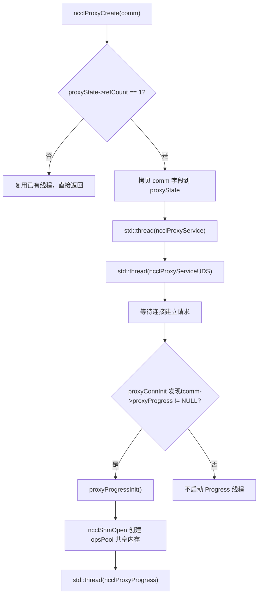
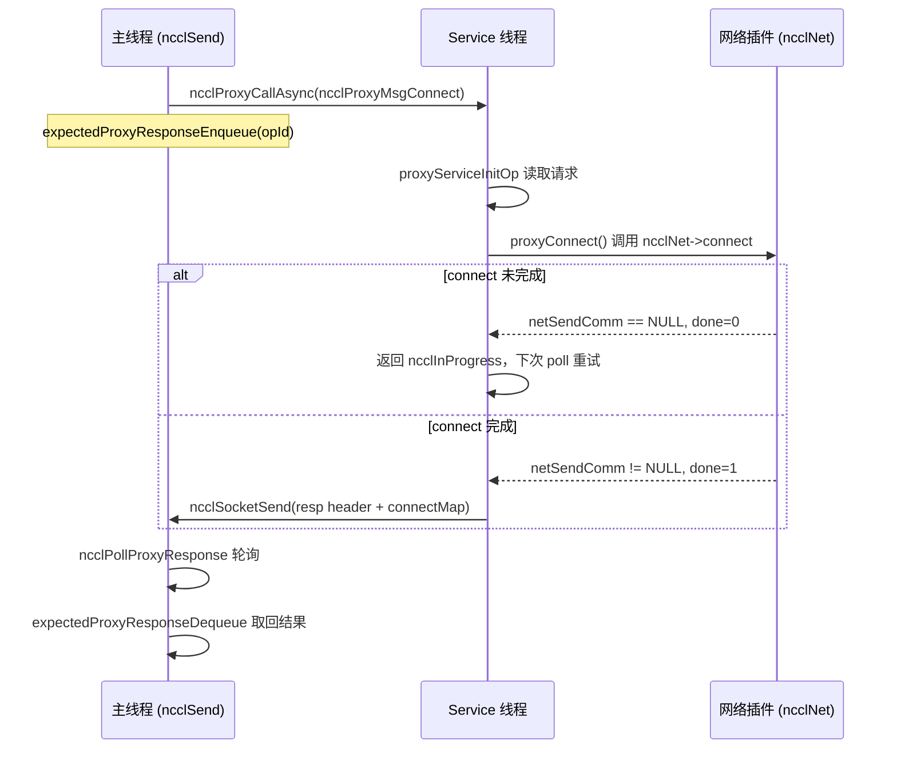
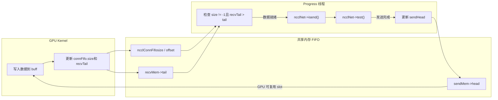

# Chapitre 12 : Ordonnancement asynchrone des threads proxy : comment proxy.cc découple l'I/O de l'exécution du kernel

Le chapitre précédent a décomposé la couche d'abstraction transport, montrant comment NCCL masque les différences P2P/SHM/NET/NVLS avec une interface unifiée. Mais la couche transport ne répond qu'à « par quel canal passent les données », sans encore répondre à « comment les données sont pilotées de manière asynchrone ». Si le kernel GPU se bloque directement en attente du réseau, les unités de calcul seront étranglées par l'I/O. Ce chapitre se concentre sur`src/proxy.cc`et`src/include/proxy.h`pour voir comment NCCL utilise des threads host indépendants pour extraire l'I/O réseau du chemin d'exécution du kernel, formant une relation producteur-consommateur avec le GPU.

# 12.1 Pourquoi des threads proxy : commençons par « qui attend le réseau »

## Modèle intuitif

Imaginez un restaurant : la cuisine (GPU kernel) ne s'occupe que de préparer les plats, le serveur (proxy thread) se charge de les apporter aux clients (pair réseau). Si l'on demandait au chef d'apporter lui-même les plats, il devrait arrêter de cuisiner à chaque trajet, et la cadence de service s'effondrerait. Le proxy de NCCL est ce serveur dédié — le kernel ne fait qu'écrire des données dans un buffer partagé et en lire, tandis que tout le sale boulot d'émission/réception réseau est confié aux threads proxy côté host.

> **[Design Inference & Architectural Trade-offs]**
> Que se passerait-il sans proxy ? Le GPU kernel est massivement parallèle en SIMT ; un warp bloqué sur du polling réseau gaspillerait la puissance de calcul de tout un SM ; plus fatal encore, l'émission/réception réseau implique des appels système socket, du polling verbs, la soumission de descripteurs DMA — des opérations impossibles à exécuter dans du code device. NCCL doit donc déplacer l'I/O réseau vers le host, en faisant échanger au kernel et au proxy des signaux « données prêtes » via une FIFO en mémoire partagée.

## La répartition des deux types de threads

NCCL lance côté host deux types de threads proxy aux responsabilités bien distinctes :

- **Thread Service**（`ncclProxyService`) : traite les requêtes du plan de contrôle — établissement de connexion, enregistrement mémoire, interrogation de FD. Il écoute un socket, reçoit les requêtes RPC du rank local, et fait progresser de manière asynchrone les opérations setup/connect, etc.
- **Thread Progress**（`ncclProxyProgress`) : traite le plan de données — c'est lui qui pilote réellement l'émission/réception réseau. Il récupère les proxy op depuis le pool en mémoire partagée, appelle le callback`proxyProgress`du transport pour faire avancer le transfert de données.

[FACT:src/include/proxy.h:343-345]affiche`ncclProxyState`détient à la fois`thread`(Service) et`threadUDS`(service UDS), tandis que le handle du thread Progress est caché dans`progressState.thread`[FACT:src/include/proxy.h:261-261]。

## Établissement de la relation producteur-consommateur

[FACT:src/proxy.cc:2130-2166]Le`ncclProxyCreate`de`refCount == 1`est le lieu de naissance des threads : lorsque`proxyState`(création de la première comm), il copie les champs clés de la comm dans`proxyProgressInit`, puis lance le thread Service et le thread UDS. Notez que le thread Progress n'est pas lancé ici — il est démarré paresseusement par[FACT:src/proxy.cc:1523-1524]。



copie`tcomm->proxyProgress`Ce schéma ancre la véritable branche de démarrage des threads : le thread Progress n'est créé que si

# est non nul (c'est-à-dire que ce transport nécessite une progression du plan de données).

## 12.2 Structures de données et disposition mémoire : pool de mémoire partagée et pool d'op

Panorama des structures centrales

**Le modèle de concurrence du proxy repose sur deux blocs de mémoire partagée ; comprendre leur disposition mémoire est le prérequis pour comprendre tout le mécanisme.`ncclProxyOpsPool`**（[FACT:src/include/proxy.h:218-226]Premier bloc :`/dev/shm`). C'est la « boîte de dépôt de tâches » entre le thread principal et le thread Progress, partagée entre processus via

| Champ | Type | Rôle |
| --- | --- | --- |
| `ops[]` | `ncclProxyOp[]` | Tableau d'op préalloué, taille`MAX_OPS_PER_PEER * NCCL_MAX_LOCAL_RANKS` |
| `nextOps` | `volatile int` | Index de tête de la liste chaînée des op en attente, -1 signifie vide |
| `nextOpsEnd` | `volatile int` | Index de queue de la liste chaînée des op en attente |
| `freeOps[]` | `volatile int[]` | Tête de la liste chaînée des op libres pour chaque local rank |
| `syncObjectsInitialized` | `int` | Indique si le mutex/cond a été initialisé |
| `mutex` / `cond` | `std::mutex` / `std::condition_variable` | Primitives de synchronisation inter-processus |

`MAX_OPS_PER_PEER`Définition de[FACT:src/include/proxy.h:218-226]`2 * MAXCHANNELS * 2 * NCCL_MAX_DEV_WORK_P2P_PER_BATCH`est

**. Le commentaire explique pourquoi c'est multiplié par 2 : chaque p2p work contient un proxy op send et un recv, d'où la multiplication par 2 ; la seconde multiplication par 2 sert à pouvoir stocker deux tours complets d'opérations, sinon impossible de « déposer la moitié, libérer la moitié ».`ncclProxyArgs`**（[FACT:src/include/proxy.h:174-209]Deuxième bloc :`ncclProxyPool`). C'est la « description d'op à l'exécution » utilisée en interne par le thread Progress, allouée depuis

, non partagée entre processus.

- `subs[NCCL_PROXY_MAX_SUBS]`Champs clés :`NCCL_PROXY_MAX_SUBS = MAXCHANNELS` [FACT:src/include/proxy.h:55-55]: tableau de sous-opérations,
- `progress`. Les opérations de même type de plusieurs channels sont agrégées dans plusieurs sub d'un même args.`proxyProgress`: pointeur de fonction, pointant vers le callback[FACT:src/include/proxy.h:176-176]。
- `next` / `nextPeer` / `proxyAppendPtr`du transport
- `state`：`ncclProxyOpNone` / `ncclProxyOpReady` / `ncclProxyOpProgress`: trois pointeurs de liste chaînée, formant une organisation complexe des op.[FACT:src/include/proxy.h:48-52]。

## Tri-état

`ncclProxyPool` [FACT:src/proxy.cc:50-53]Conception en couches du pool mémoire`PROXYARGS_ALLOCATE_SIZE`est une unité d'allocation par lots ; chaque pool contient`NCCL_MAX_OPS`(soit`ncclProxyArgs`。`allocateArgs` [FACT:src/proxy.cc:207-231]) de

```c
if (state->pool == NULL) {
    struct ncclProxyPool* newPool;
    NCCLCHECK(ncclCalloc(&newPool, 1));
    struct ncclProxyArgs* newElems = newPool->elems;
    for (int i = 0; i pool = newElems;
    newPool->next = state->pools;
    state->pools = newPool;
}
elem = state->pool;
state->pool = state->pool->next;
```

[FACT:src/proxy.cc:207-231]

> **[Design Inference & Architectural Trade-offs]**
> copie`ncclProxyArgs`〔Inférences de conception et compromis architecturaux〕`subs[MAXCHANNELS]`La motivation de conception ici est :`requests[NCCL_STEPS]`la structure

## est très volumineuse (contient

`ncclProxyOpsPool`tableau, chaque sub ayant lui-même`nextOps`、`nextOpsEnd`、`freeOps[]`), si chaque op était malloc individuellement, cela causerait une grave fragmentation mémoire et un surcoût d'allocation. L'allocation par lots + réutilisation par liste chaînée libre amortit le coût d'allocation jusqu'à le rendre quasi nul. Le commentaire « Make sure we allocate the memory close to the network thread » suggère qu'il s'agit d'affinité NUMA — le pool est créé lors de la première allocation du thread Progress, naturellement proche du CPU sur lequel ce thread s'exécute.`volatile int`Faux partage et variables atomiques

Les`ncclLocalOpAppend`dans[FACT:src/proxy.cc:503-513]：

```c
int freeOp = -1;
while (freeOp == -1) {
  freeOp = COMPILER_ATOMIC_EXCHANGE(&pool->freeOps[tpLocalRank], -1, std::memory_order_acquire);
  if (freeOp == -1) std::this_thread::yield();
}
```

. Ils sont lus et écrits simultanément par le thread principal et le thread Progress, mais NCCL ne protège pas tous les accès par des verrous — il utilise des opérations atomiques + ordonnancement mémoire pour garantir la correction.`atomic_exchange`Regardons`freeOps[tpLocalRank]`Défini à -1 et récupère l'ancienne valeur — c'est un « prélèvement préemptif » : celui qui réussit l'échange en premier obtient toute la liste libre. Lorsque le thread Progress restitue un op, il utilise une boucle CAS[FACT:src/proxy.cc:898-907]：

```c
oldFree = COMPILER_ATOMIC_LOAD(&pool->freeOps[i], std::memory_order_acquire);
do {
  pool->ops[freeOpEnd[i]].next = oldFree;
} while (!COMPILER_ATOMIC_COMPARE_EXCHANGE(&pool->freeOps[i], &oldFree, newFree,
                                           std::memory_order_release,
                                           std::memory_order_acquire));
```

> **[Design Inference & Architectural Trade-offs]**
> On utilise ici acquire/release plutôt que seq_cst, car il suffit de garantir que « l'écriture du pointeur next du nœud de liste » soit visible pour le préleveur, sans nécessiter d'ordre global.`freeOps[]`Chaque élément du tableau correspond à un local rank, naturellement répartis près de différentes lignes de cache, ce qui réduit le faux partage.

# 12.3 Plan de contrôle : établissement de connexion et mécanisme RPC

## Modèle intuitif

> **[Design Inference & Architectural Trade-offs]**
> Le thread Service agit comme une « réceptionniste » : lorsqu'un rank local veut établir une connexion réseau, il ne se connecte pas directement lui-même, mais envoie une requête RPC au thread Service, qui exécute setup/connect en son nom. Pourquoi ? Parce que l'établissement de connexion réseau (notamment la création de QP verbs, l'enregistrement mémoire) peut bloquer, et certaines ressources (comme le listen socket) doivent être détenues par un seul thread. En centralisant le plan de contrôle sur le thread Service, le thread principal peut continuer ses autres tâches de manière non bloquante.

## Encodage des requêtes RPC

`ncclProxyCallAsync` [FACT:src/proxy.cc:1369-1394]C'est l'émetteur du RPC. Il envoie séquentiellement via socket : type, pointeur de connexion, reqSize, respSize, reqBuff, opId.

```c
NCCLCHECKGOTO(ncclSocketSend(sock, &type, sizeof(int)), ret, error);
NCCLCHECKGOTO(ncclSocketSend(sock, &proxyConn->connection, sizeof(void*)), ret, error);
NCCLCHECKGOTO(ncclSocketSend(sock, &reqSize, sizeof(int)), ret, error);
NCCLCHECKGOTO(ncclSocketSend(sock, &respSize, sizeof(int)), ret, error);
if (reqSize) NCCLCHECKGOTO(ncclSocketSend(sock, reqBuff, reqSize), ret, error);
NCCLCHECKGOTO(ncclSocketSend(sock, &opId, sizeof(opId)), ret, error);
NCCLCHECK(expectedProxyResponseEnqueue(sharedProxyState, opId, respSize));
```

[FACT:src/proxy.cc:1369-1394]

Notez la dernière étape : après avoir envoyé la requête, il enregistre immédiatement l'opId dans la`expectedResponses`file. C'est la clé du RPC asynchrone — l'appelant n'attend pas la réponse, mais enregistre d'abord « j'attends la réponse pour cet opId », puis utilise`ncclPollProxyResponse`pour interroger.

## Implémentation de la file de réponses par liste chaînée

`expectedProxyResponseEnqueue` [FACT:src/proxy.cc:97-117]Utilise une liste simplement chaînée pour stocker les op en attente de réponse.`expectedProxyResponseStore` [FACT:src/proxy.cc:67-95]Lors de la réception d'une réponse, fait correspondre par opId, copie les données de réponse via memcpy dans le`respBuff`préalloué, marque`done = true`。`expectedProxyResponseDequeue` [FACT:src/proxy.cc:119-141]Lors de l'interrogation, recherche les réponses terminées et les retire.

Il y a un détail ici :`expectedProxyResponseStore`Vérifie si`respSize`correspond à[FACT:src/proxy.cc:72-75], sinon signale`ncclInternalError`. C'est de la programmation défensive — si le demandeur et le répondeur ont une compréhension incohérente de la taille de réponse, cela indique un protocole corrompu, et il faut échouer immédiatement plutôt que de continuer silencieusement.

## Boucle principale du thread Service

`ncclProxyService` [FACT:src/proxy.cc:1789-2016]Le cœur est une boucle poll. Il utilise`pollfds`un tableau pour gérer toutes les connexions, y compris le listen socket et le socket de chaque peer.

```c
while (stop == PROXY_RUNNING || npeers > 0) {
    if (COMPILER_ATOMIC_LOAD(proxyState->abortFlag, std::memory_order_acquire) != 0) stop = PROXY_ABORT;
    int ret = 0;
    const int timeout = asyncOpCount ? 0 : 500;
    ...
    ret = poll(activePollfds, nfds_to_poll, timeout);
```

[FACT:src/proxy.cc:1842-1863]

`timeout`Le choix de est très réfléchi : s'il y a des op asynchrones en cours (`asyncOpCount > 0`), le timeout est fixé à 0 (interrogation non bloquante), car il faut appeler fréquemment`proxyProgressAsync`pour les faire avancer ; sinon il est fixé à 500ms, pour éviter de brûler le CPU à vide. Le commentaire « never let proxy service thread blocks in poll, or it cannot receive abortFlag »[FACT:src/proxy.cc:1847-1847]précise pourquoi on ne peut pas bloquer indéfiniment — il faut se réveiller périodiquement pour vérifier abortFlag.

## Avancement des op asynchrones

`proxyProgressAsync` [FACT:src/proxy.cc:1626-1700]C'est le cœur de l'avancement des opérations asynchrones par le thread Service. Il distribue selon le type d'op vers différents callbacks de transport :

```c
if (op->type == ncclProxyMsgSetup) {
    res = op->connection->tcomm->proxySetup(op->connection, proxyState, op->reqBuff, op->reqSize, op->respBuff,
                                            op->respSize, &done);
} else if (op->type == ncclProxyMsgConnect) {
    res = op->connection->tcomm->proxyConnect(...);
} else if (op->type == ncclProxyMsgInit) {
    res = proxyConnInit(peer, connectionPool, proxyState, ...);
}
```

[FACT:src/proxy.cc:1631-1664]

Chaque callback porte un`done`paramètre de sortie. Si`done == 0`, cela signifie que l'opération n'est pas encore terminée (par exemple la connexion réseau est encore en poignée de main), retourne`ncclInProgress`, et la prochaine boucle continue l'avancement. Si`done == 1`, alors envoie l'en-tête de réponse + le corps de réponse au demandeur[FACT:src/proxy.cc:1681-1689]。



Ce diagramme de séquence ancre`sendProxyConnect`dans`*done = 0; return ncclInProgress`la vraie branche[FACT:src/transport/net.cc:913-916]。

# 12.4 Plan de données : comment le thread Progress pilote l'envoi/réception réseau

## Modèle intuitif

Le thread Progress est un « opérateur de convoyeur » : il surveille la FIFO dans le tampon partagé, dès que le GPU a écrit les données (size != -1 dans la FIFO), il appelle immédiatement`isend`pour envoyer les données ; dès que le réseau a fini de recevoir les données, il met à jour recvTail pour notifier le GPU qu'il peut lire. Tout le processus synchronise le GPU et le proxy via les pointeurs head/tail dans la FIFO, sans aucun verrou.

## Soumission des op : du thread principal au thread Progress

Le thread principal, dans`ncclProxySaveOp` [FACT:src/proxy.cc:591-761], détermine selon le pattern quels proxy op sont nécessaires, puis via`SaveProxy` → `ncclLocalOpAppend`écrit les op dans le pool de mémoire partagée.

`ncclLocalOpAppend` [FACT:src/proxy.cc:488-554]Le flux de :

1. Depuis`proxyOps->freeOp`ou`pool->freeOps[tpLocalRank]`prend un slot d'op libre.

2. `memcpy(op, proxyOp, sizeof(struct ncclProxyOp))`Copie le contenu de l'op dans la mémoire partagée[FACT:src/proxy.cc:515-515]。

3. Accroche l'op à`proxyOps->nextOps`la fin de la liste chaînée.

4. Si le nombre d'op accumulés atteint`MAX_OPS_PER_PEER`, déclenche une soumission par lots[FACT:src/proxy.cc:525-551]。

La logique de soumission par lots est très subtile : elle ne peut pas simplement envoyer tous les op, car « plusieurs op du même opCount doivent être soumis ensemble, sinon cela casse l'agrégation sub de proxyArgs ». Donc elle trouve la dernière frontière où opCount change, et ne soumet que jusqu'à celle-ci[FACT:src/proxy.cc:529-548]。

La soumission se fait via`ncclProxyPost` [FACT:src/proxy.cc:476-486], qui verrouille, met à jour`pool->nextOps`、`notify_one`et réveille le thread Progress.

## Boucle principale du thread Progress

`ncclProxyProgress` [FACT:src/proxy.cc:951-1011]La structure de :

```c
do {
    int idle = 1;
    ncclResult_t ret = progressOps(proxyState, state, state->active, &idle);
    ...
    if (idle || !state->active || (++proxyOpAppendCounter == ncclParamProgressAppendOpFreq())) {
      int added = 0;
      proxyOpAppendCounter = 0;
      ret = ncclProxyGetPostedOps(proxyState, &added);
      ...
    }
    lastIdle = idle;
    stopv = state->stop.load(std::memory_order_acquire);
} while ((stopv == 0 || (stopv == 1 && state->active)) &&
         COMPILER_ATOMIC_LOAD(proxyState->abortFlag, std::memory_order_acquire) == 0);
```

[FACT:src/proxy.cc:976-1009]

Il y a ici une optimisation de performance à noter :`proxyOpAppendCounter`le compteur[FACT:src/proxy.cc:974-974]. Le commentaire explique[FACT:src/proxy.cc:969-973]: appeler trop fréquemment`ncclProxyGetPostedOps`entraîne une régression des performances de communication pour les petits messages, donc tous les`ProgressAppendOpFreq`(par défaut 8) fois avant de récupérer un nouvel op.

## Agrégation des op : ProxyAppend

`ProxyAppend` [FACT:src/proxy.cc:437-474]Détermine si un op doit être « ajouté à un sub existant d'args » ou « créer un nouvel args ». Le critère de décision est`connection->shared && args->opCount == op->opCount` [FACT:src/proxy.cc:443-443]— les opérations de plusieurs channels sur la même connexion et le même opCount sont agrégées.

> **[Design Inference & Architectural Trade-offs]**
> Valeur de l'agrégation : les opérations de même type sur plusieurs channels sont fusionnées en un seul args, le thread Progress peut faire avancer tous les channels en une seule boucle, ce qui réduit les surcoûts d'appel de fonction et les invalidations de cache.`ncclProxyOpToArgs` [FACT:src/proxy.cc:368-435]Lors de l'ajout d'un sub, on vérifie`sliceSteps`、`chunkSteps`、`protocol`、`dtype`、`redOp`、`coll`si elles sont cohérentes[FACT:src/proxy.cc:401-406], sinon une erreur est signalée — c'est la ligne de défense contre les agrégations erronées.

## sendProxyProgress : machine à états à quatre phases côté envoi

`sendProxyProgress` [FACT:src/transport/net.cc:1324-1491]C'est le cœur du côté envoi. Il progresse sub par sub, chaque sub ayant quatre compteurs :`posted`、`transmitted`、`done`。

**Phase un : initialisation Ready** [FACT:src/transport/net.cc:1326-1339]

```c
sub->base = ROUNDUP(resources->step, args->chunkSteps);
resources->step = sub->base + sub->nsteps;
sub->posted = sub->transmitted = sub->done = 0;
```

`base`est le numéro de départ du step,`ROUNDUP`garantit l'alignement sur`chunkSteps`。`resources->step`accumulation, pour réserver l'espace du prochain op.

**Phase deux : Post du buffer au GPU** [FACT:src/transport/net.cc:1355-1376]

```c
if (sub->posted nsteps && sub->posted done + maxDepth) {
    int buffSlot = (sub->base + sub->posted) % NCCL_STEPS;
    if (resources->shared) {
        ...
        *sendHead = sub->base + sub->posted - NCCL_STEPS;
    } else {
        sub->posted += args->sliceSteps;
    }
}
```

`maxDepth`est la profondeur du pipeline[FACT:src/transport/net.cc:1343-1343], limite le nombre de steps simultanément in-flight. En mode shared, le proxy met à jour`sendHead`pour dire au GPU « ce slot peut être écrit ».

**Phase trois : vérifier si le GPU a fini d'écrire, lancer isend** [FACT:src/transport/net.cc:1378-1452]

```c
if (sub->transmitted posted && sub->transmitted done + NCCL_STEPS) {
    int buffSlot = (sub->base + sub->transmitted) % NCCL_STEPS;
    volatile uint64_t* recvTail = &resources->recvMem->tail;
    uint64_t tail = sub->base + sub->transmitted;
    if (connFifo[buffSlot].size != -1 && (*recvTail > tail || p == NCCL_PROTO_LL)) {
        int size = connFifo[buffSlot].size;
        ...
        NCCLCHECK(proxyState->ncclNet->isend(resources->netSendComm, buff, size, resources->tpRank,
                                             sub->sendMhandle, phandle, sub->requests + buffSlot));
        if (sub->requests[buffSlot] != NULL) {
            sub->transmitted += args->sliceSteps;
        }
    }
}
```

Le test clé ici est`connFifo[buffSlot].size != -1 && *recvTail > tail`— après que le GPU a écrit les données, il met à jour la taille de la FIFO et recvTail, le proxy ne lance isend que lorsque ces deux conditions sont satisfaites. Pour le protocole LL, comme il a une sémantique « zéro copie », il n'est pas nécessaire d'attendre recvTail.

**Phase quatre : vérifier la fin de l'envoi, mettre à jour sendHead** [FACT:src/transport/net.cc:1455-1481]

```c
if (sub->done transmitted) {
    int buffSlot = (sub->base + sub->done) % NCCL_STEPS;
    NCCLCHECK(proxyState->ncclNet->test(sub->requests[buffSlot], &done, &size));
    if (done) {
        connFifo[buffSlot].size = -1;
        std::atomic_thread_fence(std::memory_order_seq_cst);
        sub->done += args->sliceSteps;
        if (resources->shared == 0) {
            volatile uint64_t* sendHead = resources->gdcSync ? resources->gdcSync : &resources->sendMem->head;
            *sendHead = sub->base + sub->done;
        }
    }
}
```

`test`Après que

## recvProxyProgress : les quatre phases côté réception

`recvProxyProgress` [FACT:src/transport/net.cc:1493-1788]est plus complexe, car il implique un regroupement par sub (multirecv est utilisé quand plusieurs subs partagent le même recvComm).

**Phase un : regroupement par recvComm lors du Ready** [FACT:src/transport/net.cc:1495-1538]

```c
for (int s = 0; s nsubs; s++) {
    ...
    if (groupSize == maxRecvs) {
        groupSize = 0;
    } else if (s > 0) {
        int next;
        for (next = s; next nsubs; next++) {
            struct recvNetResources* nextRes = ...;
            if (nextRes->netRecvComm == recvComm) break;
        }
        if (next == args->nsubs) {
            groupSize = 0;
        } else if (s != next) {
            // swap subs
        }
    }
    groupSize++;
    ...
    for (int i = 0; i  **[Design Inference & Architectural Trade-offs]**
> Ce code regroupe les subs utilisant le même`recvComm`et enregistre`groupSize`. Pourquoi regrouper ? Parce que`irecv`supporte la réception de plusieurs buffers en une fois (multirecv), fusionner les requêtes de même comm en un seul appel réduit significativement le surcoût du plugin.

**Phase deux : lancer irecv** [FACT:src/transport/net.cc:1543-1631]

```c
if (subCount) {
    uint64_t step = subGroup->posted;
    void** requestPtr = subGroup->requests + (step % NCCL_STEPS);
    bool ignoreCompletion = ncclParamNetOptionalRecvCompletion() &&
                            ((args->protocol == NCCL_PROTO_LL128) || (args->protocol == NCCL_PROTO_LL)) &&
                            (subCount == 1);
    if (ignoreCompletion) *requestPtr = (void*)NCCL_NET_OPTIONAL_RECV_COMPLETION;
    NCCLCHECK(proxyState->ncclNet->irecv(resources->netRecvComm, subCount, ptrs, sizes, tags, mhandles, phandles,
                                         requestPtr));
    if (*requestPtr) {
        subGroup->recvRequestsCache[step % NCCL_STEPS] = *requestPtr;
        subGroup->recvRequestsSubCount = subCount;
        for (int i = 0; i groupSize; i++) {
            sub->posted += args->sliceSteps;
        }
    }
}
```

`ignoreCompletion`Optimisation[FACT:src/transport/net.cc:1608-1610]: pour la réception d'un seul buffer avec les protocoles LL/LL128, la notification de completion est optionnelle (car les données portent elles-mêmes un flag), on peut sauter la vérification de completion.

**Phase trois : vérifier la fin de la réception, mettre à jour recvTail** [FACT:src/transport/net.cc:1634-1743]

```c
NCCLCHECK(proxyState->ncclNet->test(subGroup->requests[step % NCCL_STEPS], &done, sizes));
if (done) {
    for (int i = 0; i groupSize; i++) {
        struct ncclProxySubArgs* sub = subGroup + i;
        int buffSlot = (sub->base + sub->received) % NCCL_STEPS;
        connFifo[buffSlot].size = -1;
        sub->received += args->sliceSteps;
    }
    ...
}
```

Après la fin de la réception, on réinitialise la taille de la FIFO, puis on entre dans la phase flush (le scénario GDRDMA nécessite un flush pour garantir la visibilité des données).

**Phase quatre : attendre la consommation par le GPU, mettre à jour done** [FACT:src/transport/net.cc:1745-1779]

```c
if (sub->transmitted > sub->done) {
    volatile uint64_t* sendHead = &resources->sendMem->head;
    uint64_t done = *sendHead;
    while (done > sub->base + sub->done && sub->transmitted > sub->done) {
        if (subGroup->recvRequestsCache[sub->done % NCCL_STEPS]) {
            if (proxyState->ncclNet->irecvConsumed) {
                NCCLCHECK(proxyState->ncclNet->irecvConsumed(resources->netRecvComm, subGroup->recvRequestsSubCount,
                                                             subGroup->recvRequestsCache[sub->done % NCCL_STEPS]));
            }
            subGroup->recvRequestsCache[sub->done % NCCL_STEPS] = NULL;
        }
        sub->done += args->sliceSteps;
    }
}
```

Ici, on lit`sendHead`pour déterminer si le GPU a déjà consommé les données.`irecvConsumed`est un callback vers le plugin, lui indiquant que « le buffer de cette requête de réception a été consommé et peut être réutilisé ».

## Vue d'ensemble du flux de données



Ce diagramme de flux de données montre la boucle fermée formée par le GPU et le proxy via la FIFO et les pointeurs head/tail : le GPU écrit les données → met à jour tail → le proxy détecte et lance isend → test confirme la completion → met à jour head → le GPU réutilise le slot.

# 12.5 Contrôle de concurrence, barrières mémoire et interaction matérielle

## Ordre mémoire de la FIFO sans verrou

La synchronisation entre le proxy et le GPU repose entièrement sur`ncclConnFifo`et les pointeurs head/tail, sans aucun verrou. Cela exige un contrôle extrêmement rigoureux de l'ordre mémoire.

Côté envoi, le proxy, après que`test`a retourné done[FACT:src/transport/net.cc:1460-1473]：

```c
connFifo[buffSlot].size = -1;
std::atomic_thread_fence(std::memory_order_seq_cst);
...
*sendHead = sub->base + sub->done;
```

La barrière seq_cst garantit que la réinitialisation de la taille est visible par le GPU avant que la mise à jour de head ne le soit. Si l'ordre était inversé, le GPU pourrait voir le nouveau head mais l'ancienne taille, et croire à tort que le slot contient des données.

Côté réception, le proxy, avant de mettre à jour recvTail[FACT:src/transport/net.cc:1731-1736]：

```c
if (step nsteps) {
    std::atomic_thread_fence(std::memory_order_seq_cst);
    volatile uint64_t* recvTail = resources->gdcSync ? resources->gdcSync : &resources->recvMem->tail;
    *recvTail = sub->base + sub->transmitted;
}
```

Même logique : d'abord une barrière pour garantir la visibilité de l'écriture des données, puis la mise à jour de tail pour notifier le GPU qu'il peut lire.

## Mécanisme de flush de GDRCOPY

Lors de l'utilisation de GDRDMA, la NIC écrit directement dans la mémoire GPU, mais l'opération d'écriture peut ne pas encore être validée sur le bus PCIe. Le proxy doit effectuer un flush actif pour garantir la visibilité des données. Voir`recvProxyProgress`la logique de flush dans[FACT:src/transport/net.cc:1664-1709]：

```c
if (totalSize > 0 && p == NCCL_PROTO_SIMPLE && needFlush) {
    if (resources->gdcFlush) {
#if defined(__x86_64__)
        asm volatile("mfence" ::: "memory");
        asm volatile("mov (%0), %%eax" ::"l"(resources->gdcFlush) : "%eax", "memory");
#else
        std::atomic_thread_fence(std::memory_order_seq_cst);
        uint64_t dummy;
        NCCLCHECK(ncclGdrCudaRead(resources->gdrDesc, &dummy, resources->gdcFlush, sizeof(dummy)));
#endif
    } else {
        // iflush 路径
        NCCLCHECK(proxyState->ncclNet->iflush(resources->netRecvComm, subCount, ptrs, sizes, mhandles,
                                              subGroup->requests + (step % NCCL_STEPS)));
    }
}
```

Le commentaire du chemin x86 est absolument remarquable[FACT:src/transport/net.cc:1668-1674]：`mfence`Empêcher le load de CQE-poll d'être réordonné avant le flush load ;`mov (%0), %%eax`Forcer une lecture PCIe, faisant stagner le CPU jusqu'à ce que tous les PCIe posted write précédents (y compris le NIC DMA) soient soumis au endpoint. C'est un contrôle d'ordre mémoire au niveau matériel, plus hardcore que n'importe quelle fence logicielle.

## Coopération entre variables atomiques et stop/abort

Condition de sortie du thread Progress[FACT:src/proxy.cc:1007-1009]：

```c
stopv = state->stop.load(std::memory_order_acquire);
} while ((stopv == 0 || (stopv == 1 && state->active)) &&
         COMPILER_ATOMIC_LOAD(proxyState->abortFlag, std::memory_order_acquire) == 0);
```

`stop == 1`Mais`state->active != NULL`continue de s'exécuter pendant — c'est pour un « arrêt gracieux » : les op déjà soumises doivent être menées à terme, sinon le GPU n'obtiendra jamais les données. Seuls`stop == 2`(abort) ou`abortFlag != 0`forcent la sortie.

`ncclProxyProgressDestroy` [FACT:src/proxy.cc:1039-1065]Processus d'arrêt de :

```c
std::lock_guard lock(state->opsPool->mutex);
state->stop.store(1, std::memory_order_release);
state->opsPool->cond.notify_one();
state->thread.join();
```

Verrouiller d'abord puis store stop, ensuite notify — c'est le modèle standard pour éviter le lost wakeup. Le thread Progress détient le verrou lors de`pool->cond.wait`et vérifie le prédicat[FACT:src/proxy.cc:850-851], garantissant de ne pas manquer le réveil.

# 12.6 Guide de production pour éviter les pièges et chaîne de récupération après défaillance

## Piège 1 : Fuite de connexion empêchant le thread Service de se terminer

`ncclProxyService`La condition de la boucle principale de est`stop == PROXY_RUNNING || npeers > 0` [FACT:src/proxy.cc:1842-1842]. Le commentaire explique[FACT:src/proxy.cc:1843-1845]: même si le comm local est abort, tant qu'il reste des connexions peer, le thread proxy ne peut pas se terminer, sinon un segfault peut survenir.

**Scénario de diagnostic**: si un rank plante sans notifier son pair, le thread Service du pair restera bloqué dans la boucle de`npeers > 0`. Il faut alors s'appuyer sur`abortFlag`ou un mécanisme de timeout. En production, si un processus est vu bloqué sur`ncclProxyService`, vérifier d'abord si un rank pair s'est terminé anormalement.

## Piège 2 : Inadéquation de la file de réponses entraînant une fuite mémoire

`expectedProxyResponseStore`Retourne en cas d'inadéquation d'opId`ncclInternalError` [FACT:src/proxy.cc:93-94]. Mais si la réponse arrive alors que le demandeur a déjà abandonné (par exemple par timeout), cette réponse restera éternellement dans la file,`respBuff`fuite.

**Mesures défensives**：`expectedProxyResponseFree` [FACT:src/proxy.cc:55-65]Nettoie toute la file lors de`ncclProxyDestroy`[FACT:src/proxy.cc:2226-2226]. Mais c'est un dernier recours ; en fonctionnement normal, il ne devrait pas y avoir de résidus.

## Piège 3 : Initialisation de head à une valeur négative en mode shared

`sendProxyConnect`Dans[FACT:src/transport/net.cc:999-1000]：

```c
// Don't give credits yet in shared mode.
(resources->gdcSync ? *resources->gdcSync : resources->sendMem->head) = (map->shared ? -NCCL_STEPS : 0);
```

En mode shared, head est initialisé à`-NCCL_STEPS`, ce qui signifie que le GPU n'a initialement aucun credit pour écrire. Le proxy doit augmenter progressivement head lors de la phase post pour « distribuer des credits ». Si cet initialisation est oubliée, le GPU croira à tort avoir des credits et écrira dans des slots non prêts, entraînant une corruption des données.

## Piège 4 : Vérification du flag du protocole LL128

`sendProxyProgress`Dans la vérification ready de LL128[FACT:src/transport/net.cc:1388-1403]：

```c
if (p == NCCL_PROTO_LL128) {
    ready = resources->useGdr;
    if (!ready) {
        uint64_t flag = sub->base + sub->transmitted + 1;
        int nFifoLines = DIVUP(connFifo[buffSlot].size, sizeof(uint64_t) * NCCL_LL128_LINEELEMS);
        volatile uint64_t* lines = (volatile uint64_t*)buff;
        ready = 1;
        for (int i = 0; i Q1 : Si l'on supprime la logique de mise à jour de`sendProxyProgress`dans`sub->done == sub->nsteps`lors de`sendHead`(c'est-à-dire sans notifier le GPU que le slot est libéré), dans quel scénario un deadlock se déclencherait-il ? Pourquoi ?

**Analyse de référence**：`sendHead`C'est le seul critère pour que le GPU détermine « quels slots peuvent être réutilisés ». Voir[FACT:src/transport/net.cc:1469-1473]：

```c
if (resources->shared == 0) {
    volatile uint64_t* sendHead = resources->gdcSync ? resources->gdcSync : &resources->sendMem->head;
    *sendHead = sub->base + sub->done;
}
```

Si l'on supprime ce passage, le head du GPU reste bloqué à sa valeur initiale (en mode shared c'est`-NCCL_STEPS`, en non-shared c'est 0). Le kernel GPU vérifie`waitSend`lors de`head + NCCL_STEPS > step`pour considérer qu'il y a des credits disponibles. Si head n'avance pas, le GPU se bloquera éternellement en attente de credits après avoir rempli`NCCL_STEPS`slots, tandis que le proxy attend que le GPU écrive de nouvelles données pour pouvoir isend — deadlock classique producteur-consommateur. En mode shared, c'est encore plus grave, car le head initial est négatif et le GPU n'a aucun credit dès le départ.

Q2: `ncclLocalOpAppend`Lorsque l'op cumulé atteint`MAX_OPS_PER_PEER`le déclenchement de l'envoi par lots se produit, mais le code « n'envoie délibérément pas tous les op du dernier opCount ». Si l'on modifiait le code pour simplement envoyer tous les op, quel mécanisme serait brisé ?

**Analyse de référence**: voir[FACT:src/proxy.cc:525-548]les commentaires et la logique de

```c
// Do not post last operations as we could have more coming with the same opCount, and posting
// them in different batches would break proxyArgs aggregation with subs.
uint64_t lastOpCount = pool->ops[proxyOps->nextOpsEnd].opCount;
int lastOp = -1;
...
for (int op = proxyOps->nextOps; op != proxyOps->nextOpsEnd; op = pool->ops[op].next) {
    ops++;
    if (pool->ops[op].opCount != lastOpCount) {
        lastOp = op;
        toSend = ops;
    }
}
```

`ProxyAppend`la logique d'agrégation de[FACT:src/proxy.cc:443-443]dépend de`args->opCount == op->opCount`pour déterminer s'il faut ajouter un sub. Si plusieurs channel op du même opCount sont répartis sur deux lots d'envoi, le premier lot crée un args, et lorsque le second lot arrive,`args->opCount`n'est déjà plus égal à l'opCount du nouvel op (car args a peut-être déjà été avancé), ce qui fait que les sub qui devraient être agrégés sont divisés en args indépendants. Cela réduit non seulement les performances, mais peut aussi casser`ncclProxyOpToArgs`dans`nChannels`/`nPeers`la logique de prise de min[FACT:src/proxy.cc:399-400], entraînant un calcul erroné du nombre de canaux.

Q3: `recvProxyProgress`la phase Ready de`recvComm`réordonne et regroupe les sub selon`irecv`. Si l'on supprime cette logique de regroupement et que chaque sub appelle indépendamment`maxRecvs > 1`, quelles seraient les conséquences sur une carte réseau de

**Analyse de référence**: voir[FACT:src/transport/net.cc:1495-1538]la logique de regroupement de[FACT:src/transport/net.cc:1613-1614]et l'appel multirecv de

```c
NCCLCHECK(proxyState->ncclNet->irecv(resources->netRecvComm, subCount, ptrs, sizes, tags, mhandles, phandles,
                                     requestPtr));
```

`maxRecvs`est le « nombre maximum de buffers qu'un seul irecv peut recevoir » déclaré par le plugin de carte réseau[FACT:src/transport/net.cc:1525-1525]. Lorsque`maxRecvs > 1`, le plugin (comme IB) prend en charge la réception de plusieurs buffers en un seul WQE, ce qui réduit considérablement le coût du doorbell et le coût de traitement des CQE. Si l'on supprime le regroupement et que chaque sub fait un irecv indépendant,`subCount`vaut toujours 1, le plugin dégénère en mode mono-buffer et le débit diminue. Plus critique encore,`recvRequestsCache`et`irecvConsumed`les mécanismes[FACT:src/transport/net.cc:1616-1617]sont conçus pour multirecv — en mode mono-buffer, ces logiques de cache deviennent inopérantes, ce qui peut entraîner des fuites de requêtes.

Jusqu'ici, nous avons compris comment le thread proxy découple les E/S réseau de l'exécution du kernel, permettant au calcul GPU et à la communication de véritablement se paralléliser. Mais le proxy n'est qu'un pilote ; l'implémentation concrète du transport réseau sous-jacent reste à révéler. Dans le prochain chapitre, nous plongerons dans`net_ib`, pour voir comment NCCL encapsule l'API verbs pour implémenter le transport InfiniBand, et comment GPUDirect RDMA permet à la carte réseau de lire et écrire directement dans la mémoire GPU.
