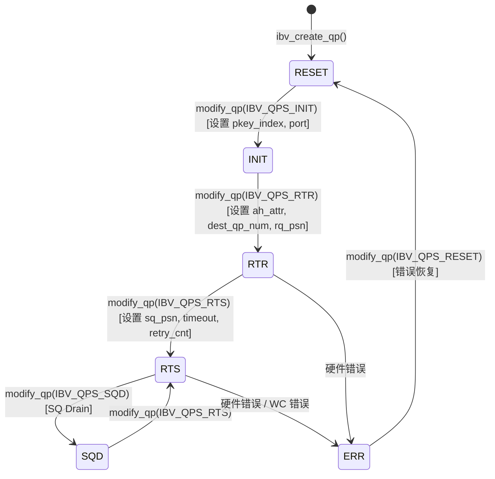

# Chapitre 13 : Transport réseau InfiniBand : comment net_ib encapsule verbs et GPUDirect RDMA

Dans le chapitre précédent, nous avons vu comment le thread proxy extrait les E/S réseau du kernel GPU, permettant au calcul et à la communication de véritablement se paralléliser. Mais le proxy n'est qu'un « pilote » — il appelle les interfaces abstraites ncclNet->isend/irecv, sans savoir s'il s'agit en dessous de TCP, InfiniBand ou autre chose. Dans ce chapitre, nous levons cette couche d'abstraction et entrons dans src/transport/net_ib et src/misc/ibvwrap.cc, pour voir comment NCCL encapsule la bibliothèque C libibverbs en une table de symboles enfichable, comment établir une Queue Pair (QP), et comment GPUDirect RDMA permet à la carte réseau de contourner la mémoire hôte pour lire et écrire directement dans la mémoire GPU.

# 13.1 Pourquoi NCCL n'appelle pas directement libibverbs

## Modèle intuitif : la table de symboles est une « prise électrique enfichable »

Imaginez que vous ayez acheté un appareil électrique importé, dont la forme de la fiche ne correspond pas à la prise de votre maison. Vous avez deux choix : soit démonter l'appareil pour modifier le câblage (directement`#include <infiniband/verbs.h>`et lier`-libverbs`), soit acheter un adaptateur universel (chargement dynamique des symboles à l'exécution). NCCL a choisi la seconde option.

> **[Design Inference & Architectural Trade-offs]**
> La motivation centrale de ce choix est**la flexibilité de déploiement**: NCCL, en tant que bibliothèque, est chargé par des frameworks de haut niveau comme PyTorch, TensorFlow, etc., et ne peut pas supposer que l'environnement d'exécution dispose forcément de`libibverbs.so`. Si l'édition de liens était effectuée à la compilation, alors sur une machine sans pilote InfiniBand, toute la bibliothèque NCCL ne pourrait pas être chargée — même si vous ne voulez utiliser NVLink que pour une communication mono-machine. Grâce au`dlopen`à l'exécution + la résolution de symboles, NCCL peut se dégrader élégamment sur une machine sans IB.

Si cette couche d'encapsulation manquait, la catastrophe à laquelle le système ferait face serait :**une tâche d'entraînement mono-machine purement NVLink planterait directement parce que la machine n'a pas de pilote IB installé**. C'est extrêmement courant dans les environnements cloud et sur les machines de développement.

## Structures de données et disposition mémoire : le conteneur de table de symboles

La structure de données centrale est`ncclIbvSymbols`, définie dans`ibvsymbols.h`(ce chapitre ne contient pas ce fichier, mais sa structure peut être déduite de son utilisation). C'est un conteneur pur de pointeurs de fonctions, chaque champ correspondant à une fonction libibverbs :

```c
struct ncclIbvSymbols {
  int (*ibv_internal_fork_init)(void);
  struct ibv_device** (*ibv_internal_get_device_list)(int* num_devices);
  int (*ibv_internal_modify_qp)(struct ibv_qp*, struct ibv_qp_attr*, int);
  // ... 数十个函数指针
};
```

Il n'existe qu'une seule instance globale, accompagnée de`std::once_flag`pour garantir une initialisation thread-safe :

[FACT:src/misc/ibvwrap.cc:26-29]

```c
static std::once_flag initOnceFlag;
static ncclResult_t initResult;
struct ncclIbvSymbols ibvSymbols;
```

La conception ici est très sobre :`initOnceFlag`est`std::once_flag`，`initResult`Résultat d'initialisation du cache,`ibvSymbols`est la table de symboles globale. Les trois ont une durée de stockage statique, leur cycle de vie s'étend sur tout le processus.

> **[Design Inference & Architectural Trade-offs]**
> Pourquoi utiliser`std::once_flag`au lieu de`pthread_once`? Parce que le code C++ de NCCL dépend déjà de`<mutex>`et`<thread>`, utiliser la bibliothèque standard est plus cohérent.`call_once`La sémantique de`wrap_ibv_symbols()`est la suivante : quel que soit le nombre de threads appelant simultanément`initResult`, le lambda ne s'exécute qu'une seule fois, les autres threads se bloquent en attendant, puis tous obtiennent le même

## . C'est bien plus sûr qu'un double-checked locking (DCLP) écrit à la main — DCLP a un fameux piège de réordonnancement sous le modèle mémoire C++.

Étape par étape : le flux complet de résolution des symboles`wrap_ibv_symbols()`：

[FACT:src/misc/ibvwrap.cc:26-29]

```c
ncclResult_t wrap_ibv_symbols(void) {
  std::call_once(initOnceFlag, []() { initResult = buildIbvSymbols(&ibvSymbols); });
  return initResult;
}
```

`buildIbvSymbols`Copier`ibvsymbols.cc`est défini dans`dlopen("libibverbs.so")`(non inclus dans ce chapitre), son rôle est d'ouvrir la bibliothèque avec`dlsym`puis d'appeler

pour chaque nom de fonction afin de remplir les pointeurs. Si un symbole est introuvable, le champ correspondant reste NULL.`CHECK_NOT_NULL`Cette conception « autorisant NULL » traverse toute la couche d'encapsulation. Regardez la macro

[FACT:src/misc/ibvwrap.cc:26-29]

```c
#define CHECK_NOT_NULL(container, internal_name) \
  if (container.internal_name == NULL) { \
    WARN("lib wrapper not initialized."); \
    return ncclInternalError; \
  }
```

Chaque fonction d'encapsulation vérifie si le symbole correspondant est non nul avant l'appel. Cela signifie :**si une ancienne version de libibverbs manque une nouvelle fonction, NCCL ne plantera pas au chargement, mais signalera l'erreur seulement lorsqu'elle sera réellement utilisée**. C'est la clé de la dégradation progressive.

## Réflexion de conception : les trois responsabilités de l'encapsulation par macro

`ibvwrap.cc`définit 7 macros, qui ne sont pas de simples sucres syntaxiques, mais assument trois responsabilités :

1. **Protection contre les pointeurs nuls**：`CHECK_NOT_NULL`intercepte l'état non initialisé

2. **Normalisation des codes d'erreur**: traduire les multiples conventions d'erreur de libibverbs (retourner -1, retourner errno, retourner un pointeur NULL) en`ncclResult_t`

3. **Points de journalisation**: en cas d'échec,`WARN`affiche le nom de la fonction et errno

Regardez`IBV_PTR_CHECK_ERRNO`cette macro la plus complexe :

[FACT:src/misc/ibvwrap.cc:38-45]

```c
#define IBV_PTR_CHECK_ERRNO(container, internal_name, call, retval, error_retval, name) \
  CHECK_NOT_NULL(container, internal_name); \
  retval = container.call; \
  if (retval == error_retval) { \
    WARN("Call to " name " failed with error %s", strerror(errno)); \
    return ncclSystemError; \
  } \
  return ncclSuccess;
```

Après expansion, elle fait quatre choses : vérifier que le symbole est non nul, exécuter l'appel, écrire la valeur de retour dans`retval`(généralement retourné via un paramètre pointeur comme`ibv_pd*`, etc.), déterminer si elle est égale à la valeur d'erreur. Notez`strerror(errno)`— les fonctions de libibverbs retournant un pointeur (comme`ibv_alloc_pd`) retournent NULL en cas d'échec et définissent`errno`, donc lire`errno`ici est correct.

Tandis que`IBV_INT_CHECK`est utilisé pour les fonctions retournant un int :

[FACT:src/misc/ibvwrap.cc:84-91]

```c
#define IBV_INT_CHECK(container, internal_name, call, error_retval, name) \
  CHECK_NOT_NULL(container, internal_name); \
  int ret = container.call; \
  if (ret == error_retval) { \
    WARN("Call to " name " failed"); \
    return ncclSystemError; \
  } \
  return ncclSuccess;
```

Ici on ne lit pas`errno`, car ce type de fonctions (comme`ibv_fork_init`) retourne directement -1 pour indiquer l'échec, l'information d'erreur est déjà perdue.

> **[Design Inference & Architectural Trade-offs]**
> Cette approche « une macro différente par fonction » semble fastidieuse, mais elle est nécessaire : les conventions d'erreur de l'API libibverbs sont extrêmement hétérogènes, certaines retournent 0/-1, d'autres une valeur errno, d'autres un pointeur. Si on forçait l'uniformisation, on perdrait au contraire l'information d'erreur. NCCL choisit de « traduire fidèlement », en gardant la complexité dans la couche d'encapsulation, pour que la couche supérieure`net_ib.cc`n'ait qu'à vérifier`ncclSuccess`。

# 13.2 ibvcore.h : le contrat ABI sans dépendance aux en-têtes

## Modèle intuitif : un traducteur avec son propre dictionnaire

`ibvcore.h`est un fichier étrange — il redéfinit les structures, énumérations et constantes essentielles de libibverbs**une nouvelle fois**. Pourquoi ? Parce que NCCL doit utiliser ces types sans`#include <infiniband/verbs.h>`.

> **[Design Inference & Architectural Trade-offs]**
> Cela résout un vrai problème d'ingénierie :`infiniband/verbs.h`le contenu de`dlopen`diffère selon les distributions et les versions de pilotes. Si NCCL l'incluait directement, il serait lié à une version précise à la compilation. En définissant lui-même un « sous-ensemble minimal nécessaire », NCCL peut se passer des en-têtes IB à la compilation et charger n'importe quelle version de la bibliothèque à l'exécution via

Si cette couche manquait, la catastrophe serait :**impossible de compiler NCCL sur une machine sans`libibverbs-dev`. Alors qu'en réalité, à l'exécution, la bibliothèque peut être fournie via**.`rdma-core`Disposition mémoire des structures clés

## Nous sélectionnons quelques structures essentielles à la compréhension de RDMA pour les analyser.

: identifiant global

**`ibv_gid`Copier**

[FACT:src/include/ibvcore.h:58-64]

```c
union ibv_gid {
	uint8_t			raw[16];
	struct {
		uint64_t	subnet_prefix;
		uint64_t	interface_id;
	} global;
};
```

utilise`ibvGetGidStr`pour le formater :`inet_ntop(AF_INET6, ...)`Copier

[FACT:src/include/ibvwrap.h:102-108]

```c
static inline const char* ibvGetGidStr(union ibv_gid* gid, char* gidStr, size_t strLen) {
  static_assert(sizeof(union ibv_gid) == sizeof(struct in6_addr),
                "the sizeof struct ibv_gid must be the size of struct in6_addr");
  return inet_ntop(AF_INET6, gid->raw, gidStr, strLen);
}
```

`static_assert`et`ibv_gid`ont la même taille, afin que`in6_addr`puisse interpréter correctement ces 16 octets.`inet_ntop`: handle d'enregistrement mémoire

**`ibv_mr`Copier**

[FACT:src/include/ibvcore.h:402-410]

```c
struct ibv_mr {
	struct ibv_context     *context;
	struct ibv_pd	       *pd;
	void		       *addr;
	size_t			length;
	uint32_t		handle;
	uint32_t		lkey;
	uint32_t		rkey;
};
```

est l'adresse de début de la mémoire enregistrée (peut être de la mémoire hôte, ou une adresse de mémoire GPU mappée vers l'hôte),`addr`est la longueur.`length`(local key) et`lkey`(remote key) sont les « clés » utilisées par la carte réseau pour vérifier les droits d'accès — l'émetteur inclut`rkey`dans le WQE, le récepteur vérifie avec`lkey`.`rkey`〔Inférences de conception et compromis architecturaux〕

> **[Design Inference & Architectural Trade-offs]**
> est une adresse virtuelle. Le processus d'enregistrement permet au pilote d'« épingler » (pin) la table de pages de cette plage d'adresses virtuelles, d'établir le mapping IOMMU, et de retourner`addr`comme handle pour les références ultérieures. L'enregistrement est coûteux (implique un parcours de table de pages et une programmation IOMMU), donc NCCL met en cache les MR pour éviter de réenregistrer à chaque transfert.`lkey/rkey`: requête de travail d'envoi

**`ibv_send_wr`Copier**

[FACT:src/include/ibvcore.h:704-738]

```c
struct ibv_send_wr {
	uint64_t		wr_id;
	struct ibv_send_wr     *next;
	struct ibv_sge	       *sg_list;
	int			num_sge;
	enum ibv_wr_opcode	opcode;
	int			send_flags;
	uint32_t		imm_data;
	union {
		struct {
			uint64_t	remote_addr;
			uint32_t	rkey;
		} rdma;
		// ...
	} wr;
};
```

est une étiquette définie par l'utilisateur (retournée telle quelle à la complétion),`wr_id`est la scatter-gather list,`sg_list`détermine le type d'opération (RDMA_WRITE, SEND, etc.),`opcode` 决定操作类型（RDMA_WRITE、SEND 等），`wr.rdma.remote_addr`et`wr.rdma.rkey`Spécifient l'adresse cible et la clé d'accès du pair distant.

`ibv_sge`Décrit un segment de mémoire locale :

[FACT:src/include/ibvcore.h:698-702]

```c
struct ibv_sge {
	uint64_t		addr;
	uint32_t		length;
	uint32_t		lkey;
};
```

Attention`addr`est`uint64_t`et non un pointeur — car le WQE est lu par le matériel de la carte réseau, il doit être au format fixe de 64 bits.

## Fonctions inline : le chemin rapide contournant la table de symboles

Certaines fonctions sont implémentées en inline par NCCL plutôt que de passer par la table de symboles. Par exemple`ibv_post_send`：

[FACT:src/include/ibvcore.h:1099-1101]

```c
static inline int ibv_post_send(struct ibv_qp *qp, struct ibv_send_wr *wr, struct ibv_send_wr **bad_wr) {
  return qp->context->ops.post_send(qp, wr, bad_wr);
}
```

Il appelle directement via le pointeur de fonction`qp->context->ops.post_send`. C'est la conception classique de libibverbs :`ibv_context`contient une`ops`structure, incluant tous les pointeurs de fonctions d'opération, remplie par le pilote spécifique.

> **[Design Inference & Architectural Trade-offs]**
> Pourquoi`post_send`passe par`ops`plutôt que par la table de symboles ? Parce que`post_send`est**chemin de données**une fonction chaude sur le , appelée à chaque envoi. Si elle passait par la table de symboles globale résolue par`dlsym`, cela ajouterait un adressage indirect supplémentaire. Alors que via`qp->context->ops`, le compilateur peut faire de meilleures optimisations, et ce pointeur est fixé dès la création du QP. En comparaison,`ibv_modify_qp`est une fonction de chemin de contrôle, appelée moins fréquemment, passer par la table de symboles n'a pas d'importance.

L'encapsulation de NCCL`wrap_ibv_post_send`est également inline :

[FACT:src/include/ibvwrap.h:77-85]

```c
static inline ncclResult_t wrap_ibv_post_send(struct ibv_qp* qp, struct ibv_send_wr* wr, struct ibv_send_wr** bad_wr) {
  int ret = qp->context->ops.post_send(
    qp, wr, bad_wr);
  if (ret != IBV_SUCCESS) {
    WARN("ibv_post_send() failed with error %s, Bad WR %p, First WR %p", strerror(ret), wr, *bad_wr);
    return ncclSystemError;
  }
  return ncclSuccess;
}
```

Attention`IBV_SUCCESS`est défini comme 0 :

[FACT:src/include/ibvwrap.h:23-25]

```c
typedef enum ibv_return_enum {
  IBV_SUCCESS = 0,
} ibv_return_t;
```

## Réflexion de conception : la « détection de version » pour la compatibilité ABI

`ibvcore.h`contient un morceau de code ingénieux de détection de version ABI :

[FACT:src/include/ibvcore.h:81]

```c
static void *__VERBS_ABI_IS_EXTENDED = ((uint8_t *)NULL) - 1;
```

C'est un « pointeur magique » — de valeur`(uint8_t*)0 - 1`, soit`0xFFFFFFFFFFFFFFFF`. Il est utilisé comme valeur marqueur du champ`ibv_context.abi_compat`:

[FACT:src/include/ibvcore.h:1072-1081]

```c
static inline struct verbs_context *verbs_get_ctx(struct ibv_context *ctx)
{
	if (ctx->abi_compat != __VERBS_ABI_IS_EXTENDED)
		return NULL;
	return (struct verbs_context *)(((uintptr_t)ctx) -
					offsetof(struct verbs_context,
						 context));
}
```

Si`abi_compat`est égal à cette valeur magique, cela signifie que la bibliothèque sous-jacente supporte l'ABI étendu, et à ce moment on peut via la technique`container_of`déduire à partir de`ibv_context`que le dernier champ du`verbs_context`。`verbs_context`externe est`ibv_context`：

[FACT:src/include/ibvcore.h:1068-1069]

```c
	size_t   sz;			/* Must be immediately before struct ibv_context */
	struct ibv_context context;	/* Must be last field in the struct */
```

> **[Design Inference & Architectural Trade-offs]**
> C'est la technique classique d'implémentation de l'« héritage » en langage C :`verbs_context`« hérite » de`ibv_context`, en plaçant la classe de base à la fin, on peut utiliser`container_of`pour déduire le pointeur de la classe dérivée à partir du pointeur de la classe de base.`sz`Le champ  enregistre la taille de la structure, utilisé pour la compatibilité de version — une nouvelle version de la bibliothèque peut étendre la structure, l'ancien code vérifie via`sz`si un champ existe.

`verbs_get_ctx_op`La macro  encapsule davantage cette vérification :

[FACT:src/include/ibvcore.h:1083-1086]

```c
#define verbs_get_ctx_op(ctx, op) ({ \
	struct verbs_context *__vctx = verbs_get_ctx(ctx); \
	(!__vctx || (__vctx->sz op) ? NULL : __vctx; })
```

Elle vérifie trois choses : s'il s'agit de l'ABI étendu, si la structure est suffisamment grande pour contenir ce champ, et si ce champ est non nul. Ce n'est que si tout est satisfait qu'un pointeur valide est retourné. C'est la base pour que`ibv_query_port_ex`puisse être appelé en toute sécurité :

[FACT:src/include/ibvcore.h:1121-1132]

```c
static inline int ibv_query_port_ex(struct ibv_context *context,
				    uint8_t port_num,
				    struct ibv_port_attr *port_attr)
{
	struct verbs_context *vctx = verbs_get_ctx_op(context, query_port);
        if (vctx) {
          return vctx->query_port(context, port_num, port_attr, sizeof(*port_attr));
        }
        return -1;
}
```

Si la bibliothèque sous-jacente ne supporte pas l'extension`query_port`, elle retourne -1, et l'appelant`wrap_ibv_query_port`reviendra à l'ancienne API :

[FACT:src/misc/ibvwrap.cc:156-171]

```c
ncclResult_t wrap_ibv_query_port(struct ibv_context* context, uint8_t port_num, struct ibv_port_attr* port_attr) {
#ifndef NCCL_BUILD_RDMA_CORE
  // First try and query the extended port attributes (e.g. active_speed_ex)
  if (ibv_query_port_ex(context, port_num, port_attr) != 0) {
    // Fall back to the original attribute API call, but zero all members first
    memset(port_attr, 0, sizeof(*port_attr));
    IBV_INT_CHECK_RET_ERRNO(ibvSymbols, ibv_internal_query_port, ibv_internal_query_port(context, port_num, port_attr),
                            0, "ibv_query_port");
  }
#else
  IBV_INT_CHECK_RET_ERRNO(ibvSymbols, ibv_internal_query_port, ibv_internal_query_port(context, port_num, port_attr), 0,
                          "ibv_query_port");
#endif
  return ncclSuccess;
}
```

Attention`memset(port_attr, 0, sizeof(*port_attr))`— il faut d'abord mettre à zéro avant le repli, car l'ancienne API ne remplira pas les nouveaux champs comme`active_speed_ex`, et sans mise à zéro on lirait des valeurs parasites de la pile.

# 13.3 Machine à états QP et l'art de la retentative de modify_qp

## Modèle intuitif : le QP est le processus complet d'« un appel téléphonique »

Queue Pair (QP) est l'unité de base de la communication RDMA, il contient la file d'envoi (SQ) et la file de réception (RQ). Établir un QP c'est comme passer un appel : d'abord composer le numéro (RESET→INIT), attendre que l'autre décroche (INIT→RTR), confirmer que les deux peuvent s'entendre (RTR→RTS), puis on peut parler.

Si la machine à états QP tombe en erreur, la catastrophe est :**la carte réseau ne peut pas établir la connexion, toutes les communications inter-machines échouent, la tâche d'entraînement se bloque ou plante**. Et les transitions d'état QP sont précisément l'endroit le plus susceptible de poser problème — gigue réseau, changements de GID, erreurs de connexion inter-rail peuvent tous causer l'échec de`ibv_modify_qp`.

## Énumération et transitions d'état

[FACT:src/include/ibvcore.h:636-645]

```c
enum ibv_qp_state {
	IBV_QPS_RESET,
	IBV_QPS_INIT,
	IBV_QPS_RTR,
	IBV_QPS_RTS,
	IBV_QPS_SQD,
	IBV_QPS_SQE,
	IBV_QPS_ERR,
	IBV_QPS_UNKNOWN
};
```

C'est la machine à états QP standard de RDMA. Le`ibvQpStateName`de NCCL traduit l'énumération en chaînes lisibles pour les logs :

[FACT:src/misc/ibvwrap.cc:263-293]

```c
static void ibvQpStateName(enum ibv_qp_state state, char* msg, const size_t len) {
  switch (state) {
  case (IBV_QPS_RESET):
    snprintf(msg, len, "RESET");
    break;
  case (IBV_QPS_INIT):
    snprintf(msg, len, "INIT");
    break;
  // ...
  }
}
```

Le diagramme d'état ci-dessous correspond précisément à l'énumération et à la sémantique de transition dans le code source :



> **[Design Inference & Architectural Trade-offs]**
> Attention aux états`IBV_QPS_SQD`(SQ Drained) et`IBV_QPS_SQE`(SQ Error). SQD sert à la fermeture gracieuse — vider la file d'envoi avant de transitionner. SQE indique une erreur de la file d'envoi. NCCL n'entre pas activement dans ces deux états sur le chemin normal, mais doit les reconnaître lors de la gestion des erreurs.

## Étape par étape : la logique de retentative de modify_qp

`wrap_ibv_modify_qp`est la fonction la plus complexe de ce chapitre, elle implémente un mécanisme complet de retentative :

[FACT:src/misc/ibvwrap.cc:360-385]

```c
ncclResult_t wrap_ibv_modify_qp(struct ibv_qp* qp, struct ibv_qp_attr* attr, int attr_mask) {
  char qpMsg[1024];
  int ret = 0, attempts = 0;
  int maxCnt = (int)ncclParamIbMQpRetryCnt() + 1; // number of attempts = number of retry + 1
  int timeOut = (int)ncclParamIbMQpRetryTimeout();
  CHECK_NOT_NULL(ibvSymbols, ibv_internal_modify_qp);
  do {
    if (attempts > 0) {
      unsigned int sleepTime = timeOut * attempts;
      ibvModifyQpLog(qp, attr->qp_state, attr, attr_mask, qpMsg, sizeof(qpMsg));
      INFO(NCCL_NET, "Call to ibv_modify_qp failed with %d %s, %s, retrying %d/%d after %u msec of sleep", ret,
           strerror(ret), qpMsg, attempts, maxCnt, sleepTime);
      // sleep before retrying
      std::this_thread::sleep_for(std::chrono::milliseconds(sleepTime));
    }
    ret = ibvSymbols.ibv_internal_modify_qp(qp, attr, attr_mask);
    attempts++;
  } while (IBV_MQP_RETRY_ERRNO_ALL(ret) && attempts qp_state, attr, attr_mask, qpMsg, sizeof(qpMsg));
    WARN("Call to ibv_modify_qp failed with %d %s, %s", ret, strerror(ret), qpMsg);
    printIbModifyQpHint(ret);
    return ncclSystemError;
  }
  return ncclSuccess;
}
```

Décomposition étape par étape :

**Première étape : lecture des paramètres**。`maxCnt = IbMQpRetryCnt() + 1`, la valeur par défaut est 34 retentatives, donc au maximum 35 tentatives.`timeOut`par défaut 100 millisecondes.

**Deuxième étape : entrer dans la boucle de retentative**. La première fois`attempts == 0`, pas de sleep, appel direct. Ensuite à chaque échec,`sleepTime = timeOut * attempts`— c'est un**backoff linéaire**, la 1ère retentative attend 100ms, la 2ème attend 200ms, la 34ème attend 3400ms.

**Troisième étape : déterminer s'il faut réessayer**。`IBV_MQP_RETRY_ERRNO_ALL(ret)`décide s'il faut continuer :

[FACT:src/misc/ibvwrap.cc:107-109]

```c
#define IBV_ERR_EQ(e, code) (e == code || e == (-code))
#define IBV_MQP_RETRY_ERRNO(e) (IBV_ERR_EQ(e, ETIMEDOUT))
#define IBV_MQP_RETRY_ERRNO_ALL(e) (ncclParamIbMQpRetryAll() ? (e != 0) : IBV_MQP_RETRY_ERRNO(e))
```

Par défaut, on ne réessaie que pour`ETIMEDOUT`.`IBV_ERR_EQ`correspond à la fois aux valeurs positives et négatives, car différents pilotes peuvent retourner`ETIMEDOUT`ou`-ETIMEDOUT`. Si`NCCL_IB_MQP_RETRY_ALL=1`est défini, on réessaie pour toute erreur non nulle.

**Quatrième étape : imprimer les informations de diagnostic en cas d'échec**。`ibvModifyQpLog`collecte le nom du périphérique, le numéro de port, l'état actuel, l'état cible, les GID local/distant :

[FACT:src/misc/ibvwrap.cc:297-339]

```c
static void ibvModifyQpLog(struct ibv_qp* qp, enum ibv_qp_state qpState, struct ibv_qp_attr* userAttr, int userFlag,
                           char* msg, size_t msgLen) {
  // ...
  char nextState[32], currState[32];
  ibvQpStateName(qp->state, currState, sizeof(currState));
  ibvQpStateName(qpState, nextState, sizeof(nextState));
  char devName[IBV_SYSFS_NAME_MAX] = "";
  snprintf(devName, sizeof(devName), "%s",
           (qp->pd->context) ? wrap_ibv_get_device_name(qp->pd->context->device) : "N/A");
  // ...
}
```

Attention à la conception ingénieuse de la macro`QP_ATTR`:

[FACT:src/misc/ibvwrap.cc:295]

```c
#define QP_ATTR(attr, userAttr, userFlag, mask) ((userFlag & mask) ? (userAttr) : (attr))
```

Elle utilise en priorité les attributs passés par l'utilisateur (si le bit correspondant est défini dans`attr_mask`), sinon elle se replie sur les attributs actuels trouvés par`query_qp`. Ainsi, même si`query_qp`échoue, on peut obtenir des informations partielles à partir des paramètres utilisateur.

**Cinquième étape : donner des indications en cas d'échec**。`printIbModifyQpHint`donne des suggestions de dépannage pour les codes d'erreur courants :

[FACT:src/misc/ibvwrap.cc:341-358]

```c
static void printIbModifyQpHint(int status) {
  switch (status) {
  case ETIMEDOUT:
    INFO(NCCL_NET, "HINT: In many cases this error indicates that the NICs are not cross-rail connected.");
    INFO(NCCL_NET, "HINT: To confirm, set NCCL_CROSS_NIC=0 to disable cross-rail communication ...");
    return;
  case EINVAL:
    INFO(NCCL_NET, "HINT: In many cases this error indicates that an incorrect GID index is forced by "
                   "NCCL_IB_GID_INDEX, or that a NIC's GID changed mid-run.");
    // ...
  }
}
```

> **[Design Inference & Architectural Trade-offs]**
> Ces indications sont le fruit de l'expérience de production.`ETIMEDOUT`La cause la plus courante est un problème de connexion inter-rail — dans un réseau multi-rail, si la NIC 0 du rank A tente de se connecter à la NIC 1 du rank B, et qu'elles ne sont pas sur le même rail, il y aura un timeout.`EINVAL`C'est généralement une erreur de configuration d'index GID, ou un changement de GID en cours d'exécution (par exemple une réinitialisation de la carte réseau).

## Contrôle de concurrence et interaction matérielle

`wrap_ibv_modify_qp`n'est pas verrouillé en soi — il suppose que l'appelant garantit qu'un même QP ne sera pas modifié simultanément par plusieurs threads. Cela est vérifié dans NCCL : l'établissement du QP se produit lors de la phase d'initialisation, effectuée par un seul thread.

> **[Design Inference & Architectural Trade-offs]**
> Mais dans la boucle de retry,`std::this_thread::sleep_for`mérite attention. Il cède le CPU, mais ne libère aucun verrou (puisqu'il n'en détient pas). Lorsque cette fonction est appelée dans le thread proxy, le sleep bloque la progression du proxy — si l'établissement du QP reste bloqué, toute la communication s'arrête. C'est pourquoi le nombre de retries par défaut est de 34, pour un temps total d'environ 60 secondes — suffisant pour couvrir une brève fluctuation réseau, mais sans attente infinie.

# 13.4 Enregistrement mémoire : la porte d'entrée de GPUDirect RDMA

## Modèle intuitif : donner une « carte d'accès » à la carte réseau

Pour que la carte réseau puisse lire et écrire directement en mémoire, elle doit d'abord « connaître » ce bloc mémoire. L'enregistrement mémoire (`ibv_reg_mr`) consiste à donner une carte d'accès à la carte réseau — lui indiquer la plage d'adresses physiques de ce bloc mémoire, et retourner une`lkey`(clé locale) et une`rkey`(clé distante). Ensuite, lorsque la carte réseau effectue du DMA, elle accède via cette clé.

En l'absence d'enregistrement mémoire, la catastrophe est :**la carte réseau ne peut accéder à aucune mémoire, le RDMA ne fonctionne pas du tout**. Le problème plus insidieux est : si l'on enregistre de la mémoire hôte mais que l'on souhaite accéder à la mémoire GPU, la carte réseau lira des données erronées ou déclenchera une erreur de protection.

## Trois chemins d'enregistrement

NCCL encapsule trois fonctions d'enregistrement mémoire, correspondant à différents cas d'usage :

**Chemin un : enregistrement ordinaire**

[FACT:src/misc/ibvwrap.cc:198-201]

```c
ncclResult_t wrap_ibv_reg_mr(struct ibv_mr** ret, struct ibv_pd* pd, void* addr, size_t length, int access) {
  IBV_PTR_CHECK_ERRNO(ibvSymbols, ibv_internal_reg_mr, ibv_internal_reg_mr(pd, addr, length, access), *ret, NULL,
                      "ibv_reg_mr");
}
```

C'est le chemin standard,`addr`est l'adresse virtuelle,`access`est le flag de permissions d'accès (`IBV_ACCESS_LOCAL_WRITE | IBV_ACCESS_REMOTE_WRITE`etc.).

**Chemin deux : enregistrement avec IOVA spécifiée**

[FACT:src/misc/ibvwrap.cc:211-219]

```c
ncclResult_t wrap_ibv_reg_mr_iova2(struct ibv_mr** ret, struct ibv_pd* pd, void* addr, size_t length, uint64_t iova,
                                   int access) {
  if (ibvSymbols.ibv_internal_reg_mr_iova2 == NULL) {
    return ncclInternalError;
  }
  if (ret == NULL) return ncclSuccess; // Assume dummy call
  IBV_PTR_CHECK_ERRNO(ibvSymbols, ibv_internal_reg_mr_iova2, ibv_internal_reg_mr_iova2(pd, addr, length, iova, access),
                      *ret, NULL, "ibv_reg_mr_iova2");
}
```

`iova`(I/O Virtual Address) permet de spécifier l'adresse vue par la carte réseau. Utile dans les scénarios nécessitant un mapping d'adresses fixe. Noter que`ret == NULL`retourne directement un succès — c'est un « appel de sondage », qui vérifie seulement l'existence de la fonction, sans réellement enregistrer.

**Chemin trois : enregistrement DMA-BUF (la clé de GPUDirect RDMA)**

[FACT:src/misc/ibvwrap.cc:222-227]

```c
ncclResult_t wrap_ibv_reg_dmabuf_mr(struct ibv_mr** ret, struct ibv_pd* pd, uint64_t offset, size_t length,
                                    uint64_t iova, int fd, int access) {
  IBV_PTR_CHECK_ERRNO(ibvSymbols, ibv_internal_reg_dmabuf_mr,
                      ibv_internal_reg_dmabuf_mr(pd, offset, length, iova, fd, access), *ret, NULL,
                      "ibv_reg_dmabuf_mr");
}
```

C'est le cœur de GPUDirect RDMA.`fd`est un descripteur de fichier DMA-BUF — il représente un bloc de mémoire GPU. NCCL obtient ce fd via une API CUDA comme`cuMemGetHandleForAddressRange`, puis le passe à`ibv_reg_dmabuf_mr`. Le pilote de la carte réseau mappe directement la mémoire GPU via le mécanisme DMA-BUF, sans copie via la mémoire hôte.

> **[Design Inference & Architectural Trade-offs]**
> DMA-BUF est le framework de partage de buffers du noyau Linux. Le pilote GPU (comme nvidia.ko de NVIDIA) exporte la mémoire GPU en DMA-BUF, le pilote de la carte réseau (comme mlx5) l'importe, et établit le mapping IOMMU. Tout le processus se déroule dans le noyau, l'espace utilisateur ne transmet qu'un fd. C'est le mécanisme sous-jacent permettant à la carte réseau de lire et écrire directement dans la mémoire GPU.

## Enregistrement direct vs enregistrement encapsulé

Noter qu'il existe deux versions « direct » :

[FACT:src/misc/ibvwrap.cc:203-209]

```c
struct ibv_mr* wrap_direct_ibv_reg_mr(struct ibv_pd* pd, void* addr, size_t length, int access) {
  if (ibvSymbols.ibv_internal_reg_mr == NULL) {
    WARN("lib wrapper not initialized.");
    return NULL;
  }
  return ibvSymbols.ibv_internal_reg_mr(pd, addr, length, access);
}
```

[FACT:src/misc/ibvwrap.cc:229-236]

```c
struct ibv_mr* wrap_direct_ibv_reg_dmabuf_mr(struct ibv_pd* pd, uint64_t offset, size_t length, uint64_t iova, int fd,
                                             int access) {
  if (ibvSymbols.ibv_internal_reg_dmabuf_mr == NULL) {
    errno = EOPNOTSUPP; // ncclIbDmaBufSupport() requires this errno being set
    return NULL;
  }
  return ibvSymbols.ibv_internal_reg_dmabuf_mr(pd, offset, length, iova, fd, access);
}
```

Elles retournent directement`ibv_mr*`au lieu de`ncclResult_t`, et n'affichent pas de log WARN. Pourquoi ?

> **[Design Inference & Architectural Trade-offs]**
> Parce que ces deux fonctions sont utilisées pour**la détection de capacités**。`ncclIbDmaBufSupport()`appelle`wrap_direct_ibv_reg_dmabuf_mr`pour tester si la carte réseau supporte DMA-BUF. En cas d'échec, il s'attend à obtenir`errno == EOPNOTSUPP`pour déterminer « non supporté » plutôt que « erreur ». Si un WARN était affiché ici, cela inonderait les logs sur les machines ne supportant pas DMA-BUF. La version direct délègue donc la responsabilité de la gestion d'erreur à l'appelant.

## Flags de permissions d'accès

[FACT:src/include/ibvcore.h:365-372]

```c
enum ibv_access_flags {
	IBV_ACCESS_LOCAL_WRITE		= 1,
	IBV_ACCESS_REMOTE_WRITE		= (1(device ptr)"]
    end
    subgraph Host["Host 进程"]
        dmabuf["DMA-BUF fd(cuMemGetHandleForAddressRange)"]
        mr["ibv_mr{addr, lkey, rkey}"]
        wr["ibv_send_wr{opcode=RDMA_WRITE,sg_list, wr.rdma.remote_addr, rkey}"]
    end
    subgraph NIC["网卡 mlx5"]
        qp["ibv_qp(SQ + RQ)"]
        wqe["WQE(硬件工作队列元素)"]
    end
    buf -->|导出| dmabuf
    dmabuf -->|ibv_reg_dmabuf_mr| mr
    mr -->|填充 sge.lkey| wr
    wr -->|ibv_post_send| qp
    qp -->|DMA 读取| wqe
    wqe -->|PCIe P2P| buf
    wqe -->|网络| remote["对端 GPU 显存(remote_addr + rkey)"]
```

Chaque nœud de la figure correspond à un type réel du code source :`ibv_mr`provient de[FACT:src/include/ibvcore.h:402-410]，`ibv_send_wr`provient de[FACT:src/include/ibvcore.h:704-738]，`ibv_qp`provient de[FACT:src/include/ibvcore.h:787-802]。

# 13.5 Achèvement du travail et diagnostic d'erreurs

## Modèle intuitif : le bon de livraison

Le RDMA est asynchrone — après votre`post_send`, vous ne connaissez pas immédiatement le résultat. Une fois l'opération terminée, la carte réseau place un Work Completion (WC) dans la Completion Queue (CQ), comme le livreur déposant un bon de livraison dans votre boîte aux lettres. Vous devez activement`poll_cq`pour le récupérer.

En l'absence de diagnostic WC, la catastrophe est :**en cas d'échec de communication, vous savez seulement que « ça a échoué », sans savoir « pourquoi »**. Les codes d'erreur RDMA sont au nombre de plus de 20, chacun correspondant à une cause racine différente.

## Structure WC

[FACT:src/include/ibvcore.h:349-363]

```c
struct ibv_wc {
	uint64_t		wr_id;
	enum ibv_wc_status	status;
	enum ibv_wc_opcode	opcode;
	uint32_t		vendor_err;
	uint32_t		byte_len;
	uint32_t		imm_data;	/* in network byte order */
	uint32_t		qp_num;
	uint32_t		src_qp;
	int			wc_flags;
	uint16_t		pkey_index;
	uint16_t		slid;
	uint8_t			sl;
	uint8_t			dlid_path_bits;
};
```

`wr_id`est l'étiquette que vous remplissez lors du post,`status`est l'état d'achèvement,`opcode`est le type d'opération,`byte_len`est le nombre d'octets réellement transférés.`qp_num`et`src_qp`servent à identifier quel QP a terminé dans les scénarios multi-QP.

## Traduction des codes d'état

`ibvWcStatusStr`traduit l'énumération d'état en chaîne de caractères :

[FACT:src/misc/ibvwrap.cc:415-464]

```c
const char* ibvWcStatusStr(enum ibv_wc_status status) {
  switch (status) {
  case IBV_WC_SUCCESS:
    return "IBV_WC_SUCCESS";
  case IBV_WC_LOC_LEN_ERR:
    return "IBV_WC_LOC_LEN_ERR";
  // ... 20 多个 case
  default:
    return "UNKNOWN_STATUS";
  }
}
```

Signification de ces codes d'état :

| Code d'état | Signification | Cause racine courante |
| --- | --- | --- |
| `IBV_WC_SUCCESS` | Succès | — |
| `IBV_WC_LOC_LEN_ERR` | Erreur de longueur locale | La longueur du SGE dépasse la plage du MR |
| `IBV_WC_LOC_ACCESS_ERR` | Erreur d'accès local | lkey invalide ou permissions insuffisantes |
| `IBV_WC_REM_ACCESS_ERR` | Erreur d'accès distant | rkey invalide ou MR distant déjà désenregistré |
| `IBV_WC_RETRY_EXC_ERR` | Retries épuisés | Réseau injoignable ou QP distant non prêt |
| `IBV_WC_RNR_RETRY_EXC_ERR` | Retries RNR épuisés | Le pair n'a pas posté de recv |
| `IBV_WC_RESP_TIMEOUT_ERR` | Délai de réponse dépassé | Le pair ne répond pas |

> **[Design Inference & Architectural Trade-offs]**
> `IBV_WC_RNR_RETRY_EXC_ERR`(Receiver Not Ready) est l'un des problèmes les plus courants en production. Cela signifie que l'émetteur a envoyé des données, mais que le récepteur n'a pas préalablement posté suffisamment de buffers recv. Dans NCCL, cela se produit généralement lors de la phase d'établissement de connexion — les états QP des deux côtés sont désynchronisés, l'un a déjà commencé à envoyer, l'autre n'est pas encore prêt à recevoir.

## Traduction des opcodes

`ibvWcOpcodeStr`et`ibvWrOpcodeStr`traduisent respectivement l'opcode de complétion et l'opcode de requête :

[FACT:src/misc/ibvwrap.cc:467-488]

```c
const char* ibvWcOpcodeStr(enum ibv_wc_opcode opcode) {
  switch (opcode) {
  case IBV_WC_SEND:
    return "IBV_WC_SEND";
  case IBV_WC_RDMA_WRITE:
    return "IBV_WC_RDMA_WRITE";
  case IBV_WC_RDMA_READ:
    return "IBV_WC_RDMA_READ";
  // ...
  }
}
```

Attention`IBV_WC_RECV`a pour valeur`1 << 7`：

[FACT:src/include/ibvcore.h:329-342]

```c
enum ibv_wc_opcode {
	IBV_WC_SEND,
	IBV_WC_RDMA_WRITE,
	IBV_WC_RDMA_READ,
	IBV_WC_COMP_SWAP,
	IBV_WC_FETCH_ADD,
	IBV_WC_BIND_MW,
	IBV_WC_RECV			= 1  **[Design Inference & Architectural Trade-offs]**
> Pourquoi`IBV_WC_RECV`est`1 << 7`et non une valeur séquentielle ? Parce que la complétion de réception et la complétion d'envoi sont deux types d'opérations différentes, et utiliser les bits de poids fort permet au code d'utiliser`opcode & IBV_WC_RECV`pour déterminer rapidement « s'agit-il d'une complétion de réception ». C'est une convention de conception de l'API libibverbs.

## Sondage du CQ

`wrap_ibv_poll_cq`est en ligne :

[FACT:src/include/ibvwrap.h:60-69]

```c
static inline ncclResult_t wrap_ibv_poll_cq(struct ibv_cq* cq, int num_entries, struct ibv_wc* wc, int* num_done) {
  int done = cq->context->ops.poll_cq(cq, num_entries,
                                      wc);
  if (done  **[Design Inference & Architectural Trade-offs]**
> `poll_cq`est**un sondage actif**— il ne bloque pas, il retourne immédiatement. Le thread proxy de NCCL l'appellera en boucle jusqu'à obtenir un événement de complétion. C'est la clé de la faible latence : contrairement au mode piloté par interruptions, le sondage actif évite le coût des changements de contexte d'interruption. Le prix à payer est une utilisation élevée du CPU, mais dans les scénarios de calcul haute performance, c'est acceptable.

# 13.6 Guide pour éviter les pièges en production

## Piège 1 : Délai d'expiration de connexion inter-rail

**Symptôme**：`ibv_modify_qp`retourne`ETIMEDOUT`, échec après 34 tentatives.

**Cause racine**: Dans un réseau multi-rail, chaque GPU est généralement lié à une NIC spécifique. Si le GPU 0 du rank A est lié à la NIC 0, le GPU 0 du rank B est lié à la NIC 1, et que la NIC 0 et la NIC 1 ne sont pas sur le même rail (c'est-à-dire qu'elles sont connectées à des commutateurs différents), alors l'établissement du QP expirera.

**Diagnostic**: Le code source donne déjà un indice :

[FACT:src/misc/ibvwrap.cc:343-347]

```c
  case ETIMEDOUT:
    INFO(NCCL_NET, "HINT: In many cases this error indicates that the NICs are not cross-rail connected.");
    INFO(NCCL_NET, "HINT: To confirm, set NCCL_CROSS_NIC=0 to disable cross-rail communication ...");
    return;
```

Définir`NCCL_CROSS_NIC=0`peut forcer la communication sur le même rail. Si cela résout le problème, il s'agit bien d'un problème inter-rail.

**Chaîne de récupération**: Le mécanisme de retry de NCCL (34 tentatives, backoff linéaire) laisse suffisamment de temps au réseau pour récupérer. Mais si la cause racine est une erreur de configuration topologique, le retry est inutile, il faut corriger la configuration`NCCL_IB_HCA`ou`NCCL_CROSS_NIC`.

## Piège 2 : Index GID incorrect

**Symptôme**：`ibv_modify_qp`retourne`EINVAL`。

**Cause racine**：`NCCL_IB_GID_INDEX`a forcé un index GID inexistant, ou le GID de la carte réseau a changé en cours d'exécution (par exemple, la carte RoCE a réobtenu une IP).

**Diagnostic**：

[FACT:src/misc/ibvwrap.cc:341-358]

```c
  case EINVAL:
    INFO(NCCL_NET, "HINT: In many cases this error indicates an incorrect GID index is forced by "
                   "NCCL_IB_GID_INDEX, or that a NIC's GID changed mid-run.");
    INFO(NCCL_NET, "HINT: To confirm, set NCCL_IB_GID_INDEX=-1 to enable automatic detection and check "
                   "'dmesg | grep -i gid' for GID changes ...");
    return;
```

Définir`NCCL_IB_GID_INDEX=-1`pour activer la détection automatique. Vérifier également`dmesg`pour les événements de changement de GID.

## Piège 3 : DMA-BUF non supporté entraînant un repli sur la copie host

**Symptôme**: GPUDirect RDMA n'a pas pris effet, les performances sont inférieures aux attentes.

**Cause racine**: Le pilote de la carte réseau ou le noyau ne supporte pas DMA-BUF,`wrap_direct_ibv_reg_dmabuf_mr`retourne NULL et définit`errno = EOPNOTSUPP`：

[FACT:src/misc/ibvwrap.cc:229-236]

```c
struct ibv_mr* wrap_direct_ibv_reg_dmabuf_mr(struct ibv_pd* pd, uint64_t offset, size_t length, uint64_t iova, int fd,
                                             int access) {
  if (ibvSymbols.ibv_internal_reg_dmabuf_mr == NULL) {
    errno = EOPNOTSUPP; // ncclIbDmaBufSupport() requires this errno being set
    return NULL;
  }
  return ibvSymbols.ibv_internal_reg_dmabuf_mr(pd, offset, length, iova, fd, access);
}
```

Noter le commentaire :`ncclIbDmaBufSupport()`dépend de ce`errno`pour déterminer si c'est supporté. Si`EOPNOTSUPP`n'est pas défini ici, la couche supérieure interprétera à tort comme « erreur » plutôt que « non supporté ».

**Diagnostic**: Vérifier la version du noyau (nécessite 5.12+), la version du pilote de la carte réseau, et si le module`nvidia-peermem`est chargé. Si ce n'est vraiment pas supporté, NCCL se repliera sur la mémoire host comme intermédiaire, les performances diminueront mais les fonctionnalités resteront normales.

## Piège 4 : Cache MR et fuite mémoire

> **[Design Inference & Architectural Trade-offs]**
> L'enregistrement mémoire est une opération coûteuse (implique la programmation IOMMU), NCCL met en cache`ibv_mr`. Mais si la stratégie de cache est inappropriée, cela entraîne deux problèmes : premièrement, une fuite mémoire (le MR n'est jamais désenregistré), deuxièmement, une invalidation du cache (la mémoire est libérée mais le MR pointe encore vers l'ancienne adresse).

`wrap_ibv_dereg_mr`est le point d'entrée de désenregistrement :

[FACT:src/misc/ibvwrap.cc:238-241]

```c
ncclResult_t wrap_ibv_dereg_mr(
  struct ibv_mr* mr) {
  IBV_INT_CHECK_RET_ERRNO(ibvSymbols, ibv_internal_dereg_mr, ibv_internal_dereg_mr(mr), 0, "ibv_dereg_mr");
}
```

> **[Design Inference & Architectural Trade-offs]**
> En production, si les tâches d'entraînement créent/détruisent fréquemment des domaines de communication, et que les MR ne sont pas correctement désenregistrés, cela entraîne une expansion de la table de mapping IOMMU, déclenchant finalement un échec de`ibv_reg_mr`(retourne`ENOMEM`). La méthode de diagnostic consiste à surveiller le nombre de mappings sous`/sys/kernel/debug/iommu`.

# Réflexion de conception : pourquoi la couche d'encapsulation est si « épaisse »

En revisitant ce chapitre,`ibvwrap.cc`contient 509 lignes,`ibvcore.h`en contient 1134. Pour une couche d'encapsulation qui « ne fait qu'appeler libibverbs », c'est un volume considérable. Pourquoi ?

> **[Design Inference & Architectural Trade-offs]**
> Trois raisons :

**Premièrement, la complexité de la gestion des erreurs**. Les conventions d'erreur de l'API libibverbs sont extrêmement hétérogènes, NCCL doit écrire une macro pour chaque convention et l'utiliser correctement dans chaque fonction. Ce n'est pas de la sur-ingénierie, mais le coût nécessaire d'une « traduction fidèle ».

**Deuxièmement, la charge de la compatibilité ABI**。`ibvcore.h`redéfinit toutes les structures, et doit aussi gérer la détection de version de`verbs_context`. C'est pour ne pas dépendre des en-têtes IB à la compilation, et rester compatible avec n'importe quelle version à l'exécution.

**Troisièmement, la valeur des informations de diagnostic**。`ibvModifyQpLog`、`printIbModifyQpHint`、`ibvWcStatusStr`Ces fonctions ne sont pas appelées sur le chemin normal, mais leur valeur est énorme lors du dépannage. NCCL choisit de « pré-intégrer » les informations de diagnostic dans la couche d'encapsulation, plutôt que de les collecter à la volée en cas d'erreur.

Le coût de cette « encapsulation épaisse » est un volume de code important et un coût de maintenance élevé. Mais le bénéfice est que la couche supérieure`net_ib.cc`peut être écrite avec une interface`ncclResult_t`unifiée, sans avoir à se soucier des diverses bizarreries de libibverbs. C'est un design typique d'« isolation de la complexité ».

# Résumé de ce chapitre

Dans ce chapitre, nous avons approfondi la couche d'encapsulation du transport InfiniBand de NCCL, les points clés étant :

1. **Encapsulation de la table de symboles**：`ncclIbvSymbols`Via`dlopen` + `dlsym`chargement à l'exécution de libibverbs, avec`std::once_flag`garantissant une initialisation thread-safe. Cela permet à NCCL de se charger même sur des machines sans pilote IB.

2. **Contrat ABI**：`ibvcore.h`redéfinit les types principaux de libibverbs, via`__VERBS_ABI_IS_EXTENDED`pointeurs magiques et`verbs_context`de`container_of`technique pour la détection de version.

3. **Machine à états QP**：`wrap_ibv_modify_qp`implémente 34 tentatives de retrait linéaire, pour`ETIMEDOUT`et`EINVAL`fournit des indices de diagnostic.

4. **GPUDirect RDMA**：`wrap_ibv_reg_dmabuf_mr`Via le mécanisme DMA-BUF, permet à la carte réseau de mapper directement la mémoire GPU,`wrap_direct_ibv_reg_dmabuf_mr`utilisé pour la détection de capacités.

5. **Diagnostic d'erreurs**：`ibvWcStatusStr`、`ibvWcOpcodeStr`、`ibvWrOpcodeStr`traduit les codes d'erreur matériels en chaînes lisibles, un outil clé pour le dépannage en production.

# Réflexions et auto-évaluation de ce chapitre

Q1 : Si l'on remplace`wrap_ibv_symbols`dans`std::call_once`par un`if (initResult == ncclSuccess) return initResult;`double-checked locking ordinaire, dans quels scénarios de concurrence cela poserait-il problème ?

**Analyse de référence**: voir[FACT:src/misc/ibvwrap.cc:26-29]：

```c
ncclResult_t wrap_ibv_symbols(void) {
  std::call_once(initOnceFlag, []() { initResult = buildIbvSymbols(&ibvSymbols); });
  return initResult;
}
```

Si l'on remplace par un double-checked locking naïf, le problème réside dans**la réorganisation mémoire**。`buildIbvSymbols`remplira`ibvSymbols`les différents champs, puis écrira`initResult`. En l'absence de barrière mémoire, le CPU ou le compilateur peut réorganiser`initResult = ncclSuccess`vers `

Jusqu'ici, nous avons vu clairement comment NCCL encapsule libibverbs via net_ib en une couche de transport enfichable, et utilise GPUDirect RDMA pour permettre à la carte réseau d'accéder directement à la mémoire GPU. Ce mécanisme résout les goulots d'étranglement de latence et de bande passante pour la communication inter-machines. Mais la communication intra-machine est tout aussi cruciale — dans le prochain chapitre, nous aborderons la mémoire symétrique et NVLS, pour voir comment NCCL exploite le multicast NVLink pour réaliser des communications collectives accélérées par le matériel. Vous découvrirez alors que le mécanisme RDMA de ce chapitre et NVLS sont complémentaires : le premier gère l'inter-machines, le second l'intra-machine.
