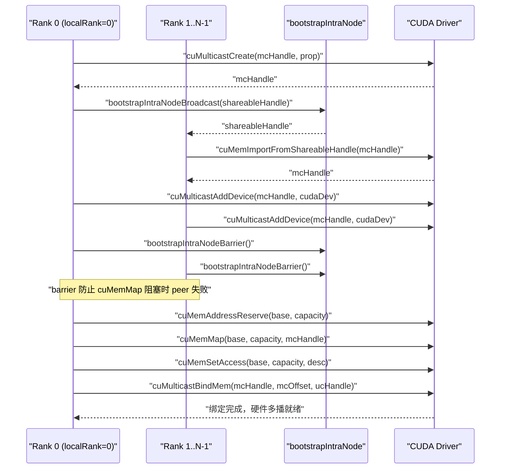
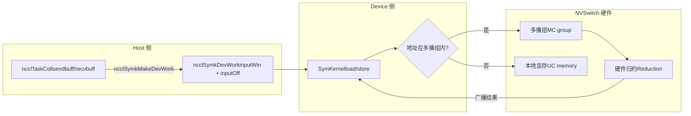

# Chapitre 14 : Mémoire symétrique et NVLS : accélération multicast et adressage direct côté dispositif LSA

Dans le chapitre précédent, nous avons suivi un AllReduce inter-machines, observant comment les données passent de la mémoire GPU via la carte réseau jusqu'au GPU distant ; ce chemin résout la communication entre machines. Mais dans les clusters d'IA modernes, le volume de communication entre GPU d'une même machine, voire d'un même domaine NVLink, est tout aussi énorme — la synchronisation des gradients en entraînement parallèle de données, l'échange de valeurs d'activation en parallélisme tensoriel, se produisent majoritairement en intra-machine. Si la communication intra-machine emprunte encore le flux inter-machines GPU→mémoire→carte réseau→carte réseau distante→mémoire→GPU, c'est comme envoyer un colis en ville par fret aérien, gaspillant inutilement de la latence. Ce chapitre décompose précisément les deux outils que NCCL prépare pour la communication intra-machine : la mémoire symétrique et NVLS. La première permet à chaque rank d'accéder aux buffers de tous les ranks via le même ensemble d'adresses virtuelles, la seconde exploite la capacité multicast du matériel NVSwitch pour effectuer la réduction. Leur combinaison permet de compresser la latence des communications collectives de petits messages jusqu'à approcher la limite matérielle.

# 14.1 Mémoire symétrique : faire que « 3e rangée, 5e siège » désigne le même emplacement chez tout le monde

## Modèle intuitif

Imaginez une classe qui doit échanger des cahiers. La méthode traditionnelle : chacun numérote ses cahiers, puis crie « Zhang San, mon 5e cahier est pour toi ; Li Si, mon 8e cahier est pour toi » — chacun doit retenir « qui a mis son cahier où, et lequel ». C'est la communication ordinaire : les adresses sont**relatives et privées**, pour accéder aux données d'un pair, il faut d'abord connaître le mapping d'adresses du pair.

La mémoire symétrique adopte une autre approche : toute la classe convient que la coordonnée « 3e rangée, 5e siège » pointe vers le même emplacement physique chez chacun. Ainsi, pour que Zhang San prenne le 5e cahier de Li Si, il suffit de dire « chez Li Si, 3e rangée, 5e siège », sans aucune traduction d'adresse. C'est le cœur de la mémoire symétrique :**le buffer de chaque rank est mappé à la même adresse virtuelle dans l'espace d'adressage de tous les ranks**。

> **[Design Inference & Architectural Trade-offs]**
> Que se passerait-il sans mémoire symétrique pour la communication collective intra-machine ? Chaque rank accédant au buffer d'un pair devrait passer par une « traduction d'adresse » — consultation de table, calcul d'offset, voire communication inter-processus pour confirmer la relation de mapping. Pour les petits messages (quelques Ko), le coût de cette traduction peut dépasser celui du transfert des données elles-mêmes. La mémoire symétrique élimine totalement ce coût, ce qui est précisément la raison fondamentale de sa « réduction significative de la latence des petits messages ».

## Structures de données et disposition mémoire

Le type d'enregistrement de la mémoire symétrique est décrit par`ncclSymRegType_t`,`ncclGetSymRegType`selon que les fenêtres send/recv portent le flag`NCCL_WIN_COLL_SYMMETRIC`, classe l'état d'enregistrement en quatre catégories.

[FACT:src/sym_kernels.cc:395-412]

```c
ncclResult_t ncclGetSymRegType(struct ncclDevrWindow* sendWin, struct ncclDevrWindow* recvWin,
                               ncclSymRegType_t* winRegType) {
  bool isSendSymmReg = false;
  bool isRecvSymmReg = false;
  if (sendWin && (sendWin->winFlags & NCCL_WIN_COLL_SYMMETRIC)) isSendSymmReg = true;
  if (recvWin && (recvWin->winFlags & NCCL_WIN_COLL_SYMMETRIC)) isRecvSymmReg = true;
  // determine the registration type
  if (!isSendSymmReg && !isRecvSymmReg) {
    *winRegType = ncclSymSendNonregRecvNonreg;
  } else if (isSendSymmReg && !isRecvSymmReg) {
    *winRegType = ncclSymSendRegRecvNonreg;
  } else if (!isSendSymmReg && isRecvSymmReg) {
    *winRegType = ncclSymSendNonregRecvReg;
  } else if (isSendSymmReg && is isRecvSymmReg) {
    *winRegType = ncclSymSendRegRecvReg;
  }
  return ncclSuccess;
}
```

Ces quatre états déterminent quel chemin le kernel emprunte ensuite : enregistrement entièrement symétrique (`SendRegRecvReg`) emprunte le chemin LSA le plus rapide, entièrement non enregistré (`SendNonregRecvNonreg`) emprunte le chemin ordinaire, les états mixtes nécessitent un traitement spécial.`winFlags`dans`NCCL_WIN_COLL_SYMMETRIC`le bit

est le marqueur « cette fenêtre a-t-elle été enregistrée de manière symétrique ». L'entrée d'initialisation de la mémoire symétrique est`ncclSymkInitOnce`, qui fait une chose clé : déterminer si le domaine de communication actuel supporte le multicast LSA (`hasLsaMultimem`）。

[FACT:src/sym_kernels.cc:185-196]

```c
ncclResult_t ncclSymkInitOnce(struct ncclComm* comm) {
  // ncclTeamLsa() below calls this internally but drops the error code so we do it here.
  NCCLCHECK(ncclDevrInitOnce(comm));

  struct ncclSymkState* symk = &comm->symkState;
  if (!symk->initialized) {
    symk->initialized = true;
    struct ncclDevCommRequirements reqs = NCCL_DEV_COMM_REQUIREMENTS_INITIALIZER;
    // Disable LSA multicast for cross-clique since NVLS isn't available across cliques
    symk->hasLsaMultimem =
      ncclNvlsSymmetricMultimemEnabled(comm) && ncclTeamLsa(comm).nRanks > 2 && !comm->p2pCrossClique;
    reqs.lsaMultimem = symk->hasLsaMultimem;
```

`hasLsaMultimem`Les trois conditions sont indispensables : le multicast symétrique NVLS est activé, le nombre de rangs de l'équipe LSA est supérieur à 2 (deux rangs communiquent plus rapidement en point à point direct, sans nécessiter de multicast), et il n'y a pas de franchissement de clique (le multicast NVSwitch n'est pas disponible en cas de franchissement de clique). Cette évaluation détermine directement si`reqs.lsaMultimem`est positionné, ce qui influence ensuite l'allocation des ressources du communicateur côté périphérique.

## Procédure pas à pas guidée par scénario

Supposons que nous lancions un AllReduce, avec une taille de message de 4 Ko, 8 rangs dans le même domaine NVLink.`ncclSymkMask`détermine quels kernels sont disponibles.

[FACT:src/sym_kernels.cc:304-352]

```c
uint32_t ncclSymkMask(struct ncclComm* comm, ncclFunc_t coll, int /*ncclDevRedOp_t*/ red, ncclDataType_t ty,
                      size_t nElts, bool symAligned16B) {
  uint32_t kmask = kernelMask_coll(coll);

  bool hasSTMC = comm->symkState.hasLsaMultimem;
  bool hasLDMC = false;
  if (comm->symkState.hasLsaMultimem) {
    switch (ty) {
    case ncclInt32:
    ...
      hasLDMC = red == ncclDevSum || red == ncclDevMinMax || red == ncclDevSumPostDiv;
      break;
    ...
    }
  }
  if (!hasSTMC) kmask &= ~kernelMask_STMC;
  if (!hasLDMC) kmask &= ~kernelMask_LDMC;
```

Première étape :`kernelMask_coll`en fonction du type de collectif (AllReduce), extraire l'ensemble de kernels candidats`kernelMask_AR`. Deuxième étape : vérifier`hasLsaMultimem`, si le multicast est pris en charge, déterminer ensuite si le type de données et l'opération de réduction prennent en charge LDMC (Load-Multicast). Troisième étape : utiliser un masque de bits pour éliminer les fonctionnalités non prises en charge —`kmask &= ~kernelMask_STMC`éliminer tous les kernels ne prenant pas en charge STMC.

Ensuite vient la limite de taille :

[FACT:src/sym_kernels.cc:336-342]

```c
  size_t nBytes = alignUp(nElts * ncclTypeSize(ty), NCCL_SYM_KERNEL_CELL_SIZE);
  size_t nBusBytes = (coll == ncclFuncAllReduce ? 1 : comm->nRanks) * nBytes;
  // LL kernels use 32-bit ints to track element counts and indices.
  if (nBusBytes >= (size_t(2) = 32 * (size_t(2) nRanks;
  kmask &= needGin ? kernelMask_Gin : ~kernelMask_Gin;
  return kmask;
```

TMA nécessite que la capacité SMEM soit suffisante (`ncclSymkTmaAvailable`vérifier`maxSharedMemOptin`) et un alignement de 16 octets. GIN n'est nécessaire que lorsque « le nombre de rangs de l'équipe LSA est inférieur au nombre total de rangs » — autrement dit, GIN n'a de sens que lorsque le domaine de communication franchit la frontière LSA (nécessite de passer par le réseau). Si tout le domaine de communication est dans le LSA, les kernels GIN sont éliminés.

## Contrôle de concurrence et interaction matérielle

La résolution d'adresse de la mémoire symétrique aboutit finalement côté périphérique.`ncclSymkMakeDevWork`traduit la description de tâche côté hôte en éléments de travail lisibles côté périphérique.

[FACT:src/sym_kernels.cc:380-393]

```c
ncclResult_t ncclSymkMakeDevWork(struct ncclComm* comm, struct ncclTaskColl* task, struct ncclSymkDevWork* outDevWork) {
  outDevWork->rootRank = task->root;
  outDevWork->redOpArg = task->opDev.scalarArg;
  outDevWork->nElts = task->count;
  outDevWork->inputWin = task->sendWin ? task->sendWin->vidmem : nullptr;
  outDevWork->inputOff =
    task->sendWin ? (uint8_t*)task->sendbuff - (uint8_t*)task->sendWin->userPtr : (size_t)task->sendbuff;
  outDevWork->outputWin = task->recvWin ? task->recvWin->vidmem : nullptr;
  outDevWork->outputOff =
    task->recvWin ? (uint8_t*)task->recvbuff - (uint8_t*)task->recvWin->userPtr : (size_t)task->recvbuff;
  outDevWork->sChannelId = 0xffff;
  outDevWork->nChannels = 0;
  return ncclSuccess;
}
```

Noter le calcul de`inputOff`: si sendWin existe (fenêtre d'enregistrement symétrique), le décalage est`sendbuff - sendWin->userPtr`— c'est**le décalage dans la fenêtre**, le côté périphérique obtient`inputWin`(adresse de base de la fenêtre) plus`inputOff`pour calculer l'adresse réelle. Si sendWin n'existe pas, le décalage est directement l'adresse absolue de`sendbuff`. Cette conception permet au kernel côté périphérique d'utiliser la même logique pour traiter les tampons enregistrés et non enregistrés.

`ncclSymkInitOnce`initialise également les besoins en ressources liés à GIN, notamment inbox, outbox, accumulation buffer et rail signal.

[FACT:src/sym_kernels.cc:208-251]

```c
    struct ncclDevResourceRequirements ginInboxRailReq = {};
    struct ncclDevResourceRequirements ginOutboxReq = {};
    struct ncclDevResourceRequirements rsGinAccumReq = {};
    struct ncclDevResourceRequirements railSignalReq = {};
    if (ncclParamSymGinKernelsEnable() && ncclTeamLsa(comm).nRanks nRanks) {
      int maxBlocks;
      size_t bufSize;
      getRequirements_gin(comm, &maxBlocks, &bufSize);

      maxBlocks = std::max(maxBlocks, comm->config.minCTAs);
      maxBlocks = std::min(maxBlocks, comm->config.maxCTAs);
      if (ncclParamSymCTAs() >= 1) maxBlocks = ncclParamSymCTAs();
      maxBlocks = std::min(maxBlocks, ncclSymkMaxBlocks);
      symk->maxGinInboxBlocks = maxBlocks;
      symk->kcomm.rsGinAccumBytesPerBlock = ncclSymkRsGinAccumBytesPerBlock();

      rsGinAccumReq.bufferSize = (size_t)maxBlocks * symk->kcomm.rsGinAccumBytesPerBlock;
      rsGinAccumReq.bufferAlign = 128;
      rsGinAccumReq.outBufferHandle = &symk->kcomm.rsGinAccumBuf;
      ...
      uint32_t railSignalCount = ncclTeamRail(comm).nRanks * ncclSymkMaxBlocks;
      ...
      reqs.barrierCount = ncclSymkMaxBlocks;
      reqs.ginConnectionType = NCCL_GIN_CONNECTION_RAIL;
      reqs.ginStrongSignalsRequired = true;
      reqs.ginVaSignalsRequired = true;
    }
```

`getRequirements_gin`utilise le modèle de réglage pour calculer le nombre de blocs et la taille de tampon nécessaires, puis est limité à l'intervalle`[minCTAs, maxCTAs]`.`rsGinAccumBytesPerBlock`est la taille du tampon d'accumulation par bloc, alignée sur 128 octets — c'est la taille de ligne de cache, pour éviter le faux partage.

```mermaid
flowchart TD
    start["ncclSymkMask(comm, coll, red, ty, nElts)"] --> coll{"集合类型?"}
    coll -->|AllGather| mask_ag["kmask = kernelMask_AG"]
    coll -->|AllReduce| mask_ar["kmask = kernelMask_AR"]
    coll -->|ReduceScatter| mask_rs["kmask = kernelMask_RS"]
    mask_ag --> check_stmc{"hasLsaMultimem?"}
    mask_ar --> check_stmc
    mask_rs --> check_stmc
    check_stmc -->|否| clear_stmc["kmask &= ~kernelMask_STMC"]
    check_stmc -->|是| check_ldmc{"数据类型+归约支持LDMC?"}
    clear_stmc --> size_check
    check_ldmc -->|否| clear_ldmc["kmask &= ~kernelMask_LDMC"]
    check_ldmc -->|是| size_check
    clear_ldmc --> size_check
    size_check{"nBusBytes >= 2GB?"} -->|是| clear_ll["kmask &= ~kernelMask_LL"]
    size_check -->|否| tma_check
    clear_ll --> tma_check{"TMA可用且16B对齐?"}
    tma_check -->|否| clear_tma["kmask &= ~kernelMask_Tma"]
    tma_check -->|是| gin_check
    clear_tma --> gin_check{"需要GIN? LSA rank |否| clear_gin["kmask &= ~kernelMask_Gin"]
    gin_check -->|是| done
    clear_gin --> done["返回 kmask"]
```

Ce schéma décrit complètement la chaîne de décision de`ncclSymkMask`: à partir du type de collectif, en passant successivement par cinq filtres — prise en charge du multicast, type de données, limite de taille, disponibilité TMA, besoin GIN — et renvoie finalement un masque de bits. Chaque filtre peut éliminer un lot de kernels, ce qui illustre la philosophie de NCCL : « sélectionner le kernel optimal selon le scénario ».

## Guide de production pour éviter les pièges

**Piège 1 : le multicast échoue silencieusement en cas de franchissement de clique.** `hasLsaMultimem`La troisième condition de`!comm->p2pCrossClique`est`ncclNvlsSymmetricMultimemEnabled`. Si votre cluster est configuré avec MNNVL (Multi-Node NVLink), mais que certains rangs franchissent une clique, le multicast sera désactivé et les performances se dégraderont silencieusement vers le chemin ordinaire. Pour diagnostiquer, consulter la sortie de journal de

**Piège 2 : exigence implicite d'alignement de 16 octets.** `ncclSymkMask`Dans`if (!symAligned16B) kmask &= ~kernelMask_Tma;`— si le tampon utilisateur n'est pas aligné sur 16 octets, le kernel TMA est éliminé. TMA est le moteur de copie le plus rapide sur Hopper/Blackwell ; en être privé signifie une baisse de performance. En production, les tampons fournis par l'utilisateur proviennent souvent de`cudaMalloc`, naturellement alignés ; mais s'ils proviennent d'un allocateur personnalisé ou d'un découpage, le piège peut se présenter.

**Piège 3 : la limite de 2 Go.**Les kernels LL utilisent des index 32 bits ; au-delà de 2 Go d'octets de bus, ils sont éliminés. Pour l'entraînement de grands modèles, le gradient d'un seul AllReduce peut dépasser cette valeur ; dans ce cas, NCCL basculera automatiquement vers le protocole STMC ou Simple. Ce n'est pas un bug, mais si vous avez spécifié manuellement le protocole LL, vous obtiendrez`ncclInvalidArgument`。

---

# 14.2 NVLS : laisser le matériel NVSwitch effectuer la réduction à votre place

## Modèle intuitif

L'AllReduce traditionnel est une « réduction logicielle » : chaque GPU envoie les données à son voisin, le voisin effectue l'addition, puis transmet — les données font des allers-retours entre les GPU, et l'addition est exécutée sur les SM. C'est comme 8 personnes qui se passent des papiers pour calculer une somme : chacune doit lire, additionner, puis transmettre.

NVLS adopte une autre approche : la puce NVSwitch intègre des capacités de**multicast et de réduction**. Vous écrivez les données dans une adresse multicast, NVSwitch les diffuse automatiquement à tous les membres et effectue l'addition dans le matériel. C'est comme si 8 personnes écrivaient des nombres sur le même tableau blanc, et le tableau blanc affiche automatiquement la somme — le GPU n'écrit qu'une fois et ne lit qu'une fois, tout le transport et l'addition intermédiaires sont effectués par le matériel du switch.

Sans NVLS, la bande passante de l'AllReduce intra-nœud serait limitée par les liaisons point à point entre GPU, et les SM devraient consacrer un grand nombre de cycles à l'addition. NVLS décharge ces deux tâches sur le matériel, permettant aux SM d'effectuer d'autres calculs.

## Structures de données et disposition mémoire

Le cœur de NVLS est le**groupe multicast (MC group)**。`ncclMcGroup`La structure décrit l'état complet d'un groupe multicast.

[FACT:src/transport/multicast.cc:72-77]

```c
struct ncclMcGroup {
  CUmemGenericAllocationHandle handle;  // the MC object
  char* base;                          // mapped MC VA base
  size_t capacity;                      // total mapped VA size
  int dev;                           // local device, for unbind
};
```

Quatre champs :`handle`est le handle de l'objet multicast CUDA,`base`est l'adresse de base de l'adresse virtuelle multicast,`capacity`est la taille totale du mappage,`dev`est le numéro de périphérique local (utilisé pour le débinding). Notez qu'il n'y a pas de verrou ici — la création et la destruction du groupe multicast se font aux phases d'initialisation/destruction, pas sur le chemin critique.

Le groupe multicast est découpé en plusieurs**partitions**, chaque partition étant une tranche immuable.`ncclMcPartition`décrit une partition.

[FACT:src/transport/multicast.cc:162-170]

```c
  // A partition is self-sufficient for binds: it carries the group's handle, device and
  // bind granularity alongside its own extent.
  for (int i = 0; i base + outPartitions[i].offset;
    outPartitions[i].mcHandle = mcHandle;
    outPartitions[i].minGranularity = minGran;
    outPartitions[i].dev = comm->cudaDev;
  }
```

Chaque partition porte son propre`offset`、`size`、`ptr`, ainsi que le`mcHandle`、`minGranularity`、`dev`du groupe auquel elle appartient. Cette conception « autonome » permet aux partitions d'être transmises indépendamment aux fonctions de binding, sans avoir à consulter à nouveau les informations du groupe.

## Procédure pas à pas guidée par scénario

Supposons que 8 ranks veuillent établir un domaine NVLS.`ncclMcGroupBuildPartitions`est responsable de la création du groupe multicast et du découpage en partitions.

[FACT:src/transport/multicast.cc:79-121]

```c
ncclResult_t ncclMcGroupBuildPartitions(struct ncclComm* comm, const struct ncclMcRequest* requests, int nRequests,
                                        struct ncclMcGroup** outGroup, struct ncclMcPartition* outPartitions) {
  ...
  mcprop.numDevices = comm->localRanks;
  mcprop.handleTypes = ncclCuMemHandleType;
  mcprop.flags = 0;
  mcprop.size = 0;
  for (int i = 0; i  recGran ? requests[i].alignment : recGran;
    ALIGN_SIZE(capacity, align);
    size_t slice = requests[i].size;
    ALIGN_SIZE(slice, recGran);
    outPartitions[i].offset = capacity;
    outPartitions[i].size = slice;
    capacity += slice;
  }
```

Première étape : accumuler les tailles de toutes les requêtes pour obtenir la taille totale du groupe multicast. Deuxième étape : interroger la granularité recommandée et la granularité minimale de CUDA — ce sont des contraintes matérielles, l'adresse et la taille de l'objet multicast doivent être des multiples entiers de la granularité. Troisième étape : allocation par bump — chaque requête découpe un bloc, l'offset et la taille étant alignés sur la granularité recommandée.`ALIGN_SIZE(capacity, align)`garantit que l'offset de début de chaque tranche est un offset de binding valide.

Ensuite vient la création et l'importation inter-ranks :

[FACT:src/transport/multicast.cc:125-146]

```c
  if (comm->localRank == 0) {
    NCCLCHECKGOTO(ncclMcCreate(comm, &mcprop, comm->localRank, comm->localRanks, &mcHandle, shareableHandle), ret,
                  fail);
    mcCreated = 1;
    NCCLCHECKGOTO(bootstrapIntraNodeBroadcast(comm->bootstrap, comm->localRankToRank, comm->localRank, comm->localRanks,
                                              0, shareableHandle, NVLS_HANDLE_SIZE),
                  ret, fail);
  } else {
    NCCLCHECKGOTO(bootstrapIntraNodeBroadcast(comm->bootstrap, comm->localRankToRank, comm->localRank, comm->localRanks,
                                              0, shareableHandle, NVLS_HANDLE_SIZE),
                  ret, fail);
    NCCLCHECKGOTO(ncclMcImport(comm, shareableHandle, comm->localRankToRank[0], &mcHandle), ret, fail);
    mcCreated = 1;
  }
  CUCHECKGOTO(cuMulticastAddDevice(mcHandle, comm->cudaDev), ret, fail);

  // cuMemMap of an MC object blocks until every device has been added. This
  // abort-aware barrier makes a peer failing before cuMulticastAddDevice trip the
  // abort flag here instead of stranding survivors in the blocking cuMemMap.
  NCCLCHECKGOTO(bootstrapIntraNodeBarrier(comm->bootstrap, comm->localRankToRank, comm->localRank, comm->localRanks,
                                          comm->localRankToRank[0]),
                ret, fail);
```

localRank 0 crée l'objet multicast, puis diffuse le shareable handle via bootstrap ; les autres ranks reçoivent le handle et l'importent.`cuMulticastAddDevice`ajoute le périphérique local au groupe multicast. Notez cette barrière — le commentaire est très clair :`cuMemMap`bloque jusqu'à ce que tous les périphériques aient rejoint, si un peer échoue avant`cuMulticastAddDevice`, les survivants resteront bloqués dans`cuMemMap`. Cette barrière permet à l'échec d'être capturé par le flag abort avant le blocage.

Enfin, le mappage et la configuration des droits d'accès :

[FACT:src/transport/multicast.cc:148-155]

```c
  // Reserve and map the whole MC VA once; each consumer slice is a view into it.
  CUCHECKGOTO(cuMemAddressReserve(&base, capacity, recGran, 0U, 0), ret, fail);
  CUCHECKGOTO(cuMemMap(base, capacity, 0, mcHandle, 0), ret, fail);
  mapped = 1;
  desc.flags = CU_MEM_ACCESS_FLAGS_PROT_READWRITE;
  desc.location.type = CU_MEM_LOCATION_TYPE_DEVICE;
  desc.location.id = comm->cudaDev;
  CUCHECKGOTO(cuMemSetAccess(base, capacity, &desc, 1), ret, fail);
```

L'ensemble de l'adresse virtuelle multicast n'est réservé et mappé qu'une seule fois, chaque tranche de consommateur étant une vue de cette adresse virtuelle. C'est la conception « un seul mappage, plusieurs tranches » — plus économe en ressources que de créer un objet multicast séparé pour chaque consommateur.

## Contrôle de concurrence et interaction matérielle

Le binding est l'opération la plus critique de NVLS.`ncclMcPartitionBindMem`lie un handle mémoire UC (unicast) à un certain offset du groupe multicast.

[FACT:src/transport/multicast.cc:200-225]

```c
ncclResult_t ncclMcPartitionBindMem(const struct ncclMcPartition* partition, size_t offsetInPartition,
                                    CUmemGenericAllocationHandle mem, size_t memOffset, size_t bindSize) {
  // A bind overrunning its partition would corrupt the next consumer's partition; fail
  // cleanly instead (possible when UC rounding exceeds the MC-rounded partition).
  if (offsetInPartition + bindSize > partition->size) {
    WARN("NVLS MC bind of size %zu at slice offset %zu exceeds slice size %zu (UC/MC granularity mismatch)", bindSize,
         offsetInPartition, partition->size);
    return ncclInternalError;
  }
  size_t mcOffset = partition->offset + offsetInPartition;
  ...
  CUresult err = CUPFN(cuMulticastBindMem(partition->mcHandle, mcOffset, mem, memOffset, bindSize, 0 /*flags*/));
  if (err != CUDA_SUCCESS) {
    ...
    WARN("Failed to bind NVLink SHARP (NVLS) Multicast memory of size %zu at MC group %llx offset %zu : CUDA error %d "
         "'%s'.\nThis is usually caused by a system or configuration error in the Fabric Manager or NVSwitches.\n"
         "Disable NVLS (NCCL_NVLS_ENABLE=0) if you wish to avoid this error in the future.",
         bindSize, partition->mcHandle, mcOffset, err, errStr);
    return ncclUnhandledCudaError;
  }
  return ncclSuccess;
}
```

La première ligne de défense est la vérification des limites :`offsetInPartition + bindSize > partition->size`déclenche une erreur. Le commentaire explique la raison — la granularité de la mémoire UC peut être plus grande que la partition MC, si l'alignement UC dépasse la limite de la partition MC, cela empiétera sur la partition du consommateur suivant. C'est le piège typique de « incompatibilité entre deux granularités ».

`cuMulticastBindMem`est un appel matériel, le commentaire indique qu'il « blocks until all ranks have been added to the group » — c'est l'endroit le plus susceptible de poser problème avec NVLS. Si Fabric Manager est mal configuré ou si le firmware NVSwitch a un problème, cela se bloquera ou retournera une erreur ici. Le message d'erreur suggère directement à l'utilisateur de`NCCL_NVLS_ENABLE=0`, c'est la sortie de secours standard en environnement de production.

Il existe également une variante « tentative de binding », utilisée pour l'enregistrement de buffers utilisateur :

[FACT:src/transport/multicast.cc:237-268]

```c
ncclResult_t ncclMcPartitionTryBindAddr(const struct ncclMcPartition* partition, size_t offsetInPartition,
                                        CUdeviceptr address, size_t bindSize, enum ncclMcBindStatus* outStatus) {
  const char* errStr = NULL;

  *outStatus = ncclMcBindStatusTransient;
  if (offsetInPartition + bindSize > partition->size) {
    ...
    return ncclInternalError;
  }
  size_t mcOffset = partition->offset + offsetInPartition;
  CUresult err = CUPFN(cuMulticastBindAddr(partition->mcHandle, mcOffset, address, bindSize, 0 /*flags*/));
  if (err == CUDA_SUCCESS) {
    *outStatus = ncclMcBindStatusOk;
    return ncclSuccess;
  }

  (void)pfn_cuGetErrorString(err, &errStr);
  // Only an outright rejection of the input is a property of the buffer. Anything else,
  // notably OUT_OF_MEMORY, may succeed later, so it must not be reported as permanent.
  if (err == CUDA_ERROR_INVALID_VALUE || err == CUDA_ERROR_NOT_SUPPORTED || err == CUDA_ERROR_NOT_PERMITTED) {
    *outStatus = ncclMcBindStatusNoSupport;
    ...
  } else {
    WARN("NVLS Multicast bind of size %zu at MC group %llx offset %zu dev %d failed transiently: CUDA error %d '%s'.\n"
         "The buffer is left unregistered for this operation and will be retried; repeated occurrences indicate "
         "sustained resource pressure.",
         bindSize, partition->mcHandle, mcOffset, partition->dev, err, errStr);
  }
  return ncclSuccess;
}
```

Il y a ici une classification d'erreurs ingénieuse :`CUDA_ERROR_INVALID_VALUE`、`NOT_SUPPORTED`、`NOT_PERMITTED`est classé comme`ncclMcBindStatusNoSupport`— c'est une**défaillance permanente**, indiquant que ce buffer lui-même ne supporte pas le binding multicast. Tandis que les autres erreurs (en particulier`OUT_OF_MEMORY`) sont classées comme`ncclMcBindStatusTransient`— c'est une**défaillance temporaire**, qui peut être retentée. Cette distinction est cruciale : si l'on traite un OOM comme une défaillance permanente, on abandonnera à tort un enregistrement qui aurait pu réussir ; si l'on traite une erreur de paramètre comme une défaillance temporaire, on retentera indéfiniment.

## Guide de production pour éviter les pièges

**Piège 1 : une mauvaise configuration de Fabric Manager provoque le blocage de`cuMulticastBindMem`.**C'est la panne de production la plus classique de NVLS. Le message d'erreur pointe explicitement vers Fabric Manager ou NVSwitch. Étapes de diagnostic : d'abord`NCCL_NVLS_ENABLE=0`confirmer que le problème disparaît, puis vérifier les logs de Fabric Manager et la version du firmware NVSwitch.

**Piège 2 : incompatibilité de granularité UC/MC.** `ncclMcPartitionBindMem`La vérification des limites de

**capturera ce problème, mais si vous voyez un avertissement « UC/MC granularity mismatch », cela signifie que la taille UC d'une requête, après alignement, dépasse la partition MC. Cela se produit généralement lorsque la taille de la requête est proche de la limite de granularité.** `ncclMcGroupBuildPartitions`Piège 3 : fuite de ressources après l'échec de création du groupe multicast.`CUCALL`Le chemin d'échec de`CUCHECK`：

[FACT:src/transport/multicast.cc:179-184]

```c
fail:
  // Best-effort (CUCALL) so a failing cleanup op cannot skip releasing the MC handle.
  if (mapped) CUCALL(cuMemUnmap(base, capacity));
  if (base) CUCALL(cuMemAddressFree(base, capacity));
  if (mcCreated) CUCALL(cuMemRelease(mcHandle));
  return ret;
```

Le commentaire explique la raison : si l'opération de cleanup elle-même échoue, on ne peut pas pour autant sauter la libération du handle MC — le slot MC est une ressource rare, une fuite entraînerait l'échec des créations ultérieures. C'est un design typique de « le chemin de nettoyage doit faire de son mieux ».



Ce diagramme de séquence décrit le flux complet d'un groupe multicast, de sa création à son binding. Le point clé est cette barrière — elle découple « l'échec d'un peer » et « le blocage de cuMemMap », évitant que les survivants ne se retrouvent bloqués.

---

# 14.3 La fusion de la mémoire symétrique et de NVLS : comment les pointeurs LSA sont résolus côté device

## Modèle intuitif

La mémoire symétrique résout le problème de « cohérence d'adresses », NVLS résout le problème de « réduction matérielle ». Mais pour qu'ils coopèrent réellement, un mécanisme clé est encore nécessaire :**Comment le côté device sait-il qu'une adresse est symétrique et peut emprunter le chemin multicast ?**

La réponse réside dans le pointeur LSA (Load-Store Accessible). LSA est l'abréviation de « accessible en chargement-stockage », ce qui signifie que la mémoire pointée par ce pointeur peut être accédée directement par le GPU avec des instructions load/store ordinaires — qu'elle soit physiquement locale ou distante. Si l'adresse tombe dans un groupe multicast, le load/store sera intercepté et diffusé par le matériel NVSwitch.

## Structures de données et disposition mémoire

`ncclSymkDevWork`est le descripteur de travail côté device, il porte les informations clés de la mémoire symétrique.

[FACT:src/sym_kernels.cc:380-393]

```c
ncclResult_t ncclSymkMakeDevWork(struct ncclComm* comm, struct ncclTaskColl* task, struct ncclSymkDevWork* outDevWork) {
  outDevWork->rootRank = task->root;
  outDevWork->redOpArg = task->opDev.scalarArg;
  outDevWork->nElts = task->count;
  outDevWork->inputWin = task->sendWin ? task->sendWin->vidmem : nullptr;
  outDevWork->inputOff =
    task->sendWin ? (uint8_t*)task->sendbuff - (uint8_t*)task->sendWin->userPtr : (size_t)task->sendbuff;
  outDevWork->outputWin = task->recvWin ? task->recvWin->vidmem : nullptr;
  outDevWork->outputOff =
    task->recvWin ? (uint8_t*)task->recvbuff - (uint8_t*)task->recvWin->userPtr : (size_t)task->recvbuff;
  outDevWork->sChannelId = 0xffff;
  outDevWork->nChannels = 0;
  return ncclSuccess;
}
```

`inputWin`est l'adresse virtuelle côté device de la fenêtre (`vidmem`），`inputOff`est l'offset du buffer dans la fenêtre. Après que le kernel côté device a obtenu ces deux valeurs, il calcule`inputWin + inputOff`pour obtenir l'adresse réelle. Si cette adresse tombe dans le groupe multicast, le matériel gère automatiquement la diffusion.

`ncclSymkInitOnce`configure également la barrière LSA et les ressources LLA2A (Low-Latency All-to-All).

[FACT:src/sym_kernels.cc:197-206]

```c
    reqs.lsaBarrierCount = ncclSymkMaxBlocks;
    reqs.ginStrongSignalsRequired = false;
    reqs.ginVaSignalsRequired = false;

    struct ncclDevResourceRequirements lla2aReq;
    ncclLLA2ACreateRequirement(ncclSymkMaxBlocks,
                               ncclLLA2ACalcSlots(ncclTeamLsa(comm).nRanks * ncclSymkMaxThreads, ncclSymkLLMaxEltSize),
                               &symk->kcomm.lsaLLA2A, &lla2aReq);
    lla2aReq.next = reqs.resourceRequirementsList;
    reqs.resourceRequirementsList = &lla2aReq;
```

`lsaBarrierCount`est défini à`ncclSymkMaxBlocks`— un slot de barrière par block. LLA2A est l'abréviation de all-to-all à faible latence, utilisé pour l'échange rapide de données dans le domaine LSA.`ncclLLA2ACalcSlots`calcule le nombre de slots nécessaires en fonction du nombre de ranks, du nombre de threads et de la taille maximale des éléments.

## Parcours pas à pas guidé par scénario

Supposons qu'un AllReduce utilise`AllReduce_AGxLLMC_R`kernel (AllGather + LL + MC + Reduce). Le flux de travail de ce kernel est :

1. **Phase AllGather**: chaque rank écrit ses propres données dans le groupe multicast, le matériel NVSwitch diffuse à tous les ranks.

2. **Phase Reduce**: chaque rank lit les données de tous les ranks depuis le groupe multicast et effectue la réduction localement.

`ncclSymkMask`vérifie si ce kernel est disponible.`kernelMask_LL`contient`AllReduce_AGxLLMC_R`, mais à condition que`hasLsaMultimem`soit vrai (sinon`kernelMask_STMC`est effacé, et`AllReduce_AGxLLMC_R`appartient à l'ensemble STMC).

Attendez, il y a un détail ici :`kernelMask_STMC`contient`AllReduce_AGxLLMC_R`? Regardons le code source :

[FACT:src/sym_kernels.cc:17-21]

```c
constexpr uint32_t kernelMask_STMC =
  1 nvlsChannels;
    size_t creditSize = nChannels * 2 * memSize * nHeads;
    int nvlsStepSize = comm->nvlsChunkSize;

    NCCLCHECKGOTO(ncclCalloc(&comm->nvlsResources, 1), res, fail);
    comm->nvlsResources->inited = false;
    comm->nvlsResources->refCount = 1;
    comm->nvlsResources->nChannels = nChannels;
    comm->nvlsResources->nHeads = nHeads;
    comm->nvlsResources->chunkSize = comm->nvlsChunkSize;
    comm->nvlsResources->treeMaxChunkSize = comm->nvlsTreeMaxChunkSize;
    resources = comm->nvlsResources;

    for (int c = 0; c accessDesc, 0, sizeof(resources->accessDesc));
    resources->accessDesc.flags = CU_MEM_ACCESS_FLAGS_PROT_READWRITE;
    resources->accessDesc.location.type = CU_MEM_LOCATION_TYPE_DEVICE;
    resources->accessDesc.location.id = comm->cudaDev;
    resources->dev = comm->cudaDev;

    // Build the single shared MC group for this NVLS domain. The data slice is
    // reserved here but bound later by ncclNvlsBufferSetup.
    {
      size_t buffSize = nvlsStepSize * NCCL_STEPS;
      size_t dataSize = nChannels * 2 * buffSize * nHeads;
      size_t ubSize = ncclNvlsUbSize(comm);
      struct ncclMcRequest requests[3] = {{creditSize, 0}, {dataSize, 0}, {ubSize, 0}};
      struct ncclMcPartition partitions[3];
      NCCLCHECKGOTO(ncclMcGroupBuildPartitions(comm, requests, 3, &resources->mcGroup, partitions), res, fail);
      resources->creditPartition = partitions[0];
      resources->dataPartition = partitions[1];
      if (ubSize) {
        resources->ubPartition = partitions[2];
        NCCLCHECKGOTO(ncclMcArenaInit(comm, &resources->ubArena, &resources->ubPartition), res, fail);
        resources->ubEnabled = true;
      }
      NCCLCHECKGOTO(nvlsAllocBindUc(comm, &resources->creditPartition, creditSize, &resources->creditUc), res, fail);
    }
```

Le groupe multicast est découpé en trois partitions :`creditPartition`(credit),`dataPartition`(données),`ubPartition`(buffer utilisateur). La partition credit sert à la synchronisation — chaque channel a des pointeurs head/tail indépendants, partagés via le groupe multicast.

L'initialisation des credits se fait dans la boucle suivante :

[FACT:src/transport/nvls.cc:456-491]

```c
    for (int h = 0; h nRanks + 1 + h;
      for (int c = 0; c channels + c;
        char* mem = NULL;
        struct ncclChannelPeer* peer = channel->peers[nvlsPeer];

        // Reduce UC -> MC
        mem = (char*)resources->creditUc.ptr + (h * 2 * nChannels + c) * memSize;
        peer->send[1].transportComm = &nvlsTransport.send;
        peer->send[1].conn.buffs[NCCL_PROTO_SIMPLE] = NULL;
        peer->send[1].conn.head = (uint64_t*)mem;
        peer->send[1].conn.tail = (uint64_t*)(mem + memSize / 2);
        peer->send[1].conn.stepSize = nvlsStepSize;
        mem = (char*)resources->creditPartition.ptr + (h * 2 * nChannels + c) * memSize;
        peer->recv[0].transportComm = &nvlsTransport.recv;
        peer->recv[0].conn.buffs[NCCL_PROTO_SIMPLE] = NULL;
        peer->recv[0].conn.head = (uint64_t*)mem;
        peer->recv[0].conn.tail = (uint64_t*)(mem + memSize / 2);
        peer->recv[0].conn.stepSize = nvlsStepSize;
        peer->recv[0].conn.flags |= NCCL_NVLS_MIN_POLL;
```

Chaque combinaison de head et de channel a une zone de credit indépendante.`head`et`tail`sont des pointeurs 64 bits,`memSize`fait 64 octets (`size_t memSize = 64;`), donc head et tail occupent chacun 32 octets — exactement une demi-ligne de cache.`NCCL_NVLS_MIN_POLL`Le flag

## permet au récepteur d'utiliser le mode de polling minimal, réduisant la charge CPU.

**Guide de production pour éviter les pièges**Piège 1 : compétition head/tail dans la partition credit.`nvlsCTAs`Plusieurs channels partagent le même groupe multicast, mais chaque channel a une zone de credit indépendante. Si le nombre de channels est mal configuré (par exemple`ncclNvlsChannels`défini trop grand), la zone de credit gonfle et occupe un espace d'adresses multicast précieux.

[FACT:src/transport/nvls.cc:100-133]

```c
  if (comm->config.nvlsCTAs != NCCL_CONFIG_UNDEF_INT) {
    channels = comm->config.nvlsCTAs;
  } else if (channels == 0 && comm->compCap >= 100) {
    // Use a reduced number of channels for single node/MNNVL domain on Blackwell and above.
    // comm->nNodes is not yet initialized at this point so we need to use local information.
    bool multiNode = false;
    if (comm->MNNVL) {
      multiNode = (comm->clique.size nRanks);
    } else {
      int i;
      for (i = 1; i nRanks; i++) {
        if (comm->peerInfo[i].hostHash != comm->peerInfo[0].hostHash) break;
      }
      multiNode = (i nRanks);
    }
    if (multiNode) {
      channels = RUBIN_AND_LATER(comm->compCap) ? /*RUBIN=*/64 : /*SM100=*/32;
    } else {
      channels = RUBIN_AND_LATER(comm->compCap) ? /*RUBIN=*/48 : /*SM100=*/24;
    }
  } else if (channels == 0) {
    channels = /*SM90=*/16;
  }
```

Copier`comm->nNodes`Attention,`peerInfo[i].hostHash`n'est pas encore initialisé à ce stade, donc le code utilise

**pour déterminer manuellement s'il s'agit d'un environnement multi-nœuds. C'est un piège classique d'ordre d'initialisation — on ne peut pas dépendre d'un champ qui n'a pas encore été calculé.** [FACT:src/transport/nvls.cc:516-517]

```c
  // MNNVL does not support NVLS buffer registration
  if (!comm->MNNVL && comm->nvlsResources->nvlsShmemHandle == NULL) {
```

Copier

**Piège 3 : le comptage de références des ressources partagées.** `ncclNvlsSetup`Prise en charge du partage des ressources NVLS entre domaines de communication parent et enfant :

[FACT:src/transport/nvls.cc:380-392]

```c
  if (nvlsShare) {
    /* reuse NVLS resources */
    comm->nvlsChannels = std::min(comm->nvlsChannels, parent->nvlsResources->nChannels);
    /* Inherit chunk sizes from the shared resource since we're reusing the parent's
     * NVLS buffers, which were allocated and laid out based on these values. */
    comm->nvlsChunkSize = parent->nvlsResources->chunkSize;
    comm->nvlsTreeMaxChunkSize = parent->nvlsResources->treeMaxChunkSize;
    for (int c = 0; c nvlsChannels; c++) {
      NCCLCHECKGOTO(initNvlsChannel(comm, c, parent, true), res, fail);
    }

    comm->nvlsResources = parent->nvlsResources;
    ncclAtomicRefCountIncrement(&parent->nvlsResources->refCount);
  }
```

Le domaine de communication enfant réutilise les ressources du domaine parent, le compteur de références est incrémenté de un.`ncclNvlsFree`La libération réelle n'a lieu que lorsque le compteur de références atteint zéro. Si la gestion du compteur de références est erronée, cela entraîne une libération prématurée ou une fuite de ressources. Attention`nvlsChunkSize`et`nvlsTreeMaxChunkSize`doivent hériter des valeurs du domaine de communication parent — car les tampons sont disposés selon ces valeurs, les modifier provoquerait des erreurs de calcul d'adresse.



Ce diagramme de flux de données illustre la chaîne complète depuis les tâches côté host jusqu'à l'exécution côté device. La branche critique est`lsa{"地址在多播组内?"}`— si oui, on passe par la multidiffusion et la réduction matérielles NVSwitch ; si non, on utilise la mémoire locale du GPU. Cette décision est prise automatiquement par le matériel en fonction de la plage d'adresses, sans intervention logicielle.

---

# 14.4 Réflexion de conception : pourquoi la mémoire symétrique réduit-elle la latence des petits messages

Revenons à la question centrale du début de ce chapitre : pourquoi la mémoire symétrique réduit-elle significativement la latence des petits messages ?

**Premièrement, elle élimine le surcoût de traduction d'adresses.**Dans la communication traditionnelle, chaque rank doit consulter une table et calculer un décalage pour accéder au tampon d'un pair. La mémoire symétrique permet à tous les ranks d'utiliser le même jeu d'adresses, et le kernel côté device calcule directement`base + offset`. Pour les petits messages, ce surcoût de traduction représente une proportion élevée.

**Deuxièmement, elle élimine les allers-retours de messages de contrôle.**La communication traditionnelle nécessite l'échange d'informations de contrôle du type « dans quel tampon de toi je vais écrire ». Avec la mémoire symétrique, les adresses sont convenues à l'avance, aucune négociation à l'exécution n'est nécessaire.

**Troisièmement, elle rend possible la multidiffusion matérielle.**Ce n'est que lorsque les adresses sont symétriques que NVSwitch peut effectuer la multidiffusion avec le même jeu d'adresses. Si l'adresse de chaque rank est différente, le matériel ne peut pas savoir où diffuser.

**Quatrièmement, elle réduit la charge de réduction des SM.**NVLS décharge l'addition sur le NVSwitch, le SM n'a qu'à émettre une écriture et une lecture. Pour les petits messages, le surcoût en instructions du SM est la principale source de latence.

La combinaison de ces quatre facteurs fait passer la latence des petits messages de « l'ordre de la microseconde » à « l'ordre de la sub-microseconde ».

> **[Design Inference & Architectural Trade-offs]**
> D'un point de vue ingénierie, la conception de la mémoire symétrique incarne une philosophie centrale de NCCL :**repousser la complexité vers la phase d'initialisation, rendre le chemin critique aussi simple que possible**. La négociation d'adresses, la création des groupes de multidiffusion et l'allocation des crédits sont tous effectués à l'initialisation ; à l'exécution, le kernel n'a besoin que du calcul d'adresse et des load/store les plus simples. Cette conception « lourde à l'initialisation, légère à l'exécution » est un modèle courant des bibliothèques de communication haute performance.

---

# Résumé du chapitre

Ce chapitre a décomposé les deux piliers de la communication intra-nœud de NCCL :

1. **Mémoire symétrique**: via`ncclSymkInitOnce`et`ncclSymkMask`on établit des tampons à adresses cohérentes, permettant à chaque rank d'accéder aux données de tous les ranks avec le même jeu d'adresses.`ncclSymkMakeDevWork`traduit les tâches côté host en work items côté device,`inputWin + inputOff`est la formule centrale de la résolution d'adresses.

2. **Multidiffusion NVLS**: via`ncclMcGroupBuildPartitions`on crée un groupe de multidiffusion,`ncclMcPartitionBindMem`lie la mémoire UC au groupe de multidiffusion,`cuMulticastBindMem`est l'appel matériel. Le groupe de multidiffusion est découpé en trois partitions credit, data et ub, utilisées respectivement pour la synchronisation, le transfert de données et l'enregistrement des tampons utilisateur.

3. **Résolution de pointeur LSA**: le côté device détermine automatiquement, selon la plage d'adresses, s'il faut emprunter le chemin de multidiffusion, sans traduction logicielle.`NCCL_NVLS_MIN_POLL`Le flag optimise le surcoût de polling.

4. **Gestion des erreurs**：`ncclMcPartitionTryBindAddr`distingue les échecs permanents des échecs temporaires,`ncclMcGroupBuildPartitions`le chemin fail de`CUCALL`utilise

# pour garantir la libération des ressources.

Réflexions et auto-évaluation du chapitre`ncclMcPartitionBindMem`Q1 : si l'on supprime la vérification de limites`if (offsetInPartition + bindSize > partition->size)`dans

**, dans quels scénarios un dépassement de mémoire se produirait-il ? Pourquoi cette vérification ne peut-elle pas être remplacée par « UC et MC ont la même granularité » ?**Analyse de référence[FACT:src/transport/multicast.cc:200-208]：
