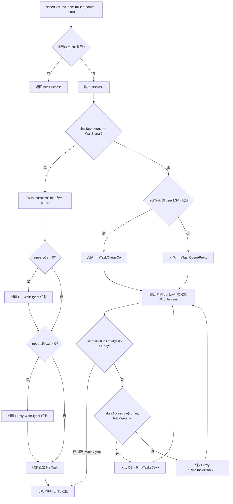
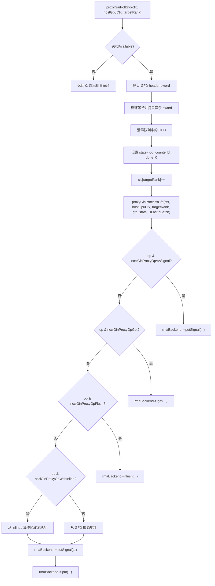

# Chapitre suivant : Chapitre 15 →

# Progression de l'ouvrage : Chapitre 15 / 25

Chapitre 15 : RMA et GIN : évolution de l'accès mémoire distant et de la communication directe GPU

# Dans le chapitre précédent, nous avons vu que la mémoire symétrique permet à chaque rank d'accéder aux tampons de tous les ranks avec le même jeu d'adresses, et que NVLS pousse la réduction accélérée par matériel à son paroxysme grâce à la capacité de multidiffusion de NVSwitch. Mais la communication collective n'est pas tout — lorsque l'application a besoin d'opérations mémoire distantes point à point, ou souhaite que le kernel GPU initie directement des requêtes réseau, RMA et GIN entrent en scène. RMA fournit un accès mémoire distant avec sémantique put/get, tandis que GIN permet au GPU de contourner le thread proxy du host pour interagir directement avec le réseau. Ce chapitre, dans l'ordre « d'abord RMA puis GIN », décompose couche par couche les structures de données, la logique d'ordonnancement, le contrôle de concurrence et les pièges de production de ces deux mécanismes.

## Le modèle à double canal de RMA : répartition des rôles entre CE et Proxy

Imaginez un système de livraison international : la livraison intra-ville (les ranks accessibles via LSA) peut être effectuée directement par des camions de livraison locaux, tandis que la livraison inter-villes (les ranks non accessibles via LSA) doit être confiée à un transitaire aérien. Le RMA de NCCL fonctionne exactement selon ce modèle — une même opération put est routée, selon que le rank cible se trouve ou non dans le groupe LSA (Load-Store Accessible), vers deux chemins d'exécution totalement différents : le chemin CE (Copy Engine, moteur de copie) et le chemin Proxy (thread mandataire).

Sans ce mécanisme de répartition, toutes les opérations RMA passeraient par le thread proxy, et même un put intra-machine devrait transiter par un thread hôte, ajoutant inutilement un aller-retour hôte-device en latence. À l'inverse, si toutes les opérations passaient par le CE, les opérations inter-machines ne pourraient pas exploiter la capacité asynchrone du plugin réseau.

## Structures de données et disposition mémoire

La structure centrale de planification du RMA est`ncclRmaArgs`, qui enregistre le résultat de la répartition des tâches RMA dans un plan. Les champs clés incluent :

| Champ | Signification |
| --- | --- |
| `func` | Type d'opération (PutSignal / Signal / WaitSignal) |
| `nRmaTasks` | Nombre total de tâches |
| `nRmaTasksProxy` | Nombre de tâches empruntant le chemin proxy |
| `nRmaTasksCe` | Nombre de tâches empruntant le chemin CE |

Chaque plan maintient en interne deux files intrusives :`rmaTaskQueueCe`et`rmaTaskQueueProxy`, contenant respectivement les tâches des deux chemins.[FACT:src/rma/rma.cc:166-171]

La logique pour déterminer si un rank est accessible via LSA est très directe — parcourir le tableau`lsaRankList`pour effectuer une recherche linéaire.[FACT:src/rma/rma.cc:34-41]Cette recherche est exécutée une fois par peer lors de la planification des tâches, avec une complexité O(lsaSize), un coût négligeable pour un groupe LSA typique de petite taille (généralement 2 à 8 ranks).

## Flux de planification pas à pas

Lorsqu'une application appelle une opération RMA put, la tâche entre dans`planner->rmaTaskQueues[ctx]`。`scheduleRmaTasksToPlan`, chargé de répartir les tâches de la file dans un plan.[FACT:src/rma/rma.cc:141-296]

Première étape : trouver la première file de contexte non vide. NCCL prend en charge plusieurs contextes RMA (configurés par`numRmaCtx`), chaque contexte ayant sa propre file.[FACT:src/rma/rma.cc:148-155]

Deuxième étape : extraire la première tâche et déterminer son type d'opération. S'il s'agit d'un WaitSignal, on applique la logique de division spéciale ; s'il s'agit d'un Put/Signal, on applique la logique de fusion par lots.[FACT:src/rma/rma.cc:163-168]

Pour une tâche WaitSignal, le planificateur doit diviser la liste des peers en deux groupes selon l'accessibilité LSA : le groupe CE et le groupe Proxy.[FACT:src/rma/rma.cc:187-204]Après la division, deux nouvelles structures`ncclTaskRma`sont créées, chacune détenant le tableau de peers du groupe correspondant.[FACT:src/rma/rma.cc:207-246]La tâche originale est libérée.[FACT:src/rma/rma.cc:251]

Pour les tâches Put/Signal, la logique est plus complexe — le planificateur parcourt les files de tous les contextes et regroupe toutes les tâches put/signal consécutives dans un même plan, jusqu'à rencontrer un WaitSignal.[FACT:src/rma/rma.cc:279-295]L'objectif de cette conception est clairement expliqué dans les commentaires : faire couvrir par un seul lancement de kernel tous les put/signal de tous les contextes, permettre au proxy de lancer en une fois toutes les requêtes asynchrones avant toute opération bloquante, et au chemin CE de soumettre par lots les copies et signaux de tous les contextes.[FACT:src/rma/rma.cc:270-278]

## Exécution parallèle et synchronisation des flux

Une fois la planification terminée,`ncclLaunchRma`distribue selon le champ`func`vers`ncclRmaPut`ou`ncclRmaWaitSignal`。[FACT:src/rma/rma.cc:109-131]

En prenant`ncclRmaPut`comme exemple, lorsqu'un plan contient à la fois des tâches proxy et CE, les deux chemins doivent s'exécuter en parallèle. L'approche de NCCL est la suivante : enregistrer un event sur le flux d'entrée, faire attendre cet event au flux CE, puis lancer simultanément les opérations sur les deux flux, et enfin enregistrer un autre event sur le flux CE, que le flux d'entrée attend.[FACT:src/rma/rma.cc:80-96]Cette chaîne d'events garantit que : les opérations CE ne commencent pas avant que les dépendances du flux d'entrée soient prêtes, et les opérations suivantes du flux d'entrée ne commencent pas avant la fin du CE.

S'il n'y a que des tâches proxy ou uniquement des tâches CE, les opérations correspondantes sont lancées directement sur le flux d'entrée, sans synchronisation de flux supplémentaire.[FACT:src/rma/rma.cc:97-101]

## Réflexions de conception et pièges en production

**Piège 1 : le caractère statique de la détermination de l'accessibilité LSA.** `isLsaAccessible`La liste`comm->devrState.lsaRankList`est interrogée lors de la planification ; cette liste ne change plus après l'initialisation du domaine de communication. Si la topologie change en cours d'exécution (par exemple une dégradation due à une panne NVLink), la liste LSA ne sera pas mise à jour automatiquement, ce qui peut amener des opérations qui devraient passer par le proxy à emprunter le chemin CE, déclenchant des erreurs irrécupérables.

**Piège 2 : la garantie FIFO de la fusion par lots.**La logique de fusion par lots ne récupère que les tâches put/signal consécutives et s'arrête à la rencontre d'un WaitSignal.[FACT:src/rma/rma.cc:283]Cela garantit l'ordre FIFO au sein de chaque contexte, mais des tâches de contextes différents peuvent être fusionnées dans un même plan. Si l'application dépend de l'ordre des opérations entre contextes, elle doit utiliser explicitement WaitSignal pour établir une barrière.

**Piège 3 : chemin de fuite mémoire.**Dans la branche WaitSignal, si`npeersProxy == 0`, le code libère les trois tableaux`peersProxy`、`nsignalsProxy`、`signalIdxsProxy`.[FACT:src/rma/rma.cc:239-244]Mais si`npeersCe == 0`et que`npeersProxy > 0`，`peersCe`les tableaux tels que`ncclMemoryStackAlloc`sont alloués via[FACT:src/rma/rma.cc:176-178]Cette asymétrie peut facilement dérouter le lecteur, mais elle est en réalité correcte — la mémoire allouée sur la pile est gérée de manière unifiée par`comm->memScoped`.

# Contexte RMA Proxy : signaux, files d'attente et tampon circulaire sans verrou

## Modèle intuitif

Le contexte Proxy ressemble à un « centre de tri postal » : le GPU place les colis à envoyer (requêtes put) dans la boîte de réception (tampon circulaire), le thread proxy retire les colis de la boîte de réception et les remet à la société de livraison (plugin réseau), et une fois la livraison effectuée, la société de livraison appose un cachet sur le bordereau de réception (signal). Tout au long de ce processus, le GPU et le thread proxy communiquent via des structures de données sans verrou, évitant ainsi une contention de verrous coûteuse.

## Structures de données et disposition mémoire

`ncclRmaProxyCtx`est la structure hôte du contexte proxy, dont les champs principaux incluent :

**Zone de signaux (signalsDev)**: un bloc de mémoire alloué sur le GPU, de taille`nRanks * numRmaSig * sizeof(uint64_t)`。[FACT:src/rma/rma_proxy.cc:120-123]Chaque rank possède`numRmaSig`emplacements de signaux, destinés à recevoir les signaux provenant de ce rank. Lors de l'enregistrement de cette mémoire auprès du plugin réseau, les indicateurs`NCCL_NET_MR_FLAG_FORCE_SO`(ordre fort forcé) et`NCCL_NET_MR_FLAG_SIGNAL_NEVER_RESET`(signal jamais réinitialisé) sont appliqués.[FACT:src/rma/rma_proxy.cc:125-127]L'indicateur d'ordre fort garantit la relation d'ordre entre put et signal — si le put est émis avant le signal, le réseau doit garantir que le signal n'est écrit qu'après l'arrivée des données du put.

**Zone de numéros de séquence (opSeqs/readySeqs/doneSeqs)**: un ensemble par rank, alloué via`allocMemCPUAccessible`, pouvant être de la mémoire GDR (GPU Direct RDMA) ou de la mémoire hôte ordinaire.[FACT:src/rma/rma_proxy.cc:132-137]Ces trois numéros de séquence suivent respectivement : le numéro d'opération soumis, le numéro d'opération prêt, le numéro d'opération terminé.

**Tampon circulaire sans verrou (circularBuffers)**: un tableau de pointeurs de taille`nRanks * queueSize`, avec une file circulaire indépendante par rank.[FACT:src/rma/rma_proxy.cc:163-164]Les tableaux associés`pis`(Producer Index) et`cis`(Consumer Index) comportent chacun`nRanks`éléments.[FACT:src/rma/rma_proxy.cc:165-166]La taille de la file doit être une puissance de 2, de sorte que le rebouclage d'indice puisse utiliser l'opération bit-à-bit`& (queueSize - 1)`au lieu du modulo.[FACT:src/rma/rma_proxy.cc:156-160]

**File InProgress**: une liste chaînée intrusive par peer, contenant les descripteurs soumis au plugin réseau mais pas encore terminés.[FACT:src/rma/rma_proxy.cc:170-175]Il s'agit d'une file à consommateur unique, accessible uniquement par le thread proxy, sans nécessité d'opérations atomiques.

## Étape par étape : de la création du contexte à l'avancement de la progression

**Création du contexte**：`ncclRmaProxyCreateContext`Tout d'abord, créer le contexte réseau via le plugin RMA.[FACT:src/rma/rma_proxy.cc:229]Ensuite, appeler`ncclRmaProxyCtxAlloc`pour allouer les ressources telles que signaux, numéros de séquence, tampons circulaires, etc.[FACT:src/rma/rma_proxy.cc:231]Puis appeler`ncclRmaProxyCtxAllocGraph`pour allouer les ressources nécessaires au mode de capture de graphe — signaux accessibles par le CPU, tampons de flush, files persistantes.[FACT:src/rma/rma_proxy.cc:232]

Le mode de capture de graphe existe parce que CUDA Graph exige que toutes les opérations soient rejouables. En mode normal, les signaux sont en mémoire GPU et le proxy les lit via GDR ; en mode de capture de graphe, les signaux sont en mémoire accessible par le CPU, et le proxy peut les lire et écrire directement, évitant ainsi l'incertitude du GDR.[FACT:src/rma/rma_proxy.cc:184-190]

**Thread de progression**：`ncclRmaProxyProgressThread`est la boucle principale du proxy.[FACT:src/rma/rma_proxy.cc:354-389]Il détermine son comportement en fonction du mot d'état`rmaProgress`:

- `rmaProgress == 1`: mode d'avancement normal, parcourt tous les contextes proxy et appelle`ncclRmaProxyProgress`。[FACT:src/rma/rma_proxy.cc:361-372]
- `rmaProgress == 2`: mode pause, utilisé pour la récupération de ressources. Après confirmation de la pause, le thread attend sur une variable de condition.[FACT:src/rma/rma_proxy.cc:373-378]
- `rmaProgress == -1`: signal de sortie, le thread retourne.[FACT:src/rma/rma_proxy.cc:379-380]
- `rmaProgress == 0`: attente inactive.[FACT:src/rma/rma_proxy.cc:381-382]

Si`ncclRmaProxyProgress`retourne une erreur, le thread écrit le code d'erreur dans`asyncResult`, définit`rmaProgress = -2`, puis quitte.[FACT:src/rma/rma_proxy.cc:365-369]Ce code d'erreur sera lu par le thread principal lors de l'appel ultérieur à`ncclCommGetAsyncError`.

## Contrôle de concurrence et ordre mémoire

Le modèle de concurrence du RMA proxy est « producteur unique - consommateur unique » : le kernel GPU est le producteur, le thread proxy est le consommateur. Le PI du tampon circulaire est mis à jour par le GPU, le CI par le proxy. Comme il s'agit d'un producteur unique et d'un consommateur unique, aucune opération CAS n'est nécessaire, seul un ordre mémoire correct est requis.

L'indicateur d'ordre fort de la zone de signaux`NCCL_NET_MR_FLAG_FORCE_SO`est essentiel.[FACT:src/rma/rma_proxy.cc:127]Sans cet indicateur, le plugin réseau pourrait réordonner put et signal, ce qui ferait que le récepteur verrait le signal avant l'arrivée des données et lirait des données corrompues.

`NCCL_NET_MR_FLAG_SIGNAL_NEVER_RESET`L'indicateur indique au plugin réseau : une fois le signal écrit, il ne sera jamais réinitialisé.[FACT:src/rma/rma_proxy.cc:127]Cela permet au plugin d'optimiser le chemin d'écriture du signal — pas besoin de remettre à zéro avant chaque écriture.

## Pièges en production

**Piège 1 : la taille de la file n'est pas une puissance de 2.**Si l'utilisateur définit via`NCCL_RMA_PROXY_QUEUE_SIZE`une valeur qui n'est pas une puissance de 2, le code revient à la valeur par défaut et imprime un log INFO.[FACT:src/rma/rma_proxy.cc:156-159]Ce repli est silencieux (seulement au niveau INFO), et est facilement ignoré en production. Si l'utilisateur s'attend à une file plus grande pour absorber les pics de trafic, mais que la valeur par défaut est effectivement utilisée, cela peut entraîner une contre-pression.

**Piège 2 : chaîne de repli en cas d'échec d'enregistrement DMA-BUF.** `ncclRmaProxyRegMrSym`L'enregistrement de la mémoire CUDA comporte trois niveaux de repli : d'abord tenter le DMA-BUF en mode DataDirect, en cas d'échec tenter le DMA-BUF non DataDirect, et en cas de nouvel échec, revenir au`regMrSym`。[FACT:src/rma/rma_proxy.cc:76-108]ordinaire. Les commentaires avertissent spécifiquement : si un MR emprunte le chemin non DataDirect, tous les autres MR doivent faire de même, car un usage mixte briserait les garanties d'ordre de GIN.[FACT:src/gin/gin_host_proxy.cc:429-430]Cette contrainte n'est pas vérifiée explicitement dans le chemin RMA, ce qui constitue un risque potentiel.

**Piège 3 : retard de propagation des erreurs du thread de progression.**Lorsque`ncclRmaProxyProgress`retourne une erreur, le thread définit`asyncResult`et quitte.[FACT:src/rma/rma_proxy.cc:366-369]Mais le thread principal peut être en train d'exécuter un kernel de longue durée et ne vérifiera pas immédiatement`asyncResult`. Pendant ce temps, les opérations RMA suivantes continueront d'être mises en file mais ne seront pas traitées, jusqu'à ce que le thread principal détecte l'erreur. C'est le délai inhérent à la propagation asynchrone des erreurs ; l'application doit appeler régulièrement`ncclCommGetAsyncError`pour réduire cette fenêtre.

# Architecture GIN : le GPU initie directement les requêtes réseau

## Modèle intuitif

Dans le mode traditionnel, pour que le GPU envoie des données réseau, il doit passer par le chemin « GPU → mémoire hôte → thread proxy → carte réseau ». L'objectif de GIN (GPU-Initiated Networking) est de permettre au GPU d'écrire directement dans la file d'envoi de la carte réseau, comme le CPU écrit directement dans les registres MMIO de la carte réseau. Cela nécessite que la carte réseau prenne en charge les écritures doorbell initiées par le GPU, ainsi qu'un protocole de communication entre le GPU et les threads proxy.

## Structures de données et disposition mémoire

La structure de données centrale de GIN est`ginProxyHostGpuCtx`, qui représente un contexte de communication GPU-hôte :

| Champ | Type | Signification |
| --- | --- | --- |
| `queues` | `ncclGinProxyGfd_t*` | File GFD, taille`nRanks * queueSize` |
| `pis` | `uint32_t*` | Indice producteur (écrit par le GPU) |
| `cis` | `uint32_t*` | Indice consommateur (écrit par le proxy) |
| `cisShadow` | `uint32_t*` | Copie fantôme de CI (locale au proxy) |
| `sis` | `uint32_t*` | Indice vu (local au proxy) |
| `states` | `ginProxyGfdState*` | État de chaque slot GFD |
| `inlines` | `uint64_t*` | Tampon de données en ligne |

Le GFD (GIN Forwarding Descriptor) est un descripteur de requête écrit par le GPU à destination du proxy. Chaque GFD est composé de plusieurs qwords, contenant le type d'opération, l'adresse source, l'adresse de destination, la taille, les informations de signal, etc.[FACT:src/gin/gin_host_proxy.cc:158-163]

`queues`L'allocation mémoire du tableau`allocMemCPUAccessible`présente un détail crucial : il est alloué via`forceHost=true`, mais avec le paramètre[FACT:src/gin/gin_host_proxy.cc:564]. Cela signifie que la file elle-même se trouve dans la mémoire hôte, et le GPU y écrit via PCIe. En revanche, le tableau`cis`est alloué dans une mémoire accessible au GPU (probablement GDR), car le proxy doit le mettre à jour fréquemment.[FACT:src/gin/gin_host_proxy.cc:565-566]

`cisShadow`et`sis`sont des copies locales des threads proxy, évitant de lire à chaque fois`cis`。[FACT:src/gin/gin_host_proxy.cc:44-47]qui peut se trouver dans la mémoire GPU. Ce n'est que lorsque`cisShadow`avance que`cis`。

## est mis à jour par lots.

`ncclGinProxyProgress`Étape par étape : interrogation et traitement des GFD[FACT:src/gin/gin_host_proxy.cc:648-669]

est la boucle principale du proxy GIN.`proxyGinPollCompletions`Première étape : pour chaque contexte, appeler d'abord[FACT:src/gin/gin_host_proxy.cc:653]

pour vérifier l'état d'achèvement des requêtes soumises.`pollBatch`Deuxième étape : pour chaque rang cible, interroger les GFD par lots.[FACT:src/gin/gin_host_proxy.cc:654-655]

contrôle le nombre maximal de GFD traités à chaque fois.`proxyGinPollGfd`Troisième étape :[FACT:src/gin/gin_host_proxy.cc:176-182]vérifie si un nouveau GFD est en tête de file. Le critère est de savoir si le bit flag en tête du GFD est non nul.[FACT:src/gin/gin_host_proxy.cc:194-202]Si oui, copier d'abord le premier qword (l'en-tête), puis attendre que les qwords restants soient prêts.[FACT:src/gin/gin_host_proxy.cc:206-208]

Une fois la copie terminée, mettre à zéro le GFD dans la file pour éviter un traitement en double.`proxyGinProcessGfd`Quatrième étape :[FACT:src/gin/gin_host_proxy.cc:246-340]

## Copie

`proxyGinPollCompletions`Achèvement de l'interrogation et mise à jour des compteurs[FACT:src/gin/gin_host_proxy.cc:113-156]

est chargé de vérifier l'état d'achèvement des requêtes soumises.`cisShadow`Pour chaque rang cible, de`sis`à[FACT:src/gin/gin_host_proxy.cc:117]parcourir tous les états GFD vus mais non consommés.`rmaBackend->test`Si l'état n'est pas terminé, appeler[FACT:src/gin/gin_host_proxy.cc:122]pour vérifier.[FACT:src/gin/gin_host_proxy.cc:132-141]

Si terminé et que l'opération porte un indicateur de compteur, mettre à jour la valeur du compteur.[FACT:src/gin/gin_host_proxy.cc:133-135]

La mise à jour du compteur utilise des chargements et stockages atomiques, mais le commentaire explique pourquoi l'addition atomique n'est pas nécessaire : le kernel GPU n'autorise pas la réinitialisation du compteur tant qu'il y a des opérations non terminées, donc il n'y a pas de concurrence.`state->done && i == cisShadow[targetRank]`La mise à jour de CI dispose d'un mécanisme de « trous autorisés » : CI n'avance que lorsque[FACT:src/gin/gin_host_proxy.cc:145-151]. Cela garantit que CI est monotone croissant, et même si certains GFD se terminent en premier, cela ne sautera pas les GFD non terminés.

## Contrôle de concurrence et barrières mémoire

Le modèle de concurrence du proxy GIN est plus complexe que celui du proxy RMA, car il existe plusieurs threads proxy (contrôlés par`GIN_PROXY_NTHREADS`).[FACT:src/gin/gin_host.cc:90]

`ncclGinProgress`Dans[FACT:src/gin/gin_host.cc:72], chaque thread est responsable d'un ensemble de connexions : le thread t traite les connexions t, t+proxyNthreads, t+2*proxyNthreads, ....

Cette méthode d'attribution garantit que chaque connexion n'est traitée que par un seul thread, évitant ainsi la concurrence au niveau des connexions.`ginProgressWriteLock`La modification de la liste chaînée devComms nécessite une protection par verrou en écriture.`writePending`définit d'abord le flag[FACT:src/gin/gin_host.cc:43-47], puis acquiert le verrou en écriture.`writePending`Le thread de progression vérifie[FACT:src/gin/gin_host.cc:63-66]au début de chaque boucle, et cède le CPU si c'est vrai.

`writePending`Cette conception évite que le thread de progression soit bloqué par un verrou en écriture alors qu'il détient un verrou en lecture.`std::atomic<bool>`utilise[FACT:src/gin/gin_host.cc:43-47], mais le commentaire indique que cette logique suppose qu'il n'y a qu'un seul écrivain.

## Dans le cas d'utilisation de NCCL, seul le thread principal modifie la liste chaînée devComms, donc cette hypothèse est valide.

**Pièges en production** `queues`Piège 1 : emplacement mémoire de la file GFD.`forceHost=true`），[FACT:src/gin/gin_host_proxy.cc:564]est forcé d'être alloué dans la mémoire hôte (`cis`Cela signifie que l'écriture du GFD par le GPU doit passer par le bus PCIe. Si la fréquence d'écriture des GFD est élevée (scénario de petits messages), la bande passante PCIe peut devenir un goulot d'étranglement. En comparaison,[FACT:src/gin/gin_host_proxy.cc:565-566]

**est alloué dans une mémoire accessible au GPU, car le proxy doit le mettre à jour fréquemment.**Piège 2 : reconstruction des données en ligne.[FACT:src/gin/gin_host_proxy.cc:298-305]La logique de reconstruction détermine quels qword lire en fonction de size : si size ≤ 4, seuls les 32 bits inférieurs sont lus ; si size > 4, les 64 bits inférieurs sont lus ; si size > 6, les 16 bits supérieurs sont lus en plus. Cette logique de segmentation doit correspondre strictement à la logique d'écriture côté GPU ; toute incohérence entraînera une corruption des données.

**Piège trois : progression multithread et allocation de connexions.**Si différents ranks définissent des valeurs différentes de`GIN_PROXY_NTHREADS`, après un AllGather prenant la valeur minimale, certains threads peuvent ne se voir attribuer aucune connexion.[FACT:src/gin/gin_host.cc:181-183]Les commentaires indiquent que ces threads tourneront à vide dans la boucle stride, ce qui ne causera pas de problème de correction, mais gaspillera des ressources CPU.

# Sélection du backend GIN et compatibilité des versions

## Modèle intuitif

GIN prend en charge plusieurs backends : Proxy (simulation logicielle basée sur le plugin RMA), GDAKI (GPU Direct Async Kernel Initiated), GPI (GPU-Initiated), EFA GDA (GPU Direct Async d'AWS EFA). C'est comme une même API pouvant avoir plusieurs implémentations — la version en simulation logicielle offre la meilleure compatibilité mais des performances moyennes, tandis que la version avec déchargement matériel offre les meilleures performances mais nécessite la prise en charge d'une carte réseau spécifique.

## Matrice des versions de backend

Chaque backend possède un tableau de compatibilité de versions, où l'index est le numéro de version du backend et la valeur est la version minimale de NCCL requise pour cette version.[FACT:src/gin/gin_host.cc:27-33]

| Backend | Version 0 | Version 1 | Version 2 | Version 3 |
| --- | --- | --- | --- | --- |
| Proxy | 0 | 2.30.3 | 2.30.5 | 2.32.0 |
| GDAKI | 0 | 2.30.3 | 2.30.5 | - |
| GPI | 0 | 2.30.5 | - | - |
| EFA GDA | 0 | 2.31.0 | 2.32.0 | - |

Logique de sélection de version : parcourir le tableau de versions, trouver la première entrée dont la version requise est supérieure à la version actuelle du code de l'appareil ; la version précédente est alors la version disponible.[FACT:src/gin/gin_host.cc:300-304]

## Processus de sélection du backend

`ncclGinDevCommSetup`Parcourir tous les backends actifs et tenter de créer un DevComm avec chaque backend.[FACT:src/gin/gin_host.cc:427-442]Les conditions de sélection incluent : correspondance du type GIN demandé (ou non spécifié), et satisfaction des capacités de signalisation requises.[FACT:src/gin/gin_host.cc:430-435]

`ncclGinValidateSignalRequest`Vérifier deux capacités : signal fort (`supportsStrongSignals`) et signal VA (`supportsVASignals`）。[FACT:src/gin/gin_host.cc:230-243]Si la demande exige un signal fort mais que le backend ne le prend pas en charge, ce backend est ignoré.

## Établissement de connexion et calcul du stride

`ncclGinConnectOnce`Établir une connexion GIN.[FACT:src/gin/gin_host.cc:92-228]

Le type de connexion détermine le stride : en mode FULL, le stride est de 1 (connexion à tous les ranks) ; en mode RAIL, le stride est de`contiguousRanksPerHost`(connexion uniquement aux ranks du même rail).[FACT:src/gin/gin_host.cc:139-145]

Dans`ginDevCommSetupWithBackend`, la logique de validation du stride est très stricte :

- Le stride demandé ne peut pas être 0.[FACT:src/gin/gin_host.cc:318-323]
- Le stride demandé ne peut pas être supérieur au stride de la rail team.[FACT:src/gin/gin_host.cc:324-330]
- Le stride demandé doit être un multiple du stride déjà connecté.[FACT:src/gin/gin_host.cc:331-337]

La motivation de ces contraintes est que : la barrière hiérarchique suppose que GIN est au moins connecté en RAIL.[FACT:src/gin/gin_host.cc:325]Si le stride ne satisfait pas ces conditions, le chemin de communication entre certains ranks peut ne pas exister.

## Pièges en production

**Piège un : incompatibilité de version du backend.**Si la version du code de l'appareil est inférieure à la version minimale requise par le backend,`backendVersion`restera à une valeur inférieure.[FACT:src/gin/gin_host.cc:301-303]Cela peut rendre certaines nouvelles fonctionnalités indisponibles (par exemple, un signal qui ne se réinitialise jamais), mais ne causera pas d'erreur. Cependant, si la version du code de l'appareil est supérieure à toutes les versions connues,`backendVersion`prendra la valeur maximale, ce qui peut déclencher un comportement indéfini.

**Piège deux : les limites de la validation du stride.**Si`requestedStride % connectedStride != 0`, la création échoue.[FACT:src/gin/gin_host.cc:331-337]Cette vérification suppose que connectedStride est une puissance de 2 (1 en mode FULL,`contiguousRanksPerHost`en mode RAIL). Si`contiguousRanksPerHost`n'est pas une puissance de 2 (par exemple 3), la vérification de multiple peut rejeter un stride légitime.

# Réflexions et auto-évaluation de ce chapitre

Q1 : Dans`scheduleRmaTasksToPlan`de la branche WaitSignal, si l'on supprime la ligne`plan->rmaArgs->nRmaTasks = (npeersCe > 0 ? 1 : 0) + (npeersProxy > 0 ? 1 : 0)`et qu'on la remplace directement par 1, dans quel scénario cela poserait-il problème ?

**Analyse de référence**: Regardez[FACT:src/rma/rma.cc:248]。`nRmaTasks`enregistre le nombre réel de tâches mises en file. Si tous les peers sont accessibles via LSA (`npeersProxy == 0`), une seule tâche CE est réellement mise en file,`nRmaTasks`devrait être 1. Si tous les peers sont inaccessibles (`npeersCe == 0`), une seule tâche Proxy est réellement mise en file,`nRmaTasks`devrait aussi être 1. Mais si les peers sont répartis de manière mixte, les deux tâches sont mises en file,`nRmaTasks`devrait être 2.

Si l'on remplace cette ligne par`plan->rmaArgs->nRmaTasks = 1`, dans un scénario de distribution mixte,`nRmaTasks`sous-estimera le nombre réel de tâches. Ensuite,`ncclRmaWaitSignal`dans le jugement`plan->rmaArgs->nRmaTasksProxy > 0 && plan->rmaArgs->nRmaTasksCe > 0`fonctionnera toujours correctement (car on utilise`nRmaTasksProxy`et`nRmaTasksCe`），[FACT:src/rma/rma.cc:47]), mais tout code dépendant de`nRmaTasks`pour l'estimation des ressources ou les statistiques de journalisation obtiendra des résultats erronés. Plus grave encore, si le code ultérieur utilise`nRmaTasks`pour allouer des tableaux ou calculer le nombre d'itérations, cela pourrait entraîner un débordement de tampon ou des tâches manquées.

Q2 : Dans`proxyGinPollGfd`, si l'on déplace`hostGpuCtx->sis[targetRank]++`après l'appel à`proxyGinProcessGfd`, dans quel scénario de concurrence cela entraînerait-il un traitement en double du GFD ?

**Analyse de référence**: Regardez[FACT:src/gin/gin_host_proxy.cc:228]。`sis`est l'« index déjà vu », indiquant le nombre de GFD que le proxy a déjà vus et commencé à traiter.`proxyGinPollGfd`Incrémente`sis`immédiatement après avoir copié le GFD, puis retourne 1 pour indiquer le succès. L'appelant`ncclGinProxyProgress`appelle`proxyGinPollGfd`dans une boucle ; si le retour est 1, il continue à traiter le GFD suivant.[FACT:src/gin/gin_host_proxy.cc:648-669]

Si l'on déplace`sis++`après`proxyGinProcessGfd`, alors pendant l'exécution de`proxyGinProcessGfd`(qui peut impliquer des appels asynchrones du plugin réseau),`sis`pointe toujours vers le GFD actuel. Si à ce moment le GPU écrit un nouveau GFD dans le même emplacement (car la file est circulaire,`pis`peut déjà avoir bouclé),`proxyGinPollGfd`verra à nouveau cet emplacement, mais`sis`n'aura pas avancé, entraînant un traitement en double du même emplacement.

Plus dangereux encore,`proxyGinPollGfd`Après avoir copié le GFD, la file de GFD est remise à zéro.[FACT:src/gin/gin_host_proxy.cc:206-208]Si`sis`n'a pas avancé, le prochain sondage verra le GFD remis à zéro (flag à 0),`isGfdAvailable`renvoie false, ce qui entraîne la perte du GFD. Cela provoque une attente côté GPU pour une requête qui ne sera jamais traitée, aboutissant finalement à un interblocage.

Q3 : Dans`ncclRmaProxyProgressThread`, si`rmaProgress == 2`la branche oublie d'appeler`rmaProxyState->cond.notify_one()`, dans quel scénario cela provoquerait-il un blocage permanent du thread principal ?

**Analyse de référence**: Regardez[FACT:src/rma/rma_proxy.cc:373-378]。`rmaProgress == 2`est à l'état « requête de pause », utilisé pour la récupération de ressources. Le thread principal définit`rmaProgress = 2`puis attend que le thread de progression confirme la pause. Le thread de progression attend dans`cond.wait(lock)`, et le thread principal doit appeler`cond.notify_one()`pour le réveiller.[FACT:src/rma/rma_proxy.cc:377]

Si le thread de progression, après avoir défini`rmaProgress = 0`, oublie`notify_one()`, le thread principal attendra indéfiniment sur la variable de condition. Mais plus crucial encore, lorsque le thread de progression attend dans`cond.wait(lock)`, le thread principal doit d'abord acquérir le verrou pour définir`rmaProgress = 2`. Si le thread de progression ne libère pas le verrou avant`wait`, le thread principal ne peut pas acquérir le verrou, formant un interblocage.

L'ordre correct est : le thread de progression définit`rmaProgress = 0`, appelle`notify_one()`pour réveiller le thread principal, puis appelle`cond.wait(lock)`pour libérer le verrou et attendre. Le thread principal, une fois réveillé, acquiert le verrou, définit`rmaProgress = 2`, appelle`notify_one()`pour réveiller le thread de progression, puis attend la confirmation du thread de progression. Le thread de progression, une fois réveillé, définit`rmaProgress = 0`, effectue à nouveau`notify_one()`, puis`wait`. Dans ce protocole de handshake, l'absence de`notify_one()`à n'importe quelle étape entraînera un blocage permanent.

Des sémantiques put/get de RMA à la communication réseau initiée par le GPU avec GIN, nous avons parcouru une étape clé de l'évolution de NCCL vers un moteur d'accès mémoire distant universel. Mais quelle que soit l'ingéniosité du mécanisme, il doit finalement s'interfacer avec des backends réseau externes, des stratégies de réglage et des collecteurs de performance via le système de plugins. Le chapitre suivant entre dans le monde des plugins, pour voir comment NCCL charge dynamiquement les extensions net, tuner, profiler, env, etc., sans modifier le code principal, et révèle les points clés de la mise en œuvre de l'extensibilité de l'écosystème à travers les exemples de google-fastsocket et google-CoMMA.
