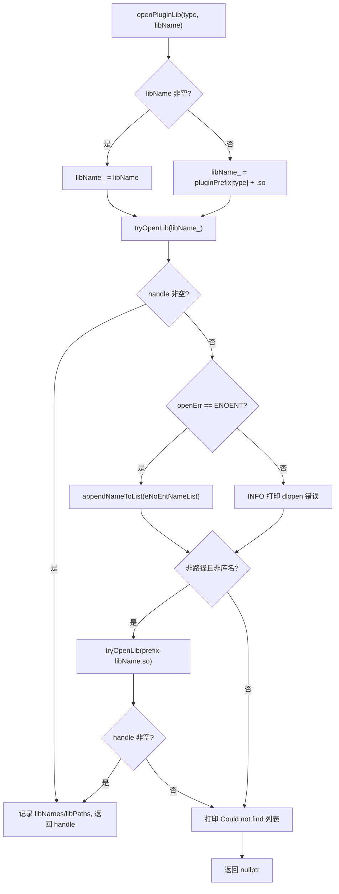
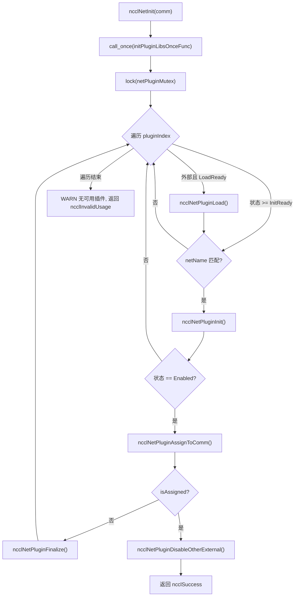
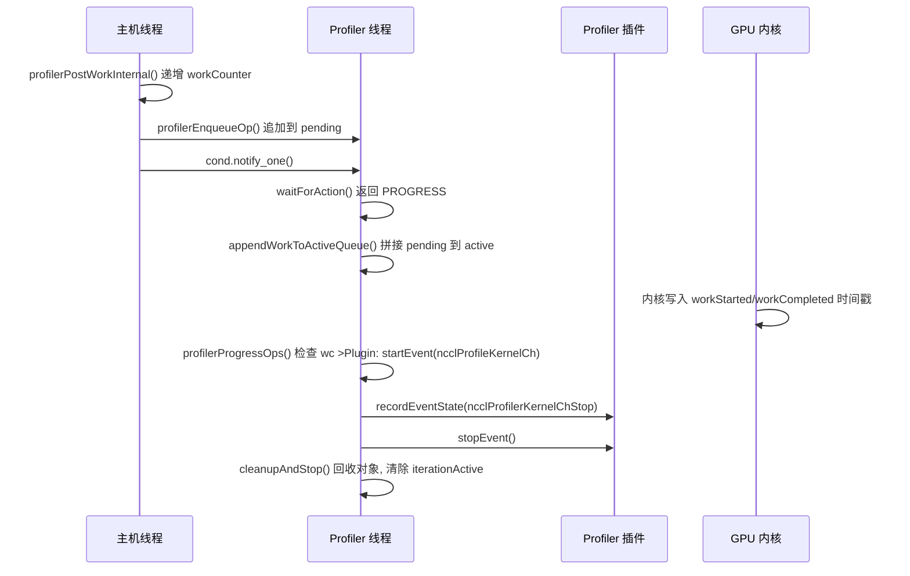

# Chapitre 16 : Écosystème de plugins et variables d'environnement : comment net, tuner, profiler, env étendent le comportement de NCCL

Dans le chapitre précédent, nous avons vu comment NCCL étend ses capacités de communication des opérations collectives à l'accès distant point à point via RMA et GIN, permettant même au GPU d'initier directement des requêtes réseau. Cette évolution vers de nouveaux matériels et des scénarios à faible latence impose des exigences plus élevées en matière de flexibilité du moteur de communication : si chaque adaptation à un nouveau réseau, une nouvelle stratégie de réglage ou un nouvel outil de collecte nécessitait de recompiler le code principal, NCCL aurait du mal à suivre les changements de l'écosystème. Ce chapitre décortique les répertoires src/plugin et plugins, et répond à une question centrale : comment NCCL peut remplacer le backend réseau, la stratégie de réglage, le collecteur de performance et la source de configuration sans recompiler le code principal.

# 16.1 Chargeur de plugins : comment plugin_open.cc transforme un .so en backend utilisable

## Modèle intuitif

Considérez`plugin_open.cc`comme « l'agence de recrutement » de NCCL : elle dispose d'une liste de postes (NET, GIN, RMA, TUNER, PROFILER, ENV), chaque poste correspondant à un nom de bibliothèque candidate. Lorsque NCCL a besoin d'une personne pour un poste, l'agence va dans l'ordre fixe chercher sur le marché des talents (l'éditeur de liens dynamique), signe le contrat si elle trouve (`dlopen`), enregistre « cette personne n'existe pas » sinon, et renvoie finalement un handle. Sans cette couche d'intermédiation, NCCL devrait coder en dur le backend réseau dans le binaire, et tout fabricant de carte réseau voulant s'intégrer devrait modifier le code source de NCCL — c'est précisément la catastrophe que le système de plugins vise à éliminer.

## Structures de données et disposition mémoire

Tout l'état du chargeur se résume à six tableaux parallèles, dont l'indice est l'énumération du type de plugin :

```
static char* libNames[NUM_LIBS];              // 已加载库的名字
char* ncclPluginLibPaths[NUM_LIBS];           // 库的绝对路径
static void* libHandles[NUM_LIBS];            // dlopen 返回的句柄
static const char* pluginNames[NUM_LIBS];     // 日志用的人类可读名
static const char* pluginPrefix[NUM_LIBS];    // 库名前缀
static const char* pluginFallback[NUM_LIBS];  // 找不到时的提示
static unsigned long subsys[NUM_LIBS];        // 日志子系统位掩码
```

Les indices de ces sept tableaux doivent être strictement alignés,`pluginNames[type]`、`pluginPrefix[type]`、`subsys[type]`décrit le même type de plugin.[FACT:src/plugin/plugin_open.cc:18-29]définit`NUM_LIBS = 6`, l'ordre des types est`{"NET", "GIN", "RMA", "TUNER", "PROFILER", "ENV"}`, le préfixe est`{"libnccl-net", "libnccl-gin", "libnccl-rma", "libnccl-tuner", "libnccl-profiler", "libnccl-env"}`。

> **[Design Inference & Architectural Trade-offs]**
> On utilise ici des tableaux parallèles plutôt qu'un tableau de structures, afin que`openPluginLib`cette fonction unique puisse servir simultanément six types de plugins — le type ne servant que d'indice, la logique est entièrement réutilisée. Le coût est que l'ajout d'un nouveau type de plugin nécessite de modifier synchroniquement six tableaux, et le compilateur ne peut pas vous aider à détecter les oublis.

`subsys`Le tableau détermine l'attribution des logs : NET/GIN/RMA sont tous rattachés à`NCCL_INIT | NCCL_NET`, TUNER à`NCCL_INIT | NCCL_TUNING`, PROFILER uniquement à`NCCL_INIT`, ENV à`NCCL_INIT | NCCL_ENV`。[FACT:src/plugin/plugin_open.cc:26-29]Ainsi, lors de`NCCL_DEBUG_SUBSYS=NET`on ne verra que les logs des plugins réseau, sans être noyé dans les logs de réglage.

## Parcours pas à pas : le voyage complet d'un`ncclOpenNetPluginLib("mlx5")`Supposons que l'utilisateur définisse

, NCCL appelle`NCCL_NET_PLUGIN=mlx5`lors de l'initialisation, qui transmet directement à`ncclOpenNetPluginLib("mlx5")`Première étape : construire le nom de bibliothèque candidate.`openPluginLib(ncclPluginTypeNet, "mlx5")`。[FACT:src/plugin/plugin_open.cc:132-134]

**Comme un**non vide est passé, on emprunte la branche`libName`,`snprintf(libName_, MAX_STR_LEN, "%s", libName)`devient`libName_`Notez qu'à ce stade ce n'est pas encore un nom de fichier de bibliothèque valide — il n'a ni préfixe ni`"mlx5"`。[FACT:src/plugin/plugin_open.cc:85-89]suffixe.`.so`Deuxième étape : première tentative d'ouverture.

**est appelé.** `tryOpenLib("mlx5", ...)`Après être entré dans[FACT:src/plugin/plugin_open.cc:91], on vérifie d'abord si`tryOpenLib`est vide ou de longueur nulle, puis il y a une branche spéciale : si le nom commence par`name`, on met`STATIC_PLUGIN`à`name` 置为 `nullptr`。[FACT:src/plugin/plugin_open.cc:37-39]Ceci est la sentinelle utilisée pour les plugins liés statiquement à NCCL —`dlopen(nullptr)`Sous Linux, renvoie le handle du programme principal, permettant ainsi à`dlsym`de trouver les symboles du plugin dans la table des symboles du programme principal.

Ensuite, appelle`ncclOsDlopen(name)`。[FACT:src/plugin/plugin_open.cc:41]car`"mlx5"`n'est ni un chemin ni un nom de bibliothèque valide,`dlopen`échouera. Après l'échec, le code récupère`ncclOsDlerror()`la chaîne d'erreur, et effectue un jugement précis : si la chaîne d'erreur contient à la fois`name`et`"No such file or directory"`, alors définit`*err`sur`ENOENT`。[FACT:src/plugin/plugin_open.cc:42-55]L'objectif de ce jugement est de distinguer « le fichier n'existe pas du tout » de « le fichier existe mais le chargement a échoué » — le premier cas signifie simplement que le nom candidat est incorrect et qu'il faut essayer silencieusement le candidat suivant ; le second est une véritable erreur qui doit être journalisée.

**Troisième étape : traitement après le premier échec.**Retour à`openPluginLib`，`libHandles[type]`est vide, et`openErr == ENOENT`, donc ajoute`"mlx5"`à`eNoEntNameList`。[FACT:src/plugin/plugin_open.cc:97-101]Cette liste finira par former un journal « Could not find: mlx5 libnccl-net-mlx5.so ».

**Quatrième étape : deuxième tentative — ajout de préfixe.**Le code vérifie si`libName`n'est ni un chemin (ne contient pas`/`) ni un nom de bibliothèque (ne commence pas par`lib`, ne se termine pas par`.so`).[FACT:src/plugin/plugin_open.cc:105-107] `"mlx5"`La condition est remplie, donc assemble`"libnccl-net-mlx5.so"`et réessaie.[FACT:src/plugin/plugin_open.cc:108]Cette fois`dlopen`réussit,`libHandles[type]`est assigné,`libNames[type]`enregistre le nom de la bibliothèque,`ncclPluginLibPaths[type]`via`getLibPath`obtient le chemin absolu, la fonction retourne le handle.[FACT:src/plugin/plugin_open.cc:110-115]

**Cinquième étape : obtention du chemin absolu.** `getLibPath`Sous Linux, utilise`dlinfo(handle, RTLD_DI_LINKMAP, &lm)`pour extraire`link_map`, puis`strdup(lm->l_name)`。[FACT:src/plugin/plugin_open.cc:65-69]Ce chemin apparaîtra dans tous les journaux suivants, permettant à l'utilisateur de voir d'un coup d'œil quel fichier a été chargé — lors du diagnostic en production de « pourquoi un mauvais plugin a été chargé », cette ligne de journal est la scène de crime principale.

Le flux de décision complet est le suivant :



## Réflexions de conception et pièges en production

> **[Design Inference & Architectural Trade-offs]**
> **L'ordre des noms candidats est la priorité.**On essaie d'abord le nom brut fourni par l'utilisateur, puis le nom avec préfixe. Cela signifie que si le répertoire courant contient un fichier nommé`mlx5`, il sera chargé en priorité — c'est une surface d'attaque potentielle, et en production il faut éviter de placer dans`LD_LIBRARY_PATH`des exécutables portant le même nom que le plugin.

**`STATIC_PLUGIN`La sémantique de**Lorsque`NCCL_NET_PLUGIN=STATIC_PLUGIN`,`tryOpenLib`met le nom à vide,`dlopen(nullptr)`ouvre le programme principal,`dlsym`cherche dans la table des symboles du programme principal des symboles tels que`ncclNet_v12`.[FACT:src/plugin/plugin_open.cc:37-39]Cela permet de lier statiquement le plugin dans le binaire NCCL, évitant le déploiement de`.so`, au prix de la perte de la capacité de remplacement à l'exécution.

**Comptage de références et déchargement.** `ncclClosePluginLib`Seulement lorsque`libHandles[type] == handle`effectue réellement`dlclose`, et vide le chemin et le nom.[FACT:src/plugin/plugin_open.cc:176-186]Cette comparaison d'égalité empêche de fermer par erreur un handle qui a déjà été remplacé. Les plugins GIN et RMA réutilisent le handle de la bibliothèque NET via`ncclGetGinPluginLib`/`ncclGetNetPluginLib`, en appelant à nouveau`dlopen`le même nom de bibliothèque pour incrémenter le compteur de références.[FACT:src/plugin/plugin_open.cc:156-164]C'est la sémantique de comptage de références de`dlopen`— la même bibliothèque ouverte deux fois nécessite`dlclose`deux fois pour être réellement déchargée.

# 16.2 net.cc : machine à états et cycle de vie des plugins réseau

## Modèle intuitif

`net.cc`est le « centre de调度 » des plugins réseau. Il maintient un tableau de bibliothèques de plugins, chaque bibliothèque ayant son propre état (non chargé, échec de chargement, en attente de chargement, en attente d'initialisation, activé). Lorsqu'un nouveau domaine de communication (communicator) naît, le centre de调度 parcourt tous les plugins candidats, tente de les initialiser un par un, le premier qui réussit est « attribué » à ce domaine de communication, et tous les autres plugins externes sont désactivés. Sans cette machine à états, NCCL ne pourrait pas gérer des problèmes concrets tels que « le plugin est chargé mais l'appareil est indisponible », « lequel choisir quand plusieurs plugins coexistent », « comment décharger en toute sécurité à la destruction du domaine de communication ».

## Structures de données et disposition mémoire

La structure centrale est`netPluginLib_t`：

| Champ | Type | Signification |
| --- | --- | --- |
| `name` | `char[255]` | Nom de la bibliothèque de plugins |
| `dlHandle` | `void*` | Handle dlopen |
| `ncclNet` | `ncclNet_t*` | Table de fonctions réseau |
| `ncclNetVer` | `int` | Numéro de version de l'API réseau |
| `ncclCollNet` | `ncclCollNet_t*` | Table de fonctions de déchargement de communication collective |
| `ncclNetPluginState` | Énumération | État du plugin réseau |
| `ncclCollNetPluginState` | Énumération | État du plugin CollNet |
| `ncclNetPluginRefCount` | `int` | Compteur de références |
| `netPhysDevs`/`netVirtDevs` | `int` | Nombre d'appareils physiques/virtuels |
| `collNetPhysDevs`/`collNetVirtDevs` | `int` | Nombre d'appareils CollNet |

[FACT:src/plugin/net.cc:63-76]définit ces champs. Noter que`ncclNet`et`ncclCollNet`sont deux tables de fonctions séparées, et les états sont également deux énumérations séparées — un plugin peut fournir des fonctionnalités réseau sans fournir le déchargement CollNet.

L'énumération d'état a cinq valeurs :`Disabled = -2`(échec d'initialisation),`LoadFailed = -1`(échec de chargement),`LoadReady = 0`(en attente de chargement),`InitReady = 1`(chargé en attente d'initialisation),`Enabled = 2`(activé).[FACT:src/plugin/net.cc:54-60]utilise des nombres négatifs pour représenter les états d'échec, de sorte qu'une comparaison comme « état >= InitReady » exprime naturellement « au moins chargé ».

L'état global est constitué de trois variables :`pluginCount`enregistre le nombre total de plugins,`netPluginLibs[NCCL_NET_MAX_PLUGINS]`est le tableau de plugins,`netPluginMutex`protège l'accès concurrent,`initPluginLibsOnceFlag`garantit que l'initialisation n'est effectuée qu'une seule fois.[FACT:src/plugin/net.cc:78-81]

## Step-by-Step Walkthrough : le voyage complet d'un`ncclNetInit(comm)`Premier pas : initialisation unique.

**garantit que la liste des plugins n'est construite qu'une seule fois.** `std::call_once(initPluginLibsOnceFlag, initPluginLibsOnceFunc)`lit la variable d'environnement[FACT:src/plugin/net.cc:360] `initPluginLibsOnceFunc`, si non définie ajoute par défaut`NCCL_NET_PLUGIN`, puis enregistre deux plugins intégrés`"libnccl-net.so"`et`ncclNetIb`L'analyse de la variable d'environnement utilise`ncclNetSocket`。[FACT:src/plugin/net.cc:288-340]

pour découper par virgule, supportant plusieurs noms de plugins.`strtok_r`dispose d'une vérification de capacité : le nombre de plugins externes ne peut pas dépasser[FACT:src/plugin/net.cc:303-324], l'excédent est ignoré et journalisé.`NCCL_NET_MAX_PLUGINS - NCCL_NET_NUM_INTERNAL_PLUGINS`Les plugins intégrés sont fixés à 2 (IB et Socket), donc les plugins externes sont au maximum[FACT:src/plugin/net.cc:307-311]au maximum.`NCCL_NET_MAX_PLUGINS - 2`Deuxième étape : parcours verrouillé.

**protège tout le processus de parcours.** `std::lock_guard<std::mutex> lock(netPluginMutex)`Pour chaque index de plugin, on vérifie d'abord s'il s'agit d'un plugin externe et s'il est dans l'état[FACT:src/plugin/net.cc:361], si oui on appelle`LoadReady`Troisième étape : chargement du plugin.`ncclNetPluginLoad`。[FACT:src/plugin/net.cc:364-367]

**appelle** `ncclNetPluginLoad`pour obtenir le handle, puis essaie de la version la plus élevée à la plus basse`ncclOpenNetPluginLib`jusqu'à`getNcclNet_v12`, la première version retournant un résultat non nul est adoptée.`getNcclNet_v6`Les tableaux de versions[FACT:src/plugin/net.cc:103-112]et les tableaux de pointeurs de fonctions`ncclNetVersion`sont triés par ordre décroissant, garantissant l'utilisation prioritaire de l'API la plus récente.`getNcclNet`Si aucune version n'obtient[FACT:src/plugin/net.cc:41-43]

, cela signifie que cette bibliothèque n'est pas un plugin réseau valide. On vérifie alors si`ncclNet`a été explicitement défini : si oui, on utilise le niveau`NCCL_NET_PLUGIN`pour l'avertissement (l'utilisateur l'a explicitement demandé mais cela a échoué) ; si non, on utilise`ATTN` 级别告警（用户明确要求却失败）；若没设置，用 `INFO`niveau (il s'agit juste d'une tentative par défaut qui échoue).[FACT:src/plugin/net.cc:115-125]Cette distinction est importante — un échec de configuration explicite de l'utilisateur doit être visible.

**Quatrième étape : initialiser le plugin.**Retour à`ncclNetInit`, pour l'état`>= InitReady`et dont le nom correspond à`comm->config.netName`, appeler le plugin`ncclNetPluginInit`。[FACT:src/plugin/net.cc:369-372] `ncclNetPluginInit`pour faire deux choses : appeler la fonction`init`du plugin afin d'établir le contexte du domaine de communication, et lors de la première initialisation, appeler`devices`pour détecter le nombre de devices.[FACT:src/plugin/net.cc:186-236]

Attention aux conditions d'appel de`init`:`pluginLib->ncclNetPluginState >= ncclNetPluginStateInitReady`。[FACT:src/plugin/net.cc:190]Les commentaires indiquent explicitement que « chaque nouveau domaine de communication doit appeler init pour définir le contexte correct ».[FACT:src/plugin/net.cc:189]Mais la détection des devices n'est effectuée qu'une seule fois lors de`== InitReady`.[FACT:src/plugin/net.cc:201]Cette distinction « init appelé à chaque fois, devices appelé une seule fois » est une optimisation de performance — la détection des devices peut être très lente, mais le contexte doit être indépendant pour chaque domaine de communication.

**Cinquième étape : allocation et désactivation.**Après une initialisation réussie, appeler`ncclNetPluginAssignToComm`, qui assigne le`ncclNet`du plugin à`comm->ncclNet`, incrémente le compteur de références, définit`comm->netPluginIndex`。[FACT:src/plugin/net.cc:238-255]. Après une allocation réussie, appeler immédiatement`ncclNetPluginDisableOtherExternal`pour désactiver tous les autres plugins externes.[FACT:src/plugin/net.cc:377-380]

> **[Design Inference & Architectural Trade-offs]**
> La logique de désactivation comporte un jugement clé : ce n'est que lorsque le plugin alloué est un plugin externe (`pluginIndex >= pluginCount - NCCL_NET_NUM_INTERNAL_PLUGINS`) que les autres plugins externes sont désactivés.[FACT:src/plugin/net.cc:257-259]Si c'est le plugin IB intégré qui est alloué, les plugins externes restent inchangés — cela laisse des options pour les domaines de communication suivants.



## Contrôle de concurrence et interaction matérielle

`netPluginMutex`protège toutes les lectures et écritures sur`netPluginLibs`.`ncclNetInit`、`ncclNetFinalize`Tous sont verrouillés.[FACT:src/plugin/net.cc:361][FACT:src/plugin/net.cc:411-416]Mais les commentaires de fonctions comme`ncclNetGetDevCount`indiquent « pas besoin de verrou, car l'appelant est déjà dans le verrou de`ncclTopoGetSystem`».[FACT:src/plugin/net.cc:418-429]C'est une convention de type « verrou détenu par la couche supérieure », qui réduit le coût des verrous imbriqués, au prix que l'appelant doit respecter la convention.

`ncclGpuGdrSupport`illustre l'interaction directe entre le plugin et le matériel : il alloue un buffer GPU de 2 Mo, établit une connexion loopback via le`listen`/`connect`/`accept`du plugin, puis tente d'enregistrer la mémoire GPU avec`regMr`.[FACT:src/plugin/net.cc:464-535]Si l'enregistrement réussit, cela signifie que la carte réseau prend en charge GPUDirect RDMA. Ce résultat de détection est mis en cache dans`gdrSupportMatrix[32]`, indexé par numéro de device CUDA.[FACT:src/plugin/net.cc:478-480]

> **[Design Inference & Architectural Trade-offs]**
> Noter que`gdrSupportMatrix`est`static`de[FACT:src/plugin/net.cc:478], partagé entre les domaines de communication. Cela signifie que plusieurs domaines de communication dans le même processus réutiliseront le résultat de détection, évitant des détections coûteuses répétées. Mais la taille du tableau est codée en dur à 32, les machines avec plus de 32 GPU provoqueront un dépassement — c'est une hypothèse de limite supérieure implicite.

## Guide de production pour éviter les pièges

**Piège 1 : le plugin se charge avec succès mais le nombre de devices est zéro.** `ncclNetPluginInit`Vérifier`devices(&ndev) != ncclSuccess || ndev <= 0`, sinon sauter vers la branche d'échec.[FACT:src/plugin/net.cc:202]En cas d'échec, appeler`finalize`pour nettoyer le contexte déjà établi, réinitialiser le nombre de devices à`NCCL_UNDEF_DEV_COUNT`, définir l'état à`Disabled`。[FACT:src/plugin/net.cc:229-234]. Si ce nettoyage n'est pas effectué, les domaines de communication suivants verront un plugin « initialisé mais sans device », provoquant des erreurs difficiles à diagnostiquer.

> **[Design Inference & Architectural Trade-offs]**
> **Piège 2 :`init`réussit mais`devices`échoue.**Le code utilise le flag`initCompleted`pour suivre si`init`a réussi.[FACT:src/plugin/net.cc:178-184][FACT:src/plugin/net.cc:198]Dans la branche d'échec, ce n'est que si`initCompleted`est vrai que`finalize`。[FACT:src/plugin/net.cc:230]est appelé. Cela empêche d'appeler`finalize`sur un contexte non initialisé — beaucoup de plugins`finalize`ne vérifient pas les pointeurs nuls, un appel erroné provoquerait un crash.

**Piège 3 : comptage de références lors de la destruction du domaine de communication.** `ncclNetPluginFinalize`Appeler d'abord le`finalize`du plugin, puis décrémenter le compteur de références, et enfin décharger la bibliothèque lorsque le compteur de références atteint zéro et qu'il s'agit d'un plugin externe.[FACT:src/plugin/net.cc:342-355] `ncclNetPluginUnload`Vérifier que`dlHandle`est non nul et que le compteur de références est zéro pour effectuer réellement`dlclose`。[FACT:src/plugin/net.cc:84-101]. Après déchargement, réinitialiser les champs mais conserver`name`, afin de pouvoir le réutiliser lors d'un rechargement.[FACT:src/plugin/net.cc:84-101]

# 16.3 tuner.cc et profiler.cc : contrats différents entre plugins de stratégie et plugins d'observation

## Modèle intuitif

Le plugin Tuner ressemble aux « préférences d'itinéraire d'un logiciel de navigation » — il ne change pas la façon dont la voiture roule, il change seulement quel chemin est choisi. Le plugin Profiler ressemble à un « enregistreur de conduite » — il n'intervient pas dans la conduite, il enregistre seulement ce qui s'est passé. Leur point commun est qu'ils s'intègrent tous deux via une table de fonctions ; la différence est que Tuner est un objet de stratégie léger « une instance par domaine de communication », tandis que Profiler nécessite un thread indépendant pour consommer de manière asynchrone les événements générés par le GPU.

## tuner.cc : un singleton global minimaliste

L'état du Tuner est extrêmement simple : un mutex, un compteur de références, un handle de bibliothèque, un pointeur de symbole, une variable d'état.[FACT:src/plugin/tuner.cc:24-37]Pas de tableau de plugins, pas de coexistence multi-plugins — il n'y a qu'un seul tuner global.

`ncclTunerPluginLoad`La logique est « premier chargement, réutilisation ensuite » : si l'état est`LoadSuccess`, assigner directement le symbole à`comm->tuner`et incrémenter le compteur de références.[FACT:src/plugin/tuner.cc:53-57]Sinon, lire la variable d'environnement`NCCL_TUNER_PLUGIN`, si elle est`"none"`, échouer directement.[FACT:src/plugin/tuner.cc:59-63]

> **[Design Inference & Architectural Trade-offs]**
> La négociation de version passe de v6 à v2, en essayant une par une.[FACT:src/plugin/tuner.cc:75-87]Noter qu'il n'y a pas de v1 ici — l'API tuner n'a une structure de table de fonctions stable qu'à partir de v2.

> **[Design Inference & Architectural Trade-offs]**
> Un détail intéressant : si`ncclOpenTunerPluginLib`renvoie vide, le code tente`ncclGetNetPluginLib(ncclPluginTypeTuner)`。[FACT:src/plugin/tuner.cc:65-70]. Cela signifie que le tuner peut être empaqueté dans la bibliothèque du plugin net — cela réduit la complexité de déploiement, un seul`.so`fournit à la fois les fonctions réseau et de réglage.

## profiler.cc : thread de consommation d'événements asynchrone

Profiler est le plugin le plus complexe de ce chapitre, car il doit traiter les événements générés de manière asynchrone par le GPU. La structure centrale est`ncclProfilerThread`：

| champ | type | rôle |
| --- | --- | --- |
| `thread` | `std::thread` | thread de consommation |
| `mutex` | `std::mutex` | protège la file |
| `cond` | `condition_variable` | réveille en cas de nouveau travail |
| `condIterationInactive` | `condition_variable` | attend la fin de l'itération |
| `stop` | `int` | flag d'arrêt |
| `refCount` | `int` | compteur de références du domaine de communication |
| `cudaDev` | `int` | device CUDA lié |
| `abortFlag` | `volatile uint32_t*` | flag d'abandon |
| `iterationActive` | `bool` | si en cours d'itération |
| `pending`/`pendingTail` | liste chaînée | travail en attente |
| `active`/`activeTail` | liste chaînée | travail en cours de traitement |
| `opStack`/`opPool` | pool de mémoire | allocation d'objets de travail |
| `inflight`/`maxInflightSeen`/`maxInflight` | `size_t` | observation de la contre-pression |
| `droppedOps` | `uint64_t` | compteur d'échecs d'allocation |

[FACT:src/plugin/profiler.cc:38-69]définit cette structure. Noter que`pending`et`active`sont deux listes chaînées indépendantes : le producteur ajoute à`pending`, le thread de consommation, dans le verrou, concatène`pending`à`active`, puis parcourt`active`。[FACT:src/plugin/profiler.cc:56-59]

`iterationActive`en dehors du verrou. Le flag`true`est la clé de la correction concurrente : le thread de consommation le définit à`false`pour pouvoir démonter l'état du domaine de communication.[FACT:src/plugin/profiler.cc:52-55]

## Step-by-Step Walkthrough : génération et consommation d'un événement KernelCh

**Première étape : mise en file côté hôte.**Lorsqu'un kernel plan est soumis,`ncclProfilerPostPlanWork`on parcourt les tâches d'ensemble du plan, et pour chaque tâche ayant activé`ncclProfileKernelCh`, on appelle selon la plage de canaux`profilerPostWorkInternal`。[FACT:src/plugin/profiler.cc:1315-1331]

`profilerPostWorkInternal`on incrémente d'abord`comm->profiler.workCounter[channelId]`, puis on appelle`profilerEnqueueOp`。[FACT:src/plugin/profiler.cc:1259-1266]Le commentaire souligne que cette incrémentation doit être « exactement une fois par appel, même en cas d'échec d'allocation », afin de rester synchronisé avec le kernel du dispositif.[FACT:src/plugin/profiler.cc:1259-1266]

**Deuxième étape : allocation de l'objet de travail.** `profilerEnqueueOp`Sous verrou, on alloue depuis le pool mémoire`ncclProfilerWorkOp`, on remplit les champs tels que numéro de canal, compteur de travail, masque d'activation, handle d'événement de tâche, contexte du domaine de communication, etc.[FACT:src/plugin/profiler.cc:1199-1223]En cas d'échec d'allocation, on incrémente`droppedOps`et on journalise, mais**on ne**revient pas en arrière sur`workCounter`— c'est la clé pour rester synchronisé avec le dispositif.[FACT:src/plugin/profiler.cc:1202-1207]

Après une allocation réussie, on ajoute l'objet à la fin de la liste chaînée`pending`, on incrémente`inflight`, on met à jour`maxInflightSeen`, et on réveille le thread consommateur.[FACT:src/plugin/profiler.cc:1225-1239]

**Troisième étape : attente du thread consommateur.** `ncclProfilerThreadFunc`On appelle en boucle`waitForAction`。[FACT:src/plugin/profiler.cc:1074-1077] `waitForAction`on attend la variable de condition sous verrou, jusqu'à ce que`pending`ou`active`soit non vide, ou qu'un signal d'arrêt/abandon soit reçu.[FACT:src/plugin/profiler.cc:1017-1031]

Une fois réveillé, il appelle`appendWorkToActiveQueue`pour concaténer`pending`à la fin de`active`, définit`iterationActive = true`, et retourne`NCCL_PROFILER_THREAD_PROGRESS`。[FACT:src/plugin/profiler.cc:1017-1031]

**Quatrième étape : traitement du travail.** `profilerProgressOps`En dehors**du verrou**on parcourt la liste chaînée`active`.[FACT:src/plugin/profiler.cc:958-999]Pour chaque objet de travail, on vérifie si le dispositif a déjà écrit l'horodatage de démarrage :`wc <= op->workStarted[ch].data[slot].counter`。[FACT:src/plugin/profiler.cc:972]Noter qu'on utilise`<=`et non`==`, car le dispositif va cycler sur`MAX_PROFILER_EVENTS_PER_CHANNEL`slots, et si l'hôte est en retard, le dispositif a pu déjà écraser ce slot.[FACT:src/plugin/profiler.cc:969-971]

Si la condition de démarrage est remplie, on appelle`ncclProfilerStartKernelChEvent`pour notifier le plugin.[FACT:src/plugin/profiler.cc:973]On vérifie ensuite la condition d'achèvement ; si elle est remplie, on déclenche d'abord l'événement de phase, puis on appelle`ncclProfilerStopKernelChEvent`。[FACT:src/plugin/profiler.cc:978-985]

Les objets de travail terminés sont retirés de la liste chaînée et collectés dans la liste`recycled`.[FACT:src/plugin/profiler.cc:987-991]

**Cinquième étape : récupération et publication.** `cleanupAndStop`Sous verrou, on récupère la liste`recycled`, on publie le nouveau`activeTail`, on efface`iterationActive`et on notifie les attendeurs.[FACT:src/plugin/profiler.cc:1036-1050]



## Contrôle de concurrence et contre-pression

`NCCL_PROFILER_DEFAULT_MAX_INFLIGHT`est défini comme`MAXCHANNELS * MAX_PROFILER_EVENTS_PER_CHANNEL * 4`。[FACT:src/plugin/profiler.cc:32-32]Il s'agit d'un « plafond souple » — le dépasser n'empêche pas la mise en file, cela ne fait que journaliser.[FACT:src/plugin/profiler.cc:1233-1238]Le commentaire explique que maintenir la mise en file sert à apparier les événements KernelCh avec leurs événements de tâche parente.[FACT:src/plugin/profiler.cc:32-32]

La journalisation se déclenche sur les puissances de 2 :`(pt->inflight & (pt->inflight - 1)) == 0`。[FACT:src/plugin/profiler.cc:1233]Cela garantit que la journalisation n'a lieu que lorsque inflight vaut 1, 2, 4, 8..., évitant ainsi le spam.

La stratégie de repli du thread consommateur se trouve dans`updateProgressInterval`: en cas de progrès, on réessaie immédiatement ; sans progrès, on double à partir de 1 microseconde, avec un plafond de 10 microsecondes.[FACT:src/plugin/profiler.cc:1054-1057]Cette conception équilibre latence et occupation CPU.

## Guide pour éviter les pièges en production

**Piège un : fuite de travail lors de la destruction.** `ncclProfilerThreadDestroy`On attend d'abord que`iterationActive`devienne faux, puis on appelle`profilerPurgeByContext`pour effacer tout travail en attente référençant ce contexte de domaine de communication.[FACT:src/plugin/profiler.cc:1162-1169]Sans cet effacement, le callback du plugin recevrait un pointeur vers un contexte détruit, provquant un use-after-free.

**Piège deux : vidage lors de l'arrêt.**Lorsqu'un signal d'arrêt est reçu mais que`active`est non vide, on retourne`NCCL_PROFILER_THREAD_CLEANUP_AND_STOP`，`cleanupAndStop`avec le paramètre`drainStuck`à vrai, récupérant directement tout le travail restant.[FACT:src/plugin/profiler.cc:1029][FACT:src/plugin/profiler.cc:1036-1050]Le commentaire indique que le kernel de ces travaux ne s'exécutera jamais, donc on les jette directement.[FACT:src/plugin/profiler.cc:1034-1035]

**Piège trois : liaison au dispositif CUDA.**Au démarrage du thread consommateur, on appelle`cudaSetDevice(pt->cudaDev)`。[FACT:src/plugin/profiler.cc:1054-1057]Le commentaire explique : le thread lui-même ne lit que la mémoire fixée de l'hôte, mais le plugin peut effectuer des appels de pilote dépendant du contexte, d'où cette liaison défensive.[FACT:src/plugin/profiler.cc:1054-1057]Un échec de liaison ne fait que journaliser sans interrompre, car le thread lui-même ne dépend pas de CUDA.[FACT:src/plugin/profiler.cc:1065-1070]

# 16.4 Exemples officiels : points clés de l'implémentation de google-fastsocket et google-CoMMA

## Modèle intuitif

Les exemples officiels sont des « implémentations de référence » de l'API plugin.`google-fastsocket`Ils montrent comment remplacer le TCP du noyau par une pile réseau en espace utilisateur ;`google-CoMMA`ils montrent comment implémenter un plugin profiler pour collecter les performances de communication. Leur existence prouve que l'API plugin est suffisamment expressive pour répondre à des besoins réels.

## google-fastsocket : remplacer le backend réseau

> **[Design Inference & Architectural Trade-offs]**
> FastSocket est une pile réseau en espace utilisateur open source de Google, qui contourne la pile TCP/IP du noyau via la famille d'adresses`AF_FABRIC`. En tant que plugin net de NCCL, il doit implémenter toutes les fonctions de`ncclNet_t`:`init`、`devices`、`getProperties`、`listen`、`connect`、`accept`、`regMr`、`isend`、`irecv`、`test`、`closeSend`etc.

Le point d'implémentation clé réside dans le`getProperties`retourné par`ptrSupport`: si FastSocket prend en charge GPUDirect RDMA, il faut le définir à`NCCL_PTR_HOST|NCCL_PTR_CUDA`; sinon on ne peut le définir qu'à`NCCL_PTR_HOST`, et NCCL copiera les données GPU vers la mémoire hôte avant l'envoi.[FACT:plugins/net/README.md:245-245]

`connect`Le contrat « non bloquant » de`accept`et`sendComm`/`recvComm`est le principal point difficile de l'implémentation du plugin : ils doivent retourner immédiatement, en mettant`NULL`à[FACT:plugins/net/README.md:299-311], laissant NCCL appeler en boucle jusqu'au succès.

## Cela exige que le plugin maintienne en interne une machine à états de connexion, plaçant la poignée de main coûteuse en arrière-plan.

> **[Design Inference & Architectural Trade-offs]**
> 〔Inférence de conception et compromis architecturaux〕`ncclProfiler_t`CoMMA (Collective Memory Monitoring Agent) est le collecteur de performances de communication de Google. En tant que plugin profiler, il implémente la table de fonctions`init`、`finalize`、`startEvent`、`stopEvent`、`recordEventState`。

`init`:`ncclProfilerEventMask`reçoit un pointeur[FACT:src/plugin/profiler.cc:341], et le plugin sélectionne les événements auxquels s'abonner en écrivant dans ce masque.[FACT:src/plugin/profiler.cc:285-307]

`startEvent`Les types d'événements pris en charge par NCCL incluent Group, Coll, P2p, ProxyOp, ProxyStep, ProxyCtrl, KernelCh, KernelPhase, NetPlugin, etc.`stopEvent`retourne un handle d'événement, et les`recordEventState`et[FACT:src/plugin/profiler.cc:392][FACT:src/plugin/profiler.cc:400-407]ultérieurs utilisent ce handle pour associer les événements.

## Le plugin peut utiliser le handle pour stocker son propre état, réalisant l'appariement d'événements et les statistiques de durée.

**Réflexions de conception**Parce que l'API net implique du code côté périphérique (`ncclNetDeviceHandle`), une incompatibilité de version provoque un plantage du noyau ; tandis que tuner/profiler est purement côté hôte, une incompatibilité de version entraîne au pire une fonctionnalité manquante.[FACT:src/plugin/net.cc:153-176]montre comment`ncclNetCheckDeviceVersion`vérifier le type et la version du périphérique, et renvoyer`ncclInternalError`。

**Pourquoi le profiler a-t-il besoin d'un thread indépendant ?**Parce que le callback du profiler peut bloquer (par exemple écrire dans un fichier, envoyer une requête réseau) ; s'il est appelé dans le thread hôte, cela ralentit la communication.[FACT:src/plugin/profiler.cc:950-952]Le commentaire indique explicitement que « le callback du plugin peut bloquer, donc il ne doit pas être appelé en tenant le verrou ».

# 16.5 Guide de production pour éviter les pièges et chaîne de récupération après incident

## Piège n°1 : une incompatibilité de version du plugin provoque un plantage du noyau

`ncclNetCheckDeviceVersion`Vérifier`props.netDeviceType`et`props.netDeviceVersion`。[FACT:src/plugin/net.cc:153-176]Si la version`NCCL_NET_DEVICE_UNPACK`rapportée par le plugin est incohérente avec la version`NCCL_NET_DEVICE_UNPACK_VERSION`utilisée lors de la compilation de NCCL, renvoyer`ncclInternalError`et émettre un avertissement.[FACT:src/plugin/net.cc:153-176]Cette vérification est appelée dans`ncclNetPluginAssignToComm`; en cas d'échec, le plugin n'est pas affecté au domaine de communication.[FACT:src/plugin/net.cc:241]

**Chaîne de récupération**: incompatibilité de version →`ncclNetCheckDeviceVersion`renvoie une erreur →`ncclNetPluginAssignToComm`renvoie`isAssigned = false` → `ncclNetInit`continue d'essayer le plugin suivant → peut finalement revenir au plugin Socket intégré.

## Piège n°2 : le thread du profiler ne peut pas se terminer

Si le plugin profiler bloque dans`stopEvent`, le thread consommateur reste bloqué dans`profilerProgressOps`,`iterationActive`est toujours vrai,`ncclProfilerThreadDestroy`attend indéfiniment.[FACT:src/plugin/profiler.cc:1166]Il s'agit d'un risque réel d'interblocage.

> **[Design Inference & Architectural Trade-offs]**
> **Chaîne de récupération**：`comm->abortFlag`est défini →`waitForAction`détecte l'abandon → renvoie`CLEANUP_AND_STOP` → `cleanupAndStop`vide la file d'attente.[FACT:src/plugin/profiler.cc:1017-1031]Mais si le thread est déjà bloqué dans le callback du plugin, le drapeau d'abandon ne peut pas l'interrompre — c'est la responsabilité de l'implémenteur du plugin, le callback doit avoir un délai d'expiration.

## Piège n°3 : fuite du compteur de références du plugin tuner

`ncclTunerPluginLoad`Incrémente`tunerPluginRefCount`。[FACT:src/plugin/tuner.cc:98] `ncclTunerPluginUnload`en cas de succès, décrémente lorsque`comm->tunerPluginLoaded`est vrai.[FACT:src/plugin/tuner.cc:111-123]Si un domaine de communication charge le tuner mais que`tunerPluginLoaded`est remis à zéro par accident lors de la destruction, le compteur de références ne revient jamais à zéro et la bibliothèque du plugin n'est jamais déchargée.

# Réflexions et auto-évaluation de ce chapitre

Q1 : Si l'on remplace dans`ncclNetPluginLoad`la boucle « essayer de la version la plus élevée à la plus basse » par « n'essayer que la version la plus élevée », dans quel scénario un plugin auparavant utilisable ne pourrait-il plus être chargé ?

**Analyse de référence**: voir[FACT:src/plugin/net.cc:108-112]. La boucle parcourt`NCCL_NET_VERSION_COUNT`versions, de v12 à v6, et la première qui renvoie une valeur non nulle est adoptée. Si l'on n'essaie que v12, un ancien plugin n'implémentant que v11 échouera au chargement.

> **[Design Inference & Architectural Trade-offs]**
> Cette conception vise la rétrocompatibilité : après la mise à niveau du cœur de NCCL pour prendre en charge v12, il peut toujours charger un plugin ne fournissant que v11. Les auteurs de plugins sont encouragés à fournir des symboles pour plusieurs versions (voir[FACT:plugins/net/README.md:35-37]), afin qu'un même`.so`puisse servir plusieurs versions de NCCL.

Si l'on supprime la tentative de dégradation, après une mise à niveau de NCCL par l'utilisateur, l'ancien plugin deviendrait soudainement indisponible, avec un repli possible uniquement vers le plugin Socket intégré, entraînant une forte baisse de performance. C'est précisément la raison d'être de la négociation de version.

Q2 : Dans`profilerProgressOps`, si l'on remplace`wc <= op->workStarted[ch].data[slot].counter`par`wc == op->workStarted[ch].data[slot].counter`, dans quel scénario de forte concurrence l'événement ne se déclencherait-il jamais ?

**Analyse de référence**: voir[FACT:src/plugin/profiler.cc:969-972]. Le commentaire indique explicitement que le périphérique boucle sur`MAX_PROFILER_EVENTS_PER_CHANNEL`emplacements. Si la vitesse de consommation de l'hôte est en retard sur la vitesse de production du périphérique, le périphérique a peut-être déjà écrasé l'emplacement`wc + N`avec le compteur`wc % MAX_PROFILER_EVENTS_PER_CHANNEL`。

; à ce moment-là, la valeur de`op->workStarted[ch].data[slot].counter`est`wc + N`, tandis que`op->workCounter`est`wc`. Un test avec`==`échouerait, l'événement ne se déclencherait jamais, l'objet de travail resterait indéfiniment dans la liste chaînée`active`,`inflight`ne ferait qu'augmenter sans jamais diminuer, finissant par épuiser le pool de mémoire.

Avec`<=`, ce cas est correctement géré : tant que le compteur écrit par le périphérique n'est pas inférieur à la valeur attendue, l'événement est considéré comme prêt. C'est une condition de correction typique d'un « tampon circulaire producteur-consommateur ».

Q3 : Si l'on supprime dans`ncclProfilerThreadDestroy`la boucle d'attente que`iterationActive`devienne faux, dans quel ordre temporel le plugin profiler accéderait-il à un contexte de domaine de communication déjà libéré ?

**Analyse de référence**: voir[FACT:src/plugin/profiler.cc:1162-1166]. Le commentaire indique que`ncclProfilerPluginFinalize`détruit immédiatement le`ncclProfilerThreadDestroy`du domaine de communication après le retour de`profilerContext`。

. Lorsque le thread consommateur appelle le callback du plugin dans`profilerProgressOps`, il transmet`op->profilerContext`。[FACT:src/plugin/profiler.cc:938]Si le thread de destruction ne attend pas que`iterationActive`devienne faux avant de revenir,`ncclProfilerPluginFinalize`libérerait le contexte, alors que le thread consommateur pourrait être en train d'utiliser ce contexte pour appeler le plugin — use-after-free.

`iterationActive`Le protocole de synchronisation de`true`est le suivant : le thread consommateur, après avoir défini`false`。[FACT:src/plugin/profiler.cc:1028][FACT:src/plugin/profiler.cc:1054-1057]sous verrou, libère le verrou pour appeler le plugin ; le thread de destruction attend sous verrou qu'il redevienne

Ce protocole garantit que le contexte reste valide pendant toute la durée du callback du plugin.

Après suppression de l'attente, le thread de destruction peut revenir au moment où le thread consommateur vient d'entrer dans le callback du plugin, ce qui fait que le plugin obtient un pointeur suspendu. C'est une condition de course typique entre « cycle de vie et accès concurrent ».

Le système de plugins fait passer NCCL d'un modèle fermé à un modèle ouvert : backend réseau, stratégie de réglage, collecteur de performance et source de configuration peuvent tous être remplacés sans modifier le code du cœur. Mais les plugins introduisent aussi de nouvelles surfaces de défaillance — incompatibilité de version, conditions de course de cycle de vie, fuite de compteur de références. Le chapitre suivant nous fera entrer dans le sous-système RAS et diagnostic, pour voir comment NCCL détecte les pannes, surveille la progression et réalise l'auto-réparation dans les tâches d'entraînement de longue durée.
