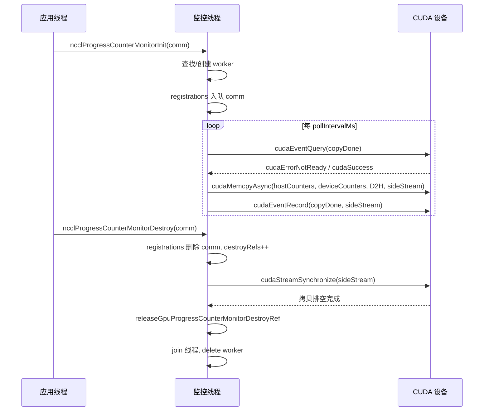
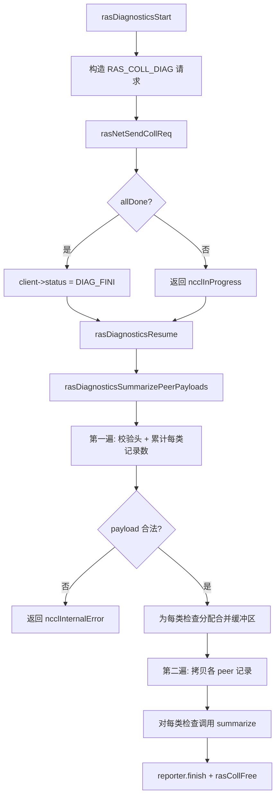

# Chapitre 17 : Mécanismes RAS et tolérance aux pannes : détection des défaillances de liaison, battement de cœur et dégradation gracieuse

Dans le chapitre précédent, nous avons vu comment le système de plugins permet de tracer une frontière entre le chemin de communication principal et les composants remplaçables, afin de pouvoir substituer le backend réseau, les stratégies d'optimisation et les collecteurs de performance sans modifier le code principal. Mais l'extensibilité n'est qu'une dimension de la disponibilité en production ; une autre question tout aussi cruciale se pose : lorsqu'un AllReduce tourne depuis 72 heures et que la carte réseau d'une machine tombe silencieusement en panne, comment NCCL peut-il le détecter, l'isoler et continuer ? Le sous-système RAS est précisément la ligne de démarcation qui fait passer NCCL de « fonctionnel » à « prêt pour la production ». Ce chapitre décompose la conception sous-jacente de la détection des pannes, de la surveillance de progression et des mécanismes d'auto-réparation.

# 17.1 Contrôleur RAS : un coordinateur global avec un thread RAS par processus

## Modèle intuitif

Imaginez RAS comme la « salle de permanence » de tout le job. Chaque processus NCCL (chaque rank) ouvre une salle de permanence lors de l'initialisation, avec un thread dédié à l'intérieur. La création, la destruction et les demandes de diagnostic de tous les communicateurs doivent d'abord être enregistrées auprès de la salle de permanence ; les salles de permanence communiquent ensuite entre elles via un réseau RAS indépendant pour s'informer mutuellement de « qui est encore en vie, qui est déjà mort ».

Sans cette salle de permanence, NCCL ne pourrait détecter les pannes que via les timeouts du chemin de communication lui-même — or les timeouts sur le chemin de communication sont à la fois lents et sujets aux faux positifs (une simple fluctuation réseau peut être interprétée comme la mort d'un nœud). RAS sépare la « détection des pannes » du plan de données vers le plan de contrôle, en utilisant un canal de battement de cœur léger et un canal de diagnostic indépendants pour déterminer l'état de santé.

## Structures de données et disposition mémoire

L'état central de RAS est dispersé dans les variables globales de`ras.cc`; nous allons les décomposer une par une :

| Variable | Type | Rôle |
| --- | --- | --- |
| `rasInitMutex` | `std::mutex` | Protège l'initialisation du singleton RAS |
| `rasInitialized` | `bool` | Indique si l'initialisation a eu lieu |
| `rasInitRefCount` | `int` | Compteur de références, égal au nombre de comm actifs |
| `rasNetListeningSocket` | `struct ncclSocket` | Socket d'écoute du réseau RAS |
| `rasNotificationPipe[2]` | `ncclSocketPairDescriptor` | Pipe de notification du thread local → thread RAS |
| `rasPfds` | `struct pollfd*` | Tableau poll de la boucle d'événements principale |
| `ncclComms` | `struct ncclComm**` | Tableau de pointeurs vers tous les communicateurs |

[FACT:src/ras/ras.cc:49-61]définit ces états globaux. Notez que`rasInitRefCount`utilise`ncclAtomicRefCountIncrement`pour incrémenter/décrémenter[FACT:src/ras/ras.cc:129], tandis que`rasInitialized`utilise un booléen simple avec un double-checked locking pour protéger[FACT:src/ras/ras.cc:103-105]— c'est le schéma typique « initialisé une fois, en lecture seule ensuite ».

`ncclComms`La stratégie d'allocation du tableau`RAS_INCREMENT * 8`mérite attention : il ne croît pas à la demande, mais est étendu à chaque fois de[FACT:src/ras/ras.cc:139-140](soit 32 emplacements)`nullptr`. Le tableau autorise des trous[FACT:src/ras/ras.cc:135-137]。

## (mis à zéro lors de la destruction d'un comm), et un nouveau comm réutilise le premier trou

**Parcours guidé par scénario : de l'initialisation du comm au démarrage du thread RAS`ncclRasCommInit`Première étape :**est appelé.[FACT:src/ras/ras.cc:101]C'est la première fonction RAS appelée lors de l'initialisation de chaque comm`rasInitialized`. Elle vérifie d'abord

; si non initialisé, elle entre en section critique :`rasNetListeningSocket`1. Initialiser[FACT:src/ras/ras.cc:108-109]

avec l'adresse de l'interface réseau bootstrap, le port étant mis à 0 pour laisser le noyau l'attribuer aléatoirement[FACT:src/ras/ras.cc:113]

2. Écouter sur ce socket[FACT:src/ras/ras.cc:118]

3. Créer le pipe de notification local[FACT:src/ras/ras.cc:120]

4. Initialiser le sous-système de diagnostic`rasThreadMain`5. Démarrer le thread[FACT:src/ras/ras.cc:121]

6. Enregistrer`atexit(rasTerminate)`pour garantir le nettoyage à la sortie du processus[FACT:src/ras/ras.cc:126]

**Deuxième étape : enregistrer le comm.**Que ce soit la première initialisation ou non, le pointeur`comm`est écrit dans le tableau`ncclComms`, et[FACT:src/ras/ras.cc:142]est mis à false`ncclCommsSorted`— car l'ordre du tableau a changé, le tri précédent n'est plus valide.[FACT:src/ras/ras.cc:143]Troisième étape : remplir le port.

**La fonction copie enfin**(incluant le port attribué par le noyau) vers`rasNetListeningSocket.addr`, afin que l'appelant puisse savoir sur quel port le réseau RAS écoute.`myRank->addr` [FACT:src/ras/ras.cc:146]Boucle d'événements principale : multiplexage piloté par poll

## est le cœur du thread RAS

`rasThreadMain`. Elle enregistre d'abord trois fd fixes : le pipe de notification, le socket d'écoute du réseau RAS, le socket d'écoute client[FACT:src/ras/ras.cc:633]. Puis elle entre dans une boucle infinie :[FACT:src/ras/ras.cc:641-652]Copier

```
for (int64_t nextWakeup = 0;;) {
  // 计算超时
  timeoutMs = min(..., 1000);
  nEvents = poll(rasPfds, nRasPfds, timeoutMs);
  // 处理事件
  for (pollIdx...) { ... }
  // 处理各类超时
  rasSocksHandleTimeouts(now, &nextWakeup);
  rasConnsHandleTimeouts(now, &nextWakeup);
  rasNetHandleTimeouts(now, &nextWakeup);
  rasCollsHandleTimeouts(now, &nextWakeup);
}
```

[FACT:src/ras/ras.cc:655-728]est limité de manière stricte à 1000 ms maximum`timeoutMs`— même si[FACT:src/ras/ras.cc:664]est très éloigné, il faut se réveiller une fois par seconde pour garantir la ponctualité de la vérification des timeouts.`nextWakeup`La logique de distribution des événements utilise la valeur du fd comme routage

: s'il s'agit du pipe de notification, appeler[FACT:src/ras/ras.cc:684-715]; s'il s'agit d'un socket d'écoute, accepter ; sinon, parcourir les listes chaînées`rasLocalHandle`et`rasSocketsHead`pour trouver le socket correspondant à traiter.`rasClientsHead`Mécanisme de notification locale : pipe + structure à taille fixe

## Le thread NCCL local et le thread RAS communiquent via un socketpair. La structure de notification

est de taille fixe`rasNotification`, et[FACT:src/ras/ras.cc:35-46]garantit de ne pas dépasser`static_assert`— ceci afin d'assurer l'atomicité de l'écriture (POSIX garantit que les écritures inférieures à PIPE_BUF sont atomiques).`PIPE_BUF` [FACT:src/ras/ras.cc:47]L'émetteur

utilise`rasLocalNotify`pour sérialiser les écritures de plusieurs threads utilisateur`rasNotificationMutex`, puis écrit en boucle jusqu'à ce que tout soit écrit[FACT:src/ras/ras.cc:224-237]. Le récepteur[FACT:src/ras/ras.cc:224-237]lit également en boucle toute la structure`rasLocalHandle`, et retourne[FACT:src/ras/ras.cc:247-256]en cas de lecture d'EOF`ncclSystemError` [FACT:src/ras/ras.cc:251-253]。

Trois types de notification :`RAS_ADD_RANKS`(nouveau rank rejoint),`RAS_RUN_DIAG`(exécuter un diagnostic),`RAS_TERMINATE`(terminaison)[FACT:src/ras/ras.cc:28-32]。

## Envoi/réception de messages : préfixe de longueur + progression incrémentale

Le format de ligne des messages RAS est « 4 octets de longueur + corps du message »[FACT:src/ras/ras_internal.h:110-117]. À l'envoi,`rasConnSendMsg`envoie d'abord la longueur puis le corps du message[FACT:src/ras/ras.cc:362-390], en utilisant`meta->offset`pour enregistrer la progression, ce qui permet de reprendre l'envoi partiel lors de la prochaine itération. À la réception,`rasMsgRecv`reçoit d'abord la longueur, alloue un tampon selon la longueur, puis reçoit le corps du message[FACT:src/ras/ras.cc:393-412]。

Il y a un détail ici :`rasMsgAlloc`alloue une structure`rasMsgMeta`, le champ`msg`se trouve à la fin de la structure, et l'offset est calculé via`offsetof`. Lors de la libération, on calcule en sens inverse[FACT:src/ras/ras.cc:313-319]。释放时反向计算 [FACT:src/ras/ras.cc:323-328]. Cette disposition « métadonnées en amont » permet aux messages de porter des informations locales telles que la progression d'envoi et l'heure de mise en file, sans occuper le format de ligne.

## Réflexions de conception

> **[Design Inference & Architectural Trade-offs]**
> **Pourquoi utiliser poll plutôt qu'epoll ?**La complexité O(n) de poll est acceptable dans le scénario RAS — le nombre de connexions RAS est bien inférieur à celui des connexions du plan de données, et le thread RAS lui-même n'est pas sur le chemin critique des performances. La portabilité multiplateforme de poll est également meilleure (compatibilité Windows).

> **[Design Inference & Architectural Trade-offs]**
> **Pourquoi utiliser un pipe plutôt qu'une variable de condition pour la notification ?**Le pipe peut s'intégrer de manière transparente dans la boucle poll, permettant au thread RAS d'utiliser un`poll`en attente de toutes les sources d'événements. Avec une variable de condition, il faudrait un mécanisme supplémentaire pour réveiller poll.

```mermaid
flowchart TD
    start["rasThreadMain 启动"] --> reg_pipe["注册通知管道 fd"]
    reg_pipe --> reg_net["注册 RAS 网络监听 fd"]
    reg_net --> reg_client["注册客户端监听 fd"]
    reg_client --> poll["poll(rasPfds, timeout check{"nEvents == -1?"}
    check -->|"是且非 EINTR"| log_err["记录 poll 错误并继续"]
    check -->|"否"| dispatch["遍历 revents 分发事件"]
    log_err --> dispatch
    dispatch --> is_pipe{"fd == 通知管道?"}
    is_pipe -->|"是"| local_handle["rasLocalHandle()"]
    is_pipe -->|"否"| is_net{"fd == RAS 监听?"}
    is_net -->|"是"| accept_net["rasNetAcceptNewSocket()"]
    is_net -->|"否"| is_client{"fd == 客户端监听?"}
    is_client -->|"是"| accept_client["rasClientAcceptNewSocket()"]
    is_client -->|"否"| find_sock["遍历 rasSocketsHead 找匹配 socket"]
    find_sock --> sock_loop["rasSockEventLoop(sock, pollIdx)"]
    local_handle --> terminate{"terminate?"}
    terminate -->|"是"| cleanup["rasThreadCleanup() 并退出"]
    terminate -->|"否"| timeouts
    sock_loop --> timeouts["rasSocksHandleTimeouts / rasConnsHandleTimeouts / rasNetHandleTimeouts / rasCollsHandleTimeouts"]
    accept_net --> timeouts
    accept_client --> timeouts
    timeouts --> poll
```

# 17.2 Surveillance de la progression : utiliser DMA pour transférer les compteurs GPU vers l'hôte

## Modèle intuitif

La surveillance de la progression ressemble au « compte-tours » sur le tableau de bord d'une voiture. Il ne participe pas à la conduite (ne participe pas à la communication), mais copie en continu les compteurs de progression internes du GPU vers la mémoire de l'hôte, permettant à celui-ci de déterminer « si ce domaine de communication est bloqué ». Sans lui, lorsqu'un AllReduce se bloque, vous ne voyez que « le programme ne retourne pas », sans savoir si le GPU calcule, attend le réseau, ou est complètement en interblocage.

## Structures de données et disposition mémoire

Chaque périphérique CUDA correspond à un`ncclGpuProgressCounterMonitor`thread de travail[FACT:src/ras/progress_monitor.cc:35-52]：

| champ | type | rôle |
| --- | --- | --- |
| `cudaDev` | `int` | numéro de périphérique CUDA associé |
| `thread` | `std::thread` | thread de travail |
| `mutex` / `cv` | `std::mutex` / `condition_variable` | protéger l'état mutable et le réveil |
| `running` / `shouldStop` | `bool` | indicateur de cycle de vie du thread |
| `copyInFlight` | `bool` | s'il y a une copie DMA en cours |
| `copyStallWarned` | `bool` | si une alerte a déjà été émise pour ce blocage |
| `copyStartNs` | `uint64_t` | heure de début de cette copie |
| `sideStream` | `cudaStream_t` | flux non bloquant dédié |
| `copyDone` | `cudaEvent_t` | événement de fin de copie |
| `warningMutex` | `std::mutex` | protéger l'horodatage d'alerte |
| `lastStaleWarnNs` / `lastErrorWarnNs` | `uint64_t` | horodatage de limitation de débit |
| `destroyRefs` | `int` | compteur de références de destruction |
| `registrations` | file intrusive | liste des comm enregistrés sur ce périphérique |

[FACT:src/ras/progress_monitor.cc:59-62]précise l'ordre des verrous :`gpuProgressCounterMonitorsMu`avant`ncclGpuProgressCounterMonitor::mutex`. C'est une convention clé pour éviter les interblocages.

tableau global`gpuProgressCounterMonitors[kRasMaxCudaDevices]`indexé par numéro de périphérique[FACT:src/ras/progress_monitor.cc:59-62]。

## Parcours guidé par scénario : une copie de compteur

**Première étape : enregistrement.** `ncclProgressCounterMonitorInit`est appelé[FACT:src/ras/progress_monitor.cc:319]. Si`deviceCountersBlock`est vide, retour immédiat (ce comm ne participe pas à la surveillance)[FACT:src/ras/progress_monitor.cc:323]. Sinon, sous le verrou global, rechercher ou créer le worker de ce périphérique[FACT:src/ras/progress_monitor.cc:328-335], puis mettre le comm en file dans`registrations` [FACT:src/ras/progress_monitor.cc:339]。

**Deuxième étape : démarrage du thread de travail.** `createGpuProgressCounterMonitor`crée le worker, définit`cudaSetDevice`, crée`sideStream`（`cudaStreamNonBlocking`) et`copyDone`événement[FACT:src/ras/progress_monitor.cc:280-282], démarre le thread puis attend au maximum 2000 ms pour confirmer que`running`passe à true[FACT:src/ras/progress_monitor.cc:287-303]。

**Troisième étape : boucle de copie.** `progressCounterMonitorLoop`lie d'abord le périphérique, définit le mode de capture de flux relaxed (pour ne pas perturber la capture de graphe de l'application)[FACT:src/ras/progress_monitor.cc:97-121], puis entre dans la boucle principale :

1. Attendre`pollIntervalMs`(1000 ms par défaut)[FACT:src/ras/progress_monitor.cc:132-136]

2. Si la copie précédente est encore en cours, utiliser`cudaEventQuery`pour vérifier[FACT:src/ras/progress_monitor.cc:140]. Si`cudaErrorNotReady`et dépasse le seuil stale (5000 ms par défaut), émettre une alerte de limitation de débit[FACT:src/ras/progress_monitor.cc:141-154]

3. Parcourir tous les comm enregistrés, et pour chacun appeler`cudaMemcpyAsync`pour copier`deviceCountersBlock`vers`hostCountersBlock` [FACT:src/ras/progress_monitor.cc:170-185]

4. Si une copie a réussi, enregistrer`copyDone`l'événement et définir`copyInFlight` [FACT:src/ras/progress_monitor.cc:194-202]

## Contrôle de concurrence et limitation de débit

La limitation de débit des alertes est implémentée par`progressCounterMonitorShouldWarn`[FACT:src/ras/progress_monitor.cc:78-87]: sous la protection de`warningMutex`, vérifier si le temps écoulé depuis la dernière alerte dépasse`warnIntervalNs`, et seulement alors mettre à jour et retourner true. Par défaut`staleWarnSec`est de 600 secondes[FACT:src/ras/progress_monitor.cc:27], soit au maximum une alerte du même type toutes les 10 minutes.

Les paramètres ont des bornes inférieures : intervalle poll minimum 50 ms[FACT:src/ras/progress_monitor.cc:29], seuil stale minimum 1000 ms[FACT:src/ras/progress_monitor.cc:30]. Cela évite qu'une configuration trop agressive de l'utilisateur ne fasse tourner le CPU à vide.

## Destruction : comptage de références + synchronisation de flux

`ncclProgressCounterMonitorDestroy`La logique de destruction de[FACT:src/ras/progress_monitor.cc:352-354]：

est l'une des conceptions concurrentes les plus raffinées de ce chapitre`registrations`1. Sous le verrou global + le verrou du worker, supprimer le comm de[FACT:src/ras/progress_monitor.cc:368]

2. Si la suppression réussit,`destroyRefs++`et définir`haveDestroyRef` [FACT:src/ras/progress_monitor.cc:371-372]

3. Si la liste d'enregistrement devient vide, retirer du tableau global et définir`shouldStop` [FACT:src/ras/progress_monitor.cc:373-376]

4. Après libération du verrou,`cudaStreamSynchronize(g->sideStream)`vider les copies qui pourraient encore référencer le tampon de ce comm[FACT:src/ras/progress_monitor.cc:393]

5. Enfin`releaseGpuProgressCounterMonitorDestroyRef`décrémente le compteur de références ; lorsque celui-ci atteint zéro et que la file est vide, join le thread et supprime[FACT:src/ras/progress_monitor.cc:219-246]

> **[Design Inference & Architectural Trade-offs]**
> **Pourquoi avons-nous besoin de`destroyRefs`？**? Parce que`cudaStreamSynchronize`s'exécute hors verrou, et pendant ce temps un autre thread pourrait également détruire le même worker. Le comptage de références garantit que seul le dernier destructeur effectue réellement le join et le delete.



## Pièges en production

**Piège 1 :`cudaSetDevice`un échec entraîne une défaillance silencieuse de la surveillance.**Si au démarrage du thread`cudaSetDevice`échoue, le worker définit`shouldStop`et quitte[FACT:src/ras/progress_monitor.cc:97-107], mais le comm qui l'a enregistré croit toujours que la surveillance fonctionne. Le miroir des compteurs restera alors obsolète jusqu'à ce que l'échec soit révélé à l'étape Init. Pour diagnostiquer, vérifiez dans les logs de`NCCL_RAS`la présence de « progress-counter mirrors will remain stale ».

**Piège 2 : conflit de capture de graphe.**Si le thread de surveillance appelle l'API CUDA alors que l'application effectue une capture de flux, cela pollue le graphe capturé. Le code utilise`cudaThreadExchangeStreamCaptureMode(cudaStreamCaptureModeRelaxed)`pour contourner[FACT:src/ras/progress_monitor.cc:110-111], c'est une protection indispensable.

# 17.3 Cadre de diagnostic : distribution des vérifications pilotée par table

## Modèle intuitif

Le cadre de diagnostic ressemble à un « forfait de bilan de santé » à l'hôpital. Chaque élément de vérification (modèle de GPU, état ECC, santé NVLink, erreurs XID, etc.) est un « service d'examen » indépendant, et le cadre se charge de collecter les résultats de vérification de chaque rank et de les synthétiser en un rapport. Sans lui, l'exploitation ne pourrait que recourir à`nvidia-smi`pour diagnostiquer manuellement machine par machine, ce qui est totalement irréaliste sur un cluster de mille GPU.

## Structure de données : table de distribution des vérifications

Le cœur est une table de distribution statique`rasDiagnosticsChecks` [FACT:src/ras/diagnostics.cc:63-77], chaque entrée associe un ID de vérification et deux callbacks :`collectLocal`(collecte locale) et`summarize`(agrégation). 11 vérifications au total : modèle GPU, version du pilote CUDA, ECC, NVLink, environnement NCCL, topologie RDMA, mode IOMMU, ATS, XID/SXID, version du pilote NVIDIA, chemin.

`rasDiagnosticsGetCheck`effectue une triple validation : plage d'ID, correspondance d'ID d'entrée, callback non nul[FACT:src/ras/diagnostics.cc:104-128]. C'est de la programmation défensive — pour éviter qu'une entrée mal modifiée ne provoque un appel de pointeur nul.

## Walkthrough guidé par scénario : le cycle de vie complet d'un diagnostic

**Première étape : construire le payload local.** `rasDiagnosticsCollectLocalPeerPayload`écrire d'abord l'en-tête peer[FACT:src/ras/diagnostics.cc:226-227], puis parcourir la table de distribution, et pour chaque entrée appeler`rasDiagnosticsAppendCheckPayload` [FACT:src/ras/diagnostics.cc:229-231]。

`rasDiagnosticsAppendCheckPayload`appeler`collectLocal`pour obtenir`rasDiagnosticsLocalData`, utiliser`ncclUniquePtr`pour prendre possession des records[FACT:src/ras/diagnostics.cc:191-192], valider les métadonnées[FACT:src/ras/diagnostics.cc:193], si le nombre d'enregistrements est 0 alors passer[FACT:src/ras/diagnostics.cc:194], sinon écrire l'en-tête de vérification + les données d'enregistrement[FACT:src/ras/diagnostics.cc:196-201]。

**Deuxième étape : lancer la communication collective.** `rasDiagnosticsStart`construire`RAS_COLL_DIAG`la requête[FACT:src/ras/diagnostics.cc:532-537], émettre via`rasNetSendCollReq`[FACT:src/ras/diagnostics.cc:539], l'état du client passe à`RAS_CLIENT_DIAG_FINI` [FACT:src/ras/diagnostics.cc:541]。

**Troisième étape : fusionner les réponses.** `rasCollDiagMerge`ajouter le payload de chaque peer au buffer de collecte[FACT:src/ras/diagnostics.cc:310-337]. Noter qu'il effectue de nombreuses vérifications de dépassement : limite du nombre de peers[FACT:src/ras/diagnostics.cc:320-324], limite de taille totale[FACT:src/ras/diagnostics.cc:325-328]。

**Quatrième étape : agrégation.** `rasDiagnosticsSummarizePeerPayloads`est un double balayage[FACT:src/ras/diagnostics.cc:399]：

- Premier balayage : valider chaque en-tête peer et en-tête de vérification, cumuler le nombre d'enregistrements et d'octets par type de vérification[FACT:src/ras/diagnostics.cc:418-470]
- allouer le buffer de fusion pour chaque type de vérification[FACT:src/ras/diagnostics.cc:472-476]
- Deuxième balayage : copier les enregistrements de chaque peer dans le buffer correspondant[FACT:src/ras/diagnostics.cc:479-497]
- enfin appeler pour chaque type de vérification`summarize` [FACT:src/ras/diagnostics.cc:499-506]

## État du client et annulation

L'état du diagnostic réside dans`rasDiagnosticsClientState`[FACT:src/ras/diagnostics.cc:242-245], attaché à`rasClient->diagnostics`.`rasDiagnosticsCancelTarget`remplace le reporter par noop lors de la fermeture du socket client[FACT:src/ras/diagnostics.cc:286-293], pour éviter d'écrire vers un socket fermé après la fin d'un diagnostic asynchrone[FACT:src/ras/diagnostics.cc:48-52]。

## Réflexions de conception

> **[Design Inference & Architectural Trade-offs]**
> **Pourquoi utiliser un double balayage ?**Parce que le payload est de longueur variable, seul le premier balayage permet de calculer la taille de buffer nécessaire pour chaque type de vérification. Un seul balayage nécessiterait soit une croissance dynamique (plusieurs realloc), soit une préallocation excessive. Le double balayage échange une allocation précise contre la déterminisme.

**Pourquoi l'en-tête de vérification contient`recordStride`？** [FACT:src/ras/diagnostics.cc:197]Parce que les structures d'enregistrement des différentes vérifications ont des tailles différentes, et lors de l'agrégation il faut connaître le pas pour copier et valider correctement.`rasDiagnosticsAccountCheckRecords`force la cohérence du stride pour une même vérification[FACT:src/ras/diagnostics.cc:381-385]。



# 17.4 Gestion des pairs : tableau trié + synchronisation par hachage

## Modèle intuitif

`peers.cc`maintient la « liste de toute la classe ». Chaque thread RAS conserve une copie identique de la liste, enregistrant l'adresse, le PID et les GPU gérés de chaque processus NCCL. Quand un nouveau membre rejoint ou qu'un membre « disparaît », le changement est diffusé via le réseau RAS. La liste utilise une valeur de hachage comme numéro de version, pour éviter une synchronisation complète à chaque fois.

## Structures de données et disposition mémoire

Deux tableaux principaux :

- `rasPeers`: tous les peers connus, triés par adresse[FACT:src/ras/peers.cc:18-19]. Inclut les peers morts.
- `rasDeadPeers`: adresses des peers morts, stockées séparément[FACT:src/ras/peers.cc:37-38]。

**Pourquoi stocker les peers morts séparément ?** [FACT:src/ras/peers.cc:25-28]Le commentaire de`rasPeers`l'explique clairement :`rasDeadPeers`est essentiellement statique et très grand à grande échelle, tandis que`rasPeers`est dynamique et beaucoup plus petit. Les stocker séparément évite de transmettre l'énorme tableau

`rasPeerInfo`à chaque synchronisation.[FACT:src/ras/ras_internal.h:110-117]：

| structure | champ | type |
| --- | --- | --- |
| `addr` | `ncclSocketAddress` | description |
| `pid` | `ncclPid_t` | adresse réseau (clé de tri) |
| `cudaDevs` | `uint64_t` | ID de processus |
| `nvmlDevs` | `uint64_t` | masque de bits des devices CUDA (affecté par CUDA_VISIBLE_DEVICES) |
| `hostHash` / `pidHash` | `uint64_t` | masque de bits des devices NVML (non affecté) |

extrait de comm, en soustrayant commHash pour le rendre indépendant du domaine de communication`rasPeersHash`deux hachages`rasDeadPeersHash`et[FACT:src/ras/peers.cc:21][FACT:src/ras/peers.cc:37-38]。

## sont le cœur de la synchronisation

**Walkthrough guidé par scénario : un nouveau rank rejoint** `rasRanksConvertToPeers`Première étape : conversion.`rasRankInit`convertit le tableau`rasPeerInfo` [FACT:src/ras/peers.cc:104]en[FACT:src/ras/peers.cc:114]. D'abord trier par adresse + cudaDev[FACT:src/ras/peers.cc:127-130], ignorer les adresses vides[FACT:src/ras/peers.cc:134-139]。

**, fusionner les processus multi-GPU de même adresse (OR des masques de bits)** `rasPeersUpdate`Deuxième étape : mise à jour du tableau local.[FACT:src/ras/peers.cc:197]est l'algorithme de fusion le plus complexe de ce chapitre[FACT:src/ras/peers.cc:202-229]. Il calcule d'abord la taille du nouveau tableau[FACT:src/ras/peers.cc:244-361], puis fusionne les deux tableaux triés`rankPeers`. Point clé : durant la fusion, transformer[FACT:src/ras/peers.cc:301-308]en « différence » — ne conserver que les bits GPU réellement nouveaux[FACT:src/ras/peers.cc:393-402], puis supprimer les entrées sans contribution

**. Ainsi le volume de données diffusées est minimal.** `rasNetUpdatePeers`Troisième étape : propagation.`rasNextLink`propager dans les deux directions`rasPrevLink`et[FACT:src/ras/peers.cc:430-450], puis reconstruire les connexions[FACT:src/ras/peers.cc:443-444]。

**Quatrième étape : envoyer la mise à jour.** `rasConnSendPeersUpdate`vérifier d'abord le hachage[FACT:src/ras/peers.cc:500-508]: si le pair connaît déjà le hachage actuel alors passer. Le message contient`peersHash`et`deadPeersHash` [FACT:src/ras/peers.cc:521-524], et si après fusion le hachage ne correspond toujours pas, le destinataire renvoie[FACT:src/ras/peers.cc:608-653]。

## Déclaration et propagation des peers morts

`rasPeerDeclareDead`ajoute l'adresse à`rasDeadPeers`, recalcule le hachage après tri[FACT:src/ras/peers.cc:793-812]。`rasMsgHandleBCDeadPeer`traite les messages de peers morts diffusés[FACT:src/ras/ras.cc:578-591]: si inconnu localement alors déconnecter et déclarer mort, sinon marquer`*pDone = true`arrêter la rediffusion.

`rasDeadPeersUpdate`fusionne les anciennes et nouvelles listes de peers morts par tri fusion[FACT:src/ras/peers.cc:838-893]. Noter qu'il utilise`memmove`plutôt que`memcpy` [FACT:src/ras/peers.cc:855], car la source et la destination peuvent se chevaucher.

## Reconstruction des connexions : éviter la course aux connexions dupliquées

`rasLinkReinitConns`reconstruit les connexions de liens après la mise à jour des peers[FACT:src/ras/peers.cc:680]. Stratégie centrale : initier la connexion depuis le côté ayant la plus petite adresse[FACT:src/ras/peers.cc:706-711], pour éviter que les deux côtés initient simultanément et créent des doublons.

`rasLinkCalculatePeer`calcule l'index du prochain peer, en ignorant les peers morts[FACT:src/ras/peers.cc:743-785]. Pour le fallback il y a une optimisation supplémentaire : ignorer les peers du même nœud que le fallback précédent[FACT:src/ras/peers.cc:743-785], pour éviter d'attendre un par un lors d'une panne de nœud entier.

## Pièges en production

**Piège 1 : le piège de l'endianness dans la comparaison d'adresses.** `ncclSocketsCompare`trie par famille d'adresses → adresse → port[FACT:src/ras/peers.cc:960-990]. Le commentaire indique qu'on ne peut pas simplement`memcmp`toute la structure, car l'ordre de disposition mémoire diffère de l'ordre de tri attendu[FACT:src/ras/peers.cc:957-959]. Les adresses IPv4 et les ports peuvent être comparés octet par octet en ordre réseau, mais pas le champ famille d'adresses.

**Piège 2 :`myPeerIdx`invalide.**Lorsque le tableau grandit,`myPeerIdx`change[FACT:src/ras/peers.cc:22-23]。`rasPeersUpdate`le mettre à jour de manière synchrone pendant le processus de fusion[FACT:src/ras/peers.cc:312][FACT:src/ras/peers.cc:358], et en cas d'échec de mise à jour, revenir à la recherche binaire[FACT:src/ras/peers.cc:374-388]。

> **[Design Inference & Architectural Trade-offs]**
> **Piège 3 : les collisions de hachage entraînent des omissions de synchronisation.**Le hachage ne sert qu'à déterminer « faut-il synchroniser », pas à la correction . Même si une collision de hachage fait sauter la synchronisation, les échanges keep-alive ultérieurs transporteront quand même le hachage, et la convergence finira par se produire.

```mermaid
flowchart LR
    subgraph 输入
        ranks["rasRankInit[]"]
    end
    subgraph 转换
        convert["rasRanksConvertToPeers: 排序+合并同地址"]
        rankPeers["rasPeerInfo[] (rankPeers)"]
    end
    subgraph 合并
        update["rasPeersUpdate: 归并到 rasPeers"]
        diff["rankPeers 改造为差异"]
        hash["重算 rasPeersHash"]
    end
    subgraph 传播
        send["rasConnSendPeersUpdate: 带哈希"]
        recv["rasMsgHandlePeersUpdate: 合并+回发"]
        reinit["rasLinkReinitConns: 重建连接"]
    end
    ranks --> convert --> rankPeers --> update
    update --> diff --> hash
    hash --> send --> recv --> reinit
```



# 17.5 Réflexion de conception : la frontière entre RAS et le chemin de communication principal

La décision de conception la plus centrale du sous-système RAS est**un découplage complet du plan de données**. Le thread RAS ne participe à aucun transfert de données de communication collective ; il ne fait que trois choses : maintenir la liste des peers, détecter la santé des connexions, exécuter des diagnostics. Ce découplage apporte plusieurs avantages :

1. **Isolation des pannes**: un crash du thread RAS ne provoque pas directement l'échec de la communication (bien qu'il fasse perdre la capacité de perception des pannes)

2. **Aucune perte de performance**: le trafic de heartbeat et de synchronisation du RAS passe par un réseau indépendant, sans occuper la bande passante du plan de données

3. **Observabilité**: les diagnostics et la surveillance peuvent s'exécuter en parallèle pendant la communication

Le prix à payer est**la cohérence d'état**: l'état comm vu par le RAS peut être en retard par rapport au plan de données.`ncclRasCommInit`et`ncclRasCommFini`protègent`ncclCommsMutex`via[FACT:src/ras/ras.cc:77-77], mais le thread RAS ne fait qu'un snapshot lors de la lecture, sans garantie de cohérence forte.

Une autre conception clé est**la stratification des timeouts**。`ras_internal.h`définit tout un ensemble de constantes de timeout[FACT:src/ras/ras_internal.h:214-249]: intervalle keep-alive 1 seconde, seuil d'avertissement 5 secondes, seuil d'erreur 20 secondes, seuil de mort d'un peer 60 secondes. Cette stratification permet au système d'adopter différentes actions selon différents niveaux de gravité — d'abord avertir, puis tenter une connexion de secours, et enfin seulement déclarer la mort.

# 17.6 Résumé de ce chapitre

Ce chapitre a décomposé les quatre modules centraux du sous-système NCCL RAS :

- **`ras.cc`**: thread RAS singleton + boucle d'événements poll, recevant les notifications locales via un pipe et échangeant des messages avec les autres ranks via un réseau indépendant
- **`progress_monitor.cc`**: un thread de travail par device, utilisant le DMA pour transférer les compteurs de progression GPU vers l'hôte, avec alerte de limitation et destruction par comptage de références
- **`diagnostics.cc`**: framework de distribution de vérifications piloté par table, avec deux passes de balayage agrégeant les payloads de diagnostic de chaque rank
- **`peers.cc`**: gestion de la liste des peers par tableau trié + synchronisation par hachage, les peers morts étant stockés séparément pour économiser la bande passante

# Réflexions et auto-évaluation de ce chapitre

Q1：`rasLocalNotify`utilise`rasNotificationMutex`pour sérialiser les écritures, mais`rasLocalHandle`n'a pas de verrou correspondant lors de la lecture. Pourquoi est-ce sûr ? Si l'on retire`static_assert(sizeof(struct rasNotification) <= PIPE_BUF)`, dans quels scénarios cela poserait-il problème ?

**Analyse de référence**: la sûreté vient de la garantie POSIX d'atomicité des écritures dans un pipe — les écritures inférieures à`PIPE_BUF`sont atomiques[FACT:src/ras/ras.cc:47]。`rasLocalNotify`l'écriture en boucle de[FACT:src/ras/ras.cc:224-237]ne s'entrelace pas avec d'autres écritures lorsqu'elle peut être effectuée en une seule écriture.`rasLocalHandle`la lecture en boucle de[FACT:src/ras/ras.cc:247-256]peut lire des données partielles, mais comme l'écriture est atomique, ce qui est lu est nécessairement le préfixe d'un message complet, et la prochaine lecture complète le reste.

Après avoir retiré`static_assert`, si`rasNotification`dépasse`PIPE_BUF`, l'écriture peut être scindée en plusieurs écritures non atomiques. Lorsque deux threads écrivent concurremment, leurs octets peuvent s'entrelacer, ce qui fait que le thread RAS lit des données malformées résultant de la concaténation de deux notifications.`msg.type`peut provenir du thread A tandis que`msg.addRanks.ranks`provient du thread B, déclenchant`rasLocalHandle`la branche de type inconnu[FACT:src/ras/ras.cc:267-269]ou pire, un déréférencement de pointeur sauvage.

Q2：`ncclProgressCounterMonitorDestroy`exécute`cudaStreamSynchronize` [FACT:src/ras/progress_monitor.cc:381-400]seulement après avoir libéré le verrou. Que se passe-t-il si, pendant la synchronisation, un autre thread appelle aussi Destroy pour détruire le même comm ?`destroyRefs`Comment prévenir le problème ?

**Analyse de référence**：`destroyRefs`est un comptage de références empêchant le worker d'être supprimé trop tôt. Après que le premier thread a supprimé le comm,`destroyRefs++` [FACT:src/ras/progress_monitor.cc:371], à ce moment`haveDestroyRef = true`. Lorsque le deuxième thread tente de supprimer le même comm,`ncclIntruQueueDelete`renvoie nullptr (déjà supprimé),`haveDestroyRef`reste false[FACT:src/ras/progress_monitor.cc:368], sautant directement la synchronisation et la libération.

Après que le premier thread a terminé`cudaStreamSynchronize`, il appelle`releaseGpuProgressCounterMonitorDestroyRef` [FACT:src/ras/progress_monitor.cc:402], décrémente`destroyRefs`jusqu'à 0, et seulement si la file d'enregistrement est vide, il joint réellement le thread et delete[FACT:src/ras/progress_monitor.cc:225]。

S'il n'y avait pas`destroyRefs`, le premier thread pourrait, pendant la synchronisation, voir son worker libéré par le`delete g`du deuxième thread, provoquant un use-after-free. Notez que`releaseGpuProgressCounterMonitorDestroyRef`décrémente[FACT:src/ras/progress_monitor.cc:222-225]sous le verrou global + le verrou du worker, garantissant l'atomicité de la vérification`registrations`vide et de`destroyRefs == 0`.

Q3：`rasDiagnosticsSummarizePeerPayloads`valide`checkHeader->payloadBytes != checkHeader->nRecords * checkHeader->recordStride` [FACT:src/ras/diagnostics.cc:451-454]lors de la première passe de balayage. Si un peer malveillant ou corrompu envoie`recordStride = 0`avec`nRecords = 0`, cette validation passerait-elle ? Que se passerait-il ensuite ?

**Analyse de référence**：`recordStride <= 0`serait intercepté par la première condition[FACT:src/ras/diagnostics.cc:451], renvoyant`ncclInternalError`. Donc`recordStride = 0`ne passerait pas.

Mais si`recordStride > 0`et`nRecords = 0`, alors`payloadBytes = 0`, la validation passe.`rasDiagnosticsAccountCheckRecords`pour`nRecords == 0`renvoie directement un succès[FACT:src/ras/diagnostics.cc:378], sans mettre à jour`combined`. Lors de l'allocation ultérieure,`recordsBytes == 0`n'alloue pas[FACT:src/ras/diagnostics.cc:473], lors de la copie`payloadBytes > 0`est faux et saute[FACT:src/ras/diagnostics.cc:490]. Finalement`summarize`reçoit`records = nullptr, recordsBytes = 0`, et l'implémentation summarize de chaque vérification doit gérer une entrée vide.

Le vrai risque réside dans`nRecords > INT_MAX / recordStride`la vérification[FACT:src/ras/diagnostics.cc:453]— cela empêche`nRecords * recordStride`un dépassement d'entier de contourner la validation d'égalité. Si l'on retire cette vérification, un attaquant peut construire`nRecords = 2^31, recordStride = 2`, dont le produit déborde à 0, égal à`payloadBytes = 0`, et après validation`rasDiagnosticsAccountCheckRecords`accumulerait un énorme`nRecords`, entraînant un dépassement de borne lors de l'allocation ou de la copie ultérieure.

RAS permet à NCCL de disposer, lors d'entraînements de longue durée, d'une capacité de perception des pannes et d'auto-guérison, mais il repose sur un réseau de contrôle indépendant du plan de données. Dans le prochain chapitre, nous entrerons dans le sous-système de gestion de la mémoire, pour voir comment NCCL optimise l'allocation de mémoire vidéo et les coûts d'enregistrement RDMA via l'allocator, le cache d'enregistrement et l'enregistrement de buffers utilisateur — c'est le troisième pilier, au-delà de la performance et de la fiabilité.

Le principe de conception qui traverse tout ce chapitre est le suivant : découplage du plan de contrôle et du plan de données, versionnage de l'état par hachage, gestion des timeouts par couches, et protection du cycle de vie par comptage de références pour la concurrence. Ces principes permettent à RAS de réaliser la détection de pannes et l'auto-réparation sans pénaliser les performances de communication. Or, un autre pilier essentiel des performances de communication — la gestion mémoire — exige lui aussi des compromis d'ingénierie minutieux : pourquoi NCCL doit-il enregistrer la mémoire avant une communication ? Comment le cache d'enregistrement influence-t-il les performances ? Dans le prochain chapitre, nous plongerons dans l'allocator, le cache d'enregistrement et l'enregistrement des buffers utilisateur pour lever le voile sur ces questions.
