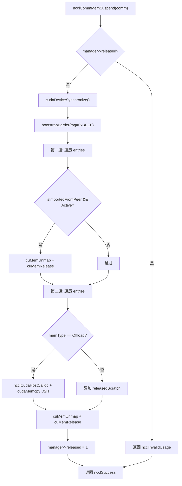
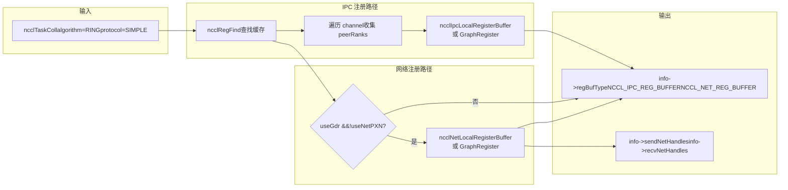
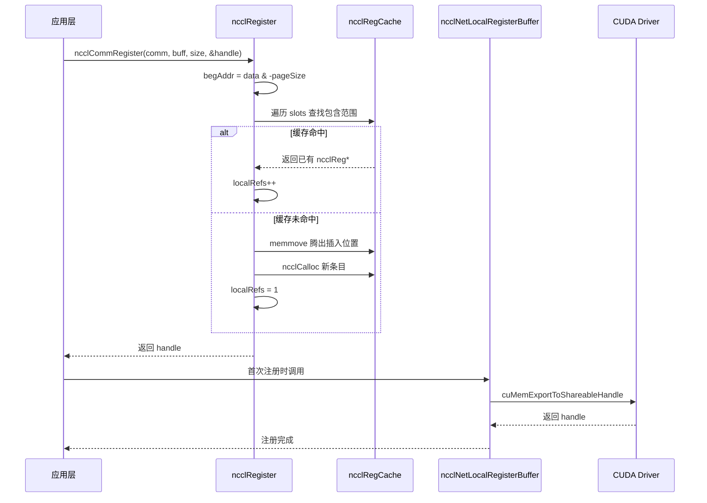

# Chapitre 18 : Allocation mémoire et gestion de la mémoire GPU : allocator, cache d'enregistrement et optimisation de la mémoire utilisateur enregistrée

Dans le chapitre précédent, nous avons vu comment le sous-système RAS fonctionne indépendamment du plan de données sur le plan de contrôle, en utilisant le hachage pour le versionnage et le comptage de références pour protéger le cycle de vie. Ce chapitre aborde le troisième pilier de NCCL — la gestion mémoire. La limite supérieure des performances de communication ne dépend souvent pas de l'algorithme lui-même, mais de la capacité des données à être lues et écrites directement par la carte réseau. NCCL a construit pour cela trois couches de mécanismes : la couche inférieure utilise`ncclSpace`et`ncclShadowPool`pour gérer l'espace d'adressage et les objets fantômes, la couche intermédiaire utilise`ncclMemManager`pour suivre l'import/export de la mémoire dynamique ainsi que la suspension/reprise, et la couche supérieure utilise`ncclCommRegister`pour enregistrer les buffers utilisateur dans le cache, évitant ainsi de réépingler la mémoire à chaque communication. Ce chapitre décompose ces trois mécanismes couche par couche, et répond à la question « pourquoi NCCL doit-il enregistrer la mémoire avant une communication » ainsi qu'à « comment le cache d'enregistrement influence les performances ».

# 18.1 ncclSpace : découper l'espace d'adressage en segments alternant plein/vide

## Modèle intuitif

Imaginez une ligne infinie de numéros de places de parking, partant de 0 et s'étendant vers la droite. Certaines places sont occupées (allouées), d'autres sont vides (non allouées).`ncclSpace`est le « registre d'état des places » de cette ligne de numéros — il n'enregistre pas chaque place, mais uniquement les points de basculement où l'état change. Sans lui, NCCL devrait maintenir un bit de marquage pour chaque octet lors de la gestion des intervalles d'adresses virtuelles de la mémoire symétrique, ce qui entraînerait une surcharge mémoire proportionnelle à l'espace d'adressage, totalement inacceptable.

## Structure de données et disposition mémoire

`ncclSpace`La définition de  est extrêmement minimale[FACT:src/include/allocator.h:20-24]：

```c
struct ncclSpace {
  int count;        // cuts[] 中有效元素个数
  int capacity;     // cuts[] 已分配容量
  int64_t* cuts;    // 升序排列的边界点数组
};
```

L'idée centrale est clairement écrite dans les commentaires du code source[FACT:src/allocator.cc:151-153]：`cuts[]`découpe l'axe des entiers non négatifs en segments alternant « plein » et « vide », les points de découpe étant triés par ordre croissant, et le segment après le dernier point de découpe est nécessairement vide (frontière non allouée). On peut en déduire la formule permettant de déterminer si le`i`e segment est plein :

```
isFull(i) = (i%2 != ncuts%2)
```

Cette formule signifie que l'état plein/vide d'un segment est déterminé conjointement par la parité de l'index du segment et la parité du nombre total de points de découpe. Lorsque`ncuts`est pair, le segment 0 (avant`cuts[0]`) est vide ; lorsque`ncuts`est impair, le segment 0 est plein. Cet invariant traverse tout le module.

## Déroulé pas à pas : comment une allocation modifie cuts[]

Mise en situation : initialement`ncclSpace`est vide (`count=0`), on appelle`ncclSpaceTryAlloc(a, limit=1000, size=100, align=1, &outOffset)`。

**Première étape : localiser le premier segment vide** [FACT:src/allocator.cc:209]。`i = a->count % 2`, ici`count=0`, donc`i=0`, on commence le balayage à partir du segment 0.

**Deuxième étape : calculer les bornes du segment** [FACT:src/allocator.cc:212-213]。`i==0`lorsque`lo=0`；`i==a->count`lorsque`hi=limit=1000`. Donc le segment vide est`[0, 1000)`。

**Troisième étape : aligner et vérifier la capacité** [FACT:src/allocator.cc:214-215]。`off = alignUp(0, 1) = 0`，`0 + 100 <= 1000`est vrai, l'allocation réussit.

**Quatrième étape : insérer les points de découpe** [FACT:src/allocator.cc:217-223]. Comme`i==0`(insertion en tête), on emprunte le chemin lent`insertSegment(a, 0, 0, 100)`。`insertSegment`insère deux points de découpe à`index=0`, puis exécute le « filtrage des valeurs dupliquées adjacentes »`lo=0, hi=100` [FACT:src/allocator.cc:172-174]. La logique de filtrage est très ingénieuse : elle utilise un double curseur lecture/écriture pour balayer, et en cas de valeur dupliquée, elle recule le curseur d'écriture, supprimant les paires de valeurs dupliquées — car une paire de doublons signifie qu'un segment vide est encadré par deux segments pleins et peut donc être fusionné. Mais les zéros en tête sont un cas particulier, pouvant être supprimés individuellement[FACT:src/allocator.cc:185-203]Après allocation[FACT:src/allocator.cc:182-184]。

. À ce stade`cuts = [0, 100]`，`count=2`, le segment 0 (`isFull(0) = (0%2 != 2%2) = false`, vide) est vide ; le segment 1 (`[0,0)`) est plein. Correct.`[0,100)`Cinquième étape : libération

**. On appelle** [FACT:src/allocator.cc:239-267]. On vérifie d'abord si`ncclSpaceFree(a, 0, 100)`est vrai`cuts[count-1] <= offset`, c'est-à-dire[FACT:src/allocator.cc:231-237]est faux, on continue. On localise le premier segment plein`100 <= 0`, donc`i = 1 - count%2 = 1 - 0 = 1` [FACT:src/allocator.cc:246]，`cuts[1]=100 > 0`. On vérifie`i=1`。`lo = cuts[0] = 0`，`hi = cuts[1] = 100`faux,`offset < lo || hi < offset+size` [FACT:src/allocator.cc:252]，`0<0`faux, on passe. Comme`100<100`et`lo==offset`, aucun des deux chemins rapides n'est satisfait (le premier exige`offset+size==hi`, le second exige`offset+size != hi`), on emprunte le chemin lent`lo != offset`. Après insertion`insertSegment(a, 1, 0, 100)` [FACT:src/allocator.cc:264], après filtrage cela devient`cuts = [0, 0, 100, 100]`. Retour à l'état initial.`[]`，`count=0`Cette conception « insertion puis filtrage » évite d'effectuer une logique complexe de fusion de segments lors de l'allocation/libération, en concentrant la complexité dans

à un seul endroit.`insertSegment`Réflexions de conception et pièges en production

## Pourquoi utiliser int64_t plutôt que size_t ?

**Parce que**gère des « offsets » et non des « pointeurs », les offsets pouvant être négatifs (bien qu'en pratique cela n'arrive pas), et il doit être cohérent avec la largeur de`ncclSpace`de CUDA. L'utilisation d'un type signé facilite la détection de dépassements lors du débogage.`CUdeviceptr`Piège de performance

**Le commentaire de  dit explicitement « This could be binary search, but since allocate is linear there's no point »**：`ncclSpaceFree`. Cela signifie que l'allocation et la libération sont toutes deux des balayages O(n). Si un domaine de communication alloue et libère fréquemment un grand nombre de petits segments,[FACT:src/allocator.cc:245]va gonfler et chaque opération ralentira. En production, il faut réutiliser autant que possible les buffers déjà enregistrés, plutôt que d'enregistrer/désenregistrer de manière répétée.`cuts[]`Risque de débordement d'alignement

**peut déborder lorsque**：`alignUp(lo, align)`est proche de`lo`et que`INT64_MAX`est grand. Le code source ne vérifie pas explicitement, car`align`est garanti par l'appelant dans une plage raisonnable.`limit` 由调用方保证在合理范围内。

# 18.2 ncclShadowPool : gestion de l'appariement entre objets de périphérique et ombres hôtes

## Modèle intuitif

Les kernels GPU s'exécutent sur le périphérique et ne peuvent pas accéder directement aux objets C++ en mémoire hôte (par exemple les métadonnées dans`ncclDevComm`).`ncclShadowPool`agit comme un « traducteur » : il alloue un bloc de mémoire GPU pour chaque objet côté périphérique, alloue simultanément un bloc de mémoire « ombre » correspondant côté hôte, et maintient une table de correspondance « adresse périphérique → adresse hôte ». Lorsque l'hôte doit modifier la configuration d'un objet de périphérique, il modifie d'abord l'ombre hôte, puis copie vers le périphérique. Sans lui, chaque lecture de métadonnées par un kernel devrait passer par`cudaMemcpy`pour extraire depuis l'hôte, avec une latence inacceptable.

## Structures de données et disposition mémoire

Deux structures principales[FACT:src/allocator.cc:272-277]：

```c
struct ncclShadowPage {   // 最多 64 个对象的连续块
  struct ncclShadowPage* next;
  int objSize;
  uint64_t freeMask;      // 位图，1=空闲，0=已占用
  void* devObjs;
};
struct ncclShadowObject {
  struct ncclShadowObject* next;
  void* devObj;
  void* hostObj;
  struct ncclShadowPage* page;  // null 表示直接分配在 CUDA mempool
};
```

`ncclShadowPool`lui-même[FACT:src/include/allocator.h:42-47]：

```c
struct ncclShadowPool {
  int count, hbits;                       // 对象数、哈希位数
  struct ncclShadowObject** table;        // 哈希桶数组
  cudaMemPool_t memPool;                  // 可选的 CUDA 内存池
  struct ncclShadowPage* pages;           // 页链表
};
```

**Points de conception clés :`freeMask`est un uint64_t**, donc chaque page contient au maximum 64 objets. Ce n'est pas un choix arbitraire — 64 bits correspondent exactement à la largeur d'une ligne de cache,`popFirstOneBit`permet de trouver le premier emplacement libre avec une seule instruction`__builtin_ctzll`, sans boucle.

**Stratégie de croissance de la table de hachage**: commentaire du code source « Maintain 2:1 object:bucket ratio »[FACT:src/allocator.cc:368], c'est-à-dire que l'expansion a lieu lorsque le nombre d'objets dépasse le double du nombre de buckets. Initial`hbits=4`(16 buckets)[FACT:src/allocator.cc:363], doublement à chaque fois.

## Step-by-Step Walkthrough : comment une allocation choisit entre page et connexion directe

Mise en situation :`ncclShadowPoolAlloc(pool, size=1024, &devObj, &hostObj, stream)`。

**Première étape : initialisation paresseuse** [FACT:src/allocator.cc:347-366]. Si`hbits==0`, vérifier d'abord si le périphérique prend en charge le pool mémoire[FACT:src/allocator.cc:352], si oui créer`cudaMemPool_t`, définir`maxSize`sur le paramètre`SHADOW_MEMPOOL_MAX_SIZE`(1 Go par défaut)[FACT:src/allocator.cc:359]. Puis allouer une table de hachage de 16 buckets.

**Deuxième étape : vérifier si une expansion est nécessaire** [FACT:src/allocator.cc:369-386]. Si`count+1 > 2<<hbits`, allouer un tableau de buckets doublé, parcourir l'ancienne table pour réinsérer (`hashInsert`utiliser`ncclHashPointer`pour calculer l'index de bucket[FACT:src/allocator.cc:333-337]), libérer l'ancienne table.

**Troisième étape : décider entre le chemin page et le chemin direct** [FACT:src/allocator.cc:390]. Condition de décision`(64<<10)/size >= 3`, c'est-à-dire que`size <= 21845`emprunte le chemin page. Pour`size=1024`，`65536/1024=64 >= 3`, emprunte le chemin page.

**Quatrième étape : calculer la taille d'objet dans la page** [FACT:src/allocator.cc:391-392]。`shift = max(0, log2Down(1024)+1-4) = max(0, 10+1-4) = 7`。`pageObjSize = ((1024 + 127) >> 7) << 7 = 1024`. La taille d'objet dans la page est alignée sur une puissance de 2, multiple de 128 octets.

**Cinquième étape : rechercher ou créer une page** [FACT:src/allocator.cc:393-415]. Parcourir la liste chaînée`pool->pages`, chercher la page de`objSize == pageObjSize`. Si absente, créer une nouvelle page :`pageSize = min(65536, 64*1024) = 65536`，`freeMask = uint64_t(-1) >> (64 - 65536/1024) = uint64_t(-1) >> 0 = 全 1`(64 emplacements tous vides)[FACT:src/allocator.cc:400]. Utiliser`cudaMallocFromPoolAsync`ou`cudaMalloc`pour allouer la mémoire GPU[FACT:src/allocator.cc:403-404], et`cudaMemsetAsync`mettre à zéro[FACT:src/allocator.cc:405]。

**Sixième étape : prendre un emplacement dans la page** [FACT:src/allocator.cc:408-412]。`popFirstOneBit(&page->freeMask)`trouver le premier bit libre,`devObj = page->devObjs + slot * pageObjSize`. Si`freeMask`devient 0 (page pleine), retirer la page de la liste chaînée libre[FACT:src/allocator.cc:411]。

**Septième étape : allouer l'objet ombre hôte** [FACT:src/allocator.cc:423-428]。`malloc(sizeof(ncclShadowObject) + alignof(max_align_t)-1 + size)`, noter qu'ici`alignof(max_align_t)-1`octets supplémentaires sont alloués pour le remplissage d'alignement.`hostObj = alignUp((char*)(obj+1), alignof(max_align_t))`, c'est-à-dire qu'après l'en-tête d'objet, l'alignement se fait sur la plus grande frontière d'alignement. Puis`memset(hostObj, 0, size)`mise à zéro.

**Huitième étape : insérer dans la table de hachage et mettre à jour les compteurs** [FACT:src/allocator.cc:429-430]。

## Contrôle de concurrence et interaction matérielle

`ncclShadowPool`lui-même**n'a pas de verrou**. Cela signifie qu'il ne peut être utilisé que dans un contexte mono-thread, ou que l'appelant doit garantir l'exclusion mutuelle. D'après l'utilisation réelle dans NCCL, il est principalement appelé lors de la phase d'initialisation du domaine de communication, qui est mono-thread.

`cudaMallocFromPoolAsync`et`cudaFreeAsync`sont des opérations asynchrones, dépendant du paramètre`stream`pour garantir l'ordre[FACT:src/allocator.cc:403,459]。`ncclShadowPoolDestruct`est appelé après la libération de toutes les ressources`cudaStreamSynchronize(stream)` [FACT:src/allocator.cc:333-337], assurant que toutes les libérations asynchrones sont terminées avant de détruire le pool mémoire.

## Guide de production pour éviter les pièges

**Piège 1 : gaspillage mémoire dû à l'alignement de la taille d'objet dans la page**。`pageObjSize`aligné sur une puissance de 2, si`size=1000`，`shift = log2Down(1000)+1-4 = 9+1-4 = 6`，`pageObjSize = ((1000+63)>>6)<<6 = 1024`. Chaque objet gaspille 24 octets, 64 objets par page gaspillent 1536 octets. Pour de nombreux petits objets, ce coût n'est pas négligeable.

**Piège 2 :`ncclShadowPoolFree`comportement lorsque l'objet n'est pas trouvé** [FACT:src/allocator.cc:442-445]. Il retourne`ncclInternalError`et imprime un avertissement, mais**ne libère aucune ressource**. Si l'appelant ignore la valeur de retour, cela provoque une fuite mémoire. Le code de production doit vérifier la valeur de retour.

**Piège 3 :`ncclShadowPoolDestruct`dans`freeMask==0`la page de** [FACT:src/allocator.cc:301-306]est recyclée`freeMask`. Noter qu'ici`pool->pages`est mis à 1 (et non tous à 1), ce qui signifie que seul le premier emplacement est marqué comme libre. C'est pour remettre la « page pleine » dans la liste chaînée

# , mais les autres emplacements de la page restent occupés — en réalité ces objets vont bientôt être libérés, donc cette opération est sûre. Mais si un accès concurrent a lieu pendant la destruction, un état incohérent sera lu.

## 18.3 ncclMemManager : comptage de références et reprise après suspension de la mémoire dynamique

Modèle intuitif`ncclMemManager`Une tâche d'entraînement peut durer plusieurs jours, pendant lesquels le GPU peut être préempté par d'autres tâches, ou un checkpoint peut être nécessaire.

## agit comme un « gestionnaire de mémoire » : il enregistre toute la mémoire allouée dynamiquement (scratch/offload), et lorsque nécessaire, « suspend » la mémoire GPU (unmap des pages physiques, conserve les adresses virtuelles), sauvegarde les données sur le CPU, puis lors de la reprise, réalloue les pages physiques, remappe et restaure les données. Sans lui, après préemption, la tâche ne peut que repartir de zéro, gaspillant des heures de progression d'entraînement.

`ncclMemManager`Structures de données et disposition mémoire[FACT:src/mem_manager.cc:32-60]：

| champs principaux de | (déduits du code d'initialisation) | Champ |
| --- | --- | --- |
| `entries` | `ncclDynMemEntry*` | Type |
| `numEntries` | `int` | Signification |
| `released` | `int` | Tête de liste chaînée des entrées de mémoire dynamique |
| `refCount` | `int` | Longueur de la liste chaînée |
| `totalPersist` | `size_t` | 0=actif, 1=suspendu |
| `totalScratch` | `size_t` | Compteur de références (plusieurs comm peuvent partager) |
| `totalOffload` | `size_t` | Total de mémoire persistante (atomique) |
| `cpuBackupUsage` | `size_t` | Total de mémoire scratch (atomique) |
| `lock` | `std::mutex` | Total de mémoire offload (atomique) |
| `initialized` | `int` | Total de mémoire de sauvegarde CPU |

**Protège la liste chaînée entries**：`lock`Indicateur atomique, empêche l'accès à un mutex détruit`std::mutex`Conception clé de la disposition mémoire`ncclMemManager`est un`ncclCalloc`, mais[FACT:src/mem_manager.cc:39]est alloué avec`~mutex()` [FACT:src/mem_manager.cc:120](style C), donc il faut utiliser placement new pour construire explicitement

**, et appeler explicitement**lors de la destruction. C'est un piège classique de la programmation mixte C/C++.`totalPersist`Répartition des rôles entre variables atomiques et verrous`entries`: les champs statistiques (`lock`etc.) sont mis à jour par opérations atomiques, sans besoin de verrou ;`ncclCommMemStats`la liste chaînée est protégée par[FACT:src/mem_manager.cc:1117-1130]. Ainsi les requêtes statistiques (

## Procédure pas à pas : flux complet de suspension et de reprise

**Flux de suspension** `ncclCommMemSuspend` [FACT:src/mem_manager.cc:418-540]：

**Première étape : vérifications préalables** [FACT:src/mem_manager.cc:419-430]. Vérifier si le gestionnaire de mémoire est désactivé, si comm est vide, et si une suspension est déjà en cours.

**Deuxième étape : synchronisation des périphériques et barrier** [FACT:src/mem_manager.cc:440-441]。`cudaDeviceSynchronize()`S'assurer que toutes les opérations GPU sont terminées, puis`bootstrapBarrier`s'assurer que tous les ranks sont synchronisés. Le tag de barrier est`0xBEEF`。

**Troisième étape : premier parcours — unmap de tous les buffers importés par les peers** [FACT:src/mem_manager.cc:444-465]. Pour chaque entrée de`isImportedFromPeer && state==Active`, appeler`cuMemUnmap`pour défaire le mapping[FACT:src/mem_manager.cc:451], libérer le handle[FACT:src/mem_manager.cc:456], l'état passe à`Released`。

**Quatrième étape : deuxième parcours — offload de la mémoire locale** [FACT:src/mem_manager.cc:468-526]. Ignorer les entrées importées par les peers et celles déjà libérées. Pour le type`ncclMemOffload`, allouer d'abord une sauvegarde CPU[FACT:src/mem_manager.cc:484], puis`cudaMemcpy`copier du GPU vers le CPU[FACT:src/mem_manager.cc:492]. Pour le type`ncclMemScratch`, accumuler uniquement les statistiques. Ensuite fermer le shareable FD[FACT:src/mem_manager.cc:508-513]，`cuMemUnmap` [FACT:src/mem_manager.cc:516]，`cuMemRelease` [FACT:src/mem_manager.cc:519], l'état passe à`Released`。

**Cinquième étape : marquer comme suspendu** [FACT:src/mem_manager.cc:528]。

**Flux de reprise** `ncclCommMemResume` [FACT:src/mem_manager.cc:550-942]：

**Première étape : restaurer la mémoire locale** [FACT:src/mem_manager.cc:577-668]. Pour chaque entrée de`!isImportedFromPeer && state==Released`, refaire`cuMemCreate` [FACT:src/mem_manager.cc:599]，`ncclCuMemMapAndSetAccess`le mapping vers la même adresse virtuelle[FACT:src/mem_manager.cc:602], restaurer les permissions d'accès peer[FACT:src/mem_manager.cc:610-626], restaurer les données depuis la sauvegarde CPU pour le type offload[FACT:src/mem_manager.cc:632-643], réexporter le handle FABRIC[FACT:src/mem_manager.cc:646-658]。

**Deuxième étape : synchronisation barrier** [FACT:src/mem_manager.cc:671-679]. Le tag reste`0xBEEF`。

**Troisième étape : échanger les informations des nouveaux handles** [FACT:src/mem_manager.cc:688-816]. Compter combien de buffers locaux chaque rank doit diffuser[FACT:src/mem_manager.cc:689-696], utiliser`bootstrapAllGather`pour échanger les compteurs[FACT:src/mem_manager.cc:710], calculer les offsets[FACT:src/mem_manager.cc:724-728], puis d'abord`bootstrapSend`ensuite`bootstrapRecv`(le commentaire précise explicitement « send first, then receive to avoid deadlock »[FACT:src/mem_manager.cc:783]）。

**Quatrième étape : réimporter les buffers des peers** [FACT:src/mem_manager.cc:822-911]. Pour chaque entrée de`isImportedFromPeer && state==Released`, rechercher les informations de handle correspondantes dans les résultats de l'échange[FACT:src/mem_manager.cc:829-835]. Le type POSIX FD nécessite de vérifier si le hostHash est identique[FACT:src/mem_manager.cc:853-859], puis obtenir le FD via le proxy[FACT:src/mem_manager.cc:866]，`cuMemImportFromShareableHandle`importer[FACT:src/mem_manager.cc:873]. Le type FABRIC s'importe directement[FACT:src/mem_manager.cc:878]. Ensuite`ncclCuMemMapAndSetAccess`refaire le mapping[FACT:src/mem_manager.cc:893]。

**Cinquième étape : barrier final** [FACT:src/mem_manager.cc:916-928]. Le tag est`0xCAFE`, à distinguer des précédents`0xBEEF`.

## Contrôle de concurrence et interaction matérielle

**Protection du cycle de vie par comptage de références**：`ncclMemManagerDestroy`Décrémenter d'abord`refCount` [FACT:src/mem_manager.cc:76], si le résultat est toujours supérieur à 0, effacer uniquement le pointeur du comm actuel[FACT:src/mem_manager.cc:81], sans libérer les ressources. Cela permet à plusieurs comm de partager le même gestionnaire de mémoire (par exemple dans le scénario split_share).

**Indicateur atomique initialized**: vérifier`COMPILER_ATOMIC_LOAD(&manager->initialized, memory_order_acquire)` [FACT:src/mem_manager.cc:136,242,338,358]avant toute opération, pour éviter d'accéder à un mutex déjà détruit. Lors de la destruction, utiliser`memory_order_release`pour stocker 0[FACT:src/mem_manager.cc:87], garantissant que les écritures précédentes sont visibles par les autres threads.

**Utilisation de l'API CUDA VMM**：`cuMemCreate`/`cuMemMap`/`cuMemUnmap`/`cuMemRelease`est l'API de gestion de mémoire virtuelle de CUDA, qui permet de séparer la mémoire physique de l'adresse virtuelle. C'est la base de la suspension/reprise — lors de la suspension, on unmap les pages physiques mais on conserve l'adresse virtuelle ; lors de la reprise, on refait le mapping vers la même adresse virtuelle, de sorte que toutes les relations de pointeurs déjà établies n'ont pas besoin d'être modifiées.

## Guide pour éviter les pièges en production

**Piège 1 : le domaine de communication split_share ne supporte pas la suspension** [FACT:src/mem_manager.cc:1014-1018]. Si`refCount > 1`, retourner directement`ncclInvalidUsage`. Car lorsque plusieurs comm partagent le gestionnaire de mémoire, suspendre un comm affecte la mémoire des autres comm.

**Piège 2 : invalidation des POSIX FD entre nœuds** [FACT:src/mem_manager.cc:853-859]. Les descripteurs de fichiers POSIX ne sont valides qu'au sein d'un même nœud, et doivent être ignorés lors d'une reprise inter-nœuds. Le code source utilise`hostHash`une comparaison pour déterminer s'il s'agit du même nœud.

**Piège 3 : conserver la sauvegarde en cas d'échec de restauration des données offload** [FACT:src/mem_manager.cc:635]. Si`cudaMemcpy`la restauration du CPU vers le GPU échoue, le code source affiche un avertissement et conserve`cpuBackup`, sans le libérer. Cela vise à donner à l'appelant une chance de réessayer, mais sans nouvelle tentative, cela provoquera une fuite de mémoire CPU.

**Piège 4 :`ncclMemUntrackDynamic`risque de use-after-free dans**. Le code source, en tenant le verrou, trouve l'entrée, sauvegarde les informations nécessaires, libère l'entrée[FACT:src/mem_manager.cc:302], puis met à jour les statistiques hors du verrou[FACT:src/mem_manager.cc:311-327]. Cet ordre est correct, mais si le pointeur`info`pointe vers la mémoire de pile de l'appelant et que l'appelant lit hors du verrou, il faut s'assurer que le cycle de vie de`info`couvre toute la fonction.



La figure ci-dessus montre le flux de contrôle du processus de suspension. Noter deux branches clés : le premier parcours ne traite que les buffers importés par les peers, le second ne traite que les buffers locaux, et l'ordre ne peut pas être inversé — il faut d'abord défaire les références à la mémoire des peers, puis libérer la mémoire locale.

# 18.4 Cache d'enregistrement : comment ncclRegister évite le pin répété

## Modèle intuitif

Pour que la carte réseau lise et écrive directement dans la mémoire GPU (GPUDirect RDMA), il faut d'abord « enregistrer » cette mémoire — dire à la carte réseau « tu peux accéder directement à cette adresse ». Le processus d'enregistrement implique le pin des pages et l'établissement de mappings IOMMU, avec un coût élevé (de l'ordre de la milliseconde). Si l'on réenregistre à chaque AllReduce, la latence des petites communications serait complètement noyée par le coût d'enregistrement.`ncclRegister`est précisément un « cache d'enregistrement » : il consigne les plages d'adresses déjà enregistrées dans un tableau ordonné, et lors de la prochaine rencontre d'un buffer identique ou inclus, il le réutilise directement sans réenregistrer.

## Structure de données et disposition mémoire

`ncclRegCache`Le cœur de`slots`est un tableau ordonné`ncclReg*`。`ncclReg`, chaque élément étant

| les champs clés (déduits de l'usage) : | Champ | Type |
| --- | --- | --- |
| `begAddr` | `uintptr_t` | Signification |
| `endAddr` | `uintptr_t` | Adresse de début alignée sur page |
| `localRefs` | `int` | Adresse de fin alignée sur page |
| `graphRefs` | `int` | Compteur de références local |
| `state` | `int` | Compteur de références du graphe |
| `netHandleHead` | `ncclRegNetHandles*` | Bits d'état d'enregistrement (NET/NVLS/COLLNET/IPC) |
| `ipcInfos` | `ncclIpcInfo**` | Tableau d'informations IPC |

**Alignement de page**：`begAddr = (uintptr_t)data & -pageSize` [FACT:src/register/register.cc:31]，`endAddr = ((uintptr_t)data + size + pageSize - 1) & -pageSize` [FACT:src/register/register.cc:32]。`-pageSize`est`pageSize`le complément à deux, équivalent à « aligner vers le bas sur un multiple de pageSize ». La raison : la granularité minimale d'enregistrement est la page, même si l'on n'enregistre qu'1 octet, il faut enregistrer une page entière.

## Step-by-Step Walkthrough : comment un enregistrement atteint le cache

Mise en situation :`ncclCommRegister(comm, buff=0x7f0000001000, size=4096, &handle)`。

**Première étape : vérification des paramètres et alignement de page** [FACT:src/register/register.cc:18-24]。`CommCheck`valide la validité de comm. Supposons`pageSize=4096`，`begAddr = 0x7f0000001000 & -4096 = 0x7f0000001000`，`endAddr = (0x7f0000001000 + 4096 + 4095) & -4096 = 0x7f0000002000`。

**Deuxième étape : vérification de la mémoire système** [FACT:src/register/register.cc:36-64]. Si`ncclCuMemEnable()`, interroger la plage d'adresses et le type de mémoire. Si`memType == CU_MEMORYTYPE_HOST`, il s'agit de mémoire CPU, ignorer l'enregistrement[FACT:src/register/register.cc:58-61]. Sinon, vérifier s'il existe un segment Sysmem[FACT:src/register/register.cc:50-55]。

**Troisième étape : parcourir le cache pour trouver la position d'insertion** [FACT:src/register/register.cc:66-89]. Boucle`slot`à partir de 0 :

- Si`slot == population`(fin atteinte) ou`begAddr < slots[slot]->begAddr`(l'adresse actuelle précède l'entrée de cache), il faut créer une nouvelle entrée[FACT:src/register/register.cc:67]。
- Si`slots[slot]->begAddr <= begAddr && slots[slot]->endAddr >= endAddr`, le tampon actuel est entièrement contenu dans une entrée existante, incrémenter directement le compteur de références[FACT:src/register/register.cc:83-87]。

**Quatrième étape : créer une nouvelle entrée** [FACT:src/register/register.cc:68-82]. Si le cache est plein, l'agrandir (initialement 32, puis doubler)[FACT:src/register/register.cc:70]. Utiliser`memmove`pour`slot`libérer de l'espace à la position[FACT:src/register/register.cc:73]，`ncclCalloc`allouer une nouvelle entrée[FACT:src/register/register.cc:74], définir`begAddr`/`endAddr`, selon`isGraph`définir`graphRefs`ou`localRefs`à 1[FACT:src/register/register.cc:78-79]，`population++`, retourner le handle.

**Cinquième étape : désenregistrement** [FACT:src/register/register.cc:172-195]。`commDeregister`trouver d'abord le slot correspondant au handle[FACT:src/register/register.cc:180], décrémenter le compteur de références[FACT:src/register/register.cc:185-186]. S'il reste des références, retourner directement[FACT:src/register/register.cc:187]. Sinon, appeler`regCleanup`pour nettoyer tous les enregistrements sous-jacents[FACT:src/register/register.cc:188], libérer l'entrée, utiliser`memmove`pour combler le trou[FACT:src/register/register.cc:190]，`population--`。

## Réflexions de conception et pièges en production

**Pourquoi utiliser un tableau ordonné plutôt qu'une table de hachage ?**Parce que la requête d'enregistrement est une requête « d'inclusion de plage », pas une correspondance exacte. Le tableau ordonné supporte la recherche binaire (bien que le code source utilise un balayage linéaire), et bénéficie d'une bonne localité mémoire. Une table de hachage ne peut pas traiter efficacement ce type de requête « cette adresse est-elle contenue dans une plage plus grande ».

**`regCleanup`Conception des bits d'état de** [FACT:src/register/register.cc:95-134]。`state`est un masque de bits, chaque bit correspondant à un type d'enregistrement (NET/NVLS/COLLNET/IPC). Lors du nettoyage, on vérifie bit par bit et on ne nettoie que les enregistrements terminés. Cette conception permet les cas où certains enregistrements réussissent et d'autres échouent — par exemple, l'enregistrement réseau réussit mais l'enregistrement IPC échoue, le nettoyage ne nettoie alors que la partie réseau.

**Piège en production : le cache d'enregistrement ne perçoit pas la libération de mémoire**. Si l'utilisateur enregistre un tampon, puis le`cudaFree`sans le désenregistrer, l'entrée reste dans le cache. La prochaine allocation peut réutiliser la même adresse, entraînant un succès de cache alors que la mémoire est en fait invalide. La convention de NCCL est : enregistrement et désenregistrement doivent être appariés, l'utilisateur est responsable de garantir que la mémoire n'est pas libérée pendant l'enregistrement.

**`ncclCommRegister`Condition de saut de** [FACT:src/register/register.cc:150-159]. Si`LocalRegister=0`ou`P2pUsesMemcpy=1`, retourner directement`NULL`handle. Cela signifie que dans certaines configurations (par exemple P2P via memcpy plutôt que RDMA), l'enregistrement est complètement ignoré. L'appelant doit vérifier si le handle est NULL.

# 18.5 Enregistrement de communication collective : comment coll_reg choisit la stratégie d'enregistrement pour différents algorithmes

## Modèle intuitif

Différents algorithmes de communication collective empruntent différents chemins de transport : NVLS passe par NVLink SHARP, Ring passe par P2P ou le réseau, Tree passe par une topologie en arbre. Chaque chemin nécessite un mode d'enregistrement différent : NVLS doit s'enregistrer auprès du matériel NVLS, le réseau auprès de la carte réseau, IPC auprès du GPU pair.`coll_reg.cc`est le « routeur de stratégie d'enregistrement » : il décide quelles fonctions d'enregistrement appeler selon l'algorithme, le protocole et le type de tampon. Sans lui, chaque algorithme devrait implémenter sa propre logique d'enregistrement, avec duplication de code et risque d'erreurs.

## Step-by-Step Walkthrough : décision d'enregistrement pour l'algorithme Ring

Mise en situation :`ncclRegisterCollBuffers(comm, info, outRegBufSend, outRegBufRecv, cleanupQueue, regNeedConnect)`, où`info->algorithm == NCCL_ALGO_RING`，`info->protocol == NCCL_PROTO_SIMPLE`。

**Première étape : vérifications préalables** [FACT:src/register/coll_reg.cc:155-157]. Définir`regBufType = NCCL_REGULAR_BUFFER`，`regNeedConnect = true`. Si`LocalRegister=0`et qu'il ne s'agit pas d'un enregistrement de graphe persistant, sortir directement.

**Deuxième étape : entrer dans la branche Ring** [FACT:src/register/coll_reg.cc:338]. Initialiser`recvRegRecord`/`sendRegRecord`à NULL, allouer le tableau`sendNetConns`/`sendNetHandles`/`recvNetConns`/`recvNetHandles`/`srecvNetHandles`[FACT:src/register/coll_reg.cc:356-360]。

**Troisième étape : rechercher un enregistrement existant** [FACT:src/register/coll_reg.cc:351-355]。`ncclRegFind`rechercher les tampons recv/send dans le cache. Si recv n'est pas trouvé et qu'il ne s'agit pas d'un enregistrement de graphe persistant, sortir[FACT:src/register/coll_reg.cc:352]. Si multi-nœuds et send non trouvé et qu'il ne s'agit pas d'un enregistrement de graphe persistant, sortir[FACT:src/register/coll_reg.cc:354]。

**Quatrième étape : parcourir tous les channels pour collecter les peers** [FACT:src/register/coll_reg.cc:362-393]. Pour chaque channel, vérifier`ring.prev`et`ring.next`. Si le flag de connexion contient`NCCL_DIRECT_NIC`, enregistrer dans`recvNetConns`/`sendNetConns` [FACT:src/register/coll_reg.cc:370-379]. S'il contient`NCCL_P2P_READ | NCCL_P2P_WRITE`, ajouter le peer au tableau`peerRanks`[FACT:src/register/coll_reg.cc:382-391]。

**Cinquième étape : enregistrement IPC** [FACT:src/register/coll_reg.cc:394-407]. Si`nPeers > 0 && comm->isAllDirectP2p`, essayer d'abord l'enregistrement de graphe[FACT:src/register/coll_reg.cc:395-399], en cas d'échec essayer l'enregistrement local[FACT:src/register/coll_reg.cc:400-403]. En cas de succès, définir`regBufType = NCCL_IPC_REG_BUFFER` [FACT:src/register/coll_reg.cc:406]。

**Sixième étape : enregistrement réseau** [FACT:src/register/coll_reg.cc:409-457]. Vérifier`!comm->useNetPXN && comm->useGdr && netDeviceType != UNPACK`et non AllReduce avec PreMulSum/SumPostDiv[FACT:src/register/coll_reg.cc:415-418]. Essayer d'abord l'enregistrement de graphe[FACT:src/register/coll_reg.cc:419-430], en cas d'échec l'enregistrement local[FACT:src/register/coll_reg.cc:431-442]. En cas de succès, définir`regBufType |= NCCL_NET_REG_BUFFER`, sauvegarder le tableau de handles[FACT:src/register/coll_reg.cc:445-452]。

**Septième étape : ajuster le nombre de channels** [FACT:src/register/coll_reg.cc:551-554]. Si seul IPC est enregistré, mono-nœud, et que le nombre de channels est entre 17 et 24, le réduire à 16. Ceci afin de correspondre aux caractéristiques de bande passante après enregistrement IPC.

## Réflexions de conception et pièges en production

**Pourquoi l'ordre d'enregistrement de NVLS et Ring est-il inversé ?**La branche NVLS essaie d'abord l'enregistrement de graphe puis l'enregistrement local[FACT:src/register/coll_reg.cc:86-94], tandis que la branche Ring fait d'abord le local puis le graphe[FACT:src/register/coll_reg.cc:395-403]. C'est parce que l'enregistrement de graphe NVLS a plus de chances de réussir (le matériel NVLS est optimisé pour les tampons persistants), tandis que l'enregistrement local de Ring est plus léger.

**`isMloPartBufRdmaCapable`Décision globale de** [FACT:src/register/coll_reg.cc:14-37]. Les commentaires soulignent que « la décision d'enregistrement doit être globale, en utilisant des garanties à l'échelle du communicateur »[FACT:src/register/coll_reg.cc:20]. Cela signifie que même si le tampon d'un rank donné prend en charge RDMA, tant qu'un seul rank du domaine de communication ne le prend pas en charge, l'ensemble du domaine de communication ne s'enregistre pas. Cela permet d'éviter les incohérences dues à l'enregistrement de certains ranks et au non-enregistrement d'autres.

**Piège en production : dégradation silencieuse en cas d'échec d'enregistrement**。`ncclRegisterCollBuffers`En cas d'échec d'enregistrement, aucune erreur n'est signalée, le bit correspondant de`regBufType`n'est simplement pas défini. Cela signifie que la communication fonctionne toujours, mais avec une baisse de performance. En production, si les performances sont inférieures aux attentes, il faut vérifier les journaux de`NCCL_REG`pour confirmer si l'enregistrement a réussi.



La figure ci-dessus illustre deux chemins d'enregistrement parallèles dans l'algorithme Ring : le chemin IPC gère les connexions P2P sur le même nœud, le chemin réseau gère les connexions RDMA inter-nœuds. Les deux chemins s'exécutent indépendamment et convergent finalement vers`info->regBufType`。

# 18.6 Pièges en production et chaîne de récupération après incident

## Piège 1 : interaction entre le cache d'enregistrement et le pool mémoire

Lors de l'utilisation de`ncclMemAlloc`pour allouer de la mémoire, on passe par l'API CUDA VMM[FACT:src/allocator.cc:38-94]. La mémoire physique créée par ce mode d'allocation porte le flag`gpuDirectRDMACapable`[FACT:src/allocator.cc:54], ce qui signifie qu'elle prend naturellement en charge RDMA. Mais lors de la libération par`ncclMemFree`, si le gestionnaire de mémoire a déjà été détruit, on emprunte le chemin de repli`cudaFree`[FACT:src/allocator.cc:130-132]. Cela peut entraîner une libération erronée via`cudaFree`de la mémoire allouée par VMM. En production, il faut impérativement s'assurer que`ncclMemAlloc`/`ncclMemFree`sont utilisés par paires, et ne pas libérer après la destruction du gestionnaire de mémoire.

## Piège 2 : requêtes de communication pendant la suspension

`ncclCommMemSuspend`Pendant l'exécution de , que se passe-t-il si de nouvelles requêtes de communication arrivent ? Le code source appelle`cudaDeviceSynchronize()` [FACT:src/mem_manager.cc:440]avant la suspension pour s'assurer que toutes les opérations GPU déjà mises en file sont terminées. Mais si des requêtes de communication côté host sont en cours de mise en file, il n'y a pas de protection explicite. En production, il faut arrêter tous les threads de communication avant la suspension, ou utiliser la sémantique de groupe pour garantir que l'opération de suspension est sérialisée avec les autres opérations.

## Piège 3 : compatibilité des handles FABRIC

`ncclMemAlloc`Sur CUDA 12.3+, on tente d'utiliser un handle FABRIC[FACT:src/allocator.cc:60-71]. Si`cuMemCreate`renvoie`CUDA_ERROR_NOT_PERMITTED`ou`CUDA_ERROR_NOT_SUPPORTED`, on revient au POSIX FD[FACT:src/allocator.cc:63-65]. Mais lors de la reprise, si le type de handle est FABRIC mais que l'export échoue, une erreur est signalée directement et un unmap est effectué[FACT:src/mem_manager.cc:649-655]. Cela signifie qu'en environnement mixte (certains GPU prennent en charge FABRIC, d'autres non), la suspension/reprise peut échouer.

## Piège 4 : fuite de compteur de références

`ncclRegister`Chaque succès du cache incrémente le compteur de références[FACT:src/register/register.cc:84-85]. Si l'appelant enregistre N fois mais ne désenregistre que M fois (M < N), le compteur de références ne reviendra jamais à zéro,`regCleanup`ne sera jamais appelé, et les ressources d'enregistrement sous-jacentes fuient. Le code de production doit strictement apparier`ncclCommRegister`/`ncclCommDeregister`。



# Réflexions et auto-évaluation de ce chapitre

Q1 : Si l'on supprime la vérification`ncclSpaceFree`de`if (a->count == 0 || a->cuts[a->count - 1] <= offset)`dans[FACT:src/allocator.cc:231-237], dans quel scénario cela déclencherait-il un accès hors limites ?

**Analyse de référence**: cette vérification a deux rôles. Premièrement,`a->count == 0`empêche l'accès à un tableau vide`cuts[-1]`. Deuxièmement,`a->cuts[a->count-1] <= offset`empêche que`offset`dépasse la plage allouée. Si on la supprime, lorsque`count == 0`,`a->cuts[a->count - 1]`lira`cuts[-1]`, ce qui est un comportement indéfini, pouvant lire des métadonnées du tas ou déclencher une erreur de segmentation. Plus insidieux encore, même si`count > 0`, si`offset`est supérieur au dernier point de découpe, la boucle`while (a->cuts[i] <= offset) i += 2`suivante[FACT:src/allocator.cc:247]incrémentera`i`jusqu'au dépassement, car`cuts[]`ne contient aucun élément supérieur à`offset`. Le scénario déclencheur en production est : l'appelant a passé un offset jamais alloué (par exemple, le tampon a été libéré en externe puis free est appelé à nouveau), ou`ncclSpace`a été modifié concurremment provoquant une incohérence d'état. La correction consiste à conserver cette vérification et, en cas d'erreur retournée, à afficher`offset`et`count`pour faciliter le diagnostic.

Q2: `ncclMemManagerDestroy`Dans , si`refCount`après décrémentation reste supérieur à 0, on efface uniquement le pointeur du comm courant sans libérer les ressources[FACT:src/mem_manager.cc:78-83]. Si à ce moment un autre comm appelle`ncclMemTrack`, que se passe-t-il ?

**Analyse de référence**：`ncclMemTrack`vérifie d'abord`manager->initialized` [FACT:src/mem_manager.cc:136]. Comme`refCount > 0`ne définit pas`initialized = 0`, la vérification passe. Ensuite, il acquiert`manager->lock`et modifie la liste chaînée`entries`[FACT:src/mem_manager.cc:188-192]. C'est sûr, car`refCount > 0`signifie qu'au moins un comm détient encore une référence, le gestionnaire de mémoire ne sera pas détruit. Le vrai risque est le suivant : si le dernier comm appelle`ncclMemManagerDestroy`,`refCount`décrémente à 0, il définit`initialized = 0` [FACT:src/mem_manager.cc:87]et libère toutes les ressources. Si à ce moment un autre thread dans`ncclMemTrack`a déjà passé la vérification`initialized`mais n'a pas encore acquis le verrou, il accédera à`manager->lock`déjà libéré, provoquant un use-after-free. Le code source atténue ce problème par l'appariement`memory_order_acquire`/`release`, mais strictement parlant, il subsiste une fenêtre de course. En production, il faut s'assurer que tous les threads de communication sont arrêtés avant de détruire le gestionnaire de mémoire.

Q3 : Dans`ncclCommMemResume`, les tampons peer de type POSIX FD sont ignorés lors du passage inter-nœuds[FACT:src/mem_manager.cc:853-859]. Si tous les tampons peer sont ignorés,`restoredPeerCount`vaut 0, mais`manager->released`est quand même défini à 0[FACT:src/mem_manager.cc:913]. Quelles en sont les conséquences ?

**Analyse de référence**：`manager->released = 0`indique que le gestionnaire de mémoire considère la reprise comme terminée. Mais si des tampons peer ont été ignorés, leur`state`reste`ncclDynMemStateReleased`，`handle`reste 0. Si une communication ultérieure accède à ces tampons, cela déclenchera une erreur CUDA (accès à une adresse virtuelle non mappée). Plus grave encore,`ncclCommMemStats`l'interrogation de`ncclStatGpuMemSuspended`renverra 0 (actif)[FACT:src/mem_manager.cc:1130], alors qu'en réalité une partie de la mémoire n'a pas été restaurée. La racine du problème est que : les POSIX FD inter-nœuds ne devraient tout simplement pas être importés — avant la suspension, ces tampons ne devraient pas exister dans`entries`Dans ce cas, la bonne approche consiste à marquer les entrées POSIX FD inter-nœuds comme non récupérables lors de la suspension, ou à renvoyer une erreur lors de la reprise plutôt que de les ignorer silencieusement. En production, si vous utilisez des POSIX FD et que vous êtes inter-nœuds, vous devriez passer à un handle FABRIC ou vous assurer que la suspension/reprise ne s'effectue qu'au sein d'un seul nœud.

La gestion de la mémoire est le pilier invisible des performances de NCCL :`ncclSpace`Gestion de l'espace d'adressage à l'aide d'un tableau minimaliste de points de découpe,`ncclShadowPool`Gestion de l'appariement des objets device/host à l'aide d'un bitmap 64 bits et d'une table de hachage,`ncclMemManager`Implémentation de la suspension/reprise à l'aide du comptage de références et de l'API CUDA VMM,`ncclRegister`Mise en cache des résultats d'enregistrement dans un tableau ordonné pour éviter les pin répétés. Ces quatre couches de mécanismes soutiennent ensemble la garantie de performance clé selon laquelle « aucune réinscription de mémoire n'est nécessaire avant la communication ». Le chapitre suivant abordera le communicateur côté device et la compatibilité ABI, pour voir comment`devcomm`ces dispositions mémoire côté host sont mappées vers des structures accessibles par les kernels GPU.

La figure ci-dessus illustre la chronologie de l'enregistrement : en cas de succès du cache, seul le compteur de références est incrémenté, sans appel à l'enregistrement sous-jacent ; en cas d'échec du cache, une nouvelle entrée est créée et l'enregistrement sous-jacent est déclenché. À ce stade, le mécanisme de gestion de la mémoire côté host est clair. Mais la communication se produit finalement sur le GPU, et le kernel doit accéder directement aux adresses et à l'état de connexion des ranks distants. Le chapitre suivant abordera le communicateur côté device et la compatibilité ABI, pour voir comment devcomm mappe les métadonnées de ncclComm côté host vers des structures accessibles côté device, et comment l'ABI versionnée garantit la compatibilité entre les anciens et nouveaux kernels et la bibliothèque.
