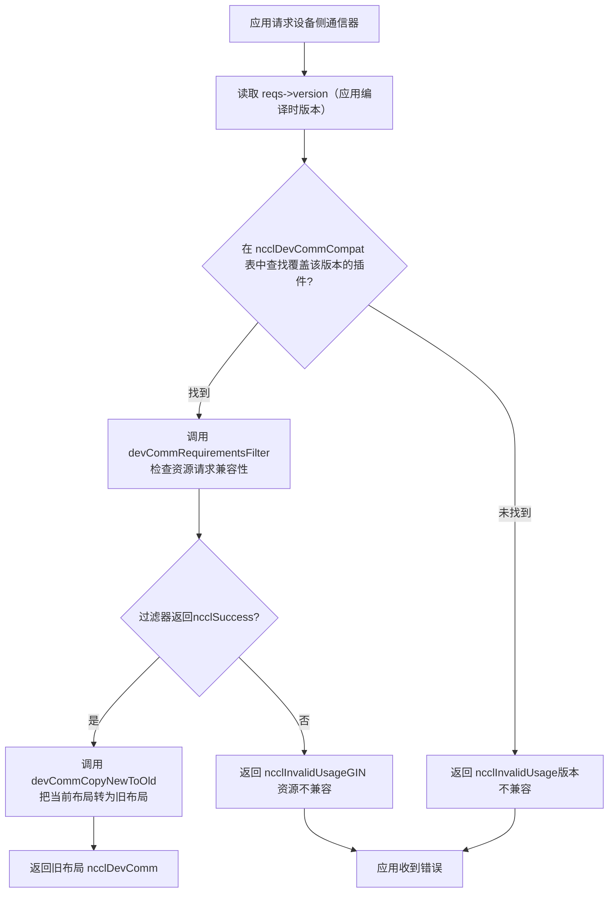
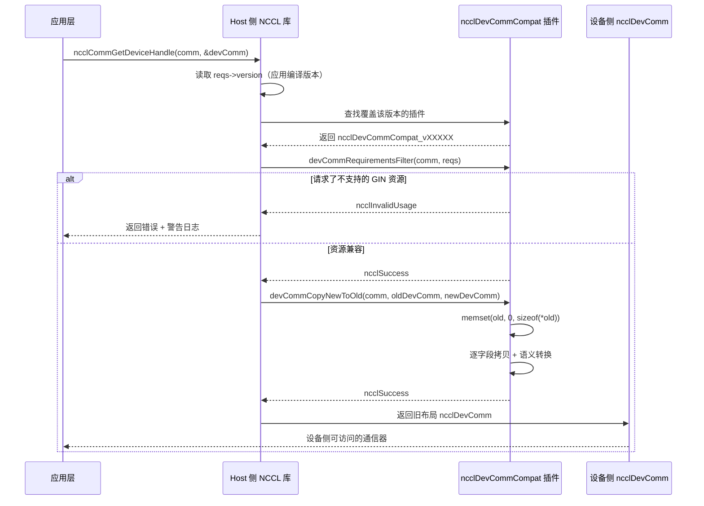

# Chapitre 19 : Domaine de communication côté device et compatibilité ABI : le contrat de communication entre devcomm et le kernel

Dans le chapitre précédent, nous avons vu que le ncclMemManager côté host gère le cycle de vie des tampons de communication à l'aide du comptage de références et de l'API CUDA VMM. Mais l'endroit où la communication se produit réellement est le kernel GPU — les threads du kernel doivent savoir : quel rank suis-je ? À quelle adresse virtuelle se trouve le tampon du rank distant ? La connexion est-elle prête ? Ces informations se trouvent dans la structure ncclComm côté host, mais le kernel ne peut pas déréférencer directement un pointeur host. Si NCCL obligeait le kernel à récupérer ces métadonnées à chaque fois via des paramètres ou des requêtes en mémoire globale, chaque communication entraînerait une latence et une consommation de bande passante supplémentaires. Pire encore, une fois le code du kernel compilé, les décalages des champs auxquels il accède sont figés — si la disposition de ncclComm change après une mise à jour de la bibliothèque, l'ancien kernel lira des données erronées. C'est le problème central que devcomm doit résoudre : mapper les métadonnées clés du domaine de communication côté host, avec une disposition mémoire stable et versionnée, vers des structures accessibles côté device. Les fichiers devcomm_v22902.cc, devcomm_v22907.cc, devcomm_v23000.cc, devcomm_v23100.cc dans le répertoire src/devcomm sont les implémentations concrètes de cet ABI versionné. Chaque fichier correspond à une plage de versions de NCCL, définit la disposition mémoire exacte de ncclDevComm pour cette plage, ainsi que la logique de copie des champs entre anciennes et nouvelles versions. Ce chapitre décomposera successivement : à quoi ressemblent les structures de données centrales du communicateur côté device, comment fonctionnent le mécanisme d'enregistrement et de correspondance de l'ABI versionné, comment s'effectue la conversion au niveau des champs entre anciennes et nouvelles versions, ainsi que les limites et les pièges de ce mécanisme en production.

# I. Structure centrale du communicateur côté device : disposition mémoire de ncclDevComm

## Modèle intuitif

Considérez`ncclDevComm`comme une « carte de poste » : au lancement de chaque kernel GPU, une carte est remise, sur laquelle est imprimé « tu es le rank 3, il y a 8 ranks au total, ton groupe LSA contient 4 ranks, l'adresse de base du tampon distant est à 0x7f... ». Cette carte doit être suffisamment petite (pour tenir dans les paramètres du kernel), tout en contenant toutes les informations clés. Si cette carte n'existait pas, le kernel devrait se reposer sur des paramètres transmis à plusieurs reprises par le host, à réassembler à chaque communication — latence élevée, propice aux erreurs.

## Structures de données et disposition mémoire

Prenons`ncclDevComm_v23000`comme exemple, sa définition complète se trouve dans[FACT:src/devcomm/devcomm_v23000.cc:25-62]：

```c
struct ncclDevComm_v23000 {
  unsigned int magic;          // 偏移 0，魔数校验
  unsigned int version;        // 偏移 4，版本号

  int rank, nRanks;            // 偏移 8, 12
  uint32_t nRanks_rcp32;       // 偏移 16，nRanks 的倒数（定点数）
  int lsaRank, lsaSize;        // 偏移 20, 24
  uint32_t lsaSize_rcp32;      // 偏移 28

  ncclDevCommWindowTable_t windowTable;  // 偏移 32
  ncclWindow_t resourceWindow;           // 偏移 40
  ncclResourceWindow_vidmem_v23000_t resourceWindow_inlined;  // 偏移 48
  ncclGinBarrierHandle_t hybridWorldGinBarrier;  // 偏移 112
  ...
};
```

[FACT:src/devcomm/devcomm_v23000.cc:64-93]Une série de`static_assert`fige le décalage de chaque champ. Ce n'est pas décoratif — c'est un contrat de compilation pour la compatibilité ABI. Si le décalage d'un champ se déplace en raison d'un changement de stratégie d'alignement du compilateur, la compilation échouera, plutôt que de produire à l'exécution un décalage mémoire difficile à déboguer.

Motivation de conception de quelques champs clés :

> **[Design Inference & Architectural Trade-offs]**
> **`nRanks_rcp32`et`lsaSize_rcp32`**: c'est`nRanks`et`lsaSize`L'inverse de , représenté en nombre à virgule fixe de 32 bits. Lorsque le kernel effectue l'opération de division pour calculer le décalage de rank vers buffer, la division entière du GPU est très lente ; la méthode consistant à multiplier par l'inverse puis à décaler permet un gain de vitesse significatif. C'est un cas typique de « sacrifier l'espace pour gagner du temps » — stocker 4 octets supplémentaires pour économiser les dizaines de cycles d'horloge de chaque division.

**`resourceWindow_inlined`**: il s'agit d'un descripteur de fenêtre en ligne, de type`ncclResourceWindow_vidmem_v23000_t`. Notez[FACT:src/devcomm/devcomm_v23000.cc:11-18]sa définition dans :

```c
typedef struct ncclResourceWindow_vidmem_v23000 {
  char reserved1[8];
  char* lsaFlatBase;
  char reserved2[8];
  uint32_t stride4G;
  uint32_t mcOffset4K;
  char reserved3[32];  // NOTE: shrunk from 40 in 2.30u1 to reclaim 8 bytes
} ncclResourceWindow_vidmem_v23000_t;
```

Ici,`reserved1`、`reserved2`、`reserved3`est un**champ de remplissage**, utilisé comme espace réservé. Pourquoi un remplissage est-il nécessaire ? Parce que la disposition de`ncclDevComm_v23000`doit rester cohérente en décalage avec une « version de référence », même si certains champs ne sont plus utilisés dans la version actuelle, il faut conserver l'espace réservé pour garantir que les décalages des champs suivants restent inchangés.[FACT:src/devcomm/devcomm_v23000.cc:11-18]Le commentaire de indique clairement : 2.30u1 réduit`reserved3`de 40 octets à 32 octets, libérant 8 octets pour`hybridWorldGinBarrier`. Il s'agit d'une**réorganisation de la disposition**— en réduisant la zone de remplissage, on insère de nouveaux champs sans modifier la taille globale.

[FACT:src/devcomm/devcomm_v23000.cc:11-18]Le`static_assert`de confirme davantage :`lsaFlatBase`、`stride4G`、`mcOffset4K`les décalages des trois champs doivent être cohérents avec le`ncclWindow_vidmem`de la « version actuelle », et la taille totale de la structure doit être de 64 octets. Cela signifie que`resourceWindow_inlined`est**binairement compatible**entre v23000 et la version actuelle — un memcpy direct est possible.

## La famille des structures versionnées

En comparant`ncclDevComm_v22902` [FACT:src/devcomm/devcomm_v22902.cc:38-62]et`ncclDevComm_v22907` [FACT:src/devcomm/devcomm_v22907.cc:13-41], on peut observer l'évolution des champs :

| Champ | v22902 | v22907 | v23000 |
| --- | --- | --- | --- |
| `magic`/`version` | Aucun | Aucun | Présent (décalage 0/4) |
| `ginContextCount` | uint8_t | uint32_t | uint32_t |
| `ginNetDeviceTypes` | `[4]` | `[NCCL_GIN_MAX_CONNECTIONS]` | `[NCCL_GIN_MAX_CONNECTIONS]` |
| `ginIsRailed` | Aucun | bool | Scindé en`ginConnectionsRailed` + `ginContextsRailed` |
| `hybridWorldGinBarrier` | Aucun | Aucun | Présent (décalage 112) |
| Taille de la structure | 200 | 224 | 240 |

> **[Design Inference & Architectural Trade-offs]**
> Ce chemin d'évolution révèle la stratégie de versionnage de NCCL :**n'ajouter des champs que lorsque c'est nécessaire, et exploiter autant que possible la zone de remplissage**. De v22902 à v22907, des champs liés à GIN tels que`ginSignalBase`、`ginCounterBase`、`ginContextBase`、`ginIsRailed`ont été ajoutés ; de v22907 à v23000, le champ de vérification`magic`/`version`et`hybridWorldGinBarrier`ont été ajoutés, tout en scindant`ginIsRailed`en deux indicateurs plus précis.

---

# II. Enregistrement et correspondance de l'ABI versionnée : la structure ncclDevCommCompat

## Modèle intuitif

Imaginez l'ABI versionnée comme un ensemble de « plugins de traduction » : lorsqu'une application est compilée avec NCCL 2.29.2 mais liée à l'exécution à la bibliothèque 2.31.0, la bibliothèque doit savoir « quelle disposition de`ncclDevComm`le kernel 2.29.2 attend », puis traduire le`ncclDevComm`de la version actuelle vers l'ancienne disposition. Chaque intervalle de version correspond à un plugin de traduction, enregistré dans une table globale.

## Structure centrale : ncclDevCommCompat

Chaque`devcomm_vXXXXX.cc`fichier définit à la fin une structure`ncclDevCommCompat`. Prenons v23000 comme exemple[FACT:src/devcomm/devcomm_v23000.cc:192-199]：

```c
struct ncclDevCommCompat ncclDevCommCompat_v23000 = {
  NCCL_VERSION(2, 30, 0),               // minVersion
  NCCL_VERSION(2, 30, 7),               // maxVersion
  nullptr,                              // commPropertiesFilter
  ncclDevCommRequirementsFilter_v23000, // devCommRequirementsFilter
  ncclDevCommCopyNewToOld_v23000,       // devCommCopyNewToOld
  ncclDevCommCopyOldToNew_v23000,       // devCommCopyOldToNew
};
```

Signification des six champs :

1. **`minVersion` / `maxVersion`**: l'intervalle de version dont ce plugin est responsable. v23000 couvre 2.30.0 à 2.30.7.

2. **`commPropertiesFilter`**: filtre optionnel, utilisé pour ajuster les indicateurs de capacité exposés aux anciennes versions dans`ncclCommProperties`. v23000 est défini à`nullptr`, indiquant qu'aucun filtrage n'est nécessaire.

3. **`devCommRequirementsFilter`**: vérifie si les ressources côté device demandées par l'application sont compatibles avec l'ancienne version. L'implémentation de v23000[FACT:src/devcomm/devcomm_v23000.cc:95-98]se contente de copier`ginType`depuis`comm->sharedRes`vers`reqs`。

4. **`devCommCopyNewToOld`**: copier le`ncclDevComm`de la version actuelle vers l'ancienne disposition.

5. **`devCommCopyOldToNew`**: copier l'ancienne disposition vers la version actuelle.

## Division des intervalles de version

Intervalles de version des quatre fichiers :

| Fichier | minVersion | maxVersion | Remarque |
| --- | --- | --- | --- |
| `devcomm_v22902.cc` | 2.29.2 | 2.29.3 | La plus ancienne implémentation versionnée |
| `devcomm_v22907.cc` | 2.29.5 | 2.29.7 | Ajout des champs GIN, mais sans rétrocompatibilité GIN |
| `devcomm_v23000.cc` | 2.30.0 | 2.30.7 | Ajout de la vérification magic/version |
| `devcomm_v23100.cc` | 2.31.0 | Version actuelle | Tous les filtres sont nullptr, indiquant une compatibilité totale |

[FACT:src/devcomm/devcomm_v23100.cc:10-17]Tous les callbacks du plugin v23100 de`nullptr`sont , ce qui signifie qu'à partir de 2.31.0, la disposition de`ncclDevComm`est déjà stable et ne nécessite aucune conversion.

> **[Design Inference & Architectural Trade-offs]**
> Notez qu'il existe un « trou » entre les intervalles de version de v22902 et v22907 (2.29.4 et 2.29.6 n'ont pas de plugin correspondant). Cela peut être dû au fait que ces versions n'ont pas été publiées, ou que leur disposition est identique à celle des versions adjacentes et peut être réutilisée.

## Processus de correspondance

Lorsqu'une application appelle`ncclCommGetDeviceHandle`ou une API similaire, NCCL doit :

1. Lire le numéro de version NCCL intégré à la compilation de l'application (via`reqs->version`）。

2. Rechercher dans la table globale`ncclDevCommCompat`le plugin couvrant cette version.

3. Si trouvé, appeler le`devCommCopyNewToOld`du plugin pour convertir la disposition actuelle en ancienne disposition.

4. Si non trouvé, renvoyer une erreur ou utiliser le comportement par défaut.

Le diagramme ci-dessous illustre ce processus de correspondance et de conversion :



---

# III. Conversion au niveau des champs : comment convertir entre anciennes et nouvelles dispositions

## Modèle intuitif

La conversion de version est comme une « traduction » : le`ncclDevComm`de la nouvelle version est un article en chinois moderne, la disposition de l'ancienne version est un texte en chinois classique. Le traducteur doit faire correspondre champ par champ — certains champs correspondent directement (`rank`à`rank`), certains nécessitent une « traduction libre » (`ginConnectionStride > 1`traduit en`ginConnectionsRailed = true`), certains champs n'existent pas dans l'ancienne version (simplement abandonnés).

## Conversion NewToOld : de la version actuelle vers l'ancienne version

Prenons`ncclDevCommCopyNewToOld_v23000`comme exemple[FACT:src/devcomm/devcomm_v23000.cc:114-152]：

```c
static ncclResult_t ncclDevCommCopyNewToOld_v23000(ncclComm_t comm, void* oldDevComm,
                                                   struct ncclDevComm const* newDevComm) {
  struct ncclDevComm_v23000* old = (struct ncclDevComm_v23000*)oldDevComm;

  memset(old, '\0', sizeof(*old));  // 先清零，防止未初始化字段泄露
  old->magic = newDevComm->magic;
  old->version = newDevComm->version;
  old->rank = newDevComm->rank;
  ...
  old->ginConnectionsRailed = (newDevComm->ginConnectionStride > 1);
  old->ginStrongLegacySignals = newDevComm->ginStrongLegacySignals;
  old->ginContextsRailed = (newDevComm->ginContextStride > 1);
  ...
}
```

Étapes clés :

1. **`memset`Mise à zéro de** [FACT:src/devcomm/devcomm_v23000.cc:118]: c'est une protection de sécurité — l'ancienne structure peut contenir des champs qui n'existent pas dans la nouvelle version ; la mise à zéro empêche la fuite de mémoire non initialisée vers le côté device.

2. **Copie directe des champs**：`rank`、`nRanks`、`lsaRank`affectations directes telles que .

3. **Conversion de fenêtre en ligne**: appel de`ncclDevCommCopyResourceWindowNewToOld_v23000` [FACT:src/devcomm/devcomm_v23000.cc:100-105], copie champ par champ de`lsaFlatBase`、`stride4G`、`mcOffset4K`。

4. **Conversion sémantique**：`ginConnectionsRailed = (newDevComm->ginConnectionStride > 1)` [FACT:src/devcomm/devcomm_v23000.cc:142]. La nouvelle version utilise`ginConnectionStride`(un pas entier) pour indiquer si railed, l'ancienne version utilise une valeur booléenne. Lorsque le pas est supérieur à 1, cela indique que la connexion est railed.

5. **Copie de tableau**：`memcpy`copie des tableaux`ginNetDeviceTypes`et`ginHandles`[FACT:src/devcomm/devcomm_v23000.cc:135-136]。

## Conversion OldToNew : de l'ancienne version vers la version actuelle

La conversion inverse se trouve dans[FACT:src/devcomm/devcomm_v23000.cc:154-190]：

```c
static ncclResult_t ncclDevCommCopyOldToNew_v23000(ncclComm_t comm, struct ncclDevComm* newDevComm,
                                                   void const* oldDevComm) {
  struct ncclDevComm_v23000 const* old = (struct ncclDevComm_v23000 const*)oldDevComm;

  newDevComm->magic = old->magic;
  ...
  newDevComm->ginConnectionStride = old->ginConnectionsRailed ? old->lsaSize : 1;
  newDevComm->ginContextStride = old->ginContextsRailed ? old->lsaSize : 1;
  ...
}
```

> **[Design Inference & Architectural Trade-offs]**
> Notez la conversion sémantique de[FACT:src/devcomm/devcomm_v23000.cc:180-181]: si dans l'ancienne version`ginConnectionsRailed`est vrai, alors dans la nouvelle version`ginConnectionStride`est défini à`lsaSize`; sinon, définir à 1. Ici, on utilise`lsaSize`comme pas, car en mode railed, les ranks au sein de chaque groupe LSA partagent une connexion GIN, et le pas est égal à la taille du groupe LSA.

## Traitement spécial de v22902

`ncclDevCommCopyOldToNew_v22902` [FACT:src/devcomm/devcomm_v22902.cc:149-167]Il y a un commentaire important :

```c
// Note: this callback will be used with v22907 as well because, prior to 2.30.0, ncclDevComm was unversioned,
// so v22902 and v22907 variants are indistinguishable.
```

> **[Design Inference & Architectural Trade-offs]**
> Cela signifie qu'avant la version 2.30.0,`ncclDevComm`n'a pas le champ`magic`/`version`, donc la bibliothèque ne peut pas distinguer si une ancienne structure est v22902 ou v22907. Par conséquent, le`devCommCopyOldToNew`de v22907 est défini à`nullptr` [FACT:src/devcomm/devcomm_v22907.cc:128], et c'est en réalité la version de v22902 qui est utilisée. Comme aucune des deux ne prend en charge la rétrocompatibilité GIN, les différences dans les champs liés à GIN n'affectent pas la correction.

## Versionnage de la fenêtre de ressources

`ncclWindow_vidmem_v22902`La définition de`devcomm_v22902.h`se trouve dans[FACT:src/devcomm/devcomm_v22902.cc:141](le contenu de ce fichier n'est pas fourni dans ce chapitre), mais d'après[FACT:src/devcomm/devcomm_v22902.cc:164]et`ncclDevCommCopyResourceWindow_v22902`, on peut voir que v22902 utilise`devcomm_v22902.h`pour la conversion de fenêtre. Cette fonction est déclarée dans

[FACT:src/devcomm/devcomm_v23000.cc:11-18], mais son implémentation spécifique n'est pas montrée dans le code source de ce chapitre.`static_assert`Le

---

# de

## valide que la disposition de fenêtre de v23000 est cohérente avec la version actuelle, donc la fonction de conversion de v23000 peut copier champ par champ directement.

IV. Filtrage des capacités et vérification des ressources : empêcher les anciens kernels d'accéder à des fonctionnalités non prises en charge`ncclDevComm`Modèle intuitif

## La conversion de version ne consiste pas seulement à « déplacer des champs » — il faut aussi vérifier si l'ancienne version prend en charge les fonctionnalités demandées par l'application. Par exemple, un kernel compilé avec 2.29.2 demande des ressources GIN, mais dans la disposition de

`ncclCommPropertiesFilter_v22907` [FACT:src/devcomm/devcomm_v22907.cc:69-77]：

```c
static ncclResult_t ncclCommPropertiesFilter_v22907(ncclComm_t comm, struct ncclCommProperties* props) {
  // We don't provide backwards compatibility for GIN with 2.29.7.  If a communicator needs it, we indicate that
  // the Device API is not available.
  props->deviceApiSupport = (props->deviceApiSupport && ncclTeamLsa(comm).nRanks == comm->nRanks);
  props->ginType = NCCL_GIN_TYPE_NONE;
  props->railedGinType = NCCL_GIN_TYPE_NONE;
  return ncclSuccess;
}
```

commPropertiesFilter : filtrage des indicateurs de capacité

1. **`deviceApiSupport`Copier**Trois opérations :

2. **`ginType`Rétrograder**: si le nombre de ranks du groupe LSA n'est pas égal au nombre total de ranks (c'est-à-dire qu'il existe une communication inter-nœuds), désactiver l'API device. En effet, le GIN de 2.29.7 ne prend pas en charge l'inter-nœuds.

3. **`railedGinType`Définir à NONE**: indiquer explicitement à l'application que « cette version ne prend pas en charge GIN ».

`ncclCommPropertiesFilter_v22902` [FACT:src/devcomm/devcomm_v22902.cc:86-96]Définir à NONE

```c
// v22902 ncclCommProperties is _almost_ compatible with newer ones, with the exception of ginType, which in that
// version was based on uint_8, not an int.
((struct ncclCommProperties_v22902*)props)->ginType = NCCL_GIN_TYPE_NONE_v22902;
```

[FACT:src/devcomm/devcomm_v22902.cc:13-17]Similaire, mais avec un détail supplémentaire :

```c
typedef enum : uint8_t {
  NCCL_GIN_TYPE_NONE_v22902 = 0,
  NCCL_GIN_TYPE_PROXY_v22902 = 2,
  NCCL_GIN_TYPE_GDAKI_v22902 = 3,
} ncclGinType_t_v22902;
```

définit l'énumération des types GIN de v22902 :`uint8_t`Copier`ginType`Noter qu'il s'agit du type`int`, alors que dans la nouvelle version,`props`est`ncclCommProperties_v22902*`. Donc le filtre de v22902 doit convertir de force`uint8_t`en`ginType`。[FACT:src/devcomm/devcomm_v22902.cc:35-36], puis écrire dans le`static_assert`de type`ginType`. Le

## de

`ncclDevCommRequirementsFilter_v22907` [FACT:src/devcomm/devcomm_v22907.cc:79-98]valide que

```c
static ncclResult_t ncclDevCommRequirementsFilter_v22907(ncclComm_t comm, ncclDevCommRequirements_t* reqs) {
  bool requestedGinResources =
    reqs->ginSignalCount > 0 || reqs->ginCounterCount > 0 || reqs->barrierCount > 0 || reqs->railGinBarrierCount > 0;
  struct ncclDevResourceRequirements* node = reqs->resourceRequirementsList;
  while (!requestedGinResources && node != nullptr) {
    requestedGinResources = node->ginSignalCount > 0 || node->ginCounterCount > 0;
    node = node->next;
  }
  if (requestedGinResources && (reqs->ginConnectionType != NCCL_GIN_CONNECTION_NONE || reqs->ginForceEnable)) {
    // 打印警告并返回错误
    return ncclInvalidUsage;
  }
  return ncclSuccess;
}
```

devCommRequirementsFilter : vérification des demandes de ressources

1. **Vérifie si l'application a demandé des ressources GIN :**：`reqs->ginSignalCount`、`ginCounterCount`、`barrierCount`、`railGinBarrierCount`Copier

2. **La logique se décompose en deux étapes :**Vérifier la requête de niveau supérieur`resourceRequirementsList`Si l'un d'eux est supérieur à 0, cela signifie que des ressources GIN sont demandées.`ginSignalCount`Parcourir la liste chaînée des besoins en ressources`ginCounterCount`。

: si le niveau supérieur n'a pas de requête, continuer à parcourir la liste chaînée`ginConnectionType`, et vérifier pour chaque nœud`NONE`et`ginForceEnable`Si des ressources GIN sont effectivement demandées, et que`ncclInvalidUsage`n'est pas

`ncclDevCommRequirementsFilter_v22902` [FACT:src/devcomm/devcomm_v22902.cc:98-126]ou que`barrierCount`est vrai, alors retourner

```c
// Prior to 2.29.4, a non-zero barrierCount did not imply GIN, but it does since.
if (reqs->barrierCount) {
  reqs->lsaBarrierCount = std::max(reqs->lsaBarrierCount, reqs->barrierCount);
  reqs->barrierCount = 0;
}
// Strangely, neither did railGinBarrierCount.
reqs->railGinBarrierCount = 0;
```

> **[Design Inference & Architectural Trade-offs]**
> :`barrierCount`Copier`barrierCount`〔Inférence de conception et compromis architecturaux〕`barrierCount`Avant 2.29.4,`lsaBarrierCount`ne représentait que la barrière LSA, sans impliquer de besoin GIN. À partir de 2.29.4,`barrierCount`implique un besoin GIN. Pour assurer la compatibilité avec les anciennes versions, le filtre convertit`railGinBarrierCount`。

en



---

# et

## Le diagramme de séquence ci-dessous montre l'interaction complète depuis la requête de l'application jusqu'à la conversion de version :

**Copier**V. Guide de production pour éviter les pièges et chaîne de récupération après incident`ncclGinPut`）。

**Piège 1 : conflit entre les demandes de ressources GIN et les kernels d'anciennes versions**：`ncclDevCommRequirementsFilter_v22902` [FACT:src/devcomm/devcomm_v22902.cc:98-126]Scénario`ginForceEnable`: l'application est compilée avec NCCL 2.29.2, mais est liée à l'exécution à la bibliothèque 2.31.0. L'application appelle dans le kernel des API côté device liées à GIN (comme`ginSignalCount > 0`Ce qui se passe`ncclInvalidUsage`détecte

```
The application was compiled with too old version of NCCL. It was compiled with NCCL version 2.29.2, but is
running with NCCL library version 2.31.0. Because of its use of GIN device kernels, it needs to be recompiled,
preferably with the same NCCL version that it will be running with.
```

**, retourne**, et affiche un avertissement :`ncclDevComm_v22902`Copier`ginContextCount`、`ginNetDeviceTypes`、`ginHandles`Cause racine

**: dans la disposition de**de 2.29.2, les champs GIN (

## , etc.) sont incompatibles avec la disposition de 2.31.0. Si l'on force la conversion, le kernel lira des offsets incorrects, entraînant un comportement indéfini.

**Bonne pratique**: l'application doit être recompilée avec la même version de NCCL (ou une version compatible) que la bibliothèque d'exécution. Si la recompilation est impossible, il faut éviter d'utiliser les API GIN dans le kernel.`ncclTeamLsa(comm).nRanks != comm->nRanks`）。

**Piège 2 : l'API device est silencieusement désactivée lors de communications inter-nœuds**：`ncclCommPropertiesFilter_v22907` [FACT:src/devcomm/devcomm_v22907.cc:69-77]Scénario`props->deviceApiSupport`: l'application est compilée avec 2.29.7, et le domaine de communication contient des ranks inter-nœuds (`false`Ce qui se passe

**définit**à

**. Si l'application vérifie cet indicateur, elle saura que l'API device n'est pas disponible ; mais si elle ne le vérifie pas et appelle directement l'API côté device, elle obtiendra un comportement indéfini.**Cause racine`ncclCommProperties.deviceApiSupport`: le GIN de 2.29.7 ne prend pas en charge l'inter-nœuds. Seuls les ranks au sein d'un groupe LSA (Local SHARP Aggregation) peuvent utiliser l'API côté device.`false`Bonne pratique

## : l'application doit vérifier

**après l'initialisation, et si c'est**：`ncclDevCommCopyNewToOld_v23000` [FACT:src/devcomm/devcomm_v23000.cc:118], revenir à l'API côté host.`memset(old, '\0', sizeof(*old))`。

**Piège 3 : mise à zéro par memset et fuite de champs non initialisés**Scénario`ginSignalBase`、`ginCounterBase`exécute

**avant la copie**: Si le développeur implémente manuellement la conversion de version et oublie de mettre à zéro, le kernel peut lire des valeurs aléatoires, se manifestant par des erreurs intermittentes — difficiles à reproduire et à déboguer.

**Bonne pratique**: Toujours mettre à zéro toute la structure cible avant la conversion. Toutes les implémentations`CopyNewToOld`de NCCL suivent ce modèle[FACT:src/devcomm/devcomm_v22902.cc:132] [FACT:src/devcomm/devcomm_v22907.cc:104] [FACT:src/devcomm/devcomm_v23000.cc:118]。

## Piège quatre : échec de correspondance dû à un trou dans les intervalles de version

**Scénario**: L'application est compilée avec NCCL 2.29.4. Consultez le tableau des intervalles de version :

| Fichier | minVersion | maxVersion |
| --- | --- | --- |
| v22902 | 2.29.2 | 2.29.3 |
| v22907 | 2.29.5 | 2.29.7 |

2.29.4 n'a pas de plugin correspondant.

> **[Design Inference & Architectural Trade-offs]**
> **Ce qui se passe**: Si la logique de correspondance recherche strictement par intervalle, 2.29.4 échouera à correspondre et retournera une erreur. Mais dans l'implémentation réelle, il peut y avoir une stratégie de « correspondance la plus proche » — 2.29.4 pourrait être routé vers le plugin v22902 ou v22907.

**Bonne pratique**: L'application devrait utiliser autant que possible le même numéro de version majeure que la bibliothèque d'exécution. Si un croisement de versions est nécessaire, il faut tester si l'intervalle de version cible dispose d'un plugin compatible correspondant.

## Chaîne de récupération d'erreur

Lorsqu'une conversion de version échoue, la chaîne de récupération d'erreur de NCCL :

1. **Le filtre retourne une erreur**：`devCommRequirementsFilter`retourne`ncclInvalidUsage`。

2. **L'API de niveau supérieur capture l'erreur**：`ncclCommGetDeviceHandle`vérifie la valeur de retour, si non`ncclSuccess`, ne remplit pas la structure`devComm`.

3. **Traitement par l'application**: L'application doit vérifier la valeur de retour, et en cas d'échec, revenir à l'API côté host ou terminer la communication.

4. **Journalisation**: NCCL imprime des logs de niveau`WARN`, incluant la version de compilation et la version d'exécution, pour aider à localiser le problème.

> **[Design Inference & Architectural Trade-offs]**
> Actuellement, NCCL ne fournit pas de mécanisme de « dégradation automatique » — si la conversion de version échoue, il ne revient pas automatiquement à l'API côté host. L'application doit implémenter elle-même la logique de repli.

---

# Réflexion de conception

**Pourquoi utiliser des structures versionnées plutôt qu'une « ABI stable » ?**

> **[Design Inference & Architectural Trade-offs]**
> Une alternative serait de concevoir une disposition`ncclDevComm`« immuable », où tous les nouveaux champs sont accédés via des pointeurs indirects. Mais cela pose deux problèmes : premièrement, l'accès indirect augmente la latence (le kernel doit effectuer un déréférencement supplémentaire), deuxièmement, il est impossible d'exploiter les zones de remplissage pour optimiser la disposition. NCCL choisit les structures versionnées, ce qui est un compromis entre « performance » et « compatibilité » — les kernels de chaque intervalle de version obtiennent une disposition optimale, et la compatibilité inter-versions est assurée par une couche de conversion.

**Pourquoi le`devCommCopyOldToNew`de v22907 est-il défini à nullptr ?**

[FACT:src/devcomm/devcomm_v22902.cc:153-155]Les commentaires de expliquent la raison : avant 2.30.0,`ncclDevComm`n'avait pas de champ de version, donc les anciennes dispositions de v22902 et v22907 ne peuvent pas être distinguées. Comme aucune des deux ne prend en charge la rétrocompatibilité GIN, la différence des champs GIN n'affecte pas la correction, donc la fonction de conversion de v22902 est réutilisée.

**Pourquoi`nRanks_rcp32`utilise-t-il des nombres à virgule fixe plutôt que des nombres à virgule flottante ?**

> **[Design Inference & Architectural Trade-offs]**
> La précision de la division en virgule flottante du GPU peut être insuffisante pour représenter exactement`1/nRanks`, en particulier lorsque`nRanks`n'est pas une puissance de 2. Les nombres à virgule fixe (décimales représentées par des entiers 32 bits) peuvent fournir une précision suffisante, et la multiplication entière est plus rapide que la multiplication en virgule flottante.

---

# Résumé de ce chapitre

Ce chapitre a décomposé l'implémentation de l'ABI versionnée dans le répertoire`src/devcomm`:

1. **`ncclDevComm`La disposition mémoire de**: chaque version a des décalages de champs précis, vérifiés à la compilation par`static_assert`. Les champs clés incluent`rank`、`nRanks`、`nRanks_rcp32`、`lsaRank`、`lsaSize`、`windowTable`、`resourceWindow`, etc.

2. **Enregistrement de l'ABI versionnée**: chaque intervalle de version correspond à une structure`ncclDevCommCompat`, contenant`minVersion`、`maxVersion`, la fonction de filtre et la fonction de conversion.

3. **Conversion au niveau des champs**：`CopyNewToOld`et`CopyOldToNew`copient champ par champ et gèrent les changements sémantiques (comme`ginConnectionStride > 1`converti en`ginConnectionsRailed = true`）。

4. **Filtrage des capacités**：`commPropertiesFilter`ajuste les indicateurs de capacité exposés aux anciennes versions,`devCommRequirementsFilter`vérifie si les demandes de ressources sont compatibles avec les anciennes versions.

5. **Pièges en production**: conflit entre les demandes de ressources GIN et les kernels d'anciennes versions, désactivation de l'API de périphérique lors de la communication inter-nœuds, nécessité de la mise à zéro par memset, échec de correspondance dû à un trou dans les intervalles de version.

Dans le prochain chapitre, nous aborderons l'API côté périphérique et la fusion de kernels, pour voir comment`nccl_device`les fichiers d'en-tête organisent les fonctions côté périphérique, et comment la fusion de kernels combine plusieurs opérations de communication collective en un seul kernel.

# Réflexions et auto-évaluation de ce chapitre

Q1 : Si l'on supprime`ncclDevCommCopyNewToOld_v23000`le`memset(old, '\0', sizeof(*old))`de , dans quel scénario le kernel lirait-il des données erronées ? Analysez en combinant les différences de champs entre v22902 et v23000.

**Analyse de référence**：

`ncclDevComm_v22902`La taille de la structure de est de 200 octets[FACT:src/devcomm/devcomm_v22902.cc:84], tandis que`ncclDevComm_v23000`est de 240 octets[FACT:src/devcomm/devcomm_v23000.cc:95-98]. v22902 contient`ginSignalBase`(décalage 176),`ginCounterBase`(décalage 184),`ginContextBase`(décalage 204) et d'autres champs, qui n'existent pas ou ont une sémantique différente dans v23000.

Si l'on supprime`memset`, lors de la conversion de v23000 vers v22902,`old`les champs de la structure qui n'existent pas dans v23000 (comme`ginSignalBase`、`ginCounterBase`) conserveront des valeurs parasites de la pile. Si le kernel lit précisément ces champs (par exemple le chemin de code GIN de l'ancien kernel), il obtiendra des valeurs aléatoires, entraînant :

- Une adresse de base de signal erronée, les opérations GIN écrivant à un emplacement mémoire incorrect.
- Une adresse de base de compteur erronée, provoquant un débordement ou un sous-débordement du compteur.
- Dans des cas extrêmes, cela peut déclencher un accès mémoire illégal, provoquant un crash du kernel.

`memset`La mise à zéro par assure que tous les champs non explicitement assignés sont à 0, ce qui est une valeur par défaut sûre. Toutes les implémentations`CopyNewToOld`de NCCL incluent cette étape[FACT:src/devcomm/devcomm_v22902.cc:132] [FACT:src/devcomm/devcomm_v22907.cc:104] [FACT:src/devcomm/devcomm_v23000.cc:118]。

Q2 : Supposons que l'application soit compilée avec NCCL 2.29.4 et liée à l'exécution à la bibliothèque 2.31.0. Selon le tableau des intervalles de version de ce chapitre, 2.29.4 n'a pas de correspondance`ncclDevCommCompat`plugin. Veuillez analyser comment NCCL pourrait gérer cette situation et comment les applications devraient l'éviter.

**Analyse de référence**：

Table des plages de versions :

- v22902：2.29.2 - 2.29.3
- v22907：2.29.5 - 2.29.7
- v23000：2.30.0 - 2.30.7
- v23100 : 2.31.0 - actuel

2.29.4 se situe dans l'écart entre v22902 et v22907. Traitements possibles :

1. **Correspondance la plus proche**: NCCL pourrait choisir la plus grande plage inférieure ou égale à la version demandée, soit v22902. Mais le`maxVersion`de v22902 est 2.29.3, ce qui, strictement parlant, ne couvre pas 2.29.4.

2. **Retour d'erreur**: si la logique de correspondance suit strictement les plages, 2.29.4 échouera à la correspondance et retournera`ncclInvalidUsage`。

3. **Correspondance vers le haut**: choisir la plus petite plage supérieure ou égale à la version demandée, soit v22907. Mais le`minVersion`de v22907 est 2.29.5, ce qui ne couvre pas non plus 2.29.4.

> **[Design Inference & Architectural Trade-offs]**
> Dans l'implémentation réelle, NCCL pourrait avoir une stratégie de « tolérance aux pannes » — si aucune correspondance exacte n'est trouvée, essayer d'utiliser le plugin d'une plage adjacente. Mais ce n'est pas une garantie fiable.

Méthodes d'évitement pour les applications :

- Utiliser le même numéro de version majeure que la bibliothèque d'exécution (par exemple 2.31.x).
- Si un changement de version est inévitable, tester si la plage de versions cible dispose d'un plugin compatible correspondant.
- Après l'initialisation, vérifier`ncclCommProperties.deviceApiSupport`, si c'est`false`, revenir à l'API côté host.

Q3: `ncclDevCommRequirementsFilter_v22902`contient une logique :`if (reqs->barrierCount) { reqs->lsaBarrierCount = std::max(reqs->lsaBarrierCount, reqs->barrierCount); reqs->barrierCount = 0; }`. Veuillez expliquer pourquoi cette conversion est nécessaire et ce qui se passerait sans elle.

**Analyse de référence**：

[FACT:src/devcomm/devcomm_v22902.cc:117-121]Le commentaire de  indique : « Prior to 2.29.4, a non-zero barrierCount did not imply GIN, but it does since. »

Avant 2.29.4,`barrierCount`indiquait uniquement le nombre de barrières LSA, sans impliquer de besoin GIN. À partir de 2.29.4,`barrierCount`implique un besoin GIN (c'est-à-dire que demander une barrière signifie nécessiter des ressources GIN).

Lorsqu'une application est compilée avec 2.29.2, elle peut avoir défini`barrierCount > 0`pour indiquer un besoin de barrière LSA, sans savoir que cela impliquerait un besoin GIN. Si la bibliothèque NCCL (2.31.0) traite directement selon la nouvelle sémantique, elle considérera que l'application a demandé des ressources GIN, puis`ncclDevCommRequirementsFilter_v22902`détectera la demande GIN et retournera`ncclInvalidUsage`— c'est un faux positif.

La logique de conversion transforme`barrierCount`en`lsaBarrierCount`(en prenant le maximum des deux), et remet à zéro`barrierCount`. Ainsi :

- `lsaBarrierCount`préserve le besoin de barrière de l'application.
- `barrierCount = 0`évite les faux positifs de besoin GIN.
- `railGinBarrierCount = 0`De même, car dans les anciennes versions, il n'impliquait pas non plus de besoin GIN.

Sans conversion, une application compilée avec 2.29.2 et ayant défini`barrierCount > 0`serait incorrectement rejetée et ne pourrait pas utiliser l'API device.

Jusqu'ici, nous avons vu comment devcomm, via un ABI versionné, mappe en toute sécurité les métadonnées clés du domaine de communication côté host vers le côté device, permettant au kernel d'obtenir le rank, les adresses et l'état de connexion sans pointeur host. Ce mécanisme résout le problème fondamental d'accès du kernel au domaine de communication, mais les capacités côté device vont bien au-delà. Lorsque l'utilisateur souhaite appeler directement des primitives de communication dans son propre kernel, voire fusionner communication et calcul dans un même kernel, des API côté device de plus haut niveau et des techniques de fusion de kernels sont nécessaires. Le chapitre suivant explorera en profondeur le répertoire nccl_device et les exemples associés, pour découvrir comment les API côté device telles que ncclBarrier, ncclLsaBarrier, ncclGinBarrier permettent au kernel utilisateur de participer à la communication, et comment la fusion de kernels réduit les coûts de lancement, poussant ainsi NCCL d'une bibliothèque vers un modèle de programmation.
