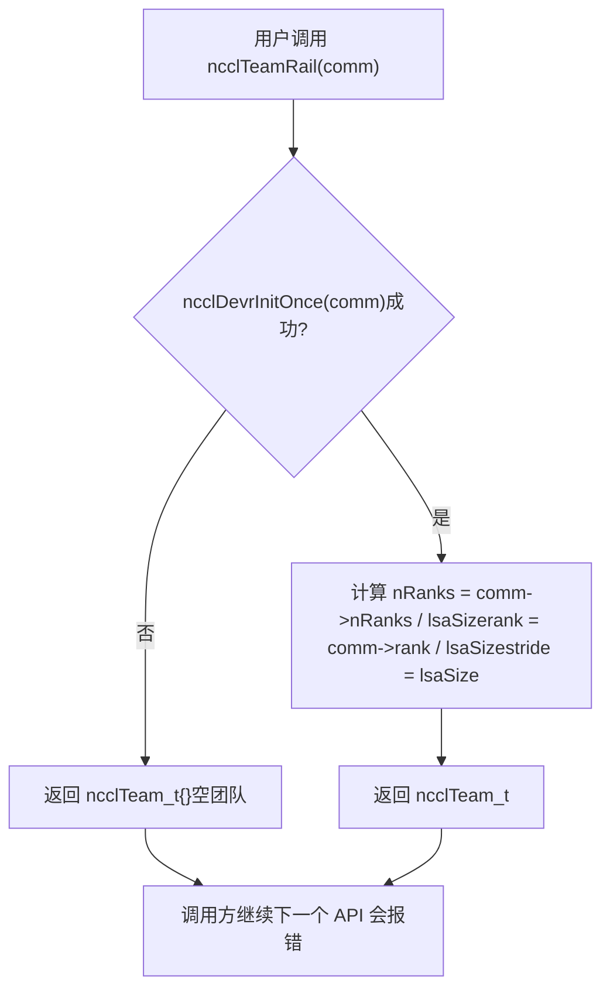
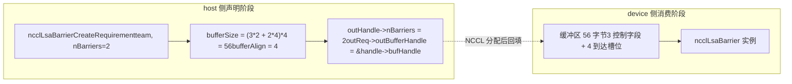
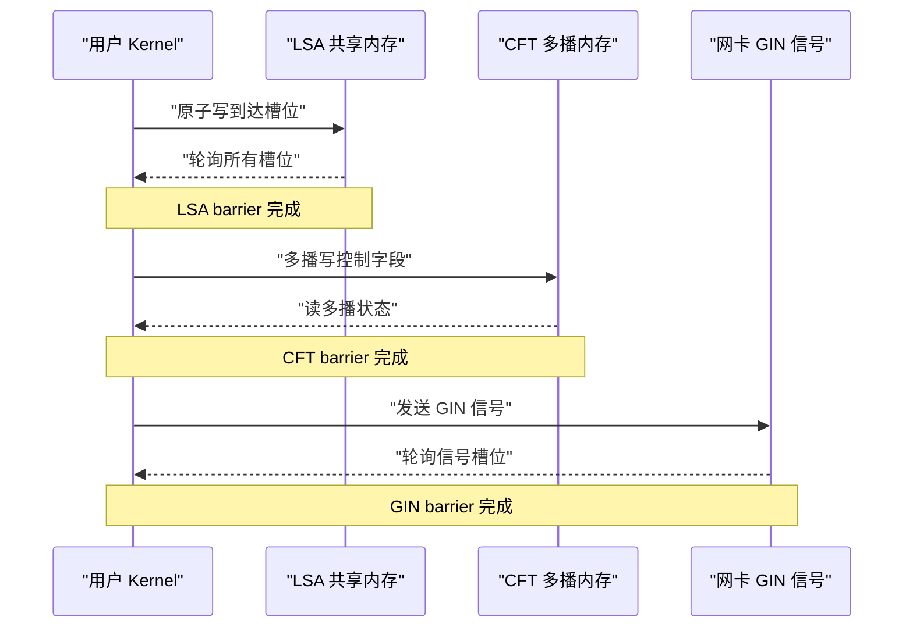
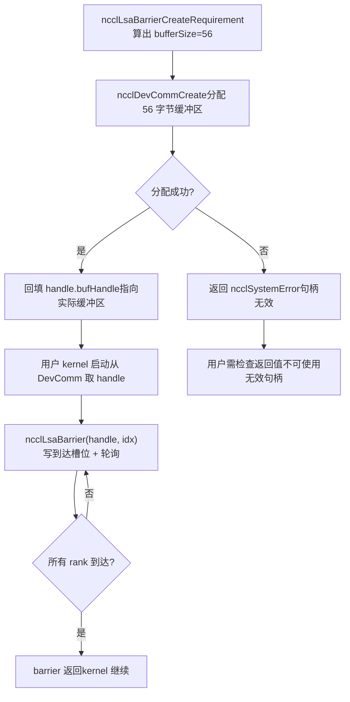
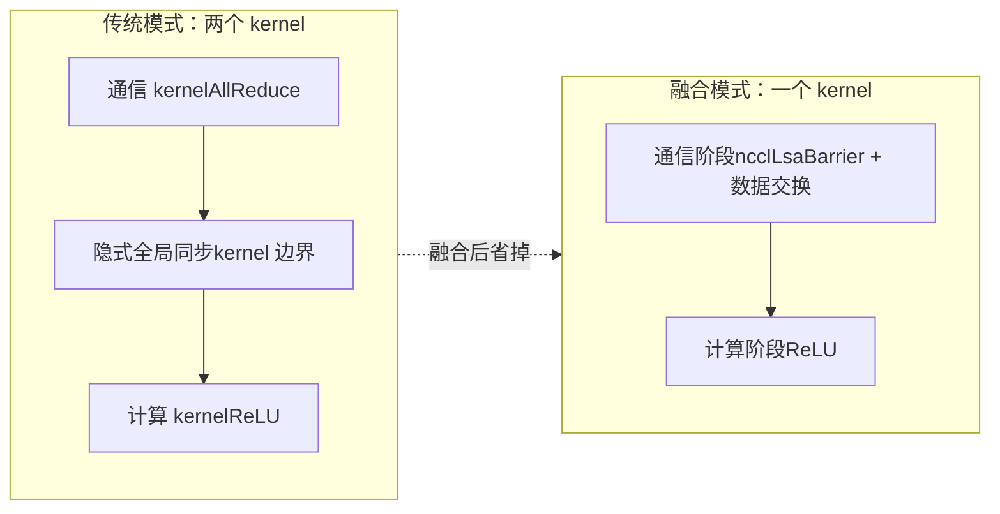

# Chapitre 20 : API natives côté device et fusion d'opérateurs : pratiques de nccl_device et kernel fusion

Dans le chapitre précédent, nous avons vu comment devcomm mappe de manière versionnée les métadonnées du ncclComm côté host vers le côté device, permettant au kernel de lire le rank, les adresses et l'état des connexions. Mais « pouvoir lire les métadonnées » et « pouvoir initier une communication » sont deux choses différentes. Si l'on dispose uniquement des métadonnées, le kernel utilisateur peut tout au plus calculer lui-même les adresses et écrire lui-même des indicateurs ; dès qu'il s'agit de synchronisation inter-rank ou de transmission de signaux inter-machines, il faut revenir côté host appeler des API collectives comme ncclAllReduce — et chaque appel de ce type implique un lancement de kernel et un aller-retour host-device. Le répertoire src/nccl_device que ce chapitre décompose est précisément la clé du passage de NCCL de « bibliothèque appelée » à « modèle programmable ». Ce qu'il fournit n'est pas un nouvel algorithme de communication collective, mais un ensemble de primitives côté device : permettre au kernel de l'utilisateur d'appeler en interne des opérations de synchronisation telles que ncclBarrier, ncclLsaBarrier, ncclGinBarrier, afin d'intégrer « communication » et « calcul » dans un même kernel et d'éliminer les frais de lancement intermédiaires. Le matériel source de ce chapitre se concentre sur la déclaration des besoins côté host (CreateRequirement) et l'abstraction Team de ce groupe de primitives, qui constituent précisément le point d'entrée de l'API côté device. Un prérequis essentiel pour comprendre ce chapitre : la philosophie de conception de l'API côté device est « le côté host déclare les besoins en ressources, le côté device consomme les ressources ». Le côté host ne crée pas directement de barrier, mais indique à NCCL « j'ai besoin de nBarriers barrières, l'équipe compte team.nRanks membres » ; NCCL calcule en conséquence le nombre de buffers et de signaux GIN nécessaires, puis instancie ces ressources côté device. Cette séparation « déclaration-consommation » est la raison fondamentale pour laquelle le code côté device peut fonctionner sans pointeur host.

# I. Abstraction Team : le système de coordonnées de l'API côté device

## Modèle intuitif

Imaginez l'organigramme d'une multinationale. Pour envoyer un e-mail, il faut d'abord savoir « à qui » — à toute l'entreprise (World), aux collègues du même bureau (LSA), ou à l'équipe inter-bureaux d'une même ligne métier (Rail).`ncclTeam_t`C'est le descripteur de ce « périmètre de destinataires ». Sans l'abstraction Team, chaque API côté device devrait recalculer elle-même « quel est mon rang dans ce domaine de communication et combien nous sommes au total », ce qui entraînerait une duplication de code et une forte propension aux erreurs.

## Structures de données et disposition mémoire

`ncclTeam_t`C'est le système de coordonnées de l'API côté device ; ses trois champs définissent une**suite arithmétique**：

| Champ | Signification | Analogie |
| --- | --- | --- |
| `nRanks` | Nombre total de membres dans l'équipe | Combien de personnes dans le groupe |
| `rank` | Numéro du rank actuel au sein de l'équipe | Mon numéro dans le groupe |
| `stride` | Pas entre membres adjacents de l'équipe dans le world | Différence de numéro d'étudiant entre deux voisins dans le groupe |

`stride`C'est le champ le plus facilement négligé mais le plus crucial. Dans l'équipe World,`stride = 1`, car tous les ranks sont disposés consécutivement ; mais dans l'équipe Rail,`stride = lsaSize`, car les ranks d'un même rail n'apparaissent dans le world que tous les`lsaSize`.

[FACT:src/nccl_device/core.cc:13-19]Montre la construction de l'équipe World : on prend directement`comm->nRanks`et`comm->rank`，`stride`fixé à 1. C'est la seule équipe qui n'a pas besoin de`ncclDevrInitOnce`, car ses informations se trouvent entièrement côté host dans`comm`.

[FACT:src/nccl_device/core.cc:22-33]Est l'équipe LSA. Notez le`ncclDevrInitOnce(comm)`de L26 — c'est le point d'entrée idempotent de l'initialisation des ressources côté device. Les commentaires de L23-25 sont très importants :**on ignore délibérément l'erreur**, car si l'initialisation échoue, l'équipe retournée est une « valeur poubelle », mais le prochain appel d'API nécessitant réellement des ressources déclenchera à nouveau`ncclDevrInitOnce`et signalera l'erreur. C'est une stratégie de « rapport d'erreur différé », qui évite de lever des erreurs lourdes sur des opérations légères comme la consultation d'équipe.

## Parcours guidé par scénario : transformation de coordonnées de World à Rail

Supposons une machine à 8 cartes,`lsaSize = 4`(un domaine LSA par 4 cartes),`nRanks = 8`. Voyons comment`ncclTeamRail`est construit :

[FACT:src/nccl_device/core.cc:70-79]Dans`nRanks = 8 / 4 = 2`，`rank = comm->rank / 4`，`stride = 4`. Si le rank actuel est 5, alors son`rank = 5 / 4 = 1`，`stride = 4`dans l'équipe Rail signifie que les membres de l'équipe Rail sont les ranks 1 et 5 du world.

Regardons maintenant`ncclTeamRankToWorld`la formule de conversion :

[FACT:src/nccl_device/core.cc:82-84]Le`comm->rank + (rank - team.rank) * team.stride`de**est un**décalage relatif`(rank - team.rank)`Calcul : on calcule d'abord le décalage du rank cible par rapport au rank actuel au sein de l'équipe`stride`, puis on multiplie par le pas`stride`, et on ajoute le numéro world du rank actuel. Cette formule est universelle pour toutes les équipes, car

`ncclTeamRankToLsa`encode déjà la règle de disposition de l'équipe.

[FACT:src/nccl_device/core.cc:87-92]En revanche,`comm->devrState.lsaSelf + (rank - team.rank) * team.stride`est différent :`lsaSelf`utilise`comm->rank`. Notez qu'ici on utilise

— car la numérotation LSA n'est connue qu'après l'initialisation des ressources côté device et peut différer du world rank.`ncclLsaBarrierCreateRequirement`Copier

## Ce schéma révèle le chemin d'exécution de la stratégie de « rapport d'erreur différé » : en cas d'échec d'initialisation, une équipe vide est retournée, mais l'appelant n'est pas interrompu ; l'erreur sera exposée au prochain appel d'API nécessitant réellement des ressources (comme

**).`ncclTeamWorld`Réflexions de conception et pièges`ncclDevrInitOnce`？**Pourquoi`comm`, sans nécessiter aucune ressource côté dispositif. Si on l'appelle de force, une opération de requête purement hôte dépendra de l'initialisation côté dispositif, ajoutant des points de défaillance inutiles.

**Points de piège**：`ncclTeamRankToLsa`retourne en cas d'échec d'initialisation`-1`（[FACT:src/nccl_device/core.cc:87-92]), tandis que`ncclTeamRankToWorld`n'échoue jamais. Si l'appelant mélange ces deux fonctions sans vérifier les valeurs de retour, il peut obtenir`-1`en cas d'échec d'initialisation LSA et l'utiliser comme un rang valide, provoquant un accès hors limites. Dans le code de production, il faut traiter la valeur de retour de`ncclTeamRankToLsa`comme une opération susceptible d'échouer.

---

# II. Déclaration des besoins de Barrier : comment le côté hôte « réserve » les ressources du dispositif

## Modèle intuitif

L'allocation de ressources de l'API côté dispositif ressemble à**réserver une salle de réunion**: on ne peut pas faire irruption directement dans la salle pour tenir la réunion, il faut d'abord soumettre une demande à l'accueil (côté hôte`CreateRequirement`) — « Je veux tenir 3 réunions, chacune avec 8 participants ». L'accueil calcule alors la taille de salle nécessaire (`bufferSize`), le nombre de chaises requis (`ginSignalCount`), puis vous donne le numéro de salle (`outBufferHandle`). Sans ce mécanisme de réservation, le kernel côté dispositif ne saurait pas où se trouve son tampon de barrier ni quelle est sa taille, et ne pourrait pas lire/écrire en toute sécurité.

## Structures de données et disposition mémoire

Les trois fonctions`CreateRequirement`des barriers partagent le même modèle :**mettre à zéro la structure de besoins → remplir la taille/alignement du tampon → remplir le pointeur de handle de sortie**. Mais leurs types de ressources diffèrent :

| Type de Barrier | Type de ressource | Formule de taille | Alignement |
| --- | --- | --- | --- |
| LSA Barrier | Tampon | `(3*n + n*team.nRanks) * sizeof(uint32_t)` | `alignof(uint32_t)` |
| CFT Barrier | Tampon | `(3*n + n*team.nRanks) * NCCL_CFT_BARRIER_GRAN` | `NCCL_CFT_BARRIER_ALIGN` |
| GIN Barrier | Signal GIN | `n * team.nRanks`signaux | Ne concerne pas de tampon |

Regardons d'abord la formule de taille du LSA Barrier :

[FACT:src/nccl_device/lsa_barrier.cc:14-22]le`(3 * nBarriers + nBarriers * team.nRanks) * sizeof(uint32_t)`peut être décomposé en deux parties :

- `3 * nBarriers`: chaque barrier nécessite 3 champs de contrôle`uint32_t`([INFERENCE] généralement « compteur d'arrivée », « tour », « indicateur d'état »).
- `nBarriers * team.nRanks`: chaque barrier doit réserver un emplacement d'arrivée`uint32_t`pour chaque membre de l'équipe.

Donc la taille totale d'un barrier est de`3 + team.nRanks`unités`uint32_t`. Cette formule est identique en LSA et CFT, sauf que CFT utilise`NCCL_CFT_BARRIER_GRAN`comme unité de granularité (peut-être pour s'aligner sur une frontière plus grande).

Le GIN Barrier est complètement différent :

[FACT:src/nccl_device/gin_barrier.cc:14-20]n'alloue pas de tampon, mais définit`ginSignalCount = nBarriers * team.nRanks`, et fait pointer`outGinSignalStart`vers le`signal0`dans le handle. C'est parce que le GIN barrier passe par le chemin de signal réseau, n'a pas besoin de tampon mémoire partagée, mais a besoin d'emplacements de signal reconnaissables par la carte réseau.

## Parcours guidé par scénario : une réservation complète de LSA Barrier

Supposons que l'utilisateur veuille créer 2 barriers sur une équipe LSA de 4 cartes :

1. **Appel** `ncclLsaBarrierCreateRequirement(team, 2, &handle, &req)`。

2. **Mise à zéro**：`memset(outReq, 0, sizeof(*outReq))`（[FACT:src/nccl_device/lsa_barrier.cc:14-22]) — garantit que les champs non définis ont une valeur déterministe, évitant que l'appelant ne lise des données parasites sur la pile.

3. **Enregistrer le nombre de barriers**：`outHandle->nBarriers = 2`（[FACT:src/nccl_device/lsa_barrier.cc:14-22]）。

4. **Calculer la taille du tampon**：`(3*2 + 2*4) * 4 = (6 + 8) * 4 = 56`octets ([FACT:src/nccl_device/lsa_barrier.cc:14-22]）。

5. **Définir l'alignement**：`alignof(uint32_t) = 4`（[FACT:src/nccl_device/lsa_barrier.cc:14-22]）。

6. **Remplir le pointeur de handle**：`outReq->outBufferHandle = &outHandle->bufHandle`（[FACT:src/nccl_device/lsa_barrier.cc:14-22]) — permet à NCCL d'écrire l'adresse dans le handle après l'allocation réelle du tampon.

Ce diagramme de flux de données illustre la séparation entre « déclaration » et « consommation » : le côté hôte ne fait que calculer la taille et les pointeurs, l'allocation et l'instanciation réelles du tampon se produisent à l'intérieur de NCCL, et le kernel côté dispositif reçoit un handle déjà rempli.

## Réflexions de conception et pièges

**Pourquoi utiliser`memset`pour mettre à zéro tout le`outReq`？**Parce que`ncclDevResourceRequirements_t`est une structure multi-champs, et que différents types de barrier n'en remplissent qu'une partie. La mise à zéro garantit que les champs inutilisés (comme`ginSignalCount`non utilisé par LSA barrier) sont à 0, et NCCL en déduit en interne « cette ressource n'est pas nécessaire ». Sans mise à zéro, des valeurs aléatoires sur la pile pourraient être interprétées à tort comme « ressource GIN nécessaire », déclenchant le problème de faux positif mentionné au chapitre précédent.

**Points de piège**：`outReq->outBufferHandle = &outHandle->bufHandle`confie à NCCL l'adresse d'un champ interne du handle. Cela signifie que`outHandle`doit rester valide jusqu'à ce que NCCL termine l'allocation du tampon (ne peut pas être récupéré par la pile ni déplacé). Si l'utilisateur place`outHandle`dans une portée qui sera libérée prématurément, NCCL écrira dans un pointeur sauvage lors du remplissage.

> **[Design Inference & Architectural Trade-offs]**
> **Différence de granularité du CFT Barrier**：[FACT:src/nccl_device/cft_barrier.cc:13-21]utilise`NCCL_CFT_BARRIER_GRAN`et`NCCL_CFT_BARRIER_ALIGN`à la place de`sizeof(uint32_t)`et`alignof(uint32_t)`du LSA. Cela indique que le barrier CFT (peut-être Cross-Fabric Team ou une équipe inter-domaines similaire) nécessite une granularité d'alignement plus grande, peut-être parce qu'il doit traverser plusieurs régions mémoire multicast, et que le matériel impose des exigences d'alignement d'adresse plus strictes.

---

# III. Répartition sémantique des trois types de Barrier : ce que gèrent respectivement LSA, CFT et GIN

## Modèle intuitif

Les trois types de barrier ressemblent à trois « rassemblements » de portées différentes :

- **LSA Barrier**: rassemblement de collègues dans le même bureau, via mémoire partagée, le plus rapide.
- **CFT Barrier**: rassemblement entre bureaux mais dans le même bâtiment, via mémoire multicast, intermédiaire.
- **GIN Barrier**: rassemblement entre villes voire entre pays, via signal réseau, le plus lent mais avec la couverture la plus large.

Choisir le mauvais type de barrier ne provoque pas d'erreur, mais entraîne une perte de performance énorme — utiliser un GIN barrier pour une synchronisation dans le même bureau équivaut à envoyer un courrier international pour un document du poste voisin.

## Comparaison des structures de données et de la disposition mémoire

Du point de vue de la déclaration des besoins côté hôte, les besoins en ressources des trois sont radicalement différents :

| Dimension | LSA Barrier | CFT Barrier | GIN Barrier |
| --- | --- | --- | --- |
| Nécessite le paramètre`comm` | Non | Non | Oui |
| Tampon | Oui | Oui | Non |
| Signal GIN | Non | Non | Oui |
| Unité de taille | `uint32_t` | `NCCL_CFT_BARRIER_GRAN` | Nombre de signaux |
| Champ de handle de sortie | `bufHandle` | `bufHandle` | `signal0` |

Notons que GIN Barrier est le seul à nécessiter le paramètre`comm`:

[FACT:src/nccl_device/gin_barrier.cc:14-20]la signature de la fonction inclut`ncclComm_t comm`, tandis que les signatures de LSA et CFT n'ont que`ncclTeam_t team`. Cela est dû au fait que les signaux GIN doivent être liés à une connexion réseau spécifique, et les informations de connexion réseau se trouvent dans`comm`.

## Parcours guidé par scénario : allocation des signaux pour la barrière GIN

[FACT:src/nccl_device/gin_barrier.cc:14-20]La logique est plus simple que celle de LSA, mais la sémantique est plus subtile :

1. **Remise à zéro**：`memset(outReq, 0, sizeof(*outReq))`（L16）。

2. **Définition du nombre de signaux**：`outReq->ginSignalCount = nBarriers * team.nRanks`(L17) — chaque barrière doit allouer un emplacement de signal pour chaque membre de l'équipe.

3. **Remplissage du pointeur de début de signal**：`outReq->outGinSignalStart = &outHandle->signal0`(L18) — noter qu'ici`bufferSize`n'est pas défini, car la barrière GIN n'utilise pas de tampon en mémoire partagée.

> **[Design Inference & Architectural Trade-offs]**
> `signal0`Ce nom suggère que le handle pourrait contenir un ensemble de champs de signaux contigus (`signal0`, `signal1`, ...），`outGinSignalStart`pointe vers le premier, NCCL sait ainsi où commencer l'allocation de`nBarriers * team.nRanks`signaux.

## Contrôle de concurrence et interaction matérielle

Les mécanismes de contrôle de concurrence des trois types de barrières sont complètement différents :

- **LSA Barrier**: opérations atomiques basées sur la mémoire partagée.`3 + team.nRanks`Parmi les`uint32_t`, l'arrivée à un emplacement est marquée par un ajout atomique ou une écriture atomique pour signaler « je suis arrivé », et les champs de contrôle sont lus atomiquement pour vérifier « si tout le monde est arrivé ». Il s'agit d'une synchronisation purement interne au GPU, sans implication du réseau.
- **CFT Barrier**: basé sur la mémoire multicast (multimem). [INFERENCE] La mémoire multicast permet à une seule opération d'écriture de mettre à jour simultanément la vue de plusieurs ranks, donc la barrière CFT pourrait utiliser moins de champs de contrôle pour réaliser une synchronisation plus large.
- **GIN Barrier**: basé sur les signaux réseau.`ginSignalCount`Les signaux sont envoyés via la carte réseau, et le récepteur interroge les emplacements de signaux. C'est la seule barrière impliquant du matériel inter-machines.

Ce diagramme de séquence illustre les niveaux d'interaction matérielle des trois types de barrières : de la synchronisation purement interne au GPU, à la mémoire multicast, puis aux signaux de carte réseau, la latence augmente progressivement et la portée s'élargit également.

## Réflexions de conception et pièges

**Pourquoi LSA et CFT n'ont-ils pas besoin du paramètre`comm`?**Parce que leurs ressources (mémoire partagée, mémoire multicast) ont déjà été liées à l'équipe lors de la phase`ncclDevrInitOnce`,`team`lui-même implique les informations de localisation des ressources. En revanche, les signaux GIN nécessitent une allocation dynamique de ressources réseau, et doivent accéder à l'état de connexion réseau via`comm`.

**Pièges**: Le`ginSignalCount`de la barrière GIN est`nBarriers * team.nRanks`, si l'équipe est très grande (par exemple 1024 ranks) et qu'il y a beaucoup de barrières (par exemple 100), le nombre total de signaux atteindra 102400. Les emplacements de signaux de la carte réseau sont une ressource limitée, une demande excessive peut entraîner un échec de`ncclDevrInitOnce`. Le code de production devrait demander le nombre minimal de barrières réellement nécessaires, plutôt que de demander un grand nombre de ressources de réserve en une seule fois.

---

# IV. Du déclaratif de besoin à la consommation côté device : cycle de vie complet

## Modèle intuitif

`CreateRequirement`n'est qu'une « commande », la véritable « expédition » et « réception » se produisent à l'intérieur de NCCL et dans le kernel côté device. Le cycle de vie complet ressemble à un**achat en ligne**: vous passez commande (CreateRequirement) → le vendeur prépare le stock (NCCL alloue les ressources) → livraison par coursier (ressources liées au DevComm) → vous signez et utilisez (le kernel côté device appelle la barrière).

## Structures de données et disposition mémoire : évolution des champs du handle

Prenons`ncclLsaBarrierHandle_t`comme exemple, il passe par trois phases dans son cycle de vie :

| Phase | `nBarriers` | `bufHandle` | Autres champs |
| --- | --- | --- | --- |
| Après CreateRequirement | Défini | L'adresse est remplie, mais le contenu n'est pas alloué | Non défini |
| Après allocation NCCL | Défini | Pointe vers le tampon réel | Défini |
| Utilisation côté device | Lecture seule | Lecture seule | Lecture seule |

[FACT:src/nccl_device/lsa_barrier.cc:14-22]Définit`nBarriers`，[FACT:src/nccl_device/lsa_barrier.cc:14-22]Remplit l'adresse de`bufHandle`. Entre ces deux opérations, NCCL effectue en interne l'allocation réelle du tampon.

## Parcours guidé par scénario : une utilisation complète de barrière

1. **Déclaration côté host**: l'utilisateur appelle`ncclLsaBarrierCreateRequirement(team, 2, &handle, &req)`, obtient`req.bufferSize = 56`。

2. **Soumission côté host**: l'utilisateur remet`req`à`ncclDevCommCreate`(contenu du chapitre précédent), NCCL alloue un tampon de 56 octets et écrit l'adresse dans`handle.bufHandle`。

3. **Initialisation côté device**: au lancement du kernel utilisateur, on extrait`handle`du DevComm, et on localise le tampon avec`bufHandle`.

4. **Synchronisation côté device**: le kernel appelle`ncclLsaBarrier(handle, barrierIndex)`, écrit la marque d'arrivée dans l'emplacement correspondant du tampon, et interroge les autres emplacements.

5. **Achèvement côté device**: une fois tous les ranks arrivés, la barrière retourne et le kernel continue son exécution.

Ce diagramme de décision montre le chemin complet de la déclaration à l'utilisation, ainsi que la branche d'erreur en cas d'échec d'allocation. Noter que`ncclLsaBarrierCreateRequirement`lui-même retourne toujours`ncclSuccess`（[FACT:src/nccl_device/lsa_barrier.cc:14-22]), l'échec réel se produit lors de la phase d'allocation des ressources ultérieure.

## Contrôle de concurrence et interaction matérielle

Le cœur du contrôle de concurrence de la barrière côté device est**opérations atomiques + barrières mémoire**. Prenons l'exemple de la barrière LSA :

- **Phase d'arrivée**: chaque rank met à jour son propre emplacement d'arrivée par écriture atomique (ou ajout atomique). Cette étape doit utiliser la sémantique release, garantissant que toutes les opérations mémoire précédant la barrière sont visibles pour les autres ranks.
- **Phase d'interrogation**: chaque rank vérifie tous les emplacements par lecture atomique (ou lecture volatile). Cette étape doit utiliser la sémantique acquire, garantissant qu'après avoir vu « tout le monde est arrivé », on peut lire les données écrites par les autres avant leur barrière.
- **Phase de réinitialisation**: après l'achèvement de la barrière, les emplacements doivent être réinitialisés pour la prochaine utilisation. Le contrôle de concurrence de cette étape est le plus subtil — si la réinitialisation est trop rapide, elle peut écraser les marques de ranks qui n'ont pas encore lu.

> **[Design Inference & Architectural Trade-offs]**
> `3 * nBarriers`Ces champs de contrôle servent probablement à gérer ce problème de « tours » : un champ enregistre le tour actuel, un champ enregistre le compteur d'arrivées, et un champ sert de drapeau de réinitialisation. Ainsi, plusieurs barrières peuvent réutiliser le même ensemble d'emplacements sans confondre les tours.

## Guide pour éviter les pièges en production

**Piège 1 : gestion du cycle de vie des handles**。`outReq->outBufferHandle = &outHandle->bufHandle`L'adresse des champs internes du handle a été transmise à NCCL. Si l'utilisateur détruit`ncclDevCommCreate`avant le retour de`outHandle`, NCCL écrira dans de la mémoire déjà libérée lors du remplissage. La bonne pratique consiste à lier le cycle de vie de`outHandle`au DevComm, plutôt qu'à la portée de la fonction qui l'a créé.

**Piège 2 : produit du nombre de barrières par la taille de l'équipe**。`bufferSize = (3*n + n*team.nRanks) * sizeof(uint32_t)`Dans`n*team.nRanks`, le terme domine la taille pour les grandes équipes. 1024 ranks et 100 barrières nécessitent`100*1024*4 = 409600`octets, soit environ 400 Ko. Si chaque rank en demande autant, la pression sur la mémoire GPU n'est pas négligeable. Il faut allouer en fonction du nombre de barrières réellement utilisées en concurrence, et non du nombre total de barrières.

**Piège 3 : épuisement des signaux GIN barrier**. Les signaux GIN sont des ressources de la carte réseau, en nombre limité. Si plusieurs DevComm demandent simultanément un grand nombre de signaux GIN, les emplacements de la carte réseau peuvent être épuisés. Le code de production doit vérifier, en cas d'échec de création d'un DevComm, s'il s'agit d'un manque de signaux GIN, et envisager de réduire`nBarriers`ou de passer à une barrière LSA.

**Piège 4 : exposition tardive des échecs d'initialisation**。`ncclTeamLsa`Des fonctions telles que`ncclDevrInitOnce`renvoient une équipe vide ([FACT:src/nccl_device/core.cc:22-33]) en cas d'échec de`team.nRanks > 0`）。

---

# V. Fusion de kernels : pourquoi intégrer communication et calcul dans un seul kernel

## Modèle intuitif

Dans le mode traditionnel, un « AllReduce + fonction d'activation » nécessite deux kernels : un pour la communication, un pour le calcul. Entre les deux kernels se produit une synchronisation globale implicite — le kernel de communication doit se terminer complètement avant que le kernel de calcul puisse démarrer. C'est comme**une course de relais**: le premier coureur doit passer le témoin au second, et à l'instant du passage, les deux attendent. La fusion de kernels consiste à faire exécuter communication et calcul par un même kernel, comme**une personne qui change de chaussures en courant**, éliminant l'attente du passage de relais.

## Structures de données et disposition mémoire

La clé de la fusion de kernels réside dans le fait que les primitives de communication (comme les barrières) et la logique de calcul partagent les registres et la mémoire partagée d'un même kernel. Cela implique :

- **Pression sur les registres**: les opérations atomiques et les boucles de polling des primitives de communication occupent des registres, réduisant le budget de registres de la logique de calcul.
- **Concurrence pour la mémoire partagée**: si le tampon d'une barrière LSA est placé en mémoire partagée, il entre en concurrence avec les besoins en mémoire partagée de la logique de calcul.
- **Impact sur l'occupancy**: l'occupancy d'un kernel fusionné est généralement inférieure à celle d'un kernel de calcul pur, car les primitives de communication nécessitent des ressources supplémentaires.

> **[Design Inference & Architectural Trade-offs]**
> La conception de l'API côté device (déclaration des ressources côté host, consommation côté device) vise précisément à atténuer ces pressions : les ressources sont préallouées côté host, et le kernel côté device n'a qu'à lire et écrire, sans allocation dynamique, ce qui réduit l'occupation des registres.

## Parcours guidé par scénario : flux d'exécution d'un kernel fusionné

Supposons que l'utilisateur veuille écrire un kernel fusionné « AllReduce + ReLU » :

1. **Préparation côté host**: appel de`ncclLsaBarrierCreateRequirement`pour demander une barrière, appel de`ncclDevCommCreate`pour allouer les ressources.

2. **Lancement du kernel**: le kernel utilisateur reçoit le DevComm et le handle de barrière en paramètres.

3. **Phase de communication**: le kernel appelle`ncclLsaBarrier`pour synchroniser tous les ranks, puis chaque rank échange des données (lecture/écriture directe via la mémoire symétrique).

4. **Phase de calcul**: une fois la synchronisation terminée, le kernel applique directement ReLU aux données locales, sans lancement de kernel supplémentaire.

5. **Fin**: le kernel se termine, le host n'a pas besoin d'attendre un kernel de communication supplémentaire.

Ce schéma comparatif illustre le gain essentiel de la fusion : l'élimination de la synchronisation globale implicite aux frontières des kernels. En mode traditionnel, cette synchronisation coûte la latence de deux lancements de kernel plus le vidage du pipeline GPU.

## Réflexions de conception et pièges

**Pourquoi l'API côté device ne fournit-elle pas directement un « AllReduce fusionné » ?**Parce que la forme concrète de la fusion dépend de la logique de calcul de l'utilisateur. NCCL fournit des**primitives**(barrières, signaux, accès mémoire symétrique), et non des**produits finis**(AllReduce+ReLU fusionné). L'utilisateur doit combiner lui-même ces primitives pour réaliser un kernel fusionné adapté à ses besoins. C'est la différence fondamentale entre un « modèle de programmation » et une « bibliothèque ».

**Pièges**: Le débogage d'un kernel fusionné est bien plus difficile que celui d'un kernel séparé. Si la logique de barrière comporte un bug, cela peut provoquer un blocage du kernel (interblocage), et un blocage de kernel GPU n'est pas aussi facile à diagnostiquer qu'un blocage de processus hôte. Il est recommandé d'ajouter un mécanisme de timeout dans le kernel fusionné, ou de valider d'abord la logique de barrière avec une petite équipe.

**Points de piège**: La baisse d'occupancy du kernel fusionné peut entraîner une perte de performance de calcul supérieure au gain des économies de communication. Avant de décider de fusionner, il faut mesurer le temps de bout en bout avant et après la fusion, plutôt que de se contenter d'observer la réduction de la latence de communication.

# Réflexions et auto-évaluation de ce chapitre

Q1 : Si l'on supprime l'appel`ncclTeamLsa`à la ligne L26 dans`ncclDevrInitOnce`et qu'on retourne directement`comm->devrState.lsaSize`et`lsaSelf`, dans quels scénarios le kernel côté device lirait-il des informations de team erronées ?

**Analyse de référence**：`ncclDevrInitOnce`est le point d'entrée idempotent pour l'initialisation des ressources côté device. Si on le supprime,`comm->devrState.lsaSize`et`lsaSelf`peuvent encore avoir leurs valeurs initiales (généralement 0 ou indéfinies). Dans un scénario de première utilisation de l'API côté device, l'appel utilisateur à`ncclTeamLsa`obtiendra une team vide de`nRanks = 0`. Si ensuite l'utilisateur ne vérifie pas la validité de la team et utilise directement cette team pour appeler`ncclLsaBarrierCreateRequirement`, cela calculera`bufferSize = (3*n + n*0) * 4 = 12n`octets — moins que nécessaire, car le terme`n*team.nRanks`devient 0. Cela provoquera un débordement de tampon : à l'exécution, la barrière tentera d'écrire`team.nRanks`slots d'arrivée, mais le tampon n'a alloué que`3n`espaces de`uint32_t`. Plus insidieux encore, si`lsaSelf`vaut aussi 0,`ncclTeamRankToLsa`retournera un numéro de rank erroné, ce qui fera écrire les slots d'arrivée de la barrière au mauvais endroit, et il se peut qu'on n'atteigne jamais l'arrivée de tous les ranks, provoquant un blocage du kernel. C'est précisément la situation que la stratégie « retourner une valeur poubelle, la prochaine API signalera l'erreur » mentionnée dans les commentaires L23-25 cherche à prévenir — mais à condition que la prochaine API signale effectivement une erreur, et non qu'elle utilise silencieusement une taille erronée.

Q2：`ncclLsaBarrierCreateRequirement`La formule de taille de`(3*nBarriers + nBarriers*team.nRanks) * sizeof(uint32_t)`est`++`. Si la team compte 8 ranks et que l'utilisateur demande 1 barrière, le tampon fait 44 octets. En supposant que les « 3 champs de contrôle » dans l'implémentation de la barrière soient respectivement « compteur d'arrivée », « tour » et « indicateur de réinitialisation », déduisez : lorsque 8 ranks arrivent simultanément, que se passe-t-il si le « compteur d'arrivée » utilise une opération

**non atomique ?**Analyse de référence`++`: Une`count++`non atomique est sur GPU une séquence « lire-modifier-écrire » en trois étapes, ce n'est pas une opération atomique. Lorsque 8 ranks exécutent simultanément`count`, il peut arriver que plusieurs ranks lisent la même ancienne valeur (par exemple tous lisent 0), puis écrivent tous 1. Finalement,`atomicAdd`n'augmente que de 1 au lieu de 8, ce qui fait que la barrière considère toujours que « tout le monde n'est pas encore arrivé », et tous les ranks bouclent indéfiniment dans la phase de polling. C'est pourquoi les slots d'arrivée d'une barrière LSA doivent utiliser des opérations atomiques (comme`nBarriers * team.nRanks`) ou que chaque rank écrive dans son propre slot indépendant (le terme`nBarriers * team.nRanks`sert précisément à réserver un slot indépendant pour chaque rank). Si l'on adopte la solution « chaque rank écrit dans son propre slot », on n'a pas besoin d'addition atomique, seulement d'écriture atomique + barrière mémoire, car chaque slot n'a qu'un seul écrivain. Cela explique aussi pourquoi la formule de taille contient le terme

Q3：`ncclGinBarrierCreateRequirement`— il échange de l'espace contre de l'atomicité, évitant la compétition entre plusieurs écrivains.`comm`nécessite le paramètre`ncclLsaBarrierCreateRequirement`alors que`comm`n'en a pas besoin. Si l'on ajoutait de force le paramètre`comm`à la barrière LSA (en supposant que ce soit pour unifier l'interface), quel problème de conception cela introduirait-il ? Inversement, si l'on retirait le paramètre

**à la barrière GIN, dans quels scénarios échouerait-elle ?**Analyse de référence`comm`: Le problème d'ajouter le paramètre`ncclDevrInitOnce`à la barrière LSA est que cela introduit une dépendance inutile. Les ressources de la barrière LSA (mémoire partagée) sont déjà liées à la team lors de la phase`team`, et`comm`implique en soi la localisation des ressources. Ajouter`comm`ferait dépendre une opération purement liée à la team de l'état du domaine de communication, augmentant les points de défaillance (par exemple, si`comm`est invalide, la barrière LSA ne peut pas non plus être créée), et violerait le principe du « moindre privilège ». Inversement, retirer le paramètre`ncclGinBarrierCreateRequirement`à la barrière GIN ferait échouer celle-ci, car le signal GIN doit être lié à une connexion réseau concrète.`ginSignalCount`Le`comm`de`comm`doit savoir vers quelle carte réseau et quel QP (Queue Pair) envoyer le signal, ces informations se trouvent dans l'état de la couche de transport réseau de**. Sans**, NCCL ne peut pas déterminer à quel slot de quelle carte réseau le signal doit être attribué, ni garantir que le signal sera correctement routé vers le rank cible. Cela illustre un principe de conception des API côté device :

---

la déclaration des besoins en ressources ne dépend que du contexte dont elle a réellement besoin`ncclTeam_t`— LSA n'a besoin que de la topologie de la team, GIN a besoin de la connexion réseau.`CreateRequirement`L'API côté device et la fusion de kernels transforment NCCL de « une bibliothèque que vous appelez » en « un modèle que vous programmez ».

Jusqu'ici, nous avons parcouru l'ensemble du processus allant du mapping des métadonnées devcomm aux primitives côté device de nccl_device, et vu comment NCCL, via le modèle « déclaration côté host, consommation côté device », permet aux kernels utilisateur d'appeler directement des opérations de synchronisation de type barrier, fusionnant communication et calcul dans un même kernel. Mais une fois ces mécanismes maîtrisés, une question plus concrète surgit naturellement : lorsque les performances d'une tâche d'entraînement réelle ne sont pas au rendez-vous, comment déterminer s'il s'agit d'un mauvais choix d'algorithme, d'une inadéquation de protocole, ou d'une configuration irrationnelle du nombre de canaux ? Le chapitre suivant enchaînera les mécanismes des 20 chapitres précédents en une méthodologie de tuning opérationnelle, combinant rapports de performance, modèle de coût et variables d'environnement, pour fournir un chemin de diagnostic allant du symptôme à la cause racine.
