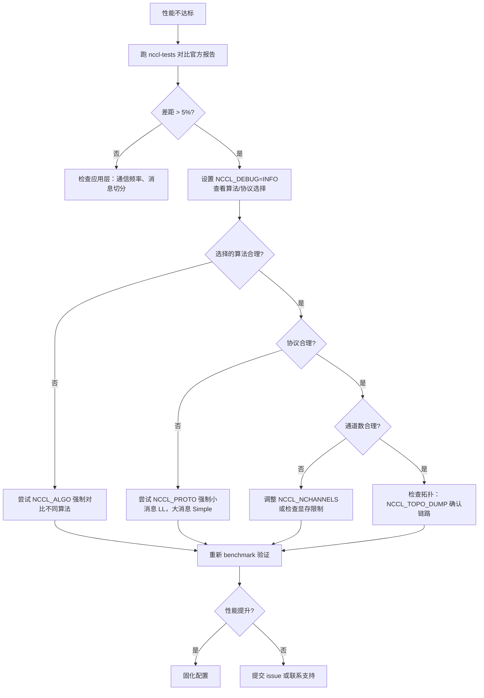

# Chapitre 21 : Tuning de performance en pratique : opérations de tuning, outils de benchmark et méthodologie de tuning

Dans le chapitre précédent, nous avons vu comment un kernel personnalisé utilisateur peut coopérer avec les primitives de communication NCCL via l'API côté device, allant jusqu'à fusionner communication et calcul dans un même kernel. Cela ouvre la possibilité d'utiliser NCCL comme modèle de programmation, mais soulève aussi un problème concret : lorsque les performances de communication ne sont pas à la hauteur des attentes, par où commencer ? NCCL expose des centaines de NCCL_PARAM, mais ce qui détermine réellement le chemin emprunté par une communication collective se résume en fait à trois boutons : l'algorithme (Algo), le protocole (Proto) et le nombre de canaux (nChannels). Ce chapitre enchaîne les mécanismes des 20 chapitres précédents en un chemin de diagnostic opérationnel — d'abord consulter le rapport de performance pour localiser le phénomène, puis lire le modèle de coût pour comprendre comment NCCL choisit lui-même, et enfin utiliser les variables d'environnement et les benchmarks pour valider vos hypothèses.

# 21.1 Rapport de performance : établir d'abord la ligne de base « normale »

La première étape du tuning n'est pas de modifier des paramètres, mais de savoir à quoi ressemble « la normale ». Si vous ne savez même pas quelle est la bande passante de pointe de votre système actuel, tout réglage de paramètres est une supposition à l'aveugle.

NCCL publie officiellement des données de performance de référence sous`docs/perf`, dont la vocation est très claire — non pas une garantie de niveau produit, mais un point de référence pour aligner les attentes.

[FACT:docs/perf/README.md:3-14]

```
NCCL publishes reference performance data to:

1. Provide reference points that help users align performance expectations.
2. Help users validate their system setup.
3. Reduce repeated requests to the NCCL team for basic performance numbers.

These results are references, and NOT product-level guarantees that the same
performance is achievable on every system. Performance depends on a complex
combination of software versions, system configuration, hardware, and operating
conditions, including factors outside NCCL's control. A difference within 5% is
generally considered acceptable variance due to differences in the underlying
systems.
```

Il y a ici deux informations clés que les débutants ont tendance à négliger :

Premièrement,**un écart inférieur à 5 % relève des fluctuations normales**. Cela signifie que si vous mesurez 3 % de moins que l'officiel, ne vous précipitez pas pour régler les paramètres — vérifiez d'abord s'il s'agit de bruit de mesure, de gigue d'horloge GPU, ou d'interférence d'une tâche voisine.

Deuxièmement,**l'officiel ne publie que la bande passante de pointe, pas la latence**。

[FACT:docs/perf/README.md:24-24]

```
We publish peak bandwidth for a selection of commonly used platforms. We do not
currently publish latency because it is typically more sensitive to factors
outside NCCL's control.
```

> **[Design Inference & Architectural Trade-offs]**
> Pourquoi la latence n'est-elle pas publiée ? Parce que la latence est extrêmement sensible à l'état du système — la fréquence CPU, l'état du lien PCIe, la version du firmware de la carte réseau, et même la politique d'alimentation du BIOS l'affectent. La bande passante sature sous les gros messages et reste relativement stable ; la latence, sous les petits messages, résulte de la superposition d'innombrables micro-étapes, et toute gigue d'un maillon est amplifiée. Ainsi, lors du tuning,**gros messages : regarder la bande passante ; petits messages : regarder la latence**, ce sont deux chemins de diagnostic distincts.

[FACT:docs/perf/README.md:24-24]

```
If your workload differs significantly from the published results, open an
issue in the [NCCL repository](https://github.com/NVIDIA/nccl/issues) or contact
NVIDIA Support. We will try our best to help.
```

**Première règle de l'ordre de diagnostic**: exécuter d'abord un benchmark standard (comme`nccl-tests`de`all_reduce_perf`), puis comparer le résultat au rapport officiel. Si l'écart est inférieur à 5 %, la configuration système est correcte et le goulot de performance se situe dans votre couche applicative (par exemple la fréquence de communication, la manière de découper les messages) ; si l'écart est significatif, alors seulement on entre dans le tuning des paramètres NCCL.

# 21.2 Modèle de coût : comment NCCL choisit lui-même algorithme et protocole

Pour régler les paramètres, il faut d'abord comprendre comment NCCL choisit par défaut. Il dispose en interne d'un « modèle de coût » (cost model), essentiellement une table de consultation + un calcul de formule : étant donné la taille du message, le type de topologie et le nombre de ranks, il estime le temps de chaque combinaison « algorithme × protocole » et choisit la plus petite.

## Modèle intuitif

Imaginez le modèle de coût comme un logiciel de navigation. Vous saisissez le point de départ et d'arrivée (taille du message, topologie), il estime en interne le temps de chaque itinéraire (combinaison algorithme/protocole), puis recommande le plus rapide. L'estimation de la navigation se base sur des données historiques et la catégorie de route ; celle de NCCL se base sur une table de paramètres latence/bande passante codée en dur.

Sans ce modèle, NCCL ne pourrait utiliser qu'un algorithme fixe pour tous les scénarios — les petits messages ralentiraient à cause d'un surcoût de démarrage excessif, les gros messages ralentiraient à cause d'une utilisation insuffisante de la bande passante, et le système serait mauvais aux deux extrêmes.

## Structure de données : table du modèle et contexte de tuning

Le cœur du modèle de coût est le tableau`modelMap`, chaque élément correspondant à une combinaison « algorithme/protocole/kernel symétrique ».

[FACT:src/tuning/cost_model.cc:230-277]

```
static struct ncclTuningModelEntry_t modelMap[] = {
    /*
Initialize default, static models here
{mod_init, mod_sim, mod_final, enabled}
Enable order: Broadcast, Reduce, AllGather, ReduceScatter, AllReduce
*/
  {ncclTuningTreeModelInit, ncclTuningTreeModelSim, nullptr, {0, 0, 0, 0, 1}},       // Tree/LL
  {ncclTuningTreeModelInit, ncclTuningTreeModelSim, nullptr, {0, 0, 0, 0, 1}},       // Tree/LL128
  {ncclTuningTreeModelInit, ncclTuningTreeModelSim, nullptr, {0, 0, 0, 0, 1}},       // Tree/Simple
  {ncclTuningRingModelInit, ncclTuningRingModelSim, nullptr, {1, 1, 1, 1, 1}},       // Ring/LL
  ...
```

Chaque entrée possède quatre champs :`mod_init`(fonction d'initialisation),`mod_sim`(fonction de simulation),`mod_final`(fonction de nettoyage),`enabled`(les indicateurs d'activation des 5 fonctions respectives).`enabled`L'ordre du tableau`{Broadcast, Reduce, AllGather, ReduceScatter, AllReduce}`est

> **[Design Inference & Architectural Trade-offs]**
> 〔Inférence de conception et compromis architecturaux〕**Observation clé :**（`{0,0,0,0,1}`Tree n'est activé que sur AllReduce`{1,1,1,1,1}`). Cela s'explique par le fait que l'avantage de l'algorithme Tree réside dans le fait que la phase de réduction d'AllReduce peut être parallélisée, mais pour des opérations essentiellement de type pipeline circulaire comme AllGather/ReduceScatter, Ring est plus naturel.

Les paramètres spécifiques du modèle se trouvent dans`ncclTunerConstants_t`, incluant la latence de base et la bande passante pour chaque topologie.

[FACT:src/tuning/cost_model.cc:142-152]

```
static const ncclTunerConstants_t ncclTunerConstantsDefaults = {
    // baseLatencies
  {
    {6.8, 14.0, 8.4},  // Tree
    {6.6, 14.0, 8.4},  // Ring
    {0, 0, 0},         // Collnet Direct
    {0, 0, 0},         // Collnet Chain
    {0, 0, 0},         // NVLS
    {0, 0, 0},         // NVLS Tree
    {8.0, 8.0, 8.0}    // PAT
  },
```

Chaque algorithme possède trois valeurs de latence de base, correspondant aux trois protocoles LL / LL128 / Simple. Par exemple, pour Ring,`{6.6, 14.0, 8.4}`signifie : latence de base du protocole LL 6,6 microsecondes, LL128 14,0, Simple 8,4. Ces chiffres sont des valeurs empiriques mesurées par NVIDIA sur du matériel réel.

La latence matérielle est donnée séparément selon le type de topologie (NVLink / PCI / NET).

[FACT:src/tuning/cost_model.cc:153-184]

```
    // hwLatencies
  {
    /* NVLINK */
    {
      {0.6, 1.25, 4.0}, // Tree (LL/LL128/Simple)
      {0.6, 1.9, 3.4},  // Ring (LL/LL128/Simple)
      ...
    },
    /* PCI */
    {
      {1.0, 1.9, 4.0}, // Tree (LL/LL128/Simple)
      {1.0, 2.5, 5.7}, // Ring (LL/LL128/Simple)
      ...
    },
    /* NET */
    {
      {5.0, 8.5, 14},   // Tree (LL/LL128/Simple)
      {2.7, 4.0, 14.0}, // Ring (LL/LL128/Simple)
      ...
    },
  },
```

Une comparaison permet de voir les différences de topologie : sur NVLink, la latence par saut de Ring/Simple est de 3,4 microsecondes, sur PCI de 5,7, sur NET de 14,0. C'est pourquoi la communication inter-machines est lente — chaque saut coûte 10 microsecondes supplémentaires.

Les paramètres de bande passante sont donnés par génération d'architecture GPU.

[FACT:src/tuning/cost_model.cc:183-183]

```
    // llMaxBws
  {
    {39.0, 39.0, 20.4}, /* Volta-N1/Intel-N2/Intel-N4) */
    {87.7, 22.5 /*avg of ring & tree*/, 19.0}, /* Ampere-N1/AMD-N2/AMD-N4) */
    {141.0, 45.0 /*avg of ring & tree*/, 35.0}, /* Hopper-N1/AMD-N2/AMD-N4) */
    {2 * 141.2, 2 * 45.0 /*avg of ring & tree*/, 2 * 35.0}, /* Blackwell-N1/AMD-N2/AMD-N4) */
  },
```

Chaque ligne correspond à une génération d'architecture, les trois valeurs étant la bande passante maximale du protocole LL dans les scénarios mono-machine (N1), bi-machine (N2) et quadri-machine (N4). Hopper mono-machine 141 GB/s, Blackwell double à 282 GB/s — cela explique pourquoi le même algorithme performe bien mieux sur les nouvelles cartes.

## Contexte de réglage : état par-comm

Chaque domaine de communication (communicator) détient un`ncclTuningContext_t`, conservant l'état de réglage de ce comm.

[FACT:src/include/tuning.h:81-95]

```
struct ncclTuningContext_t {
  // Persistant tuning parameters tied to a communicator.
  ncclTunerConstants_t tuningConstants;
  // State of the tuning models
  // Forced function is set via env var
  int forced[NCCL_NUM_FUNCTIONS];
  // Disabled tuning models are not execute and excluded from implemetation selection.
  int enabled[NCCL_TUNING_COUNT][NCCL_NUM_FUNCTIONS];
  // Store of model contexts per communicator.
  float generalLatencies[NCCL_NUM_FUNCTIONS][NCCL_NUM_ALGORITHMS][NCCL_NUM_PROTOCOLS];
  float generalBandwidths[NCCL_NUM_FUNCTIONS][NCCL_NUM_ALGORITHMS][NCCL_NUM_PROTOCOLS];

  ssize_t threadThresholds[NCCL_NUM_ALGORITHMS][NCCL_NUM_PROTOCOLS];
  int maxThreads[NCCL_NUM_ALGORITHMS][NCCL_NUM_PROTOCOLS];
};
```

Quatre champs clés :

- `forced[NCCL_NUM_FUNCTIONS]`: marque quelles fonctions ont leur algorithme/protocole forcé par variable d'environnement. C'est le point d'application de`NCCL_ALGO`/`NCCL_PROTO`.
- `enabled[NCCL_TUNING_COUNT][NCCL_NUM_FUNCTIONS]`: table booléenne bidimensionnelle, marquant si un modèle est activé pour une fonction donnée. Les modèles désactivés ne participent pas à la sélection.
- `generalLatencies` / `generalBandwidths`: tableau tridimensionnel, stockant la latence et la bande passante estimées par « fonction × algorithme × protocole ». C'est la source du grand tableau imprimé par`ncclTuningInit`.
- `threadThresholds` / `maxThreads`: seuils liés au nombre de threads, déterminant combien de threads utiliser par block.

## Walkthrough guidé par scénario : sélection d'algorithme pour un AllReduce

Supposons que vous appeliez`ncclAllReduce`, taille de message 1MB, 8 cartes mono-machine NVLink. En interne, NCCL construira un`ncclTuningInput_t`, puis appellera`ncclTuningCompute`。

[FACT:src/tuning/tuning.cc:180-202]

```
ncclResult_t ncclTuningCompute(struct ncclTuningInput_t* const input, struct ncclTuningResult_t* const result) {
  ncclResult_t ret = ncclSuccess;
  TRACE(NCCL_TUNING, ...);
  struct ncclTuningResultList_t tunings;
  tunings.head = nullptr;
  struct ncclTuningResult_t bestTuning = NCCL_TUNING_RESULT_INIT;
  // Set tuning to Ring/Simple for single rank case
  if (input->comm->nRanks tuningMask & (1ULL forced = input->comm->tuningContext.forced[input->func];
  NCCLCHECKGOTO(getModelEntry(id, &model), ret, not_valid);
  if (model == nullptr) {
    ret = ncclInternalError;
    goto not_valid;
  }
  if (input->comm->tuningContext.enabled[id][input->func] == 0) {
    goto not_valid;
  }
  if (model->model != nullptr) {
    NCCLCHECKGOTO(model->model(input, result), ret, not_valid);
    if (result->timeUs timeUs = NCCL_TUNING_IGNORE;
  result->valid = 0;
  goto exit;
}
```

Noter le traitement du label`not_valid`: tout échec d'une étape (modèle inexistant, désactivé, simulation retournant un temps non positif) mettra`timeUs`à`NCCL_TUNING_IGNORE`、`valid`à 0. Ce candidat est alors exclu de la sélection ultérieure.

Quatrième étape : sélectionner celui avec le temps le plus faible parmi tous les candidats valides.

[FACT:src/tuning/tuning.cc:155-173]

```
static ncclResult_t ncclTuningSelectBestTuning(struct ncclTuningResultList_t* tunings,
                                               struct ncclTuningResult_t* const bestTuning) {
  bestTuning->timeUs = FLT_MAX;
  float bestSelectionTimeUs = FLT_MAX;
  struct ncclTuningResultListNode* node = tunings->head;
  while (node != nullptr) {
    const struct ncclTuningResult_t& tuning = node->result;
    float selectionTimeUs = tuning.selectionTimeUs > 0.0f ? tuning.selectionTimeUs : tuning.timeUs;
    TRACE(NCCL_TUNING, "A/P/S %s/%s/%s, time: %f, selection time: %f", ...);
    if (selectionTimeUs next;
  }
  return ncclSuccess;
}
```

Il y a ici un détail : la sélection utilise`selectionTimeUs`, si elle est supérieure à 0 on l'utilise, sinon on retombe sur`timeUs`。`selectionTimeUs`est le « temps de sélection », pouvant inclure des pénalités supplémentaires (par exemple certains algorithmes nécessitant un surcoût dans des scénarios spécifiques). Cela donne au modèle de coût la capacité de séparer « temps estimé » et « temps de sélection ».

## Diagramme de flux

```mermaid
flowchart TD
    start["ncclTuningCompute(input, result)"] --> check_ranks{"comm->nRanks |是| single["bestTuning = Ring/SimplenChannels = 0"]
    check_ranks -->|否| all["ncclTuningComputeAllTunings()"]
    all --> loop{"遍历 i in NCCL_TUNING_COUNT"}
    loop -->|mask 未命中| skip["tuning.valid = 0continue"]
    loop -->|mask 命中| expand["ncclTuningExpandId(i, ...)"]
    expand --> sim["ncclTuningComputeTuning()→ ncclTuningCostModelSimModel()"]
    sim --> sim_check{"enabled[id][func] != 0且 model->model != nullptr?"}
    sim_check -->|否| invalid["timeUs = NCCL_TUNING_IGNOREvalid = 0"]
    sim_check -->|是| push["ncclTuningResultListPushFront()"]
    skip --> loop
    invalid --> loop
    push --> loop
    loop -->|遍历结束| tuner_check{"comm->tuner != NULL?"}
    tuner_check -->|是| plugin["tuner->getCollInfo()覆盖 generalTable"]
    tuner_check -->|否| select["ncclTuningSelectBestTuning()"]
    plugin --> select
    select --> channels["ncclTuningGetChannels()"]
    channels --> eff{"CTAPolicy & EFFICIENCY且 NCCL_ALGO/NCCL_PROTO 未设置?"}
    eff -->|是| nvls["尝试 NVLS 覆盖ncclNvlsRegResourcesQuery()"]
    eff -->|否| done["*result = bestTuning"]
    nvls --> done
    single --> done
```

Ce diagramme illustre complètement le chemin de décision de l'entrée au résultat final, incluant le court-circuit mono-rank, le filtrage par masque, la désactivation de modèle, l'intervention du plugin tuner, la couverture par CTAPolicy et toutes les branches.

# 21.3 Variables d'environnement : les trois boutons qui influencent réellement les performances

En comprenant le modèle de coût, on comprend comment les variables d'environnement interviennent.`NCCL_ALGO`、`NCCL_PROTO`、`NCCL_SYM_KERNEL`Ces trois variables, après analyse par`parseList`, modifient directement la table`enabled`, désactivant tous les candidats non conformes à l'intention de l'utilisateur.

## Syntaxe d'analyse

`parseList`La syntaxe supportée par

[FACT:src/tuning/cost_model.cc:14-32]

```
// Parse a map of prefixes to a list of elements. The first prefix is
// optional and, if not present, the list of elements will be applied
// to all prefixes. Only the first list of elements can lack a
// prefix. Prefixes (if present) are followed by a colon. Lists of
// elements are comma delimited. Mappings of prefix to the lists of
// elements are semi-colon delimited.
//
// For example:
//
//     NCCL_ALGO="ring,collnetdirect;allreduce:tree,collnetdirect;broadcast:ring"
// Enable ring and collnetdirect for all functions, then select tree
// and collnetdirect for allreduce and ring for broadcast.
//
//     NCCL_PROTO="LL,Simple;allreduce:^LL"
// Enable LL and Simple for all functions, but everything except LL
// for allreduce.
//
//     NCCL_PROTO="^LL128;allreduce:LL128"
// Enable everything but LL128, but only LL128 for allreduce.
```

Copier

1. **Trois utilisations :**：`NCCL_ALGO="ring,tree"`Liste globale

2. **— toutes les fonctions n'utilisent que ring et tree.**：`NCCL_ALGO="ring;allreduce:tree"`Par préfixe de fonction

3. **— ring par défaut, mais allreduce utilise tree.**：`NCCL_PROTO="^LL128"`Syntaxe d'exclusion

`^`— tout sauf LL128 est activé.

[FACT:src/tuning/cost_model.cc:59-67]

```
    int unset, set;
    if (elemList[0] == '^') {
      unset = 1;
      set = 0;
      elemList++;
    } else {
      unset = 0;
      set = 1;
    }
```

est essentiel — il signifie « unset », c'est-à-dire exclure une option de l'activation par défaut.`^`Copier`unset=1`、`set=0`Lors de l'analyse vers`unset`,`set`。

[FACT:src/tuning/cost_model.cc:69-96]

```
    bool foundPrefix = false;
    for (int p = 0; p minCompCap, comm->maxCompCap, comm->graphs[algo].typeInter,
                          comm->graphs[algo].typeIntra, comm->nRanks, f, algo, comm->minDriverVersion)) {
        comm->tuningContext.enabled[i][f] = 0;
      }
      //  Check the user env vars only for functions that have a forced configuration and not already disabled.
      if (comm->tuningContext.forced[f] == 0 || comm->tuningContext.enabled[i][f] == 0) continue;
      comm->tuningContext.enabled[i][f] = 0;
      TRACE(NCCL_TUNING, "a/p/s %s/%s/%s enabled %d/%d/%d", ...);
      if (((algo != NCCL_ALGO_UNDEF && algoEnable[f * NCCL_NUM_ALGORITHMS + algo] != 0) &&
           (proto != NCCL_PROTO_UNDEF && protoEnable[f * NCCL_NUM_PROTOCOLS + proto] != 0)) ||
          (symKernelId != ncclSymkKernelId_Count && symKernelIdEnable[f * ncclSymkKernelId_Count + symKernelId] != 0)) {
        comm->tuningContext.enabled[i][f] = 1;
      }
    }
```

Il y a dans

1. **une logique clé traitant l'interaction entre le forçage utilisateur, les variables d'environnement et les capacités de la plateforme.**Copier`isLL128Enabled`L'ordre de cette logique est important :`protoEnable == 2`Traiter d'abord la capacité de plateforme LL128

2. **: si la plateforme ne supporte pas LL128 (**retourne 0) et que l'utilisateur ne l'a pas explicitement demandé (`forced[f] != 0`), désactiver directement.`enabled[i][f] = 0`), puis vérifie si l'utilisateur autorise cette combinaison — si autorisée, réactive-la.

`protoEnable`a trois valeurs : 0 (exclu par l'utilisateur), 1 (activé par l'utilisateur), 2 (non mentionné par l'utilisateur, activé par défaut). Cette conception à trois états permet de distinguer « exigence explicite de l'utilisateur » et « défaut de la plateforme ».

## Mécanisme de cache pour la lecture des variables d'environnement

Toutes les`NCCL_PARAM`macros passent finalement par`ncclLoadParam`。

[FACT:src/misc/param.cc:78-108]

```
int64_t ncclLoadParam(char const* env, int64_t deftVal, int64_t uninitialized, int64_t* cache, int8_t* noCache) {
  static std::mutex mutex;
  std::lock_guard lock(mutex);

  // noCache is only load/stored within the mutex, no need for atomic
  if (*noCache == /*uninitialized*/ -1) ncclGetCachePolicy(env, noCache);

  if (COMPILER_ATOMIC_LOAD(cache, std::memory_order_relaxed) != uninitialized) {
    return COMPILER_ATOMIC_LOAD(cache, std::memory_order_relaxed);
  }

  // Read the environment variable
  const char* str = ncclGetEnv(env);
  int64_t value = deftVal;

  if (str && strlen(str) > 0) {
    errno = 0;
    char* end = nullptr;
    value = strtoll(str, &end, 0);
    // Preserve numeric-prefix parsing while rejecting non-numeric values.
    if (errno || end == str) {
      value = deftVal;
      ATTN("Invalid value %s for %s, using default %lld.", str, env, (long long)deftVal);
    } else {
      INFO(NCCL_ENV, "%s set by environment to %lld.", env, (long long)value);
    }
  }

  if (*noCache == /*cache*/ 0) COMPILER_ATOMIC_STORE(cache, value, std::memory_order_relaxed);
  return value;
}
```

Ce code présente plusieurs conceptions dignes d'attention :

**Verrou mutex global**：`static std::mutex mutex`protège l'ensemble du processus de lecture. Cela signifie que la première lecture de tous les paramètres est séquentielle. Pourquoi utiliser un verrou plutôt qu'un accès sans verrou ? Parce que la lecture des paramètres n'a lieu qu'à la phase d'initialisation, pas sur le chemin critique ; le coût du verrou est négligeable, et la correction est plus importante.

**Double vérification**: d'abord une lecture atomique de`cache`, si déjà initialisé, retourne directement. Cela évite d'entrer dans le verrou à chaque lecture de paramètre — bien que le verrou lui-même ne soit presque plus contesté après l'initialisation, la lecture atomique est plus rapide.

**Stratégie de cache**：`noCache`L'indicateur détermine si la valeur lue doit être réécrite dans`cache`. Certains paramètres (comme ceux nécessitant une réponse dynamique) peuvent désactiver le cache et relire la variable d'environnement à chaque fois.

**Gestion des erreurs**：`strtoll`En cas d'échec d'analyse, utilise la valeur par défaut et affiche`ATTN`un avertissement. Noter`end == str`le jugement — si la chaîne ne commence pas par un chiffre,`end`sera égal à`str`, indiquant qu'aucun nombre n'a été analysé.

## Prise en charge des fichiers de configuration

Les variables d'environnement ne doivent pas nécessairement être définies depuis le shell ; NCCL prend en charge la lecture depuis un fichier de configuration.

[FACT:src/misc/param.cc:52-67]

```
static void initEnvFunc() {
  char confFilePath[1024];
  const char* userFile = std::getenv("NCCL_CONF_FILE");
  if (userFile && strlen(userFile) > 0) {
    snprintf(confFilePath, sizeof(confFilePath), "%s", userFile);
    setEnvFile(confFilePath);
  } else {
    const char* userDir = userHomeDir();
    if (userDir) {
      snprintf(confFilePath, sizeof(confFilePath), "%s/.nccl.conf", userDir);
      setEnvFile(confFilePath);
    }
  }
  snprintf(confFilePath, sizeof(confFilePath), "/etc/nccl.conf");
  setEnvFile(confFilePath);
}
```

Ordre de chargement :`NCCL_CONF_FILE`le fichier spécifié (s'il est défini) →`~/.nccl.conf` → `/etc/nccl.conf`. Ce qui est chargé plus tard écrase ce qui a été chargé avant (car`setEnvFile`appelle`ncclOsSetEnv`）。

[FACT:src/misc/param.cc:69-72]

```
void initEnv() {
  static std::once_flag once;
  std::call_once(once, initEnvFunc);
}
```

`std::call_once`garantit que le fichier de configuration n'est chargé qu'une seule fois, même si plusieurs threads appellent pour la première fois simultanément`ncclGetEnv`。

# 21.4 Nombre de canaux : le bouton de performance sous-estimé

L'algorithme et le protocole déterminent « comment circuler », le nombre de canaux détermine « combien de voies ouvrir ». Beaucoup de personnes ne se concentrent que sur les deux premiers lors de l'optimisation, ignorant le nombre de canaux — mais dans les scénarios de messages volumineux, le nombre de canaux est souvent la clé pour déterminer l'utilisation de la bande passante.

## D'où vient le nombre de canaux

`ncclTuningCompute`Après avoir sélectionné le meilleur algorithme/protocole, appelle`ncclTuningGetChannels`pour calculer le nombre de canaux.

[FACT:src/tuning/tuning.cc:233-235]

```
  if (bestTuning.algo != NCCL_ALGO_UNDEF && bestTuning.proto != NCCL_PROTO_UNDEF) {
    NCCLCHECKGOTO(ncclTuningGetChannels(input, &bestTuning), ret, exit);
  }
```

La logique de calcul du nombre de canaux ne figure pas dans le matériel source de ce chapitre, mais on peut voir son rôle à partir des champs de`ncclTuningResult_t`.

[FACT:src/include/tuning.h:42-55]

```
struct ncclTuningResult_t {
  int id;
  int valid;
  float timeUs;
  float selectionTimeUs;
  int algo;
  int proto;
  int symKernelId;
  int ceMethodId;
  int nChannels;
  int maxChannels;
  int nWarps;
  int forced;
};
```

`nChannels`est le nombre de canaux finalement utilisé,`maxChannels`est la limite supérieure.`nWarps`est le nombre de warps par bloc.

## Remplacement du nombre de canaux par CTAPolicy

Il existe une logique spéciale pour traiter la stratégie`NCCL_CTA_POLICY_EFFICIENCY`.

[FACT:src/tuning/tuning.cc:236-257]

```
  // NCCL_CTA_POLICY_EFFICIENCY requires user (non-symmetric) buffer registration (currently unsupported with MNNVL).
  // Run after GetChannels so bestTuning.nChannels is valid. Skip when a tuner plugin owns selection
  // (same as pre-rearch). The NVLS-bit guard keeps this bias inside the candidate set: a per-call
  // algSelection may have narrowed tuningMask, so EFFICIENCY must not resurrect NVLS when excluded.
  if (input->comm->tuner == NULL && (input->CTAPolicy & NCCL_CTA_POLICY_EFFICIENCY) &&
      ncclGetEnv("NCCL_ALGO") == NULL && ncclGetEnv("NCCL_PROTO") == NULL && !input->comm->MNNVL &&
      (input->tuningMask & (1ull regBuff && (input->func == ncclFuncAllGather || input->func == ncclFuncReduceScatter)) {
      if ((input->comm->nNodes > 1 && input->collNetSupport && input->nvlsSupport) ||
          (input->comm->nNodes == 1 && input->nvlsSupport)) {
        int recChannels;
        NCCLCHECKGOTO(ncclNvlsRegResourcesQuery(input->comm, input->func, &recChannels), ret, exit);
        if (recChannels comm->tuningContext.maxThreads[bestTuning.algo][bestTuning.proto] / WARP_SIZE;
        }
      }
    }
  }
```

Les conditions de garde de ce code sont très denses et méritent d'être interprétées une par une :

1. `input->comm->tuner == NULL`: cette section n'est exécutée que s'il n'y a pas de plugin tuner. Lorsque le plugin a le droit de choisir, NCCL n'intervient pas.

2. `input->CTAPolicy & NCCL_CTA_POLICY_EFFICIENCY`: l'utilisateur a défini une stratégie priorisant l'efficacité.

3. `ncclGetEnv("NCCL_ALGO") == NULL && ncclGetEnv("NCCL_PROTO") == NULL`: l'utilisateur n'a pas forcé l'algorithme/protocole. S'il l'a forcé, respecter son choix.

4. `!input->comm->MNNVL`: le scénario MNNVL n'est pas pris en charge.

5. `input->tuningMask & (1ull << (NCCL_ALGO_NVLS * NCCL_NUM_PROTOCOLS + NCCL_PROTO_SIMPLE))`: NVLS/Simple est dans l'ensemble des candidats. Cette garde empêche de « ressusciter » des options exclues.

Une fois les conditions remplies, interroge le nombre de canaux que les ressources enregistrées NVLS peuvent prendre en charge ; si cela ne dépasse pas la sélection actuelle, bascule vers l'algorithme NVLS.

> **[Design Inference & Architectural Trade-offs]**
> Pourquoi la stratégie EFFICIENCY privilégie-t-elle NVLS ? Parce que NVLS (NVLink SHARP) utilise le matériel du commutateur pour effectuer la réduction, ce qui réduit la charge de calcul et de communication des GPU et est plus efficace pour des opérations comme AllGather/ReduceScatter. Mais son nombre de canaux est limité par les ressources matérielles, il faut donc`ncclNvlsRegResourcesQuery`interroger la quantité réellement disponible.

## Logique de repli du noyau symétrique

Le noyau symétrique (symmetric kernel) est une fonctionnalité plus récente ; lorsqu'il n'est pas disponible, il faut revenir au noyau générique.

[FACT:src/tuning/tuning.cc:258-298]

```
  if ((bestTuning.symKernelId != ncclSymkKernelId_Count ||
       (input->tuningMask & NCCL_TUNING_MASK_SYM_KERNELS && bestTuning.symKernelId == ncclSymkKernelId_Count)) &&
      bestTuning.algo == NCCL_ALGO_UNDEF && bestTuning.proto == NCCL_PROTO_UNDEF) {
    bool isLLKernel = (1 comm->intraRanks > 1 && !ncclParamSingleProcMemRegEnable();
    bool needFallback = bestTuning.symKernelId != ncclSymkKernelId_Count ? false : true;

    // General kernel tuning structs if fallback is needed
    struct ncclTuningResult_t generalTuning = NCCL_TUNING_RESULT_INIT;
    struct ncclTuningInput_t generalInput = *input;
    generalInput.tuningMask = NCCL_TUNING_MASK_GENERAL_KERNELS;

    // Fallback logic for symmetric LL kernels:
    // - If both src and dst are registered, we don't fall back if a symmetric kernel is available.
    // - Otherwise, we have to fall back to generl kernel if running the selected symmetric LL kernel is
    //   not possible (if the buffers are not registered and we manage multiple GPUs).
    // - If the user forced a symmetric kernel via NCCL_SYM_KERNEL or requested preference for using
    //   symmetric kernels even without symmetric buffers via NCCL_SYM_NOWIN_ENABLE, we respect that.
    // - Otherwise, we query the general cost model and if it selects a non-LL proto, we pick that.
    if (bestTuning.symKernelId != ncclSymkKernelId_Count) {
      if (input->winRegType == ncclSymSendRegRecvReg) {
        needFallback = false;
      } else if (isLLKernel) {
        needFallback = isOneThreadMultiGpus && input->winRegType == ncclSymSendNonregRecvNonreg;
        if (!needFallback && !result->forced) {
          needFallback = !ncclParamSymNoWinEnable() && input->winRegType == ncclSymSendNonregRecvNonreg;
          if (!needFallback) {
            NOWARN(ncclTuningCompute(&generalInput, &generalTuning), NCCL_TUNING);
            needFallback = (generalTuning.proto != NCCL_PROTO_LL);
          }
        }
      }
    }
```

Arbre de décision de repli :

- Si les tampons d'envoi et de réception sont tous deux enregistrés (`ncclSymSendRegRecvReg`), pas de repli.
- S'il s'agit d'un noyau LL, que plusieurs GPU sont gérés par un seul thread et que les tampons ne sont pas enregistrés, repli.
- Si l'utilisateur n'a pas défini`NCCL_SYM_NOWIN_ENABLE`et que les tampons ne sont pas enregistrés, repli.
- Sinon, interroge le modèle de coût générique ; s'il choisit un protocole non LL, repli.

> **[Design Inference & Architectural Trade-offs]**
> Le cœur de cette logique est : le noyau LL symétrique nécessite l'enregistrement des tampons pour tirer parti de ses avantages. Sans enregistrement, l'avantage du noyau LL (faible latence) peut être annulé par le surcoût de traduction d'adresses, il est donc plus rentable de revenir au noyau générique.

## Gestion des erreurs en l'absence de combinaison disponible

Si tous les candidats sont exclus, NCCL signale une erreur et fournit des informations de diagnostic.

[FACT:src/tuning/tuning.cc:308-329]

```
  if ((bestTuning.algo == NCCL_ALGO_UNDEF || bestTuning.proto == NCCL_PROTO_UNDEF) &&
      bestTuning.symKernelId == ncclSymkKernelId_Count && bestTuning.ceMethodId == ncclCeMethodId_Count) {
    char ncclAlgoEnvStr[1024] = "";
    char ncclProtoEnvStr[1024] = "";
    char ncclSymKernelIdEnvStr[1024] = "";
    const char* symKernelIdEnv = ncclGetEnv("NCCL_SYM_KERNEL");
    if (symKernelIdEnv) {
      snprintf(ncclSymKernelIdEnvStr, 1023, " NCCL_SYM_KERNEL was set to %s.", symKernelIdEnv);
    }
    const char* algoEnv = ncclGetEnv("NCCL_ALGO");
    if (algoEnv) {
      snprintf(ncclAlgoEnvStr, 1023, " NCCL_ALGO was set to %s.", algoEnv);
    }
    const char* protoEnv = ncclGetEnv("NCCL_PROTO");
    if (protoEnv) {
      snprintf(ncclProtoEnvStr, 1023, " NCCL_PROTO was set to %s.", protoEnv);
    }
    WARN("No algorithm/protocol nor symKernelId available for function %s with datatype %s.%s%s%s",
         ncclFuncToString(input->func), ncclDatatypeToString(input->datatype), ncclAlgoEnvStr, ncclProtoEnvStr,
         ncclSymKernelIdEnvStr);
    ret = (algoEnv || protoEnv || symKernelIdEnv) ? ncclInvalidUsage : ncclInternalError;
  }
```

Le choix du code d'erreur est réfléchi : si l'utilisateur a défini une variable d'environnement (`algoEnv || protoEnv || symKernelIdEnv`), retourne`ncclInvalidUsage`— c'est un problème de configuration de l'utilisateur ; sinon retourne`ncclInternalError`— c'est un problème interne à NCCL (tous les candidats ont été exclus par erreur).

# 21.5 Guide pour éviter les pièges en production

## Piège 1 : une faute de frappe dans la variable d'environnement provoque un repli silencieux

`parseList`En rencontrant un token non reconnu, retourne`ncclInvalidUsage`, mais si vous écrivez`NCCL_ALGO=RING`(en majuscules),`strcasecmp`correspondra correctement. Le vrai danger, ce sont les fautes de frappe, par exemple`NCCL_ALGO=rnig`。

[FACT:src/tuning/cost_model.cc:87-91]

```
        if (e == nelems) {
          WARN("Unrecognized element token \"%s\" when parsing \"%s\"", elem, str);
          ret = ncclInvalidUsage;
          goto fail;
        }
```

Ici, un WARN sera affiché et une erreur retournée. Mais si vous n'avez pas activé`NCCL_DEBUG=WARN`, vous pourriez ne pas voir cet avertissement.**Recommandation**: lors de l'optimisation, définissez toujours`NCCL_DEBUG=WARN`ou`NCCL_DEBUG=INFO`, pour être sûr de voir le résultat de l'analyse de la configuration.

## Piège 2 : interaction entre NCCL_ALGO et NCCL_PROTO

Si vous définissez`NCCL_ALGO=tree`mais pas`NCCL_PROTO`, NCCL choisira le meilleur protocole sous l'algorithme Tree. Mais si vous définissez à la fois`NCCL_ALGO=tree`et`NCCL_PROTO=LL`, et que la combinaison Tree/LL est désactivée sur certaines fonctions (par exemple Tree n'est activé que sur AllReduce), cela déclenchera une erreur « aucune combinaison disponible ».

[FACT:src/tuning/cost_model.cc:379-383]

```
      if (((algo != NCCL_ALGO_UNDEF && algoEnable[f * NCCL_NUM_ALGORITHMS + algo] != 0) &&
           (proto != NCCL_PROTO_UNDEF && protoEnable[f * NCCL_NUM_PROTOCOLS + proto] != 0)) ||
          (symKernelId != ncclSymkKernelId_Count && symKernelIdEnable[f * ncclSymkKernelId_Count + symKernelId] != 0)) {
        comm->tuningContext.enabled[i][f] = 1;
      }
```

Ce n'est que lorsque l'algorithme et le protocole sont**simultanément**autorisés que la combinaison est activée. C'est une logique AND, pas OR.

## Piège 3 : limitations de plateforme de LL128

LL128 n'est pas pris en charge sur toutes les plateformes.`isLL128Enabled`Vérification de la capacité de calcul, de la version du pilote et du type de connexion.

[FACT:src/tuning/cost_model.cc:119-139]

```
static int isLL128Enabled(int minCompCap, int maxCompCap, int interType, int intraType, int nRanks, int func, int algo,
                          int minDriverVersion) {
  int ret = 1;
  if (ncclParamLl128C2c() && minCompCap >= 90 && (!RUBIN_AND_LATER(minCompCap) || minDriverVersion >= 13030)) {
    // Rubin, Blackwell, and Hopper: Enable LL128 for all P2C and PXN if CUDA supports it.
    ret &= (interType = 90)
      INFO(
        NCCL_GRAPH | NCCL_TUNING,
        "Disabling LL128 over all PxN connections (PXB and C2C). This ensures that no C2C link will be used by LL128.");
  }
  ret &= (intraType = 90);
  ret &= !(minCompCap comm, input->func, &recChannels), ret, exit);
        if (recChannels comm->tuningContext.maxThreads[bestTuning.algo][bestTuning.proto] / WARP_SIZE;
        }
```

Le nombre de canaux NVLS est déterminé par`ncclNvlsRegResourcesQuery`la requête des ressources matérielles, il n'est pas défini arbitrairement. Si les ressources matérielles sont insuffisantes, le nombre de canaux sera limité.

# 21.6 Processus de décision d'optimisation

En reliant les éléments précédents, on obtient un processus de diagnostic exploitable.



L'idée centrale de ce processus est :**d'abord localiser, puis ajuster les paramètres, enfin valider**. Ne définissez pas des variables d'environnement au hasard dès le départ.

# Résumé du chapitre

Ce chapitre décompose le chemin d'optimisation de NCCL en quatre niveaux :

1. **Ligne de base**: Utilisez les rapports de performance officiels pour établir les attentes ; une variation inférieure à 5 % est normale ; pour les gros messages, regardez la bande passante, pour les petits messages, la latence.

2. **Modèle de coût**: En interne, NCCL utilise la table`modelMap`+ les paramètres de latence/bande passante pour estimer le temps de chaque combinaison et choisir la plus petite. Comprendre ce modèle est un prérequis pour l'ajustement des paramètres.

3. **Variables d'environnement**：`NCCL_ALGO`、`NCCL_PROTO`、`NCCL_SYM_KERNEL`Après analyse via`parseList`, modifient la table`enabled`pour forcer ou exclure des combinaisons spécifiques. La syntaxe prend en charge trois modes : global, par fonction et exclusion.

4. **Nombre de canaux**: Calculé par`ncclTuningGetChannels`, influencé par les ressources matérielles et CTAPolicy.

# Réflexions et auto-évaluation du chapitre

Q1 : Si l'on supprime la logique de court-circuit pour un seul rank dans`ncclTuningCompute`(branche`input->comm->nRanks <= 1`), que se passe-t-il ? Dans quels scénarios cela poserait-il problème ?

**Analyse de référence**：

Le court-circuit pour un seul rank dans[FACT:src/tuning/tuning.cc:191-200]：

```cpp
  // Set tuning to Ring/Simple for single rank case
  if (input->comm->nRanks 
Q2: `parseList`Dans`forced[p] = 1`, quel est le rôle de la ligne de code[FACT:src/tuning/cost_model.cc:83](`NCCL_ALGO=ring`) ? Si on la supprime, comment le comportement de

**change-t-il ?**：

`forced[p] = 1`Analyse de référence[FACT:src/tuning/cost_model.cc:80-85]：

```cpp
        for (e = 0; e
