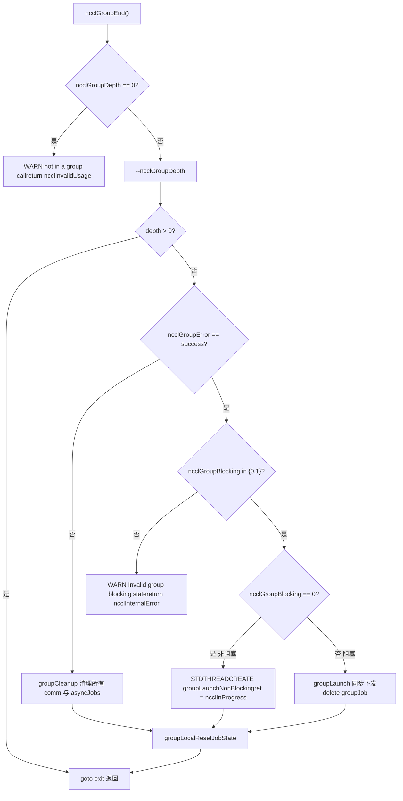

# Retour en haut ↑

# Version : Commit @12df1a11

Progression du livre : Chapitre 22 / 25

# Chapitre 22 : Dépannage en production et pièges courants : interblocages, timeouts, incompatibilités de version et solutions de diagnostic

## Dans le chapitre précédent, nous avons passé en revue l'ordre de diagnostic et les leviers clés de l'optimisation des performances, mais les défaillances de NCCL en production ne se traduisent souvent pas par des performances insuffisantes, mais par un blocage ou un crash direct du programme. La cause racine de ces défaillances n'est généralement pas une erreur dans une fonction, mais la violation de l'ordre d'appel, du cycle de vie ou du contrat de version. Ce chapitre se concentre sur quatre catégories de pièges parmi les plus typiques : les interblocages dus à un mauvais usage de la sémantique de group, les erreurs silencieuses dues à l'absence de validation des paramètres, les incompatibilités de version ABI, et les limites des timeouts et des tentatives de reprise. Nous suivrons quatre pistes — src/group.cc, src/misc/argcheck.cc, src/include/checks.h et contrib/nccl_ep/nccl_ep.cc — pour voir comment NCCL intercepte ces problèmes avant qu'ils ne surviennent.

Mauvais usage de la sémantique de Group : pourquoi "oublier un GroupEnd" provoque un blocage`ncclGroupStart()` / `ncclGroupEnd()`Modèle intuitif : Group est un "panier d'achat", pas un "interrupteur d'accélération"`ncclGroupEnd`Imaginez`ncclGroupDepth`comme un panier d'achat en ligne : vous y placez plusieurs articles (plusieurs appels de communication), puis vous payez en une seule fois (

> **[Design Inference & Architectural Trade-offs]**
> C'est la forme d'interblocage la plus courante en production : le code, dans une branche d'exception,`return`, saute`ncclGroupEnd`, et`ncclGroupDepth`est`thread_local`, il ne sera pas nettoyé automatiquement lors du retour de la fonction.

## Structure de données : l'état du group en thread_local

NCCL place tout l'état du group dans le stockage local au thread, c'est la clé pour comprendre l'interblocage.

[FACT:src/group.cc:34-34]

```cpp
thread_local int ncclGroupDepth = 0; // depth of ncclGroupStart nesting
thread_local ncclResult_t ncclGroupError = ncclSuccess;
thread_local struct ncclComm* ncclGroupCommHead[ncclGroupTaskTypeNum] = {nullptr};
thread_local struct ncclComm* ncclGroupCommPreconnectHead = nullptr;
thread_local struct ncclIntruQueue ncclAsyncJobs;
thread_local int ncclGroupBlocking = -1; /* default mode */
```

Interprétation champ par champ :

- `ncclGroupDepth`: profondeur d'imbrication.`ncclGroupStart`s'incrémente,`ncclGroupEnd`se décrémente, et ce n'est que lorsqu'il atteint 0 que la soumission est réellement déclenchée. Le support de l'imbrication est une commodité de conception, mais cela signifie aussi qu'un « End oublié » fera que la profondeur restera bloquée à 1 pour toujours.
- `ncclGroupError`: les erreurs de group accumulées par ce thread. Dès qu'un appel échoue, les`ncclGroupEnd`suivants emprunteront directement le chemin d'échec.
- `ncclGroupCommHead[]`: les têtes de liste chaînée des domaines de communication, regroupées par type de tâche (collective / rawTask / mgmtTask / symRegister).
- `ncclAsyncJobs`: la file des tâches asynchrones en attente d'exécution (par exemple preconnect, symmetric register).
- `ncclGroupBlocking`：`-1`signifie « aucun domaine de communication encore rencontré »,`0`signifie non bloquant,`1`signifie bloquant. Ce champ est le cœur de la détection ultérieure du « mélange bloquant et non bloquant ».

> **[Design Inference & Architectural Trade-offs]**
> La motivation d'utiliser`thread_local`plutôt qu'une variable globale est directe : NCCL permet à plusieurs threads de détenir chacun un contexte de group indépendant, sans interférence mutuelle. Le coût : ces états ne sont pas nettoyés automatiquement à la sortie du thread ; si le thread se termine au milieu d'un group, l'état fuit.

## Step-by-Step : la chaîne complète de validation d'un GroupEnd

Mise en situation : l'application appelle`ncclGroupEnd()`, à ce moment`ncclGroupDepth`vaut 1.

Première étape, vérifier si l'on est réellement dans un group :

[FACT:src/group.cc:1048-1052]

```cpp
  if (ncclGroupDepth == 0) {
    WARN("ncclGroupEnd: not in a group call.");
    ret = ncclInvalidUsage;
    goto exit;
  }
```

Si l'utilisateur n'a pas appelé`ncclGroupStart`et fait directement`ncclGroupEnd`, ici sera affiché « not in a group call » et retourné`ncclInvalidUsage`. C'est l'erreur la plus conviviale — signaler immédiatement, sans blocage.

Deuxième étape, décrémenter la profondeur et déterminer s'il s'agit du niveau le plus externe :

[FACT:src/group.cc:1061-1063]

```cpp
  if ((--ncclGroupDepth) > 0) goto exit;

  if ((ret = ncclGroupError) != ncclSuccess) goto fail;
```

Si plusieurs niveaux sont imbriqués, le`End`interne se contente de décrémenter la profondeur et retourne, sans déclencher la soumission. Seul le niveau le plus externe continue. En même temps, les erreurs accumulées sont vérifiées.

Troisième étape, valider la cohérence du mode bloquant. C'est le point de détection du « mélange bloquant et non bloquant » :

[FACT:src/group.cc:1095-1101]

```cpp
  if (hasCommHead || !ncclIntruQueueEmpty(&groupJob->asyncJobs) || ncclGroupCommPreconnectHead != nullptr) {
    /* make sure ncclGroupBlocking has been set. */
    if (ncclGroupBlocking != 0 && ncclGroupBlocking != 1) {
      WARN("Invalid group blocking state %d", ncclGroupBlocking);
      ret = ncclInternalError;
      goto fail;
    }
```

`ncclGroupBlocking`doit être entre`{0, 1}`. S'il est encore`-1`, cela signifie que le group ne contient ni domaine de communication ni tâche asynchrone, et logiquement on ne devrait pas arriver ici.

Quatrième étape, bifurquer selon le mode bloquant. Le non bloquant passe par la soumission asynchrone du thread, le bloquant par la soumission synchrone :

[FACT:src/group.cc:1102-1134]

```cpp
    if (ncclGroupBlocking == 0) {
      /* nonblocking group */
      if (!ncclIntruQueueEmpty(&groupJob->asyncJobs)) {
        ncclAsyncJob* job = ncclIntruQueueHead(&groupJob->asyncJobs);
        do {
          NCCLCHECKGOTO(ncclCommSetAsyncError(job->comm, ncclInProgress), ret, fail);
          if (job->comm->groupJob == NULL) {
            job->comm->groupJob = groupJob;
            groupJob->groupRefCount++;
          }
          job = job->next;
        } while (job);
      }
      ...
      groupJob->base.func = groupLaunchNonBlocking;
      STDTHREADCREATE_GOTO(groupJob->base.thread, ncclAsyncJobMain, ret, fail, &groupJob->base);
      groupJob->nonBlockingInit = true;
      ret = ncclInProgress;
    }
```

Attention à`groupRefCount++`et`ret = ncclInProgress`: en mode non bloquant,`ncclGroupEnd`retourne immédiatement`ncclInProgress`, la véritable soumission s'exécute dans un thread d'arrière-plan. L'appelant doit ensuite utiliser`ncclCommGetAsyncError`pour interroger, ou`ncclGroupJobComplete`pour attendre.

## Mélange bloquant et non bloquant : pourquoi c'est interdit

Revenons à`ncclAsyncLaunch`, regardons la détection de mélange :

[FACT:src/group.cc:55-64]

```cpp
    /* check if there are blocking and nonblocking comms at the same time in group. */
    if (comm->destroyFlag) {
      ncclGroupBlocking = 1;
    } else if (ncclGroupBlocking == -1) {
      /* first met communicator */
      ncclGroupBlocking = comm->config.blocking;
    } else if (ncclGroupBlocking != comm->config.blocking) {
      WARN("Blocking and nonblocking communicators are not allowed in the same group.");
      ret = ncclInvalidArgument;
    }
```

> **[Design Inference & Architectural Trade-offs]**
> Pourquoi interdire le mélange ? Parce que la sémantique de soumission d'un domaine de communication bloquant est « le kernel est soumis au retour de l'appel », tandis que le non bloquant est « la tâche est mise en file mais non soumise au retour de l'appel ». Si les deux se trouvent dans le même group,`ncclGroupEnd`ne peut pas fournir une sémantique de retour unifiée — faut-il attendre ou non ? NCCL choisit de refuser directement, exposant le problème à la frontière de l'API.

## Pièges de production : trois scénarios réels

**Scénario un : une branche d'exception omet le GroupEnd.**Le code, entre`ncclGroupStart`et`ncclGroupEnd`, lève une exception ou fait un`return`，`ncclGroupDepth`anticipé, la profondeur reste bloquée à 1. Tous les appels de communication suivants entrent en état d'« accumulation » et ne sont jamais soumis. Méthode de diagnostic : afficher`ncclGroupEnd`avant`ncclGroupDepth`, ou utiliser`gdb`pour observer cette variable thread_local.

**Scénario deux : utilisation du même comm à travers les threads.**Comme l'état du group est`thread_local`, après que le thread A a appelé`ncclGroupStart`, le thread B appelant`ncclAllReduce`n'entrera pas dans le group de A. Si A et B opèrent sur le même comm, il se produira un désordre où « une partie des appels est dans le group, une autre en dehors ». NCCL ne détecte pas ce cas, car il suppose qu'un comm n'est opéré que par un seul thread à un instant donné.

**Scénario trois : interaction entre CUDA graph capture et group.**Regardons la détection dans`doLaunches`:

[FACT:src/group.cc:448-455]

```cpp
    if (capturingYes && capturingNo) {
      // We have entered barriers but are aborting without leaving them. Thus
      // these comms are permanently trashed. We need a good mechanism for
      // tracking and reporting that.
      WARN("Either none or all communicators in a ncclGroup() can be CUDA graph captured.");
      result = ncclInvalidUsage;
      goto failure;
    }
```

Le commentaire est très explicite : une fois entré dans la barrier puis abandonné en cours de route, ces comm sont « définitivement corrompus ». La règle est donc — tous les domaines de communication d'un group doivent soit tous être dans le capture, soit tous ne pas y être. Le mélange entraîne une incohérence d'état des comm, et NCCL n'a actuellement pas de bon mécanisme de récupération.



# Validation des paramètres et erreurs silencieuses : comment ArgCheck bloque les appels « qui semblent normaux »

## Modèle intuitif : ArgCheck est le « contrôle de sécurité à l'aéroport »

La validation des paramètres est comme le contrôle de sécurité à l'aéroport : elle n'est pas chargée de vous faire voler plus vite, mais elle peut bloquer ces choses « qui ressemblent à des bagages mais sont en réalité des produits dangereux ». Sans elle, un pointeur avec un mauvais device ferait lire des données corrompues au kernel GPU, ou pire — écrire silencieusement dans la mémoire d'autrui.

## Structure de données : mode de validation et file de vérification globale

La validation des paramètres de NCCL n'est pas « tout vérifier à chaque fois », mais fonctionne par mode. Le cœur est`comm->checkMode`：

[FACT:src/misc/argcheck.cc:227-251]

```cpp
  if (info->comm->checkMode != ncclCheckModeDefault) {
    if ((info->coll == ncclFuncSend || info->coll == ncclFuncRecv)) {
      if (info->count > 0) NCCLCHECK(CudaPtrCheck(info->recvbuff, info->comm, "buff", info->opName));
    } else if (info->coll == ncclFuncPutSignal || info->coll == ncclFuncSignal || info->coll == ncclFuncWaitSignal) {
      // One-sided RMA ops specify the remote destination via peerWin, not sendbuff/recvbuff,
      // so the standard CUDA pointer checks do not apply here.
      INFO(NCCL_COLL, "%s : skipping sendbuff/recvbuff pointer check (one-sided RMA uses peerWin)", info->opName);
    } else {
      // Check CUDA device pointers
      if (info->coll != ncclFuncBroadcast || info->comm->rank == info->root) {
        NCCLCHECK(CudaPtrCheck(info->sendbuff, info->comm, "sendbuff", info->opName));
      }
      if (info->coll != ncclFuncReduce || info->comm->rank == info->root) {
        NCCLCHECK(CudaPtrCheck(info->recvbuff, info->comm, "recvbuff", info->opName));
      }
    }

    if (info->comm->checkMode == ncclCheckModeDebugGlobal) {
      struct ncclArgsInfo* argsInfo;
      NCCLCHECK(ncclCalloc(&argsInfo, 1));
      argsInfo->info = *info;
      argsInfo->next = NULL;
      ncclIntruQueueEnqueue(&info->comm->argsInfoQueue, argsInfo);
    }
  }
```

Trois modes :

- `ncclCheckModeDefault`: ne fait que les vérifications les moins coûteuses (plage de root, plage de datatype, plage d'op), sans toucher à l'API CUDA.
- Mode non par défaut : appelle`CudaPtrCheck`, ce qui appelle réellement`cudaPointerGetAttributes`, avec un coût de performance.
- `ncclCheckModeDebugGlobal`: en plus des vérifications locales, met`ncclInfo`dans`argsInfoQueue`, effectuer une vérification de cohérence globale inter-rank à la fin du groupe.

> **[Design Inference & Architectural Trade-offs]**
> Cette conception est un compromis entre performance et exactitude :`cudaPointerGetAttributes`est un appel CUDA synchrone ; l'appeler à chaque communication sur le chemin critique ralentirait considérablement les petits messages. Le mode par défaut ne fait donc qu'une vérification « à coût nul », laissant la validation coûteuse des pointeurs au mode débogage.

## Étape par étape : les trois lignes de défense de CudaPtrCheck

Mise en situation : l'utilisateur passe un`sendbuff`, NCCL le valide en mode débogage.

Première couche, validité du pointeur :

[FACT:src/misc/argcheck.cc:12-18]

```cpp
ncclResult_t CudaPtrCheck(const void* pointer, struct ncclComm* comm, const char* ptrname, const char* opname) {
  cudaPointerAttributes attr;
  cudaError_t err = cudaPointerGetAttributes(&attr, pointer);
  if (err != cudaSuccess || attr.devicePointer == NULL) {
    WARN("%s : %s %p is not a valid pointer", opname, ptrname, pointer);
    return ncclInvalidArgument;
  }
```

`cudaPointerGetAttributes`renvoie une erreur pour un pointeur invalide, ou`devicePointer`vaut NULL. Cela bloque le cas « on a passé une adresse de pile hôte » ou « on a passé un pointeur déjà libéré ».

Deuxième couche, correspondance du périphérique :

[FACT:src/misc/argcheck.cc:19-26]

```cpp
#if CUDART_VERSION >= 10000
  if (attr.type == cudaMemoryTypeDevice && attr.device != comm->cudaDev) {
#else
  if (attr.memoryType == cudaMemoryTypeDevice && attr.device != comm->cudaDev) {
#endif
    WARN("%s : %s allocated on device %d mismatchs with NCCL device %d", opname, ptrname, attr.device, comm->cudaDev);
    return ncclInvalidArgument;
  }
```

C'est le piège le plus sournois : le pointeur est un pointeur GPU valide, mais il appartient à un autre GPU. Sur une machine multi-GPU, si l'utilisateur oublie`cudaSetDevice`, il est très facile de se tromper. NCCL refuse explicitement ici.

Troisième couche, intégrité de l'objet domaine de communication :

[FACT:src/misc/argcheck.cc:38-45]

```cpp
ncclResult_t CommCheck(struct ncclComm* comm, const char* opname, const char* ptrname) {
  NCCLCHECK(PtrCheck(comm, opname, ptrname));
  if (comm->startMagic != NCCL_MAGIC || comm->endMagic != NCCL_MAGIC) {
    WARN("Error: corrupted comm object detected");
    return ncclInvalidArgument;
  }
  return ncclSuccess;
}
```

`startMagic` / `endMagic`est une valeur sentinelle placée au début et à la fin de la structure`ncclComm`. Si l'utilisateur passe un pointeur sauvage, ou si comm a déjà été libéré, le magic ne correspond plus. C'est la technique classique de « détection de corruption mémoire » — encadrer la structure avec deux sentinelles, toute écriture hors limites étant susceptible d'en corrompre une.

## Vérification de cohérence globale : la validation inter-rank de registrationCheck

C'est la validation la plus « lourde » de NCCL, déclenchée uniquement sous`ncclCheckModeDebugGlobal`. Elle vérifie si l'état d'enregistrement de la mémoire symétrique est cohérent sur tous les ranks.

[FACT:src/misc/argcheck.cc:95-111]

```cpp
  NCCLCHECKGOTO(bootstrapAllGather(comm->bootstrap, bufInfo, sizeof(struct symBufInfo) * 2), ret, fail);

  cmpBufInfo[0] = bufInfo[0];
  cmpBufInfo[1] = bufInfo[1];
  for (int r = 1; r nRanks; r++) {
    int infoIdx = r * 2;
    if (cmpBufInfo[0].isSymRegistered != bufInfo[infoIdx].isSymRegistered ||
        cmpBufInfo[1].isSymRegistered != bufInfo[infoIdx + 1].isSymRegistered) {
      if (comm->rank == 0) {
        WARN("Coll %s size %ld symmetric registration check failed on rank %d: sendReg %d recvReg %d mismatch with "
             "rank 0 sendReg %d recvReg %d",
             info->opName, size, r, bufInfo[infoIdx].isSymRegistered, bufInfo[infoIdx + 1].isSymRegistered,
             cmpBufInfo[0].isSymRegistered, cmpBufInfo[1].isSymRegistered);
      }
      ret = ncclInvalidArgument;
      goto fail;
    }
```

Elle collecte le`allGather`de chaque rank via le`(isSymRegistered, bigOffset, userOffset)`du bootstrap, puis les compare rank par rank. Si le send buffer du rank 0 a enregistré de la mémoire symétrique et que le rank 3 ne l'a pas fait, une erreur est signalée ici.

> **[Design Inference & Architectural Trade-offs]**
> Pourquoi cette vérification est-elle importante ? La mémoire symétrique (symmetric memory) exige que tous les ranks accèdent aux buffers via le même ensemble d'adresses virtuelles. Si le buffer d'un rank n'est pas enregistré, l'adresse calculée dans le kernel est fausse, ce qui entraîne des lectures de données parasites ou un dépassement de limites. Ce type d'erreur se manifeste à l'exécution par des « résultats parfois incorrects », extrêmement difficiles à diagnostiquer. NCCL choisit de la bloquer à la frontière de l'API au prix d'un allGather.

## Pièges en production

**Piège un : en mode par défaut, les erreurs de pointeur ne sont pas signalées.**Si l'utilisateur n'active pas le mode débogage et passe un pointeur vers un mauvais périphérique, NCCL ne signalera pas d'erreur à l'étape`ArgsCheck`, mais ne le découvrira qu'à l'exécution du kernel — alors qu'il a peut-être déjà corrompu la mémoire d'un autre rank. Il est recommandé d'utiliser`NCCL_DEBUG=WARN`avec`checkMode`en débogage pendant le développement.

**Piège deux :`ncclCheckModeDebugGlobal`le coût de l'allGather.**Chaque communication effectue un bootstrap allGather, ce qui devient un goulot d'étranglement dans les scénarios de petits messages à haute fréquence. Ce mode ne convient qu'au débogage, pas à la production.

**Piège trois : le cycle de vie de userRedOp.**Regardez ce passage :

[FACT:src/misc/argcheck.cc:220-225]

```cpp
  int opIx = int(ncclUserRedOpMangle(info->comm, info->op)) - int(ncclNumOps);
  if (ncclNumOps op &&
      (info->comm->userRedOpCapacity comm->userRedOps[opIx].freeNext != -1)) {
    WARN("%s : reduction operation %d unknown to this communicator", info->opName, info->op);
    return ncclInvalidArgument;
  }
```

L'op de réduction personnalisée de l'utilisateur est enregistrée sur comm. Si l'utilisateur passe un op « qui a été enregistré mais déjà libéré »,`freeNext != -1`détectera qu'il a été recyclé. C'est une vérification pour empêcher les « handles d'op suspendus ».

# Macros de propagation d'erreurs : comment la famille NCCLCHECK garantit que « les erreurs ne se perdent pas »

## Modèle intuitif : les macros de propagation d'erreurs sont un « témoin de relais »

La gestion des erreurs de NCCL repose sur un relais de macros : la fonction de bas niveau renvoie`ncclResult_t`, la couche supérieure vérifie avec`NCCLCHECK`et retourne immédiatement en cas d'échec. C'est comme une course de relais — le témoin (le code d'erreur) doit être transmis jusqu'au bout ; si un relais le lâche, toute la chaîne est rompue.

## Structures de données : vue d'ensemble de la famille de macros

[FACT:src/include/checks.h:148-166]

```cpp
#define NCCLCHECK(call) \
  do { \
    ncclResult_t RES = call; \
    if (RES != ncclSuccess && RES != ncclInProgress) { \
      /* Print the back trace*/ \
      if (ncclDebugNoWarn == 0) INFO_LOC(NCCL_ALL, "-> %d", RES); \
      return RES; \
    } \
  } while (0)

#define NCCLCHECKGOTO(call, RES, label) \
  do { \
    RES = call; \
    if (RES != ncclSuccess && RES != ncclInProgress) { \
      /* Print the back trace*/ \
      if (ncclDebugNoWarn == 0) INFO_LOC(NCCL_ALL, "-> %d", RES); \
      goto label; \
    } \
  } while (0)
```

Détails clés :`ncclInProgress`est considéré comme « non-erreur ». C'est le cœur de la communication non bloquante —`ncclGroupEnd`renvoie`ncclInProgress`signifie « tâche soumise, pas encore terminée » ; l'appelant doit continuer à interroger plutôt que traiter cela comme une erreur.

`NCCLCHECK`saute directement à`return`，`NCCLCHECKGOTO`vers`label`. Ce dernier est utilisé pour les scénarios nécessitant le nettoyage des ressources.

## Chemin de nettoyage : NCCLCHECKIGNORE conserve la première erreur

[FACT:src/include/checks.h:168-177]

```cpp
// Report failure but continue - useful for cleanup paths where we want to
// attempt all cleanup steps. Preserves the first error in RES.
#define NCCLCHECKIGNORE(call, RES) \
  do { \
    ncclResult_t TMPRES = call; \
    if (TMPRES != ncclSuccess && TMPRES != ncclInProgress) { \
      if (ncclDebugNoWarn == 0) INFO_LOC(NCCL_ALL, "-> %d", TMPRES); \
      if (RES == ncclSuccess) RES = TMPRES; \
    } \
  } while (0)
```

Le commentaire est clair : sur le chemin de nettoyage, il faut « tenter toutes les étapes de nettoyage » sans être interrompu par la première erreur. Mais le code d'erreur doit conserver le premier — car la première erreur est généralement la cause racine la plus utile au diagnostic.

## Attente et abandon : vérification de abortFlag dans NCCLWAIT

[FACT:src/include/checks.h:196-205]

```cpp
#define NCCLWAIT(call, cond, abortFlagPtr) \
  do { \
    uint32_t* tmpAbortFlag = (abortFlagPtr); \
    ncclResult_t RES = call; \
    if (RES != ncclSuccess && RES != ncclInProgress) { \
      if (ncclDebugNoWarn == 0) INFO_LOC(NCCL_ALL, "-> %d", RES); \
      return ncclInternalError; \
    } \
    if (COMPILER_ATOMIC_LOAD(tmpAbortFlag, std::memory_order_acquire)) NEQCHECK(*tmpAbortFlag, 0); \
  } while (!(cond))
```

C'est le modèle d'attente par interrogation : à chaque itération, appeler`call`(faire progresser), vérifier`cond`(si satisfait), et vérifier`abortFlag`(si abandonné).`abortFlag`utilise`memory_order_acquire`pour le chargement, garantissant la visibilité du signal d'abandon écrit par d'autres threads.

> **[Design Inference & Architectural Trade-offs]**
> Cette conception résout un problème classique : lorsqu'un rank tombe en erreur, les autres ranks peuvent encore attendre indéfiniment ses données.`abortFlag`est le mécanisme de propagation du signal d'abandon entre ranks — une fois défini, toutes les boucles d'attente se terminent.

## Macros sécurisées pour la création de threads et l'allocation mémoire

[FACT:src/include/checks.h:237-256]

```cpp
#define STDTHREADCREATE_IMPL(var, func, error_action, ...) \
  do { \
    try { \
      (var) = std::thread(func, __VA_ARGS__); \
    } catch (const std::exception& e) { \
      WARN("Thread creation failed: %s", e.what()); \
      error_action; \
    } \
  } while (0)

#define STDTHREADCREATE(var, func, ...) STDTHREADCREATE_IMPL(var, func, return ncclSystemError, __VA_ARGS__)

#define STDTHREADCREATE_GOTO(var, func, RES, label, ...) \
  STDTHREADCREATE_IMPL( \
    var, func, \
    do { \
      RES = ncclSystemError; \
      goto label; \
    } while (0), \
    __VA_ARGS__)
```

`std::thread`un échec de construction lève une exception (par exemple, nombre de threads dépassé). Cette macro convertit l'exception en`ncclSystemError`, évitant que l'exception ne traverse la frontière de l'API C.

[FACT:src/include/checks.h:258-275]

```cpp
#define NEW_NOTHROW(var, x) \
  do { \
    (var) = new (std::nothrow) x{}; \
    if (!(var)) { \
      WARN("Allocation failed"); \
      return ncclSystemError; \
    } \
  } while (0)
```

`new (std::nothrow)`renvoie nullptr en cas d'échec d'allocation plutôt que de lever une exception. C'est la pratique standard du code C++ à la frontière de l'API C.

## Pièges en production

**Piège un :`ncclInProgress`est pris à tort pour un succès.**Certains codes utilisateurs écrivent`if (ret == ncclSuccess)`pour juger du succès, mais en mode non bloquant, ce qui est renvoyé est`ncclInProgress`. La bonne pratique est`if (ret == ncclSuccess || ret == ncclInProgress)`, ou d'utiliser`ncclCommGetAsyncError`pour interroger.

**Piège deux :`NCCLCHECK`à utiliser dans le destructeur.**Si utilisé dans le destructeur`NCCLCHECK`, l'erreur va directement`return`, en sautant le nettoyage ultérieur. Il faut utiliser`NCCLCHECKIGNORE`。

# Incompatibilité de version ABI : la conception basée sur la taille de nccl_ep

## Modèle intuitif : l'ABI est une « norme de prise »

L'ABI (Application Binary Interface) est comme une norme de prise électrique : si la bibliothèque et l'appelant ont une compréhension différente de « à quoi ressemble la structure », c'est comme brancher une prise américaine dans une prise européenne — au mieux ça ne fonctionne pas, au pire ça brûle.`contrib/nccl_ep`utilise une conception astucieuse : chaque structure traversant les frontières commence par un champ`size`.

## Structure de données : double validation size + magic

[FACT:contrib/nccl_ep/nccl_ep.cc:70-76]

```cpp
// Size-based ABI versioning: every cross-boundary struct starts with a `size`
// field set by the caller to sizeof(struct). The library checks that against
// its own known size; any mismatch means caller and library are from different
// releases. Strict equality for now — see nccl_ep.h for the planned future
// relaxation (all-zero-trailing-bytes escape hatch).
// Immediately after `size` there is a `magic` field pre-filled by NCCL_EP_*_INIT
// to catch unininitialized structures.
```

Points clés de la conception :

- `size`Le champ est rempli par l'appelant avec`sizeof(struct)`, la bibliothèque vérifie s'il est égal à la taille qu'elle connaît.
- `magic`Le champ est pré-rempli par la macro`NCCL_EP_*_INIT`, pour détecter les structures « non initialisées ».
- Actuellement c'est une égalité stricte, il est prévu à l'avenir de supporter un mode permissif où « si la queue est entièrement à zéro, une taille plus petite est autorisée ».

## Step-by-Step : le processus de validation de EP_REQUIRE_STRUCT

[FACT:contrib/nccl_ep/nccl_ep.cc:77-80]

```cpp
#define EP_REQUIRE_STRUCT(ptr) \
    do { \
        assert( \
            (ptr) != nullptr && (ptr)->size == sizeof(*(ptr)) && \
```

Cette macro est appelée aux points d'entrée tels que`ncclEpDispatch`、`ncclEpCombine`:

[FACT:contrib/nccl_ep/nccl_ep.cc:2827-2830]

```cpp
    EP_REQUIRE_STRUCT(inputs);
    EP_REQUIRE_STRUCT(outputs);
    EP_OPTIONAL_LAYOUT_INFO(layout_info);
    EP_OPTIONAL_STRUCT(config);
```

`inputs`et`outputs`sont des paramètres obligatoires, utiliser`EP_REQUIRE_STRUCT`；`layout_info`et`config`sont des paramètres optionnels, utiliser`EP_OPTIONAL_*`。

## Lecture de champ sûre en version : layoutInfoRecvTopkIdxKind

C'est la partie la plus ingénieuse — comment lire un champ en toute sécurité lorsque « la structure de l'appelant peut être plus petite ».

[FACT:contrib/nccl_ep/nccl_ep.cc:139-144]

```cpp
// Safe field reader for ncclEpLayoutInfo_t::recv_topk_idx_kind. Returns AUTO
// when the caller's struct (size) does not cover the field, preserving the
// pre-flag default.
static inline ncclEpExpertIdKind_t layoutInfoRecvTopkIdxKind(const ncclEpLayoutInfo_t* lip) {
    if (lip == nullptr) return NCCL_EP_EXPERT_ID_AUTO;
    constexpr size_t field_end = offsetof(ncclEpLayoutInfo_t, recv_topk_idx_kind) + sizeof(ncclEpExpertIdKind_t);
    if (lip->size recv_topk_idx_kind;
}
```

La logique est : si le`size`de l'appelant est inférieur à « l'offset de fin de ce champ », cela signifie que l'appelant utilise une ancienne version de la structure, ce champ n'existe pas, retourner la valeur par défaut`AUTO`. Sinon, lire normalement.

> **[Design Inference & Architectural Trade-offs]**
> C'est la méthode standard de compatibilité ABI : les nouveaux champs ne peuvent être ajoutés qu'à la fin de la structure, et lors de la lecture on utilise`size`pour déterminer si le champ existe. Ainsi, les anciens appelants utilisent l'ancienne structure, et la nouvelle bibliothèque peut aussi la traiter correctement.

## Vérification du numéro de version : avertissement logiciel plutôt que rejet strict

[FACT:contrib/nccl_ep/nccl_ep.cc:1393-1400]

```cpp
    if (in_config->version != NCCL_EP_API_VERSION) {
        fprintf(
            stderr,
            "NCCL EP WARN: ncclEpGroupConfig_t.version=%u, library API_VERSION=%u; "
            "behavior may differ across versions.\n",
            in_config->version,
            (unsigned)NCCL_EP_API_VERSION);
    }
```

Notez qu'ici c'est`WARN`et non`return error`. L'incompatibilité de numéro de version n'est qu'un avertissement, car la vérification`size`garantit déjà la sécurité de la disposition mémoire. Le numéro de version est plutôt une indication que « le comportement peut différer ».

## Pièges en production

**Piège 1 : oublier d'initialiser avec la macro INIT.**Si l'utilisateur met manuellement`memset`la structure à 0,`magic`sera 0,`EP_REQUIRE_STRUCT`échouera. Il faut utiliser la macro`NCCL_EP_*_INIT`.

**Piège 2 : mélanger des bibliothèques dynamiques de versions différentes.**Si l'application est liée à une nouvelle version de`libnccl_ep.so`, mais que l'en-tête est une ancienne version,`sizeof(struct)`sera incohérent,`EP_REQUIRE_STRUCT`signalera immédiatement une erreur. C'est l'intention de conception — échouer rapidement vaut mieux qu'une erreur silencieuse.

**Piège 3 :`EP_OPTIONAL_LAYOUT_INFO`la vérification de plage.**Regardez ce passage :

[FACT:contrib/nccl_ep/nccl_ep.cc:114-123]

```cpp
            if ((ptr)->size size > sizeof(*(ptr))) { \
                fprintf( \
                    stderr, \
                    "NCCL EP: ncclEpLayoutInfo_t size out of supported range: " \
                    "got %u, expected [%zu, %zu]\n", \
                    (ptr)->size, \
                    kNcclEpLayoutInfoMinSize, \
                    sizeof(*(ptr))); \
                return ncclInvalidArgument; \
            } \
```

`layout_info`autorise une taille dans la plage`[min, sizeof]`, ce qui est plus permissif que l'égalité stricte de`EP_REQUIRE_STRUCT`. La raison est que`layout_info`est un paramètre optionnel, et que historiquement les champs ont été ajoutés et supprimés.

```mermaid
flowchart TD
    entry["ncclEpDispatch(inputs, outputs, layout_info, config)"] --> req_inputs{"EP_REQUIRE_STRUCT(inputs)size == sizeof?"}
    req_inputs -->|否| err_size["assert 失败 / 返回错误"]
    req_inputs -->|是| req_outputs{"EP_REQUIRE_STRUCT(outputs)"}
    req_outputs -->|否| err_size
    req_outputs -->|是| opt_layout{"layout_info != nullptr?"}
    opt_layout -->|否| skip_layout["跳过 layout 校验"]
    opt_layout -->|是| range_check{"size in [min, sizeof]?"}
    range_check -->|否| err_range["fprintf size out of rangereturn ncclInvalidArgument"]
    range_check -->|是| magic_check{"magic == NCCL_EP_MAGIC?"}
    magic_check -->|否| err_magic["fprintf magic mismatchreturn ncclInvalidArgument"]
    magic_check -->|是| read_field["layoutInfoRecvTopkIdxKindsize  read_field
    read_field --> proceed["继续执行 dispatch 逻辑"]
```

# Timeout, retry et abandon : de NCCLWAIT au timeout_cycles de nccl_ep

## Modèle intuitif : le timeout est un « fusible »

Dans la communication distribuée, un rank bloqué fait que tous les ranks attendent indéfiniment. Le mécanisme de timeout est comme un fusible : en temps normal il n'agit pas, mais dès que le courant est anormal il fond, évitant que tout le système ne brûle.

## Structure de données : abortFlag et timeout_cycles

Le cœur de NCCL utilise`abortFlag`pour propager le signal d'abandon. Regardez la transmission dans`ncclAsyncLaunch`:

[FACT:src/group.cc:49-52]

```cpp
    job->abortFlag = comm->abortFlag;
    job->abortFlagDev = comm->abortFlagDev;
    job->childAbortFlag = comm->childAbortFlag;
    job->childAbortFlagDev = comm->childAbortFlagDev;
```

Chaque job détient le pointeur abortFlag de comm. Quand le group détecte une erreur :

[FACT:src/group.cc:118-126]

```cpp
        if (!job->destroyFlag &&
            (COMPILER_ATOMIC_LOAD(groupAbortFlag, std::memory_order_acquire) || errorJobAbortFlag == true)) {
          COMPILER_ATOMIC_STORE(job->abortFlag, uint32_t(1), std::memory_order_release);
          COMPILER_ATOMIC_STORE(job->abortFlagDev, uint32_t(1), std::memory_order_release);
          if (job->childAbortFlag) {
            COMPILER_ATOMIC_STORE(job->childAbortFlag, uint32_t(1), std::memory_order_release);
            COMPILER_ATOMIC_STORE(job->childAbortFlagDev, uint32_t(1), std::memory_order_release);
          }
        }
```

Dès que`groupAbortFlag`ou`errorJobAbortFlag`est vrai, l'abortFlag de tous les jobs est mis à 1.`memory_order_release`garantit que les écritures précédentes sont visibles pour les autres threads.

## La conception du timeout de nccl_ep : cycles d'horloge GPU

`nccl_ep`utilise un timeout plus fin — en unités de cycles d'horloge GPU.

[FACT:contrib/nccl_ep/nccl_ep.cc:1558-1591]

```cpp
    // Resolve timeout_cycles: env var > config field > compile-time default
    {
        int dev;
        int clock_khz_int;
        CUDA_CHECK(cudaGetDevice(&dev));
        CUDA_CHECK(cudaDeviceGetAttribute(&clock_khz_int, cudaDevAttrClockRate, dev));
        uint64_t clock_khz = static_cast(clock_khz_int);

        uint64_t resolved = NUM_TIMEOUT_CYCLES;
        const char* source = "compile-time default";
        const uint64_t env_ms = static_cast(ep_group->env.timeout_ms.value.ul);
        // Only a positive timeout overrides the default.
        const bool have_env_ms = ep_group->env.timeout_ms.is_set && env_ms > 0;

        if (have_env_ms) {
            resolved = clock_khz * 1000ULL * env_ms / 1000ULL;
            source = "NCCL_EP_TIMEOUT_MS env var";
            ...
        } else if (ep_group->config.timeout_ns != 0) {
            resolved = clock_khz * 1000ULL * (ep_group->config.timeout_ns / 1000000ULL) / 1000ULL;
            source = "config.timeout_ns";
        }

        ep_group->timeout_cycles = resolved;
```

La priorité est : variable d'environnement`NCCL_EP_TIMEOUT_MS`> champ de configuration`timeout_ns`> valeur par défaut à la compilation. La formule de conversion est`clock_khz * 1000 * ms / 1000`, c'est-à-dire convertir les millisecondes en cycles d'horloge.

> **[Design Inference & Architectural Trade-offs]**
> Pourquoi utiliser des cycles d'horloge plutôt que des millisecondes ? Parce que la boucle d'attente dans le kernel GPU ne peut pas appeler l'API d'heure système, elle ne peut que lire le registre`clock64()`. En utilisant les cycles d'horloge pour le jugement de timeout, le kernel peut comparer directement, sans intervention du host.

## Indicateur d'erreur asynchrone : mémoire host-pinned

[FACT:contrib/nccl_ep/nccl_ep.cc:1767-1778]

```cpp
    // Allocate mask buffer and async error flag for active-mask support
    if (ep_group->config.enable_mask && ep_group->config.algorithm == NCCL_EP_ALGO_LOW_LATENCY) {
        size_t mask_bytes = ep_group->nRanks * sizeof(int);
        CUDA_CHECK(cudaMalloc(reinterpret_cast(&ep_group->mask_buffer), mask_bytes));
        // Initialize all ranks as active (1 = active, 0 = masked/failed)
        std::vector all_active(ep_group->nRanks, 1);
        CUDA_CHECK(
            cudaMemcpyAsync(ep_group->mask_buffer, all_active.data(), mask_bytes, cudaMemcpyHostToDevice, stream));
        CUDA_CHECK(
            cudaHostAlloc(reinterpret_cast(&ep_group->async_error_flag), sizeof(int), cudaHostAllocMapped));
        *ep_group->async_error_flag = 0;
    }
```

`async_error_flag`utilise`cudaHostAllocMapped`pour allouer, c'est de la mémoire host-pinned mappée dans l'espace d'adressage du device. Le kernel GPU peut y écrire, le host peut la lire, sans copie explicite.

## Lecture des erreurs asynchrones : chargement atomique

[FACT:contrib/nccl_ep/nccl_ep.cc:4312-4321]

```cpp
ncclResult_t ncclEpGetAsyncError(ncclEpGroup_t ep_group, int* error_out) {
    EP_HOST_ASSERT(ep_group != nullptr);
    if (!ep_group->config.enable_mask) {
        return ncclInvalidUsage;
    }
    EP_HOST_ASSERT(ep_group->async_error_flag != nullptr && "ncclEpGetAsyncError: enable_mask must be true");
    EP_HOST_ASSERT(error_out != nullptr);
    *error_out = __atomic_load_n(ep_group->async_error_flag, __ATOMIC_ACQUIRE);
    return ncclSuccess;
}
```

Utiliser`__atomic_load_n`avec`__ATOMIC_ACQUIRE`, pour garantir que la valeur lue est la plus récente écrite par le GPU, et non une ancienne valeur en cache.

## Pièges en production

**Piège 1 : un timeout trop court provoque des faux positifs.**Si`NCCL_EP_TIMEOUT_MS`est défini trop petit, une gigue réseau normale sera interprétée à tort comme un timeout. Il est recommandé de le définir selon le RTT réseau réel, généralement pas moins de 10 secondes.

**Piège 2 : abortFlag non nettoyé après avoir été défini.**Une fois abortFlag mis à 1, comm entre dans l'état « abandonné ». Si l'utilisateur veut continuer à utiliser ce comm, il doit d'abord nettoyer abortFlag. Le`ncclCommAbort`de NCCL fait ce nettoyage.

**Piège 3 :`ncclEpMaskClean`la précondition de**. Regardez ce passage :

[FACT:contrib/nccl_ep/nccl_ep.cc:4262-4266]

```cpp
    EP_HOST_ASSERT(ep_group->config.algorithm == NCCL_EP_ALGO_LOW_LATENCY);
    EP_HOST_ASSERT(
        ep_group->rdma_buffer != nullptr &&
        "ncclEpMaskClean: rdma_buffer not yet allocated; create at least one LL handle first");
    EP_HOST_ASSERT(ep_group->sync_buffer != nullptr && ep_group->sync_window != nullptr);
```

`ncclEpMaskClean`exige que`rdma_buffer`soit déjà alloué. Si l'utilisateur a créé un group mais n'a encore créé aucun handle LL,`rdma_buffer`est nullptr (car LL est alloué paresseusement), ici l'assert échouera.

# Résumé de ce chapitre

Ce chapitre relie quatre types de pièges en production :

1. **Mauvaise utilisation de la sémantique de Group**：`ncclGroupDepth`est thread_local, si on omet`ncclGroupEnd`Cela entraîne un blocage permanent ; les domaines de communication bloquants et non bloquants ne peuvent pas être mélangés ; la capture de graphe CUDA doit être tout ou rien.

2. **Validation des paramètres**：`ArgsCheck`Validation par mode, le mode par défaut n'effectue que des vérifications à coût nul ;`CudaPtrCheck`Trois lignes de défense bloquent les pointeurs invalides, les appareils erronés et les comm corrompus ;`registrationCheck`Effectuer une vérification de cohérence de la mémoire symétrique entre les ranks.

3. **Propagation des erreurs**：`NCCLCHECK`La famille garantit qu'aucune erreur n'est perdue ;`ncclInProgress`Ce n'est pas une erreur ;`NCCLCHECKIGNORE`Utilisé pour conserver la première erreur dans le chemin de nettoyage ;`NCCLWAIT`Vérifier abortFlag lors du polling.

4. **Version ABI**：`nccl_ep`Conception basée sur la taille, chaque structure traversant les frontières commence par`size`en tête, avec`magic`pour capturer les non-initialisés ; les nouveaux champs ne peuvent être ajoutés qu'à la fin, et lors de la lecture on utilise`size`pour déterminer s'ils existent.

5. **Délai d'attente et abandon**: le cœur utilise`abortFlag`pour propager l'abandon ;`nccl_ep`Utiliser les cycles d'horloge GPU pour le délai d'attente,`async_error_flag`Utiliser la mémoire host-pinned pour réaliser la notification asynchrone GPU→host.

# Réflexions et auto-évaluation de ce chapitre

Q1 : Si dans`ncclGroupEndInternal`on remplace`if ((--ncclGroupDepth) > 0) goto exit;`（[FACT:src/group.cc:1061]) par`if (ncclGroupDepth > 0) goto exit;`(sans décrémentation), que se passe-t-il ? Quelles seraient les conséquences dans un scénario de groupes imbriqués ?

**Analyse de référence**：

Le code original`--ncclGroupDepth`décrémente d'abord puis vérifie. Si on change pour ne pas décrémenter :

```cpp
if (ncclGroupDepth > 0) goto exit;  // 错误版本
```

Alors à chaque`ncclGroupEnd`la profondeur ne diminue jamais. Supposons que l'utilisateur écrive :

```cpp
ncclGroupStart();  // depth = 1
ncclGroupStart();  // depth = 2
ncclAllReduce(...);
ncclGroupEnd();    // 原版: depth = 1, 返回; 错误版: depth = 2, 返回
ncclGroupEnd();    // 原版: depth = 0, 触发下发; 错误版: depth = 2, 返回
```

Dans la version erronée, au deuxième`ncclGroupEnd`le`ncclGroupDepth`reste à 2,`> 0`est vrai, directement`goto exit`, et le déclenchement ne se produit jamais. Tous les appels de communication restent dans l'état "d'accumulation", le processus se bloque.

Plus insidieux encore :`ncclGroupDepth`est thread_local, il n'est pas réinitialisé par le retour de fonction. Même si le code suivant n'appelle plus l'API group, toutes les communications sur ce thread deviennent invalides.

Cette modification brise aussi la sémantique d'appariement de`ncclGroupStart`—`ncclGroupStart`incrémente,`ncclGroupEnd`ne décrémente pas, la profondeur ne fait qu'augmenter, et finit par déborder (bien qu'un débordement d'int nécessite 2 milliards d'appels, en pratique c'est plus probablement un blocage logique).

Q2: `CudaPtrCheck`Dans`attr.type == cudaMemoryTypeDevice && attr.device != comm->cudaDev`（[FACT:src/misc/argcheck.cc:20]) cette vérification, si on supprime`attr.type == cudaMemoryTypeDevice`cette condition, quel serait le problème ? Dans quels scénarios y aurait-il des faux positifs ?

**Réponse de référence**：

`cudaPointerAttributes.type`a trois valeurs possibles :`cudaMemoryTypeDevice`(mémoire device),`cudaMemoryTypeHost`(mémoire host),`cudaMemoryTypeManaged`(mémoire unifiée).

Si on supprime`attr.type == cudaMemoryTypeDevice`la condition, cela devient :

```cpp
if (attr.device != comm->cudaDev) {  // 错误版本
```

Alors pour la mémoire host ou la mémoire managed,`attr.device`peut être -1 ou 0, ce qui ne correspond pas à`comm->cudaDev`, et déclencherait un faux positif "appareil non correspondant".

Scénario concret : l'utilisateur passe un pointeur alloué par`cudaMallocManaged`. Le`attr.device`de la mémoire managed est généralement l'appareil au moment de l'allocation, mais si la mémoire est migrée vers un autre appareil,`attr.device`peut changer. Plus courant encore, la mémoire host (par exemple la mémoire pinned allouée par`cudaHostAlloc`),`attr.device`vaut -1, différent de tout`cudaDev`, ce qui provoque un faux positif.

NCCL autorise la mémoire host comme tampon de communication (via`cudaMemcpy`comme intermédiaire), il faut donc distinguer "mémoire device mais mauvais appareil" et "mémoire non-device". Le premier est une erreur, le second est légitime.

Q3: `layoutInfoRecvTopkIdxKind`（[FACT:contrib/nccl_ep/nccl_ep.cc:139-144]) on utilise`lip->size < field_end`pour déterminer si un champ existe. Si la nouvelle version insère un champ au milieu de la structure (et non à la fin), comment cette vérification échoue-t-elle ? Pourquoi la conception ABI impose-t-elle que les nouveaux champs ne soient ajoutés qu'à la fin ?

**Analyse de référence**：

Supposons que la structure originale soit :

```c
struct ncclEpLayoutInfo_t {
    unsigned int size;
    unsigned int magic;
    ncclEpExpertIdKind_t recv_topk_idx_kind;  // offset = 8
};
```

`field_end = offsetof(recv_topk_idx_kind) + sizeof(...) = 8 + 4 = 12`。

Si la nouvelle version insère un champ entre`magic`et`recv_topk_idx_kind`:

```c
struct ncclEpLayoutInfo_t {
    unsigned int size;
    unsigned int magic;
    unsigned int new_field;                    // 新插入
    ncclEpExpertIdKind_t recv_topk_idx_kind;  // offset 变成 12
};
```

À ce moment`field_end = 12 + 4 = 16`. Le`size`de l'ancien appelant est 12 (taille de l'ancienne structure),`12 < 16`est vrai, la fonction retourne`AUTO`— mais l'ancien appelant possède en fait le champ`recv_topk_idx_kind`, seulement avec un offset différent. Cela fait que le`recv_topk_idx_kind`défini par l'ancien appelant est ignoré.

Pire encore, si l'ancien appelant écrit`recv_topk_idx_kind`selon l'ancien offset (8), la nouvelle bibliothèque lit selon le nouvel offset (12), et lira la valeur de`new_field`, complètement incohérent.

Donc la règle d'or de la conception ABI est :**les nouveaux champs ne peuvent être ajoutés qu'à la fin de la structure**. Ainsi le`size`de l'ancien appelant est inférieur au`field_end`du nouveau champ, la fonction retourne correctement la valeur par défaut ; le`size`du nouvel appelant couvre le nouveau champ, la lecture est normale. L'insertion d'un champ au milieu brise toutes les vérifications de version basées sur`offsetof`.

Ce chapitre a analysé quatre types de pièges typiques en environnement de production et leurs mécanismes de défense internes. Ces conditions limites nous rappellent que le fonctionnement stable de NCCL dépend non seulement de l'implémentation centrale, mais aussi de l'adaptation et de l'extension de l'écosystème environnant. Le chapitre suivant se tournera vers l'écosystème et les extensions, pour voir comment nccl4py, nccl4rust, nccl_ep, nccl_ubx et d'autres projets périphériques apportent les capacités de NCCL à un public plus large.
