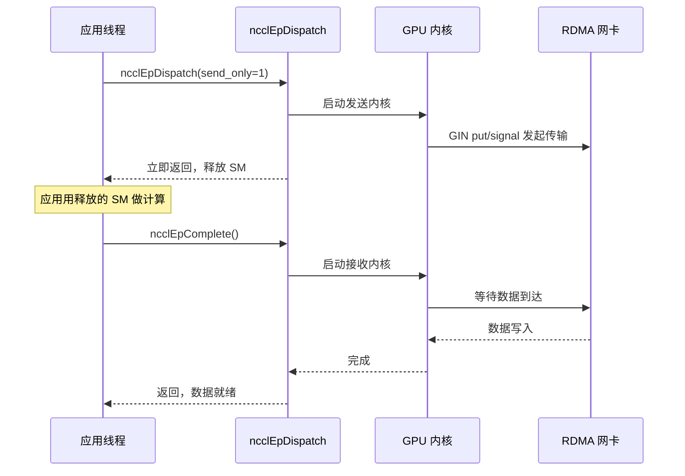
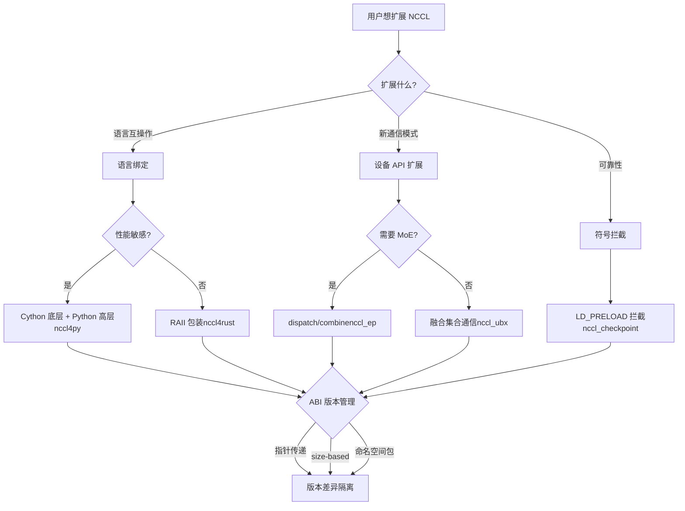

# Chapitre 23 : Extension de l'écosystème : nccl4py, nccl4rust, nccl_ep, nccl_ubx et autres projets périphériques

Dans le chapitre précédent, nous avons examiné les défaillances typiques de NCCL en environnement de production — mauvaise utilisation de la sémantique de group, incompatibilité du nombre de ranks, interactions avec les streams, conflits de version ABI et délais d'attente réseau. La plupart de ces problèmes surviennent dans des scénarios d'utilisation directe de l'ABI C, alors que les frameworks modernes d'entraînement de grands modèles n'appellent généralement pas directement l'ABI C, mais réutilisent les capacités de NCCL via des bindings Python, Rust ou d'autres langages, ou grâce à des projets d'extension ciblant le MoE, la communication à ultra-haute bande passante, etc. Ces projets périphériques sont placés dans les répertoires bindings/ et contrib/, avec un positionnement expérimental et maintenu par la communauté, sans hériter des garanties de qualité de publication de la bibliothèque principale. Ce chapitre analyse un par un nccl4py, nccl4rust, nccl_ep, nccl_ubx et nccl_checkpoint, pour voir comment ils construisent un écosystème riche en dehors du cœur via trois voies : les bindings de langage, l'extension de l'API device et l'interception de symboles.

# nccl4py : bindings Cython et conception de package à espace de noms

## Modèle intuitif : traduire l'ABI C en quelque chose que Python comprend

Imaginez que le cœur de NCCL est un diplomate qui ne parle que le langage C, et qu'un script d'entraînement Python est un stagiaire qui ne parle que Python. nccl4py est ce traducteur — il ne change pas ce que dit le diplomate (le comportement de NCCL), il traduit simplement «`ncclAllReduce(sendbuff, recvbuff, count, ...)`» en «`nccl.all_reduce(tensor)`». Sans cette couche de traduction, chaque framework Python devrait écrire ses propres bindings ctypes, un travail répétitif et source d'erreurs.

## Structure en couches : bas niveau Cython + haut niveau Python

La conception de nccl4py est à deux niveaux : la couche basse est le binding Cython (`nccl/bindings/cynccl.pxd`), la couche haute est l'API Python (`nccl.core`). Le README précise explicitement cette stratification[FACT:bindings/nccl4py/README.md:4-4]：

> `nccl4py provides low-level Cython bindings and a high-level Python API`

Le binding Cython est distribué sous forme de fichier`.pxd`avec le wheel, pour que d'autres extensions Cython puissent directement`cimport` [FACT:bindings/nccl4py/README.md:39-43]：

```cython
from nccl.bindings cimport cynccl
```

> **[Design Inference & Architectural Trade-offs]**
> Pourquoi exposer la couche Cython et pas seulement la couche Python ? Parce que certains frameworks (comme DeepSpeed, Megatron) ont leur boucle principale en Cython, et passer par l'interpréteur Python à chaque appel coûte trop cher. Directement`cimport cynccl`permet aux extensions Cython d'appeler les fonctions NCCL avec une surcharge quasi nulle, proche du C. C'est un design typique d'« exposition en couches » — la couche haute pour les utilisateurs ordinaires, la couche basse pour les scénarios sensibles aux performances.

## Package à espace de noms : plusieurs distributions partagent le préfixe`nccl`

C'est la conception la plus ingénieuse de nccl4py.`nccl`est un package à espace de noms implicite PEP 420[FACT:bindings/nccl4py/README.md:50-51]：

> `nccl` is a PEP 420 implicit namespace package. nccl4py provides `nccl.bindings` and `nccl.core`; other NCCL extension distributions can provide additional `nccl.*` subpackages.

> **[Design Inference & Architectural Trade-offs]**
> Dans un package Python traditionnel,`nccl/__init__.py`« possède » tout l'espace de noms`nccl`. Si nccl4py et le binding Python de nccl_ep veulent tous deux fournir`nccl.xxx`, il y aura conflit — le premier installé gagne. Le package à espace de noms PEP 420 résout ce problème : sans`__init__.py`, plusieurs distributions peuvent chacune placer des sous-packages dans le répertoire`nccl/`, et le système d'import de Python les fusionnera. Ainsi nccl4py fournit`nccl.bindings`et`nccl.core`, nccl_ep fournit`nccl.ep`, les deux peuvent coexister[FACT:contrib/nccl_ep/README.md:80-82]。

Cette conception est cruciale pour l'extension de l'écosystème : à l'avenir, tout tiers voulant ajouter`nccl.monitoring`、`nccl.profiling`n'aura pas besoin de modifier le code de nccl4py.

## Sélection de version CUDA : mécanisme des extras

À l'installation, utiliser`nccl4py[cu12]`ou`nccl4py[cu13]`pour choisir la version majeure de CUDA[FACT:bindings/nccl4py/README.md:13-17]. Le README explique la raison : les extras installent le runtime NCCL et les dépendances CUDA Python correspondants[FACT:bindings/nccl4py/README.md:19]. Les wheels publiés n'ont pas besoin de`CUDA_HOME`ni du CUDA Toolkit local, mais la compilation depuis les sources nécessite[FACT:bindings/nccl4py/README.md:20-21]。

> **[Design Inference & Architectural Trade-offs]**
> C'est la pratique standard de l'écosystème Python pour gérer la fragmentation des versions CUDA. Les ABI de CUDA 12 et 13 sont incompatibles, on ne peut pas utiliser un seul wheel pour tout couvrir. L'utilisation d'extras permet à pip de choisir les bonnes dépendances binaires selon l'environnement de l'utilisateur, évitant de ne découvrir l'incompatibilité de version qu'à l'exécution.

## Pièges en production

**Piège un : conflit entre package à espace de noms et`__init__.py`.**Si un package tiers place`nccl/`sous`__init__.py`, le mécanisme de package à espace de noms PEP 420 est cassé, entraînant l'échec de l'import de`nccl.core`. Méthode de diagnostic :`python -c "import nccl; print(nccl.__path__)"`, si l'erreur`AttributeError`apparaît, cela signifie que`nccl`n'est pas un package à espace de noms.

**Piège deux : dérive de version ABI Cython.** `cynccl.pxd`est une API expérimentale[FACT:bindings/nccl4py/README.md:32-32], lors d'une mise à niveau de NCCL,`.pxd`peut changer. Les extensions Cython dépendant de`cimport cynccl`doivent correspondre strictement à la version de nccl4py, sinon la résolution de symboles à la compilation échoue.

# nccl4rust : propriété RAII et frontière côté device

## Modèle intuitif : laisser le compilateur gérer le cycle de vie pour vous

En C, vous`ncclCommInitRank`obtenez un communicator, et devez`ncclCommDestroy`après usage. Oublier de détruire provoque une fuite, détruire trop tôt provoque un crash. Le mécanisme RAII (Resource Acquisition Is Initialization) de Rust fait que le compilateur appelle automatiquement le destructeur quand la variable sort de portée — comme une carte de chambre d'hôtel, le système règle automatiquement le compte au moment du départ, sans passer manuellement à la réception.

La valeur fondamentale de nccl4rust est d'appliquer cette sémantique de propriété à l'ABI C de NCCL.

## Structure en couches : cinq crates avec des rôles distincts

Le tableau Layout du README liste cinq crates[FACT:contrib/nccl4rust/README.md:20-28]：

| Path | Purpose |
| --- | --- |
| `crates/nccl-sys` | L'ABI hôte brute générée par bindgen |
| `crates/nccl` | Wrapper hôte de style Rust + propriété RAII |
| `crates/nccl-device-sys` | `no_std`Déclarations de device CUDA-Oxide |
| `crates/nccl-device` | Typage`DevComm`、`Team`、`Window`Wrapper |
| `shim/` | Shims purement C-ABI, utilisant uniquement les en-têtes publics |

> **[Design Inference & Architectural Trade-offs]**
> Cette séparation est délibérée. Le README explique la motivation[FACT:contrib/nccl4rust/README.md:30-32]: une application hôte peut utiliser uniquement`nccl`sans nécessiter le compilateur GPU Rust ; les kernels CUDA-Oxide utilisent`nccl-device`; les consommateurs ayant besoin de l'ABI brute peuvent choisir le`-sys`crate. Cette « stratification à la demande » permet à différents utilisateurs de ne payer que le coût de compilation dont ils ont besoin.

## Décision de conception clé : passer le communicateur de device par pointeur plutôt que par valeur

C'est la décision de conception la plus instructive de nccl4rust. La section Host/device ownership boundary du README[FACT:contrib/nccl4rust/README.md:211-219]：

> `ncclDevCommCreate` produces a versioned public structure in host memory. The host `DeviceCommunicator` wrapper owns that structure and destroys it before its parent communicator. CUDA-Oxide remains responsible for allocating device memory, copying those bytes, and keeping the copy alive while kernels execute. Kernels construct `nccl_device::DevComm` from a pointer to that device copy. Using a pointer rather than a by-value Rust mirror keeps the versioned C struct layout out of the kernel argument ABI.

> **[Design Inference & Architectural Trade-offs]**
> Pourquoi ne pas refléter les structures C avec des structures Rust ? Parce que`ncclDevComm_t`est versionné — les champs peuvent différer selon les versions de NCCL. Si les paramètres du kernel passaient une copie Rust par valeur, l'ABI du kernel serait liée à la disposition des structures d'une version spécifique de NCCL. Dès que NCCL met à jour la structure, tous les kernels déjà compilés devraient être recompilés. En passant par pointeur, on ne transmet qu'une adresse, le kernel y accède via le pointeur, et les changements de disposition n'affectent pas l'ABI. C'est la même approche que l'ABI basée sur la taille de`ncclEpLayoutInfo_t`abordée au chapitre précédent —**isoler les différences de version derrière un pointeur**。

## Frontière de sécurité : ce qui est unsafe

La section Current API contracts du README liste six contrats[FACT:contrib/nccl4rust/README.md:230-249], dont les principaux :

- Le crate`-sys`brut ne fait que refléter l'ABI C, sans ajouter de vérification de propriété ou de durée de vie[FACT:contrib/nccl4rust/README.md:232-233]
- Les wrappers actuels de communication collective et point à point acceptent des pointeurs de device bruts, déclarés comme`unsafe` [FACT:contrib/nccl4rust/README.md:42-45]
- Les méthodes de traduction de pointeurs renvoient des pointeurs de device bruts, sans possibilité de vérifier les limites d'offset, l'alignement, l'appartenance au peer, l'aliasing ou la durée de vie de la fenêtre[FACT:contrib/nccl4rust/README.md:242-244]

> **[Design Inference & Architectural Trade-offs]**
> C'est la difficulté fondamentale des bindings Rust pour NCCL : de nombreux contrats d'API de NCCL exigent que « le buffer reste valide jusqu'à la fin du stream CUDA », mais le système de types de Rust ne peut pas exprimer cet événement asynchrone qu'est « la fin du stream ». Ces méthodes ne peuvent donc être que`unsafe`, renvoyant la responsabilité à l'appelant. Le README indique également une direction d'amélioration[FACT:contrib/nccl4rust/README.md:44-45]: une abstraction de buffer stream-aware pourrait encoder ces exigences dans une API sûre. C'est un travail futur.

## Côté device : CUDA-Oxide et shims LTOIR

Le défi central côté device est que l'API device de NCCL est un template C++, tandis que le code device Rust (CUDA-Oxide) nécessite une ABI C. La solution est un shim C++[FACT:contrib/nccl4rust/README.md:26]：

> `shim/` — CUDA C++ C-ABI shim built exclusively from public `nccl.h` and `nccl_device.h`

Le shim est compilé en LTOIR (représentation intermédiaire LLVM), puis lié avec le PTX Rust pour former un cubin[FACT:contrib/nccl4rust/README.md:165-167]. Le README décrit le processus de build[FACT:contrib/nccl4rust/README.md:158-163]：

```bash
make device \
  NCCL_INCLUDE_DIR="$NCCL_INCLUDE_DIR" \
  CUDA_HOME="$CUDA_HOME" \
  ARCH=90
```

> **[Design Inference & Architectural Trade-offs]**
> LTOIR est le format intermédiaire d'optimisation à l'édition de liens de NVIDIA. Utiliser LTOIR plutôt que de compiler directement en cubin permet au shim et aux kernels Rust de bénéficier d'optimisations inter-langages à l'édition de liens — par exemple l'inlining des fonctions du shim dans les kernels Rust. C'est la technologie clé de la programmation hybride « template C++ + kernel Rust ».

## Pièges en production

**Piège un : la version de NCCL doit correspondre exactement.**Le README exige explicitement`Matching NCCL 2.31 headers and runtime` [FACT:contrib/nccl4rust/README.md:80-81], car le prototype initialise directement des champs différents dans les versions antérieures de l'API device de NCCL. Une incohérence entre les en-têtes et la version de`libnccl.so`entraîne un décalage des champs du communicateur de device.

**Piège deux : CUDA graph et communicateur de device.**Le communicateur de device est une structure versionnée en mémoire hôte, copiée vers le device puis accédée par le kernel via pointeur. Si la capture d'un CUDA graph intègre le pointeur de device dans les paramètres du kernel, la recréation ultérieure du communicateur invalidera le pointeur dans le graph. C'est de même nature que le problème de réallocation de buffer RDMA de nccl_ep.

**Piège trois : l'initialisation sûre ne peut pas être mélangée avec le groupe brut.**Le README avertit[FACT:contrib/nccl4rust/README.md:238-239]: l'initialisation sûre et les appels de gestion produisant une sortie ne peuvent pas être mélangés avec l'état de groupe`nccl-sys`brut, car la couche wrapper ne peut pas observer l'état du groupe brut. Le mélange entraîne un conflit entre la logique de polling de la couche wrapper et la sémantique du groupe brut.

# nccl_ep : primitives dispatch/combine pour l'expert parallel

## Modèle intuitif : le « centre de tri » du MoE

Dans les modèles MoE (Mixture of Experts), chaque token doit être routé vers les top-k experts. Les experts sont répartis sur différents GPU, donc les tokens doivent être transférés entre GPU — c'est le dispatch. Une fois les experts calculés, les résultats doivent être renvoyés au GPU d'origine du token — c'est le combine. nccl_ep est le moteur de communication de ce « centre de tri ».

Sans lui, chaque framework MoE devrait implémenter sa propre logique de communication dispatch/combine, ce qui serait redondant et difficile à optimiser. nccl_ep en fait une primitive standard de l'écosystème NCCL.

## Deux algorithmes : LL et HT

Le README décrit deux algorithmes[FACT:contrib/nccl_ep/README.md:36-40]：

- **Low-Latency (LL)**: petit batch, sensible à la latence (inférence LLM). Utilise une communication point-à-point all-to-all directe.
- **High-Throughput (HT)**: grand batch pour l'entraînement et le préremplissage en inférence. Utilise une communication hiérarchique — agrégation NVLink intra-nœud, RDMA inter-nœuds. Exploite le pipeline warp-specialized et TMA de Hopper.

> **[Design Inference & Architectural Trade-offs]**
> La divergence entre ces deux algorithmes reflète les différents goulots d'étranglement de l'inférence et de l'entraînement MoE. En inférence, le batch est petit, la latence est la contrainte principale, donc LL utilise le point-à-point direct pour éviter les surcoûts d'agrégation. En entraînement, le batch est grand, la bande passante est la contrainte principale, donc HT utilise l'agrégation hiérarchique pour réduire le trafic inter-nœuds. C'est un design typique de « choix d'algorithme selon les caractéristiques de la charge de travail ».

## Structure de données centrale : ncclEpGroupConfig_t

C'est la structure de configuration d'EP, avec de nombreux champs[FACT:contrib/nccl_ep/README.md:339-362]. Champs clés :

- `size`et`version`: vérification de version ABI, même origine que l'ABI basé sur la taille décrit au chapitre précédent[FACT:contrib/nccl_ep/README.md:340-341]
- `algorithm`: HT ou LL[FACT:contrib/nccl_ep/README.md:342]
- `max_dispatch_tokens_per_rank`: nombre maximum de tokens dispatchés par rank[FACT:contrib/nccl_ep/README.md:344]
- `rdma_buffer_size`: taille du buffer RDMA en mode LL[FACT:contrib/nccl_ep/README.md:356-356]
- `alloc`: allocateur de mémoire device personnalisé[FACT:contrib/nccl_ep/README.md:359]

> **[Design Inference & Architectural Trade-offs]**
> `rdma_buffer_size`La sémantique de`NCCL_EP_AUTO`de[FACT:contrib/nccl_ep/README.md:396-406]mérite un examen approfondi. Le README explique`ncclEpCreateGroup`: en mode AUTO, le buffer n'est pas alloué au moment de`ncclEpInitHandle`, mais lors du premier`(layout, num_topk)`en fonction du[FACT:contrib/nccl_ep/README.md:396-406]：

réel. Lorsqu'un handle ultérieur nécessite un buffer plus grand, une réallocation collective est effectuée. Ce design d'« allocation paresseuse » évite à l'utilisateur de deviner la taille du buffer, mais introduit trois contraintes`(layout, num_topk)`1. Tous les ranks doivent utiliser le même`ncclEpInitHandle`

appel synchronisé`send_only`2. La réallocation supprime le contenu de l'ancien buffer,

les données temporairement stockées seront perdues

**3. La capture CUDA graph fige le pointeur de base RDMA, une nouvelle capture est nécessaire après réallocation**C'est l'un des pièges de production les plus importants de ce chapitre.

## L'allocation paresseuse de

`ncclEpTensor_t`apporte de la facilité d'utilisation, mais transfère à l'utilisateur la complexité du « quand réallouer ».[FACT:contrib/nccl_ep/README.md:310-332]Descripteurs de tenseur : formes statique et dynamique

**est un type valeur léger**. Le README montre deux utilisations :`NCCL_EP_TENSOR_INIT_INLINE`）[FACT:contrib/nccl_ep/README.md:806-809]：

```c
ncclEpTensor_t expert_counters = { NCCL_EP_TENSOR_INIT_INLINE,
                                   .ndim = 1, .datatype = ncclInt32,
                                   .data = expert_counters_data,
                                   .sizes = expert_counters_dims };
```

**(sur la pile,**copie`ncclEpTensorAlloc`）[FACT:contrib/nccl_ep/README.md:793-798]：

```c
ncclEpTensor_t* topk_idx = nullptr;
{
    size_t dims[2] = { num_tokens, top_k };
    ncclEpTensorAlloc(&topk_idx, 2, ncclInt64, dims, /*config=*/NULL);
    cudaMalloc(&topk_idx->data, num_tokens * top_k * sizeof(int64_t));
}
```

> **[Design Inference & Architectural Trade-offs]**
> copie`sizes`〔Inférence de conception et compromis architecturaux〕`sizes`La différence entre les deux formes réside dans la propriété du tableau[FACT:contrib/nccl_ep/README.md:325-326]. Le`sizes`du descripteur statique est un tableau de pile appartenant à l'appelant, qui doit vivre plus longtemps que le descripteur`ncclEpTensorDestroy`. Le[FACT:contrib/nccl_ep/README.md:514-514]du descripteur dynamique est une copie sur le tas appartenant à la bibliothèque, libérée par`ncclEpTensor_t*`. La structure publique détient le pointeur[FACT:contrib/nccl_ep/README.md:514-514], donc les deux formes peuvent être mélangées dans le même appel

## . Ce design permet zéro allocation sur le tas pour les scénarios simples, et la commodité de gestion par la bibliothèque pour les scénarios complexes.

Modes d'exécution : synchrone et par étapes[FACT:contrib/nccl_ep/README.md:701-741]La section Execution Modes du README

**décrit deux modes :**Mode synchrone[FACT:contrib/nccl_ep/README.md:705-709]。

**(par défaut) : occupe les ressources GPU pendant toute l'opération, y compris le temps d'attente de réception des données**Mode par étapes[FACT:contrib/nccl_ep/README.md:718-726](LL uniquement) : l'opération est divisée en deux phases, send et receive`send_only = 1`. Lancé avec`ncclEpComplete`, les ressources GPU sont libérées après le démarrage du transfert de données, l'application peut utiliser ces ressources pour du calcul, puis terminer avec[FACT:contrib/nccl_ep/README.md:728-741]。



Ce diagramme de séquence illustre la valeur essentielle du mode par étapes :`send_only`retourne immédiatement après le lancement, les ressources SM sont libérées pour le calcul, et l'application appelle`ncclEpComplete`après avoir effectué d'autres travaux pour attendre la fin de la réception. C'est le modèle classique de « chevauchement calcul-communication ».

## Pièges de production

**Piège 1 :`ncclEpInitHandle`la nature collective conditionnelle de**En mode AUTO,`ncclEpInitHandle`est un appel collectif conditionnel[FACT:contrib/nccl_ep/README.md:396-406]. Si un rank déclenche une réallocation en raison d'un layout différent, les autres ranks doivent y participer synchroniquement. Une désynchronisation entraîne un deadlock ou une corruption des données.

**Piège 2 : interdiction de`ncclEpInitHandle`。**pendant la capture CUDA graph[FACT:contrib/nccl_ep/README.md:396-406]Le README avertit explicitement`cudaStreamBeginCapture`: en mode AUTO, il ne faut pas appeler`cudaStreamEndCapture`entre`ncclEpInitHandle`et

**. Car la réallocation modifie l'adresse de base RDMA, et la capture graph a déjà figé l'ancien pointeur.**Piège 3 : surcoût du guard.[FACT:contrib/nccl_ep/README.md:299-303]Le README mentionne`NCCL_EP_DISABLE_GUARD=1`: EP ajoute par défaut un guard aux buffers de communication internes pour empêcher les appels dispatch/combine adjacents de corrompre mutuellement les données. Les utilisateurs avancés qui ont déjà garanti qu'aucune opération consécutive n'entrera en compétition peuvent utiliser

# pour le désactiver et récupérer le surcoût. Mais une mauvaise désactivation entraîne une corruption silencieuse des données.

## nccl_ubx : fusion de la communication collective et de l'allocateur symétrique

La communication collective ordinaire ne fait que déplacer des données. Mais dans les modèles réels, l'AllReduce est souvent précédé d'une addition résiduelle et suivi d'un RMSNorm. Si ces opérations sont effectuées séparément, les données font plusieurs allers-retours en mémoire vidéo. L'approche de nccl_ubx est : fusionner l'addition résiduelle, le RMSNorm et la quantification mxfp8 directement dans le noyau de communication collective[FACT:contrib/nccl_ubx/README.md:6-9]. C'est comme une entreprise de déménagement qui non seulement transporte les cartons, mais vous aide aussi à les emballer et les déballer, le tout en un seul passage.

## Prérequis matériel : nécessite le multicast NVLink

Le README exige explicitement SM 9.0+ (Hopper/Blackwell), et le chemin du noyau MC nécessite le matériel multicast NVLink[FACT:contrib/nccl_ubx/README.md:24-24]. SM 8.0 (A100) n'est pas pris en charge, car Ampere n'a pas de matériel multicast NVLink,`multimem.*`et le PTX inline ne peut pas être assemblé pour l'arch 8.0[FACT:contrib/nccl_ubx/README.md:24-24]。

> **[Design Inference & Architectural Trade-offs]**
> Cela explique pourquoi ubx est « expérimental » — il dépend de la capacité de multicast NVLink introduite avec Hopper.`multimem.*`L'instruction permet à un GPU d'écrire des données vers les adresses symétriques de plusieurs GPU en une seule instruction, ce qui constitue la base matérielle de la communication collective accélérée. Sans ce matériel, l'optimisation centrale d'ubx ne tient pas.

## Allocateur symétrique : transformer les tenseurs PyTorch en fenêtres NCCL

Le cœur d'ubx est un allocateur symétrique personnalisé[FACT:contrib/nccl_ubx/README.md:11-14]：

> A central piece of the design is a custom symmetric allocator that provides zero-copy collective input/output buffers while remaining easy to plug into existing PyTorch code: tensors are ordinary `torch.Tensor` instances backed by an NCCL-managed symmetric window.

> **[Design Inference & Architectural Trade-offs]**
> C'est l'aspect le plus ingénieux d'ubx. La mémoire symétrique de NCCL exige que tous les ranks utilisent le même ensemble d'adresses virtuelles pour accéder aux buffers (vu au chapitre 14). Mais les utilisateurs de PyTorch ont l'habitude d'utiliser`torch.Tensor`. ubx fait en sorte que`torch.Tensor`le stockage sous-jacent de soit directement une fenêtre symétrique NCCL, de sorte que le code utilisateur n'a pas besoin d'être modifié, mais la communication collective peut être zéro-copie — les buffers d'entrée et de sortie sont la mémoire symétrique elle-même, sans copie supplémentaire.

## Variantes de communication collective et sélection automatique

Le tableau Available collectives du README[FACT:contrib/nccl_ubx/README.md:90-90]：

| Op | Variants | Auto-select |
| --- | --- | --- |
| AllReduce | `mc`, `uc`, `lamport`, `auto` | Lamport ≤ 0.25 MB, else MC |
| AllToAll | `uc`, `lamport`, `auto` | Lamport ≤ 0.25 MB, else UC |
| AllGather | `mc` | — |

> **[Design Inference & Architectural Trade-offs]**
> Les différences entre les trois variantes :`mc`utilise le matériel multicast NVLink,`uc`utilise l'unicast ordinaire,`lamport`est un algorithme à faible latence. La sélection automatique se fait selon un seuil de 0,25 Mo — les petits messages utilisent Lamport à faible latence, les gros messages utilisent MC/UC à haut débit. Ce seuil est similaire à la logique de tuning du cœur de NCCL, mais ubx l'a simplifié en un seuil fixe.

## Opérations fusionnées : residual + RMSNorm

Le README mentionne[FACT:contrib/nccl_ubx/README.md:103-103]：

> `SymmAllocator.allreduce_mc()` and `allreduce_lamport()` accept optional `gamma`/`residual_in` parameters to fuse residual addition + RMSNorm into the same kernel.

> **[Design Inference & Architectural Trade-offs]**
> C'est l'argument de vente principal d'ubx. Le flux traditionnel est : AllReduce → addition résiduelle → RMSNorm, soit trois lectures/écritures en mémoire vidéo. Après fusion, un seul noyau suffit, économisant 2/3 de la bande passante mémoire. Pour l'entraînement de grands modèles limités par la bande passante, c'est une accélération bien réelle.

## Dispatch de tokens MoE + quantification mxfp8

Le README décrit`a2av_token_bf16_mxfp8` [FACT:contrib/nccl_ubx/README.md:103-103]：

> a single GPU kernel that routes bf16 tokens to remote ranks while quantizing them to mxfp8 (E8M0 scale per 32 elements) on the fly.

> **[Design Inference & Architectural Trade-offs]**
> Ce noyau fusionne « routage + quantification ». Le bf16 est sur 16 bits, le mxfp8 sur 8 bits ; après quantification, le volume de données est réduit de moitié, et le besoin en bande passante pour la transmission inter-nœuds est réduit de moitié. Quantifier avant la transmission est préférable à quantifier après — on économise la bande passante réseau plutôt que la bande passante mémoire. C'est l'optimisation clé pour l'inférence MoE.

## Pièges en production

**Piège un :`TORCH_CUDA_ARCH_LIST`doit être accompagné du`a`suffixe.**Le README insiste sur[FACT:contrib/nccl_ubx/README.md:47-56]: utiliser le`a`suffixe pour garantir l'accès à l'ensemble complet du`multimem.*`jeu d'instructions. Certaines variantes spécialisées pour l'accélération ne sont pas disponibles sur le`9.0`/`10.0`ordinaire ; les futurs noyaux utilisant ces variantes subiront une baisse silencieuse de performance ou un échec d'assemblage.

**Piège deux :`UBX_BUILD_TIMEOUT`la surcharge d'exécution de**Le README précise[FACT:contrib/nccl_ubx/README.md:47-56]: le mettre à 1 intègre un timeout de spinloop côté noyau, augmentant la surcharge d'exécution (vérifications supplémentaires de`clock64()`et`printf`en cas de timeout). À activer uniquement pour diagnostiquer les blocages.

**Piège trois :`NCCL_NVLS_ENABLE=0`la dégradation de**Le README liste cette variable d'environnement[FACT:contrib/nccl_ubx/README.md:202]: la mettre à 0 permet de fonctionner sans multicast NVLink. Mais le chemin du noyau MC devient inopérant, ne laissant que les variantes UC/Lamport, avec une chute importante de performance.

# nccl_checkpoint : interception LD_PRELOAD et rejeu d'état

## Modèle intuitif : prendre un instantané du domaine de communication

Une tâche d'entraînement tourne depuis plusieurs heures, et soudain il faut migrer vers une autre machine, ou sauvegarder l'état pour pouvoir reprendre. Un checkpoint ordinaire ne sauvegarde que les poids du modèle et l'état de l'optimiseur, mais l'état du domaine de communication NCCL (numéros de rank, connexions, buffers) ne peut pas être sérialisé directement. L'approche de nccl_checkpoint est : intercepter tous les appels NCCL, enregistrer les étapes d'initialisation, et les rejouer lors de la restauration[FACT:contrib/nccl_checkpoint/README.md:3-7]。

C'est comme filmer chaque étape du montage de vos meubles, puis les remonter en suivant la vidéo après le déménagement, plutôt que d'essayer de déplacer les meubles déjà montés en bloc.

## Mécanisme central : interception de symboles LD_PRELOAD

La section Design du README[FACT:contrib/nccl_checkpoint/README.md:17-20]：

> The application is launched with `LD_PRELOAD=/path/to/libnccl-checkpoint-shim.so` in the environment. This allows the library to intercept all calls to NCCL functions to capture all resource initialization steps.

> **[Design Inference & Architectural Trade-offs]**
> `LD_PRELOAD`est un mécanisme de l'éditeur de liens dynamique Linux : charger le`.so`spécifié avant que l'application ne charge normalement les bibliothèques partagées. Si ce`.so`définit des symboles portant le même nom que ceux de NCCL (par exemple`ncclCommInitRank`), l'éditeur de liens dynamique utilisera en priorité la version du`.so`. Ainsi le shim peut intercepter tous les appels NCCL, enregistrer les paramètres, puis les rejouer lors de la restauration.

## Flux de checkpoint

L'exemple Python du README[FACT:contrib/nccl_checkpoint/README.md:44-58]présente le flux complet :

```python
nccl_checkpoint.checkpoint_prepare()
drv.cuCheckpointProcessLock(os.getpid(), None)
drv.cuCheckpointProcessCheckpoint(os.getpid(), None)
# CRIU dump happens here.
drv.cuCheckpointProcessRestore(os.getpid(), None)
drv.cuCheckpointProcessUnlock(os.getpid(), None)
nccl_checkpoint.checkpoint_restore()
```

> **[Design Inference & Architectural Trade-offs]**
> Le flux se décompose en quatre étapes :

1. `checkpoint_prepare()`: détruire tous les communicateurs pour permettre à CUDA Checkpoint et CRIU de dumper en toute sécurité l'état du processus[FACT:contrib/nccl_checkpoint/README.md:25-27]

2. `cuCheckpointProcessLock/Checkpoint`: le pilote CUDA verrouille le processus et effectue le checkpoint

3. CRIU dump : un outil externe dumpe la mémoire du processus et les descripteurs de fichiers sur disque

4. `cuCheckpointProcessRestore/Unlock` + `checkpoint_restore()`: restaurer le processus, rejouer la configuration NCCL[FACT:contrib/nccl_checkpoint/README.md:29-31]

## Redis KVS : rendezvous inter-machines

Le README explique pourquoi Redis est nécessaire[FACT:contrib/nccl_checkpoint/README.md:33-38]：

> Because it is useful to restore on different hardware, IP addresses may have changed. There is no convenient way to directly inform the NCCL Checkpoint library of all peer addresses during the restore process, so the library depends on a temporary Redis Key-Value store to be made available.

> **[Design Inference & Architectural Trade-offs]**
> Lors de la restauration, la machine peut changer et l'IP aussi. La reconstruction du domaine de communication NCCL nécessite de connaître les nouvelles adresses de tous les peers. Mais le shim ne peut pas connaître directement ces adresses, donc un Redis KVS est utilisé comme rendezvous — tous les processus écrivent leur nouvelle adresse dans le KVS et lisent les adresses des autres processus depuis le KVS. C'est comme après un déménagement, où tout le monde convient d'échanger les nouvelles adresses sur un tableau d'affichage public.

Le README précise que Redis n'est nécessaire que pendant la phase d'amorçage de la restauration[FACT:contrib/nccl_checkpoint/README.md:221-221]，`checkpoint_restore()`peut être arrêté après le retour.

## Limitations : trois non-supportés

La section Limitations du README[FACT:contrib/nccl_checkpoint/README.md:119-129]liste trois limitations :

1. `ncclWinGetUserPtr()`le pointeur retourné est invalide après restauration[FACT:contrib/nccl_checkpoint/README.md:125-126]

2. La capture de CUDA graph n'est pas supportée[FACT:contrib/nccl_checkpoint/README.md:136-136]

3. L'API device n'est pas supportée —`ncclDevComm`les objets et les`ncclWindow_t`visibles par le device ne peuvent pas être restaurés[FACT:contrib/nccl_checkpoint/README.md:136-136]

> **[Design Inference & Architectural Trade-offs]**
> La troisième limitation est la plus grave. L'API device est la nouvelle direction de NCCL (DevComm abordé au chapitre 19), mais le checkpoint ne la supporte pas. Cela signifie que les applications utilisant l'API device (comme nccl_ep, nccl_ubx) ne peuvent pas être restaurées via checkpoint. C'est le reflet d'une fragmentation de l'écosystème — les nouvelles fonctionnalités avancent vite, mais les outils de fiabilité ne suivent pas.

## Pièges en production

**Piège un :`NCCL_CHECKPOINT_KVS_PATH`se définit avant le checkpoint, et ne peut pas être modifié lors de la restauration.**Le README avertit[FACT:contrib/nccl_checkpoint/README.md:221-221]: cette variable d'environnement n'est pas utilisée pendant la phase de préparation du checkpoint, mais elle sera capturée dans le checkpoint et ne pourra pas être facilement modifiée lors de la restauration. Il faut donc la définir avant le checkpoint, et l'adresse Redis dans l'environnement de restauration doit correspondre.

**Piège deux :`NCCL_CHECKPOINT_KVS_TIMEOUT`ne couvre que le rendezvous Redis du shim.**Le README précise[FACT:contrib/nccl_checkpoint/README.md:221-221]: par défaut 300 secondes. Une fois que le communicateur rejoue et entre dans la phase d'établissement du transport NCCL, les appels de transport NCCL sous-jacents utilisent leur propre comportement et peuvent nécessiter des diagnostics spécifiques au transport. Autrement dit, le timeout ne protège que la phase Redis ; un blocage dans la phase d'établissement du transport doit être diagnostiqué via`NCCL_DEBUG`.

**Piège trois : la version de NCCL doit correspondre.**Le README exige NCCL 2.31.0 ou plus récent[FACT:contrib/nccl_checkpoint/README.md:158], et recommande que`NCCL_SRC`la version de NCCL dans le chemin corresponde exactement à la version de la bibliothèque NCCL à l'exécution[FACT:contrib/nccl_checkpoint/README.md:156-158]. Une incompatibilité de version entraîne un décalage de disposition des structures lors du rejeu.

# Réflexion de conception : trois modes d'extension de l'écosystème

En revisitant ces cinq projets, on peut dégager trois modes d'extension de l'écosystème NCCL :

**Mode un : bindings de langage (nccl4py, nccl4rust).**Le défi central est la propriété et le cycle de vie. L'ABI C n'a pas de sémantique de propriété, la couche de binding doit la compléter elle-même. nccl4py utilise une stratification Cython, nccl4rust utilise RAII +`unsafe`frontière. Le point commun :**isoler les différences de version derrière des pointeurs**— nccl4rust transmet DevComm via des pointeurs, nccl4py isole les versions via des packages de namespaces.

**Mode deux : extension de l'API device (nccl_ep, nccl_ubx).**Le défi central est la gestion des versions d'ABI et le cycle de vie des ressources. nccl_ep utilise une ABI basée sur la taille (size-based ABI, détaillée au chapitre précédent), nccl_ubx utilise un allocateur symétrique. Le point commun :**allocation paresseuse + réallocation collective**— le buffer RDMA de nccl_ep et le pool symétrique de nccl_ubx sont alloués à la demande, mais la réallocation nécessite la synchronisation de tous les ranks.

**Mode trois : interception de symboles (nccl_checkpoint).**Le défi central est la capture et le rejeu d'état. Utiliser`LD_PRELOAD`pour intercepter tous les appels NCCL, enregistrer les étapes d'initialisation, et les rejouer lors de la restauration. Ce mode ne modifie pas le cœur de NCCL, mais ajoute de manière transparente une capacité de checkpoint aux applications existantes.

> **[Design Inference & Architectural Trade-offs]**
> La contrainte commune aux trois modes est**la compatibilité des versions de NCCL**. Tous les projets exigent une correspondance exacte de version de NCCL, car l'ABI de NCCL évolue. Cela reflète une tension fondamentale de l'écosystème NCCL : le cœur itère rapidement, mais les projets périphériques ont besoin de stabilité. L'ABI basée sur la taille, le passage par pointeurs et les packages de namespaces sont tous des moyens techniques pour atténuer cette tension.



Ce diagramme de décision illustre le chemin de choix pour étendre NCCL. Quelle que soit la voie empruntée, on finit par faire face au problème central de la gestion des versions d'ABI, et les trois moyens techniques (passage par pointeurs, ABI basée sur la taille, packages de namespaces) isolent tous les différences de version derrière une interface stable.

# Résumé de ce chapitre

Ce chapitre a analysé cinq projets périphériques de l'écosystème NCCL :

- **nccl4py**Utiliser Cython en couches + des packages d'espace de noms PEP 420 pour permettre à l'écosystème Python de s'étendre sans conflit`nccl.*`sous-packages.
- **nccl4rust**Utiliser la propriété RAII + le passage de pointeur pour le communicateur de périphérique, afin d'isoler la disposition versionnée des structures C en dehors de l'ABI du noyau.
- **nccl_ep**Utiliser le double algorithme LL/HT + l'allocation paresseuse de tampons RDMA pour fournir des primitives dispatch/combine à MoE, mais cela introduit des contraintes d'appels collectifs conditionnels et d'invalidation des CUDA graphs.
- **nccl_ubx**Utiliser un allocateur symétrique + la fusion de noyaux pour intégrer l'addition résiduelle, RMSNorm et la quantification mxfp8 dans les noyaux de communication collective, mais cela dépend du matériel NVLink multicast de Hopper+.
- **nccl_checkpoint**Utiliser`LD_PRELOAD`l'interception de symboles + le rendezvous Redis pour implémenter des points de contrôle de domaine de communication inter-machines, mais cela ne prend pas en charge l'API de périphérique ni les CUDA graphs.

# Réflexions et auto-évaluation de ce chapitre

Q1 : Dans le mode`rdma_buffer_size = NCCL_EP_AUTO`de nccl_ep, si le rank 0 appelle d'abord`ncclEpInitHandle`et déclenche une réallocation de tampon, tandis que le rank 1 ne déclenche pas de réallocation en raison d'une disposition différente, que se passe-t-il ? Veuillez analyser en combinant avec les contraintes de[FACT:contrib/nccl_ep/README.md:396-406].

**Analyse de référence**: Le README indique explicitement[FACT:contrib/nccl_ep/README.md:396-406]：`All ranks must call ncclEpInitHandle in lockstep with the same (layout, num_topk)`. En mode AUTO,`ncclEpInitHandle`est un appel collectif conditionnel — le déclenchement ou non de la réallocation dépend de si le`(layout, num_topk)`de ce handle nécessite un espace plus grand que le tampon actuel.

Si la disposition du rank 0 nécessite un tampon plus grand déclenchant une réallocation, tandis que celle du rank 1 n'en a pas besoin, alors le rank 0 exécutera l'ensemble d'opérations collectives « deregister window → free → ncclMemAlloc → register »[FACT:contrib/nccl_ep/README.md:396-406], tandis que le rank 1 ne le fera pas. Cela entraîne deux problèmes :

1. **Incompatibilité des opérations collectives**: Le deregister/register de window dans NCCL est une opération collective nécessitant la participation de tous les ranks. L'exécution unilatérale du rank 0 entraînera que le rank 1 référencera l'ancien handle de window dans les communications ultérieures, alors que le rank 0 a déjà changé pour une nouvelle window, provoquant un échec de communication ou une corruption des données.

2. **Incohérence des adresses de base**: Après la réallocation, l'adresse de base RDMA du rank 0 a changé, tandis que celle du rank 1 n'a pas changé. Bien que le README indique « recorded layout offsets on every live handle are pure offsets relative to the group's rdma_buffer and resolve correctly against the new base »[FACT:contrib/nccl_ep/README.md:396-406], cela ne tient que si tous les ranks sont réalloués. L'adresse de base du rank 1 n'a pas changé, celle du rank 0 a changé, la résolution d'adresses inter-ranks sera décalée.

La bonne pratique est : tous les ranks utilisent le même`(layout, num_topk)`pour appeler synchroniquement`ncclEpInitHandle`, assurant une décision de réallocation cohérente. Si cela ne peut pas être garanti, il faut utiliser le mode explicite`rdma_buffer_size > 0`, en allouant un tampon suffisamment grand en une seule fois lors de`ncclEpCreateGroup`, évitant ainsi la réallocation à l'exécution[FACT:contrib/nccl_ep/README.md:396-406]。

Q2 : Pourquoi nccl4rust passe-t-il`ncclDevComm_t`par pointeur plutôt que par valeur au noyau de périphérique ? Si l'on passait par valeur, que se passerait-il après une mise à niveau de la disposition des structures NCCL ? Veuillez analyser en combinant avec[FACT:contrib/nccl4rust/README.md:211-219].

**Analyse de référence**: Le README indique explicitement que[FACT:contrib/nccl4rust/README.md:217-219]：`Kernels construct nccl_device::DevComm from a pointer to that device copy. Using a pointer rather than a by-value Rust mirror keeps the versioned C struct layout out of the kernel argument ABI.`

`ncclDevComm_t`est une structure publique versionnée, dont les champs peuvent différer selon les versions de NCCL. Si l'on passe par valeur :

1. **L'ABI du noyau lie la disposition de la structure**: Lorsqu'un paramètre de noyau est passé par valeur, le compilateur intègre la disposition en octets de toute la structure dans la convention d'appel du noyau. Après une mise à niveau de la structure NCCL (ajout de champs, changement d'ordre des champs, changement d'alignement), le noyau déjà compilé interprète toujours les paramètres selon l'ancienne disposition, entraînant un décalage des champs.

2. **Nécessité de recompiler tous les noyaux**: Chaque mise à niveau de NCCL nécessite de recompiler tous les noyaux utilisant le communicateur de périphérique. Pour les tâches d'entraînement déployées sur un grand nombre de machines, c'est une charge opérationnelle énorme.

3. **Incompatibilité entre versions**: Si le côté hôte crée un communicateur avec le nouveau NCCL et que le noyau côté périphérique est compilé avec l'ancien NCCL, le passage par valeur entraînera la lecture de champs erronés par le noyau.

Le passage par pointeur ne transmet qu'une adresse de 8 octets, et le noyau accède à la structure via le pointeur. Lors d'une mise à niveau de la disposition de la structure NCCL, tant que le côté hôte crée le communicateur avec la nouvelle version et le copie vers le périphérique, le noyau accédera à la nouvelle disposition via le pointeur. Le noyau lui-même n'a pas besoin d'être recompilé, car son paramètre n'est qu'une adresse. Cela isole les différences de version derrière le pointeur —**le pointeur est stable, le contenu pointé peut changer**。

C'est la même philosophie de conception que l'ABI basée sur la taille de nccl_ep : utiliser une couche d'indirection pour isoler les détails de version volatils derrière une interface stable.

Q3 : nccl_checkpoint utilise`LD_PRELOAD`pour intercepter les appels NCCL, mais si l'application lie simultanément nccl4py et nccl_checkpoint, les bindings Cython de nccl4py appellent directement les symboles de`libnccl.so`,`LD_PRELOAD`peut-il les intercepter ? Veuillez analyser l'ordre de résolution des symboles.

**Analyse de référence**: Cela dépend de l'ordre de résolution des symboles.`LD_PRELOAD`est le suivant : l'éditeur de liens dynamique, avant de charger les bibliothèques partagées dont l'application dépend normalement, charge d'abord`LD_PRELOAD`spécifié par`.so`. Lorsque l'application (ou une bibliothèque dont elle dépend) référence un symbole, l'éditeur de liens dynamique effectue la recherche selon l'ordre « premier chargé, premier résolu » —`LD_PRELOAD`de`.so`est prioritaire sur`libnccl.so`。

Donc en théorie, lorsque les bindings Cython de nccl4py appellent`ncclCommInitRank`, l'éditeur de liens dynamique trouve d'abord le symbole de même nom dans`libnccl-checkpoint-shim.so`, et l'interception réussit.

Mais il existe quelques cas limites :

1. **Direct`dlopen` + `dlsym`**: si nccl4py utilise`dlopen("libnccl.so")`puis`dlsym`pour obtenir un pointeur de fonction,`LD_PRELOAD`ne peut pas intercepter, car`dlsym`cherche directement le symbole dans le`.so`spécifié, sans passer par la table des symboles globale. Le README mentionne que les applications C utilisent`dlsym`pour résoudre`ncclCheckpointPrepare` [FACT:contrib/nccl_checkpoint/README.md:109-109], mais il s'agit de résoudre les symboles du checkpoint lui-même, pas les symboles NCCL.

2. **Moment de liaison des symboles**: si nccl4py lie les symboles NCCL avant que`LD_PRELOAD`ne prenne effet (par exemple dans`__attribute__((constructor))`), l'interception peut échouer. Mais en temps normal,`LD_PRELOAD`prend effet au démarrage du processus, avant tout code utilisateur.

3. **`RTLD_DEEPBIND`**: si nccl4py utilise`dlopen`en spécifiant`RTLD_DEEPBIND`, la recherche de symboles est résolue en priorité à l'intérieur de`libnccl.so`, contournant`LD_PRELOAD`. C'est un piège courant.

4. **Liaison statique**: si nccl4py lie statiquement NCCL,`LD_PRELOAD`est totalement inefficace, car les symboles sont déjà résolus à la compilation.

La conclusion est donc :**Dans un scénario de liaison dynamique normal,`LD_PRELOAD`peut intercepter les appels de nccl4py**, mais si nccl4py utilise`dlopen` + `RTLD_DEEPBIND`ou la liaison statique, l'interception échoue. En production, il faut utiliser`LD_DEBUG=bindings`pour vérifier la liaison des symboles et confirmer que les appels NCCL sont interceptés par le shim.

Dans le prochain chapitre, nous nous tournerons vers l'évolution de l'architecture et les directions futures, pour voir comment NCCL évolue d'une bibliothèque de communication collective vers un moteur de communication programmable.

Ces projets périphériques démontrent, par le biais de bindings linguistiques, d'extensions d'API de dispositif et d'interception de symboles, comment les capacités fondamentales de NCCL sont réutilisées dans différents scénarios. La contrainte centrale qui traverse tous ces projets est la compatibilité des versions de l'ABI NCCL — l'ABI basée sur la taille, le passage de pointeurs et les paquets à espace de noms sont autant de moyens techniques d'isoler les différences de version derrière une interface stable. Comprendre ces moyens est la condition préalable à une utilisation sûre de ces projets périphériques. Alors que ces projets d'extension ne cessent de sonder les limites du cœur, NCCL lui-même évolue discrètement : des opérations collectives fixes vers un moteur de communication programmable, du host proxy vers l'envoi direct depuis le GPU, des buffers enregistrés vers la mémoire symétrique. Dans le prochain chapitre, nous explorerons, à partir des traces d'évolution présentes dans le code source, comment ces changements vont remodeler les modes de communication des frameworks supérieurs.
