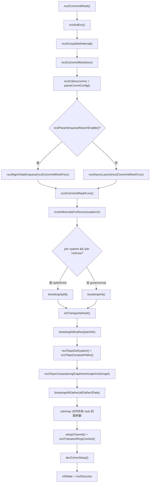
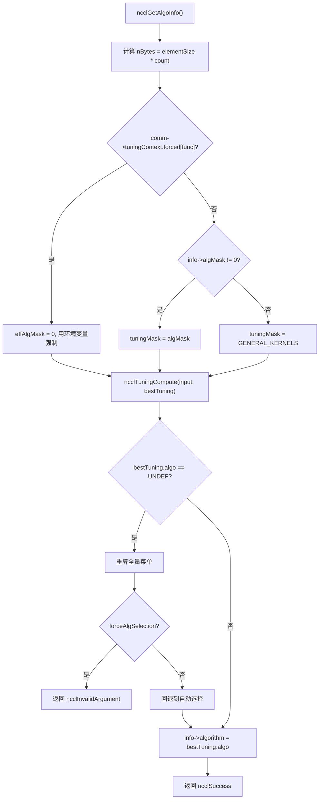
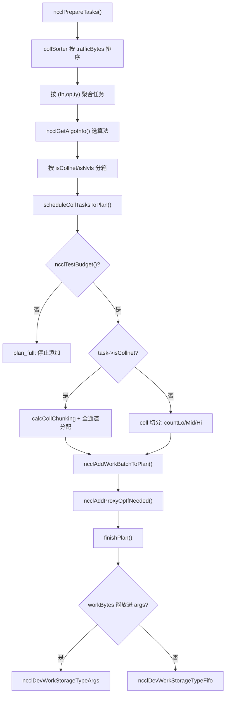

# Chapitre 25 : Rétrospective globale et réflexions : le voyage ultime d'un AllReduce et l'essence de sa conception

Dans le chapitre précédent, en nous appuyant sur les traces d'évolution dans le code source, nous avons anticipé la tendance architecturale de NCCL : passer d'opérations collectives fixes à un modèle programmable, du host proxy à l'envoi direct depuis le GPU, des buffers enregistrés à la mémoire symétrique. Il est maintenant temps de replacer ces tendances dans un flux d'exécution concret pour les vérifier. Ce chapitre n'introduit aucun nouveau code, mais relie à nouveau la chaîne de bout en bout des chapitres 3 à 10 — depuis la ligne d'appel ncclAllReduce, jusqu'à l'écriture du résultat en mémoire GPU. Après lecture, vous devriez pouvoir répondre clairement : par quelles fonctions passe un AllReduce ? Dans quel fichier et à quelle ligne se trouve chaque fonction ? Quel chapitre consulter en cas de problème ?

# I. Initialisation : comment le domaine de communication « prend vie »

## Modèle intuitif

Imaginez le domaine de communication comme un « groupe de discussion ». Lorsque vous appelez`ncclCommInitRank`, c'est comme « demander à rejoindre le groupe ». NCCL doit à ce moment déterminer entièrement la liste des membres du groupe (peerInfo), qui communique avec qui par quel lien (graphe de topologie), et combien de pipelines chaque lien ouvre (channel).**Si cette étape est erronée, toutes les communications suivantes seront erronées**— comme si quelqu'un n'avait pas été ajouté au groupe de discussion : le message que vous envoyez ne sera jamais reçu par une personne.

## Structures de données et disposition mémoire

La structure centrale du domaine de communication est`ncclComm`, dont l'initialisation se fait en deux phases :`commAlloc`se charge d'« allouer le squelette »,`initTransportsRank`se charge de « remplir la chair ».

`commAlloc`Ce qui est le plus remarquable dans**, c'est la conception du**comptage de références des ressources partagées`ncclSharedResources`. Lorsqu'un sous-domaine de communication (créé par split/shrink) réutilise les ressources du domaine parent, il ne les copie pas, mais partage le même

[FACT:src/init.cc:533-555]

```cpp
if (parent == NULL || !parent->shareResources) {
    struct ncclSharedResources* sharedRes;
    NEW_NOTHROW(sharedRes, ncclSharedResources);
    sharedRes->owner = comm;
    ...
    comm->sharedRes = sharedRes;
    sharedRes->refCount = 1;
    NCCLCHECK(ncclNetInit(comm));
    NCCLCHECK(ncclRmaInit(comm));
    NCCLCHECK(ncclGinInit(comm));
} else {
    comm->sharedRes = parent->sharedRes;
    ncclAtomicRefCountIncrement(&parent->sharedRes->refCount);
    NCCLCHECK(ncclNetInitFromParent(comm, parent));
    NCCLCHECK(ncclRmaInitFromParent(comm, parent));
}
```

Copier`refCount`L'intention de ce code est claire : les « ressources lourdes » telles que les plugins réseau, RMA et GIN ne sont initialisées qu'une seule fois, et les sous-domaines de communication les empruntent directement.

utilise des opérations atomiques pour incrémenter, garantissant qu'il n'y aura pas de double libération en environnement multithread.`commAlloc`Un autre point clé est**l'initialisation des**canaux`id = -1`dans`setupChannel`. Tous les canaux sont d'abord marqués comme « non initialisés » (

[FACT:src/init.cc:607-608]

```cpp
// Mark channels as non initialized.
for (int c = 0; c channels[c].id = -1;
```

qui remplira réellement le contenu :`-1`Copier`id == -1`Ce

## est une valeur sentinelle. Si du code utilise par erreur un canal non initialisé,

exposera immédiatement le problème, au lieu de lire un bloc de mémoire aléatoire.`ncclCommInitRank`Step-by-Step : de ncclCommInitRank à initTransportsRank

1. `ncclCommInitRank`Après l'appel utilisateur à`ncclInitEnv`, le flux d'exécution réel est le suivant :`ncclGroupStartInternal`appelle d'abord

pour charger les plugins d'environnement, puis appelle`ncclCommInitRankDev`pour entrer dans la sémantique de groupe (afin de permettre « l'initialisation de plusieurs domaines de communication dans un même groupe »).`comm`2. Ensuite,**est appelé : il effectue la validation des paramètres, alloue la structure**：

[FACT:src/init.cc:2923-2929]

```cpp
if (ncclParamEnqueueRearchEnable()) {
    NCCLCHECKGOTO(ncclMgmtTaskEnqueue((struct ncclAsyncJob*)job, ncclCommInitRankFunc, ncclCommInitJobFree, comm), res, fail);
} else {
    NCCLCHECKGOTO(ncclAsyncLaunch((struct ncclAsyncJob*)job, ncclCommInitRankFunc, NULL, ncclCommInitJobFree, comm), res, fail);
}
```

délègue le véritable travail d'initialisation à un job asynchrone`ncclParamEnqueueRearchEnable()`Copier`ncclAsyncLaunch`Notez ici la branche`ncclMgmtTaskEnqueue`— c'est une trace de la « refonte de l'enqueue » en cours dans NCCL. Par défaut, on passe par`ncclCommInitRankFunc`。

3. `ncclCommInitRankFunc`; une fois la refonte activée, on passe par

[FACT:src/init.cc:2119-2127]

```cpp
timers[TIMER_INIT_TOTAL] = clockNano();
CUDACHECKGOTO(cudaSetDevice(cudaDev), res, fail);
CUDACHECKGOTO(cudaDeviceGetAttribute(&maxSharedMem, cudaDevAttrMaxSharedMemoryPerBlockOptin, cudaDev), res, fail);
CUDACHECKGOTO(cudaDeviceGetAttribute(&archMajor, cudaDevAttrComputeCapabilityMajor, cudaDev), res, fail);
CUDACHECKGOTO(cudaDeviceGetAttribute(&archMinor, cudaDevAttrComputeCapabilityMinor, cudaDev), res, fail);
cudaArch = 100 * archMajor + 10 * archMinor;

timers[TIMER_INIT_KERNELS] = clockNano();
NCCLCHECKGOTO(ncclInitKernelsForDevice(cudaArch, maxSharedMem, &maxLocalSizeBytes), res, fail);
```

`cudaArch = 100 * archMajor + 10 * archMinor`est la fonction principale de l'initialisation. Elle commence par définir le device, interroger les propriétés du GPU, et initialiser le kernel :

4. Ensuite, selon qu'il s'agit d'une initialisation normale ou d'un split/shrink/grow, on emprunte différents chemins de bootstrap :

[FACT:src/init.cc:2136-2191]

```cpp
if (job->parent && !job->isGrow) {
    // SPLIT/SHRINK: use bootstrapSplit
    ...
    NCCLCHECKGOTO(bootstrapSplit(comm->commHash, comm, job->parent, job->color, job->key, parentRanks), res, fail);
} else {
    // GROW or NORMAL INIT: use bootstrapInit
    ...
    NCCLCHECKGOTO(bootstrapInit(job->nId, (struct ncclBootstrapHandle*)job->commId, comm, job->parent), res, fail);
}
```

5. Enfin, on appelle`initTransportsRank`, c'est la fonction la plus lourde de toute l'initialisation (environ 800 lignes). En interne, elle effectue deux AllGather :

- **AllGather1**: échange de`ncclPeerInfo`(les informations de périphérique de chaque rank, host hash, pid hash, GPU UUID, etc.) :

[FACT:src/init.cc:1236-1239]

```cpp
NCCLCHECKGOTO(ncclCalloc(&comm->peerInfo, nranks + 1), ret, fail); // Extra rank to represent CollNet root
NCCLCHECKGOTO(fillInfo(comm, comm->peerInfo + rank, comm->commHash), ret, fail);
NCCLCHECKGOTO(bootstrapAllGather(comm->bootstrap, comm->peerInfo, sizeof(struct ncclPeerInfo)), ret, fail);
COMPILER_ATOMIC_STORE(&comm->peerInfoValid, true, std::memory_order_release);
```

Noter`nranks + 1`cette allocation — l'emplacement supplémentaire est destiné au CollNet root.`peerInfoValid`est stocké avec une sémantique release, garantissant que lorsque les autres threads voient ce flag, le contenu de peerInfo est déjà visible.

- **AllGather3**: échange des résultats de calcul de topologie (structure ring/tree calculée par chaque rank, bande passante, nombre de canaux, etc.), puis on prend le**minimum**de tous les ranks pour aligner :

[FACT:src/init.cc:1687-1703]

```cpp
for (int i = 0; i nChannels = std::min(allGather3Data[i].graphInfo[a].nChannels, graphs[a]->nChannels);
        graphs[a]->sameChannels = std::min(allGather3Data[i].graphInfo[a].sameChannels, graphs[a]->sameChannels);
        graphs[a]->bwIntra = std::min(allGather3Data[i].graphInfo[a].bwIntra, graphs[a]->bwIntra);
        graphs[a]->bwInter = std::min(allGather3Data[i].graphInfo[a].bwInter, graphs[a]->bwInter);
        graphs[a]->typeIntra = std::max(allGather3Data[i].graphInfo[a].typeIntra, graphs[a]->typeIntra);
        graphs[a]->typeInter = std::max(allGather3Data[i].graphInfo[a].typeInter, graphs[a]->typeInter);
        graphs[a]->crossNic = std::max(allGather3Data[i].graphInfo[a].crossNic, graphs[a]->crossNic);
    }
    ...
}
```

La bande passante prend le min, le type prend le max, c'est le « principe du tonneau » : la performance de tout le domaine de communication est déterminée par le rank le plus lent. Sans alignement, différents ranks pourraient calculer des choix d'algorithme différents, entraînant un interblocage de communication.

## Diagramme de flux d'initialisation



## Réflexions de conception et pièges

**Pourquoi l'initialisation doit-elle être asynchrone ?**Parce que l'initialisation multi-rank nécessite une synchronisation inter-processus (bootstrap), et si elle était exécutée de manière synchrone, elle bloquerait le thread appelant. Après asynchronisation, l'utilisateur peut initialiser plusieurs domaines de communication simultanément dans un groupe, en les faisant progresser en parallèle.

**Pièges**：`initTransportsRank`À la fin, il y a une barrière intra-node :

[FACT:src/init.cc:1968-1971]

```cpp
/* Local intra-node barrier */
NCCLCHECKGOTO(bootstrapIntraNodeBarrier(comm->bootstrap, comm->localRankToRank, comm->localRank, comm->localRanks, comm->localRankToRank[0]), ret, fail);
```

Cette barrière garantit que tous les ranks de la même machine ont terminé l'allocation des ressources avant de continuer. Si un rank reste bloqué dans`devCommSetup`(par exemple par manque de mémoire GPU), les autres ranks attendront indéfiniment ici. En production, face à un « blocage d'initialisation », la première chose à vérifier est si le`devCommSetup`d'un certain rank a échoué.

# II. Mise en file des tâches : de l'appel API à l'objet tâche interne

## Modèle intuitif

L'utilisateur appelle`ncclAllReduce`comme s'il commandait dans un restaurant.`ncclEnqueueCheck`est le serveur, il traduit votre commande en un « bon de travail » que la cuisine peut comprendre (`ncclTaskColl`), et le place dans`comm->planner`, ce « pool de commandes ».**Sans cette couche, NCCL ne pourrait pas fusionner plusieurs appels en un seul lancement de kernel**— allumer le feu séparément pour chaque commande serait extrêmement inefficace.

## Structures de données et disposition mémoire

Le cœur de la mise en file des tâches est`ncclKernelPlanner`, qui est attaché à`comm->planner`. Les champs clés incluent :

- `collSorter`: file de tâches de communication collective triée par volume de trafic
- `collTaskQueue`: file de tâches finalement triée
- `peers[]`: file send/recv de chaque peer (pour P2P)
- `wipPlan`: le kernel plan en cours de construction

Les champs clés de l'objet tâche`ncclTaskColl`sont remplis dans`collTaskAppend`:

[FACT:src/enqueue/enqueue.cc:2800-2847]

```cpp
struct ncclTaskColl* t = ncclMemoryPoolAlloc(&comm->memPool_ncclTaskColl, &comm->memPermanent);
t->func = info->coll;
t->sendbuff = info->sendbuff;
t->recvbuff = info->recvbuff;
t->count = info->count;
t->root = info->root;
t->datatype = info->datatype;
size_t elementSize = ncclTypeSize(t->datatype);
if (t->func == ncclFuncAllGather || t->func == ncclFuncBroadcast) {
    t->count *= elementSize;
    t->datatype = ncclInt8;
    elementSize = 1;
}
t->trafficBytes = t->count * elementSize * ncclFuncTrafficPerByte(t->func, comm->nRanks);
...
t->aggIsolate = ncclCollConfigNeedAggIsolate(&info->collConfig) || info->collConfig.CTAPolicy != comm->config.CTAPolicy;
NCCL_CONFIG_SET(t, minCTAs, ncclParamMinCTAs(), info->collConfig.minCTAs, comm->config.minCTAs, 1, MAXCHANNELS);
NCCL_CONFIG_SET(t, maxCTAs, ncclParamMaxCTAs(), (std::min(info->collConfig.maxCTAs, comm->config.maxCTAs)), comm->config.maxCTAs, 1, MAXCHANNELS);
...
planner->nTasksColl += 1;
ncclTaskCollSorterInsert(&planner->collSorter, t, t->trafficBytes);
```

Noter quelques détails :

1. **Traitement spécial d'AllGather/Broadcast**: multiplier count par la taille de l'élément, et changer datatype en`ncclInt8`. C'est parce que la sémantique de ces deux opérations est de « transporter des octets », sans se soucier du type d'origine.

2. **`trafficBytes`Calcul de**：`ncclFuncTrafficPerByte`retourne combien de fois chaque octet doit être transmis. AllReduce retourne 2 (reduce + broadcast), AllGather retourne nRanks :

[FACT:src/enqueue/enqueue.cc:123-134]

```cpp
static inline int ncclFuncTrafficPerByte(ncclFunc_t func, int nRanks) {
  switch (func) {
  case ncclFuncAllReduce:
    return 2;
  case ncclFuncAllGather:
    return nRanks;
  case ncclFuncReduceScatter:
    return nRanks;
  default:
    return 1;
  }
}
```

3. **`NCCL_CONFIG_SET`Macro**: c'est une résolution de configuration à trois niveaux « env > per-call > comm ». La variable d'environnement a la priorité la plus élevée, suivie de la config de l'appel individuel, et enfin de la valeur par défaut au niveau du domaine de communication.

## Step-by-Step : le chemin de mise en file de ncclAllReduce

1. `ncclEnqueueCheck`On effectue d'abord la validation du domaine de communication et l'entrée dans le groupe :

[FACT:src/enqueue/enqueue.cc:3478-3495]

```cpp
ncclResult_t ncclEnqueueCheck(struct ncclInfo* info) {
  ncclResult_t ret = CommCheck(info->comm, info->opName, "comm");
  if (ret != ncclSuccess) return ncclGroupErrCheck(ret);
  if (info->comm->revokedFlag) {
    WARN("%s: communicator was revoked", info->opName);
    return ncclGroupErrCheck(ncclInvalidUsage);
  }
  ...
  NCCLCHECK(ncclGroupStartInternal());
  ret = ncclSuccess;
  int devOld = -1;
  NCCLCHECKGOTO(ncclCommEnsureReady(info->comm), ret, fail);
```

2. Puis on appelle`taskAppend`, qui dispatche selon le type d'opération :

[FACT:src/enqueue/enqueue.cc:3337-3348]

```cpp
static ncclResult_t taskAppend(struct ncclComm* comm, struct ncclInfo* info) {
  ncclFunc_t collAPI = info->coll;
  bool hasLaunchCompletionEvent = ncclInfoHasLaunchCompletionEvent(info);

  if (ncclParamEnqueueRearchEnable()) {
    NCCLCHECK(rawTaskAppend(comm, info));
  } else if (info->coll == ncclFuncSend || info->coll == ncclFuncRecv) {
    NCCLCHECK(p2pTaskAppend(comm, info, info->coll, collAPI, (void*)info->recvbuff, info->count, info->datatype, info->root, true));
  } else if (info->coll == ncclFuncPutSignal || info->coll == ncclFuncSignal || info->coll == ncclFuncWaitSignal) {
    NCCLCHECK(rmaTaskAppend(comm, info));
  } else {
    ...
  }
}
```

Pour AllReduce, on emprunte la dernière branche`else`, et finalement on appelle`collTaskAppend`。

3. `collTaskAppend`pour insérer la tâche dans`collSorter`, en triant par`trafficBytes`. Le but du tri est de permettre au planificateur de traiter en priorité les grosses tâches, évitant que les petites tâches fragmentent les ressources de canaux.

## Flux de données de la mise en file des tâches

```mermaid
flowchart LR
    api["ncclAllReduce()"] --> info["ncclInfo 填充"]
    info --> enq["ncclEnqueueCheck()"]
    enq --> check["CommCheck + ncclCommEnsureReady()"]
    check --> append["taskAppend()"]
    append --> coll["collTaskAppend()"]
    coll --> task["ncclTaskColl 分配"]
    task --> sorter["ncclTaskCollSorterInsert(collSorter)"]
    sorter --> prepare["ncclPrepareTasks()"]
    prepare --> algo["ncclGetAlgoInfo() 选算法"]
    algo --> schedule["scheduleCollTasksToPlan()"]
    schedule --> plan["ncclKernelPlan"]
```



## Réflexions de conception et pièges

**Pourquoi utiliser`ncclMemoryPoolAlloc`plutôt que`malloc`？**Parce que les objets tâche ont un cycle de vie court et sont alloués fréquemment. Le pool mémoire évite le coût d'appel système de`malloc/free`à chaque fois. Noter que le deuxième paramètre de`ncclMemoryPoolAlloc`est`&comm->memPermanent`— cela signifie que les objets tâche ne sont libérés globalement qu'à la destruction du domaine de communication, et non individuellement pour chaque tâche.

**Pièges**：`ncclPrepareTasks`Dans

[FACT:src/enqueue/enqueue.cc:506-512]

```cpp
// We aggregate operations that are within 4X size of each other.
while (aggEnd != nullptr && aggEnd->trafficBytes trafficBytes && !aggBeg->aggIsolate && !aggEnd->aggIsolate) {
    agg.count += aggEnd->count;
    agg.trafficBytes += aggEnd->trafficBytes;
    aggEnd = aggEnd->next;
}
```

Copier`aggIsolate`Cette agrégation vise à rendre la sélection d'algorithme plus stable — si chaque petite tâche choisissait son algorithme individuellement, on pourrait aboutir à une multitude d'algorithmes différents, entraînant une fragmentation des kernels. Mais le flag

# empêche l'agrégation, pour les tâches qui « doivent être planifiées individuellement » (par exemple celles avec une config per-call).

## III. Sélection d'algorithme : comment le modèle de coût choisit la solution optimale

Modèle intuitif**La sélection d'algorithme ressemble au choix d'itinéraire d'un logiciel de navigation. Le « modèle de coût » de NCCL (module tuning) estime le temps d'exécution de chaque combinaison algorithme/protocole pour une taille de message et une topologie données, puis choisit le plus rapide.**。

## Sans modèle de coût, NCCL ne pourrait coder en dur qu'un seul ensemble d'algorithmes, gaspillant la bande passante sur les petits messages et la latence sur les gros messages.

Structures de données et disposition mémoire`ncclGetAlgoInfo`：

[FACT:src/enqueue/enqueue.cc:2159-2185]

```cpp
ncclResult_t ncclGetAlgoInfo(struct ncclComm* comm, struct ncclTaskColl* info, int collNetSupport, int nvlsSupport,
                             int numPipeOps, ncclSimInfo_t* simInfo) {
  size_t elementSize = ncclTypeSize(info->datatype);
  size_t nBytes = elementSize * ncclFuncMaxSendRecvCount(info->func, comm->nRanks, info->count);
  info->algorithm = NCCL_ALGO_UNDEF;
  info->protocol = NCCL_PROTO_UNDEF;
  struct ncclTuningInput_t input;
  input.comm = comm;
  input.tuningMask = NCCL_TUNING_MASK_GENERAL_KERNELS;
  uint64_t effAlgMask = comm->tuningContext.forced[info->func] ? 0 : info->algMask;
  if (effAlgMask != 0) {
    input.tuningMask = effAlgMask & NCCL_TUNING_MASK_GENERAL_KERNELS;
  }
  input.CTAPolicy = info->CTAPolicy;
  input.func = info->func;
  input.redOp = info->opHost;
  input.devRedOp = info->opDev.op;
  input.datatype = info->datatype;
  input.nBytes = nBytes;
  input.numPipeOps = numPipeOps;
  input.collNetSupport = collNetSupport;
  input.nvlsSupport = nvlsSupport;
  input.count = info->count;
  NCCLCHECK(ncclGetRegBuff(comm, info, &input.regBuff));
  ...
}
```

Copier`effAlgMask`Noter la logique de`comm->tuningContext.forced[info->func]`: si une variable d'environnement force un algorithme (`algMask`non nul), on ignore le

de l'utilisateur et on utilise celui de la variable d'environnement. C'est l'expression de la priorité « env > per-call ».`ncclTuningCompute`Puis on appelle

[FACT:src/enqueue/enqueue.cc:2213-2224]

```cpp
} else {
    NCCLCHECK(ncclTuningCompute(&input, &bestTuning));
}
INFO(NCCL_TUNING, "Best tuning, algorithm, %s, protocol, %s", ncclAlgoToString(bestTuning.algo), ncclProtoToString(bestTuning.proto));
info->algorithm = bestTuning.algo;
info->protocol = bestTuning.proto;
info->nWarps = bestTuning.nWarps;
if (simInfo) simInfo->estimatedTime = bestTuning.timeUs;
TRACE(NCCL_COLL, "%ld Bytes -> Algo %d proto %d time %f", nBytes, info->algorithm, info->protocol, bestTuning.timeUs);
info->nMaxChannels = bestTuning.maxChannels == 0 ? info->nMaxChannels : bestTuning.maxChannels;
```

## Step-by-Step : sélection de l'algorithme pour un AllReduce

Supposons 8 GPU sur une seule machine, taille de message 1 Mo, AllReduce :

1. `nBytes = 1MB`，`numPipeOps`est le nombre de tâches déjà présentes dans le plan actuel.

2. `collNetSupport`et`nvlsSupport`sont déterminés par`ncclGetCollNetSupport`et`ncclNvlsTransportEnabled`.

3. `ncclTuningCompute`parcourt toutes les combinaisons (algo, proto) disponibles et estime le temps à l'aide du modèle de coût.

4. Pour un scénario mono-machine de 1 Mo, NVLS ou Tree+LL128 l'emportent généralement.

5. Le résultat est réécrit dans`info->algorithm`、`info->protocol`、`info->nWarps`。

## Diagramme de décision de sélection d'algorithme



## Réflexions de conception et pièges

**Pourquoi la sélection d'algorithme doit-elle être « alignée entre les ranks » ?**Parce que si différents ranks choisissent des algorithmes différents, les modes de communication ne correspondent plus, ce qui provque un interblocage. Donc`initTransportsRank`utilise min/max pour aligner tous les paramètres du graphe, garantissant que les entrées du modèle de coût sont identiques pour chaque rank.

**Points pièges**：`ncclGetAlgoInfo`contient une logique de « recalcul » — si l'utilisateur a spécifié`algMask`mais qu'aucun algorithme ne correspond, le menu complet est d'abord recalculé silencieusement, puis on détermine s'il s'agit d'une erreur dure ou d'un repli souple :

[FACT:src/enqueue/enqueue.cc:2192-2208]

```cpp
NOWARN(ncclTuningCompute(&input, &bestTuning), NCCL_TUNING);
if (bestTuning.algo == NCCL_ALGO_UNDEF) {
    input.tuningMask = NCCL_TUNING_MASK_GENERAL_KERNELS;
    bestTuning = NCCL_TUNING_RESULT_INIT;
    bestTuning.maxChannels = 0;
    NCCLCHECK(ncclTuningCompute(&input, &bestTuning));
    if (info->forceAlgSelection) {
        WARN("algSelection: no algorithm in the selected set is available for %s", ncclFuncToString(info->func));
        return ncclInvalidArgument;
    }
    INFO(NCCL_TUNING, "algSelection: selected set unavailable for %s; falling back to automatic selection", ncclFuncToString(info->func));
}
```

`NOWARN`La macro supprime temporairement les avertissements, car « aucun algorithme ne correspond » peut être un cas normal (l'ensemble choisi par l'utilisateur est effectivement indisponible). L'erreur n'est signalée que lorsque`forceAlgSelection`est vrai.

# IV. Ordonnancement des tâches et construction du kernel plan

## Modèle intuitif

L'ordonnancement des tâches revient à répartir un tas de commandes sur plusieurs lignes de production.`scheduleCollTasksToPlan`détermine combien de canaux chaque tâche utilise et quelle quantité de données chaque canal traite, générant finalement un`ncclKernelPlan`— c'est le « bon de travail » à transmettre au GPU.

## Structures de données et disposition mémoire

`ncclKernelPlan`Les champs principaux de :

- `channelMask`: quels canaux ce plan utilise (bitmap)
- `workBytes`: nombre total d'octets de toutes les structures work
- `nWorkBatches`: nombre de work batches
- `kernelArgs`: paramètres de lancement du kernel
- `workStorageType`: où sont stockées les données work (args/fifo/persistent)

`finishPlan`détermine l'emplacement de stockage des données work :

[FACT:src/enqueue/enqueue.cc:244-255]

```cpp
// If we can fit everything into the kernel args we do so.
if (sizeof(ncclDevKernelArgs) + batchBytes + workBytes workArgsBytes) {
    plan->workStorageType = ncclDevWorkStorageTypeArgs;
}
plan->kernelArgsSize = sizeof(struct ncclDevKernelArgs) + batchBytes;
plan->kernelArgsSize += (plan->workStorageType == ncclDevWorkStorageTypeArgs) ? workBytes : 0;
plan->kernelArgsSize = alignUp(plan->kernelArgsSize, 16);
plan->kernelArgs = (struct ncclDevKernelArgs*)ncclMemoryStackAlloc(&comm->memScoped, plan->kernelArgsSize, /*align=*/16);
plan->kernelArgs->comm = comm->devComm;
plan->kernelArgs->channelMask = plan->channelMask;
plan->kernelArgs->workStorageType = plan->workStorageType;
```

Compromis entre les trois types de stockage :

- **Args**: le plus rapide, mais la taille des paramètres du kernel est limitée (généralement 4 Ko)
- **Fifo**: tampon circulaire, adapté aux tailles moyennes
- **Persistent**: allocation de mémoire vidéo dédiée, adaptée aux scénarios CUDA Graph

## Step-by-Step : allocation des canaux dans scheduleCollTasksToPlan

1. Estimer d'abord combien de tâches ce plan peut contenir :

[FACT:src/enqueue/enqueue.cc:654-687]

```cpp
do {
    size_t workBytes = 0;
    struct ncclTaskColl* task = ncclIntruQueueHead(&planner->collTaskQueue);
    struct ncclWorkList* workNode = ncclIntruQueueHead(&planner->collWorkQueue);
    while (task != nullptr) {
        int nBatches = divUp(nPlanColls, 4); // Rough guess: 4 colls per batch.
        if (!ncclTestBudget(budget, nBatches, workBytes + workNode->size)) goto plan_full;
        bool taskAggIsolate = task->aggIsolate;
        if (taskAggIsolate && nPlanColls > 0) goto plan_full;
        nPlanColls += 1;
        workBytes += workNode->size;
        int kind = 2 * task->isCollnet + task->isNvls;
        trafficBytes[kind] += std::max(MinTrafficPerChannel, task->trafficBytes);
        ...
    }
plan_full:;
} while (0);
```

2. Ensuite, répartir les canaux entre les tâches selon le trafic. Pour les tâches non-CollNet, découper en unités de « cell » :

[FACT:src/enqueue/enqueue.cc:742-759]

```cpp
int trafficPerByte = ncclFuncTrafficPerByte(task->func, comm->nRanks);
if (task->protocol == NCCL_PROTO_LL) trafficPerByte *= 4;
size_t cellSize = divUp(divUp(MinTrafficPerChannel, (size_t)trafficPerByte), 16) * 16;
int elementsPerCell = cellSize / elementSize;
size_t cells = divUp(task->count * elementSize, cellSize);
size_t trafficPerElement = elementSize * trafficPerByte;
size_t trafficPerCell = cellSize * trafficPerByte;
size_t cellsPerChannel = std::min(cells, divUp(trafficPerChannel, trafficPerCell));
size_t cellsLo;
if (channelId + 1 == nMaxChannels[kind]) {
    cellsLo = cells;
} else {
    cellsLo = std::min(cells, divUp((trafficPerChannel - currentTraffic), trafficPerCell));
}
int nMidChannels = (cells - cellsLo) / cellsPerChannel;
size_t cellsHi = (cells - cellsLo) % cellsPerChannel;
int nChannels = (cellsLo != 0 ? 1 : 0) + nMidChannels + (cellsHi != 0 ? 1 : 0);
```

Ce code découpe les données en trois segments « bas/moyen/haut » :`countLo`、`countMid`、`countHi`. Les segments bas et haut sont des canaux de bordure, le segment moyen est un canal intermédiaire. Ce découpage vise à rendre la quantité de données traitée par chaque canal aussi uniforme que possible.

3. Enfin, appeler`calcCollChunking`pour calculer la taille de chunk de chaque canal :

[FACT:src/enqueue/enqueue.cc:2228-2275]

```cpp
static ncclResult_t calcCollChunking(struct ncclComm* comm, struct ncclTaskColl* info, int nChannels, size_t nBytes,
                                     uint32_t* outChunkSize, uint32_t* outDirectFlags, struct ncclProxyOp* proxyOp) {
  ncclPattern_t pattern;
  size_t grainSize = ncclProtoGrainSize(info->protocol);
  switch (info->func) {
  case ncclFuncAllReduce:
    pattern = info->algorithm == NCCL_ALGO_NVLS           ? ncclPatternNvls :
              info->algorithm == NCCL_ALGO_NVLS_TREE      ? ncclPatternNvlsTree :
              info->algorithm == NCCL_ALGO_COLLNET_DIRECT ? ncclPatternCollnetDirect :
              info->algorithm == NCCL_ALGO_COLLNET_CHAIN  ? ncclPatternCollnetChain :
              info->algorithm == NCCL_ALGO_TREE           ? ncclPatternTreeUpDown :
                                                            ncclPatternRingTwice;
    break;
  ...
  }
  int stepSize = comm->buffSizes[info->protocol] / NCCL_STEPS;
  int chunkSteps = (info->protocol == NCCL_PROTO_SIMPLE && info->algorithm == NCCL_ALGO_RING) ? info->chunkSteps : 1;
  int sliceSteps = (info->protocol == NCCL_PROTO_SIMPLE && info->algorithm == NCCL_ALGO_RING) ? info->sliceSteps : 1;
  int chunkSize = stepSize * chunkSteps;
  if (info->protocol == NCCL_PROTO_LL) chunkSize /= 2;
  if (info->protocol == NCCL_PROTO_LL128) chunkSize = (chunkSize / NCCL_LL128_LINEELEMS) * NCCL_LL128_DATAELEMS;
  ...
}
```

## Diagramme de flux d'ordonnancement



## Réflexions de conception et pièges

**Pourquoi les tâches CollNet sont-elles traitées séparément ?**Parce que CollNet utilise les commutateurs réseau pour la réduction, et la logique d'allocation des canaux est complètement différente de celle du ring/tree classique. Les tâches CollNet occupent directement tous les canaux disponibles, tandis que les tâches classiques doivent être découpées selon le trafic.

**Points pièges**：`ncclTestBudget`L'estimation utilise une formule approximative`nBatches = divUp(nPlanColls, 4)`— en supposant qu'un batch est produit tous les 4 opérations collectives. Cette estimation peut être imprécise, c'est pourquoi une vérification exacte suit :

[FACT:src/enqueue/enqueue.cc:711-714]

```cpp
// Ensure room for worst case of one new batch per channel
if (!ncclTestBudget(budget, plan->nWorkBatches + nChannels, plan->workBytes + workNode->size)) {
    return ncclSuccess;
}
```

Si la vérification exacte échoue, on retourne directement (sans erreur), laissant la couche supérieure ouvrir un nouveau plan.

# V. Lancement du kernel et exécution côté device

## Modèle intuitif

Le lancement du kernel revient à remettre le bon de travail à l'usine.`ncclLaunchKernel`traduit`ncclKernelPlan`en paramètres de lancement de kernel CUDA, puis appelle`cuLaunchKernelEx`. Le kernel côté device, après réception du bon de travail, exécute le transfert de données selon l'algorithme.

## Structures de données et disposition mémoire

`ncclLaunchKernel`Les étapes clés de :

[FACT:src/enqueue/enqueue.cc:1886-1909]

```cpp
ncclResult_t ncclLaunchKernel(struct ncclComm* comm, struct ncclKernelPlan* plan) {
  ncclResult_t ret = ncclSuccess;
  struct ncclKernelPlanner* planner = &comm->planner;
  int nChannels = countOneBits(plan->channelMask);
  void* sym = plan->kernelFn;
  dim3 grid = {(unsigned)nChannels, 1, 1};
  dim3 block = {(unsigned)plan->threadPerBlock, 1, 1};
  int smem = plan->isSymColl ? plan->kernelDynSmem : ncclShmemDynamicSize(comm->cudaArch);
  cudaStream_t launchStream = planner->streams->stream;
  ...
  void* extra[] = {CU_LAUNCH_PARAM_BUFFER_POINTER, plan->kernelArgs, CU_LAUNCH_PARAM_BUFFER_SIZE, &plan->kernelArgsSize, CU_LAUNCH_PARAM_END};
  ...
  CUfunction fn;
  CUDACHECKGOTO(cudaGetFuncBySymbol(&fn, sym), ret, do_return);
```

Noter`grid.x = nChannels`— un block par canal.`block.x = plan->threadPerBlock`— le nombre de threads par block est déterminé par la tâche.

## Step-by-Step : du plan au lancement du kernel

1. Appeler d'abord`uploadWork`pour écrire les données work à l'emplacement cible (args/fifo/persistent) :

[FACT:src/enqueue/enqueue.cc:1365-1407]

```cpp
static ncclResult_t uploadWork(struct ncclComm* comm, struct ncclKernelPlan* plan) {
  if (plan->isSymColl || plan->isCeColl || plan->isRma) return ncclSuccess;
  size_t workBytes = plan->workBytes;
  size_t batchBytes = plan->nWorkBatches * sizeof(struct ncclDevWorkBatch);
  void* fifoBufHost;
  uint32_t fifoCursor, fifoMask;
  switch (plan->workStorageType) {
  case ncclDevWorkStorageTypeArgs:
    plan->kernelArgs->workBuf = nullptr;
    fifoBufHost = (void*)plan->kernelArgs;
    fifoCursor = sizeof(ncclDevKernelArgs) + batchBytes;
    fifoMask = ~0u;
    break;
  case ncclDevWorkStorageTypeFifo:
    fifoBufHost = comm->workFifoBuf;
    fifoCursor = comm->workFifoProduced;
    fifoMask = comm->workFifoBytes - 1;
    NCCLCHECK(waitWorkFifoAvailable(comm, fifoCursor + workBytes));
    plan->kernelArgs->workBuf = comm->workFifoBufDev;
    break;
  ...
  }
}
```

2. Ensuite, construire les attributs de lancement CUDA. Pour sm90+, les dimensions de cluster sont définies :

[FACT:src/enqueue/enqueue.cc:1929-1936]

```cpp
if (clusterSize) {
    // Grid dimension must be divisible by clusterSize
    if (grid.x % clusterSize) clusterSize = 1;
    launchAttrs[attrs].id = CU_LAUNCH_ATTRIBUTE_CLUSTER_DIMENSION;
    launchAttrs[attrs++].value.clusterDim = {clusterSize, 1, 1};
    launchAttrs[attrs].id = CU_LAUNCH_ATTRIBUTE_CLUSTER_SCHEDULING_POLICY_PREFERENCE;
    launchAttrs[attrs++].value.clusterSchedulingPolicyPreference = CU_CLUSTER_SCHEDULING_POLICY_SPREAD;
}
```

3. Enfin, appeler`cuLaunchKernelEx`：

[FACT:src/enqueue/enqueue.cc:1992]

```cpp
CUCHECKGOTO(cuLaunchKernelEx(&launchConfig, fn, nullptr, extra), ret, do_return);
```

## Côté device : exécution de runRing

Le kernel côté device, après réception du bon de travail, appelle la spécialisation`RunWorkColl`correspondante selon l'algorithme. Prenons Ring AllReduce comme exemple :

[FACT:src/device/all_reduce.h:14-83]

```cpp
template 
__device__ __forceinline__ void runRing(int tid, int nthreads, struct ncclDevWorkColl* work) {
  ncclRing* ring = &ncclShmem.channel.ring;
  int ringIx = ring->index;
  const int nranks = ncclShmem.comm.nRanks;
  ssize_t gridOffset;
  ssize_t channelCount;
  ssize_t chunkCount;
  ncclCollCbdPart(work, ncclShmem.channelId, Proto::Id, sizeof(T), (ssize_t*)nullptr, &gridOffset, &channelCount, &chunkCount);
  const ssize_t loopCount = nranks * chunkCount;
  ...
  Primitives, 1, Proto, 0> prims(tid, nthreads, &ring->prev, &ring->next, work->sendbuff, work->recvbuff, work->redOpArg, 0, 0, 0, work);

  for (ssize_t elemOffset = 0; elemOffset  int { return r - (r >= nranks ? nranks : 0); };

    // step 0: push data to next GPU
    chunk = modRanks(ringIx + nranks - 1);
    chunkOffset = chunk * chunkCount;
    offset = gridOffset + elemOffset + chunkOffset;
    nelem = (int)min(chunkCount, remCount - chunkOffset);
    prims.directSend(offset, offset, nelem);

    // k-2 steps: reduce and copy to next GPU
    for (int j = 2; j >Plan: ncclLaunchPrepare()
    Plan->>Plan: scheduleCollTasksToPlan()
    Plan->>Plan: finishPlan() 分配 kernelArgs
    Host->>Plan: ncclLaunchKernelBefore_NoUncapturedCuda()
    Plan->>Plan: uploadWork() 写 work 数据
    Host->>CUDA: cuLaunchKernelEx(fn, grid, block, smem)
    CUDA->>Kernel: 启动 nChannels 个 block
    Kernel->>Kernel: runRing() 执行 Ring AllReduce
    Host->>Plan: ncclLaunchKernelAfter_NoCuda()
    Plan->>Proxy: hostStreamPlanTask() + uploadProxyOps()
    Proxy->>Proxy: ncclProxyStart() 推进网络 I/O
    Kernel-->>Host: kernel 完成
    Host->>Plan: ncclLaunchFinish()
    Plan->>Plan: reclaimPlan() 释放资源
```

## Réflexions de conception et pièges

**Pourquoi utiliser`cuLaunchKernelEx`au lieu de`cudaLaunchKernel`？**Parce qu'il faut définir les attributs de lancement (dimensions de cluster, mem sync domain, launch completion event). Ces attributs ne sont pris en charge qu'à partir de CUDA 12.0+.

**Points pièges**：`uploadWork`Le traitement du mode persistent y est très complexe — il nécessite d'allouer de la mémoire GPU, de copier des données, d'enregistrer des événements, et de fonctionner correctement en mode de capture CUDA Graph :

[FACT:src/enqueue/enqueue.cc:1445-1478]

```cpp
CUDACHECKGOTO(cudaThreadExchangeStreamCaptureMode(&mode), result, fail);
NCCLCHECKGOTO(ncclStrongStreamAcquire(ncclCudaGraphNone(comm->config.graphUsageMode), &comm->sharedRes->deviceStream, /*concurrent=*/false, &deviceStream), result, fail);
if (comm->memPool) {
    CUDACHECKGOTO(cudaMallocAsync(&fifoBufDev, workBytes, comm->memPool, deviceStream), result, fail);
} else {
    CUDACHECKGOTO(cudaMalloc(&fifoBufDev, workBytes), result, fail);
}
plan->workBufPersistent = fifoBufDev;
plan->kernelArgs->workBuf = fifoBufDev;
CUDACHECKGOTO(cudaMemcpyAsync(fifoBufDev, fifoBufHost, workBytes, cudaMemcpyDefault, deviceStream), result, fail);
cudaEvent_t memcpyDone;
CUDACHECKGOTO(cudaEventCreateWithFlags(&memcpyDone, cudaEventDisableTiming), result, fail);
CUDACHECKGOTO(cudaEventRecord(memcpyDone, deviceStream), result, fail);
```

`cudaThreadExchangeStreamCaptureMode`sert à basculer temporairement en mode relaxed pendant la capture, permettant l'allocation de mémoire GPU. Une fois la copie terminée, un événement est enregistré, puis récupéré ultérieurement via`ncclCommPollEventCallbacks`.

# VI. Guide de production : pièges à éviter

## Piège 1 : blocage à l'initialisation

**Symptôme**：`ncclCommInitRank`reste bloqué sans retourner.

**Diagnostic**: consulter les`NCCL_DEBUG=INFO`logs, trouver le dernier rank qui a affiché quelque chose. Si tous les ranks ont affiché "Init START" mais pas "Init COMPLETE", cela signifie que le blocage se situe dans`initTransportsRank`.

**Causes courantes**：

- Échec de`devCommSetup`sur un rank (mémoire GPU insuffisante, erreur CUDA)
- réseau bootstrap inaccessible (pare-feu, port occupé)
- versions de NCCL incohérentes entre les ranks

**Référence source**：`initTransportsRank`La barrière intra-nœud à la fin de

[FACT:src/init.cc:1968-1971]

```cpp
/* Local intra-node barrier */
NCCLCHECKGOTO(bootstrapIntraNodeBarrier(comm->bootstrap, comm->localRankToRank, comm->localRank, comm->localRanks, comm->localRankToRank[0]), ret, fail);
```

## Piège 2 : débordement du FIFO de work

**Symptôme**: blocage après le lancement du kernel, ou erreur`ncclInternalError`。

**Cause**：`waitWorkFifoAvailable`attend de l'espace FIFO, mais le consommateur (kernel) ne progresse pas.

[FACT:src/enqueue/enqueue.cc:1333-1349]

```cpp
static ncclResult_t waitWorkFifoAvailable(struct ncclComm* comm, uint32_t desiredProduced) {
  bool hasRoom = (desiredProduced - comm->workFifoConsumed) workFifoBytes;
  if (!hasRoom) {
    while (true) {
      // Check abort flag to break deadlock when abort is signaled
      if (COMPILER_ATOMIC_LOAD(comm->abortFlag, std::memory_order_acquire)) {
        return ncclInternalError;
      }
      NCCLCHECK(ncclCommPollEventCallbacks(comm, /*waitSome=*/true));
      hasRoom = (desiredProduced - comm->workFifoConsumed) workFifoBytes;
      if (hasRoom) break;
      std::this_thread::yield();
    }
  }
  return ncclSuccess;
}
```

Attention à la vérification du flag abort — c'est la seule voie de secours. Si abort n'est pas non plus défini, on entre dans une boucle infinie.

**Prévention**: augmenter`NCCL_WORK_FIFO_BYTES`, ou réduire le nombre d'opérations dans un même group.

## Piège 3 : échec de capture CUDA Graph

**Symptôme**: appeler NCCL pendant une capture CUDA Graph provoque "operation not permitted".

**Cause**: en mode capture, certaines opérations CUDA sont interdites (comme`cudaMalloc`). NCCL utilise`cudaThreadExchangeStreamCaptureMode`pour basculer temporairement de mode, mais toutes les opérations ne peuvent pas être contournées.

**Référence source**：`uploadWork`La branche persistent de

[FACT:src/enqueue/enqueue.cc:1445]

```cpp
CUDACHECKGOTO(cudaThreadExchangeStreamCaptureMode(&mode), result, fail);
```

**Prévention**: utiliser`NCCL_GRAPH_MIXING_SUPPORT=1`pour activer le mode hybride graph, ou préallouer le work buffer.

# Résumé de ce chapitre

Dans ce chapitre, nous avons reparcouru la chaîne complète d'un AllReduce :

1. **Initialisation**：`ncclCommInitRank` → `ncclCommInitRankFunc` → `initTransportsRank`, établissement du domaine de communication, recherche de topologie, alignement des paramètres de graphe.

2. **Mise en file des tâches**：`ncclEnqueueCheck` → `taskAppend` → `collTaskAppend`, traduction des appels API en`ncclTaskColl`。

3. **Sélection d'algorithme**：`ncclGetAlgoInfo` → `ncclTuningCompute`, choix optimal de (algo, proto) via un modèle de coût.

4. **Ordonnancement des tâches**：`ncclPrepareTasks` → `scheduleCollTasksToPlan` → `finishPlan`, répartition des tâches sur les canaux, génération de`ncclKernelPlan`。

5. **Lancement du kernel**：`ncclLaunchKernel` → `cuLaunchKernelEx`, traduction du plan en paramètres de lancement CUDA.

6. **Exécution côté device**：`runRing` / `runTreeUpDown` / `runNvls`, exécution du transfert de données selon l'algorithme.

# Réflexions et auto-évaluation de ce chapitre

Q1 : Si l'on supprime la logique d'alignement min/max après AllGather3 (L1690-L1698) dans`initTransportsRank`, dans quels scénarios cela provoquerait-il un interblocage de communication ? Pourquoi ?

**Analyse de référence**: ce segment garantit que tous les ranks s'accordent sur les paramètres tels que`nChannels`、`bwIntra`、`bwInter`pour chaque algorithme. Sans cela, chaque rank calculerait le résultat à partir de sa propre topologie locale. Considérons un cluster hétérogène : le rank 0 sur une machine 8 GPU NVLink, le rank 8 sur une machine 4 GPU PCIe. Le rank 0 calcule 8 canaux pour le ring, le rank 8 en calcule 4. Lorsqu'ils exécutent un Ring AllReduce, le rank 0 attendra que le rank 8 envoie des données sur 8 canaux, mais le rank

Nous avons ainsi achevé le parcours complet de la chaîne d'un AllReduce. De l'initialisation, la recherche de topologie, la sélection d'algorithme, la mise en file des tâches, le lancement du kernel, jusqu'à l'exécution côté device et le transfert réseau, chaque étape correspond à l'analyse approfondie des chapitres précédents. Ce schéma de chaîne est non seulement la charpente pour comprendre NCCL, mais aussi un index pour le diagnostic : échec d'initialisation → chapitres 3 et 4, mauvais algorithme → chapitre 5, erreur de mise en file → chapitres 6 et 7, échec de lancement du kernel → chapitre 8, blocage côté device → chapitres 9 et 10, problèmes réseau → chapitres 12 et 13. À mesure que NCCL évolue vers la communication programmable, l'envoi direct GPU et la mémoire symétrique, cette chaîne continuera de s'étendre — et vous maîtrisez désormais la méthode pour la suivre.
