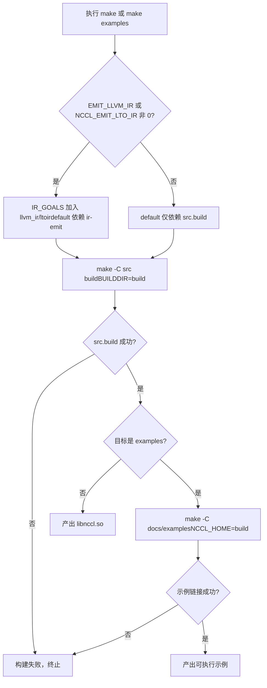
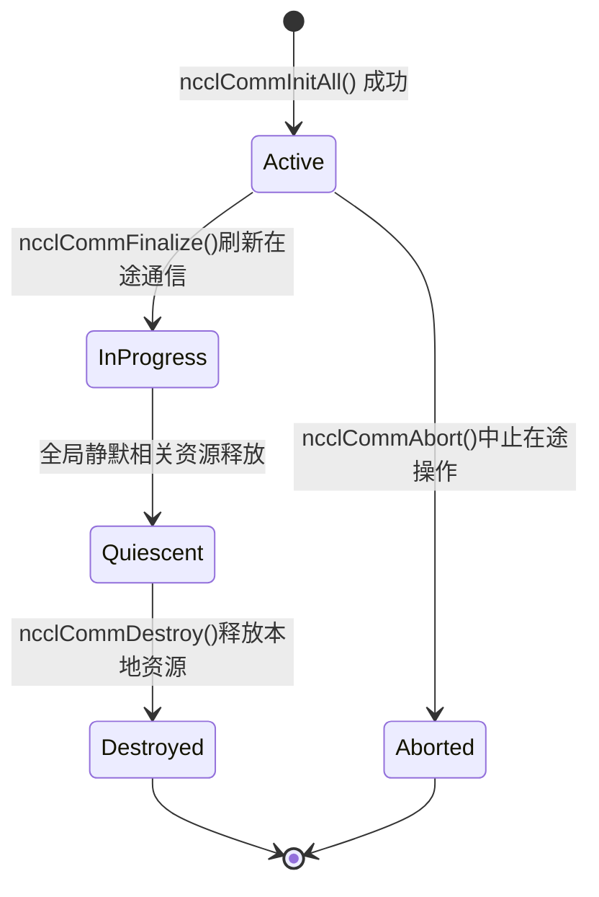

# 第 1 章：実行と現象：1つの AllReduce から外部挙動を観察する

# 第1章：実行と現象：1つの AllReduce から外部挙動を観察する

いかなるカーネルコードを深掘りする前に、まず NCCL を実行し、それが外部に露出する挙動を観察する。この章ではカーネルを読まず、ただ一つのことだけを行う：検証可能な参照系を確立すること——その後のいかなる内部メカニズム分析も、最終的にはここで見た外部挙動を説明できなければならない。

# 1.1 ビルドエントリから見る NCCL のエンジニアリング構造

## 直感的モデル

ビルドシステムはビルの施工図のようなものだ：誰が住むかは決めないが、どんな部屋があり、ドアがどちらに開くかは決める。ビルドエントリが混乱していれば、「実行する」という第一歩すら踏み出せない。NCCL は Makefile と CMake の2つのビルドエントリを同時に提供しており、それらの差異を理解することが、このプロジェクトのエンジニアリング組織を理解する第一歩である。

## 2つのビルドエントリの構造

トップレベルの`Makefile`は極めて薄いディスパッチ層であり、それ自体はどのソースファイルもコンパイルせず、作業を各サブディレクトリの Makefile に転送する。

[FACT:Makefile:44-45]は`src.%`モードルールを定義し、`src.build`、`src.install`などのターゲットを`src/Makefile`：

```
src.%:
	${MAKE} -C src $* BUILDDIR=${ABSBUILDDIR}
```

[FACT:Makefile:47-48]は`examples`ターゲットを定義し、それは`src.build`に依存し、その後`docs/examples`ディレクトリに入ってサンプルをビルドする：

```
examples: src.build
	${MAKE} -C docs/examples NCCL_HOME=${ABSBUILDDIR}
```

ここでの依存関係に注意：サンプルのビルドは`src.build`が先に完了することに依存する。なぜならサンプルは NCCL ライブラリをリンクする必要があり、`NCCL_HOME`環境変数がビルド成果物ディレクトリをサンプルの Makefile に渡すからである。これが「先にライブラリ、後にサンプル」というビルド順序の制約である。

[FACT:Makefile:29]クリーンアップ可能なすべてのターゲット集合を列挙します：

```
TARGETS := src pkg nccl4py ir
```

[FACT:Makefile:30]GNU Make の置換参照構文を使って`${TARGETS:%=%.clean}`を`src pkg nccl4py ir`に展開し`src.clean pkg.clean nccl4py.clean ir.clean`、すべてのクリーンアップターゲットを一度に定義します。これは Makefile でよく見られる「データ駆動型ルール」のテクニックです——新しいモジュールを追加するには`TARGETS`に単語を一つ追加するだけです。

## CMake エントリ：バージョン番号はどこから来るのか

CMake エントリは Makefile よりもはるかに複雑です。クロスプラットフォーム、CUDA バージョン検出、アーキテクチャ選択などを処理する必要があるからです。ここでは「動かす」ことに直接関連する部分のみに注目します。

[FACT:CMakeLists.txt:5-11]はバージョン番号の出所を示しています——それは CMakeLists.txt にハードコードされているのではなく、`makefiles/version.mk`から読み取って正規表現で抽出しています：

```cmake
file(READ ${CMAKE_SOURCE_DIR}/makefiles/version.mk VERSION_CONTENT)
string(REGEX REPLACE ".*NCCL_MAJOR[ ]*:=[ ]*([0-9]+).*" "\\1" NCCL_MAJOR "${VERSION_CONTENT}")
...
math(EXPR NCCL_VERSION_CODE "(${NCCL_MAJOR} * 10000) + (${NCCL_MINOR} * 100) + ${NCCL_PATCH}")
```

> **[Design Inference & Architectural Trade-offs]**
> バージョン番号を`version.mk`に集中させることで、Makefile と CMake の二つのビルドシステムが同じバージョンソースを共有し、「二つのビルドシステムでバージョン番号が不一致になる」という古典的なエンジニアリングの罠を回避しています。`NCCL_VERSION_CODE`の計算式`MAJOR*10000 + MINOR*100 + PATCH`はヘッダファイル内の`NCCL_VERSION`マクロと一致しています。

[FACT:CMakeLists.txt:14-20]これらのバージョン番号を`add_compile_definitions`を通じてすべての C++ ソースファイルに注入します：

```cmake
add_compile_definitions(
    NCCL_USE_CMAKE
    NCCL_MAJOR=${NCCL_MAJOR}
    NCCL_MINOR=${NCCL_MINOR}
    NCCL_PATCH=${NCCL_PATCH}
    NCCL_VERSION_CODE=${NCCL_VERSION_CODE}
)
```

[FACT:CMakeLists.txt:24-25]はプロジェクトの言語を CUDA、CXX、C として宣言しています：

```cmake
project(NCCL VERSION ${NCCL_MAJOR}.${NCCL_MINOR}.${NCCL_PATCH}
        LANGUAGES CUDA CXX C)
```

## CUDA アーキテクチャ選択：なぜデフォルト値がこんなに複雑なのか

[FACT:CMakeLists.txt:140-171]は CUDA バージョンに基づいて`CMAKE_CUDA_ARCHITECTURES`を決定する一大ロジックです。CUDA 12.8 以上を例にとると：

```cmake
elseif(${CUDA_MAJOR} EQUAL 12)
    if(${CUDA_MINOR} LESS 8)
        set(CMAKE_CUDA_ARCHITECTURES "50;60;61;70;80;90")
    else()
        set(CMAKE_CUDA_ARCHITECTURES "50;60;61;70;80;90;100;120")
    endif()
```

> **[Design Inference & Architectural Trade-offs]**
> このロジックの設計動機は：新アーキテクチャ（例：100、120）の PTX は比較的新しい CUDA ツールチェーンしか認識しないため、古い CUDA に対して新アーキテクチャを強制指定するとコンパイルが直接失敗します。したがってデフォルトのアーキテクチャリストは CUDA バージョンに応じて動的に調整する必要があります。読者にとって、これは以下を意味します：**もし`CMAKE_CUDA_ARCHITECTURES`を明示的に設定しない場合、コンパイル成果物には長いアーキテクチャリストの fatbin が含まれ、コンパイル時間が著しく長くなります**。本番環境では通常、ターゲットアーキテクチャを明示的に指定してビルドを高速化します。

## ビルドフロー決定図

以下の図は`make`の実行から実行可能なサンプルの生成までの完全な決定パスを示しています：



この図の重要な分岐は`IR_GOALS`が非空かどうかです——これがデフォルトビルドで LLVM IR 生成を追加でトリガーするかどうかを決定します。「動かす」ことだけを望む読者は、`EMIT_LLVM_IR=0`を維持すれば最短パスを通れます。

# 1.2 最小実行可能プログラムの前提条件

## 直感的モデル

NCCL プログラムを書くことは、多者間電話会議を組織するようなものです。まず確認する必要があります：何人参加するか（デバイス数）、各人は誰か（rank）、どの回線で通話するか（stream）。どれか一つでも欠けると会議は開けません。この節では`01_communicators`の例を通じて、これら三つの前提条件がコード内でどのような形をしているかを明確に見ていきます。

## データ構造：三つの配列がすべての状態を担う

[FACT:docs/examples/01_communicators/01_multiple_devices_single_process/c/main.cc:88-92]はサンプルの核心変数を定義しています：

```c
int num_gpus;                 // Number of available CUDA devices
ncclComm_t *comms = NULL;     // Array of NCCL communicators (one per GPU)
cudaStream_t *streams = NULL; // Array of CUDA streams (one per GPU)
int *devices = NULL;          // Array of device IDs to use
```

ここには NCCL のシングルプロセスマルチ GPU プログラミングモデルの核心が表れています：**各 GPU に一つの通信ドメイン、一つの stream、一つのデバイス番号**。三つの配列の長さはすべて`num_gpus`で、添字`i`は`i`番目の GPU に対応します。

`ncclComm_t`はヘッダファイル内で不透明ポインタとして定義されています。[FACT:src/nccl.h.in:36]はその実際の型を示しています：

```c
typedef struct ncclComm* ncclComm_t;
```

> **[Design Inference & Architectural Trade-offs]**
> 「不透明ポインタ」（opaque pointer）は C 言語で情報隠蔽を実現する古典的な手法です：ヘッダファイルは`struct ncclComm*`というポインタ型のみを公開し、ユーザーコードは構造体の内部フィールドにアクセスできず、すべての操作は API 関数を通じて行う必要があります。これにより NCCL は ABI を破壊することなく`ncclComm`の内部レイアウトを自由に変更できます。初心者の読者には「あなたが手にするのはブラックボックスのハンドルであり、公式インターフェースを通じてのみ操作できる」と理解すればよいでしょう。

## Step-by-Step：デバイス検出から通信ドメイン作成まで

**第一步：デバイス数の検出。** [FACT:docs/examples/01_communicators/01_multiple_devices_single_process/c/main.cc:96-104]は`cudaGetDeviceCount`を呼び出し、0 かどうかをチェックします：

```c
CUDACHECK(cudaGetDeviceCount(&num_gpus));

if (num_gpus == 0) {
    fprintf(stderr, "ERROR: No CUDA devices found on this system\n");
    ...
    return 1;
}
```

このステップで何をしているか：CUDA ランタイムに「このマシンに GPU が何枚あるか」を問い合わせています。0 が返れば利用可能なデバイスがないことを意味し、プログラムは直接終了します——これが最も前置的なガード条件です。

**第二步：ホストメモリの割り当てとデバイスリストの充填。** [FACT:docs/examples/01_communicators/01_multiple_devices_single_process/c/main.cc:114-121]は三つの配列を割り当て、割り当てが成功したかチェックします：

```c
devices = (int *)malloc(num_gpus * sizeof(int));
comms = (ncclComm_t *)malloc(num_gpus * sizeof(ncclComm_t));
streams = (cudaStream_t *)malloc(num_gpus * sizeof(cudaStream_t));

if (!devices || !comms || !streams) {
    fprintf(stderr, "ERROR: Failed to allocate memory for device arrays\n");
    return 1;
}
```

[FACT:docs/examples/01_communicators/01_multiple_devices_single_process/c/main.cc:126-136]はループで`devices[i] = i`を充填し、各デバイスの属性を出力します：

```c
for (int i = 0; i >CUDA: cudaGetDeviceCount(&num_gpus)
    CUDA-->>App: num_gpus = N
    loop i in 0..N-1
        App->>CUDA: cudaSetDevice(devices[i])
        App->>CUDA: cudaStreamCreate(&streams[i])
        CUDA-->>App: streams[i]
    end
    App->>NCCL: ncclCommInitAll(comms, N, devices)
    Note over NCCL: 内部为每个设备建立通信域分配 rank 0..N-1
    NCCL-->>App: comms[0..N-1]
    loop i in 0..N-1
        App->>NCCL: ncclCommUserRank(comms[i], &rank)
        NCCL-->>App: rank = i
        App->>NCCL: ncclCommCount(comms[i], &size)
        NCCL-->>App: size = N
    end
```

このシーケンス図が明らかにする重要な点：`ncclCommInitAll`は**同期ブロッキング呼び出し**であり、内部的にすべてのデバイス間の調整を完了し、返った時点ですべての通信ドメインが準備完了しています。

## 設計思考：なぜ ncclCommInitAll が必要なのか

> **[Design Inference & Architectural Trade-offs]**
> マルチプロセスシナリオでは、各プロセスは1枚のGPUのみを管理し、`ncclCommInitRank`それぞれを初期化すればよい。しかしシングルプロセス・マルチGPUシナリオでは、ユーザーが各GPUに対して手動で`ncclCommInitRank`を呼び出す場合、「複数のrank間の同期」を処理しなければならない——シングルプロセスにはスレッドが1つしかなく、複数のrankの初期化を同時に進めることができず、デッドロックが発生する。`ncclCommInitAll`この調整をライブラリ内部にカプセル化し、内部メカニズム（通常はマルチスレッドまたはステートマシン）で全rankの同期初期化を完了させ、ユーザーには単純な同期呼び出しとして公開する。これが「便利関数」が存在する根本的な理由である。

# 1.3 1回のAllReduceの完全な外部動作

## 直感的モデル

AllReduceは集合通信で最もよく使われる操作である：各参加者がデータを提供し、全員が全データの合計を受け取る。グループワークで合計点を計算するようなもの——各自が自分の点数を報告し、最終的に全員がクラス全体の合計点を手にする。この節では`03_collectives/01_allreduce`の例を追跡し、1回のAllReduceが呼び出しから結果検証までの完全な外部動作を見ていく。

## データ構造：データバッファと初期化

[FACT:docs/examples/03_collectives/01_allreduce/c/main.cc:59-63]は核心的な変数を定義する：

```c
int num_gpus = 0;
ncclComm_t *comms;
cudaStream_t *streams;
float **sendbuff;
float **recvbuff;
```

注意`sendbuff`と`recvbuff`は`float**`——ポインタ配列へのポインタである。各`sendbuff[i]`は`i`番目のGPU上のデバイスメモリアドレスである。

[FACT:docs/examples/03_collectives/01_allreduce/c/main.cc:99]はデータ規模を定義する：

```c
const size_t size = 32 * 1024 * 1024; // 32M floats for demonstration
```

32M個のfloat、各4バイト、つまり128 MBの送信バッファと128 MBの受信バッファ、各GPUに1つずつ。

[FACT:docs/examples/03_collectives/01_allreduce/c/main.cc:101-120]は各デバイスの初期化ループである：

```c
for (int i = 0; i  **[Design Inference & Architectural Trade-offs]**
> 核心的な矛盾は：集合通信は全rankが同時に参加する必要があるが、シングルスレッドでは`ncclAllReduce`を1つずつしか呼び出せない。もし最初の`ncclAllReduce`呼び出しが他のrankを待ってブロックし、他のrankの呼び出しがまだ発行されていなければ、デッドロックする。Groupメカニズムの役割は：`ncclGroupStart`以降のすべての呼び出しは「登録」のみを行い、実際には起動しない；`ncclGroupEnd`時に登録されたすべての操作をまとめてコミットし、それらが並行して進行できるようにする。これはフードデリバリーで全料理をカートに入れてから最後にまとめて注文するようなもので、1品ずつ注文するのではない。

**ステップ2：streamの同期。** [FACT:docs/examples/03_collectives/01_allreduce/c/main.cc:139-142]：

```c
for (int i = 0; i 首元素=0"]
        r0["recvbuff[0]"]
    end
    subgraph dev1["GPU 1 (rank 1)"]
        s1["sendbuff[1]首元素=1"]
        r1["recvbuff[1]"]
    end
    subgraph dev2["GPU 2 (rank 2)"]
        s2["sendbuff[2]首元素=2"]
        r2["recvbuff[2]"]
    end
    s0 -->|ncclAllReducencclFloat ncclSum| reduce["归约求和0+1+2=3"]
    s1 -->|ncclAllReducencclFloat ncclSum| reduce
    s2 -->|ncclAllReducencclFloat ncclSum| reduce
    reduce -->|广播结果| r0
    reduce -->|广播结果| r1
    reduce -->|广播结果| r2
```

この図はAllReduceの2つの段階を示している：まずリデュース（reduce）、次にブロードキャスト（broadcast）。各rankの`recvbuff`は最終的に同じ結果を得る。

## 設計思考：なぜ1つずつ呼び出さずGroupを使うのか

> **[Design Inference & Architectural Trade-offs]**
> もし`ncclGroupStart`/`ncclGroupEnd`を除去すると、コードはこうなる：

```c
for (int i = 0; i  **[Design Inference & Architectural Trade-offs]**
> 〔設計推論とアーキテクチャのトレードオフ〕`ncclCommFinalize`なぜ破棄は2段階なのか？**は**グローバル操作`ncclCommDestroy`——全rankが参加する必要があり、通信中でないことを保証する。**は**ローカル操作`ncclCommDestroy`——本プロセスのリソースのみを解放し、ブロックしない。この設計により「全rankの静穏を待つ」ことと「ローカルリソースの解放」が分離される：前者は時間がかかる可能性があり（ネットワーク対端を待つ必要がある）、後者は純粋にローカルな操作である。もし

## が1つだけなら、両方の責務を同時に担わなければならず、長時間ブロックするか、グローバルな静穏を保証できなくなるかのどちらかである。

[FACT:docs/examples/01_communicators/01_multiple_devices_single_process/c/main.cc:221-249]破棄順序の完全なチェーン[FACT:docs/examples/01_communicators/01_multiple_devices_single_process/c/main.cc:218-219]は完全なクリーンアップ順序を示しており、コメント

```c
// IMPORTANT: Proper cleanup is critical for NCCL applications
// Resources must be cleaned up in the correct order to avoid issues
```

コピー

順序は：[FACT:docs/examples/01_communicators/01_multiple_devices_single_process/c/main.cc:224-227]）

2. Finalize + Destroy 通信ドメイン（[FACT:docs/examples/01_communicators/01_multiple_devices_single_process/c/main.cc:233-240]）

3. CUDA stream を破棄（[FACT:docs/examples/01_communicators/01_multiple_devices_single_process/c/main.cc:246-249]）

4. ホストメモリを解放（[FACT:docs/examples/01_communicators/01_multiple_devices_single_process/c/main.cc:253-255]）

## 通信ドメインの状態機械

`ncclCommFinalize`のドキュメントには状態遷移が明記されており、これは状態機械の適用条件に合致します：



この状態機械の重要な遷移は`InProgress -> Quiescent`です：これは「グローバルサイレンス」というイベントによってトリガーされ、特定の関数呼び出しによって直接トリガーされるわけではありません。つまり`ncclCommFinalize`が戻った後、通信ドメインはまだ`InProgress`状態にある可能性があり、`ncclCommGetAsyncError`になるタイミングを知るには`Quiescent`。

## をポーリングする必要があります

> **[Design Inference & Architectural Trade-offs]**
> 〔設計推論とアーキテクチャのトレードオフ〕`comms`もし CUDA stream を先に破棄してから通信ドメインを破棄すると、どのような問題が発生するでしょうか？通信ドメイン内部は stream への参照を保持している可能性があります（例えば非同期操作の完了通知に使用）。stream が先に破棄されると、通信ドメインが Finalize 時にすでに破棄された stream にアクセスし、未定義動作を引き起こします。同様に、ホストメモリ（`ncclCommDestroy`配列）を先に解放してから通信ドメインを破棄すると、**はダングリングポインタを取得してしまいます。これが、順序が「まず同期、次に通信ドメインを破棄、次に stream を破棄、最後にホストメモリを解放」でなければならない理由です——**。

# 依存関係が、破棄順序は作成順序と逆でなければならないことを決定づけています

## 1.5 本番環境の落とし穴ガイド

落とし穴1：Group を忘れてデッドロック`ncclAllReduce`これは初心者が最もよく踏む落とし穴です。シングルプロセス・マルチGPUのシナリオで、

を Group なしで直接ループ呼び出しすると、プログラムは最初の呼び出しでデッドロックします。症状は：プログラムが固まって動かなくなり、CPU使用率がほぼ0で、何も出力されない。`gdb`調査方法：`ncclGroupStart`/`ncclGroupEnd`。

## でプロセスに attach し、スタックが NCCL 内部の待機ロジックで止まっていないか確認します。そうであれば、

[FACT:src/nccl.h.in:854-856]の欠落をチェックします`ncclGroupEnd`落とし穴2：stream の同期を忘れて結果を読む[FACT:docs/examples/03_collectives/01_allreduce/c/main.cc:139-142]は`recvbuff`がエンキューするだけで、完了は保証しないと明記しています。

の stream 同期を省略して直接`cudaMemcpy`を読むと、未完了のデータを読んでしまいます。**症状は：結果が正しかったり間違ったり、あるいは全て0が読まれる。これは**がデフォルトで同期するためですが、それが同期するのは`cudaStreamSynchronize`現在の stream

## であり、AllReduce は他の stream で実行されている可能性があるからです。調査方法：結果を読む前に

を追加し、問題が消えればこの落とし穴です。`ncclCommDestroy`落とし穴3：破棄順序の誤りによるセグメンテーション違反`cudaFree`の前に`sendbuff`/`recvbuff`を

すると、通信ドメインが Finalize 時にまだこれらのバッファにアクセスしている可能性があり、セグメンテーション違反やデータ破損を引き起こします。

## 症状は：プログラムが終了段階でクラッシュする、あるいは偶発的にゴミデータを読む。調査方法：クリーンアップコードの順序を確認し、通信ドメインの破棄がすべての CUDA リソース解放より前であることを保証します。

[FACT:docs/examples/01_communicators/01_multiple_devices_single_process/c/main.cc:198-200]落とし穴4：デバイス番号と rank の混同

```c
if (device != devices[i]) {
    printf(" [WARNING: Expected device %d]", devices[i]);
}
```

> **[Design Inference & Architectural Trade-offs]**
> 〔設計推論とアーキテクチャのトレードオフ〕`ncclCommInitAll`rank と device は二つの異なる概念です。rank は通信ドメイン内の論理番号（0 から nRanks-1）、device は物理 GPU 番号です。`devices[i] = i`のデフォルトの使い方では、`devlist`なので、rank と device はちょうど等しくなります。しかしカスタムの`{2, 0, 1}`を渡す場合（例えば

# ）、rank 0 は device 2 に対応します。この二つの概念を混同すると、データが誤った GPU に送られます。

本章のまとめ

1. **本章では三つのことを完了しました：**ビルドエントリ`make examples`：Makefile の転送メカニズムと CMake のバージョン番号の出所、CUDA アーキテクチャ選択ロジックを理解しました。重要な結論は`NCCL_HOME`が先にライブラリをビルドしてからサンプルをビルドし、

2. **がビルド成果物ディレクトリをサンプルに渡すことです。**最小実行可能プログラムの三要素`cudaGetDeviceCount`：デバイス数（`ncclCommInitAll`）、rank（`ncclCommInitAll`によって自動割り当て）、stream（各 GPU に一つ）。

3. **はシングルプロセス・マルチGPUの便利なエントリであり、マルチ rank の同期初期化をライブラリ内部にカプセル化します。**一回の AllReduce の完全な外部動作`ncclGroupStart`：`ncclAllReduce`が複数の`ncclGroupEnd`呼び出しを包み、`cudaStreamSynchronize`が送信し、

4. **が完了を待ち、最後に結果を検証します。Group メカニズムはシングルスレッド・マルチGPUシナリオでデッドロックを回避する鍵です。**：`ncclCommFinalize`通信ドメインのライフサイクル`ncclCommDestroy`（グローバルサイレンス）+

# （ローカル解放）の二段階破棄、および「まず同期、次に通信ドメインを破棄、次に stream を破棄、最後にホストメモリを解放」という順序制約。

本章の考察とセルフチェック[FACT:docs/examples/03_collectives/01_allreduce/c/main.cc:130-136]Q1: もし

**の ncclGroupStart/ncclGroupEnd を削除し、直接ループで ncclAllReduce を呼び出すように変更した場合、シングルプロセス・マルチGPUシナリオで何が起こるか？なぜか？**参考解析[FACT:src/nccl.h.in:844-864]：デッドロックが発生します。ヘッダファイル`ncclAllReduce(comms[0], ...)`が原因を説明しています：集合通信呼び出しは inter-CPU 同期を実行する可能性があり、すべての rank が同時に参加する必要があります。シングルスレッドでは、最初のループ反復で

を呼び出すとき、NCCL は他の rank も AllReduce を発起するのを待たなければ進めません。しかし他の rank の呼び出しはまだループ内で実行されておらず（現在のスレッドが最初の呼び出しでブロックされているため）、最初の呼び出しは永遠に他の rank を待てず、デッドロックします。`ncclGroupStart`Group メカニズムの役割は「発起」と「実行」を分離することです：`ncclGroupEnd`以降のすべての呼び出しは登録のみを行い、

時にすべての登録された操作を一緒に送信し、それらが並行して進められるようにします。これにより根本的にシングルスレッドのデッドロックを回避します。`gdb`attach でスタックを見ると、NCCL 内部の待機ロジックで停止し、CPU 使用率はほぼ 0 になります。

Q2: [FACT:docs/examples/03_collectives/01_allreduce/c/main.cc:139-142]の cudaStreamSynchronize は cudaDeviceSynchronize で置き換えられますか？両者の意味上の違いは何ですか？どのような場面でこの置き換えが問題を引き起こしますか？

**参考解析**：置き換え可能ですが、`cudaDeviceSynchronize`意味が異なります。`cudaStreamSynchronize(streams[i])`は指定された stream 上の操作の完了のみを待ちます；`cudaDeviceSynchronize`は現在のデバイス上の**すべての**stream の操作の完了を待ちます。

シングルプロセス・マルチ GPU の場面では、`cudaDeviceSynchronize`は現在のデバイス（`cudaSetDevice`によって決定される）のみを同期するため、`cudaSetDevice(i)`ループと組み合わせて使用する必要があります。もし`cudaSetDevice`，`cudaDeviceSynchronize`を省略すると、デフォルトデバイス（通常は device 0）のみが同期され、他のデバイスの AllReduce はまだ完了していない可能性があります。

ヘッダファイル[FACT:src/nccl.h.in:854-856]は`ncclGroupEnd`がエンキューを保証するだけで完了を保証しないことを強調しているため、同期は必須です。`cudaStreamSynchronize`の方がより正確です。なぜなら、関連する stream のみを待ち、無関係な操作を誤って待つことがないからです。`cudaDeviceSynchronize`の問題点は：デバイス上に他の無関係な長時間実行カーネルがある場合、誤って待機してしまい、パフォーマンスが低下することです。

Q3: [FACT:docs/examples/01_communicators/01_multiple_devices_single_process/c/main.cc:233-240]の破棄順序は「まずすべての通信ドメインを Finalize し、次にすべての通信ドメインを Destroy する」です。もし「各通信ドメインに対して Finalize してから Destroy する」（つまり1つのループ内で2つの操作を完了する）に変更した場合、どのような問題が発生しますか？

**参考解析**：Group セマンティクスが破壊されます。現在の記述は：

```c
ncclGroupStart();
for (i) ncclCommFinalize(comms[i]);
ncclGroupEnd();
for (i) ncclCommDestroy(comms[i]);
```

`ncclCommFinalize`が Group で包まれているため、すべての通信ドメインの Finalize が一緒にコミットされ、並行して進行できます。もし以下のように変更すると：

```c
for (i) {
    ncclCommFinalize(comms[i]);
    ncclCommDestroy(comms[i]);
}
```

最初のイテレーションの`ncclCommFinalize(comms[0])`はすべての rank が静黙するのをブロックして待ちますが、他の通信ドメインの Finalize はまだ開始されていないため、デッドロックが発生します——これは Q1 のデッドロックと同じ種類の問題です。

また、ヘッダファイル[FACT:src/nccl.h.in:309-309]は`ncclCommFinalize`が返る時点で通信ドメインがまだ`ncclInProgress`状態にある可能性があり、グローバルな静黙を待ってから`ncclSuccess`に入る必要があることを説明しています。もし直ちに`ncclCommDestroy`すると、通信ドメインが完全に静黙する前にローカルリソースを解放し、未定義動作を引き起こす可能性があります。正しい方法は Finalize 後に`ncclCommGetAsyncError`をポーリングして状態を確認し、それから Destroy することです。

これらの外部挙動は、後続のすべてのソースコード分析の参照系を構成します。第2章ではコアメンタルモデルを構築します：通信ドメイン、チャネル、アルゴリズム、プロトコル、トランスポート層という5つの要素で、NCCL 内部がこれらの概念をどのように組織しているかを見ていきます。
