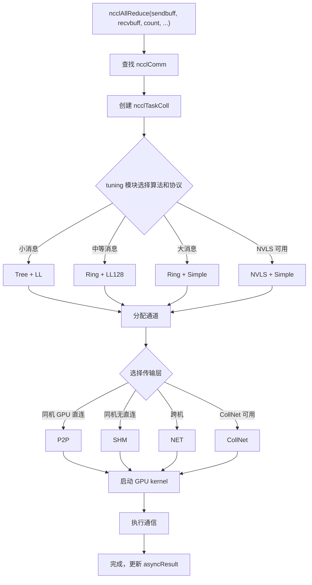

# 第 2 章：コア抽象モデル：通信演算子、トポロジ、アルゴリズム、プロトコル、トランスポート層

# 第2章：コア抽象モデル：通信演算子、トポロジ、アルゴリズム、プロトコル、トランスポート層

前章では NCCL を動作させ、ncclCommInitRank、ncclAllReduce、ncclCommDestroy の3つの API の外部挙動を観察しました。しかし外部挙動は氷山の一角にすぎません——ncclAllReduce が返る時、GPU 上で一体何が起きているのか？データはどの経路を通ったのか？なぜ同じ AllReduce が異なるマシンで性能が大きく異なるのか？これらの問いに答えるには、まず NCCL の共通語彙を確立する必要があります。本章では5つのコア抽象を一つずつ分解します：通信ドメイン（ncclComm）、チャネル（channel）、アルゴリズム（algorithm）、プロトコル（protocol）、トランスポート層（transport）。これら5つの概念は全書を通じて登場し、後続の各章の分析で使用されます。それらの関係を理解すれば、NCCL の骨格を理解したことになります。

# 2.1 通信ドメイン ncclComm：プロセスの通信コンテキスト

## 直感モデル

`ncclComm`を「グループチャット」と想像してください：各プロセスがグループチャットに参加するとグループ ID を取得し、その後すべてのメッセージはこのグループ内で送信されます。グループに何人いるか（`nRanks`）、自分は誰か（`rank`）、どの回線を通るか（`channels`）、どのルールを使うか（`config`）は、すべてこのグループチャットオブジェクトに記録されています。

もし`ncclComm`がなければ、NCCL は「誰と誰が通信するか」「データをどこに送るか」を知ることができません——毎回 API を呼び出すたびに rank リストを再ネゴシエーションし、接続を再構築する必要があり、そのオーバーヘッドは耐えられません。

## データ構造とメモリレイアウト

`ncclComm`は NCCL 全体で最も核心的な構造体であり、`src/include/comm.h`で定義されています。それは極めて巨大で（約300行）、機能ごとにグループ化して主要なフィールドを見ていきます。

**アイデンティティ識別とライフサイクルセンチネル**

[FACT:src/include/comm.h:576-580]は`startMagic`，[FACT:src/include/comm.h:879-881]を定義し、`endMagic`を定義します。これら2つのフィールドはセキュリティキーではなく、メモリ境界違反検出センチネルです。[FACT:src/include/comm.h:883-885]の箇所に2つの`static_assert`：

```c
static_assert(offsetof(struct ncclComm, startMagic) == 0, "startMagic must be the first field of ncclComm");
static_assert(offsetof(struct ncclComm, endMagic) == sizeof(struct ncclComm) - sizeof(uint64_t),
              "endMagic must be the last field of ncclComm");
```

> **[Design Inference & Architectural Trade-offs]**
> これら2つのアサーションはコンパイル時に`startMagic`が構造体の先頭アドレスに、`endMagic`が末尾に位置することを強制します。実行時にこれら2つのマジックナンバーが改ざんされていないかをチェックすることで、`ncclComm`ポインタが有効かどうかを迅速に判断できます——これはマルチスレッド環境で「野ポインタが破棄済み通信ドメインにアクセスする」類のバグを調査する際に非常に有用です。

**Rank とトポロジ情報**

[FACT:src/include/comm.h:628-629]は`rank`と`nRanks`を定義します——通信ドメイン内での自分の番号と総参加者数です。[FACT:src/include/comm.h:644-652]はノード関連フィールドを定義します：`node`（自分がいるノード番号）、`nNodes`（総ノード数）、`localRank`（ノード内番号）、`localRanks`（ノード内 GPU 数）、および3つのマッピングテーブル`rankToNode`、`rankToLocalRank`、`localRankToRank`。

> **[Design Inference & Architectural Trade-offs]**
> これら3つのマッピングテーブルはトポロジー認識アルゴリズムの基盤である。例えばRingアルゴリズムは「自分の次のrankが同一ノード内にいるか」を知ることでNVLinkを使うかネットワークを使うかを決定する。これらのマッピングテーブルがなければ、アルゴリズム選択のたびにトポロジーグラフを再クエリする必要があり、オーバーヘッドが膨大になる。

**チャネルとバッファ**

[FACT:src/include/comm.h:593-593]が定義されている`channels[MAXCHANNELS]`——これは通信ドメイン内の全チャネルの配列である。[FACT:src/include/comm.h:674-676]チャネル数が定義されている：`nChannels`（接続チャネル数）、`collChannels`（集合通信エンキュー用チャネル数）、`nvlsChannels`（NVLSチャネル数）。

[FACT:src/include/comm.h:691-693]バッファサイズが定義されている：`buffSizes[NCCL_NUM_PROTOCOLS]`（プロトコルごとのバッファサイズ）、`p2pChunkSize`（P2Pブロックサイズ）、`nvlsChunkSize`（NVLSブロックサイズ）。

> **[Design Inference & Architectural Trade-offs]**
> `buffSizes`配列のインデックスはプロトコル列挙値（LL/LL128/Simple）そのものであり、これは各プロトコルが独立したバッファサイズ設定を持つことを意味する。LLプロトコルはレイテンシ低減のために小さなバッファが必要で、Simpleプロトコルは帯域幅向上のために大きなバッファが必要——この配列が両方の要求を共存させる。

**ワークキューとFIFO**

[FACT:src/include/comm.h:719-728]ワークFIFO関連のフィールドが定義されている：`workFifoBytes`（FIFOサイズ、2の冪）、`workFifoBuf`（ホスト側FIFOバッファ）、`workFifoBufDev`（デバイス側FIFOバッファ）、`workFifoProduced`（生産済みバイト数）、`workFifoConsumed`（消費済みバイト数）。

> **[Design Inference & Architectural Trade-offs]**
> これは典型的なプロデューサー・コンシューマー型リングバッファである。ホスト側（プロデューサー）がワーク記述をFIFOに書き込み、GPU kernel（コンシューマー）が読み取って実行する。`workFifoBytes`は2の冪でなければならない。これにより剰余演算の代わりにビットマスクを使え、インデックス計算を高速化できる。

**プロセス内同期バリア**

[FACT:src/include/comm.h:731-731]プロセス内の複数通信ドメイン同期メカニズムが定義されている：

```c
struct ncclComm* intraComm0; // leader of intra-process comms (self possible)
struct ncclComm* intraNext; // next of intra-process comms, intraComm0 is head
int intraRank;
int intraRanks;
uint32_t intraBarrierPhase;
char intraPad1[64 - sizeof(uint64_t)];
uint64_t intraBarrierCounter; // only used if this is intraComm0
char intraPad2[64 - sizeof(uint64_t)];
uint64_t intraBarrierGate; // only used if this is intraComm0
```

注意`intraPad1`と`intraPad2`のサイズは`64 - sizeof(uint64_t)`、すなわち56バイトである。前述の`uint64_t`フィールドを加えると、各フィールドグループはちょうど64バイト——これは1キャッシュライン（Cache Line）である。

> **[Design Inference & Architectural Trade-offs]**
> これは典型的な**キャッシュライン充填（Cache Line Padding）**技術である。`intraBarrierCounter`と`intraBarrierGate`は複数スレッドから高頻度で読み書きされる。もしこれらが同じキャッシュラインを共有すると、**偽共有（False Sharing）**を引き起こす：あるスレッドが`intraBarrierCounter`を変更すると別のスレッドの`intraBarrierGate`キャッシュが無効化され、性能が急激に低下する。56バイトの充填でこれらを異なるキャッシュラインに隔離するのは、高性能並行プログラミングの標準手法である。

**非同期エラー状態**

[FACT:src/include/comm.h:705-705]が定義されている`asyncResult`——このフィールドは通信ドメインの非同期操作状態を記録する。前章で`ncclCommFinalize`が返ったとき通信ドメインがまだ`ncclInProgress`状態である可能性があると述べたが、それはこのフィールドで追跡されている。

## シナリオ駆動Walkthrough：ncclCommInitRankから構造体充填まで

ユーザーが`ncclCommInitRank(&comm, nranks, commId, rank)`を呼び出すと、NCCL内部で`ncclComm`構造体が割り当てられ、フィールドごとに充填される。この流れに沿って主要フィールドがどのように設定されるかを見ていく：

**第一步：割り当てとゼロクリア**

NCCLは`ncclCalloc`を使って`ncclComm`を割り当て、全フィールドが初期値0であることを保証する。この時点で`startMagic`と`endMagic`が`NCCL_MAGIC`（[FACT:src/include/comm.h:563-569]に設定される（`0x0280028002800280`は

**と定義され、コメントには "Nickel atomic number is 28" とある）。**

`rank`、`nRanks`、`cudaDev`第二步：アイデンティティ情報の充填`commHash`は引数とCUDA APIから取得される。`ncclCommId`は

**のハッシュから得られ、後のネットワーク通信における一貫性検証に使用される。**

第三步：トポロジーグラフの構築`topo`NCCLはトポロジー検出モジュールを呼び出して全GPU、NIC、PCIスイッチを列挙し、[FACT:src/include/comm.h:595-595]フィールド（

**）を構築する。このトポロジーグラフが以降のアルゴリズム選択と経路計画を決定する。**

`channels[MAXCHANNELS]`第四步：チャネルの初期化`id`配列が1つずつ初期化される。各チャネルの`peers`が配列インデックスに設定され、`devPeers`と

**ポインタが割り当てられる。**

第五步：転送接続の確立`setup`トポロジーグラフに基づき、NCCLはrankの各ペアに対して転送層（P2P/SHM/NET）を選択し、対応する`connect`と`channels[i].peers[j]`コールバックを呼び出す。接続情報は

**に格納される。**

第六步：マジックナンバーの設定`endMagic`最後に、`NCCL_MAGIC`が

## に設定され、構造体の初期化完了をマークする。

**設計上の考察と本番環境での落とし穴`ncclComm`なぜ**

> **[Design Inference & Architectural Trade-offs]**
> `ncclComm`〔設計推論とアーキテクチャのトレードオフ〕

**は約300のフィールドを含む。なぜなら通信ドメインの全状態を担っているからである。NCCLの設計哲学は「一度初期化し、何度も再利用する」——初期化時に考えられる全ての情報を計算して保存し、実行時は直接テーブルを参照して再計算を避ける。代償はメモリ使用量が大きいこと（通信ドメインあたり約数KB）だが、GPUメモリやネットワーク帯域と比べればこの程度のメモリは微々たるものである。**

> **[Design Inference & Architectural Trade-offs]**
> `ncclComm`〔設計推論とアーキテクチャのトレードオフ〕`ncclComm`はスレッドセーフではない。もし2つのスレッドが同時に同じ`ncclAllReduce`，`workFifoProduced`に対して

**などを呼び出すとフィールドが競合し、データ破損を引き起こす。正しい方法は、各スレッドが独立した通信ドメインを使用するか、外部ロックで呼び出しを直列化することである。**

`ncclCommDestroy`落とし穴シナリオ2：破棄後のアクセス`startMagic`が構造体メモリを解放した後、まだポインタを保持しているスレッドがアクセスすると、解放済みメモリを読み取ることになる。`endMagic`と

**はこの状況の検出に役立つ——マジックナンバーが一致しなければ、ポインタが無効であることを示す。**

落とし穴シナリオ3：キャッシュラインの偽共有`intraBarrierCounter`マルチプロセスシナリオ（各プロセスが1つのrank）では、`intraBarrierGate`と

# の充填が特に重要である。充填を省略すると、複数プロセスのバリア操作が互いに干渉し、同期遅延がナノ秒レベルからマイクロ秒レベルに上昇する。

## 2.2 チャネル channel：1回の通信を複数のパイプラインに分割する

直感的モデル`channel`これはNCCLの「ベルトコンベア」である——一度の集合通信のデータを複数に分割し、各チャネルが独立して一つを運び、並列に推進することで帯域幅利用率を高める。

チャネルがなければ、すべてのデータは一つの経路しか通れず、GPU間の複数の物理リンク（複数のNIC、複数のNVLinkグループ）を同時に利用できず、帯域幅利用率は大幅に低下する。

## データ構造とメモリレイアウト

`ncclChannel`定義場所は[FACT:src/include/comm.h:169-191]：

```c
struct ncclChannel {
  struct ncclChannelPeer** peers;
  struct ncclDevChannelPeer** devPeers;
  /* devPeer pointer array used for host side access */
  struct ncclDevChannelPeer** devPeersHostPtr;
  struct ncclRing ring;
  int* devRingUserRanks;
  struct ncclTree tree;

  struct ncclTree collnetChain;
  struct ncclDirect collnetDirect;

  struct ncclNvls nvls;

  int id; // index of this channel
  uint32_t workFifoProduced; // +1 successor of last used work fifo byte

  /* comm split sharable resources */
  struct ncclChannelPeer* collnetPeers;
  struct ncclDevChannelPeer* collnetDevPeers;
  struct ncclChannelPeer* nvlsPeers;
  struct ncclDevChannelPeer* nvlsDevPeers;
};
```

**主要フィールドの解析**

- `peers` / `devPeers`：このチャネル内のすべてのrankの接続情報を指す。`peers`はホスト側ビュー、`devPeers`はデバイス側ビュー（GPUカーネルが直接アクセス）。
- `ring`：Ringアルゴリズムのトポロジ記述——各rankの前駆と後続。
- `tree`：Treeアルゴリズムのトポロジ記述——親ノードと子ノードのリスト。
- `collnetChain` / `collnetDirect`：CollNetアルゴリズムの2つの変種トポロジ。
- `nvls`：NVLink SHARPのトポロジ記述。
- `id`：チャネルインデックス、0から`nChannels-1`。
- `workFifoProduced`：このチャネルの作業FIFO生産ポインタ。

> **[Design Inference & Architectural Trade-offs]**
> 注意`ring`、`tree`、`collnetChain`、`collnetDirect`、`nvls`これら5つのフィールドは**並列**である——同じチャネルが同時に複数のアルゴリズムのトポロジ記述を保持できる。実行時にアルゴリズム選択に基づいてどのフィールドを使用するか決定する。この設計により、アルゴリズム切り替え時にチャネルを再構築する必要がなく、読み取るフィールドを切り替えるだけで済む。

**チャネル数の計算**

チャネル数は`ncclComm`で定義される（[FACT:src/include/comm.h:674-676]）：

```c
int nChannels; // connection nChannels
int collChannels; // enqueue nChannels
int nvlsChannels; // enqueue nChannels
```

> **[Design Inference & Architectural Trade-offs]**
> `nChannels`は実際に確立された接続数、`collChannels`は集合通信のエンキュー時に使用されるチャネル数、`nvlsChannels`はNVLS専用チャネル数。三者は異なる場合がある——例えば一部のチャネルはP2Pのみに使用され集合通信には使用されない。

**P2Pチャネルスケジューリング**

[FACT:src/include/channel.h:21-33]は`ncclP2pChannelBaseForRound`関数を定義し、P2P通信の各ラウンドで使用されるチャネルベースアドレスを計算する：

```c
inline uint8_t ncclP2pChannelBaseForRound(struct ncclComm* comm, int p2pRound) {
  int base;
  if (comm->nNodes > 1) {
    int localSize = comm->p2pSchedGroupSize;
    int groupDelta = p2pRound / localSize;
    int localDelta = p2pRound % localSize;
    base = groupDelta * divUp(localSize, NCCL_MAX_DEV_WORK_P2P_PER_BATCH);
    base += localDelta / NCCL_MAX_DEV_WORK_P2P_PER_BATCH;
  } else {
    base = p2pRound;
  }
  return reverseBits(base, log2Up(comm->p2pnChannels));
}
```

> **[Design Inference & Architectural Trade-offs]**
> この関数のロジックは：マルチノードシナリオでは、P2P通信は「グループ」単位でスケジュールされ、各グループ内のrankは隣接するチャネルを使用する；シングルノードシナリオでは、各ラウンドが直接1つのチャネルにマッピングされる。`reverseBits`はビット反転操作で、チャネル割り当てを分散させ、ホットスポットの集中を避ける。

## シナリオ駆動ウォークスルー：1回のAllReduceがどのようにチャネルを割り当てるか

8つのrank、4つのチャネルを仮定し、1回のAllReduceを実行する。データは4つに分割され、各部分を1つのチャネルが担当する。

**ステップ1：アルゴリズム選択**

NCCLのtuningモジュールがメッセージサイズとトポロジに基づいてアルゴリズム（例えばRing）とプロトコル（例えばSimple）を選択する。

**ステップ2：チャネル割り当て**

`ncclTaskColl`構造体（[FACT:src/include/comm.h:212-273]）が作成され、そのうち`nChannels`フィールドが4に設定される（[FACT:src/include/comm.h:254-254]）。`channelLo`と`channelHi`フィールド（[FACT:src/include/comm.h:256-257]）がこのタスクで使用するチャネル範囲をマークする。

**ステップ3：データ分割**

各チャネルは`count / nChannels`個の要素を担当する。チャネル0は0番目からcount/4-1番目の要素を処理し、チャネル1はcount/4番目からcount/2-1番目の要素を処理し、以下同様。

**ステップ4：並列実行**

4つのチャネルのGPUカーネルが同時に起動し、それぞれが自分のデータスライス上でRing AllReduceを実行する。チャネル間にデータ依存がないため、完全に並列化できる。

**ステップ5：結果のマージ**

すべてのチャネルが完了すると、各rankのrecvバッファには完全なAllReduce結果が入っている。

## 並行制御とハードウェア相互作用

**チャネルとGPUリソースのマッピング**

> **[Design Inference & Architectural Trade-offs]**
> 各チャネルは通常、独立したCUDAストリームまたはGPUハードウェアキューにバインドされる。これにより異なるチャネルのカーネルがGPU上で並行実行でき、SM（ストリーミングマルチプロセッサ）リソースを最大限活用できる。

**チャネルとネットワークデバイスのマッピング**

マルチNICシナリオでは、異なるチャネルを異なるNICにバインドできる。例えば4チャネル、2NICの場合、チャネル0と1はNIC Aを、チャネル2と3はNIC Bを使用する。これにより両方のNICの帯域幅を利用できる。

**チャネル数の選択**

> **[Design Inference & Architectural Trade-offs]**
> チャネル数は多ければ多いほど良いわけではない。チャネル数の増加は以下をもたらす：

- より多くのカーネル起動オーバーヘッド
- より多くの接続確立オーバーヘッド
- より複雑な同期

NCCLのtuningモジュールはメッセージサイズに基づいて最適なチャネル数を自動選択する。小さいメッセージには少ないチャネル（オーバーヘッド削減）、大きいメッセージには多くのチャネル（帯域幅向上）。

## 本番環境の落とし穴回避ガイド

**落とし穴シナリオ1：チャネル数の設定ミス**

> **[Design Inference & Architectural Trade-offs]**
> 手動で`NCCL_NCHANNELS`を大きく設定しすぎると、小さいメッセージのシナリオではカーネル起動オーバーヘッドが利益を上回り、性能がかえって低下する。明確なチューニング要件がない限り、NCCLに自動選択させることを推奨する。

**落とし穴シナリオ2：チャネルとトポロジの不一致**

> **[Design Inference & Architectural Trade-offs]**
> チャネル数が物理リンク数を超えると、一部のチャネルがリンクを共有し、真の並列化が実現できない。例えば2NICに8チャネルの場合、実際に同時転送できるのは2チャネルのみで、残り6チャネルは待ち行列に入る。

**落とし穴シナリオ3：P2Pチャネル競合**

`ncclP2pChannelBaseForRound`の`reverseBits`操作の実装に誤りがあると、複数のラウンドが同じチャネルにマッピングされ、直列化が発生する。[FACT:src/include/channel.h:32-32]の`reverseBits(base, log2Up(comm->p2pnChannels))`がチャネル割り当ての均等性を確保する。

# 2.3 アルゴリズム algorithm：Tree/Ring/CollNet/NVLS/PATのトポロジ構成

## 直感モデル

北京から上海へは高速鉄道、飛行機、または車で行くことができ、それぞれの方法が異なる距離と人数に適しています。NCCLのアルゴリズムはこれらの「移動手段」に相当します——Ringは大きなメッセージの安定した帯域幅に適し、Treeは小さなメッセージの低遅延に適し、CollNetはネットワークカードのオフロードを利用し、NVLSはNVLink SHARPハードウェアアクセラレーションを利用し、PATはNVLSの並列化変種です。

アルゴリズム選択がなければ、NCCLは固定された1つのモードでしか通信できず、異なるメッセージサイズやトポロジー構造に適応できず、パフォーマンスが大幅に低下します。

## データ構造とメモリレイアウト

**Ringアルゴリズム**

Ringアルゴリズムの核心は`ncclRing`構造体（`src/include/comm.h`内で`channels[i].ring`を通じて参照）です。[FACT:src/include/collectives.h:81-116]は`RingAlgorithm`基底クラスを定義しています：

```c
class RingAlgorithm {
protected:
  int refCount;
  int nRanks;
  int nStepsPerLoop;
  int chunkSteps;
  int sliceSteps;
  ssize_t sliceSize;
  ssize_t loopSize;
  ssize_t channelSize;
  uint8_t* sendbuff;
  uint8_t* recvbuff;
  void* sendMhandle;
  void* recvMhandle;
  void* srecvMhandle;

public:
  virtual void getNextSendAddr(int curStep, uint8_t** sendbuffOut, size_t* sizeOut, void** mhandleOut) = 0;
  virtual void getNextRecvAddr(int curStep, uint8_t** recvbuffOut, size_t* sizeOut, void** mhandleOut) = 0;
  int incRefCount() {
    return (int)COMPILER_ATOMIC_ADD_FETCH(&refCount, 1, std::memory_order_relaxed);
  }
  int decRefCount() {
    return (int)COMPILER_ATOMIC_SUB_FETCH(&refCount, 1, std::memory_order_release);
  }
  RingAlgorithm() {
    refCount = 0;
  }
  virtual ~RingAlgorithm() {};
};
```

**主要フィールドの解析**

- `refCount`：参照カウント。proxyスレッドとGPUカーネルがアルゴリズムオブジェクトを共有するために使用されます。
- `nRanks`：リング上のノード数。
- `nStepsPerLoop`：各ラウンドのループステップ数。AllReduceは`2*(nRanks-1)*chunkSteps`（[FACT:src/include/collectives.h:218-218]）。
- `chunkSteps` / `sliceSteps`：ブロックステップ数とスライスステップ数。パイプラインの粒度を制御します。
- `sliceSize` / `loopSize` / `channelSize`：スライスサイズ、ループサイズ、チャネルサイズ。
- `sendbuff` / `recvbuff`：送受信バッファポインタ。
- `sendMhandle` / `recvMhandle` / `srecvMhandle`：メモリハンドル。ネットワーク登録に使用されます。

**参照カウントのアトミック操作**

[FACT:src/include/collectives.h:106-108]は`incRefCount`と`decRefCount`：

```c
int incRefCount() {
  return (int)COMPILER_ATOMIC_ADD_FETCH(&refCount, 1, std::memory_order_relaxed);
}
int decRefCount() {
  return (int)COMPILER_ATOMIC_SUB_FETCH(&refCount, 1, std::memory_order_release);
}
```

> **[Design Inference & Architectural Trade-offs]**
> `incRefCount`は`memory_order_relaxed`を使用——参照カウントの増加には同期が不要で、原子性さえ保証すればよい。`decRefCount`は`memory_order_release`を使用——参照カウントの減少時には、以前の書き込み操作が他のスレッドに可視であることを保証する必要がある（オブジェクトの破棄をトリガーする可能性があるため）。

**RingARAlgorithm：AllReduceのRing実装**

[FACT:src/include/collectives.h:118-234]は`RingARAlgorithm`を定義し、`RingAlgorithm`から継承しています。核心メソッドは`getNextSendAddr`と`getNextRecvAddr`。

[FACT:src/include/collectives.h:126-167]の`getNextSendAddr`ロジックです：

```c
void getNextSendAddr(int curStep, uint8_t** sendbuffOut, size_t* sizeOut, void** mhandleOut) {
  int curLoop = curStep / nStepsPerLoop;
  int curLoopStage = (curStep % nStepsPerLoop) / chunkSteps;
  int chunkStage = curLoopStage % nRanks;
  int sliceStage = (curStep % chunkSteps) / sliceSteps;
  ssize_t elemOffset = curLoop * loopSize;
  ssize_t remSize = channelSize - elemOffset;
  // ... 计算 chunkOffset, sliceOffset, curSliceSize ...
  if (remSize  **[Design Inference & Architectural Trade-offs]**
> このコードの核心は**アドレス計算**：現在のステップ数`curStep`が与えられたとき、どのデータブロックのどのスライスを送信すべきかを計算します。`chunkId`の計算`(ringIndex + nRanks - 1 - chunkStage) % nRanks`はリング上の逆方向伝播を実装しています——各rankは前駆からデータを受信し、処理後に後続へ送信します。

**PATアルゴリズム**

PAT（Parallel Aggregated Tree）はNVLSの並列化変種です。[FACT:src/include/collectives.h:416-423]は`ncclPatStep`：

```c
struct ncclPatStep {
  int recvDim, sendDim, recvOffset, sendOffset, stepOffset, postRecv, postSend, nelem, last, flags;
  // PAT algo computation thread step number; -1 while the slot is free.
  int step;
  // This PAT group's offset within the shared NVLS slot.
  int nvlsOffset;
  size_t inpIx, outIx;
};
```

[FACT:src/include/collectives.h:425-435]は`ncclPatPeer`：

```c
struct ncclPatPeer {
  uint64_t step;
  struct ncclConnInfo* conn;
  struct ncclConnFifo* connFifo;
  void* buff;
  uint64_t* headPtr;
  uint64_t* tailPtr;
  uint64_t stepCache;
  long long int accSize;
  int connStepSize;
};
```

> **[Design Inference & Architectural Trade-offs]**
> PATアルゴリズムの核心思想は**複数の小さなステップを1つの大きなステップに集約する**ことで、同期オーバーヘッドを削減します。`ncclPatStep`は集約ステップの送受信次元、オフセット、要素数などの情報を記述します。`ncclPatPeer`はピアノードの接続状態とバッファポインタを記述します。

## シナリオ駆動Walkthrough：Ring AllReduceのステップ演化

4つのrank（0, 1, 2, 3）があり、各rankが4つの要素を持ち、Ring AllReduceを実行すると仮定します。

**Reduce-Scatterフェーズ**

- ステップ0：rank 0が要素0をrank 1に送信、rank 1が要素1をrank 2に送信、rank 2が要素2をrank 3に送信、rank 3が要素3をrank 0に送信。
- ステップ1：各rankは受信した要素をローカルの対応する要素と加算し、次のrankに送信します。
- ステップ2：累加と転送を続行。
- ステップ3：この時点で各rankは完全な帰約結果を持ちます（rank 0は要素3の結果、rank 1は要素0の結果、など）。

**AllGatherフェーズ**

- ステップ4-6：各rankは自身が持つ帰約結果をリングに沿って伝播し、最終的にすべてのrankが完全な結果を持ちます。

[FACT:src/include/collectives.h:218-218]の`nStepsPerLoop = 2 * (nRanks - 1) * chunkSteps`はまさにこのフローに対応します：Reduce-Scatterには`(nRanks-1)*chunkSteps`ステップが必要で、AllGatherにも`(nRanks-1)*chunkSteps`ステップが必要で、合計`2*(nRanks-1)*chunkSteps`ステップです。

## 設計上の考察と本番環境の落とし穴

**なぜRingとTreeが共存するのか？**

> **[Design Inference & Architectural Trade-offs]**
> Ringアルゴリズムは帯域幅利用率が高い（すべてのリンクが伝送中）ですが、遅延はrank数に線形に増加します。Treeアルゴリズムの遅延は対数レベルですが、帯域幅利用率は低い（一部のリンクのみが動作）。NCCLはメッセージサイズに基づいて自動選択します：小さなメッセージにはTree（遅延敏感）、大きなメッセージにはRing（帯域幅敏感）。

**落とし穴シナリオ1：アルゴリズム選択の誤り**

> **[Design Inference & Architectural Trade-offs]**
> 手動でRingを強制して小さなメッセージを処理すると、遅延が著しく増加します。明確なパフォーマンス分析データが手動介入を支持しない限り、tuningモジュールに自動選択させることを推奨します。

**落とし穴シナリオ2：NVLSハードウェア非対応**

NVLSには特定のハードウェアサポート（NVLink SHARP）が必要です。ハードウェアが非対応なのにコードがNVLSを強制使用すると、RingまたはTreeにフォールバックしますが、パフォーマンスの揺らぎを伴う可能性があります。[FACT:src/include/comm.h:755-755]の`nvlsSupport`フィールドはハードウェアがNVLSをサポートするかどうかを示します。

**落とし穴シナリオ3：PATアルゴリズムの集約因子設定**

PATアルゴリズムの`aggFactor`は何ステップを集約するかを決定します。[FACT:src/include/collectives.h:537-560]は`aggFactor`の計算ロジックを示します：

```c
aggFactor = 1;
size_t channelSize = end - offset;
while (stepSize / (channelSize * sizeof(T) * aggFactor) >= 2 && aggFactor  1 && aggFactor  **[Design Inference & Architectural Trade-offs]**
> `aggFactor`が小さすぎると同期オーバーヘッドが大きくなり、大きすぎるとパイプラインバブルが発生します。NCCLは`stepSize`、`channelSize`、`nranks`に基づいて最適値を自動計算します。

# 2.4 プロトコルprotocol：LL/LL128/Simpleの3つのデータ転送戦略

## 直感モデル

荷物を送る際には「同城即日配送」「翌日配達」「普通郵便」を選べる。速度とコストが異なる。NCCLのプロトコルはこれらの「送り方」に相当する——LL（Low Latency）は小メッセージの低遅延転送に適し、LL128は中規模メッセージの128バイトアライメント転送に適し、Simpleは大メッセージの高帯域転送に適している。

プロトコル選択がなければ、NCCLは固定された1つの戦略でしかデータを転送できず、遅延と帯域のバランスを取ることができない。

## データ構造とメモリレイアウト

**プロトコル列挙**

[FACT:src/include/comm.h:55-57]プロトコル関連のスレッド閾値を定義している：

```c
#define NCCL_LL_THREAD_THRESHOLD 8
#define NCCL_LL128_THREAD_THRESHOLD 8
#define NCCL_SIMPLE_THREAD_THRESHOLD 64
```

> **[Design Inference & Architectural Trade-offs]**
> これらの閾値が各プロトコルで使用するスレッド数を決定する。LLとLL128は8スレッド（低遅延、少ないスレッドで十分）、Simpleは64スレッド（高帯域、より多くのスレッドで並列転送が必要）。

**プロトコルバッファ**

[FACT:src/include/comm.h:691-691]以下を定義している：`buffSizes[NCCL_NUM_PROTOCOLS]`——各プロトコルが独立したバッファサイズを持つ。

**プロトコル関連のFIFO構造**

[FACT:src/include/comm.h:59-83]以下を定義している：`ncclSendMem`および`ncclRecvMem`：

```c
struct ncclSendMem {
  union {
    struct {
      uint64_t head;
      char pad1[CACHE_LINE_SIZE - sizeof(uint64_t)];
      void* ptrExchange;
      uint64_t redOpArgExchange[2];
      char pad2[CACHE_LINE_SIZE - sizeof(void*) - 2 * sizeof(uint64_t)];
      int offsFifo[NCCL_STEPS];
    };
    char pad3[MEM_ALIGN];
  };
};

struct ncclRecvMem {
  union {
    struct {
      uint64_t tail;
      char pad1[CACHE_LINE_SIZE - sizeof(uint64_t)];
      struct ncclConnFifo connFifo[NCCL_STEPS];
      int flush; // For GDRCopy-based flush
    };
    char pad4[MEM_ALIGN];
  };
};
```

> **[Design Inference & Architectural Trade-offs]**
> `ncclSendMem`および`ncclRecvMem`は送信と受信の共有メモリ構造である。`head`および`tail`はリングバッファの読み書きポインタであり、`pad1`それらが異なるキャッシュライン上にあることを保証する。`connFifo`配列は各ステップの接続情報（モード、オフセット、サイズ、ポインタ）を格納し、以下で定義される：[FACT:src/include/collectives.h:72-77]：

```c
struct ncclConnFifo {
  int mode;
  ssize_t offset;
  ssize_t size;
  void* ptr;
};
```

**プロトコル選択ロジック**

> **[Design Inference & Architectural Trade-offs]**
> プロトコル選択はtuningモジュールによって行われ、考慮要素は以下の通り：

- メッセージサイズ：小メッセージはLL、中規模はLL128、大メッセージはSimple。
- トポロジ：NVLink接続はLL128に適し、ネットワーク接続はSimpleに適する。
- ハードウェア能力：一部のGPUアーキテクチャは特定のプロトコルに最適化されている。

## シナリオ駆動Walkthrough：LLプロトコルのデータ転送

LLプロトコルで1KBのデータを転送すると仮定する。

**第一步：データを送信バッファに書き込む**

ホスト側がデータを以下に書き込み、`sendbuff`その後`ncclSendMem.head`ポインタを更新し、GPU kernelに新しいデータがあることを通知する。

**第二步：GPU kernelがデータを読み取る**

GPU kernelが`head`ポインタをポーリングし、新しいデータを検出すると、`sendbuff`からデータを読み取る。

**第三步：データ転送**

GPU kernelがNVLinkまたはネットワークを介してデータをターゲットrankに送信する。

**第四步：ターゲットrankがデータを受信する**

ターゲットrankのGPU kernelがデータを以下に書き込み、`recvbuff`その後`ncclRecvMem.tail`ポインタを更新する。

**第五步：ホスト側がデータを読み取る**

ホスト側が`tail`ポインタをポーリングし、新しいデータを検出すると、`recvbuff`からデータを読み取る。

## 並行制御とハードウェア相互作用

**LLプロトコルの低遅延メカニズム**

> **[Design Inference & Architectural Trade-offs]**
> LLプロトコルは**ポーリング（Polling）**を割り込みではなくデータ到着の検出に使用する。GPU kernelは`head`ポインタを継続的に読み取り、変化を検出すると即座に処理する。これは割り込み方式より低遅延だが、GPU計算リソースを消費する。

**LL128プロトコルの128バイトアライメント**

> **[Design Inference & Architectural Trade-offs]**
> LL128プロトコルはデータが128バイトでアライメントされていることを要求し、これにより各転送がちょうど1つのキャッシュラインを満たす。アライメントの利点は：

- 部分キャッシュライン書き込み（Partial Cache Line Write）の削減
- メモリ帯域利用率の向上
- ハードウェア処理ロジックの簡素化

**Simpleプロトコルのバッチ転送**

> **[Design Inference & Architectural Trade-offs]**
> Simpleプロトコルは**バッチ転送**モードを使用する：一定量のデータを蓄積してから一度に送信し、同期回数を削減する。これは大メッセージシナリオに適しており、同期オーバーヘッドが大量のデータに分散される。

## 本番環境の落とし穴回避ガイド

**落とし穴シナリオ1：プロトコルとメッセージサイズの不一致**

> **[Design Inference & Architectural Trade-offs]**
> LLプロトコルを強制的に大メッセージ転送に使用すると、性能が急激に低下する。LLプロトコルの設計目標は低遅延であり、高帯域ではないからだ。大メッセージにはSimpleプロトコルを使用すべきである。

**落とし穴シナリオ2：LL128のアライメント問題**

> **[Design Inference & Architectural Trade-offs]**
> データが128バイトでアライメントされていない場合、LL128プロトコルはLLまたはSimpleにフォールバックし、性能が不安定になる。送信バッファと受信バッファの両方を128バイトでアライメントすることを推奨する。

**落とし穴シナリオ3：プロトコル切り替えのオーバーヘッド**

> **[Design Inference & Architectural Trade-offs]**
> 実行時にプロトコルを動的に切り替えると追加のオーバーヘッドが発生する。NCCLは初期化時にプロトコルを決定し、実行時には切り替えない。切り替えが必要な場合は、通信ドメインを再初期化する必要がある。

# 2.5 トランスポート層 transport：P2P/SHM/NET/CollNet 低レベル転送チャネル

## 直感モデル

A地点からB地点へは徒歩、自転車、地下鉄、タクシーで行ける。NCCLのトランスポート層はこれらの異なる「移動手段」である。上位層は具体的な移動方法を気にせず、届けられるかどうかだけを気にする。P2Pは「徒歩」（同一マシン内GPU直結）、SHMは「自転車」（共有メモリ）、NETは「地下鉄」（ネットワーク）、CollNetは「タクシー」（NICオフロード）。

トランスポート層の抽象化がなければ、上位アルゴリズムは各物理リンクごとに異なるコードを書く必要があり、再利用できない。

## データ構造とメモリレイアウト

**トランスポート層列挙**

[FACT:src/include/transport.h:18-23]トランスポート層タイプを定義している：

```c
#define NTRANSPORTS 4
#define TRANSPORT_UNDEFINED -1
#define TRANSPORT_P2P 0
#define TRANSPORT_SHM 1
#define TRANSPORT_NET 2
#define TRANSPORT_COLLNET 3
```

**トランスポート層インターフェース**

[FACT:src/include/transport.h:129-146]以下を定義している：`ncclTransportComm`——トランスポート層の通信インターフェース：

```c
struct ncclTransportComm {
  ncclResult_t (*setup)(struct ncclComm* comm, struct ncclTopoGraph* graph, struct ncclPeerInfo*, struct ncclPeerInfo*,
                        struct ncclConnect*, struct ncclConnector*, int channelId, int connIndex);
  ncclResult_t (*connect)(struct ncclComm* comm, struct ncclConnect*, int nranks, int rank, struct ncclConnector*);
  ncclResult_t (*free)(struct ncclComm* comm, struct ncclConnector*);
  ncclResult_t (*proxySharedInit)(struct ncclProxyConnection* connection, struct ncclProxyState* proxyState,
                                  int nChannels);
  ncclResult_t (*proxySetup)(struct ncclProxyConnection* connection, struct ncclProxyState* proxyState, void* reqBuff,
                             int reqSize, void* respBuff, int respSize, int* done);
  ncclResult_t (*proxyConnect)(struct ncclProxyConnection* connection, struct ncclProxyState* proxyState, void* reqBuff,
                               int reqSize, void* respBuff, int respSize, int* done);
  ncclResult_t (*proxyFree)(struct ncclProxyConnection* connection, struct ncclProxyState* proxyState);
  ncclResult_t (*proxyProgress)(struct ncclProxyState* proxyState, struct ncclProxyArgs*);
  ncclResult_t (*proxyRegister)(struct ncclProxyConnection* connection, struct ncclProxyState* proxyState,
                                void* reqBuff, int reqSize, void* respBuff, int respSize, int* done);
  ncclResult_t (*proxyDeregister)(struct ncclProxyConnection* connection, struct ncclProxyState* proxyState,
                                  void* reqBuff, int reqSize, int* done);
};
```

**主要コールバックの解析**

- `setup`：接続確立前の準備作業、接続パラメータの交換。
- `connect`：実際の接続確立。
- `free`：接続リソースの解放。
- `proxySharedInit`：proxy スレッドの共有リソースを初期化する。
- `proxySetup` / `proxyConnect`：proxy スレッド側の接続確立。
- `proxyProgress`：proxy スレッドがデータ転送を進める。
- `proxyRegister` / `proxyDeregister`：メモリの登録と登録解除。

**トランスポート層構造体**

[FACT:src/include/transport.h:148-154]は以下を定義する`ncclTransport`：

```c
struct ncclTransport {
  const char name[8];
  ncclResult_t (*canConnect)(int*, struct ncclComm* comm, struct ncclTopoGraph* graph, struct ncclPeerInfo*,
                             struct ncclPeerInfo*);
  struct ncclTransportComm send;
  struct ncclTransportComm recv;
};
```

> **[Design Inference & Architectural Trade-offs]**
> `name`はトランスポート層名（例："P2P"、"SHM"、"NET"）、`canConnect`2つの rank 間でそのトランスポート層が使用可能かどうかを判定する、`send`および`recv`はそれぞれ送信方向と受信方向の通信インターフェース。

**トランスポート層インスタンス**

[FACT:src/include/transport.h:36-36]は4つのトランスポート層インスタンスを宣言する：

```c
extern struct ncclTransport p2pTransport;
extern struct ncclTransport shmTransport;
extern struct ncclTransport netTransport;
extern struct ncclTransport collNetTransport;
```

[FACT:src/include/transport.h:36-36]はトランスポート層配列を定義する：

```c
extern struct ncclTransport* ncclTransports[];
```

**ピアノード情報**

[FACT:src/include/transport.h:46-74]は以下を定義する`ncclPeerInfo`——rank 間で交換されるメタデータ：

```c
struct ncclPeerInfo {
  int rank;
  int cudaDev;
  int nvmlDev;
  int gdrSupport;
  uint64_t hostHash;
  uint64_t pidHash;
  dev_t shmDev;
  int64_t busId;
  cudaUUID_t gpuUuid;
  struct ncclComm* comm;
  int cudaCompCap;
  int gpuCftSupport;
  size_t totalGlobalMem;
  // MNNVL support
  nvmlGpuFabricInfoV_t fabricInfo;
  int fabricHandleSupport;
  int cuMemSupport;
  int version;
  uint64_t supportedGinTypeBitMask;
  bool crossNicSupport;
  bool rmaPluginAvailable;
  bool cuMemGdrSupport;
  int mloPart; // MLOPart partition index, or -1 if not an MLOPart GPU
  int cudaDriverVersion;
  bool gpuCftMulticastSupport;
  bool gpuCftCountedSupport;
  uint32_t gitVersionHash;
};
```

> **[Design Inference & Architectural Trade-offs]**
> これらのフィールドは、2つの rank 間でどのトランスポート層が使用可能かを判定するために用いられる：

- `hostHash`同一 → 同一ホスト → P2P または SHM が使用可能
- `hostHash`異なる → 異なるホスト → NET を使用する必要がある
- `gdrSupport`→ GPUDirect RDMA をサポートするか
- `cudaCompCap`→ GPU コンピュート能力、プロトコル選択に影響する

## シナリオ駆動 Walkthrough：P2P 接続の確立

2つの rank が同一ホスト内にあり、NCCL が P2P トランスポート層を選択すると仮定する。

**第一步：PeerInfo の交換**

2つの rank は bootstrap チャネルを通じて`ncclPeerInfo`を交換し、互いが同一ホストにあり、GPU が P2P をサポートすることを確認する。

**第二步：canConnect の呼び出し**

[FACT:src/include/transport.h:148-154]の`canConnect`コールバックが呼び出され、トポロジ図を確認して2つの GPU 間に NVLink または PCIe 接続があることを確認する。

**第三步：setup の呼び出し**

`p2pTransport.send.setup`および`p2pTransport.recv.setup`が呼び出され、接続パラメータ（IPC ハンドルなど）を準備する。

**第四步：connect の呼び出し**

`p2pTransport.send.connect`および`p2pTransport.recv.connect`が呼び出され、実際に接続を確立する。

**第五步：メモリの登録**

RDMA が必要な場合、`proxyRegister`を呼び出して送信および受信バッファを登録する。

## 並行制御とハードウェア相互作用

**P2P トランスポート層**

> **[Design Inference & Architectural Trade-offs]**
> P2P は CUDA IPC（Inter-Process Communication）機構を使用し、ある GPU が別の GPU のメモリに直接アクセスすることを可能にする。これには以下が必要：

- 2つの GPU が同一 PCIe ドメインまたは NVLink ドメインにあること
- オペレーティングシステムが CUDA IPC をサポートすること
- 十分な権限

**SHM トランスポート層**

> **[Design Inference & Architectural Trade-offs]**
> SHM はホスト共有メモリを中継として使用する。2つの GPU 間に直接接続がない場合、データはまずホストメモリにコピーされ、次にターゲット GPU にコピーされる。これは P2P より遅いが、互換性はより良い。

**NET トランスポート層**

> **[Design Inference & Architectural Trade-offs]**
> NET はネットワークデバイス（InfiniBand または RoCE）を使用してデータを転送する。これには以下が必要：

- ネットワークデバイスが GPUDirect RDMA をサポートすること（オプションだが推奨）
- 正しいネットワーク設定（IP アドレス、サブネットマスクなど）
- 十分なネットワーク帯域幅

**CollNet トランスポート層**

> **[Design Inference & Architectural Trade-offs]**
> CollNet はネットワークカードの集合通信オフロード能力（NVIDIA SHARP など）を活用する。ネットワークカードが直接リダクション操作を実行し、GPU の計算負担を軽減する。これには以下が必要：

- SHARP をサポートするネットワークカード
- 正しい SHARP 設定

## 本番環境の落とし穴回避ガイド

**落とし穴シナリオ1：P2P が使用不可**

> **[Design Inference & Architectural Trade-offs]**
> 2つの GPU 間に NVLink がなく、PCIe トポロジが P2P をサポートしない場合、NCCL は SHM にフォールバックする。 これにより性能が低下する。`NCCL_P2P_DISABLE=1`で P2P を強制無効化し、性能変化を観察できる。

**落とし穴シナリオ2：ネットワーク設定エラー**

> **[Design Inference & Architectural Trade-offs]**
> ネットワークデバイスの IP アドレス設定が誤っている場合、NET トランスポート層は接続を確立できない。 よくあるエラーには、サブネットマスクの誤り、ルーティングテーブルの欠落、ファイアウォールによるブロックがある。`ibstat`および`ibping`で InfiniBand 接続を確認することを推奨する。

**落とし穴シナリオ3：GPUDirect RDMA が未启用**

> **[Design Inference & Architectural Trade-offs]**
> が 0 の場合、`gdrSupport`NET トランスポート層は「まずホストメモリにコピーしてから送信」モードにフォールバックし、遅延が著しく増加する。`nvidia-peermem`モジュールがロードされているか、ネットワークカードドライバが GPUDirect をサポートしているかを確認する。

# 2.6 五件套の組み合わせ方：一回の通信の完全なライフサイクル

## 組み合わせ関係図



## 完全なライフサイクル

**段階一：API 呼び出し**

ユーザーが`ncclAllReduce`を呼び出し、送信バッファ、受信バッファ、要素数、データ型、リダクション操作、通信ドメイン、CUDA stream を渡す。

**段階二：タスク作成**

NCCL が`ncclTaskColl`構造体（[FACT:src/include/comm.h:212-273]）を作成し、`func`（AllReduce）、`sendbuff`、`recvbuff`、`count`、`datatype`、`opHost`などのフィールドを埋める。

**段階三：アルゴリズムとプロトコルの選択**

Tuning モジュールがメッセージサイズ、トポロジ構造、ハードウェア能力に基づいてアルゴリズム（Ring/Tree/NVLS）とプロトコル（LL/LL128/Simple）を選択する。選択結果は`ncclTaskColl`の`algorithm`および`protocol`フィールドに書き込まれる（[FACT:src/include/comm.h:227-227]）。

**段階四：チャネル割り当て**

アルゴリズムとプロトコルに基づいて、使用するチャネル数とチャネル範囲を決定する。`nChannels`、`channelLo`、`channelHi`フィールドが設定される（[FACT:src/include/comm.h:254-257]）。

**段階五：トランスポート層の選択**

トポロジ図に基づいて、各 rank ペアに対してトランスポート層（P2P/SHM/NET/CollNet）を選択する。接続情報は`channels[i].peers[j]`に格納される。

**段階六：Kernel 起動**

NCCL が`ncclKernelPlan`（[FACT:src/include/comm.h:357-410]）を構築し、ワークキュー、クリーンアップキュー、タスクキューなどを含む。その後 GPU kernel を起動する。

**フェーズ七：通信の実行**

GPU kernel はワーク FIFO を読み取り、データ転送とリダクション操作を実行する。Proxy スレッドは非同期でネットワーク I/O を進める。

**フェーズ八：完了**

すべてのチャネルが完了すると、`asyncResult`が`ncclSuccess`に設定される。ユーザーは`ncclCommGetAsyncError`で状態を照会できる。

## 設計上の考察

**なぜ五つの抽象が必要なのか？**

> **[Design Inference & Architectural Trade-offs]**
> これら五つの抽象は、それぞれ異なる次元の問題を解決する：

- `ncclComm`：「誰と誰が通信するか」という問題を解決する。
- `channel`：「どのように並列化するか」という問題を解決する。
- `algorithm`：「どのトポロジを使うか」という問題を解決する。
- `protocol`：「どの戦略を使うか」という問題を解決する。
- `transport`：「どの物理リンクを通るか」という問題を解決する。

これらは直交的に組み合わさることで、NCCL があらゆるハードウェア構成とメッセージサイズに適応できるようにし、組み合わせごとに専用のコードを書く必要をなくしている。

**組み合わせの柔軟性**

> **[Design Inference & Architectural Trade-offs]**
> 五つの抽象の組み合わせ数は：

- アルゴリズム：5 種（Tree/Ring/CollNet/NVLS/PAT）
- プロトコル：3 種（LL/LL128/Simple）
- トランスポート層：4 種（P2P/SHM/NET/CollNet）

# 本章の考察とセルフチェック

Q1: もし[FACT:src/include/comm.h:731-731]の`intraPad1[64 - sizeof(uint64_t)]`を`intraPad1[0]`（つまりキャッシュラインのパディングを除去）に変更した場合、マルチプロセス環境でどのような性能問題が発生するか？なぜか？

**参考解析**：

パディングを除去すると、`intraBarrierPhase`、`intraBarrierCounter`、`intraBarrierGate`の三つのフィールドがメモリ上で密接に配置され、同じキャッシュライン（通常 64 バイト）を共有する可能性が高い。

マルチプロセス環境では、各プロセスが独自の`ncclComm`コピーを持つが、`intraComm0`が指す leader 通信ドメインの`intraBarrierCounter`と`intraBarrierGate`はすべてのプロセスによって読み書きされる。プロセス A が`ncclCommIntraBarrierIn`を呼び出して`intraBarrierCounter`（[FACT:src/include/comm.h:943-959]）を更新すると、プロセス B の`intraBarrierGate`キャッシュラインが無効化される。プロセス B は`ncclCommIntraBarrierOut`内で`intraBarrierGate`（[FACT:src/include/comm.h:962-977]）をポーリングし、キャッシュが無効化されるたびにメモリから再ロードするため、レイテンシがナノ秒レベルからマイクロ秒レベルに上昇する。

これが**偽共有（False Sharing）**問題である。56 バイトのパディングにより各フィールドが独占的にキャッシュラインを占めることが保証され、偽共有が排除される。

Q2: もし[FACT:src/include/collectives.h:106-108]の`incRefCount`を`memory_order_relaxed`から`memory_order_seq_cst`に変更した場合、どのような影響があるか？なぜ著者は`relaxed`？

**参考解析**：

`memory_order_seq_cst`はグローバルな順序一貫性を強制し、参照カウントを増やすたびにメモリバリアを挿入する必要があり、性能が低下する。

`incRefCount`は原子性のみを保証すればよく、他のメモリ操作を同期する必要がない。参照カウントの増加はオブジェクトの破棄を引き起こさず、他のスレッドの書き込み操作に依存することもないためである。`memory_order_relaxed`はまさにこの要件を満たす——原子性のみを保証し、バリアを挿入しない。

対照的に、`decRefCount`（[FACT:src/include/collectives.h:109-111]）は`memory_order_release`を使用する。参照カウントの減少はオブジェクトの破棄を引き起こす可能性があり、以前の書き込み操作が他のスレッドに可視であることを保証する必要があるためである。

これは C++ メモリモデルの古典的な応用である：操作のセマンティクスに基づいて最も弱いメモリオーダーを選択し、正確性を保証しつつ性能を最大化する。

Q3: もし[FACT:src/include/channel.h:32-32]の`reverseBits(base, log2Up(comm->p2pnChannels))`を直接`base % comm->p2pnChannels`を返すように変更した場合、どのようなシナリオで性能が低下するか？なぜか？

**参考解析**：

`reverseBits`はビット反転操作であり、チャネル割り当てを分散させるために使用される。直接剰余を取ると、チャネル割り当てに規則性が生じる：round 0 はチャネル 0、round 1 はチャネル 1、...、round N はチャネル N%p2pnChannels を使用する。

マルチノード環境で、複数の rank の P2P 通信が同時に行われる場合、規則的なチャネル割り当てはホットスポットの集中を引き起こす——一部のチャネルが複数の rank に同時に使用され、他のチャネルはアイドル状態になる。これによりリンクの輻輳が発生し、全体的な帯域幅利用率が低下する。

`reverseBits`はチャネル割り当てを分散させ、異なる round が一見ランダムなチャネルを使用するようにし、負荷を均等に分散する。これは**負荷分散**の古典的な手法である。

また、`reverseBits`は純粋なビット操作であり、剰余演算より高速である（剰余は除算命令が必要だが、ビット操作は数命令で済む）。

---

次章では`ncclCommInitRank`の内部実装を深く掘り下げ、NCCL が空の`ncclComm`構造体から始めて、どのようにトポロジグラフを構築し、チャネルを初期化し、トランスポート接続を確立し、最終的に使用可能な通信ドメインを構築するかを見る。本章で確立した五つの抽象のメンタルモデルは、次章で一つずつ具体化される。

これら五つの抽象は孤立して存在するわけではない：通信ドメインはコンテナであり、チャネルは並列実行の単位であり、アルゴリズムはデータをどのようにリダクションするかを決定し、プロトコルはデータをどのようにエンコードするかを規定し、トランスポート層はデータをどのように移動させるかを担当する。それらの組み合わせ——5 つの次元、各次元に 3 から 4 の選択肢——が NCCL 性能チューニングの探索空間を構成する。では、この通信ドメインオブジェクトは一体どのようにゼロから構築されるのか？次章では ncclCommInitRank の呼び出しチェーンを深く掘り下げ、NCCL が初期化段階でデバイス検出、トポロジ発見、チャネル割り当てをどのように完了するかを見て、comm->rank、comm->nRanks、comm->channels などの重要なフィールドの代入タイミングを明らかにする。
