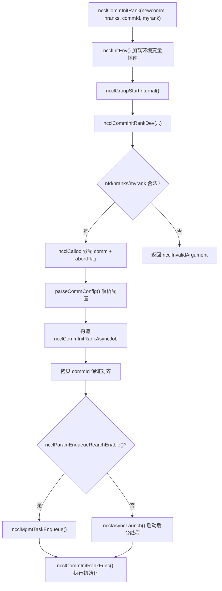
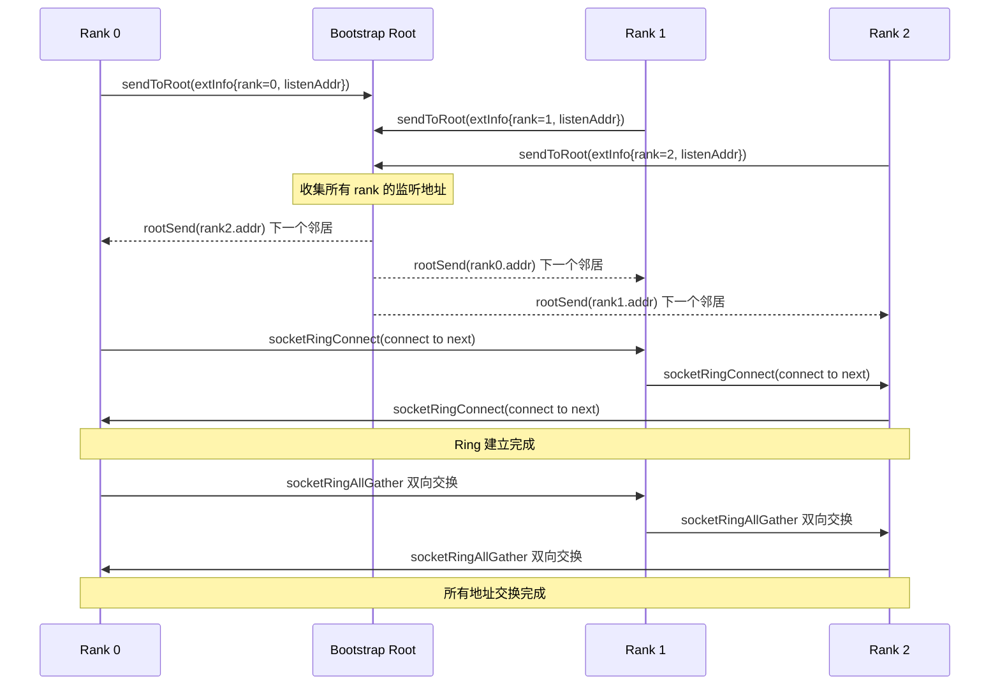
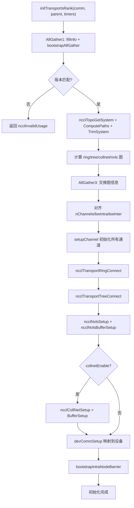

# 第 3 章：初期化の入口：ncclCommInitRank が孤立したプロセスの群れをどのように通信ドメインに構築するか

前章では、本書全体を貫く5つの中核抽象——ncclComm、channel、algorithm、protocol、transport——を確立しました。これらは共に「1回の通信 = 複数のchannel × 1つのalgorithm × 1つのprotocol × 複数のtransport」という共通語彙を構成しています。ここで、より根本的な問いに答える必要があります。このncclCommオブジェクトは一体どのようにして無から構築されるのか？ncclCommInitRankを呼び出すと、NCCLは数百ミリ秒以内に一連の複雑な操作を完了する必要があります。すべてのrankの到着確認、デバイス情報の交換、マシントポロジの検出、データパスの計算、GPUメモリとホストメモリの割り当て、そして最終的にこれらすべてを1つのncclCommオブジェクトにパッケージ化します。本章では、この呼び出しチェーンに沿って、APIエントリからinitTransportsRankの最後の毛細血管まで掘り下げていきます。

# 3.1 APIエントリ：ncclCommInitRankの同期シェルと非同期カーネル

## 直感的モデル

`ncclCommInitRank`表面的には「通信ドメインを作成する」ですが、実際には「バックグラウンドタスクを起動し、その後（デフォルトでは）完了を待つ」という処理を行っています。これはレストランで注文するようなものです。注文という動作（API呼び出し）は瞬時に戻りますが、厨房での調理（実際の初期化）はバックグラウンドで行われます。デフォルトの「ブロッキングモード」はカウンターの前で料理ができるまで待つだけであり、「非ブロッキングモード」では受け取り番号を受け取り、その間に別のことをすることができます。

この非同期設計がなければ、NCCLは初期化中にCUDA Graphキャプチャや複数通信ドメインの並列初期化などのシナリオと連携できません——すべての初期化が直列化され、ユーザーコードと重複できないブロッキング操作になってしまいます。

## データ構造とメモリレイアウト

まずAPIエントリ自体を見てみましょう。`ncclCommInitRank`は極めて薄い同期シェルです：

[FACT:src/init.cc:2946-2970]

これは4つのことを行います：呼び出し`ncclInitEnv()`環境変数プラグインのロード、NVTXパフォーマンスマーカーの有効化、現在のCUDAデバイス番号の読み取り、そして呼び出し`ncclGroupStartInternal()`groupセマンティクスに入り、最後に実際の作業を委譲します`ncclCommInitRankDev`。

注意`ncclGroupStartInternal()` / `ncclGroupEndInternal()`このペアの呼び出し——たとえ1つの通信ドメインだけを初期化する場合でも、NCCLはそれをgroupセマンティクスで包みます。これは「ユーザーが1つのgroup内で複数の通信ドメインを初期化する」シナリオを統一的に処理し、単一通信ドメインと複数通信ドメインで2つのコードパスを書くことを避けるためです。

実際のパラメータ検証とオブジェクト割り当ては`ncclCommInitRankDev`にあります：

[FACT:src/init.cc:2851-2943]

この関数はチェーン全体の「総合ディスパッチ台」です。まずパラメータ検証（`nId`範囲、`nranks`/`myrank`正当性）を行い、次に`ncclComm`構造体自体、および中止メカニズムに関連する3つのフィールドを割り当てます：`abortFlag`（ホスト側アトミックフラグ）、`abortFlagDev`（デバイス側から見える固定メモリコピー）、`abortFlagRefCount`（参照カウント。splitで生成された子通信ドメインが親通信ドメインのabortFlagを共有する可能性があるため）。

ここで注目すべき詳細があります——`comm->startMagic = comm->endMagic = NCCL_MAGIC`：

[FACT:src/init.cc:2886-2886]

このペアのmagic値は「封印」のように`ncclComm`構造体の先頭と末尾を挟んでいます。範囲外書き込みや構造体の破損はこのペアのmagicを破壊し、後続の操作でそれらを検証することでメモリ踏みつけを検出できます。これは安価ですが効果的なメモリ整合性保護です。

## Step-by-Step Walkthrough

ときに`ncclCommInitRankDev`最後まで到達すると、`ncclCommInitRankAsyncJob`を構築し非同期タスクを起動します：

[FACT:src/init.cc:2896-2929]

`job`構造体は初期化に必要なすべてのパラメータを保持します。注意`job->commId`は**コピー**されたものであり、ユーザーが渡した`commId`：

[FACT:src/init.cc:2903-2910]

を直接参照するのではありません。なぜコピーするのか？ソースコードのコメントが答えを与えています：`ncclUniqueId`と`ncclBootstrapHandle`のアライメント要件が異なり、ユーザーが渡した配列が`ncclBootstrapHandle`に必要な境界に正しくアライメントされていない可能性があります。新しく割り当てられたメモリにコピーすることでアライメントを保証できます。これは典型的な「ABI互換性の罠」です——ユーザーが見るのは`ncclUniqueId`ですが、内部的には`ncclBootstrapHandle`として扱う必要があり、両者は同じサイズですがアライメントが異なります。

最後に、`ncclParamEnqueueRearchEnable()`の値に応じて、タスクは管理キューに入るか、`ncclAsyncLaunch`を通じて直接起動されます：

[FACT:src/init.cc:2922-2929]

`ncclAsyncLaunch`は新しいスレッドを作成して`ncclCommInitRankFunc`を実行します。ブロッキングモード（デフォルト）の場合、呼び出し元は`ncclGroupEndInternal()`でこのスレッドの完了を待ちます。非ブロッキングモードの場合、呼び出し元は即座に戻り、ユーザーは後で`ncclCommGetAsyncError`でステータスをポーリングします。

## 設計上の考察

ここでの設計の核心は「同期API + 非同期実装」です。なぜ`ncclCommInitRank`にすべての初期化を直接同期的に実行させないのか？NCCLは`ncclCommInitRankConfig`の非ブロッキングモードをサポートする必要があり、非ブロッキングモードでは初期化がバックグラウンドスレッドで実行される必要があるからです。同期パスと非同期パスが2つのコードであれば、メンテナンスコストが倍増します。非同期に統一し、同期パスは「起動後すぐに待機」するだけなので、コードは1つだけです。



# 3.2 Bootstrap：rank間の最初の制御チャネル

## 直感的モデル

BootstrapはNCCLの「会議前のWeChatグループ」です。正式な通信が始まる前に、すべてのrankはまず制御チャネルを確立し、「私は誰で、どのマシンにいて、私のGPUは何モデルで、私のNICアドレスは何か」といったメタデータを交換する必要があります。bootstrapがなければ、rank間は互いに見知らぬ他人であり、いかなる通信も調整できません。

bootstrapが失敗またはタイムアウトすると、通信ドメインの初期化全体がスタックします——これは本番環境で最も一般的なNCCLハングの原因の1つです。

## データ構造とメモリレイアウト

Bootstrapの核心状態は`bootstrapState`構造体に保存されます：

[FACT:src/bootstrap.cc:527-546]

この構造体には、詳しく見る価値のある重要なフィールドがいくつかあります：

- `ring`：共用体であり、ネットワークデバイスハンドル（`net.sendComm`/`net.recvComm`）か、ソケットのペア（`socket.send`/`socket.recv`）のいずれかです。これは2つのbootstrapモードに対応します：ソケットベースのデフォルトモードと、ネットワークデバイスベースの`NCCL_OOB_NET_ENABLE`モードです。
- `listen`：リスナー側の情報で、同様にネットワークとソケットの2つの形態があります。
- `peerP2pAddresses` / `peerProxyAddresses`：すべてのrankのP2Pアドレスとproxyアドレスの配列で、ring allgatherによって埋められます。
- `unexpectedConnections`：リンクリストで、「受信したがまだマッチングされていない」接続をキャッシュします。これはbootstrapプロトコルの重要な設計です——受信側は誰が先に接続してくるかを予測できないため、マッチングされていない接続をまず保存しておく必要があります。
- `asyncSendQueue` + `asyncSendLock` + `asyncSendCond`：非同期送信キューとその同期プリミティブで、TLS暗号化モードでの並行送信に使用されます。

`bootstrapState`の割り当ては`bootstrapInit`の冒頭で行われます：

[FACT:src/bootstrap.cc:769-776]

`comm->bootstrap = state`の行に注目してください——bootstrap状態が通信ドメインに紐付けられ、以降のすべてのbootstrap操作は`comm->bootstrap`を通じてアクセスされます。

## Step-by-Step Walkthrough

`bootstrapInit`はbootstrapの主要関数です。実行順に分解してみましょう：

**ステップ1：magic値の決定。**magicはbootstrap通信の「合言葉」であり、同じmagicを持つrankだけが互いに接続できます。

[FACT:src/bootstrap.cc:778-788]

通常の初期化（`handles != NULL`）の場合、magicは最初のhandleから取得されます。split/grow（`parent != NULL`）の場合、magicは`hashCombine(parent->magic, parent->childCount)`を通じて派生されます。これにより、各サブ通信ドメインが一意のmagicを持つことが保証されます。

**ステップ2：リスニングソケットの作成。**各rankには2つのリスニングエンドポイントが必要です：1つはring隣接接続用（`STATE_LISTEN(state, socket)`）、もう1つはroot接続用（`listenSockRoot`）：

[FACT:src/bootstrap.cc:797-831]

ここに重要な役割分担があります：ringリスニングソケットは`comm->magic`を使用し、rootリスニングソケットは`BOOTSTRAP_HANDLE(handles, curr_root)->magic`を使用します。なぜでしょうか？rootはグローバルコーディネーターであり、すべてのrankがそれに接続するため、統一されたmagicを使用します。一方、ring隣接はポイントツーポイントであるため、通信ドメイン自身のmagicで十分です。

**ステップ3：接続の時間分散。**rank数が多い場合、すべてのrankが同時にrootに接続すると接続ストームが発生します。NCCLは`NCCL_UID_STAGGER_RATE`と`NCCL_UID_STAGGER_THRESHOLD`を使用して時間分散を制御します：

[FACT:src/bootstrap.cc:833-843]

あるrootが担当するrank数が閾値（デフォルト256）を超える場合、各rankはroot配下での自身のローカルIDに基づいて遅延マイクロ秒数を計算し、sleepします。これはシンプルですが効果的な「トークンバケット」方式のレート制限です。

**ステップ4：rootへの自身の接続情報の送信。**各rankは自身のリスニングアドレスをrootに送信します：

[FACT:src/bootstrap.cc:845-867]

rootはすべてのrankの情報を受け取ると、「リングペアリング」を行います——rank iのアドレスをrank i-1に送り、rank i+1のアドレスをrank iに送ります。これにより、各rankは自身のring上の前後の隣接ノードを知ることができます。

**ステップ5：ring接続の確立。**各rankは自身の「次」の隣接ノードに接続し、同時に「前」の隣接ノードからの接続を受け入れます：

[FACT:src/bootstrap.cc:885-894]

ここで`socketRingConnect`は内部的に`bootstrapConcurrent`を使用しています——TLS暗号化モードでは、connectとacceptは並行して実行する必要があります。そうしないとデッドロックします（TLSハンドシェイクは双方が同時に参加する必要があるため）。非暗号化モードでは、connectを実行してからacceptを直列に実行します。

**ステップ6：すべてのアドレスのAllGather。**ringが確立された後、`ringAllInfo`を通じてすべてのrankのP2Pアドレス、proxyアドレス、UDSアドレスを一度にallgatherします：

[FACT:src/bootstrap.cc:934-938]

`ringAllInfo`は内部的に`bootstrapAllGather`を呼び出し、後者はソケットモードで`socketRingAllGather`を使用します——双方向ring allgatherアルゴリズムで、N個のrankでN/2ステップしか必要としません：

[FACT:src/bootstrap.cc:1363-1412]

この双方向アルゴリズムはbootstrap性能の重要な最適化です。従来の単方向ring allgatherはN-1ステップ必要ですが、双方向版はステップ数を半減させます。各ステップで同時に両方向にデータを送受信し、`socketDoubleSendRecv`で4つの操作（2送信2受信）を1回のシステムコールにまとめます。

## 並行制御と低レベル相互作用

Bootstrapの並行制御にはいくつかの層があります：

**第1層：abortチェック。**すべてのブロッキングループは定期的にabortFlagをチェックします：

[FACT:src/bootstrap.cc:150-159]

`BOOTSTRAP_N_CHECK_ABORT`は10000に設定されており、10000回のループごとにabortフラグをチェックすることを意味します。この数値は性能と応答性のトレードオフです——チェックが頻繁すぎると性能に影響し、少なすぎるとabort応答が遅延します。

**第2層：非同期送信キュー。**TLS暗号化モードでは、`bootstrapSend`を同期的に実行できません（TLSハンドシェイクは受信側も参加する必要があるため）。そのためNCCLは送信操作を独立したスレッドに配置します：

[FACT:src/bootstrap.cc:1161-1217]

ここには巧妙な順序保証メカニズムがあります。`bootstrapAsyncSendMain`は送信前に、キュー内に「より早い、同じ(peer, tag)宛ての送信」がないかチェックします：

[FACT:src/bootstrap.cc:1124-1152]

なぜ同じ (peer, tag) の送信順序を保証する必要があるのか？ソースコードのコメントが明確に説明している：受信側は (peer, tag) で接続をマッチングするため、同じ (peer, tag) 宛の2つのメッセージが到着順序で逆転すると、受信側はそれらを誤ってマッチングしてしまう。NVLS の初期化中には同じ peer に対して同じ tag で複数回ブロードキャストするため、この順序保証は必須である。

**第三層：予期しない接続キュー。**受信側は誰が先に接続してくるかを予測できないため、`socketAccept`マッチしない接続を`unexpectedConnections`連結リストに格納する：

[FACT:src/bootstrap.cc:1276-1300]

この設計は古典的な分散問題を解決している：複数の rank が同時にあなたへ接続を開始する可能性があるが、あなたの`bootstrapRecv`呼び出し順序は固定されている。マッチしない接続を直接破棄すると、送信側はタイムアウトする；ブロックして待機すると、デッドロックする可能性がある。キューに格納するのが最も安全な方法である。

## 本番環境の落とし穴回避ガイド

**落とし穴1：bootstrap タイムアウトによる初期化のハング。**ある rank がネットワーク問題で root に接続できない場合、他のすべての rank は`ncclSocketAccept`または`ncclSocketRecv`で無限に待機する。NCCL には組み込みの bootstrap タイムアウト機構がなく、唯一の脱出経路は abortFlag である。本番環境では`NCCL_UID_STAGGER_RATE`を設定して、大規模クラスタの接続ストームを緩和することを推奨する。

**落とし穴2：`NCCL_COMM_ID`とマルチ handle の競合。**ユーザーが`NCCL_COMM_ID`環境変数を設定すると、NCCL は強制的に`nId`を 1 に下げる：

[FACT:src/init.cc:2912-2921]

これは`ncclCommInitRankScalable`のマルチ handle 機能がサイレントに無効化されることを意味する。scalable 初期化を使用していて`NCCL_COMM_ID`も設定している場合、動作は期待とは異なるものになる。

**落とし穴3：TLS モードでのデッドロック。**TLS 暗号化モードでは、connect と accept が並行して実行されないと、双方が TLS ハンドシェイクでスタックする。`bootstrapConcurrent`はまさにこの問題を解決するためのものである：

[FACT:src/bootstrap.cc:648-669]

非暗号化モードでは直列実行（先に send、後に recv）、暗号化モードではスレッドを1つ起動して send を処理し、メインスレッドが recv を処理する。



# 3.3 commAlloc：通信ドメインオブジェクトのメモリ骨格

## 直感的モデル

`commAlloc`は通信ドメインの「スケルトン状態での引き渡し」である——構造体のメモリを割り当て、すべてのフィールドを安全なデフォルト値に初期化し、必要な CUDA オブジェクトと同期プリミティブを作成するが、トポロジ情報、チャネル設定、転送接続といった「内装仕上げ」の内容はまだ充填されていない。もし`ncclComm`をビルに例えるなら、`commAlloc`は基礎工事とフレームの打設であり、`initTransportsRank`が内装である。

もし`commAlloc`の初期化がなければ、後続のコードが未初期化フィールドにアクセスして予測不能な動作を引き起こす——例えば`comm->channels[c].id`がランダム値だと、チャネル初期化ロジックがチャネル状態を誤判定する。

## データ構造とメモリレイアウト

`commAlloc`のシグネチャと冒頭の検証：

[FACT:src/init.cc:512-526]

まず`ndev`と`rank`の正当性を検証し、次に2つのメモリスタック（`memPermanent`と`memScoped`）を構築し、`rank`と`nRanks`を設定する。この2つのメモリスタックは NCCL のメモリ管理基盤である——`memPermanent`はライフサイクルが通信ドメインと同じ割り当てに使用され、`memScoped`は一時割り当てに使用される。

次は CUDA デバイスの検出である：

[FACT:src/init.cc:528-531]

`cudaGetDevice`で現在のデバイス番号を取得し、`ncclCudaCompCap`で計算能力を取得する。ソースコードのコメントは非常に率直である：「Try to create a CUDA object right away. If there is something wrong with the device we're on, better know it early.」——デバイスの問題を早期に露呈させ、初期化の後半になって初めて発見することを避ける。

次は共有リソースの割り当てまたは継承である：

[FACT:src/init.cc:533-555]

ここに重要な分岐がある：もし`parent == NULL || !parent->shareResources`なら、新しい`ncclSharedResources`を作成する；そうでなければ親通信ドメインの共有リソースを継承し、参照カウントを増やす。`ncclSharedResources`にはデバイスストリーム、ホストストリーム、起動イベント、scratch イベントなどが含まれる——これらのリソースは split シナリオで子通信ドメインに再利用でき、重複作成を避けられる。

注意すべきは`sharedRes->refCount = 1`の行である——初期参照カウントは1で、split で共有するたびにインクリメントされ、最後の参照が解放されたときに初めて実際に破棄される。

次はネットワーク、RMA、GIN の初期化である：

[FACT:src/init.cc:547-549]

これら3つのサブシステムはそれぞれネットワーク転送、リモートメモリアクセス、GPU 発起のネットワーク通信を担当する。それらの初期化順序には理由がある——`ncclNetInit`は`ncclRmaInit`より先でなければならない。RMA がネットワークプラグインに依存するためである。

メモリマネージャの初期化：

[FACT:src/init.cc:567-576]

同様に共有/新規作成の2つのパスがある。`ncclMemManager`は CUDA メモリプールと登録キャッシュの管理を担当する。

チャネル初期化マーカー：

[FACT:src/init.cc:607-608]

この行はすべてのチャネルの`id`を -1 に設定し、「未初期化」を表す。後続の`setupChannel`がこの値をチェックして初期化が必要かどうかを判断する。

割り込みキューの構築：

[FACT:src/init.cc:619-632]

NCCL は侵入型キュー（intrusive queue）を使用して各種タスクを管理する。これらのキューは`commAlloc`段階ですべて空に構築され、後続のタスクがエンキューされるときにそのまま使用される。

CUDA メモリプールの作成：

[FACT:src/init.cc:636-652]

デバイスがメモリプールをサポートしている場合（`cudaDevAttrMemoryPoolsSupported`）、pinned タイプのメモリプールを作成し、解放閾値を最大値（`~uint64_t(0)`）に設定する。これは「決して自動解放しない」という意味である。CUDA ランタイムが NCCL の関知しないうちにメモリを回収するのを避けるためである。

## Step-by-Step Walkthrough

具体的な初期化シナリオを追跡してみよう：単機8カード、各プロセス1 rank、通常の初期化。

1. `commAlloc(comm, NULL, 8, rank)`が呼び出され、`parent == NULL`。

2. 検証が通過し、`comm->rank = rank`，`comm->nRanks = 8`。

3. `cudaGetDevice`が現在のデバイス番号を返し、`comm->compCap`が設定される。

4. 新しい`ncclSharedResources`を作成し、参照カウントは1。

5. `ncclNetInit`ネットワークプラグイン（Socket または IB の可能性あり）を初期化します。

6. `ncclMemManagerInit`メモリマネージャを作成します。

7. `getBusId`PCI バス ID を取得し、`ncclNvmlDeviceGetHandleByPciBusId`NVML ハンドルを取得します。

8. `dmaBufSupported`DMA-BUF サポートを検出します。

9. 割り当て`connectSend` / `connectRecv`ビットマップ配列。

10. すべてのチャネル`id`を -1 に設定します。

11. すべての割り込みキューを構築します。

12. CUDA メモリプールを作成します。

## 設計上の考察

`commAlloc`の中で最も興味深い設計は「早期失敗」の原則です。これは関数の冒頭で`cudaGetDevice`を呼び出し、後でデバイス情報が必要になった時まで待ちません。この利点は、デバイスに問題がある場合（例えば他のプロセスに占有されている場合）、大量のメモリを割り当てた後に発見するのではなく、初期化の早い段階でエラーが露呈することです。

もう一つの設計は`preconnectNext`の初期化です：

[FACT:src/init.cc:598-598]

`reinterpret_cast<struct ncclComm*>(0x1)`は「次の事前接続」の状態をマークするためのセンチネル値です。このような不正なポインタ値を状態マーカーとして使う手法はシステムプログラミングでよく見られます——余分なブール型フィールドよりもメモリを節約できますが、デリファレンスしないよう注意が必要です。

# 3.4 initTransportsRank：トポロジ検出とチャネル割り当て

## 直感的モデル

`initTransportsRank`は初期化の「心臓」です。これは三つの大きなことを行います：二回の AllGather を通じてすべての rank のデバイス情報とトポロジ情報を交換し、その情報に基づいて ring/tree/collnet/nvls などのアルゴリズムのグラフ構造を計算し、最後にすべてのトランスポート接続を確立します。通信ドメインを都市の交通システムに例えるなら、`initTransportsRank`はすべての道路、立体交差、バス路線を計画するプロセスです。

このステップがなければ、NCCL はデータがどの経路を通るべきか分かりません——データを遠回りさせたり、到達可能な経路を全く見つけられない可能性があります。

## データ構造とメモリレイアウト

`initTransportsRank`のローカル変数は非常に多いため、重要なものだけを見ていきます：

[FACT:src/init.cc:1163-1179]

ここで`comm->graphs`配列内の各グラフ構造を取り出し、エイリアスを確立します。`graphs`配列はアルゴリズムでインデックスされ、`nvlsGraph`が二回使われていることに注意してください（NVLS と NVLSTree は同じグラフ構造を共有します）。

二つの重要な一時構造体：

[FACT:src/init.cc:1181-1206]

`graphInfo`は単一の rank の特定アルゴリズムに対するグラフ情報（チャネル数、帯域幅、タイプなど）を保持し、`allGatherInfo`は AllGather のデータ単位で、すべてのアルゴリズムのグラフ情報とトポロジ rank 情報を含みます。

## Step-by-Step Walkthrough

**フェーズ1：AllGather1——デバイス情報の交換。**

[FACT:src/init.cc:1234-1239]

各 rank は`fillInfo`を呼び出して自身の`ncclPeerInfo`を埋め、次に`bootstrapAllGather`を通じて交換します。`fillInfo`が埋める情報には：rank 番号、CUDA デバイス番号、NVML デバイス番号、NCCL バージョン、git hash、ホスト hash、プロセス hash、GPU UUID、バス ID、VRAM サイズ、ドライババージョンなどが含まれます。

[FACT:src/init.cc:888-982]

注意`info->hostHash = getHostHash() + commHash`と`info->pidHash = getPidHash() + commHash`——host hash と pid hash の両方に commHash が追加されています。これは同じマシン上の異なる通信ドメインを区別するためです。

AllGather 完了後、各 rank はすべての peer の情報を走査し、グローバル属性を計算します：

[FACT:src/init.cc:1250-1303]

このループは多くのことを行います：バージョンの不一致の検出、ノード数の集計、`cuMemSupport`の積集合の計算、複数の rank が同じ GPU を使用しているかの検出、GIN タイプマスクの積集合の計算など。注意`nNodes`の集計方法——異なる hostHash に遭遇するたびにインクリメントします。これは rank がノードごとに連続して配置されていることを前提としています。

**フェーズ2：トポロジ検出。**

[FACT:src/init.cc:1390-1403]

この六つのステップはトポロジ検出の中核フローです：`ncclTopoGetSystem`はシステムデバイスを列挙してトポロジグラフを構築し、`ncclTopoComputePaths`は GPU から NIC へのパスを計算し、`ncclTopoTrimSystem`は到達不可能なデバイスを除去し、再度パスを計算し、`ncclTopoSearchInit`は検索状態を初期化し、最後にトポロジを出力します。

**フェーズ3：グラフ計算。**

[FACT:src/init.cc:1421-1468]

順に ring、tree、collnet chain、collnet direct、nvls の五つのグラフを計算します。各グラフには異なる pattern とチャネル数の制約があります。注意`treeGraph->minChannels = ringGraph->nChannels`——tree のチャネル数は ring と同じに制約されています。これは異なるアルゴリズム間のチャネル整合性を保証するためです。

**フェーズ4：AllGather3——グラフ情報の交換。**

[FACT:src/init.cc:1490-1533]

各 rank は自身のグラフ情報を`allGather3Data[rank]`に埋め、再び`bootstrapAllGather`します。今回交換される情報には：各アルゴリズムの pattern/nChannels/bwIntra/bwInter/typeIntra/typeInter/crossNic、CPU アーキテクチャ、P2P チャネル数、ネットワークデバイス数、CollNet デバイス数などが含まれます。

AllGather3 完了後、各 rank はすべての peer のグラフ情報を走査し、最小値/最大値を取って整合させます：

[FACT:src/init.cc:1687-1703]

ここでの整合戦略に注意：`nChannels`、`sameChannels`、`bwIntra`、`bwInter`は最小値を取り、`typeIntra`、`typeInter`、`crossNic`は最大値を取ります。なぜか？チャネル数と帯域幅は最も弱いリンクに制限され、タイプと crossNic は互換性を確保するために和集合を取る必要があるからです。

**フェーズ5：トランスポート接続の確立。**

[FACT:src/init.cc:1811-1892]

ここには二つの分岐があります：`runtimeConn`が真の場合はチャネル setup のみを行い接続は行わず（実行時まで接続を遅延）、そうでなければ直ちにすべての接続を確立します。接続順序は：ring → tree → NVLS → PAT → NVLS tree → CollNet です。

## 並行制御とハードウェア相互作用

`initTransportsRank`には注目すべき並行/ハードウェア相互作用点がいくつかあります：

**CPU アフィニティ設定：**

[FACT:src/init.cc:1406-1412]

NCCL は現在のスレッドを GPU 近くの CPU コアにバインドし、ホストメモリの割り当てがローカル NUMA ノードになるようにする。これにより NUMA 間アクセスのレイテンシが削減される。

**NVLS 初期化：**

[FACT:src/init.cc:1419-1419]

`ncclNvlsInit`NVLink SHARP サポートを検出する。NVLS はスイッチが直接 reduce 操作を実行できるようにし、AllReduce レイテンシを大幅に削減する。

**Proxy スレッド作成：**

[FACT:src/init.cc:1780-1786]

Proxy スレッドはネットワーク I/O を非同期に進める役割を担う。これは`initTransportsRank`内で作成され、以降のすべてのネットワーク操作は proxy を経由して行われる。

## 本番環境の落とし穴ガイド

**落とし穴1：ネットワークデバイス数の不一致。**異なる rank のローカル NIC 数が異なる場合、NCCL はエラーを報告する：

[FACT:src/init.cc:1576-1596]

ただし`NCCL_IGNORE_NET_MISMATCH=1`を設定した場合を除く。これは異種クラスタでよく見られる——8枚の NIC を持つノードもあれば、4枚しか持たないノードもある。不一致を無視すると、チャネル数が最も弱いノードに制限されるため、性能低下を引き起こす可能性がある。

**落とし穴2：複数の rank が同じ GPU を共有。**2つの rank の GPU UUID が同じ場合、NCCL は初期化を拒否する：

[FACT:src/init.cc:1291-1296]

ただし`NCCL_MULTI_RANK_GPU_ENABLE=1`を設定した場合を除く。このチェックはユーザーの誤設定による性能問題を防ぐ。

**落とし穴3：CollNet ノード数不足。**CollNet を有効にするには少なくとも`NCCL_COLLNET_NODE_THRESHOLD`個のノードが必要：

[FACT:src/init.cc:1720-1728]

デフォルトの閾値は 2。単一ノード環境では CollNet は自動的に無効化される。



# 3.5 NCCL_PARAM：環境変数体系のコンパイル期の魔法

## 直感的モデル

`NCCL_PARAM`は NCCL の「設定スイッチ工場」である。マクロを使ってコンパイル期に関数を生成し、実行時に最初の呼び出しで環境変数を読み取って結果をキャッシュする。これは家の電灯のスイッチのようなもの——あなたがパチッと押すと（関数を呼び出す）、電気がつく（設定値が返る）。その後スイッチの状態は記憶され、毎回押し直す必要はない。

もしこの仕組みがなければ、NCCL は設定を使用する各箇所で手動で`getenv`を呼び出して文字列を解析する必要があり、コードは極めて冗長でエラーを起こしやすくなる。

## データ構造とメモリレイアウト

`NCCL_PARAM`マクロの定義：

[FACT:src/include/param.h:22-31]

このマクロは展開されると関数`ncclParam##name()`を生成し、内部に3つの静的変数を持つ：

- `uninitialized = INT64_MIN`：センチネル値で、「まだ初期化されていない」ことを示す。
- `noCache`：三態フラグで、-1 は未初期化、0 はキャッシュ、1 は非キャッシュを表す。
- `cache`：キャッシュされた値で、初期値は`uninitialized`。

関数のロジックは：もし`cache`がまだ`uninitialized`なら、`ncclLoadParam`を呼び出してロードする。そうでなければ直接`cache`。`COMPILER_EXPECT(..., false)`を返す。

`ncclLoadParam`はコンパイラにこの分岐がほとんど通らないことを伝え、ホットパスを最適化する。

[FACT:src/misc/param.cc:78-108]

の実装：`noCache`ミューテックスロックでロードプロセス全体を保護し、まず

## Step-by-Step Walkthrough

ポリシーを確認し、次にキャッシュが有効かどうかを確認し、その後環境変数を読み取って解析する。解析に失敗した場合はデフォルト値を使用し、警告を出力する。`NCCL_PARAM(BuffSize, "BUFFSIZE", -2)`を例にとると：

[FACT:src/init.cc:1007-1007]

マクロ展開後は以下を生成する：

```cpp
int64_t ncclParamBuffSize() {
  constexpr int64_t uninitialized = INT64_MIN;
  static int8_t noCache = -1;
  static_assert(-2 != uninitialized, "...");
  static int64_t cache = uninitialized;
  if (COMPILER_EXPECT(COMPILER_ATOMIC_LOAD(&cache, std::memory_order_relaxed) == uninitialized, false)) {
    return ncclLoadParam("NCCL_BUFFSIZE", -2, uninitialized, &cache, &noCache);
  }
  return cache;
}
```

最初の呼び出し時、`cache == uninitialized`、`ncclLoadParam`に入る。これは`NCCL_BUFFSIZE`環境変数を読み取り、設定されていなければデフォルト値 -2 を返す。その後`noCache`ポリシーに基づいてキャッシュするかどうかを決定する。

`noCache`ポリシーは`ncclParamIsCacheDisabled`によって決定される：

[FACT:src/misc/param.cc:74-76]

環境変数名があるパターンに一致する場合（例えば`_`で終わる）、キャッシュせず毎回読み直す。これによりユーザーは実行時に一部の設定を動的に変更できる。

## 設計上の考察

この設計の妙は「ゼロコスト抽象化」にある：ホットパス上には1回のアトミックロードと比較しかなく、ロックも文字列解析もない。コールドパス（初回ロード）でのみ完全なコストを支払う。`COMPILER_EXPECT`はコンパイラにホットパスを命令キャッシュの前方に配置するよう促し、性能をさらに向上させる。

もう一つの設計は`noCache`の三態設計である。-1 は「まだ決定していない」、0 は「キャッシュ」、1 は「非キャッシュ」を表す。この決定は初回ロード時に一度だけ行われ、その後は変わらない。

## 本番環境の落とし穴ガイド

**落とし穴1：環境変数のスペルミス。**もしユーザーが`NCCL_BUFSIZE`ではなく`NCCL_BUFFSIZE`と書いた場合、NCCL はエラーを報告せず、デフォルト値を使用するだけである。`NCCL_DEBUG=ENV`を使って認識されたすべての環境変数を確認することを推奨する。

**落とし穴2：`NCCL_CONF_FILE`のロード順序。**NCCL は順に`$NCCL_CONF_FILE`（または`~/.nccl.conf`）と`/etc/nccl.conf`：

[FACT:src/misc/param.cc:52-67]

をロードする。後にロードされたファイルが先にロードされたものを上書きする。両方のファイルが同じ変数を設定している場合、`/etc/nccl.conf`の値が有効になる。

**落とし穴3：`noCache`変数のスレッドセーフティ。**ソースコードのコメントには「noCache is only load/stored within the mutex, no need for atomic」とある：

[FACT:src/misc/param.cc:74-76]

これは`noCache`の読み書きがミューテックスロックで保護されており、アトミック操作が不要であることを意味する。しかし`cache`の読み取りはロックフリー（ホットパス）であるため、アトミックロードを使用する。

# 3.6 devCommSetup：通信ドメインをデバイスにマッピングする

## 直感的モデル

`devCommSetup`は通信ドメインの「デバイス側投影」である。GPU kernel はデバイス上で動作し、ホストメモリ内の`ncclComm`構造体に直接アクセスできない。そのため NCCL は通信ドメインの重要フィールドをデバイスからアクセス可能なメモリにコピーし、`ncclDevComm`を形成する。これは会社の連絡先をコピーして各従業員の席に置くようなもの——従業員は毎回受付に同僚の電話番号を聞きに行く必要がない。

もし`devCommSetup`がなければ、GPU kernel は自分の rank、チャネル設定、バッファサイズなどの情報を知ることができず、集合通信 kernel はそもそも起動できない。

## データ構造とメモリレイアウト

`devCommSetup`は一時構造体`ncclKernelCommAndChannels`を使ってデバイスにコピーするデータをパッケージする：

[FACT:src/init.cc:712-746]

この構造体は`ncclDevComm`（デバイス側通信ドメイン）とチャネル配列を含む。関数はまずホスト側のデータを一時構造体に埋め、その後一度に`cudaMemcpyAsync`でデバイスへ転送する。

重要フィールドの埋め込み：

[FACT:src/init.cc:734-746]

注意`comm->devComm = &devCommAndChans->comm`——ホスト側の`comm->devComm`はデバイスメモリ内の`ncclDevComm`を指す。以降の kernel 起動時に`comm->devComm`が引数として渡される。

チャネル情報の充填：

[FACT:src/init.cc:829-843]

各チャネルの peers、ring、tree、collnetChain、collnetDirect、nvls ポインタがデバイス側にコピーされる。注意`ring.userRanks`には追加で一度の`cudaMemcpyAsync`が必要である。なぜならそれは配列だからである。

## Step-by-Step Walkthrough

1. デバイスストリームの取得：`ncclStrongStreamAcquire`強ストリーム（strong stream）を取得し、後続の非同期コピーが順序通りに実行されることを保証する。

2. デバイスメモリの割り当て：`ncclCudaCallocAsync`を割り当てる`devCommAndChans`。

3. ホスト側の一時構造体の充填：rank、nRanks、node、nNodes、abortFlag、buffSizes などを設定する。

4.`rankToLocalRank`配列の割り当てとコピー。

5.`workFifoBytes`の計算：CC（Confidential Computing）状態に基づいて決定する。

6. workFifo バッファの割り当て：GDR モードでは`ncclGdrCudaCalloc`を使用し、それ以外では`ncclCudaHostCalloc`。

を使用する

7. profiler カウンタの割り当て。

8. 進捗カウンタの割り当て（有効な場合）。

9. チャネル情報の充填。`ncclCudaMemcpyAsync(devCommAndChans, &tmpCommAndChans, 1, deviceStream)`。

10. デバイスへの一括コピー：

## 11. 強ストリームの解放と同期。

`devCommSetup`設計上の考察`cudaMemcpy`の中で最も注目すべき設計は「バッチコピー」である。NCCL は各フィールドごとに個別に`cudaMemcpyAsync`を呼び出すのではなく、すべてのフィールドを一時構造体にまとめ、一度の

で完了させる。これにより CUDA API 呼び出し回数と同期オーバーヘッドが大幅に削減される。`workFifoBytes`もう一つの設計は

[FACT:src/init.cc:750-763]

の CC 処理である：`workFifoBytes`CC（Confidential Computing）モードでは、

## は 0 に設定される。なぜなら GDR コピーは CC モードでは利用できないからである。これはハードウェア制限に対するエレガントなデグレードである。

**本番環境の落とし穴ガイド`devCommSetup`落とし穴1：**は barrier の前に呼び出す必要がある。

[FACT:src/init.cc:1950-1952]

ソースコードのコメントがその理由を説明している：

**barrier の後に呼び出すと、一部のスレッドがすでに NCCL カーネルの起動を開始している可能性があり、その時点でデバイスメモリの割り当てが完了していないため、デッドロックが発生する。`workFifoBytes`落とし穴2：**は 2 の冪でなければならない。

[FACT:src/init.cc:757-762]

# そうでない場合、NCCL は警告を出してデフォルト値を使用する：

本章の考察とセルフチェック[FACT:src/init.cc:1291-1296]Q1: もし

**における「複数の rank が同一 GPU を使用している」ことを検出するロジックを削除した場合、どのようなシナリオで問題が発生するか？なぜ NCCL はデフォルトでこのような構成を拒否するのか？**：

参考解析`NCCL_MULTI_RANK_GPU_ENABLE=0`このコードは同一ホスト上の2つの rank の GPU UUID が同じかどうかを検出する。もし同じであり、かつ`ncclInvalidUsage`。

（デフォルト）であれば、

1. **を返す。このチェックを削除すると、複数の rank が同じ GPU を共有することになる。これにより以下が発生する：**P2P 転送の衝突

2. **：NCCL の P2P 転送は各 rank が1つの GPU を独占することを前提としている。2つの rank が GPU を共有すると、それらは同時に同じ GPU の同じバッファにデータを書き込み、データ競合と結果の誤りを引き起こす。**：`comm->channels`チャネル割り当ての衝突

3. **内のチャネルリソース（バッファ、FIFO）は rank ごとに割り当てられる。GPU を共有する rank は同じリソースを奪い合うことになる。**パフォーマンスの破綻

：たとえ正確性の問題がなくても、2つの rank が1つの GPU の演算能力とメモリ帯域幅を共有すると、パフォーマンスは急激に低下する。`NCCL_MULTI_RANK_GPU_ENABLE=1`NCCL がデフォルトでこの構成を拒否するのは「早期失敗」のためである——ユーザーが誤った構成で何時間もデバッグに浪費するよりも、初期化時に明確にエラーを報告する方がよい。

は、自分が何をしているか明確に理解しているユーザー（例えば MPS シナリオ）のための脱出経路として用意されている。[FACT:src/bootstrap.cc:1129-1134]Q2: もし

**における「同一 (peer, tag) のより早い送信」を待つロジックを削除した場合、どのようなシナリオで受信側のマッチングエラーが発生するか？**：

参考解析

このコードは非同期送信スレッドにおいて、キュー内に同一 (peer, tag) 宛てのより早い送信がなくなるまで待機する。`socketAccept`この待機を削除すると、同一 (peer, tag) 宛ての2つの送信が並行して実行される可能性があり、受信側に到達する順序が不定になる。受信側の

[FACT:src/bootstrap.cc:1291-1292]

は (peer, tag) で接続をマッチングする：`bootstrapSend`もし送信者 A が先に

を呼び出したが後に到達し、送信者 B が後に呼び出したが先に到達した場合、受信側は B のメッセージを A の応答として扱う。これによりデータの齟齬が生じる——受信側は最初のリクエストの応答を受け取ったと思い込むが、実際には2番目のリクエストのものである。

ソースコードのコメントはこのシナリオを明確に指摘している：「NVLS setup broadcasts to the same peers with the same tag several times during init」。NVLS の初期化中に同一 peer へ同一 tag で複数回ブロードキャストが行われ、順序が逆転すると NVLS 設定が完全に混乱する。

この順序保証のコストは：同一 (peer, tag) の送信が直列化されることである。しかし異なる (peer, tag) の送信は依然として並行であるため、全体のスループットには影響しない。[FACT:src/init.cc:1691-1697]Q3: もし

**におけるアライメント戦略を「nChannels は min、typeIntra は max」から「すべて min」または「すべて max」に変更した場合、それぞれどのような問題が発生するか？**：

参考解析`nChannels`、`sameChannels`、`bwIntra`、`bwInter`現在の戦略は：`typeIntra`、`typeInter`、`crossNic`は min を取り、

**は max を取る。**：`typeIntra`もしすべて min を取ると`typeInter`min を取ると、一部の rank の転送タイプが降格される可能性があります。例えば rank A が P2P（typeIntra=P2P）をサポートし、rank B が SHM（typeIntra=SHM）のみをサポートする場合、min を取るとすべての rank が SHM を使用します。しかし SHM の列挙値が P2P より小さい可能性があり、min を取ると誤ったタイプが選択されます。実際には`typeIntra`はビットマスクまたは列挙型であり、max を取るのは「最も能力の高い」タイプを選択するためです。

**すべて max を取る場合**：`nChannels`max を取ると、一部の rank にその能力を超えるチャネル数が割り当てられる可能性があります。例えば rank A が 4 チャネルしかサポートできず、rank B が 8 をサポートする場合、max を取るとすべての rank が 8 チャネルを使おうとし、rank A は失敗するか性能が低下します。`bwIntra`max を取ると帯域幅の見積もりが過度に楽観的になり、tuning モジュールが不適切なアルゴリズムを選択する可能性があります。

このアライメント戦略の本質は：**リソース制約は交差集合（min）、能力列挙は和集合（max）を取る**。チャネル数と帯域幅は「上限」制約であり、最も保守的な値を取る必要があります。転送タイプは「能力」の列挙であり、最大値を取ることですべての rank が互換性のある転送方式を見つけられることを保証します。

次章ではトポロジー探索とグラフ検索を深掘りし、NCCL がマシン内の GPU、NIC、PCI スイッチをどのように列挙し、完全なトポロジーグラフを構築し、そのグラフ上で最適な ring と tree 構造を探索するかを見ていきます。本章で確立した bootstrap 通信、commAlloc メモリ骨格、initTransportsRank の主要フローは、次章でそのトポロジーの詳細を一つずつ展開します。

ここまでで、ncclCommInitRank の呼び出しチェーンを完全に辿り、ncclComm オブジェクトがゼロから構築される全過程を明らかにしました。しかし初期化プロセスには、ざっと流しただけの重要な环节があります：NCCL はマシン内部の GPU と NIC をどのように検出し、それに基づいてデータがどの経路を通るべきかを決定するのか？これこそが次章で深掘りするテーマ——トポロジー探索とグラフ検索です。src/graph/topo.cc が PCI/NVLink/NIC デバイスをどのように列挙しトポロジーグラフを構築するか、src/graph/search.cc がそのグラフ上で最適経路をどのように探索するか、そして src/graph/rings.cc と trees.cc が検索結果を Ring と Tree アルゴリズムトポロジーとしてどのように具体化するかを分解します。この仕組みを理解すれば、NCCL が異なるマシンで自動的に適切なアルゴリズムを選択できる理由がわかるでしょう。
