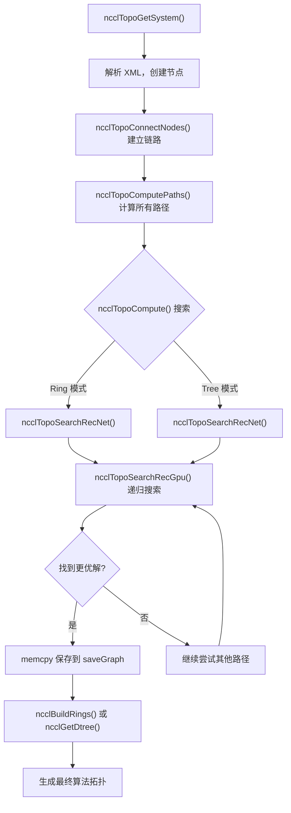
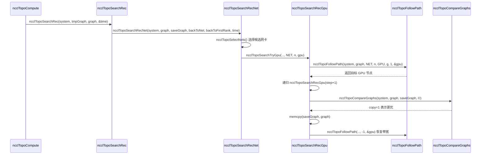

# 第 4 章：トポロジー探索とグラフ検索：NCCL がマルチ GPU システムの物理相互接続をどのように「見る」か

前章では ncclCommInitRank の呼び出しチェーンを層ごとに掘り下げ、comm->topo フィールドがいつ埋められるかを見ましたが、その内部構造は展開しませんでした。では、NCCL は一体どのようにマシン内の GPU と NIC を「見て」、それらを利用可能なトポロジー情報として組織するのでしょうか？本章ではこのプロセスの 3 つの重要な环节を分解します：topo.cc は物理デバイスをグラフとして列挙し、search.cc はそのグラフ上で最適経路を探索し、rings.cc と trees.cc は検索結果を Ring と Tree の 2 種類のアルゴリズムトポロジーとして具体化します。この 3 者の連携を理解してこそ、NCCL が異なるマシンで自動的に適切なアルゴリズムを選択できる理由がわかります。

# トポロジーグラフ：マシンを一枚の「地下鉄路線図」として描く

## 直感モデル

あなたが未知の都市に来たばかりの配達員だと想像してください。荷物を A 地点から B 地点へ届ける必要がありますが、どの道が最速かわかりません。あなたには地図が必要です——そこにはすべての駅（GPU、NIC、CPU、PCI スイッチ）と駅間の接続（NVLink、PCIe、ネットワーク）が記されています。NCCL のトポロジーグラフがこの地図です。

もしこの地図がなければ、NCCL は「すべての GPU 間の帯域幅は同じ」と盲目的に仮定するしかなく、8 枚の NVLink 全相互接続マシンではまだ何とかなるかもしれませんが、NUMA をまたぐ場合、PCI スイッチをまたぐ場合、NVLink + PCIe の混在する複雑なトポロジーに遭遇すると、誤った経路を選択し、本来 NVLink を通るべきデータを低速な PCIe に押し込んで、性能が半減してしまいます。

## データ構造とメモリレイアウト

トポロジーグラフの核心は`ncclTopoSystem`であり、ノードタイプごとにグループ化してすべてのデバイスを格納します。ノードタイプは`topoNodeTypeStr`配列で定義されています：

[FACT:src/graph/topo.cc:33-35]

```c
const char* topoNodeTypeStr[] = {"GPU", "PCI", "NVS", "CPU", "NIC", "NET", "GIN", "RMA", "DEV", "CXB"};
const char* topoLinkTypeStr[] = {"LOC", "NVL", "", "C2C", "PCI", "", "", "", "", "SYS", "NET"};
const char* topoPathTypeStr[] = {"LOC", "NVL", "NVB", "C2C", "PIX", "PXB", "P2C", "PXN", "PHB", "SYS", "NET", "DIS"};
```

これら 3 つの配列はそれぞれノードタイプ、リンクタイプ、パスタイプの文字列表現を定義しています。注意すべきは`topoPathTypeStr`の順序——これは同時にパス品質のソートとしても機能します：インデックスが小さいほどパスが速い。`LOC`（ローカル）が最速、`DIS`（切断）が最遅。この順序は後続の検索でパスの優劣を比較するために繰り返し使われます。

各ノードは`ncclTopoNode`で表され、作成時にタイプに応じて異なるフィールドが初期化されます。GPU ノードを例に取ります：

[FACT:src/graph/topo.cc:105-141]

```c
ncclResult_t ncclTopoCreateNode(struct ncclTopoSystem* system, struct ncclTopoNode** node, int type, uint64_t id) {
  if (system->nodes[type].count == NCCL_TOPO_MAX_NODES) {
    WARN("Error : tried to create too many nodes of type %d", type);
    return ncclInternalError;
  }
  struct ncclTopoNode* n = system->nodes[type].nodes + system->nodes[type].count;
  system->nodes[type].count++;
  n->type = type;
  n->id = id;
  if (type == GPU) {
    n->gpu.dev = NCCL_TOPO_UNDEF;
    n->gpu.rank = NCCL_TOPO_UNDEF;
    n->gpu.cudaCompCap = NCCL_TOPO_UNDEF;
    n->gpu.mloPart = NCCL_TOPO_UNDEF;
  } else if (type == CPU) {
    ...
```

ここにはいくつかの重要な設計ポイントがあります。第一に、ノードは事前に割り当てられた配列（`system->nodes[type].nodes`）に格納され、リンクリストではありません。これは、ノードがメモリ内で連続して配置され、走査時にキャッシュフレンドリーであることを意味します。第二に、`NCCL_TOPO_MAX_NODES`はハード上限であり、超えるとエラーになります——これはトポロジ異常時に無限に増加するのを防ぐためです。第三に、各ノードには`id`フィールドがあり、これは 64 ビット整数で、上位 32 ビットは systemId（どのホストかを識別）、下位 32 ビットは localId（ホスト内のデバイス番号）です。

ノード間の接続は`ncclTopoLink`で表されます。`ncclTopoConnectNodes`は双方向接続の確立を担当します：

[FACT:src/graph/topo.cc:179-204]

```c
ncclResult_t ncclTopoConnectNodes(struct ncclTopoNode* node, struct ncclTopoNode* remNode, int type, float bw) {
  // Aggregate links into higher bw for NVLink
  struct ncclTopoLink* link;
  for (link = node->links; link - node->links != NCCL_TOPO_MAX_LINKS && link->remNode; link++) {
    if (link->remNode == remNode && link->type == type) break;
  }
  if (link - node->links == NCCL_TOPO_MAX_LINKS) {
    WARN("Error : too many Topo links (max %d)", NCCL_TOPO_MAX_LINKS);
    return ncclInternalError;
  }
  if (link->remNode == NULL) node->nlinks++;
  link->type = type;
  link->remNode = remNode;
  link->bw += bw;

  // Sort links in BW descending order
  struct ncclTopoLink linkSave;
  memcpy(&linkSave, link, sizeof(struct ncclTopoLink));
  while (link != node->links) {
    if ((link - 1)->bw >= linkSave.bw) break;
    memcpy(link, link - 1, sizeof(struct ncclTopoLink));
    link--;
  }
  memcpy(link, &linkSave, sizeof(struct ncclTopoLink));
  return ncclSuccess;
}
```

この関数は 3 つのことを行います。第一に、同じターゲット、同じタイプへのリンクが既に存在するかを検索し——存在する場合、帯域幅を累加します（`link->bw += bw`）。これは複数の NVLink が同じ GPU に接続されている場合を処理します：4 本の NVLink が各 25 GB/s で、集約すると 100 GB/s になります。第二に、見つからなければ新しいリンクを追加します。第三に、挿入後に帯域幅の降順で並べ替え、その後の走査時に高帯域幅リンクが優先的に見られるようにします。

> **[Design Inference & Architectural Trade-offs]**
> 帯域幅を降順に並べる設計の動機は、探索アルゴリズムが高帯域幅パスを早期に発見し、より速く優れた解に収束できるようにすることです。探索にはタイムアウト制限があり（後で`NCCL_SEARCH_TIMEOUT`を見ます）、ソートにより限られた時間予算をより有望なパスに費やすことができます。

## シナリオ駆動のステップバイステップウォークスルー

ここで具体的なシナリオを想定します：8 枚の A100 を搭載したサーバーで、各カードは NVLink で全相互接続され、さらに 4 枚の Mellanox ConnectX-6 ネットワークカードが PCIe スロットに挿されています。NCCL の初期化時に、`ncclTopoGetSystem`が呼び出され、XML ファイル（`nvidia-topologyd`または NCCL 自身によって生成される）からデバイス情報を読み取り、トポロジグラフを構築します。

第一步、CPU ノードを解析します。`ncclTopoAddCpu`は XML から CPU のアーキテクチャ、ベンダー、モデルを読み取り、CPU ノードを作成します：

[FACT:src/graph/topo.cc:806-875]

```c
ncclResult_t ncclTopoAddCpu(struct ncclXmlNode* xmlCpu, struct ncclTopoSystem* system) {
  int numaId;
  NCCLCHECK(xmlGetAttrInt(xmlCpu, "numaid", &numaId));
  int systemId;
  NCCLCHECK(ncclGetSystemId(system, xmlCpu, &systemId));
  struct ncclTopoNode* cpu;
  NCCLCHECK(ncclTopoCreateNode(system, &cpu, CPU, NCCL_TOPO_ID(systemId, numaId)));
  ...
  for (int s = 0; s nSubs; s++) {
    struct ncclXmlNode* node = xmlCpu->subs[s];
    if (strcmp(node->name, "pci") == 0) NCCLCHECK(ncclTopoAddPci(node, system, cpu, systemId, numaId));
    if (strcmp(node->name, "nic") == 0) {
      ...
    }
  }
  return ncclSuccess;
}
```

CPU ノードはトポロジツリーのルートです。各 CPU の下には PCI サブツリーと NIC ノードがぶら下がります。`ncclTopoAddPci`は PCI ツリーを再帰的に処理し、GPU に遭遇すると GPU ノードを作成し、NIC に遭遇すると NIC ノードを作成します。

第二步、NVLink 接続を追加します。注意：`ncclTopoAddGpu`は GPU の基本属性のみを読み取り、コメントには明確に "Do not go any further, nvlinks will be added in a second pass" と書かれています：

[FACT:src/graph/topo.cc:590-598]

```c
ncclResult_t ncclTopoAddGpu(struct ncclXmlNode* xmlGpu, struct ncclTopoSystem* system, struct ncclTopoNode* gpu) {
  NCCLCHECK(xmlGetAttrInt(xmlGpu, "rank", &gpu->gpu.rank));
  NCCLCHECK(xmlGetAttrInt(xmlGpu, "sm", &gpu->gpu.cudaCompCap));
  NCCLCHECK(xmlGetAttrInt(xmlGpu, "dev", &gpu->gpu.dev));
  NCCLCHECK(xmlGetAttrInt(xmlGpu, "gdr", &gpu->gpu.gdrSupport));
  NCCLCHECK(xmlGetAttrIntDefault(xmlGpu, "mlopart", &gpu->gpu.mlopart, NCCL_TOPO_UNDEF));
  // Do not go any further, nvlinks will be added in a second pass
  return ncclSuccess;
}
```

なぜ 2 パスに分けるのか？NVLink は GPU 間の接続であり、両端の GPU ノードが既に存在しないとリンクを確立できないからです。最初のパスですべてのノードを作成し、2 番目のパスで`ncclTopoAddNvLinks`がそれらを接続します。

第三步、ネットワークデバイスを処理します。`ncclTopoAddNic`は NIC 下の net/gin/rma 子ノードを走査し、それぞれ対応する追加関数を呼び出します。`ncclTopoAddNet`を例に取ります：

[FACT:src/graph/topo.cc:461-503]

```c
static ncclResult_t ncclTopoAddNet(struct ncclXmlNode* xmlNet, struct ncclXmlNode* parent,
                                   struct ncclTopoSystem* system, struct ncclTopoNode* nic, int systemId) {
  int dev;
  NCCLCHECK(xmlGetAttrInt(xmlNet, "dev", &dev));
  int64_t netId = NCCL_TOPO_ID(systemId, dev);
  struct ncclTopoNode* net;
  NCCLCHECK(ncclTopoCreateNode(system, &net, NET, netId));
  net->net.dev = dev;
  int mbps;
  NCCLCHECKNOWARN(xmlGetAttrIntDefault(xmlNet, "speed", &mbps, 0), NCCL_GRAPH);
  if (mbps net.bw = mbps / 8000.0;
  ...
  NCCLCHECK(ncclTopoConnectNodes(nic, net, LINK_NET, net->net.bw));
  NCCLCHECK(ncclTopoConnectNodes(net, nic, LINK_NET, net->net.bw));
  return ncclSuccess;
}
```

注意：`mbps / 8000.0`この変換：mbps はメガビット毎秒で、8000 で割ると GB/s になります（1 GB/s = 8000 Mbps のため）。ネットワークカードが speed = -1 を報告する場合（一部の仮想ネットワークカードがそうします）、デフォルトで 10000 Mbps = 1.25 GB/s とします。

第四步、仕上げ処理。`ncclTopoGetSystemFromXml`はすべてのノードとリンクの追加が完了した後、いくつかのクリーンアップ作業も行います：

[FACT:src/graph/topo.cc:1080-1088]

```c
  NCCLCHECK(ncclTopoAddNvLinks(topNode, *topoSystem, NULL, 0));
  NCCLCHECK(ncclTopoAddC2c(topNode, *topoSystem, NULL, 0));
  NCCLCHECK(ncclTopoAddPciLinks(topNode, *topoSystem, NULL, 0));

  NCCLCHECK(ncclTopoFlattenBcmSwitches(*topoSystem));
  NCCLCHECK(ncclTopoConnectCpus(*topoSystem));
  NCCLCHECK(ncclTopoSortSystem(*topoSystem));
```

`ncclTopoFlattenBcmSwitches`は Broadcom Gen4 PCIe スイッチの特殊なケースを処理します——それらは自身を 2 層スイッチとして提示しますが、実際には全帯域幅であり、探索アルゴリズムが誤導されないように「平坦化」する必要があります。`ncclTopoConnectCpus`はすべての CPU ノードを相互接続します（NUMA を跨ぐアクセスは SYS リンクを通ります）。`ncclTopoSortSystem`はリンクをソートし、PCI ダウンストリームリンクを前に配置して走査を容易にします。

## 設計上の考察と本番環境での落とし穴

> **[Design Inference & Architectural Trade-offs]**
> **なぜ XML を中間フォーマットとして使うのか？**トポロジ検出はプロセス間で共有する必要があるためです——各 rank は自分が管理する GPU のみを検出し、その後 bootstrap を通じて XML を交換し、最後に完全なトポロジに融合します。XML は自己記述的なテキストフォーマットで、デバッグが容易（ダンプして見ることができる）で、バージョン互換性もあります。

**落とし穴 1：`ncclTopoGetNode`ノードが見つからない場合にエラーを報告しません。**この関数を見てください：

[FACT:src/graph/topo.cc:95-103]

```c
ncclResult_t ncclTopoGetNode(struct ncclTopoSystem* system, struct ncclTopoNode** node, int type, uint64_t id) {
  for (int i = 0; i nodes[type].count; i++) {
    if (system->nodes[type].nodes[i].id == id) {
      *node = system->nodes[type].nodes + i;
      return ncclSuccess;
    }
  }
  return ncclSuccess;
}
```

見つからなければ、`ncclSuccess`を返しますが、`*node`は変更されません（呼び出し側は通常 NULL で初期化します）。呼び出し側は自分で`*node == NULL`をチェックする必要があります。この設計は見落としやすく——呼び出し側がチェックを忘れると、その後のデリファレンスでクラッシュします。

**落とし穴 2：`ncclTopoConnectNodes`の帯域幅累加がオーバーフローを引き起こす可能性があります。**同じノードペア間に大量のリンクがある場合（例えば NVSwitch シナリオ）、`link->bw += bw`は非常に大きな値に累加される可能性があります。float の精度は十分ですが、リンク数が異常に多い場合、ソートロジックに問題が生じる可能性があります。

**落とし穴 3：`ncclTopoRemoveNode`のポインタ修正。**ノードを削除する際、削除されたノードを指すすべてのリンクを削除する必要があり、削除されたノードより後のノードを指すポインタは前に移動する必要があります：

[FACT:src/graph/topo.cc:143-177]

```c
ncclResult_t ncclTopoRemoveNode(struct ncclTopoSystem* system, int type, int index) {
  struct ncclTopoNode* delNode = system->nodes[type].nodes + index;
  for (int t = 0; t paths[t] != nullptr) {
      WARN("Cannot remove topology node %d/%lx while paths are computed", type, delNode->id);
      return ncclInternalError;
    }
    for (int n = 0; n nodes[t].count; n++) {
      struct ncclTopoNode* node = system->nodes[t].nodes + n;
      if (node == delNode) continue;
      for (int l = 0; l nlinks; l++) {
        while (l nlinks && node->links[l].remNode == delNode) {
          memmove(node->links + l, node->links + l + 1, (node->nlinks - l - 1) * sizeof(struct ncclTopoLink));
          node->nlinks--;
        }
        if (l nlinks && node->links[l].remNode->type == type && node->links[l].remNode >= delNode) {
          node->links[l].remNode--;
        }
      }
    }
  }
  ...
```

ここに微妙な点があります：`node->links[l].remNode--`はポインタを修正しています。ノードは連続配列に格納されているため、1 つのノードを削除すると、後続のノードのアドレスはすべて 1 つ分前に移動します（`sizeof(struct ncclTopoNode)`）。したがって、削除されたノードより後のノードを指すすべてのポインタを 1 減らす必要があります。この操作は`memmove`以前に実行され、順序が非常に重要です。

# パス探索：グラフ上で「最適なルート」を見つける

## 直感モデル

地図があっても、ナビゲーションアルゴリズムが必要です。NCCLのパス探索は2層に分かれています：第1層は前処理で、すべてのノードペア間の最短パスを計算します（BFS）。第2層はグラフ探索で、前処理結果に対して異なるRing/Tree構造を試し、帯域幅が最も高いものを見つけます。

パス探索がなければ、NCCLは「GPU 0がGPU 1に接続し、GPU 1がGPU 2に接続し...」という固定順序をハードコードするしかなく、非均一トポロジでは低速なパスを選んでしまいます。

## データ構造とメモリレイアウト

パス探索の核心的なデータ構造は`ncclTopoLinkList`であり、あるソースノードからあるターゲットノードへの完全なパスを格納します：

```c
struct ncclTopoLinkList {
  struct ncclTopoLink* list[NCCL_TOPO_MAX_HOPS];  // 路径上的链路
  int count;      // 跳数
  float bw;       // 瓶颈带宽
  int type;       // 路径类型（PATH_LOC, PATH_NVL, ...）
  int capacity;   // list 数组的容量
};
```

各ノードには`paths[type]`配列があり、そのタイプのすべてのノードへのパスを格納します。例えばGPUノードの`paths[NET]`はすべてのNICへのパスを格納します。

パス計算は`ncclTopoSetPaths`によって行われ、これはBFSです：

[FACT:src/graph/paths.cc:52-147]

```c
static ncclResult_t ncclTopoSetPaths(struct ncclTopoNode* baseNode, struct ncclTopoSystem* system) {
  if (baseNode->paths[baseNode->type] == NULL) {
    NCCLCHECK(ncclCalloc(baseNode->paths + baseNode->type, system->nodes[baseNode->type].count));
    for (int i = 0; i nodes[baseNode->type].count; i++) baseNode->paths[baseNode->type][i].type = PATH_DIS;
  }

  // breadth-first search to set all paths to that node in the system
  struct ncclTopoNodeList nodeList;
  struct ncclTopoNodeList nextNodeList = {{0}, 0};
  nodeList.count = 1;
  nodeList.list[0] = baseNode;
  ...
  while (nodeList.count) {
    nextNodeList.count = 0;
    for (int n = 0; n type, baseNode->id, &path));
      for (int l = 0; l nlinks; l++) {
        struct ncclTopoLink* link = node->links + l;
        struct ncclTopoNode* remNode = link->remNode;
        ...
        float bw = std::min(path->bw, link->bw);
        ...
        // Update if better path type, OR same type with higher bw, OR same type/bw with strickly fewer hops.
        if (newType type || (newType == remPath->type && remPath->bw type && remPath->bw == bw && remPath->count > (path->count + 1))) {
          ...
          remPath->bw = bw;
          remPath->type = newType;
          ...
        }
      }
    }
    memcpy(&nodeList, &nextNodeList, sizeof(nodeList));
  }
  return ncclSuccess;
}
```

BFSは`baseNode`から出発し、層ごとに拡張します。新しいノードに到達するたびに、パスのボトルネック帯域幅（`std::min(path->bw, link->bw)`）とパスタイプを計算します。パスタイプの計算にはいくつかの特別なルールがあります：

- 2つのPCIスイッチを経由する場合、タイプは`PATH_PXB`
- にアップグレードされます`PATH_PHB`
- CPUを経由する場合、タイプは`PATH_NVB`

DEVノードを経由しNVLinkの場合、タイプは

## 更新条件は「より優れたパス」です：タイプがより良い、またはタイプが同じで帯域幅がより高い、またはタイプと帯域幅が同じでホップ数がより少ない。

シナリオ駆動のステップバイステップウォークスルー`ncclTopoCompute`次に第2層の探索を見ます。`ncclTopoSearchRec`がエントリポイントで、異なるパラメータの組み合わせを試し、

を呼び出して探索を行います。`ncclTopoSearchRecGpu`探索の核心は再帰関数

[FACT:src/graph/search.cc:639-756]

```c
ncclResult_t ncclTopoSearchRecGpu(struct ncclTopoSystem* system, struct ncclTopoGraph* graph,
                                  struct ncclTopoGraph* saveGraph, struct ncclTopoNode* gpu, int step, int backToNet,
                                  int backToFirstRank, int forcedOrder, int* time) {
  if ((*time) nChannels++;
    NCCLCHECKGOTO(ncclTopoCompareGraphs(system, graph, saveGraph, ©), ret, exit);
    if (copy) {
      memcpy(saveGraph, graph, sizeof(struct ncclTopoGraph));
      if (graph->nChannels == graph->maxChannels) *time = -1;
    }
    if (graph->nChannels maxChannels) {
      NCCLCHECKGOTO(ncclTopoSearchRec(system, graph, saveGraph, time), ret, exit);
    }
    graph->nChannels--;
    ret = ncclSuccess;
    goto exit;
  }
  graph->intra[graph->nChannels * ngpus + step] = gpu->gpu.rank;
  g = gpu - system->nodes[GPU].nodes;
  if (step == backToNet) {
    // first get back to NIC
    ...
  } else if (graph->pattern == NCCL_TOPO_PATTERN_NVLS) {
    ...
  } else if (step nodes[GPU].count - 1) {
    // Go to next GPU
    ...
  } else if (step == backToFirstRank) {
    // Find first GPU and loop back to it
    ...
  } else {
    // Next path
    NCCLCHECKGOTO(ncclTopoSearchRecGpu(system, graph, saveGraph, gpu, ngpus, -1, -1, forcedOrder, time), ret, exit);
  }
  ...
}
```

コピー

1. **`step == ngpus`**この関数にはいくつかの重要な分岐があります：`nChannels`：すべてのGPUを巡り終え、完全なパスが形成されました。この時`ncclTopoSearchRec`をインクリメントし、現在のグラフと保存された最適グラフを比較し、より良ければ保存します。その後、再帰的に

2. **`step == backToNet`**を呼び出して次のchannelの探索を試みます。

3. **`step < ngpus - 1`**：NICに戻る必要があります。これはRingモード（最後のGPUが開始NICに接続し戻る）またはTreeモード（最初のGPUがNICに接続する）で発生します。`ncclTopoSearchNextGpuSort`：次のGPUへ進みます。ここで

4. **`step == backToFirstRank`**を呼び出して候補GPUをソートします。

5. **`else`**：Ringモードでは、最後のGPUが最初のGPUに接続し戻ります。

`ncclTopoSearchNextGpuSort`：パスが終了し、次のラウンドへ進みます。

[FACT:src/graph/search.cc:254-327]

```c
ncclResult_t ncclTopoSearchNextGpuSort(struct ncclTopoSystem* system, struct ncclTopoGraph* graph,
                                       struct ncclTopoNode* gpu, int* next, int* countPtr, int sortNet) {
  const uint64_t flag = 1ULL nChannels);
  int ngpus = system->nodes[GPU].count;
  struct ncclTopoLinkList* paths = gpu->paths[GPU];
  ...
  for (int i = 1; i nodes[GPU].nodes[g].used & flag) continue;
    scores[count].g = g;
    scores[count].startIndex = i;
    scores[count].intraNhops = paths[g].count;
    scores[count].intraBw = paths[g].bw;
    if (netPaths) {
      scores[count].interNhops = netPaths[g].count;
      scores[count].interPciBw = gpuPciBw(system->nodes[GPU].nodes + g);
      scores[count].interBw = netPaths[g].bw;
    }
    count++;
  }

  // Sort GPUs
  qsort(scores, count, sizeof(struct ncclGpuScore), cmpScore);
  ...
}
```

コピー

## 各候補GPUにスコアを付け、ソート規則は：まずinterBw（NICへの帯域幅）を比較し、次にinterPciBw、次にinterNhops、次にintraBw、最後にintraNhopsを比較します。この優先順位はNCCLの最適化目標を反映しています：クロスマシン通信がボトルネックであるため、NICへの帯域幅が高いGPUを優先的に選びます。

**設計上の考察と本番での落とし穴**なぜ探索にタイムアウトがあるのか？

[FACT:src/graph/search.cc:329-330]

```c
#define NCCL_SEARCH_GLOBAL_TIMEOUT (1ULL count, bw, &step));
  if (step count) goto rewind;
  // Enough bandwidth : return destination node.
  graph->nHops += mult * path->count;
  *node = system->nodes[type2].nodes + index2;
  return ncclSuccess;
rewind:
  // Not enough bandwidth : rewind and exit.
  NCCLCHECK(followPath(path, node1, step, -bw, &step));
  return ncclSuccess;
}
```

`followPath`コピー`bw`はパス上の各リンクの`followPath`（使用済み帯域幅の減算）を変更します。探索が失敗した場合、`-bw`を呼び出して

**で復元する必要があります。この「減算-復元」パターンは再帰探索でエラーが発生しやすく、ある分岐で復元を忘れると、後続の探索が誤った帯域幅を見てしまいます。`ncclTopoCompareGraphs`落とし穴2：**の比較ロジックは非常に微妙です。`nChannels * bwIntra`まず

[FACT:src/graph/search.cc:446-477]

```c
ncclResult_t ncclTopoCompareGraphs(struct ncclTopoSystem* system, struct ncclTopoGraph* graph,
                                   struct ncclTopoGraph* refGraph, int* copy) {
  // 1. Try to get the same nChannels between Rings and Trees
  if (graph->nChannels minChannels) return ncclSuccess;
  const bool evenReference = refGraph->nChannels > 0 && !(refGraph->nChannels & 1);
  const bool evenReferenceIsBetter = refGraph->nChannels * refGraph->bwIntra >= graph->nChannels * graph->bwIntra;
  // Favor an even number of channels when aggregate bandwidth is equal or better.
  if (graph->pattern != NCCL_TOPO_PATTERN_NVLS && evenReference && (graph->nChannels & 1) &&
      graph->nChannels nodes[NET].count && evenReferenceIsBetter)
    return ncclSuccess;
  ...
```

> **[Design Inference & Architectural Trade-offs]**
> 〔設計推論とアーキテクチャのトレードオフ〕

# なぜ偶数channelを好むのか？ Ringアルゴリズムは偶数channelでより良くペアリングできるからです——各channelを半分に分け、半分は時計回り、半分は反時計回りにして、ネットワーク輻輳を減らします。

## RingとTree：探索結果をアルゴリズムトポロジに変換する

直感モデル

探索アルゴリズムが見つけるのはパスの集合ですが、アルゴリズムが必要とするのは明確な「誰が誰に送るか」の順序です。Ringはすべてのrankを1つの環に繋ぎ、各rankは前から受け取り次へ送ります。Treeは木であり、データは根から下へ流れるか、葉から上へ集約されます。

## これら2つのモジュールがなければ、探索アルゴリズムは単にパスの束を見つけるだけで、GPUカーネルに具体的にどうデータを送るかを伝えられません。

データ構造とメモリレイアウト`ncclBuildRings`Ringの構築は

[FACT:src/graph/rings.cc:29-74]

```c
ncclResult_t ncclBuildRings(int nrings, int* rings, int rank, int nranks, int* prev, int* next) {
  ncclResult_t ret = ncclSuccess;
  uint64_t* rankFound;
  int rankFoundSize = DIVUP(nranks, 64);
  NCCLCHECK(ncclCalloc(&rankFound, rankFoundSize));

  for (int r = 0; r  0 so it has to be our child 1, not 0.
    *d1 = nranks > 1 ? bit >> 1 : -1;
    return ncclSuccess;
  }

  up = (rank ^ bit) | (bit = nranks) up = (rank ^ bit);
  *parentChildType = (rank > 1;
  // down0 is always within bounds
  down0 = lowbit == 0 ? -1 : rank - lowbit;

  down1 = lowbit == 0 ? -1 : rank + lowbit;
  // Make sure down1 is within bounds
  while (down1 >= nranks) {
    down1 = lowbit == 0 ? -1 : rank + lowbit;
    lowbit >>= 1;
  }
  *d0 = down0;
  *d1 = down1;

  return ncclSuccess;
}
```

コピー`bit`この関数はビット演算で二分木を構築します。核心的な考え方は：rankの最低非ゼロビット`(rank ^ bit) | (bit << 1)`を見つけ、親ノードは`rank - (bit >> 1)`、左子は`rank + (bit >> 1)`、右子は

## です。コメント内のASCII図がこの構造を明確に示しています。

8枚のRingを例にとる。検索結果が各rankの`next`ポインタを与えると仮定する：

```
rank 0 -> rank 1
rank 1 -> rank 2
...
rank 7 -> rank 0
```

`ncclBuildRings`rank 0から出発し、順に1, 2, ..., 7を訪問し、最後に0に戻る。生成された`rings[0..7] = {0, 1, 2, 3, 4, 5, 6, 7}`。

Treeについては、`ncclGetBtree`各rankの親ノードと子ノードを計算する。rank 1を例にとると：

- `bit`= 1（最下位の非ゼロビットは第0ビット）
- `up = (1 ^ 1) | (1 << 1) = 0 | 2 = 2`
- `up >= nranks`? 2 < 8、したがって`up = 2`
- `parentChildType = (1 < 2) ? 0 : 1 = 0`（親ノードの最初の子）
- `lowbit = 0`、したがって`down0 = -1`
- `down1 = -1`

よってrank 1の親ノードはrank 2で、子ノードはない。これはコメント内の木構造と一致する：rank 1は葉である。

## 設計上の考察と本番での落とし穴

> **[Design Inference & Architectural Trade-offs]**
> **なぜTreeは明示的に木を構築するのではなくビット演算を使うのか？**なぜなら各rankは自分の親ノードと子ノードだけを知る必要があり、グローバルな木構造は不要だからである。ビット演算はO(1)時間でこれらの情報を計算でき、木全体を保存・同期するオーバーヘッドを避けられる。

**落とし穴1：`ncclBuildRings`の検証がスキップされる可能性がある。**もし`next`配列に環がある場合（例えばrank 0 -> rank 1 -> rank 0）、ループは`nranks`回の反復後に終了するが、`current != rank`チェックがこの問題を捕捉する。しかし環の長さがちょうど`nranks`の因子であり、かつすべてのrankを含まない場合、`rankFound`チェックが捕捉する。

**落とし穴2：`ncclGetDtree`の奇数rank処理。**奇数個のrankの場合、2番目の木は「ミラー」ではなく「シフト」である：

[FACT:src/graph/trees.cc:90-112]

```c
ncclResult_t ncclGetDtree(int nranks, int rank, int* s0, int* d0_0, int* d0_1, int* parentChildType0, int* s1,
                          int* d1_0, int* d1_1, int* parentChildType1) {
  // First tree ... use a btree
  ncclGetBtree(nranks, rank, s0, d0_0, d0_1, parentChildType0);
  // Second tree ... mirror or shift
  if (nranks % 2 == 1) {
    // shift
    int shiftrank = (rank - 1 + nranks) % nranks;
    ...
  } else {
    // mirror
    int u, d0, d1;
    ncclGetBtree(nranks, nranks - 1 - rank, &u, &d0, &d1, parentChildType1);
    *s1 = u == -1 ? -1 : nranks - 1 - u;
    ...
  }
  return ncclSuccess;
}
```

双二分木（Double Tree）はNCCLのTreeアルゴリズム実装である——2つの木が同時に動作し、一方が前半のデータを、もう一方が後半を担当し、帯域幅の利用率を高める。奇数rankの場合、ミラーではrankマッピングが不完全になるため、シフトに変更される。

# 三者連携：トポロジーからアルゴリズムへ

ここで3つのモジュールをつなげる。全体の流れは1枚の図で表せる：



この図はトポロジー発見からアルゴリズム生成までの完全な流れを示している。注意すべきは`ncclTopoSearchRecGpu`が再帰関数であり、タイムアウトするか最適解を見つけるまで異なるGPU順序を試し続けることである。

さらに細かい粒度のシーケンス図を見て、検索過程における各モジュールの相互作用を示す：



このシーケンス図は検索の核心ループを示している：NIC選択 -> GPU試行 -> 再帰検索 -> 結果比較 -> 帯域幅復元。

# 本章のまとめ

本章ではNCCLトポロジー認識の3つの段階を分解した：

1. **トポロジー発見**（`topo.cc`）：XMLからデバイス情報を読み取り、GPU/CPU/PCI/NICノードを作成し、NVLink/PCIe/ネットワークリンクを確立して、完全なトポロジーグラフを形成する。

2. **パス検索**（`search.cc` + `paths.cc`）：まずBFSで全ノードペア間の最短パスを事前計算し、次に再帰検索で異なるRing/Tree構造を試し、帯域幅が最高の方案を見つける。

3. **アルゴリズムトポロジー生成**（`rings.cc` + `trees.cc`）：検索結果を具体的なrank順序に変換し、Ringは`ncclBuildRings`で環を生成し、Treeは`ncclGetBtree`で二分木を生成する。

# 本章の考察とセルフチェック

Q1: もし`ncclTopoConnectNodes`の帯域幅累加`link->bw += bw`を`link->bw = std::max(link->bw, bw)`に変更した場合、どのようなシナリオで性能低下を引き起こすか？なぜか？

**参考解析**：帯域幅累加は複数の並列リンクの場合を扱う。4本のNVLinkが各25 GB/sの場合、累加すると100 GB/s、maxを取ると25 GB/sのみになる。`ncclTopoSetPaths`では、パス帯域幅は`std::min(path->bw, link->bw)`であり、リンク帯域幅が過小評価されると、パス全体の帯域幅が過小評価される。これにより`ncclTopoCompareGraphs`が誤ったグラフを選択する——チャネル数は多いが各チャネルの帯域幅が低い方案を選び、実際の性能はむしろ悪化する可能性がある。具体的なシナリオ：8枚のA100が全NVLink相互接続で、各GPUペア間に4本のNVLinkがある。累加で100 GB/s、maxで25 GB/sとなる。検索アルゴリズムはNVLinkとPCIe Gen4 x16（約25 GB/s）の帯域幅が同じと見なし、PCIe経由のパスを選ぶ可能性がある。

Q2: `ncclTopoSearchRecGpu`では`(*time)--`が関数入口で実行される。検索がタイムアウトすると（`*time <= 0`）、関数は直接戻る。この設計はどのような場合に検索が無限ループに陥るか？どう修正するか？

**参考解析**：`(*time)--`は入口でデクリメントされ、もし`*time`の初期値が0または負の場合、関数は直接戻り、デクリメントされない。しかし`*time`が非常に大きな正数の場合、再帰ごとにデクリメントされ、最終的に0になる。問題は：ある分岐の再帰深さが非常に大きいが、毎回のデクリメント後も`*time`が依然として0より大きい場合、検索は続行される。真のリスクは`ncclTopoSearchRec`内の`goto search`ループである——もし`time`がループ内で正しくリセットされないと、無限ループになる可能性がある。`ncclTopoCompute`内の`globalTimeout`ロジックを見ると：`globalTimeout -= time`は毎回の`search`ラベル位置で実行され、もし`globalTimeout`が負になると`goto done`する。しかしもし`time`が`NCCL_SEARCH_TIMEOUT`，`globalTimeout`にリセットされると、永遠に負にならない可能性がある。修正方法は`globalTimeout`が毎回の検索後にデクリメントされることを保証し、かつハード上限を設けることである。

Q3: `ncclTopoFollowPath`は検索失敗時に`followPath(path, node1, step, -bw, &step)`を呼び出して帯域幅を復元する。もしある再帰分岐が復元前に戻った場合（例えば`NCCLCHECKGOTO`が`exit`にジャンプした場合）、何が起こるか？このような問題をどう検出するか？

**参考解析**：もし復元がスキップされると、パス上のリンク帯域幅は差し引かれた状態のままになる。後続の検索は誤った帯域幅を見て、最適解を見逃す可能性がある。検出方法：`ncclTopoCompute`終了後、すべてのリンクを走査し、帯域幅が初期値と一致するか確認する。不一致が見つかった場合、復元漏れがあることを示す。修正方法：RAII スタイルのガードオブジェクトを使用し、デストラクタで帯域幅を自動復元する。あるいは、各検索前に全リンクの帯域幅スナップショットを保存し、検索後に復元する。NCCL の現在の方法は、各`ncclTopoFollowPath`呼び出しポイントで手動で順方向と逆方向の呼び出しをペアにするため、エラーが発生しやすい。より堅牢な設計は、帯域幅の減算と復元を1つの関数にカプセル化し、ペアで出現することを保証することである。

次の章では tuning モジュールを深く掘り下げ、NCCL がトポロジ検索結果とメッセージサイズに基づいて、Ring、Tree、CollNet などのアルゴリズム間で最終選択をどのように行うかを見る。本章で確立したトポロジグラフ、パス検索結果、アルゴリズムテンプレートは、tuning モジュールの入力となる。

topo.cc のグラフ構築、search.cc のパス検索、そして rings.cc と trees.cc のトポロジ生成を通じて、NCCL は汎用グラフ構造で任意のトポロジを記述し、設定可能な検索アルゴリズムで最適解を見つけ、シンプルなテンプレートで最終アルゴリズムを生成するという設計哲学を実現している。このメカニズムにより、NCCL は2カードのワークステーションから10000カードのクラスタまで、さまざまなマシンで自動的に適切なアルゴリズムを選択できる。しかし、トポロジグラフはアルゴリズムの候補パスを提供するだけで、特定の通信でどのパスを通り、どのプロトコルを使用するかについては、より精密な決定が必要である。次の章では src/tuning ディレクトリに焦点を当て、tuning モジュールがコストモデルとアルゴリズム推定を組み合わせて、Ring/Tree/NVLS/PAT および LL/LL128/Simple の間で最終選択をどのように行うかを見る。
