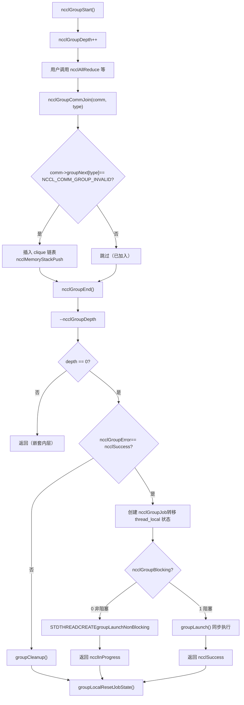
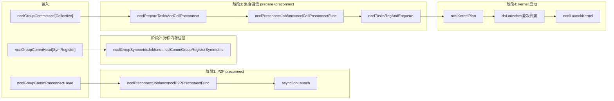

# 第 7 章：タスクスケジューラ：task_sched がマルチ channel と kernel の実行順序をどのように編成するか

# 第7章：タスクスケジューラ：task_sched がマルチ channel と kernel の実行順序をどのように編成するか

前の章では ncclAllReduce を ncclTaskColl まで追跡した——タスク記述オブジェクトはすでに comm->planner に入っている。しかしタスク記述は「作業指示書」に過ぎず、まだ GPU 上で実際に動く kernel にはなっていない。この章では3つの問題に答える：複数の API 呼び出しはどのようにまとめて送信されるのか？まとめられたタスクはどのように複数の channel に分割されるのか？複数の kernel 間の順序と依存関係は何によって保証されるのか？まず全体的なメンタルモデルを示す。NCCL をレストランに例えよう：ncclGroupStart/ncclGroupEnd は「ショッピングカート」であり、ユーザーはいくつかの料理（複数の集合通信呼び出し）をカートに入れる；ncclGroupEnd は「注文」であり、キッチンが注文に従って料理を作り始める。そして doLaunches は「配膳スケジューラ」であり、どの料理を先に出すか、どの料理を並行して作れるかを決定する。group セマンティクスがなければ、各料理を個別に注文し、キッチンは1品作るたびに火を起こし直す（kernel を起動する）必要があり、オーバーヘッドが膨大になる；doLaunches のラウンドスケジューリングがなければ、マルチ channel の kernel が順不同で起動され、データ依存関係が破壊される。

# 一、Group セマンティクスのグローバル状態：thread_local 変数と「ショッピングカート」モデル

## 直感的モデル

`ncclGroupStart`と`ncclGroupEnd`の間のすべての通信呼び出しは、即座に kernel を起動するのではなく、「蓄積」される。どこに蓄積されるのか？**スレッドローカル（thread_local）**のグローバル変数に蓄積される。なぜ thread_local なのか？NCCL は同一スレッド内の group 呼び出しが直列であると仮定しており、異なるスレッドはそれぞれ独立したショッピングカートを持ち、互いに干渉しない。もしこれらの状態がグローバル変数であって thread_local でなければ、2つのスレッドが同時に`ncclGroupStart`を呼び出すと互いに踏みつけ合い、あるスレッドのタスクが別のスレッドの`ncclGroupEnd`によって送信される——これは致命的である。

## データ構造とメモリレイアウト

まず group のグローバル状態定義を見る。

[FACT:src/group.cc:34-34]

```cpp
thread_local int ncclGroupDepth = 0; // depth of ncclGroupStart nesting
thread_local ncclResult_t ncclGroupError = ncclSuccess;
thread_local struct ncclComm* ncclGroupCommHead[ncclGroupTaskTypeNum] = {nullptr};
thread_local struct ncclComm* ncclGroupCommPreconnectHead = nullptr;
thread_local struct ncclIntruQueue ncclAsyncJobs;
thread_local int ncclGroupBlocking = -1; /* default mode */
```

フィールドごとに分解する：

- **`ncclGroupDepth`**：ネスト深度。`ncclGroupStart`はネスト呼び出しが可能であり（一般的ではないが）、`ncclGroupStart`ごとに1加算し、`ncclGroupEnd`で1減算する。0になったときのみ実際に送信される。これはショッピングカートのネストのようなもの——あるカートの中に子カートを開き、最外層の精算時のみ実際に注文する。
- **`ncclGroupError`**：group 内のいずれかの呼び出しでエラーが発生すると、エラーがここに記録され、`ncclGroupEnd`時に一括処理される。これにより「1回の呼び出しが失敗した後、後続の呼び出しがまだカートに物を追加している」という不整合状態を回避する。
- **`ncclGroupCommHead[ncclGroupTaskTypeNum]`**：タスクタイプ別にグループ化された通信ドメインのリンクリストヘッド。`ncclGroupTaskTypeNum`はタスクタイプの数（集合通信、原始タスク、管理タスク、対称登録など）。各タイプに1つのリンクリストがあり、リンクリストノードは`ncclComm`であり、`comm->groupNext[type]`を介して連結される。なぜタイプ別に分けるのか？タイプによってタスクの送信タイミングと依存関係が異なるため——集合通信タスクは先に preconnect する必要があり、管理タスク（destroy など）は最後に実行する必要がある。
- **`ncclGroupCommPreconnectHead`**：事前接続が必要な通信ドメインのリンクリスト。事前接続とは「事前にネットワーク接続を確立する」ことで、kernel 起動時に接続を確立することによる遅延を回避する。
- **`ncclAsyncJobs`**：非同期タスクキュー。一部のタスク（`ncclCommInitRank`など）は非同期であり、このキューに入れられ、`ncclGroupEnd`時に一括起動される。
- **`ncclGroupBlocking`**：ブロッキングモードフラグ。`-1`は未確定を意味し、`0`は非ブロッキングを意味する。`1`ブロッキングを表す。同じ group 内でブロッキングとノンブロッキングの通信ドメインを混用することは許可されず、そうした場合はエラーとなる。

ここには重要な設計がある：`ncclGroupCommHead`は**配列**であり、各要素は1本の連結リストである。連結リストのノードは`comm->groupNext[type]`によって連結され、独立した連結リストノード構造体は使われない。これはつまり、`ncclComm`構造体の中に`groupNext`配列フィールドをあらかじめ確保しておく必要があることを意味する。この「侵入型連結リスト」の設計により余分なメモリ割り当てを避けられるが、その代償として`ncclComm`構造体が大きくなる。

## シナリオ駆動のステップバイステップ・ウォークスルー

**シナリオ**：ユーザーが`ncclGroupStart()`を呼び出し、その後続けて2回`ncclAllReduce`を呼び出し（それぞれ異なる2つの通信ドメイン commA と commB に対して）、最後に`ncclGroupEnd()`。

**を呼び出す。最初のステップ：`ncclGroupStart`は何をしたか？**

[FACT:src/include/group.h:63-66]

```cpp
inline ncclResult_t ncclGroupStartInternal() {
  ncclGroupDepth++;
  return ncclSuccess;
}
```

極めて単純：深さを1増やすだけ。メモリ割り当てなし、ロックなし、システムコールなし。これが`ncclGroupStart`がほぼゼロオーバーヘッドである理由である。

**2番目のステップ：`ncclAllReduce`が group 内で呼び出されたときに何が起こるか？**

`ncclAllReduce`の内部では`ncclGroupCommJoin(comm, ncclGroupTaskTypeCollective)`が呼び出され、通信ドメインが group の連結リストに追加される。

[FACT:src/include/group.h:80-116]

```cpp
inline void ncclGroupCommJoin(struct ncclComm* comm, int type) {
  if (comm->groupNext[type] == reinterpret_cast(NCCL_COMM_GROUP_INVALID)) {
    // Insert comm into ncclGroupCommHead adjacent to sibling comms. This preserves
    // the users program order yet insures siblings occur consecutively. This
    // is required by doLaunches() in "group.cc".
    struct ncclComm** pp = &ncclGroupCommHead[type];
    while (*pp != nullptr && comm->intraComm0 != (*pp)->intraComm0) pp = &(*pp)->groupNext[type];

    // didn't find its clique, we need to insert it with ascending order based on commHash
    if (*pp == nullptr) {
      pp = &ncclGroupCommHead[type];
      while (*pp != nullptr && (*pp)->commHash commHash) pp = &(*pp)->groupNext[type];
    }
    comm->groupNext[type] = *pp;
    *pp = comm;
    // Comms gets a new memory stack scope upon joining. Each task batched for
    // this comm is allocated there.
    if (type == ncclGroupTaskTypeCollective || type == ncclGroupTaskTypeRawTask) {
      // Initialize planner
      ncclMemoryStackPush(&comm->memScoped);
      ncclKernelPlanner::Peer* tmp = comm->planner.peers;
      ncclIntruQueue* tmpRmaQueues = comm->planner.rmaTaskQueues;
      int numRmaCtx = comm->config.numRmaCtx;
      memset(&comm->planner, 0, sizeof(comm->planner));
      comm->planner.peers = tmp;
      comm->planner.bcast_info.minBcastPeer = INT_MAX;
      comm->planner.bcast_info.maxBcastPeer = INT_MIN;
      comm->planner.rmaTaskQueues = tmpRmaQueues;
      if (comm->planner.rmaTaskQueues != NULL) {
        for (int i = 0; i planner.rmaTaskQueues[i]);
        }
      }
    }
  }
  ncclGroupBlocking = comm->config.blocking;
}
```

このコードにはいくつかの巧妙な点がある：

1. **冪等性チェック**：`if (comm->groupNext[type] == NCCL_COMM_GROUP_INVALID)`は、同じ通信ドメインが同じ group 内で一度だけ追加されることを保証する。もしユーザーが同じ comm に対して2回`ncclAllReduce`を呼び出した場合、2回目は連結リストに重複追加されないが、タスクは`comm->planner`に追加される。

2. **clique ソート**：`intraComm0`は「グローバルエンティティ」の識別子である。複数の通信ドメインが同じグローバルエンティティに属する場合（例えば`ncclCommSplit`によって分割されたものなど）、それらの`intraComm0`は同じであり、1つの clique と呼ばれる。コードはまず`intraComm0`によって clique を見つけ、comm を同じ clique の兄弟ノードの隣に挿入する。clique が見つからない場合は、`commHash`の昇順で挿入する。このソートは、`doLaunches`が clique 内の barrier 同期を正しく処理できるようにするためである。

3. **メモリスタックのスコープ**：`ncclMemoryStackPush(&comm->memScoped)`は、この comm のために group 内に新しいメモリスタックのスコープを割り当てる。この comm のために割り当てられるすべてのタスク（`ncclTaskColl`など）は、このスタックから割り当てられる。`ncclGroupCommLeave`の際には`ncclMemoryStackPop`がすべてのタスクメモリを一括解放する——これは「一括割り当て、一括解放」という古典的な最適化であり、タスクごとに個別に`malloc/free`するオーバーヘッドを避ける。

4. **planner のリセット**：`memset(&comm->planner, 0, sizeof(comm->planner))`は planner をクリアするが、`peers`と`rmaTaskQueues`のポインタは保持する（一時変数に退避し、memset 後に復元する）。なぜ保持するのか？これらは事前に割り当てられた配列であり、毎回再割り当てする必要がないからである。`bcast_info`の min/max は`INT_MAX/INT_MIN`にリセットされ、後続の broadcast タスクのマージ最適化に使用される。

**3番目のステップ：`ncclGroupEnd`は何をしたか？**

[FACT:src/group.cc:1039-1164]

`ncclGroupEndInternal`が核心である。段落ごとに解析する：

[FACT:src/group.cc:1048-1061]

```cpp
if (ncclGroupDepth == 0) {
  WARN("ncclGroupEnd: not in a group call.");
  ret = ncclInvalidUsage;
  goto exit;
}
// ...
if ((--ncclGroupDepth) > 0) goto exit;
```

まず深さをチェックし、その後1減らす。1減らした後もまだ0より大きい場合、まだネストされた内側の group にいることを意味するので、そのまま return し、コミットしない。0まで減った場合のみ続行する。

[FACT:src/group.cc:1063]

```cpp
if ((ret = ncclGroupError) != ncclSuccess) goto fail;
```

group 内でいずれかの呼び出しでエラーが発生した場合、直接 fail のクリーンアップにジャンプする。

[FACT:src/group.cc:1084-1093]

```cpp
NEW_NOTHROW_GOTO(groupJob, ncclGroupJob, ret, fail);
ncclIntruQueueConstruct(&groupJob->asyncJobs);
groupJob->groupRefCount = 0;
groupJob->nonBlockingInit = false;
memcpy(groupJob->groupCommHead, ncclGroupCommHead, sizeof(ncclGroupCommHead));
groupJob->groupCommPreconnectHead = ncclGroupCommPreconnectHead;
groupJob->groupError = ncclSuccess;
groupJob->abortFlag = false;
groupJob->joined = false;
ncclIntruQueueTransfer(&groupJob->asyncJobs, &ncclAsyncJobs);
```

を作成し、thread_local の group 状態を job オブジェクトに「転送」する。`ncclGroupJob`は`ncclIntruQueueTransfer`キュー全体を`ncclAsyncJobs`に転送する。このステップは非常に重要である：thread_local 状態は「一時的」であり、job オブジェクトは「永続的」であり、非同期スレッドが保持できる。`groupJob->asyncJobs`コピー

[FACT:src/group.cc:1095-1147]

```cpp
if (hasCommHead || !ncclIntruQueueEmpty(&groupJob->asyncJobs) || ncclGroupCommPreconnectHead != nullptr) {
  /* make sure ncclGroupBlocking has been set. */
  if (ncclGroupBlocking != 0 && ncclGroupBlocking != 1) {
    WARN("Invalid group blocking state %d", ncclGroupBlocking);
    ret = ncclInternalError;
    goto fail;
  }
  if (ncclGroupBlocking == 0) {
    /* nonblocking group */
    // ... 设置 async error 为 ncclInProgress，创建线程执行 groupLaunchNonBlocking
    groupJob->base.func = groupLaunchNonBlocking;
    STDTHREADCREATE_GOTO(groupJob->base.thread, ncclAsyncJobMain, ret, fail, &groupJob->base);
    groupJob->nonBlockingInit = true;
    ret = ncclInProgress;
  } else {
    /* blocking group */
    int savedDev;
    CUDACHECKGOTO(cudaGetDevice(&savedDev), ret, fail);
    NCCLCHECKGOTO(groupLaunch(&groupJob->base, internalSimInfoPtr), ret, fail);
    CUDACHECKGOTO(cudaSetDevice(savedDev), ret, fail);
    if (simInfo) memcpy((void*)simInfo, (void*)internalSimInfoPtr, realSize);
    delete groupJob;
  }
} else {
  // Free when not needed (single rank case)
  delete groupJob;
}
```

を呼び出し、同期的に完了する。ノンブロッキングモード：スレッドを作成して`groupLaunch`を実行し、即座に`groupLaunchNonBlocking`を返す。ユーザーは後で`ncclInProgress`を通じて進捗を照会する。`ncclCommGetAsyncError`注意すべきは

の保存と復元である：`cudaGetDevice`/`cudaSetDevice`の内部では CUDA デバイスが切り替わる（異なる comm が異なる GPU 上にある可能性があるため）、実行後にユーザーの元のデバイスを復元する。これは「NCCL 内部でデバイスを切り替えた後に戻し忘れる」ことによって、ユーザーの後続の CUDA 呼び出しが誤ったデバイスで実行されるのを防ぐためである。`groupLaunch`設計上の考察と本番環境での落とし穴

## 落とし穴1：ブロッキングとノンブロッキングの通信ドメインの混用

**にはチェックがある：**。`ncclAsyncLaunch`コピー

[FACT:src/group.cc:55-64]

```cpp
/* check if there are blocking and nonblocking comms at the same time in group. */
if (comm->destroyFlag) {
  ncclGroupBlocking = 1;
} else if (ncclGroupBlocking == -1) {
  /* first met communicator */
  ncclGroupBlocking = comm->config.blocking;
} else if (ncclGroupBlocking != comm->config.blocking) {
  WARN("Blocking and nonblocking communicators are not allowed in the same group.");
  ret = ncclInvalidArgument;
}
```

が同期的に返すべきか`ncclGroupEnd`を返すべきか判断できなくなる。本番環境では、ユーザーが誤ってブロッキングとノンブロッキングの comm を同じ group に入れた場合、`ncclInProgress`を受け取るが、この時点で group 状態はすでに汚染されており、再度`ncclInvalidArgument`する必要がある。`ncclGroupStart`。

**落とし穴2：`ncclGroupError`の伝播**。もし group 内のいずれかの呼び出しが失敗した場合、`ncclGroupError`が設定され、`ncclGroupEnd`は fail 分岐にジャンプして`groupCleanup`。`groupCleanup`を実行する。`ncclGroupStart`はすべての comm を走査し、planner 内の plan メモリを解放し、planner をリセットし、rawTaskQueue をクリーンアップする。もしこのステップが完全に行われないと、次回の

[FACT:src/group.cc:514-607]

```cpp
static void groupCleanup(struct ncclComm** groupCommHeadPtr,
                         struct ncclIntruQueue* asyncJobsPtr,
                         ncclResult_t error) {
  struct ncclComm* comm;
  for (int type = 0; type groupNext[type];
      (void)ncclGroupCommLeave(comm, type);
      // We don't know if preconnect succeeded or happened at all, so clear
      // the flags that let `taskAppend()` skip over checking if preconnect
      // is needed.
      if (type == ncclGroupTaskTypeCollective || type == ncclGroupTaskTypeRawTask) {
        comm->preconnectNext = reinterpret_cast(0x1);
        for (int i = 0; i nRanks; i++) {
          comm->connectSend[i] = 0UL;
          comm->connectRecv[i] = 0UL;
        }
        // Reclaim abandoned kernel plan memory.
        while (!ncclIntruQueueEmpty(&comm->planner.planQueue)) {
          struct ncclKernelPlan* plan = ncclIntruQueueDequeue(&comm->planner.planQueue);
          if (!plan->persistent) {
            while (!ncclIntruQueueEmpty(&plan->proxyOpQueue)) {
              struct ncclProxyOp* pxop = ncclIntruQueueDequeue(&plan->proxyOpQueue);
              ncclMemoryPoolFree(&comm->memPool_ncclProxyOp, pxop);
            }
            ncclMemoryPoolFree(&comm->memPool_ncclKernelPlan, plan);
          }
        }
        // Reset comm->planner to empty.
        // ...
      }
      // ...
    }
  }
  // ...
}
```

コピー`comm->preconnectNext = reinterpret_cast<struct ncclComm*>(0x1)`の`0x1`の行に注意。これは「センチネル値」であり、「この comm は preconnect をやり直す必要がある」ことを示す。なぜか？cleanup 時に preconnect が成功したかどうかわからないため、次回強制的に再チェックするからである。`ncclGroupCommPreconnect`この値は非常に巧妙である——有効なポインタではないが、「未初期化」マーカーとして使用できる。`if (comm->preconnectNext == reinterpret_cast<struct ncclComm*>(0x1))`では

---

# をチェックして、preconnect 連結リストに追加する必要があるかどうかを判断する。`ncclPrepareTasks`二、タスク準備：

## がどのようにタスク記述をスケジューラブルユニットに変換するか

`ncclPrepareTasks`これは「下ごしらえ」の段階です。ショッピングカートに入っている食材（タスク記述）はまだ生の状態で、まず洗って切って準備する（アルゴリズム、プロトコル、channel 分割を決定する）必要があり、それから初めて鍋に入れる（kernel を起動する）ことができます。このステップを飛ばして直接 kernel を起動すると、kernel はデータをどう分割し、どの経路を通るかを知らないため、即座にクラッシュします。

## シナリオ駆動の Step-by-Step Walkthrough

`ncclPrepareTasks`ここで`groupLaunchLegacy`の中で呼び出されます：

[FACT:src/group.cc:705-746]

```cpp
static ncclResult_t ncclPrepareTasksAndCollPreconnect(
  struct ncclComm* comm, ncclSimInfo_t* simInfo,
  struct ncclIntruQueue* asyncCollJobs) {
  if (ncclParamSingleProcMemRegEnable()) {
    // 单进程内存注册模式：把 prepare 和 preconnect 合并成一个异步 job
    struct ncclPrepareTasksAndCollPreconnectJob* job;
    NEW_NOTHROW(job, ncclPrepareTasksAndCollPreconnectJob);
    job->base.func = ncclPrepareTasksAndCollPreconnectFunc;
    // ...
    ncclIntruQueueEnqueue(asyncCollJobs, &job->base);
  } else {
    bool needConnect = false;
    bool algoNeedConnect[NCCL_NUM_ALGORITHMS];
    memset(algoNeedConnect, 0, sizeof(bool) * NCCL_NUM_ALGORITHMS);

    CUDACHECK(cudaSetDevice(comm->cudaDev));
    NCCLCHECK(ncclPrepareTasks(comm, algoNeedConnect, &needConnect, simInfo));

    if (comm->cuMemSupport && needConnect) {
      // 创建 preconnect job
      struct ncclPreconnectJob* job;
      NEW_NOTHROW(job, ncclPreconnectJob);
      job->base.func = ncclCollPreconnectFunc;
      // ...
      ncclIntruQueueEnqueue(asyncCollJobs, &job->base);
    }
  }
  return ncclSuccess;
}
```

`ncclPrepareTasks`の出力は二つあります：`algoNeedConnect`配列（どのアルゴリズムが接続を確立する必要があるか）と`needConnect`フラグ（接続が必要かどうか）。もし`needConnect`が真で cuMem をサポートしていれば、preconnect job を作成して非同期で実行します。

`ncclPrepareTasks`内部で何をしているのか？それは`comm->planner`内のタスクを走査し、各タスクに対してアルゴリズムとプロトコルを決定し、その後`taskAppend`を呼び出してタスクを planner の plan に追加します。この部分のロジックは前章で展開済みなので、ここでは繰り返しません。

重要なポイント：`ncclPrepareTasks`は**comm ごとに個別に呼び出される**のに対し、preconnect は**clique ごとにバッチ実行される**のはなぜか？`groupLaunchLegacy`内のコメントを見てください：

[FACT:src/group.cc:818-834]

```cpp
do {
  // We need to preconnect connections for collectives clique by clique to avoid
  // race condition for split shared comms which can connect the same connections
  // at the same time.
  comm = cliqueHead;
  do {
    NCCLCHECKGOTO(ncclPrepareTasksAndCollPreconnect(comm, simInfo, &asyncCollJobs), ret, fail);
    comm = comm->groupNext[ncclGroupTaskTypeCollective];
  } while (comm != nullptr && comm->intraComm0 == cliqueHead->intraComm0);
  // connect
  NCCLCHECKGOTO(asyncJobLaunch(&asyncCollJobs, groupAbortFlag), ret, fail);
  // ...
  cliqueHead = comm;
} while (cliqueHead != nullptr);
```

コメントには明確に書かれています：**clique ごとに個別に preconnect することで、split shared comms が同時に同じ接続グループに接続して競合状態を引き起こすのを避ける**。もし二つの comm が同じ親 comm から split されたものであれば、それらはいくつかの接続を共有している可能性があります。もし並行して preconnect すると、二つのスレッドが同時に同じ接続を確立しようとし、重複接続や接続状態の不整合を引き起こす可能性があります。clique ごとに直列実行することで、同時刻に一つの clique だけが接続を確立していることを保証します。

## 並行制御と低レベル相互作用

`asyncJobLaunch`は非同期タスク起動の中核です：

[FACT:src/group.cc:609-678]

```cpp
static ncclResult_t asyncJobLaunch(struct ncclIntruQueue* asyncJobsMain,
                                   volatile bool* groupAbortFlag) {
  ncclResult_t ret = ncclSuccess;
  bool jobsDone = false;
  bool errorJobAbortFlag = false;

  if (!ncclIntruQueueEmpty(asyncJobsMain)) {
    struct ncclAsyncJob* job = ncclIntruQueueHead(asyncJobsMain);
    if (job->next == nullptr) {
      // 只有一个 job，直接在当前线程执行，避免线程创建开销
      job->isThreadMain = true;
      ncclAsyncJobMain(job);
      job->state = ncclGroupJobJoined;
      return job->result;
    }
    // 多个 job，每个创建一个线程
    do {
      STDTHREADCREATE(job->thread, ncclAsyncJobMain, job);
      job = job->next;
    } while (job != nullptr);

    do {
      jobsDone = true;
      job = ncclIntruQueueHead(asyncJobsMain);
      do {
        ncclGroupJobState_t state = COMPILER_ATOMIC_LOAD(&job->state, std::memory_order_acquire);
        if (state == ncclGroupJobRunning) {
          jobsDone = false;
        } else if (state == ncclGroupJobDone) {
          int err;
          if ((err = ncclThreadJoin(job->thread)) != ncclSuccess) {
            WARN("asyncJobLaunch: failed to join thread for job");
            ret = ncclSystemError;
          }
          job->state = ncclGroupJobJoined;
          if (job->result != ncclSuccess && ret == ncclSuccess) {
            ret = job->result;
            errorJobAbortFlag = true;
          }
        } else {
          // safety check
          if (state != ncclGroupJobJoined) {
            WARN("Async job state is %d, expected %d", state, ncclGroupJobJoined);
            if (ret == ncclSuccess) ret = ncclInternalError;
            errorJobAbortFlag = true;
          }
        }

        if (!job->destroyFlag &&
            (COMPILER_ATOMIC_LOAD(groupAbortFlag, std::memory_order_acquire) || errorJobAbortFlag == true)) {
          COMPILER_ATOMIC_STORE(job->abortFlag, uint32_t(1), std::memory_order_release);
          COMPILER_ATOMIC_STORE(job->abortFlagDev, uint32_t(1), std::memory_order_release);
          if (job->childAbortFlag) {
            COMPILER_ATOMIC_STORE(job->childAbortFlag, uint32_t(1), std::memory_order_release);
            COMPILER_ATOMIC_STORE(job->childAbortFlagDev, uint32_t(1), std::memory_order_release);
          }
        }

        job = job->next;
      } while (job != nullptr);
      // Let preconnect threads progress.
      if (jobsDone == false) std::this_thread::sleep_for(std::chrono::microseconds(1));
    } while (jobsDone == false);

    if (ret != ncclSuccess) goto fail;
  }

exit:
  return ret;
fail:
  goto exit;
}
```

このコードにはいくつかの重要な設計があります：

1. **単一 job 最適化**：もしキューに job が一つだけなら、スレッドを作成せず、現在のスレッドで直接実行します。これによりスレッド作成と join のオーバーヘッドを避けられます。単一 comm の group では、これが一般的なケースです。

2. **アトミック状態機械**：`job->state`はアトミック変数で、三つの状態があります：`ncclGroupJobRunning`、`ncclGroupJobDone`、`ncclGroupJobJoined`。ワーカースレッドは実行完了後に`COMPILER_ATOMIC_STORE(..., std::memory_order_release)`を使って`Done`に設定します；メインスレッドは`COMPILER_ATOMIC_LOAD(..., std::memory_order_acquire)`で読み取ります。release/acquire のペアにより、ワーカースレッドのすべてのメモリ書き込みがメインスレッドに可視であることが保証されます。

3. **ビジーウェイト + マイクロスリープ**：メインスレッドはすべての job の状態をポーリングし、まだ実行中の job があれば、`sleep_for(1us)`後にポーリングを続けます。なぜ条件変数ではなく 1 マイクロ秒なのでしょうか？preconnect は短いタスク（通常数十マイクロ秒から数ミリ秒）であり、条件変数の起床オーバーヘッドがビジーウェイトよりも大きくなる可能性があるからです。1 マイクロ秒のスリープにより、純粋なスピンによる CPU 浪費を避けられます。

4. **エラー伝播と abort**：もしどれかの job が失敗すると、`errorJobAbortFlag`が設定され、後続のすべての job の`abortFlag`がアトミックに 1 に設定されます。ワーカースレッドは実行中に`abortFlag`をチェックし、abort されたことを検出すると早期終了します。これは「高速失敗」メカニズムであり、一つの job が失敗した後に他の job がまだ無駄に走り続けるのを避けます。

## Mermaid 図：group 提交の制御フロー



---

# 三、`doLaunches`：マルチ channel マルチ kernel のラウンドスケジューリング

## 直感的モデル

`doLaunches`は「配膳スケジューラー」です。厨房（GPU）には複数のコンロ（channel）があり、各料理（kernel plan）は順番に提供される必要があります。しかし異なる comm の料理は並行して提供できるかもしれませんし、同じ comm の料理は必ず順番に提供される必要があります。スケジューラーは以下を保証する必要があります：同じ clique 内の comm は同期して進行し（barrier を使用）、異なる clique 間は独立して進行できる。

## データ構造とメモリレイアウト

`doLaunches`の中核データ構造は`ncclKernelPlan`と`comm->planner.unlaunchedPlansHead`。

[FACT:src/group.cc:427-503]

```cpp
ncclResult_t doLaunches(struct ncclComm* head, int taskType) {
  ncclResult_t result = ncclSuccess;
  struct ncclComm* cliqueHead = head;
  struct ncclComm* cliqueNextHead;
  bool useBarrier = ncclParamLaunchMode == ncclLaunchModeGroup;
  // This outer loop iterates over cliques of comms which are siblings of the
  // same global entity. We calculate a clique as all comms which have the same
  // `intraComm0` value.
  do {
    struct ncclComm* comm = cliqueHead;
    bool capturingYes = false, capturingNo = false;
    do {
      (ncclCudaGraphValid(comm->planner.capturingGraph) ? capturingYes : capturingNo) = true;
      CUDACHECKGOTO(cudaSetDevice(comm->cudaDev), result, failure);
      NCCLCHECKGOTO(ncclLaunchPrepare(comm), result, failure);
      if (useBarrier) ncclCommIntraBarrierIn(comm, 1);
      comm = comm->groupNext[taskType];
    } while (comm != nullptr && comm != reinterpret_cast(NCCL_COMM_GROUP_INVALID) &&
             comm->intraComm0 == cliqueHead->intraComm0);
    cliqueNextHead = comm;

    if (capturingYes && capturingNo) {
      // We have entered barriers but are aborting without leaving them. Thus
      // these comms are permanently trashed. We need a good mechanism for
      // tracking and reporting that.
      WARN("Either none or all communicators in a ncclGroup() can be CUDA graph captured.");
      result = ncclInvalidUsage;
      goto failure;
    }

    while (true) {
      // Iterate rounds of launches for clique.
      bool moreRounds = false;
      comm = cliqueHead;
      do {
        // Iterate clique members.
        struct ncclComm* next = comm->groupNext[taskType];
        if (useBarrier) {
          // Barrier reduction result tells us if this was the final round.
          moreRounds = 0 != ncclCommIntraBarrierOut(comm);
        } else {
          moreRounds |= comm->planner.unlaunchedPlansHead != nullptr;
        }
        if (moreRounds) {
          // Pop next unlaunched kernel
          struct ncclKernelPlan* plan = comm->planner.unlaunchedPlansHead;
          if (plan != nullptr) {
            comm->planner.unlaunchedPlansHead = plan->next;
            CUDACHECKGOTO(cudaSetDevice(comm->cudaDev), result, failure);
            NCCLCHECKGOTO(ncclLaunchKernelBefore_NoUncapturedCuda(comm, plan), result, failure);
            if (plan->isCeColl) {
              NCCLCHECKGOTO(ncclLaunchCeColl(comm, plan), result, failure);
            } else if (plan->isRma) {
              NCCLCHECKGOTO(ncclLaunchRma(comm, plan), result, failure);
            } else {
              NCCLCHECKGOTO(ncclLaunchKernel(comm, plan), result, failure);
            }
          }
          // Barrier reduction input indicates if we require further rounds.
          if (useBarrier) ncclCommIntraBarrierIn(comm, comm->planner.unlaunchedPlansHead != nullptr ? 1 : 0);
          if (plan != nullptr) {
            NCCLCHECKGOTO(ncclLaunchKernelAfter_NoCuda(comm, plan), result, failure);
          }
        } else {
          // Final round.
          CUDACHECKGOTO(cudaSetDevice(comm->cudaDev), result, failure);
          NCCLCHECKGOTO(ncclLaunchFinish(comm), result, failure);
        }
        comm = next;
      } while (comm != reinterpret_cast(NCCL_COMM_GROUP_INVALID) && comm != cliqueNextHead);
      if (!moreRounds) break;
    }
    cliqueHead = cliqueNextHead;
  } while (cliqueHead != nullptr && cliqueHead != reinterpret_cast(NCCL_COMM_GROUP_INVALID));
failure:
  return result;
}
```

## シナリオ駆動の Step-by-Step Walkthrough

**シナリオ**：二つの comm（commA と commB）が同じ clique に属し（`intraComm0`が同じ）、各 comm には 3 つの kernel plan が起動待ちです。

**第一層ループ：clique の走査**

外側の`do-while`はすべての clique を走査します。`cliqueHead`は現在の clique の最初の comm です。内側の`do-while`は clique 内のすべての comm を走査します（`comm->intraComm0 == cliqueHead->intraComm0`）。

各 comm に対して：

- `cudaSetDevice(comm->cudaDev)`：その comm に対応する GPU に切り替えます。
- `ncclLaunchPrepare(comm)`：起動準備、CUDA ストリームの設定、リソースのチェックなどを含みます。
- `ncclCommIntraBarrierIn(comm, 1)`：barrier に入り、初期値は 1 です。

**第二層ループ：ラウンドスケジューリング**

`while (true)`ループは「ラウンド」を実行します。各ラウンドで、clique 内の各 comm が一つの kernel plan を起動します。

鍵は`moreRounds`の計算にあります：

- **barrier モードあり**（`useBarrier == true`）：`moreRounds = 0 != ncclCommIntraBarrierOut(comm)`。`ncclCommIntraBarrierOut`は**comm 間の barrier リダクション操作**です。それは clique 内のすべての comm が`ncclCommIntraBarrierIn`を呼び出すのを待ち、その後すべての入力値のリダクション結果（ここでは論理和）を返します。もしどれかの comm にまだ起動されていない plan があれば、リダクション結果は 1 となり、`moreRounds`は true で、次のラウンドに進みます。もしすべての comm に未起動の plan がなければ、リダクション結果は 0 となり、`moreRounds`は false で、final round に入ります。
- **barrier なしモード**：`moreRounds |= comm->planner.unlaunchedPlansHead != nullptr`。各commに未起動のplanがまだあるかを直接確認する。ここで使われているのは`|=`、1つでもplanを持つcommがあれば、`moreRounds`はtrueになる。

なぜbarrierが必要か？clique内のcommは「兄弟」であり、GPUリソースやネットワーク接続を共有している可能性がある。あるcommが3つのkernelを起動し、別のcommが1つしか起動していない場合、先に起動し終えたcommは`ncclLaunchFinish`に入り、リソースを解放するが、もう一方のcommはまだそのリソースを使っているため、use-after-freeが発生する。barrierはclique内のすべてのcommが同期的に進むことを保証する。つまり、全員が第Nラウンドを起動するか、全員がfinal roundに入るかのどちらかである。

**kernel起動分岐**

[FACT:src/group.cc:477-483]

```cpp
if (plan->isCeColl) {
  NCCLCHECKGOTO(ncclLaunchCeColl(comm, plan), result, failure);
} else if (plan->isRma) {
  NCCLCHECKGOTO(ncclLaunchRma(comm, plan), result, failure);
} else {
  NCCLCHECKGOTO(ncclLaunchKernel(comm, plan), result, failure);
}
```

3種類のplanタイプ：

- `isCeColl`：CollNet集合通信（NICオフロードで集合通信を行う）。
- `isRma`：RMA（Remote Memory Access）タスク。
- デフォルト：通常のGPU kernel。

タイプごとに起動関数は異なるが、いずれも「Before -> Launch -> After」のパターンに従う：

- `ncclLaunchKernelBefore_NoUncapturedCuda`：起動前の準備（kernelパラメータの設定、デバイスへのアップロードなど）。
- `ncclLaunchKernel`：実際のkernel起動（`cudaLaunchKernel`）。
- `ncclLaunchKernelAfter_NoCuda`：起動後のクリーンアップ（状態の更新、一時リソースの解放）。

**Final round**

`moreRounds`がfalseの場合、`ncclLaunchFinish(comm)`を実行する。このステップでは最終的なクリーンアップを行う：planメモリの解放、comm状態の更新、proxyスレッドへの通知など。

## 並行制御とハードウェアとの相互作用

`ncclCommIntraBarrierIn/Out`はclique内のcommの同期プリミティブである。その実装にはアトミック操作とスピンウェイトが関わる。`In`は値を共有メモリに書き込み、`Out`はすべてのcommが書き込むのを待ってからリダクション結果を読み取る。このbarrierは**プロセス間**のものであり（commが異なるプロセスにある場合）、内部的には共有メモリやネットワークを使用する可能性がある。

なぜ単純な「すべてのcommにplanがまだあるかを確認する」ではなくbarrierを使うのか？「確認」は非アトミックだからである：commAが確認したときcommBにはまだplanがあり、commAは続行を決める。しかしcommBはcommAの確認直後に最後のplanを起動し終えてfinal roundに入る。commAはまだkernelを起動しているのに、commBはすでに共有リソースを解放している。barrierは「確認」と「決定」を1つのアトミック操作にすることで、この競合を排除する。

## 本番環境の落とし穴回避ガイド

**落とし穴1：CUDA graph captureの混用**。

[FACT:src/group.cc:448-455]

```cpp
if (capturingYes && capturingNo) {
  // We have entered barriers but are aborting without leaving them. Thus
  // these comms are permanently trashed. We need a good mechanism for
  // tracking and reporting that.
  WARN("Either none or all communicators in a ncclGroup() can be CUDA graph captured.");
  result = ncclInvalidUsage;
  goto failure;
}
```

clique内の一部のcommがCUDA graph captureモードにあり、別の一部がそうでない場合、直ちにエラーとなる。コメントには「these comms are permanently trashed」とある——barrierに入ったが抜けていないため、これらのcommのbarrier状態は永遠に一致せず、以降使用できなくなる。これは**回復不能なエラー**であり、ユーザーは通信ドメインを再構築しなければならない。本番環境でユーザーがgraph captureと非captureのcommを混用すると、`ncclInvalidUsage`を受け取るが、さらに深刻なのはcommがすでに破損していることである。

**落とし穴2：`useBarrier`の設定依存**。`useBarrier = ncclParamLaunchMode == ncclLaunchModeGroup`。ユーザーが`NCCL_LAUNCH_MODE=GROUP`を設定した場合、barrierパスを通る。そうでなければ非barrierパスを通る。非barrierパスでは、`moreRounds`は`|=`で累積するが、各commが独立に判断する。commAにはまだplanがあるがcommBにはない場合、commBはfinal roundに入り`ncclLaunchFinish`を実行するが、commAはまだkernelを起動している。これは一部のシナリオでは安全である（comm間に共有リソースがない）が、proxyスレッドやネットワーク接続を共有している場合は問題を引き起こす可能性がある。そのため、デフォルトではbarrierモードの使用が推奨される。

---

# 四、`groupLaunchLegacy`の完全な実行チェーン

## シナリオ駆動のStep-by-Step Walkthrough

`groupLaunchLegacy`はブロッキングモードでの完全なコミットフローである。順番に実行する：

**フェーズ1：P2P preconnect**

[FACT:src/group.cc:756-774]

```cpp
if (!simInfo && groupCommPreconnectHeadMain != nullptr) {
  struct ncclComm* comm = groupCommPreconnectHeadMain;
  do {
    struct ncclPreconnectJob* job;
    NEW_NOTHROW_GOTO(job, ncclPreconnectJob, ret, fail);
    job->base.func = ncclP2PPreconnectFunc;
    // ...
    ncclIntruQueueEnqueue(asyncJobsMain, (struct ncclAsyncJob*)job);
    struct ncclComm* next = comm->preconnectNext;
    comm->preconnectNext = reinterpret_cast(0x1);
    comm = next;
  } while (comm != nullptr);
}
NCCLCHECKGOTO(asyncJobLaunch(asyncJobsMain, groupAbortFlag), ret, fail);
```

preconnectが必要な各commに対して`ncclP2PPreconnectFunc`ジョブを作成し、その後一括起動する。`ncclP2PPreconnectFunc`は内部的に`ncclTransportP2pSetup`を呼び出してP2P接続を確立する。

**フェーズ2：対称メモリ登録**

[FACT:src/group.cc:778-808]

```cpp
// only loop through sym alloc and register tasks
for (int type = ncclGroupTaskTypeSymRegister; type destroyFlag && job->comm && !job->comm->config.blocking &&
      groupCommHeadMain[ncclGroupTaskTypeCollective] == nullptr) {
    (void)ncclCommSetAsyncError(job->comm, ret);
  }
  if (job->destructor) job->destructor((void*)job);
}

for (int type = 0; type groupNext[type];
    // Poll for callbacks sent to us from other threads.
    if (comm->reclaimSteps == GROUP_MAX_RECLAIM_STEPS) {
      NCCLCHECKGOTO(ncclCommPollCallbacks(comm, /*waitSome=*/false), ret, fail);
      comm->reclaimSteps = 0;
    } else {
      comm->reclaimSteps++;
    }
    (void)ncclGroupCommLeave(comm, type);
    if (!comm->config.blocking) {
      (void)ncclCommSetAsyncError(comm, ret);
    }
    groupCommHeadMain[type] = next;
  }
}
```

非同期ジョブをクリーンアップし、その後すべてのcommを走査して`ncclGroupCommLeave`を呼び出す。なお`reclaimSteps`のカウントに注意：毎`GROUP_MAX_RECLAIM_STEPS`（10）回の group 呼び出しごとに、callbacks を一度ポーリングします。これは毎回の group で callbacks をポーリングするオーバーヘッドを避けつつ、callbacks が無限に蓄積しないことを保証するためです。

## Mermaid 図：`groupLaunchLegacy`のデータフロー



---

# 五、`groupLaunchEnqueueRearch`：新アーキテクチャのスケジューラ

## 直感モデル

`groupLaunchEnqueueRearch`は NCCL が開発中の新しいスケジューリングアーキテクチャです。タスクの準備、スケジューリング、起動をより細かい段階に分け、非同期 job キューで管理します。現在、スケジューラとランチャーのモジュールは「未実装」で、legacy の`doLaunches`。

[FACT:src/group.cc:991-996]

```cpp
// Schedule and launch tasks. Scheduler and launcher module of the enqueue framework
// is not yet implemented and falls back to the legacy launcher: a single phased
// doLaunches over the clique, run here on the user's thread.
if (!simInfo && groupCommHeadMain[ncclGroupTaskTypeRawTask] != nullptr) {
  NCCLCHECKGOTO(doLaunches(groupCommHeadMain[ncclGroupTaskTypeRawTask], ncclGroupTaskTypeRawTask), ret, fail);
}
```

新アーキテクチャの実行フロー：

1. **タスクの管理**：`ncclMgmtTaskJobFunc`が`mgmtTaskQueue`内のタスク（例：destroy）を処理します。

2. **タスクの準備**：`ncclTaskPrepareJobFunc`が`ncclTaskPrepare`。

3. **を呼び出します**スケジューリングと起動`doLaunches`。

：`ncclGroupJobLaunch`にフォールバックします`asyncJobLaunch`新アーキテクチャでは

[FACT:src/group.cc:113-116]

```cpp
} else {
  /* safety check */
  assert(state == ncclGroupJobJoined);
}
```

を置き換え、より厳密な状態チェックを追加しています：`WARN`コピー`assert`legacy バージョンでは`assert`ではなく

## を使用し、新アーキテクチャでは

を使用します。これは新アーキテクチャが状態機械の正確性に対してより高い要求を持っていることを示しています。**設計上の考察**新アーキテクチャの動機は`groupLaunchLegacy`疎結合化

`ncclParamEnqueueRearchEnable()`：legacy の

[FACT:src/group.cc:1031-1033]

```cpp
static ncclResult_t groupLaunch(struct ncclAsyncJob* job_, ncclSimInfo_t* simInfo = NULL) {
  return ncclParamEnqueueRearchEnable() ? groupLaunchEnqueueRearch(job_, simInfo) : groupLaunchLegacy(job_, simInfo);
}
```

が新アーキテクチャと legacy のどちらを使用するかを制御します：`NCCL_ENQUEUE_REARCH_ENABLE`コピー

---

# ユーザーは環境変数

## で切り替えられます。本番環境ではデフォルト（legacy）を維持することを推奨します。新アーキテクチャはまだ開発中だからです。

六、非ブロッキング group と非同期エラー処理`ncclGroupJobComplete`シナリオ駆動の Step-by-Step Walkthrough`ncclGroupJobAbort`：

[FACT:src/group.cc:1166-1190]

```cpp
ncclResult_t ncclGroupJobComplete(struct ncclGroupJob* groupJob) {
  ncclResult_t ret = ncclSuccess;
  if (groupJob && groupJob->nonBlockingInit) {
    if (!COMPILER_ATOMIC_EXCHANGE(&groupJob->joined, true, std::memory_order_acq_rel)) {
      ret = ncclAsyncJobComplete(&groupJob->base);
    }
    if (ncclAtomicRefCountDecrement(&groupJob->groupRefCount) == 0) {
      delete groupJob;
    }
  }
  return ret;
}

ncclResult_t ncclGroupJobAbort(struct ncclGroupJob* groupJob) {
  if (groupJob && groupJob->nonBlockingInit) {
    if (!COMPILER_ATOMIC_EXCHANGE(&groupJob->joined, true, std::memory_order_acq_rel)) {
      COMPILER_ATOMIC_STORE(&groupJob->abortFlag, true, std::memory_order_relaxed);
      ncclAsyncJobComplete(&groupJob->base);
    }
    if (ncclAtomicRefCountDecrement(&groupJob->groupRefCount) == 0) {
      delete groupJob;
    }
  }
  return ncclSuccess;
}
```

と

1. **`joined`コピー**重要な設計：`COMPILER_ATOMIC_EXCHANGE`アトミックフラグ`ncclGroupJobComplete`：

2. **を使用して、1 つのスレッドだけが join ロジックを実行できることを保証します。2 つのスレッドが同時に**：`groupRefCount`を呼び出した場合、1 つだけが実際に join し、もう 1 つは直接スキップします。これにより double-join を防ぎます。`ncclGroupEndInternal`参照カウント

[FACT:src/group.cc:1108-1111]

```cpp
if (job->comm->groupJob == NULL) {
  job->comm->groupJob = groupJob;
  groupJob->groupRefCount++;
}
```

内で参照カウントを増やします：`ncclGroupJobComplete`コピー`ncclGroupJobAbort`すべての comm が

3. **または**：`ncclGroupJobAbort`を呼び出し、参照カウントが 0 になったときのみ、group job が削除されます。これにより group job のライフサイクルが関連するすべての comm をカバーすることが保証されます。`abortFlag`abort セマンティクス`abortFlag`はまず

## を設定し、その後 join します。ワーカースレッドは実行中に

**をチェックし、abort されたことを検出すると早期に終了します。これは「協調的キャンセル」です——スレッドを強制終了するのではなく、スレッド自身がフラグをチェックして終了します。**本番環境の落とし穴ガイド`ncclInProgress`落とし穴 3：非ブロッキング group のエラークエリ`ncclCommGetAsyncError`。非ブロッキング group は`ncclInProgress`を返し、ユーザーは`ncclCommDestroy`を通じて進捗をクエリする必要があります。ユーザーがクエリを忘れて次の通信を直接呼び出すと、`comm->groupJob`エラーに遭遇する可能性があります。さらに深刻なのは、group job がまだ実行中にユーザーが`ncclCommDestroy`を呼び出すと、use-after-free が発生することです。NCCL は`comm->groupJob`ポインタと参照カウントによってこれを防ぎます：

**はまず`ncclGroupJobComplete`をチェックし、未完了の group job があれば待機するかエラーを報告します。**落とし穴 4：`ncclAsyncJobComplete`の戻り値`ncclGroupJobComplete`。group job の実行が失敗した場合、`ncclSuccess`はエラーコードを返します。しかし`joined`は最初の呼び出しでのみこのエラーコードを返し、以降の呼び出しでは

---

# を返します（

がすでに true だからです）。ユーザーは最初の呼び出しで戻り値をチェックしなければならず、そうでなければエラー情報を失います。

1. **本章のまとめ**：`ncclGroupStart/ncclGroupEnd`この章では、NCCL の「タスク記述」から「kernel 起動」までの完全なスケジューリングチェーンを分解しました：`ncclGroupEnd`Group セマンティクス

2. **は thread_local 変数を通じてタスクを蓄積し、**：`ncclPrepareTasks`時に一括送信します。ブロッキングモードは同期的に実行し、非ブロッキングモードはスレッドを作成して非同期に実行します。`ncclPrepareTasksAndCollPreconnect`タスクの準備

3. **はアルゴリズム/プロトコルを決定し、**：`doLaunches`は clique ごとに preconnect を行い、split comms の競合を避けます。

4. **ラウンドスケジューリング**：`asyncJobLaunch`は clique ごとにグループ化し、barrier で clique 内の comm を同期し、各ラウンドで 1 つの kernel plan を起動し、すべての plan が起動されるまで続けます。

5. **非同期タスク**：`groupLaunchEnqueueRearch`はアトミック状態機械とビジーウェイトで非同期 job を管理し、高速失敗と abort をサポートします。`doLaunches`。

新アーキテクチャ`ncclLaunchKernel`は開発中の新しいスケジューリングフレームワークで、現在は legacy の`ncclKernelPlan`にフォールバックします`DevComm`次の章では kernel 起動の最後の一マイルに入ります：

# がどのように

を GPU 上で実際に実行される kernel に変えるか、そしてデバイス側がどのように`ncclGroupCommJoin`メタデータを読み取るかです。`ncclMemoryStackPush(&comm->memScoped)`本章の考察とセルフチェック

**Q1: もし**：`ncclMemoryStackPush`内の

ここまでで、タスク記述は実行可能な起動計画へと変わった：group セマンティクスは複数の API 呼び出しを一度のコミットに統合し、channel 分割はタスクを複数の実行ストリームに割り当て、doLaunches のラウンドスケジューリングはカーネル間の順序と依存関係を保証する。しかし計画はあくまで計画にすぎない。host 側のタスク記述はどのようにして GPU 上の一つの grid になるのか？次の章では ncclLaunchKernel を深く掘り下げ、パラメータ準備、カーネルバリアントの選択、cudaLaunchKernel 呼び出しを見て、host から device への最後の一跳びを完成させる。
