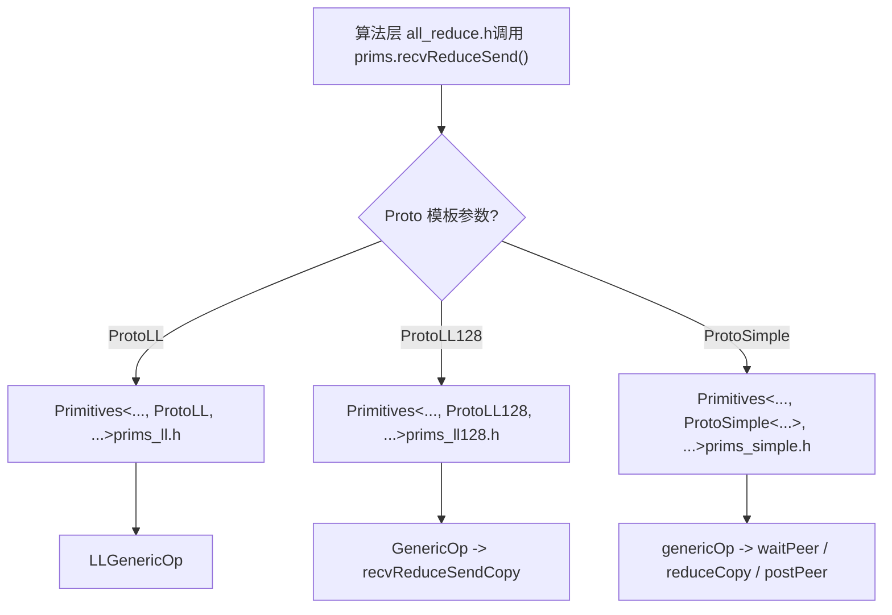
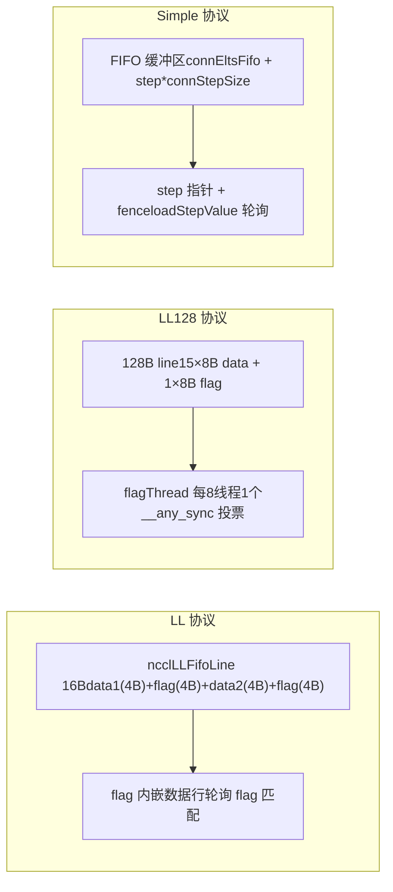

# 第 9 章：デバイス側通信プリミティブ：LL、LL128、Simple の 3 プロトコルにおけるデータ転送実装

前章では、host 側がどのように一度の AllReduce を __global__ kernel に変換するかを追跡し、デバイス側のエントリポイント ncclKernelMain がアルゴリズムとプロトコルに基づいてディスパッチを行うことを確認しました。しかし、ディスパッチは単にツールを選択するだけであり、実際に性能を決定するのはこれらのツールがどのようにデータ転送を実行するかです。本章では、src/device 配下の三つの転送プリミティブ、LL、LL128、Simple を深く掘り下げ、それぞれのデータ転送実装を一つずつ分析し、異なるプロトコルがレイテンシと帯域幅の間でどのようにトレードオフを行っているかを理解します。

# なぜ同じ AllReduce に三つの転送プリミティブが必要なのか

まず直感的なモデルを構築しましょう。パイプライン工場を想像してください。原料（ユーザーデータ）が一端から入り、成品がもう一端から出て、途中にいくつかの工位（rank）があり、互いに半成品を交換する必要があります。半成品を転送する方法は三つあります：

- **LL（Low Latency）**：二人が向かい合ってメモを手渡すように、渡すと同時に相手は「これはあなたへのものだ」と分かり、ハンドシェイクのオーバーヘッドがほぼゼロです。しかしメモは非常に小さく、一度に 8 バイトの有効データしか渡せません。小さいメッセージに適しています。
- **LL128**：メモを 128 バイトの付箋紙に置き換え、一度に 120 バイトの有効データを渡しますが、付箋紙は 16 バイト境界に整列して配置する必要があり、そうでなければまず共有メモリで「再レイアウト」する必要があります。中程度のメッセージに適しています。
- **Simple**：宅配ロッカーのように、まず荷物をロッカー（FIFO バッファ）に入れ、次に「N 番ロッカーに荷物あり」という通知を送ります。ハンドシェイクのオーバーヘッドは大きいですが、一度に多くを運べます。大きいメッセージに適しています。

> **[Design Inference & Architectural Trade-offs]**
> もしプリミティブが一つしかなかったらどうなるでしょうか？LL だけを使うと、大きいメッセージは「各メッセージごとに相手の flag 確認を待つ」ため帯域幅が圧迫されてしまいます。Simple だけを使うと、小さいメッセージは「FIFO 書き込み + 通知送信 + 通知待ち」の固定オーバーヘッドによりレイテンシが爆発します。NCCL の性能曲線が 8KB、128KB 付近で明らかな変曲点を持つ根源はここにあります。

三つのプリミティブは同じテンプレート骨格を共有します`Primitives<T, RedOp, Fan, Direct, Proto, P2p, isNetOffload>`、`Proto`というテンプレートパラメータを通じて三つのバージョンに特化されます[FACT:src/device/primitives.h:117-117]。`ProtoLL`、`ProtoLL128`、`ProtoSimple`三つの構造体はそれぞれプロトコル関連の定数と計算メソッドを持ち[FACT:src/device/primitives.h:25-75]、アルゴリズムコードは`prims.send()`、`prims.recvReduceSend()`のような統一インターフェースを呼び出すだけで、基盤がどのプロトコルであるかを気にしません。



この図は「なぜ同じ AllReduce ロジックに三つの転送プリミティブが必要なのか」を説明しています：アルゴリズム層はプロトコル非依存であり、プロトコルの差異は`Primitives`の三つの特化にカプセル化されています。

# LL：flag をデータ行に埋め込んだゼロハンドシェイク転送

## 直感的モデル

LL の核心思想は：**「データ」と「データが準備できたか」のマークを同じ 16 バイトの読み書きユニットに詰め込む**ことです。受信側は追加の「通知メッセージ」を必要とせず、データ行の flag フィールドをポーリングするだけで、flag が一致すればデータが到着したことを示します。これは手紙を送る際に「受取人の署名」を封筒に直接印刷するようなもので、郵便配達員は署名を見れば配達すべきかどうかが分かり、別に受領書を送る必要がありません。

もしこの設計がなければ、受信側はまず「データが書き込まれた」という通知を待ち、それからデータを読みに行く必要があり、二回のメモリ往復でレイテンシが倍になります。

## データ構造とメモリレイアウト

LL の転送ユニットは`union ncclLLFifoLine`であり、`storeLL`のアセンブリからそのレイアウトが分かります[FACT:src/device/prims_ll.h:154-158]：

```
st.volatile.global.v4.u32 [%0], {%1,%2,%3,%4};
// 写入 4 个 u32：data1, flag, data2, flag
```

一つの`ncclLLFifoLine`は 16 バイトで、配置は`[data1(4B) | flag(4B) | data2(4B) | flag(4B)]`です。有効データは 8 バイト（data1 + data2）のみで、残りの 8 バイトはすべて flag です。これが`ProtoLL::calcBytePerGrain()`が`sizeof(uint64_t)`を返す理由です——「One 16-byte line has 8-bytes of data」[FACT:src/device/primitives.h:55-57]。

主要フィールド（`Primitives`の LL 特化）[FACT:src/device/prims_ll.h:20-42]：

| フィールド | 型 | 役割 |
| --- | --- | --- |
| `recvStep[i]` / `sendStep[i]` | `uint64_t[MaxRecv/MaxSend]` | 各 peer のステップカウント。バッファオフセットと flag 値を決定する |
| `recvBuff[i]` / `sendBuff[i]` | `ncclLLFifoLine*` | 各 peer の FIFO バッファベースアドレスを指す |
| `recvConnHeadPtr` | `volatile uint64_t*` | 受信側の「どこまで消費したか」のグローバルポインタ |
| `sendConnHeadPtr` | `volatile uint64_t*` | 送信側の「対端がどこまで消費したか」のグローバルポインタ |
| `sendConnHeadCache` | `uint64_t` | 前回読んだ head 値をキャッシュし、毎回グローバルメモリを読むのを避ける |

バッファオフセットは`recvOffset(i) = (recvStep[i] % NCCL_STEPS) * stepLines`で計算されます[FACT:src/device/prims_ll.h:44-46]，`NCCL_STEPS`はリングバッファのスロット数、`stepLines`は各スロットの行数です。flag 値は`recvFlag(i) = NCCL_LL_FLAG(recvStep[i] + 1)`で計算されます[FACT:src/device/prims_ll.h:56-58]、`+1`に注意——flag の初期値は 0 なので、最初のステップの flag は 1 でなければ「未書き込み」と区別できません。

## シナリオ駆動 Walkthrough：一回の recvReduceSend

rank 0 が Ring AllReduce で`recvReduceSend`を実行すると仮定します：前の rank からデータを受信し、ローカルデータと reduce し、次の rank に送信します。呼び出しチェーンは`recvReduceSend(inpIx, eltN)` → `LLGenericOp<1, 1, Input, -1>(inpIx, -1, eltN, false)` [FACT:src/device/prims_ll.h:403-405]。

**第一步：送信バッファが利用可能になるのを待つ。** `waitSend`は`sendConnHeadCache + NCCL_STEPS < sendConnHead + 1` [FACT:src/device/prims_ll.h:73-89]をチェックします。意味は：もし対端の消費進捗（head）が私より遅れすぎているなら、リングバッファがほぼ満杯であることを示し、待たなければなりません。`NCCL_STEPS`はバッファの総スロット数、`sendConnHead + 1`は私がまもなく占有するスロットです。待機中は`*sendConnHeadPtr`をポーリングして`checkAbort`キャッシュを更新し、定期的に[FACT:src/device/prims_ll.h:73-89]。

**を呼び出して abort されたかチェックします** `DataLoader::loadBegin`第二步：ローカルデータをロードする。[FACT:src/device/prims_ll.h:200-216]はアライメント問題を処理します`sizeof(T) <= 2`。`u4[0..2]`（例えば half や int8）の場合、ソースアドレスが 4 バイトアライメントでない可能性があるため、まず 4 バイトアライメントで`misalign`に読み込み、`loadFinish`を記録し、その後`__funnelshift_r`内で[FACT:src/device/prims_ll.h:218-225]を使ってバイトレベルのシフトで正しい 64 ビット値を組み立てます

**。これは典型的な「アライメント読み + シフト再構成」テクニックで、非アライメントアクセスの性能ペナルティを回避します。** `readLL`第三步：対端データを読み、flag を待つ。[FACT:src/device/prims_ll.h:108-122]：

```cpp
do {
  asm volatile("ld.volatile.global.v4.u32 {%0,%1,%2,%3}, [%4];" ...);
  if (checkAbort(abort, 1, spins)) break;
} while ((flag1 != flag) || (flag2 != flag));
```

コピー`ld.volatile.global.v4.u32`一度に16バイト（4つのu32）を読み取り、その後2つのflagフィールドが両方とも期待値に等しいかチェックする。`volatile`キーワードは、コンパイラがこの読み取りを最適化で削除したりレジスタにキャッシュしたりしないことを保証する——相手側がいつでも新しいデータを書き込む可能性があるため。2つのflagが両方一致する必要があるのは、書き込み側が`storeLL`一度に4つのu32を書き込み、理論的には2回の8バイト書き込みに分割される可能性があるため、2つのflagが両方一致して初めて16バイトが完全であることが保証される。

**第四ステップ：reduceして送信。**peerDataを受信した後、`applyReduce(redOp, peerData, data)`リダクションを行い[FACT:src/device/prims_ll.h:279]。その後`storeLL(sendPtr(i) + offset, data, sendFlag(i))`結果を送信バッファに書き込み[FACT:src/device/prims_ll.h:295-296]。送信順序に注意：最初に`i=1..MaxSend`（通常はネットワークpeer）を送信し、最後に`i=0`（通常はローカルpeer）を送信する[FACT:src/device/prims_ll.h:291-297]。コメントには明確に書かれている：「Send : inter-node, then intra-node, then local」——遅い方（ネットワーク）を先に送信し、バックグラウンドで飛ばせておき、その後速い方（ローカル）を送信することで、ローカルpeerがネットワークを待たないようにする。

**第五ステップ：stepを進めてpost。** `incRecv(i)`受信ステップをインクリメントし[FACT:src/device/prims_ll.h:91-93]，`postRecv()``recvConnHead`をグローバルポインタに書き戻し[FACT:src/device/prims_ll.h:94-97]、相手側に「このステップを消費した」と通知する。送信側の`incSend`には特別なロジックがあり[FACT:src/device/prims_ll.h:99-106]：

```cpp
if ((sendStep[i] & NCCL_LL_CLEAN_MASK) == NCCL_LL_CLEAN_MASK) {
  for (int o = offset; o  *head) { ... }
}
```

sendrecv の DirectRead モードでは、送信側は受信側がデータを読み終えるまで戻ってはならない。受信側が何らかの理由で tail を進めない場合、送信側はデッドロックする。この待機は`barrier()`の後に行う必要がある。そうでなければ post スレッドと競合する可能性がある。

**落とし穴 3：`roundUp`による step の飛び。** `loadRecvConn`と`loadSendConn`の両方に`step = roundUp(step, SlicePerChunk * StepPerSlice)` [FACT:src/device/prims_simple.h:486, 533]がある。これは step を slice 境界に整列させるが、前の step が整列していない場合、スキップされたスロットが正しく初期化されない。コードは`loadRecvConn`に`*connStepPtr = step`を追加して credit を返却する[FACT:src/device/prims_simple.h:489]。

# 三つのプリミティブの比較と選定



| 次元 | LL | LL128 | Simple |
| --- | --- | --- | --- |
| 有効ペイロード率 | 50% | 93.75% | ~100% |
| 同期方式 | flag 埋め込み、ポーリング | flagThread + warp 投票 | step ポインタ + fence |
| 整列要件 | なし（シフト再構成あり） | 16 バイト | なし |
| 適用メッセージサイズ | 小（< 8KB） | 中（8KB ~ 128KB） | 大（> 128KB） |
| バッファレイアウト | `ncclLLFifoLine[]` | `uint64_t[]`128B line 単位 | `T[]` FIFO |
| Direct サポート | なし（`PrimitivesWithoutDirect`降格） | なし（同左） | 完全サポート |

LL と LL128 はどちらも`PrimitivesWithoutDirect` [FACT:src/device/prims_ll.h:9-10, src/device/prims_ll128.h:13-14]を継承している。なぜなら、それらのバッファレイアウトはピアメモリの直接読み書きをサポートしていないからである。Simple は Direct モードを完全に実装し、P2P 直結と NVLS をサポートする。

# 設計上の考察

> **[Design Inference & Architectural Trade-offs]**
> **なぜ LL の flag は二回繰り返すのか？**GPU のグローバルメモリ書き込みは原子性を保証しないからである。`storeLL`16 バイトを書き込むとき、ハードウェアは 8 バイト書き込み二回に分割する可能性がある。flag が一つだけなら、受信側はデータが半分しか書かれていないのに準備完了と判断するかもしれない。二つの flag はそれぞれ 16 バイトの前半と後半に位置し、両方の書き込みが完了して初めて両方の flag が一致する。

**なぜ Simple は warp を一つ予約するのか？** [FACT:src/device/prims_simple.h:625-626]コメントには「For send operations, we need an extra warp to overlap the threadfence and the copy」とある。`fence_acq_rel_sys()`は高コストな操作であり、全スレッドが fence 完了を待ってから続行すると、大量の時間を浪費する。warp を一つ予約して fence 専用にし、他の warp は次のバッチのデータ転送を続けられる。

> **[Design Inference & Architectural Trade-offs]**
> **なぜ LL128 の step 推進は recvReduceSendCopy 内ではなく GenericOp の末尾にあるのか？**LL128 の転送は warp レベルであり、複数の warp が異なる slice を並行処理する可能性があるからである。もし`recvReduceSendCopy`内で step を推進すると、各 warp が一回ずつ推進し、step が複数回進んでしまう。`GenericOp`の末尾で統一的に推進することで、各 slice が一回だけ進むことを保証する。

# 本章のまとめ

本章では三つの転送プリミティブの実装を深掘りした：

1. **LL**：16 バイトの`ncclLLFifoLine`で flag をデータ行に埋め込み、受信側は flag の一致をポーリングするだけでデータ準備完了を確認できる。有効ペイロード 50%、小メッセージに適する。核心は`readLL`の`ld.volatile.global.v4.u32`と`storeLL`の`st.volatile.global.v4.u32`。

2. **LL128**：flag を 128 バイトごとの最後の 8 バイトに集中させ、有効ペイロードを 93.75% に向上。`flagThread`（8 スレッドごとに 1 つ）で flag をチェックし、`__any_sync`で warp 投票を行う。非整列時は共有メモリで再レイアウトする。

3. **Simple**：FIFO バッファ + step ポインタ通知で大メッセージの高スループットを実現。`flags`ビットフラグで役割をエンコードし、`waitPeer`で step をポーリングし、`postPeer`で step を更新して fence する。Direct モードを完全サポート。

三つのプリミティブは同じテンプレート骨格を共有し、`Proto`テンプレートパラメータで特殊化する。アルゴリズム層は統一インターフェースを呼ぶだけで、下層プロトコルを気にしない。これが「同一の AllReduce ロジックに三つの転送プリミティブが必要な理由」の答えである：異なるメッセージサイズには異なる同期戦略とバッファレイアウトが必要であり、三つのプリミティブはそれぞれ小・中・大メッセージに最適化されている。

# 本章の考察とセルフチェック

Q1: もし`incSend`内の cleanup ロジック（[FACT:src/device/prims_ll.h:99-106]）を削除した場合、どのようなシナリオでデータ破損が発生するか？なぜか？

**参考解析**：cleanup ロジックは`sendStep[i] & NCCL_LL_CLEAN_MASK == NCCL_LL_CLEAN_MASK`時に、slice 全体のすべての行を現在の flag で書き直す（データは 0 埋め）。もし削除すると、step が`NCCL_LL_CLEAN_MASK`境界に回り込んだとき、一部の行の flag がまだ前回の値のままである可能性がある。前回の flag がちょうど今回の受信側が期待する flag と一致すると、受信側はデータが準備完了と誤認し、前回の残留データを読む。これは典型的な ABA 問題である。発生条件は長時間実行（step が`NCCL_LL_CLEAN_MASK`周期を超える）かつ flag がちょうど同じ値に回り込むこと。この種のバグは正確な step 整列が必要なため、再現が極めて困難である。

Q2: Simple プロトコルのデストラクタ内で、NetRegMode での待機（[FACT:src/device/prims_simple.h:794-804]）と DirectRead での待機（[FACT:src/device/prims_simple.h:814-824]）はそれぞれ何を防いでいるのか？どちらかを削除した場合、高並行シナリオで何が起こるか？

**参考解析**：NetRegMode が待機するのは、proxy スレッドが`connFifo[prevStep].size`を -1 に設定することであり、NIC が送信を完了したことを示す。これを削除すると、次の kernel が NIC の DMA 読み取り中の送信バッファを上書きし、NIC がダーティデータを読み取る可能性がある。DirectRead が待機するのは、受信側が tail（`*tail > *head`）を進めることであり、受信側が直接バッファを読み終えたことを示す。これを削除すると、送信側が受信側の読み取り完了前にバッファを上書きし、受信側が古いデータではなく新しいデータを読み取る可能性がある。高並行シナリオでは、これら二つの待機は両方とも必須であり、どちらかを削除するとデータ競合が発生する。違いは、NetRegMode が「NIC 読み取り」を防ぎ、DirectRead が「対向 GPU 読み取り」を防ぐ点である。

Q3: LL128 の`loadRegsBegin`が非アライメント時に共有メモリ再配置（[FACT:src/device/prims_ll128.h:115-141]）を経由する場合、このパスはアライメントパスよりどれだけ遅いか？なぜ NCCL はユーザーバッファが 16 バイトアライメントであることを直接要求しないのか？

**参考解析**：非アライメントパスには三つの追加ステップがある：共有メモリへの書き込み、`__syncwarp()`、共有メモリからの読み取り。共有メモリの帯域幅は高いが、`__syncwarp()`は同期ポイントであり、すべてのスレッドが書き込みを完了するまで warp をブロックする。大まかな推定では、非アライメントパスはアライメントパスより 20-40% 遅く、具体的には共有メモリのバンク競合状況に依存する。NCCL がアライメントを強制しないのは、ユーザーが任意のオフセットのバッファ（例えばテンソルスライス）を渡す可能性があり、強制アライメントは API の柔軟性を制限するからである。NCCL の戦略は「アライメント時は高速パス、非アライメント時は低速パスだが正確性を保証」である。本番環境では、ユーザーはできるだけ 16 バイトアライメントでバッファを割り当て、高速パスを通ることを推奨する。

ここまでで、LL、LL128、Simple の三つのプリミティブのデータ転送メカニズムを把握した。これらは上位アルゴリズムに柔軟な性能調整手段を提供する。次の章では集合通信アルゴリズムカーネルに深く入り、AllReduce、AllGather、ReduceScatter などがこれらのプリミティブをどのように呼び出すか、また Ring、Tree、CollNet などのアルゴリズムがデータフローをどのように組織し、最終的にエンドツーエンドの集合通信を完了するかを見る。
